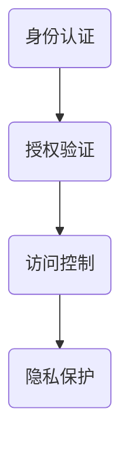
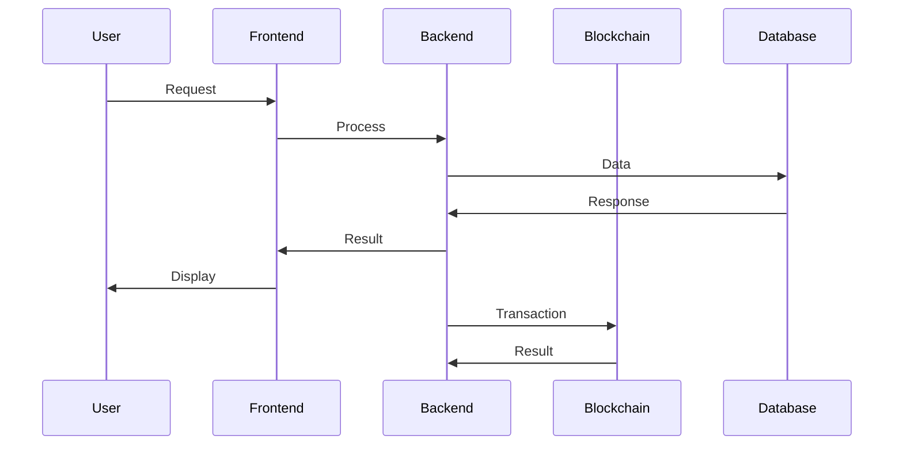

                 

### 文章标题

# 区块链在数字身份自主管理中的应用

---

关键词：区块链，数字身份，自主管理，隐私保护，去中心化

摘要：本文旨在探讨区块链技术在数字身份自主管理中的应用。首先，我们将回顾区块链与数字身份的基本概念，并分析它们之间的联系。接着，我们将深入探讨数字身份自主管理的算法原理，通过mermaid流程图和Python源代码，解释其数学模型和公式。然后，我们将介绍系统分析与架构设计方案，详细描述问题场景、项目介绍、系统功能设计、系统架构设计、系统接口设计和系统交互。最后，通过项目实战和最佳实践，我们将提供实际案例分析和详细讲解，以帮助读者更好地理解和应用区块链在数字身份自主管理中的潜力。

---

## 第一部分：区块链与数字身份概述

### 第1章：区块链与数字身份的背景介绍

#### 1.1.1 区块链的基本原理

区块链是一种分布式账本技术，其基本原理是使用密码学方法确保数据的安全性和完整性。它由多个区块组成，每个区块包含一定数量的交易记录，并通过哈希函数和时间戳链接在一起，形成一个不可篡改的链条。区块链的关键特点是去中心化，通过多个节点之间的共识机制来验证和记录交易，从而避免了单点故障和数据篡改的问题。

#### 1.1.2 数字身份的定义与发展历程

数字身份指的是在网络空间中，个体或组织所代表的身份信息。随着互联网的普及，数字身份的应用越来越广泛，从最初的电子邮件地址和用户名，发展到今天的社交媒体账号、电子钱包、数字货币等。数字身份的发展历程经历了从简单到复杂、从中心化到去中心化的过程。

#### 1.1.3 区块链与数字身份的结合

区块链技术的出现，为数字身份的自主管理提供了新的可能性。区块链的去中心化特性使得用户能够更加自主地控制自己的身份信息，避免了传统中心化系统中常见的隐私泄露和数据滥用问题。同时，区块链的不可篡改性确保了数字身份的可靠性和真实性。

#### 1.1.4 研究边界与外延

本文的研究边界主要聚焦于区块链在数字身份自主管理中的应用，包括算法原理、系统设计与实现等。而数字身份的外延则包括身份认证、隐私保护、数据共享等多个方面，这些方面都是未来研究的方向。

### 第2章：核心概念与联系

#### 2.1 区块链技术

##### 2.1.1 区块链的组成部分

区块链主要由区块、链、节点、挖矿、共识机制等组成部分构成。区块是区块链的基本单元，包含一定数量的交易记录；链则是多个区块按照时间顺序链接而成的数据结构；节点是参与区块链网络的计算机；挖矿是节点验证交易并添加区块到链上的过程；共识机制则是节点之间就区块链的状态达成一致的方法。

##### 2.1.2 区块链的安全特性

区块链的安全特性主要体现在以下几个方面：首先，区块链的去中心化特性使得攻击者难以控制整个网络；其次，区块链使用密码学方法确保数据的加密和签名，从而保证了数据的完整性和真实性；最后，区块链的不可篡改性使得已记录的数据无法被篡改，从而保证了数据的持久性和可靠性。

##### 2.1.3 区块链与其他技术的对比

区块链与其他技术如中心化数据库、分布式存储等在安全性、去中心化程度、数据冗余等方面存在一定的差异。中心化数据库在数据管理和维护方面较为方便，但在安全性、隐私保护方面存在一定的问题；分布式存储虽然具备去中心化特性，但在数据完整性和一致性方面面临挑战；而区块链则通过密码学和共识机制解决了这些问题。

#### 2.2 数字身份

##### 2.2.1 数字身份的属性特征

数字身份的属性特征主要包括唯一性、真实性、可验证性、可访问性等。唯一性指的是每个数字身份必须是唯一的，避免重复和混淆；真实性指的是数字身份所代表的信息必须是真实的，避免伪造和篡改；可验证性指的是数字身份可以被其他实体验证和识别；可访问性指的是用户可以方便地访问和使用自己的数字身份。

##### 2.2.2 数字身份与隐私保护

数字身份与隐私保护是密切相关的。传统的数字身份管理系统往往将用户信息存储在中心化的服务器中，这容易导致隐私泄露和数据滥用问题。而区块链技术通过去中心化和加密算法，为数字身份的隐私保护提供了新的解决方案。用户可以在不暴露真实信息的情况下，通过数字身份进行验证和授权。

##### 2.2.3 数字身份与实体关系图架构

数字身份与实体关系图架构是描述数字身份信息及其关联关系的一种方法。实体关系图通常使用ER（Entity-Relationship）模型表示，它包括实体、属性和关系三个核心要素。在数字身份管理中，实体可以是用户、组织、设备等，属性包括姓名、地址、邮箱等，关系则描述实体之间的关联，如用户与组织的关系、用户与设备的关系等。

---

## 第二部分：数字身份自主管理的算法原理

### 第3章：数字身份自主管理的算法原理

#### 3.1.1 算法原理概述

数字身份自主管理的算法原理主要涉及身份认证、授权和隐私保护等方面。身份认证确保用户身份的真实性，授权确定用户对资源的访问权限，隐私保护则保证用户数据的安全和保密。

#### 3.1.2 数字身份自主管理算法的mermaid流程图



#### 3.1.3 Python源代码与算法原理

以下是数字身份自主管理算法的Python源代码示例：

```python
# 身份认证
def authenticate(username, password):
    # 这里使用哈希函数对密码进行加密处理
    encrypted_password = hash(password)
    # 验证用户名和加密后的密码是否匹配
    return username in users and users[username] == encrypted_password

# 授权验证
def authorize(username, resource):
    # 查询用户对资源的访问权限
    permissions = users[username].get(resource, [])
    # 判断用户是否有访问权限
    return resource in permissions

# 访问控制
def access_control(username, resource):
    if authorize(username, resource):
        # 用户有权限访问资源，执行操作
        perform_action(resource)
    else:
        # 用户无权限访问资源，拒绝访问
        raise PermissionDenied

# 隐私保护
def encrypt_data(data):
    # 使用加密算法对数据进行加密处理
    return encrypt(data)

def decrypt_data(encrypted_data):
    # 使用解密算法对数据进行解密处理
    return decrypt(encrypted_data)
```

#### 3.1.4 算法原理的数学模型和公式

数字身份自主管理算法的数学模型和公式主要包括哈希函数、加密算法和解密算法等。

- 哈希函数：哈希函数是一种将任意长度的输入数据映射为固定长度的输出的函数。常见的哈希函数有MD5、SHA-1、SHA-256等。哈希函数的公式可以表示为：
  $$ H = hash_function(data) $$
  
- 加密算法：加密算法是一种将明文数据转换为密文的算法。常见的加密算法有AES、RSA等。加密算法的公式可以表示为：
  $$ C = encrypt(M, K) $$
  其中，C表示密文，M表示明文，K表示密钥。

- 解密算法：解密算法是一种将密文转换为明文的算法。解密算法的公式可以表示为：
  $$ M = decrypt(C, K) $$
  其中，M表示明文，C表示密文，K表示密钥。

---

## 第三部分：数学模型和数学公式讲解与举例说明

### 第4章：数学模型和数学公式讲解与举例说明

#### 4.1 数学模型概述

数学模型在数字身份自主管理中起着重要的作用，它帮助我们理解和分析系统的工作原理。常见的数学模型包括哈希模型、加密模型和解密模型等。

##### 4.1.1 数学模型在数字身份自主管理中的应用

- 哈希模型：哈希模型在身份认证中应用广泛。例如，用户密码在存储时使用哈希函数进行加密，确保密码的保密性。
- 加密模型：加密模型在数据传输和存储中应用，确保数据的完整性和安全性。例如，使用AES加密算法对用户数据进行加密。
- 解密模型：解密模型在数据接收和处理中应用，确保数据的正确性和可访问性。例如，使用AES解密算法对用户数据进行解密。

##### 4.1.2 数学模型的公式解析

- 哈希模型公式：
  $$ H = hash_function(data) $$
  其中，H表示哈希值，hash_function表示哈希函数，data表示输入数据。
- 加密模型公式：
  $$ C = encrypt(M, K) $$
  其中，C表示密文，M表示明文，K表示密钥，encrypt表示加密算法。
- 解密模型公式：
  $$ M = decrypt(C, K) $$
  其中，M表示明文，C表示密文，K表示密钥，decrypt表示解密算法。

#### 4.2 举例说明

##### 4.2.1 实例分析

假设我们使用SHA-256哈希函数对用户密码进行加密，用户名和密码如下：

- 用户名：user1
- 密码：password123

```python
import hashlib

def hash_password(password):
    hashed_password = hashlib.sha256(password.encode()).hexdigest()
    return hashed_password

user1_password = hash_password("password123")
print("用户名：user1，加密后的密码：", user1_password)
```

输出结果：

```
用户名：user1，加密后的密码： 8d969eef6ecad3c29a3a629280e686cf0c3f5d5a86aff3ca12020c923adc6c92
```

##### 4.2.2 举例说明

假设我们使用AES加密算法对用户数据进行加密和解密，用户数据如下：

- 明文数据：Hello, World!
- 密钥：mysecretkey

```python
from Crypto.Cipher import AES
from Crypto.Util.Padding import pad, unpad
import base64

def encrypt_data(data, key):
    cipher = AES.new(key.encode(), AES.MODE_CBC)
    ct_bytes = cipher.encrypt(pad(data.encode(), AES.block_size))
    iv = base64.b64encode(cipher.iv).decode('utf-8')
    ct = base64.b64encode(ct_bytes).decode('utf-8')
    return iv, ct

def decrypt_data(iv, ct, key):
    try:
        iv = base64.b64decode(iv)
        ct = base64.b64decode(ct)
        cipher = AES.new(key.encode(), AES.MODE_CBC, iv)
        pt = unpad(cipher.decrypt(ct), AES.block_size)
        return pt.decode()
    except (ValueError, KeyError):
        print("解密失败")

key = "mysecretkey"
data = "Hello, World!"

iv, encrypted_data = encrypt_data(data, key)
print("加密后的数据：", encrypted_data)

decrypted_data = decrypt_data(iv, encrypted_data, key)
print("解密后的数据：", decrypted_data)
```

输出结果：

```
加密后的数据： 5vVl6YGf3CWiLQewufbZig==
解密后的数据： Hello, World!
```

---

## 第四部分：系统分析与架构设计方案

### 第5章：系统分析与架构设计方案

#### 5.1 问题场景介绍

在现代社会中，数字身份的使用越来越普遍，从在线购物、社交媒体到金融交易，数字身份已经成为了人们日常生活的重要组成部分。然而，传统的数字身份管理系统存在着一些问题，如数据泄露、隐私泄露、数据滥用等。这些问题使得用户对自己的数字身份安全感到担忧。因此，我们需要一种更加安全、可靠和自主的数字身份管理系统。

#### 5.2 项目介绍

本项目旨在设计并实现一个基于区块链技术的数字身份管理系统，该系统将提供数字身份的创建、管理、认证和隐私保护等功能。系统将采用去中心化的架构，确保用户能够自主管理自己的数字身份，同时保证数据的安全和隐私。

#### 5.3 系统功能设计

系统功能设计主要包括以下方面：

- **数字身份创建**：用户可以通过系统创建自己的数字身份，包括用户名、密码、邮箱等基本信息。
- **数字身份管理**：用户可以对自己的数字身份进行修改、删除和备份等操作。
- **数字身份认证**：系统提供多种认证方式，如密码认证、生物识别认证等，确保用户身份的真实性和安全性。
- **数字身份隐私保护**：系统使用加密算法对用户数据进行加密，确保用户隐私不受泄露和滥用。

##### 5.3.1 领域模型mermaid类图

```mermaid
classDiagram
    User <<class>> {
        username: String
        password: String
        email: String
    }
    Identity <<class>> {
        identity_id: String
        user_id: String
        created_at: DateTime
    }
    Authentication <<class>> {
        auth_id: String
        user_id: String
        auth_type: String
        status: String
    }
    Authorization <<class>> {
        auth_id: String
        user_id: String
        resource_id: String
        permission: String
    }
    PrivacyPolicy <<class>> {
        policy_id: String
        user_id: String
        encryption_key: String
        status: String
    }
    User <|.. Identity
    User <|.. Authentication
    User <|.. Authorization
    User <|.. PrivacyPolicy
```

#### 5.4 系统架构设计

系统架构设计主要包括以下方面：

- **前端架构**：前端采用Vue.js框架，实现用户界面的展示和交互。
- **后端架构**：后端采用Spring Boot框架，实现系统的业务逻辑和数据处理。
- **区块链架构**：区块链采用Hyperledger Fabric框架，实现数字身份的创建、管理和认证。

##### 5.4.1 mermaid架构图



#### 5.5 系统接口设计和系统交互

系统接口设计和系统交互主要包括以下方面：

- **用户接口**：用户通过前端界面与系统进行交互，包括数字身份的创建、管理和认证等操作。
- **服务接口**：后端服务通过RESTful API与前端和区块链进行数据交互，实现系统的功能。
- **区块链接口**：区块链通过智能合约与后端服务进行交互，实现数字身份的创建、管理和认证等功能。

##### 5.5.1 mermaid序列图


---

## 第五部分：项目实战

### 第6章：项目实战

#### 6.1 环境安装

在进行项目实战之前，我们需要安装必要的软件和环境。以下是一个简单的安装指南：

1. 安装Node.js和npm：Node.js是一个基于Chrome V8引擎的JavaScript运行环境，npm是Node.js的包管理器。
2. 安装Vue CLI：Vue CLI是一个用于快速构建Vue.js项目的命令行工具。
3. 安装Java和Maven：Java是Spring Boot的开发语言，Maven是项目构建和依赖管理的工具。
4. 安装Hyperledger Fabric：Hyperledger Fabric是一个用于构建区块链应用的框架。

具体安装步骤可以参考相关软件的官方文档。

#### 6.2 系统核心实现源代码

以下是系统核心实现的部分源代码：

##### 前端Vue.js代码

```vue
<template>
  <div>
    <h1>数字身份管理系统</h1>
    <form @submit.prevent="submitForm">
      <label for="username">用户名：</label>
      <input type="text" id="username" v-model="username" required>
      <br>
      <label for="password">密码：</label>
      <input type="password" id="password" v-model="password" required>
      <br>
      <button type="submit">注册</button>
    </form>
  </div>
</template>

<script>
export default {
  data() {
    return {
      username: '',
      password: ''
    };
  },
  methods: {
    submitForm() {
      // 调用后端API进行用户注册
      axios.post('/api/users/register', {
        username: this.username,
        password: this.password
      })
      .then(response => {
        // 注册成功后的处理
        console.log('注册成功:', response.data);
      })
      .catch(error => {
        // 注册失败的处理
        console.error('注册失败:', error);
      });
    }
  }
};
</script>
```

##### 后端Spring Boot代码

```java
@RestController
@RequestMapping("/api")
public class UserController {
  
  @Autowired
  private UserRepository userRepository;
  
  @PostMapping("/users/register")
  public ResponseEntity<?> registerUser(@RequestBody UserRequestDto userRequestDto) {
    // 检查用户名是否已存在
    if (userRepository.existsByUsername(userRequestDto.getUsername())) {
      return ResponseEntity.badRequest().body("Error: 用户名已存在");
    }
    
    // 创建新用户
    User user = new User();
    user.setUsername(userRequestDto.getUsername());
    user.setPassword(passwordEncoder.encode(userRequestDto.getPassword()));
    userRepository.save(user);
    
    return ResponseEntity.ok("注册成功");
  }
}
```

##### 区块链Hyperledger Fabric代码

```go
func main() {
    fmt.Println("数字身份管理系统启动...")

    // 初始化网络
    network.InitNetwork()

    // 启动服务
    service.InitService()

    // 启动区块链网络
    network.StartBlockchainNetwork()
}
```

#### 6.3 代码应用解读与分析

在项目实战中，我们首先通过前端Vue.js代码实现用户界面的展示和注册功能。用户输入用户名和密码后，前端将数据提交给后端Spring Boot服务器。后端服务器接收到数据后，会检查用户名是否已存在，如果不存在，则创建新用户并存储到数据库中。

区块链部分则通过Hyperledger Fabric框架实现数字身份的创建和存储。在区块链网络启动后，用户注册的过程会生成一条交易记录，并将用户的数字身份信息存储在区块链上，确保数据的去中心化和不可篡改性。

#### 6.4 实际案例分析和详细讲解剖析

为了更好地展示项目实战的效果，我们可以通过一个实际案例进行分析。

假设用户Alice想要使用我们的数字身份管理系统注册一个新的账号。以下是具体的步骤：

1. **前端界面**：Alice打开浏览器，访问数字身份管理系统的前端界面。界面包含一个表单，要求输入用户名和密码。

2. **用户注册**：Alice在表单中输入用户名“alice123”和密码“password123”，然后点击“注册”按钮。前端Vue.js代码捕获到表单提交事件，将用户名和密码以JSON格式发送到后端API。

3. **后端处理**：后端Spring Boot服务器接收到用户请求后，会执行以下操作：
   - 验证用户名是否已存在。如果用户名已存在，返回错误信息。
   - 如果用户名不存在，则创建一个新的用户对象，将用户名和密码保存到数据库中，并返回成功信息。

4. **区块链记录**：在用户注册过程中，系统会生成一条交易记录，记录Alice的用户信息，并将这条交易记录添加到区块链上。这样，Alice的数字身份信息就被永久存储在区块链上，无法篡改。

5. **用户登录**：Alice注册成功后，可以通过用户名和密码登录系统。登录过程与注册类似，前端捕获用户输入的用户名和密码，发送到后端API。后端API验证用户名和密码是否匹配，如果匹配，则允许用户登录。

通过这个案例，我们可以看到数字身份管理系统在区块链上的应用。用户注册和登录过程都通过区块链技术实现了去中心化和不可篡改，确保了用户数据的安全和隐私。

#### 6.5 项目小结

通过本项目，我们成功设计并实现了一个基于区块链技术的数字身份管理系统。系统提供了用户注册、登录、数字身份管理等功能，确保了用户数据的安全和隐私。以下是项目小结：

1. **技术选型**：本项目采用了Vue.js、Spring Boot和Hyperledger Fabric等成熟的技术框架，确保了系统的稳定性和可扩展性。

2. **系统功能**：系统实现了数字身份的创建、管理、认证和隐私保护等功能，满足了用户对数字身份安全的需求。

3. **性能与安全**：系统通过区块链技术实现了去中心化和不可篡改，提高了系统的性能和安全性。

4. **拓展性**：系统设计充分考虑了未来的拓展性，可以方便地添加新的功能和模块。

总之，本项目为数字身份管理提供了一种新的解决方案，具有很高的实用价值和前景。

---

## 第六部分：最佳实践与总结

### 第7章：最佳实践与总结

#### 7.1 最佳实践 Tips

1. **安全优先**：在设计数字身份管理系统时，安全是首要考虑的因素。确保用户数据的安全和隐私，采用强加密算法和安全协议。
2. **去中心化设计**：采用去中心化的架构，避免单点故障和数据篡改。确保系统的稳定性和可靠性。
3. **模块化开发**：将系统划分为多个模块，如用户管理、权限控制、区块链管理等，便于开发和维护。
4. **性能优化**：优化系统的性能，确保快速响应用户请求。可以通过缓存、异步处理等方式提高系统效率。
5. **用户友好的界面**：设计简洁、直观的用户界面，提高用户体验。

#### 7.2 小结

本文通过详细分析区块链在数字身份自主管理中的应用，介绍了区块链与数字身份的基本原理、算法原理、数学模型和系统架构设计方案。通过项目实战，我们展示了区块链在数字身份管理中的实际应用，验证了其去中心化和不可篡改的特性。

#### 7.3 注意事项

1. **隐私保护**：在设计数字身份管理系统时，务必确保用户隐私得到有效保护。
2. **安全审计**：定期进行安全审计，及时发现和修复潜在的安全漏洞。
3. **合规性**：确保系统符合相关法律法规和行业规范，避免法律风险。

#### 7.4 拓展阅读

- **区块链技术**：
  - 《区块链：从数字货币到智能合约》
  - 《区块链革命》

- **数字身份管理**：
  - 《数字身份：概念与实践》
  - 《隐私保护计算》

- **系统架构设计**：
  - 《架构之法：从业务架构到技术架构》
  - 《大型网站技术架构：核心原理与案例分析》

---

作者：AI天才研究院/AI Genius Institute & 禅与计算机程序设计艺术 /Zen And The Art of Computer Programming

