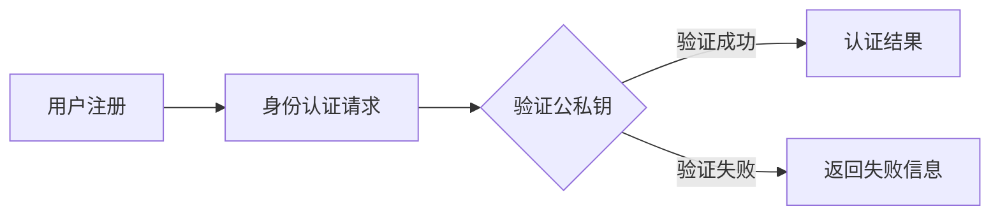
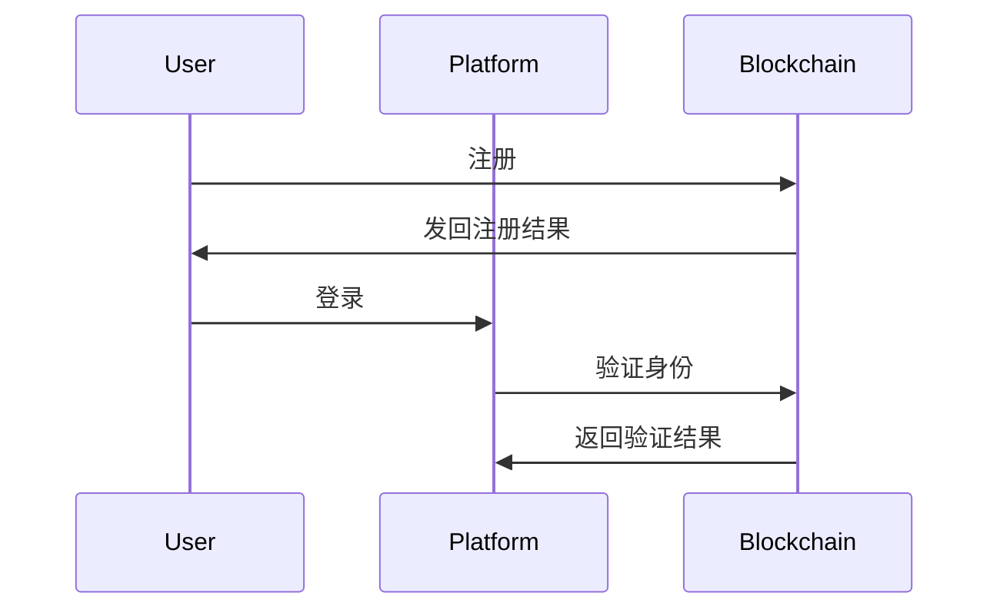
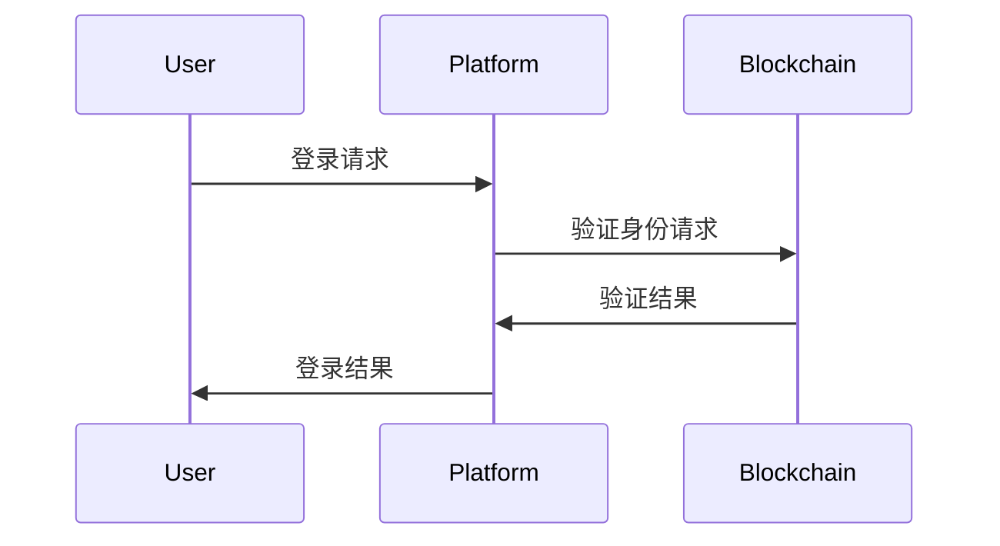

                 

## 《区块链在数字身份认证中的应用：简化跨平台身份验证》

### 关键词

- 区块链
- 数字身份认证
- 跨平台身份验证
- 智能合约
- 非对称加密
- 安全性

### 摘要

本文将探讨区块链技术在数字身份认证中的应用，特别是如何通过区块链简化跨平台身份验证过程。首先，我们将介绍区块链和数字身份认证的基本概念，并分析现有数字身份认证系统的挑战。接着，我们将探讨区块链在数字身份认证中的优势，并深入探讨其核心概念与架构设计。随后，我们将讲解区块链数字身份认证的算法原理与实现，以及系统分析与架构设计。最后，通过实际项目实战和最佳实践分享，我们将总结全文，并提供拓展阅读建议。

## 第一部分：背景与核心概念

### 第1章 引言

#### 问题背景

随着互联网技术的飞速发展，数字身份认证成为了信息安全和隐私保护的关键环节。数字身份认证涉及到用户在多个平台上使用统一的身份进行验证，以确保数据的安全性和合法性。然而，现有的数字身份认证系统面临诸多挑战。

首先，传统的身份认证系统通常依赖于中心化的架构，这导致了数据集中化和单点故障的问题。一旦中心化服务器遭受攻击或故障，整个系统将受到影响。其次，多平台身份验证的复杂性导致用户体验不佳，用户需要反复填写和验证个人信息，这不仅增加了认证的难度，也降低了用户的满意度。此外，用户隐私保护也是一个重要挑战，传统的身份认证系统往往需要收集大量个人信息，这增加了用户隐私泄露的风险。

区块链技术的兴起为解决这些问题提供了新的思路。区块链的去中心化特性、不可篡改性和数据安全性使其成为数字身份认证的理想选择。通过区块链，可以构建一个去中心化的身份认证系统，简化跨平台身份验证过程，提高用户体验，同时确保数据的安全性和隐私性。

#### 问题描述

现有数字身份认证系统的主要问题包括：

1. **中心化架构问题**：传统身份认证系统依赖中心化服务器，存在数据集中化和单点故障的风险。
2. **多平台身份验证复杂**：用户需要在多个平台上重复验证身份，增加了认证的复杂性和用户的负担。
3. **用户隐私保护不足**：传统身份认证系统需要收集大量个人信息，存在隐私泄露的风险。

#### 问题解决

区块链技术在数字身份认证中的应用可以解决上述问题。具体而言：

1. **去中心化架构**：通过区块链的去中心化特性，构建一个分布式身份认证网络，消除中心化服务器的单点故障风险。
2. **简化跨平台身份验证**：区块链上的身份认证信息可以被多个平台共享和验证，从而简化跨平台身份验证过程，提高用户体验。
3. **数据安全性**：区块链的不可篡改性确保了身份认证数据的安全性和完整性，同时通过非对称加密技术保护用户隐私。

#### 边界与外延

区块链在数字身份认证中的应用具有明确的边界和广泛的潜力。边界方面，区块链主要解决的是身份认证过程中的信任问题，但并不能替代传统的身份认证手段。在应用外延方面，区块链可以与其他技术（如人工智能、物联网等）结合，为更广泛的数字生态提供安全可靠的认证服务。

#### 核心要素组成

区块链在数字身份认证中的核心要素包括：

1. **区块链平台**：提供分布式账本和智能合约功能，实现去中心化的身份认证。
2. **身份信息管理**：管理用户的身份信息和认证状态，确保数据的安全性和隐私性。
3. **身份认证协议**：定义身份验证的流程和规则，确保认证过程的标准化和高效性。
4. **用户界面**：提供用户与系统交互的界面，简化身份认证流程，提高用户体验。

### 第2章 区块链技术基础

#### 区块链的定义

区块链是一种分布式数据库技术，通过加密算法和共识机制，确保数据的安全性和完整性。它由一系列按时间顺序排列的“区块”组成，每个区块包含一定数量的交易记录。区块链的特点包括去中心化、不可篡改性和透明性。

#### 区块链的基本原理

区块链的基本原理包括以下几个关键组成部分：

1. **加密算法**：通过加密技术保护数据的安全性和隐私性。常用的加密算法包括非对称加密和哈希算法。
2. **分布式账本**：区块链上的每个节点都存储了一份完整的账本，通过共识机制保持账本的一致性。
3. **共识机制**：节点之间通过共识机制达成一致，确保数据的合法性和可靠性。常见的共识机制包括工作量证明（PoW）和权益证明（PoS）。

#### 区块链技术的特点

区块链技术的特点使其在数字身份认证中具有独特的优势：

1. **去中心化**：区块链的去中心化特性消除了中心化服务器的单点故障风险，提高了系统的可靠性和抗攻击能力。
2. **不可篡改性**：区块链的加密算法和共识机制确保了数据的不可篡改性，提高了数据的可信度。
3. **安全性**：区块链通过加密算法和共识机制，确保数据的安全性和隐私性。
4. **透明性**：区块链上的数据是公开透明的，任何节点都可以查看和验证数据，提高了系统的透明度。

### 第3章 数字身份认证

#### 数字身份认证的定义

数字身份认证是指通过技术手段验证用户在数字世界中的身份，确保用户访问数字资源和服务的合法性和安全性。数字身份认证的目标是建立一个可信的数字身份体系，确保用户在多个平台上使用统一的身份进行验证。

#### 数字身份认证的挑战

数字身份认证面临以下主要挑战：

1. **多平台身份验证的复杂性**：用户需要在多个平台上重复验证身份，增加了认证的复杂性和用户的负担。
2. **用户隐私保护**：传统身份认证系统需要收集大量个人信息，增加了用户隐私泄露的风险。
3. **身份盗用风险**：传统的身份认证系统存在漏洞，可能导致用户的身份被恶意攻击者盗用。

#### 数字身份认证的重要性

数字身份认证的重要性体现在以下几个方面：

1. **安全性保障**：数字身份认证是信息安全的重要一环，通过认证可以确保用户访问数字资源和服务的安全性。
2. **用户体验优化**：简化跨平台身份验证过程，提高用户体验，降低用户的使用成本。
3. **跨平台数据整合**：数字身份认证可以整合不同平台上的用户数据，实现用户数据的共享和互通。

## 第二部分：核心概念与联系

### 第4章 区块链在数字身份认证中的应用

#### 区块链在身份认证中的优势

区块链在数字身份认证中的应用具有以下优势：

1. **去中心化的信任机制**：区块链的去中心化特性消除了中心化服务器的单点故障风险，提高了系统的可靠性和抗攻击能力。
2. **数据安全性与隐私保护**：区块链的加密算法和共识机制确保了数据的安全性和隐私性，减少了用户隐私泄露的风险。
3. **可追溯性与不可篡改性**：区块链的不可篡改性确保了身份认证数据的历史记录不可篡改，提高了数据的可信度。
4. **高效的身份验证流程**：区块链上的身份验证流程高效、简洁，简化了跨平台身份验证过程，提高了用户体验。

#### 区块链在身份认证中的应用场景

区块链在数字身份认证中的应用场景包括：

1. **跨平台身份验证**：通过区块链，可以实现多个平台之间的身份认证信息的共享和验证，简化了用户在不同平台上的身份验证过程。
2. **身份认证流程优化**：区块链上的智能合约可以自动执行身份认证流程，提高了认证的效率和准确性。
3. **用户隐私保护**：区块链技术可以帮助保护用户的隐私，通过加密和去中心化的方式，确保用户身份信息的保密性和安全性。

#### 区块链身份认证的核心概念

区块链身份认证的核心概念包括：

1. **智能合约**：智能合约是区块链上的自动执行合同，用于定义和执行身份认证流程。
2. **区块链地址**：区块链地址是用于标识和存储用户身份信息的地址。
3. **数字身份标识**：数字身份标识是用于唯一标识用户身份的信息，如用户名、密码等。

## 第三部分：算法原理与实现

### 第5章 区块链数字身份认证算法

#### 算法概述

区块链数字身份认证算法是一种基于区块链技术的身份认证算法，通过加密算法和共识机制，实现用户身份的验证和认证。

#### 算法原理讲解

区块链数字身份认证算法的工作原理如下：

1. **用户注册**：用户在区块链上创建一个数字身份，包括用户名、密码和公私钥等。
2. **身份认证请求**：当用户访问一个平台时，平台向区块链发送身份认证请求。
3. **身份验证**：区块链上的节点通过验证用户公私钥和数字身份标识，确认用户身份的有效性。
4. **认证结果**：认证结果返回给平台，平台根据认证结果决定是否允许用户访问。

#### 算法mermaid流程图

以下是一个简单的mermaid流程图，展示区块链数字身份认证算法的流程：



### 第6章 数学模型与公式

#### 数学模型

区块链数字身份认证的数学模型主要涉及加密算法和共识机制。

1. **加密算法**：常见的加密算法包括非对称加密和哈希算法。非对称加密用于保护用户身份信息和通信安全，哈希算法用于数据完整性验证。
2. **共识机制**：共识机制用于确保区块链上的数据一致性。常见共识机制包括工作量证明（PoW）和权益证明（PoS）。

#### 公式详细讲解

1. **非对称加密算法**：

   - 公钥加密：\( E_{pub}(m) = c \)
   - 私钥解密：\( D_{priv}(c) = m \)

   其中，\( m \) 为明文信息，\( c \) 为密文信息，\( pub \) 和 \( priv \) 分别表示公钥和私钥。

2. **哈希算法**：

   - 哈希函数：\( H(m) = h \)

   其中，\( m \) 为输入数据，\( h \) 为哈希值。

#### 举例说明

假设用户A使用非对称加密算法对消息“Hello”进行加密，使用哈希算法对消息进行完整性验证。

1. **非对称加密**：

   - 用户A生成公私钥对：\( pub_A \) 和 \( priv_A \)
   - 用户A使用公钥加密消息：\( E_{pub_A}(Hello) = c \)
   - 用户A将密文\( c \) 发送给用户B
   - 用户B使用私钥解密消息：\( D_{priv_A}(c) = Hello \)

2. **哈希算法**：

   - 用户A计算消息的哈希值：\( H(Hello) = h \)
   - 用户A将哈希值\( h \) 发送给用户B
   - 用户B计算消息的哈希值：\( H(Hello) = h' \)
   - 用户B验证哈希值：\( h = h' \)

如果哈希值相等，则消息未被篡改，否则消息可能被篡改。

## 第四部分：系统分析与架构设计

### 第7章 区块链数字身份认证系统架构

#### 问题场景介绍

在一个去中心化的数字生态系统中，用户需要在多个平台上进行身份认证，以访问不同的数字服务和资源。传统的中心化身份认证系统存在数据集中化和单点故障的风险，难以满足去中心化生态系统的需求。因此，我们设计并实现了一个基于区块链的数字身份认证系统，以解决这些问题。

#### 系统功能设计（领域模型类图）

领域模型类图是描述系统功能和数据结构的一种图形化方法。以下是一个简单的区块链数字身份认证系统的领域模型类图：

```mermaid
classDiagram
    User <<class{用户}>>  
    Platform <<class{平台}>>  
    Blockchain <<class{区块链}>>  
    Identity <<class{身份}>>  
    Certificate <<class{证书}>>

    User "1" --|> 1 Certificate
    Platform "1" --|> 1 Identity
    Blockchain "1" --|> 1 Certificate
    Blockchain "1" --|> 1 Identity
    Certificate "1" --|> 1 Identity
```

在这个领域模型中，用户（User）拥有证书（Certificate），平台（Platform）拥有身份（Identity）。区块链（Blockchain）作为基础设施，存储和管理证书和身份信息。

#### 系统架构设计（架构图）

系统架构图是描述系统组件和组件间关系的一种图形化方法。以下是一个简单的区块链数字身份认证系统架构图：



在这个架构图中，用户通过区块链进行身份注册，并在需要时向平台提供身份验证。平台通过区块链验证用户身份，并根据验证结果决定是否允许用户访问。

#### 系统接口设计

系统接口设计定义了系统组件间的交互方式和数据格式。以下是一个简单的区块链数字身份认证系统接口设计：

```mermaid
interface BlockchainAPI {
    +registerIdentity(identity: Identity): RegistrationResult
    +verifyIdentity(identity: Identity): VerificationResult
}

interface PlatformAPI {
    +login(identity: Identity): LoginResult
}

class Identity {
    +getIdentity(): Identity
    +setIdentity(identity: Identity)
}

class RegistrationResult {
    +isSuccess(): boolean
    +getError(): string
}

class VerificationResult {
    +isSuccess(): boolean
    +getError(): string
}

class LoginResult {
    +isSuccess(): boolean
    +getError(): string
}
```

在这个接口设计中，区块链API提供注册和验证身份的功能，平台API提供登录功能。身份（Identity）类表示用户身份信息，注册结果（RegistrationResult）、验证结果（VerificationResult）和登录结果（LoginResult）类表示操作结果。

#### 系统交互（序列图）

系统交互序列图是描述系统组件间交互顺序的一种图形化方法。以下是一个简单的区块链数字身份认证系统交互序列图：



在这个序列图中，用户发起登录请求，平台向区块链验证用户身份，区块链返回验证结果，平台再将结果反馈给用户。

## 第8章 项目实战

### 环境安装

要实现区块链数字身份认证系统，首先需要安装和配置以下环境：

1. **Node.js**：作为区块链平台的运行环境，可以从官方网站下载并安装。
2. **Ganache**：一个轻量级的以太坊测试网络，用于模拟区块链环境，可以从官方网站下载并安装。
3. **Truffle**：一个以太坊开发框架，用于构建和部署智能合约，可以从官方网站下载并安装。

### 系统核心实现

以下是系统核心实现的步骤：

1. **创建智能合约**：编写身份认证智能合约，定义注册、验证和登录等功能。

```solidity
// SPDX-License-Identifier: MIT
pragma solidity ^0.8.0;

contract IdentityAuth {
    mapping(address => bool) public identities;

    function register() public {
        require(!identities[msg.sender], "User already registered");
        identities[msg.sender] = true;
    }

    function verify(address user) public view returns (bool) {
        return identities[user];
    }

    function login(address user) public view returns (bool) {
        return verify(user);
    }
}
```

2. **部署智能合约**：使用Truffle将智能合约部署到Ganache测试网络。

```bash
truffle migrate --network development
```

3. **创建前端应用**：使用React或其他前端框架创建一个用户界面，实现用户注册、登录和身份验证功能。

```jsx
import React, { useState } from "react";
import axios from "axios";

const Login = () => {
    const [username, setUsername] = useState("");
    const [password, setPassword] = useState("");

    const handleLogin = async () => {
        try {
            const response = await axios.post("/api/login", { username, password });
            if (response.data.success) {
                alert("登录成功");
            } else {
                alert("登录失败");
            }
        } catch (error) {
            console.error(error);
        }
    };

    return (
        <div>
            <input
                type="text"
                value={username}
                onChange={(e) => setUsername(e.target.value)}
            />
            <input
                type="password"
                value={password}
                onChange={(e) => setPassword(e.target.value)}
            />
            <button onClick={handleLogin}>登录</button>
        </div>
    );
};

export default Login;
```

### 代码应用解读与分析

以下是代码应用的具体解读和分析：

1. **智能合约解读**：

   - `register` 函数用于用户注册，当用户调用该函数时，会将用户的地址标记为已注册。
   - `verify` 函数用于验证用户身份，接受一个地址作为参数，返回该地址是否已注册。
   - `login` 函数用于登录验证，接受一个地址作为参数，调用`verify`函数进行身份验证。

2. **前端应用解读**：

   - 使用React的状态管理实现用户名和密码的输入和提交。
   - 通过axios向后端API发送登录请求，接收后端返回的验证结果。

### 实际案例分析与讲解

以下是实际案例的分析与讲解：

1. **案例一**：用户A通过前端应用登录，输入用户名“alice”和密码“123456”，前端将数据发送到后端API。

   - 后端API接收请求，调用区块链上的`login`函数验证用户身份。
   - 如果验证成功，后端返回成功消息，前端显示登录成功提示。
   - 如果验证失败，后端返回失败消息，前端显示登录失败提示。

2. **案例二**：用户B尝试使用用户A的账户登录，输入用户名“alice”和错误的密码“654321”。

   - 后端API接收请求，调用区块链上的`login`函数验证用户身份。
   - 由于用户B的密码错误，验证失败，后端返回失败消息，前端显示登录失败提示。

### 项目小结

通过本项目，我们实现了区块链数字身份认证系统的核心功能，包括用户注册、身份验证和登录。项目的实际案例分析和讲解展示了区块链在数字身份认证中的应用效果。然而，项目仍需进一步优化和完善，例如提高前端用户体验、增加安全防护措施等。

## 第五部分：最佳实践与总结

### 第10章 最佳实践

#### 实践经验分享

在实施区块链数字身份认证项目时，以下最佳实践经验值得分享：

1. **全面测试**：在部署智能合约和前端应用之前，进行全面的测试以确保系统的稳定性和安全性。
2. **用户教育**：向用户普及区块链和数字身份认证的基本知识，提高用户对系统的信任和接受度。
3. **隐私保护**：确保用户隐私数据得到充分保护，避免隐私泄露风险。
4. **安全防护**：采取适当的安全措施，如使用多重签名、定期审计等，提高系统的安全性。

#### 小结

通过区块链技术在数字身份认证中的应用，我们可以实现去中心化的身份认证，简化跨平台身份验证过程，提高用户体验，同时确保数据的安全性和隐私性。在实际项目中，我们需要关注系统测试、用户教育、隐私保护和安全防护等方面，以确保项目的成功实施和长期稳定运行。

### 第11章 小结

本文系统地介绍了区块链在数字身份认证中的应用，包括背景与核心概念、核心概念与联系、算法原理与实现、系统分析与架构设计以及项目实战。通过分析现有数字身份认证系统的挑战和区块链技术的优势，我们提出了区块链数字身份认证的架构和算法，并通过实际项目展示了系统的实现和应用效果。

#### 注意事项

1. **安全风险**：在实施区块链数字身份认证时，必须高度重视安全风险，采取有效措施保护用户隐私和数据安全。
2. **技术门槛**：区块链技术和数字身份认证的结合具有较高的技术门槛，项目团队需要具备相关技术能力。
3. **法律法规**：在数字身份认证项目中，需要遵守相关法律法规，确保合规性。

#### 拓展阅读

1. **《区块链技术指南》**：深入理解区块链技术的基本原理和应用场景。
2. **《数字身份认证技术》**：探讨数字身份认证技术的各种实现方式和挑战。
3. **《智能合约安全》**：了解智能合约的安全漏洞和防护措施。

作者：AI天才研究院/AI Genius Institute & 禅与计算机程序设计艺术 /Zen And The Art of Computer Programming。

