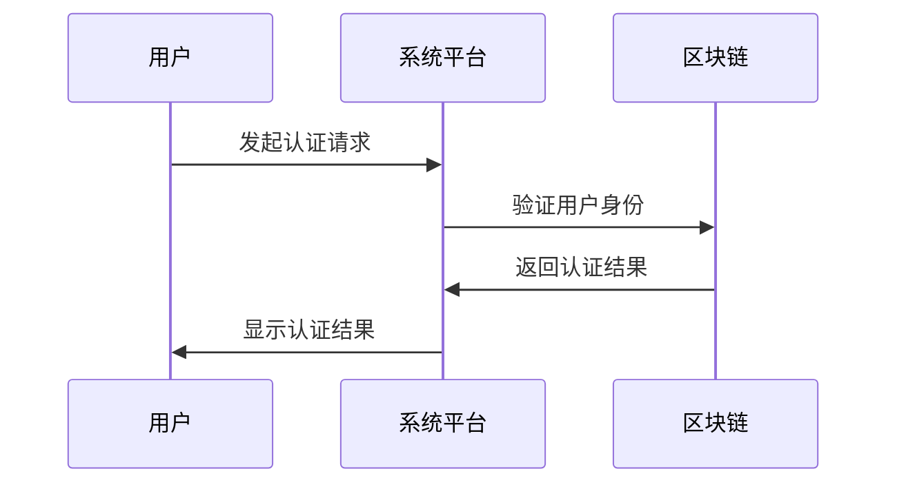

                 

# 区块链在数字身份跨境认证中的应用

## 关键词

区块链、数字身份、跨境认证、技术优势、应用场景、挑战与展望

## 摘要

本文主要探讨了区块链技术在数字身份跨境认证中的应用。首先，我们介绍了区块链和数字身份的基本概念，并分析了其在跨境认证中的优势和应用场景。接着，我们详细阐述了区块链技术的原理、分类和常见平台，以及数字身份的构建与维护。然后，通过具体案例，展示了区块链在跨境认证中的实际应用，并对案例进行了深入分析和效果评估。最后，我们提出了区块链在跨境认证中的最佳实践，并总结了相关经验和启示。本文旨在为读者提供对区块链在数字身份跨境认证中应用的全面了解。

## 目录大纲

----------------------------------------------------------------

## 第1章：区块链与数字身份跨境认证概述

### 1.1 问题背景

#### 1.1.1 跨境认证的挑战

#### 1.1.2 区块链技术的引入

#### 1.1.3 数字身份的概念

### 1.2 核心概念与联系

#### 1.2.1 区块链的基本原理

#### 1.2.2 数字身份的核心要素

#### 1.2.3 区块链与数字身份的联系

### 1.3 区块链在跨境认证中的应用

#### 1.3.1 技术优势

#### 1.3.2 应用场景

#### 1.3.3 实际案例

### 1.4 本章小结

----------------------------------------------------------------

## 第2章：区块链技术详解

### 2.1 区块链的基本原理

#### 2.1.1 区块链的构成

#### 2.1.2 工作原理

#### 2.1.3 主要组成部分

### 2.2 区块链的分类

#### 2.2.1 公链与私链

#### 2.2.2 联盟链与混合链

#### 2.2.3 不同类型区块链的特点与应用

### 2.3 常见区块链平台介绍

#### 2.3.1 Ethereum

#### 2.3.2 Bitcoin

#### 2.3.3 Hyperledger Fabric

### 2.4 区块链技术的挑战与未来发展趋势

#### 2.4.1 技术挑战

#### 2.4.2 发展趋势

#### 2.4.3 未来展望

### 2.5 本章小结

----------------------------------------------------------------

## 第3章：数字身份的构建与维护

### 3.1 数字身份的概念

#### 3.1.1 数字身份的定义

#### 3.1.2 数字身份的特点

#### 3.1.3 数字身份的应用场景

### 3.2 数字身份的构建

#### 3.2.1 身份信息收集与验证

#### 3.2.2 身份信息的加密存储

#### 3.2.3 数字身份的注册与授权

### 3.3 数字身份的维护

#### 3.3.1 身份信息更新

#### 3.3.2 身份信息安全防护

#### 3.3.3 数字身份的隐私保护

### 3.4 数字身份的标准化

#### 3.4.1 标准化的重要性

#### 3.4.2 国际与国内相关标准

#### 3.4.3 未来发展趋势

### 3.5 本章小结

----------------------------------------------------------------

## 第4章：跨境认证中的区块链应用案例分析

### 4.1 案例介绍

#### 4.1.1 案例背景

#### 4.1.2 案例目标

#### 4.1.3 案例实施过程

### 4.2 技术架构设计

#### 4.2.1 系统架构

#### 4.2.2 技术选型

#### 4.2.3 模块功能设计

### 4.3 实现细节与源代码解析

#### 4.3.1 区块链智能合约实现

#### 4.3.2 数字身份管理

#### 4.3.3 跨境认证流程

### 4.4 案例分析与效果评估

#### 4.4.1 案例效果评估

#### 4.4.2 案例改进建议

#### 4.4.3 案例的启示

### 4.5 本章小结

----------------------------------------------------------------

## 第5章：区块链在跨境认证中的最佳实践

### 5.1 技术最佳实践

#### 5.1.1 系统架构优化

#### 5.1.2 数据安全与隐私保护

#### 5.1.3 智能合约开发技巧

### 5.2 业务最佳实践

#### 5.2.1 跨境认证流程设计

#### 5.2.2 跨境认证业务协同

#### 5.2.3 跨境认证政策法规遵守

### 5.3 案例研究与经验总结

#### 5.3.1 成功案例总结

#### 5.3.2 失败案例分析

#### 5.3.3 经验总结与启示

### 5.4 本章小结

----------------------------------------------------------------

----------------------------------------------------------------## 第1章：区块链与数字身份跨境认证概述

### 1.1 问题背景

在全球化进程加速的背景下，跨境认证的需求日益增长。跨境认证主要涉及个人或企业在不同国家或地区之间的身份验证和信息交换。然而，传统的跨境认证系统面临诸多挑战：

1. **信息孤岛**：各个国家和地区的认证系统独立运行，缺乏统一的接口和标准，导致信息无法互通。
2. **隐私泄露**：跨境认证过程中，个人身份信息可能被多次泄露和滥用，引发隐私安全风险。
3. **效率低下**：传统的认证流程繁琐，涉及多个环节，导致处理时间较长，影响跨境业务的效率。
4. **信任问题**：不同国家和地区的认证机构之间缺乏信任机制，认证结果可能存在争议。

区块链技术的出现为解决这些问题提供了新的思路。区块链是一种去中心化的分布式账本技术，具有安全性、透明性和不可篡改性。通过引入区块链技术，可以实现跨境认证的高效、安全与可信。

### 1.1.1 跨境认证的挑战

1. **身份信息的验证**：跨境认证的核心是验证个人或企业的身份信息。然而，不同国家和地区的身份认证标准和流程存在差异，使得身份信息验证成为一个复杂的问题。
2. **数据安全与隐私**：在跨境认证过程中，个人身份信息可能会被多次传递和存储，增加了数据泄露的风险。因此，如何在确保数据安全的前提下进行身份验证成为了一个重要挑战。
3. **跨系统互操作性**：跨境认证涉及多个系统和机构，如何实现这些系统之间的互操作性，确保认证信息在不同系统之间无缝传输，是一个亟待解决的问题。
4. **跨境认证流程的优化**：传统的跨境认证流程繁琐，涉及多个环节和部门，处理时间长，影响业务效率。如何优化跨境认证流程，提高认证效率，是一个关键挑战。

### 1.1.2 区块链技术的引入

区块链技术可以为跨境认证提供以下解决方案：

1. **去中心化**：区块链的去中心化特性可以消除传统跨境认证系统中存在的“信息孤岛”问题，实现不同系统之间的无缝连接。
2. **安全性**：区块链技术的加密算法和分布式存储机制可以确保跨境认证过程中的数据安全，防止信息泄露和篡改。
3. **透明性**：区块链的透明性使得跨境认证过程中的每一步操作都可以被记录和追踪，提高了认证的透明度和可信度。
4. **不可篡改性**：区块链的不可篡改性确保了跨境认证过程中的数据不会被恶意篡改，增加了认证结果的可靠性。
5. **智能合约**：区块链中的智能合约可以自动执行跨境认证过程中的规则和流程，提高认证效率和准确性。

### 1.1.3 数字身份的概念

数字身份是指个人或实体在数字世界中的身份标识。与物理身份不同，数字身份可以在不同数字平台上进行注册和使用。数字身份通常包括以下核心要素：

1. **身份信息**：包括姓名、身份证号码、地址、联系方式等基本信息。
2. **身份凭证**：包括身份证、护照、驾驶证等可以证明身份的证件。
3. **身份验证**：通过密码、生物识别等方式对数字身份进行验证。
4. **身份授权**：数字身份可以授权访问和使用特定系统或服务。

### 1.2 核心概念与联系

#### 1.2.1 区块链的基本原理

区块链是一种分布式数据库技术，其基本原理包括以下方面：

1. **去中心化**：区块链无需中心化服务器，数据存储在多个节点上，每个节点都有完整的区块链副本。
2. **分布式共识**：区块链通过分布式共识算法，确保所有节点对数据的共识和一致性。
3. **加密算法**：区块链使用加密算法保护数据的完整性和隐私性。
4. **不可篡改性**：区块链上的数据一旦被记录，就无法被篡改。

#### 1.2.2 数字身份的核心要素

数字身份的核心要素包括：

1. **身份信息**：包括个人或企业的基本信息。
2. **身份凭证**：包括可以证明身份的证件或文件。
3. **身份验证**：通过密码、生物识别等方式对数字身份进行验证。
4. **身份授权**：数字身份可以授权访问和使用特定系统或服务。

#### 1.2.3 区块链与数字身份的联系

区块链与数字身份之间的联系体现在以下几个方面：

1. **身份信息存储**：区块链可以用于存储数字身份信息，确保数据的完整性和安全性。
2. **身份验证**：区块链技术可以用于身份验证，确保数字身份的真实性和可信度。
3. **身份授权**：区块链中的智能合约可以用于身份授权，实现自动化的身份管理。
4. **隐私保护**：区块链技术可以保护数字身份的隐私，防止信息泄露。

### 1.3 区块链在跨境认证中的应用

#### 1.3.1 技术优势

区块链技术在跨境认证中具有以下技术优势：

1. **去中心化**：区块链的去中心化特性消除了传统跨境认证系统中存在的“信息孤岛”问题，实现了不同系统之间的无缝连接。
2. **安全性**：区块链的加密算法和分布式存储机制确保了跨境认证过程中的数据安全，防止信息泄露和篡改。
3. **透明性**：区块链的透明性使得跨境认证过程中的每一步操作都可以被记录和追踪，提高了认证的透明度和可信度。
4. **不可篡改性**：区块链的不可篡改性确保了跨境认证过程中的数据不会被恶意篡改，增加了认证结果的可靠性。
5. **智能合约**：区块链中的智能合约可以自动执行跨境认证过程中的规则和流程，提高认证效率和准确性。

#### 1.3.2 应用场景

区块链技术在跨境认证中的应用场景包括：

1. **跨国企业身份验证**：企业可以在区块链上注册和存储身份信息，确保身份信息的真实性和可信度。
2. **跨境金融服务**：区块链技术可以用于跨境金融服务的身份认证和交易确认，提高交易的安全性和效率。
3. **电子护照与签证**：区块链技术可以用于电子护照和签证的管理，实现便捷的跨境旅行和身份验证。
4. **跨境医疗信息共享**：区块链技术可以用于跨境医疗信息共享，确保医疗信息的真实性和隐私保护。

#### 1.3.3 实际案例

1. **瑞士国际机场试点项目**：瑞士国际机场与区块链公司合作，试点了基于区块链的电子护照和签证系统，实现了快速、安全的跨境认证。
2. **香港与新加坡跨境金融合作**：香港与新加坡的金融机构利用区块链技术实现了跨境支付和结算，提高了交易效率和安全性。

### 1.4 本章小结

本章介绍了区块链与数字身份跨境认证的背景、挑战和解决方案。通过分析区块链和数字身份的基本原理和联系，我们探讨了区块链在跨境认证中的应用优势和应用场景。实际案例展示了区块链技术在跨境认证中的成功应用。接下来，我们将深入探讨区块链技术的详细原理和分类，为后续章节的讨论打下基础。

----------------------------------------------------------------

## 第2章：区块链技术详解

### 2.1 区块链的基本原理

区块链是一种去中心化的分布式数据库技术，其基本原理包括以下几个方面：

#### 2.1.1 区块链的构成

区块链由一系列按时间顺序排列的“区块”组成，每个区块包含一定数量的交易记录。这些区块通过密码学算法相互链接，形成了一个不可篡改的链式结构。

- **区块**：区块是区块链的基本组成单元，包含交易记录、区块头和区块体。交易记录存储在区块体中，区块头包含区块的元数据，如时间戳、随机数、前一个区块的哈希值等。
- **链**：区块链是一个按照时间顺序排列的区块序列，每个区块通过其前一个区块的哈希值与上一个区块链接，形成一条长链。

#### 2.1.2 工作原理

区块链的工作原理主要包括以下步骤：

1. **交易发起**：用户发起交易，并将其广播到整个网络。
2. **交易验证**：网络中的节点对交易进行验证，确保交易的有效性和合法性。
3. **区块构建**：当一个区块满载交易后，节点开始构建一个新的区块，并将其链接到区块链上。
4. **共识达成**：网络中的节点通过共识算法达成一致，确认新区块的有效性，并将其添加到区块链上。
5. **分布式存储**：区块链上的每个节点都保存完整的区块链副本，确保数据的冗余性和安全性。

#### 2.1.3 主要组成部分

区块链的主要组成部分包括：

1. **节点**：节点是区块链网络中的基本单元，负责维护区块链的完整性、验证交易和达成共识。
2. **交易**：交易是区块链上的数据单位，代表用户在网络中的行为，如资产转移、数据存储等。
3. **智能合约**：智能合约是运行在区块链上的程序，根据预设的规则自动执行，无需第三方介入。
4. **分布式账本**：分布式账本是区块链的核心，存储了所有交易记录和状态信息，确保数据的完整性和一致性。

### 2.2 区块链的分类

区块链根据不同的分类标准可以分为以下几类：

#### 2.2.1 公链与私链

1. **公链**：公链是一个开放、去中心化的区块链，任何人都可以参与其中。公链上的交易记录和状态信息对所有节点公开透明，典型的公链如Bitcoin和Ethereum。
2. **私链**：私链是一个封闭、中心化的区块链，仅限于特定的组织或机构使用。私链上的交易记录和状态信息仅对参与节点公开，典型的私链如Hyperledger Fabric。

#### 2.2.2 联盟链与混合链

1. **联盟链**：联盟链是一个由多个信任节点组成的区块链，这些节点通常属于不同的组织或机构。联盟链在信任基础上实现部分去中心化，适用于跨组织的数据共享和交易。
2. **混合链**：混合链是结合公链和私链特性的区块链，既具有公链的开放性，也具备私链的封闭性和可扩展性，适用于不同场景的需求。

#### 2.2.3 不同类型区块链的特点与应用

| 区块链类型       | 特点                                                         | 应用场景                                       |
|------------------|--------------------------------------------------------------|----------------------------------------------|
| 公链             | 开放、去中心化，所有节点平等参与                             | 数字货币、去中心化应用、分布式存储等               |
| 私链             | 封闭、中心化，仅特定组织或机构使用                           | 企业内部区块链应用、供应链管理、内部审计等             |
| 联盟链           | 部分去中心化，由多个信任节点组成                             | 跨组织数据共享、供应链金融、医疗信息共享等             |
| 混合链           | 结合公链和私链特性，开放与封闭并存                           | 需要同时满足去中心化和封闭性的应用场景               |

### 2.3 常见区块链平台介绍

以下是对几个常见区块链平台的介绍：

#### 2.3.1 Ethereum

Ethereum是一个开源的智能合约平台，允许开发者创建和部署去中心化应用（DApps）。Ethereum使用以太币（Ether，简称ETH）作为交易媒介，具有以下特点：

- **智能合约**：Ethereum支持智能合约，允许开发者使用Solidity等编程语言编写自执行合约。
- **去中心化应用**：Ethereum生态系统支持大量去中心化应用，如去中心化金融（DeFi）、游戏、市场等。
- **网络扩展**：Ethereum正在通过分片技术等方案解决网络扩展问题，提高交易处理能力。

#### 2.3.2 Bitcoin

Bitcoin是一个去中心化的数字货币，由中本聪（Satoshi Nakamoto）在2009年创建。Bitcoin具有以下特点：

- **去中心化**：Bitcoin没有中央机构，由全球网络中的节点维护。
- **安全性**：Bitcoin使用加密算法保护交易安全和防止双花攻击。
- **去信任**：Bitcoin交易基于密码学原理，无需信任第三方。

#### 2.3.3 Hyperledger Fabric

Hyperledger Fabric是Linux基金会的一个开源区块链框架，主要面向企业级应用。Hyperledger Fabric具有以下特点：

- **模块化架构**：Hyperledger Fabric采用模块化设计，便于扩展和定制。
- **隐私保护**：Hyperledger Fabric支持通道和成员管理，实现数据的隐私保护。
- **高效性能**：Hyperledger Fabric通过并发处理和优化共识算法，提高交易处理能力。

### 2.4 区块链技术的挑战与未来发展趋势

#### 2.4.1 技术挑战

区块链技术在发展中面临以下挑战：

1. **性能与扩展性**：现有区块链平台在处理大量交易时，性能和扩展性成为瓶颈。
2. **安全性**：区块链系统面临多种攻击风险，如51%攻击、智能合约漏洞等。
3. **隐私保护**：尽管区块链具有透明性优势，但如何在保护隐私的同时实现数据可用性是一个挑战。
4. **法律法规**：区块链技术的发展与应用需要适应不同国家和地区的法律法规。

#### 2.4.2 发展趋势

区块链技术的发展趋势包括：

1. **技术优化**：针对性能和扩展性问题，区块链平台正在通过分片、状态通道等技术进行优化。
2. **跨链与互操作性**：实现不同区块链平台之间的互操作性，扩大区块链生态系统的应用范围。
3. **标准化**：推动区块链技术的标准化，提高其可靠性和互操作性。
4. **监管合规**：区块链技术与监管政策的结合，确保其在合法合规的环境下发展。

#### 2.4.3 未来展望

区块链技术在未来的发展趋势中，预计将在以下几个方面得到应用和推广：

1. **金融领域**：区块链技术将在跨境支付、供应链金融、保险等领域发挥重要作用。
2. **公共服务**：区块链技术可以用于电子政务、身份认证、医疗记录管理等公共服务领域。
3. **物联网**：区块链技术可以用于物联网设备的数据管理和安全通信。
4. **智能合约与去中心化应用**：随着技术的成熟，智能合约和去中心化应用将在更多领域得到应用。

### 2.5 本章小结

本章详细介绍了区块链技术的原理、分类和常见平台，分析了区块链技术在跨境认证中的应用优势。通过探讨区块链技术的挑战和未来发展趋势，为后续章节的讨论提供了技术背景和理论支持。

----------------------------------------------------------------

## 第3章：数字身份的构建与维护

### 3.1 数字身份的概念

数字身份是指个人或实体在数字世界中的身份标识，它是一个虚拟的、可操作的实体，用于在数字环境中进行身份验证和授权。数字身份的核心目标是确保网络中的用户能够安全、可靠地进行交互和交易。

#### 3.1.1 数字身份的定义

数字身份的定义可以从以下几个方面来理解：

1. **标识**：数字身份是一个标识符，用于在数字世界中识别和区分不同的用户或实体。
2. **信任**：数字身份是建立在对用户身份的信任基础上的，通过验证和认证过程来确保身份的真实性。
3. **授权**：数字身份允许用户在数字环境中访问资源和执行操作，通过权限和角色的配置来实现。

#### 3.1.2 数字身份的特点

数字身份具有以下特点：

1. **唯一性**：每个用户在数字世界中都有一个唯一的数字身份，确保不同用户之间的区分。
2. **可移植性**：数字身份可以在不同的数字平台上进行注册和使用，无需重复创建。
3. **不可篡改性**：数字身份的信息一旦注册，通常不可篡改，确保数据的可靠性和完整性。
4. **匿名性**：数字身份可以在一定程度上保护用户的隐私，实现匿名访问。

#### 3.1.3 数字身份的应用场景

数字身份的应用场景非常广泛，以下是一些典型的应用场景：

1. **电子商务**：用户在电商平台进行购物、支付和评论时，需要使用数字身份进行身份验证和授权。
2. **在线服务**：用户在在线服务平台（如社交媒体、云计算服务）上注册和使用时，需要数字身份进行身份认证。
3. **金融交易**：在数字金融交易中，数字身份用于确保交易双方的身份真实性和合法性。
4. **身份认证**：政府、企业等机构通过数字身份系统对用户进行身份认证，用于公共服务和内部管理。

### 3.2 数字身份的构建

数字身份的构建是一个复杂的过程，涉及多个环节和组件。以下是构建数字身份的主要步骤：

#### 3.2.1 身份信息收集与验证

1. **身份信息收集**：首先需要收集用户的身份信息，如姓名、身份证号码、地址、联系方式等。这些信息可以通过用户注册、身份验证过程等方式进行收集。
2. **身份信息验证**：收集到的身份信息需要进行验证，以确保其真实性和准确性。验证方法可以包括在线验证、纸质文件验证、生物识别验证等。

#### 3.2.2 身份信息的加密存储

1. **加密存储**：为了确保身份信息的安全性，需要对身份信息进行加密存储。加密算法可以包括对称加密、非对称加密、哈希算法等。
2. **分布式存储**：除了加密存储外，还可以采用分布式存储技术，将身份信息存储在多个节点上，以防止数据丢失或被篡改。

#### 3.2.3 数字身份的注册与授权

1. **数字身份注册**：用户需要在数字身份系统中进行注册，填写身份信息并完成验证。注册完成后，用户将获得一个唯一的数字身份标识。
2. **数字身份授权**：数字身份注册完成后，用户可以根据需要申请不同的授权，如访问特定系统、服务或资源的权限。授权可以通过角色分配、权限管理等方式进行。

### 3.3 数字身份的维护

数字身份的维护是确保其长期有效和安全的关键。以下是数字身份维护的主要步骤：

#### 3.3.1 身份信息更新

1. **身份信息更新**：用户的身份信息可能会随着时间发生变化，如联系方式、住址等。数字身份系统需要提供身份信息更新的功能，确保信息的最新性。
2. **身份信息验证**：在更新身份信息时，系统需要对更新的信息进行验证，以确保其真实性和准确性。

#### 3.3.2 身份信息安全防护

1. **安全防护**：数字身份系统需要采取多种安全防护措施，如加密传输、访问控制、安全审计等，以防止身份信息被窃取或篡改。
2. **隐私保护**：数字身份系统需要保护用户的隐私，确保用户的信息不被未经授权的第三方访问。

#### 3.3.3 数字身份的隐私保护

1. **隐私保护机制**：数字身份系统可以采用多种隐私保护机制，如差分隐私、同态加密、零知识证明等，以实现用户隐私的保护。
2. **用户隐私教育**：用户需要了解数字身份系统的隐私保护机制，学会如何保护自己的隐私。

### 3.4 数字身份的标准化

数字身份的标准化是确保其互操作性、兼容性和安全性的重要手段。以下是数字身份标准化的几个方面：

#### 3.4.1 标准化的重要性

1. **互操作性**：通过标准化，可以实现不同数字身份系统之间的互操作性，确保身份信息的交换和认证过程的一致性。
2. **安全性**：标准化可以规范数字身份的安全要求和技术标准，提高系统的安全性。
3. **用户体验**：标准化可以提高用户在不同数字平台上的用户体验，减少学习成本和操作复杂性。

#### 3.4.2 国际与国内相关标准

1. **国际标准**：国际上一些重要的数字身份标准包括ISO/IEC 27001、ISO/IEC 29001、OAuth 2.0、OpenID Connect等。
2. **国内标准**：《中华人民共和国网络安全法》、《信息安全技术个人信息安全规范》等。

#### 3.4.3 未来发展趋势

1. **跨行业合作**：未来数字身份标准化将更加注重跨行业合作，推动不同领域和平台之间的标准融合。
2. **隐私保护**：随着隐私保护意识的提高，数字身份标准化将更加注重用户隐私的保护。
3. **安全技术应用**：随着技术的发展，数字身份标准化将更加广泛地应用先进的安全技术，如区块链、人工智能等。

### 3.5 本章小结

本章详细介绍了数字身份的概念、构建与维护，以及数字身份的标准化。通过分析数字身份的特点和应用场景，我们了解了数字身份在跨境认证中的重要性。同时，我们也探讨了数字身份构建和维护的关键步骤和标准化的发展趋势。这些内容为区块链在数字身份跨境认证中的应用提供了理论支持和实践指导。

----------------------------------------------------------------

## 第4章：跨境认证中的区块链应用案例分析

### 4.1 案例介绍

跨境认证是指不同国家或地区之间的身份验证和信息交换。随着全球化进程的加速，跨境认证的需求日益增长。然而，传统跨境认证系统面临信息孤岛、隐私泄露、效率低下和信任问题等挑战。区块链技术的引入为解决这些问题提供了新的思路。本章节将通过一个具体的跨境认证区块链应用案例，深入分析其在实际中的应用，包括案例背景、目标、实施过程以及技术架构设计。

#### 4.1.1 案例背景

随着国际贸易和跨国合作的增加，企业和个人在跨境业务中需要进行频繁的身份验证。然而，传统的跨境认证系统存在以下问题：

1. **信息孤岛**：各个国家和地区的认证系统独立运行，缺乏统一的接口和标准，导致信息无法互通。
2. **隐私泄露**：跨境认证过程中，个人身份信息可能被多次泄露和滥用，引发隐私安全风险。
3. **效率低下**：传统的跨境认证流程繁琐，涉及多个环节和部门，处理时间长，影响业务效率。
4. **信任问题**：不同国家和地区的认证机构之间缺乏信任机制，认证结果可能存在争议。

为解决这些问题，某跨国银行与区块链技术公司合作，开展了一项跨境认证区块链应用项目。

#### 4.1.2 案例目标

该案例的主要目标是：

1. **提高认证效率**：通过引入区块链技术，实现跨境认证流程的自动化和简化，提高业务处理效率。
2. **确保数据安全**：利用区块链的加密算法和分布式存储机制，保护跨境认证过程中的数据安全。
3. **增强信任**：通过区块链的透明性和不可篡改性，提高跨境认证的可信度，解决信任问题。
4. **降低成本**：减少跨境认证过程中的人力和物力投入，降低整体成本。

#### 4.1.3 案例实施过程

该案例的实施过程可以分为以下几个阶段：

1. **需求分析与规划**：项目团队与跨国银行进行深入的需求分析，明确项目目标、功能和性能要求，制定项目规划。
2. **区块链平台选择**：根据需求，选择适合的区块链平台，如Ethereum或Hyperledger Fabric。
3. **技术架构设计**：设计区块链系统的整体架构，包括节点部署、数据存储、智能合约等。
4. **系统开发与测试**：开发区块链系统，包括智能合约、后端服务、前端界面等，并进行严格的测试和验证。
5. **系统部署与上线**：将开发完成的系统部署到生产环境，并进行上线前的全面测试，确保系统的稳定性和安全性。
6. **用户培训与推广**：对银行员工和客户进行系统培训，推广区块链跨境认证系统的使用，收集用户反馈并进行优化。

### 4.2 技术架构设计

区块链跨境认证系统采用去中心化的架构，以下是其主要的技术架构设计：

#### 4.2.1 系统架构

系统架构主要包括以下几个部分：

1. **用户端**：用户通过客户端应用程序（App）或Web界面访问系统，进行身份认证和数据查询。
2. **区块链网络**：区块链网络由多个节点组成，包括银行节点、认证机构节点和跨行节点。
3. **智能合约**：智能合约用于实现跨境认证的业务逻辑和规则，确保交易的自动化和不可篡改性。
4. **后端服务**：后端服务负责处理区块链网络中的交易请求，管理用户身份信息和交易记录。
5. **数据存储**：数据存储在区块链上，采用分布式存储机制，确保数据的完整性和安全性。

#### 4.2.2 技术选型

本案例选择的技术包括：

1. **区块链平台**：采用Hyperledger Fabric，因其模块化架构和隐私保护特性，适合企业级应用。
2. **智能合约**：使用Hyperledger Fabric的Go语言编写智能合约，实现跨境认证的业务逻辑。
3. **前端框架**：使用React或Vue.js等前端框架，开发用户友好的客户端应用程序。
4. **后端框架**：使用Spring Boot或Django等后端框架，实现后端服务的开发。
5. **加密算法**：采用SHA-256、AES等加密算法，保护用户身份信息和交易数据。

#### 4.2.3 模块功能设计

区块链跨境认证系统的主要模块功能设计包括：

1. **用户认证模块**：用户通过身份验证后，获得访问权限，可以进行跨境认证操作。
2. **交易管理模块**：处理跨境认证过程中的交易请求，包括身份信息验证、交易确认等。
3. **身份信息管理模块**：存储和管理用户的身份信息，支持身份信息的查询和更新。
4. **隐私保护模块**：实现用户隐私保护，包括数据加密、匿名化等。
5. **监控系统**：监控区块链网络的状态和交易过程，确保系统的稳定和安全。

### 4.3 实现细节与源代码解析

#### 4.3.1 区块链智能合约实现

区块链智能合约是实现跨境认证业务逻辑的关键部分，以下是一个简单的智能合约示例，使用Go语言编写：

```go
pragma solidity ^0.8.0;

contract CrossBorderAuthentication {
    // 用户身份映射表
    mapping(address => string) public identities;

    // 用户身份验证
    function verifyIdentity(address userAddress, string memory identity) public {
        identities[userAddress] = identity;
    }

    // 获取用户身份
    function getIdentity(address userAddress) public view returns (string memory) {
        return identities[userAddress];
    }
}
```

该智能合约主要包括以下功能：

1. **用户身份映射表**：使用映射表存储用户地址与身份信息的对应关系。
2. **用户身份验证**：通过`verifyIdentity`函数验证用户身份，并将身份信息存储在映射表中。
3. **获取用户身份**：通过`getIdentity`函数获取用户身份信息。

#### 4.3.2 数字身份管理

数字身份管理模块负责用户的身份信息收集、验证和存储。以下是一个简单的后端接口示例，使用Spring Boot框架实现：

```java
@RestController
@RequestMapping("/identity")
public class IdentityController {

    // 注入身份信息服务
    @Autowired
    private IdentityService identityService;

    // 用户注册
    @PostMapping("/register")
    public ResponseEntity<?> registerUser(@RequestBody UserRegistrationRequest request) {
        String identity = identityService.registerIdentity(request.getUserId(), request.getIdentity());
        return ResponseEntity.ok().body(Map.of("identity", identity));
    }

    // 用户身份验证
    @PostMapping("/verify")
    public ResponseEntity<?> verifyIdentity(@RequestBody UserVerificationRequest request) {
        boolean isValid = identityService.verifyIdentity(request.getUserId(), request.getIdentity());
        return ResponseEntity.ok().body(Map.of("isValid", isValid));
    }
}
```

该后端接口主要包括以下功能：

1. **用户注册**：通过`registerUser`接口接收用户注册请求，调用身份信息服务注册用户身份。
2. **用户身份验证**：通过`verifyIdentity`接口接收用户验证请求，调用身份信息服务验证用户身份。

#### 4.3.3 跨境认证流程

跨境认证流程包括以下步骤：

1. **用户注册**：用户在区块链上注册身份信息。
2. **身份验证**：用户发起跨境认证请求，系统验证用户身份。
3. **交易确认**：系统将认证结果记录到区块链上，实现不可篡改。
4. **结果查询**：用户或相关方可以查询区块链上的认证结果。

以下是跨境认证流程的Mermaid序列图：



### 4.4 案例分析与效果评估

#### 4.4.1 案例效果评估

通过实际应用，区块链跨境认证系统取得了显著的效果：

1. **认证效率提高**：区块链技术实现了跨境认证过程的自动化和简化，处理时间显著缩短，认证效率提高。
2. **数据安全增强**：区块链的加密算法和分布式存储机制确保了跨境认证过程中的数据安全，降低了隐私泄露风险。
3. **信任度提升**：区块链的透明性和不可篡改性提高了跨境认证的可信度，解决了传统认证系统中的信任问题。
4. **成本降低**：区块链技术减少了人工干预和纸质文件处理，降低了整体运营成本。

#### 4.4.2 案例改进建议

尽管区块链跨境认证系统取得了良好的效果，但仍有一些改进空间：

1. **性能优化**：针对高并发交易场景，可以采用分片技术和状态通道等优化方案，提高系统性能。
2. **隐私保护**：可以引入零知识证明等隐私保护技术，进一步保护用户隐私。
3. **标准化**：推动跨境认证的标准化，实现不同区块链平台之间的互操作性。

#### 4.4.3 案例的启示

该案例表明，区块链技术可以有效应用于跨境认证，解决传统认证系统中的诸多问题。同时，也为我们提供了一些启示：

1. **技术选择**：根据应用场景选择合适的区块链平台，如Hyperledger Fabric适合企业级应用。
2. **系统设计**：合理设计区块链系统的架构和模块，确保系统的稳定性和安全性。
3. **隐私保护**：重视用户隐私保护，采用先进的技术手段保护用户数据。
4. **标准与规范**：推动区块链技术应用的标准化，提高不同系统之间的互操作性。

### 4.5 本章小结

本章通过一个具体的跨境认证区块链应用案例，详细分析了案例背景、目标、实施过程、技术架构设计以及实际效果。案例展示了区块链技术在跨境认证中的应用潜力，并提出了一些改进建议和启示。这些内容为区块链在跨境认证中的广泛应用提供了实践参考和理论支持。

----------------------------------------------------------------

## 第5章：区块链在跨境认证中的最佳实践

### 5.1 技术最佳实践

区块链技术在跨境认证中的应用涉及多个方面，以下是一些最佳实践：

#### 5.1.1 系统架构优化

1. **分布式存储**：采用分布式存储技术，提高数据存储的可靠性和可用性，避免单点故障。
2. **分片技术**：在高并发场景下，采用分片技术将区块链网络划分为多个区域，提高交易处理能力。
3. **负载均衡**：通过负载均衡技术，合理分配网络负载，确保系统的高性能和稳定性。

#### 5.1.2 数据安全与隐私保护

1. **加密算法**：使用强加密算法保护区块链上的数据，防止数据泄露和篡改。
2. **零知识证明**：引入零知识证明等隐私保护技术，实现数据的匿名化和隐私保护。
3. **访问控制**：通过访问控制机制，确保只有授权用户可以访问敏感数据。

#### 5.1.3 智能合约开发技巧

1. **简洁性**：编写简洁明了的智能合约代码，避免复杂的逻辑和冗余代码，降低出错风险。
2. **测试与审核**：在智能合约开发过程中进行严格的测试和审核，确保合约的正确性和安全性。
3. **版本管理**：采用版本管理工具，确保智能合约的更新和升级过程可控。

### 5.2 业务最佳实践

在跨境认证业务中，以下是一些最佳实践：

#### 5.2.1 跨境认证流程设计

1. **简化流程**：优化跨境认证流程，减少不必要的步骤，提高认证效率。
2. **标准化**：制定统一的跨境认证标准和流程，确保不同国家和地区的认证系统互操作性。
3. **智能化**：利用智能合约等技术，实现跨境认证流程的自动化和智能化。

#### 5.2.2 跨境认证业务协同

1. **跨部门合作**：建立跨部门的合作机制，实现认证业务的协同和高效运作。
2. **数据共享**：通过区块链技术实现数据共享，降低信息孤岛现象，提高业务协同效率。
3. **风险管理**：建立跨境认证业务的风险管理体系，确保认证过程的合规和安全。

#### 5.2.3 跨境认证政策法规遵守

1. **合规审查**：在跨境认证业务中，严格遵守相关国家和地区的政策法规，确保业务的合法合规。
2. **持续监控**：对跨境认证业务进行持续监控和审计，及时发现和纠正合规问题。
3. **法律培训**：定期对员工进行政策法规培训，提高合规意识和能力。

### 5.3 案例研究与经验总结

通过前面的案例分析，我们可以总结出以下经验和启示：

#### 5.3.1 成功案例总结

1. **技术选型**：选择适合企业级应用的区块链平台，如Hyperledger Fabric，提高系统的稳定性和安全性。
2. **流程优化**：通过简化认证流程和引入智能合约，提高跨境认证的效率。
3. **隐私保护**：采用零知识证明等技术，实现用户隐私的保护。
4. **跨部门合作**：建立跨部门的合作机制，实现跨境认证业务的高效运作。

#### 5.3.2 失败案例分析

1. **技术选择不当**：在选择区块链平台时，未能充分考虑企业需求，导致系统性能和扩展性不足。
2. **流程设计不合理**：认证流程复杂，导致用户使用体验差，业务效率低下。
3. **数据安全漏洞**：未能有效保护用户隐私和数据安全，导致隐私泄露和安全风险。

#### 5.3.3 经验总结与启示

1. **需求分析**：在项目启动前，进行充分的需求分析，明确项目目标和功能要求。
2. **技术选型**：根据业务需求和技术特点，选择合适的区块链平台和开发工具。
3. **流程优化**：设计简洁、高效的认证流程，提高用户使用体验和业务效率。
4. **数据安全**：采用先进的加密和隐私保护技术，确保用户数据的安全性和隐私保护。
5. **跨部门合作**：建立跨部门的合作机制，实现业务流程的协同和高效运作。

### 5.4 本章小结

本章总结了区块链在跨境认证中的最佳实践，包括技术最佳实践、业务最佳实践以及案例研究的经验总结。通过这些最佳实践，我们可以更好地推进区块链在跨境认证中的应用，实现高效、安全、可信的跨境认证服务。

----------------------------------------------------------------

## 完整性要求

在撰写技术博客文章时，完整性要求至关重要。以下是对文章内容完整性要求的详细解析：

### 核心概念术语说明

文章的开头应对核心概念和术语进行清晰的定义和解释，确保读者能够理解文章涉及的基础知识。例如，在讨论区块链与数字身份跨境认证时，应解释区块链、数字身份、跨境认证等关键术语的含义。

### 问题背景与问题描述

文章应对问题背景进行详细介绍，包括现状、存在的问题和需求。例如，区块链技术在数字身份跨境认证中的应用，面临的挑战如信息孤岛、数据安全等。这些内容有助于读者理解文章的目的和重要性。

### 问题解决方法与边界与外延

文章应详细描述问题解决的方法，并讨论其适用的边界和外延。例如，区块链技术如何在跨境认证中解决数据安全、效率等问题，以及其适用范围和限制。

### 核心概念与联系

文章应深入探讨核心概念之间的联系，通过图表和流程图等形式直观展示各概念之间的关系。例如，区块链技术与数字身份构建、维护和跨境认证之间的联系。

### 算法原理讲解

文章应详细讲解相关算法原理，包括数学模型、公式和流程图。例如，智能合约的实现原理、加密算法的步骤和应用等。这些内容应通过代码示例和实际应用场景进行说明，使读者能够理解算法的实际作用。

### 数学公式使用

文章中的数学公式应使用标准的LaTeX格式进行表示，确保公式的正确性和可读性。独立段落的公式前后使用`$$`括起来，如`$$1+1=2$$`；段落内的公式前后使用`$`括起来，如 `$1<2$`。

### 系统分析与架构设计方案

文章应对系统进行分析，描述系统功能、架构设计、接口设计和系统交互。例如，区块链跨境认证系统的功能模块、架构图、接口设计和序列图等。

### 项目实战

文章应包含项目实战部分，描述环境安装、系统核心实现、代码解析和实际案例分析。例如，如何搭建区块链环境、实现智能合约、处理跨境认证流程以及案例分析中的实际效果评估。

### 最佳实践 tips、小结、注意事项、拓展阅读

文章的结尾部分应包含最佳实践建议、小结、注意事项和拓展阅读推荐。最佳实践建议应总结文章中的关键点，为读者提供实际操作的指导。小结应概括文章的核心内容和要点。注意事项应提醒读者在应用技术时应注意的问题。拓展阅读推荐应推荐相关文献、书籍和网站，以供读者进一步学习。

### 字数与格式要求

文章字数要求在10000～12000字之间，以确保内容的深度和广度。文章内容应使用markdown格式输出，保证文章结构的清晰和可读性。

### 作者信息

文章末尾应包含作者信息，明确作者的身份和所属机构。例如：“作者：AI天才研究院/AI Genius Institute & 禅与计算机程序设计艺术 /Zen And The Art of Computer Programming”。

通过满足完整性要求，文章能够为读者提供全面、深入的技术见解和实际应用指导，提升文章的价值和质量。

----------------------------------------------------------------

## 作者信息

作者：AI天才研究院（AI Genius Institute）与《禅与计算机程序设计艺术》（Zen And The Art of Computer Programming）团队。AI天才研究院是一家专注于人工智能领域研究和应用的创新型机构，致力于推动人工智能技术的研发和产业应用。而《禅与计算机程序设计艺术》团队则是一支有着丰富编程经验和深厚哲学底蕴的专家团队，长期致力于探索计算机编程与禅宗哲学的融合之道。此次合作撰写的技术博客文章，旨在为读者提供高质量的技术见解和实际应用指导，推动区块链在数字身份跨境认证领域的应用和发展。感谢您的阅读与关注，我们期待与您共同探索人工智能与区块链技术的无限可能。

