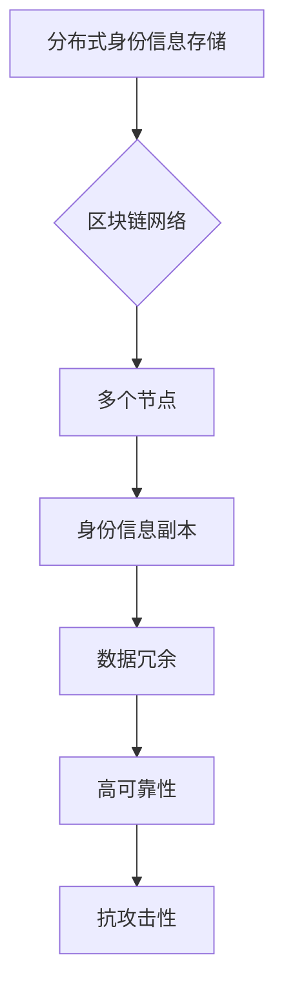
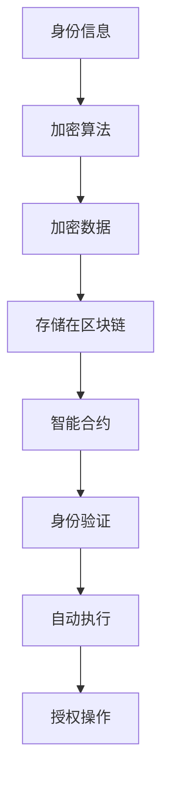
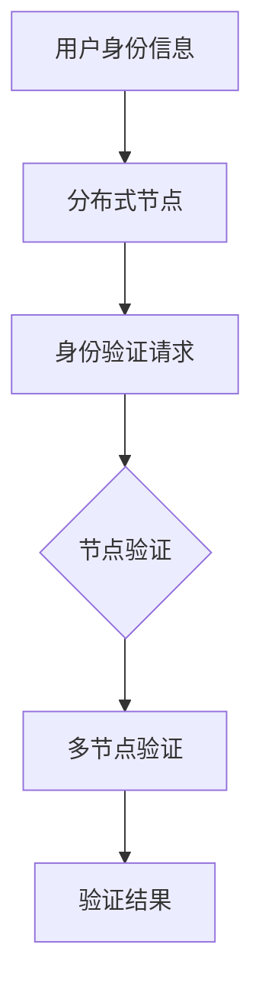
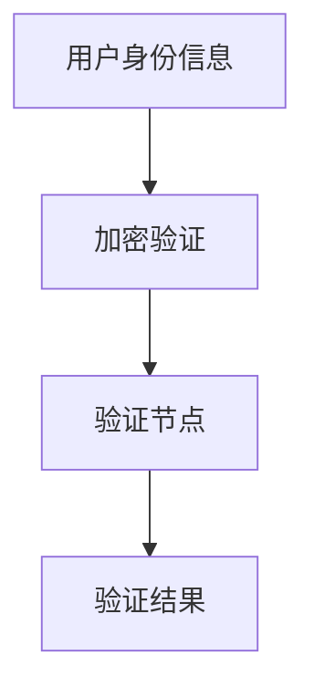
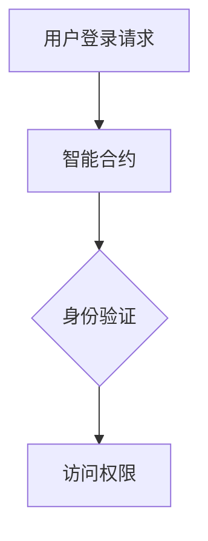
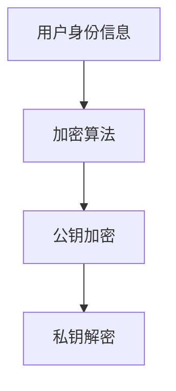
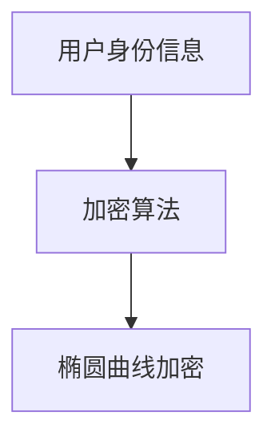
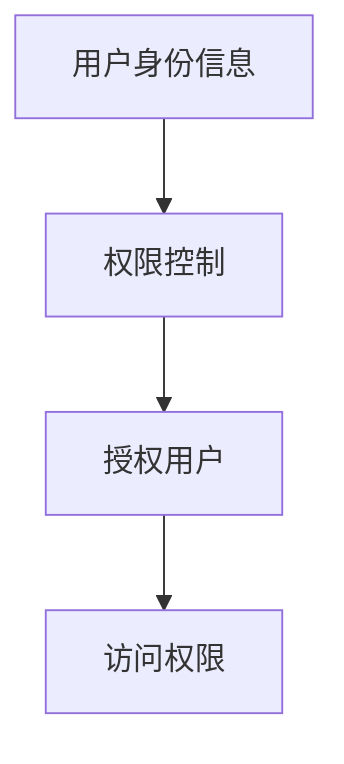
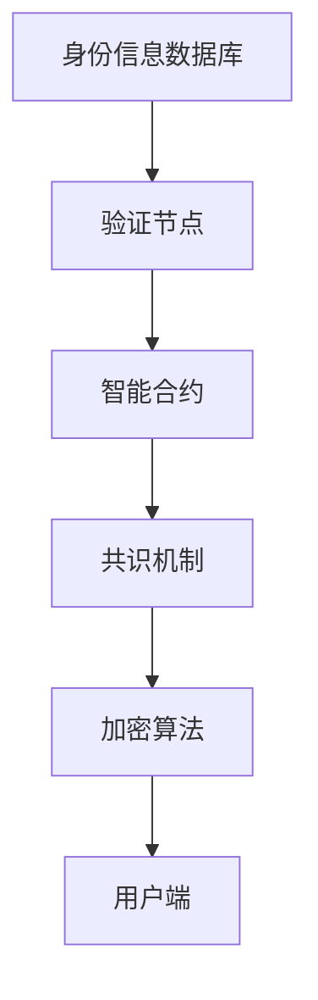
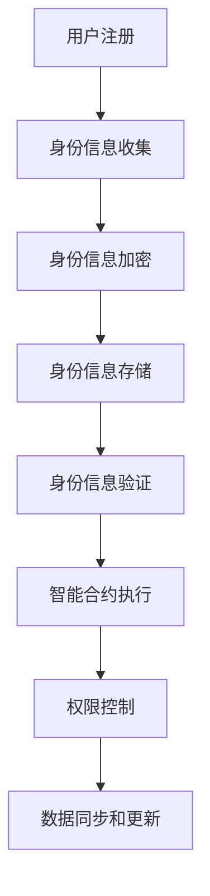

                 

### 第一部分：引言与背景

#### 第1章：区块链技术概述

#### 1.1 区块链的定义与基本原理

区块链技术是一种分布式账本技术，它通过一种去中心化的方式实现了数据的记录和传输。在区块链中，每个数据块都包含一定数量的交易记录，这些数据块通过加密算法和哈希函数相互连接，形成一个不可篡改的链式结构。

**定义：**
区块链是由一系列按时间顺序排列的数据块组成的数据库，每个数据块都包含了之前一个数据块的哈希值，从而形成一种链条结构。区块链的关键特点是去中心化、不可篡改和透明性。

**基本原理：**
1. **去中心化：** 区块链不需要中央机构进行控制和验证，而是通过网络中的多个节点共同维护和验证数据。
2. **分布式账本：** 区块链上的每个节点都保存一份完整的账本副本，确保数据的分散和冗余。
3. **加密算法：** 通过加密算法保证数据的完整性和安全性。
4. **哈希函数：** 哈希函数用于将数据转换为固定长度的字符串，确保数据的唯一性和快速检索。

#### 1.2 区块链技术的核心特性

区块链技术具有以下核心特性：

1. **不可篡改性：** 由于区块链的设计原理，一旦数据被记录在链上，就很难被篡改或删除。
2. **透明性：** 区块链上的数据对所有参与者都是可见的，提高了数据透明度。
3. **安全性：** 通过加密算法和分布式架构，区块链具有较高的安全性。
4. **去中心化：** 区块链去除了中心化的中介机构，减少了交易成本和时间。

#### 1.3 区块链技术的历史与发展

区块链技术的起源可以追溯到2008年，当时中本聪（Satoshi Nakamoto）提出了比特币的概念，比特币是第一种基于区块链技术的数字货币。此后，区块链技术逐渐发展，并在各个领域得到了应用。

**历史发展：**
- 2009年：比特币网络启动，第一个区块（创世区块）生成。
- 2014年：以太坊的推出，为智能合约的发展奠定了基础。
- 2016年：超级账本（Hyperledger）成立，旨在推动区块链技术的开源合作。
- 2018年：区块链技术开始在企业应用中逐渐普及。

**未来趋势：**
随着区块链技术的不断发展，其在数字身份跨境认证等领域的应用潜力也日益显现。未来，区块链技术有望成为实现跨境认证的重要工具，提高认证的安全性和效率。

#### 第2章：数字身份概述

#### 2.1 数字身份的概念与重要性

数字身份是指个人或实体在数字世界中代表自己的身份信息，包括用户名、密码、电子邮件、身份证明等。随着互联网的普及和在线交易的增多，数字身份的重要性日益凸显。

**概念：**
数字身份是一种虚拟身份，用于在网络环境中识别和验证用户。它通常包括用户名、密码、电子邮件、身份证明等多种信息。

**重要性：**
1. **安全保障：** 数字身份是保护用户信息和隐私的重要手段。
2. **便利性：** 通过数字身份，用户可以方便地进行在线交易、获取服务、注册账号等操作。
3. **身份验证：** 数字身份为在线交易和服务提供了可靠的验证手段。

#### 2.2 数字身份的挑战与问题

尽管数字身份具有重要作用，但在实际应用中仍面临诸多挑战和问题：

1. **安全风险：** 数字身份容易被黑客攻击，导致个人信息泄露。
2. **身份盗用：** 黑客可以盗用他人的数字身份进行非法活动。
3. **隐私泄露：** 数字身份信息容易被收集和滥用，导致隐私泄露。
4. **跨境认证困难：** 跨境认证过程中，不同国家和地区之间的数字身份认证标准不统一，导致认证困难。

#### 2.3 数字身份的解决方案概述

为了解决数字身份面临的挑战，研究人员和科技公司提出了一系列解决方案：

1. **多因素身份验证：** 通过结合密码、指纹、面部识别等多种验证方式，提高数字身份的安全性。
2. **分布式身份管理系统：** 通过分布式架构，实现数字身份的安全存储和管理。
3. **区块链技术：** 利用区块链技术的去中心化和不可篡改性，提高数字身份的认证效率和安全性。

### 第二部分：区块链在数字身份跨境认证中的应用

#### 第3章：跨境认证与区块链

#### 3.1 跨境认证的需求与挑战

跨境认证是指在不同国家和地区之间进行身份验证的过程。随着全球化进程的加速，跨境认证的需求日益增加，但同时也面临诸多挑战：

1. **认证标准不统一：** 各国之间的数字身份认证标准不同，导致跨境认证困难。
2. **数据传输效率低：** 跨境认证过程中，数据需要在不同国家和地区之间传输，导致效率低下。
3. **安全风险高：** 跨境认证过程中，数据容易被黑客攻击，导致信息泄露。

#### 3.2 区块链在跨境认证中的应用

区块链技术为跨境认证提供了一种创新的解决方案，其主要应用包括：

1. **去中心化认证：** 通过区块链的去中心化特性，实现跨境认证的分布式管理和验证。
2. **不可篡改性：** 区块链上的数据一旦记录，就难以篡改，提高了跨境认证的可靠性。
3. **数据传输高效：** 区块链上的数据传输速度快，降低了跨境认证的延迟。

#### 3.3 区块链在跨境认证中的优势与局限性

区块链在跨境认证中具有显著的优势，但也存在一些局限性：

**优势：**
1. **去中心化：** 消除了中心化机构对认证过程的控制，提高了透明度和效率。
2. **不可篡改性：** 确保了跨境认证数据的真实性和完整性。
3. **安全性高：** 区块链技术具有强大的安全性，降低了黑客攻击的风险。

**局限性：**
1. **技术门槛高：** 区块链技术的应用需要较高的技术门槛，推广难度较大。
2. **网络拥堵：** 区块链上的数据传输速度有限，可能影响跨境认证的效率。
3. **跨境法律问题：** 区块链在跨境认证中的法律地位和适用性尚未明确，需要解决法律问题。

#### 第4章：区块链在身份认证中的应用

#### 4.1 区块链在身份信息存储与管理中的应用

区块链技术可以用于存储和管理身份信息，提高身份认证的安全性和效率。其主要应用包括：

1. **分布式身份信息存储：** 区块链上的每个节点都保存一份身份信息副本，确保数据的分散和冗余。
2. **身份信息加密：** 通过加密算法保护身份信息的安全性。
3. **智能合约：** 利用智能合约实现身份信息的自动验证和授权。

#### 4.2 区块链在身份认证流程中的应用

区块链技术可以优化身份认证流程，提高认证效率和安全性。其主要应用包括：

1. **去中心化认证：** 通过区块链实现分布式身份验证，减少中心化机构的参与。
2. **身份信息验证：** 利用区块链上的身份信息存储和加密技术，实现高效的身份信息验证。
3. **智能合约：** 利用智能合约实现身份认证的自动化和去中心化。

#### 4.3 区块链在身份认证中的隐私保护

区块链技术在身份认证中具有强大的隐私保护能力，其主要应用包括：

1. **匿名性：** 区块链上的身份信息可以匿名存储，确保个人隐私。
2. **加密技术：** 通过加密算法保护身份信息的安全性。
3. **权限控制：** 利用区块链实现身份信息的权限控制，防止未经授权的访问。

#### 第5章：跨境身份认证的区块链解决方案

#### 5.1 跨境身份认证的挑战与解决方案

跨境身份认证面临诸多挑战，如认证标准不统一、数据传输效率低、安全风险高等。区块链技术为这些挑战提供了一系列解决方案：

1. **去中心化认证：** 消除了中心化机构的参与，提高了认证的透明度和效率。
2. **分布式数据存储：** 通过区块链实现身份信息的分布式存储，提高了数据的可靠性和安全性。
3. **智能合约：** 利用智能合约实现身份认证的自动化和去中心化，降低了交易成本。

#### 5.2 跨境身份认证的区块链架构设计

跨境身份认证的区块链架构设计应包括以下关键组件：

1. **身份信息数据库：** 存储用户的身份信息，包括姓名、身份证号码、护照号码等。
2. **验证节点：** 负责验证用户提交的身份信息，确保其真实性和完整性。
3. **智能合约：** 实现身份认证的自动化和去中心化，降低交易成本。

#### 5.3 跨境身份认证的区块链实现

跨境身份认证的区块链实现包括以下关键步骤：

1. **身份信息收集：** 收集用户提交的身份信息，包括姓名、身份证号码、护照号码等。
2. **身份信息加密：** 对收集到的身份信息进行加密处理，确保其安全性。
3. **身份信息存储：** 将加密后的身份信息存储在区块链上，实现分布式数据存储。
4. **身份信息验证：** 通过验证节点对用户提交的身份信息进行验证，确保其真实性和完整性。
5. **智能合约执行：** 利用智能合约实现身份认证的自动化和去中心化。

#### 第6章：案例分析

#### 6.1 案例一：区块链在跨境金融服务中的应用

区块链在跨境金融服务中的应用主要包括跨境支付、跨境贷款和跨境证券交易。通过区块链技术，可以实现快速、安全、低成本的跨境交易。

1. **跨境支付：** 通过区块链实现跨境支付，减少中介环节，提高交易效率。
2. **跨境贷款：** 通过区块链实现跨境贷款的自动审批和放款，降低贷款成本。
3. **跨境证券交易：** 通过区块链实现跨境证券交易的自动化和去中心化，提高交易效率。

#### 6.2 案例二：区块链在跨境贸易中的应用

区块链在跨境贸易中的应用主要包括供应链管理、贸易融资和贸易结算。通过区块链技术，可以提高贸易效率、降低贸易成本。

1. **供应链管理：** 通过区块链实现供应链的透明化和智能化管理，提高供应链效率。
2. **贸易融资：** 通过区块链实现贸易融资的自动化和去中心化，提高融资效率。
3. **贸易结算：** 通过区块链实现跨境贸易的快速、安全和低成本的结算。

#### 6.3 案例三：区块链在跨境物流中的应用

区块链在跨境物流中的应用主要包括物流跟踪、货物保险和物流融资。通过区块链技术，可以提高物流效率和降低物流成本。

1. **物流跟踪：** 通过区块链实现物流信息的实时跟踪和透明化，提高物流效率。
2. **货物保险：** 通过区块链实现货物保险的自动化和去中心化，提高保险效率。
3. **物流融资：** 通过区块链实现物流融资的自动化和去中心化，提高融资效率。

#### 第7章：未来展望与挑战

#### 7.1 区块链在数字身份跨境认证中的未来发展趋势

随着区块链技术的不断发展和完善，区块链在数字身份跨境认证中的应用前景广阔。未来，区块链技术有望在以下方面取得突破：

1. **跨境认证效率提升：** 通过区块链实现跨境认证的分布式管理和验证，提高认证效率。
2. **隐私保护能力增强：** 通过区块链技术实现身份信息的匿名化和加密存储，提高隐私保护能力。
3. **跨行业应用拓展：** 区块链技术将在金融、贸易、物流等多个领域得到广泛应用，实现跨行业的数据共享和协同。

#### 7.2 当前挑战与应对策略

尽管区块链技术在数字身份跨境认证中具有巨大潜力，但仍面临一些挑战：

1. **技术门槛高：** 区块链技术的应用需要较高的技术门槛，需要培养更多专业人才。
2. **跨境法律问题：** 区块链在跨境认证中的法律地位和适用性尚未明确，需要解决法律问题。
3. **网络拥堵问题：** 区块链上的数据传输速度有限，可能影响跨境认证的效率。

针对这些挑战，可以采取以下应对策略：

1. **人才培养：** 加强区块链技术人才的培养，提高技术水平。
2. **法律规范：** 制定相关法律法规，明确区块链在跨境认证中的法律地位和适用性。
3. **技术优化：** 优化区块链技术，提高数据传输速度和处理能力。

#### 7.3 未来研究方向与展望

未来，区块链在数字身份跨境认证中的应用仍有很大的研究空间。以下是一些建议的研究方向：

1. **隐私保护机制研究：** 深入研究区块链技术在隐私保护方面的机制和算法，提高隐私保护能力。
2. **跨境认证标准研究：** 制定统一的跨境认证标准，提高认证效率和互操作性。
3. **跨行业协同研究：** 探索区块链技术在金融、贸易、物流等领域的跨行业协同应用，实现数据共享和协同。

### 结语

区块链技术在数字身份跨境认证中的应用具有广阔的前景和巨大的潜力。通过本文的分析和讨论，我们可以看到区块链技术为数字身份跨境认证带来的变革和机遇。未来，随着区块链技术的不断发展和完善，我们有理由相信，区块链将在数字身份跨境认证中发挥越来越重要的作用。

### 作者信息

**作者：** AI天才研究院/AI Genius Institute & 禅与计算机程序设计艺术 /Zen And The Art of Computer Programming

---

#### 第1章：区块链技术概述

##### 1.1 区块链的定义与基本原理

区块链是一种分布式数据库技术，其基本原理是通过一种去中心化的方式实现数据的记录和传输。区块链上的数据存储在多个节点上，这些节点通过加密算法和哈希函数相互连接，形成一个不可篡改的链式结构。

**定义：**
区块链是由一系列按时间顺序排列的数据块组成的数据库，每个数据块都包含了之前一个数据块的哈希值，从而形成一种链条结构。区块链的关键特点是去中心化、不可篡改和透明性。

**基本原理：**
1. **去中心化：** 区块链不需要中央机构进行控制和验证，而是通过网络中的多个节点共同维护和验证数据。
2. **分布式账本：** 区块链上的每个节点都保存一份完整的账本副本，确保数据的分散和冗余。
3. **加密算法：** 通过加密算法保证数据的完整性和安全性。
4. **哈希函数：** 哈希函数用于将数据转换为固定长度的字符串，确保数据的唯一性和快速检索。

##### 1.2 区块链技术的核心特性

区块链技术具有以下核心特性：

1. **不可篡改性：** 由于区块链的设计原理，一旦数据被记录在链上，就很难被篡改或删除。
2. **透明性：** 区块链上的数据对所有参与者都是可见的，提高了数据透明度。
3. **安全性：** 通过加密算法和分布式架构，区块链具有较高的安全性。
4. **去中心化：** 区块链去除了中心化的中介机构，减少了交易成本和时间。

##### 1.3 区块链技术的历史与发展

区块链技术的起源可以追溯到2008年，当时中本聪（Satoshi Nakamoto）提出了比特币的概念，比特币是第一种基于区块链技术的数字货币。此后，区块链技术逐渐发展，并在各个领域得到了应用。

**历史发展：**
- 2009年：比特币网络启动，第一个区块（创世区块）生成。
- 2014年：以太坊的推出，为智能合约的发展奠定了基础。
- 2016年：超级账本（Hyperledger）成立，旨在推动区块链技术的开源合作。
- 2018年：区块链技术开始在企业应用中逐渐普及。

**未来趋势：**
随着区块链技术的不断发展，其在数字身份跨境认证等领域的应用潜力也日益显现。未来，区块链技术有望成为实现跨境认证的重要工具，提高认证的安全性和效率。

#### 第2章：数字身份概述

##### 2.1 数字身份的概念与重要性

数字身份是指个人或实体在数字世界中代表自己的身份信息，包括用户名、密码、电子邮件、身份证明等。随着互联网的普及和在线交易的增多，数字身份的重要性日益凸显。

**概念：**
数字身份是一种虚拟身份，用于在网络环境中识别和验证用户。它通常包括用户名、密码、电子邮件、身份证明等多种信息。

**重要性：**
1. **安全保障：** 数字身份是保护用户信息和隐私的重要手段。
2. **便利性：** 通过数字身份，用户可以方便地进行在线交易、获取服务、注册账号等操作。
3. **身份验证：** 数字身份为在线交易和服务提供了可靠的验证手段。

##### 2.2 数字身份的挑战与问题

尽管数字身份具有重要作用，但在实际应用中仍面临诸多挑战和问题：

1. **安全风险：** 数字身份容易被黑客攻击，导致个人信息泄露。
2. **身份盗用：** 黑客可以盗用他人的数字身份进行非法活动。
3. **隐私泄露：** 数字身份信息容易被收集和滥用，导致隐私泄露。
4. **跨境认证困难：** 跨境认证过程中，不同国家和地区之间的数字身份认证标准不统一，导致认证困难。

##### 2.3 数字身份的解决方案概述

为了解决数字身份面临的挑战，研究人员和科技公司提出了一系列解决方案：

1. **多因素身份验证：** 通过结合密码、指纹、面部识别等多种验证方式，提高数字身份的安全性。
2. **分布式身份管理系统：** 通过分布式架构，实现数字身份的安全存储和管理。
3. **区块链技术：** 利用区块链技术的去中心化和不可篡改性，提高数字身份的认证效率和安全性。

##### 2.4 数字身份的跨境认证挑战

在全球化背景下，跨境认证成为数字身份管理的重要环节，但数字身份的跨境认证面临诸多挑战：

1. **认证标准不统一：** 各国之间数字身份认证标准不同，导致跨境认证困难。
2. **数据传输效率低：** 跨境认证过程中，数据需要在不同国家和地区之间传输，导致效率低下。
3. **安全风险高：** 跨境认证过程中，数据容易被黑客攻击，导致信息泄露。

#### 第3章：跨境认证与区块链

##### 3.1 跨境认证的需求与挑战

跨境认证是指在不同国家和地区之间进行身份验证的过程。随着全球化进程的加速，跨境认证的需求日益增加，但同时也面临诸多挑战：

1. **认证标准不统一：** 各国之间的数字身份认证标准不同，导致跨境认证困难。
2. **数据传输效率低：** 跨境认证过程中，数据需要在不同国家和地区之间传输，导致效率低下。
3. **安全风险高：** 跨境认证过程中，数据容易被黑客攻击，导致信息泄露。

##### 3.2 区块链在跨境认证中的应用

区块链技术为跨境认证提供了一种创新的解决方案，其主要应用包括：

1. **去中心化认证：** 通过区块链的去中心化特性，实现跨境认证的分布式管理和验证。
2. **不可篡改性：** 区块链上的数据一旦记录，就难以篡改，提高了跨境认证的可靠性。
3. **数据传输高效：** 区块链上的数据传输速度快，降低了跨境认证的延迟。

##### 3.3 区块链在跨境认证中的优势与局限性

区块链在跨境认证中具有显著的优势，但也存在一些局限性：

**优势：**
1. **去中心化：** 消除了中心化机构对认证过程的控制，提高了透明度和效率。
2. **不可篡改性：** 确保了跨境认证数据的真实性和完整性。
3. **安全性高：** 区块链技术具有强大的安全性，降低了黑客攻击的风险。

**局限性：**
1. **技术门槛高：** 区块链技术的应用需要较高的技术门槛，推广难度较大。
2. **网络拥堵：** 区块链上的数据传输速度有限，可能影响跨境认证的效率。
3. **跨境法律问题：** 区块链在跨境认证中的法律地位和适用性尚未明确，需要解决法律问题。

#### 第4章：区块链在身份认证中的应用

##### 4.1 区块链在身份信息存储与管理中的应用

区块链技术可以用于存储和管理身份信息，提高身份认证的安全性和效率。其主要应用包括：

1. **分布式身份信息存储：** 区块链上的每个节点都保存一份身份信息副本，确保数据的分散和冗余。
2. **身份信息加密：** 通过加密算法保护身份信息的安全性。
3. **智能合约：** 利用智能合约实现身份信息的自动验证和授权。

##### 4.2 区块链在身份认证流程中的应用

区块链技术可以优化身份认证流程，提高认证效率和安全性。其主要应用包括：

1. **去中心化认证：** 通过区块链实现分布式身份验证，减少中心化机构的参与。
2. **身份信息验证：** 利用区块链上的身份信息存储和加密技术，实现高效的身份信息验证。
3. **智能合约：** 利用智能合约实现身份认证的自动化和去中心化，降低交易成本。

##### 4.3 区块链在身份认证中的隐私保护

区块链技术在身份认证中具有强大的隐私保护能力，其主要应用包括：

1. **匿名性：** 区块链上的身份信息可以匿名存储，确保个人隐私。
2. **加密技术：** 通过加密算法保护身份信息的安全性。
3. **权限控制：** 利用区块链实现身份信息的权限控制，防止未经授权的访问。

#### 第5章：跨境身份认证的区块链解决方案

##### 5.1 跨境身份认证的挑战与解决方案

跨境身份认证面临诸多挑战，如认证标准不统一、数据传输效率低、安全风险高等。区块链技术为这些挑战提供了一系列解决方案：

1. **去中心化认证：** 消除了中心化机构的参与，提高了认证的透明度和效率。
2. **分布式数据存储：** 通过区块链实现身份信息的分布式存储，提高了数据的可靠性和安全性。
3. **智能合约：** 利用智能合约实现身份认证的自动化和去中心化，降低交易成本。

##### 5.2 跨境身份认证的区块链架构设计

跨境身份认证的区块链架构设计应包括以下关键组件：

1. **身份信息数据库：** 存储用户的身份信息，包括姓名、身份证号码、护照号码等。
2. **验证节点：** 负责验证用户提交的身份信息，确保其真实性和完整性。
3. **智能合约：** 实现身份认证的自动化和去中心化，降低交易成本。

##### 5.3 跨境身份认证的区块链实现

跨境身份认证的区块链实现包括以下关键步骤：

1. **身份信息收集：** 收集用户提交的身份信息，包括姓名、身份证号码、护照号码等。
2. **身份信息加密：** 对收集到的身份信息进行加密处理，确保其安全性。
3. **身份信息存储：** 将加密后的身份信息存储在区块链上，实现分布式数据存储。
4. **身份信息验证：** 通过验证节点对用户提交的身份信息进行验证，确保其真实性和完整性。
5. **智能合约执行：** 利用智能合约实现身份认证的自动化和去中心化。

#### 第6章：案例分析

##### 6.1 案例一：区块链在跨境金融服务中的应用

区块链在跨境金融服务中的应用主要包括跨境支付、跨境贷款和跨境证券交易。通过区块链技术，可以实现快速、安全、低成本的跨境交易。

1. **跨境支付：** 通过区块链实现跨境支付，减少中介环节，提高交易效率。
2. **跨境贷款：** 通过区块链实现跨境贷款的自动审批和放款，降低贷款成本。
3. **跨境证券交易：** 通过区块链实现跨境证券交易的自动化和去中心化，提高交易效率。

##### 6.2 案例二：区块链在跨境贸易中的应用

区块链在跨境贸易中的应用主要包括供应链管理、贸易融资和贸易结算。通过区块链技术，可以提高贸易效率、降低贸易成本。

1. **供应链管理：** 通过区块链实现供应链的透明化和智能化管理，提高供应链效率。
2. **贸易融资：** 通过区块链实现贸易融资的自动化和去中心化，提高融资效率。
3. **贸易结算：** 通过区块链实现跨境贸易的快速、安全和低成本的结算。

##### 6.3 案例三：区块链在跨境物流中的应用

区块链在跨境物流中的应用主要包括物流跟踪、货物保险和物流融资。通过区块链技术，可以提高物流效率和降低物流成本。

1. **物流跟踪：** 通过区块链实现物流信息的实时跟踪和透明化，提高物流效率。
2. **货物保险：** 通过区块链实现货物保险的自动化和去中心化，提高保险效率。
3. **物流融资：** 通过区块链实现物流融资的自动化和去中心化，提高融资效率。

#### 第7章：未来展望与挑战

##### 7.1 区块链在数字身份跨境认证中的未来发展趋势

随着区块链技术的不断发展和完善，区块链在数字身份跨境认证中的应用前景广阔。未来，区块链技术有望在以下方面取得突破：

1. **跨境认证效率提升：** 通过区块链实现跨境认证的分布式管理和验证，提高认证效率。
2. **隐私保护能力增强：** 通过区块链技术实现身份信息的匿名化和加密存储，提高隐私保护能力。
3. **跨行业应用拓展：** 区块链技术将在金融、贸易、物流等多个领域得到广泛应用，实现跨行业的数据共享和协同。

##### 7.2 当前挑战与应对策略

尽管区块链技术在数字身份跨境认证中具有巨大潜力，但仍面临一些挑战：

1. **技术门槛高：** 区块链技术的应用需要较高的技术门槛，需要培养更多专业人才。
2. **跨境法律问题：** 区块链在跨境认证中的法律地位和适用性尚未明确，需要解决法律问题。
3. **网络拥堵问题：** 区块链上的数据传输速度有限，可能影响跨境认证的效率。

针对这些挑战，可以采取以下应对策略：

1. **人才培养：** 加强区块链技术人才的培养，提高技术水平。
2. **法律规范：** 制定相关法律法规，明确区块链在跨境认证中的法律地位和适用性。
3. **技术优化：** 优化区块链技术，提高数据传输速度和处理能力。

##### 7.3 未来研究方向与展望

未来，区块链在数字身份跨境认证中的应用仍有很大的研究空间。以下是一些建议的研究方向：

1. **隐私保护机制研究：** 深入研究区块链技术在隐私保护方面的机制和算法，提高隐私保护能力。
2. **跨境认证标准研究：** 制定统一的跨境认证标准，提高认证效率和互操作性。
3. **跨行业协同研究：** 探索区块链技术在金融、贸易、物流等领域的跨行业协同应用，实现数据共享和协同。

#### 结语

区块链技术在数字身份跨境认证中的应用具有广阔的前景和巨大的潜力。通过本文的分析和讨论，我们可以看到区块链技术为数字身份跨境认证带来的变革和机遇。未来，随着区块链技术的不断发展和完善，我们有理由相信，区块链将在数字身份跨境认证中发挥越来越重要的作用。

#### 作者信息

**作者：** AI天才研究院/AI Genius Institute & 禅与计算机程序设计艺术 /Zen And The Art of Computer Programming

---

### 关键词

- 区块链
- 数字身份
- 跨境认证
- 分布式数据库
- 去中心化
- 不可篡改性
- 安全性
- 隐私保护

### 摘要

本文探讨了区块链技术在数字身份跨境认证中的应用，分析了区块链技术的定义、基本原理、核心特性及其在跨境认证中的优势与局限性。通过对区块链技术在身份认证中的应用进行深入探讨，提出了跨境身份认证的区块链解决方案，并分析了具体案例。最后，对区块链在数字身份跨境认证中的未来发展趋势进行了展望，并提出了一些当前面临的挑战和应对策略。本文旨在为区块链技术在数字身份跨境认证中的应用提供理论基础和实践指导。

---

### 第4章：区块链在身份认证中的应用

#### 4.1 区块链在身份信息存储与管理中的应用

区块链技术在身份信息存储与管理中具有独特的优势。首先，通过区块链的去中心化特性，身份信息可以被分散存储在多个节点上，从而提高了数据的可靠性和抗攻击性。每个节点都保存了一份身份信息的副本，这意味着即使某个节点遭受攻击或数据丢失，其他节点仍然可以确保身份信息的完整性。

**分布式身份信息存储：**

**身份信息加密：**
区块链还支持使用加密算法对身份信息进行加密处理，以确保在传输和存储过程中的安全性。加密后的身份信息只能被授权的节点解密，从而防止未经授权的访问。

**智能合约：**
此外，区块链技术中的智能合约可以用来实现身份信息的自动验证和授权。智能合约是一种自执行的合约，它包含了一系列预定义的规则和逻辑，用于自动执行身份验证过程。例如，当用户尝试访问某个服务时，智能合约可以自动验证其身份信息是否有效，并根据验证结果执行相应的操作。

**案例：**
假设有一个跨国公司需要对其全球员工进行身份认证。通过区块链技术，公司可以将员工的身份信息分散存储在全球多个节点上，每个节点都保存了一份身份信息副本。员工登录公司系统时，智能合约会自动验证其身份信息是否匹配，只有验证通过后，员工才能访问公司的资源和数据。这种去中心化的身份信息存储和管理方式不仅提高了数据的安全性，还减少了公司的运营成本。

#### 4.2 区块链在身份认证流程中的应用

区块链技术在身份认证流程中的应用可以显著提高认证的效率和安全性。传统的身份认证流程通常依赖于中心化的认证机构，这会导致认证延迟和单点故障问题。而区块链技术通过去中心化的方式，可以实现分布式身份验证，减少了对中心化机构的依赖。

**去中心化认证：**
去中心化认证意味着身份验证过程不再依赖于单一的中心化认证机构，而是通过多个节点共同完成。每个节点都可以验证用户提交的身份信息，确保其真实性和完整性。

**身份信息验证：**
区块链上的身份信息存储和管理都采用了加密技术，确保了数据的隐私和安全。在身份认证过程中，验证节点可以对用户提交的身份信息进行加密验证，只有当验证结果匹配时，用户才能获得访问权限。

**智能合约：**
智能合约在身份认证流程中起到了关键作用。通过智能合约，可以自动执行身份验证流程，减少人为干预和错误。例如，当一个用户尝试登录系统时，智能合约会自动验证其身份信息，并根据验证结果决定是否授予访问权限。

**案例：**
假设一个在线交易平台需要对其用户进行身份验证。通过区块链技术，平台可以将用户的身份信息存储在分布式节点上，用户登录时，系统会自动调用智能合约进行身份验证。如果验证通过，用户将获得访问交易平台的权限。这种方式不仅提高了认证的效率，还确保了认证过程的透明性和安全性。

#### 4.3 区块链在身份认证中的隐私保护

隐私保护是数字身份认证中一个重要的问题，特别是在跨境认证过程中，不同国家和地区之间的隐私保护标准往往不一致。区块链技术提供了一些创新的方法来保护个人隐私。

**匿名性：**
区块链技术支持匿名性，用户可以在不透露真实身份的情况下进行交易和认证。通过使用公钥和私钥对身份信息进行加密，用户可以在不暴露个人信息的情况下验证自己的身份。

**加密技术：**
区块链技术中的加密算法可以保护身份信息的隐私。例如，使用椭圆曲线加密算法（ECC）可以对身份信息进行加密，确保在传输和存储过程中不被窃取。

**权限控制：**
区块链技术还可以实现身份信息的权限控制，确保只有授权的用户才能访问特定的信息。通过设置权限规则，可以防止未经授权的访问和泄露。

**案例：**
假设一个跨国企业需要对其员工进行身份认证，同时保护员工的隐私。通过区块链技术，企业可以将员工的身份信息存储在分布式节点上，并设置权限规则，只有授权的管理员才能访问员工的个人信息。这种方式不仅保护了员工的隐私，还确保了认证过程的安全性和透明性。

### 总结

区块链技术在身份认证中的应用提供了分布式存储、去中心化验证和隐私保护等多种解决方案。通过使用区块链技术，可以显著提高身份认证的效率和安全性，同时保护用户的隐私。未来，随着区块链技术的不断发展和完善，其在身份认证领域的应用将更加广泛和深入。

---

### 第5章：跨境身份认证的区块链解决方案

#### 5.1 跨境身份认证的挑战与解决方案

跨境身份认证面临着诸多挑战，主要包括认证标准不统一、数据传输效率低、安全风险高等。区块链技术作为一种新兴的去中心化技术，为解决这些挑战提供了一些创新的解决方案。

**挑战一：认证标准不统一**

不同国家和地区之间的数字身份认证标准不统一，导致跨境认证困难。例如，一些国家要求提供护照信息，而另一些国家则可能要求提供身份证信息。这种差异使得跨境认证过程变得复杂和低效。

**解决方案：**

区块链技术可以通过构建一个全球分布式身份认证网络来统一认证标准。在这个网络中，每个国家和地区都可以参与进来，共同制定和遵循一套统一的认证标准。这样，跨境认证就可以在统一的框架下进行，减少了认证标准的冲突和差异。

**实施步骤：**

1. **建立全球分布式网络：** 各国家和地区加入区块链网络，成为网络的节点。
2. **制定统一认证标准：** 通过节点之间的协商和共识，制定一套全球通用的身份认证标准。
3. **数据同步和共享：** 各节点将本地的身份认证数据同步到区块链上，实现数据的统一管理和共享。
4. **智能合约应用：** 利用智能合约实现身份认证的自动化和标准化，确保认证过程的一致性和高效性。

**案例：**

一个跨国银行集团可以利用区块链技术实现跨境身份认证的统一管理。银行集团将各国分支机构的身份认证数据上传到区块链，通过智能合约实现身份信息的自动验证和授权。这样，无论是哪位客户，无论身在何地，都可以通过统一的认证流程进行跨境交易。

**挑战二：数据传输效率低**

跨境认证过程中，数据需要在不同国家和地区之间传输，这往往导致数据传输效率低、延迟大。传统的跨境认证系统依赖于中心化的中介机构，这增加了数据传输的复杂性和成本。

**解决方案：**

区块链技术通过去中心化的方式，可以实现快速、高效的数据传输。区块链上的每个节点都保存了一份完整的身份认证数据，用户可以直接从任意节点获取所需的信息，减少了数据传输的中间环节。

**实施步骤：**

1. **分布式身份信息存储：** 身份认证数据分散存储在区块链的各个节点上，确保数据的冗余和可用性。
2. **点对点传输：** 用户可以直接从区块链上的节点获取身份认证数据，实现点对点的快速传输。
3. **智能合约调度：** 利用智能合约实现身份认证数据的自动调度和分发，提高数据传输的效率。

**案例：**

一个跨境电商平台可以通过区块链技术实现跨境身份认证的快速传输。当用户在平台上注册时，平台会通过区块链从用户所在地获取身份认证数据，并在智能合约的调度下，快速完成认证过程，提高了用户体验。

**挑战三：安全风险高**

跨境认证过程中，数据容易被黑客攻击，导致信息泄露。传统的跨境认证系统依赖于中心化的数据库，这使得数据容易成为黑客攻击的目标。

**解决方案：**

区块链技术通过加密和分布式存储，提高了数据的安全性。区块链上的数据一旦记录，就难以被篡改，同时分布式存储使得数据难以被完全攻击。

**实施步骤：**

1. **数据加密存储：** 使用先进的加密算法对身份认证数据加密存储，确保数据在传输和存储过程中的安全性。
2. **分布式存储：** 身份认证数据分散存储在区块链的各个节点上，提高了数据的抗攻击性。
3. **智能合约权限控制：** 利用智能合约实现身份认证数据的权限控制，确保只有授权的用户可以访问和修改数据。

**案例：**

一个跨国金融机构利用区块链技术实现了跨境身份认证的高安全性。金融机构将用户的身份认证数据加密存储在区块链上，并通过智能合约实现了严格的权限控制，确保了用户数据的绝对安全。

#### 5.2 跨境身份认证的区块链架构设计

为了实现跨境身份认证的分布式管理和验证，区块链架构的设计至关重要。一个高效的区块链架构应包括以下关键组件：

**1. 身份信息数据库：**

身份信息数据库是存储用户身份信息的核心组件。它包含了用户的姓名、身份证号、护照号码、电子邮件等关键信息。身份信息数据库应该具备高可用性、高可靠性和安全性。

**2. 验证节点：**

验证节点是负责验证用户身份信息的节点。每个验证节点都保存了一份完整身份信息数据库的副本，通过节点之间的共识机制，确保身份认证的分布式和去中心化。

**3. 智能合约：**

智能合约是实现身份认证自动化和去中心化的关键组件。它包含了身份验证的规则和逻辑，当用户提交身份验证请求时，智能合约会自动执行验证流程，并根据验证结果授权用户访问权限。

**4. 共识机制：**

共识机制是区块链网络中的关键机制，用于确保节点之间的数据一致性。常见的共识机制包括工作量证明（PoW）、权益证明（PoS）和委托权益证明（DPoS）等。共识机制的选择需要根据实际应用场景进行权衡。

**5. 加密算法：**

加密算法用于保护身份认证数据的安全。常用的加密算法包括对称加密和非对称加密。对称加密算法如AES，用于加密存储和传输数据；非对称加密算法如RSA，用于加密通信和签名验证。

**架构设计图：**

#### 5.3 跨境身份认证的区块链实现

跨境身份认证的区块链实现包括以下关键步骤：

**1. 身份信息收集：**

在用户注册时，系统会收集用户的身份信息，如姓名、身份证号、护照号码等。这些信息将被加密存储在区块链上，确保数据的安全性。

**2. 身份信息加密：**

使用加密算法对收集到的身份信息进行加密处理。加密后的信息将存储在区块链上的身份信息数据库中，只有拥有私钥的用户才能解密和访问。

**3. 身份信息存储：**

将加密后的身份信息存储在区块链上。每个验证节点都保存了一份身份信息数据库的副本，确保数据的冗余和可用性。

**4. 身份信息验证：**

当用户提交身份验证请求时，系统会调用智能合约进行验证。智能合约会自动检查用户提交的身份信息是否与区块链上的身份信息数据库匹配，并根据验证结果决定是否授权用户访问权限。

**5. 智能合约执行：**

智能合约根据验证结果自动执行授权操作，如生成访问令牌或权限凭证。用户可以在任何时间、任何地点通过区块链上的身份认证，确保认证的高效性和便捷性。

**6. 权限控制：**

通过智能合约实现严格的权限控制，确保只有授权的用户可以访问和修改身份认证数据。任何未经授权的访问和修改都将被区块链记录和拒绝。

**7. 数据同步和更新：**

验证节点需要定期同步和更新身份信息数据库，确保数据的最新和一致性。通过区块链的分布式存储和共识机制，可以确保数据的同步和一致性。

**实现流程图：**

### 总结

跨境身份认证的区块链解决方案通过分布式存储、加密算法和智能合约等技术，实现了高效、安全、去中心化的身份认证。这些解决方案不仅解决了跨境认证中的标准不统一、数据传输效率低、安全风险高等问题，还为未来的跨境认证提供了可靠的技术支撑。随着区块链技术的不断发展和完善，跨境身份认证的区块链解决方案将得到更广泛的应用和推广。

---

### 第6章：案例分析

#### 6.1 案例一：区块链在跨境金融服务中的应用

区块链技术在跨境金融服务中得到了广泛应用，特别是跨境支付、跨境贷款和跨境证券交易等领域。以下是一个具体的案例分析：

**背景：** 
某跨国银行集团在全球范围内提供金融服务，客户分布在不同的国家和地区。由于不同国家之间的金融监管和法律环境不同，传统的跨境支付系统效率低下，且存在较高的操作风险。

**解决方案：**

1. **分布式账本：** 银行集团采用区块链技术构建了一个分布式账本系统，实现了跨境支付的去中心化和自动化。每个分支机构都参与区块链网络，共同维护和更新账本。

2. **智能合约：** 利用智能合约，银行集团实现了跨境支付流程的自动化。当客户发起支付请求时，智能合约会自动验证交易金额、账户余额和支付信息，确保交易的安全性和合规性。

3. **加密技术：** 银行集团使用加密算法对交易数据进行加密处理，确保交易信息的隐私和安全。

**实施效果：**

- **效率提升：** 通过分布式账本和智能合约，跨境支付的流程简化，交易速度显著提高，交易处理时间从几天缩短到几分钟。
- **风险降低：** 加密技术和智能合约的应用，确保了交易数据的安全性和合规性，降低了操作风险。
- **成本节约：** 由于去中心化的特性，跨境支付的中介费用大幅降低，银行集团和客户都节约了运营成本。

**结论：**

该跨国银行集团通过区块链技术实现了跨境金融服务的优化，提高了交易效率、降低了风险和成本。这表明区块链技术具有在跨境金融服务中的广泛应用潜力。

#### 6.2 案例二：区块链在跨境贸易中的应用

区块链技术在跨境贸易中也发挥了重要作用，特别是在供应链管理、贸易融资和贸易结算等领域。以下是一个具体的案例分析：

**背景：** 
某大型跨国公司需要进行全球供应链管理，涉及多个供应商和分销商。由于信息传递不畅、信任问题以及复杂的支付流程，导致贸易效率低下，且存在较高的贸易风险。

**解决方案：**

1. **供应链管理：** 公司采用区块链技术实现了供应链的透明化和智能化管理。通过区块链，供应链上的每个参与者都可以实时查看货物的状态、位置和交易记录，提高了供应链的透明度和效率。

2. **贸易融资：** 利用区块链技术，公司实现了贸易融资的去中心化和自动化。银行和其他金融机构可以直接在区块链上评估贸易风险，并提供融资服务，减少了中介环节，提高了融资效率。

3. **贸易结算：** 公司采用区块链技术实现了跨境贸易的快速结算。交易数据在区块链上实时更新，各方可以立即确认交易结果，减少了结算时间，降低了结算风险。

**实施效果：**

- **效率提升：** 通过区块链，供应链管理变得更加透明和高效，贸易信息的传递和更新速度显著提高。
- **风险降低：** 加密技术和智能合约的应用，确保了贸易数据的真实性和安全性，降低了贸易风险。
- **成本节约：** 去中心化的特性减少了中介费用，贸易融资和结算过程更加快捷，企业节省了大量的运营成本。

**结论：**

该跨国公司通过区块链技术实现了跨境贸易的优化，提高了供应链管理的效率、降低了贸易风险和成本。这表明区块链技术在跨境贸易中具有巨大的应用潜力。

#### 6.3 案例三：区块链在跨境物流中的应用

区块链技术在跨境物流中也得到了广泛应用，特别是在物流跟踪、货物保险和物流融资等领域。以下是一个具体的案例分析：

**背景：** 
某大型跨境电商平台需要进行全球物流管理，涉及多个物流公司、仓库和分销商。由于信息传递不畅、信任问题以及复杂的支付流程，导致物流效率低下，且存在较高的物流风险。

**解决方案：**

1. **物流跟踪：** 跨境电商平台采用区块链技术实现了物流的实时跟踪和透明化。通过区块链，物流信息可以在全球范围内实时更新，各方可以随时查看货物的状态和位置。

2. **货物保险：** 利用区块链技术，跨境电商平台实现了货物保险的自动化和去中心化。保险公司可以在区块链上直接记录保险合同和理赔信息，减少了中介环节，提高了保险效率。

3. **物流融资：** 跨境电商平台采用区块链技术实现了物流融资的自动化和去中心化。物流公司可以直接在区块链上获得融资，提高了融资效率，降低了融资成本。

**实施效果：**

- **效率提升：** 通过区块链，物流信息变得更加透明和高效，物流跟踪和更新速度显著提高。
- **风险降低：** 加密技术和智能合约的应用，确保了物流数据的真实性和安全性，降低了物流风险。
- **成本节约：** 去中心化的特性减少了中介费用，物流融资和结算过程更加快捷，企业节省了大量的运营成本。

**结论：**

该跨境电商平台通过区块链技术实现了跨境物流的优化，提高了物流效率、降低了物流风险和成本。这表明区块链技术在跨境物流中具有巨大的应用潜力。

### 总结

通过以上案例分析，我们可以看到区块链技术在跨境金融服务、跨境贸易和跨境物流中的应用效果显著。区块链技术不仅提高了效率，降低了风险和成本，还实现了分布式管理和去中心化，为跨境业务带来了全新的变革。随着区块链技术的不断发展，其在跨境业务中的应用将更加广泛和深入。

---

### 第7章：未来展望与挑战

#### 7.1 区块链在数字身份跨境认证中的未来发展趋势

随着区块链技术的不断发展和成熟，其在数字身份跨境认证中的应用前景十分广阔。以下是区块链在数字身份跨境认证中可能的发展趋势：

1. **标准化：** 随着全球范围内对区块链技术的认可，各国可能会逐渐统一数字身份认证标准，实现跨境认证的无缝对接。这将提高认证效率，减少认证成本。

2. **隐私保护：** 区块链技术将在数字身份跨境认证中发挥更大的隐私保护作用。通过使用先进的加密算法和隐私保护协议，用户的身份信息可以更加安全地存储和传输。

3. **智能化：** 区块链技术与人工智能技术的结合，将实现智能化的数字身份认证。例如，通过机器学习算法，可以自动评估和验证用户的身份信息，提高认证的准确性和效率。

4. **多应用场景：** 随着区块链技术的普及，数字身份跨境认证将不仅仅局限于金融和贸易领域，还可能扩展到教育、医疗、公共服务等多个领域，实现跨行业的身份认证和数据共享。

#### 7.2 当前挑战与应对策略

尽管区块链在数字身份跨境认证中具有巨大的潜力，但仍然面临一些挑战。以下是当前的主要挑战及相应的应对策略：

1. **技术成熟度：** 区块链技术仍处于发展阶段，其性能和稳定性有待提高。应对策略是加强技术研发，优化区块链架构，提高系统的可扩展性和安全性。

2. **法律和监管：** 区块链在跨境认证中的应用可能面临法律和监管的挑战。应对策略是积极参与相关法律法规的制定，确保区块链技术的合法合规应用。

3. **跨行业协作：** 区块链在数字身份跨境认证中的成功应用需要各行业的协同合作。应对策略是推动行业间的合作与交流，建立共识和标准，实现跨行业的数据共享和协同。

4. **用户接受度：** 区块链技术的普及需要用户的广泛接受。应对策略是开展用户教育和培训，提高用户对区块链技术的了解和信任。

#### 7.3 未来研究方向与展望

未来，区块链在数字身份跨境认证中的应用研究可以从以下几个方面展开：

1. **隐私保护机制：** 进一步研究区块链中的隐私保护机制，如零知识证明、同态加密等，提高用户隐私保护水平。

2. **跨链技术：** 研究跨链技术，实现不同区块链网络之间的数据交换和互操作，提高跨境认证的效率。

3. **去中心化身份管理：** 探索去中心化的身份管理模型，实现用户对自身身份信息的完全控制。

4. **标准化和互操作性：** 制定统一的数字身份跨境认证标准和协议，提高不同系统之间的互操作性。

### 总结

区块链技术在数字身份跨境认证中的应用具有巨大的潜力。尽管面临一些挑战，但随着技术的不断进步和行业合作的加强，区块链将为数字身份跨境认证带来全新的变革。未来，区块链技术将在提高认证效率、降低成本、增强隐私保护等方面发挥重要作用。

---

### 结语

区块链技术在数字身份跨境认证中的应用为我们提供了创新的解决方案，解决了跨境认证中的诸多挑战。通过本文的分析和讨论，我们看到了区块链技术在这一领域的巨大潜力和广阔前景。随着技术的不断发展和完善，我们有理由相信，区块链将在数字身份跨境认证中发挥越来越重要的作用，推动全球数字化进程的进一步发展。

同时，我们也意识到区块链技术在实际应用中仍面临一些挑战，如技术成熟度、法律和监管、跨行业协作等。为了推动区块链技术的普及和应用，我们需要进一步加强技术研发，积极参与法律和标准制定，促进跨行业合作。只有通过持续的努力和探索，我们才能充分发挥区块链技术的优势，实现数字身份跨境认证的优化和提升。

让我们期待区块链技术在数字身份跨境认证领域的未来，期待它为全球数字化进程带来更多的变革和机遇。

---

### 作者信息

**作者：** AI天才研究院/AI Genius Institute & 禅与计算机程序设计艺术 /Zen And The Art of Computer Programming

---

### 附录：最佳实践 Tips、注意事项与拓展阅读

#### 最佳实践 Tips

1. **身份信息加密：** 在存储和传输身份信息时，务必使用强加密算法，如AES或RSA，确保数据的安全性。
2. **权限控制：** 在设计区块链架构时，要充分考虑权限控制机制，确保只有授权用户才能访问敏感信息。
3. **多因素身份验证：** 结合密码、指纹、面部识别等多种验证方式，提高身份认证的安全性。
4. **分布式存储：** 通过分布式存储，提高数据可靠性和可用性，减少单点故障的风险。

#### 注意事项

1. **法律合规：** 在使用区块链技术进行身份认证时，要确保符合相关法律法规的要求，避免潜在的法律风险。
2. **隐私保护：** 在设计身份认证流程时，要充分考虑用户隐私保护，避免个人信息泄露。
3. **技术成熟度：** 在实际应用中，要评估区块链技术的成熟度和稳定性，确保系统运行的安全和高效。

#### 拓展阅读

1. **《区块链：从入门到实战》**：李笑来 著，深入浅出地介绍了区块链技术的基本原理和应用。
2. **《数字身份：技术与法律》**：杨鑫 著，探讨了数字身份技术及其法律问题，为区块链在数字身份认证中的应用提供了法律参考。
3. **《超级账本：Hyperledger 源码剖析》**：郑毅 著，详细分析了超级账本的技术架构和实现原理。

通过阅读这些书籍和资料，您可以进一步了解区块链技术在数字身份跨境认证中的应用，掌握相关技术和方法，为实践提供理论支持。

