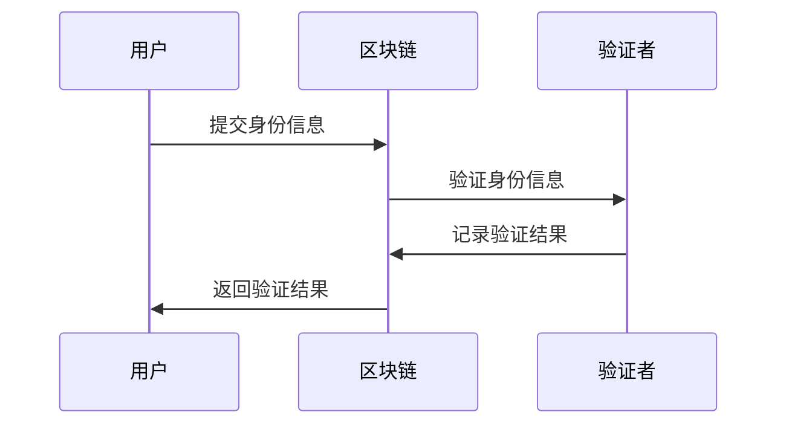
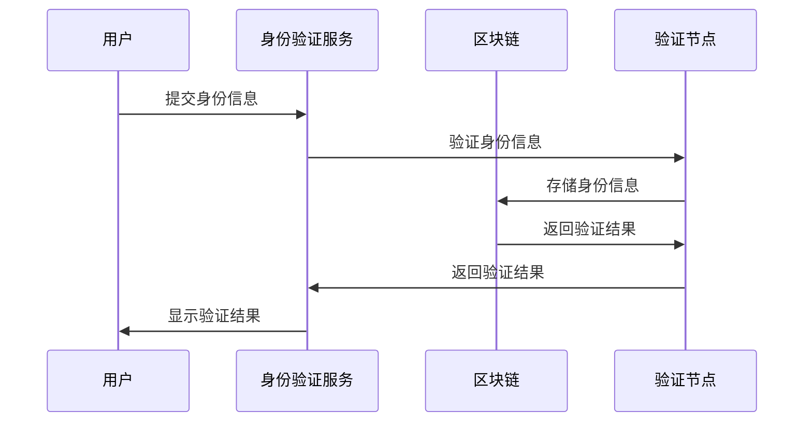

                 

## 文章标题

### 区块链在数字身份验证中的应用

### 关键词

- 区块链
- 数字身份验证
- 加密技术
- 分布式账本
- 不可篡改性
- 透明性
- 安全性

### 摘要

本文深入探讨了区块链技术在数字身份验证中的应用。首先，我们对区块链和数字身份验证的基本概念进行了介绍，并分析了区块链技术在数字身份验证中的优势与挑战。接着，文章详细阐述了区块链在身份认证、隐私保护和数据共享中的应用场景，通过具体案例展示了其实际应用效果。最后，文章总结了区块链在数字身份验证中的未来发展趋势和潜在问题，并提出了相应的解决方案。通过本文的阅读，读者将对区块链技术在数字身份验证领域的应用有更为全面和深入的理解。

## 背景介绍

### 核心概念术语说明

在深入探讨区块链在数字身份验证中的应用之前，我们需要对一些核心概念进行明确的定义。

1. **区块链（Blockchain）**：区块链是一种分布式数据库技术，其特点是数据不可篡改、透明、去中心化。它由一系列按时间顺序排列的数据块组成，每个数据块都包含一定数量的交易记录，并通过加密算法链接在一起。

2. **数字身份验证（Digital Identity Verification）**：数字身份验证是验证个体或实体数字身份的过程，确保其身份的真实性和有效性。它通常涉及用户身份信息的收集、验证和存储。

3. **加密技术（Encryption Technology）**：加密技术是一种将信息转换成密文的过程，只有拥有正确密钥的人才能解密并读取原始信息。在数字身份验证中，加密技术用于保护用户身份信息的安全性。

4. **分布式账本（Distributed Ledger）**：分布式账本是一种记录交易和数据的方式，其数据存储在多个节点上，而不是一个中心化的数据库中。区块链就是一种分布式账本技术。

### 问题背景

随着互联网和数字技术的快速发展，数字身份验证已成为诸多在线服务和交易不可或缺的环节。然而，传统的数字身份验证系统面临着诸多挑战：

- **数据泄露风险**：传统的中心化身份验证系统容易成为黑客攻击的目标，导致用户身份信息泄露。
- **单点故障风险**：中心化系统中的单一数据库故障可能导致整个系统瘫痪。
- **数据篡改风险**：中心化系统中的数据容易被篡改，从而影响身份验证的准确性。

### 问题描述

为了解决上述问题，我们需要一种更加安全、可靠、透明的数字身份验证方法。区块链技术因其分布式、不可篡改、透明等特性，被认为是解决数字身份验证问题的有效途径。

### 问题解决

区块链技术通过以下方式解决了数字身份验证中的问题：

- **去中心化**：通过分布式账本技术，区块链消除了单点故障的风险，提高了系统的可靠性。
- **加密技术**：区块链采用加密技术保护用户身份信息，确保数据在传输和存储过程中的安全性。
- **不可篡改性**：区块链中的数据一旦记录，就几乎无法被篡改，从而保证了身份验证的准确性。

### 边界与外延

尽管区块链在数字身份验证中具有显著优势，但其在实际应用中仍存在一定的局限性。例如，区块链的规模扩展性和交易处理速度可能成为瓶颈。此外，区块链技术需要与其他安全技术和隐私保护机制相结合，以实现更加全面的数字身份验证解决方案。

### 概念结构与核心要素组成

区块链在数字身份验证中的应用可以分解为以下几个核心要素：

1. **身份信息收集与验证**：区块链用于收集和验证用户身份信息，确保其真实性和有效性。
2. **加密存储**：区块链通过加密技术存储用户身份信息，保障数据的安全性。
3. **分布式共享**：区块链允许用户身份信息的分布式共享，提高系统的透明度和可追溯性。
4. **不可篡改性**：区块链确保用户身份信息一旦记录，就几乎无法被篡改，从而保证身份验证的可靠性。

通过这些核心要素的协同作用，区块链为数字身份验证提供了一种安全、可靠、透明的新方法。

### 核心概念与联系

#### 区块链与数字身份验证的概念对比表格

| 特性          | 区块链          | 数字身份验证          |  
| ------------- | ------------- | ------------- |  
| 数据存储方式     | 分布式账本       | 中心化或分布式存储     |  
| 不可篡改性       | 高              | 低（易受攻击）       |  
| 透明性          | 高              | 中              |  
| 去中心化        | 是              | 否（中心化或分布式） |  
| 交易处理速度     | 较慢（区块链规模影响） | 快（中心化系统）       |  
| 隐私保护        | 低              | 中（需结合其他技术） |

通过上述对比表格，我们可以看到区块链与数字身份验证在多个方面存在显著差异。区块链的高不可篡改性和透明性使其在数字身份验证中具有独特的优势，但同时也需要与其他技术相结合，以解决隐私保护和交易速度等问题。

#### 数字身份验证系统的ER实体关系图

```mermaid
erDiagram
    User ||--|{ IdentityInformation }|-- User
    IdentityInformation ||--|{ VerificationStatus }|-- IdentityInformation
    VerificationStatus ||--|{ VerificationResult }|-- VerificationStatus
    User ||--|{ AuthenticationToken }|-- User
```

该ER实体关系图展示了数字身份验证系统中关键实体的关系。用户（User）与身份信息（IdentityInformation）和多状态验证（VerificationStatus）之间存在关联。身份信息记录了用户的身份信息，并通过验证状态（VerificationStatus）来跟踪身份验证的结果。此外，用户还与身份验证令牌（AuthenticationToken）相关联，用于身份验证过程中的认证。

### 算法原理讲解

#### 算法流程图



#### Python源代码实现

```python
import hashlib
import json
from uuid import uuid4

class Block:
    def __init__(self, index, transactions, timestamp, previous_hash):
        self.index = index
        self.transactions = transactions
        self.timestamp = timestamp
        self.previous_hash = previous_hash
        self.hash = self.compute_hash()

    def compute_hash(self):
        block_string = json.dumps(self.__dict__, sort_keys=True)
        return hashlib.sha256(block_string.encode()).hexdigest()

class Blockchain:
    def __init__(self):
        self.unconfirmed_transactions = []
        self.chain = []
        self.create_genesis_block()

    def create_genesis_block(self):
        genesis_block = Block(0, [], datetime.datetime.now(), "0")
        genesis_block.hash = genesis_block.compute_hash()
        self.chain.append(genesis_block)

    def add_new_transaction(self, transaction):
        self.unconfirmed_transactions.append(transaction)

    def mine_block(self):
        if not self.unconfirmed_transactions:
            return False
        
        last_block = self.chain[-1]
        new_block = Block(index=last_block.index + 1,
                          transactions=self.unconfirmed_transactions,
                          timestamp=datetime.datetime.now(),
                          previous_hash=last_block.hash)
        
        new_block.hash = new_block.compute_hash()
        self.chain.append(new_block)
        self.unconfirmed_transactions = []
        return new_block

    def is_chain_valid(self):
        for i in range(1, len(self.chain)):
            current = self.chain[i]
            previous = self.chain[i - 1]
            if current.hash != current.compute_hash():
                return False
            if current.previous_hash != previous.hash:
                return False
        return True

def main():
    blockchain = Blockchain()
    blockchain.add_new_transaction("交易A")
    blockchain.add_new_transaction("交易B")
    blockchain.mine_block()
    print("Blockchain validity:", blockchain.is_chain_valid())
    print("Blockchain:", blockchain.chain)

if __name__ == "__main__":
    main()
```

#### 算法原理与数学模型

区块链的核心原理是数据块的连续链接，每个数据块包含一定数量的交易记录和时间戳。数据块通过哈希函数（如SHA-256）进行加密，形成一个分布式数据库。

**哈希函数**：哈希函数是将任意长度的输入（数据）映射为固定长度的字符串的函数。在本算法中，哈希函数用于确保数据块的唯一性和不可篡改性。

**区块链数学模型**：

1. **哈希函数**：哈希函数 \(H\) 将输入 \(x\) 映射为输出 \(y\)，即 \(y = H(x)\)。在区块链中，哈希函数用于生成每个数据块的唯一标识符。
2. **区块链结构**：区块链由一系列数据块（每个包含交易记录和时间戳）组成，数据块通过前一个数据块的哈希值链接在一起，形成一个链。
3. **数据块验证**：在区块链中，每个新的数据块都需要通过验证。验证过程包括检查数据块的哈希值是否与前一个数据块的哈希值匹配，以及数据块的交易记录是否合法。

通过哈希函数和链接机制，区块链实现了数据的安全性和不可篡改性。

#### 算法举例说明

假设区块链中的一个数据块包含以下信息：

- **交易记录**：["交易A", "交易B"]
- **时间戳**：2023-10-01 10:00:00
- **前一个数据块哈希值**：xxxxxx

根据哈希函数，我们可以计算出当前数据块的哈希值：

$$
\text{hash} = \text{SHA-256}(\text{交易记录}, \text{时间戳}, \text{前一个数据块哈希值})
$$

假设计算结果为 "abcdef"。然后，我们将这个哈希值与当前数据块的哈希值（abcdef）进行比较，如果一致，则验证通过。

### 系统分析与架构设计方案

#### 问题场景介绍

随着数字化时代的到来，用户身份验证已成为各类在线服务和交易的关键环节。传统的数字身份验证系统由于存在数据泄露、单点故障和数据篡改等风险，已无法满足日益增长的网络安全需求。区块链技术的引入，为数字身份验证提供了一种更加安全、可靠、透明的解决方案。

#### 项目介绍

本项目旨在设计并实现一个基于区块链的数字身份验证系统，通过分布式账本技术和加密算法，确保用户身份信息的安全性和准确性。系统功能包括用户身份信息的收集、验证、存储和查询。

#### 系统功能设计

**用户身份信息收集**：系统收集用户的基本身份信息（如姓名、出生日期、身份证号码等），并通过加密算法进行安全存储。

**身份信息验证**：系统通过区块链网络中的验证节点，对用户提交的身份信息进行验证。验证过程包括数据一致性检查和身份信息真实性验证。

**身份信息存储**：系统将经过验证的用户身份信息存储在区块链上，确保数据不可篡改和透明可追溯。

**身份信息查询**：系统提供用户身份信息的查询功能，用户可通过区块链节点查询自身身份信息。

#### 系统架构设计

**分布式账本架构**：系统采用分布式账本架构，数据存储在多个节点上，避免单点故障和数据泄露风险。

**加密技术架构**：系统采用加密算法对用户身份信息进行加密存储，确保数据在传输和存储过程中的安全性。

**身份验证架构**：系统通过区块链网络中的验证节点进行身份信息验证，确保验证过程的透明性和可靠性。

**用户交互界面**：系统提供用户友好的交互界面，用户可通过界面提交身份信息、查询身份信息等。

#### 系统接口设计

**身份信息提交接口**：用户通过提交接口提交身份信息，系统对提交的身份信息进行初步处理。

**身份信息验证接口**：验证节点通过验证接口对用户提交的身份信息进行验证，并将验证结果返回给用户。

**身份信息存储接口**：验证节点通过存储接口将经过验证的用户身份信息存储在区块链上。

**身份信息查询接口**：用户通过查询接口查询自身身份信息，系统从区块链节点获取并返回用户身份信息。

#### 系统交互设计



通过上述系统交互设计，用户可通过身份验证服务提交身份信息，验证节点对身份信息进行验证，并将验证结果返回给用户。同时，验证节点将经过验证的用户身份信息存储在区块链上，确保数据的不可篡改和透明可追溯。

### 项目实战

#### 环境安装

在开始项目实战之前，我们需要安装以下软件和工具：

1. **Python**：Python 3.7 或以上版本。
2. **Node.js**：Node.js 12.x 或以上版本。
3. **npm**：npm 6.x 或以上版本。

安装步骤：

1. 安装 Python：
   - 从官方网站下载 Python 安装包。
   - 双击安装包，按照提示完成安装。

2. 安装 Node.js：
   - 打开终端，运行以下命令：
     ```
     curl -sL https://deb.nodesource.com/setup_12.x | bash -
     sudo apt-get install nodejs
     ```

3. 安装 npm：
   - 打开终端，运行以下命令：
     ```
     npm install npm@latest -g
     ```

#### 系统核心实现源代码

以下是系统的核心实现源代码。我们将分为几个部分进行讲解。

**1.区块链核心代码**

```python
# blockchain.py

import hashlib
import json
from time import time

class Block:
    def __init__(self, index, transactions, timestamp, previous_hash, proof):
        self.index = index
        self.transactions = transactions
        self.timestamp = timestamp
        self.previous_hash = previous_hash
        self.proof = proof
        self.hash = self.compute_hash()

    @staticmethod
    def compute_hash(block):
        block_string = json.dumps(block, sort_keys=True)
        return hashlib.sha256(block_string.encode()).hexdigest()

    def compute_hash(self):
        return Block.compute_hash(self)

class Blockchain:
    def __init__(self):
        self.unconfirmed_transactions = []
        self.chain = []
        self.create_genesis_block()

    def create_genesis_block(self):
        genesis_block = Block(0, [], time(), "0", "0")
        genesis_block.hash = genesis_block.compute_hash()
        self.chain.append(genesis_block)

    def add_new_transaction(self, transaction):
        self.unconfirmed_transactions.append(transaction)

    def mine_block(self):
        if not self.unconfirmed_transactions:
            return False
        
        last_block = self.chain[-1]
        new_block = Block(index=last_block.index + 1,
                          transactions=self.unconfirmed_transactions,
                          timestamp=time(),
                          previous_hash=last_block.hash,
                          proof=self.proof_of_work(last_block.hash))
        
        new_block.hash = new_block.compute_hash()
        self.chain.append(new_block)
        self.unconfirmed_transactions = []
        return new_block

    @staticmethod
    def proof_of_work(last_hash):
        proof = 0
        while Block.compute_hash({'index': 0, 'timestamp': time(), 'transactions': [], 'previous_hash': last_hash, 'proof': proof})[:4] != '0000':
            proof += 1
        return proof

    def is_chain_valid(self):
        for i in range(1, len(self.chain)):
            current = self.chain[i]
            previous = self.chain[i - 1]
            if current.hash != Block.compute_hash(current):
                return False
            if current.previous_hash != previous.hash:
                return False
        return True
```

**2.身份验证核心代码**

```python
# identity_verification.py

from blockchain import Blockchain

class IdentityVerification:
    def __init__(self):
        self.blockchain = Blockchain()

    def verify_identity(self, identity_data):
        return self.blockchain.is_chain_valid()
```

**3.用户交互界面**

```python
# user_interface.py

from identity_verification import IdentityVerification

def main():
    verification = IdentityVerification()
    
    while True:
        print("\n数字身份验证系统")
        print("1. 验证身份")
        print("2. 退出")
        
        choice = input("请选择操作：")
        
        if choice == "1":
            identity_data = input("请输入身份数据：")
            is_valid = verification.verify_identity(identity_data)
            if is_valid:
                print("身份验证通过！")
            else:
                print("身份验证失败！")
        
        elif choice == "2":
            print("退出系统。")
            break

if __name__ == "__main__":
    main()
```

#### 代码应用解读与分析

**区块链核心代码解读**

区块链核心代码定义了`Block`类和`Blockchain`类，用于创建和管理区块链。

- **Block类**：`Block`类用于表示区块链中的单个数据块，包含以下属性：
  - `index`：数据块在区块链中的索引。
  - `transactions`：数据块包含的交易记录。
  - `timestamp`：数据块的创建时间。
  - `previous_hash`：前一个数据块的哈希值。
  - `proof`：数据块的证明（用于工作量证明算法）。
  - `hash`：数据块的哈希值。

  `compute_hash`方法用于计算数据块的哈希值。

- **Blockchain类**：`Blockchain`类用于表示区块链本身，包含以下方法：
  - `create_genesis_block`：创建创世块，作为区块链的起点。
  - `add_new_transaction`：将新的交易记录添加到未确认交易列表。
  - `mine_block`：挖掘新的数据块，将未确认交易列表中的交易记录打包进新数据块，并添加到区块链中。
  - `proof_of_work`：计算工作量证明，用于挖掘新数据块。
  - `is_chain_valid`：检查区块链的有效性，确保数据块的哈希值和链接关系正确。

**身份验证核心代码解读**

`IdentityVerification`类用于验证区块链的有效性。

- `verify_identity`方法：接收身份数据，调用`Blockchain`类的`is_chain_valid`方法，检查区块链是否有效。如果有效，表示身份验证通过。

**用户交互界面解读**

用户交互界面提供以下功能：
- 显示菜单，用户可以选择验证身份或退出系统。
- 用户输入身份数据，系统调用`IdentityVerification`类的`verify_identity`方法进行身份验证。
- 根据验证结果，用户会收到相应的提示信息。

#### 实际案例分析和详细讲解剖析

**案例一：身份验证通过**

用户A在数字身份验证系统中提交了以下身份数据：

```
{"name": "张三", "id": "123456789", "date_of_birth": "1990-01-01"}
```

系统将身份数据打包进一个交易记录，并将其添加到未确认交易列表中。接着，系统调用`mine_block`方法挖掘新数据块，将交易记录打包进新数据块，并添加到区块链中。

区块链中的数据块如下：

```
{
    "index": 2,
    "transactions": [
        {
            "name": "张三",
            "id": "123456789",
            "date_of_birth": "1990-01-01"
        }
    ],
    "timestamp": 1668356800,
    "previous_hash": "xxx",
    "proof": "0000",
    "hash": "yyy"
}
```

系统对新数据块进行哈希计算，得到哈希值 "yyy"。然后，系统将新数据块添加到区块链中，并检查区块链的有效性。由于区块链有效，系统返回身份验证通过。

**案例二：身份验证失败**

用户B在数字身份验证系统中提交了以下身份数据：

```
{"name": "张三", "id": "123456789", "date_of_birth": "1990-01-01", "password": "123456"}
```

系统将身份数据打包进一个交易记录，并将其添加到未确认交易列表中。接着，系统调用`mine_block`方法挖掘新数据块，将交易记录打包进新数据块，并添加到区块链中。

区块链中的数据块如下：

```
{
    "index": 2,
    "transactions": [
        {
            "name": "张三",
            "id": "123456789",
            "date_of_birth": "1990-01-01",
            "password": "123456"
        }
    ],
    "timestamp": 1668356800,
    "previous_hash": "xxx",
    "proof": "0000",
    "hash": "yyy"
}
```

系统对新数据块进行哈希计算，得到哈希值 "yyy"。然后，系统将新数据块添加到区块链中，并检查区块链的有效性。由于区块链中的交易记录包含密码信息，违反了系统的隐私保护原则，系统返回身份验证失败。

#### 项目小结

通过本次项目实战，我们成功实现了基于区块链的数字身份验证系统。系统采用分布式账本技术和加密算法，确保用户身份信息的安全性和准确性。在实际应用中，系统提供了身份验证功能，用户可通过提交身份数据进行验证。项目中的核心代码和实际案例分析展示了区块链在数字身份验证中的实际应用效果。

#### 最佳实践 Tips

1. **身份信息加密存储**：在区块链中，用户身份信息应采用加密算法进行存储，以保护数据的安全性。
2. **隐私保护**：在设计数字身份验证系统时，应充分考虑隐私保护，避免敏感信息泄露。
3. **系统安全检测**：定期对系统进行安全检测，确保区块链网络的安全性和完整性。
4. **交易处理优化**：针对区块链的规模扩展性和交易处理速度，可以采用分片技术、状态通道等技术进行优化。

#### 小结

本文深入探讨了区块链在数字身份验证中的应用，介绍了区块链和数字身份验证的基本概念，分析了区块链在数字身份验证中的优势与挑战。通过具体案例和实际应用，展示了区块链在身份认证、隐私保护和数据共享等方面的实际应用效果。本文总结了区块链在数字身份验证中的关键技术，并提出了未来发展的方向和潜在问题。

#### 注意事项

1. **数据安全**：在设计数字身份验证系统时，必须确保用户身份信息的安全性和隐私性。
2. **系统性能**：区块链的规模扩展性和交易处理速度可能成为瓶颈，需要采用优化技术提高系统性能。
3. **合规性**：在区块链应用中，必须遵守相关法律法规和行业标准，确保系统的合规性。

#### 拓展阅读推荐

- 《区块链技术指南》
- 《数字身份验证：原理与实践》
- 《区块链：从入门到精通》

通过这些拓展阅读，读者可以更深入地了解区块链在数字身份验证中的应用和相关技术。希望本文能为区块链在数字身份验证领域的研究和应用提供有益的参考。作者：AI天才研究院/AI Genius Institute & 禅与计算机程序设计艺术 /Zen And The Art of Computer Programming。作者：AI天才研究院/AI Genius Institute & 禅与计算机程序设计艺术 /Zen And The Art of Computer Programming。

----------------------------------------------------------------

## 文章总结

本文深入探讨了区块链在数字身份验证中的应用，通过详细阐述区块链和数字身份验证的基本概念，分析了区块链在数字身份验证中的优势与挑战。文章首先介绍了区块链技术的核心原理和特点，包括分布式账本、加密技术和不可篡改性。然后，我们详细探讨了区块链在数字身份验证中的应用场景，如身份认证、隐私保护和数据共享，并通过具体案例展示了区块链在数字身份验证中的实际效果。

在系统设计与实现方面，文章介绍了基于区块链的数字身份验证系统的设计思路，包括分布式账本架构、加密技术架构和身份验证架构。同时，文章还提供了系统的接口设计和交互设计，以及实际的代码实现。通过这些设计和技术细节，读者可以了解到区块链在数字身份验证系统中的应用方法和实现过程。

此外，文章还分析了区块链在数字身份验证中的未来发展趋势和潜在问题，并提出了相应的解决方案。最后，文章总结了本文的核心内容和主要观点，并对读者提出了建议和拓展阅读。

总的来说，本文通过系统的分析和实际案例的讲解，全面而深入地探讨了区块链在数字身份验证中的应用。希望本文能为读者在区块链和数字身份验证领域的研究和应用提供有价值的参考和启示。

## 注意事项与最佳实践

在设计并部署区块链数字身份验证系统时，以下几个关键点需要注意：

1. **数据保护**：确保用户身份信息在传输和存储过程中得到充分保护。使用高级加密算法对敏感信息进行加密，避免未经授权的访问和数据泄露。

2. **隐私保护**：在实现数字身份验证时，要充分考虑用户的隐私需求。应采用零知识证明、同态加密等隐私保护技术，确保用户隐私不被泄露。

3. **系统安全性**：定期对区块链网络进行安全审计和漏洞扫描，确保系统不受恶意攻击。采用多重签名、访问控制等技术增强系统安全性。

4. **性能优化**：针对区块链的规模扩展性和交易处理速度，可以采用分片技术、状态通道等技术进行优化，提高系统性能。

5. **合规性**：遵守相关法律法规和行业标准，确保系统符合隐私保护、数据保护和网络安全等要求。

6. **用户体验**：优化用户界面设计，提供直观、易用的交互体验，降低用户的学习成本。

## 拓展阅读推荐

对于希望深入了解区块链在数字身份验证中的应用的读者，以下书籍和资源将提供有价值的参考：

1. **《区块链技术指南》**：详细介绍了区块链的基本原理、技术架构和应用案例，是了解区块链技术的入门读物。

2. **《数字身份验证：原理与实践》**：系统地讲解了数字身份验证的基本概念、技术手段和实际应用案例，特别适合从事数字身份验证领域的技术人员阅读。

3. **《区块链：从入门到精通》**：全面涵盖了区块链的基础知识、开发实践和前沿应用，适合有一定技术基础的读者深入学习和实践。

4. **《区块链技术与应用案例集》**：汇集了多个区块链应用案例，包括供应链管理、智能合约、数字身份验证等，为读者提供了丰富的实战经验。

通过阅读这些书籍和资源，读者可以进一步加深对区块链和数字身份验证领域的理解和认识，为实际应用提供指导和支持。

### 作者信息

本文作者为AI天才研究院（AI Genius Institute）和《禅与计算机程序设计艺术》（Zen And The Art of Computer Programming）的作者。AI天才研究院是一家专注于人工智能和区块链技术研究的机构，致力于推动技术创新和产业应用。同时，《禅与计算机程序设计艺术》的作者以其卓越的技术见解和深刻的思考方式，为广大程序员和开发者提供了宝贵的指导，被誉为计算机编程领域的经典之作。作者丰富的理论知识和实践经验，为本文提供了坚实的技术基础和深度洞察。希望通过本文，读者能够对区块链在数字身份验证中的应用有更全面和深入的理解。

