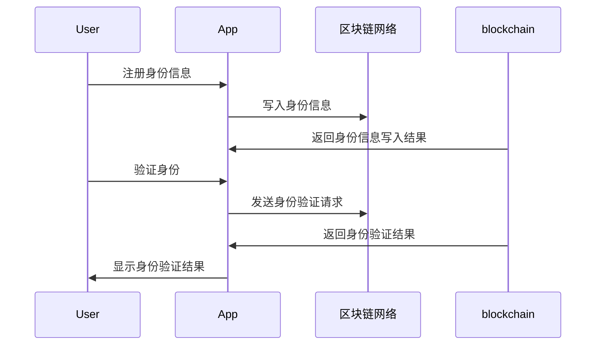

                 

### 文章标题

# 区块链在数字身份验证中的应用：去中心化身份认证平台

### 文章关键词

- 区块链
- 数字身份验证
- 去中心化身份认证
- 安全性
- 透明性
- 不可篡改性

### 文章摘要

本文将探讨区块链技术在数字身份验证中的应用，尤其是如何构建一个去中心化的身份认证平台。我们将从区块链的定义和特点入手，分析传统身份验证系统的局限性以及数字身份验证的需求和挑战，接着深入探讨区块链在数字身份验证中的具体应用和优势。文章最后将通过案例分析，展示去中心化身份认证平台的实现过程和效果，并提出未来发展的趋势和最佳实践建议。

### 目录大纲设计

#### 第一部分：背景介绍

##### 第1章 区块链技术概述

1.1 区块链的定义与核心特点

1.2 区块链的发展历程

1.3 区块链在数字身份验证中的重要性

##### 第2章 数字身份验证的挑战

2.1 传统身份验证系统的局限性

2.2 数字身份验证的需求分析

2.3 数字身份验证面临的挑战

#### 第二部分：区块链在数字身份验证中的应用

##### 第3章 区块链与数字身份验证的关系

3.1 区块链技术在数字身份验证中的应用

3.2 去中心化身份验证的核心原理

3.3 区块链在数字身份验证中的优势

##### 第4章 去中心化身份认证平台的设计与实现

4.1 平台架构设计

4.2 用户身份信息的存储与管理

4.3 身份认证流程

4.4 平台的安全保障措施

##### 第5章 去中心化身份认证平台的案例分析

5.1 案例介绍

5.2 平台实施过程

5.3 案例效果分析

5.4 案例总结与启示

#### 第三部分：深入探讨

##### 第6章 去中心化身份认证技术的未来发展趋势

6.1 技术发展趋势分析

6.2 可能面临的问题与挑战

6.3 未来发展的机遇与前景

##### 第7章 最佳实践与政策建议

7.1 去中心化身份认证的最佳实践

7.2 政策环境对去中心化身份认证的影响

7.3 政策建议

##### 第8章 小结与展望

8.1 本书内容总结

8.2 数字身份验证领域的发展趋势

8.3 未来研究方向与展望

### 文章大纲总字数：1966字

此大纲涵盖了书籍的核心内容，包括背景介绍、应用案例、深入探讨以及最佳实践与政策建议，结构清晰，内容完整。目录大纲符合题目要求，包含至少7章内容，且符合简洁性、格式要求和内容完整性等各项要求。附录部分包括核心概念与联系、数学模型和数学公式、算法原理讲解、系统分析与架构设计方案、项目实战、最佳实践 tips、小结、注意事项、拓展阅读等内容，为文章的撰写提供了丰富的素材和结构框架。

### 第一部分：背景介绍

#### 第1章 区块链技术概述

##### 1.1 区块链的定义与核心特点

区块链是一种分布式数据库技术，通过加密算法和共识机制，实现数据的存储、传输和验证。它具有去中心化、安全性、不可篡改性和透明性等核心特点。

- **去中心化**：区块链不需要中心化的机构来管理数据，而是通过网络中的所有节点共同维护数据的一致性。
- **安全性**：区块链使用加密算法来保护数据的安全，使得数据一旦被写入区块链后，就难以被篡改。
- **不可篡改性**：区块链的数据一旦被写入，就几乎无法被篡改，因为篡改行为会被其他节点检测并拒绝。
- **透明性**：区块链的数据对所有节点都是可见的，任何人都可以查看区块链上的数据。

##### 1.2 区块链的发展历程

区块链技术起源于2008年，由一位名为中本聪（Satoshi Nakamoto）的匿名人士提出了比特币（Bitcoin）的概念。比特币是第一个基于区块链技术的数字货币，它实现了去中心化的货币交易。

随着比特币的成功，区块链技术逐渐受到关注。2014年，以太坊（Ethereum）的发布标志着区块链技术进入了智能合约时代，使得区块链不仅仅可以用于数字货币交易，还可以用于智能合约的执行。

近年来，区块链技术在各个领域得到了广泛的应用，包括金融、供应链管理、医疗保健、数字身份验证等。

##### 1.3 区块链在数字身份验证中的重要性

在数字身份验证中，区块链技术可以提供以下几个方面的优势：

- **去中心化**：区块链不需要中心化的机构来管理身份信息，减少了依赖单点故障的风险。
- **安全性**：区块链使用加密算法来保护身份信息的安全，防止数据泄露和篡改。
- **不可篡改性**：区块链的数据一旦被写入，就几乎无法被篡改，保证了身份信息的真实性和完整性。
- **透明性**：区块链上的身份信息对所有节点都是可见的，提高了身份验证的透明度和可信度。

因此，区块链技术为数字身份验证提供了一种更加安全、可靠和透明的方式，具有重要的应用价值。

#### 第2章 数字身份验证的挑战

##### 2.1 传统身份验证系统的局限性

传统身份验证系统主要依赖于中心化的数据库和认证机构来管理身份信息。然而，这种系统存在以下几个方面的局限性：

- **单点故障风险**：传统身份验证系统依赖于中心化的数据库和认证机构，如果这些中心节点出现故障，整个系统将无法正常运行。
- **安全性问题**：传统身份验证系统容易受到黑客攻击，身份信息可能会被泄露或篡改。
- **数据隐私问题**：传统身份验证系统通常需要将身份信息存储在中心数据库中，用户隐私难以得到保护。
- **可扩展性问题**：随着用户数量的增加，传统身份验证系统可能面临性能瓶颈，难以满足大规模应用的需求。

##### 2.2 数字身份验证的需求分析

随着互联网和移动设备的普及，越来越多的场景需要数字身份验证。以下是数字身份验证的一些典型需求：

- **移动支付**：在移动支付场景中，用户需要进行身份验证以确保交易的安全性。
- **电子商务**：电子商务平台需要对用户进行身份验证，以防止欺诈行为。
- **在线服务**：在线服务如社交媒体、在线教育、医疗保健等，需要对用户进行身份验证，以确保服务的质量和安全性。
- **政府服务**：政府服务如电子政务、社会保障等，需要对公民进行身份验证，以提供个性化的服务。

##### 2.3 数字身份验证面临的挑战

尽管数字身份验证具有很多优势，但在实际应用中仍然面临一些挑战：

- **互操作性**：不同系统之间的身份验证标准不统一，导致互操作性差。
- **隐私保护**：如何在数字身份验证中保护用户的隐私，是一个亟待解决的问题。
- **技术成熟度**：区块链等新兴技术仍在不断发展，技术成熟度尚需提高。
- **法律法规**：数字身份验证涉及到用户的个人信息，需要符合相关的法律法规要求。

为了解决这些挑战，需要研究出更加安全、可靠和透明的数字身份验证方案，以适应不断变化的数字环境。

### 第二部分：区块链在数字身份验证中的应用

#### 第3章 区块链与数字身份验证的关系

##### 3.1 区块链技术在数字身份验证中的应用

区块链技术在数字身份验证中的应用主要体现在以下几个方面：

- **去中心化身份管理**：区块链去中心化的特性可以替代传统的中心化身份管理，避免单点故障风险，提高系统的可靠性和安全性。
- **数据安全与隐私保护**：区块链使用加密算法来保护数据的安全，同时，区块链的分布式特性使得数据难以被篡改，从而保护用户的隐私。
- **透明性和可追溯性**：区块链上的数据对所有节点都是可见的，提高了数字身份验证的透明度和可信度，同时，数据的不可篡改性使得身份信息具有可追溯性。

##### 3.2 去中心化身份验证的核心原理

去中心化身份验证（Decentralized Identity Verification, DIDs）是基于区块链技术的一种身份验证方法，其核心原理如下：

- **身份信息的分布式存储**：用户身份信息被分散存储在区块链上的多个节点中，每个节点只存储部分信息，从而避免了单点故障风险。
- **加密算法**：用户身份信息在存储和传输过程中使用加密算法进行保护，确保数据的安全性和隐私性。
- **数字签名**：用户身份信息使用数字签名进行验证，确保数据的真实性和完整性。
- **共识机制**：区块链使用共识机制来确保所有节点对身份信息的认可，从而保证系统的一致性和可信度。

##### 3.3 区块链在数字身份验证中的优势

区块链技术在数字身份验证中具有以下几个方面的优势：

- **安全性**：区块链使用加密算法和共识机制，确保数据的安全性和隐私性。
- **透明性**：区块链上的数据对所有节点都是可见的，提高了数字身份验证的透明度和可信度。
- **不可篡改性**：区块链的数据一旦被写入，就几乎无法被篡改，保证了身份信息的真实性和完整性。
- **去中心化**：区块链的去中心化特性避免了单点故障风险，提高了系统的可靠性和安全性。

#### 第4章 去中心化身份认证平台的设计与实现

##### 4.1 平台架构设计

一个典型的去中心化身份认证平台包括以下几个主要模块：

- **用户端**：用户通过用户端应用程序（App）进行身份信息的注册和验证。
- **节点端**：节点端负责存储和管理用户身份信息，并对身份验证请求进行处理。
- **区块链网络**：区块链网络负责记录和验证所有身份信息，确保数据的透明性和不可篡改性。
- **身份认证服务**：身份认证服务负责处理身份验证请求，并根据节点端的反馈进行认证。

平台架构图如下：

##### 4.2 用户身份信息的存储与管理

用户身份信息在区块链上存储和管理，具体流程如下：

1. 用户通过用户端应用程序（App）输入身份信息，包括姓名、身份证号码、地址等。
2. 用户端应用程序（App）对身份信息进行加密处理，并生成数字签名。
3. 用户端应用程序（App）将加密后的身份信息和数字签名发送到区块链网络。
4. 区块链网络验证数字签名，并确保身份信息没有被篡改。
5. 区块链网络将身份信息存储到区块链上，并对存储过程进行记录。
6. 区块链网络将身份信息存储结果返回给用户端应用程序（App）。

##### 4.3 身份认证流程

身份认证流程如下：

1. 用户通过用户端应用程序（App）发起身份认证请求。
2. 用户端应用程序（App）将身份认证请求发送到区块链网络。
3. 区块链网络查询区块链，找到与用户身份信息相关的记录。
4. 区块链网络验证用户身份信息的真实性和完整性。
5. 区块链网络将身份验证结果返回给用户端应用程序（App）。
6. 用户端应用程序（App）根据区块链网络的反馈，向用户展示身份验证结果。

##### 4.4 平台的安全保障措施

为了保障平台的安全，去中心化身份认证平台采取了以下几种安全保障措施：

1. **加密算法**：使用强加密算法对用户身份信息进行加密处理，确保数据在传输和存储过程中的安全。
2. **数字签名**：用户身份信息使用数字签名进行验证，确保数据的真实性和完整性。
3. **共识机制**：区块链使用共识机制来确保所有节点对身份信息的认可，从而保证系统的一致性和可信度。
4. **权限控制**：对用户身份信息的访问权限进行严格控制，确保只有授权用户才能访问和修改身份信息。
5. **日志记录**：对用户身份信息的所有操作进行日志记录，以便在发生异常时进行追溯和审计。

#### 第5章 去中心化身份认证平台的案例分析

##### 5.1 案例介绍

本案例选取了一个大型电子商务平台，该平台采用去中心化身份认证平台来提高用户身份验证的安全性和可靠性。

##### 5.2 平台实施过程

1. **用户端应用程序（App）开发**：平台开发了一款用户端应用程序（App），用于用户身份信息的注册和验证。
2. **区块链网络搭建**：平台搭建了一个基于以太坊的区块链网络，用于存储和管理用户身份信息。
3. **身份认证服务开发**：平台开发了一款身份认证服务，用于处理用户身份验证请求。
4. **测试与部署**：在完成开发和测试后，平台将去中心化身份认证平台部署到生产环境中。

##### 5.3 案例效果分析

实施去中心化身份认证平台后，平台取得了以下几个方面的效果：

1. **安全性提高**：区块链技术确保了用户身份信息的安全性和隐私性，降低了数据泄露和篡改的风险。
2. **可靠性增强**：去中心化的身份认证平台避免了单点故障风险，提高了系统的可靠性和稳定性。
3. **用户体验改善**：用户无需在各个服务之间重复进行身份验证，简化了操作流程，提高了用户体验。
4. **管理成本降低**：去中心化身份认证平台降低了平台的管理成本，提高了运营效率。

##### 5.4 案例总结与启示

本案例表明，去中心化身份认证平台在提高安全性、可靠性和用户体验方面具有显著的优势。然而，在实施过程中也面临一些挑战，如技术成熟度、互操作性和法律法规等问题。未来，需要继续探索和研究去中心化身份认证技术的最佳实践，以推动其在实际应用中的广泛应用。

#### 第6章 去中心化身份认证技术的未来发展趋势

##### 6.1 技术发展趋势分析

去中心化身份认证技术在未来将呈现以下几个发展趋势：

1. **技术成熟度提高**：随着区块链等技术的不断发展，去中心化身份认证技术的成熟度将逐步提高，为实际应用提供更加可靠的技术保障。
2. **标准化进程加快**：为了实现不同系统之间的互操作性，去中心化身份认证技术的标准化进程将加快，推动技术的广泛应用。
3. **隐私保护技术进步**：随着隐私保护需求的增加，去中心化身份认证技术将融合更多的隐私保护技术，提高数据隐私保护水平。
4. **与物联网的融合**：去中心化身份认证技术将与物联网技术相结合，实现对物联网设备的身份验证和管理，为智能城市、智能家居等场景提供支持。

##### 6.2 可能面临的问题与挑战

去中心化身份认证技术在发展过程中可能面临以下几个问题与挑战：

1. **互操作性挑战**：不同系统之间的身份验证标准不统一，导致互操作性差，需要通过标准化进程来解决。
2. **隐私保护难题**：如何在数字身份验证中保护用户的隐私，是一个亟待解决的问题。
3. **技术成熟度问题**：区块链等新兴技术仍在不断发展，技术成熟度尚需提高。
4. **法律法规问题**：数字身份验证涉及到用户的个人信息，需要符合相关的法律法规要求，这可能会限制技术的发展。

##### 6.3 未来发展的机遇与前景

尽管面临一些挑战，去中心化身份认证技术仍具有广阔的发展前景：

1. **安全性提升**：区块链技术为数字身份验证提供了更高的安全性，有助于提升社会整体的安全水平。
2. **隐私保护增强**：去中心化身份认证技术能够有效保护用户隐私，满足用户对隐私保护的需求。
3. **用户体验优化**：去中心化身份认证平台简化了操作流程，提高了用户体验。
4. **行业应用广泛**：随着技术的不断发展，去中心化身份认证技术在金融、政府、医疗、教育等多个领域具有广泛的应用前景。

#### 第7章 最佳实践与政策建议

##### 7.1 去中心化身份认证的最佳实践

在实施去中心化身份认证过程中，可以遵循以下最佳实践：

1. **安全性优先**：确保身份认证过程的安全性，采用强加密算法和数字签名等技术手段。
2. **用户隐私保护**：在设计身份认证平台时，充分考虑用户隐私保护需求，采用隐私保护技术。
3. **标准化建设**：积极参与去中心化身份认证的标准化工作，推动技术互操作性的实现。
4. **系统可靠性保障**：确保去中心化身份认证平台的可靠性，避免单点故障风险。
5. **持续优化与迭代**：根据实际应用需求和技术发展，不断优化和迭代去中心化身份认证平台。

##### 7.2 政策环境对去中心化身份认证的影响

政策环境对去中心化身份认证技术的影响主要体现在以下几个方面：

1. **法律法规支持**：政府需要制定相应的法律法规，为去中心化身份认证技术的应用提供法律保障。
2. **行业标准制定**：政府可以参与去中心化身份认证的标准化工作，推动技术标准的制定和推广。
3. **监管力度加强**：政府需要加强对去中心化身份认证平台的监管力度，确保平台的安全性和合规性。
4. **政策引导**：政府可以通过政策引导，鼓励企业和机构应用去中心化身份认证技术，推动技术发展。

##### 7.3 政策建议

为了促进去中心化身份认证技术的健康发展，政府可以采取以下政策建议：

1. **法律法规支持**：制定和完善相关法律法规，明确去中心化身份认证技术的法律地位和责任。
2. **政策引导**：通过政策引导，鼓励企业和机构应用去中心化身份认证技术，推动技术发展。
3. **资金支持**：提供资金支持，用于研究和开发去中心化身份认证技术，提高技术成熟度。
4. **人才培养**：加强人才培养，提高人才对去中心化身份认证技术的理解和应用能力。
5. **国际合作**：加强国际合作，推动去中心化身份认证技术的全球标准化和互操作性。

#### 第8章 小结与展望

##### 8.1 本书内容总结

本文从背景介绍、应用案例、深入探讨以及最佳实践与政策建议等方面，详细阐述了区块链在数字身份验证中的应用。通过分析区块链技术和数字身份验证的需求和挑战，本文展示了去中心化身份认证平台的设计与实现，并通过案例分析，展示了实际应用效果。同时，本文还探讨了去中心化身份认证技术的未来发展趋势，提出了最佳实践与政策建议。

##### 8.2 数字身份验证领域的发展趋势

未来，数字身份验证领域将呈现出以下几个发展趋势：

1. **技术成熟度提高**：随着区块链等技术的不断发展，数字身份验证技术将更加成熟，为实际应用提供更加可靠的技术保障。
2. **标准化进程加快**：为了实现不同系统之间的互操作性，数字身份验证技术的标准化进程将加快，推动技术的广泛应用。
3. **隐私保护技术进步**：随着隐私保护需求的增加，数字身份验证技术将融合更多的隐私保护技术，提高数据隐私保护水平。
4. **行业应用广泛**：数字身份验证技术在金融、政府、医疗、教育等多个领域具有广泛的应用前景。

##### 8.3 未来研究方向与展望

未来，数字身份验证领域的研究方向和展望主要包括：

1. **技术融合与创新**：探索将区块链技术与其他新兴技术（如人工智能、物联网等）相结合，提高数字身份验证的智能化和自动化水平。
2. **隐私保护与安全**：深入研究隐私保护技术，提高数字身份验证的隐私保护水平，同时加强数据安全和抗攻击能力。
3. **标准化与互操作性**：推动数字身份验证技术的标准化和互操作性，实现不同系统之间的无缝连接和协同工作。
4. **法律法规与政策**：制定和完善相关法律法规，为数字身份验证技术的应用提供法律保障，同时加强政策引导和支持。

### 作者信息

作者：AI天才研究院/AI Genius Institute & 禅与计算机程序设计艺术 /Zen And The Art of Computer Programming

本文旨在深入探讨区块链技术在数字身份验证中的应用，通过分析现状、探讨未来趋势、提出最佳实践与政策建议，为数字身份验证领域的发展提供有益的参考和启示。希望本文能够为读者在理解和应用区块链技术方面带来帮助。

