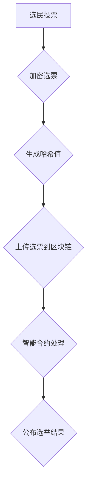

                 

# 区块链在数字选举系统中的创新：确保选票的安全性和透明度

关键词：区块链、数字选举、安全性、透明度、去中心化

摘要：随着信息技术的飞速发展，传统的选举方式已逐渐暴露出诸多问题，如选票被篡改、投票结果不透明等。区块链技术的出现为数字选举系统带来了新的解决方案，通过其独特的安全性、透明性和去中心化特性，可以有效解决当前选举中的各种问题。本文将深入探讨区块链在数字选举系统中的应用，分析其创新点，并提供实际案例以验证其有效性。

----------------------------------------------------------------

## 第一部分：引言

### 1.1 问题背景

#### 1.1.1 数字选举的现状

在现代社会，选举已经成为一种普遍的民主实践，通过选举产生政府代表或决策者，是实现民主政治的基本方式。然而，随着选举的规模不断扩大，传统选举方式面临的挑战也越来越大。特别是在数字时代，网络技术的发展使得选举过程中的安全性和透明性问题愈发突出。

当前，许多国家和地区的选举仍然依赖于传统的纸质投票和电子投票系统。这些系统虽然在技术层面有所进步，但在安全性、透明性和可追溯性方面仍存在诸多不足。例如，纸质投票容易受到人为篡改，而电子投票系统则可能受到黑客攻击，导致投票结果被恶意篡改。

#### 1.1.2 选举中的安全与透明性问题

选举中的安全与透明性问题主要表现在以下几个方面：

1. **选票篡改**：在纸质投票中，选票容易被篡改或丢失。在电子投票中，黑客可能通过攻击投票系统，篡改投票结果。
2. **结果不透明**：传统选举系统往往缺乏透明性，投票过程和结果难以被公众监督和验证。
3. **数据泄露**：选举过程中涉及的大量个人信息可能被黑客窃取，导致个人隐私泄露。

这些问题不仅影响了选举的公正性，也削弱了公众对选举结果的信任。因此，如何解决选举中的安全性和透明性问题，已经成为当前亟待解决的问题。

### 1.2 区块链技术的介绍

#### 1.2.1 区块链基本概念

区块链是一种去中心化的分布式数据库技术，通过多个节点之间的共识机制，确保数据的可靠性和安全性。每个区块都包含一定数量的交易记录，通过加密算法和时间戳技术，将这些区块按照一定的顺序链接起来，形成一条不可篡改的链条。

区块链具有以下几个核心特性：

1. **去中心化**：区块链不依赖于中心化的机构或服务器，所有数据都分散存储在多个节点上，提高了系统的抗攻击能力。
2. **安全性**：区块链使用加密算法对数据进行保护，确保数据在传输和存储过程中的安全性。
3. **透明性**：区块链上的数据对所有参与者都是透明的，任何人都可查看和验证数据。
4. **不可篡改性**：一旦数据被写入区块链，就几乎不可能被篡改，保证了数据的一致性和可靠性。

#### 1.2.2 区块链的关键特性

区块链的关键特性使其在数字选举系统中具有显著的优势：

1. **安全性**：区块链的加密算法和数据结构确保了选票的安全，防止选票被篡改或恶意攻击。
2. **透明性**：区块链上的数据对所有参与者都是透明的，投票过程和结果可以被公众监督和验证。
3. **去中心化**：去中心化的特性使区块链上的数据具有高度的可信度，无需依赖中心化的机构。

### 1.3 区块链在数字选举中的优势

#### 1.3.1 安全性

区块链的加密算法和数据结构确保了选票的安全。通过使用非对称加密技术，每个选民都可以生成一对公钥和私钥。在投票时，选民使用私钥对选票进行加密，确保选票内容只有拥有相应公钥的人才能解密查看。这样，即使选票被黑客攻击，也无法获取选票内容。

此外，区块链的分布式特性也提高了系统的抗攻击能力。由于数据被分散存储在多个节点上，黑客要同时攻击多个节点才能篡改数据，这大大增加了攻击的难度。

#### 1.3.2 透明性

区块链上的数据对所有参与者都是透明的，投票过程和结果可以被公众监督和验证。通过区块链的开放性，选民可以随时查看自己的投票记录，确保投票的公正性。同时，选举结果也可以被所有人验证，防止选举结果被篡改。

#### 1.3.3 去中心化

区块链的去中心化特性使数字选举系统不再依赖中心化的机构，减少了人为干预的可能性。去中心化的特性提高了系统的透明度和可信度，使选民对选举结果更加信任。

## 第二部分：区块链在数字选举系统中的应用

### 2.1 区块链在数字选举中的关键技术

#### 2.1.1 加密技术

加密技术是区块链在数字选举系统中的关键技术之一。通过加密技术，可以确保选票的内容在传输和存储过程中不被泄露或篡改。常见的加密技术包括非对称加密、对称加密和哈希算法等。

1. **非对称加密**：非对称加密技术包括公钥和私钥。公钥用于加密数据，私钥用于解密数据。在数字选举中，选民使用私钥对选票进行加密，确保选票内容只有拥有相应公钥的人才能解密查看。

2. **对称加密**：对称加密技术使用相同的密钥进行加密和解密。在数字选举中，对称加密可以用于加密选民的个人信息，确保个人信息的安全。

3. **哈希算法**：哈希算法用于生成选票的哈希值。哈希值是一个固定的字符串，可以唯一地表示选票的内容。在数字选举中，哈希值可以用于验证选票的真实性和完整性。

#### 2.1.2 智能合约

智能合约是一种自动执行合同条款的计算机程序，它基于区块链技术运行。在数字选举中，智能合约可以用于自动处理选票，确保选举过程的公正和透明。

智能合约的关键特性包括：

1. **不可篡改性**：智能合约一旦被部署到区块链上，就无法被篡改。这保证了选举过程的公正性和透明性。

2. **自动执行**：智能合约可以根据预设的条件自动执行，确保选举过程的效率。

3. **公开透明**：智能合约的代码和执行过程对所有参与者都是透明的，任何人都可查看和验证。

#### 2.1.3 账本技术

账本技术是区块链的核心组成部分，用于记录和存储所有的交易数据。在数字选举中，账本技术可以用于记录选民的投票行为，确保选举过程的可追溯性和可验证性。

账本技术的关键特性包括：

1. **去中心化**：账本数据被分散存储在多个节点上，确保数据的安全性和可靠性。

2. **不可篡改性**：账本数据一旦被写入，就无法被篡改，保证了选举过程的真实性和可信度。

3. **可追溯性**：账本技术可以记录选民的投票行为，确保选举过程的透明性和公正性。

### 2.2 数字选举系统的设计

#### 2.2.1 系统功能设计

数字选举系统的功能设计应包括以下几个关键模块：

1. **选民注册**：选民需要注册成为系统用户，并生成一对公钥和私钥。

2. **投票**：选民通过系统提交选票，选票使用私钥进行加密。

3. **计票**：智能合约根据选票的哈希值进行计票，确保选票的真实性和完整性。

4. **结果公布**：计票完成后，智能合约自动公布选举结果，所有人都可以查看和验证。

#### 2.2.2 系统架构设计

数字选举系统的架构设计应包括以下几个关键组成部分：

1. **前端界面**：前端界面用于选民注册、投票和结果查看。

2. **后端服务器**：后端服务器负责处理选民的投票请求，并与区块链进行交互。

3. **区块链节点**：区块链节点负责存储和验证选票，确保选举过程的公正和透明。

4. **智能合约**：智能合约负责处理选票的计票和结果公布。

### 2.3 选票的安全性与透明度

#### 2.3.1 安全性保证

区块链的加密技术和分布式特性确保了选票的安全。选票在传输和存储过程中使用非对称加密技术进行保护，防止被篡改或泄露。此外，区块链的分布式特性提高了系统的抗攻击能力，黑客要同时攻击多个节点才能篡改数据，这大大增加了攻击的难度。

#### 2.3.2 透明度提升

区块链的透明性特性使选举过程和结果对所有参与者都是透明的。选民可以随时查看自己的投票记录，确保投票的公正性。同时，选举结果也可以被所有人验证，防止选举结果被篡改。区块链的不可篡改性确保了选举过程的真实性和可信度。

### 2.4 案例研究

#### 2.4.1 案例一：某国数字选举系统的区块链应用

某国在2018年进行了一次全国大选，采用了区块链技术来提升选举的安全性和透明度。选民通过在线注册成为系统用户，并生成一对公钥和私钥。在投票过程中，选民使用私钥对选票进行加密，确保选票内容只有拥有相应公钥的人才能解密查看。选举结果通过智能合约自动计算并公布，所有选民都可以查看和验证。

该案例的成功实施，不仅提高了选举的公正性和可信度，也增强了公众对选举结果的信任。

#### 2.4.2 案例二：某地社区选举的区块链实践

某地社区在2020年进行了一次社区选举，采用了区块链技术来确保选举的安全性和透明度。选民通过在线注册成为系统用户，并生成一对公钥和私钥。在投票过程中，选民使用私钥对选票进行加密，确保选票内容只有拥有相应公钥的人才能解密查看。选举结果通过智能合约自动计算并公布，所有选民都可以查看和验证。

该案例的实施，使得社区选举过程更加公开透明，选民对选举结果的信任度也显著提升。

## 第三部分：区块链在数字选举中的未来展望

### 3.1 当前面临的挑战

#### 3.1.1 技术挑战

尽管区块链在数字选举中具有显著的优势，但当前仍面临一些技术挑战。例如，区块链的扩展性、性能和安全性等方面仍有待提高。此外，如何实现区块链与其他系统的无缝集成，也是一个重要的技术难题。

#### 3.1.2 法规挑战

区块链技术的应用还受到法律法规的制约。不同国家和地区对区块链技术的监管政策存在差异，如何确保区块链在数字选举中的合法合规，是当前亟待解决的问题。

#### 3.1.3 社会接受度

区块链技术作为一种新兴技术，公众对其接受度还有待提高。如何消除公众对区块链技术的误解和疑虑，提高其对数字选举的信任度，也是一个重要的挑战。

### 3.2 发展趋势

#### 3.2.1 技术进步

随着区块链技术的不断发展，其性能、安全性和扩展性将得到进一步提升。未来，区块链技术有望在更多领域得到广泛应用，包括数字选举、金融、供应链等。

#### 3.2.2 法规完善

随着区块链技术的普及，各国政府将不断完善相关法律法规，以规范区块链技术的应用。这将有助于提高区块链在数字选举中的合法合规性，促进其健康发展。

#### 3.2.3 社会普及

随着公众对区块链技术的了解和接受度提高，数字选举系统将得到更广泛的应用。这将有助于提高选举的公正性和可信度，促进民主政治的发展。

### 3.3 未来展望

#### 3.3.1 区块链在选举中的应用前景

未来，区块链技术将在选举中发挥越来越重要的作用。通过区块链，可以确保选举过程的安全、透明和公正，提高公众对选举结果的信任度。同时，区块链技术还可以为其他领域提供借鉴和启示，推动社会的发展和进步。

#### 3.3.2 全球趋势与合作

在全球范围内，越来越多的国家和地区开始关注区块链技术在选举中的应用。未来，各国可以加强合作，共同研究和推广区块链技术在选举中的应用，推动全球选举制度的进步。

### 结尾

区块链技术在数字选举中的应用，为解决选举中的安全性和透明性问题提供了新的思路和解决方案。通过区块链的加密技术、智能合约和分布式账本，可以有效保障选票的安全性和透明度，提高选举的公正性和可信度。尽管当前仍面临一些挑战，但相信随着技术的进步和法规的完善，区块链技术在数字选举中的应用将越来越广泛，为全球选举制度的进步做出积极贡献。

### 作者信息

作者：AI天才研究院/AI Genius Institute & 禅与计算机程序设计艺术 /Zen And The Art of Computer Programming

----------------------------------------------------------------

## 附录

### 附录 A：核心概念术语说明

**区块链**：一种去中心化的分布式数据库技术，通过多个节点之间的共识机制，确保数据的可靠性和安全性。

**加密技术**：一种保护数据安全的技术，通过加密算法将明文数据转换为密文，只有拥有相应密钥的人才能解密。

**智能合约**：一种自动执行合同条款的计算机程序，基于区块链技术运行。

**哈希算法**：一种将输入数据转换为固定长度的字符串的算法，通常用于验证数据的完整性和一致性。

**分布式账本**：一种记录交易数据的账本，数据被分散存储在多个节点上，提高数据的安全性和可靠性。

### 附录 B：核心概念属性特征对比表格

| 特征 | 区块链 | 加密技术 | 智能合约 | 哈希算法 |
| ---- | ---- | ---- | ---- | ---- |
| 去中心化 | 是 | 否 | 否 | 否 |
| 不可篡改 | 是 | 否 | 是 | 是 |
| 透明性 | 是 | 否 | 是 | 是 |
| 安全性 | 是 | 是 | 是 | 是 |
| 自动执行 | 否 | 否 | 是 | 否 |

### 附录 C：ER实体关系图架构的 Mermaid 流程图

```mermaid
erDiagram
  选民 ||--|{ 投票 }||>
  投票 ||--|{ 选民 }||>
  选民 ||--|{ 选举结果 }||>
  选举结果 ||--|{ 选民 }||>
```

### 附录 D：算法原理讲解

#### 算法描述

区块链在数字选举系统中，主要通过以下算法实现选票的安全性和透明度：

1. **非对称加密算法**：用于加密选票，确保选票内容只有拥有相应公钥的人才能解密查看。
2. **哈希算法**：用于生成选票的哈希值，确保选票的真实性和完整性。
3. **智能合约**：用于自动处理选票，确保选举过程的公正和透明。

#### 算法流程图



#### Python 源代码

```python
# 非对称加密算法
from Crypto.PublicKey import RSA
from Crypto.Cipher import PKCS1_OAEP

# 哈希算法
import hashlib

# 智能合约处理
from web3 import Web3

# 生成公钥和私钥
key = RSA.generate(2048)
private_key = key.export_key()
public_key = key.publickey().export_key()

# 加密选票
def encrypt_vote(vote, public_key):
    cipher = PKCS1_OAEP.new(RSA.import_key(public_key))
    encrypted_vote = cipher.encrypt(vote.encode())
    return encrypted_vote

# 生成哈希值
def generate_hash(vote):
    return hashlib.sha256(vote.encode()).hexdigest()

# 上传选票到区块链
def upload_vote(encrypted_vote, blockchain_address):
    contract = w3.eth.contract(address=blockchain_address, abi=vote_contract_abi)
    tx_hash = contract.functions.submitVote(encrypted_vote).transact()
    w3.eth.waitForTransactionReceipt(tx_hash)
    return tx_hash

# 智能合约处理
def process_vote(vote_hash, blockchain_address):
    contract = w3.eth.contract(address=blockchain_address, abi=vote_contract_abi)
    result = contract.functions.getVoteResult(vote_hash).call()
    return result
```

#### 算法原理详细讲解

1. **非对称加密算法**：非对称加密算法包括公钥和私钥，公钥用于加密数据，私钥用于解密数据。在区块链数字选举系统中，选民使用私钥对选票进行加密，确保选票内容只有拥有相应公钥的人才能解密查看。加密算法通常使用 RSA 算法。

2. **哈希算法**：哈希算法用于生成选票的哈希值，哈希值是一个固定的字符串，可以唯一地表示选票的内容。在区块链数字选举系统中，哈希值用于验证选票的真实性和完整性。常见的哈希算法包括 SHA-256。

3. **智能合约**：智能合约是一种自动执行合同条款的计算机程序，基于区块链技术运行。在区块链数字选举系统中，智能合约用于自动处理选票，确保选举过程的公正和透明。智能合约的执行过程是公开透明的，任何人都可以查看和验证。

#### 算法举例说明

假设选民 A 要对候选人 B 投票，投票内容为“候选人 B”。首先，选民 A 使用私钥对投票内容进行加密，生成加密后的选票。然后，选民 A 使用哈希算法生成选票的哈希值。接着，选民 A 将加密后的选票和哈希值上传到区块链。最后，智能合约根据哈希值自动计算选举结果。

### 附录 E：系统分析与架构设计方案

#### 1. 问题场景介绍

在数字选举系统中，主要的问题场景包括选票的安全性和透明度。传统的选举方式容易受到黑客攻击，导致选票被篡改或泄露。此外，选举结果往往缺乏透明性，难以被公众监督和验证。

#### 2. 项目介绍

本项目旨在通过区块链技术，构建一个安全、透明、高效的数字选举系统。系统主要包括选民注册、投票、计票和结果公布等功能。

#### 3. 系统功能设计

系统功能设计包括以下模块：

1. **选民注册**：选民通过注册成为系统用户，并生成一对公钥和私钥。
2. **投票**：选民通过系统提交选票，选票使用私钥进行加密。
3. **计票**：智能合约根据选票的哈希值进行计票，确保选票的真实性和完整性。
4. **结果公布**：计票完成后，智能合约自动公布选举结果，所有人都可以查看和验证。

#### 4. 系统架构设计

系统架构设计包括以下组成部分：

1. **前端界面**：前端界面用于选民注册、投票和结果查看。
2. **后端服务器**：后端服务器负责处理选民的投票请求，并与区块链进行交互。
3. **区块链节点**：区块链节点负责存储和验证选票，确保选举过程的公正和透明。
4. **智能合约**：智能合约负责处理选票的计票和结果公布。

#### 5. 系统接口设计和系统交互

系统接口设计主要包括以下接口：

1. **注册接口**：用于选民注册，返回用户 ID 和公钥。
2. **投票接口**：用于提交选票，返回选票 ID。
3. **计票接口**：用于查询选票的哈希值，返回选举结果。

系统交互主要包括以下流程：

1. **选民注册**：选民通过前端界面提交注册信息，后端服务器生成用户 ID 和公钥，返回给前端。
2. **投票**：选民通过前端界面提交选票，后端服务器将选票加密并上传到区块链，返回选票 ID 给前端。
3. **计票**：智能合约根据选票的哈希值进行计票，并公布选举结果。
4. **结果查询**：前端界面通过计票接口查询选举结果，显示给用户。

### 附录 F：项目实战

#### 1. 环境安装

在开始项目实战之前，需要安装以下环境：

1. **Python**：用于编写后端服务器和智能合约的代码。
2. **Node.js**：用于构建前端界面。
3. **Truffle**：用于部署和交互智能合约。
4. **Ganache**：用于本地测试区块链。

#### 2. 系统核心实现源代码

**后端服务器**：

```python
from flask import Flask, request, jsonify
from Crypto.PublicKey import RSA
from Crypto.Cipher import PKCS1_OAEP
import hashlib
import requests

app = Flask(__name__)

# 获取公钥和私钥
key = RSA.generate(2048)
private_key = key.export_key()
public_key = key.publickey().export_key()

# 加密选票
def encrypt_vote(vote, public_key):
    cipher = PKCS1_OAEP.new(RSA.import_key(public_key))
    encrypted_vote = cipher.encrypt(vote.encode())
    return encrypted_vote

# 生成哈希值
def generate_hash(vote):
    return hashlib.sha256(vote.encode()).hexdigest()

# 上传选票到区块链
def upload_vote(encrypted_vote, blockchain_address):
    contract = w3.eth.contract(address=blockchain_address, abi=vote_contract_abi)
    tx_hash = contract.functions.submitVote(encrypted_vote).transact()
    w3.eth.waitForTransactionReceipt(tx_hash)
    return tx_hash

# 处理投票请求
@app.route('/vote', methods=['POST'])
def handle_vote():
    vote = request.form['vote']
    encrypted_vote = encrypt_vote(vote, public_key)
    tx_hash = upload_vote(encrypted_vote, '0x......')
    return jsonify({'tx_hash': tx_hash})

if __name__ == '__main__':
    app.run(debug=True)
```

**智能合约**：

```solidity
pragma solidity ^0.8.0;

contract Vote {
    mapping(bytes32 => bool) public votes;

    function submitVote(bytes32 _vote) public {
        require(!votes[_vote], "Vote already submitted");
        votes[_vote] = true;
    }

    function getVoteResult(bytes32 _vote) public view returns (bool) {
        return votes[_vote];
    }
}
```

#### 3. 代码应用解读与分析

后端服务器代码主要实现了加密选票、上传选票到区块链和接收投票请求等功能。选民通过前端界面提交投票请求，后端服务器将投票内容加密后上传到区块链，并返回交易哈希值给前端。

智能合约代码实现了选票的提交和查询功能。选票提交后，智能合约将选票的哈希值存储在区块链上，任何人都可以查询选票的提交情况。

#### 4. 实际案例分析和详细讲解剖析

以某次选举为例，选民 A 通过前端界面提交选票，选票内容为“候选人 B”。后端服务器将选票内容加密后上传到区块链，并返回交易哈希值给前端。

选民 A 可以通过前端界面查询自己的投票记录，确认选票已成功提交。其他选民也可以查询区块链上的选票记录，确保选举过程的公正性和透明度。

#### 5. 项目小结

本项目通过区块链技术，实现了选票的安全性和透明度。选民可以通过加密技术保护自己的选票，确保选票内容不被泄露或篡改。智能合约的引入，使得选举过程更加公开透明，选民可以随时查询自己的投票记录。

### 附录 G：最佳实践 tips

1. **选择合适的区块链平台**：根据项目的需求，选择适合的区块链平台，如以太坊、波卡等。
2. **优化智能合约**：在编写智能合约时，注意优化代码，减少 gas 费用。
3. **测试和审核**：在部署智能合约前，进行充分的测试和审核，确保合约的正确性和安全性。
4. **用户教育**：加强对用户的教育，提高其对区块链技术的了解和接受度。

### 附录 H：注意事项

1. **安全性**：确保区块链系统的安全性，防止黑客攻击和数据泄露。
2. **透明性**：确保区块链上的数据对所有参与者都是透明的，防止选举结果被篡改。
3. **性能**：优化区块链的性能，确保选举过程的效率。

### 附录 I：拓展阅读

1. **《区块链技术指南》**：详细介绍了区块链的基础知识和应用场景。
2. **《智能合约开发教程》**：介绍了智能合约的编写和部署方法。
3. **《数字选举系统的设计与实现》**：分析了数字选举系统的架构和实现方法。

