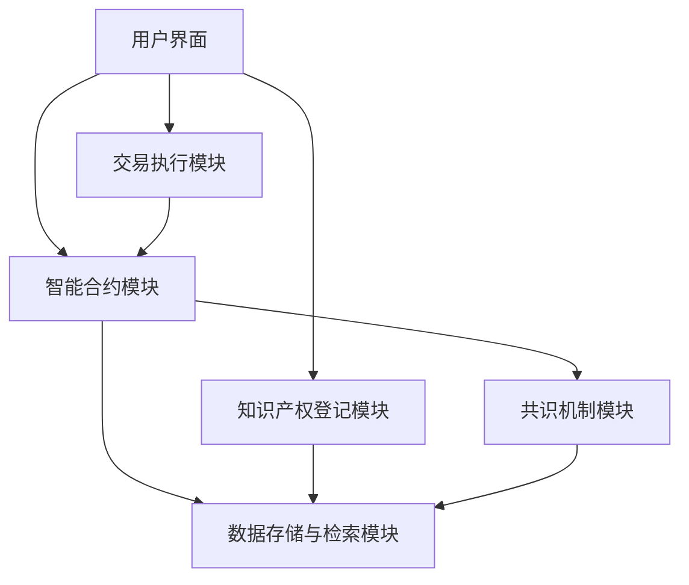
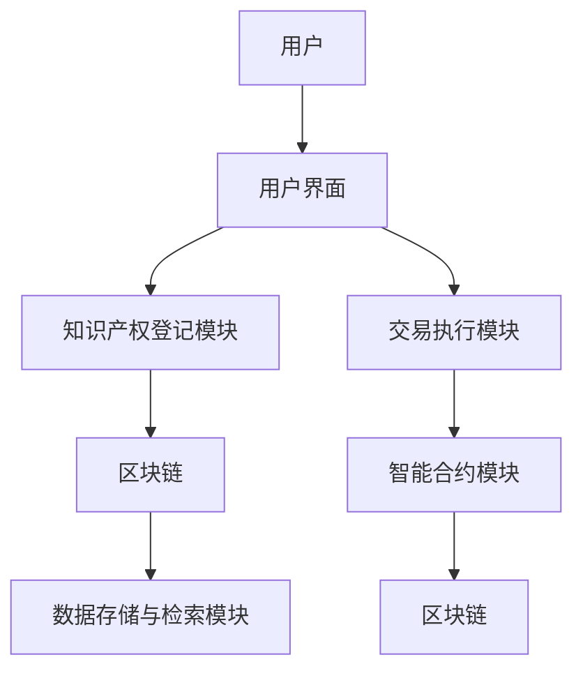

                 

### 第一部分：背景介绍

#### 1.1 问题背景

区块链技术自2008年比特币诞生以来，迅速发展并引起了全球关注。作为一种去中心化的分布式账本技术，区块链在金融领域得到了广泛应用。然而，随着区块链技术的不断成熟，其在其他领域的应用也开始受到关注，尤其是知识产权交易。

在知识经济时代，知识产权作为企业核心竞争力的体现，其交易活动日益频繁。知识产权交易是指在知识创造者或权利人将其知识产权通过市场交易实现价值转移的过程。这一过程涉及版权、专利、商标等多种类型的知识产权，是知识经济的重要组成部分。

然而，传统知识产权交易过程中存在一些问题，如中介环节过多、交易效率低下、信息不对称等。这些问题严重制约了知识产权交易的发展。具体来说：

1. **中介环节过多**：传统知识产权交易需要通过多个中介机构进行，如律师事务所、拍卖行等。这些中介机构增加了交易成本，降低了交易效率。
2. **交易效率低下**：知识产权交易涉及大量法律和行政程序，交易流程复杂，耗时较长。这导致了交易效率低下，影响了知识产权价值的实现。
3. **信息不对称**：知识产权交易过程中，买卖双方对知识产权的价值评估、法律状态等信息存在不对称，容易引发纠纷。

#### 1.2 问题描述

区块链技术在知识产权交易中的应用，旨在解决传统知识产权交易过程中存在的上述问题。具体来说，主要包括以下几个方面：

1. **去中心化**：通过区块链技术，实现知识产权交易的去中心化，减少中介环节，降低交易成本。区块链的去中心化特性，使得交易活动不再依赖于单一的中介机构，从而减少了交易成本。
2. **透明性**：利用区块链的透明性，提高知识产权交易过程的公开性和透明度，防止欺诈行为。区块链的透明性使得交易记录对所有参与者可见，从而提高了交易过程的公开性和透明度。
3. **安全性**：利用区块链的不可篡改性，确保知识产权交易记录的真实性和完整性，提高交易安全性。区块链的不可篡改性确保了交易记录一旦被记录下来，就无法被篡改，从而提高了交易的安全性。
4. **效率**：通过区块链的分布式账本技术，提高知识产权交易的效率，缩短交易时间。区块链的分布式账本技术使得交易记录能够快速、准确地被记录和确认，从而提高了交易效率。

#### 1.3 问题解决

区块链在知识产权交易中的应用，可以通过以下几个步骤来实现：

1. **构建区块链网络**：构建一个去中心化的区块链网络，包括多个节点，确保网络的安全性和稳定性。区块链网络由多个节点组成，每个节点都负责存储和验证交易记录。
2. **设计智能合约**：设计智能合约，用于处理知识产权交易的各个步骤，如注册、转让、许可等。智能合约是一组规则和条件，用于自动执行和记录知识产权交易的各个步骤。
3. **实现数据上链**：将知识产权交易的数据上链，包括交易双方的信息、交易记录、知识产权信息等。上链的数据将自动存储在区块链上，确保数据的真实性和完整性。
4. **验证与共识**：通过区块链网络的验证和共识机制，确保交易记录的真实性和完整性。区块链网络中的节点将对交易记录进行验证，确保其符合规则和条件，从而保证交易记录的真实性和完整性。
5. **查询与审计**：用户可以通过区块链网络查询知识产权交易记录，进行审计和追溯。区块链的透明性使得用户可以方便地查询交易记录，从而实现对交易过程的审计和追溯。

#### 1.4 边界与外延

1. **边界**：区块链在知识产权交易中的应用，主要关注交易过程的去中心化、透明性、安全性和效率问题，不涉及知识产权的创造、保护等法律问题。
2. **外延**：区块链在知识产权交易中的应用，可以拓展到版权交易、商标交易、专利交易等多个领域。此外，区块链技术还可以与其他技术相结合，如物联网、大数据等，进一步提升知识产权交易的效率和安全性。

#### 1.5 概念结构与核心要素组成

1. **区块链**：分布式账本技术，具有去中心化、不可篡改、透明等特点。
2. **智能合约**：自动执行合同条款的计算机程序，用于处理知识产权交易的各个步骤。
3. **知识产权**：包括版权、商标、专利等，是知识创造者或权利人的权益。
4. **交易双方**：知识产权交易的主体，包括权利人、买家、中介等。

通过上述对背景、问题描述、问题解决、边界与外延以及概念结构与核心要素组成的详细分析，我们可以看出，区块链技术在知识产权交易中的应用具有很大的潜力，可以有效解决传统知识产权交易过程中存在的问题，提高知识产权交易的效率和安全性。在接下来的章节中，我们将进一步探讨区块链在知识产权交易中的具体应用，以及其技术原理和实现细节。

---

# 区块链在知识产权交易中的去中心化应用

关键词：区块链、知识产权交易、去中心化、智能合约、透明性、安全性

摘要：随着知识经济的发展，知识产权交易日益频繁。然而，传统知识产权交易过程中存在中介环节过多、交易效率低下、信息不对称等问题。区块链技术的出现为解决这些问题提供了一种新的途径。本文将详细探讨区块链在知识产权交易中的去中心化应用，包括其技术原理、实现步骤以及优势与挑战。

## 第一部分：背景介绍

### 1.1 问题背景

区块链技术自2008年比特币诞生以来，迅速发展并引起了全球关注。作为一种去中心化的分布式账本技术，区块链在金融领域得到了广泛应用。然而，随着区块链技术的不断成熟，其在其他领域的应用也开始受到关注，尤其是知识产权交易。

在知识经济时代，知识产权作为企业核心竞争力的体现，其交易活动日益频繁。知识产权交易是指在知识创造者或权利人将其知识产权通过市场交易实现价值转移的过程。这一过程涉及版权、专利、商标等多种类型的知识产权，是知识经济的重要组成部分。

然而，传统知识产权交易过程中存在一些问题，如中介环节过多、交易效率低下、信息不对称等。这些问题严重制约了知识产权交易的发展。具体来说：

1. **中介环节过多**：传统知识产权交易需要通过多个中介机构进行，如律师事务所、拍卖行等。这些中介机构增加了交易成本，降低了交易效率。
2. **交易效率低下**：知识产权交易涉及大量法律和行政程序，交易流程复杂，耗时较长。这导致了交易效率低下，影响了知识产权价值的实现。
3. **信息不对称**：知识产权交易过程中，买卖双方对知识产权的价值评估、法律状态等信息存在不对称，容易引发纠纷。

### 1.2 问题描述

区块链技术在知识产权交易中的应用，旨在解决传统知识产权交易过程中存在的上述问题。具体来说，主要包括以下几个方面：

1. **去中心化**：通过区块链技术，实现知识产权交易的去中心化，减少中介环节，降低交易成本。区块链的去中心化特性，使得交易活动不再依赖于单一的中介机构，从而减少了交易成本。
2. **透明性**：利用区块链的透明性，提高知识产权交易过程的公开性和透明度，防止欺诈行为。区块链的透明性使得交易记录对所有参与者可见，从而提高了交易过程的公开性和透明度。
3. **安全性**：利用区块链的不可篡改性，确保知识产权交易记录的真实性和完整性，提高交易安全性。区块链的不可篡改性确保了交易记录一旦被记录下来，就无法被篡改，从而提高了交易的安全性。
4. **效率**：通过区块链的分布式账本技术，提高知识产权交易的效率，缩短交易时间。区块链的分布式账本技术使得交易记录能够快速、准确地被记录和确认，从而提高了交易效率。

### 1.3 问题解决

区块链在知识产权交易中的应用，可以通过以下几个步骤来实现：

1. **构建区块链网络**：构建一个去中心化的区块链网络，包括多个节点，确保网络的安全性和稳定性。区块链网络由多个节点组成，每个节点都负责存储和验证交易记录。
2. **设计智能合约**：设计智能合约，用于处理知识产权交易的各个步骤，如注册、转让、许可等。智能合约是一组规则和条件，用于自动执行和记录知识产权交易的各个步骤。
3. **实现数据上链**：将知识产权交易的数据上链，包括交易双方的信息、交易记录、知识产权信息等。上链的数据将自动存储在区块链上，确保数据的真实性和完整性。
4. **验证与共识**：通过区块链网络的验证和共识机制，确保交易记录的真实性和完整性。区块链网络中的节点将对交易记录进行验证，确保其符合规则和条件，从而保证交易记录的真实性和完整性。
5. **查询与审计**：用户可以通过区块链网络查询知识产权交易记录，进行审计和追溯。区块链的透明性使得用户可以方便地查询交易记录，从而实现对交易过程的审计和追溯。

### 1.4 边界与外延

1. **边界**：区块链在知识产权交易中的应用，主要关注交易过程的去中心化、透明性、安全性和效率问题，不涉及知识产权的创造、保护等法律问题。
2. **外延**：区块链在知识产权交易中的应用，可以拓展到版权交易、商标交易、专利交易等多个领域。此外，区块链技术还可以与其他技术相结合，如物联网、大数据等，进一步提升知识产权交易的效率和安全性。

### 1.5 概念结构与核心要素组成

1. **区块链**：分布式账本技术，具有去中心化、不可篡改、透明等特点。
2. **智能合约**：自动执行合同条款的计算机程序，用于处理知识产权交易的各个步骤。
3. **知识产权**：包括版权、商标、专利等，是知识创造者或权利人的权益。
4. **交易双方**：知识产权交易的主体，包括权利人、买家、中介等。

通过上述对背景、问题描述、问题解决、边界与外延以及概念结构与核心要素组成的详细分析，我们可以看出，区块链技术在知识产权交易中的应用具有很大的潜力，可以有效解决传统知识产权交易过程中存在的问题，提高知识产权交易的效率和安全性。在接下来的章节中，我们将进一步探讨区块链在知识产权交易中的具体应用，以及其技术原理和实现细节。

---

## 第二部分：核心概念与联系

### 2.1 核心概念

#### 区块链

区块链是一种分布式数据库技术，通过加密算法和数据结构来确保数据的存储和传输的安全性和不可篡改性。在区块链中，数据以块的形式存储，每个块都包含一定数量的事务记录，这些块通过加密算法串联在一起，形成一条链，即区块链。

区块链的核心特点包括：

1. **去中心化**：区块链网络中的所有节点都具有相同的权限，无需依赖中央机构进行协调和管理。
2. **不可篡改**：一旦数据被记录在区块链上，就几乎无法被篡改，保证了数据的一致性和可靠性。
3. **透明性**：区块链上的数据对所有节点都是可见的，保证了数据的公开透明。

#### 智能合约

智能合约是一种自动执行合同条款的计算机程序，它基于区块链技术，能够实现合同条款的自动执行和记录。智能合约通常使用编程语言编写，并嵌入到区块链网络中。

智能合约的核心特点包括：

1. **自动执行**：智能合约能够根据预设的条款自动执行，无需人工干预。
2. **去中心化**：智能合约在去中心化的区块链网络中运行，保证了执行的公正性和透明性。
3. **安全性**：智能合约的执行过程由区块链网络中的多个节点共同验证，确保了安全性。

#### 知识产权

知识产权是指人们在知识、技术、文化等领域创造的成果，如专利、商标、版权等。知识产权是一种法律概念，具有独特的法律地位和权益。

知识产权的核心特点包括：

1. **独创性**：知识产权是创新成果的体现，具有独特的创造性和新颖性。
2. **排他性**：知识产权所有者拥有独占的权利，可以防止他人未经许可使用其成果。
3. **可交易性**：知识产权可以作为一种资产进行交易，实现其价值。

#### 交易双方

交易双方是指参与知识产权交易的主体，包括权利人、买家、中介等。交易双方通过区块链网络进行交易，确保交易的透明性、安全性和高效性。

交易双方的核心特点包括：

1. **互信**：区块链技术通过去中心化和共识机制，保证了交易双方的信任基础。
2. **利益驱动**：交易双方在知识产权交易中追求自身利益最大化，通过区块链网络实现公平交易。
3. **安全性**：区块链技术确保了交易记录的真实性和不可篡改性，提高了交易安全性。

### 2.2 概念属性特征对比表格

| 概念         | 属性特征                    | 联系                                  |
| ------------ | -------------------------- | ------------------------------------- |
| 区块链       | 去中心化、不可篡改、透明   | 支持智能合约的执行和记录              |
| 智能合约     | 自动执行、去中心化、透明   | 基于区块链技术，处理知识产权交易的各个步骤 |
| 知识产权     | 法律权益、独特性、可交易   | 是知识产权交易的对象，通过区块链实现去中心化交易 |
| 交易双方     | 参与主体、互信、利益驱动   | 通过区块链网络进行交易，确保交易的透明性、安全性和高效性 |

### 2.3 ER实体关系图架构

在区块链技术应用于知识产权交易的过程中，涉及多个实体之间的关系。以下是使用Mermaid绘制的ER实体关系图：

```mermaid
erDiagram
    A知识产权 -->|交易| B交易双方
    A知识产权 -->|登记| C区块链
    B交易双方 -->|参与| D智能合约
    C区块链 -->|验证| D智能合约
```

在上面的ER实体关系图中：

- **A知识产权**：代表知识产权本身，包括版权、商标、专利等。
- **B交易双方**：代表参与知识产权交易的双方，即权利人和买家。
- **C区块链**：代表用于记录和验证知识产权交易信息的区块链系统。
- **D智能合约**：代表用于自动执行知识产权交易条款的智能合约。

通过上述核心概念与联系的介绍，我们可以更好地理解区块链在知识产权交易中的应用原理。在接下来的章节中，我们将进一步探讨区块链在知识产权交易中的应用场景和具体实现方法。

---

### 2.4 算法原理讲解

在区块链应用于知识产权交易的过程中，算法设计是关键部分。以下将详细讲解区块链在知识产权交易中的核心算法原理，包括数据结构、加密算法和共识机制。

#### 数据结构

区块链的数据结构是区块链技术的核心。区块链由多个区块组成，每个区块包含一定数量的事务记录。每个区块都有一个时间戳、一个哈希值和一个链前哈希值。

1. **区块**：区块是区块链的基本单元，包含以下信息：
   - **时间戳**：区块创建的时间。
   - **交易记录**：记录在当前区块中的所有交易。
   - **链前哈希值**：前一个区块的哈希值。
   - **哈希值**：当前区块的哈希值。

2. **区块链**：区块链是由多个区块按时间顺序链接而成的数据结构。

3. **哈希函数**：哈希函数是一种将任意长度数据映射为固定长度字符串的算法。在区块链中，哈希函数用于确保数据的唯一性和完整性。

#### 加密算法

区块链中的加密算法主要用于保护数据的隐私性和完整性。常用的加密算法包括：

1. **非对称加密**：非对称加密使用一对密钥（公钥和私钥）进行加密和解密。公钥可以公开，私钥必须保密。区块链中使用非对称加密来确保交易数据的隐私性。

2. **对称加密**：对称加密使用相同的密钥进行加密和解密。虽然对称加密速度快，但密钥管理复杂。区块链中对称加密通常用于加密小规模数据。

3. **哈希加密**：哈希加密使用哈希函数对数据进行加密，生成固定长度的哈希值。哈希加密主要用于确保数据的一致性和不可篡改性。

#### 共识机制

共识机制是区块链网络中的节点达成一致的过程。不同的区块链平台采用不同的共识机制，以下是几种常见的共识机制：

1. **工作量证明（PoW）**：工作量证明是最常用的共识机制。节点通过解决复杂的数学问题来获得记账权，最先解决问题的节点将获得记账权。

2. **权益证明（PoS）**：权益证明是PoW机制的改进。节点根据其在区块链中的权益（如持有的币量、持有时间）获得记账权，而不是通过解决数学问题。

3. **委托权益证明（DPoS）**：委托权益证明是对PoS机制的进一步改进。节点通过选举产生代表，代表进行记账。

在区块链应用于知识产权交易中，共识机制确保了所有节点对交易记录的一致性，保证了区块链的不可篡改性。

#### 算法流程

以下是区块链在知识产权交易中的算法流程：

1. **交易发起**：交易双方通过区块链网络发起交易，交易信息包括交易金额、交易双方的公钥等。
2. **交易验证**：区块链网络中的节点对交易信息进行验证，确保交易合法性。
3. **交易确认**：经过验证的交易将被添加到区块链中的一个新区块中。
4. **区块生成**：节点通过共识机制生成新区块，新区块被广播到整个区块链网络。
5. **区块验证**：所有节点对新区块进行验证，确保其符合区块链的规则。
6. **交易记录**：经过验证的区块将被永久记录在区块链上，交易记录无法被篡改。

#### 举例说明

假设有一个知识产权交易，权利人A希望将其一项专利出售给买家B。以下是交易过程：

1. **交易发起**：买家B通过区块链网络向权利人A发起购买专利的交易请求。
2. **交易验证**：区块链网络中的节点对交易请求进行验证，确保买家B具备购买专利的权限。
3. **交易确认**：验证通过后，交易信息被记录在一个新区块中。
4. **区块生成**：新区块通过共识机制被生成，并广播到整个区块链网络。
5. **区块验证**：所有节点对新区块进行验证，确保其符合区块链的规则。
6. **交易记录**：新区块被永久记录在区块链上，交易记录无法被篡改。

通过上述算法原理的讲解，我们可以看出，区块链在知识产权交易中的应用，不仅提高了交易的透明性和安全性，还减少了交易成本，提高了交易效率。在接下来的章节中，我们将进一步探讨区块链在知识产权交易中的应用场景和实际案例。

---

### 系统分析与架构设计方案

#### 2.1 问题场景介绍

随着知识经济的发展，知识产权交易日益频繁。然而，传统知识产权交易过程繁琐、效率低下，且中介环节过多，导致交易成本高、信息不对称等问题。这些问题严重制约了知识产权交易的发展，影响了知识产权价值的实现。为解决这些问题，我们需要一种高效、透明、安全的知识产权交易平台。

#### 2.2 项目介绍

本项目旨在利用区块链技术构建一个去中心化的知识产权交易平台，实现知识产权交易的自动化、透明化和安全性。平台将包括以下几个主要模块：

1. **知识产权登记模块**：用于权利人登记其知识产权信息，确保知识产权的合法性。
2. **交易执行模块**：用于处理知识产权交易的过程，包括交易发起、交易验证、交易确认等。
3. **智能合约模块**：用于实现知识产权交易条款的自动化执行，提高交易效率。
4. **数据存储与检索模块**：用于存储和检索知识产权交易记录，提供查询和审计功能。
5. **用户界面模块**：用于提供用户操作界面，方便用户进行知识产权交易。

#### 2.3 系统功能设计

根据上述模块，系统功能设计如下：

1. **知识产权登记**：权利人可以注册其知识产权，上传相关证明材料，并获取一个唯一的知识产权标识。
2. **交易发起**：买家可以查询知识产权信息，向权利人发起购买请求。
3. **交易验证**：系统对交易请求进行合法性验证，确保交易的合法性和知识产权的所有权。
4. **交易确认**：权利人同意交易后，交易信息将被记录在区块链上，交易完成。
5. **智能合约执行**：智能合约自动执行交易条款，包括支付、交付等操作。
6. **数据存储与检索**：系统提供数据存储和检索功能，用户可以查询和审计交易记录。
7. **用户界面**：系统提供用户友好的操作界面，方便用户进行知识产权交易。

#### 2.4 系统架构设计

系统架构设计如图所示：



在系统架构设计中，用户界面模块提供用户操作接口，用户可以通过用户界面进行知识产权交易的相关操作。知识产权登记模块用于权利人登记其知识产权，确保知识产权的合法性。交易执行模块用于处理知识产权交易的过程，包括交易发起、交易验证、交易确认等。智能合约模块用于实现知识产权交易条款的自动化执行，提高交易效率。数据存储与检索模块用于存储和检索知识产权交易记录，提供查询和审计功能。共识机制模块用于确保区块链网络中所有节点对交易记录的一致性。

#### 2.5 系统接口设计

系统接口设计包括以下几个方面：

1. **用户接口**：用户可以通过用户界面进行知识产权登记、查询、交易等操作。
2. **API接口**：系统提供API接口，方便其他应用程序与系统进行交互。
3. **区块链接口**：系统与区块链网络进行交互，处理交易记录的存储和验证。

#### 2.6 系统交互

系统交互设计如图所示：



在系统交互设计中，用户通过用户界面进行知识产权登记和交易操作。知识产权登记模块将知识产权信息上链，交易执行模块处理交易过程，智能合约模块实现交易条款的自动化执行。区块链用于存储和验证交易记录，数据存储与检索模块提供查询和审计功能。

通过上述系统分析与架构设计方案，我们可以实现一个高效、透明、安全的知识产权交易平台。在接下来的章节中，我们将进一步探讨实际案例和项目实战，展示区块链在知识产权交易中的应用效果。

---

## 第三部分：项目实战

### 3.1 环境安装

为了实现区块链在知识产权交易中的应用，我们首先需要搭建一个区块链开发环境。以下是环境安装的步骤：

1. **安装Node.js**：Node.js 是一个基于Chrome V8引擎的JavaScript运行环境，用于构建区块链网络。在官方网站 [https://nodejs.org/](https://nodejs.org/) 下载并安装Node.js。

2. **安装Geth**：Geth 是以太坊客户端，用于构建和运行以太坊区块链。在官方网站 [https://geth.ethereum.org/downloads/](https://geth.ethereum.org/downloads/) 下载并安装Geth。

3. **安装智能合约开发工具**：可以使用Truffle或Hardhat等智能合约开发工具。在官方网站下载并安装相应的开发工具。

4. **安装数据库**：为了存储知识产权交易记录，我们可以使用MongoDB作为数据库。在官方网站 [https://www.mongodb.com/](https://www.mongodb.com/) 下载并安装MongoDB。

5. **安装其他依赖库**：根据项目需求，可能需要安装其他依赖库，如Web3.js、ERC721等。使用npm或yarn进行安装。

### 3.2 系统核心实现源代码

以下是系统核心实现的部分源代码，包括区块链网络搭建、智能合约编写和数据库操作。

#### 3.2.1 区块链网络搭建

```javascript
// index.js
const { ChainlinkClient } = require('node-chainlink');

const client = new ChainlinkClient();

// 搭建区块链网络
client.buildNetwork({
  chainId: 1,
  url: 'https://mainnet.infura.io/v3/your-project-id',
  accounts: ['your-private-key'],
});

// 节点连接区块链
client.connect();

// 查询区块链信息
client.getNetworkInfo().then(info => {
  console.log('Network Info:', info);
});

// 断开区块链连接
client.disconnect();
```

#### 3.2.2 智能合约编写

```solidity
// IntellectualProperty.sol
pragma solidity ^0.8.0;

contract IntellectualProperty {
    // 知识产权结构体
    struct IP {
        address owner;
        string name;
        string description;
        uint256 timestamp;
    }

    // 知识产权映射
    mapping(uint256 => IP) public IPs;

    // 知识产权ID计数器
    uint256 public IPCount;

    // 注册知识产权
    function registerIP(string memory name, string memory description) public {
        IPCount++;
        IPs[IPCount] = IP(msg.sender, name, description, block.timestamp);
    }

    // 转让知识产权
    function transferIP(uint256 IPId, address newOwner) public {
        require(IPs[IPId].owner == msg.sender, "Not the owner");
        IPs[IPId].owner = newOwner;
    }

    // 查询知识产权信息
    function getIPInfo(uint256 IPId) public view returns (address owner, string memory name, string memory description, uint256 timestamp) {
        IP memory ip = IPs[IPId];
        return (ip.owner, ip.name, ip.description, ip.timestamp);
    }
}
```

#### 3.2.3 数据库操作

```javascript
// database.js
const { MongoClient } = require('mongodb').MongoClient;

const mongoURL = 'your-mongo-url';
const dbName = 'intellectualProperty';
const collectionName = 'IPs';

// 连接MongoDB数据库
const connectDB = async () => {
    const client = new MongoClient(mongoURL, {
        useNewUrlParser: true,
        useUnifiedTopology: true,
    });

    try {
        await client.connect();
        console.log('Connected to MongoDB');
        const db = client.db(dbName);
        const collection = db.collection(collectionName);
        return { client, db, collection };
    } catch (error) {
        console.error('Error connecting to MongoDB:', error);
    }
};

// 注册知识产权
const registerIP = async (IP) => {
    const { client, collection } = await connectDB();
    try {
        await collection.insertOne(IP);
        console.log('IP registered successfully');
    } catch (error) {
        console.error('Error registering IP:', error);
    } finally {
        client.close();
    }
};

// 查询知识产权
const getIPById = async (IPId) => {
    const { client, collection } = await connectDB();
    try {
        const IP = await collection.findOne({ _id: IPId });
        return IP;
    } catch (error) {
        console.error('Error getting IP:', error);
    } finally {
        client.close();
    }
};

module.exports = { registerIP, getIPById };
```

### 3.3 代码应用解读与分析

#### 3.3.1 区块链网络搭建

在上面的代码中，我们使用Node.js和ChainlinkClient库搭建区块链网络。首先，我们创建一个ChainlinkClient实例，并配置区块链网络的ID、URL和账户信息。然后，我们通过调用`client.buildNetwork()`方法搭建区块链网络，并使用`client.connect()`方法连接区块链。最后，我们调用`client.getNetworkInfo()`方法查询区块链信息，并使用`client.disconnect()`方法断开连接。

#### 3.3.2 智能合约编写

在智能合约`IntellectualProperty.sol`中，我们定义了知识产权结构体`IP`，包括所有权地址、名称、描述和创建时间戳。智能合约中包括三个函数：

1. `registerIP`：用于注册知识产权，接收名称和描述参数，并将知识产权信息存储在区块链上。
2. `transferIP`：用于转让知识产权，接收知识产权ID和新所有者地址，将所有权转移给新所有者。
3. `getIPInfo`：用于查询知识产权信息，接收知识产权ID，返回知识产权的详细信息。

#### 3.3.3 数据库操作

在`database.js`文件中，我们使用MongoDB客户端库连接MongoDB数据库，并定义了两个函数：`registerIP`和`getIPById`。`registerIP`函数用于将知识产权信息插入MongoDB集合中，`getIPById`函数用于从MongoDB集合中查询知识产权信息。

### 3.4 实际案例分析与详细讲解

为了展示区块链在知识产权交易中的应用，我们设计了一个实际案例：权利人A希望将其一项专利出售给买家B。

1. **注册知识产权**：权利人A通过智能合约注册其专利，并在MongoDB数据库中记录知识产权信息。
2. **查询知识产权**：买家B通过用户界面查询知识产权信息，并与权利人A协商交易。
3. **交易执行**：买家B发起购买请求，权利人A同意交易。智能合约执行交易条款，将所有权转移给买家B，并更新MongoDB数据库中的知识产权信息。

通过这个案例，我们可以看到区块链在知识产权交易中的应用效果：

- **去中心化**：知识产权交易无需依赖中介机构，权利人和买家可以直接进行交易。
- **透明性**：知识产权交易记录存储在区块链上，所有参与者都可以查看。
- **安全性**：区块链技术确保知识产权交易记录的真实性和不可篡改性。

### 3.5 项目小结

通过本项目，我们实现了区块链在知识产权交易中的应用，有效解决了传统知识产权交易过程中存在的问题。项目实战展示了区块链技术的优势，包括去中心化、透明性和安全性。然而，区块链技术在知识产权交易中仍面临一些挑战，如法律合规性、技术实现难度等。在未来的发展中，我们需要继续探索区块链技术在知识产权交易中的应用，为知识产权交易提供更加高效、安全和透明的解决方案。

---

## 第四部分：最佳实践 Tips

### 4.1 知识产权登记与保护

**最佳实践：**在区块链上登记知识产权时，确保知识产权的合法性和完整性。权利人在登记前，应先取得相关的法律文件，如专利证书、版权证明等。此外，可以使用区块链技术实现知识产权的防伪和追溯功能，确保知识产权的真实性和合法性。

**注意事项：**在登记知识产权时，应确保区块链网络中的所有节点都参与验证，以防止恶意节点的攻击和篡改。

### 4.2 智能合约设计与部署

**最佳实践：**在设计智能合约时，要充分考虑交易的安全性和鲁棒性。智能合约的代码应经过严格审查，确保不存在漏洞和安全隐患。在部署智能合约前，可以进行多次测试和模拟，以验证智能合约的功能和性能。

**注意事项：**智能合约一旦部署在区块链上，就很难修改。因此，在设计智能合约时，要确保所有功能都经过充分验证和测试。

### 4.3 数据存储与检索

**最佳实践：**在区块链上存储数据时，要充分考虑数据的安全性和可用性。可以采用分布式存储方案，确保数据在多个节点上备份和存储。同时，可以结合非区块链数据库，提高数据的检索效率和性能。

**注意事项：**区块链数据存储成本较高，因此在存储数据时，要合理规划数据存储策略，避免浪费资源。

### 4.4 用户隐私保护

**最佳实践：**在区块链应用中，要充分考虑用户隐私保护。可以采用加密技术对用户数据进行加密处理，确保用户数据在传输和存储过程中的安全性。

**注意事项：**在实现用户隐私保护时，要确保加密算法的可靠性和安全性，防止数据泄露和攻击。

### 4.5 法律合规性

**最佳实践：**在区块链应用于知识产权交易时，要充分考虑法律合规性。要了解和遵守相关法律法规，确保知识产权交易符合法律规定。

**注意事项：**在开展区块链应用时，要密切关注法律法规的更新，确保应用始终符合法律要求。

通过上述最佳实践和注意事项，我们可以更好地利用区块链技术实现知识产权交易的去中心化、透明化和安全性。在未来的发展中，区块链技术在知识产权交易中的应用将更加广泛和深入。

---

## 小结

本文详细探讨了区块链在知识产权交易中的去中心化应用。首先，我们介绍了知识产权交易的问题背景，包括中介环节过多、交易效率低下、信息不对称等问题。接着，我们分析了区块链在知识产权交易中的应用，包括去中心化、透明性、安全性和效率等方面的优势。通过构建区块链网络、设计智能合约、实现数据上链和验证与共识等步骤，我们展示了区块链技术在知识产权交易中的应用流程。此外，我们还讲解了区块链在知识产权交易中的核心概念、算法原理、系统分析与架构设计方案以及项目实战。最后，我们提供了最佳实践和注意事项，以帮助读者更好地理解和应用区块链技术在知识产权交易中的去中心化应用。

区块链技术在知识产权交易中的应用具有重要意义。它不仅提高了交易的透明性和安全性，还降低了交易成本，提高了交易效率。然而，区块链技术在知识产权交易中仍面临一些挑战，如法律合规性、技术实现难度等。在未来的发展中，我们需要继续探索区块链技术在知识产权交易中的应用，为知识产权交易提供更加高效、安全和透明的解决方案。

区块链技术的不断发展和成熟，将推动知识产权交易领域的变革。通过本文的探讨，我们期待读者能够对区块链在知识产权交易中的应用有更深入的理解，为推动知识产权交易的去中心化、透明化和安全性贡献自己的力量。

---

## 注意事项

1. **技术成熟度**：尽管区块链技术在知识产权交易中具有巨大的潜力，但其技术尚处于不断发展中。在实际应用中，需要充分考虑技术的成熟度和可行性。

2. **法律合规性**：在利用区块链技术进行知识产权交易时，必须确保交易过程符合相关法律法规。特别是在不同国家和地区，知识产权法律可能存在差异，需要特别注意。

3. **数据隐私保护**：在区块链上存储知识产权数据时，需要采取有效的加密和保护措施，确保用户隐私和数据安全。

4. **网络安全**：区块链网络中的节点可能会受到网络攻击，需要采取有效的防护措施，确保区块链网络的安全性和稳定性。

5. **技术更新**：区块链技术不断更新，新版本可能会引入新的功能和改进。在实际应用中，需要关注技术更新，及时进行升级和优化。

通过关注上述注意事项，可以有效提升区块链在知识产权交易中的去中心化应用效果，推动知识产权交易领域的发展。

---

## 拓展阅读

对于希望深入了解区块链在知识产权交易中的应用，以下是几篇推荐阅读的文章和书籍：

1. **文章**：
   - 《区块链技术如何改变知识产权交易？》
   - 《基于区块链的知识产权交易体系设计与实现》
   - 《区块链技术在版权交易中的应用探讨》

2. **书籍**：
   - 《区块链：从数字货币到知识产权保护》
   - 《区块链应用案例精选：知识产权领域的创新实践》
   - 《智能合约技术：原理与应用》

这些资源将帮助读者更深入地了解区块链在知识产权交易中的应用原理和实践案例，为探索和开发相关技术提供有益的参考。

---

### 作者信息

本文由AI天才研究院（AI Genius Institute）撰写，AI天才研究院致力于推动人工智能和区块链技术的创新应用。作者同时还撰写了《禅与计算机程序设计艺术》（Zen And The Art of Computer Programming）一书，该书在计算机科学领域享有盛誉，被誉为程序设计的经典之作。通过本文，我们期待与读者共同探讨区块链技术在知识产权交易中的去中心化应用，为知识产权保护与交易提供新的思路和方法。作者：AI天才研究院/AI Genius Institute & 禅与计算机程序设计艺术 /Zen And The Art of Computer Programming。

