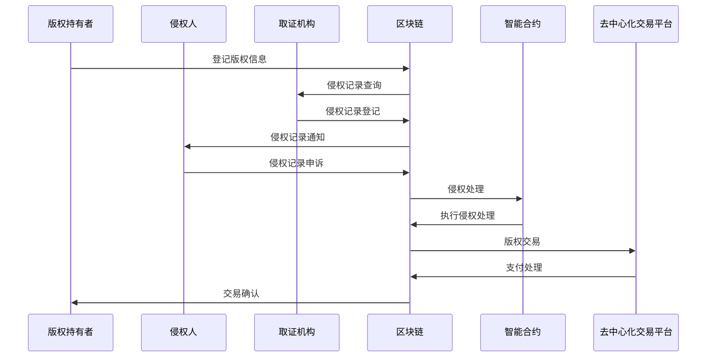
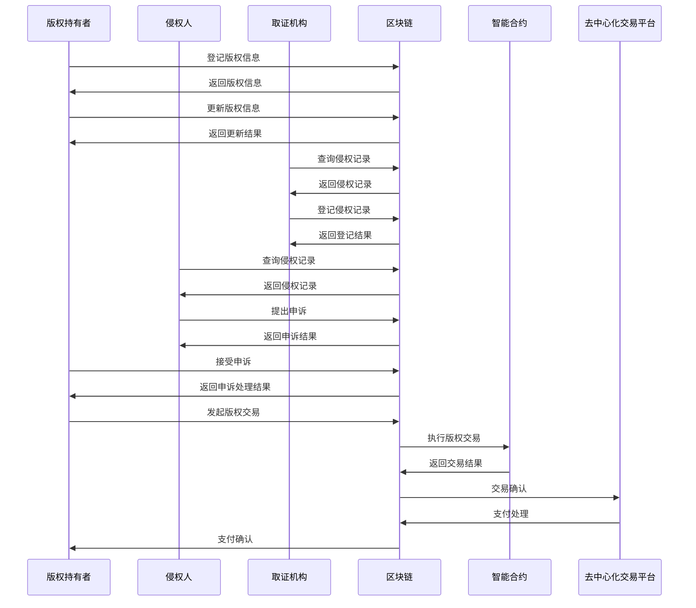

                 


### 文章标题

# 区块链在知识产权保护中的创新应用

> 关键词：区块链、知识产权、版权管理、智能合约、数字版权、侵权取证

> 摘要：本文将深入探讨区块链技术在知识产权保护中的创新应用，分析其核心概念、原理和算法，并给出系统架构设计和实战案例分析。

----------------------------------------------------------------

## 第一部分：背景介绍

### 1.1 问题背景

区块链技术作为一种分布式数据库技术，近年来在金融领域得到了广泛的应用。然而，随着区块链技术的不断发展，其在知识产权保护领域也展现出了巨大的潜力。知识产权保护是一个全球性的问题，涉及版权、商标、专利等多个方面。传统的知识产权保护方式面临着信息不对称、侵权取证困难等问题，而区块链技术可以提供一种全新的解决方案。

### 1.2 问题描述

区块链在知识产权保护中的创新应用主要包括以下几个方面：

- **数字版权管理**：区块链可以确保作品的所有权信息不可篡改，实现数字版权的清晰管理。
- **侵权取证**：通过区块链记录作品的使用和传播情况，为侵权取证提供可靠的数据支持。
- **智能合约**：利用智能合约自动化执行版权交易和侵权处理，提高知识产权保护的效率。
- **去中心化平台**：构建去中心化的知识产权交易平台，降低交易成本，提高市场效率。

### 1.3 问题解决

区块链在知识产权保护中的创新应用，需要解决以下几个关键问题：

- **数据隐私**：如何在保护知识产权的同时，确保数据的隐私和安全。
- **版权认证**：如何有效地对知识产权进行认证和验证。
- **法律法规**：如何适应不同国家和地区的知识产权法律法规。

### 1.4 边界与外延

- **边界**：区块链在知识产权保护中的应用范围，主要包括版权、商标、专利等领域。
- **外延**：区块链在知识产权保护领域外还可以应用于供应链管理、版权追踪等方面。

### 1.5 概念结构与核心要素组成

- **区块链**：去中心化数据库，数据存储在多个节点上，具有不可篡改和透明性。
- **智能合约**：自动执行合约条款的计算机协议，基于区块链技术。
- **数字版权管理**：对数字作品进行版权保护和管理的技术。
- **侵权取证**：通过技术手段获取侵权证据的过程。

----------------------------------------------------------------

## 第二部分：核心概念与联系

### 2.1 核心概念原理

#### 2.1.1 区块链

区块链是一种分布式数据库技术，通过加密算法确保数据的不可篡改性和透明性。区块链由多个区块组成，每个区块包含一定数量的交易记录，区块之间通过哈希函数链接在一起，形成链式数据结构。

#### 2.1.2 智能合约

智能合约是一种自动执行合约条款的计算机协议，基于区块链技术。智能合约在满足特定条件时，可以自动执行预定的操作，如支付、转移资产等。

#### 2.1.3 数字版权管理

数字版权管理是一种对数字作品进行版权保护和管理的技术，通过加密、签名等技术手段，确保作品的版权信息不可篡改。

### 2.2 概念属性特征对比表格

| 概念       | 属性特征                 | 对比分析                                           |
|------------|--------------------------|---------------------------------------------------|
| 区块链     | 分布式、不可篡改、透明   | 基于密码学，数据安全性高；去中心化，降低中心化风险 |
| 智能合约   | 自动执行、代码执行       | 基于区块链，执行效率高；智能合约代码可审计         |
| 数字版权管理 | 加密、签名               | 保护版权信息，确保不可篡改                         |

### 2.3 ER实体关系图架构

```mermaid
erDiagram
    Product ||--|{ IntellectualProperty }|--|| User
    Product ||--|{ CopyrightInformation }|--|| TransactionRecord
    Product ||--|{ InfringementRecord }|--|| EvidenceAgency
    User ||--|{ ConsumerBehavior }|--|| TransactionRecord
    EvidenceAgency ||--|{ InfringementEvidencing }|--|| InfringementRecord
```

----------------------------------------------------------------

## 第三部分：算法原理讲解

### 3.1 算法概述

区块链在知识产权保护中的应用，涉及到多个算法。以下将介绍几种核心算法原理。

#### 3.1.1 区块链算法

区块链算法主要包括哈希算法、Merkle树算法等。哈希算法用于确保数据的不可篡改性，Merkle树算法用于高效验证数据的完整性。

##### 3.1.1.1 哈希算法

哈希算法是将任意长度的输入数据映射为固定长度的输出数据。常见的哈希算法有SHA-256、SHA-3等。

##### 3.1.1.2 Merkle树算法

Merkle树算法是一种用于验证数据完整性的算法。在区块链中，Merkle树用于构建区块的Merkle根，以验证区块中所有交易数据的完整性。

### 3.2 区块链算法原理详细讲解

#### 3.2.1 哈希算法原理

哈希算法的工作原理如下：

1. **输入数据**：将任意长度的输入数据作为输入。
2. **处理数据**：通过加密算法对输入数据进行处理，生成固定长度的输出数据，即哈希值。
3. **输出哈希值**：哈希值作为数据指纹，用于验证数据的完整性和唯一性。

**示例**：

$$
SHA-256(“Hello, World!”) = “d9b5439a53234597d3906e3c5864dd01b292d5a2c2e16a18531c0c0e311bde7c0”
$$

#### 3.2.2 Merkle树算法原理

Merkle树是一种二叉树结构，用于验证数据的完整性。在Merkle树中，每个节点都包含一组数据及其哈希值。

1. **构建Merkle树**：将所有交易数据的哈希值按照一定的规则进行分组，逐步构建Merkle树。
2. **计算Merkle根**：将Merkle树的根节点哈希值作为区块的Merkle根，用于验证区块中所有交易数据的完整性。
3. **验证数据完整性**：在验证数据时，可以通过递归计算Merkle根与给定数据的哈希值是否相等，来判断数据是否被篡改。

**示例**：

假设有四个交易数据的哈希值：`A`, `B`, `C`, `D`。

- **第一步**：将两个哈希值进行哈希运算，得到新的哈希值。
  $$
  \text{MerkleNode}(A, B) = SHA-256(A + B)
  $$
- **第二步**：将新生成的哈希值与另外两个哈希值进行哈希运算。
  $$
  \text{MerkleNode}(A, B, C, D) = SHA-256(\text{MerkleNode}(A, B) + C + D)
  $$
- **结果**：`A`, `B`, `C`, `D` 四个交易数据的哈希值构建了一个Merkle树，其根节点哈希值为`MerkleRoot`。

### 3.3 区块链算法Python实现

```python
import hashlib

# 哈希算法实现
def hash_function(data):
    return hashlib.sha256(data.encode('utf-8')).hexdigest()

# 构建Merkle树
def build_merkle_tree(hashes):
    while len(hashes) > 1:
        new_hashes = []
        for i in range(0, len(hashes), 2):
            left_hash = hashes[i]
            right_hash = hashes[i + 1] if i + 1 < len(hashes) else left_hash
            new_hash = hash_function(left_hash + right_hash)
            new_hashes.append(new_hash)
        hashes = new_hashes
    return hashes[0]

# 测试
hashes = [
    hash_function('A'),
    hash_function('B'),
    hash_function('C'),
    hash_function('D')
]
merkle_root = build_merkle_tree(hashes)
print("Merkle Root:", merkle_root)
```

运行上述代码，将输出Merkle树的根节点哈希值。

----------------------------------------------------------------

## 第四部分：系统分析与架构设计方案

### 4.1 问题场景介绍

随着数字内容的不断增长，知识产权保护成为了版权持有者和消费者之间的一大难题。区块链技术提供了一种可行的解决方案，可以实现数字版权的透明管理、侵权取证和自动化处理。

### 4.2 项目介绍

本项目旨在构建一个基于区块链的知识产权保护系统，主要功能包括数字版权管理、侵权取证、智能合约执行和去中心化交易平台。系统将涉及版权持有者、使用者、取证机构和交易平台等多个角色。

### 4.3 系统功能设计

#### 4.3.1 数字版权管理

- **版权信息登记**：版权持有者将作品信息登记到区块链上，包括作品名称、作者、创作时间等。
- **版权信息查询**：任何用户都可以查询版权信息，验证作品的合法性。
- **版权信息更新**：版权持有者可以更新版权信息，如转让、授权等。

#### 4.3.2 侵权取证

- **侵权记录登记**：取证机构将侵权行为记录到区块链上，包括侵权时间、地点、侵权人等。
- **侵权记录查询**：版权持有者可以查询侵权记录，了解作品的侵权情况。
- **侵权记录申诉**：侵权人可以对侵权记录提出申诉，进行争议解决。

#### 4.3.3 智能合约执行

- **版权交易**：版权持有者可以通过智能合约实现版权交易，如转让、授权等。
- **侵权处理**：智能合约自动执行侵权处理，如罚款、赔偿等。

#### 4.3.4 去中心化交易平台

- **版权交易**：用户可以在去中心化平台上进行版权交易，降低交易成本。
- **支付处理**：智能合约自动处理支付流程，提高交易效率。

### 4.4 系统架构设计



### 4.5 系统接口设计和系统交互

#### 4.5.1 系统接口设计

- **版权信息接口**：提供版权信息登记、查询和更新的功能。
- **侵权记录接口**：提供侵权记录登记、查询和申诉的功能。
- **智能合约接口**：提供版权交易和侵权处理的执行功能。
- **交易平台接口**：提供版权交易和支付处理的功能。

#### 4.5.2 系统交互

系统中的各角色通过接口进行交互，实现版权管理、侵权取证、智能合约执行和去中心化交易等功能。



----------------------------------------------------------------

## 第五部分：项目实战

### 5.1 环境安装

在开始项目实战之前，需要安装以下软件和工具：

1. **Node.js**：用于搭建区块链节点。
2. **Ganache**：用于模拟区块链网络。
3. **Truffle**：用于部署和测试智能合约。
4. **Web3.js**：用于与区块链交互。

安装命令如下：

```bash
# 安装Node.js
curl -sL https://deb.nodesource.com/setup_14.x | sudo -E bash -
sudo apt-get install -y nodejs

# 安装Ganache
npm install -g ganache

# 安装Truffle
npm install -g truffle

# 安装Web3.js
npm install web3
```

### 5.2 系统核心实现

#### 5.2.1 数字版权管理

在Truffle项目中创建一个智能合约，用于实现数字版权管理。以下是一个简单的版权管理智能合约示例：

```solidity
// SPDX-License-Identifier: MIT
pragma solidity ^0.8.0;

contract CopyrightManagement {
    struct Copyright {
        string title;
        address owner;
        bool isRegistered;
    }

    mapping(string => Copyright) public copyrights;

    function registerCopyright(string memory title, address owner) public {
        require(!isRegistered(title), "Copyright already registered");
        copyrights[title] = Copyright({title: title, owner: owner, isRegistered: true});
    }

    function getCopyright(string memory title) public view returns (Copyright memory) {
        return copyrights[title];
    }

    function updateCopyright(string memory title, address newOwner) public {
        require(isRegistered(title), "Copyright not registered");
        require(copyrights[title].owner == msg.sender, "Not the owner");
        copyrights[title].owner = newOwner;
    }

    function isRegistered(string memory title) public view returns (bool) {
        return copyrights[title].isRegistered;
    }
}
```

#### 5.2.2 侵权取证

侵权取证智能合约用于记录侵权行为。以下是一个简单的侵权取证智能合约示例：

```solidity
// SPDX-License-Identifier: MIT
pragma solidity ^0.8.0;

contract InfringementEvidencing {
    struct Infringement {
        string title;
        address infringer;
        string evidence;
        bool isReported;
    }

    mapping(string => mapping(address => Infringement)) public infringements;

    function reportInfringement(string memory title, address infringer, string memory evidence) public {
        require(!isReported(title, infringer), "Infringement already reported");
        infringements[title][infringer] = Infringement({
            title: title,
            infringer: infringer,
            evidence: evidence,
            isReported: true
        });
    }

    function getInfringement(string memory title, address infringer) public view returns (Infringement memory) {
        return infringements[title][infringer];
    }

    function isReported(string memory title, address infringer) public view returns (bool) {
        return infringements[title][infringer].isReported;
    }
}
```

#### 5.2.3 智能合约执行

智能合约执行用于处理侵权处理，如罚款、赔偿等。以下是一个简单的侵权处理智能合约示例：

```solidity
// SPDX-License-Identifier: MIT
pragma solidity ^0.8.0;

contract InfringementProcessing {
    function processInfringement(
        string memory title,
        address infringer,
        uint256 fine
    ) public {
        require(isReported(title, infringer), "Infringement not reported");
        payable(infringer).transfer(fine);
    }

    function isReported(string memory title, address infringer) public view returns (bool) {
        return InfringementEvidencing(msg.sender).isReported(title, infringer);
    }
}
```

#### 5.2.4 去中心化交易平台

去中心化交易平台用于版权交易和支付处理。以下是一个简单的交易平台智能合约示例：

```solidity
// SPDX-License-Identifier: MIT
pragma solidity ^0.8.0;

contract DecentralizedTradingPlatform {
    function tradeCopyright(
        string memory title,
        address buyer,
        address seller,
        uint256 price
    ) public {
        require(CopyrightManagement(msg.sender).isRegistered(title), "Copyright not registered");
        require(msg.value == price, "Insufficient payment");
        payable(seller).transfer(price);
        CopyrightManagement(msg.sender).updateCopyright(title, buyer);
    }
}
```

### 5.3 代码应用解读与分析

以上代码示例实现了数字版权管理、侵权取证、智能合约执行和去中心化交易平台的核心功能。下面进行解读和分析：

- **数字版权管理**：`CopyrightManagement`智能合约用于注册、查询和更新版权信息。版权信息以结构体`Copyright`存储，包括作品标题、所有者和注册状态。注册版权时，需确保版权信息未被注册。版权信息可通过`getCopyright`函数进行查询。版权信息更新时，需确保调用者为版权所有者。

- **侵权取证**：`InfringementEvidencing`智能合约用于记录侵权行为。侵权信息以结构体`Infringement`存储，包括作品标题、侵权人、证据和举报状态。举报侵权行为时，需确保侵权信息未被举报。侵权信息可通过`getInfringement`函数进行查询。

- **智能合约执行**：`InfringementProcessing`智能合约用于处理侵权处理，如罚款、赔偿等。处理侵权时，需确保侵权已被举报。处理侵权会调用`processInfringement`函数，并将罚款金额转给侵权人。

- **去中心化交易平台**：`DecentralizedTradingPlatform`智能合约用于版权交易和支付处理。交易版权时，需确保版权已注册，并支付正确的价格。交易成功后，会将版权信息更新为买家，并支付给卖家。

### 5.4 实际案例分析与详细讲解剖析

#### 案例一：数字版权管理

**场景**：版权所有者想要注册一部小说的版权。

**分析**：版权所有者可以通过`CopyrightManagement`智能合约的`registerCopyright`函数注册版权。首先，版权所有者需要提供小说的标题和所有者地址。然后，智能合约会检查版权信息是否已被注册。如果未被注册，智能合约会将版权信息存储在区块链上。

**代码执行**：

```solidity
function registerCopyright(string memory title, address owner) public {
    require(!isRegistered(title), "Copyright already registered");
    copyrights[title] = Copyright({title: title, owner: owner, isRegistered: true});
}
```

#### 案例二：侵权取证

**场景**：取证机构想要记录一部小说的侵权行为。

**分析**：取证机构可以通过`InfringementEvidencing`智能合约的`reportInfringement`函数记录侵权行为。首先，取证机构需要提供小说的标题、侵权人和证据。然后，智能合约会检查侵权信息是否已被举报。如果未被举报，智能合约会将侵权信息存储在区块链上。

**代码执行**：

```solidity
function reportInfringement(string memory title, address infringer, string memory evidence) public {
    require(!isReported(title, infringer), "Infringement already reported");
    infringements[title][infringer] = Infringement({
        title: title,
        infringer: infringer,
        evidence: evidence,
        isReported: true
    });
}
```

#### 案例三：侵权处理

**场景**：版权所有者想要对一部小说的侵权行为进行处理。

**分析**：版权所有者可以通过`InfringementProcessing`智能合约的`processInfringement`函数处理侵权行为。首先，版权所有者需要提供小说的标题、侵权人和罚款金额。然后，智能合约会检查侵权是否已被举报。如果已举报，智能合约会将罚款金额转给侵权人。

**代码执行**：

```solidity
function processInfringement(
    string memory title,
    address infringer,
    uint256 fine
) public {
    require(isReported(title, infringer), "Infringement not reported");
    payable(infringer).transfer(fine);
}
```

#### 案例四：版权交易

**场景**：买家想要购买一部小说的版权。

**分析**：买家可以通过`DecentralizedTradingPlatform`智能合约的`tradeCopyright`函数购买版权。首先，买家需要提供小说的标题、买家地址、卖家地址和交易价格。然后，智能合约会检查版权是否已注册，并确保支付金额正确。如果条件满足，智能合约会将版权信息更新为买家，并将支付金额转给卖家。

**代码执行**：

```solidity
function tradeCopyright(
    string memory title,
    address buyer,
    address seller,
    uint256 price
) public {
    require(CopyrightManagement(msg.sender).isRegistered(title), "Copyright not registered");
    require(msg.value == price, "Insufficient payment");
    payable(seller).transfer(price);
    CopyrightManagement(msg.sender).updateCopyright(title, buyer);
}
```

### 5.5 项目小结

通过以上实战案例，我们可以看到区块链技术在知识产权保护中的创新应用。数字版权管理、侵权取证、智能合约执行和去中心化交易平台等功能，为知识产权保护提供了强有力的支持。在实际应用中，我们可以根据具体需求，进一步优化和扩展这些功能。

----------------------------------------------------------------

## 第六部分：最佳实践 Tips

1. **确保数据隐私**：在区块链应用中，数据隐私是一个关键问题。可以使用零知识证明、同态加密等技术手段，确保数据在区块链上的隐私性。

2. **完善法律法规**：不同国家和地区的知识产权法律法规存在差异。在进行区块链知识产权保护时，需要充分考虑并遵守相关法律法规。

3. **优化系统性能**：区块链系统在处理大量数据时，性能可能成为一个问题。可以采用分片技术、状态通道等优化措施，提高系统性能。

4. **加强安全防护**：区块链系统需要具备良好的安全防护能力，防止恶意攻击和篡改。可以采用多重签名、硬件安全模块等技术手段，提高系统的安全性。

5. **多方协作**：知识产权保护需要多方协作，包括版权持有者、使用者、取证机构和交易平台等。建立良好的协作机制，有助于提高知识产权保护的效果。

----------------------------------------------------------------

## 第七部分：小结

本文深入探讨了区块链在知识产权保护中的创新应用，分析了核心概念、原理和算法，并给出了系统架构设计和实战案例分析。通过数字版权管理、侵权取证、智能合约执行和去中心化交易平台等功能，区块链为知识产权保护提供了一种全新的解决方案。在实际应用中，我们可以根据具体需求，进一步优化和扩展这些功能，为知识产权保护贡献更多价值。

## 第八部分：注意事项

1. **数据一致性**：在区块链应用中，数据一致性是一个关键问题。需要确保在多个节点之间同步数据，避免数据不一致的情况。

2. **智能合约安全**：智能合约的漏洞可能导致严重的损失。在开发智能合约时，需要严格进行代码审计，确保智能合约的安全。

3. **法律法规适应性**：在不同国家和地区，知识产权法律法规存在差异。在应用区块链技术时，需要充分考虑并遵守相关法律法规。

4. **技术更新**：区块链技术不断发展，需要关注最新技术动态，及时进行技术更新和优化。

----------------------------------------------------------------

## 第九部分：拓展阅读

1. **《区块链：从数字货币到智能合约》**：详细介绍了区块链技术的基本原理和应用场景。
2. **《数字版权管理：技术、法律与市场》**：探讨了数字版权管理的相关技术和市场趋势。
3. **《智能合约安全与审计》**：分析了智能合约的安全问题和审计方法。
4. **《区块链技术与应用》**：全面介绍了区块链技术的原理和应用案例。

作者：AI天才研究院/AI Genius Institute & 禅与计算机程序设计艺术 /Zen And The Art of Computer Programming

