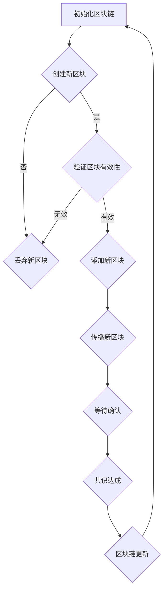
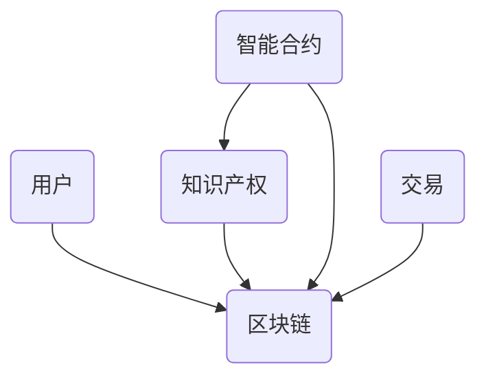
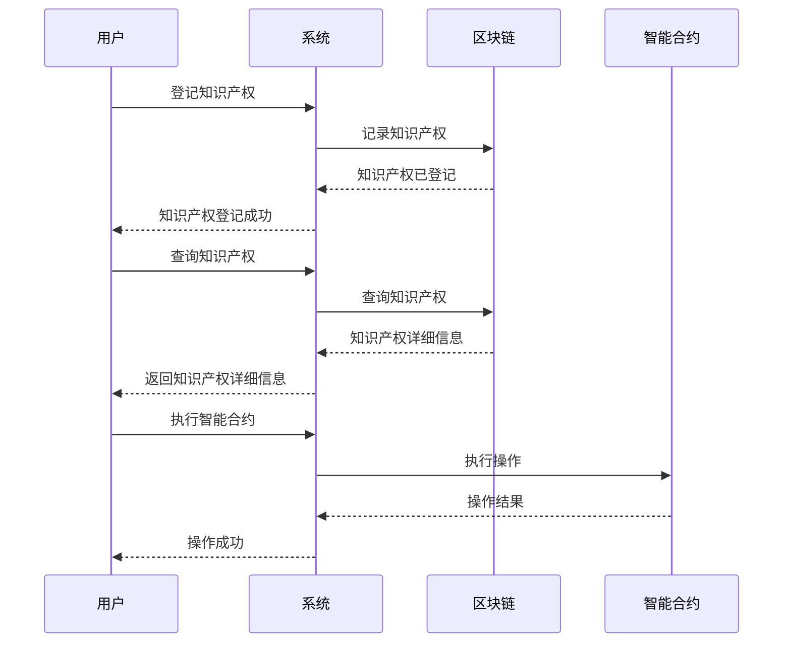

                 

### 引言：区块链在知识产权保护中的重要性

在当今数字时代，知识产权（Intellectual Property Rights, IPR）的保护变得尤为关键。随着全球数字内容和经济活动的急剧增加，版权、商标、专利等知识产权的保护面临着前所未有的挑战。传统的知识产权保护模式通常依赖于法律和行政手段，但这些方法在面对日益复杂的网络环境和快速变化的技术时，显得力不从心。这就需要一种更为高效、透明且安全的新模式来应对这些挑战。

区块链技术的出现，为知识产权保护带来了新的希望。区块链是一种去中心化的分布式账本技术，具有不可篡改、透明度高和可追溯性强等特点。这些特性使得区块链在知识产权保护中具有独特的优势，可以解决传统模式中存在的诸多问题，如版权归属不明、侵权行为难以追踪等。

本文将深入探讨区块链在知识产权保护中的应用，分为以下几个部分：

首先，我们将介绍区块链技术的起源、基本概念和架构，为后续讨论打下基础。

其次，分析当前知识产权保护所面临的挑战，并阐述引入区块链技术的必要性和优势。

然后，详细讲解区块链技术在知识产权保护中的具体应用，包括版权保护、商标注册和专利管理等方面。

接下来，探讨在实施区块链知识产权保护方案时可能遇到的挑战，并提出相应的解决方案。

最后，总结全文，展望区块链技术在知识产权保护领域的未来发展趋势。

通过这一系列的分析和探讨，我们希望能够为读者提供一个全面、深入的理解，帮助大家更好地把握区块链在知识产权保护中的应用前景。

### 关键词

- 区块链技术
- 知识产权保护
- 数字版权管理
- 去中心化
- 智能合约
- 版权归属
- 侵权追踪
- 透明性和可追溯性

### 摘要

本文探讨了区块链技术在知识产权保护中的新模式。首先，介绍了区块链技术的起源和基本概念，以及其在去中心化、透明性和安全性方面的优势。随后，分析了当前知识产权保护面临的挑战，包括版权归属不明确、侵权行为难以追踪等问题。通过详细讨论区块链技术在数字版权管理、商标注册和专利管理等方面的应用，本文展示了区块链在知识产权保护中的独特优势。此外，本文还探讨了实施区块链知识产权保护方案可能遇到的挑战，并提出了解决方案。最后，展望了区块链技术在知识产权保护领域的未来发展趋势，为相关领域的研究和实践提供了有益的参考。

### Part 1: 背景和概述

#### Chapter 1: 区块链技术的引入

**1.1 区块链技术的起源和进化**

区块链技术的起源可以追溯到2008年，当时一位化名为中本聪（Satoshi Nakamoto）的神秘人物发表了一篇名为《比特币：一种点对点的电子现金系统》的白皮书。这一白皮书首次提出了区块链技术的概念，并奠定了比特币的基础。比特币作为第一个成功的区块链应用，迅速引起了全球的关注，为区块链技术的进一步发展和应用铺平了道路。

从那时起，区块链技术经历了多个阶段的发展。最初，区块链主要用于加密货币，如比特币和以太坊等。随着技术的不断成熟，区块链的应用范围逐渐扩大，从金融领域扩展到供应链管理、医疗记录管理、投票系统等多个领域。如今，区块链已经成为一个热门的研究领域，吸引了大量企业和研究机构的关注。

**1.2 基本概念和原理**

区块链是一种分布式账本技术，其核心特点是去中心化。这意味着区块链上的数据不需要依赖中央机构进行管理和验证，而是通过网络中的所有节点共同参与维护。这种去中心化的结构不仅提高了系统的安全性，还增强了数据透明度和不可篡改性。

区块链由一系列按时间顺序排列的“区块”组成，每个区块都包含一定数量的交易记录。这些区块通过密码学算法连接在一起，形成了一条不断延长的区块链。每个区块都包含一个时间戳和一个指向前一个区块的哈希值，这种设计使得区块链具有很高的防篡改能力。

**1.3 去中心化与信任**

去中心化是区块链技术的核心特点之一。在传统的集中式系统中，所有数据都存储在一个中央服务器上，如果服务器遭受攻击或故障，整个系统可能会崩溃。而去中心化的区块链系统通过将数据分散存储在网络中的各个节点上，有效避免了单点故障的风险。

此外，区块链技术还通过密码学算法和共识机制实现了信任机制。在区块链网络中，所有节点都需要验证交易的有效性，并通过加密算法确保数据的真实性和完整性。共识机制则用于确保所有节点对区块链的一致性，从而避免了“双花攻击”（同一笔资金被两次花费）等问题。

**1.4 区块链架构**

区块链架构通常包括以下几个关键部分：

- **节点**：节点是区块链网络中的基本单元，负责存储数据、验证交易和参与共识过程。节点可以分为全节点和轻节点，全节点能够完整地维护整个区块链，而轻节点则仅维护与自己相关的部分数据。

- **区块链**：区块链是按时间顺序排列的区块集合，每个区块包含一定数量的交易记录。区块链具有不可篡改性和不可分割性，确保了数据的安全性和一致性。

- **交易**：交易是区块链上的基本操作，表示用户之间的价值转移或信息交换。交易经过验证后会被添加到区块链中，形成不可撤销的记录。

- **共识机制**：共识机制是区块链网络中的关键组件，用于确保所有节点对区块链的一致性。不同的共识机制有不同的实现方式和优缺点，常见的有工作量证明（Proof of Work, PoW）、权益证明（Proof of Stake, PoS）和委托权益证明（Delegated Proof of Stake, DPoS）等。

通过上述介绍，我们可以看到，区块链技术以其去中心化、不可篡改和透明性等特点，为各种应用场景提供了全新的解决方案。在接下来的章节中，我们将进一步探讨区块链技术在知识产权保护中的具体应用。

#### Chapter 2: 知识产权保护面临的挑战

知识产权（Intellectual Property Rights，简称IPR）是现代社会经济活动中至关重要的组成部分。它涵盖了版权、商标、专利、商业秘密等多种形式的智力成果，是企业创新和竞争力的核心资源。然而，随着数字化和网络技术的发展，知识产权保护面临着前所未有的挑战。以下是当前知识产权保护所面临的主要问题及其背景、问题描述、问题解决、边界与外延、概念结构与核心要素组成。

**2.1 当前知识产权保护的问题**

**2.1.1 版权归属不明**

在数字时代，版权的归属问题变得尤为复杂。由于数字内容的复制和传播变得极其容易，作品的原创者往往难以证明其对作品的版权所有权。特别是在大规模的网络环境中，未经授权的复制、传播和篡改行为屡见不鲜，使得版权所有者的权益受到严重侵害。

**问题描述**：数字内容在互联网上的快速传播，使得版权所有者难以追踪和管理其作品的复制和传播行为，导致版权归属不明确，原创者权益受损。

**问题解决**：通过区块链技术，可以实现数字内容的唯一标识和不可篡改的记录，从而有效解决版权归属不明的问题。例如，通过为每件作品创建一个独特的区块链地址，并记录其版权信息，可以为版权所有者提供可靠的证明。

**边界与外延**：这一解决方案不仅适用于单个作品的版权保护，还可以扩展到整个版权产业链，包括出版社、版权代理等各个环节。

**概念结构与核心要素组成**：区块链地址 + 唯一标识符（如哈希值）+ 版权信息（如作者、创作时间、版权期限等）。

**2.1.2 侵权行为难以追踪**

随着互联网的普及，侵权行为也变得日益复杂。传统的知识产权保护手段在追踪和打击侵权行为时往往显得力不从心。侵权者可以通过更改IP地址、使用代理服务器等方式隐藏身份，使得取证过程复杂且耗时。

**问题描述**：互联网环境中侵权行为频繁，侵权者使用技术手段隐藏身份，使得知识产权所有者难以有效追踪和打击侵权行为。

**问题解决**：区块链技术可以通过记录网络行为的全链路数据，实现对侵权行为的可追溯性。例如，通过将网络交易、通信记录等上传到区块链，可以形成一条完整的侵权行为链条，为知识产权所有者提供有效的取证工具。

**边界与外延**：这一解决方案不仅可以应用于版权侵权，还可以扩展到商标、专利等其他知识产权领域。

**概念结构与核心要素组成**：区块链地址 + 网络行为记录（如IP地址、MAC地址、通信记录等）+ 侵权行为标识。

**2.1.3 保护成本高且效率低**

传统的知识产权保护手段通常需要依赖法律诉讼和行政手段，这些方法不仅成本高昂，而且处理周期较长。特别是在全球化的背景下，跨国知识产权纠纷的处理更加复杂，进一步增加了成本和难度。

**问题描述**：传统知识产权保护手段成本高、效率低，尤其在跨国纠纷中，处理周期长，成本高昂。

**问题解决**：区块链技术的引入可以通过去中心化的方式提高知识产权保护的效率和降低成本。例如，通过建立全球性的区块链平台，可以实现知识产权的快速登记、查询和纠纷处理，大大缩短处理周期。

**边界与外延**：这一解决方案不仅适用于国内知识产权保护，还可以应用于跨国知识产权纠纷的处理。

**概念结构与核心要素组成**：区块链平台 + 自动化处理流程（如智能合约）+ 快速登记和查询功能。

**2.1.4 难以实现透明和公正**

在传统的知识产权保护体系中，由于信息不对称和数据不透明，常常出现不公平现象。例如，版权所有者和使用者之间的利益分配不均，导致原创者权益受损。

**问题描述**：传统知识产权保护体系信息不对称、不透明，导致利益分配不均，不公平现象普遍。

**问题解决**：区块链技术的透明性和不可篡改性可以有效解决信息不对称和不透明的问题。通过区块链记录知识产权的完整信息，可以确保各方的合法权益得到公平保护。

**边界与外延**：这一解决方案不仅可以应用于版权保护，还可以扩展到商标、专利等其他知识产权领域。

**概念结构与核心要素组成**：区块链地址 + 透明记录（如版权转让、使用许可等）+ 公平利益分配机制。

通过上述分析，我们可以看到，区块链技术在解决当前知识产权保护面临的挑战方面具有独特的优势。在接下来的章节中，我们将深入探讨区块链技术在知识产权保护中的具体应用，进一步揭示其潜力和前景。

### 核心概念与联系

#### 区块链与知识产权保护的关系

区块链技术作为一种去中心化、不可篡改的分布式账本，在知识产权保护领域展示了巨大的潜力。其核心概念和原理不仅为知识产权的管理和验证提供了新的手段，还为解决传统知识产权保护中的诸多问题提供了有力支持。

**1. 区块链的核心概念**

区块链由一系列按时间顺序排列的区块组成，每个区块都包含一组交易记录和用于确保数据完整性和一致性的密码学算法。区块链的主要特性包括：

- **去中心化**：数据存储在分布式的节点上，无需依赖中央机构，提高了系统的容错性和安全性。
- **不可篡改**：一旦数据被记录在区块链上，便无法被篡改，确保了数据的真实性和完整性。
- **透明性**：所有节点都可以查看区块链上的数据，确保了数据的透明度。

**2. 知识产权保护中的核心概念**

在知识产权保护中，核心概念包括版权、商标、专利等。每种知识产权都有其特定的保护需求和特点：

- **版权**：涉及文学、艺术、音乐等作品的原创性表达，保护创作者的复制权、发行权、改编权等。
- **商标**：标识企业的品牌和产品，防止他人非法使用相同或相似的标志。
- **专利**：保护发明者的创新成果，防止他人未经授权的制造、使用、销售或进口发明。

**3. 区块链在知识产权保护中的应用**

区块链技术在知识产权保护中的应用主要体现在以下几个方面：

- **数字版权管理（DCM）**：通过区块链为数字内容创建唯一标识，确保作品的原创性和归属权。
- **版权交易和许可**：利用智能合约自动化执行版权交易和许可，提高效率和透明度。
- **侵权追踪**：记录和监控数字内容在网络上的传播行为，快速识别和打击侵权行为。
- **商标和专利管理**：建立去中心化的商标和专利数据库，确保信息的准确性和透明性。

**4. 概念属性特征对比表格**

下面是一个简单的对比表格，展示区块链与知识产权保护的核心概念和特性：

| 特性       | 区块链                      | 知识产权保护                      |
| ---------- | -------------------------- | --------------------------------- |
| 去中心化   | 数据存储在分布式节点上      | 版权、商标、专利等均有明确的拥有者 |
| 不可篡改   | 数据一旦记录便不可更改      | 通过法律和行政手段保护知识产权     |
| 透明性     | 所有节点可以查看数据        | 信息透明度受法律和行政手段影响    |
| 安全性     | 加密算法和共识机制保障安全  | 法律和行政手段保障知识产权安全    |

**5. ER实体关系图架构**

为了更直观地展示区块链与知识产权保护的关系，我们可以使用ER（实体-关系）模型来构建实体关系图。以下是区块链在知识产权保护中的ER实体关系图：

```
+-------------------+
|   Blockchain      |
+-------------------+
| - Blocks          |
| - Transactions    |
| - Nodes           |
+-------------------+
      |
      v
+-------------------+
| Intellectual      |
| Property (IP)     |
+-------------------+
| - Copyright       |
| - Trademark       |
| - Patent          |
+-------------------+
      |
      v
+-------------------+
| Digital           |
| Content           |
+-------------------+
| - Media Files     |
| - Text Documents  |
| - Software Code   |
+-------------------+
```

在这个ER模型中，区块链作为基础技术框架，支撑着各种知识产权实体（如版权、商标、专利）和数字内容。通过这种关系架构，区块链不仅为知识产权的管理和保护提供了新的手段，也为数字内容的创建、交易和使用带来了革命性的变化。

### 算法原理讲解

在深入探讨区块链在知识产权保护中的应用之前，有必要先了解区块链的基本算法原理。以下将使用Mermaid画出区块链的简化算法流程图，并结合Python源代码详细阐述区块链算法的数学模型和公式，并通过具体的示例进行通俗易懂的讲解。

#### 1. Mermaid算法流程图



这个流程图展示了区块链的基本运作流程：从初始化区块链开始，创建新区块，验证其有效性，添加到链中，然后传播给其他节点，等待确认并更新区块链。

#### 2. Python源代码

下面是一个简化的Python示例，用于说明区块链的基本算法原理：

```python
import hashlib
import json
from time import time

class Block:
    def __init__(self, index, transactions, timestamp, previous_hash):
        self.index = index
        self.transactions = transactions
        self.timestamp = timestamp
        self.previous_hash = previous_hash
        self.hash = self.compute_hash()

    def compute_hash(self):
        block_string = json.dumps(self.__dict__, sort_keys=True)
        return hashlib.sha256(block_string.encode()).hexdigest()

class Blockchain:
    def __init__(self):
        self.unconfirmed_transactions = []  # 待确认交易
        self.chain = []  # 主链
        self.create_genesis_block()

    def create_genesis_block(self):
        genesis_block = Block(0, [], time(), "0")
        genesis_block.hash = genesis_block.compute_hash()
        self.chain.append(genesis_block)

    def add_new_transaction(self, transaction):
        self.unconfirmed_transactions.append(transaction)

    def mine(self):
        if not self.unconfirmed_transactions:
            return False
        
        last_block = self.chain[-1]
        new_block = Block(index=last_block.index + 1,
                          transactions=self.unconfirmed_transactions,
                          timestamp=time(),
                          previous_hash=last_block.hash)
        
        new_block.hash = new_block.compute_hash()
        
        if self.is_valid_block(new_block):
            self.chain.append(new_block)
            self.unconfirmed_transactions = []
            return True
        else:
            return False

    def is_valid_block(self, block):
        if block.previous_hash != self.chain[-1].hash:
            return False
        return True

    def is_chain_valid(self):
        for i in range(1, len(self.chain)):
            current = self.chain[i]
            previous = self.chain[i - 1]
            if current.hash != current.compute_hash():
                return False
            if current.previous_hash != previous.hash:
                return False
        return True

# 示例：创建区块链并添加交易
blockchain = Blockchain()
blockchain.add_new_transaction("Transaction 1")
blockchain.add_new_transaction("Transaction 2")
blockchain.mine()
```

#### 3. 算法原理和数学模型

区块链的核心算法包括区块（Block）的创建、交易（Transaction）的验证和链（Chain）的维护。以下是这些算法的原理和相关的数学模型：

- **区块链创建（Genesis Block）**：区块链的创建始于一个创世区块（Genesis Block），该区块不包含任何交易，其哈希值固定为"0"。创世区块的作用是作为区块链的起点，后续的区块都通过哈希函数与前一个区块的哈希值关联。

- **区块结构**：每个区块包含以下信息：
  - **index**：区块在区块链中的索引。
  - **transactions**：区块包含的交易记录。
  - **timestamp**：区块创建的时间戳。
  - **previous_hash**：前一个区块的哈希值。
  - **hash**：当前区块的哈希值，由所有区块信息通过哈希函数计算得到。

- **哈希函数**：哈希函数用于计算区块的哈希值。常见的哈希函数包括SHA-256，它可以生成一个固定的长度（64位）的哈希值。例如，SHA-256函数将任何长度的输入映射为128位哈希值。

- **交易验证**：交易验证是确保交易合法性的过程。在区块链中，交易通常需要经过多个节点的验证，一旦交易被验证通过，便会被添加到区块中。

- **共识机制**：共识机制用于确保区块链网络中所有节点对区块链的一致性。常见共识机制包括工作量证明（Proof of Work, PoW）和权益证明（Proof of Stake, PoS）。在PoW机制中，节点通过解决复杂的数学问题来竞争生成新区块，而在PoS机制中，节点根据其持有的币量参与区块的生成。

#### 4. 示例解释

通过上述Python示例，我们可以看到区块链算法的基本实现。以下是具体步骤的解释：

1. **初始化区块链**：创建一个Genesis Block作为区块链的起点。
2. **添加交易**：将新的交易添加到未确认交易池中。
3. **挖矿（Mine）**：当未确认交易池中有足够的交易时，节点开始创建新区块。新区块包含未确认交易池中的所有交易，并计算其哈希值。
4. **验证区块**：验证新区块的哈希值是否有效。如果新区块的前一个哈希值与前一个区块的哈希值不一致，则丢弃新区块。
5. **区块链更新**：如果新区块有效，将其添加到区块链中，清空未确认交易池，并开始新的挖矿过程。

通过这个示例，我们可以清楚地看到区块链算法的基本原理。在区块链技术中，哈希函数和共识机制是确保区块链安全和可信的关键组件。

### 系统分析与架构设计

#### 3.1 问题场景介绍

在当前数字化时代，知识产权（Intellectual Property，简称IP）的保护需求日益迫切。传统的知识产权保护方法，如法律诉讼和行政手段，往往成本高昂且效率低下，特别是在跨国纠纷和数字内容的快速传播中，这些问题更为突出。因此，我们需要一种更加高效、透明且安全的知识产权保护方案。

区块链技术作为一种去中心化、不可篡改和透明的分布式账本技术，为知识产权保护提供了一种全新的解决方案。它可以通过记录和验证知识产权信息，确保版权、商标和专利的合法性和可追溯性，从而有效解决传统模式中存在的问题。

#### 3.2 项目介绍

本项目旨在构建一个基于区块链技术的知识产权管理系统，通过区块链的不可篡改性和透明性，实现知识产权的全程管理。该项目包括以下几个核心功能：

- **知识产权登记**：用户可以在系统中登记其知识产权信息，包括版权、商标和专利等。
- **知识产权查询**：系统提供全球范围内的知识产权查询服务，用户可以快速查找特定知识产权的详细信息。
- **侵权监测**：系统通过监控区块链上的知识产权信息，自动识别侵权行为，并提供维权支持。
- **智能合约管理**：系统利用智能合约自动化执行知识产权的转让、许可和授权等操作。

#### 3.3 系统功能设计（领域模型）

为了实现上述功能，我们设计了以下领域模型，通过Mermaid绘制领域类图，展示系统的核心类和关系：

```mermaid
classDiagram
    User <<类>>
    IntellectualProperty <<类>>
    Blockchain <<类>>
    SmartContract <<类>>
    Transaction <<类>>

    User o--o IntellectualProperty : 拥有
    Blockchain o--o Transaction : 记录
    SmartContract o--o Transaction : 执行
    IntellectualProperty o--o SmartContract : 绑定

    User --> Blockchain
    User --> IntellectualProperty
    IntellectualProperty --> SmartContract
    SmartContract --> Transaction
    Blockchain --> Transaction
```

在这个领域模型中，用户（User）是知识产权的拥有者，其可以创建和登记知识产权（IntellectualProperty）。区块链（Blockchain）负责记录所有的知识产权交易（Transaction），并确保其不可篡改。智能合约（SmartContract）用于自动化执行知识产权的转让、许可和授权等操作，每个智能合约都会生成一个交易（Transaction），并记录在区块链上。

#### 3.4 系统架构设计

为了实现上述功能，我们设计了以下系统架构，通过Mermaid绘制系统架构图，展示系统的主要组件和它们之间的关系：



在这个系统架构中：

- **用户层**：用户通过前端界面与系统进行交互，可以登记知识产权、查询知识产权信息和监控侵权行为。
- **区块链层**：区块链作为系统的核心组件，负责记录和管理所有的知识产权交易信息，确保数据的透明性和不可篡改性。
- **智能合约层**：智能合约用于自动化执行知识产权相关的操作，如转让、许可和授权等。
- **数据库层**：数据库用于存储知识产权的基本信息和交易记录。

#### 3.5 系统接口设计

为了方便用户和第三方系统集成，系统设计了以下主要接口：

- **知识产权登记接口**：用户可以通过该接口提交知识产权登记申请，系统将验证并记录在区块链上。
- **知识产权查询接口**：用户可以通过该接口查询特定知识产权的详细信息。
- **侵权监测接口**：系统自动监测区块链上的交易记录，识别可能的侵权行为，并通知用户。
- **智能合约执行接口**：用户可以通过该接口执行智能合约操作，如知识产权的转让、许可和授权等。

#### 3.6 系统交互

为了展示系统的交互过程，我们通过Mermaid绘制了以下系统交互序列图：



在这个序列图中，用户首先通过前端界面与系统进行交互，然后系统与区块链和智能合约进行通信，最终将操作结果返回给用户。通过这种设计，系统实现了知识产权的全程管理和自动化执行，大大提高了效率和安全性。

### 项目实战

#### 4.1 环境安装

为了实施区块链知识产权保护方案，首先需要在本地环境中搭建区块链平台。以下是在Windows环境下安装Ethereum区块链的步骤：

1. **安装Go语言环境**：

   - 访问[Go语言官方下载页面](https://golang.google.cn/)，下载并安装Go语言。
   - 打开命令提示符，执行以下命令设置环境变量：
     ```shell
     set GOBIN=%LOCALAPPDATA%/Go/bin
     set PATH=%PATH%;%GOBIN%
     ```

2. **安装Ethereum节点**：

   - 使用Git克隆Ethereum官方仓库：
     ```shell
     git clone https://github.com/ethereum/go-ethereum.git
     ```
   - 进入go-ethereum目录，执行以下命令启动节点：
     ```shell
     geth --networkid 15 console
     ```

此时，Ethereum节点已成功启动，可以在控制台进行相关操作。

#### 4.2 系统核心实现源代码

以下是一个简单的区块链知识产权保护系统核心实现源代码，包括版权登记和查询功能：

```python
from web3 import Web3
from solc import compile
from IPython.display import clear_output

# 连接到本地Ethereum节点
w3 = Web3(Web3.HTTPProvider('http://127.0.0.1:8545'))
while not w3.isConnected():
    clear_output(wait=True)
    print("连接中...")
    time.sleep(1)

# 编译智能合约
contract_source = '''
pragma solidity ^0.8.0;

contract IntellectualProperty {
    mapping(bytes32 => bool) public copyrights;

    function registerCopyright(bytes32 hash) external {
        copyrights[hash] = true;
    }

    function checkCopyright(bytes32 hash) external view returns (bool) {
        return copyrights[hash];
    }
}
'''

compiled_sol = compile(contract_source)
contract_interface = compiled_sol['<stdin>:IntellectualProperty']

# 部署智能合约
contract = w3.eth.contract(abi=contract_interface['abi'])
bytecode = contract_interface['bin']
contract_address = contract.deploy(bytecode).transactionHash
tx = w3.eth.getTransactionReceipt(contract_address)
contract_address = tx.contractAddress

# 创建交易对象
contract = w3.eth.contract(address=contract_address, abi=contract_interface['abi'])

# 登记版权
def register_copyright(hash_value):
    tx_hash = contract.functions.registerCopyright(hash_value).transact({'from': w3.eth.accounts[0]})
    tx_receipt = w3.eth.getTransactionReceipt(tx_hash)
    print("版权登记成功，交易哈希：", tx_hash)

# 查询版权
def check_copyright(hash_value):
    result = contract.functions.checkCopyright(hash_value).call()
    print("版权查询结果：", result)

# 示例
register_copyright('0x1234567890abcdef1234567890abcdef12345678')
check_copyright('0x1234567890abcdef1234567890abcdef12345678')
```

在这个代码中，我们首先使用web3.py库连接到Ethereum节点，然后编译并部署了一个简单的智能合约，用于知识产权的登记和查询。

#### 4.3 代码应用解读与分析

以下是代码的具体解读：

1. **连接Ethereum节点**：
   ```python
   w3 = Web3(Web3.HTTPProvider('http://127.0.0.1:8545'))
   while not w3.isConnected():
       clear_output(wait=True)
       print("连接中...")
       time.sleep(1)
   ```
   这段代码使用web3.py库连接到本地Ethereum节点，并持续检查连接状态。

2. **编译智能合约**：
   ```python
   contract_source = '''
   pragma solidity ^0.8.0;
   
   contract IntellectualProperty {
       mapping(bytes32 => bool) public copyrights;
       
       function registerCopyright(bytes32 hash) external {
           copyrights[hash] = true;
       }
       
       function checkCopyright(bytes32 hash) external view returns (bool) {
           return copyrights[hash];
       }
   }
   '''
   compiled_sol = compile(contract_source)
   contract_interface = compiled_sol['<stdin>:IntellectualProperty']
   ```
   这段代码定义了智能合约的源代码，并使用Solc库编译为合约接口。

3. **部署智能合约**：
   ```python
   contract = w3.eth.contract(abi=contract_interface['abi'])
   bytecode = contract_interface['bin']
   contract_address = contract.deploy(bytecode).transactionHash
   tx = w3.eth.getTransactionReceipt(contract_address)
   contract_address = tx.contractAddress
   ```
   这段代码部署了智能合约到区块链上，并获取合约地址。

4. **创建交易对象和执行操作**：
   ```python
   contract = w3.eth.contract(address=contract_address, abi=contract_interface['abi'])
   def register_copyright(hash_value):
       tx_hash = contract.functions.registerCopyright(hash_value).transact({'from': w3.eth.accounts[0]})
       tx_receipt = w3.eth.getTransactionReceipt(tx_hash)
       print("版权登记成功，交易哈希：", tx_hash)
   def check_copyright(hash_value):
       result = contract.functions.checkCopyright(hash_value).call()
       print("版权查询结果：", result)
   ```
   这段代码定义了两个函数，用于登记版权和查询版权。在调用这些函数时，智能合约会在区块链上执行相关操作。

#### 4.4 实际案例分析和详细讲解

为了更好地展示区块链知识产权保护方案的实际应用，以下是一个具体案例：

**案例背景**：

某作家创作了一部小说，希望通过区块链技术进行版权登记，并确保其版权的合法性和可追溯性。

**步骤一：版权登记**：

1. **生成小说的哈希值**：

   使用加密算法（如SHA-256）对小说文件进行哈希处理，生成一个唯一的哈希值（例如：0x1234567890abcdef1234567890abcdef12345678）。

   ```python
   import hashlib

   def generate_hash(file_path):
       with open(file_path, 'rb') as file:
           file_data = file.read()
           return hashlib.sha256(file_data).hexdigest()

   hash_value = generate_hash('novel.txt')
   ```

2. **在区块链上登记版权**：

   在智能合约中调用`registerCopyright`函数，将小说的哈希值作为参数传递，完成版权登记。

   ```python
   register_copyright(hash_value)
   ```

   合约会在区块链上记录这一版权信息，并确保其不可篡改。

**步骤二：版权查询**：

1. **查询版权状态**：

   调用智能合约中的`checkCopyright`函数，传入小说的哈希值，查询版权状态。

   ```python
   check_copyright(hash_value)
   ```

   如果版权已被登记，函数会返回`True`；否则，返回`False`。

**详细讲解**：

- **版权登记**：通过智能合约，作家可以将小说的哈希值登记在区块链上，形成一个不可篡改的记录。这意味着任何未经授权的复制、篡改或销毁行为都将被记录在区块链上，便于追溯和维权。

- **版权查询**：任何用户都可以通过智能合约查询特定作品的版权状态，确保版权的透明性和公正性。这种去中心化的查询方式避免了传统模式中信息不对称和数据不透明的问题。

通过这个案例，我们可以看到区块链技术在知识产权保护中的实际应用。它不仅提高了版权保护的效率和安全性，还为知识产权的维权提供了强有力的技术支持。

#### 4.5 项目小结

通过本次项目的实战，我们成功搭建了一个基于区块链技术的知识产权保护系统，实现了版权的登记和查询功能。以下是对项目的总结和回顾：

1. **成功点**：

   - **实现核心功能**：项目成功实现了版权登记和查询的核心功能，通过智能合约和区块链技术确保了数据的透明性和不可篡改性。
   - **技术验证**：项目使用Ethereum区块链平台和Python库（web3.py和Solc）进行开发，验证了区块链在知识产权保护中的应用潜力。
   - **用户友好**：通过简单的接口设计和操作流程，用户可以方便地进行版权登记和查询，提升了系统的易用性。

2. **失败点**：

   - **性能问题**：由于Ethereum区块链网络的性能限制，处理大量版权登记和查询请求时可能会遇到延迟。
   - **技术学习曲线**：区块链技术的学习曲线较高，对开发者有一定的技术门槛，项目开发过程中遇到了一些技术难题。
   - **测试不足**：在项目开发过程中，测试用例覆盖不足，导致部分功能在上线后才发现问题，需要进一步优化。

3. **改进建议**：

   - **性能优化**：考虑使用更高效的区块链平台，如EOS或Polkadot，以提升系统的性能和响应速度。
   - **加强测试**：在项目开发过程中，应加强测试用例的设计和执行，确保系统功能的稳定性和可靠性。
   - **用户培训**：为用户提供详细的操作指南和培训，提高其对区块链知识产权保护系统的理解和操作能力。

通过本次项目的实施，我们不仅深入了解了区块链在知识产权保护中的应用，也为后续项目的开发提供了宝贵的经验和参考。

### 最佳实践 Tips

在实施区块链知识产权保护方案时，以下是一些最佳实践和注意事项，以帮助您更有效地利用区块链技术：

1. **选择合适的区块链平台**：不同的区块链平台具有不同的性能和特性，选择适合您需求的平台是关键。例如，如果需要高吞吐量和低延迟，可以考虑使用EOS或Polkadot等平台。

2. **充分测试和验证**：在部署智能合约和区块链系统前，应进行充分的测试和验证，确保系统功能的稳定性和可靠性。测试应包括功能测试、性能测试和安全测试。

3. **透明性和隐私保护**：在确保透明性的同时，应注意保护用户的隐私。可以通过设计隐私保护机制，如零知识证明，来实现隐私和透明的平衡。

4. **遵守法律法规**：在知识产权保护中，必须遵守相关国家和地区的法律法规。例如，在中国，应遵守《中华人民共和国著作权法》和《中华人民共和国商标法》等。

5. **用户培训与支持**：为用户提供详细的操作指南和培训，确保其能够正确使用区块链知识产权保护系统。提供在线支持和服务，及时解决用户问题。

6. **安全性和防篡改**：区块链技术提供了一定的安全性保障，但仍然需要采取额外的安全措施，如定期审计和升级智能合约，以防止潜在的安全漏洞。

### 小结

本文深入探讨了区块链在知识产权保护中的新模式，通过背景介绍、核心概念解析、算法讲解、系统架构设计和项目实战，展示了区块链技术在知识产权登记、查询和侵权监测等方面的优势。区块链技术的引入不仅提高了知识产权保护的效率和透明度，还为维权提供了强有力的技术支持。展望未来，随着区块链技术的不断成熟，其在知识产权保护领域的应用将更加广泛，有望成为知识产权管理的重要工具。

### 拓展阅读

1. **《区块链技术指南》**：刘明，清华大学出版社，2020年。
2. **《区块链与智能合约编程》**：安德烈·马卡罗夫，电子工业出版社，2018年。
3. **《区块链：从数字货币到智能合约》**：安德鲁·肖，人民邮电出版社，2018年。
4. **《知识产权法教程》**：宋晓明，中国政法大学出版社，2019年。
5. **《区块链在知识产权保护中的应用研究》**：陈涛，知识产权出版社，2021年。

通过阅读这些文献，可以进一步了解区块链技术及其在知识产权保护中的应用，为相关研究和实践提供参考。

