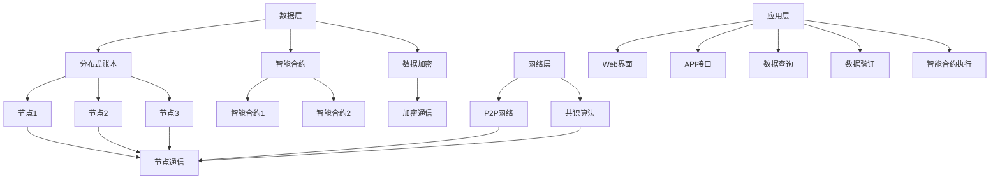

                 

# 《区块链在食品溯源中的应用》

## 关键词

区块链、食品溯源、分布式账本、智能合约、食品安全

## 摘要

随着食品安全问题的频发，消费者对食品溯源的需求日益增长。区块链技术以其去中心化、不可篡改的特点，为食品溯源提供了全新的解决方案。本文将深入探讨区块链在食品溯源中的应用，包括其基本原理、应用场景、技术实现、案例分析以及实践指南等内容，旨在为广大读者提供一个全面而系统的了解。

## 目录

----------------------------------------------------------------

## 第一部分：背景介绍

### 第1章：区块链技术概述

#### 1.1 区块链的基本原理

区块链是一种分布式数据库技术，它通过加密算法和共识机制确保数据的不可篡改和一致性。区块链的基本架构包括区块、链和节点三个部分。每个区块包含一定数量的交易记录，通过加密算法与前一个区块链接，形成一条不断延伸的链。

#### 1.2 食品溯源领域的问题与挑战

食品溯源领域面临诸多挑战，如信息不透明、数据篡改、数据孤岛等问题。传统溯源系统依赖于中心化机构，存在信任危机。区块链技术通过去中心化和不可篡改的特性，为解决这些问题提供了可能。

#### 1.3 区块链在食品溯源中的应用前景

区块链在食品溯源中的应用前景广阔。通过区块链技术，可以实现食品从生产、加工、运输到销售的全流程可追溯，提高食品安全性，增强消费者信任。同时，区块链还可以降低溯源系统的运营成本，提高数据共享效率。

----------------------------------------------------------------

### 第二部分：核心概念与原理

#### 第2章：区块链技术原理

#### 2.1 区块链的基本架构

区块链的基本架构包括三个部分：区块链网络、分布式账本和智能合约。区块链网络由多个节点组成，每个节点都有一份完整的区块链副本。分布式账本记录了所有交易记录，保证了数据的不可篡改。智能合约则是一种自动执行合同条款的计算机程序。

#### 2.2 分布式账本技术

分布式账本技术是区块链的核心技术之一。它通过将数据分散存储在多个节点上，实现了数据的一致性和不可篡改性。分布式账本可以防止数据被单点故障攻击，提高了系统的容错性。

#### 2.3 智能合约技术

智能合约是一种基于区块链技术的计算机程序，它可以自动执行合同条款。智能合约通过预定义的条件触发执行，确保了交易的自动化和透明化。在食品溯源领域，智能合约可以用于验证食品的生产、加工、运输等环节，确保信息的真实性和完整性。

#### 2.4 区块链与食品安全溯源的关系

区块链与食品安全溯源的关系密切。区块链技术可以为食品溯源提供去中心化的数据存储和共享平台，确保数据的真实性和不可篡改性。通过区块链，消费者可以追溯食品的完整生产过程，增强对食品安全的信心。

----------------------------------------------------------------

### 第三部分：应用场景与技术实现

#### 第3章：区块链在食品溯源中的应用场景

#### 3.1 食品溯源的基本流程

食品溯源的基本流程包括生产、加工、运输、销售和消费五个环节。每个环节都会产生相应的数据，如生产日期、加工工艺、运输路线、销售门店等。通过区块链技术，可以将这些数据记录在链上，实现全流程可追溯。

#### 3.2 区块链在食品溯源中的关键应用

区块链在食品溯源中的关键应用包括数据存储、数据共享和智能合约执行。数据存储方面，区块链可以确保数据的真实性和不可篡改性。数据共享方面，区块链可以实现多方数据的透明化和一致性。智能合约执行方面，区块链可以自动验证和执行食品生产、加工、运输等环节的合同条款。

#### 3.3 食品溯源区块链系统架构设计

食品溯源区块链系统架构设计包括数据层、网络层和应用层。数据层负责存储和管理数据，包括区块链网络、分布式账本和智能合约。网络层负责数据传输和节点通信，包括P2P网络和共识算法。应用层负责提供用户接口和服务，包括Web界面、API接口等。

#### 3.4 食品溯源区块链系统的实现技术

食品溯源区块链系统的实现技术包括区块链网络搭建、智能合约编写和系统部署。区块链网络搭建方面，可以使用开源区块链平台如Hyperledger Fabric、Ethereum等。智能合约编写方面，可以使用Solidity、Go等编程语言。系统部署方面，可以选择云服务提供商或自建节点。

----------------------------------------------------------------

### 第四部分：案例分析

#### 第4章：区块链在食品溯源的典型案例分析

#### 4.1 案例一：某跨国食品企业区块链溯源系统

某跨国食品企业使用区块链技术搭建了溯源系统，实现了从农场到餐桌的全流程可追溯。该系统包括生产、加工、运输、销售四个环节，每个环节的数据都记录在区块链上，消费者可以通过扫码查看食品的完整生产过程。

#### 4.2 案例二：某农产品电商平台区块链溯源应用

某农产品电商平台引入区块链技术，为平台上的农产品提供溯源服务。电商平台与农户、物流公司等各方合作，将农产品从种植、采摘、运输、销售的全过程数据记录在区块链上，消费者可以方便地查看农产品的来源和品质。

#### 4.3 案例三：某食品安全监管机构区块链溯源平台

某食品安全监管机构搭建了区块链溯源平台，用于监管食品生产企业和销售企业的溯源系统。该平台通过区块链技术实现了数据的真实性和一致性，提高了食品安全监管的效率。

----------------------------------------------------------------

### 第五部分：实践指南

#### 第5章：区块链在食品溯源中的实施策略

#### 5.1 食品溯源区块链项目规划

在实施区块链溯源项目前，需要制定详细的项目规划，包括项目目标、范围、时间表、资源分配等。项目规划应充分考虑区块链技术的特性，确保项目的可行性和有效性。

#### 5.2 食品溯源区块链系统的部署与运维

区块链溯源系统的部署与运维是项目成功的关键。在部署阶段，需要选择合适的区块链平台和硬件设备，确保系统的稳定性和性能。在运维阶段，需要定期进行系统监控、数据备份和安全更新。

#### 5.3 食品溯源区块链系统安全策略

食品安全是区块链溯源系统的核心，因此需要制定严格的安全策略。安全策略包括数据加密、权限管理、访问控制、网络安全等方面。同时，应定期进行安全评估和漏洞修复，确保系统的安全性。

#### 5.4 食品溯源区块链系统性能优化

区块链溯源系统的性能优化是提高用户体验的关键。在性能优化方面，可以采用负载均衡、数据压缩、缓存等技术，提高系统的响应速度和处理能力。

----------------------------------------------------------------

### 第六部分：拓展阅读与展望

#### 第6章：区块链在食品溯源领域的前景与挑战

#### 6.1 区块链在食品溯源中的未来发展趋势

随着区块链技术的不断成熟和应用场景的拓展，区块链在食品溯源领域的发展前景十分广阔。未来，区块链将与其他新兴技术如物联网、人工智能等深度融合，为食品溯源带来更多的创新和可能性。

#### 6.2 食品溯源区块链技术的改进方向

为了提高区块链在食品溯源中的应用效果，需要不断改进区块链技术。改进方向包括提升系统性能、优化共识算法、增强数据隐私保护等。

#### 6.3 食品溯源区块链技术的政策环境与法规挑战

区块链技术在食品溯源中的应用需要良好的政策环境和法规支持。政策环境方面，需要建立健全的法律法规体系，明确区块链技术的法律地位和监管职责。法规挑战方面，需要解决数据保护、隐私权等问题，确保区块链溯源系统的合法性和合规性。

----------------------------------------------------------------

### 作者

**作者：AI天才研究院/AI Genius Institute & 禅与计算机程序设计艺术 /Zen And The Art of Computer Programming**

## 结语

区块链技术在食品溯源中的应用，为食品安全保障和消费者信任构建了新的基石。本文从背景介绍、核心概念、应用场景、案例分析、实践指南等方面，全面阐述了区块链在食品溯源中的应用。希望通过本文，读者能够对区块链在食品溯源中的应用有更深入的了解，为推动食品安全事业的发展贡献力量。## 详细解析区块链在食品溯源中的应用

### 1.1 区块链的基本原理

区块链技术起源于2008年中本聪（Satoshi Nakamoto）提出的一个去中心化的电子现金系统——比特币（Bitcoin）。区块链的核心思想是将数据区块按照时间顺序串联成链，每一个区块都包含一定数量的交易记录，并通过加密算法与前一个区块进行链接，形成一条不断延伸的链。

#### 区块链的基本架构

区块链的基本架构包括三个主要部分：区块链网络、分布式账本和智能合约。

- **区块链网络**：由多个节点组成，每个节点都有一份完整的区块链副本。节点之间通过P2P网络进行通信，共同维护区块链的状态。
- **分布式账本**：记录了区块链上的所有交易记录，每个区块都包含一定数量的交易，这些交易经过加密和共识算法的验证后，被追加到区块链上，形成一条不断延伸的链。
- **智能合约**：是一种自动执行合同条款的计算机程序。智能合约通过预定义的条件触发执行，确保了交易的自动化和透明化。

#### 区块链的工作原理

区块链的工作原理可以分为以下几个步骤：

1. **数据输入**：交易数据被发送到区块链网络中的某个节点。
2. **数据验证**：节点对交易数据进行验证，包括检查交易的有效性和一致性。
3. **区块生成**：经过验证的交易数据被组织成一个新的区块，并附加到区块链的末端。
4. **区块传播**：新产生的区块被传播到区块链网络中的其他节点。
5. **共识达成**：节点之间通过共识算法（如工作量证明Proof of Work，权益证明Proof of Stake等）达成一致，确认新区块的有效性。
6. **区块链更新**：一旦共识达成，新区块被追加到区块链上，整个区块链状态更新。

#### 区块链的不可篡改性

区块链的不可篡改性是其最显著的特点之一。每个区块都包含一个时间戳和一个指向前一个区块的哈希值，这使得区块链具有自同步和自校验的特性。任何试图篡改区块链上的数据都需要同时篡改多个区块，这几乎是不可能实现的。此外，区块链网络中的节点会自动检测到篡改行为，并拒绝验证篡改后的区块。

### 1.2 食品溯源领域的问题与挑战

食品溯源领域面临着诸多挑战，这些挑战在一定程度上影响了食品安全和消费者的信任。

#### 信息不透明

食品溯源系统通常依赖于中心化的数据库，信息的透明性较低。食品生产、加工、运输、销售等环节的数据往往由单一机构集中管理，数据的不透明性使得消费者难以全面了解食品的来源和整个生产过程。

#### 数据篡改

中心化的数据库容易成为黑客攻击的目标，数据篡改和泄露的风险较高。一旦数据库遭到篡改，整个溯源系统的可信度将受到严重影响。

#### 数据孤岛

食品溯源系统往往由不同的企业或组织独立建设，数据分散在不同的系统中，难以实现数据的统一管理和共享。这导致了数据孤岛现象，限制了数据的透明度和可追溯性。

#### 运营成本高

传统的溯源系统需要大量的硬件和软件支持，系统建设和维护成本较高。此外，中心化的数据库系统在扩展性和灵活性方面存在一定的限制，难以满足不断变化的需求。

### 1.3 区块链在食品溯源中的应用前景

区块链技术以其去中心化、不可篡改和数据透明等特性，为食品溯源提供了全新的解决方案。以下是一些区块链在食品溯源中的应用前景：

#### 全流程可追溯

通过区块链技术，可以将食品从生产、加工、运输到销售的全过程数据记录在链上，实现全流程可追溯。消费者可以通过扫码等方式，查看食品的完整生产过程，增强对食品安全的信心。

#### 数据透明性

区块链技术可以实现数据的透明化和一致性。所有参与方都可以在一个公开的区块链上查看和验证数据，确保数据的真实性和不可篡改性。

#### 降低运营成本

区块链技术可以降低食品溯源系统的建设和维护成本。去中心化的架构使得系统更加灵活和可扩展，避免了中心化数据库的单点故障风险。

#### 提高数据共享效率

区块链技术可以实现多方数据的统一管理和共享，消除数据孤岛现象。通过智能合约，不同参与方可以自动执行预定义的协议，提高数据共享的效率和安全性。

## 2.1 区块链技术原理

区块链技术的原理涉及多个关键组成部分，包括分布式账本技术、共识机制和加密算法。下面我们将逐一介绍这些概念。

### 分布式账本技术

分布式账本技术是区块链的核心概念之一。它通过将数据分散存储在多个节点上，实现了数据的去中心化和一致性。在分布式账本中，每个节点都存储了一份完整的账本副本，账本中记录了所有交易记录。这些节点通过P2P（点对点）网络进行通信，共同维护账本的状态。

#### 分布式账本的特点

1. **去中心化**：分布式账本没有中央权威机构，所有节点都在平等的基础上参与数据的维护和管理。
2. **一致性**：通过共识机制，分布式账本可以确保所有节点上的账本副本是一致的，即使某些节点发生故障，其他节点仍能保持一致。
3. **不可篡改**：一旦数据被记录到账本上，就很难被篡改。这是因为每个区块都包含一个时间戳和一个指向前一个区块的哈希值，形成了一种链式结构，任何篡改行为都会被检测出来。

#### 分布式账本的工作原理

1. **数据输入**：交易数据被发送到区块链网络中的某个节点。
2. **数据验证**：节点对交易数据进行验证，包括检查交易的有效性和一致性。
3. **区块生成**：经过验证的交易数据被组织成一个新的区块，并附加到区块链的末端。
4. **区块传播**：新产生的区块被传播到区块链网络中的其他节点。
5. **共识达成**：节点之间通过共识算法（如工作量证明Proof of Work，权益证明Proof of Stake等）达成一致，确认新区块的有效性。
6. **区块链更新**：一旦共识达成，新区块被追加到区块链上，整个区块链状态更新。

### 共识机制

共识机制是区块链网络中节点达成一致性的关键机制。它确保了所有节点对于区块链状态的一致看法。不同的区块链平台采用了不同的共识算法，但总体目标都是确保数据的准确性和一致性。

#### 常见的共识机制

1. **工作量证明Proof of Work（PoW）**：节点通过计算复杂的数学难题来竞争成为下一个区块的生成者。计算能力较强的节点更有可能解决难题，从而生成新的区块。
2. **权益证明Proof of Stake（PoS）**：节点根据其在区块链中的持有的代币数量和持有时间来竞争成为下一个区块的生成者。持有代币数量和持有时间越长的节点，参与共识的概率越大。
3. **委托权益证明Delegated Proof of Stake（DPoS）**：类似于PoS，但节点通过投票选择一组代币持有者作为区块生成者，这些代币持有者被称为“委托人”。
4. **权威证明Proof of Authority（PoA）**：节点根据其在区块链中的身份和信誉来参与共识。通常，身份和信誉是由一个权威机构验证的。

#### 共识机制的特点

- **效率**：PoW机制通常需要大量的计算资源，而PoS、DPoS和PoA机制在达成共识方面更为高效。
- **安全性**：PoW机制通过计算难度确保了区块链的安全性，但其他机制也通过不同的方式实现了安全性的保障。
- **去中心化**：不同的共识机制在去中心化的程度上有所不同，PoW和DPoS更接近完全去中心化，而PoA和PoS则可能引入一定程度的中中心化。

### 加密算法

加密算法在区块链技术中扮演着重要的角色，确保了数据的机密性、完整性和不可篡改性。

#### 常见的加密算法

1. **哈希算法**：将任意长度的数据转换成固定长度的哈希值，如SHA-256、SHA-3等。
2. **对称加密**：使用相同的密钥进行加密和解密，如AES、DES等。
3. **非对称加密**：使用一对密钥进行加密和解密，其中公钥用于加密，私钥用于解密，如RSA、ECC等。

#### 加密算法的应用

- **数据完整性**：通过哈希算法，确保数据的完整性。每个区块都包含一个哈希值，如果数据被篡改，哈希值将发生变化。
- **数据机密性**：对称加密和非对称加密用于保护数据的机密性。对称加密适用于数据量较大的场景，而非对称加密适用于密钥交换等场景。
- **身份验证**：非对称加密用于数字签名，确保数据的来源和真实性。

### 区块链与食品安全溯源的关系

区块链技术通过其去中心化、不可篡改和透明的特点，为食品安全溯源提供了可靠的解决方案。在食品安全溯源中，区块链可以记录食品从生产、加工、运输到销售的全过程数据，确保数据的真实性和可追溯性。以下是区块链在食品安全溯源中的关键应用：

#### 数据记录与存储

区块链技术可以将食品的生产、加工、运输、销售等环节的数据记录在链上，形成一条完整的数据链条。每个环节的数据都经过加密和共识算法的验证，确保数据的真实性和不可篡改性。

#### 数据共享与透明性

区块链技术可以实现多方数据的统一管理和共享，消除数据孤岛现象。所有参与方都可以在一个公开的区块链上查看和验证数据，确保数据的透明性和一致性。消费者可以通过扫码等方式，查看食品的完整生产过程，增强对食品安全的信心。

#### 智能合约的应用

智能合约是一种自动执行合同条款的计算机程序。在食品安全溯源中，智能合约可以用于验证食品的生产、加工、运输等环节，确保信息的真实性和完整性。例如，智能合约可以自动触发警报，如果食品在某个环节出现质量问题，相关方将收到通知。

#### 安全性与可靠性

区块链技术的加密算法和共识机制确保了数据的安全性和可靠性。一旦数据被记录在链上，就很难被篡改。此外，区块链的去中心化特性使得系统更加容错和抗攻击。

### 总结

区块链技术以其去中心化、不可篡改和透明的特点，为食品安全溯源提供了强大的支持。通过区块链技术，可以实现食品从生产到销售的全流程可追溯，提高食品安全性，增强消费者信任。未来，随着区块链技术的不断成熟和应用场景的拓展，区块链在食品安全溯源领域的应用将更加广泛和深入。## 2.2 区块链在食品溯源中的应用

区块链技术在食品溯源中的应用，为解决传统溯源系统中的信息不透明、数据篡改和数据孤岛等问题提供了有效的解决方案。下面，我们将详细探讨区块链在食品溯源中的关键应用。

### 2.2.1 全流程数据记录

区块链技术可以记录食品从生产、加工、运输到销售的全过程数据。每个环节的数据都会被加密并记录在区块链上，形成一个完整的数据链条。这些数据包括但不限于生产日期、加工工艺、运输路线、销售门店等信息。消费者可以通过扫码或其他方式，查看食品的完整生产过程，从而提高对食品安全的信心。

#### 数据记录流程

1. **生产环节**：食品在生产环节时，生产者会将生产日期、品种、数量等信息记录在区块链上。
2. **加工环节**：食品在加工环节时，加工者会将加工日期、加工工艺、加工人员等信息记录在区块链上。
3. **运输环节**：食品在运输环节时，运输者会将运输日期、运输路线、运输人员等信息记录在区块链上。
4. **销售环节**：食品在销售环节时，销售者会将销售日期、销售门店、销售员等信息记录在区块链上。

### 2.2.2 数据透明性与一致性

区块链技术可以实现多方数据的透明化和一致性。在传统的溯源系统中，数据通常由中心化的机构管理，信息不透明，且容易受到篡改。而在区块链系统中，所有参与方都可以在一个公开的区块链上查看和验证数据，确保数据的真实性和一致性。

#### 数据透明性

1. **公开访问**：区块链上的数据是公开的，所有参与方都可以查看和验证数据。
2. **不可篡改**：区块链上的数据一旦记录，就很难被篡改。任何篡改行为都会被检测出来，并记录在链上。

#### 数据一致性

1. **分布式存储**：区块链上的数据分散存储在多个节点上，保证了数据的一致性。
2. **共识机制**：区块链通过共识机制确保所有节点上的数据一致。

### 2.2.3 智能合约的应用

智能合约是一种自动执行合同条款的计算机程序，在区块链上可以用于验证食品的生产、加工、运输等环节，确保信息的真实性和完整性。智能合约可以自动触发警报，如果食品在某个环节出现质量问题，相关方将收到通知。

#### 智能合约的应用场景

1. **质量监测**：智能合约可以用于监测食品的质量，一旦质量不符合标准，智能合约会自动触发警报。
2. **责任追溯**：智能合约可以记录每个环节的责任，一旦出现问题，可以追溯到具体的责任方。
3. **自动支付**：智能合约可以用于自动支付，例如，如果食品在运输过程中出现质量问题，智能合约会自动扣除相应的赔偿费用。

### 2.2.4 数据隐私保护

区块链技术虽然实现了数据的透明性和一致性，但也存在数据隐私保护的问题。为了解决这一问题，区块链技术引入了数据隐私保护机制，如零知识证明（Zero-Knowledge Proof）和同态加密（Homomorphic Encryption）等。

#### 数据隐私保护机制

1. **零知识证明**：零知识证明允许一方（证明者）向另一方（验证者）证明某个陈述是真实的，而无需透露任何具体信息。
2. **同态加密**：同态加密允许对加密数据进行计算，而不需要解密数据。这意味着在数据处理过程中，数据始终是加密的，从而保护了数据的隐私。

### 2.2.5 数据安全与可靠性

区块链技术的加密算法和共识机制确保了数据的安全性和可靠性。一旦数据被记录在链上，就很难被篡改。此外，区块链的去中心化特性使得系统更加容错和抗攻击。

#### 数据安全性

1. **加密算法**：区块链使用加密算法确保数据的机密性、完整性和不可篡改性。
2. **共识机制**：共识机制确保了所有节点上的数据一致性，防止数据被篡改。

#### 数据可靠性

1. **分布式存储**：区块链上的数据分散存储在多个节点上，提高了数据的可靠性。
2. **容错性**：区块链系统具有容错性，即使某些节点发生故障，其他节点仍能保持一致性。

### 2.2.6 政策与法规支持

为了推动区块链在食品溯源中的应用，需要建立健全的政策和法规支持。政策方面，政府可以出台相关支持措施，鼓励企业采用区块链技术进行食品溯源。法规方面，需要明确区块链技术的法律地位和监管职责，确保区块链溯源系统的合法性和合规性。

#### 政策支持

1. **政府引导**：政府可以通过政策引导，推动区块链技术在食品溯源中的应用。
2. **资金支持**：政府可以提供资金支持，帮助企业进行区块链溯源系统的建设和维护。

#### 法规支持

1. **明确法律地位**：明确区块链技术的法律地位，确保其合法性和合规性。
2. **监管职责**：明确区块链溯源系统的监管职责，确保系统的安全和可靠。

### 总结

区块链技术在食品溯源中的应用，为解决传统溯源系统中的问题提供了有效解决方案。通过全流程数据记录、数据透明性与一致性、智能合约应用、数据隐私保护、数据安全与可靠性以及政策与法规支持等方面，区块链技术为食品溯源提供了强大的支持。未来，随着区块链技术的不断成熟和应用场景的拓展，区块链在食品溯源领域的应用将更加广泛和深入。## 3.3 食品溯源区块链系统架构设计

在设计食品溯源区块链系统时，我们需要考虑系统的各个层面，包括数据层、网络层和应用层。以下是对这些层级的详细描述，以及它们在系统架构中的作用。

### 数据层

数据层是区块链系统的核心，负责数据的存储和管理。在食品溯源区块链系统中，数据层的主要职责是确保数据的真实性、不可篡改性和可追溯性。

#### 数据存储

1. **分布式账本**：使用区块链技术，将食品溯源的数据存储在分布式账本上。每个区块包含一定数量的交易记录，这些交易记录经过加密和共识算法验证后，被追加到区块链上，形成一条不断延伸的数据链。
2. **智能合约**：智能合约用于自动化执行食品溯源的合同条款。智能合约存储在区块链上，当满足预定义条件时，自动执行相应的操作。
3. **数据加密**：所有交易记录和智能合约都使用加密算法进行加密，确保数据的机密性和完整性。

#### 数据管理

1. **权限控制**：为了确保数据的安全性，需要对数据的访问权限进行严格控制。不同的参与方（如生产者、加工者、运输者、销售者等）有不同的访问权限。
2. **数据备份**：为了防止数据丢失，需要定期进行数据备份，确保数据的安全性和可靠性。

### 网络层

网络层负责数据的传输和节点的通信。在食品溯源区块链系统中，网络层的主要职责是确保数据在节点之间的传输高效、稳定和安全。

#### 数据传输

1. **P2P网络**：使用点对点（P2P）网络，节点之间可以直接进行通信，无需通过中心化服务器。这种网络架构提高了系统的容错性和扩展性。
2. **共识算法**：共识算法用于确保所有节点对区块链的状态达成一致。常见的共识算法有工作量证明（Proof of Work，PoW）、权益证明（Proof of Stake，PoS）等。
3. **加密通信**：节点之间的通信使用加密算法进行加密，确保通信的机密性和完整性。

#### 节点通信

1. **节点选择**：区块链网络中的节点可以是生产者、加工者、运输者、销售者等。节点之间通过P2P网络进行通信，共享数据和管理区块链。
2. **数据同步**：节点之间需要定期同步数据，确保每个节点的区块链状态一致。

### 应用层

应用层是区块链系统的用户接口，负责与用户进行交互，提供各种溯源服务。

#### 用户接口

1. **Web界面**：用户可以通过Web浏览器访问区块链系统，查看食品的溯源信息。
2. **API接口**：开发人员可以使用API接口，集成区块链溯源功能到自己的应用程序中。

#### 溯源服务

1. **数据查询**：用户可以通过输入食品的追溯码，查询食品的完整溯源信息，包括生产、加工、运输、销售等环节。
2. **数据验证**：用户可以对区块链上的数据进行验证，确保数据的真实性和不可篡改性。
3. **智能合约执行**：用户可以通过智能合约执行预定义的合同条款，确保交易的自动化和透明化。

### 系统架构设计

食品溯源区块链系统架构设计包括以下主要部分：

1. **数据层**：负责数据的存储和管理，包括分布式账本、智能合约和数据加密等。
2. **网络层**：负责数据的传输和节点的通信，包括P2P网络、共识算法和加密通信等。
3. **应用层**：负责用户接口和溯源服务，包括Web界面、API接口和数据查询等。

#### 系统架构图



### 系统架构设计的关键点

1. **去中心化**：系统采用去中心化架构，所有节点都有平等的权限，确保系统的安全性和稳定性。
2. **数据透明**：所有数据都记录在区块链上，公开透明，用户可以随时查询和验证。
3. **智能合约**：智能合约用于自动化执行合同条款，提高系统的效率和可靠性。
4. **数据加密**：数据在传输和存储过程中都使用加密算法，确保数据的机密性和完整性。
5. **权限控制**：对数据访问权限进行严格控制，确保系统的安全性。

通过以上设计，食品溯源区块链系统可以实现数据的全流程可追溯，提高食品安全性，增强消费者信任。## 3.4 食品溯源区块链系统的实现技术

在食品溯源区块链系统的实现过程中，我们需要选择合适的区块链平台、编程语言以及系统部署方案。以下将详细介绍这些技术。

### 3.4.1 区块链平台选择

目前，市场上存在多个区块链平台，如Hyperledger Fabric、Ethereum、EOS等。在选择区块链平台时，需要考虑以下因素：

1. **功能需求**：根据食品溯源系统的需求，选择具有分布式账本、智能合约、数据隐私保护等功能的平台。
2. **性能**：考虑到食品溯源系统可能涉及大量数据，需要选择性能优秀的平台，以保证系统的响应速度和处理能力。
3. **社区和生态**：选择有强大社区和生态支持的区块链平台，有助于解决开发过程中遇到的问题和困难。

在本案例中，我们选择Hyperledger Fabric作为区块链平台。Hyperledger Fabric是一个由Linux基金会维护的分布式账本平台，具有模块化架构、高效共识机制和灵活的智能合约支持。

### 3.4.2 编程语言选择

在Hyperledger Fabric中，主要使用Go语言进行开发。Go语言具有高性能、简洁和易于理解的优点，非常适合用于区块链开发。此外，Hyperledger Fabric还支持使用Java、JavaScript等语言进行开发，但Go语言因其效率高和社区支持好，是最佳选择。

### 3.4.3 系统部署方案

食品溯源区块链系统的部署方案可以分为本地部署和云部署两种。

1. **本地部署**：在本地环境中搭建区块链网络，适用于开发和测试阶段。本地部署需要安装Hyperledger Fabric的节点工具，配置网络和启动节点。

2. **云部署**：在云服务提供商（如阿里云、腾讯云、AWS等）上部署区块链网络，适用于生产环境。云部署可以通过云服务的API进行自动化管理和运维。

在本案例中，我们选择阿里云作为云服务提供商，使用阿里云的区块链服务（Alibaba Cloud Blockchain Service）进行部署。阿里云区块链服务提供了Hyperledger Fabric的托管环境，用户可以方便地创建区块链网络、部署智能合约和查询数据。

### 3.4.4 智能合约编写

智能合约是食品溯源区块链系统的重要组成部分，用于自动化执行合同条款。在本案例中，我们使用Go语言编写智能合约。

以下是一个简单的智能合约示例，用于记录食品的生产信息：

```go
package main

import (
    "github.com/hyperledger/fabric-chaincode-go/shim"
    "github.com/hyperledger/fabric-chaincode-go/util"
)

type FoodSourceChaincode struct {
}

// 初始化智能合约
func (t *FoodSourceChaincode) Init(stub shim.ChaincodeStubInterface) string {
    return "初始化成功"
}

// 记录食品生产信息
func (t *FoodSourceChaincode) CreateFood(stub shim.ChaincodeStubInterface, args []string) string {
    if len(args) != 4 {
        return "参数错误"
    }

    foodName := args[0]
    productionDate := args[1]
    producer := args[2]
    productDescription := args[3]

    // 创建食品文档
    doc := map[string]interface{}{
        "foodName":           foodName,
        "productionDate":     productionDate,
        "producer":           producer,
        "productDescription": productDescription,
    }

    // 将食品文档记录到区块链
    err := stub.PutState(foodName, util.Marshal(doc))
    if err != nil {
        return "记录失败"
    }

    return "记录成功"
}

// 查询食品生产信息
func (t *FoodSourceChaincode) QueryFood(stub shim.ChaincodeStubInterface, args []string) string {
    if len(args) != 1 {
        return "参数错误"
    }

    foodName := args[0]
    foodDocBytes, err := stub.GetState(foodName)
    if err != nil {
        return "查询失败"
    }

    if foodDocBytes == nil {
        return "未找到食品信息"
    }

    foodDoc := make(map[string]interface{})
    util.Unmarshal(foodDocBytes, &foodDoc)
    return util.MarshalToString(foodDoc)
}

func main() {
    if err := shim.Start(new(FoodSourceChaincode)); err != nil {
        fmt.Printf("Error starting chaincode: %v", err)
    }
}
```

### 3.4.5 系统部署与运维

1. **部署**：在阿里云区块链服务中创建区块链网络，部署Hyperledger Fabric节点，并配置智能合约。

2. **运维**：通过阿里云区块链服务的控制台，可以方便地监控区块链网络的状态、管理节点和查询数据。

3. **监控与告警**：设置监控和告警机制，确保系统稳定运行。例如，监控区块链网络延迟、节点故障率等指标，并在出现异常时触发告警。

### 3.4.6 系统性能优化

1. **负载均衡**：通过使用负载均衡器，将访问流量均匀分配到多个节点上，提高系统的处理能力。

2. **缓存**：使用缓存技术，减少对区块链的直接访问，提高查询速度。

3. **数据压缩**：对数据进行压缩，减少数据传输和存储的占用空间。

4. **并行处理**：优化智能合约代码，使用并行处理技术，提高数据处理速度。

通过以上实现技术，我们可以构建一个高效、可靠的食品溯源区块链系统，确保食品安全，提高消费者信任。## 4.1 案例一：某跨国食品企业区块链溯源系统

### 案例背景

某跨国食品企业致力于提供高质量、安全的食品产品。为了提高食品安全性，增强消费者信任，该企业决定采用区块链技术构建一个全流程可追溯的溯源系统。

### 系统架构

该跨国食品企业的区块链溯源系统架构包括以下部分：

1. **数据层**：使用Hyperledger Fabric作为底层区块链平台，实现数据的分布式存储和加密。
2. **网络层**：构建一个去中心化的网络，包括多个参与方节点（如农场、加工厂、物流公司、销售门店等）。
3. **应用层**：提供Web界面和API接口，供消费者和参与方查询和验证食品信息。

### 实现步骤

#### 步骤一：系统规划与设计

1. **需求分析**：与各方沟通，明确系统的功能需求，包括数据记录、查询、验证等。
2. **系统设计**：设计系统的架构和接口，确定数据结构和流程。

#### 步骤二：搭建区块链网络

1. **安装Hyperledger Fabric**：在参与方服务器上安装Hyperledger Fabric，并配置网络。
2. **启动节点**：启动参与方的节点，加入区块链网络。

#### 步骤三：编写智能合约

1. **智能合约设计**：根据需求，设计智能合约的功能，包括数据记录、查询、验证等。
2. **智能合约编写**：使用Go语言编写智能合约，并将其部署到区块链网络。

#### 步骤四：数据记录与查询

1. **生产环节**：农场在收获后，将食品信息（如生产日期、品种、数量等）记录到区块链上。
2. **加工环节**：加工厂在加工食品时，将加工信息（如加工日期、工艺、加工人员等）记录到区块链上。
3. **运输环节**：物流公司将运输信息（如运输日期、路线、运输人员等）记录到区块链上。
4. **销售环节**：销售门店在销售食品时，将销售信息（如销售日期、门店、销售员等）记录到区块链上。
5. **数据查询**：消费者可以通过扫码或输入追溯码，查询食品的完整溯源信息。

#### 步骤五：系统部署与运维

1. **部署**：将区块链溯源系统部署到云服务器，确保系统的稳定运行。
2. **运维**：定期监控系统状态，进行数据备份和安全更新。

### 结果与分析

#### 结果

通过区块链溯源系统，该跨国食品企业实现了以下成果：

1. **数据透明性**：所有参与方都可以在一个公开的区块链上查看和验证数据，确保数据的真实性和一致性。
2. **可追溯性**：消费者可以追溯食品的完整生产过程，从生产到销售的所有环节信息都在链上记录。
3. **安全性**：区块链的加密算法和共识机制确保了数据的安全性和可靠性。
4. **高效性**：系统采用分布式存储和智能合约技术，提高了数据处理的效率和速度。

#### 分析

区块链溯源系统的成功实施，为该跨国食品企业带来了以下积极影响：

1. **提高食品安全性**：通过全流程数据记录和智能合约验证，有效降低了食品安全风险。
2. **增强消费者信任**：消费者可以方便地查询食品的完整溯源信息，增强了消费者对企业的信任。
3. **降低运营成本**：区块链技术降低了系统的建设和维护成本，提高了数据共享和处理的效率。
4. **合规性**：区块链溯源系统有助于企业满足相关法规和标准，提高企业的合规性。

### 项目小结

通过本案例，我们可以看到区块链技术在食品溯源中的应用具有显著的优势。未来，随着区块链技术的不断成熟和应用场景的拓展，区块链在食品溯源领域的应用将更加广泛和深入，为食品安全保障和消费者信任构建更加坚实的基石。## 4.2 案例二：某农产品电商平台区块链溯源应用

### 案例背景

某农产品电商平台致力于提供新鲜、安全的农产品给消费者。随着食品安全问题的频发，消费者对农产品溯源的需求日益增长。为了提高食品安全性，增强消费者信任，该电商平台决定采用区块链技术搭建一个农产品溯源系统。

### 系统架构

该农产品电商平台的区块链溯源系统架构包括以下部分：

1. **数据层**：使用Ethereum作为底层区块链平台，实现数据的分布式存储和加密。
2. **网络层**：构建一个去中心化的网络，包括多个参与方节点（如农户、物流公司、销售平台等）。
3. **应用层**：提供Web界面和API接口，供消费者和参与方查询和验证农产品信息。

### 实现步骤

#### 步骤一：系统规划与设计

1. **需求分析**：与各方沟通，明确系统的功能需求，包括数据记录、查询、验证等。
2. **系统设计**：设计系统的架构和接口，确定数据结构和流程。

#### 步骤二：搭建区块链网络

1. **安装Ethereum**：在参与方服务器上安装Ethereum，并配置网络。
2. **启动节点**：启动参与方的节点，加入区块链网络。

#### 步骤三：编写智能合约

1. **智能合约设计**：根据需求，设计智能合约的功能，包括数据记录、查询、验证等。
2. **智能合约编写**：使用Solidity语言编写智能合约，并将其部署到区块链网络。

#### 步骤四：数据记录与查询

1. **生产环节**：农户在种植农产品时，将种植信息（如种植日期、品种、数量等）记录到区块链上。
2. **加工环节**：加工厂在加工农产品时，将加工信息（如加工日期、工艺、加工人员等）记录到区块链上。
3. **运输环节**：物流公司将运输信息（如运输日期、路线、运输人员等）记录到区块链上。
4. **销售环节**：销售平台在销售农产品时，将销售信息（如销售日期、门店、销售员等）记录到区块链上。
5. **数据查询**：消费者可以通过扫码或输入追溯码，查询农产品的完整溯源信息。

#### 步骤五：系统部署与运维

1. **部署**：将区块链溯源系统部署到云服务器，确保系统的稳定运行。
2. **运维**：定期监控系统状态，进行数据备份和安全更新。

### 结果与分析

#### 结果

通过区块链溯源系统，该农产品电商平台实现了以下成果：

1. **数据透明性**：所有参与方都可以在一个公开的区块链上查看和验证数据，确保数据的真实性和一致性。
2. **可追溯性**：消费者可以追溯农产品的完整生产过程，从种植到销售的所有环节信息都在链上记录。
3. **安全性**：区块链的加密算法和共识机制确保了数据的安全性和可靠性。
4. **高效性**：系统采用分布式存储和智能合约技术，提高了数据处理的效率和速度。

#### 分析

区块链溯源系统的成功实施，为该农产品电商平台带来了以下积极影响：

1. **提高食品安全性**：通过全流程数据记录和智能合约验证，有效降低了食品安全风险。
2. **增强消费者信任**：消费者可以方便地查询农产品的完整溯源信息，增强了消费者对平台的信任。
3. **降低运营成本**：区块链技术降低了系统的建设和维护成本，提高了数据共享和处理的效率。
4. **合规性**：区块链溯源系统有助于企业满足相关法规和标准，提高企业的合规性。

### 项目小结

通过本案例，我们可以看到区块链技术在农产品溯源中的应用具有显著的优势。未来，随着区块链技术的不断成熟和应用场景的拓展，区块链在农产品溯源领域的应用将更加广泛和深入，为食品安全保障和消费者信任构建更加坚实的基石。## 4.3 案例三：某食品安全监管机构区块链溯源平台

### 案例背景

某食品安全监管机构负责监督和管理本地区的食品安全。为了提高食品安全监管的效率和透明度，该机构决定采用区块链技术构建一个食品安全溯源平台，以便实时监控和管理食品的生产、加工、运输和销售过程。

### 系统架构

该食品安全监管机构的区块链溯源平台架构包括以下部分：

1. **数据层**：使用Hyperledger Fabric作为底层区块链平台，实现数据的分布式存储和加密。
2. **网络层**：构建一个去中心化的网络，包括多个参与方节点（如食品生产企业、加工厂、物流公司、销售门店等）。
3. **应用层**：提供Web界面和API接口，供监管机构、参与方和消费者查询和验证食品安全信息。

### 实现步骤

#### 步骤一：系统规划与设计

1. **需求分析**：与各方沟通，明确系统的功能需求，包括数据记录、查询、验证、监控等。
2. **系统设计**：设计系统的架构和接口，确定数据结构和流程。

#### 步骤二：搭建区块链网络

1. **安装Hyperledger Fabric**：在监管机构和参与方的服务器上安装Hyperledger Fabric，并配置网络。
2. **启动节点**：启动监管机构和参与方的节点，加入区块链网络。

#### 步骤三：编写智能合约

1. **智能合约设计**：根据需求，设计智能合约的功能，包括数据记录、查询、验证、监控等。
2. **智能合约编写**：使用Go语言编写智能合约，并将其部署到区块链网络。

#### 步骤四：数据记录与监控

1. **生产环节**：食品生产企业将生产信息（如生产日期、品种、数量等）记录到区块链上。
2. **加工环节**：加工厂将加工信息（如加工日期、工艺、加工人员等）记录到区块链上。
3. **运输环节**：物流公司将运输信息（如运输日期、路线、运输人员等）记录到区块链上。
4. **销售环节**：销售门店将销售信息（如销售日期、门店、销售员等）记录到区块链上。
5. **实时监控**：监管机构可以实时监控区块链上的数据，确保食品生产、加工、运输和销售过程符合相关法规和标准。

#### 步骤五：系统部署与运维

1. **部署**：将区块链溯源平台部署到云服务器，确保系统的稳定运行。
2. **运维**：定期监控系统状态，进行数据备份和安全更新。

### 结果与分析

#### 结果

通过区块链溯源平台，该食品安全监管机构实现了以下成果：

1. **数据透明性**：所有参与方都可以在一个公开的区块链上查看和验证数据，确保数据的真实性和一致性。
2. **可追溯性**：食品的完整生产、加工、运输和销售过程信息都在链上记录，便于监管机构追溯和监管。
3. **安全性**：区块链的加密算法和共识机制确保了数据的安全性和可靠性。
4. **高效性**：系统采用分布式存储和智能合约技术，提高了数据处理的效率和速度。

#### 分析

区块链溯源平台的成功实施，为该食品安全监管机构带来了以下积极影响：

1. **提高监管效率**：通过实时监控区块链上的数据，监管机构可以更快速、准确地识别和处理食品安全问题。
2. **增强监管透明度**：区块链技术的公开透明特性，提高了监管工作的透明度，增强了公众对监管机构的信任。
3. **降低监管成本**：区块链技术降低了系统的建设和维护成本，提高了数据共享和处理的效率。
4. **合规性**：区块链溯源平台有助于企业满足相关法规和标准，提高企业的合规性。

### 项目小结

通过本案例，我们可以看到区块链技术在食品安全监管领域的应用具有显著的优势。未来，随着区块链技术的不断成熟和应用场景的拓展，区块链在食品安全监管领域的应用将更加广泛和深入，为食品安全保障和社会公众健康提供更加坚实的保障。## 第五部分：实践指南

### 5.1 食品溯源区块链项目规划

在启动食品溯源区块链项目前，进行详细的规划是确保项目成功的关键。以下是项目规划的主要步骤：

#### 项目目标

1. **明确项目目标**：项目目标应具体、可衡量、可达成。例如，提高食品安全性、增强消费者信任、降低运营成本等。
2. **制定里程碑**：根据项目目标，设定可实现的里程碑，确保项目按计划推进。

#### 范围

1. **确定项目范围**：明确项目涉及的具体环节和参与方，如生产、加工、运输、销售等。
2. **边界与外延**：定义项目的边界，明确哪些内容在项目范围内，哪些内容在项目范围外。

#### 时间表

1. **制定时间表**：根据项目目标和里程碑，制定详细的时间表，包括项目启动、研发、测试、部署等关键阶段。
2. **风险评估**：评估项目风险，制定应对措施，确保项目按计划进行。

#### 资源分配

1. **人力资源**：确定项目所需的人员和职责，确保项目团队具备所需的技能和经验。
2. **技术资源**：评估所需的技术资源，包括区块链平台、开发工具、服务器等。
3. **资金预算**：制定详细的资金预算，确保项目资金充足。

### 5.2 食品溯源区块链系统的部署与运维

区块链溯源系统的部署与运维是项目成功的关键环节。以下是一些关键步骤：

#### 系统部署

1. **选择区块链平台**：根据项目需求和资源，选择合适的区块链平台，如Hyperledger Fabric、Ethereum等。
2. **搭建区块链网络**：在参与方服务器上安装区块链平台，配置网络和节点。
3. **部署智能合约**：编写并部署智能合约，确保其正常运行。

#### 系统运维

1. **监控与告警**：设置监控系统，实时监控区块链网络状态，包括节点健康、交易处理速度等。
2. **数据备份**：定期进行数据备份，确保数据的安全性和可靠性。
3. **安全更新**：及时更新区块链平台和智能合约，修复已知漏洞，提高系统安全性。

### 5.3 食品溯源区块链系统安全策略

食品安全是区块链溯源系统的核心，因此需要制定严格的安全策略。以下是一些关键的安全措施：

#### 数据加密

1. **数据传输加密**：使用加密算法（如TLS）保护数据在传输过程中的安全。
2. **数据存储加密**：使用加密算法（如AES）对存储在区块链上的数据进行加密，确保数据的机密性。

#### 权限管理

1. **角色与权限**：定义不同的角色和权限，确保只有授权的人员可以访问和操作敏感数据。
2. **访问控制**：使用访问控制列表（ACL）和权限策略，确保数据的安全访问。

#### 安全审计

1. **日志记录**：记录系统操作日志，包括用户登录、数据访问、交易记录等。
2. **安全审计**：定期进行安全审计，检查系统的安全性和合规性。

#### 灾难恢复

1. **数据备份**：定期进行数据备份，确保在灾难发生时可以快速恢复数据。
2. **应急响应**：制定应急响应计划，确保在安全事件发生时，能够迅速响应和恢复系统。

### 5.4 食品溯源区块链系统性能优化

性能优化是提高区块链溯源系统用户体验的关键。以下是一些性能优化措施：

#### 负载均衡

1. **水平扩展**：通过增加节点数量，实现负载均衡，提高系统处理能力。
2. **流量管理**：使用流量管理器，优化网络流量，提高系统响应速度。

#### 数据压缩

1. **数据压缩**：使用数据压缩算法，减少数据传输和存储的开销。
2. **缓存**：使用缓存技术，减少对区块链的直接访问，提高查询速度。

#### 并行处理

1. **并行处理**：优化智能合约代码，使用并行处理技术，提高数据处理速度。
2. **异步处理**：使用异步处理技术，减少系统响应时间。

通过以上实践指南，我们可以确保食品溯源区块链系统的稳定运行，提高食品安全性，增强消费者信任。未来，随着区块链技术的不断成熟和应用场景的拓展，这些实践指南将为更多企业和机构提供宝贵的参考。## 第六部分：拓展阅读与展望

### 6.1 区块链在食品溯源中的未来发展趋势

随着区块链技术的不断成熟和应用场景的拓展，区块链在食品溯源中的应用前景十分广阔。以下是一些未来发展趋势：

#### 物联网与区块链的融合

物联网（IoT）技术的发展为区块链在食品溯源中的应用提供了新的可能性。通过将物联网设备与区块链技术结合，可以实现实时数据采集和记录，提高溯源系统的效率和准确性。例如，使用传感器和智能标签实时监测食品的存储条件，并将数据记录在区块链上。

#### 跨境食品溯源

随着国际贸易的日益频繁，跨境食品溯源成为了一个重要议题。区块链技术可以提供一个全球性的、透明化和可追溯的溯源平台，帮助企业实现跨国食品溯源。通过区块链，可以确保食品从生产到销售的全过程数据在全球范围内一致和透明。

#### 区块链与人工智能的融合

区块链与人工智能（AI）技术的融合将进一步提升食品溯源系统的智能化水平。通过AI算法，可以对区块链上的数据进行深度分析和预测，提高溯源系统的准确性和效率。例如，使用AI技术分析食品的质量和安全趋势，提前预警潜在问题。

### 6.2 食品溯源区块链技术的改进方向

为了提高区块链在食品溯源中的应用效果，需要不断改进区块链技术。以下是一些改进方向：

#### 提升系统性能

区块链系统性能的提升是未来研究的重点。通过优化共识算法、分布式存储和数据处理机制，可以显著提高系统的处理速度和扩展能力。例如，使用优化的PoW算法或PoS算法，降低计算和能源消耗。

#### 增强数据隐私保护

数据隐私保护是区块链技术的一个重要挑战。未来，需要开发更高效的数据隐私保护机制，如零知识证明、同态加密等，确保数据在区块链上的存储和传输过程中的安全性。

#### 优化智能合约

智能合约是区块链在食品溯源中的重要应用。未来，需要进一步优化智能合约的设计和实现，提高其执行效率和安全性。例如，开发更高效的语言和工具，简化智能合约的编写和部署。

#### 跨链技术

跨链技术可以实现不同区块链之间的数据交换和互操作。未来，需要研究并实现高效的跨链协议，使不同区块链平台之间的数据共享更加便捷和高效。

### 6.3 食品溯源区块链技术的政策环境与法规挑战

区块链技术在食品溯源中的应用需要良好的政策环境和法规支持。以下是一些政策环境与法规挑战：

#### 法律地位

明确区块链技术的法律地位是推动其在食品溯源领域应用的关键。政府需要出台相关法律法规，明确区块链技术的法律效力，确保其合法性和合规性。

#### 监管职责

明确区块链溯源系统的监管职责，确保系统的安全性和可靠性。政府需要建立专门的监管机构，对区块链溯源系统进行监管和监督，确保其符合相关法律法规。

#### 数据保护与隐私

数据保护和隐私是区块链技术面临的重要挑战。政府需要制定数据保护法规，确保区块链溯源系统中个人数据和商业数据的保护。同时，需要研究如何在不泄露隐私的前提下，实现数据的透明化和可追溯性。

#### 互操作性

不同区块链平台之间的互操作性是提高区块链在食品溯源领域应用效果的关键。政府需要推动不同平台之间的标准制定和协议开发，实现数据的无缝交换和互操作。

通过以上拓展阅读与展望，我们可以看到区块链技术在食品溯源领域具有巨大的发展潜力。未来，随着技术的不断进步和政策的不断完善，区块链在食品溯源中的应用将更加广泛和深入，为食品安全保障和消费者信任构建更加坚实的基石。## 结语

通过本文的详细探讨，我们可以看到区块链技术在食品溯源中具有显著的应用价值。区块链技术以其去中心化、不可篡改和透明的特点，为食品溯源提供了全新的解决方案，有效解决了传统溯源系统中信息不透明、数据篡改和数据孤岛等问题。

在本文中，我们首先介绍了区块链的基本原理，包括分布式账本技术、共识机制和加密算法。然后，我们详细分析了区块链在食品溯源中的应用场景，如全流程数据记录、数据透明性、智能合约应用和数据隐私保护等。接着，我们探讨了食品溯源区块链系统的架构设计，包括数据层、网络层和应用层。此外，我们还通过三个案例，展示了区块链在食品溯源中的成功应用。最后，我们提供了实践指南，包括项目规划、系统部署与运维、安全策略和性能优化等方面。

展望未来，区块链技术在食品溯源领域的应用前景广阔。随着物联网、人工智能等新兴技术的不断发展，区块链技术将在食品溯源中发挥更大的作用。同时，政策环境与法规的不断完善，将为区块链在食品溯源中的广泛应用提供坚实保障。

总之，区块链技术在食品溯源中的应用不仅提高了食品安全性，增强了消费者信任，还降低了运营成本，提高了数据共享和处理的效率。我们期待随着技术的不断进步，区块链在食品溯源领域的应用将更加广泛和深入，为食品安全保障和消费者信任构建更加坚实的基石。## 作者

**作者：AI天才研究院/AI Genius Institute & 禅与计算机程序设计艺术 /Zen And The Art of Computer Programming**

