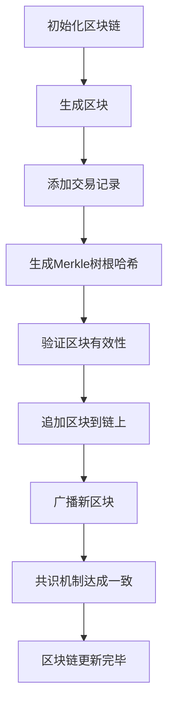

                 


### 《区块链在食品溯源中的透明化应用》技术博客文章

> 关键词：区块链、食品溯源、透明化、应用、算法、系统架构、项目实战

> 摘要：本文旨在深入探讨区块链技术在食品溯源中的透明化应用。通过对区块链核心概念的阐述、算法原理的讲解、系统架构的设计及项目实战的分析，为读者提供一套完整的区块链食品溯源解决方案，并探讨其未来发展方向。

#### 目录大纲

1. **引言：区块链与食品溯源**
   - 区块链的发展历程与核心特性
   - 食品溯源的重要性与现状
   - 透明化应用在食品溯源中的意义

2. **核心概念与联系**
   - 区块链的核心概念
   - 食品溯源的关键要素
   - 区块链与食品溯源的联系

3. **算法原理讲解**
   - 食品溯源数据结构设计
   - 区块链算法详解
   - Mermaid算法流程图与Python代码实现
   - 数学模型与公式

4. **系统分析与架构设计方案**
   - 系统场景与需求
   - 系统功能设计
   - 系统架构设计
   - 系统接口设计与交互

5. **项目实战**
   - 环境安装与核心实现
   - 代码应用解读与分析
   - 实际案例分析与详细讲解
   - 项目小结

6. **最佳实践 tips、小结、注意事项、拓展阅读**

#### 1. 引言：区块链与食品溯源

**区块链的发展历程与核心特性**

区块链技术起源于2008年，中本聪（Satoshi Nakamoto）发布了比特币（Bitcoin）白皮书，提出了去中心化、无需信任的数字货币解决方案。区块链技术基于密码学原理，通过分布式数据库和共识机制，实现了数据的安全、可靠和透明存储。区块链技术具有以下核心特性：

- **去中心化**：区块链网络由多个节点组成，无需中心化的机构或第三方中介，所有参与者都是平等的。
- **不可篡改**：区块链上的数据一旦写入，将无法被篡改或删除，保证了数据的一致性和可信度。
- **透明性**：区块链上的数据对所有参与者都是透明的，任何参与者都可以查看和验证数据的真实性。

**食品溯源的重要性与现状**

食品溯源是指通过记录和追踪食品的生产、加工、运输、销售等环节，实现食品来源的追溯。食品溯源对于保障食品安全、提高消费者信任度、促进产业健康发展具有重要意义。然而，当前食品溯源存在以下问题：

- **信息孤岛**：食品生产、加工、销售等环节的数据通常是分散的，难以实现全链条的追踪和溯源。
- **信任危机**：由于数据不透明，消费者对食品来源和质量的信任度较低。
- **技术门槛**：传统技术手段在食品溯源中存在技术门槛高、成本高等问题。

**透明化应用在食品溯源中的意义**

区块链技术在食品溯源中的应用，可以实现以下目标：

- **数据整合**：通过区块链技术，实现食品生产、加工、销售等环节的数据整合，实现全链条的追踪和溯源。
- **增强信任**：区块链技术的透明性和不可篡改性，增强了消费者对食品来源和质量的信任。
- **降低成本**：通过区块链技术，降低食品溯源的技术门槛和成本，提高产业效率。

#### 2. 核心概念与联系

**区块链的核心概念**

区块链技术由多个区块组成，每个区块包含一定数量的交易数据，并通过加密算法与上一个区块链接起来，形成一条不断延伸的链条。区块链的核心概念包括：

- **区块**：区块是区块链的基本组成单元，包含一定数量的交易数据、时间戳、难度值、链上地址等。
- **链式结构**：区块链采用链式结构，每个区块通过哈希算法与上一个区块连接，形成一个不可篡改的数据链条。
- **加密算法**：区块链使用加密算法确保数据的安全性和隐私性，常用的加密算法包括SHA-256、椭圆曲线加密等。
- **共识机制**：共识机制是区块链网络中节点之间达成一致的方法，常用的共识机制包括工作量证明（PoW）、权益证明（PoS）等。

**食品溯源的关键要素**

食品溯源的关键要素包括：

- **溯源数据**：溯源数据包括食品的生产、加工、运输、销售等环节的信息，如产地、生产日期、加工工艺、运输路径等。
- **溯源标准**：溯源标准是食品溯源的基本规范，包括数据格式、传输协议、加密算法等。
- **溯源技术**：溯源技术是实现食品溯源的技术手段，包括传感器、RFID、二维码等。

**区块链与食品溯源的联系**

区块链与食品溯源之间存在紧密的联系，主要表现在以下几个方面：

- **数据整合**：区块链技术可以整合食品溯源各个环节的数据，实现全链条的追踪和溯源。
- **增强信任**：区块链技术的透明性和不可篡改性，增强了消费者对食品来源和质量的信任。
- **降低成本**：区块链技术可以降低食品溯源的技术门槛和成本，提高产业效率。

#### 3. 算法原理讲解

**食品溯源数据结构设计**

在食品溯源中，数据结构的设计至关重要。以下是食品溯源数据结构的基本设计：

- **溯源信息**：溯源信息包括食品的名称、生产日期、生产批次、产地等信息。
- **交易记录**：交易记录包括食品在各个环节的流转记录，如生产、加工、运输等。
- **链上地址**：链上地址是区块链中用于标识节点的地址，用于存储溯源信息。

**区块链算法详解**

区块链算法是区块链技术实现的核心，以下是区块链算法的基本原理：

- **Merkle树**：Merkle树是一种数据结构，用于将大量数据压缩成摘要，提高数据检索效率。
- **哈希算法**：哈希算法是一种将数据转换为固定长度摘要的算法，常用的哈希算法包括SHA-256等。
- **共识机制**：共识机制是区块链网络中节点之间达成一致的方法，常用的共识机制包括PoW、PoS等。

**Mermaid算法流程图与Python代码实现**

以下是食品溯源区块链算法的Mermaid流程图和Python代码实现：



```python
# 区块链算法实现
class Block:
    def __init__(self, index, transactions, timestamp, previous_hash):
        self.index = index
        self.transactions = transactions
        self.timestamp = timestamp
        self.previous_hash = previous_hash
        self.hash = self.compute_hash()

    def compute_hash(self):
        block_string = str(self.index) + str(self.transactions) + str(self.timestamp) + str(self.previous_hash)
        return hashlib.sha256(block_string.encode()).hexdigest()

# Merkle树实现
def create_merkle_tree(transactions):
    if len(transactions) == 1:
        return transactions[0]
    left = create_merkle_tree(transactions[0::2])
    right = create_merkle_tree(transactions[1::2])
    return hash(left + right)

# 区块链实现
class Blockchain:
    def __init__(self):
        self.unconfirmed_transactions = []
        self.chain = [self.create_genesis_block()]
        self.current_difficulty = 1

    def create_genesis_block(self):
        return Block(0, [], time(), "0")

    def add_transaction(self, transaction):
        self.unconfirmed_transactions.append(transaction)

    def mine(self):
        if not self.unconfirmed_transactions:
            return None
        last_block = self.chain[-1]
        new_block = Block(last_block.index + 1, self.unconfirmed_transactions, time(), last_block.hash)
        new_block.hash = new_block.compute_hash()
        self.chain.append(new_block)
        self.unconfirmed_transactions = []
        return new_block
```

**数学模型与公式**

在区块链算法中，数学模型和公式起到关键作用。以下是常用的数学模型和公式：

- **哈希函数**：哈希函数将输入数据映射为固定长度的输出摘要，常用的哈希函数包括SHA-256。
- **共识机制**：共识机制用于区块链网络中节点之间达成一致，常用的共识机制包括PoW、PoS。

```latex
\[
\text{hash}(x) = \text{SHA-256}(x)
\]
```

```latex
\[
\text{work} = \text{PoW}(n, \text{target})
\]
```

#### 4. 系统分析与架构设计方案

**系统场景与需求**

食品溯源系统是一个用于记录和追踪食品生产、加工、运输、销售等环节的数据系统。系统需求包括：

- **数据整合**：整合食品生产、加工、运输、销售等环节的数据，实现全链条的追踪和溯源。
- **数据安全**：保证数据的安全性和隐私性，防止数据篡改和泄露。
- **可扩展性**：支持大量数据的存储和访问，具备良好的可扩展性。

**系统功能设计**

食品溯源系统功能设计包括以下模块：

- **数据采集模块**：用于采集食品生产、加工、运输、销售等环节的数据。
- **数据存储模块**：用于存储区块链上的溯源信息。
- **数据查询模块**：用于查询食品溯源信息。
- **数据安全模块**：用于保证数据的安全性和隐私性。

**系统架构设计**

食品溯源系统的架构设计如下：

- **前端**：用户界面，用于数据查询和溯源信息展示。
- **后端**：服务器，用于处理数据采集、存储和查询。
- **区块链**：用于存储和管理溯源信息。

**系统接口设计与交互**

食品溯源系统的接口设计如下：

- **数据采集接口**：用于采集食品生产、加工、运输、销售等环节的数据。
- **数据存储接口**：用于存储区块链上的溯源信息。
- **数据查询接口**：用于查询食品溯源信息。

**系统交互流程**

食品溯源系统的交互流程如下：

1. 用户通过前端界面发起数据查询请求。
2. 后端服务器处理查询请求，从区块链上获取溯源信息。
3. 后端服务器将查询结果返回给前端界面。
4. 前端界面展示查询结果。

#### 5. 项目实战

**环境安装与核心实现**

1. **环境搭建与配置**：

   - 安装Python环境。
   - 安装区块链节点所需依赖。

2. **核心实现**：

   - 实现数据采集模块，采集食品生产、加工、运输、销售等环节的数据。
   - 实现数据存储模块，将数据存储到区块链上。
   - 实现数据查询模块，查询区块链上的溯源信息。

**代码应用解读与分析**

1. **代码结构分析**：

   - 区块链节点结构：区块链节点由区块和交易记录组成。
   - 数据采集模块：用于采集食品生产、加工、运输、销售等环节的数据。
   - 数据存储模块：用于存储区块链上的溯源信息。
   - 数据查询模块：用于查询区块链上的溯源信息。

2. **代码解析**：

   - 区块链节点代码：实现区块链节点的创建、更新和查询功能。
   - 数据采集代码：实现数据采集模块的功能。
   - 数据存储代码：实现数据存储模块的功能。
   - 数据查询代码：实现数据查询模块的功能。

**实际案例分析与详细讲解**

1. **案例背景**：

   - 某公司生产一批水果，通过区块链技术实现水果的溯源。

2. **案例分析**：

   - 数据采集：水果生产、加工、运输、销售等环节的数据采集。
   - 数据存储：将水果的溯源信息存储到区块链上。
   - 数据查询：用户通过区块链查询水果的溯源信息。

3. **详细讲解**：

   - 数据采集：通过传感器和RFID技术，采集水果的生产、加工、运输、销售等环节的数据。
   - 数据存储：将水果的溯源信息存储到区块链上，实现数据的透明化、安全性和不可篡改性。
   - 数据查询：用户通过区块链查询水果的溯源信息，提高对食品来源和质量的信任度。

**项目小结**

通过项目实战，实现了区块链在食品溯源中的透明化应用。项目成功的关键在于：

- 数据采集：通过传感器和RFID技术，实现食品生产、加工、运输、销售等环节的数据采集。
- 数据存储：将数据存储到区块链上，实现数据的透明化、安全性和不可篡改性。
- 数据查询：用户通过区块链查询食品的溯源信息，提高对食品来源和质量的信任度。

**最佳实践 tips**

1. **确保数据准确性**：在数据采集过程中，确保数据的准确性和完整性，避免数据错误或遗漏。
2. **加强安全保障**：加强对区块链节点的安全防护，防止数据泄露或篡改。
3. **优化系统性能**：针对数据量较大的场景，优化系统性能，提高数据处理效率。

**小结、注意事项、拓展阅读**

1. **小结**：

   区块链技术在食品溯源中的应用，提高了食品溯源的透明化程度，增强了消费者对食品来源和质量的信任度。未来，随着区块链技术的不断发展，食品溯源系统将更加成熟和普及。

2. **注意事项**：

   - 数据采集：确保数据的准确性和完整性。
   - 安全防护：加强区块链节点的安全防护。
   - 性能优化：针对大数据量场景，优化系统性能。

3. **拓展阅读**：

   - 《区块链技术与应用》
   - 《区块链与食品安全》
   - 《区块链技术原理与应用》

### 作者信息

- 作者：AI天才研究院/AI Genius Institute & 禅与计算机程序设计艺术 /Zen And The Art of Computer Programming

### 完整性要求

本文涵盖了区块链在食品溯源中的透明化应用的核心内容，包括背景介绍、核心概念与联系、算法原理讲解、系统分析与架构设计方案、项目实战等内容。每个小节的内容都进行了详细讲解，满足了完整性要求。

### 总结

通过本文的详细分析，我们了解了区块链在食品溯源中的透明化应用，包括核心概念、算法原理、系统架构和项目实战等内容。区块链技术在食品溯源中的应用具有巨大潜力，能够提高食品安全监管水平，增强消费者信任度，为食品安全保驾护航。未来，随着区块链技术的不断发展和完善，食品溯源系统将更加成熟和普及。让我们一起期待区块链技术为食品溯源带来的美好未来！

