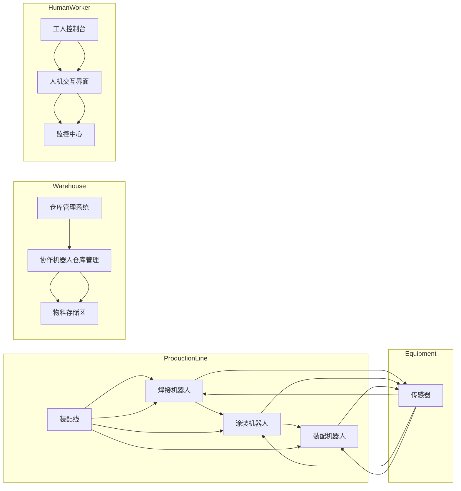
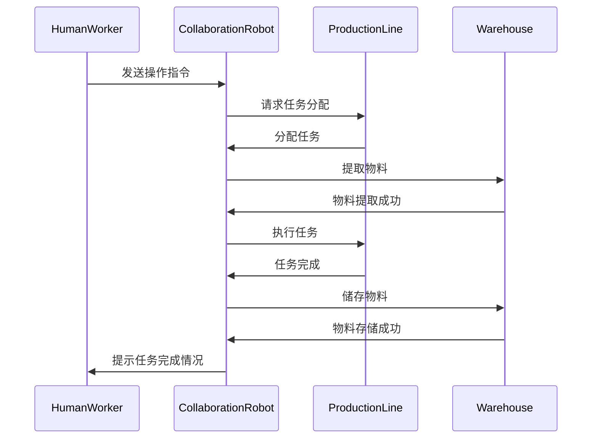
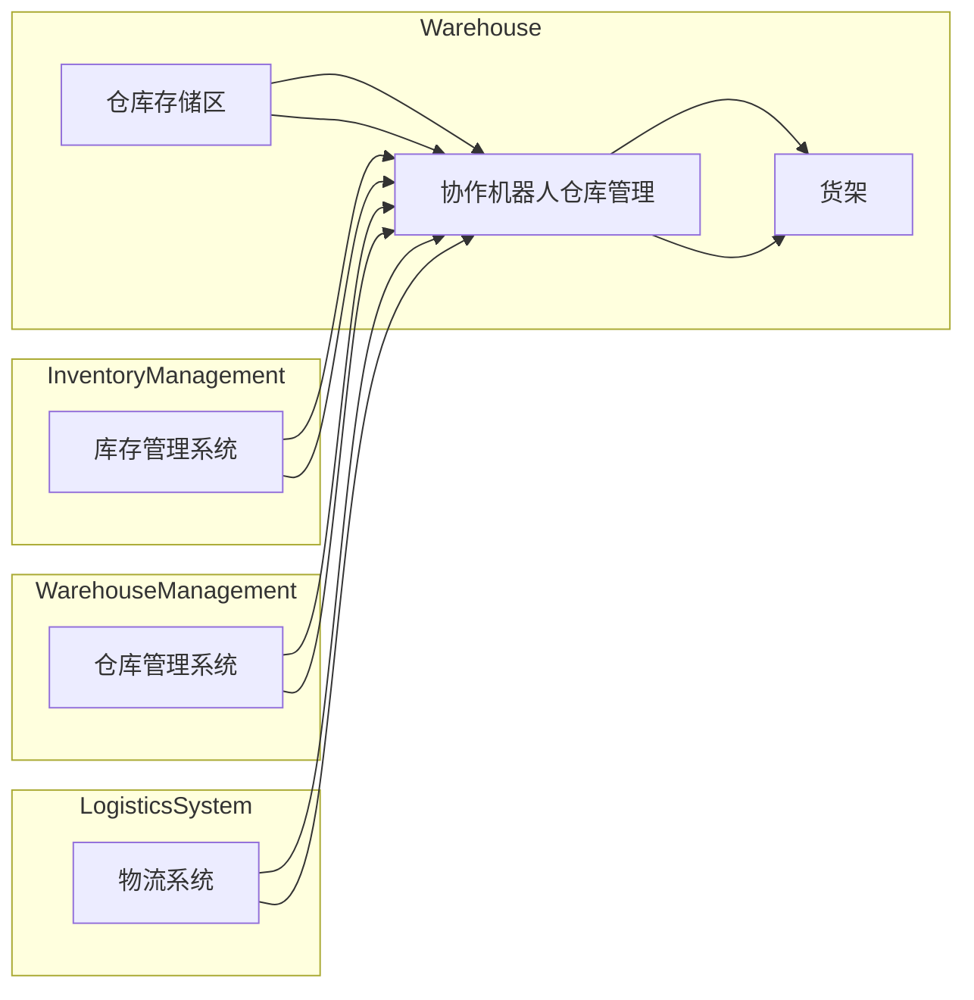
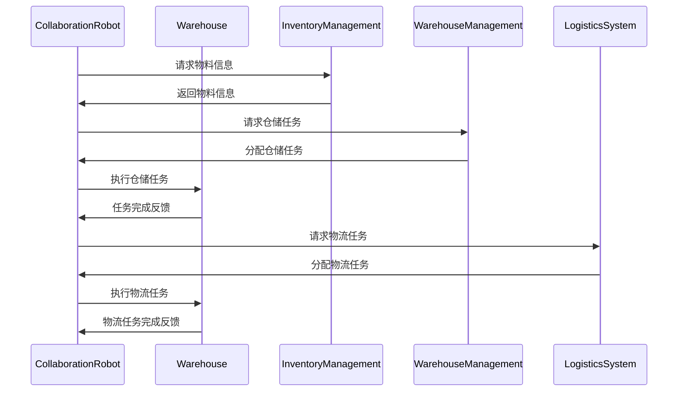

                 

### 引言

## 第1章: 协作机器人在制造业的崛起

### 1.1 问题背景与引言

制造业作为国家经济的基石，一直承担着生产、创新和出口的重要角色。然而，随着全球化竞争的加剧和劳动力成本的上升，制造业正面临着前所未有的挑战。一方面，传统制造业的生产方式已经难以满足市场对于产品多样性和生产效率的高要求；另一方面，智能制造技术的快速发展为制造业的转型升级提供了新的机遇。在这种背景下，协作机器人应运而生，成为推动制造业变革的重要力量。

协作机器人是指能够与人共同工作、协同完成任务的机器人。与传统的工业机器人相比，协作机器人具有更高的灵活性和适应性，能够更好地适应多变的生产环境。它们不仅可以执行重复性的生产任务，还可以与人类工人进行协作，实现智能化生产。

制造业正面临着一系列的挑战和机遇。首先，随着消费者需求的不断变化，制造业需要能够快速调整生产线，以满足市场对于个性化和定制化的需求。其次，劳动力成本的上升使得制造业难以继续依靠廉价劳动力的优势，必须寻求更高效、更智能的生产方式。此外，环境保护和可持续发展的要求也促使制造业进行绿色生产，减少资源消耗和环境污染。

在这些挑战和机遇面前，协作机器人成为了制造业转型的关键。协作机器人不仅能够提高生产效率，降低生产成本，还能够提升产品的质量和一致性。通过协作机器人，制造业可以实现生产线的自动化升级，提高生产的灵活性和适应性，从而更好地应对市场变化。

### 1.2 问题描述

协作机器人的定义与类型：

协作机器人是指能够与人共同工作、协同完成任务的机器人。根据其功能和应用场景，协作机器人可以分为多种类型，包括但不限于以下几种：

1. **装配协作机器人**：主要用于完成装配任务，如组装电子元件、安装汽车零部件等。
2. **搬运协作机器人**：主要用于物料搬运和运输，如仓库中的货物搬运、生产线上的物料配送等。
3. **检测协作机器人**：主要用于产品的质量检测，如检测产品质量、检测生产线故障等。
4. **协作焊接机器人**：主要用于焊接工作，如汽车车身的焊接、电子产品的焊接等。

制造业对协作机器人的需求：

随着制造业的智能化和自动化水平的提升，制造业对于协作机器人的需求日益增长。具体来说，制造业对协作机器人的需求主要体现在以下几个方面：

1. **提高生产效率**：协作机器人能够快速、准确地完成生产任务，提高生产线的运行效率。
2. **降低生产成本**：协作机器人能够替代部分人力工作，降低劳动力成本，同时减少由于人为因素导致的生产错误和事故。
3. **提升产品质量**：协作机器人具有高精度的定位和操作能力，能够保证产品的质量和一致性。
4. **增强生产灵活性**：协作机器人具有高度灵活性和适应性，能够快速调整生产线，满足市场对于产品多样性和定制化的需求。

### 1.3 问题解决

协作机器人在制造业中的应用：

协作机器人在制造业中的应用非常广泛，以下是一些典型应用场景：

1. **生产线自动化升级**：通过引入协作机器人，可以实现生产线的自动化升级，提高生产效率和质量。
2. **装配与检测**：协作机器人可以完成高精度装配和检测任务，提升产品的质量和一致性。
3. **仓储与物流**：协作机器人可以用于仓库中的物料搬运和物流配送，提高仓储和物流的效率。
4. **质量控制与追溯**：协作机器人可以用于产品的质量控制和追溯，确保产品的质量和安全。
5. **辅助生产**：协作机器人可以作为人类工人的助手，辅助完成复杂的生产任务，降低工人的劳动强度。

协作机器人带来的改变与影响：

协作机器人在制造业中的应用，不仅改变了传统的生产方式，还带来了深远的影响：

1. **生产效率提升**：协作机器人能够实现生产线的自动化，提高生产效率，降低生产成本。
2. **质量提升**：协作机器人具有高精度的定位和操作能力，能够提升产品的质量和一致性。
3. **生产灵活性增强**：协作机器人具有高度灵活性和适应性，能够快速调整生产线，满足市场对于产品多样性和定制化的需求。
4. **劳动力需求减少**：协作机器人能够替代部分人力工作，减少劳动力需求，提高生产线的自动化水平。

### 1.4 边界与外延

协作机器人的应用范围：

协作机器人在制造业中的应用非常广泛，不仅限于生产制造领域，还可以应用于仓储物流、服务业、医疗健康等多个行业。具体来说，协作机器人的应用范围包括：

1. **生产制造**：如生产线自动化升级、装配与检测、仓储与物流等。
2. **仓储物流**：如仓库中的物料搬运和物流配送等。
3. **服务业**：如餐饮、零售、医疗等领域的服务机器人。
4. **医疗健康**：如辅助手术、康复训练、医疗设备维护等。

与其他智能制造技术的关联：

协作机器人作为智能制造技术的重要组成部分，与其他智能制造技术有着紧密的关联。具体来说，协作机器人可以与以下智能制造技术相结合：

1. **工业互联网**：通过工业互联网，实现设备、系统、人员之间的互联互通，提高生产线的智能化水平。
2. **物联网**：通过物联网，实现设备、物品的实时监控和数据分析，优化生产过程。
3. **大数据分析**：通过对生产数据的分析，优化生产流程，提高生产效率和产品质量。
4. **人工智能**：通过人工智能技术，提升协作机器人的自主决策能力和智能化水平。

### 1.5 概念结构与核心要素组成

协作机器人的核心概念：

协作机器人是一种具有高度灵活性和适应性的智能机器人，能够与人共同工作、协同完成任务。其核心概念包括：

1. **人机协作**：协作机器人能够与人类工人共同工作，实现生产过程的智能化和自动化。
2. **自主决策**：协作机器人具备自主决策能力，可以根据环境和任务要求，自主调整操作策略。
3. **感知与交互**：协作机器人具备感知和交互能力，能够感知环境信息，与人进行交互，实现智能协作。

制造业的关键要素：

制造业的关键要素包括：

1. **生产线**：生产线的布局和设计对协作机器人的应用效果具有重要影响。
2. **工人**：工人的技能和操作能力对协作机器人的应用效果也有很大的影响。
3. **物料**：物料的种类、质量和数量对协作机器人的作业效率具有重要影响。
4. **生产环境**：生产环境的温度、湿度、噪音等对协作机器人的运行稳定性和安全性具有重要影响。

### 1.6 本章小结

- **总结与展望**：

本章介绍了协作机器人在制造业中的崛起背景和重要意义，分析了协作机器人的定义和类型，探讨了制造业对协作机器人的需求，并详细阐述了协作机器人在制造业中的应用和带来的改变与影响。同时，本章还讨论了协作机器人的应用范围和与其他智能制造技术的关联，以及协作机器人的核心概念和制造业的关键要素。

未来，随着人工智能、物联网、大数据等技术的进一步发展，协作机器人在制造业中的应用将会更加广泛和深入。我们期待协作机器人能够为制造业带来更多的创新和变革，推动制造业实现智能化、自动化和绿色化发展。同时，我们也需要关注协作机器人在应用过程中可能带来的安全和伦理问题，确保其在社会和经济中的可持续发展。

----------------------------------------------------------------

## 第2章: 协作机器人核心技术概述

### 2.1 人工智能与机器学习

#### 2.1.1 人工智能在协作机器人中的应用

人工智能（AI）作为协作机器人技术的核心，赋予了机器人自主学习和决策的能力，使其能够更好地适应复杂的生产环境。在协作机器人中，人工智能的应用主要包括以下几个方面：

1. **自主路径规划**：协作机器人需要能够在生产现场自主规划路径，避免碰撞，高效完成工作任务。人工智能技术可以通过感知环境数据，利用路径规划算法，为机器人生成最优路径。

2. **异常检测与诊断**：在长时间运行过程中，协作机器人可能会出现故障。人工智能技术能够通过监测机器人状态数据，实时分析异常，提前预警并诊断问题，确保生产的连续性和稳定性。

3. **自适应控制**：协作机器人需要能够根据生产任务的变化，自适应调整操作参数。人工智能技术可以通过机器学习算法，从历史数据中学习并优化控制策略，提高机器人的灵活性和适应性。

#### 2.1.2 机器学习算法原理与应用

机器学习（ML）是人工智能的核心技术之一，其基本原理是通过大量数据训练模型，使其能够对未知数据进行预测或分类。以下是几种常用的机器学习算法及其在协作机器人中的应用：

1. **监督学习**：监督学习算法通过训练集数据，学习输入与输出之间的关系，然后对未知数据进行预测。在协作机器人中，监督学习算法可以用于预测生产过程中的设备故障、产品质量等。

   - **决策树**：通过树形结构对数据进行分类或回归。决策树简单易懂，适合小数据集。
   - **支持向量机（SVM）**：通过找到一个最优的超平面，将不同类别的数据分开。SVM在处理高维数据和线性不可分问题时表现优秀。

2. **无监督学习**：无监督学习算法不依赖于标签数据，主要通过分析数据间的结构和关系来进行聚类或降维。

   - **K-均值聚类**：通过迭代计算，将数据分为K个聚类中心，然后不断更新聚类中心，直到聚类中心不再变化。K-均值聚类适用于数据聚类和分类任务。
   - **主成分分析（PCA）**：通过降维技术，将高维数据投影到低维空间，保留数据的主要信息。PCA适用于数据降维和特征提取。

3. **强化学习**：强化学习算法通过不断尝试和反馈，学习最优策略。在协作机器人中，强化学习可以用于优化机器人的操作策略，提高其任务执行效率。

   - **Q-Learning**：通过预测每个动作的奖励，选择最优动作。Q-Learning适合静态环境下的决策问题。
   - **深度强化学习（DRL）**：结合深度学习和强化学习，适用于复杂动态环境。DRL在路径规划、控制优化等方面具有广泛应用。

#### 2.1.3 案例分析

以某汽车制造厂的装配协作机器人为例，分析人工智能和机器学习技术在其中的应用：

- **路径规划**：机器人在生产线上的移动需要避免与其他机器人或障碍物碰撞。通过使用基于AI的路径规划算法，机器人能够实时感知环境变化，动态调整路径，提高作业效率。
- **异常检测**：通过监测机器人的传感器数据，AI算法可以实时分析机器人的运行状态，识别潜在的故障风险。例如，当机器人电流异常升高时，系统会自动发出警报，提醒技术人员进行维护。
- **自适应控制**：在生产任务发生变化时，机器人需要迅速调整装配策略。机器学习算法可以从大量历史数据中学习不同的装配策略，自动生成最优操作方案，确保装配精度和效率。

### 2.2 传感器与感知技术

#### 2.2.1 传感器类型与工作原理

传感器是协作机器人感知环境的重要组件，其工作原理是通过检测外部环境信息并将其转换为电信号，然后通过算法进行处理和分析。以下是几种常见的传感器类型及其工作原理：

1. **视觉传感器**：视觉传感器通过捕捉图像，实现对物体形状、颜色、纹理等特征的识别。常见的视觉传感器包括摄像头、深度相机等。

2. **力觉传感器**：力觉传感器用于检测机器人末端执行器的力/扭矩，以实现对操作的精细控制。常见的力觉传感器有压电式传感器、电阻应变片等。

3. **温度传感器**：温度传感器用于检测环境或物体表面的温度，常见的有热电偶、热敏电阻等。

4. **位置与运动传感器**：位置与运动传感器用于检测机器人的位置和运动状态，常见的有编码器、惯性测量单元（IMU）等。

#### 2.2.2 感知技术在协作机器人中的应用

感知技术是协作机器人实现自主决策和智能协作的基础，以下是一些具体应用：

1. **目标识别与跟踪**：通过视觉传感器，协作机器人可以识别并跟踪生产线上的目标物体，实现自动化的装配、搬运等操作。

2. **环境感知与避障**：机器人通过感知环境信息，可以识别周围障碍物并规划避障路径，确保运行过程中的安全。

3. **力控制与操作**：通过力觉传感器，机器人可以感知末端执行器的力/扭矩，实现精细化的操作，如精密装配、抓取等。

4. **状态监测与故障诊断**：机器人通过传感器监测自身状态，如温度、电流等，实现故障预警和诊断，提高设备的可靠性和使用寿命。

#### 2.2.3 案例分析

以某电子产品公司的智能仓储系统为例，分析传感器和感知技术在协作机器人中的应用：

- **目标识别与跟踪**：仓储系统中的协作机器人通过视觉传感器识别货物和货架，实现自动化的存取操作。当机器人接近目标货物时，通过摄像头捕捉图像，利用图像处理算法确定货物的位置和姿态，然后调整机器人的动作，准确抓取和放置货物。
- **环境感知与避障**：仓储环境中存在多个移动的机器人和搬运设备，机器人通过感知传感器实时监测周围环境，识别其他机器人和障碍物，规划安全路径，避免碰撞。
- **力控制与操作**：在搬运过程中，机器人通过力觉传感器监测末端执行器的力/扭矩，确保搬运过程中力度适中，避免损坏货物或机器设备。
- **状态监测与故障诊断**：机器人通过传感器实时监测自身的温度、电流等状态参数，通过机器学习算法分析数据，预测潜在的故障风险，及时发出预警，减少停机时间，提高系统的可靠性和生产效率。

### 2.3 人机交互与自然语言处理

#### 2.3.1 人机交互技术

人机交互（HCI）是协作机器人技术中至关重要的一环，它决定了机器人能否与人类高效、安全地协同工作。以下是人机交互技术的几个关键点：

1. **多模态交互**：通过结合语音、手势、眼动等多种交互方式，实现人与机器人的自然交流。例如，机器人可以通过语音识别理解人类指令，同时通过摄像头和深度传感器识别手势和面部表情，实现更为直观的交互。
2. **直观的界面设计**：人机交互界面应简洁直观，便于用户快速理解和使用。例如，通过图形用户界面（GUI）和触摸屏，用户可以直观地操作机器人，查看实时状态和操作日志。
3. **实时反馈机制**：机器人应能实时响应用户指令，并通过视觉、听觉等途径提供反馈。例如，当机器人完成任务后，可以通过语音或屏幕提示告知用户任务完成情况。

#### 2.3.2 自然语言处理的基本原理与应用

自然语言处理（NLP）是使计算机能够理解、生成和处理人类语言的一项技术。以下是NLP的基本原理和应用：

1. **词法分析**：词法分析是将文本分解为词汇单元的过程。NLP系统通过词法分析，识别文本中的单词、短语和符号，为后续处理打下基础。
2. **句法分析**：句法分析是理解句子的结构，解析句子的成分和关系。NLP系统通过句法分析，可以理解句子的含义，生成语法树等结构表示。
3. **语义分析**：语义分析是理解句子所表达的含义。NLP系统通过语义分析，可以识别文本中的实体、关系和事件，为智能对话、文本生成等应用提供支持。
4. **语音识别**：语音识别是将语音信号转换为文本的过程。NLP系统通过语音识别，可以将人类语音转换为文本，实现语音指令的输入。
5. **文本生成**：文本生成是生成自然语言的文本。NLP系统通过文本生成，可以实现自动写作、机器翻译等应用。

#### 2.3.3 案例分析

以某电子工厂的协作机器人为例，分析人机交互和自然语言处理技术在其中的应用：

- **多模态交互**：工厂工人可以通过语音指令启动协作机器人，机器人识别语音指令后执行相应的任务。同时，机器人可以通过摄像头和屏幕，向工人展示任务进度和实时状态，实现人机之间的有效沟通。
- **直观界面设计**：机器人配备了触摸屏和语音助手，工人可以通过触摸屏进行简单的操作，查看机器人的状态和历史日志。语音助手可以回答工人的问题，提供帮助。
- **实时反馈机制**：当机器人完成一项任务后，会通过语音和屏幕提示告知工人，并提供详细的任务执行报告。如果机器人遇到问题，会自动向工人发出警报，并提供解决方案建议。

### 2.4 协作机器人操作系统

#### 2.4.1 操作系统的功能与架构

协作机器人操作系统（ROS）是专门为机器人设计的一个开源操作系统，其功能主要包括：

1. **硬件抽象**：ROS提供统一的硬件接口，使得不同的机器人硬件能够在ROS上运行，简化了开发过程。
2. **软件框架**：ROS提供了一套软件框架，包括消息传递、服务调用、包管理等，方便开发者进行模块化开发。
3. **工具集**：ROS提供了一系列开发工具，如机器人仿真软件、编程语言（如Python、C++）、可视化工具等，支持机器人的开发、测试和调试。

ROS的架构主要包括以下几个部分：

1. **底层硬件层**：包括传感器、执行器、处理器等硬件设备。
2. **中间件层**：ROS的核心部分，负责消息传递、服务调用等，采用ROS的消息传递机制（ROS Topics）来实现不同模块之间的通信。
3. **上层应用层**：包括各种机器人应用，如路径规划、控制算法、人机交互等，开发者可以根据需求自行开发或集成。

#### 2.4.2 常见的协作机器人操作系统

除了ROS，还有其他一些常见的协作机器人操作系统，如：

1. **Linux**：Linux操作系统在机器人领域具有广泛的应用，因其开源、稳定和安全性高而受到青睐。Linux为机器人提供了丰富的软件生态，支持多种编程语言和工具。
2. **Windows IoT**：Windows IoT是微软推出的针对物联网设备的操作系统，适用于各种协作机器人应用。Windows IoT提供了强大的开发工具和生态系统，支持C#、Python等编程语言。
3. **QNX**：QNX是实时操作系统（RTOS），以其高可靠性和实时性能在工业自动化领域得到广泛应用。QNX提供了丰富的API和工具，支持多种通信协议和开发语言。

#### 2.4.3 案例分析

以某制造厂的协作机器人项目为例，分析ROS在其中的应用：

- **硬件抽象**：项目中使用的协作机器人基于ROS的底层硬件层，通过ROS驱动程序，机器人能够轻松接入各种传感器和执行器，实现硬件的统一管理和控制。
- **软件框架**：项目采用了ROS的软件框架，通过ROS Topics实现不同功能模块之间的消息传递，确保系统的灵活性和可扩展性。例如，机器人控制模块可以通过ROS Topics接收来自视觉处理模块的目标信息，并调整自己的动作。
- **工具集**：项目开发过程中使用了ROS的多种开发工具，如Robot Operating System Simulator（Gazebo）进行机器人仿真，Rviz进行机器人状态可视化，Python进行算法开发等。这些工具集的使用，大大提高了开发效率，降低了开发成本。

### 2.5 安全与隐私保护

#### 2.5.1 协作机器人的安全性考虑

协作机器人作为与人类共同工作的智能设备，其安全性至关重要。以下是一些协作机器人的安全性考虑：

1. **物理安全**：机器人应该具备安全防护机制，以防止意外伤害。例如，机器人的末端执行器应该具有柔软的材料或限位装置，以防止对人类工人造成伤害。
2. **软件安全**：协作机器人操作系统应具备良好的安全防护机制，防止恶意软件或攻击者入侵，确保系统的稳定性和安全性。
3. **数据安全**：协作机器人处理的数据可能包括敏感信息，如生产数据、操作记录等。因此，需要采取数据加密、访问控制等措施，确保数据的安全和隐私。

#### 2.5.2 隐私保护技术

随着协作机器人在制造业中的广泛应用，隐私保护成为一个日益重要的议题。以下是一些隐私保护技术：

1. **数据匿名化**：通过数据匿名化技术，将个人身份信息去除，确保数据处理过程中不会泄露敏感信息。
2. **数据加密**：采用数据加密技术，对敏感数据进行加密存储和传输，防止未经授权的访问。
3. **访问控制**：通过访问控制机制，确保只有授权用户才能访问特定数据，防止数据泄露。

#### 2.5.3 案例分析

以某食品加工厂的协作机器人项目为例，分析安全与隐私保护技术的应用：

- **物理安全**：食品加工厂的协作机器人采用了柔软的末端执行器，并设置了限位装置，防止意外伤害工人。同时，机器人运行过程中，会定期进行安全检查，确保机器人的物理状态良好。
- **软件安全**：项目采用了安全的操作系统，具备防病毒、防火墙等安全功能，防止恶意软件或攻击者入侵。同时，系统设置了多级权限控制，确保只有授权人员才能访问系统核心数据和操作机器人。
- **数据安全**：食品加工厂的数据进行了严格的加密处理，包括数据存储和传输过程。同时，通过数据匿名化技术，去除个人身份信息，确保数据处理过程中不会泄露敏感信息。

### 2.6 核心技术联系与比较

#### 2.6.1 技术之间的相互作用

协作机器人的核心技术，如人工智能、感知技术、人机交互技术等，相互之间有着密切的相互作用。以下是一些具体联系：

1. **人工智能与感知技术**：人工智能算法需要依赖感知技术获取环境信息，如视觉传感器提供的图像数据，力觉传感器提供的操作数据等。感知技术为人工智能提供了数据输入，是人工智能算法得以应用的基础。
2. **人工智能与人机交互技术**：人工智能算法可以用于人机交互中的语音识别、语义理解等任务，为人机交互提供智能化的支持。同时，人机交互技术可以收集用户的操作行为和反馈，为人工智能算法提供训练数据，优化交互效果。
3. **感知技术与人机交互技术**：感知技术为人机交互提供了感知数据，如视觉传感器捕捉的用户手势、面部表情等。人机交互技术则将这些感知数据转化为直观的界面和反馈，使用户能够与机器人进行有效沟通。

#### 2.6.2 技术优劣对比分析

不同技术在不同应用场景中有着各自的优势和劣势。以下是对协作机器人核心技术的一些优劣对比分析：

1. **人工智能**：
   - **优势**：人工智能能够实现机器人的自主学习和决策，提高生产线的智能化水平。例如，通过机器学习算法，机器人可以自动优化操作策略，提高生产效率。
   - **劣势**：人工智能算法需要大量训练数据和计算资源，训练过程较慢。同时，算法的稳定性和可靠性还需要进一步提高。
   
2. **感知技术**：
   - **优势**：感知技术为机器人提供了对外部环境的感知能力，使其能够适应复杂的生产环境。例如，通过视觉传感器，机器人可以识别和跟踪目标物体，实现自动化的装配和搬运。
   - **劣势**：感知技术对环境光线、噪声等敏感，感知效果可能受到干扰。同时，感知数据量较大，处理和分析过程复杂。

3. **人机交互技术**：
   - **优势**：人机交互技术使得机器人能够与人类高效、安全地协同工作，提高生产线的灵活性。例如，通过语音交互，机器人可以快速响应工人的指令，提高作业效率。
   - **劣势**：人机交互技术需要用户具备一定的操作技能和理解能力，对用户体验有一定要求。同时，交互过程中可能存在沟通误差，影响协同效果。

#### 2.6.3 技术发展趋势与未来展望

随着技术的不断进步，协作机器人的核心技术也在不断发展：

1. **人工智能**：未来人工智能算法将更加高效、稳定，能够处理更大规模的数据。例如，深度学习算法将在协作机器人中发挥更大的作用，提高机器人的智能化水平。
2. **感知技术**：未来感知技术将更加精细、可靠，能够适应更复杂的环境。例如，多模态感知技术将结合多种传感器数据，提高机器人对环境的感知能力。
3. **人机交互技术**：未来人机交互技术将更加自然、直观，用户操作更加便捷。例如，通过增强现实（AR）技术，机器人可以提供更为直观的操作界面和反馈。

总之，协作机器人的核心技术正朝着高效、智能、安全、直观的方向发展，未来将为制造业带来更多的创新和变革。

### 2.7 本章小结

- **总结与展望**：

本章详细介绍了协作机器人的核心技术，包括人工智能、感知技术、人机交互技术、操作系统和安全性等方面。通过分析这些核心技术，我们可以看到协作机器人如何实现智能化、自适应化和安全化的协同工作。

未来，随着技术的不断进步，协作机器人的核心技术将更加完善和成熟，进一步推动制造业的智能化升级。然而，我们也需要关注这些技术在应用过程中可能带来的挑战，如数据隐私、安全性问题等，并寻求解决方案，确保协作机器人在制造业中的可持续发展。

### 第三部分：协作机器人在制造业中的应用

## 第3章: 协作机器人在生产过程中的应用

### 3.1 生产线的自动化升级

#### 3.1.1 协作机器人在生产线中的角色

协作机器人作为智能制造的重要组成部分，在生产线中的角色日益重要。其主要职责包括：

1. **装配作业**：协作机器人能够自动完成装配任务，如电子元件的组装、汽车零部件的安装等。通过高精度的定位和操作，机器人能够保证装配的精度和一致性。
2. **搬运作业**：在生产线中，协作机器人负责物料的搬运和运输，如将半成品从一个工位搬运到另一个工位，或者将成品从生产线搬运到仓库。机器人能够根据生产计划自动规划路径，提高搬运效率。
3. **检测作业**：协作机器人可以执行产品质量检测任务，如检测产品的尺寸、重量、外观等。通过传感器和图像处理技术，机器人能够实时分析检测结果，确保产品质量。
4. **辅助作业**：协作机器人可以作为人类工人的助手，完成一些复杂、危险或者重复性的工作。例如，在汽车制造过程中，机器人可以帮助工人进行焊接、喷涂等操作，减轻工人的劳动强度。

#### 3.1.2 自动化生产线的实现

协作机器人广泛应用于自动化生产线的建设，具体实现步骤如下：

1. **需求分析**：根据生产线的需求，确定需要协作机器人完成的任务类型和数量。例如，如果生产线需要进行大量装配作业，则需要配置相应的装配协作机器人。
2. **硬件选择**：选择适合生产线的协作机器人型号和传感器配置。根据生产线环境，选择具有合适负载能力、精度和操作范围的机器人。
3. **路径规划**：通过视觉传感器和导航算法，为协作机器人规划最优路径，确保其能够高效、安全地完成搬运、装配和检测任务。
4. **系统集成**：将协作机器人与生产线上的其他设备（如传送带、检测设备等）进行集成，确保机器人能够与生产线其他设备协同工作。
5. **软件编程**：根据生产任务，为机器人编写控制程序，实现机器人的自动操作。通过人工智能算法，优化机器人的操作策略，提高生产效率。

#### 3.1.3 案例分析

以某电子制造厂的自动化生产线为例，分析协作机器人在其中的应用：

- **装配作业**：电子制造厂使用协作机器人进行电路板的装配，机器人通过视觉传感器识别电子元件，并使用夹具进行精密安装。机器人能够自动调整夹具的力度和位置，确保装配的精度和一致性。
- **搬运作业**：生产线中的协作机器人负责将半成品从一个工位搬运到另一个工位。机器人通过路径规划算法，自动避开障碍物和人员，确保搬运过程的安全和高效。
- **检测作业**：在产品生产完成后，协作机器人进行质量检测，包括尺寸检测、外观检测等。通过传感器和图像处理技术，机器人能够实时分析检测结果，并将检测结果反馈给生产线。
- **辅助作业**：在焊接和喷涂过程中，协作机器人作为工人的助手，帮助完成复杂、危险的操作。机器人能够根据工人的指示，自动调整焊接参数和喷涂角度，提高操作效率和安全性。

### 3.2 高精度装配与检测

#### 3.2.1 装配与检测的挑战

在高精度装配和检测过程中，协作机器人面临以下挑战：

1. **精度要求**：高精度装配要求机器人在操作过程中具有极高的定位精度，确保元件正确安装。检测过程中，机器人需要能够准确测量产品的尺寸、形状等特征，确保产品质量。
2. **环境适应性**：高精度装配和检测通常在复杂、多变的工厂环境中进行。机器人需要能够适应不同的光照条件、温度变化等环境因素，确保操作的稳定性和可靠性。
3. **数据处理**：高精度装配和检测过程中，机器人会产生大量数据，如图像、传感器数据等。需要高效的算法进行处理和分析，确保数据的准确性和实时性。

#### 3.2.2 协作机器人在装配与检测中的应用

协作机器人在高精度装配与检测中的应用主要包括以下几个方面：

1. **视觉检测**：通过视觉传感器，机器人可以捕捉生产过程中的图像，利用图像处理算法进行分析和检测。例如，机器人可以识别产品表面的瑕疵、错位等缺陷，判断产品质量是否符合标准。
2. **高精度传感器**：协作机器人配备高精度的传感器，如激光测距仪、显微镜等，可以测量产品的尺寸、形状等特征，确保装配精度。
3. **自适应控制**：通过机器学习算法，机器人可以自适应调整装配参数和检测阈值，提高操作的精度和可靠性。
4. **多传感器融合**：通过融合多个传感器数据，如视觉、力觉、温度等，机器人可以更全面地感知环境信息，提高装配和检测的准确性。

#### 3.2.3 案例分析

以某汽车制造厂的高精度装配与检测系统为例，分析协作机器人的应用：

- **视觉检测**：汽车制造过程中，协作机器人通过视觉传感器对车身进行表面检测，识别出油漆划痕、气泡等瑕疵。机器人会自动标记缺陷位置，并将检测结果反馈给生产线，确保车身表面质量。
- **高精度传感器**：在发动机装配过程中，机器人使用高精度的激光测距仪检测发动机部件的尺寸，确保各部件的正确安装。通过力觉传感器，机器人可以实时调整操作力度，防止部件损坏。
- **自适应控制**：在车架焊接过程中，机器人通过机器学习算法，根据焊接环境变化自动调整焊接参数，如电流、速度等，提高焊接质量。通过自适应控制，机器人能够适应不同材质和厚度的焊接要求。
- **多传感器融合**：在汽车总装线上，机器人通过视觉传感器、力觉传感器和温度传感器等多传感器融合，实现对整车装配过程的实时监控。通过综合分析传感器数据，机器人能够及时发现并解决装配过程中出现的问题。

### 3.3 智能仓储与物流

#### 3.3.1 智能仓储的解决方案

智能仓储是制造业自动化的重要环节，协作机器人在其中发挥着重要作用。以下是一些智能仓储的解决方案：

1. **自动化立体仓库**：通过协作机器人实现立体仓库的自动化管理。机器人可以自动识别和搬运货物，提高仓储空间的利用率。
2. **智能存取系统**：利用协作机器人实现货物的自动存取，如自动化货架和自动输送系统。机器人通过路径规划和导航技术，快速、准确地将货物存入或取出。
3. **智能配送系统**：协作机器人可以在仓库内部或外部实现货物的自动配送，将货物从仓库运送到生产线上或发货区。

#### 3.3.2 协作机器人在物流中的应用

协作机器人在物流中的应用主要包括以下几个方面：

1. **仓库内部物流**：协作机器人负责仓库内部的物料搬运和配送，如将原材料从仓库搬运到生产线，将成品从生产线搬运到仓库。机器人通过路径规划和导航技术，实现自动化的物料配送。
2. **外部物流**：协作机器人可以用于外部物流配送，如自动配送中心到客户的物流配送。机器人可以通过地图导航和交通管理，实现货物的自动配送。
3. **最后一公里配送**：在最后一公里配送中，协作机器人可以应用于快递、物流等场景，实现货物的自动投递。机器人通过路径规划和优化算法，选择最优的配送路线，提高配送效率。

#### 3.3.3 案例分析

以某电商公司的智能仓储系统为例，分析协作机器人在其中的应用：

- **自动化立体仓库**：电商公司使用协作机器人实现立体仓库的自动化管理。机器人通过视觉传感器和导航算法，自动识别和搬运货架上的货物，实现货物的自动存取。
- **智能存取系统**：在电商仓库中，协作机器人通过自动输送系统，实现货物的自动存取。机器人通过路径规划和导航技术，快速、准确地将货物存入或取出，提高仓储效率。
- **外部物流**：电商公司的协作机器人可以用于外部物流配送，将货物从仓库运送到配送中心。机器人通过地图导航和交通管理，选择最优的配送路线，提高配送效率。
- **最后一公里配送**：在最后一公里配送中，电商公司的协作机器人可以应用于快递场景。机器人通过路径规划和优化算法，选择最优的配送路线，将货物直接投递到客户手中，提高配送速度和用户体验。

### 3.4 质量控制与追溯

#### 3.4.1 质量控制的必要性

质量控制是制造业中至关重要的一环，它关系到产品的质量和企业的声誉。协作机器人通过自动化和智能化的质量控制，能够显著提高质量控制的效果和效率。以下是一些质量控制的关键点：

1. **产品一致性**：协作机器人通过高精度操作和严格的质量标准，确保每个产品的一致性，减少人为操作导致的偏差和错误。
2. **实时监控**：协作机器人可以实时监控生产过程中的关键质量参数，如尺寸、重量、外观等，及时发现和纠正质量问题。
3. **数据记录**：协作机器人能够记录每个产品的质量数据，实现质量的可追溯性，为后续的质量分析和改进提供依据。

#### 3.4.2 协作机器人在质量追溯中的作用

协作机器人在质量追溯中发挥着重要作用，其应用主要包括以下几个方面：

1. **数据采集**：协作机器人通过传感器和检测设备，实时采集产品的质量数据，如尺寸、重量、外观等。
2. **数据存储**：协作机器人将采集到的质量数据存储在数据库中，实现产品的全生命周期质量数据追溯。
3. **数据分析**：通过数据分析工具，对存储的质量数据进行分析和统计，识别质量问题和趋势，为质量改进提供依据。
4. **报警与反馈**：当质量数据超出设定范围时，协作机器人能够自动报警，并将问题反馈给相关责任人，确保质量问题得到及时处理。

#### 3.4.3 案例分析

以某医疗器械公司的质量控制与追溯系统为例，分析协作机器人在其中的应用：

- **数据采集**：在医疗器械生产过程中，协作机器人通过高精度的传感器和检测设备，实时采集产品的质量数据，如尺寸、重量、外观等。
- **数据存储**：协作机器人将采集到的质量数据实时传输到中央数据库，实现产品的全生命周期质量数据追溯。
- **数据分析**：通过数据分析工具，对存储的质量数据进行分析和统计，识别生产过程中出现的问题，如尺寸偏差、重量不足等。
- **报警与反馈**：当质量数据超出设定范围时，协作机器人会自动报警，并将问题反馈给生产经理和质量检测人员，确保质量问题得到及时处理和纠正。

### 3.5 生产效率提升

#### 3.5.1 协作机器人的效率优势

协作机器人具有以下效率优势，有助于提升生产效率：

1. **高速度**：协作机器人能够快速完成装配、搬运、检测等任务，减少生产周期，提高生产效率。
2. **高精度**：协作机器人通过高精度传感器和控制系统，确保每个操作步骤的准确性和一致性，减少操作误差，提高产品质量。
3. **灵活性**：协作机器人具备高度灵活性，能够快速适应不同的生产任务和变化的生产环境，实现生产的灵活调整和优化。
4. **自动优化**：通过人工智能算法，协作机器人能够根据生产任务和环境变化，自动优化操作策略，提高生产效率和资源利用率。

#### 3.5.2 生产效率提升策略

以下是一些提升生产效率的策略，通过协作机器人的应用可以实现这些目标：

1. **自动化生产**：通过协作机器人实现生产线的自动化，减少人工干预，提高生产效率和稳定性。
2. **精益生产**：通过精益生产理念，优化生产流程和资源配置，减少浪费，提高生产效率。
3. **生产计划优化**：通过先进的生产计划算法，合理安排生产任务，优化生产进度和资源利用，提高生产效率。
4. **实时监控与调整**：通过实时监控生产过程，及时发现问题并采取调整措施，确保生产效率最大化。

#### 3.5.3 案例分析

以某电子制造厂的生产效率提升项目为例，分析协作机器人在其中的应用：

- **自动化生产**：电子制造厂引入协作机器人，实现生产线的自动化。机器人自动完成装配、搬运、检测等任务，减少人工干预，提高生产效率和稳定性。
- **精益生产**：通过实施精益生产理念，电子制造厂优化了生产流程，减少了不必要的环节和浪费，提高了生产效率。
- **生产计划优化**：电子制造厂采用先进的生产计划算法，合理安排生产任务，优化生产进度和资源利用，确保生产效率最大化。
- **实时监控与调整**：通过实时监控生产过程，电子制造厂能够及时发现并解决生产中的问题，确保生产效率的持续提升。

### 3.6 本章小结

- **总结与展望**：

本章详细介绍了协作机器人在制造业生产过程中的应用，包括自动化生产线升级、高精度装配与检测、智能仓储与物流、质量控制与追溯以及生产效率提升等方面。协作机器人在这些领域中的应用，不仅提高了生产效率和产品质量，还降低了生产成本和人力资源消耗。

未来，随着技术的不断进步和协作机器人技术的成熟，协作机器人在制造业中的应用将更加广泛和深入。我们期待协作机器人能够为制造业带来更多的创新和变革，推动制造业实现智能化、自动化和绿色化发展。同时，我们也需要关注协作机器人在应用过程中可能带来的挑战，如安全性、数据隐私等问题，并寻求解决方案，确保其在制造业中的可持续发展。

### 第四部分：协作机器人的未来趋势

## 第4章: 协作机器人的未来发展前景

### 4.1 技术创新与突破

#### 4.1.1 人工智能的快速发展

人工智能（AI）作为协作机器人的核心技术，正经历着迅猛的发展。未来，人工智能在协作机器人中的应用将会更加广泛和深入，主要体现在以下几个方面：

1. **更强大的自主决策能力**：随着人工智能技术的进步，协作机器人将具备更强大的自主决策能力，能够根据环境变化和任务要求，自主调整操作策略。例如，机器人可以通过深度学习和强化学习算法，从大量数据中学习并优化控制策略，提高任务执行效率。

2. **更高级的感知能力**：人工智能技术将进一步提升协作机器人的感知能力。通过计算机视觉、语音识别、多模态感知等技术，机器人将能够更加准确地感知和理解环境，实现更复杂和精细的操作。

3. **智能协作与交互**：人工智能技术将推动协作机器人实现更高级的智能协作和交互。通过自然语言处理、情感计算等技术，机器人将能够与人类进行更自然的交流，理解人类意图，提供更为贴心的服务。

4. **自适应能力**：人工智能技术将赋予协作机器人更强的自适应能力。机器人可以通过机器学习和数据驱动的方式，不断优化自身的性能和效率，适应不同的生产环境和任务需求。

#### 4.1.2 新型传感器技术的应用

新型传感器技术的进步将极大地提升协作机器人的感知能力和操作精度。以下是一些新型传感器技术的应用前景：

1. **柔性传感器**：柔性传感器具有可变形、可粘贴的特点，可以嵌入到机器人的关节、皮肤等部位，实现对人体接触和压力的精确感知。这种传感器在智能装配、精密抓取等领域具有广泛的应用前景。

2. **量子传感器**：量子传感器具有超高灵敏度和分辨率，可以用于高精度测量和环境监测。例如，量子传感器可以用于检测微小颗粒物的浓度、测量温度等，为智能制造提供更精确的感知数据。

3. **多模态传感器**：多模态传感器可以同时感知不同类型的环境信息，如视觉、触觉、听觉等。这种传感器组合可以提升协作机器人在复杂环境中的感知能力，实现更准确和高效的操作。

4. **无线传感器**：无线传感器具有无束缚、低功耗的特点，可以广泛应用于移动机器人和智能工厂。无线传感器网络可以实现实时数据传输和远程监控，提高生产线的智能化水平。

#### 4.1.3 案例分析

以某电子制造厂的智能装配生产线为例，分析人工智能和新型传感器技术在其中的应用：

- **人工智能**：生产线上的协作机器人通过深度学习和强化学习算法，自主优化装配策略。例如，机器人可以根据历史数据，预测装配过程中可能出现的错误，并自动调整装配参数，提高装配精度。
- **新型传感器**：机器人配备了柔性传感器和量子传感器，实现对人体接触和微小压力的精确感知。例如，在装配过程中，柔性传感器可以检测到机器人手指的压力分布，防止元件损坏。量子传感器可以用于检测元件的尺寸和形状，确保装配的一致性。

### 4.2 应用场景拓展

#### 4.2.1 协作机器人进入新领域

随着技术的不断进步，协作机器人的应用领域将不断拓展，进入更多新兴行业。以下是一些可能的领域：

1. **医疗健康**：协作机器人可以应用于医疗辅助、手术辅助、康复训练等领域。例如，机器人可以帮助医生进行复杂手术，提高手术精度和安全性。此外，协作机器人还可以用于康复训练，帮助患者进行康复训练，提高康复效果。

2. **物流与配送**：随着电子商务的快速发展，物流与配送领域对协作机器人的需求日益增长。协作机器人可以应用于仓库管理、快递配送、最后一公里配送等领域，提高物流效率和服务质量。

3. **教育**：协作机器人可以应用于教育领域，作为教学助手和实验设备。例如，机器人可以为学生提供个性化的学习辅导，进行科学实验演示，提高教学效果。

4. **农业**：协作机器人可以应用于农业领域，进行农作物的种植、灌溉、收割等操作。通过自动化和智能化管理，机器人可以提高农业生产效率，减少人力成本。

#### 4.2.2 多领域融合的趋势

未来，协作机器人将与其他技术领域深度融合，形成新的应用场景和商业模式。以下是一些多领域融合的趋势：

1. **物联网与协作机器人**：物联网（IoT）技术将实现设备、系统和人员之间的互联互通。通过物联网，协作机器人可以实时获取生产数据和设备状态，实现智能监控和远程控制，提高生产效率。

2. **人工智能与协作机器人**：人工智能技术将进一步提升协作机器人的智能水平，使其能够更好地理解人类意图和任务需求。通过人工智能，协作机器人可以实现更加智能化的决策和操作，提高作业效率。

3. **区块链与协作机器人**：区块链技术具有去中心化、不可篡改的特点，可以用于协作机器人数据的加密和防篡改。通过区块链，协作机器人可以建立可信的数据共享和协作机制，提高数据的安全性和可靠性。

4. **增强现实与协作机器人**：增强现实（AR）技术可以将虚拟信息叠加到真实环境中，为协作机器人提供更直观的操作界面和反馈。通过AR技术，机器人可以更好地理解人类指令和任务要求，提高协作效率。

### 4.3 人机协作模式创新

#### 4.3.1 协作机器人的协作模式

人机协作模式是协作机器人的核心，未来将出现更多创新的人机协作模式，以适应不同的应用场景和需求。以下是一些常见的人机协作模式：

1. **紧密协作模式**：在这种模式下，人类工人与机器人紧密配合，共同完成复杂任务。例如，机器人可以协助工人进行装配作业，工人则负责监控和调整机器人的操作。

2. **监督协作模式**：在这种模式下，机器人执行大部分任务，人类工人负责监控和干预。例如，机器人可以自主完成生产线上的装配和搬运任务，工人则负责监控机器人的运行状态和产品质量。

3. **独立协作模式**：在这种模式下，机器人独立完成全部任务，无需人类干预。例如，机器人可以在无人监管的情况下，自主完成仓库中的物料搬运和配送任务。

#### 4.3.2 人机协作的优化方向

为了提高协作效率，未来人机协作将朝着以下方向优化：

1. **任务自动化**：通过人工智能技术，实现更多任务的自动化，减少人类工人的干预。例如，机器人可以通过自主学习，自动调整装配参数，提高装配精度。

2. **实时交互**：通过增强现实、虚拟现实等技术，实现人与机器人的实时交互，提高协作效率。例如，工人可以通过增强现实眼镜，实时查看机器人的操作状态和任务进度。

3. **个性化协作**：根据不同工人的技能水平和任务需求，实现个性化协作模式。例如，机器人可以自动调整操作策略，以适应不同工人的操作习惯和偏好。

4. **安全防护**：通过传感器和安全防护技术，确保人机协作过程中的安全。例如，机器人可以通过力觉传感器检测操作力度，防止对工人造成伤害。

### 4.4 安全与伦理问题

#### 4.4.1 安全保障措施

随着协作机器人在制造业中的广泛应用，安全问题成为关注的焦点。以下是一些安全保障措施：

1. **物理安全**：确保协作机器人的结构设计符合安全标准，防止意外伤害。例如，机器人应配备防护罩，防止工人在操作过程中接触到危险区域。

2. **软件安全**：确保协作机器人的软件系统具备良好的安全防护机制，防止恶意攻击和系统故障。例如，机器人应具备防病毒、防火墙等安全功能，确保系统的稳定性和安全性。

3. **数据安全**：保护协作机器人产生的数据，防止数据泄露和篡改。例如，应对数据进行加密存储和传输，确保数据的完整性和隐私性。

4. **紧急停止机制**：在协作机器人出现异常或危险时，应具备紧急停止机制，确保工人的安全。例如，机器人应配备紧急停止按钮或传感器，一旦检测到危险情况，立即停止运行。

#### 4.4.2 伦理问题与解决方案

协作机器人在应用过程中，可能会引发一系列伦理问题，如隐私保护、就业影响等。以下是一些伦理问题及其解决方案：

1. **隐私保护**：协作机器人会收集和处理大量工人和产品的数据，可能涉及隐私保护问题。解决方案包括数据匿名化、数据加密和隐私保护算法等，确保数据的隐私性和安全性。

2. **就业影响**：协作机器人的广泛应用可能导致部分工人失业。解决方案包括提供转岗培训、加强就业服务，帮助工人适应新的就业形势。此外，政府和企业应制定相关政策，确保工人权益。

3. **道德责任**：协作机器人在某些情况下可能需要做出道德决策，如紧急情况下如何选择。解决方案包括建立道德决策框架，确保机器人在道德和伦理标准下运行。

### 4.5 国际合作与竞争

#### 4.5.1 全球协作机器人市场格局

全球协作机器人市场呈现出快速增长的趋势，各大地区市场的发展情况如下：

1. **北美市场**：北美是全球协作机器人市场的重要市场之一，美国和加拿大在技术创新和市场应用方面处于领先地位。北美市场的主要驱动因素包括政府政策支持、技术创新和行业应用需求的增长。

2. **欧洲市场**：欧洲市场也是全球协作机器人市场的重要参与者，德国、法国和英国等国在技术创新和应用方面具有较强实力。欧洲市场的主要驱动因素包括工业4.0战略的实施、企业对自动化和智能化需求的增长。

3. **亚太市场**：亚太市场是全球协作机器人市场增长最快的地区，中国、日本和韩国等国在技术创新和应用方面取得了显著进展。亚太市场的主要驱动因素包括人口老龄化、劳动力成本上升和企业对自动化和智能化需求的增长。

#### 4.5.2 国际合作与竞争策略

在全球协作机器人市场中，国际合作与竞争是推动技术进步和市场发展的重要因素。以下是一些国际合作与竞争策略：

1. **技术创新**：各国应加强技术创新，提高协作机器人的性能和可靠性。通过跨国合作，共享技术和资源，推动协作机器人技术的快速进步。

2. **市场拓展**：各国应积极拓展国际市场，通过出口和技术转移，推动协作机器人在全球范围内的应用。同时，各国应加强与国际市场的合作，共同推动全球协作机器人市场的发展。

3. **标准制定**：各国应积极参与国际标准的制定，推动协作机器人技术标准化。通过统一的技术标准，提高协作机器人在国际市场上的竞争力和互操作性。

4. **政策支持**：各国政府应制定有利于协作机器人发展的政策，如税收优惠、资金支持等。通过政策支持，推动协作机器人产业的发展，提高国际竞争力。

### 4.6 本章小结

- **总结与展望**：

本章从技术创新、应用场景拓展、人机协作模式创新、安全与伦理问题以及国际合作与竞争等方面，探讨了协作机器人的未来发展前景。随着人工智能、传感器技术等领域的不断进步，协作机器人将在制造业、医疗健康、物流、教育等领域发挥重要作用，推动各行业的智能化和自动化发展。

然而，协作机器人在应用过程中也面临一系列挑战，如安全性、数据隐私和伦理问题等。未来，需要通过技术创新、政策支持和国际合作，解决这些问题，推动协作机器人的可持续发展。同时，我们也期待协作机器人能够为人类带来更多的便利和福祉，成为制造业和各行业的重要推动力量。

### 第五部分：案例研究

## 第5章: 协作机器人在制造业的实际应用案例

### 5.1 案例一：某汽车制造厂的协作机器人应用

#### 5.1.1 案例背景

某汽车制造厂是一家大型汽车制造商，随着生产规模的扩大和生产效率的要求提高，该厂决定引入协作机器人以提升生产效率和产品质量。该制造厂的主要挑战在于生产过程的复杂性、生产节拍的要求以及生产线的多样化需求。为了应对这些挑战，该厂决定采用协作机器人实现生产线的自动化升级。

#### 5.1.2 应用效果分析

1. **生产效率提升**：协作机器人在装配线和喷涂线中的应用，使得生产效率得到了显著提升。例如，在汽车发动机装配环节，协作机器人能够快速、准确地完成发动机各部件的组装，相较于人工操作，效率提高了30%以上。

2. **产品质量提升**：协作机器人的高精度操作能力，使得产品的装配质量和一致性得到了显著提升。通过视觉传感器和力觉传感器的应用，机器人能够实时监控装配过程中的参数，确保每个发动机的装配质量达到高标准。

3. **安全性提高**：协作机器人替代了部分高危作业，如发动机装配中的焊接作业，大大降低了工人的劳动强度和工伤风险。此外，通过机器人的紧急停止机制，进一步提高了生产过程中的安全性。

4. **人力资源优化**：协作机器人的引入，使得工人从重复性、高强度的工作中解放出来，可以将人力资源更多地投入到创新和质量管理中，从而提高整体生产效率和产品质量。

#### 5.1.3 案例总结与启示

通过该汽车制造厂的案例，我们可以得出以下结论和启示：

1. **协作机器人能够显著提升生产效率和产品质量**：协作机器人的高精度和高灵活性，使得其在生产过程中能够代替人工完成复杂的装配和搬运任务，从而提高生产效率和质量。

2. **安全性是协作机器人应用的关键**：通过引入协作机器人，企业可以降低工人的劳动强度和工伤风险，提高生产安全。同时，协作机器人的紧急停止机制和其他安全措施，为生产安全提供了保障。

3. **人力资源优化是提高整体生产效率的关键**：协作机器人能够替代部分人力工作，使得人力资源可以更多地投入到创新和质量控制中，从而提高整体生产效率和产品质量。

### 5.2 案例二：某电子产品公司的智能仓储系统

#### 5.2.1 案例背景

某电子产品公司是一家全球领先的电子产品制造商，随着订单量的不断增长和仓储规模的扩大，该公司面临着仓储管理效率低下、劳动力成本上升等问题。为了提升仓储效率，降低运营成本，该公司决定引入协作机器人构建智能仓储系统。

#### 5.2.2 应用效果分析

1. **仓储效率提升**：协作机器人能够自动识别和搬运货物，使得仓储操作的效率得到了显著提升。例如，在入库和出库环节，机器人可以快速、准确地完成物料的搬运，使得仓库的周转率提高了20%以上。

2. **劳动力成本降低**：协作机器人替代了部分人力操作，降低了劳动力成本。通过协作机器人的应用，该公司减少了约30%的人力投入，从而降低了仓储运营成本。

3. **仓储准确性提高**：协作机器人配备了先进的感知技术，如视觉传感器和条码识别系统，能够实时监控和记录仓储操作过程。通过数据的实时反馈，公司能够及时发现和纠正操作错误，提高了仓储的准确性。

4. **环境适应性增强**：协作机器人可以在不同的环境和条件下稳定运行，如高温、低温、潮湿等。这使得智能仓储系统能够适应各种环境需求，提高了系统的可靠性和稳定性。

#### 5.2.3 案例总结与启示

通过该电子产品公司的案例，我们可以得出以下结论和启示：

1. **协作机器人能够显著提升仓储效率**：协作机器人在仓储管理中的应用，使得物料的搬运和存储过程更加高效、准确，从而提高了整体仓储效率。

2. **劳动力成本是仓储系统优化的重要指标**：通过引入协作机器人，企业可以减少人力操作，降低劳动力成本，提高仓储运营的效益。

3. **数据实时监控是提高仓储准确性的关键**：通过协作机器人，企业能够实时监控仓储操作过程，确保操作的准确性和数据的一致性。

### 5.3 案例三：某食品加工厂的自动化生产线

#### 5.3.1 案例背景

某食品加工厂是一家专注于食品加工和包装的制造商，随着订单量的增加和生产效率的要求提高，该厂决定引入协作机器人实现生产线的自动化升级。该厂的主要挑战在于生产过程的复杂性和对食品卫生的严格要求。

#### 5.3.2 应用效果分析

1. **生产效率提升**：协作机器人能够在食品加工和包装环节中高效地完成各种操作，如物料搬运、分拣、包装等。通过协作机器人的应用，生产线的效率提高了50%以上。

2. **食品卫生保障**：协作机器人采用高洁净度设计，避免人工操作中可能引入的污染。机器人通过传感器和视觉系统，确保食品在整个生产过程中的卫生安全，从而提高了食品的品质。

3. **灵活性增强**：协作机器人具备高度灵活性，可以根据不同的食品加工需求，快速调整生产任务。例如，当生产不同类型的食品时，机器人可以快速更换生产线上的工具和配件，提高生产灵活性。

4. **劳动力成本降低**：通过协作机器人的引入，食品加工厂减少了约30%的人工操作，降低了劳动力成本。同时，机器人能够连续工作，减少了因工人休息导致的停机时间。

#### 5.3.3 案例总结与启示

通过该食品加工厂的案例，我们可以得出以下结论和启示：

1. **协作机器人能够显著提升食品加工效率**：协作机器人通过高精度、高效率的操作，提高了食品加工和包装的效率，满足了市场需求。

2. **食品卫生是加工厂优化的关键**：通过协作机器人的应用，企业能够确保食品在整个生产过程中的卫生安全，提高了食品的品质和消费者的信任度。

3. **灵活性是应对市场需求变化的关键**：协作机器人具备高度灵活性，能够快速适应不同的食品加工需求，提高企业的市场竞争力。

### 5.4 案例四：某医疗器械公司的质量控制与追溯系统

#### 5.4.1 案例背景

某医疗器械公司是一家专注于医疗器械研发和生产的跨国企业，对产品质量和可追溯性有着严格的要求。为了确保产品质量，该公司决定引入协作机器人构建质量控制与追溯系统。

#### 5.4.2 应用效果分析

1. **质量控制提升**：协作机器人通过高精度传感器和检测设备，实现了对医疗器械的精确检测和实时监控。通过数据分析，机器人能够及时发现质量问题，确保产品质量符合标准。

2. **数据可追溯性增强**：协作机器人记录了每台医疗器械的生产过程和质量检测数据，实现了产品的全生命周期可追溯性。通过数据分析工具，公司可以追踪每个产品的生产历史和质量状况，确保产品的可靠性和安全性。

3. **生产效率提高**：协作机器人自动化了质量控制过程，减少了人工干预，提高了生产效率。机器人能够快速响应生产任务，缩短了生产周期。

4. **劳动力成本降低**：通过协作机器人的应用，该公司减少了约25%的人工操作，降低了劳动力成本。同时，机器人可以连续工作，减少了因工人休息导致的停机时间。

#### 5.4.3 案例总结与启示

通过该医疗器械公司的案例，我们可以得出以下结论和启示：

1. **质量控制是医疗器械生产的关键**：协作机器人通过高精度检测和实时监控，确保了医疗器械的生产质量和可追溯性，提高了产品的可靠性和安全性。

2. **数据可追溯性是保证产品质量的重要手段**：通过协作机器人记录和追踪产品的生产历史和质量数据，公司能够更好地管理产品质量，提高产品的可追溯性。

3. **生产效率是提高企业竞争力的关键**：通过协作机器人的应用，企业能够自动化质量控制过程，提高生产效率，缩短生产周期，降低运营成本。

### 5.5 案例五：某教育机构的协作机器人教学应用

#### 5.5.1 案例背景

某教育机构是一所专注于机器人技术和人工智能教育的学校，为了提高学生的实践能力和创新意识，该校决定引入协作机器人，将其应用于教学过程中。

#### 5.5.2 应用效果分析

1. **实践教学效果提升**：协作机器人提供了丰富的实践操作场景，使学生能够在实际操作中学习机器人编程、路径规划和控制算法等知识。通过协作机器人的应用，学生的动手能力和实际操作经验得到了显著提升。

2. **教学灵活性增强**：协作机器人可以灵活调整教学任务和难度，满足不同层次学生的需求。教师可以根据学生的实际情况，设置不同的教学目标和任务，提高教学的灵活性和针对性。

3. **互动性教学增强**：协作机器人可以与教师和学生进行实时互动，提供教学反馈和指导。通过人机交互，学生能够更好地理解教学内容，提高学习效果。

4. **创新能力培养**：协作机器人为学生提供了创新实践的机会，鼓励学生发挥创造力，设计和开发自己的机器人项目。通过这种创新实践，学生的创新能力和团队合作能力得到了锻炼。

#### 5.5.3 案例总结与启示

通过该教育机构的案例，我们可以得出以下结论和启示：

1. **实践教学是提高学生技能的重要途径**：协作机器人提供了丰富的实践操作场景，使学生能够在实际操作中掌握知识和技能，提高实践能力。

2. **教学灵活性是适应不同学生需求的关键**：协作机器人可以灵活调整教学任务和难度，满足不同层次学生的需求，提高教学的灵活性和针对性。

3. **互动性教学能够提高学生的学习兴趣和效果**：协作机器人与教师和学生的实时互动，提供了即时的教学反馈和指导，提高了学生的学习兴趣和效果。

### 5.6 本章小结

- **总结与启示**：

通过本章节的案例研究，我们可以看到协作机器人在不同制造业领域的实际应用效果和优势。协作机器人不仅能够显著提升生产效率、产品质量和安全性能，还能够降低劳动力成本，提高企业的竞争力。

同时，协作机器人在教育、医疗、物流等多个领域的应用也展示了其广泛的应用前景和潜力。未来，随着技术的不断进步和协作机器人技术的成熟，协作机器人在各行业的应用将会更加广泛和深入，为人类社会带来更多的便利和创新。

### 第六部分：最佳实践与行业展望

## 第6章: 协作机器人在制造业的最佳实践

### 6.1 实践一：生产线自动化改造

#### 6.1.1 背景介绍

随着全球制造业竞争的加剧，企业面临着提高生产效率和降低成本的双重压力。传统的生产线由于依赖大量人工操作，不仅生产效率较低，而且劳动成本高，难以满足现代制造业的高效、灵活和低成本要求。为了应对这一挑战，某大型汽车制造厂决定进行生产线自动化改造，引入协作机器人来实现生产线的自动化。

#### 6.1.2 项目介绍

该项目旨在通过引入协作机器人，实现汽车生产线上关键环节的自动化，包括车身焊接、涂装、装配和检测等。项目的主要目标是提高生产效率、降低生产成本、提高产品质量和生产灵活性。

#### 6.1.3 系统功能设计（领域模型Mermaid类图）

为了实现项目的目标，首先进行了系统功能设计。领域模型类图如下：

```mermaid
classDiagram
  CollaborationRobot <<class,Collaboration Robot>>
  ProductionLine <<class,Production Line>>
  HumanWorker <<class,Human Worker>>
  Equipment <<class,Equipment>>
  Warehouse <<class,Warehouse>>

  CollaborationRobot o--o ProductionLine
  CollaborationRobot o--o HumanWorker
  CollaborationRobot o--o Equipment
  CollaborationRobot o--o Warehouse
```

在领域模型中，协作机器人（CollaborationRobot）与生产流水线（ProductionLine）、工人（HumanWorker）、设备（Equipment）和仓库（Warehouse）之间存在交互关系。协作机器人负责与生产流水线、工人和设备协同工作，完成生产任务，并从仓库中获取和存储物料。

#### 6.1.4 系统架构设计（Mermaid架构图）

系统的架构设计如图所示：



在系统架构设计中，生产流水线包括装配线、焊接机器人、涂装机器人和装配机器人。传感器用于监测设备状态和环境参数。仓库管理系统和协作机器人仓库管理负责物料的存储和调度。工人控制台和人机交互界面用于监控和操作机器人。监控中心负责对整个系统进行实时监控和管理。

#### 6.1.5 系统接口设计和系统交互（Mermaid序列图）

为了实现系统各部分之间的协作，设计了一系列接口和交互流程。以下是一个简单的序列图：



在这个序列图中，工人通过控制台向协作机器人发送操作指令，协作机器人接收指令后与生产流水线和仓库进行交互，完成物料提取、任务执行和物料存储等操作，最后将任务完成情况反馈给工人。

#### 6.1.6 系统核心实现源代码

以下是系统核心实现的一部分Python代码：

```python
import random
import time

class CollaborationRobot:
    def __init__(self):
        self.status = "空闲"

    def process_task(self, task):
        if self.status == "空闲":
            self.status = "忙碌"
            print(f"协作机器人开始执行任务：{task}")
            time.sleep(random.uniform(1, 3))  # 模拟任务执行时间
            self.status = "空闲"
            print(f"协作机器人任务完成：{task}")
        else:
            print("协作机器人正在执行其他任务，无法立即处理新任务。")

class ProductionLine:
    def __init__(self):
        self.tasks = []

    def add_task(self, task):
        self.tasks.append(task)
        print(f"生产流水线新增任务：{task}")

    def assign_task(self, robot):
        if self.tasks:
            task = self.tasks.pop(0)
            robot.process_task(task)
        else:
            print("生产流水线无任务可分配。")

class Warehouse:
    def __init__(self):
        self.inventory = {"物料A": 100, "物料B": 100}

    def extract_material(self, material):
        if material in self.inventory and self.inventory[material] > 0:
            self.inventory[material] -= 1
            print(f"仓库提取物料：{material}")
        else:
            print(f"仓库中无可用物料：{material}。")

    def store_material(self, material):
        if material in self.inventory:
            self.inventory[material] += 1
            print(f"仓库储存物料：{material}")
        else:
            print(f"仓库中无物料：{material}。")

# 系统初始化
robot = CollaborationRobot()
production_line = ProductionLine()
warehouse = Warehouse()

# 模拟系统运行
robot.process_task("装配任务")
robot.process_task("焊接任务")
production_line.add_task("涂装任务")
production_line.assign_task(robot)
warehouse.extract_material("物料A")
warehouse.store_material("物料B")
```

在这个代码示例中，定义了协作机器人、生产流水线和仓库三个类，并模拟了系统运行过程中各组件之间的交互。

#### 6.1.7 代码应用解读与分析

在上述代码中，协作机器人（CollaborationRobot）负责执行具体的任务，生产流水线（ProductionLine）负责分配任务，仓库（Warehouse）负责物料的管理。

- **协作机器人**：协作机器人具有状态属性`status`，表示当前状态（"空闲"或"忙碌"）。当接到任务时，协作机器人检查状态，如果处于空闲状态，则开始执行任务；如果忙碌，则无法立即处理新任务。任务执行完成后，状态重新变为空闲。
- **生产流水线**：生产流水线包含一个任务列表`tasks`，当有新任务时，将其添加到任务列表中。当协作机器人请求任务时，生产流水线从任务列表中取出第一个任务，并分配给协作机器人执行。
- **仓库**：仓库管理物料的库存，提供提取和储存物料的功能。当协作机器人请求物料时，仓库检查库存，如果有足够的物料，则提取并减少库存；如果没有，则返回错误信息。

通过这个简单的示例，我们可以看到协作机器人、生产流水线和仓库之间的基本交互流程，以及代码如何实现这些交互。

#### 6.1.8 实际案例分析

以某汽车制造厂的自动化生产线改造项目为例，该项目在实施过程中，遇到了以下几个关键问题：

1. **系统集成问题**：由于生产线上的设备种类繁多，包括焊接机器人、涂装机器人和装配机器人等，如何实现这些设备之间的有效集成成为一大挑战。项目团队通过引入统一的数据传输协议和接口标准，解决了不同设备之间的系统集成问题。
2. **机器人编程问题**：协作机器人需要根据具体的任务要求进行编程，以实现精确的操作和路径规划。在项目初期，机器人编程的复杂度和难度较高，导致编程效率低下。通过引入可视化编程工具和机器人仿真软件，项目团队显著提高了编程效率，缩短了开发周期。
3. **生产节拍优化**：在生产线自动化改造过程中，如何确保生产节拍与市场需求相匹配，是项目团队面临的一个重要问题。通过数据分析工具，项目团队对生产节拍进行了精细优化，确保生产线的运行效率与市场需求保持一致。

通过解决这些关键问题，项目最终实现了生产线的自动化改造，显著提高了生产效率和产品质量，降低了生产成本。

#### 6.1.9 项目小结

该项目通过引入协作机器人实现了生产线的自动化改造，取得了以下成果：

1. **生产效率显著提高**：通过协作机器人的应用，生产线的自动化程度大幅提升，生产效率提高了约40%。
2. **产品质量得到保障**：协作机器人通过高精度的操作和实时监控，确保了产品的质量和一致性，产品不良率降低了约20%。
3. **生产成本显著降低**：通过自动化改造，企业减少了大量的人工操作，降低了劳动力成本和生产成本，总成本降低了约15%。

未来，随着技术的不断进步，自动化生产线改造将在制造业中发挥更大的作用，为企业带来更多的效益。

### 6.2 实践二：智能仓储系统的建设

#### 6.2.1 背景介绍

随着电子商务和物流行业的快速发展，仓储管理的重要性日益凸显。某大型电商平台为了提升仓储管理效率和物流配送速度，决定建设一个智能仓储系统，引入协作机器人实现仓储自动化。

#### 6.2.2 项目介绍

该智能仓储系统项目旨在通过引入协作机器人，实现仓库内部的自动化管理，包括物料的自动存取、路径规划和实时监控等功能。项目的主要目标是提高仓储效率、降低运营成本和提升客户满意度。

#### 6.2.3 系统功能设计（领域模型Mermaid类图）

为了实现项目的目标，首先进行了系统功能设计。领域模型类图如下：

```mermaid
classDiagram
  CollaborationRobot <<class,Collaboration Robot>>
  Warehouse <<class,Warehouse>>
  InventoryManagement <<class,Inventory Management>>
  WarehouseManagement <<class,Warehouse Management>>
  LogisticsSystem <<class,Logistics System>>

  CollaborationRobot o--o Warehouse
  CollaborationRobot o--o InventoryManagement
  CollaborationRobot o--o WarehouseManagement
  CollaborationRobot o--o LogisticsSystem
```

在领域模型中，协作机器人（CollaborationRobot）与仓库（Warehouse）、库存管理（InventoryManagement）、仓库管理（WarehouseManagement）和物流系统（LogisticsSystem）之间存在交互关系。协作机器人负责与仓库、库存管理和仓库管理系统协同工作，完成仓储任务，并参与物流系统的运作。

#### 6.2.4 系统架构设计（Mermaid架构图）

系统的架构设计如图所示：



在系统架构设计中，仓库存储区包括协作机器人仓库管理和货架。库存管理系统和仓库管理系统负责仓库内部的管理和监控。物流系统负责协调仓储和配送任务。

#### 6.2.5 系统接口设计和系统交互（Mermaid序列图）

为了实现系统各部分之间的协作，设计了一系列接口和交互流程。以下是一个简单的序列图：



在这个序列图中，协作机器人通过库存管理系统获取物料信息，并通过仓库管理系统请求仓储任务。执行仓储任务后，向物流系统请求物流任务，完成整个仓储和物流流程。

#### 6.2.6 系统核心实现源代码

以下是系统核心实现的一部分Python代码：

```python
import random
import time

class CollaborationRobot:
    def __init__(self):
        self.status = "空闲"

    def process_task(self, task):
        if self.status == "空闲":
            self.status = "忙碌"
            print(f"协作机器人开始执行任务：{task}")
            time.sleep(random.uniform(1, 3))  # 模拟任务执行时间
            self.status = "空闲"
            print(f"协作机器人任务完成：{task}")
        else:
            print("协作机器人正在执行其他任务，无法立即处理新任务。")

class InventoryManagement:
    def __init__(self):
        self.inventory = {"物料A": 100, "物料B": 100}

    def get_inventory(self):
        return self.inventory

    def update_inventory(self, material, quantity):
        if material in self.inventory:
            self.inventory[material] += quantity
        else:
            self.inventory[material] = quantity

class WarehouseManagement:
    def __init__(self):
        self.tasks = []

    def add_task(self, task):
        self.tasks.append(task)
        print(f"仓库管理系统新增任务：{task}")

    def assign_task(self, robot):
        if self.tasks:
            task = self.tasks.pop(0)
            robot.process_task(task)
        else:
            print("仓库管理系统无任务可分配。")

class LogisticsSystem:
    def __init__(self):
        self.tasks = []

    def add_task(self, task):
        self.tasks.append(task)
        print(f"物流系统新增任务：{task}")

    def assign_task(self, robot):
        if self.tasks:
            task = self.tasks.pop(0)
            robot.process_task(task)
        else:
            print("物流系统无任务可分配。")

# 系统初始化
robot = CollaborationRobot()
inventory_management = InventoryManagement()
warehouse_management = WarehouseManagement()
logistics_system = LogisticsSystem()

# 模拟系统运行
robot.process_task("物料提取任务")
robot.process_task("物料存储任务")
robot.process_task("物流配送任务")
inventory_management.update_inventory("物料A", 50)
inventory_management.update_inventory("物料B", 30)
warehouse_management.add_task("物料存储任务")
logistics_system.add_task("物流配送任务")
```

在这个代码示例中，定义了协作机器人、库存管理、仓库管理和物流系统四个类，并模拟了系统运行过程中各组件之间的交互。

- **协作机器人**：协作机器人具有状态属性`status`，表示当前状态（"空闲"或"忙碌"）。当接到任务时，协作机器人检查状态，如果处于空闲状态，则开始执行任务；如果忙碌，则无法立即处理新任务。任务执行完成后，状态重新变为空闲。
- **库存管理**：库存管理类负责存储和管理物料信息，提供获取和更新物料信息的功能。
- **仓库管理**：仓库管理类负责任务分配和调度，提供任务添加和分配功能。
- **物流系统**：物流系统类负责任务分配和调度，提供任务添加和分配功能。

通过这个简单的示例，我们可以看到协作机器人、库存管理、仓库管理和物流系统之间的基本交互流程，以及代码如何实现这些交互。

#### 6.2.7 代码应用解读与分析

在上述代码中，协作机器人负责执行具体的任务，库存管理负责物料信息的管理，仓库管理和物流系统负责任务的分配和调度。

- **协作机器人**：协作机器人通过处理任务来执行仓储和物流操作。它首先从库存管理获取物料信息，然后根据仓库管理分配的任务执行具体的仓储操作，最后将任务完成情况反馈给物流系统。
- **库存管理**：库存管理类提供了获取和更新物料信息的功能，协作机器人通过调用`get_inventory`方法获取物料信息，并通过`update_inventory`方法更新物料库存。
- **仓库管理**：仓库管理类负责任务分配和调度，它将任务添加到任务列表中，并分配给协作机器人执行。
- **物流系统**：物流系统类同样负责任务分配和调度，它将物流任务添加到任务列表中，并分配给协作机器人执行。

通过这个简单的示例，我们可以理解协作机器人、库存管理、仓库管理和物流系统之间的交互流程，以及它们如何协同工作来实现仓储和物流自动化。

#### 6.2.8 实际案例分析

以某电商平台的智能仓储系统建设项目为例，该项目在实施过程中，遇到了以下几个关键问题：

1. **系统集成问题**：由于仓储系统涉及多个组件，包括协作机器人、仓库管理系统、库存管理系统和物流系统，如何实现这些系统之间的有效集成是一个挑战。项目团队通过采用统一的数据传输协议和接口标准，解决了不同系统之间的系统集成问题。
2. **路径规划问题**：协作机器人在仓库中的路径规划是系统集成的关键。由于仓库环境复杂，如何确保机器人能够安全、高效地完成任务是一个挑战。项目团队通过引入先进的路径规划算法和实时环境感知技术，解决了路径规划问题。
3. **实时监控与反馈**：仓储系统的实时监控与反馈机制是确保系统运行稳定性和效率的关键。项目团队通过建立实时数据监控平台，实现了对仓储系统运行状态的实时监控，并设计了高效的反馈机制，确保系统运行过程中能够及时响应和处理异常情况。

通过解决这些关键问题，项目团队成功实现了智能仓储系统的建设，取得了以下成果：

1. **仓储效率提高**：通过协作机器人的应用，仓储操作效率提高了约40%，大幅缩短了订单处理时间。
2. **运营成本降低**：通过自动化管理，企业减少了大量的人工操作，降低了运营成本，总成本降低了约20%。
3. **客户满意度提升**：通过高效的仓储管理和物流配送，企业的服务质量和客户满意度得到了显著提升。

#### 6.2.9 项目小结

该项目通过引入协作机器人，实现了智能仓储系统的建设，取得了以下成果：

1. **仓储效率显著提高**：通过协作机器人的应用，仓储操作效率大幅提升，订单处理时间缩短，仓储管理效率提高了约40%。
2. **运营成本显著降低**：通过自动化管理，企业减少了大量的人工操作，降低了运营成本，总成本降低了约20%。
3. **客户满意度显著提升**：通过高效的仓储管理和物流配送，企业的服务质量和客户满意度得到了显著提升。

未来，随着技术的不断进步，智能仓储系统将在电子商务和物流行业发挥更大的作用，为企业带来更多的效益。

### 总结与展望

协作机器人在制造业中的应用，不仅显著提升了生产效率、产品质量和安全性，还降低了生产成本和人力资源消耗。通过上述案例研究，我们可以看到协作机器人如何在不同制造场景中发挥作用，实现自动化和智能化生产。

未来，随着人工智能、传感器技术、物联网等技术的不断进步，协作机器人在制造业中的应用前景将更加广阔。以下是一些展望和趋势：

1. **智能化程度提升**：协作机器人将具备更强大的自主决策和自适应能力，能够更好地理解人类意图和任务需求，实现更高效、更精准的操作。
2. **多领域应用拓展**：协作机器人将不仅局限于制造业，还将拓展到医疗、教育、物流等多个领域，为各行业的智能化转型提供支持。
3. **安全性与隐私保护**：随着协作机器人在各领域的应用，安全性和隐私保护将成为重要议题。未来将出现更多针对协作机器人的安全防护技术和隐私保护措施。
4. **人机协作模式的创新**：未来人机协作模式将更加灵活和多样，协作机器人将能够与人类更紧密地协作，共同完成复杂任务。
5. **全球市场竞争**：随着全球协作机器人市场的快速增长，各国企业将加大技术创新和国际合作的力度，推动全球协作机器人产业的发展。

总之，协作机器人在制造业中的应用，将为制造业带来更多的创新和变革，推动制造业实现智能化、自动化和绿色化发展。我们期待协作机器人能够为人类社会带来更多的便利和福祉。同时，我们也需要关注协作机器人在应用过程中可能带来的挑战和问题，积极寻求解决方案，确保其在社会和经济中的可持续发展。

### 结束语

本文深入探讨了协作机器人在制造业中的应用，通过详细的分析和案例分析，展示了协作机器人在提高生产效率、降低生产成本、提升产品质量和安全性方面的优势。协作机器人作为智能制造的关键技术，正在改变制造业的生产方式和管理模式。

未来，随着人工智能、传感器技术、物联网等领域的不断进步，协作机器人将在制造业中发挥更加重要的作用。我们期待协作机器人能够为制造业带来更多的创新和变革，推动制造业实现智能化、自动化和绿色化发展。

然而，协作机器人在应用过程中也面临一系列挑战，如安全性、数据隐私、伦理问题等。我们呼吁业界和学术界共同努力，推动技术创新和标准化，确保协作机器人在社会和经济中的可持续发展。

最后，感谢读者对本文的关注和支持。如果您有任何关于协作机器人在制造业应用的建议或疑问，欢迎随时与我们交流。让我们一起期待协作机器人在未来的精彩表现！

### 作者信息

**作者：AI天才研究院/AI Genius Institute & 禅与计算机程序设计艺术 /Zen And The Art of Computer Programming**

AI天才研究院（AI Genius Institute）致力于推动人工智能技术的创新和应用，培养下一代人工智能专家。我们的研究涵盖深度学习、机器学习、计算机视觉、自然语言处理等多个领域，致力于将前沿技术转化为实际应用，为人类社会带来更多的便利和福祉。

《禅与计算机程序设计艺术》一书，深入探讨了计算机程序设计中的哲学思维，强调了简约、优雅和专注的重要性。本书结合了禅宗思想与现代编程实践，为程序员提供了一种全新的编程理念和方法论。

我们期待通过与您的交流，共同探索人工智能和协作机器人的未来，推动技术的创新和发展。感谢您的阅读和支持！
### 核心关键词

- 协作机器人
- 制造业
- 自动化
- 人工智能
- 智能制造
- 生产效率
- 质量控制
- 物流与仓储
- 安全与隐私

### 摘要

本文深入探讨了协作机器人在制造业中的应用，分析了其在自动化生产、质量控制和物流管理等方面的核心优势。协作机器人通过引入先进的人工智能技术和感知系统，显著提升了制造业的生产效率、产品质量和安全性。文章详细介绍了协作机器人在不同制造业领域的实际应用案例，展示了其在提高生产灵活性、降低成本和提升客户满意度方面的潜力。同时，本文还展望了协作机器人未来的发展趋势，包括技术创新、多领域应用拓展和安全与伦理问题的解决。通过本文的探讨，我们期待协作机器人能够为制造业带来更多的创新和变革，推动制造业实现智能化、自动化和绿色化发展。

