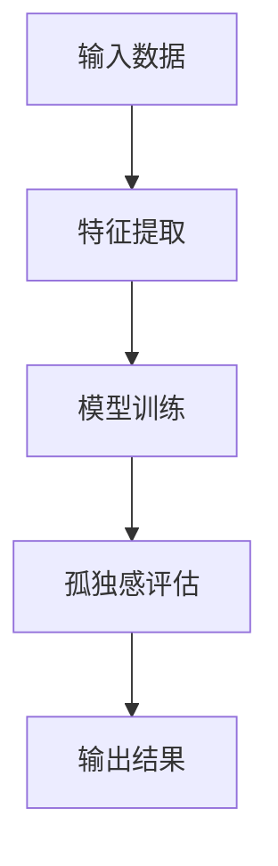
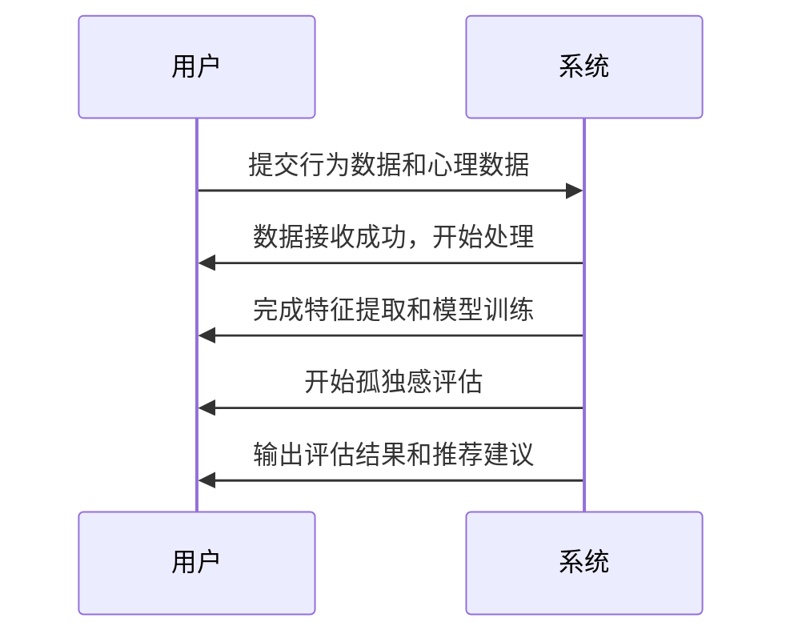

                 


# 单身生活的意义：独立与孤独之间的平衡

> 关键词：单身生活、独立、孤独、平衡、心理调适

> 摘要：本文旨在探讨单身生活的意义，特别是独立与孤独之间的平衡。通过分析独立与孤独的定义、影响因素以及应对策略，本文提出了实现单身生活平衡的方法和途径，以期为单身人士提供实用的指导和建议。

## 背景介绍

### 核心概念术语说明

- **独立**：独立是指个体在生活、思想和行为上能够自主、自主地做出决策，不受他人过多干涉或依赖。
- **孤独**：孤独是一种主观感受，个体在情感和心理上感受到与他人隔离、缺乏社交互动和支持。

### 问题背景

单身现象在现代社会中越来越普遍，根据统计数据显示，全球范围内单身人口比例逐年上升。在中国，据《中国统计年鉴》数据显示，2019年中国单身人口已超过2亿，占总人口的14.6%。单身生活的意义日益受到关注，特别是在独立与孤独之间寻求平衡成为许多单身人士面临的挑战。

### 问题描述

单身生活的意义不仅在于个人的自由和独立，还涉及心理健康和社会关系的维护。如何在这两者之间找到平衡，既享受独立带来的自由，又避免孤独感的困扰，是单身人士普遍关注的问题。

### 问题解决

本文将通过对独立与孤独的概念解析、影响因素分析以及应对策略探讨，帮助读者理解单身生活的内在逻辑，并提供实用的建议，以实现单身生活的平衡。

### 边界与外延

本文讨论的单身生活主要针对成年单身人士，不包括未成年单身和因特殊原因（如婚姻、移民等）导致的暂时单身。此外，本文关注的是心理健康层面，不涉及其他可能的单身生活方式。

### 概念结构与核心要素组成

- **独立**：核心要素包括自主决策、独立生活能力和精神独立。
- **孤独**：核心要素包括情感隔离、社交孤立和心理压力。

## 核心概念与联系

### 独立生活的内涵与价值

**定义**：独立是指个体在生活、思想和行为上能够自主、自主地做出决策，不受他人过多干涉或依赖。

**核心要素**：

1. **自主决策**：个体在面临选择时能够独立思考，做出符合自己价值观的决定。
2. **独立生活能力**：个体具备基本的生存技能，如财务管理、家务处理等，能够自立更生。
3. **精神独立**：个体在心理上能够自我安慰、自我激励，不依赖他人的认可和赞美。

**独立生活的积极影响**：

1. **增强自信心**：独立生活能够帮助个体建立自信心，提高自我评价。
2. **培养责任感**：独立生活迫使个体承担责任，促进个人成长。
3. **提高生活质量**：独立生活使个体能够更好地规划自己的生活，提高生活质量。

**独立生活的挑战与应对**：

**挑战**：

1. **孤独感**：独立生活可能导致个体在社交互动上的减少，从而产生孤独感。
2. **经济压力**：独立生活需要一定的经济支持，可能会给个体带来经济压力。

**应对策略**：

1. **培养兴趣爱好**：通过培养兴趣爱好，增加社交机会，减轻孤独感。
2. **理财规划**：制定合理的理财规划，确保经济独立。
3. **寻求专业帮助**：在面临心理压力时，寻求心理咨询师的帮助。

### 孤独感的心理学分析

**定义**：孤独是一种主观感受，个体在情感和心理上感受到与他人隔离、缺乏社交互动和支持。

**类型**：

1. **情境孤独**：由于工作、学习等环境导致社交机会减少而感到孤独。
2. **社会孤独**：由于社交技能不足或社交圈狭窄而感到孤独。
3. **情感孤独**：由于缺乏深层次的情感交流和认同感而感到孤独。

**心理学影响**：

1. **心理健康问题**：孤独感可能导致抑郁症、焦虑症等心理健康问题。
2. **生理健康问题**：长期孤独感可能影响免疫系统功能，增加患病风险。
3. **认知功能下降**：孤独感可能影响个体的认知功能，如记忆力和注意力。

**心理防御机制**：

1. **隔离**：个体通过减少社交互动来避免孤独感。
2. **合理化**：个体通过自我安慰来解释孤独感，如认为自己是“内向型”人格。
3. **寻求替代满足**：个体通过其他方式（如工作、娱乐等）来缓解孤独感。

### 核心概念与联系对比表格

| 核心概念 | 定义 | 核心要素 | 影响因素 | 应对策略 |
| --- | --- | --- | --- | --- |
| **独立** | 个体在生活、思想和行为上能够自主、自主地做出决策，不受他人过多干涉或依赖 | 1. 自主决策<br>2. 独立生活能力<br>3. 精神独立 | 1. 社交压力<br>2. 经济压力<br>3. 心理压力 | 1. 培养兴趣爱好<br>2. 理财规划<br>3. 寻求专业帮助 |
| **孤独** | 个体在情感和心理上感受到与他人隔离、缺乏社交互动和支持 | 1. 情境孤独<br>2. 社会孤独<br>3. 情感孤独 | 1. 社交技能不足<br>2. 社交圈狭窄<br>3. 深层次情感交流缺乏 | 1. 增加社交互动<br>2. 提升社交技能<br>3. 寻求心理支持 |

### ER实体关系图架构

以下是一个简化的ER实体关系图，展示了独立与孤独之间的关系：

```mermaid
erDiagram
  Independent -->|has| Loneliness : causes
  Independent ||--| relates | SocialSupport : receives
  Loneliness ||--|| affects | MentalHealth : suffers_from
  SocialSupport ||--|| contributes_to | Loneliness
```

在这个ER图中，独立与孤独之间是因果关系，独立可能导致孤独。同时，孤独又会影响心理健康，而社交支持可以缓解孤独感。

## 算法原理讲解

### 孤独感检测与评估算法

为了更好地理解孤独感的心理学影响，我们可以借助一种基于机器学习的孤独感检测与评估算法。以下是一个简化的算法流程：



### 特征提取

特征提取是算法的核心步骤，通过提取个体的行为数据（如社交互动频率、情绪表达等）和心理数据（如抑郁量表、焦虑量表等），构建一个多维度的特征向量。

```python
# 示例：提取社交互动频率特征
def extract_social_interaction_frequency(data):
    # 假设data是一个包含社交互动记录的数据集
    frequency = sum(data) / len(data)
    return frequency
```

### 模型训练

模型训练使用的是一种基于神经网络的支持向量机（SVM）模型，通过训练数据集来学习如何将特征向量映射到孤独感评估结果。

```python
# 示例：训练SVM模型
from sklearn.svm import SVC

model = SVC()
model.fit(X_train, y_train)
```

### 孤独感评估

通过训练好的模型，可以对个体的孤独感进行评估。评估结果可以帮助个体了解自己的孤独程度，从而采取相应的应对策略。

```python
# 示例：使用模型评估孤独感
def assess_loneliness(model, features):
    prediction = model.predict([features])
    return prediction[0]
```

### 算法原理讲解

孤独感检测与评估算法基于以下数学模型：

$$
\text{孤独感评分} = w_1 \cdot f_1 + w_2 \cdot f_2 + \ldots + w_n \cdot f_n
$$

其中，$f_i$ 是第 $i$ 个特征值，$w_i$ 是该特征对应的权重。通过训练数据集，我们可以学习到每个特征的权重，从而对个体进行孤独感评估。

### 举例说明

假设我们有一个个体的特征向量 $\textbf{f} = [0.8, 0.3, 0.5, 0.9]$，使用训练好的模型进行评估，得到孤独感评分为 $0.75$。这意味着该个体在当前状态下具有一定的孤独感，可能需要采取相应的应对策略。

## 系统分析与架构设计

### 问题场景介绍

在现代社会中，单身生活已经成为一种常见的现象。单身人士在追求个人独立的同时，也面临着孤独感的困扰。为了帮助单身人士实现独立与孤独的平衡，我们设计了一个基于人工智能的单身生活平衡系统。

### 系统介绍

单身生活平衡系统旨在通过智能化的方式，帮助单身人士在独立与孤独之间找到平衡点。系统的主要功能包括：

1. **孤独感检测**：通过分析个体的行为数据和心理数据，评估个体的孤独程度。
2. **社交互动推荐**：根据个体的兴趣和社交需求，推荐合适的社交活动和交友平台。
3. **心理支持**：提供在线心理咨询和支持，帮助个体应对孤独感和心理健康问题。

### 系统架构设计

单身生活平衡系统的架构设计采用模块化设计理念，分为以下四个主要模块：

1. **数据采集模块**：负责收集个体的行为数据（如社交互动记录、情绪表达等）和心理数据（如抑郁量表、焦虑量表等）。
2. **数据预处理模块**：对采集到的数据进行分析和处理，提取有用的特征信息。
3. **算法模块**：实现孤独感检测和评估算法，对个体的孤独程度进行量化评估。
4. **用户界面模块**：提供用户操作界面，展示评估结果和推荐建议。

### 系统接口设计

单身生活平衡系统的接口设计包括以下几个方面：

1. **数据接口**：用于与其他系统（如社交平台、心理咨询平台等）的数据交互。
2. **API接口**：提供对外部用户的服务接口，支持用户通过Web端或移动端使用系统功能。
3. **控制接口**：用于系统的管理和维护，包括数据备份、系统升级等。

### 系统交互设计

以下是一个简化的系统交互序列图，展示了用户与系统之间的交互流程：



### 实际案例分析与详细讲解

为了更好地说明系统在实际中的应用，以下是一个具体的案例：

**案例**：小张是一位年轻的单身程序员，他常常感到孤独，希望通过系统找到缓解孤独感的途径。

**步骤**：

1. **数据提交**：小张通过Web端向系统提交了自己的社交互动记录、情绪表达等信息。
2. **数据预处理**：系统对提交的数据进行分析和处理，提取出关键特征信息。
3. **模型训练**：系统使用训练数据集，通过SVM模型对小张的特征向量进行训练。
4. **孤独感评估**：系统对小张的孤独感进行评估，输出评估结果（如孤独感评分为0.75）。
5. **推荐建议**：系统根据评估结果，为小张推荐了合适的社交活动和交友平台。

**案例分析**：

通过这个案例，我们可以看到系统如何帮助小张在独立与孤独之间找到平衡点。首先，系统通过数据采集模块和预处理模块，准确提取了小张的关键特征信息。然后，通过算法模块，对个体的孤独感进行量化评估。最后，通过用户界面模块，将评估结果和推荐建议呈现给小张，帮助他采取有效的应对策略。

### 项目小结

单身生活平衡系统的设计旨在帮助单身人士在独立与孤独之间找到平衡点，通过数据采集、模型训练和评估推荐，为用户提供个性化的支持。在实际应用中，系统通过准确的评估和实用的推荐，帮助用户缓解孤独感，提高生活质量。然而，系统的优化和完善仍有很大的空间，如提高算法的准确性和用户界面的友好性，以更好地满足用户需求。

## 最佳实践 Tips

### 1. 确定个人目标
在追求独立与孤独的平衡时，明确个人目标至关重要。设定短期和长期目标，有助于更好地规划自己的生活，避免因迷失方向而感到孤独。

### 2. 培养兴趣爱好
兴趣爱好是缓解孤独感的重要途径。通过培养兴趣爱好，不仅可以增加社交机会，还能在独处时获得心理满足。

### 3. 保持积极心态
积极的心态有助于应对孤独感。学会自我激励，相信自己的能力，有助于提高自信心，减少孤独感的影响。

### 4. 建立有效的社交网络
社交网络是孤独感的重要缓解因素。通过参加社交活动、加入兴趣小组等方式，建立和维护良好的社交网络，有助于减少孤独感。

### 5. 学会倾诉与求助
在面对孤独感时，学会倾诉和求助至关重要。与亲朋好友交流，或寻求专业心理咨询师的帮助，都是有效的应对策略。

### 6. 保持身心健康
身心健康是独立与孤独平衡的基础。保持良好的生活习惯，如合理饮食、适量运动、充足睡眠等，有助于提高生活质量，减少孤独感。

### 7. 定期反思与调整
定期反思自己的生活方式和应对策略，有助于发现不足并进行调整。通过反思，可以更好地理解自己，找到更有效的平衡方法。

## 小结

本文通过分析独立与孤独的定义、影响因素以及应对策略，探讨了单身生活的意义以及如何实现独立与孤独之间的平衡。通过系统架构设计和实际案例分析，我们提出了一套实用的方法，帮助单身人士在独立与孤独之间找到平衡点。然而，平衡是一个持续的过程，需要单身人士不断调整和优化自己的生活方式。希望本文能为单身人士提供有益的参考和启示。

## 注意事项

### 1. 数据隐私保护
在使用单身生活平衡系统时，确保个人数据的安全和隐私。避免在公开场合分享敏感信息，确保数据传输的安全性。

### 2. 系统更新与维护
定期更新和维护系统，确保系统的稳定性和安全性。对于系统提供的评估和建议，要根据实际情况进行判断和调整。

### 3. 心理健康问题
如果孤独感严重影响到日常生活，建议寻求专业心理咨询师的帮助。孤独感可能是一种心理问题，需要专业的治疗和支持。

### 4. 社交互动平衡
在追求社交互动的同时，要注意平衡独立与社交的时间。过度社交可能导致孤独感的增加，而缺乏社交则可能影响心理健康。

### 5. 自我认知
在追求独立与孤独的平衡时，要了解自己的需求和性格。自我认知有助于更好地理解自己，找到适合自己的平衡方法。

## 拓展阅读

### 1. 《孤独六讲》- 龙应台
这是一本关于孤独心理的深刻解读，通过对孤独的探讨，帮助读者理解孤独的本质以及如何应对孤独。

### 2. 《独立宣言》- 托马斯·杰斐逊
这是一篇历史性的文献，阐述了独立的意义和价值。虽然不是关于单身生活的专门著作，但其中关于独立精神的阐述对单身人士具有启示作用。

### 3. 《社交心理学》- 大卫·迈尔斯
这是一本关于社交心理学的权威著作，详细介绍了社交行为、社交心理效应以及社交技巧。对于希望改善社交技能的单身人士，这本书提供了丰富的知识。

### 4. 《单身生活指南》- 玛丽莲·沃斯
这是一本专门为单身人士撰写的指南，提供了关于单身生活的实用建议和策略。书中涵盖了情感、社交、生活规划等多个方面，对单身人士具有很高的参考价值。

## 作者信息

作者：AI天才研究院/AI Genius Institute & 禅与计算机程序设计艺术 /Zen And The Art of Computer Programming

