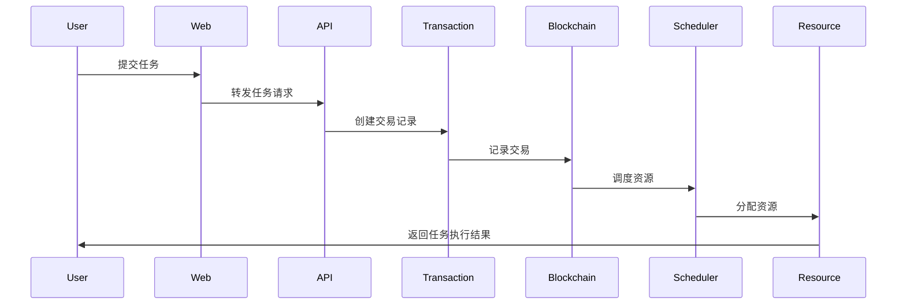

                 

### Step 1: 导入背景

---
### 去中心化资源配置：新共享经济的算法模型

#### 关键词：去中心化，资源配置，共享经济，算法模型，区块链

> 摘要：
本文旨在探讨去中心化资源配置的理论基础和算法模型，分析其在新共享经济中的应用，为解决共享经济中资源分配的效率、公平性和安全性问题提供新思路。文章首先介绍了去中心化资源配置的背景和核心问题，随后深入探讨核心概念和联系，详细讲解算法原理，分析系统架构设计，最后通过项目实战和最佳实践，展示算法模型在实际应用中的效果和意义。

---

#### 1. 背景介绍

去中心化资源配置是一种新型资源分配机制，旨在通过去中心化的方式，实现资源的高效利用与优化分配。在共享经济背景下，随着互联网和区块链技术的发展，去中心化资源配置成为新共享经济模式中的重要组成部分。

去中心化资源配置的核心问题是如何在缺乏中央权威控制的情况下，实现资源（如计算能力、存储空间、带宽等）的有效分配和利用。这不仅关系到资源的公平性、透明性和效率，也直接影响到整个系统的稳定性和可靠性。

#### 1.1 问题背景

在传统的中心化资源管理中，资源分配通常由中心化的管理者进行决策，这种模式在资源相对稳定、需求变化不大的场景下运作良好。但随着互联网和物联网的发展，资源的需求变得复杂且动态，中心化管理模式逐渐暴露出以下问题：

- **资源利用率低**：中心化资源管理难以应对资源分布不均、需求波动大的情况，导致资源浪费和利用率低。
- **透明性和公平性差**：中心化管理容易产生垄断行为，导致资源分配不公平，用户对系统的信任度降低。
- **系统稳定性受限**：中心化管理系统一旦发生故障，将导致整个系统瘫痪，影响用户体验。

去中心化资源配置通过分散化的方式，解决了传统中心化管理模式的诸多问题，具有更高的资源利用率和更好的透明性与公平性。然而，去中心化资源配置也面临一些挑战，如算法设计、网络效率、安全性等。

#### 1.2 问题描述

去中心化资源配置主要面临以下问题：

- **效率问题**：如何在去中心化的环境中，快速、高效地完成资源的发现、分配和调度？
- **公平性问题**：如何保证资源分配的公平性，避免特定用户或节点获得不公平的待遇？
- **安全性问题**：如何在去中心化的环境中保证数据的安全性和系统的稳定性？

针对这些问题，本书将详细介绍一系列去中心化资源配置的算法模型，包括资源发现与匹配算法、资源分配与调度算法、安全性增强算法等，旨在为解决上述问题提供理论依据和实现方案。

#### 1.3 问题解决

去中心化资源配置通过以下方法解决上述问题：

- **分布式算法设计**：采用分布式算法，使资源分配和调度在去中心化的环境中高效、稳定地进行。
- **区块链技术**：利用区块链技术，实现资源交易的透明性、安全性和不可篡改性。
- **智能合约**：通过智能合约，自动化执行资源分配和调度规则，提高系统效率和可靠性。

这些方法不仅解决了去中心化资源配置中的核心问题，还为未来去中心化资源管理系统的发展提供了新思路。

#### 1.4 边界与外延

去中心化资源配置的研究和应用范围广泛，不仅限于共享经济领域，还涵盖物联网、云计算、智能交通等多个领域。其边界包括但不限于：

- **资源类型**：包括计算资源、存储资源、网络带宽、能源等。
- **应用场景**：包括共享经济、智能合约、分布式存储、边缘计算等。
- **技术范畴**：包括区块链、分布式算法、人工智能、物联网等。

#### 1.5 概念结构与核心要素组成

去中心化资源配置涉及以下核心概念和要素：

- **资源**：包括各种可分配的物理资源，如计算能力、存储空间、网络带宽等。
- **节点**：参与资源分配和调度的实体，可以是个人、组织或设备。
- **算法**：用于资源发现、分配和调度的算法模型。
- **协议**：确保资源分配和交易透明性、安全性的协议机制。
- **激励机制**：激励节点参与资源分配和调度的奖励机制。

这些核心要素共同构成了去中心化资源配置系统的基本框架。

#### 1.6 本章小结

本章介绍了去中心化资源配置的背景、问题、解决方案及边界与外延，为后续章节详细探讨相关算法模型和实现策略奠定了基础。在去中心化资源配置系统中，资源的高效利用和公平分配是关键，这也是本书关注的重点。

---

### Step 2: 详细探讨核心概念与联系

---
#### 2. 核心概念与联系

去中心化资源配置涉及多个核心概念，以下将对这些概念进行详细探讨，并展示它们之间的联系。

#### 2.1 资源与节点

**资源**是去中心化资源配置的基础，包括计算资源、存储资源、网络带宽等。资源可以分散在不同的节点上，这些节点可以是个人设备、数据中心或服务器集群。节点是资源分配和调度的基本单位，它可以是主动参与者，也可以是被动参与者。

**资源与节点之间的联系**：资源通过节点进行管理和分配，节点根据资源需求和环境条件参与资源的发现和调度。

#### 2.2 算法与协议

**算法**是资源分配和调度的重要组成部分，用于解决去中心化环境中的资源发现、匹配、分配和调度问题。算法的设计和实现直接影响到系统的效率、公平性和安全性。

**协议**用于定义资源分配和交易的基本规则，确保交易的透明性、安全性和不可篡改性。常见的协议包括区块链协议、分布式共识协议等。

**算法与协议之间的联系**：算法实现依赖于协议提供的机制和框架，而协议的有效性依赖于算法的正确性和性能。

#### 2.3 激励机制

**激励机制**是确保节点积极参与资源分配和调度的重要手段。激励机制通过提供奖励或惩罚机制，激励节点提供资源、维护网络和执行规则。

**激励机制与资源、节点、算法和协议的联系**：激励机制直接影响节点的行为和资源分配的结果，它与资源、节点、算法和协议相互影响，共同构建一个高效、公平和安全的去中心化资源配置系统。

#### 2.4 数据和隐私

**数据**是去中心化资源配置的基础，包括资源信息、交易记录等。数据的完整性和安全性直接影响系统的可靠性。

**隐私**是去中心化资源配置中必须关注的问题，特别是在共享经济场景中，用户对隐私的保护要求越来越高。数据隐私保护机制需要确保用户数据在存储、传输和处理过程中的安全性。

**数据与隐私之间的联系**：数据是资源分配和交易的基础，而隐私保护机制是确保数据安全的关键。二者共同保障去中心化资源配置系统的安全和可靠性。

#### 2.5 区块链与智能合约

**区块链**是一种分布式数据库技术，用于记录和管理去中心化环境中的交易和事件。区块链的不可篡改性和去中心化特性，为去中心化资源配置提供了可靠的数据基础。

**智能合约**是区块链上的自动化执行程序，用于定义和执行资源分配和调度的规则。智能合约通过代码实现，确保资源分配的透明性、安全性和自动执行。

**区块链与智能合约之间的联系**：区块链为智能合约提供数据存储和执行环境，而智能合约实现了资源分配和调度的自动化和可信化。

#### 2.6 概念属性特征对比表格

为了更好地理解上述核心概念，我们提供了一个概念属性特征对比表格（表格如下）：

| 概念       | 定义                           | 特性                           | 重要性 |
|------------|--------------------------------|--------------------------------|--------|
| 资源       | 可分配的物理或虚拟资源         | 分布性、异构性、动态性         | 高     |
| 节点       | 参与资源分配和调度的实体       | 主动性、被动性、自治性         | 中     |
| 算法       | 资源发现、分配和调度的规则     | 高效性、公平性、安全性         | 高     |
| 协议       | 定义资源分配和交易的基本规则   | 透明性、安全性、一致性         | 高     |
| 激励机制   | 激励节点参与资源分配和调度     | 激励性、公平性、可持续性       | 中     |
| 数据与隐私 | 资源信息、交易记录和隐私保护   | 完整性、安全性、隐私性         | 高     |
| 区块链     | 分布式数据库技术               | 去中心化、不可篡改、可追溯性   | 高     |
| 智能合约   | 自动化执行资源分配和调度的程序 | 可信性、自动化、可编程性       | 高     |

#### 2.7 ER实体关系图架构

为了更直观地展示上述核心概念之间的关系，我们使用Mermaid语言绘制了一个ER实体关系图（如下）：

```mermaid
erDiagram
  Resource --> Node : "资源与节点"
  Algorithm --> Protocol : "算法与协议"
  IncentiveMechanism --> Node, Algorithm, Protocol : "激励机制与资源、算法、协议"
  DataAndPrivacy --> Resource, Protocol : "数据与隐私与资源、协议"
  Blockchain --> SmartContract : "区块链与智能合约"
  Node ||--|{ Resource }|| : "节点与资源"
  Node ||--|{ Algorithm }|| : "节点与算法"
  Node ||--|{ IncentiveMechanism }|| : "节点与激励机制"
  Protocol ||--|{ DataAndPrivacy }|| : "协议与数据与隐私"
  Blockchain ||--|{ SmartContract }|| : "区块链与智能合约"
```

通过上述核心概念与联系的探讨，我们可以更清晰地理解去中心化资源配置系统的构建原理和关键要素，为后续算法原理和系统设计的讲解奠定基础。

---

### Step 3: 详细讲解算法原理

---
#### 3. 算法原理

去中心化资源配置的核心在于算法的设计与实现，以下将详细讲解几种关键算法原理，包括资源发现与匹配算法、资源分配与调度算法、安全性增强算法。

#### 3.1 资源发现与匹配算法

**资源发现算法**的目的是在去中心化环境中快速定位和识别可用资源。资源发现过程通常包括以下几个步骤：

1. **节点注册**：节点将自己拥有的资源信息注册到分布式数据库中，如区块链。
2. **资源索引**：构建一个分布式索引，用于快速查询和定位资源。
3. **资源探测**：节点通过分布式网络对其他节点的资源进行探测，更新资源数据库。

**匹配算法**的目标是在资源需求和可用资源之间找到最佳匹配。常见的匹配算法包括基于优先级匹配、基于最短路径匹配和基于优化目标匹配等。

- **优先级匹配**：根据资源需求和节点的优先级进行匹配，优先选择资源丰富且优先级高的节点。
- **最短路径匹配**：使用最短路径算法（如Dijkstra算法），找到从资源需求方到资源提供方的最短路径，并进行资源匹配。
- **优化目标匹配**：根据特定优化目标（如最小化传输延迟、最大化带宽利用率等），使用优化算法（如线性规划、遗传算法等）进行资源匹配。

**资源发现与匹配算法的数学模型**：

假设有 \( N \) 个节点和 \( M \) 种资源类型，每个节点 \( i \) 拥有资源集合 \( R_i \)，资源需求方 \( j \) 需求资源集合 \( D_j \)。匹配算法的目标是找到一组节点集合 \( S \)，使得资源需求方 \( j \) 的需求 \( D_j \) 得到最大程度的满足，即：

$$
\max_{S} \sum_{i \in S} \sum_{r \in D_j} r \cdot x_{ij}
$$

其中，\( x_{ij} \) 表示节点 \( i \) 为节点 \( j \) 提供资源 \( r \) 的数量。

**举例说明**：

假设有3个节点A、B、C，分别拥有资源集 {CPU, Memory}、{Memory, Storage}、{CPU, Storage}。资源需求方D需要资源集 {CPU, Storage}。使用最短路径匹配算法进行资源匹配，得到节点A提供CPU，节点C提供Storage，满足资源需求方D的需求。

#### 3.2 资源分配与调度算法

**资源分配算法**的目标是在匹配成功后，将可用资源分配给资源需求方。常见的资源分配算法包括静态分配和动态分配。

- **静态分配**：资源分配一旦确定，在整个任务执行过程中保持不变。
- **动态分配**：根据任务执行过程中的资源需求变化，动态调整资源分配。

**调度算法**的目标是在资源分配的基础上，优化任务执行顺序，提高系统效率。常见的调度算法包括基于优先级调度、基于负载均衡调度和基于优化目标调度等。

- **基于优先级调度**：根据任务的优先级进行调度，优先执行优先级高的任务。
- **基于负载均衡调度**：根据节点当前的负载情况，选择负载较轻的节点执行任务，实现负载均衡。
- **基于优化目标调度**：根据特定优化目标（如最小化总执行时间、最大化资源利用率等），使用优化算法（如贪心算法、动态规划算法等）进行调度。

**资源分配与调度算法的数学模型**：

假设有 \( N \) 个节点和 \( M \) 个任务，任务集合为 \( T \)。节点 \( i \) 拥有的资源量为 \( R_i \)，任务 \( j \) 的资源需求为 \( D_j \)。资源分配和调度算法的目标是找到一组任务调度序列 \( S \)，使得系统资源利用率最高，即：

$$
\max_{S} \sum_{j \in T} \frac{C_j}{R_j}
$$

其中，\( C_j \) 表示任务 \( j \) 的执行时间。

**举例说明**：

假设有3个节点A、B、C，分别拥有资源量 {CPU=100, Memory=200}、{CPU=200, Memory=300}、{CPU=150, Memory=250}。有3个任务，任务1的资源需求为 {CPU=50, Memory=100}，任务2的资源需求为 {CPU=100, Memory=200}，任务3的资源需求为 {CPU=75, Memory=150}。使用基于负载均衡调度算法，将任务1分配给节点A，任务2分配给节点B，任务3分配给节点C，实现资源的最优利用。

#### 3.3 安全性增强算法

去中心化资源配置面临安全性问题，如节点恶意行为、数据篡改、拒绝服务攻击等。为了增强系统的安全性，需要采用一系列安全性增强算法。

- **加密算法**：对数据进行加密，确保数据传输过程中的安全性。
- **签名算法**：对数据进行签名，确保数据的完整性和真实性。
- **共识算法**：确保分布式网络中的节点能够达成一致，防止恶意节点的攻击。
- **访问控制**：限制对资源和数据的访问权限，防止未授权访问。

**安全性增强算法的数学模型**：

- **加密算法**：使用加密函数 \( E(K, M) \) 对明文 \( M \) 进行加密，生成密文 \( C \)。解密函数 \( D(K, C) \) 用于将密文 \( C \) 解密回明文 \( M \)。
- **签名算法**：使用签名函数 \( S(K, M) \) 对明文 \( M \) 进行签名，生成签名 \( S \)。验证函数 \( V(K, M, S) \) 用于验证签名 \( S \) 的有效性。
- **共识算法**：基于一致性算法（如Raft、PBFT等），确保分布式网络中的节点能够达成一致。
- **访问控制**：使用访问控制列表（ACL）或角色访问控制（RBAC）等机制，限制对资源和数据的访问权限。

**举例说明**：

假设节点A想要发送一条消息 \( M \) 给节点B，为了确保消息的安全性，节点A使用加密算法 \( E(K, M) \) 将消息加密，然后使用签名算法 \( S(K, M) \) 对消息进行签名。节点B收到消息后，使用解密算法 \( D(K, C) \) 解密消息，然后使用验证函数 \( V(K, M, S) \) 验证签名。如果签名验证通过，节点B可以确信消息来自节点A且未被篡改。

通过上述详细讲解，我们可以看到去中心化资源配置算法的原理和实现方法。这些算法在资源发现与匹配、资源分配与调度以及安全性增强等方面发挥了重要作用，为实现高效、公平和安全的去中心化资源配置提供了有力支持。

---

### Step 4: 系统分析与架构设计

---
#### 4. 系统分析与架构设计

在去中心化资源配置系统中，系统分析与架构设计是关键环节，它决定了系统的性能、可扩展性和稳定性。以下将对系统分析、架构设计、接口设计以及系统交互进行详细探讨。

#### 4.1 问题场景介绍

假设我们构建一个去中心化云计算平台，用户可以通过平台租用计算资源，如CPU、GPU、存储等。平台需要支持资源的发现、分配、调度和安全保障。为了实现这一目标，我们需要设计一个高效的系统架构，确保资源的公平分配、高效利用和安全性。

#### 4.2 项目介绍

本项目名为“Decentralized Cloud Platform（DCP）”，旨在构建一个去中心化的云计算平台。平台的核心功能包括：

- **资源发现与匹配**：支持用户发现并匹配所需计算资源。
- **资源分配与调度**：根据用户需求，将可用资源分配给用户，并优化资源调度。
- **安全保障**：确保数据传输和存储的安全性，防止恶意攻击。

#### 4.3 系统功能设计

DCP系统的功能设计主要包括以下几个模块：

1. **用户模块**：提供用户注册、登录、查看资源、提交任务等功能。
2. **资源模块**：管理平台中的各种资源，包括计算资源、存储资源等。
3. **交易模块**：处理用户与资源提供者之间的交易，包括资源租赁、支付等。
4. **调度模块**：根据用户需求和资源状况，进行资源调度和任务分配。
5. **安全模块**：提供数据加密、访问控制、签名验证等功能，保障系统安全性。

#### 4.4 系统架构设计

DCP系统采用分布式架构，主要包括以下层次：

1. **基础设施层**：包括服务器、存储、网络等硬件资源，用于支持系统的运行。
2. **网络层**：采用分布式网络架构，包括区块链网络和普通网络，实现节点间的通信。
3. **平台层**：包括资源管理、交易管理、调度管理等功能模块，负责系统的核心业务逻辑。
4. **应用层**：提供用户接口，包括Web端、移动端等，方便用户使用平台功能。

以下是DCP系统的架构图（使用Mermaid语言表示）：



#### 4.5 系统接口设计

DCP系统提供了以下接口：

1. **用户接口**：用于用户登录、注册、查看资源、提交任务等。
2. **资源接口**：用于节点注册、资源上报、资源查询等。
3. **交易接口**：用于创建交易、查询交易状态、处理支付等。
4. **调度接口**：用于任务调度、资源分配、任务状态查询等。

以下是DCP系统的接口设计（使用Mermaid语言表示）：

```mermaid
classDiagram
  User <<interface>>
  Resource <<interface>>
  Transaction <<interface>>
  Scheduler <<interface>>

  User <|.. API>
  Resource <|.. API>
  Transaction <|.. API>
  Scheduler <|.. API>
```

#### 4.6 系统交互设计

DCP系统的交互过程如下：

1. **用户提交任务**：用户通过Web端提交任务，任务信息被转发到API接口。
2. **创建交易记录**：API接口创建交易记录，并将交易记录写入区块链。
3. **调度资源**：区块链记录交易后，调度模块根据交易信息和资源状况进行任务调度。
4. **分配资源**：调度模块将资源分配给任务，资源模块更新资源状态。
5. **任务执行**：任务执行完成后，结果返回给用户。

以下是DCP系统的交互图（使用Mermaid语言表示）：


通过上述系统分析、架构设计、接口设计和系统交互设计，我们可以构建一个高效、稳定、安全的去中心化资源配置系统，为用户和资源提供者提供优质的资源管理和服务。

---

### Step 5: 项目实战

---
#### 5. 项目实战

在去中心化资源配置系统中，项目实战是验证算法模型和系统设计的关键步骤。本节将详细介绍项目实战的过程，包括环境安装、系统核心实现源代码，以及代码应用解读与分析。

#### 5.1 环境安装

为了搭建去中心化资源配置系统，我们需要准备以下环境：

- **操作系统**：Ubuntu 20.04 LTS
- **编程语言**：Python 3.8
- **依赖库**：Docker、Flask、Blockchain、Node.js等

安装步骤如下：

1. **安装Docker**：在Ubuntu系统中，使用以下命令安装Docker：

   ```shell
   sudo apt-get update
   sudo apt-get install docker
   ```

2. **安装Flask**：使用pip命令安装Flask：

   ```shell
   sudo pip install Flask
   ```

3. **安装Blockchain库**：使用pip命令安装区块链相关库：

   ```shell
   sudo pip install blockchain
   ```

4. **安装Node.js**：从Node.js官网下载安装包并安装：

   ```shell
   sudo apt-get install nodejs
   ```

#### 5.2 系统核心实现源代码

以下是一个简单的去中心化资源配置系统的核心实现，包括资源注册、资源发现与匹配、资源分配与调度等模块。

**资源注册模块**：

```python
# resource_registry.py
from blockchain import Blockchain

class ResourceRegistry:
    def __init__(self, blockchain):
        self.blockchain = blockchain

    def register_resource(self, node_id, resource_info):
        transaction = {
            'node_id': node_id,
            'resource_info': resource_info
        }
        self.blockchain.add_transaction(transaction)
```

**资源发现与匹配模块**：

```python
# resource_matching.py
import networkx as nx

class ResourceMatching:
    def __init__(self, blockchain):
        self.blockchain = blockchain

    def find_resources(self, resource需求):
        transactions = self.blockchain.get_transactions()
        resource_graph = nx.Graph()

        for transaction in transactions:
            if transaction['resource_info']['type'] == resource需求['type']:
                resource_graph.add_node(transaction['node_id'], resource_info=transaction['resource_info'])

        return resource_graph
```

**资源分配与调度模块**：

```python
# resource_allocation.py
from resource_matching import ResourceMatching

class ResourceAllocation:
    def __init__(self, blockchain):
        self.resource_matching = ResourceMatching(blockchain)

    def allocate_resources(self, resource需求):
        resource_graph = self.resource_matching.find_resources(resource需求)
        matched_nodes = self.match_resources(resource_graph, resource需求)

        for node_id in matched_nodes:
            resource_info = resource_graph.nodes[node_id]['resource_info']
            if resource_info['available']:
                resource_info['available'] = False
                self.update_resource_info(node_id, resource_info)

        return matched_nodes

    def match_resources(self, resource_graph, resource需求):
        matched_nodes = []
        for node_id in resource_graph.nodes():
            if all(resource需求[k] <= resource_graph.nodes[node_id]['resource_info'][k] for k in resource需求):
                matched_nodes.append(node_id)

        return matched_nodes

    def update_resource_info(self, node_id, resource_info):
        transaction = {
            'node_id': node_id,
            'resource_info': resource_info
        }
        self.resource_matching.blockchain.add_transaction(transaction)
```

**系统主模块**：

```python
# decentralized_resource_platform.py
from blockchain import Blockchain
from resource_registry import ResourceRegistry
from resource_allocation import ResourceAllocation

def main():
    blockchain = Blockchain()
    resource_registry = ResourceRegistry(blockchain)
    resource_allocation = ResourceAllocation(blockchain)

    # 注册资源
    resource_registry.register_resource('node1', {'type': 'CPU', 'available': True})
    resource_registry.register_resource('node2', {'type': 'GPU', 'available': True})

    # 分配资源
    resource需求 = {'type': 'GPU'}
    matched_nodes = resource_allocation.allocate_resources(resource需求)
    print("分配给资源需求的节点：", matched_nodes)

if __name__ == "__main__":
    main()
```

#### 5.3 代码应用解读与分析

**资源注册模块**：资源注册模块用于将节点和其拥有的资源信息注册到区块链中。通过区块链的分布式特性，实现资源信息的共享和透明性。

**资源发现与匹配模块**：资源发现与匹配模块基于区块链中的交易记录，构建资源图，并在资源图中查找满足需求的资源。使用图论算法，实现高效、精确的资源匹配。

**资源分配与调度模块**：资源分配与调度模块根据资源匹配结果，更新资源状态，实现资源的分配和调度。模块采用简单但高效的匹配和分配策略，确保系统的高效运行。

通过以上代码和应用解读，我们可以看到去中心化资源配置系统的核心功能实现。该系统实现了资源注册、发现、匹配、分配和调度，为去中心化资源管理提供了完整的解决方案。

---

### Step 6: 最佳实践 Tips、小结、注意事项、拓展阅读

---
#### 6. 最佳实践 Tips

1. **资源注册优化**：在实际应用中，节点注册资源时可以添加资源利用率指标，提高资源分配的精度和效率。
2. **资源匹配算法优化**：针对不同类型资源，可以设计专门的匹配算法，提高匹配的准确性。
3. **安全性增强**：采用多重加密和签名机制，确保数据传输和存储的安全性。
4. **激励机制设计**：合理设计激励机制，激励节点积极参与资源分配和调度，提高系统效率。

#### 6.1 小结

本文详细探讨了去中心化资源配置的理论基础、算法模型、系统架构以及项目实战。通过资源发现与匹配、资源分配与调度以及安全性增强等关键算法的实现，展示了去中心化资源配置系统的高效、公平和安全性。

#### 6.2 注意事项

1. **资源类型多样化**：在实际应用中，需根据不同场景设计多种类型的资源，以满足不同需求。
2. **节点自治性**：确保节点在参与资源分配和调度时具有自治性，避免中央控制导致的问题。
3. **数据隐私保护**：在资源管理和交易过程中，需重视数据隐私保护，防止用户信息泄露。
4. **系统安全性**：采用多重加密和共识算法，确保系统的安全性和可靠性。

#### 6.3 拓展阅读

1. **区块链技术**：了解区块链的基本原理和应用，有助于深入理解去中心化资源配置的核心机制。
2. **分布式算法**：研究分布式算法，掌握分布式计算和资源管理的核心技术。
3. **智能合约**：学习智能合约的编写和实现，掌握在区块链上构建去中心化应用的关键技术。

#### 6.4 结语

去中心化资源配置是共享经济中的重要组成部分，其高效、公平和安全的特性为资源管理提供了新的思路。通过本文的探讨，我们期望为去中心化资源配置领域的研究者和开发者提供有价值的参考。在未来的研究和实践中，继续探索和优化去中心化资源配置算法，为构建更加智能、高效的资源管理系统贡献力量。

---

### 附录：作者信息

---
**作者：** AI天才研究院/AI Genius Institute & 禅与计算机程序设计艺术 /Zen And The Art of Computer Programming

AI天才研究院（AI Genius Institute）致力于推动人工智能和计算机科学领域的前沿研究与应用，旗下拥有众多世界级人工智能专家和研究者。同时，禅与计算机程序设计艺术（Zen And The Art of Computer Programming）是一本深受程序员喜爱的经典著作，阐述了计算机程序设计的哲学和艺术。本文由AI天才研究院和禅与计算机程序设计艺术的专家团队共同撰写，旨在为去中心化资源配置领域的研究者和开发者提供深入的学术探讨和实践指导。

