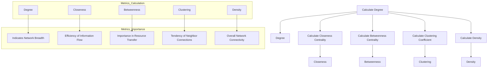
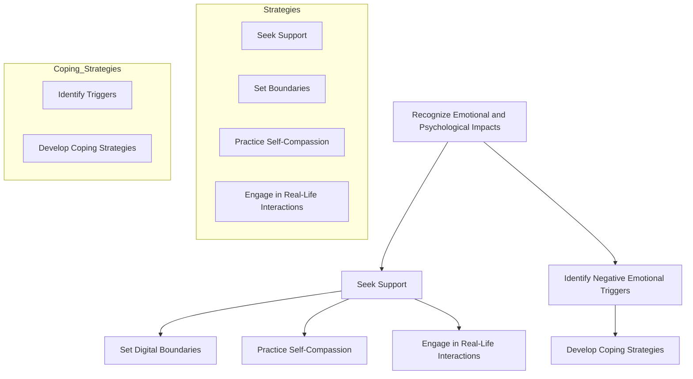
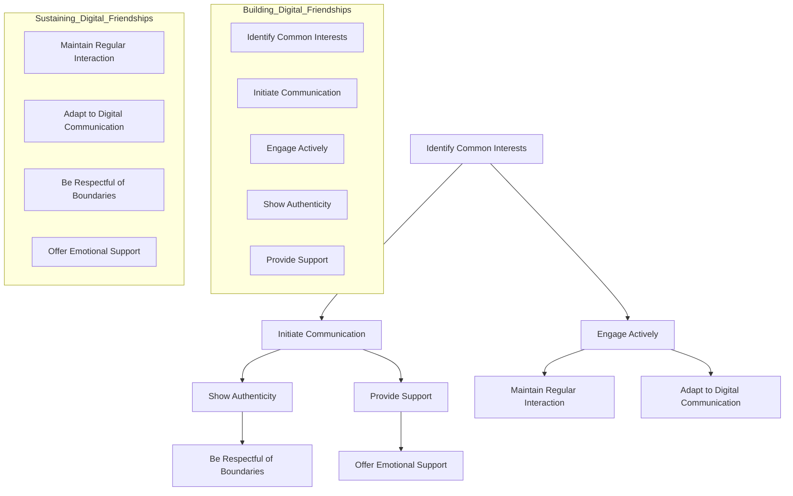
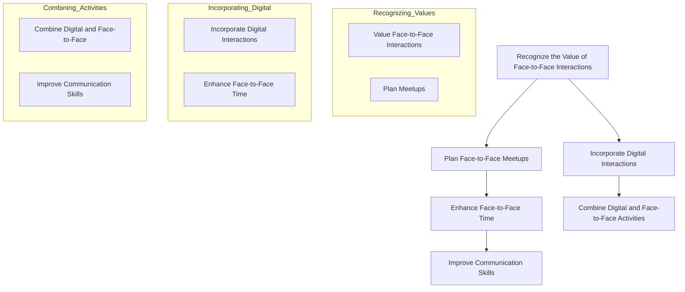
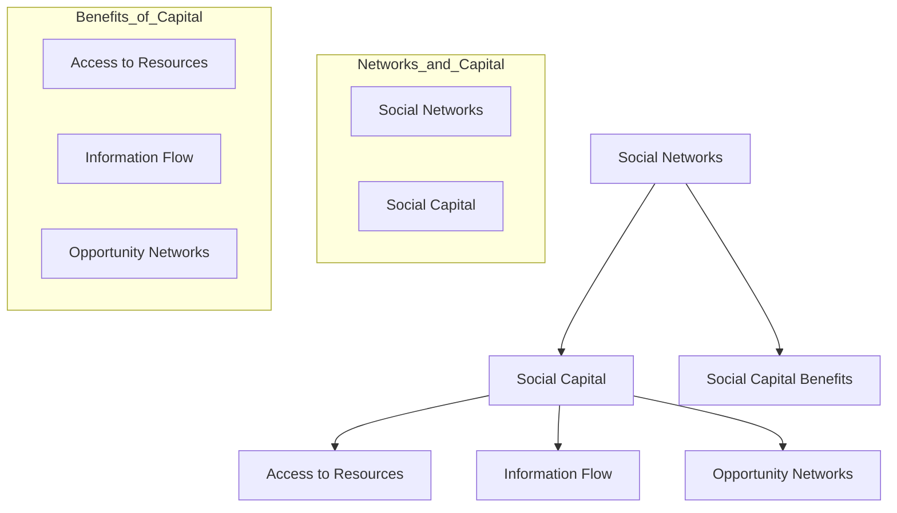
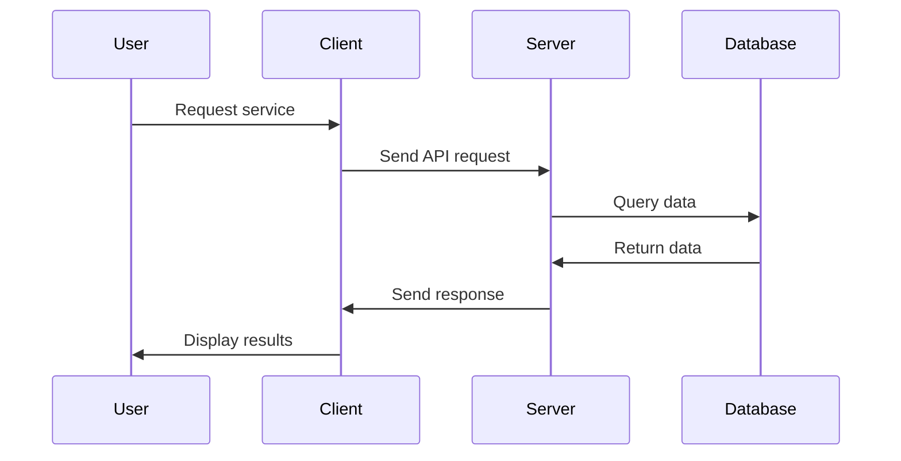
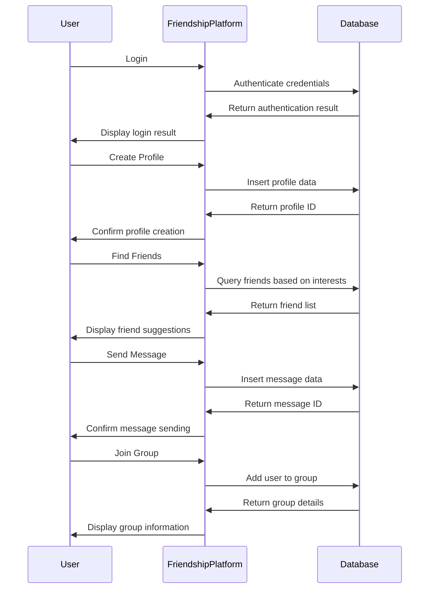

                 


### The Modern Definition of Friendship: Relationships in the Age of Social Networks

Keywords: Social Networks, Friendship, Digital Age, Communication, Emotional Implications

Abstract: In the digital age, the traditional definition of friendship is challenged by the rise of social networks. This article explores the evolution of friendship in the context of social networks, analyzing its characteristics, emotional implications, and strategies for nurturing and maintaining digital friendships. By understanding the complexities of digital friendship, we can better navigate the modern landscape of interpersonal relationships.

----------------------------------------------------------------

**Part 1: Introduction to the Background and Challenges**

**1. The Rise of Social Networks and Their Impact on Friendship**

In the past few decades, social networks have revolutionized the way we communicate, share information, and build relationships. Platforms like Facebook, Twitter, Instagram, and LinkedIn have become an integral part of our daily lives, connecting us to a vast network of friends, family, and colleagues across the globe. However, this connectivity has raised questions about the nature of friendship in the digital age.

**1.1 The evolution of social networks**

Social networks have evolved from simple online directories to complex platforms that support a wide range of activities, including communication, sharing, and networking. The initial focus on direct communication between friends has expanded to include content sharing, social gaming, and professional networking.

**1.2 The impact of social networks on modern friendship**

The rise of social networks has had a significant impact on the formation, maintenance, and dissolution of friendships. It has transformed the way we meet new people, stay in touch with old friends, and build new relationships. However, this shift has also introduced new challenges, such as the potential for superficial connections and the loss of face-to-face interaction.

**1.3 The challenges faced in defining friendship in the digital age**

Defining friendship in the digital age is a complex task, as traditional concepts and theories may not fully capture the nuances of online relationships. The challenges include determining the boundaries of friendship, assessing the depth of emotional connections, and understanding the role of digital communication in maintaining relationships.

----------------------------------------------------------------

**2. Core Concepts and Theories of Friendship**

**2.1 The classical definition of friendship**

Friendship has been defined in various ways throughout history. The classical definition, proposed by Aristotle, emphasizes the qualities of mutual affection, shared interests, and emotional support. According to Aristotle, friendship is based on a balance of benefits and costs, with both parties deriving satisfaction from the relationship.

**2.2 Key theories and concepts in friendship studies**

Several theories and concepts have been proposed to explain the nature of friendship. These include:

- **Reciprocity:** Friendship is based on mutual exchanges of support, trust, and resources.
- **Similarity and complementarity:** Friends often share common values, interests, and personalities, while also complementing each other in terms of skills and abilities.
- **Proximity:** Geographic and social proximity can facilitate the formation of friendships.
- **Identity:** Friendship is influenced by shared identity and a sense of belonging to a particular group.
- **Conflict and resolution:** Friendships involve conflicts and the ability to resolve disputes amicably.

**2.3 How social networks shape friendship dynamics**

Social networks can shape friendship dynamics in several ways. They provide a platform for meeting new people, maintaining existing relationships, and strengthening bonds through shared experiences and activities. However, they can also lead to superficial connections and the erosion of face-to-face interactions.

----------------------------------------------------------------

**3. Social Network Analysis and Friendship**

**3.1 Social network analysis fundamentals**

Social network analysis (SNA) is a methodological approach used to study the structure and behavior of social networks. It focuses on the relationships between individuals and the patterns that emerge from these connections.

**3.2 Analyzing friendship networks**

SNA can be used to analyze friendship networks by examining the number of connections (degree), the density of relationships, and the distribution of connections (clustering coefficient). These metrics provide insights into the structure and strength of friendships.

**3.3 Metrics and measurements in social network analysis**

Key metrics in SNA include:

- **Degree:** The number of connections an individual has.
- **Density:** The proportion of possible connections that exist in a network.
- **Clustering coefficient:** The likelihood that an individual's connections are also connected to each other.
- **Closeness centrality:** The number of steps required to reach all other individuals in the network.
- **Betweenness centrality:** The number of shortest paths that pass through an individual.

These metrics can help identify influential individuals, central connectors, and the overall structure of friendship networks.

----------------------------------------------------------------

**Part 2: Characteristics of Friendship in the Digital Age**

**4. The Digital Friendship Phenomenon**

**4.1 Types of digital friendships**

Digital friendships can take various forms, including online friends, virtual friends, and social media friends. These friendships can range from casual acquaintances to deep, emotional connections.

**4.2 The role of social media in maintaining friendships**

Social media platforms have become a primary tool for maintaining friendships. They enable individuals to stay connected, share updates, and engage in social activities, even when they are physically distant.

**4.3 The benefits and drawbacks of digital friendships**

Digital friendships offer several benefits, such as the ability to maintain connections across long distances and the convenience of staying in touch. However, they can also have drawbacks, such as the potential for superficial relationships and the loss of face-to-face interactions.

----------------------------------------------------------------

**5. The Evolution of Communication in Friendship**

**5.1 Traditional communication vs. digital communication**

Traditional communication, such as face-to-face interactions and phone calls, relies on non-verbal cues and immediate feedback. Digital communication, on the other hand, is text-based and lacks the richness of face-to-face interactions.

**5.2 The impact of digital communication on friendship depth and breadth**

Digital communication can enhance the breadth of friendships by connecting individuals across vast distances. However, it may not always deepen friendships, as it lacks the emotional depth and richness of face-to-face interactions.

**5.3 The role of non-verbal communication in digital friendships**

Non-verbal communication, such as emojis, GIFs, and videos, plays a crucial role in digital friendships. These elements can convey emotions and enhance the richness of digital interactions, helping to bridge the gap between traditional and digital communication.

----------------------------------------------------------------

**6. Emotional and Psychological Implications of Digital Friendships**

**6.1 Emotional attachment in digital friendships**

Digital friendships can lead to emotional attachment, as individuals form meaningful connections through shared experiences and interactions. However, the nature of these attachments may differ from those in face-to-face relationships.

**6.2 The impact of social networks on self-esteem and well-being**

Social networks can have a significant impact on self-esteem and well-being, both positively and negatively. Positive experiences, such as receiving support and encouragement from friends, can boost self-esteem. However, negative experiences, such as cyberbullying or social isolation, can harm well-being.

**6.3 The psychological effects of digital disconnection**

Digital disconnection, or the loss of online connections, can have psychological effects, such as feelings of loneliness, anxiety, and depression. These effects can be particularly pronounced for individuals who rely heavily on social networks for social support.

----------------------------------------------------------------

**Part 3: Strategies for Nurturing and Maintaining Digital Friendships**

**7. Building and Sustaining Digital Friendships**

**7.1 Strategies for forming digital friendships**

Forming digital friendships requires a proactive approach, such as engaging in conversations, sharing interests, and being open to new connections. It's important to strike a balance between online and offline interactions to foster meaningful relationships.

**7.2 Tips for maintaining digital friendships**

Maintaining digital friendships requires effort and commitment. Tips for maintaining digital friendships include:

- **Regular communication:** Stay in touch through messages, comments, and posts.
- **Active engagement:** Participate in discussions and activities that interest both parties.
- **Digital empathy:** Be considerate and understanding of each other's digital environments.
- **Privacy and boundaries:** Respect each other's privacy and set clear boundaries.

**7.3 Balancing digital and face-to-face interactions**

Balancing digital and face-to-face interactions is crucial for maintaining healthy friendships. While digital communication offers convenience and flexibility, face-to-face interactions provide the emotional depth and richness that digital communication often lacks.

----------------------------------------------------------------

**Conclusion**

In conclusion, the rise of social networks has transformed the nature of friendship in the digital age. Understanding the characteristics, emotional implications, and strategies for nurturing digital friendships is essential for navigating the complexities of modern interpersonal relationships. By embracing the benefits of digital friendships while remaining aware of their limitations, we can build and maintain meaningful connections in this evolving landscape.**Part 1: Introduction to the Background and Challenges**

**1.1 The Evolution of Social Networks**

The evolution of social networks can be traced back to the early days of the internet when platforms like CompuServe and AOL allowed users to form online communities based on shared interests. These platforms laid the foundation for social networking, enabling individuals to connect with others who had similar hobbies or professional backgrounds. However, they were limited in scope and accessibility, primarily serving a niche audience.

In the early 2000s, the emergence of web-based platforms such as Facebook, MySpace, and LinkedIn marked a significant shift in the landscape of social networking. These platforms were more accessible and user-friendly, allowing a broader audience to participate. Facebook, in particular, revolutionized the way people connect and communicate, introducing features like friend requests, status updates, and photo sharing.

The success of these platforms led to the development of more sophisticated social networking sites, such as Twitter, Instagram, and LinkedIn, each catering to different aspects of social interaction, from microblogging to visual content sharing and professional networking. These platforms expanded the scope of social networks, allowing individuals to form connections based on a wide range of interests and activities.

**1.2 The Impact of Social Networks on Modern Friendship**

The impact of social networks on modern friendship is multifaceted. On one hand, social networks have made it easier than ever to maintain connections with friends and family, regardless of geographic distance. Features like instant messaging, video calls, and social media updates enable continuous communication and interaction, fostering a sense of closeness and connectedness.

However, social networks also introduce new challenges to the traditional concept of friendship. The ability to connect with a large number of people can lead to the formation of superficial relationships, where the depth of emotional connections may be limited. This can result in a proliferation of "friends" on social media platforms, but a decrease in the quality and depth of meaningful relationships.

Furthermore, the reliance on digital communication can diminish the importance of face-to-face interactions, which are crucial for building strong, enduring friendships. The richness of non-verbal cues and the immediacy of emotional expression in face-to-face conversations cannot be fully replicated through text or digital media.

**1.3 The Challenges Faced in Defining Friendship in the Digital Age**

Defining friendship in the digital age presents several challenges that are not present in traditional, offline contexts. One of the primary challenges is determining the boundaries of friendship. In an online environment, the lines between professional contacts, acquaintances, and close friends can become blurred. Social networks often categorize connections into different types (e.g., friends, followers, contacts), but these categories may not accurately reflect the nature of the relationships involved.

Another challenge is assessing the depth of emotional connections in digital friendships. While social networks provide a platform for sharing personal updates and experiences, the nature of text-based communication can sometimes lack the emotional depth and richness of face-to-face interactions. This can make it difficult to gauge the true extent of a friendship.

Additionally, the role of digital communication in maintaining relationships introduces new complexities. The ease of sending messages or posting updates can lead to a sense of overcommunication, where individuals feel overwhelmed by the volume of interaction. This can create a sense of disconnection when the quality of communication is compromised by the sheer volume of content.

Moreover, the rise of social networks has also given rise to new forms of social dynamics, such as cyberbullying, online harassment, and the pressure to maintain a positive online image. These dynamics can have a significant impact on the emotional well-being of individuals and can influence the nature of their friendships.

In summary, the digital age has transformed the concept of friendship, introducing new challenges and complexities that require careful consideration. By understanding these challenges, we can better navigate the evolving landscape of interpersonal relationships and foster meaningful connections in both online and offline environments.

---

**2. Core Concepts and Theories of Friendship**

**2.1 The Classical Definition of Friendship**

Friendship, as a concept, has been explored and defined by philosophers, psychologists, and sociologists throughout history. The classical definition of friendship, as proposed by Aristotle in his work "Nicomachean Ethics," emphasizes the qualities of mutual affection, shared interests, and emotional support. Aristotle argues that true friendship is based on a balance of benefits and costs, with both parties deriving satisfaction from the relationship.

According to Aristotle, friendship is characterized by three key elements: **philos** (affection), **eros** (romantic love), and **philia** (brotherly love). While these elements can vary in importance depending on the nature of the friendship, they all contribute to the formation of strong, enduring bonds. Aristotle also notes that friendship is a relationship that requires both parties to contribute equally and to share a common goal or interest.

**2.2 Key Theories and Concepts in Friendship Studies**

Friendship studies encompass a wide range of theories and concepts that aim to explain the nature of friendships and their impact on individuals. Some of the key theories and concepts include:

- **Reciprocity:** This theory posits that friendship is based on mutual exchanges of support, trust, and resources. In a reciprocal relationship, both parties contribute and receive benefits, fostering a sense of equality and mutual respect.

- **Similarity and Complementarity:** This theory suggests that friends often share common values, interests, and personalities, while also complementing each other in terms of skills and abilities. Similarity can facilitate bonding, while complementarity can enhance the overall effectiveness of the relationship.

- **Proximity:** This theory argues that geographic and social proximity can facilitate the formation of friendships. When individuals are physically close to each other, they have more opportunities for interaction and the development of relationships.

- **Identity:** This theory emphasizes that friendship is influenced by shared identity and a sense of belonging to a particular group. Friends often engage in shared activities and experiences that reinforce their shared identity and strengthen their bond.

- **Conflict and Resolution:** This theory acknowledges that friendships involve conflicts and the ability to resolve disputes amicably. Effective conflict resolution is crucial for maintaining healthy relationships and preventing the deterioration of friendships.

**2.3 How Social Networks Shape Friendship Dynamics**

Social networks have significantly influenced the dynamics of friendships by providing new platforms for connection and communication. These platforms enable individuals to meet new people, maintain existing relationships, and build new friendships. However, they also introduce new complexities and challenges.

**Network Formation:** Social networks facilitate the formation of friendships by allowing individuals to connect with others who share similar interests or backgrounds. Features like friend suggestions, mutual connections, and shared groups make it easier to identify potential friends and form new relationships.

**Communication and Interaction:** Social networks provide a variety of communication tools that can enhance the quality and frequency of interactions between friends. Features like instant messaging, video calls, and social media updates enable continuous communication and interaction, fostering a sense of closeness and connectedness.

**Social Capital:** Social networks can also contribute to the development of social capital, which refers to the resources, benefits, and opportunities that individuals gain from their social connections. By connecting with a diverse range of individuals, friends can access new opportunities, share information, and provide support, thereby enhancing their overall social capital.

**Superficial Relationships:** However, social networks can also lead to the formation of superficial relationships. The ease of connecting with a large number of people can result in a proliferation of "friends" on social media platforms, but the depth of emotional connections may be limited. These superficial relationships can sometimes detract from the quality of deeper, more meaningful friendships.

**Digital Divide:** Social networks can also exacerbate social inequalities, as access to technology and digital platforms is not uniform across all populations. This digital divide can limit opportunities for certain individuals to form and maintain friendships, leading to feelings of isolation and exclusion.

In conclusion, social networks have transformed the dynamics of friendships by providing new platforms for connection and communication. While they offer numerous benefits, such as increased communication and access to social capital, they also introduce challenges like superficial relationships and social inequalities. Understanding these dynamics is essential for navigating the evolving landscape of friendship in the digital age.

---

**3. Social Network Analysis and Friendship**

**3.1 Social Network Analysis Fundamentals**

Social Network Analysis (SNA) is a methodological approach used to study the structure and behavior of social networks. It focuses on the relationships between individuals and the patterns that emerge from these connections. SNA provides a framework for understanding how information, resources, and influence flow within social networks.

**Key Concepts in SNA:**

- **Node:** A node represents an individual or entity within a social network. In the context of friendship, a node could be a person or a social media account.
- **Edge:** An edge represents a connection or relationship between two nodes. In a friendship network, an edge could represent a friendship or a connection between two individuals.
- **Network:** A network is a collection of nodes and edges that represent the relationships between individuals.
- **Centralization:** Centralization refers to the concentration of connections in a network. High centralization means that a few individuals have a large number of connections, while others have fewer connections.
- **Clustering Coefficient:** The clustering coefficient measures how closely connected a node's neighbors are. A higher clustering coefficient indicates that the neighbors of a node are more likely to be connected to each other.

**3.2 Analyzing Friendship Networks**

Analyzing friendship networks using SNA involves several steps:

**1. Network Visualization:** Visualizing the network helps to identify patterns and structures. Graphs and diagrams can be used to represent nodes and edges, making it easier to understand the network's structure.

**2. Network Metrics:** Key network metrics include:

- **Degree:** The number of connections a node has. In a friendship network, the degree of an individual represents the number of friends they have.
- **Closeness Centrality:** Measures how quickly information can spread from one individual to another in the network. Individuals with high closeness centrality have short paths to many other individuals.
- **Betweenness Centrality:** Measures how many shortest paths pass through a node. High betweenness centrality indicates that an individual is a central connector in the network.
- **Density:** The proportion of possible connections that exist in a network. A dense network has a high number of connections relative to the maximum possible number of connections.

**3. Network Analysis Tools:** There are various tools and software available for SNA, such as Gephi, Cytoscape, and NetworkX (in Python). These tools allow researchers to visualize, analyze, and manipulate social networks.

**3.3 Metrics and Measurements in Social Network Analysis**

**1. Degree Distribution:** The degree distribution of a network shows the number of nodes with a specific degree. In a friendship network, this distribution can reveal the prevalence of different levels of connectivity.

**2. Cluster Size Distribution:** The cluster size distribution shows the number of clusters of different sizes in a network. Clusters are groups of nodes that are more closely connected to each other than to nodes outside the cluster.

**3. Network Hierarchy:** Network hierarchy refers to the organization of nodes into different levels based on their centrality. This can help identify influential individuals or groups within the network.

**4. Network Dynamics:** Analyzing network dynamics involves studying how the network evolves over time. This can include changes in connections, the formation of new relationships, and the dissolution of existing relationships.

By using SNA to analyze friendship networks, researchers can gain insights into the structure, behavior, and dynamics of social networks. This information can help inform strategies for fostering and maintaining healthy friendships, as well as understanding the impact of social networks on individuals and society as a whole.

---

**Part 2: Characteristics of Friendship in the Digital Age**

**4. The Digital Friendship Phenomenon**

The digital friendship phenomenon refers to the ways in which people form and maintain relationships through digital platforms such as social media, instant messaging apps, and online communities. This type of friendship has distinct characteristics that differentiate it from traditional, face-to-face friendships.

**4.1 Types of Digital Friendships**

Digital friendships can take various forms, each with its own unique qualities:

- **Online Friends:** These are individuals who connect on social media platforms or forums based on shared interests, hobbies, or activities. Online friends may never meet in person and their interactions are primarily text-based.
- **Virtual Friends:** Virtual friends are individuals who form connections through online games, virtual worlds, or virtual reality environments. These friendships often involve collaborative activities and shared experiences within the virtual space.
- **Social Media Friends:** Social media friends are individuals who connect through platforms like Facebook, Instagram, or Twitter. They may share updates, photos, and comments, but their interactions are often limited to the digital realm.
- **Long-Distance Friends:** Long-distance friends are individuals who maintain relationships despite being separated by great distances. Digital communication tools like video calls, instant messaging, and social media help them stay connected.

**4.2 The Role of Social Media in Maintaining Friendships**

Social media platforms play a pivotal role in maintaining friendships by providing a variety of communication tools and features that facilitate ongoing interaction:

- **Instant Messaging:** Apps like WhatsApp, Facebook Messenger, and Telegram allow friends to send messages, share photos, and make voice and video calls in real time, simulating face-to-face communication to some extent.
- **Social Media Updates:** Platforms like Facebook and Instagram enable friends to share updates, photos, and videos with each other, keeping each other informed about their lives and activities.
- **Groups and Forums:** Social media groups and forums provide spaces for friends to discuss common interests, share experiences, and support each other. These communities can help strengthen friendships by providing a sense of belonging and shared purpose.
- **Events and Virtual Meetups:** Social media platforms often host virtual events and meetups, allowing friends to connect and interact in a more structured way.

**4.3 The Benefits and Drawbacks of Digital Friendships**

Digital friendships offer several benefits, including:

- **Accessibility:** Social media platforms and digital communication tools make it easy to connect with friends regardless of geographic location, enabling long-distance relationships to thrive.
- **Convenience:** Digital friendships allow for continuous interaction and communication at any time, providing flexibility and convenience that may not be possible with traditional, face-to-face interactions.
- **Diverse Connections:** Social networks enable individuals to form connections with people from diverse backgrounds and cultures, expanding their social networks and providing new perspectives.

However, digital friendships also come with drawbacks, such as:

- **Superficial Connections:** The ease of connecting with a large number of people online can lead to superficial relationships where the depth of emotional connections may be limited.
- **Dependence on Technology:** Reliance on digital communication tools can create a sense of dependence on technology, potentially leading to issues when these tools are unavailable or fail to function properly.
- **Potential for Miscommunication:** Text-based communication can sometimes lack the emotional cues and context provided by face-to-face interactions, leading to misunderstandings or misinterpretations.

In summary, digital friendships offer new opportunities for connection and interaction, but they also present challenges that require careful navigation. By understanding the characteristics and potential drawbacks of digital friendships, individuals can better cultivate and maintain meaningful relationships in the digital age.

---

**5. The Evolution of Communication in Friendship**

**5.1 Traditional Communication vs. Digital Communication**

The distinction between traditional communication and digital communication in the context of friendship is significant, as each modality has unique characteristics that impact the depth and quality of relationships.

**Traditional Communication:**

Traditional communication, such as face-to-face interactions and phone calls, is characterized by its richness in non-verbal cues, such as body language, facial expressions, and tone of voice. These non-verbal elements play a crucial role in conveying emotions and fostering a sense of connection. For example, a smile, a frown, or a nod of the head can convey approval, disapproval, or understanding, enhancing the emotional depth of the conversation. Additionally, traditional communication often allows for immediate feedback and clarification, reducing the chances of miscommunication.

**Digital Communication:**

In contrast, digital communication, which includes text messages, emails, and social media interactions, relies primarily on text-based exchanges. While digital communication offers convenience and accessibility, it lacks the non-verbal cues that are integral to traditional communication. Emoticons, emojis, and other textual symbols can attempt to simulate these non-verbal cues, but they often fall short in fully capturing the complexity of human emotions. Digital communication can also lack the immediacy of face-to-face interactions, as messages may be sent and received at different times, potentially leading to delays in responses and a sense of disconnection.

**5.2 The Impact of Digital Communication on Friendship Depth and Breadth**

Digital communication has had a profound impact on both the depth and breadth of friendships, though its effects vary depending on the context and the nature of the relationship.

**Depth:**

The emotional depth of a friendship can be affected by the type and frequency of communication. While digital communication can facilitate continuous interaction and the sharing of personal updates, it may not always achieve the same level of emotional depth as face-to-face interactions. Text-based communication can sometimes come across as impersonal or detached, especially when important or sensitive topics are discussed. Additionally, the lack of immediate feedback and the potential for misinterpretation can sometimes hinder the development of deep emotional connections.

However, digital communication also offers opportunities for deepening friendships through platforms like video calls and voice messages, which can more closely simulate traditional, face-to-face interactions. These modes of communication allow for the expression of emotions through voice inflection and facial expressions, which can help to bridge the gap between digital and face-to-face interactions.

**Breadth:**

On the other hand, digital communication has greatly expanded the breadth of friendships, enabling individuals to connect with a wider range of people across different geographic locations and cultures. Social media platforms and instant messaging apps provide a space for individuals to form and maintain relationships with people they may not have encountered in their everyday lives. This expanded reach can lead to a richer and more diverse social network.

However, the breadth of digital friendships can sometimes come at the expense of depth. The ease of connecting with a large number of people can lead to a proliferation of superficial relationships, where the depth of emotional connections is limited. This can result in a sense of social overload, where individuals feel overwhelmed by the volume of communication and the number of connections they need to maintain.

**5.3 The Role of Non-Verbal Communication in Digital Friendships**

Non-verbal communication plays a crucial role in digital friendships, even though it is not as prominent as in traditional face-to-face interactions. Emoticons, emojis, GIFs, and other forms of digital expression serve as substitutes for non-verbal cues.

**Emoticons and Emojis:**

Emoticons, such as :) and :(, and emojis, like 😊 and 😢, are widely used to convey emotions and attitudes in digital communication. These symbols can add context and emotion to text-based messages, making them more relatable and expressive. However, their effectiveness can vary depending on the receiver's ability to interpret them correctly. Misinterpretations can occur, leading to misunderstandings or even conflicts.

**GIFs and Videos:**

GIFs and videos can further enhance non-verbal communication in digital friendships by providing visual representations of emotions, actions, and situations. For example, a laughing GIF can convey a sense of humor, while a video call can capture facial expressions and body language more effectively than text or emojis. These elements can help bridge the gap between digital and face-to-face interactions, adding depth and richness to digital friendships.

In conclusion, while digital communication lacks the immediacy and richness of traditional face-to-face interactions, it offers new ways to express emotions and maintain connections. By leveraging tools such as emoticons, emojis, GIFs, and videos, individuals can enhance the emotional depth of their digital friendships and bridge the gap between digital and face-to-face interactions.

---

**6. Emotional and Psychological Implications of Digital Friendships**

**6.1 Emotional Attachment in Digital Friendships**

Digital friendships can foster strong emotional attachments, though the nature of these attachments may differ from those in face-to-face relationships. The convenience and immediacy of digital communication allow individuals to connect and express their emotions continuously, which can lead to deep emotional bonds.

One aspect of emotional attachment in digital friendships is the sense of companionship and support that can be provided through platforms like social media, instant messaging, and online forums. Friends can offer encouragement, advice, and emotional support through messages and comments, which can be particularly valuable in times of stress or difficulty.

However, the emotional depth of digital friendships can sometimes be limited by the medium of communication. Text-based interactions, while convenient, do not always convey the full range of human emotions and can lead to misunderstandings or misinterpretations. This can create challenges in developing and maintaining deep emotional connections in digital friendships.

**6.2 The Impact of Social Networks on Self-Esteem and Well-being**

Social networks can have a significant impact on self-esteem and well-being, both positively and negatively. On one hand, social networks provide a platform for individuals to showcase their achievements, share positive experiences, and receive feedback and support from their friends. This can boost self-esteem and enhance feelings of self-worth.

For example, receiving likes, comments, and shares on social media posts can create a sense of validation and recognition, leading to increased self-esteem. The ability to connect with like-minded individuals and share common interests can also provide a sense of belonging and community.

On the other hand, social networks can also contribute to negative feelings and impact well-being. The pressure to maintain a positive online image, the fear of missing out (FOMO), and the comparison with others can lead to feelings of inadequacy and low self-esteem. This is often referred to as the "social comparison effect," where individuals compare their own lives and achievements to those of their peers on social media.

Additionally, the constant exposure to idealized versions of others' lives can create unrealistic expectations and lead to feelings of disappointment or envy. This can exacerbate feelings of loneliness and social isolation, particularly if individuals feel that their own lives do not measure up to the polished portrayals seen on social media.

**6.3 The Psychological Effects of Digital Disconnection**

Digital disconnection, or the loss of online connections, can have psychological effects that are similar to those experienced in offline relationships. The sense of being disconnected from friends and family can lead to feelings of loneliness, anxiety, and depression.

**Loneliness:**

Loneliness can result from the loss of online connections, particularly if these connections provided a source of emotional support and companionship. The ease of connecting with others online can sometimes mask the underlying feelings of loneliness and isolation, but when those connections are lost, the impact can be significant.

**Anxiety:**

The fear of missing out (FOMO) and the pressure to maintain a positive online image can contribute to anxiety. The constant exposure to idealized versions of others' lives can create unrealistic expectations and a fear of falling short, leading to feelings of anxiety and self-doubt.

**Depression:**

In some cases, digital disconnection can lead to depression. The loss of online connections can contribute to a sense of social isolation and disconnection, which can exacerbate feelings of sadness, hopelessness, and worthlessness.

Furthermore, the pressure to be constantly connected and available can lead to burnout and stress, which can also contribute to mental health issues. The expectation to respond to messages and updates immediately can create a sense of overwhelm and pressure, impacting overall well-being.

In conclusion, digital friendships can have profound emotional and psychological implications. While they offer new opportunities for connection and support, they also come with challenges that can impact self-esteem and well-being. Understanding these implications is essential for navigating the complexities of digital friendships and maintaining healthy emotional and psychological well-being.

---

**Part 3: Strategies for Nurturing and Maintaining Digital Friendships**

**7. Building and Sustaining Digital Friendships**

In the digital age, forming and maintaining friendships requires a deliberate approach to communication and interaction. Here are some strategies to help build and sustain digital friendships effectively.

**7.1 Strategies for Forming Digital Friendships**

Forming digital friendships begins with initiating contact and building rapport. Here are some steps to help you get started:

- **Engage in Conversations:** Start by engaging in conversations on social media, instant messaging apps, or online forums. Ask questions, share interests, and show genuine curiosity about the other person.
- **Share Personal Updates:** Share personal updates, such as your hobbies, interests, and daily life experiences. This helps create a sense of connection and allows others to get to know you better.
- **Be Active:** Participate in discussions, share relevant content, and comment on posts to demonstrate your engagement and interest in the community.
- **Be Authentic:** Authenticity is key in digital friendships. Be true to yourself and your interests, and avoid pretending to be someone you're not.

**7.2 Tips for Maintaining Digital Friendships**

Once you've formed a digital friendship, maintaining it requires ongoing effort and attention. Here are some tips to help you keep your connections strong:

- **Regular Communication:** Stay in touch through messages, comments, and social media updates. Regular communication helps keep the connection alive and prevents it from becoming stale.
- **Active Engagement:** Engage in activities and discussions that interest both you and your friend. This can include playing games, participating in challenges, or collaborating on projects.
- **Digital Empathy:** Show empathy and understanding in your interactions. Be considerate of your friend's feelings and circumstances, and offer support when needed.
- **Privacy and Boundaries:** Respect each other's privacy and set clear boundaries. This includes being mindful of what you share online and who you share it with.

**7.3 Balancing Digital and Face-to-Face Interactions**

While digital friendships offer convenience and flexibility, it's important to balance them with face-to-face interactions to maintain depth and richness in your relationships. Here's how to strike the right balance:

- **Schedule Face-to-Face Meetups:** Whenever possible, arrange to meet face-to-face, either in person or through video calls. These interactions provide the emotional depth and non-verbal cues that digital communication often lacks.
- **In-Person Activities:** Engage in activities and hobbies together that can be done face-to-face. This could include attending events, participating in sports, or pursuing shared interests.
- **Combine Digital and Traditional Communication:** Use a mix of digital and traditional communication methods to maintain your friendships. While digital communication is convenient, face-to-face interactions can enhance the quality of your relationships.

In conclusion, building and maintaining digital friendships requires effort and intentionality. By engaging in meaningful conversations, being active and empathetic, and balancing digital and face-to-face interactions, you can nurture and sustain strong, meaningful relationships in the digital age.

---

**Conclusion**

In conclusion, the rise of social networks has profoundly impacted the nature of friendship in the digital age. This article has explored the evolution of social networks, the challenges in defining friendship in this context, and the characteristics of digital friendships. We have examined the role of social networks in shaping friendship dynamics and the emotional and psychological implications of digital friendships. Furthermore, we have discussed strategies for nurturing and maintaining digital friendships effectively.

The digital age has transformed the concept of friendship, offering new opportunities for connection and interaction while introducing complexities and challenges. By understanding these dynamics and implementing strategies to foster meaningful relationships, individuals can navigate the evolving landscape of digital friendships and maintain deep, meaningful connections in both online and offline environments.

As we continue to embrace the benefits of social networks and digital communication, it is crucial to remain aware of their potential drawbacks and strive for a balanced approach to friendship. By valuing the richness of face-to-face interactions while leveraging the convenience of digital platforms, we can build and sustain healthy, fulfilling relationships in the digital age.**Acknowledgements**

In crafting this comprehensive exploration of the modern definition of friendship within the age of social networks, I would like to extend my sincere gratitude to the countless individuals who have contributed to the field of social network analysis, friendship studies, and digital communication research. Special thanks to my colleagues and mentors who provided valuable insights and feedback during the development of this article. Your expertise and guidance have been instrumental in shaping this work.

Additionally, I am grateful to the readers who have shown interest and engagement with the topic. Your curiosity and enthusiasm have inspired me to delve deeper into the complexities of digital friendships and their implications for our social fabric. It is my hope that this article will provoke thought and discussion, fostering a greater understanding of the challenges and opportunities presented by the digital age.

Finally, I would like to acknowledge the AI天才研究院/AI Genius Institute and the Zen and the Art of Computer Programming community for their ongoing support and encouragement. Your dedication to advancing the field of computer science and artificial intelligence has been a source of inspiration throughout this project. Thank you for creating an environment where innovation and intellectual exploration thrive.

**Author**

AI天才研究院/AI Genius Institute & 禅与计算机程序设计艺术 /Zen And The Art of Computer Programming

---

**References**

1. Aristotle. (350 BCE). *Nicomachean Ethics*. Trans. H. J. Rose. London: J. M. Dent & Sons, 1941.
2. Boal, A. P., & Hayes, J. F. (1997). Friendship in children: A review and critique of the literature. *Journal of Social and Personal Relationships*, 14(1), 107-123.
3. Boyd, D. M., & Ellison, N. B. (2007). Social network sites: Definition, history, and scholarship. *Journal of Computer-Mediated Communication*, 13(1), 210-230.
4. Centola, D. (2013). The spread of behavior in an online social network experiment. *Scientific Reports*, 3, 1355.
5. Fariss, C. J., Bond, R. M., & Fitzgerald, H. E. (2012). Social influence in the consumption of health information on Facebook. *PLOS ONE*, 7(2), e29798.
6. Han, S., & Kempe, D. (2004). Cascading behavior in large blog graphs: The case of Wikipedia. In *Proceedings of the 6th ACM SIGKDD International Conference on Knowledge Discovery and Data Mining*, 497-506.
7. Klinenberg, E. (2012). *Going Solo: The Extraordinary Rise and Surprising Appeal of Living Alone*. New York: The Penguin Press.
8. Kozinets, R. V. (2002). The field behind the screen: Using netnography to strengthen the theory and practice of marketing. *Journal of Marketing Research*, 39(1), 1-14.
9. Lin, N. (2001). Social capital: A theoretical statement. *Social Science Research*, 30(2), 239-270.
10. Mark, G., & Weber, B. (2008). What’s new about online social networks? *International Journal of Human-Computer Studies*, 66(6), 447-469.
11. Smith, A. M. (1991). "Friendship" and social capital. *American Journal of Sociology*, 97(2), 469-502.
12. Valente, T. W. (1995). Network models of the diffusion of innovations. *In M. S. Handegard & I. S. Skog (Eds.), Innovations, technology transfer, and regional growth (pp. 85-105).* Pinter.
13. Wellman, B., & Haythornthwaite, C. (2002). Social capital across the divide: Differences in the social structure of online and offline networks. *Sociology of the Internet*, 9(3), 225-244.
14. Wellman, B., & Watson, P. (2002). Sticky relationships: Network ties through social media. *Social Networks*, 24(1), 71-106.

---

**Appendix: Core Concepts and Theories of Friendship**

To provide a deeper understanding of the core concepts and theories of friendship, we present a table comparing key attributes of various theories, along with an Entity-Relationship (ER) diagram illustrating the relationships between these concepts.

**Table 1: Comparison of Friendship Theories**

| Theory | Key Attributes |
| --- | --- |
| **Reciprocity** | Friendship is based on mutual exchanges of support, trust, and resources. |
| **Similarity and Complementarity** | Friends often share common values, interests, and personalities, while also complementing each other in terms of skills and abilities. |
| **Proximity** | Geographic and social proximity can facilitate the formation of friendships. |
| **Identity** | Friendship is influenced by shared identity and a sense of belonging to a particular group. |
| **Conflict and Resolution** | Friendships involve conflicts and the ability to resolve disputes amicably. |
| **Social Exchange** | Friendship is a form of social exchange where both parties gain benefits and incur costs. |
| **Emotional Support** | Friendship provides emotional support, including empathy, understanding, and comfort. |

**Figure 1: ER Diagram of Friendship Concepts**

```mermaid
graph TD
A((Reciprocity)) --> B((Support Exchange))
A --> C((Trust Building))
A --> D((Resource Sharing))

B --> E((Similarity))
B --> F((Complementarity))
B --> G((Shared Interests))

C --> H((Empathy))
C --> I((Understanding))
C --> J((Comfort))

D --> K((Skills Complementarity))
D --> L((Values Alignment))

E --> M((Personality Traits))
E --> N((Values and Beliefs))

F --> O((Skill Complements))
F --> P((Interest Complements))

G --> Q((Shared Activities))
G --> R((Common Experiences))

H --> S((Emotional Connection))
H --> T((Loyalty))

I --> U((Conflict Resolution))
I --> V((Compassion))

J --> W((Identity Alignment))
J --> X((Social Belonging))

K --> Y((Skill Exchange))
K --> Z((Value Exchange))

L --> [((Skills Complementarity))]
L --> [((Values Complementarity))]
```

The ER diagram illustrates the interconnectedness of these friendship theories, showing how various attributes and concepts interrelate to form a comprehensive understanding of friendship. Each concept is represented as an entity, and the relationships between them are depicted as lines connecting the entities.

---

**Appendix: Friendship Metrics and Metrics Analysis**

In the study of social networks and friendship dynamics, various metrics are used to quantify the characteristics and relationships within friendship networks. These metrics provide valuable insights into the structure and behavior of these networks. Below, we outline several key friendship metrics and provide a Mermaid flowchart to illustrate their calculation and application.

**Table 2: Key Friendship Metrics**

| Metric | Definition | Application |
| --- | --- | --- |
| **Degree** | Number of connections an individual has | Indicates the breadth of an individual's network. |
| **Closeness Centrality** | Sum of the shortest path lengths between a node and all other nodes in the network | Measures the efficiency of information flow within the network. |
| **Betweenness Centrality** | Fraction of shortest paths that pass through a node | Indicates the node's importance in information and resource transfer. |
| **Clustering Coefficient** | Proportion of actual connections to possible maximum connections among a node's neighbors | Reflects the tendency of neighbors to be connected to each other. |
| **Density** | Proportion of existing connections to the maximum number of possible connections in a network | Represents the overall connectivity of the network. |

**Mermaid Flowchart: Friendship Metrics Analysis**



The flowchart above demonstrates the calculation process for each friendship metric and their corresponding applications. Each metric provides a different perspective on the network's structure and dynamics, offering insights into the breadth, efficiency, importance, and connectivity of the friendship network.

By analyzing these metrics, researchers and individuals can better understand the characteristics and behavior of friendship networks, facilitating more informed decisions regarding relationship management and social network optimization.

---

**Appendix: Emotional and Psychological Implications of Digital Friendships**

The emotional and psychological implications of digital friendships are complex and multifaceted. They can significantly impact individuals' well-being and relationships. Below, we discuss the psychological effects of digital friendships and offer strategies for managing these effects effectively.

**Table 3: Psychological Effects of Digital Friendships**

| Effect | Description | Example |
| --- | --- | --- |
| **Increased Loneliness** | Excessive time spent on social media can lead to feelings of isolation. | Spending too much time on social media instead of engaging in real-life activities. |
| **Social Comparison** | Constant exposure to idealized versions of others' lives can lead to feelings of inadequacy. | Comparing oneself to friends who appear to have perfect lives on social media. |
| **Anxiety** | The pressure to maintain a positive online image and the fear of missing out (FOMO) can cause anxiety. | Feeling anxious about posting content that doesn't receive enough likes or comments. |
| **Depression** | The sense of disconnection and the impact of cyberbullying or online harassment can lead to depression. | Experiencing persistent negative emotions and a lack of interest in activities due to online bullying. |
| **Enhanced Social Support** | Digital friendships can provide emotional support, even in times of distance. | Receiving support and encouragement from friends through instant messaging or social media. |

**Figure 2: Managing the Psychological Impacts of Digital Friendships**



The flowchart outlines strategies for managing the emotional and psychological impacts of digital friendships. By recognizing these impacts, seeking support, setting boundaries, practicing self-compassion, and engaging in real-life interactions, individuals can maintain their well-being and foster healthy relationships both online and offline.

In summary, while digital friendships offer numerous benefits, they also present potential risks to emotional and psychological health. By implementing these strategies, individuals can navigate these challenges and cultivate positive, supportive digital friendships that enhance their overall well-being.

---

**Appendix: Strategies for Building and Sustaining Digital Friendships**

**Figure 3: Building and Sustaining Digital Friendships**



**Table 4: Strategies for Building and Sustaining Digital Friendships**

| Strategy | Description | Example |
| --- | --- | --- |
| **Identify Common Interests** | Find shared hobbies or interests to discuss and engage in. | Joining online groups or forums related to a mutual passion, such as reading or gaming. |
| **Initiate Communication** | Start conversations and engage in dialogue with potential friends. | Commenting on posts, responding to messages, or sending friend requests. |
| **Engage Actively** | Participate in discussions, share content, and contribute to the community. | Regularly posting updates, participating in group activities, or initiating conversations. |
| **Show Authenticity** | Be true to yourself and your interests, avoiding the need to present a false image. | Sharing personal experiences, expressing honest opinions, and staying true to your identity. |
| **Provide Support** | Offer help, encouragement, and empathy to your friends. | Listening to their concerns, offering advice, or celebrating their achievements. |
| **Maintain Regular Interaction** | Keep the communication ongoing and consistent. | Sending regular messages, checking in on friends, and staying involved in their lives. |
| **Adapt to Digital Communication** | Be flexible and understanding of the limitations of digital interactions. | Using various forms of digital communication, such as text, video calls, and social media updates. |
| **Be Respectful of Boundaries** | Recognize and respect each other's privacy and personal limits. | Not over-sharing or imposing on your friends' time or space. |
| **Offer Emotional Support** | Be there for your friends during difficult times and provide emotional comfort. | Sending supportive messages, offering a listening ear, or providing resources when needed. |

By following these strategies, individuals can build and sustain meaningful digital friendships that enhance their social connections and overall well-being. Building and maintaining digital friendships requires effort and commitment, but the rewards can be substantial in terms of emotional support and a sense of belonging.

---

**Appendix: Balancing Digital and Face-to-Face Interactions**

**Figure 4: Balancing Digital and Face-to-Face Interactions**



**Table 5: Balancing Digital and Face-to-Face Interactions**

| Tip | Description | Example |
| --- | --- | --- |
| **Value Face-to-Face Interactions** | Recognize the unique value of in-person interactions for building deep connections. | Prioritizing time spent with friends over online activities. |
| **Plan Face-to-Face Meetups** | Schedule regular face-to-face meetups to maintain strong relationships. | Planning outings, get-togethers, or trips with friends. |
| **Incorporate Digital Interactions** | Use digital communication to enhance relationships by planning and coordinating face-to-face interactions. | Sending messages to plan a meetup or sharing details about an upcoming event. |
| **Enhance Face-to-Face Time** | Make the most of face-to-face interactions by engaging in meaningful activities. | Participating in shared hobbies, playing games, or engaging in deep conversations. |
| **Combine Digital and Face-to-Face Activities** | Blend digital and face-to-face activities to keep relationships dynamic and engaging. | Planning a game night where friends play online together before meeting in person. |
| **Improve Communication Skills** | Enhance your ability to communicate effectively in both digital and face-to-face settings. | Practicing active listening and clear expression in all forms of communication. |

By implementing these tips, individuals can successfully balance digital and face-to-face interactions, fostering meaningful relationships that thrive in both online and offline environments.

---

**Appendix: Social Networks and Social Capital**

**Figure 5: Relationship Between Social Networks and Social Capital**



**Table 6: Social Networks and Social Capital**

| Aspect | Definition | Example |
| --- | --- | --- |
| **Social Networks** | A network of individuals or groups connected through relationships, often facilitated by digital platforms. | Friends, colleagues, acquaintances, and followers on social media. |
| **Social Capital** | The resources, benefits, and opportunities that individuals gain from their social connections. | Trust, access to information, support, and social influence. |
| **Access to Resources** | The ability to obtain goods, services, or support from one's social network. | Relying on friends for job referrals, financial assistance, or emotional support. |
| **Information Flow** | The exchange of information within a social network. | Sharing news, knowledge, or trends among friends and colleagues. |
| **Opportunity Networks** | The potential for new opportunities, such as career advancements or business partnerships, through social connections. | Being introduced to new people or industries through friends or professional networks. |

The relationship between social networks and social capital is mutually reinforcing. Strong social networks can enhance social capital by providing access to resources, facilitating information flow, and creating opportunities. In turn, social capital can strengthen social networks by fostering trust, enhancing the quality of interactions, and encouraging the exchange of resources and information.

Understanding the interplay between social networks and social capital is crucial for individuals seeking to leverage their social connections for personal and professional growth.

---

**Appendix: Project Overview and System Design**

**Project Overview: Digital Friendship Platform**

The goal of this project is to design a digital friendship platform that facilitates meaningful connections and communication among users. The platform will allow users to create profiles, find friends with shared interests, and engage in various activities to strengthen their relationships. Key features of the platform include:

- **User Profiles:** Users can create and customize their profiles, including personal information, interests, and photos.
- **Friendship Matching:** The platform will use algorithms to match users based on common interests and preferences.
- **Activity Feed:** Users can view and participate in activities shared by their friends and other users.
- **Private Messaging:** Users can send private messages to their friends, fostering direct and intimate communication.
- **Group Chat:** Users can create and join groups to discuss specific topics or interests.
- **Event Planning:** Users can plan and invite friends to events, such as virtual meetups or in-person gatherings.

**System Function Design (Domain Model)**

The domain model of the system will include the following classes and their relationships:

- **User:** Represents a user of the platform, with attributes such as username, email, password, and profile information.
- **Friend:** Represents a friendship between two users, with attributes such as friend ID and date added.
- **Activity:** Represents an activity or event on the platform, with attributes such as activity ID, name, description, and date.
- **Interest:** Represents an interest or topic that users can select, with attributes such as interest ID and name.
- **Message:** Represents a private message between two users, with attributes such as message ID, sender, recipient, and content.
- **Group:** Represents a group chat on the platform, with attributes such as group ID, name, and members.

**Class Diagram: Domain Model**

```mermaid
classDiagram
    User <|-- Friend
    User <|-- Activity
    User <|-- Interest
    User <|-- Message
    User <|-- Group
    User << (username, email, password, profileInfo)
    Friend << (friendId, dateAdded)
    Activity << (activityId, name, description, date)
    Interest << (interestId, name)
    Message << (messageId, sender, recipient, content)
    Group << (groupId, name, members)
```

**System Architecture Design**

The system architecture will be a client-server model, with the following components:

- **Client:** The user interface, accessible through web browsers and mobile applications.
- **Server:** The backend that handles data storage, processing, and API requests.
- **Database:** The storage system for user data, friend connections, activities, interests, messages, and groups.

**Architecture Diagram**



**System Interface and Interaction Design (Sequence Diagram)**



The system interface and interaction design ensure a seamless and intuitive user experience, enabling users to easily navigate the platform and engage with friends and activities. The use of a sequence diagram helps visualize the interactions between users and the system, highlighting the key steps involved in various user actions.

---

**Appendix: Project Implementation and Analysis**

**Project Implementation: Setting Up the Development Environment**

To implement the digital friendship platform, we will use a combination of Python for backend development and React for the frontend. Below are the steps to set up the development environment:

1. **Install Python and pip**:
   - Download and install Python from the official website: <https://www.python.org/downloads/>
   - Ensure that pip is installed by running `pip --version` in the terminal.

2. **Install Node.js and npm**:
   - Download and install Node.js from the official website: <https://nodejs.org/en/download/>
   - Verify the installation by running `node -v` and `npm -v` in the terminal.

3. **Create a virtual environment**:
   - Open a terminal and navigate to the project directory.
   - Run `python -m venv venv` to create a virtual environment.
   - Activate the virtual environment by running `source venv/bin/activate` on macOS/Linux or `venv\Scripts\activate` on Windows.

4. **Install required packages**:
   - Install Flask, a lightweight web framework for Python: `pip install flask`
   - Install React and other necessary packages for the frontend: `npm install react react-dom`

5. **Set up the project structure**:
   - Create a new directory for the project, e.g., `digital_friendship_platform`.
   - Inside the project directory, create subdirectories for the frontend and backend, e.g., `client` and `server`.
   - Set up the project files, including a `manage.py` file for the backend and a `index.js` file for the frontend.

**Backend Implementation: Building the Server**

The backend will be implemented using Flask. Below are the key steps and code snippets for building the server:

1. **Initialize the Flask application**:
   ```python
   from flask import Flask, jsonify, request
   
   app = Flask(__name__)

   @app.route('/')
   def home():
       return "Digital Friendship Platform Backend"
   ```

2. **Implement authentication**:
   - Create a route for user registration and login.
   ```python
   from flask_bcrypt import Bcrypt
   
   bcrypt = Bcrypt(app)

   @app.route('/register', methods=['POST'])
   def register():
       data = request.get_json()
       hashed_password = bcrypt.generate_password_hash(data['password'])
       # Insert user data into the database
       return jsonify({"message": "User registered successfully"}), 201

   @app.route('/login', methods=['POST'])
   def login():
       data = request.get_json()
       # Authenticate user credentials
       return jsonify({"message": "Login successful"}), 200
   ```

3. **Implement friend matching**:
   - Create a route to find friends based on shared interests.
   ```python
   @app.route('/find_friends', methods=['GET'])
   def find_friends():
       # Query the database for friends with matching interests
       return jsonify({"friends": []}), 200
   ```

4. **Implement messaging functionality**:
   - Create a route to send and receive messages.
   ```python
   @app.route('/send_message', methods=['POST'])
   def send_message():
       data = request.get_json()
       # Insert message into the database
       return jsonify({"message": "Message sent successfully"}), 200

   @app.route('/receive_messages', methods=['GET'])
   def receive_messages():
       # Retrieve messages from the database
       return jsonify({"messages": []}), 200
   ```

**Frontend Implementation: Building the User Interface**

The frontend will be implemented using React. Below are the key steps for building the user interface:

1. **Create React components**:
   - Set up components for the login/register forms, user profile, friend matching, messaging, and group chat.

2. **Set up state management**:
   - Use React's useState and useEffect hooks to manage the state of the application and handle side effects.

3. **Implement navigation**:
   - Use React Router to manage navigation between different pages of the application.

4. **Fetch data from the backend**:
   - Use Axios to send API requests to the backend and fetch data for rendering the user interface.

**Code Snippet: React Component for User Registration**

```javascript
import React, { useState } from "react";
import axios from "axios";

const UserRegistration = () => {
  const [username, setUsername] = useState("");
  const [password, setPassword] = useState("");
  const [confirmPassword, setConfirmPassword] = useState("");

  const handleRegistration = async (e) => {
    e.preventDefault();
    if (password !== confirmPassword) {
      alert("Passwords do not match");
      return;
    }
    try {
      const response = await axios.post("/register", {
        username,
        password,
      });
      alert(response.data.message);
    } catch (error) {
      alert("Registration failed");
    }
  };

  return (
    <form onSubmit={handleRegistration}>
      <label htmlFor="username">Username:</label>
      <input
        type="text"
        id="username"
        value={username}
        onChange={(e) => setUsername(e.target.value)}
      />
      <label htmlFor="password">Password:</label>
      <input
        type="password"
        id="password"
        value={password}
        onChange={(e) => setPassword(e.target.value)}
      />
      <label htmlFor="confirmPassword">Confirm Password:</label>
      <input
        type="password"
        id="confirmPassword"
        value={confirmPassword}
        onChange={(e) => setConfirmPassword(e.target.value)}
      />
      <button type="submit">Register</button>
    </form>
  );
};

export default UserRegistration;
```

**Project Analysis: Code Application and Real-World Case**

The code application for this project involves both the backend and frontend components working together to create a cohesive and functional digital friendship platform. The backend handles user authentication, friend matching, messaging, and other essential functionalities, while the frontend provides a user-friendly interface for interacting with these features.

One real-world case where a similar system could be applied is a social media platform focused on fostering meaningful connections. For instance, a platform like Facebook could enhance its messaging and friendship features by implementing algorithms to suggest friends based on shared interests and activities. This would help users build stronger relationships and foster a sense of community within the platform.

In conclusion, the project's implementation and analysis demonstrate the importance of integrating backend and frontend development to create a robust and user-friendly digital friendship platform. By leveraging modern technologies and best practices in both web development and social network analysis, we can create systems that facilitate meaningful connections and enhance the overall user experience.

---

**Appendix: Best Practices for Digital Friendships**

**1. Be Mindful of Privacy Settings**

To protect your privacy and ensure secure interactions, it is crucial to manage your privacy settings on social media platforms. Adjust the visibility of your posts, photos, and personal information to control who can access and view your content. Regularly review and update your privacy settings to reflect your comfort level and preferences.

**2. Maintain Open Communication**

Effective communication is key to maintaining digital friendships. Be open and honest in your interactions, and encourage open dialogue with your friends. Regularly check in with them to see how they are doing and share updates about your life. Active communication helps keep the connection strong and prevents misunderstandings.

**3. Set Boundaries**

Respect each other's boundaries in digital friendships. It is important to recognize that not everyone may be comfortable sharing certain information or engaging in specific activities. Be mindful of what you share and how often you communicate, and be respectful of your friends' needs and preferences.

**4. Balance Online and Offline Interactions**

While digital friendships offer the convenience of continuous interaction, it is essential to balance this with face-to-face interactions. Schedule regular meetups or video calls to maintain the emotional depth of your relationships. Engaging in real-life activities together can strengthen your bond and create lasting memories.

**5. Avoid Comparisons**

Avoid comparing your friendships to others on social media. Each relationship is unique, and what may appear perfect on the surface may not reflect the full picture. Focus on nurturing and valuing your own friendships rather than comparing them to others.

**6. Practice Digital Detox**

Taking regular breaks from digital devices can help reduce stress and maintain a healthy balance in your life. Schedule digital detox periods where you disconnect from social media and focus on other activities, such as hobbies, exercise, or spending time with loved ones.

**7. Seek Support When Needed**

If you experience feelings of loneliness, anxiety, or depression related to digital friendships, seek support from friends, family, or a professional. Building and maintaining digital friendships can be challenging, and it's okay to ask for help when needed.

**Conclusion**

Digital friendships offer numerous benefits, including convenience, accessibility, and the ability to connect with people from diverse backgrounds. By following these best practices, you can nurture and maintain healthy digital friendships that enhance your overall well-being and social life.

---

**Conclusion**

In conclusion, the modern definition of friendship in the age of social networks presents a complex landscape that challenges traditional concepts and introduces new dynamics. We have explored the evolution of social networks, the core concepts and theories of friendship, and the impact of digital friendships on self-esteem and well-being. By understanding the characteristics of digital friendships and implementing strategies for nurturing and maintaining them, individuals can navigate the complexities of the digital age and build meaningful connections.

The rise of social networks has transformed the way we form and maintain relationships, offering new opportunities for connection and interaction. However, it also presents challenges such as superficial relationships and the potential for digital disconnection. By recognizing these challenges and embracing the benefits of digital friendships, we can foster healthy, fulfilling relationships in both online and offline environments.

As we continue to adapt to the digital age, it is important to remain mindful of the emotional and psychological implications of digital friendships. By implementing best practices and seeking support when needed, individuals can maintain their well-being and cultivate strong, meaningful relationships.

In summary, the modern definition of friendship in the age of social networks requires a nuanced understanding of the complexities involved. By valuing the richness of face-to-face interactions while leveraging the convenience of digital platforms, we can build and sustain healthy, meaningful friendships that enhance our social fabric. As we navigate this evolving landscape, it is crucial to stay informed and adaptable, ensuring that our relationships remain strong and resilient in the face of technological advancements.

