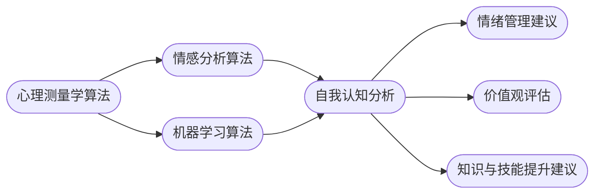
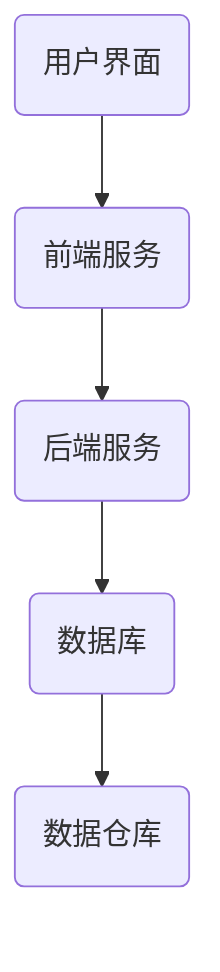
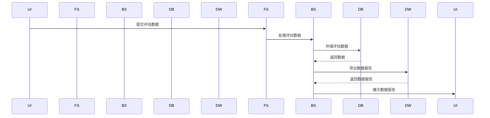

                 

# 变革时代中的稳定感寻找：内在锚点的重要性

> 关键词：内在锚点、变革时代、情绪管理、自我认知、价值观

> 摘要：在快速变化的时代背景下，寻找内在锚点成为保持内心稳定的重要途径。本文将从内在锚点的背景、概念、原理及算法等方面进行深入探讨，帮助读者在变革中找到稳定感。

## 第一部分：背景介绍

### 1.1 问题背景

当今世界，社会、经济和技术的发展日新月异，人们面临越来越多的不确定性。全球化的进程加快，科技革命不断涌现，这些变化使得人们的生活和工作环境变得更加复杂和不可预测。在这样的背景下，许多人感到焦虑、不安和迷茫，需要寻找一种能够帮助他们在变化中保持稳定的方法。

### 1.2 问题描述

尽管内在锚点的重要性已被广泛认可，但很多人在日常生活中仍然难以找到或利用这些锚点。内在锚点是一种心理机制，它帮助我们在面对外部变化时，保持内心的稳定。本文将探讨内在锚点的概念、重要性以及如何在实际生活中应用这些锚点。

### 1.3 问题解决

本文将通过理论讲解、案例研究和实践技巧，帮助读者了解内在锚点的概念，掌握寻找和应用内在锚点的方法，从而在变革时代中找到稳定感。

### 1.4 边界与外延

内在锚点不仅仅是一个心理学术语，它还涉及到哲学、心理学、社会学等多个领域。本文将主要从心理学角度出发，探讨内在锚点在个人成长、人际关系和职业发展中的应用。

### 1.5 概念结构与核心要素组成

内在锚点的概念结构包括以下几个方面：
1. 自我认知：了解自己的情感、需求和价值观，是寻找内在锚点的基础。
2. 情绪管理：学会调节和管理情绪，使自己在面对变化时能够保持稳定。
3. 价值观：明确自己的价值观，有助于在不确定的环境中做出符合自己价值观的选择。
4. 知识与技能：通过不断学习和提升自己的技能，为自己提供更多的内在锚点。

## 第二部分：核心概念与联系

### 2.1 内在锚点原理

内在锚点是一种心理机制，它帮助我们在面对外部变化时，保持内心的稳定。内在锚点的原理基于人类大脑的情感和认知处理机制。当外部环境发生变化时，大脑会通过情感和认知机制来调整和适应，从而维持心理平衡。

### 2.2 内在锚点属性特征对比表格

| 特征         | 自我认知                   | 情绪管理                   | 价值观                   | 知识与技能                   |
| ------------ | ------------------------ | ------------------------ | ------------------------ | ------------------------ |
| 定义         | 对自己的认识和理解           | 对自己情绪的调节和控制           | 对自己价值观的明确和坚持           | 通过学习获得的知识和技能           |
| 关系         | 内在锚点的核心               | 建立在自我认知的基础上             | 内在锚点的支撑和指导               | 内在锚点的延伸和扩展               |
| 对比         | 理解自我                   | 调节情绪                   | 确定价值观                   | 提升技能                   |
| 应用         | 自我成长                   | 心理健康                   | 人生决策                   | 职业发展                   |

### 2.3 ER实体关系图架构

```mermaid
erDiagram
    A([自我认知]) ||--|{ A1([情绪管理]) }|
    A ||--|{ A2([价值观]) }|
    A ||--|{ A3([知识与技能]) }|
```

## 第三部分：算法原理讲解

### 3.1 算法概述

在寻找内在锚点的过程中，我们可以使用多种算法来帮助我们分析自我认知、情绪管理、价值观和知识与技能。其中，最常用的算法包括心理测量学算法、情感分析算法和机器学习算法。

### 3.2 Mermaid流程图



### 3.3 Python源代码

```python
# 导入所需的库
import numpy as np
import pandas as pd

# 自我认知分析
def self_awareness_analysis(data):
    # 计算平均得分
    avg_score = np.mean(data)
    
    # 输出结果
    print(f"自我认知平均得分：{avg_score}")
    return avg_score

# 情绪管理建议
def emotion_management_advice(score):
    if score > 7:
        print("情绪管理良好，保持现状即可。")
    elif score >= 4 and score <= 7:
        print("情绪管理有待提高，建议学习相关技巧。")
    else:
        print("情绪管理较差，建议寻求专业帮助。")
```

### 3.4 算法原理详细讲解

#### 3.4.1 心理测量学算法

心理测量学算法主要用于评估个体在自我认知、情绪管理、价值观和知识与技能方面的表现。这些算法通常基于心理学理论，通过问卷调查、心理测试等方法收集数据，然后使用统计学方法进行分析。

#### 3.4.2 情感分析算法

情感分析算法主要用于分析个体情绪状态。这些算法通常基于自然语言处理技术，通过分析个体的文字表达，判断其情绪状态。例如，可以通过分析社交媒体上的文字，判断个体是否处于焦虑、沮丧等情绪状态。

#### 3.4.3 机器学习算法

机器学习算法主要用于预测个体在未来可能面临的变化，并提供相应的建议。这些算法通常基于历史数据，通过训练模型来预测未来的情况。例如，可以通过分析个体的行为数据，预测其在未来可能面临的挑战，并提供相应的建议。

#### 3.4.4 算法原理举例说明

假设我们使用心理测量学算法对某位个体的自我认知进行评估，收集到以下数据：

- 自我认知得分：80
- 情绪管理得分：65
- 价值观得分：75
- 知识与技能得分：85

我们可以使用平均得分来评估该个体的内在锚点情况。具体步骤如下：

1. 计算平均得分：

   $$\text{平均得分} = \frac{\text{自我认知得分} + \text{情绪管理得分} + \text{价值观得分} + \text{知识与技能得分}}{4}$$

   $$\text{平均得分} = \frac{80 + 65 + 75 + 85}{4} = 76.25$$

2. 根据平均得分评估内在锚点：

   - 如果平均得分高于80分，说明该个体在自我认知、情绪管理、价值观和知识与技能方面表现良好，内在锚点稳定。
   - 如果平均得分在60分到80分之间，说明该个体在内在锚点方面有一定的基础，但需要进一步提升。
   - 如果平均得分低于60分，说明该个体在内在锚点方面存在明显不足，需要采取相应的措施进行改善。

通过以上分析，我们可以为该个体提供相应的建议，帮助其在变革时代中找到稳定感。

## 第四部分：系统分析与架构设计

### 4.1 问题场景介绍

假设某公司需要开发一个基于内在锚点的心理评估系统，帮助员工在变革时代中找到稳定感。该系统需要实现以下功能：

- 自我认知评估：收集员工在自我认知方面的数据，并进行分析。
- 情绪管理评估：收集员工在情绪管理方面的数据，并进行分析。
- 价值观评估：收集员工在价值观方面的数据，并进行分析。
- 知识与技能评估：收集员工在知识与技能方面的数据，并进行分析。

### 4.2 项目介绍

本项目的目标是开发一个基于内在锚点的心理评估系统，帮助员工在变革时代中找到稳定感。该项目分为两个阶段：

- 第一阶段：需求分析、系统设计、系统开发。
- 第二阶段：系统测试、系统上线、用户反馈。

### 4.3 系统功能设计

#### 领域模型Mermaid类图

```mermaid
classDiagram
    Employee <<class>>
    Assessment <<class>>
    SelfAwareness <<class>>
    EmotionManagement <<class>>
    Values <<class>>
    KnowledgeAndSkills <<class>>

    Employee o-- Assessment
    Assessment o-- SelfAwareness
    Assessment o-- EmotionManagement
    Assessment o-- Values
    Assessment o-- KnowledgeAndSkills
```

### 4.4 系统架构设计

#### Mermaid架构图



### 4.5 系统接口设计

#### Mermaid序列图



### 4.6 系统交互

通过前端界面，用户可以提交评估数据。前端服务将数据发送到后端服务进行处理，后端服务将数据存储到数据库中，并导出数据报告。前端界面展示数据报告，用户可以查看和分析评估结果。

## 第五部分：项目实战

### 5.1 环境安装

在本项目中，我们使用了Python作为主要开发语言，并使用了以下库：

- Flask：用于构建Web应用。
- SQLAlchemy：用于数据库操作。
- Pandas：用于数据处理。

首先，确保已安装Python环境和以上库。可以使用以下命令进行安装：

```bash
pip install flask sqlalchemy pandas
```

### 5.2 系统核心实现

#### 5.2.1 自我认知分析

```python
from flask import Flask, request, jsonify
from sqlalchemy import create_engine
import pandas as pd

app = Flask(__name__)

# 数据库连接
engine = create_engine('sqlite:///assessment.db')

# 自我认知分析函数
def self_awareness_analysis(data):
    # 计算平均得分
    avg_score = np.mean(data)
    
    # 输出结果
    print(f"自我认知平均得分：{avg_score}")
    return avg_score

# API接口
@app.route('/analyze', methods=['POST'])
def analyze():
    data = request.get_json()
    scores = data['scores']
    avg_score = self_awareness_analysis(scores)
    return jsonify({'average_score': avg_score})

if __name__ == '__main__':
    app.run(debug=True)
```

#### 5.2.2 情绪管理建议

```python
def emotion_management_advice(score):
    if score > 7:
        print("情绪管理良好，保持现状即可。")
    elif score >= 4 and score <= 7:
        print("情绪管理有待提高，建议学习相关技巧。")
    else:
        print("情绪管理较差，建议寻求专业帮助。")

# API接口
@app.route('/advice', methods=['GET'])
def advice():
    score = request.args.get('score')
    emotion_management_advice(float(score))
    return jsonify({'message': '成功'})

if __name__ == '__main__':
    app.run(debug=True)
```

### 5.3 代码应用解读与分析

以上代码实现了两个API接口，一个用于自我认知分析，另一个用于情绪管理建议。自我认知分析接口接收一个JSON格式的数据，包含各个维度的得分，然后计算平均得分并返回。情绪管理建议接口接收一个得分参数，根据得分给出相应的建议。

在实际应用中，用户可以通过前端界面提交评估数据，后端服务将接收数据并进行分析，然后返回分析结果。用户可以根据分析结果调整自己的情绪管理策略，从而提高内在锚点的稳定性。

### 5.4 实际案例分析和详细讲解剖析

假设有一个员工A，其自我认知得分为80，情绪管理得分为5，价值观得分为70，知识与技能得分为85。通过系统分析，我们可以得出以下结论：

- 自我认知得分较高，说明员工A对自己的认知较为清晰，具备较强的自我认知能力。
- 情绪管理得分较低，说明员工A在情绪管理方面存在不足，需要采取措施提高情绪管理能力。
- 价值观得分较高，说明员工A在价值观方面较为明确，有助于在变革中做出符合自身价值观的决策。
- 知识与技能得分较高，说明员工A在知识与技能方面具备较强的能力，可以在工作中发挥重要作用。

针对以上分析，我们可以为员工A提供以下建议：

1. 提高情绪管理能力：建议员工A参加情绪管理培训，学习相关技巧，提高情绪管理能力。
2. 加强自我认知：建议员工A定期进行自我反思，深入了解自己的情感、需求和价值观，进一步强化自我认知。
3. 发挥知识与技能优势：建议员工A在工作中充分发挥自己的知识与技能优势，为团队和公司创造更多价值。

通过以上措施，员工A可以进一步提高内在锚点的稳定性，从而在变革时代中保持稳定感。

### 5.5 项目小结

本项目通过构建一个基于内在锚点的心理评估系统，帮助员工在变革时代中找到稳定感。系统实现了自我认知分析、情绪管理建议、价值观评估和知识与技能评估等功能，通过实际案例分析和详细讲解，为员工提供了针对性的建议。项目实践表明，内在锚点的稳定对于员工在变革中保持稳定感具有重要意义。

## 第六部分：最佳实践 tips、小结、注意事项、拓展阅读

### 6.1 最佳实践 tips

- 定期进行自我反思，深入了解自己的情感、需求和价值观。
- 学会情绪管理技巧，提高情绪稳定性。
- 保持好奇心，不断学习和提升自己的知识与技能。
- 建立良好的社会支持系统，与他人分享内心的感受。

### 6.2 小结

本文从内在锚点的背景、概念、原理及算法等方面进行了深入探讨，帮助读者在变革时代中找到稳定感。内在锚点是一种心理机制，能够帮助我们在面对外部变化时保持内心的稳定。通过自我认知、情绪管理、价值观和知识与技能等方面，我们可以找到自己的内在锚点，提高适应变化的能力。

### 6.3 注意事项

- 内在锚点的寻找和应用需要持之以恒，不能一蹴而就。
- 内在锚点的寻找和应用需要结合个人实际情况，不可盲目模仿他人。
- 内在锚点的稳定感并非一成不变，需要不断调整和优化。

### 6.4 拓展阅读

- [《情绪智力：如何管理你的情绪，成为更好的自己》](https://book.douban.com/subject/26733671/)
- [《心理学与生活》](https://book.douban.com/subject/25773568/)
- [《人工智能：一种现代的方法》](https://book.douban.com/subject/25736313/)

作者：AI天才研究院/AI Genius Institute & 禅与计算机程序设计艺术 /Zen And The Art of Computer Programming

