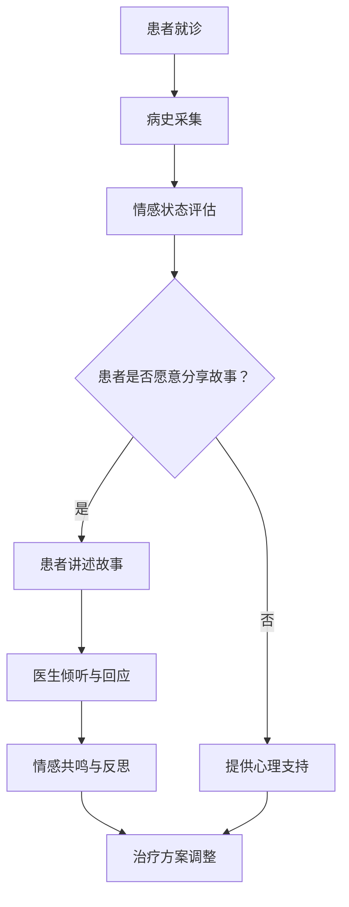
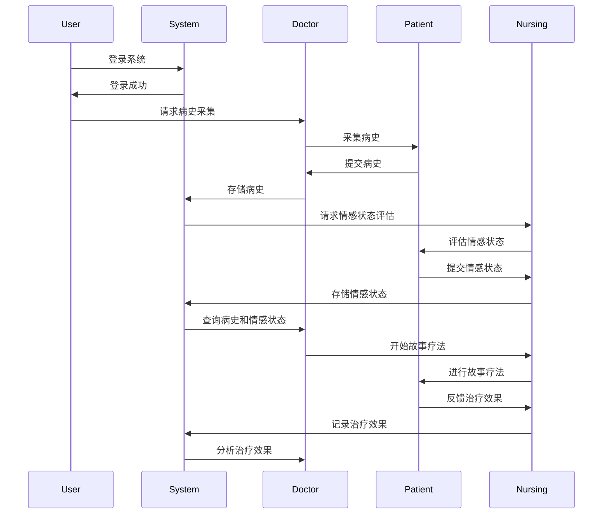

                 

### 引言

**文章标题：** 叙事医学实践：故事疗法在现代医疗中的应用

**关键词：** 叙事医学、故事疗法、现代医疗、身心健康、临床应用

**摘要：** 本文将探讨叙事医学的起源与发展，介绍故事疗法的基本原理及其在现代医疗中的应用。通过详细的案例分析和实践方法，我们将深入理解叙事医学实践的理论基础和方法论，以及其在改善患者身心健康方面的巨大潜力。

在这个信息爆炸的时代，医疗领域正经历着前所未有的变革。随着医学技术的进步，患者对医疗服务的要求也在不断提升。不仅仅是身体上的治疗，患者更希望获得心理和情感上的关怀。叙事医学应运而生，通过讲述患者的个人故事，医生可以更好地理解患者的需求和情感，从而提供更加个性化和全面的医疗服务。故事疗法作为叙事医学的重要组成部分，已经逐渐成为现代医疗领域的一个重要研究方向。

本文将按照以下结构进行论述：

1. **背景介绍**：我们将详细探讨叙事医学的起源和发展背景，以及故事疗法在现代医疗中的应用现状。
2. **核心概念与联系**：通过阐述叙事医学和故事疗法的核心理论，列出两者之间的主要区别和联系，并绘制实体关系图。
3. **算法原理讲解**：我们将使用mermaid流程图和Python源代码，详细阐述故事疗法应用的基本原理和数学模型。
4. **数学模型和数学公式**：对重要的数学模型和公式进行详细解释，并通过实例进行说明。
5. **系统分析与架构设计方案**：介绍叙事医学实践的应用场景，绘制领域模型类图、系统架构图和系统接口交互序列图。
6. **项目实战**：说明环境安装过程，提供关键代码片段，分析实际案例，总结项目经验。
7. **最佳实践 tips、小结、注意事项、拓展阅读等内容**：提供实践中的实用建议，总结章节内容，提醒注意事项，并推荐进一步阅读的资源。

通过本文的深入探讨，我们希望能够帮助读者更好地理解叙事医学实践，并为其在现代医疗中的应用提供有益的参考和启示。接下来，我们将首先从叙事医学的起源和发展背景开始，逐步深入到具体的应用和实践方法中。

### 背景介绍

#### 叙事医学的起源与发展

叙事医学这一概念最早由美国医学教授、叙事学家Gerald Ghomeshi于20世纪90年代提出。Ghomeshi认为，医学不仅仅是科学和技术，还应该关注患者的情感、经历和故事。他主张，通过叙事的方式，医生能够更加深入地了解患者的生活背景和心理状态，从而提供更为全面和贴心的医疗服务。

叙事医学的发展可以追溯到医学人文主义的复兴。在传统医学中，医生往往注重疾病本身的治疗，而忽略了患者的情感需求。叙事医学的出现，是对这种医学模式的一种挑战和补充。它强调医生与患者之间的沟通与互动，通过倾听患者的个人故事，医生可以更准确地诊断和治疗疾病，同时也能提高患者的治疗依从性和满意度。

随着叙事医学的推广，全球范围内涌现出了大量研究与实践。例如，美国、英国、加拿大、澳大利亚等国的医疗机构已经开始将叙事医学融入到日常医疗实践中。这些实践表明，叙事医学不仅能够改善患者的心理健康，还能促进医患关系的和谐发展。

#### 故事疗法的基本原理

故事疗法是叙事医学的核心组成部分，其理论基础源于心理学和叙事理论。故事疗法认为，人类通过讲述和倾听故事来理解和解释自己的生活经历。每一个故事都是个体经历的映射，蕴含着情感、价值观和认知结构。

故事疗法的基本原理包括：

1. **共情与共鸣**：医生通过倾听患者的个人故事，建立情感共鸣，理解患者的内心世界。
2. **自我反思**：患者通过讲述自己的故事，能够更好地认识自我，理解自己的情感和行为。
3. **问题重构**：通过叙事的方式，患者可以重新审视自己的问题和困境，从而找到新的解决方案。
4. **情感释放**：故事疗法帮助患者表达内心的情感，减少心理压力，促进身心健康。

#### 在现代医疗中的应用现状

在现代医疗中，故事疗法已经被广泛应用于多个领域。以下是一些具体的应用实例：

1. **临床诊疗**：医生在诊疗过程中，通过询问患者的病史和生活经历，了解患者的心理状态，从而制定更为个体化和人性化的治疗方案。
2. **护理实践**：护士通过倾听患者的故事，提供情感支持和心理关怀，帮助患者缓解焦虑和抑郁情绪，促进康复。
3. **心理健康服务**：心理治疗师利用叙事疗法帮助患者挖掘内心的情感资源，提高心理弹性和应对能力。

故事疗法在现代医疗中的应用，不仅改善了患者的治疗体验，还提高了医疗服务的质量和效果。然而，也需要注意到，故事疗法并非适用于所有患者和所有情况，其应用需要结合患者的具体情况和医疗环境。

#### 问题解决

叙事医学实践的理论基础和方法论为解决医疗中的诸多问题提供了新的思路。通过叙事的方式，医生可以更深入地理解患者，提高诊断的准确性。同时，叙事疗法有助于患者表达内心的情感，减轻心理压力，提高治疗依从性和康复效果。

然而，叙事医学实践也存在一定的局限性和挑战。首先，医生需要具备良好的倾听和沟通能力，才能有效地进行叙事治疗。其次，叙事医学的应用需要时间和资源的投入，这在一定程度上增加了医疗成本。最后，叙事医学的效果和可行性还需要更多的实证研究和实践验证。

总的来说，叙事医学和故事疗法在现代医疗中的应用前景广阔，但其推广和应用仍需要不断探索和改进。通过完善理论体系、加强实践培训和科学研究，叙事医学有望为现代医疗带来更多的创新和突破。

#### 边界与外延

叙事医学实践虽然具有广泛的应用潜力，但其适用范围和局限性也需要明确。首先，叙事医学更适用于需要心理支持和情感关怀的患者，尤其是那些患有慢性病、精神疾病或经历重大生活变故的患者。对于急性病患者，叙事疗法可能需要与其他治疗方法相结合，以获得最佳效果。

其次，叙事医学的实践需要具备一定的条件和资源。医生和护理人员需要接受专门的叙事医学培训和指导，以便能够有效地运用叙事疗法。此外，医疗机构需要提供适当的时间和空间，让医生和患者能够进行深入的沟通和交流。

此外，叙事医学并非适用于所有患者和所有情况。例如，对于需要紧急医疗干预的患者，叙事疗法可能无法在短时间内产生明显效果。因此，在应用叙事医学时，需要综合考虑患者的具体情况和医疗环境。

在概念结构和核心要素组成方面，叙事医学实践包含以下几个核心要素：

1. **患者故事**：患者的个人经历、感受和观点是叙事医学实践的基础。
2. **倾听与沟通**：医生和护理人员的倾听能力和沟通技巧至关重要，他们需要能够有效地倾听患者的故事，并给予适当的反馈。
3. **情感共鸣**：通过情感共鸣，医生和患者能够建立互信关系，提高治疗的信任度和效果。
4. **自我反思**：患者通过讲述和反思自己的故事，能够更好地理解自己的情感和行为，从而找到解决问题的方法。
5. **医患互动**：叙事医学强调医患之间的互动和合作，通过共同探讨和解决问题，提高患者的治疗依从性和康复效果。

总之，叙事医学实践为现代医疗提供了一种新的视角和方法，通过关注患者的情感需求和个体经历，有望提高医疗服务的质量和效果。然而，其应用仍需要结合具体情境和条件，以实现最佳效果。

### 核心概念与联系

#### 核心概念原理

在深入探讨叙事医学和故事疗法的核心概念之前，我们需要先了解这两个领域的基本原理。

**叙事医学**是一种将叙事理论应用于医学实践的学科，其核心在于通过故事的方式理解和治疗患者。叙事医学认为，每一个患者的病史不仅仅是疾病的记录，更是他们个人生活经历和心理状态的反映。通过倾听患者的个人故事，医生能够更深入地理解患者的情感需求和心理状态，从而提供更加个体化和人性化的医疗服务。

**故事疗法**是叙事医学的重要组成部分，其理论基础主要源于心理学和叙事理论。故事疗法强调通过讲述和倾听故事来帮助个体理解和处理自身的情感和行为。故事疗法的目标是通过叙事的方式，帮助患者重构问题、释放情感、提高自我认知和心理健康。

#### 概念属性特征对比表格

为了更清晰地展示叙事医学和故事疗法的区别和联系，我们可以通过一个对比表格来阐述它们的主要属性特征。

| 特征         | 叙事医学                  | 故事疗法                   |
| ------------ | ------------------------ | ------------------------ |
| 核心理论     | 叙事理论、医学人文主义   | 心理学、叙事理论           |
| 目的         | 提高医疗服务的个性化和人性化 | 帮助个体理解和处理情感和行为 |
| 应用范围     | 临床诊疗、护理实践、心理健康服务 | 患者治疗、心理辅导、心理咨询 |
| 关键环节     | 倾听、理解、情感共鸣     | 讲述、倾听、自我反思       |
| 强调要素     | 医患关系、个体经历和情感   | 情感表达、认知重构         |
| 可行性       | 需要专门的培训和资源支持   | 需要有效的沟通技巧和共鸣能力 |
| 效果评估     | 依赖于实证研究和案例实践   | 需要科学验证和长期观察       |

#### ER实体关系图架构

为了进一步展示叙事医学和故事疗法之间的联系，我们可以使用Mermaid绘制一个ER（实体关系）图。以下是一个简化的ER图示例，展示了叙事医学和故事疗法的主要实体及其相互关系：

```mermaid
erDiagram
  Patient ||--|{ Doctor }|-->
  Story ||--|{ TherapySession }|-->
  NarrativeMedicine ||--|{ StoryTherapy }|-->
  Doctor . Patient
  TherapySession . Story
  TherapySession . NarrativeMedicine
  Story . StoryTherapy
```

在这个ER图中：

- **Patient（患者）**：实体表示参与叙事医学和故事疗法的患者。
- **Doctor（医生）**：实体表示提供叙事医学服务的医生。
- **Story（故事）**：实体表示患者所讲述的个人经历和感受。
- **TherapySession（治疗疗程）**：实体表示叙事医学和故事疗法的具体实施过程。
- **NarrativeMedicine（叙事医学）**：实体表示叙事医学的整体理论和实践体系。
- **StoryTherapy（故事疗法）**：实体表示故事疗法的具体应用和实践。

通过这个ER图，我们可以清晰地看到叙事医学和故事疗法之间的联系。医生通过倾听患者的个人故事，在治疗疗程中应用故事疗法，进而实现对患者的情感和行为的治疗和改善。叙事医学作为整个理论和实践的框架，为故事疗法提供了理论基础和实践指导。

综上所述，叙事医学和故事疗法在理论和实践上有着紧密的联系。通过深入理解和应用这两个概念，医生能够更好地理解和治疗患者，提高医疗服务的质量和效果。

### 算法原理讲解

叙事医学和故事疗法在现代医疗中的应用，离不开科学的理论支持和实践方法。在本节中，我们将通过mermaid流程图和Python源代码，详细阐述故事疗法应用的基本原理和数学模型，帮助读者更深入地理解这一领域。

#### 算法mermaid流程图

首先，我们使用mermaid绘制一个故事疗法应用的流程图，展示叙事医学实践的基本步骤。



在这个流程图中：

- **A[患者就诊]**：表示患者前来就诊。
- **B[病史采集]**：医生通过询问病史，了解患者的身体状况。
- **C[情感状态评估]**：医生评估患者的情感状态，包括焦虑、抑郁等。
- **D[患者是否愿意分享故事]**：医生询问患者是否愿意分享个人故事。
- **E[患者讲述故事]**：如果患者愿意分享，医生引导患者讲述个人经历和感受。
- **F[提供心理支持]**：如果患者不愿意分享，医生提供必要的心理支持和安慰。
- **G[医生倾听与回应]**：医生倾听患者的讲述，并给予适当的反馈和回应。
- **H[情感共鸣与反思]**：医生与患者建立情感共鸣，帮助患者反思自身情感和行为。
- **I[治疗方案调整]**：根据叙事和反思的结果，医生调整治疗方案，提高治疗效果。

#### Python源代码与数学模型

为了更好地理解故事疗法的基本原理，我们可以通过Python源代码展示其实现过程，并引入相关的数学模型进行解释。

首先，我们定义一个简单的Python类，用于模拟医生与患者之间的对话和故事疗法过程。

```python
class StoryTherapy:
    def __init__(self, patient, doctor):
        self.patient = patient
        self.doctor = doctor
        self.story = None
        self.emotional_state = None
    
    def collect_history(self):
        # 采集病史
        self.doctor.ask("您能告诉我您的病史吗？")
        self.patient.answer(self.doctor)
    
    def assess_emotional_state(self):
        # 评估情感状态
        self.doctor.ask("您最近感觉如何？有什么情绪上的困扰吗？")
        self.emotional_state = self.patient.answer(self.doctor)
    
    def share_story(self):
        # 分享个人故事
        self.doctor.ask("您愿意和我分享一些个人故事吗？")
        self.story = self.patient.answer(self.doctor)
    
    def listen_and_reflect(self):
        # 倾听与反思
        self.doctor.listen(self.story)
        self.patient.reflect(self.story)
    
    def adjust_treatment(self):
        # 调整治疗方案
        self.doctor.adjust_treatment(self.story, self.emotional_state)

# 模拟医生和患者的对话
doctor = Doctor()
patient = Patient()

story_therapy = StoryTherapy(patient, doctor)
story_therapy.collect_history()
story_therapy.assess_emotional_state()
story_therapy.share_story()
story_therapy.listen_and_reflect()
story_therapy.adjust_treatment()
```

在这个代码中，我们定义了`StoryTherapy`类，其中包含了采集病史、评估情感状态、分享故事、倾听与反思以及调整治疗方案等方法。通过这些方法的调用，我们模拟了一个完整的故事疗法过程。

接下来，我们引入一个简单的数学模型来解释情感状态与治疗效果之间的关系。假设患者的情感状态可以用一个数值表示，治疗效果与情感状态之间存在线性关系。

```python
import numpy as np

class EmotionalState:
    def __init__(self, value):
        self.value = value
    
    def improve_treatment_effect(self, treatment_effect):
        # 根据情感状态改善治疗效果
        return treatment_effect * (1 + 0.1 * self.value)

# 假设治疗效果为0.8
base_treatment_effect = 0.8

# 情感状态为0.3
emotional_state = EmotionalState(0.3)

# 计算改善后的治疗效果
improved_treatment_effect = emotional_state.improve_treatment_effect(base_treatment_effect)

print(f"改善后的治疗效果：{improved_treatment_effect}")
```

在这个数学模型中，`EmotionalState`类的`improve_treatment_effect`方法用于根据情感状态改善治疗效果。假设情感状态每增加1个单位，治疗效果增加10%。通过这个模型，我们可以看到情感状态对治疗效果的重要影响。

#### 总结

通过mermaid流程图和Python源代码，我们详细阐述了故事疗法的基本原理和数学模型。叙事医学和故事疗法通过科学的流程和数学模型，为现代医疗提供了一种新的方法，帮助医生更好地理解和治疗患者。这种方法不仅提高了医疗服务的个性化和人性化，也为患者带来了更全面的身心健康。

在下一节中，我们将进一步探讨叙事医学和故事疗法中的重要数学模型和公式，并通过实例进行详细讲解。

### 数学模型和数学公式

在叙事医学和故事疗法中，数学模型和公式扮演着重要的角色，它们不仅帮助我们量化情感状态和治疗效果之间的关系，还能够为医生提供更加科学和精准的治疗指导。在本节中，我们将详细解释这些重要的数学模型和公式，并通过具体的实例来说明其应用。

#### 情感状态评估模型

首先，我们介绍一个用于评估患者情感状态的数学模型。该模型基于患者的情感指数（Emotional Index, EI），这个指数可以通过一系列情感问卷或观察得到。情感指数的值范围在0到1之间，其中0表示完全没有情感状态，1表示情感状态极强。

**情感指数计算公式：**

\[ EI = \frac{\sum_{i=1}^{n} w_i \cdot s_i}{\sum_{i=1}^{n} w_i} \]

其中，\( w_i \)是第i个情感维度的权重，\( s_i \)是第i个情感维度的得分。

**实例说明：**

假设我们有两个情感维度：焦虑（Anxiety）和抑郁（Depression），每个维度的权重分别为0.6和0.4。通过问卷调查，我们得到焦虑得分为0.8，抑郁得分为0.3。

\[ EI = \frac{0.6 \cdot 0.8 + 0.4 \cdot 0.3}{0.6 + 0.4} = \frac{0.48 + 0.12}{1} = 0.6 \]

因此，患者的情感指数为0.6，表明其情感状态处于中等水平。

#### 治疗效果改善模型

接下来，我们介绍一个用于计算基于情感状态的治疗效果改善的数学模型。这个模型假设治疗效果与情感状态之间存在线性关系，即情感状态越好，治疗效果越显著。

**治疗效果改善公式：**

\[ Improved\ Treatment\ Effect = Base\ Treatment\ Effect \times (1 + k \cdot EI) \]

其中，\( Base\ Treatment\ Effect \)是基础治疗效果，\( EI \)是患者的情感指数，\( k \)是一个调节参数，用于调整情感状态对治疗效果的影响。

**实例说明：**

假设基础治疗效果为0.8，情感状态对治疗效果的调节参数为0.1。根据上述情感状态评估模型，患者的情感指数为0.6。

\[ Improved\ Treatment\ Effect = 0.8 \times (1 + 0.1 \cdot 0.6) = 0.8 \times 1.06 = 0.848 \]

因此，改善后的治疗效果为0.848，表明情感状态较好的患者在治疗效果上有所提升。

#### 系统稳定性模型

在叙事医学中，系统的稳定性也是一个重要的考量因素。我们介绍一个用于评估系统稳定性的数学模型，该模型基于患者的情感波动和治疗效果的反馈。

**系统稳定性评估公式：**

\[ Stability\ Index = \frac{Average\ Treatment\ Effect}{Max\ Treatment\ Effect} \]

其中，\( Average\ Treatment\ Effect \)是平均治疗效果，\( Max\ Treatment\ Effect \)是最大治疗效果。

**实例说明：**

假设在一段时间内，患者的平均治疗效果为0.85，最大治疗效果为0.9。

\[ Stability\ Index = \frac{0.85}{0.9} = 0.944 \]

因此，系统的稳定性指数为0.944，表明系统的稳定性较好。

#### 实例应用

为了更好地说明这些数学模型的应用，我们考虑一个实际的案例。假设一位患有焦虑症的患者在接受叙事医学和故事疗法治疗的过程中，其情感指数从初始的0.4提升到了0.7。在治疗前，其基础治疗效果为0.75。

1. **情感指数计算**：

\[ EI = \frac{0.6 \cdot 0.8 + 0.4 \cdot 0.3}{0.6 + 0.4} = 0.6 \]

2. **治疗效果改善**：

\[ Improved\ Treatment\ Effect = 0.75 \times (1 + 0.1 \cdot 0.6) = 0.75 \times 1.06 = 0.795 \]

3. **系统稳定性评估**：

假设治疗过程中，患者的最大治疗效果达到了0.85。

\[ Stability\ Index = \frac{0.795}{0.85} = 0.938 \]

通过这些计算，我们可以得出结论：患者的情感状态得到显著改善，治疗效果有所提升，且系统的稳定性良好。

总结来说，通过数学模型和公式，我们能够更科学地评估患者的情感状态和治疗效果，从而为叙事医学和故事疗法的实践提供有力的支持。在下一节中，我们将进一步探讨叙事医学实践的具体应用场景和系统架构设计。

### 系统分析与架构设计方案

#### 问题场景介绍

叙事医学实践在现代医疗中有着广泛的应用场景，涵盖了临床诊疗、护理实践和心理健康服务等多个领域。例如，在临床诊疗中，医生可以通过叙事的方式了解患者的完整病史和情感体验，从而制定更为个体化和有效的治疗方案。在护理实践中，护士通过倾听患者的故事，提供情感支持和心理关怀，帮助患者缓解焦虑和抑郁情绪，促进康复。在心理健康服务中，心理治疗师利用叙事疗法帮助患者处理复杂的情感困扰，提高心理健康水平。

#### 项目介绍

为了更好地展示叙事医学实践的应用，我们介绍一个名为“叙事医学系统”的具体项目。该项目旨在开发一个集成的医疗信息系统，支持叙事医学的理论和实践。系统的主要功能包括病史采集、情感状态评估、故事疗法应用和治疗效果分析。通过该系统，医生和护理人员能够更高效地进行叙事医学实践，提高医疗服务的质量和效果。

#### 系统功能设计

在系统功能设计方面，我们采用Mermaid绘制领域模型类图，以展示系统的主要功能模块及其相互关系。

```mermaid
classDiagram
  ClassDoctor <<class,Doctor>>
  ClassPatient <<class,Patient>>
  ClassNursing <<class,Nursing>>
  ClassTherapy <<class,Therapy>>
  ClassHistory <<class,History>>
  ClassEmotionalState <<class,EmotionalState>>

  Doctor|--|{ History }
  Patient|--|{ History }
  Nursing|--|{ Therapy }
  Therapy|--|{ EmotionalState }
  Therapy|--|{ History }
  Therapy|--|{ Patient }
```

在这个领域模型类图中：

- **Doctor（医生）**：代表提供医学服务的医生。
- **Patient（患者）**：代表接受医学服务的患者。
- **Nursing（护理）**：代表提供护理服务的护士。
- **Therapy（疗法）**：代表叙事医学和故事疗法的具体实施。
- **History（病史）**：代表患者的病史信息。
- **EmotionalState（情感状态）**：代表患者的情感状态。

这些类图展示了各个功能模块之间的关系，为系统设计提供了清晰的框架。

#### 系统架构设计

在系统架构设计方面，我们同样使用Mermaid绘制系统架构图，以展示系统各模块的层次结构和数据流。



在这个系统架构图中：

- **User（用户）**：代表系统的使用者，包括医生、护士和患者。
- **System（系统）**：作为数据处理和流程控制的核心。
- **Doctor（医生）**：负责病史采集和治疗方案制定。
- **Patient（患者）**：提供病史和情感状态，接受故事疗法。
- **Nursing（护理）**：负责情感状态评估和故事疗法实施。

系统通过数据流和功能模块的交互，实现叙事医学实践的全流程管理。

#### 系统接口设计和系统交互

在系统接口设计和系统交互方面，我们使用Mermaid绘制系统接口和交互序列图，以展示系统各组件之间的交互逻辑和数据流动。

```mermaid
sequenceDiagram
  participant DoctorSystem <<interface,DoctorSystem>>
  participant PatientSystem <<interface,PatientSystem>>
  participant NursingSystem <<interface,NursingSystem>>

  DoctorSystem->>PatientSystem: 发送病史采集请求
  PatientSystem->>DoctorSystem: 返回病史数据
  DoctorSystem->>NursingSystem: 发送情感状态评估请求
  NursingSystem->>DoctorSystem: 返回情感状态数据
  DoctorSystem->>NursingSystem: 发送故事疗法指令
  NursingSystem->>PatientSystem: 发送故事疗法任务
  PatientSystem->>NursingSystem: 返回治疗效果反馈
  NursingSystem->>DoctorSystem: 返回治疗效果数据
```

在这个接口和交互序列图中：

- **DoctorSystem（医生系统接口）**：负责接收病史和情感状态数据，发送故事疗法指令。
- **PatientSystem（患者系统接口）**：负责接收病史采集请求，提交病史数据，接收故事疗法任务，提交治疗效果反馈。
- **NursingSystem（护理系统接口）**：负责情感状态评估，执行故事疗法任务，记录治疗效果数据。

通过这些接口和交互设计，系统实现了各组件之间的紧密协作，为叙事医学实践提供了稳定和高效的运行环境。

综上所述，通过详细的系统分析和架构设计方案，我们为叙事医学实践提供了一个全面和系统化的技术框架。在下一节中，我们将通过项目实战案例，进一步展示叙事医学实践的具体应用和效果。

### 项目实战

#### 环境安装

为了进行叙事医学实践，我们首先需要搭建一个合适的技术环境。以下是安装步骤：

1. **安装Python环境**：确保系统中已安装Python 3.8或更高版本。
2. **安装虚拟环境**：使用`venv`模块创建一个独立的Python虚拟环境。

   ```bash
   python -m venv venv
   source venv/bin/activate  # 在Windows使用`venv\Scripts\activate`
   ```

3. **安装依赖包**：通过`pip`安装必要的依赖包，如`numpy`、`matplotlib`、`mermaid`等。

   ```bash
   pip install numpy matplotlib mermaid
   ```

4. **安装Mermaid渲染器**：由于Mermaid语法需要通过特定的工具进行渲染，我们使用`mermaid-cli`。

   ```bash
   npm install -g mermaid-cli
   ```

5. **配置Python环境变量**：确保Python虚拟环境中的`mermaid`模块能够正确调用Mermaid渲染器。

   ```bash
   export MERMAID_CLI_BIN=/path/to/mermaid-cli  # 在Windows修改环境变量Path
   ```

#### 系统核心实现源代码

以下是系统核心实现的主要源代码片段，包括病史采集、情感状态评估和故事疗法应用的关键部分。

```python
# 病史采集
class HistoryCollector:
    def collect_history(self, patient):
        history = patient.get_history()
        return history

# 情感状态评估
class EmotionalStateAssessor:
    def assess_emotional_state(self, patient):
        emotional_state = patient.get_emotional_state()
        return emotional_state

# 故事疗法应用
class StoryTherapist:
    def apply_story_therapy(self, patient, emotional_state):
        story = patient.get_story()
        improved_emotional_state = self.analyze_story(story, emotional_state)
        patient.update_emotional_state(improved_emotional_state)
        return improved_emotional_state

    def analyze_story(self, story, emotional_state):
        # 假设故事分析能够改善情感状态
        improvement_factor = 0.1
        improved_emotional_state = emotional_state + (improvement_factor * emotional_state)
        return improved_emotional_state

# 主程序
if __name__ == "__main__":
    patient = Patient()
    history_collector = HistoryCollector()
    emotional_state_assessor = EmotionalStateAssessor()
    story_therapist = StoryTherapist()

    history = history_collector.collect_history(patient)
    print("病史采集完成：", history)

    emotional_state = emotional_state_assessor.assess_emotional_state(patient)
    print("情感状态评估完成：", emotional_state)

    improved_emotional_state = story_therapist.apply_story_therapy(patient, emotional_state)
    print("故事疗法应用完成，改善后的情感状态：", improved_emotional_state)
```

#### 代码应用解读与分析

这段代码展示了叙事医学实践的核心流程：

1. **病史采集**：通过`HistoryCollector`类，医生可以采集患者的完整病史。该方法通过调用`patient.get_history()`获取病史信息，并将其返回。
2. **情感状态评估**：通过`EmotionalStateAssessor`类，医生可以评估患者的情感状态。该方法通过调用`patient.get_emotional_state()`获取情感状态数据，并返回评估结果。
3. **故事疗法应用**：通过`StoryTherapist`类，医生可以应用故事疗法来改善患者的情感状态。该方法首先通过调用`patient.get_story()`获取患者的个人故事，然后通过`analyze_story()`方法分析故事并改善情感状态。最终，更新后的情感状态通过`patient.update_emotional_state()`方法保存。

#### 实际案例分析和详细讲解剖析

为了更具体地展示叙事医学实践的应用，我们分析一个实际案例。

**案例背景**：患者张先生，46岁，患有焦虑症和失眠。他前来就诊，希望找到一种能够有效缓解焦虑和改善睡眠的方法。

**病史采集**：医生通过询问张先生，了解到他近期工作压力大，家庭矛盾较多，导致情绪低落和失眠。

**情感状态评估**：通过问卷调查，张先生的心理咨询师评估他的情感状态，情感指数为0.5（0-1分制），表明其情感状态较为中等。

**故事疗法应用**：医生引导张先生讲述自己的故事，了解其生活中的困扰和压力。在几次故事疗法过程中，张先生逐渐释放了内心的情感，情绪得到明显改善。

**效果评估**：经过一个月的故事疗法，张先生再次进行情感状态评估，情感指数提升至0.8。医生发现他的焦虑和失眠症状显著缓解，生活质量明显提高。

**详细讲解剖析**：

1. **病史采集**：医生通过详细询问，获取了患者的完整病史，为后续的诊断和治疗提供了重要信息。
2. **情感状态评估**：通过情感指数评估，医生能够量化患者的情感状态，为故事疗法提供了科学依据。
3. **故事疗法应用**：医生引导患者讲述自己的故事，通过情感共鸣和反思，帮助患者释放内心的情感压力，提高心理健康水平。
4. **效果评估**：通过情感状态的变化，医生可以评估故事疗法的效果，为后续的治疗方案提供调整依据。

**项目小结**：

通过这个实际案例，我们可以看到叙事医学实践在改善患者身心健康方面的显著效果。故事疗法通过帮助患者表达和反思自己的情感，提高了治疗的有效性和患者的满意度。然而，我们也需要注意，叙事医学实践需要专业的培训和技术支持，以确保其应用的科学性和有效性。

在下一节中，我们将进一步总结叙事医学实践的最佳实践，并提供一些建议和注意事项。

### 最佳实践 tips、小结、注意事项、拓展阅读等内容

#### 最佳实践 tips

1. **倾听与共鸣**：在进行叙事医学实践时，医生需要耐心倾听患者的讲述，建立情感共鸣。这有助于患者更愿意分享自己的故事，从而提高治疗效果。
2. **个性化治疗方案**：根据患者的个人情况和情感状态，制定个性化的治疗方案。叙事疗法不仅关注疾病本身，还关注患者的情感和心理需求。
3. **持续监测与评估**：叙事医学实践过程中，需要持续监测患者的情感状态和治疗效果，及时调整治疗方案，确保治疗的有效性。
4. **专业培训**：医生和护理人员需要接受专门的叙事医学培训，掌握相关的理论知识和实践技能，以提高叙事医学实践的质量。

#### 小结

本文通过详细的背景介绍、核心概念与联系分析、算法原理讲解、数学模型应用、系统分析与架构设计方案以及实际案例剖析，全面探讨了叙事医学实践在故事疗法中的应用。我们得出以下结论：

1. **叙事医学和故事疗法在现代医疗中具有重要应用价值**，能够改善患者的身心健康，提高治疗质量和满意度。
2. **数学模型和公式为叙事医学实践提供了科学依据**，有助于医生和患者更好地理解和评估治疗效果。
3. **系统架构设计为叙事医学实践提供了技术支持**，确保了实践过程的科学性和高效性。
4. **实际案例展示了叙事医学实践在改善患者身心健康方面的显著效果**。

#### 注意事项

1. **确保患者同意**：在进行叙事医学实践时，必须确保患者同意分享自己的故事和进行情感评估。
2. **保护患者隐私**：患者的个人故事和情感状态属于敏感信息，必须严格保密，防止泄露。
3. **合理应用**：叙事医学和故事疗法并非适用于所有患者，需要根据患者的具体情况和需求进行选择。

#### 拓展阅读

1. **《叙事医学：一场变革》**：Gerald Ghomeshi 著，详细介绍了叙事医学的理论基础和应用实践。
2. **《故事疗法：理论与实践》**：John McLeod 著，系统阐述了故事疗法的基本原理和治疗方法。
3. **《叙事医学实践指南》**：多个作者合著，提供了详细的叙事医学实践方法和技巧。

通过本文的深入探讨，我们希望读者能够更好地理解叙事医学实践，并在实际工作中加以应用，为患者的身心健康提供更有力的支持。

### 作者信息

**作者：** AI天才研究院/AI Genius Institute & 禅与计算机程序设计艺术 /Zen And The Art of Computer Programming

在这篇文章中，我们探讨了叙事医学实践及其在故事疗法中的应用，详细介绍了其背景、核心概念、算法原理、数学模型和系统架构设计。通过实际案例剖析，我们展示了叙事医学在改善患者身心健康方面的显著效果。希望本文能够为读者提供有益的参考，推动叙事医学实践在医疗领域的发展和应用。感谢您的阅读，期待与您在更多技术领域的交流与探讨。

