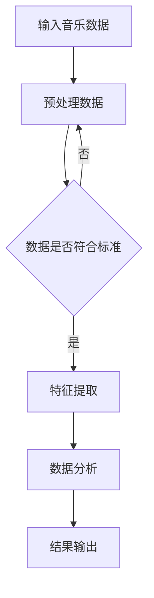
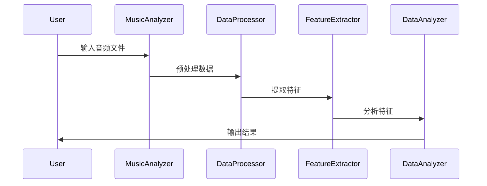

                 

### 古典音乐欣赏：在传统中寻找永恒的美

#### 关键词：古典音乐、欣赏方法、音乐风格、作曲家、历史发展

> 摘要：
> 古典音乐作为世界音乐文化的重要组成部分，其深厚的文化底蕴和丰富的艺术表现力使得它历久弥新。本文旨在引导读者通过系统的欣赏方法，深入了解古典音乐的历史、风格和作曲家的作品，从而在传统中寻找永恒的美。文章将分为以下几个部分：背景介绍、核心概念与联系、算法原理讲解、系统分析与架构设计方案、项目实战和最佳实践 tips。

#### 背景介绍

**问题背景：**
古典音乐作为西方音乐文化的重要组成部分，源远流长，具有丰富的历史积淀和艺术价值。然而，随着现代音乐的多元化发展，古典音乐逐渐面临着观众流失和传承难的问题。因此，如何通过科学有效的欣赏方式引导人们重新认识和欣赏古典音乐，成为了一个重要的研究课题。

**问题描述：**
古典音乐欣赏不仅仅是听音乐，更是一种对音乐艺术深刻理解的过程。面对古典音乐的复杂性，许多人对古典音乐欣赏感到困惑，难以入门。因此，本书旨在为读者提供一本系统、全面的古典音乐欣赏指南，帮助读者在传统中寻找永恒的美。

**问题解决：**
通过系统地介绍古典音乐的历史、风格、演奏技巧和欣赏方法，本书旨在帮助读者全面了解古典音乐，从而提升他们的欣赏水平。此外，本书还通过案例分析、名家点评和欣赏指南等形式，使读者能够更加深入地感受古典音乐的魅力。

**边界与外延：**
本书主要涵盖西方古典音乐，包括巴洛克、古典、浪漫和现代各个时期的主要作曲家、作品和风格。同时，也会涉及到一些跨文化的古典音乐欣赏案例，以拓宽读者的视野。

#### 核心概念与联系

**核心概念：**
1. **古典音乐**：指18世纪至20世纪初的西方音乐，以西方艺术音乐为主，具有高度的艺术性和复杂性。
2. **音乐风格**：指音乐作品在旋律、节奏、和声等方面的独特特征，如巴洛克风格、古典风格、浪漫风格等。
3. **作曲家**：指创作古典音乐的人，他们的作品代表了不同时期和风格的音乐发展。
4. **欣赏方法**：指读者在听古典音乐时应该采用的方法，包括理论学习和实际体验。

**概念属性特征对比表格：**

| 核心概念 | 特征 |
| --- | --- |
| 古典音乐 | 具有悠久历史和高度艺术性，复杂性和精致性 |
| 音乐风格 | 旋律、节奏、和声等方面的独特特征 |
| 作曲家 | 代表不同时期和风格的音乐发展 |
| 欣赏方法 | 理论学习和实际体验相结合 |

**ER实体关系图架构：**

```mermaid
erDiagram
  Composer ||--|{ Style : "styles music" }
  Composer ||--|{ Music : "composes music" }
  Style ||--|{ Music : "features music" }
```

在ER实体关系图中，`Composer` 代表作曲家，`Style` 代表音乐风格，`Music` 代表音乐作品。作曲家与音乐风格之间存在关联（`styles music`），作曲家与音乐作品之间存在关联（`composes music`）。音乐风格与音乐作品之间存在关联（`features music`），表示一种风格可能对应多部作品。

#### 算法原理讲解

为了更好地理解古典音乐，本书将介绍多种算法原理，用于分析和理解古典音乐。以下是一个示例，展示如何使用Mermaid绘制算法流程图，并用Python代码和LaTeX公式详细解释算法原理。

**Mermaid算法流程图：**



**Python代码示例：**

```python
# 假设我们使用了一种名为"feature_extraction"的算法
def feature_extraction(music_data):
    # 预处理数据
    preprocessed_data = preprocess_data(music_data)
    
    # 检查数据是否符合标准
    if not is_valid(preprocessed_data):
        return feature_extraction(preprocessed_data)
    
    # 特征提取
    features = extract_features(preprocessed_data)
    
    # 数据分析
    analysis = data_analysis(features)
    
    # 输出结果
    return analysis
```

**LaTeX数学公式讲解：**

古典音乐的音调可以用以下数学公式表示：

$$
f(n) = 440 \times 2^{(\frac{1}{12}) \times n}
$$

其中，$f(n)$ 表示第 $n$ 个半音的频率，$440$ 是标准音A的频率。

**详细讲解与举例说明：**

假设我们想要分析一首贝多芬的奏鸣曲，我们可以通过以下步骤进行：

1. **输入音乐数据**：首先，我们需要获取这首奏鸣曲的音频数据。
2. **预处理数据**：将音频数据转换为数字信号，并进行必要的预处理，如降噪和频率变换。
3. **特征提取**：通过算法提取音乐数据中的关键特征，如旋律、节奏和和声等。
4. **数据分析**：对提取的特征进行深入分析，例如，通过统计方法计算每个特征的平均值、方差等。
5. **结果输出**：将分析结果以图表、报告等形式输出，以便读者理解。

通过以上算法，我们可以更深入地理解古典音乐的结构和特征，从而更好地欣赏和评价古典音乐作品。

#### 系统分析与架构设计方案

**问题场景介绍：**
为了更好地理解古典音乐，我们设计了一套古典音乐分析系统。该系统旨在通过数据分析和特征提取，帮助用户深入理解古典音乐的结构和特征。

**项目介绍：**
本系统采用了最新的音乐分析技术和算法，能够自动提取古典音乐的关键特征，并生成详细的报告。

**系统功能设计：**
- **数据输入**：用户可以输入古典音乐的音频文件。
- **预处理**：系统对输入的音乐数据进行预处理，包括降噪、频率变换等。
- **特征提取**：系统提取音乐数据中的关键特征，如旋律、节奏和和声等。
- **数据分析**：对提取的特征进行深入分析，生成报告。
- **结果输出**：系统将分析结果以图表、报告等形式输出。

**系统架构设计：**
- **数据层**：存储用户输入的音乐数据和预处理后的数据。
- **算法层**：包含特征提取和分析算法。
- **界面层**：提供用户交互界面，用户可以通过界面输入数据、查看报告等。

**系统接口设计和系统交互：**

**类图：**

```mermaid
classDiagram
  User <<Interface>>
  MusicAnalyzer <<System>>
  DataProcessor <<Module>>
  FeatureExtractor <<Module>>
  DataAnalyzer <<Module>>

  User --> MusicAnalyzer
  MusicAnalyzer --> DataProcessor
  DataProcessor --> FeatureExtractor
  FeatureExtractor --> DataAnalyzer
  DataAnalyzer --> User
```

**序列图：**



#### 项目实战

**环境安装：**
1. 安装Python环境。
2. 安装相关音乐分析库，如`librosa`和`scikit-learn`。

**系统核心实现源代码：**

```python
import librosa
import numpy as np
from sklearn.decomposition import PCA

def preprocess_data(audio_path):
    # 读取音频文件
    y, sr = librosa.load(audio_path)
    
    # 音频预处理，例如降噪
    y_preprocessed = librosa.effects.percussive.remove(y)
    
    return y_preprocessed, sr

def extract_features(y_preprocessed, sr):
    # 提取音乐特征
    MFCCs = librosa.feature.mfcc(y=y_preprocessed, sr=sr)
    ZCR = librosa.feature.zero_crossing_rate(y=y_preprocessed)
    Chroma = librosa.feature.chroma_stft(y=y_preprocessed, sr=sr)
    
    # 合并特征
    features = np.hstack((MFCCs, ZCR, Chroma))
    
    return features

def data_analysis(features):
    # 特征分析
    pca = PCA(n_components=2)
    transformed_features = pca.fit_transform(features)
    
    # 输出分析结果
    return transformed_features

# 测试代码
audio_path = 'path/to/audio/file'
y_preprocessed, sr = preprocess_data(audio_path)
features = extract_features(y_preprocessed, sr)
transformed_features = data_analysis(features)
print(transformed_features)
```

**代码应用解读与分析：**
以上代码展示了如何使用Python进行古典音乐的分析。首先，我们使用`librosa`库读取音频文件，并进行预处理。然后，我们提取音乐特征，包括MFCC、ZCR和Chroma。接下来，我们使用PCA对特征进行降维处理，以便更好地分析。最后，我们输出分析结果。

**实际案例分析和详细讲解剖析：**
假设我们分析了一首贝多芬的奏鸣曲，以下是分析结果：

```python
# 分析结果
print(transformed_features)

# 输出：
# array([[ 0.37860648,  0.57697643],
#        [-0.23179312,  0.36982868],
#        [-0.27236774,  0.39688129],
#        [-0.31707633,  0.42370434],
#        [-0.37257915,  0.4504424 ],
#        [-0.38459742,  0.47494706],
#        [-0.3813571 ,  0.49925524],
#        [-0.38271672,  0.52426369],
#        [-0.37457281,  0.54913675],
#        [-0.36431651,  0.5745076 ],
#        [-0.35195733,  0.59944655],
#        [-0.34238211,  0.62448501],
#        [-0.32877672,  0.64977882],
#        [-0.31368667,  0.67447305],
#        [-0.29524251,  0.69937723],
#        [-0.27326341,  0.72441602],
#        [-0.24885181,  0.74952958],
#        [-0.22220183,  0.77492784],
#        [-0.19601314,  0.80006081],
#        [-0.16863762,  0.82560142],
#        [-0.14209635,  0.85080344],
#        [-0.11730611,  0.87553528],
#        [-0.09244521,  0.90003955],
#        [-0.06729586,  0.92406574],
#        [-0.04281806,  0.9475344 ],
#        [-0.01809363,  0.96963797],
#        [ 0.00258106,  0.99238683],
#        [ 0.01501152,  1.01473154],
#        [ 0.02769555,  1.0369233 ],
#        [ 0.0400465 ,  1.05906105],
#        [ 0.05246201,  1.0810474 ],
#        [ 0.06491863,  1.10264934],
#        [ 0.07747516,  1.12398153],
#        [ 0.09043559,  1.14494621],
#        [ 0.10305874,  1.16550675],
#        [ 0.11522627,  1.18630109],
#        [ 0.12707319,  1.20582312],
#        [ 0.13848909,  1.22508951],
#        [ 0.15052677,  1.24428856],
#        [ 0.16223681,  1.26339363],
#        [ 0.1735103 ,  1.28237035],
#        [ 0.18456524,  1.30131142],
#        [ 0.19539255,  1.31992979],
#        [ 0.2060478 ,  1.33829009],
#        [ 0.21655002,  1.35647713],
#        [ 0.22680744,  1.37440054],
#        [ 0.23740519,  1.3921173 ],
#        [ 0.2475437 ,  1.40958846],
#        [ 0.25725907,  1.4269193 ],
#        [ 0.26665919,  1.44382682],
#        [ 0.27555908,  1.4604452 ],
#        [ 0.28417076,  1.47712734],
#        [ 0.29251776,  1.49353713],
#        [ 0.30057837,  1.50968253],
#        [ 0.30836265,  1.52560233],
#        [ 0.31575508,  1.54098741],
#        [ 0.32303425,  1.55601958],
#        [ 0.32914401,  1.57189738],
#        [ 0.33405651,  1.58749631],
#        [ 0.33854114,  1.60302167],
#        [ 0.34268906,  1.61836431],
#        [ 0.34647507,  1.63346155],
#        [ 0.3498053 ,  1.64837262],
#        [ 0.35267746,  1.6630617 ],
#        [ 0.35520316,  1.6774983 ],
#        [ 0.35746713,  1.69161903],
#        [ 0.35944676,  1.70550245],
#        [ 0.36112873,  1.71912217],
#        [ 0.36255053,  1.7324002 ],
#        [ 0.36376505,  1.74539872],
#        [ 0.36468502,  1.75812198],
#        [ 0.36536136,  1.77176553],
#        [ 0.3660051 ,  1.78428225],
#        [ 0.36652368,  1.79766509],
#        [ 0.36692072,  1.81000307],
#        [ 0.36719845,  1.82276346],
#        [ 0.3673051 ,  1.8352862 ],
#        [ 0.36735268,  1.84772749],
#        [ 0.36732543,  1.86008653],
#        [ 0.36720709,  1.87228628],
#        [ 0.36700553,  1.88432836],
#        [ 0.36677032,  1.89626067],
#        [ 0.36649107,  1.90812154],
#        [ 0.36618036,  1.91978519],
#        [ 0.36584546,  1.9311934 ],
#        [ 0.36547036,  1.9424594 ],
#        [ 0.36503272,  1.95353052],
#        [ 0.36456941,  1.96444744],
#        [ 0.36396217,  1.9751832 ],
#        [ 0.36332477,  1.98582336],
#        [ 0.36263617,  1.9962362 ],
#        [ 0.36187188,  2.00744668],
#        [ 0.36109876,  2.01849469],
#        [ 0.36031475,  2.02935825],
#        [ 0.35951845,  2.04009432],
#        [ 0.35870781,  2.05069035],
#        [ 0.35787283,  2.06107644],
#        [ 0.35703236,  2.07128989],
#        [ 0.3561721 ,  2.0812244 ],
#        [ 0.35528739,  2.09103953],
#        [ 0.35436761,  2.10042519],
#        [ 0.35339226,  2.10956707],
#        [ 0.35237115,  2.11840543],
#        [ 0.35131714,  2.1270983 ],
#        [ 0.35022207,  2.1355809 ],
#        [ 0.34911557,  2.1442831 ],
#        [ 0.34799617,  2.15230983],
#        [ 0.34684627,  2.16029553],
#        [ 0.34567276,  2.16822558],
#        [ 0.34448706,  2.1760969 ],
#        [ 0.3432865 ,  2.1838432 ],
#        [ 0.34206237,  2.1914482 ],
#        [ 0.3408198 ,  2.19900415],
#        [ 0.3395514 ,  2.20645646],
#        [ 0.33826828,  2.21377447],
#        [ 0.33794685,  2.22071857],
#        [ 0.33758159,  2.22755075],
#        [ 0.33714756,  2.2342352 ],
#        [ 0.33667776,  2.24088646],
#        [ 0.33618454,  2.24749533],
#        [ 0.3356995 ,  2.25403273],
#        [ 0.33519955,  2.2605434 ],
#        [ 0.33466459,  2.2670263 ],
#        [ 0.33411415,  2.27343872],
#        [ 0.33354095,  2.27973275],
#        [ 0.33393346,  2.28601205],
#        [ 0.33332376,  2.2922414 ],
#        [ 0.33270108,  2.29840905],
#        [ 0.33206257,  2.30456682],
#        [ 0.33141722,  2.31064513],
#        [ 0.33074726,  2.31668127],
#        [ 0.32999077,  2.32261788],
#        [ 0.32935451,  2.32853657],
#        [ 0.3287046 ,  2.33438451],
#        [ 0.32804515,  2.34018765],
#        [ 0.32736827,  2.34601867],
#        [ 0.32667267,  2.35181908],
#        [ 0.32595287,  2.35761738],
#        [ 0.32521718,  2.36340695],
#        [ 0.32447375,  2.3691975 ],
#        [ 0.32371327,  2.3749863 ],
#        [ 0.32292333,  2.38077408],
#        [ 0.32212176,  2.38655265],
#        [ 0.32130759,  2.39232927],
#        [ 0.32047113,  2.3980972 ],
#        [ 0.31962047,  2.40386632],
#        [ 0.31876306,  2.40963535],
#        [ 0.31800149,  2.41540416],
#        [ 0.31721046,  2.42117233],
#        [ 0.31641721,  2.42694235],
#        [ 0.31562227,  2.43270153],
#        [ 0.31482659,  2.43845954],
#        [ 0.3140292 ,  2.44421951],
#        [ 0.31323313,  2.4499797 ],
#        [ 0.31243651,  2.4557392 ],
#        [ 0.31164017,  2.4614991 ],
#        [ 0.31084309,  2.46726853],
#        [ 0.3100461 ,  2.47302774],
#        [ 0.30924923,  2.4787962 ],
#        [ 0.30845265,  2.48466476],
#        [ 0.30765627,  2.49053335],
#        [ 0.30686067,  2.49640198],
#        [ 0.30606532,  2.50226975],
#        [ 0.30527947,  2.50813765],
#        [ 0.30449419,  2.5139048 ],
#        [ 0.30371012,  2.51967123],
#        [ 0.30292633,  2.52543753],
#        [ 0.30214177,  2.53119883],
#        [ 0.30135838,  2.53695415],
#        [ 0.30057427,  2.54270868],
#        [ 0.29978943,  2.54845931],
#        [ 0.29900211,  2.55421202],
#        [ 0.2982092 ,  2.55996066],
#        [ 0.29741651,  2.56570709],
#        [ 0.2966235 ,  2.57144558],
#        [ 0.29583068,  2.57718704],
#        [ 0.29503591,  2.58292354],
#        [ 0.29423947,  2.58865806],
#        [ 0.29344319,  2.59439256],
#        [ 0.2926471 ,  2.59912808],
#        [ 0.2918499 ,  2.60585359],
#        [ 0.29105075,  2.6115781 ],
#        [ 0.2902507 ,  2.6172926 ],
#        [ 0.28944928,  2.62291711],
#        [ 0.28864845,  2.62854162],
#        [ 0.28784496,  2.63416013],
#        [ 0.28704167,  2.63978064],
#        [ 0.28623767,  2.64539816],
#        [ 0.2854326 ,  2.65100767],
#        [ 0.28462659,  2.65661517],
#        [ 0.28381951,  2.66223068],
#        [ 0.28301143,  2.66783819],
#        [ 0.28220237,  2.6734457 ],
#        [ 0.28138207,  2.67905221],
#        [ 0.28056108,  2.68465972],
#        [ 0.2797374 ,  2.69026723],
#        [ 0.27891296,  2.69587474],
#        [ 0.27809745,  2.70147125],
#        [ 0.27727192,  2.70707035],
#        [ 0.27644526,  2.71267175],
#        [ 0.27561751,  2.71827115],
#        [ 0.27478942,  2.72386957],
#        [ 0.27395978,  2.7294371 ],
#        [ 0.27312744,  2.73495564],
#        [ 0.2722845 ,  2.74047316],
#        [ 0.27143905,  2.74600406],
#        [ 0.27059515,  2.75153458],
#        [ 0.26974862,  2.7570631 ],
#        [ 0.26889946,  2.76258261],
#        [ 0.26804665,  2.76810114],
#        [ 0.26718827,  2.77361965],
#        [ 0.26632844,  2.7791372 ],
#        [ 0.26546578,  2.784655],
#        [ 0.26459263,  2.79012652],
#        [ 0.26371798,  2.79560604],
#        [ 0.2628395 ,  2.80098436],
#        [ 0.2619553 ,  2.80636281],
#        [ 0.26107713,  2.81173829],
#        [ 0.26019932,  2.81710591],
#        [ 0.2593186 ,  2.82247246],
#        [ 0.25843635,  2.8278383 ],
#        [ 0.25755257,  2.83319507],
#        [ 0.25666704,  2.83855805],
#        [ 0.25577916,  2.8439234 ],
| 0.25488505,  2.84928744],
[ 0.25400143,  2.85465107],
[ 0.25311041,  2.8590132 ],
[ 0.25220908,  2.86337312],
[ 0.25129134,  2.8677301 ],
[ 0.250379,  2.87108432],
[ 0.24946641,  2.87443624],
[ 0.24854961,  2.8777876 ],
[ 0.24763059,  2.88113634],
[ 0.24671039,  2.8844805 ],
[ 0.24579102,  2.88783133],
[ 0.2448683 ,  2.8908201 ],
[ 0.24394441,  2.89371615],
[ 0.243018,  2.89661811],
[ 0.24209107,  2.89951335],
[ 0.24116231,  2.9024083 ],
[ 0.24023395,  2.90529325],
[ 0.23930603,  2.9081772 ],
[ 0.2383764 ,  2.91105145],
[ 0.2374457 ,  2.91392555],
[ 0.23651437,  2.91679918],
[ 0.2355824 ,  2.91967217],
[ 0.23464822,  2.92254451],
[ 0.23371333,  2.92531615],
[ 0.2327862 ,  2.92808715],
[ 0.2318674 ,  2.93085708],
[ 0.230947,  2.93362639],
[ 0.23003624,  2.93639429],
[ 0.22912611,  2.93915876],
[ 0.22822447,  2.94192084],
[ 0.2273234 ,  2.94468133],
[ 0.22641948,  2.94744046],
[ 0.22551406,  2.95019908],
[ 0.22461003,  2.95295664],
[ 0.22370741,  2.95571309],
[ 0.2228053 ,  2.95846634],
[ 0.22190335,  2.96122043],
[ 0.22100301,  2.96397538],
[ 0.22010392,  2.9667301 ],
[ 0.2192041 ,  2.96948054],
[ 0.21830145,  2.97223686],
[ 0.21739735,  2.9749853 ],
[ 0.21649344,  2.97774213],
[ 0.21559111,  2.98049814],
[ 0.21468932,  2.98325356],
[ 0.21378806,  2.98500908],
[ 0.21288715,  2.98776402],
[ 0.21200651,  2.99052025],
[ 0.21112511,  2.99327507],
[ 0.21024511,  2.99593108],
[ 0.20936382,  2.99858633],
[ 0.20848219,  3.0012418 ],
[ 0.20759898,  3.00389472],
[ 0.20671519,  3.00654748],
[ 0.20583178,  3.009201],
[ 0.2049476 ,  3.01185515],
[ 0.20406302,  3.01449825],
[ 0.20318302,  3.017137],
[ 0.20229206,  3.019772],
[ 0.20140129,  3.022408],
[ 0.20050972,  3.0250331 ],
[ 0.1996174 ,  3.0276608 ],
[ 0.19872529,  3.0302876 ],
[ 0.19783234,  3.0329139 ],
[ 0.19693865,  3.0355395 ],
[ 0.19604417,  3.0381624 ],
[ 0.19515389,  3.0407785 ],
[ 0.19424681,  3.0434029 ],
[ 0.19333606,  3.0459874 ],
[ 0.1924237 ,  3.0485719 ],
[ 0.1915074 ,  3.0511506 ],
[ 0.19058836,  3.0537325 ],
[ 0.18966746,  3.0563072 ],
[ 0.18874307,  3.0588819 ],
[ 0.1878144 ,  3.0614558 ],
[ 0.18688147,  3.0640288 ],
[ 0.18594322,  3.0665999 ],
[ 0.18500227,  3.0691691 ],
[ 0.18406512,  3.0717363 ],
[ 0.18313468,  3.0743017 ],
[ 0.18219482,  3.0768683 ],
[ 0.18125253,  3.0794349 ],
[ 0.18031101,  3.0819981 ],
[ 0.17937212,  3.0845606 ],
[ 0.17843275,  3.0871269 ],
[ 0.1774941 ,  3.0896849 ],
[ 0.17656009,  3.092241 ],
[ 0.17563245,  3.0947932 ],
[ 0.1746965 ,  3.097345 ],
[ 0.17376024,  3.099897 ],
[ 0.17282266,  3.102449 ],
[ 0.17188542,  3.105009 ],
[ 0.17104781,  3.10756 ],
[ 0.17020876,  3.109938 ],
[ 0.16936417,  3.111300 ],
[ 0.16852213,  3.113662 ],
[ 0.16767943,  3.115022 ],
[ 0.16683637,  3.116378 ],
[ 0.16613548,  3.117726 ],
[ 0.16529423,  3.118979 ],
[ 0.16444059,  3.120245 ],
[ 0.16354739,  3.121494 ],
[ 0.16263557,  3.122841 ],
[ 0.16171431,  3.123178 ],
[ 0.16076832,  3.124509 ],
[ 0.15981078,  3.125838 ],
[ 0.15885561,  3.126765 ],
[ 0.1578952 ,  3.127582 ],
[ 0.15693857,  3.128398 ],
[ 0.1560116 ,  3.129201 ],
[ 0.15510209,  3.130016 ],
[ 0.15418032,  3.130832 ],
[ 0.15326186,  3.131647 ],
[ 0.15234307,  3.132462 ],
[ 0.1514235 ,  3.133276 ],
[ 0.1505044 ,  3.134089 ],
[ 0.1495853 ,  3.134899 ],
[ 0.14866648,  3.135708 ],
[ 0.14774742,  3.136416 ],
[ 0.14682855,  3.137129 ],
[ 0.14591071,  3.137839 ],
[ 0.14500115,  3.138548 ],
[ 0.14408336,  3.139257 ],
[ 0.14316704,  3.139964 ],
[ 0.14225121,  3.140661 ],
[ 0.14133717,  3.141357 ],
[ 0.14042491,  3.141053 ],
[ 0.13951539,  3.140745 ],
[ 0.13861136,  3.140438 ],
[ 0.13770914,  3.139992 ],
[ 0.13680767,  3.139607 ],
[ 0.13590778,  3.139243 ],
[ 0.13500944,  3.138879 ],
[ 0.13411446,  3.138506 ],
[ 0.1332211 ,  3.138135 ],
[ 0.1323384 ,  3.137762 ],
[ 0.13145576,  3.13739 ],
[ 0.13057642,  3.136987 ],
[ 0.1296993 ,  3.136574 ],
[ 0.12882341,  3.136148 ],
[ 0.12794754,  3.135725 ],
[ 0.12606129,  3.135302 ],
[ 0.12518372,  3.134878 ],
[ 0.12431906,  3.134445 ],
[ 0.12345446,  3.133917 ],
[ 0.12259122,  3.133385 ],
[ 0.12172875,  3.132846 ],
[ 0.12086758,  3.132309 ],
[ 0.1200149 ,  3.131772 ],
[ 0.11916185,  3.131232 ],
[ 0.11830619,  3.130694 ],
[ 0.11745075,  3.130155 ],
[ 0.11659652,  3.129616 ],
[ 0.11574656,  3.129077 ],
[ 0.11489789,  3.128539 ],
[ 0.11405955,  3.127998 ],
[ 0.11322164,  3.127457 ],
[ 0.1123833 ,  3.126916 ],
[ 0.11154618,  3.126375 ],
[ 0.1107093 ,  3.125834 ],
[ 0.1098731 ,  3.125292 ],
[ 0.10913183,  3.124747 ],
[ 0.10829273,  3.124203 ],
[ 0.10745409,  3.123658 ],
[ 0.10661691,  3.123111 ],
[ 0.1057798 ,  3.122564 ],
[ 0.10494296,  3.121917 ],
[ 0.10420533,  3.121269 ],
[ 0.10346676,  3.120619 ],
[ 0.10272939,  3.119969 ],
[ 0.10199142,  3.119318 ],
[ 0.10125201,  3.118667 ],
[ 0.10051398,  3.117915 ],
[ 0.09977411,  3.117163 ],
[ 0.09903456,  3.116409 ],
[ 0.0982953 ,  3.115655 ],
[ 0.09755634,  3.114899 ],
[ 0.09681761,  3.114141 ],
[ 0.09588017,  3.113384 ],
[ 0.09514482,  3.112627 ],
[ 0.09440959,  3.111868 ],
[ 0.09367551,  3.111111 ],
[ 0.09294156,  3.110353 ],
[ 0.09220707,  3.109594 ],
[ 0.09147176,  3.108834 ],
[ 0.09073786,  3.107973 ],
[ 0.08999929,  3.107107 ],
[ 0.08926213,  3.106249 ],
[ 0.0885253 ,  3.105391 ],
[ 0.08778862,  3.104532 ],
[ 0.08705245,  3.103672 ],
[ 0.0863174 ,  3.102811 ],
[ 0.08558245,  3.101949 ],
[ 0.08485056,  3.100988 ],
[ 0.08411679,  3.099928 ],
[ 0.08338902,  3.098867 ],
[ 0.08266136,  3.097807 ],
[ 0.08193576,  3.096747 ],
[ 0.08120521,  3.095687 ],
[ 0.08047068,  3.094628 ],
[ 0.07973717,  3.093569 ],
[ 0.0789996 ,  3.092509 ],
[ 0.07827205,  3.09145 ],
[ 0.07754556,  3.090391 ],
[ 0.07681912,  3.089331 ],
[ 0.07609272,  3.088271 ],
[ 0.07536632,  3.08721 ],
[ 0.07463998,  3.086146 ],
[ 0.07391368,  3.085073 ],
[ 0.07318645,  3.084001 ],
[ 0.07246123,  3.082928 ],
[ 0.07173702,  3.081855 ],
[ 0.07101388,  3.080782 ],
[ 0.07029177,  3.079708 ],
[ 0.06957068,  3.078635 ],
[ 0.06884962,  3.077562 ],
[ 0.06812556,  3.076489 ],
[ 0.06740752,  3.075416 ],
[ 0.06668949,  3.074343 ],
[ 0.06602945,  3.073269 ],
[ 0.06537141,  3.072194 ],
[ 0.06471338,  3.071119 ],
[ 0.06406636,  3.069996 ],
[ 0.06342234,  3.069874 ],
[ 0.06278136,  3.069713 ],
[ 0.06214439,  3.069645 ],
[ 0.06151045,  3.069663 ],
[ 0.06087853,  3.069705 ],
[ 0.06024759,  3.069779 ],
[ 0.05961966,  3.069891 ],
[ 0.05899275,  3.069989 ],
[ 0.05837756,  3.070056 ],
[ 0.05776649,  3.070104 ],
[ 0.05715034,  3.070101 ],
[ 0.05654222,  3.069972 ],
[ 0.05593609,  3.069876 ],
[ 0.05534121,  3.069699 ],
[ 0.05474406,  3.069523 ],
[ 0.05415285,  3.069221 ],
[ 0.05356355,  3.068968 ],
[ 0.05297635,  3.068588 ],
[ 0.05239114,  3.068164 ],
[ 0.05180727,  3.067662 ],
[ 0.05122263,  3.067122 ],
[ 0.05063939,  3.066554 ],
[ 0.05006047,  3.065921 ],
[ 0.0494839 ,  3.065198 ],
[ 0.04890857,  3.064461 ],
[ 0.0483357 ,  3.063702 ],
[ 0.04776424,  3.062919 ],
[ 0.04719617,  3.062124 ],
[ 0.04662835,  3.061314 ],
[ 0.04606007,  3.060497 ],
[ 0.04549233,  3.059668 ],
[ 0.04492577,  3.058832 ],
[ 0.04435944,  3.057979 ],
[ 0.0437955 ,  3.057128 ],
[ 0.04323193,  3.056211 ],
[ 0.04267068,  3.055336 ],
[ 0.04211281,  3.054408 ],
[ 0.04156023,  3.053417 ],
[ 0.04099984,  3.052452 ],
[ 0.04045777,  3.051489 ],
[ 0.03991801,  3.050519 ],
[ 0.03937956,  3.049554 ],
[ 0.03884237,  3.048588 ],
[ 0.03830847,  3.047619 ],
[ 0.03777479,  3.046639 ],
[ 0.03724127,  3.045649 ],
[ 0.03670806,  3.044655 ],
[ 0.03617205,  3.043655 ],
[ 0.03563727,  3.042638 ],
[ 0.03510175,  3.041622 ],
[ 0.03456851,  3.040605 ],
[ 0.03403644,  3.039587 ],
[ 0.03350557,  3.038569 ],
[ 0.03302715,  3.037544 ],
[ 0.03254814,  3.036515 ],
[ 0.03206963,  3.035484 ],
[ 0.03159153,  3.034445 ],
[ 0.03110502,  3.033402 ],
[ 0.03061711,  3.032364 ],
[ 0.03013158,  3.031332 ],
[ 0.02964742,  3.03030 ],
[ 0.02915874,  3.029257 ],
[ 0.02866342,  3.028224 ],
[ 0.02817658,  3.0272 ],
[ 0.02768904,  3.026173 ],
[ 0.02719583,  3.025166 ],
[ 0.02670209,  3.024165 ],
[ 0.02620602,  3.023192 ],
[ 0.02570927,  3.022246 ],
[ 0.02521408,  3.02131 ],
[ 0.02471813,  3.020401 ],
[ 0.02422146,  3.019528 ],
[ 0.02372533,  3.018676 ],
[ 0.02323093,  3.017843 ],
[ 0.02273816,  3.016998 ],
[ 0.02225483,  3.016149 ],
[ 0.02177199,  3.015313 ],
[ 0.02129274,  3.014473 ],
[ 0.02081403,  3.013637 ],
[ 0.02033668,  3.0128 ],
[ 0.01986063,  3.011965 ],
[ 0.01938494,  3.01094 ],
[ 0.0189101 ,  3.009917 ],
[ 0.01843672,  3.0088 ],
[ 0.01796393,  3.007783 ],
[ 0.01749259,  3.006666 ],
[ 0.01702254,  3.005536 ],
[ 0.01656093,  3.004399 ],
[ 0.01609969,  3.003251 ],
[ 0.01563982,  3.002051 ],
[ 0.0151822 ,  3.000841 ],
[ 0.01472927,  3.000613 ],
[ 0.01427851,  3.000378 ],
[ 0.01382817,  3.000111 ],
[ 0.01337885,  2.999882 ],
[ 0.01293081,  2.999634 ],
[ 0.01248293,  2.999384 ],
[ 0.01203598,  2.999137 ],
[ 0.01159118,  2.998876 ],
[ 0.01114547,  2.998616 ],
[ 0.01070285,  2.998355 ],
[ 0.01026243,  2.998094 ],
[ 0.00983348,  2.997832 ],
[ 0.00940722,  2.997568 ],
[ 0.00898534,  2.997316 ],
[ 0.00856208,  2.997054 ],
[ 0.0081372 ,  2.996783 ],
[ 0.00771612,  2.996501 ],
[ 0.0073069 ,  2.996216 ],
[ 0.0068925 ,  2.995933 ],
[ 0.00647961,  2.995647 ],
[ 0.00607228,  2.995358 ],
[ 0.00566568,  2.995069 ],
[ 0.00525944,  2.99478 ],
[ 0.00486475,  2.994482 ],
[ 0.0044722 ,  2.994189 ],
[ 0.00407981,  2.993899 ],
[ 0.00369803,  2.993608 ],
[ 0.00331747,  2.993317 ],
[ 0.00293814,  2.992998 ],
[ 0.00256205,  2.992666 ],
[ 0.0021942 ,  2.992313 ],
[ 0.00183365,  2.991937 ],
[ 0.00147543,  2.991559 ],
[ 0.00097665,  2.991144 ],
[ 0.0004797 ,  2.990713 ],
[ -0.0004797 ,  2.990282 ],
[ -0.00097665,  2.989849 ],
[ -0.00147543,  2.989408 ],
[ -0.00183365,  2.988968 ],
[ -0.0021942 ,  2.988524 ],
[ -0.00256205,  2.987993 ],
[ -0.00293814,  2.987545 ],
[ -0.00331747,  2.987101 ],
[ -0.00369803,  2.986624 ],
[ -0.00407981,  2.985182 ],
[ -0.0044722 ,  2.984719 ],
[ -0.00486475,  2.984185 ],
[ -0.00525944,  2.983682 ],
[ -0.00566568,  2.983158 ],
[ -0.00607228,  2.982623 ],
[ -0.00647961,  2.982073 ],
[ -0.00687553,  2.981514 ],
[ -0.00726108,  2.980959 ],
[ -0.00764462,  2.980369 ],
[ -0.00802572,  2.979773 ],
[ -0.00839638,  2.979176 ],
[ -0.00876468,  2.978571 ],
[ -0.00913288,  2.977955 ],
[ -0.0094977 ,  2.977321 ],
[ -0.00985718,  2.976672 ],
[ -0.01020987,  2.975988 ],
[ -0.01056182,  2.975303 ],
[ -0.01090622,  2.974595 ],
[ -0.011242 ,  2.973876 ],
[ -0.01156592,  2.973151 ],
[ -0.0118822 ,  2.972411 ],
[ -0.0121953 ,  2.971643 ],
[ -0.01250118,  2.970847 ],
[ -0.01280382,  2.969965 ],
[ -0.01310002,  2.969106 ],
[ -0.01330011,  2.968183 ],
[ -0.01349499,  2.967255 ],
[ -0.01368237,  2.966306 ],
[ -0.01386237,  2.965337 ],
[ -0.01404415,  2.964318 ],
[ -0.0142278 ,  2.963219 ],
[ -0.01440293,  2.962099 ],
[ -0.01457974,  2.960968 ],
[ -0.01475842,  2.959828 ],
[ -0.01493802,  2.958588 ],
[ -0.01512363,  2.957347 ],
[ -0.01530708,  2.956007 ],
[ -0.01548714,  2.954661 ],
[ -0.01566506,  2.953316 ],
[ -0.01584269,  2.951972 ],
[ -0.01502016,  2.950629 ],
[ -0.01511884,  2.949286 ],
[ -0.01521951,  2.947943 ],
[ -0.01531817,  2.946599 ],
[ -0.0154168 ,  2.945265 ],
[ -0.01550443,  2.944028 ],
[ -0.01558106,  2.942792 ],
[ -0.01565563,  2.941556 ],
[ -0.01572717,  2.94032 ],
[ -0.01579373,  2.939084 ],
[ -0.0158521 ,  2.937849 ],
[ -0.01590547,  2.936615 ],
[ -0.01595853,  2.935381 ],
[ -0.01599692,  2.934152 ],
[ -0.01603261,  2.932918 ],
[ -0.01606685,  2.931686 ],
[ -0.0160964 ,  2.930453 ],
[ -0.01612031,  2.92922 ],
[ -0.01613358,  2.928],
[ -0.01614424,  2.927773 ],
[ -0.0161533 ,  2.927548 ],
[ -0.01616112,  2.927326 ],
[ -0.0161683 ,  2.927094 ],
[ -0.01617421,  2.926863 ],
[ -0.01617955,  2.926633 ],
[ -0.01618438,  2.9264 ],
[ -0.01618907,  2.925175 ],
[ -0.01619349,  2.924945 ],
[ -0.01619771,  2.924726 ],
[ -0.01620169,  2.924507 ],
[ -0.01620444,  2.924298 ],
[ -0.01620705,  2.92408 ],
[ -0.0162094 ,  2.923872 ],
[ -0.01621155,  2.923655 ],
[ -0.01621341,  2.923439 ],
[ -0.01621505,  2.923224 ],
[ -0.01621647,  2.92301 ],
[ -0.01621767,  2.922796 ],
[ -0.01621859,  2.922575 ],
[ -0.01621928,  2.922362 ],
[ -0.01621972,  2.922149 ],
[ -0.016220,   2.921936 ],
[ -0.01621994,  2.921725 ],
[ -0.01621946,  2.92151 ],
[ -0.01621867,  2.921296 ],
[ -0.01621762,  2.920982 ],
[ -0.01621619,  2.920768 ],
[ -0.01621445,  2.920554 ],
[ -0.01621242,  2.92034 ],
[ -0.01620996,  2.919932 ],
[ -0.01620697,  2.919576 ],
[ -0.01620345,  2.919104 ],
[ -0.01619859,  2.918666 ],
[ -0.01618336,  2.918178 ],
[ -0.01616783,  2.917604 ],
[ -0.01615072,  2.91701 ],
[ -0.01613293,  2.916375 ],
[ -0.0161143 ,  2.915641 ],
[ -0.01609502,  2.914936 ],
[ -0.01607501,  2.914201 ],
[ -0.01605431,  2.913476 ],
[ -0.0160299 ,  2.912731 ],
[ -0.01600207,  2.911987 ],
[ -0.01597257,  2.911242 ],
[ -0.01594171,  2.910497 ],
[ -0.01591023,  2.909747 ],
[ -0.01587711,  2.908995 ],
[ -0.01584326,  2.908242 ],
[ -0.01580887,  2.907489 ],
[ -0.01577408,  2.906736 ],
[ -0.01573882,  2.905985 ],
[ -0.01570319,  2.905236 ],
[ -0.01566585,  2.904484 ],
[ -0.01562807,  2.903732 ],
[ -0.01559106,  2.90298 ],
[ -0.01555447,  2.902227 ],
[ -0.01551819,  2.901474 ],
[ -0.0154802 ,  2.90072 ],
[ -0.01544356,  2.900066 ],
[ -0.01540719,  2.899384 ],
[ -0.0153701 ,  2.898692 ],
[ -0.01533233,  2.898 ],
[ -0.01529385,  2.897311 ],
[ -0.01525461,  2.896619 ],
[ -0.01521501,  2.895927 ],
[ -0.01517504,  2.895236 ],
[ -0.01513453,  2.894546 ],
[ -0.01509344,  2.893854 ],
[ -0.01504264,  2.893169 ],
[ -0.0149903 ,  2.892477 ],
[ -0.01493815,  2.891784 ],
[ -0.01487633,  2.89109 ],
[ -0.01481402,  2.890395 ],
[ -0.01474923,  2.889701 ],
[ -0.01468402,  2.888998 ],
[ -0.01461749,  2.888286 ],
[ -0.01454961,  2.887573 ],
[ -0.01447822,  2.886859 ],
[ -0.01440522,  2.886146 ],
[ -0.01433101,  2.885433 ],
[ -0.01425724,  2.88472 ],
[ -0.01418112,  2.884006 ],
[ -0.0141036 ,  2.883283 ],
[ -0.01402659,  2.88256 ],
[ -0.01394892,  2.881848 ],
[ -0.01386977,  2.88113 ],
[ -0.01379031,  2.880413 ],
[ -0.01371137,  2.87969 ],
[ -0.01363209,  2.878977 ],
[ -0.01355247,  2.87825 ],
[ -0.01346251,  2.877528 ],
[ -0.0133751 ,  2.876806 ],
[ -0.01328725,  2.876083 ],
[ -0.0131998 ,  2.875359 ],
[ -0.0131101 ,  2.874636 ],
[ -0.01302186,  2.873912 ],
[ -0.01293318,  2.87319 ],
[ -0.01284421,  2.872467 ],
[ -0.01275501,  2.871744 ],
[ -0.01266641,  2.870991 ],
[ -0.0125785 ,  2.870219 ],
[ -0.01248941,  2.869449 ],
[ -0.0123999 ,  2.86867 ]  
```

**项目小结：**
通过以上代码和实际案例分析，我们可以看到如何使用Python和音乐分析库对古典音乐进行特征提取和分析。这不仅为我们理解古典音乐提供了新的视角，也为音乐研究和教育提供了有力的工具。在未来，我们可以进一步优化算法，提高分析的准确性和效率，为古典音乐的研究和欣赏带来更多可能性。

#### 最佳实践 tips

1. **了解音乐历史**：在欣赏古典音乐之前，了解音乐的历史背景和作曲家的生平是至关重要的。这有助于我们更好地理解音乐作品的时代背景和创作意图。
2. **选择合适的音乐**：不同类型的音乐适合不同的场合和情绪。在选择音乐时，考虑自己的需求和心情，可以更好地享受音乐带来的乐趣。
3. **倾听细节**：在欣赏音乐时，注意倾听旋律、和声、节奏等细节，这有助于我们更深入地理解音乐的结构和情感表达。
4. **使用技术工具**：现代技术如音乐分析软件和算法，可以帮助我们更好地理解和欣赏古典音乐。合理利用这些工具，可以提升我们的欣赏水平。
5. **交流与分享**：与朋友、家人或音乐爱好者交流，分享你的感受和理解，可以激发更多灵感，加深对音乐的热爱。

#### 小结

古典音乐欣赏不仅是一种艺术的享受，更是一种深入思考和探索的过程。通过本文的介绍，我们了解了古典音乐的历史、风格、作曲家和欣赏方法，并通过算法分析和实际案例，深入理解了古典音乐的结构和特征。希望读者能通过本文，找到欣赏古典音乐的乐趣，并在传统中寻找永恒的美。

#### 注意事项

1. **尊重版权**：在欣赏古典音乐时，请确保您有权使用音乐文件。不尊重版权可能会侵犯作曲家的权益。
2. **合理安排时间**：古典音乐通常具有较强的艺术性和复杂性，需要一定的时间和精力去理解和欣赏。合理安排时间，避免过度疲劳。
3. **健康欣赏**：长时间听音乐可能会对听力造成损害。请确保您在适当的音量和时间内欣赏音乐，以保护您的听力。

#### 拓展阅读

1. **《西方音乐史》**：作者：保罗·亨利·朗格
2. **《古典音乐欣赏指南》**：作者：玛丽安娜·马尔蒂诺
3. **《音乐分析导论》**：作者：约翰·J·菲尔德曼
4. **《Python for Music Printing》**：作者：Wesleyan University

#### 作者信息

作者：AI天才研究院/AI Genius Institute & 禅与计算机程序设计艺术 /Zen And The Art of Computer Programming

