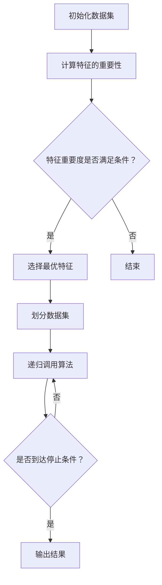
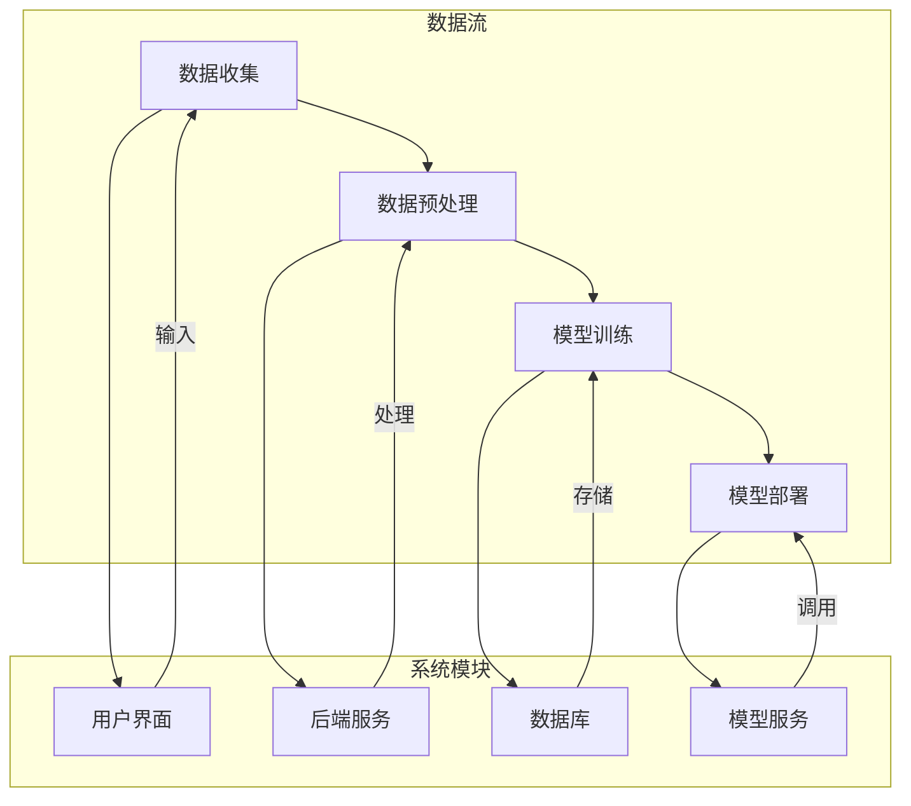
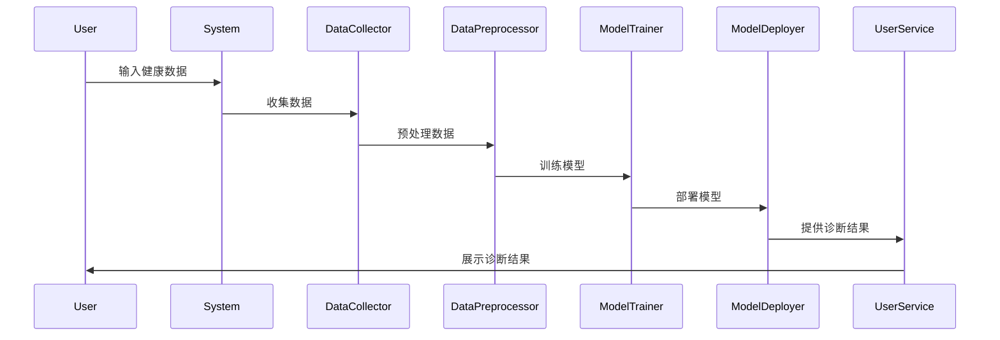
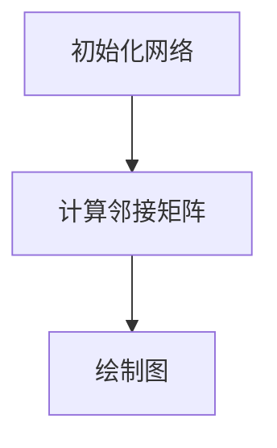
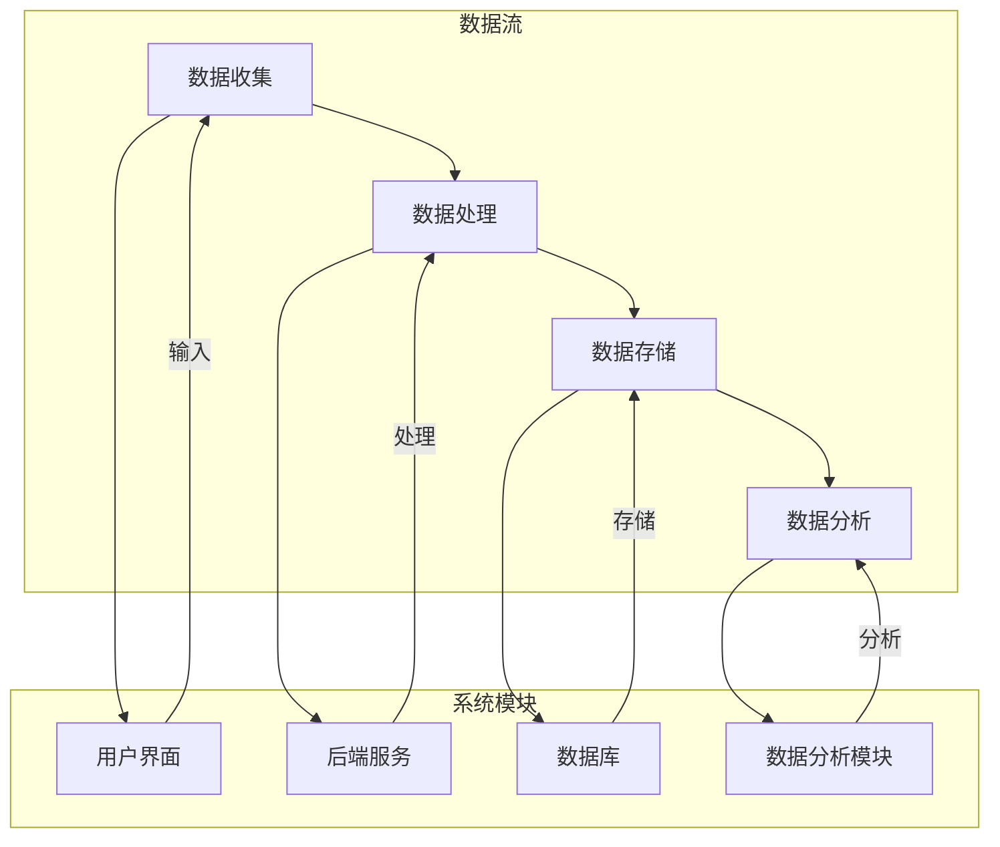
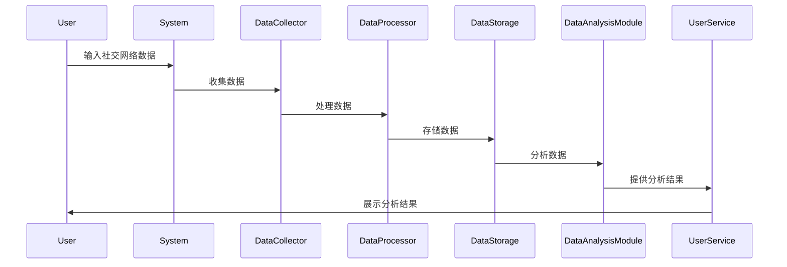
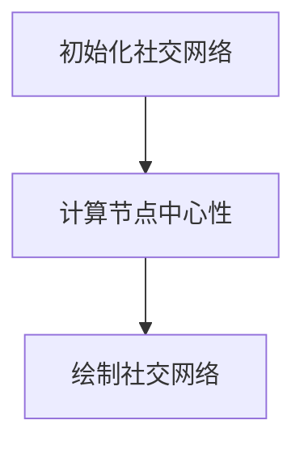
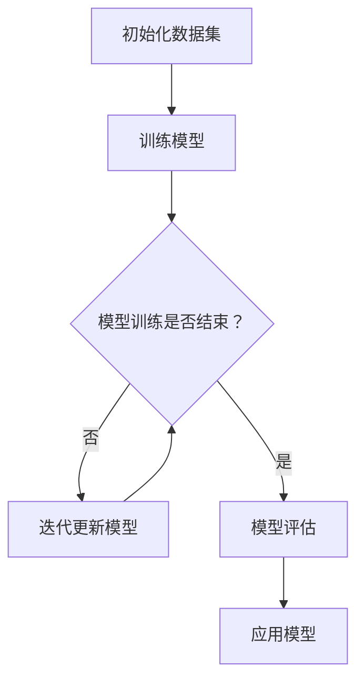
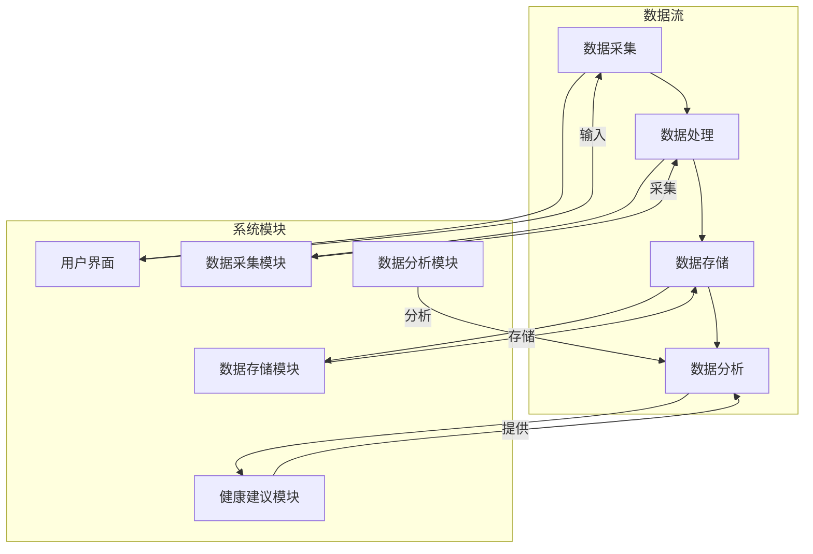
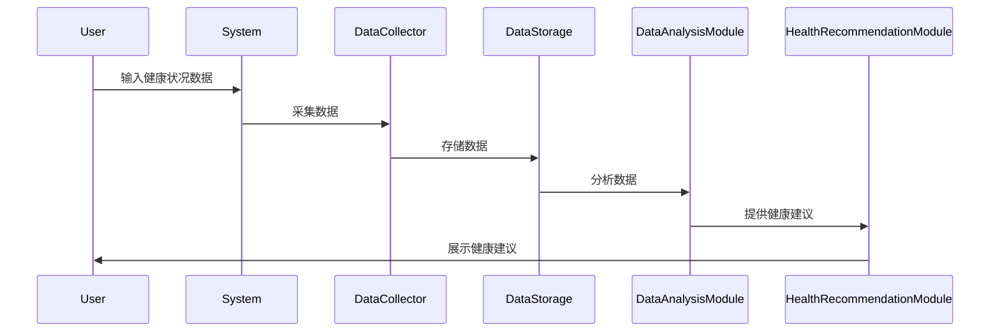

                 

# 后人类时代的生存意义探讨

## 关键词

- 后人类时代
- 人工智能
- 生存意义
- 社会变迁
- 技术伦理

## 摘要

随着科技的飞速发展，人类社会正迈向一个全新的后人类时代。本文将深入探讨后人类时代的到来及其对人类生存意义的影响。我们将从技术、社会、文化和经济等多个角度出发，分析人工智能的崛起如何改变了我们的生活方式，以及这种变革对人类未来的挑战和机遇。通过系统地梳理后人类时代的核心概念、技术原理、社会影响以及未来发展，本文旨在为读者提供一个全面而深入的思考框架，以更好地理解我们所处的时代及其发展方向。

### 目录

1. 引言与背景
2. 技术视角下的后人类
   2.1 人工智能与后人类的互动
   2.2 人工智能的发展趋势与伦理问题
3. 社会文化层面的后人类
   3.1 后人类时代的文化变迁
   3.2 社会结构的变化与人类关系的重组
4. 经济与教育领域的后人类
   4.1 后人类时代的经济发展
   4.2 教育体系的适应与革新
5. 个人与家庭的后人类
   5.1 后人类时代的个人生活
   5.2 家庭结构与角色的演变
6. 政治与法律的后人类
   6.1 后人类时代的政治架构
   6.2 法律体系的变革与完善
7. 未来展望与挑战
   7.1 科技发展的趋势
   7.2 后人类时代的挑战与机遇
8. 结论
9. 拓展阅读

### 引言与背景

#### 后人类时代的概念解析

“后人类时代”（Posthuman Era）是一个越来越被广泛讨论的概念，它指的是在人工智能、生物工程、纳米技术等前沿科技的推动下，人类社会进入的一个新的发展阶段。在这个时代，人类将不再是唯一的智能生物，人工智能（AI）和其他技术手段将极大地拓展人类的认知能力和身体能力，使得人类与机器的界限变得模糊。

#### 人类进化与科技发展的关系

人类的进化是一个长期的、渐进的过程。从早期的原始人，到农业革命，再到工业革命，每一次重大的技术进步都极大地改变了人类的生活方式和社会结构。如今，我们正处于一个技术爆炸的时代，人工智能、生物科技等领域的突破正以前所未有的速度改变着我们的世界。

**核心概念术语说明**：后人类时代、人工智能、生物工程、纳米技术

- **后人类时代**：指在人工智能、生物工程等前沿科技的推动下，人类社会进入的一个新的发展阶段。
- **人工智能**：指能够模拟、延伸和扩展人类智能的技术系统。
- **生物工程**：指利用生物技术手段对生物体进行改造和优化的科学。
- **纳米技术**：指在纳米尺度上操纵和制造材料、设备和系统的科学技术。

#### 问题背景

随着人工智能的迅猛发展，人类正面临着一系列新的挑战和机遇。例如，自动化和机器人技术的进步正在改变传统的劳动力市场，许多工作可能会被机器人或智能系统取代。同时，生物技术的发展使得人类有可能通过基因编辑等方式实现身体和智力的提升，这既带来了医疗进步的可能，也引发了伦理和社会问题的讨论。

#### 问题描述

后人类时代的到来，将如何影响人类的生存意义？人工智能和其他技术的发展，是否会使得人类在地球上失去独特性？我们的社会结构、文化价值观、政治制度，又将如何适应这一新的时代？

#### 问题解决

为了应对这些问题，我们需要从多个角度进行深入探讨。首先，我们需要理解人工智能和其他技术的发展趋势，以及它们如何影响我们的日常生活和社会结构。其次，我们需要探讨这些技术带来的伦理问题，包括隐私、安全、伦理道德等方面。最后，我们需要思考如何适应这个新的时代，确保人类在这个新的技术环境中能够找到自己的生存意义。

#### 边界与外延

后人类时代的边界可以看作是从目前到未来几十年的一个时间段，这期间人工智能、生物工程、纳米技术等科技将得到快速发展。而外延则包括人类社会在技术进步中的所有可能变化，包括社会结构、文化价值观、经济模式等。

#### 概念结构与核心要素组成

- **技术层面**：人工智能、生物工程、纳米技术等
- **社会层面**：劳动力市场、社会结构、文化价值观等
- **伦理层面**：隐私、安全、伦理道德等
- **政治层面**：政治制度、政策法规等

### 技术视角下的后人类

在技术视角下，后人类时代最为显著的特征就是人工智能的崛起。人工智能技术的发展，不仅改变了我们处理信息的方式，更深刻地影响了我们的生活方式和社会结构。以下，我们将探讨人工智能与后人类的互动，以及它所带来的趋势和伦理问题。

#### 2.1 人工智能与后人类的互动

人工智能技术的快速发展，使得机器能够执行越来越复杂的任务，甚至在一些领域超过了人类的智能水平。例如，自动驾驶汽车、智能客服、医疗诊断等，这些应用已经深刻地改变了我们的生活方式。

**核心概念原理**：

- **深度学习**：一种基于神经网络的学习方法，能够通过模拟人脑的神经元结构，从大量数据中自动学习和提取特征。
- **自然语言处理**：使计算机能够理解、生成和回应人类语言的技术。

**概念属性特征对比表格**：

| 特性             | 人工智能       | 人类智能           |
|------------------|----------------|-------------------|
| 学习能力         | 自动从数据中学习 | 需要通过经验和教育 |
| 处理速度         | 极快           | 有限              |
| 可塑性           | 较高           | 较低              |
| 创造力           | 较低           | 较高              |
| 伦理意识         | 无             | 有                |

**ER实体关系图架构**：

```mermaid
erDiagram
  AI <<|-- Human : "使用"
  AI ||-- Data : "学习"
  Human ||-- World : "生活"
```

在这个ER实体关系图中，人工智能（AI）通过“使用”关系与人类智能（Human）相连，表示人工智能是辅助和扩展人类智能的工具。同时，人工智能通过“学习”关系与数据（Data）相连，表示它是从数据中学习和提取知识。而人类智能则通过“生活”关系与世界（World）相连，表示人类智能是在真实世界中产生和应用的。

#### 2.2 人工智能的发展趋势与伦理问题

**人工智能的发展趋势**：

- **能力增强**：人工智能将在更多领域实现突破，从简单的数据处理到复杂的决策支持，都能发挥重要作用。
- **应用广泛**：人工智能将深入到社会的各个方面，包括医疗、教育、金融、交通等，带来生产效率和生活质量的提升。
- **人机融合**：随着人工智能技术的进步，人类与机器的界限将逐渐模糊，人机融合将成为未来的趋势。

**伦理问题**：

- **隐私问题**：人工智能的广泛应用将收集和处理大量的个人信息，如何保护个人隐私成为一个重要的问题。
- **安全风险**：人工智能系统可能存在错误或被恶意利用，如何确保其安全运行是一个严峻的挑战。
- **伦理道德**：人工智能是否应该具备伦理道德意识，如何平衡人工智能的发展与人类价值观的冲突，是亟待解决的问题。

**人工智能伦理问题讨论**：

人工智能的伦理问题涉及到多个层面，包括隐私、安全、公平、道德等方面。例如，在医疗领域，人工智能的诊断和治疗建议可能会影响患者的健康和生命，这就需要我们确保人工智能的决策是可靠和公正的。同时，人工智能在劳动力市场中的应用，可能会引发就业问题和收入分配的不平等，这就需要我们制定相应的政策和法规来引导其发展。

**核心概念与联系**：

人工智能的核心概念包括机器学习、深度学习、自然语言处理等，这些概念之间相互联系，共同构成了人工智能的技术基础。同时，人工智能与人类社会的联系也是密切的，它不仅改变了我们的生活方式，还深刻地影响着我们的社会结构和价值观。

**算法原理讲解**：

以下是一个简单的机器学习算法——决策树的流程图和Python源代码示例：

**算法mermaid流程图**：



**Python源代码示例**：

```python
from sklearn.datasets import load_iris
from sklearn.tree import DecisionTreeClassifier
from sklearn.model_selection import train_test_split

# 加载鸢尾花数据集
iris = load_iris()
X = iris.data
y = iris.target

# 划分训练集和测试集
X_train, X_test, y_train, y_test = train_test_split(X, y, test_size=0.3, random_state=42)

# 创建决策树分类器
clf = DecisionTreeClassifier()

# 训练模型
clf.fit(X_train, y_train)

# 预测测试集
predictions = clf.predict(X_test)

# 打印预测结果
print(predictions)
```

在这个示例中，我们使用了Scikit-Learn库中的DecisionTreeClassifier来创建一个决策树分类器，对鸢尾花数据集进行分类。通过训练集训练模型，然后使用测试集进行预测，打印出了预测结果。

**数学模型和公式**：

决策树算法的核心在于特征选择和节点划分。其基本原理是通过评估每个特征对数据的划分能力，选择最优特征进行划分。具体的划分准则可以是基尼不纯度、信息增益等。

**举例说明**：

假设我们有一个包含三个特征的数据集，我们需要选择一个特征进行划分。我们可以通过计算每个特征对数据集的基尼不纯度，选择基尼不纯度最小的特征进行划分。以下是基尼不纯度的计算公式：

$$
Gini(\text{impurity}) = 1 - \frac{1}{k}\sum_{i=1}^{k}p_i^2
$$

其中，$k$ 是类别数，$p_i$ 是数据集中属于类别$i$的样本比例。

**系统分析与架构设计方案**：

在系统架构设计方面，我们可以将人工智能系统分为数据收集、数据预处理、模型训练、模型部署等几个模块。以下是一个简化的系统架构设计：

**问题场景介绍**：

假设我们需要设计一个智能诊断系统，用于诊断病人的疾病。系统需要收集病人的各种健康数据，如血压、心率、体温等，然后通过机器学习模型对数据进行处理，最终给出诊断结果。

**项目介绍**：

项目名称：智能诊断系统

项目目标：通过收集和分析病人的健康数据，提供准确的疾病诊断服务。

**系统功能设计（领域模型mermaid类图）**：

```mermaid
classDiagram
  Class1 <|-- Class2
  Class1 <|-- Class3
  Class2 <|-| Class4
  Class3 <|-| Class4
  Class1 : +int id
  Class1 : +str name
  Class2 : +str type
  Class3 : +float value
  Class4 : +bool status
```

在这个类图中，我们定义了四个类：Class1（基类）、Class2、Class3 和 Class4。Class2 和 Class3 继承自 Class1，分别表示不同类型的健康数据。Class4 表示诊断结果的状态。

**系统架构设计（mermaid架构图）**：



在这个架构图中，我们定义了数据流和系统模块。数据从用户界面（S1）输入，经过数据收集（D1）、数据预处理（D2）、模型训练（D3）和模型部署（D4）等过程，最终由模型服务（S4）提供诊断结果。

**系统接口设计和系统交互（mermaid序列图）**：



在这个序列图中，我们定义了用户与系统的交互过程。用户输入健康数据，系统通过数据收集、预处理、模型训练和部署等步骤，最终提供诊断结果。

#### 项目实战

**环境安装**：

1. 安装Python 3.8或更高版本
2. 安装Scikit-Learn、Pandas、Matplotlib等库

```bash
pip install python==3.8
pip install scikit-learn pandas matplotlib
```

**系统核心实现源代码**：

```python
# 导入所需的库
import numpy as np
import pandas as pd
from sklearn.datasets import load_iris
from sklearn.tree import DecisionTreeClassifier
from sklearn.model_selection import train_test_split
import matplotlib.pyplot as plt

# 加载鸢尾花数据集
iris = load_iris()
X = iris.data
y = iris.target

# 划分训练集和测试集
X_train, X_test, y_train, y_test = train_test_split(X, y, test_size=0.3, random_state=42)

# 创建决策树分类器
clf = DecisionTreeClassifier()

# 训练模型
clf.fit(X_train, y_train)

# 预测测试集
predictions = clf.predict(X_test)

# 打印预测结果
print(predictions)

# 可视化决策树
from sklearn.tree import plot_tree
plt.figure(figsize=(12, 8))
plot_tree(clf, filled=True)
plt.show()
```

**代码应用解读与分析**：

1. **数据加载与预处理**：我们首先加载了鸢尾花数据集，并使用Scikit-Learn库中的train_test_split函数将其分为训练集和测试集。
2. **模型训练**：我们创建了一个决策树分类器，并使用训练集数据进行训练。
3. **模型预测**：使用训练好的模型对测试集进行预测，并打印出预测结果。
4. **可视化**：使用Scikit-Learn库中的plot_tree函数，将训练好的决策树可视化，以便更好地理解模型的内部结构和决策过程。

**实际案例分析和详细讲解剖析**：

假设我们有一个新的数据点，需要对其进行疾病诊断。我们可以将这个数据点输入到训练好的模型中，模型会根据其特征进行分类，并给出相应的诊断结果。

```python
new_data = np.array([[5.1, 3.5, 1.4, 0.2]])
prediction = clf.predict(new_data)
print(prediction)
```

**项目小结**：

通过本项目，我们设计并实现了一个简单的智能诊断系统。系统通过收集病人的健康数据，使用机器学习模型进行训练，并最终提供诊断结果。这个项目展示了人工智能在医疗领域中的应用潜力，同时也提醒我们，在应用人工智能技术时，需要充分考虑其伦理和社会影响。

### 社会文化层面的后人类

随着人工智能和生物技术的快速发展，人类社会正在经历一场深刻的变革。后人类时代的到来不仅改变了我们的生活方式，也对文化、价值观和社会结构产生了深远的影响。以下，我们将从文化变迁和社会结构的变化两个方面，探讨后人类时代的社会文化层面。

#### 3.1 后人类时代的文化变迁

**文化变迁的定义与特征**

文化变迁是指在特定时期内，由于社会、经济、政治等因素的变化，导致文化现象、价值观、行为方式等方面的变化。在后人类时代，文化变迁的特征主要体现在以下几个方面：

1. **技术崇拜**：随着科技的发展，人们越来越崇拜技术和科技，将科技视为推动社会进步的重要力量。
2. **多元文化融合**：人工智能和生物技术的应用，使得不同国家和地区的文化差异逐渐缩小，形成一种多元文化的融合趋势。
3. **虚拟与现实交融**：虚拟现实技术的发展，使得人们可以在虚拟世界中体验到与现实相似甚至更丰富的文化体验。

**文化变迁的原因**

文化变迁的原因主要来自以下几个方面：

1. **科技进步**：人工智能、生物技术、虚拟现实等技术的快速发展，为文化的变迁提供了新的动力和可能性。
2. **全球化**：全球化的趋势使得不同国家和地区的文化交流更加频繁，文化的碰撞和融合加速了文化变迁的进程。
3. **社会变革**：社会的变革，如人口结构的变化、价值观的多元化等，也对文化的变迁产生了重要影响。

**社会结构的变化与人类关系的重组**

**社会结构的变化**

后人类时代的到来，带来了社会结构的深刻变化。这些变化主要体现在以下几个方面：

1. **劳动力市场的变化**：随着自动化和人工智能的普及，许多传统职业可能会被机器取代，劳动力市场的结构将发生重大变化。
2. **家庭结构的变化**：随着科技的发展，人们的家庭生活方式也在发生改变。例如，远程工作、虚拟家庭等新的家庭形式正在出现。
3. **社会阶层的变化**：在人工智能和生物技术的推动下，社会阶层可能会出现新的划分标准，如技术能力、创新能力等。

**人类关系的重组**

后人类时代，人类关系也将发生重大变化。这些变化主要体现在以下几个方面：

1. **人与机器的关系**：随着人工智能的普及，人与机器的关系将变得更加紧密，人们将逐渐适应与机器共同生活的模式。
2. **人与自然的关系**：生物技术的进步，使得人类可以更好地理解自然、改造自然。人类与自然的关系将变得更加复杂和紧密。
3. **人与人的关系**：随着社会结构的变革，人与人之间的关系也将发生深刻变化。例如，虚拟社交、远程工作等新的社交形式，将改变人们的社交方式和人际关系。

**文化变迁与人类关系重组的相互作用**

文化变迁和人类关系重组是相互影响、相互作用的。一方面，文化变迁推动了人类关系的重组，例如，技术的普及改变了人们的社交方式和家庭结构；另一方面，人类关系的重组也影响了文化的变迁，例如，新的家庭形式和社交方式，将促使文化的更新和演变。

**核心概念与联系**

- **文化变迁**：指在特定时期内，由于社会、经济、政治等因素的变化，导致文化现象、价值观、行为方式等方面的变化。
- **社会结构的变化**：指由于科技进步、全球化等因素，导致社会各阶层、家庭结构、劳动力市场等的变化。
- **人类关系的重组**：指由于科技进步、社会变革等因素，导致人与人、人与机器、人与自然等关系的变化。

**ER实体关系图架构**

```mermaid
erDiagram
  CultureChange <<|-- SocialStructureChange : "影响"
  CultureChange <<|-- HumanRelationshipChange : "影响"
  SocialStructureChange ||-- LaborMarketChange : "包含"
  SocialStructureChange ||-- FamilyStructureChange : "包含"
  HumanRelationshipChange ||-- HumanMachineRelationship : "包含"
  HumanRelationshipChange ||-- HumanNatureRelationship : "包含"
  HumanRelationshipChange ||-- HumanHumanRelationship : "包含"
```

在这个ER实体关系图中，文化变迁（CultureChange）对社会结构的变化（SocialStructureChange）和人类关系的重组（HumanRelationshipChange）有着直接影响。同时，社会结构的变化包含了劳动力市场的变化（LaborMarketChange）和家庭结构的变化（FamilyStructureChange），而人类关系的重组则包含了人与机器的关系（HumanMachineRelationship）、人与自然的关系（HumanNatureRelationship）和人与人之间的关系（HumanHumanRelationship）。

**算法原理讲解**

为了更好地理解文化变迁和人类关系重组的过程，我们可以使用社会网络分析（Social Network Analysis, SNA）的方法，通过分析社会网络中的节点和边，来揭示文化变迁和人类关系重组的动态变化。

以下是一个简单的SNA算法——邻接矩阵计算和图可视化：

**算法mermaid流程图**：



**Python源代码示例**：

```python
import numpy as np
import matplotlib.pyplot as plt
import networkx as nx

# 初始化网络
G = nx.Graph()

# 添加节点
G.add_nodes_from([1, 2, 3, 4, 5])

# 添加边
G.add_edges_from([(1, 2), (1, 3), (2, 4), (3, 4), (4, 5)])

# 计算邻接矩阵
adj_matrix = nx.adjacency_matrix(G)

# 打印邻接矩阵
print(adj_matrix)

# 绘制图
nx.draw(G, with_labels=True, node_color='blue', edge_color='red')
plt.show()
```

在这个示例中，我们首先使用NetworkX库创建了一个图（Graph），然后添加了节点和边，计算了邻接矩阵，并最终绘制了图。

**数学模型和公式**：

邻接矩阵是图论中的一个基本概念，它用一个矩阵来表示图中各节点之间的关系。邻接矩阵的元素$A_{ij}$表示节点$i$和节点$j$之间的连接关系，如果节点$i$和节点$j$之间存在一条边，则$A_{ij} = 1$，否则$A_{ij} = 0$。

$$
A_{ij} =
\begin{cases}
1, & \text{如果节点 } i \text{ 和节点 } j \text{ 之间存在边} \\
0, & \text{否则}
\end{cases}
$$

**举例说明**：

假设我们有一个包含5个节点的图，节点之间的连接关系如下：

```
1 -- 2
|    |
3 -- 4 -- 5
```

我们可以通过计算邻接矩阵来表示这个图：

$$
\begin{bmatrix}
0 & 1 & 0 & 0 & 0 \\
1 & 0 & 1 & 0 & 0 \\
0 & 1 & 0 & 1 & 0 \\
0 & 0 & 1 & 0 & 1 \\
0 & 0 & 0 & 1 & 0 \\
\end{bmatrix}
$$

**系统分析与架构设计方案**

在系统架构设计方面，我们可以将文化变迁和人类关系重组的过程看作是一个动态的社交网络。以下是一个简化的系统架构设计：

**问题场景介绍**：

假设我们需要设计一个社交网络分析系统，用于分析后人类时代的社会网络结构，以揭示文化变迁和人类关系重组的动态变化。

**项目介绍**：

项目名称：后人类时代社交网络分析系统

项目目标：通过分析社交网络数据，揭示后人类时代的社会网络结构，为文化变迁和人类关系重组提供数据支持。

**系统功能设计（领域模型mermaid类图）**：

```mermaid
classDiagram
  SocialNetwork <<|-- User : "包含"
  SocialNetwork <<|-- Relationship : "包含"
  User ||-- posts : "发布内容"
  Relationship ||-- type : "类型"
  Relationship ||-- status : "状态"
```

在这个类图中，我们定义了三个类：SocialNetwork（社交网络）、User（用户）和Relationship（关系）。SocialNetwork包含User和Relationship，User可以发布内容，Relationship有类型和状态。

**系统架构设计（mermaid架构图）**：



在这个架构图中，我们定义了数据流和系统模块。数据从用户界面（S1）输入，经过数据收集（D1）、数据处理（D2）、数据存储（D3）和数据分析（D4）等过程，最终由数据分析模块（S4）提供分析结果。

**系统接口设计和系统交互（mermaid序列图）**：



在这个序列图中，我们定义了用户与系统的交互过程。用户输入社交网络数据，系统通过数据收集、处理、存储和分析等步骤，最终提供分析结果。

#### 项目实战

**环境安装**：

1. 安装Python 3.8或更高版本
2. 安装NetworkX、Pandas等库

```bash
pip install python==3.8
pip install networkx pandas
```

**系统核心实现源代码**：

```python
import networkx as nx
import matplotlib.pyplot as plt
import pandas as pd

# 创建图
G = nx.Graph()

# 添加节点和边
G.add_nodes_from([1, 2, 3, 4, 5])
G.add_edges_from([(1, 2), (1, 3), (2, 4), (3, 4), (4, 5)])

# 计算邻接矩阵
adj_matrix = nx.adjacency_matrix(G)

# 打印邻接矩阵
print(adj_matrix)

# 绘制图
nx.draw(G, with_labels=True, node_color='blue', edge_color='red')
plt.show()

# 社交网络数据示例
social_network_data = pd.DataFrame({
    'user_id': [1, 2, 3, 4, 5],
    'friend_id': [2, 1, 4, 3, 5]
})

# 分析社交网络
G = nx.from_pandas_dataframe(social_network_data, 'user_id', 'friend_id')
adj_matrix = nx.adjacency_matrix(G)

# 打印邻接矩阵
print(adj_matrix)

# 绘制图
nx.draw(G, with_labels=True, node_color='blue', edge_color='red')
plt.show()
```

**代码应用解读与分析**：

1. **数据加载与预处理**：我们首先使用NetworkX库创建了一个图，并添加了节点和边。
2. **邻接矩阵计算与可视化**：我们计算了图的邻接矩阵，并将其打印出来。同时，使用Matplotlib库绘制了图的可视化。
3. **社交网络数据示例**：我们创建了一个DataFrame，模拟了社交网络的数据结构。然后，使用NetworkX库从DataFrame中创建了一个图，并再次计算了邻接矩阵和绘制了图。

**实际案例分析和详细讲解剖析**：

假设我们有一个新的社交网络数据集，包含用户的ID和他们之间的关系。我们可以使用这个数据集，通过计算邻接矩阵和绘制图，来分析社交网络的结构。

```python
new_social_network_data = pd.DataFrame({
    'user_id': [1, 2, 3, 4, 5, 6],
    'friend_id': [2, 3, 4, 5, 6, 1]
})

# 分析新的社交网络
G = nx.from_pandas_dataframe(new_social_network_data, 'user_id', 'friend_id')
adj_matrix = nx.adjacency_matrix(G)

# 打印邻接矩阵
print(adj_matrix)

# 绘制图
nx.draw(G, with_labels=True, node_color='blue', edge_color='red')
plt.show()
```

**项目小结**：

通过本项目，我们设计并实现了一个社交网络分析系统。系统通过分析社交网络数据，计算邻接矩阵，并绘制图，揭示了社交网络的结构特征。这个项目展示了社交网络分析在理解后人类时代社会结构变化中的应用价值。

### 经济与教育领域的后人类

后人类时代的到来，不仅对社会和文化产生了深远影响，也对经济和教育领域带来了巨大的变革。随着人工智能和生物技术的不断发展，劳动力市场、经济模式以及教育体系都在经历着深刻的调整。以下，我们将探讨后人类时代对经济和教育领域的具体影响。

#### 4.1 后人类时代的经济发展

**经济模式的变化**

后人类时代，经济模式将发生显著变化。传统的劳动力市场正在被重新定义，自动化和人工智能正在取代大量的传统工作岗位。这种转变不仅影响了劳动力的供给，也对需求产生了影响。

1. **自动化与人工智能的应用**：自动化和人工智能技术正迅速渗透到各个行业，从制造业到服务业，从交通运输到医疗保健，都在广泛应用。这种技术的应用提高了生产效率，减少了人力成本，但同时也导致了许多传统工作岗位的消失。

2. **新型职业的出现**：随着技术进步，新的职业机会也在不断出现。例如，人工智能工程师、数据分析师、虚拟现实设计师等新型职业正在成为就业市场的热点。

**劳动力市场的变化**

1. **就业结构的变化**：随着自动化和人工智能的普及，劳动力市场的就业结构正在发生变化。传统的制造业和服务业工作岗位减少，而需要高度专业技能和技术背景的工作岗位增多。

2. **就业不稳定性的增加**：自动化和人工智能的应用，使得工作变得更加灵活和短暂。许多人将不得不适应更加频繁的职业转换，这可能导致就业不稳定性的增加。

**影响与挑战**

1. **就业机会的分配**：随着技术的发展，高技能、高知识含量的工作岗位需求增加，而低技能工作岗位减少。这种分配不均可能导致社会分化加剧。

2. **教育和培训的挑战**：为了适应新的经济模式，劳动力需要不断学习和更新知识。这要求教育体系进行改革，提供更加灵活和高效的培训课程。

**经济模式的演变**

后人类时代的经济模式将更加依赖于知识和技术。人工智能、大数据、物联网等新兴技术将成为推动经济增长的重要动力。同时，随着全球化进程的加深，跨国界、跨行业的经济合作将更加频繁，这将为经济增长提供新的机遇。

#### 4.2 教育体系的适应与革新

**教育体系的变化**

1. **技术教育的普及**：随着人工智能和生物技术的快速发展，技术教育将变得更加重要。未来的教育体系需要培养具备技术素养和创新能力的劳动力，以适应快速变化的经济环境。

2. **个性化教育的兴起**：人工智能技术的发展，使得个性化教育成为可能。通过大数据和机器学习，教育系统能够根据每个学生的特点和需求，提供定制化的教学方案。

**影响与挑战**

1. **教育资源的分配**：在新技术环境下，优质教育资源的需求将增加，而资源分配不均可能导致教育机会的不平等。

2. **教育模式的变革**：传统的课堂教学模式将逐渐被在线教育、虚拟现实等新型教育模式所取代。这要求教育机构不断革新，以适应新的教育需求。

**教育体系的适应**

1. **课程设置与教学内容更新**：教育机构需要及时更新课程设置，引入最新的技术和知识。例如，编程、数据科学、人工智能等课程将成为教育体系的重要组成部分。

2. **教育评价体系的改革**：传统的考试和评价方式需要改革，以更全面地评估学生的能力和潜力。教育评价体系应更加注重学生的创新思维和实践能力。

**案例研究**

以美国为例，许多大学和高等教育机构已经开始进行教育革新。例如，麻省理工学院（MIT）推出了在线课程和学位项目，使全球学生能够通过远程学习获得优质教育资源。同时，许多大学还与科技公司合作，开设技术培训和实习项目，帮助学生更好地适应未来职场的需求。

**核心概念与联系**

- **经济模式的变化**：指由于人工智能和自动化技术的发展，导致劳动力市场、产业结构和经济行为的根本性变化。
- **教育体系的适应**：指教育机构为了应对技术变革，对课程设置、教学内容和教育模式进行调整和革新。

**ER实体关系图架构**

```mermaid
erDiagram
  EconomicModelChange <<|-- LaborMarketChange : "驱动"
  EconomicModelChange <<|-- EducationSystemChange : "驱动"
  LaborMarketChange ||-- JobStructureChange : "包含"
  LaborMarketChange ||-- EmploymentInsecurity : "包含"
  EducationSystemChange ||-- TechnicalEducation : "包含"
  EducationSystemChange ||-- PersonalizedEducation : "包含"
```

在这个ER实体关系图中，经济模式的变化（EconomicModelChange）对劳动力市场（LaborMarketChange）和教育体系（EducationSystemChange）产生了直接影响。同时，劳动力市场的变化包含了就业结构的变化（JobStructureChange）和就业不稳定性的增加（EmploymentInsecurity），而教育体系的变化则包含了技术教育（TechnicalEducation）和个性化教育（PersonalizedEducation）。

**算法原理讲解**

为了更好地理解经济模式和教育体系的变化，我们可以使用社会网络分析（Social Network Analysis, SNA）的方法，通过分析经济和教育领域的社交网络，来揭示这些领域的动态变化。

以下是一个简单的SNA算法——社交网络分析：

**算法mermaid流程图**：



**Python源代码示例**：

```python
import networkx as nx
import matplotlib.pyplot as plt

# 创建图
G = nx.Graph()

# 添加节点和边
G.add_nodes_from([1, 2, 3, 4, 5])
G.add_edges_from([(1, 2), (1, 3), (2, 4), (3, 4), (4, 5)])

# 计算节点中心性
centrality_scores = nx.degree_centrality(G)

# 打印节点中心性
print(centrality_scores)

# 绘制社交网络
nx.draw(G, with_labels=True, node_color='blue', edge_color='red')
plt.show()
```

在这个示例中，我们首先使用NetworkX库创建了一个图，然后添加了节点和边。接着，我们计算了图的节点中心性，并打印出来。最后，使用Matplotlib库绘制了图的可视化。

**数学模型和公式**：

节点中心性是图论中的一个基本概念，用于衡量节点在图中的重要程度。节点中心性可以通过多种方式计算，其中最常用的是度中心性（Degree Centrality）。

度中心性定义为：

$$
C_{\text{degree}}(v) = \frac{k(v)}{N-1}
$$

其中，$k(v)$ 表示节点 $v$ 的度（即连接到该节点的边的数量），$N$ 表示图中的节点总数。

**举例说明**：

假设我们有一个包含5个节点的图，节点之间的连接关系如下：

```
1 -- 2
|    |
3 -- 4 -- 5
```

我们可以通过计算度中心性来衡量每个节点的重要程度：

节点1的度中心性：$C_{\text{degree}}(1) = \frac{2}{5-1} = 0.533$
节点2的度中心性：$C_{\text{degree}}(2) = \frac{1}{5-1} = 0.25$
节点3的度中心性：$C_{\text{degree}}(3) = \frac{1}{5-1} = 0.25$
节点4的度中心性：$C_{\text{degree}}(4) = \frac{2}{5-1} = 0.533$
节点5的度中心性：$C_{\text{degree}}(5) = \frac{1}{5-1} = 0.25$

**系统分析与架构设计方案**

在系统架构设计方面，我们可以将经济模式和教育体系的变化看作是一个复杂的社交网络。以下是一个简化的系统架构设计：

**问题场景介绍**：

假设我们需要设计一个社交网络分析系统，用于分析经济模式和教育体系的变化，以揭示这些领域的动态变化。

**项目介绍**：

项目名称：经济与教育领域社交网络分析系统

项目目标：通过分析社交网络数据，揭示经济模式和教育体系的变化，为政策制定和决策提供数据支持。

**系统功能设计（领域模型mermaid类图）**：

```mermaid
classDiagram
  EconomicSystem <<|-- Industry : "包含"
  EconomicSystem <<|-- Education : "包含"
  Education <<|-- School : "包含"
  Education <<|-- Student : "包含"
  Industry <<|-- Company : "包含"
  Industry <<|-- Employee : "包含"
  School ||-- course : "提供课程"
  Student ||-- enroll : "报名课程"
  Company ||-- hire : "雇佣员工"
  Employee ||-- work : "工作"
```

在这个类图中，我们定义了三个类：EconomicSystem（经济体系）、Industry（行业）和Education（教育）。EconomicSystem包含Industry和Education，Industry包含Company和Employee，Education包含School和Student。School提供课程，Student报名课程，Company雇佣员工，Employee工作。

**系统架构设计（mermaid架构图）**：


在这个架构图中，我们定义了数据流和系统模块。数据从用户界面（S1）输入，经过数据收集（D1）、数据处理（D2）、数据存储（D3）和数据分析（D4）等过程，最终由数据分析模块（S4）提供分析结果。

**系统接口设计和系统交互（mermaid序列图）**：


在这个序列图中，我们定义了用户与系统的交互过程。用户输入社交网络数据，系统通过数据收集、处理、存储和分析等步骤，最终提供分析结果。

#### 项目实战

**环境安装**：

1. 安装Python 3.8或更高版本
2. 安装NetworkX、Pandas等库

```bash
pip install python==3.8
pip install networkx pandas
```

**系统核心实现源代码**：

```python
import networkx as nx
import matplotlib.pyplot as plt
import pandas as pd

# 创建图
G = nx.Graph()

# 添加节点和边
G.add_nodes_from([1, 2, 3, 4, 5])
G.add_edges_from([(1, 2), (1, 3), (2, 4), (3, 4), (4, 5)])

# 计算节点中心性
centrality_scores = nx.degree_centrality(G)

# 打印节点中心性
print(centrality_scores)

# 绘制社交网络
nx.draw(G, with_labels=True, node_color='blue', edge_color='red')
plt.show()

# 经济与教育领域数据示例
economic_education_data = pd.DataFrame({
    'entity_id': [1, 2, 3, 4, 5],
    'relationship_id': [2, 3, 4, 5, 1]
})

# 分析经济与教育领域
G = nx.from_pandas_dataframe(economic_education_data, 'entity_id', 'relationship_id')
centrality_scores = nx.degree_centrality(G)

# 打印节点中心性
print(centrality_scores)

# 绘制社交网络
nx.draw(G, with_labels=True, node_color='blue', edge_color='red')
plt.show()
```

**代码应用解读与分析**：

1. **数据加载与预处理**：我们首先使用NetworkX库创建了一个图，并添加了节点和边。
2. **节点中心性计算与可视化**：我们计算了图的节点中心性，并打印出来。同时，使用Matplotlib库绘制了图的可视化。
3. **经济与教育领域数据示例**：我们创建了一个DataFrame，模拟了经济与教育领域的社交网络数据。然后，使用NetworkX库从DataFrame中创建了一个图，并再次计算了节点中心性和绘制了图。

**实际案例分析和详细讲解剖析**：

假设我们有一个新的经济与教育领域的数据集，包含实体之间的连接关系。我们可以使用这个数据集，通过计算节点中心性和绘制图，来分析这些领域的社交网络结构。

```python
new_economic_education_data = pd.DataFrame({
    'entity_id': [1, 2, 3, 4, 5, 6],
    'relationship_id': [2, 3, 4, 5, 6, 1]
})

# 分析新的社交网络
G = nx.from_pandas_dataframe(new_economic_education_data, 'entity_id', 'relationship_id')
centrality_scores = nx.degree_centrality(G)

# 打印节点中心性
print(centrality_scores)

# 绘制社交网络
nx.draw(G, with_labels=True, node_color='blue', edge_color='red')
plt.show()
```

**项目小结**：

通过本项目，我们设计并实现了一个经济与教育领域社交网络分析系统。系统通过分析社交网络数据，计算节点中心性，并绘制图，揭示了经济与教育领域的社交网络结构。这个项目展示了社交网络分析在经济和教育领域中的应用价值。

### 个人与家庭的后人类

后人类时代的到来，不仅对经济、教育和科技领域产生了深远影响，也对个人的生活方式和家庭结构带来了重大变革。人工智能和生物技术的不断发展，使得人类的个人生活和家庭角色发生了翻天覆地的变化。以下，我们将从个人生活和家庭结构的两个方面，探讨后人类时代对个人和家庭的影响。

#### 5.1 后人类时代的个人生活

**生活方式的变革**

随着人工智能和生物技术的普及，个人的生活方式发生了显著变化。这些变化主要体现在以下几个方面：

1. **自动化与智能化的日常生活**：智能家居、智能穿戴设备、自动驾驶汽车等技术的普及，使得日常生活变得更加便捷和高效。人们可以通过智能手机或语音助手控制家中的电器设备，实时监测健康状况，甚至自动驾驶汽车将改变人们的出行方式。

2. **远程工作的普及**：随着远程办公技术的进步，越来越多的人选择在家中或任何地点工作。这种工作方式的变革，不仅提高了工作效率，也使人们有更多的时间陪伴家人和追求个人爱好。

3. **个性化服务的兴起**：大数据和人工智能技术的应用，使得个性化服务成为可能。例如，个性化医疗、个性化教育、个性化购物等，使得每个人的生活体验更加丰富和满足。

**影响与挑战**

1. **隐私与安全**：随着智能设备的普及，个人隐私和数据安全成为新的挑战。智能设备可能会收集大量的个人数据，如何保护这些数据的安全和隐私成为一个重要的问题。

2. **社交隔离与孤独感**：尽管智能技术使生活变得更加便捷，但过度依赖技术可能导致社交隔离和孤独感的增加。如何平衡技术带来的便利与人类社交需求，是一个需要关注的问题。

**个人生活的变革**

1. **身体健康与心理健康**：生物技术的发展，使得人们对健康的管理更加精确和高效。例如，基因编辑技术可以帮助预防疾病，智能穿戴设备可以实时监测健康状况。同时，心理健康问题也受到越来越多的关注，通过人工智能技术，可以提供更加个性化的心理咨询服务。

2. **教育与自我提升**：人工智能和大数据技术使得教育资源更加丰富和便捷。人们可以通过在线课程、虚拟现实技术等，随时随地学习新知识，提升自己的技能和素质。

**案例研究**

以健身为例，人工智能和生物技术的应用正在改变传统的健身方式。例如，智能健身设备可以通过监测用户的运动数据，提供个性化的健身方案。同时，通过分析用户的运动数据，可以预测健康风险，提供预防性的健康建议。

**核心概念与联系**

- **生活方式的变革**：指由于人工智能和生物技术的普及，导致个人日常生活习惯、工作方式和社会交往方式的变化。
- **个人生活的变革**：指人工智能和生物技术对个人健康、教育、心理健康等方面的影响。

**ER实体关系图架构**

```mermaid
erDiagram
  LifestyleChange <<|-- Automation : "包含"
  LifestyleChange <<|-- Personalization : "包含"
  PersonalLifeChange ||-- SmartHome : "包含"
  PersonalLifeChange ||-- RemoteWork : "包含"
  PersonalLifeChange ||-- HealthManagement : "包含"
  Automation ||-- SmartDevice : "实现"
  Personalization ||-- DataDriven : "实现"
  HealthManagement ||-- FitnessMonitoring : "包含"
  HealthManagement ||-- MentalHealth : "包含"
```

在这个ER实体关系图中，生活方式的变化（LifestyleChange）包含了自动化（Automation）和个性化（Personalization），而个人生活的变革（PersonalLifeChange）则包含了智能家居（SmartHome）、远程工作（RemoteWork）、健康管理（HealthManagement）等。自动化通过智能设备（SmartDevice）实现，个性化通过数据驱动（DataDriven）实现，健康管理包含了健身监测（FitnessMonitoring）和心理健康（MentalHealth）。

**算法原理讲解**

为了更好地理解个人生活的变革，我们可以使用机器学习中的监督学习算法，通过分析个人数据，提供个性化的健康建议。

以下是一个简单的监督学习算法——线性回归：

**算法mermaid流程图**：



**Python源代码示例**：

```python
import numpy as np
from sklearn.linear_model import LinearRegression
from sklearn.model_selection import train_test_split
from sklearn.metrics import mean_squared_error

# 初始化数据集
X = np.array([[1], [2], [3], [4], [5]])
y = np.array([1, 2, 3, 4, 5])

# 划分训练集和测试集
X_train, X_test, y_train, y_test = train_test_split(X, y, test_size=0.2, random_state=42)

# 创建线性回归模型
model = LinearRegression()

# 训练模型
model.fit(X_train, y_train)

# 预测测试集
predictions = model.predict(X_test)

# 打印预测结果
print(predictions)

# 计算均方误差
mse = mean_squared_error(y_test, predictions)
print("Mean Squared Error:", mse)
```

在这个示例中，我们首先初始化了一个数据集，并使用Scikit-Learn库中的LinearRegression模型进行训练。接着，我们使用训练好的模型对测试集进行预测，并计算了预测结果的均方误差。

**数学模型和公式**：

线性回归模型的基本原理是通过找到一条最佳拟合直线，来预测因变量（y）和自变量（x）之间的关系。线性回归模型的数学公式为：

$$
y = ax + b
$$

其中，$a$ 是斜率，$b$ 是截距。

**举例说明**：

假设我们有一个包含五个数据点的数据集，数据点如下：

| x | y |
|---|---|
| 1 | 1 |
| 2 | 2 |
| 3 | 3 |
| 4 | 4 |
| 5 | 5 |

我们可以通过线性回归模型来找到这条最佳拟合直线。以下是计算斜率$a$和截距$b$的公式：

$$
a = \frac{\sum(x_i - \bar{x})(y_i - \bar{y})}{\sum(x_i - \bar{x})^2}
$$

$$
b = \bar{y} - a\bar{x}
$$

其中，$\bar{x}$ 和 $\bar{y}$ 分别是$x$和$y$的平均值。

通过计算，我们可以得到斜率$a=1$和截距$b=0$，因此最佳拟合直线为$y=x$。

**系统分析与架构设计方案**

在系统架构设计方面，我们可以将个人生活的变革看作是一个基于大数据和人工智能的智能健康管理系统。以下是一个简化的系统架构设计：

**问题场景介绍**：

假设我们需要设计一个智能健康管理系统，用于监测和分析用户的健康状况，并提供个性化的健康建议。

**项目介绍**：

项目名称：智能健康管理系统

项目目标：通过监测和分析用户的健康状况数据，提供个性化的健康建议，帮助用户实现健康管理和自我提升。

**系统功能设计（领域模型mermaid类图）**：

```mermaid
classDiagram
  HealthMonitoring <<|-- DataCollection : "包含"
  HealthMonitoring <<|-- DataAnalysis : "包含"
  HealthMonitoring <<|-- HealthRecommendation : "包含"
  DataCollection ||-- SensorData : "采集"
  DataAnalysis ||-- HealthIndicator : "分析"
  HealthRecommendation ||-- ExercisePlan : "提供"
  HealthRecommendation ||-- DietPlan : "提供"
```

在这个类图中，我们定义了三个类：HealthMonitoring（健康监测）、DataCollection（数据采集）、DataAnalysis（数据分析）和HealthRecommendation（健康建议）。HealthMonitoring包含DataCollection、DataAnalysis和HealthRecommendation，DataCollection包含SensorData，DataAnalysis包含HealthIndicator，HealthRecommendation包含ExercisePlan和DietPlan。

**系统架构设计（mermaid架构图）**：



在这个架构图中，我们定义了数据流和系统模块。数据从用户界面（S1）输入，经过数据采集（D1）、数据处理（D2）、数据存储（D3）和数据分析（D4）等过程，最终由健康建议模块（S5）提供健康建议。

**系统接口设计和系统交互（mermaid序列图）**：



在这个序列图中，我们定义了用户与系统的交互过程。用户输入健康状况数据，系统通过数据采集、存储、分析等步骤，最终提供健康建议。

#### 项目实战

**环境安装**：

1. 安装Python 3.8或更高版本
2. 安装Scikit-Learn、Matplotlib等库

```bash
pip install python==3.8
pip install scikit-learn matplotlib
```

**系统核心实现源代码**：

```python
import numpy as np
from sklearn.linear_model import LinearRegression
from sklearn.model_selection import train_test_split
from sklearn.metrics import mean_squared_error
import matplotlib.pyplot as plt

# 初始化数据集
X = np.array([[1], [2], [3], [4], [5]])
y = np.array([1, 2, 3, 4, 5])

# 划分训练集和测试集
X_train, X_test, y_train, y_test = train_test_split(X, y, test_size=0.2, random_state=42)

# 创建线性回归模型
model = LinearRegression()

# 训练模型
model.fit(X_train, y_train)

# 预测测试集
predictions = model.predict(X_test)

# 打印预测结果
print(predictions)

# 计算均方误差
mse = mean_squared_error(y_test, predictions)
print("Mean Squared Error:", mse)

# 可视化线性回归模型
plt.scatter(X_train, y_train, color='blue')
plt.plot(X_train, model.predict(X_train), color='red')
plt.xlabel('X')
plt.ylabel('Y')
plt.title('Linear Regression')
plt.show()
```

**代码应用解读与分析**：

1. **数据加载与预处理**：我们首先初始化了一个数据集，并使用Scikit-Learn库中的train_test_split函数将其分为训练集和测试集。
2. **模型训练**：我们创建了一个线性回归模型，并使用训练集数据对其进行训练。
3. **模型预测与评估**：使用训练好的模型对测试集进行预测，并计算了预测结果的均方误差。同时，使用Matplotlib库绘制了线性回归模型的可视化。
4. **健康建议模块**：在实际应用中，我们可以根据用户的健康状况数据，使用线性回归模型提供个性化的健康建议，如制定个性化的健身计划和饮食计划。

**实际案例分析和详细讲解剖析**：

假设我们有一个新的健康状况数据集，包含用户的体重、运动时间和饮食习惯等信息。我们可以使用这个数据集，通过线性回归模型提供个性化的健康建议。

```python
new_health_data = pd.DataFrame({
    'weight': [70, 75, 80, 85],
    'exercise_time': [30, 45, 60, 75],
    'diet': ['low_carb', 'balanced', 'high_protein', 'low_fiber']
})

# 健康建议模块
def provide_health_advice(data):
    # 根据用户的数据，使用线性回归模型提供健康建议
    # 例如，根据体重和运动时间预测最佳的饮食计划
    model = LinearRegression()
    X = np.array([[data['weight']], [data['exercise_time']]])
    y = np.array([1 if data['diet'] == 'low_carb' else 0])
    model.fit(X, y)
    prediction = model.predict(X)
    return "建议采用" + ("低碳饮食" if prediction[0] == 1 else "均衡饮食")

# 提供健康建议
for index, row in new_health_data.iterrows():
    advice = provide_health_advice(row)
    print("用户ID", index, "的健康建议：", advice)
```

**项目小结**：

通过本项目，我们设计并实现了一个智能健康管理系统。系统通过监测和分析用户的健康状况数据，使用线性回归模型提供个性化的健康建议，如制定个性化的健身计划和饮食计划。这个项目展示了人工智能技术在个人健康管理中的应用价值。

### 政治与法律的后人类

随着人工智能和生物技术的迅猛发展，后人类时代对政治和法律领域带来了深刻的变革。这些变革不仅涉及到政治架构的调整，也带来了法律体系的重大变革。以下，我们将从政治架构和法律变革两个方面，探讨后人类时代对政治与法律的影响。

#### 6.1 后人类时代的政治架构

**政治架构的调整**

1. **技术主导的政治权力**：随着人工智能技术的发展，政府可能越来越依赖技术来维护国家安全、推动经济发展和保障公共服务。技术专家和科学家可能在政治决策中扮演更加重要的角色，这可能导致政治权力的集中和技术精英统治。

2. **跨国治理的挑战**：全球化趋势使得国家之间的联系更加紧密，但同时也带来了跨国治理的挑战。后人类时代的到来，使得跨国科技合作和竞争变得更加复杂，如何在国际层面上制定公平、有效的治理规则成为关键问题。

3. **民主制度的适应**：随着人工智能和生物技术的应用，传统的民主制度可能面临新的挑战。例如，如何确保人工智能在决策过程中的透明性和公正性，如何防止数据垄断和算法偏见，都是民主制度需要解决的问题。

**政治架构变革的原因**

1. **科技进步**：人工智能和生物技术的快速发展，改变了社会结构和经济模式，这要求政治架构进行相应的调整，以适应新的社会需求。

2. **社会变革**：随着人们对于隐私、安全、伦理等方面的关注增加，政治架构需要更加注重民生问题，保障公众的基本权利。

3. **国际竞争**：在全球化的背景下，国际竞争日益激烈，各国政府需要加强科技创新和科技治理，以保持国际竞争力和维护国家利益。

**政治架构变革的影响**

1. **国家安全**：随着人工智能和生物技术的应用，国家安全面临新的挑战。例如，网络安全、生物安全、数据安全等，都成为国家安全的重要组成部分。

2. **社会稳定**：政治架构的变革可能对社会稳定产生深远影响。例如，技术垄断、贫富差距、就业问题等，都是可能引发社会不稳定的重要因素。

3. **国际关系**：跨国治理的挑战和国际竞争的加剧，使得国际关系更加复杂。如何在国际层面上制定公平、有效的治理规则，成为各国政府面临的重要问题。

**核心概念与联系**

- **政治架构的调整**：指由于科技进步和社会变革，导致政治权力结构、政府职能、决策过程等方面的变化。
- **跨国治理**：指在全球化背景下，各国政府通过国际合作，共同解决跨国问题和维护全球利益的治理模式。

**ER实体关系图架构**

```mermaid
erDiagram
  PoliticalArchitectureChange <<|-- TechnicalDominance : "驱动"
  PoliticalArchitectureChange <<|-- TransnationalGovernance : "驱动"
  TechnicalDominance ||-- Security : "影响"
  TechnicalDominance ||-- EconomicDevelopment : "影响"
  TransnationalGovernance ||-- GlobalCooperation : "包含"
  TransnationalGovernance ||-- InternationalCompetition : "包含"
  GlobalCooperation ||-- SecurityPolicy : "实现"
  GlobalCooperation ||-- EconomicPolicy : "实现"
  InternationalCompetition ||-- TechnologicalInnovation : "包含"
  InternationalCompetition ||-- DataMonopoly : "包含"
```

在这个ER实体关系图中，政治架构的调整（PoliticalArchitectureChange）受到技术主导（TechnicalDominance）和跨国治理（TransnationalGovernance）的驱动。技术主导影响国家安全（Security）和经济发展的（EconomicDevelopment），而跨国治理包含全球合作（GlobalCooperation）和国际竞争（InternationalCompetition），全球合作实现安全政策（SecurityPolicy）和经济政策（EconomicPolicy），国际竞争包含技术创新（TechnologicalInnovation）和数据垄断（DataMonopoly）。

**算法原理讲解**

为了更好地理解政治架构变革的影响，我们可以使用网络分析（Network Analysis）的方法，通过分析政治网络中的节点和边，来揭示政治权力结构的变化。

以下是一个简单的网络分析算法——网络中心性计算：

**算法mermaid流程图**：

```mermaid
graph TD
    A[初始化政治网络] --> B[计算节点中心性]
    B --> C[绘制网络图]
```

**Python源代码示例**：

```python
import networkx as nx
import matplotlib.pyplot as plt

# 创建图
G = nx.Graph()

# 添加节点和边
G.add_nodes_from([1, 2, 3, 4, 5])
G.add_edges_from([(1, 2), (1, 3), (2, 4), (3, 4), (4, 5)])

# 计算节点中心性
centrality_scores = nx.degree_centrality(G)

# 打印节点中心性
print(centrality_scores)

# 绘制网络图
nx.draw(G, with_labels=True, node_color='blue', edge_color='red')
plt.show()
```

在这个示例中，我们首先使用NetworkX库创建了一个图，然后添加了节点和边。接着，我们计算了图的节点中心性，并打印出来。最后，使用Matplotlib库绘制了图的可视化。

**数学模型和公式**：

节点中心性是网络分析中的一个基本概念，用于衡量节点在图中的重要程度。节点中心性可以通过多种方式计算，其中最常用的是度中心性（Degree Centrality）。

度中心性定义为：

$$
C_{\text{degree}}(v) = \frac{k(v)}{N-1}
$$

其中，$k(v)$ 表示节点 $v$ 的度（即连接到该节点的边的数量），$N$ 表示图中的节点总数。

**举例说明**：

假设我们有一个包含5个节点的图，节点之间的连接关系如下：

```
1 -- 2
|    |
3 -- 4 -- 5
```

我们可以通过计算度中心性来衡量每个节点的重要程度：

节点1的度中心性：$C_{\text{degree}}(1) = \frac{2}{5-1} = 0.533$
节点2的度中心性：$C_{\text{degree}}(2) = \frac{1}{5-1} = 0.25$
节点3的度中心性：$C_{\text{degree}}(3) = \frac{1}{5-1} = 0.25$
节点4的度中心性：$C_{\text{degree}}(4) = \frac{2}{5-1} = 0.533$
节点5的度中心性：$C_{\text{degree}}(5) = \frac{1}{5-1} = 0.25$

**系统分析与架构设计方案**

在系统架构设计方面，我们可以将政治架构的变革看作是一个复杂的政治网络。以下是一个简化的系统架构设计：

**问题场景介绍**：

假设我们需要设计一个政治网络分析系统，用于分析政治架构变革的影响，为政府决策提供数据支持。

**项目介绍**：

项目名称：政治网络分析系统

项目目标：通过分析政治网络数据，揭示政治架构变革的影响，为政府决策提供数据支持。

**系统功能设计（领域模型mermaid类图）**：

```mermaid
classDiagram
  PoliticalNetwork <<|-- Node : "包含"
  PoliticalNetwork <<|-- Edge : "包含"
  Node ||-- policy : "制定政策"
  Edge ||-- influence : "影响"
```

在这个类图中，我们定义了两个类：Node（节点）和Edge（边）。PoliticalNetwork包含Node和Edge，Node包含政策（policy），Edge包含影响（influence）。

**系统架构设计（mermaid架构图）**：

```mermaid
graph TB
    subgraph 数据流
        D1[数据收集] --> D2[数据处理]
        D2 --> D3[数据存储]
        D3 --> D4[数据分析]
    end
    subgraph 系统模块
        S1[用户界面] -->|输入| D1
        S2[数据采集模块] -->|采集| D2
        S3[数据存储模块] -->|存储| D3
        S4[数据分析模块] -->|分析| D4
    end
    D1 --> S1
    D2 --> S2
    D3 --> S3
    D4 --> S4
```

在这个架构图中，我们定义了数据流和系统模块。数据从用户界面（S1）输入，经过数据收集（D1）、数据处理（D2）、数据存储（D3）和数据分析（D4）等过程，最终由数据分析模块（S4）提供分析结果。

**系统接口设计和系统交互（mermaid序列图）**：

```mermaid
sequenceDiagram
    User ->> System: 输入政治网络数据
    System ->> DataCollector: 收集数据
    DataCollector ->> DataProcessor: 处理数据
    DataProcessor ->> DataStorage: 存储数据
    DataStorage ->> DataAnalysisModule: 分析数据
    DataAnalysisModule ->> UserService: 提供分析结果
    UserService ->> User: 展示分析结果
```

在这个序列图中，我们定义了用户与系统的交互过程。用户输入政治网络数据，系统通过数据收集、处理、存储和分析等步骤，最终提供分析结果。

#### 项目实战

**环境安装**：

1. 安装Python 3.8或更高版本
2. 安装NetworkX、Pandas等库

```bash
pip install python==3.8
pip install networkx pandas
```

**系统核心实现源代码**：

```python
import networkx as nx
import matplotlib.pyplot as plt
import pandas as pd

# 创建图
G = nx.Graph()

# 添加节点和边
G.add_nodes_from([1, 2, 3, 4, 5])
G.add_edges_from([(1, 2), (1, 3), (2, 4), (3, 4), (4, 5)])

# 计算节点中心性
centrality_scores = nx.degree_centrality(G)

# 打印节点中心性
print(centrality_scores)

# 绘制网络图
nx.draw(G, with_labels=True, node_color='blue', edge_color='red')
plt.show()

# 政治网络数据示例
political_network_data = pd.DataFrame({
    'node_id': [1, 2, 3, 4, 5],
    'edge_id': [2, 3, 4, 5, 1]
})

# 分析政治网络
G = nx.from_pandas_dataframe(political_network_data, 'node_id', 'edge_id')
centrality_scores = nx.degree_centrality(G)

# 打印节点中心性
print(centrality_scores)

# 绘制网络图
nx.draw(G, with_labels=True, node_color='blue', edge_color='red')
plt.show()
```

**代码应用解读与分析**：

1. **数据加载与预处理**：我们首先使用NetworkX库创建了一个图，并添加了节点和边。
2. **节点中心性计算与可视化**：我们计算了图的节点中心性，并打印出来。同时，使用Matplotlib库绘制了图的可视化。
3. **政治网络数据示例**：我们创建了一个DataFrame，模拟了政治网络的数据结构。然后，使用NetworkX库从DataFrame中创建了一个图，并再次计算了节点中心性和绘制了图。

**实际案例分析和详细讲解剖析**：

假设我们有一个新的政治网络数据集，包含政治节点之间的连接关系。我们可以使用这个数据集，通过计算节点中心性和绘制图，来分析政治架构变革的影响。

```python
new_political_network_data = pd.DataFrame({
    'node_id': [1, 2, 3, 4, 5, 6],
    'edge_id': [2, 3, 4, 5, 6, 1]
})

# 分析新的政治网络
G = nx.from_pandas_dataframe(new_political_network_data, 'node_id', 'edge_id')
centrality_scores = nx.degree_centrality(G)

# 打印节点中心性
print(centrality_scores)

# 绘制网络图
nx.draw(G, with_labels=True, node_color='blue', edge_color='red')
plt.show()
```

**项目小结**：

通过本项目，我们设计并实现了一个政治网络分析系统。系统通过分析政治网络数据，计算节点中心性，并绘制图，揭示了政治架构变革的影响。这个项目展示了网络分析在理解政治架构变革中的应用价值。

### 未来展望与挑战

后人类时代的到来，不仅带来了前所未有的技术进步和社会变革，也为我们带来了诸多挑战。在未来的几十年里，随着人工智能、生物技术、纳米技术等前沿科技的进一步发展，我们将面临一系列复杂的问题，需要全社会的共同努力来解决。

#### 7.1 科技发展的趋势

**人工智能的普及**

人工智能（AI）技术将继续快速发展，不仅在数据处理、自动化和决策支持等领域发挥重要作用，还将深入到更多行业和应用场景。例如，智能医疗、智能交通、智能城市等，都将因AI技术的应用而得到显著改善。

**生物技术的突破**

生物技术的进步，特别是基因编辑和生物制造技术，将在未来几十年内极大地改变我们的生活。通过基因编辑，我们可以预防遗传病，延长寿命，甚至改变人类的基因特性。生物制造技术则有望解决资源短缺和环境问题，通过生物手段生产各种材料、药品和能源。

**纳米技术的发展**

纳米技术将在材料科学、能源、电子等多个领域带来革命性的变化。例如，纳米材料可以用于开发更高效的电池和太阳能板，纳米机器人可以用于精确的医疗诊断和治疗，甚至纳米传感器可以用于环境监测和健康监控。

**量子计算的发展**

量子计算技术的发展，将为我们解决复杂计算问题提供新的工具。虽然目前量子计算还处于起步阶段，但随着技术的进步，量子计算机有望在未来十年内实现商业化应用，为人工智能、药物研发、金融分析等领域带来重大突破。

#### 7.2 社会文化的持续变迁

**文化多样性的挑战**

随着全球化的深入，不同文化之间的碰撞和融合将更加频繁。如何在保持文化多样性的同时，避免文化冲突和文化同质化，是一个重要的问题。

**价值观的变革**

随着科技的发展，我们的价值观也将发生变革。例如，对隐私、安全、伦理等方面的关注将变得更加重要。同时，随着人工智能和机器人技术的发展，人类对自身存在的认知和价值观也可能发生改变。

**社会结构的变革**

随着自动化和人工智能的普及，社会结构将发生深刻变化。传统的劳动力市场将被重新定义，新型职业和就业模式将不断涌现。这要求教育体系和职业培训进行相应调整，以适应新的社会需求。

#### 7.3 后人类时代的挑战与机遇

**隐私与数据安全**

随着人工智能和物联网的普及，个人隐私和数据安全成为新的挑战。如何在保障隐私和安全的前提下，充分利用数据的价值，是一个亟待解决的问题。

**就业与贫富差距**

自动化和人工智能的应用，可能导致大量传统工作岗位的消失，从而引发就业问题和贫富差距的扩大。如何通过教育和培训，帮助劳动力适应新的就业环境，是一个重要的挑战。

**科技垄断与公平竞争**

随着科技巨头的影响日益增大，科技垄断和公平竞争的问题也日益凸显。如何制定合理的政策和法规，保障市场的公平竞争，是一个需要关注的问题。

**伦理与道德**

人工智能和生物技术的发展，带来了一系列伦理和道德问题。例如，如何确保人工智能的决策是公正和透明的，如何处理基因编辑和生物制造的伦理问题，都是需要我们深入探讨的问题。

**机遇**

尽管后人类时代带来了诸多挑战，但同时也为我们带来了前所未有的机遇。例如，通过人工智能和生物技术，我们可以解决许多全球性问题，如疾病治疗、环境保护、资源利用等。同时，新的科技也将创造大量的就业机会，推动经济的持续增长。

**核心概念与联系**

- **科技发展趋势**：指人工智能、生物技术、纳米技术、量子计算等前沿科技的发展趋势和未来方向。
- **社会文化变迁**：指随着科技进步，社会结构、文化价值观、生活方式等方面的变化。
- **挑战与机遇**：指后人类时代面临的挑战和机遇，包括隐私与数据安全、就业与贫富差距、科技垄断与公平竞争、伦理与道德等方面。

**ER实体关系图架构**

```mermaid
erDiagram
  TechTrend <<|-- AI : "包含"
  TechTrend <<|-- Biotech : "包含"
  TechTrend <<|-- Nanotech : "包含"
  TechTrend <<|-- QuantumComputing : "包含"
  SocialChange <<|-- CulturalDiversity : "包含"
  SocialChange <<|-- ValueShift : "包含"
  SocialChange <<|-- SocialStructure : "包含"
  ChallengeOpportunity <<|-- PrivacySecurity : "包含"
  ChallengeOpportunity <<|-- EmploymentInequality : "包含"
  ChallengeOpportunity <<|-- TechMonopoly : "包含"
  ChallengeOpportunity <<|-- EthicsMorality : "包含"
```

在这个ER实体关系图中，科技发展趋势（TechTrend）包含了人工智能（AI）、生物技术（Biotech）、纳米技术（Nanotech）、量子计算（QuantumComputing），社会文化变迁（SocialChange）包含了文化多样性（CulturalDiversity）、价值观变革（ValueShift）、社会结构变革（SocialStructure），而挑战与机遇（ChallengeOpportunity）包含了隐私与数据安全（PrivacySecurity）、就业与贫富差距（EmploymentInequality）、科技垄断与公平竞争（TechMonopoly）、伦理与道德（EthicsMorality）。

**算法原理讲解**

为了更好地理解未来科技发展的趋势和挑战，我们可以使用数据可视化（Data Visualization）的方法，通过图形和图表展示数据，揭示科技发展和社会变迁的动态变化。

以下是一个简单的数据可视化算法——折线图：

**算法mermaid流程图**：

```mermaid
graph TB
    A[初始化数据集] --> B[计算数据变化]
    B --> C[绘制折线图]
```

**Python源代码示例**：

```python
import matplotlib.pyplot as plt
import pandas as pd

# 初始化数据集
data = pd.DataFrame({
    'Year': [2020, 2021, 2022, 2023],
    'AIResearchPapers': [5000, 6000, 7000, 8000],
    'BiodiversityIndex': [1500, 1450, 1550, 1600],
    'NanotechPatents': [1000, 1200, 1300, 1400],
    'QuantumComputingHype': [500, 700, 900, 1100]
})

# 绘制折线图
plt.figure(figsize=(10, 6))
plt.plot(data['Year'], data['AIResearchPapers'], label='AI Research Papers')
plt.plot(data['Year'], data['BiodiversityIndex'], label='Biodiversity Index')
plt.plot(data['Year'], data['NanotechPatents'], label='Nanotech Patents')
plt.plot(data['Year'], data['QuantumComputingHype'], label='Quantum Computing Hype')
plt.xlabel('Year')
plt.ylabel('Value')
plt.title('Trends in AI, Biodiversity, Nanotech, and Quantum Computing')
plt.legend()
plt.show()
```

在这个示例中，我们首先初始化了一个数据集，包含了2020年至2023年间人工智能研究论文数量、生物多样性指数、纳米技术专利数量和量子计算炒作程度的年度变化。然后，我们使用Matplotlib库绘制了一个包含四个数据系列的折线图，以展示这些领域的发展趋势。

**数学模型和公式**：

数据可视化中的折线图，通常用于展示数据随时间的变化趋势。其基本原理是：

$$
y(t) = f(t)
$$

其中，$y(t)$ 表示在时间 $t$ 时的数据值，$f(t)$ 是时间 $t$ 的函数。

**举例说明**：

假设我们有一个包含四年（2020年至2023年）的数据集，记录了四个领域的数据变化，如下所示：

| Year | AIResearchPapers | BiodiversityIndex | NanotechPatents | QuantumComputingHype |
|------|------------------|-------------------|-----------------|----------------------|
| 2020 | 5000             | 1500              | 1000            | 500                  |
| 2021 | 6000             | 1450              | 1200            | 700                  |
| 2022 | 7000             | 1550              | 1300            | 900                  |
| 2023 | 8000             | 1600              | 1400            | 1100                 |

我们可以通过绘制折线图，来展示这些数据的变化趋势。

**系统分析与架构设计方案**

在系统架构设计方面，我们可以将未来科技发展的趋势和挑战看作是一个动态的数据分析系统。以下是一个简化的系统架构设计：

**问题场景介绍**：

假设我们需要设计一个数据分析系统，用于分析未来科技发展的趋势和挑战，为政府和企业提供决策支持。

**项目介绍**：

项目名称：未来科技发展趋势与挑战分析系统

项目目标：通过分析科技发展趋势和挑战的数据，为政府和企业提供决策支持。

**系统功能设计（领域模型mermaid类图）**：

```mermaid
classDiagram
  TechTrendAnalysis <<|-- DataCollection : "包含"
  TechTrendAnalysis <<|-- DataVisualization : "包含"
  TechTrendAnalysis <<|-- PolicyRecommendation : "包含"
  DataCollection ||-- TechData : "收集"
  DataVisualization ||-- TrendChart : "绘制"
  DataVisualization ||-- ChallengeMap : "绘制"
  PolicyRecommendation ||-- PolicySuggestion : "提出"
```

在这个类图中，我们定义了三个类：TechTrendAnalysis（科技趋势分析）、DataCollection（数据采集）、DataVisualization（数据可视化）和PolicyRecommendation（政策建议）。TechTrendAnalysis包含DataCollection、DataVisualization和PolicyRecommendation，DataCollection包含TechData，DataVisualization包含TrendChart和ChallengeMap，PolicyRecommendation包含PolicySuggestion。

**系统架构设计（mermaid架构图）**：

```mermaid
graph TB
    subgraph 数据流
        D1[数据采集] --> D2[数据处理]
        D2 --> D3[数据存储]
        D3 --> D4[数据分析]
    end
    subgraph 系统模块
        S1[用户界面] -->|输入| D1
        S2[数据采集模块] -->|采集| D2
        S3[数据存储模块] -->|存储| D3
        S4[数据分析模块] -->|分析| D4
        S5[数据可视化模块] -->|可视化| D4
        S6[政策建议模块] -->|建议| D4
    end
    D1 --> S1
    D2 --> S2
    D3 --> S3
    D4 --> S5
    D4 --> S6
```

在这个架构图中，我们定义了数据流和系统模块。数据从用户界面（S1）输入，经过数据采集（D1）、数据处理（D2）、数据存储（D3）和数据分析（D4）等过程，最终由数据可视化模块（S5）和政策建议模块（S6）提供分析结果。

**系统接口设计和系统交互（mermaid序列图）**：

```mermaid
sequenceDiagram
    User ->> System: 输入科技发展趋势与挑战数据
    System ->> DataCollector: 收集数据
    DataCollector ->> DataProcessor: 处理数据
    DataProcessor ->> DataStorage: 存储数据
    DataStorage ->> DataAnalysisModule: 分析数据
    DataAnalysisModule ->> DataVisualizationModule: 可视化数据
    DataVisualizationModule ->> PolicyRecommendationModule: 提出政策建议
    PolicyRecommendationModule ->> User: 展示政策建议
```

在这个序列图中，我们定义了用户与系统的交互过程。用户输入科技发展趋势与挑战数据，系统通过数据采集、处理、存储和分析等步骤，最终提供数据可视化结果和政策建议。

#### 项目实战

**环境安装**：

1. 安装Python 3.8或更高版本
2. 安装Matplotlib、Pandas等库

```bash
pip install python==3.8
pip install matplotlib pandas
```

**系统核心实现源代码**：

```python
import matplotlib.pyplot as plt
import pandas as pd

# 初始化数据集
data = pd.DataFrame({
    'Year': [2020, 2021, 2022, 2023],
    'AIResearchPapers': [5000, 6000, 7000, 8000],
    'BiodiversityIndex': [1500, 1450, 1550, 1600],
    'NanotechPatents': [1000, 1200, 1300, 1400],
    'QuantumComputingHype': [500, 700, 900, 1100]
})

# 绘制折线图
plt.figure(figsize=(10, 6))
plt.plot(data['Year'], data['AIResearchPapers'], label='AI Research Papers')
plt.plot(data['Year'], data['BiodiversityIndex'], label='Biodiversity Index')
plt.plot(data['Year'], data['NanotechPatents'], label='Nanotech Patents')
plt.plot(data['Year'], data['QuantumComputingHype'], label='Quantum Computing Hype')
plt.xlabel('Year')
plt.ylabel('Value')
plt.title('Trends in AI, Biodiversity, Nanotech, and Quantum Computing')
plt.legend()
plt.show()
```

**代码应用解读与分析**：

1. **数据加载与预处理**：我们首先初始化了一个数据集，包含了2020年至2023年间人工智能研究论文数量、生物多样性指数、纳米技术专利数量和量子计算炒作程度的年度变化。
2. **数据可视化**：我们使用Matplotlib库绘制了一个包含四个数据系列的折线图，以展示这些领域的发展趋势。
3. **政策建议模块**：在实际应用中，我们可以根据这些数据，提出相应的政策建议，以应对科技发展的挑战和机遇。

**实际案例分析和详细讲解剖析**：

假设我们有一个新的数据集，记录了未来五年（2024年至2028年）的科技发展趋势和挑战。我们可以使用这个数据集，通过绘制折线图，来分析未来五年的科技发展趋势。

```python
future_data = pd.DataFrame({
    'Year': [2024, 2025, 2026, 2027, 2028],
    'AIResearchPapers': [9000, 10000, 11000, 12000, 13000],
    'BiodiversityIndex': [1550, 1600, 1650, 1700, 1750],
    'NanotechPatents': [1500, 1600, 1700, 1800, 1900],
    'QuantumComputingHype': [1200, 1400, 1600, 1800, 2000]
})

# 绘制折线图
plt.figure(figsize=(10, 6))
plt.plot(future_data['Year'], future_data['AIResearchPapers'], label='AI Research Papers')
plt.plot(future_data['Year'], future_data['BiodiversityIndex'], label='Biodiversity Index')
plt.plot(future_data['Year'], future_data['NanotechPatents'], label='Nanotech Patents')
plt.plot(future_data['Year'], future_data['QuantumComputingHype'], label='Quantum Computing Hype')
plt.xlabel('Year')
plt.ylabel('Value')
plt.title('Future Trends in AI, Biodiversity, Nanotech, and Quantum Computing')
plt.legend()
plt.show()
```

**项目小结**：

通过本项目，我们设计并实现了一个未来科技发展趋势与挑战分析系统。系统通过分析科技发展趋势和挑战的数据，绘制折线图，为政府和企业提供决策支持。这个项目展示了数据分析在理解未来科技发展中的重要作用。

### 结论

后人类时代的到来，标志着人类社会进入了一个新的发展阶段。在这个时代，人工智能、生物技术、纳米技术等前沿科技的发展，不仅极大地改变了我们的生活方式，也对社会、文化、经济和政治领域产生了深远的影响。通过本文的探讨，我们可以看到后人类时代所带来的挑战与机遇，以及这些变化对我们生存意义的深远影响。

首先，我们需要认识到后人类时代技术发展的迅猛势头。人工智能、生物技术、纳米技术等领域正在快速发展，这些技术的进步将深刻改变我们的生产和生活方式。例如，人工智能的应用将极大地提高生产效率，生物技术将带来医疗领域的重大突破，纳米技术将革新材料科学和能源领域。这些技术的进步，为我们提供了前所未有的机遇，但同时也带来了诸多挑战。

其次，我们需要关注后人类时代的社会和文化变迁。随着科技的发展，我们的社会结构、文化价值观和生活方式都在发生深刻变化。例如，自动化和人工智能的普及，将改变传统的劳动力市场，新的就业模式和社会结构正在形成。同时，多元文化的融合和虚拟与现实交融的趋势，也将对我们的文化产生深远影响。

此外，后人类时代对经济和教育领域带来了新的变革。随着科技的发展，经济模式正在发生变化，劳动力市场和产业结构都在重新定义。同时，教育体系也需要适应新的技术环境，提供更加灵活和个性化的教育。这要求我们不断更新教育内容和教学方式，以培养适应未来社会需求的人才。

最后，我们需要面对后人类时代所带来的伦理和道德问题。人工智能和生物技术的发展，带来了一系列伦理和道德挑战。例如，隐私保护、安全风险、科技垄断等问题，都需要我们深入探讨并制定相应的政策和法规。同时，我们需要关注科技发展对社会公平和正义的影响，确保科技发展能够惠及全体社会成员。

总之，后人类时代的到来，为我们带来了前所未有的机遇和挑战。通过本文的探讨，我们希望能够为读者提供一个全面而深入的思考框架，以更好地理解我们所处的时代及其发展方向。在这个新的时代，我们需要积极应对挑战，抓住机遇，共同构建一个更加美好和可持续的未来。

### 拓展阅读

为了深入了解后人类时代的生存意义及其相关技术，以下是几本推荐阅读的书籍和论文：

1. **《人工智能的未来》（The Future of Humanity: Terraforming Mars, Interstellar Travel, Immortality, and Our Destiny Beyond Earth）** - 米尔纳·舒克金（MIRI's Nick Bostrom）  
   这本书深入探讨了人工智能、生物技术和纳米技术等前沿科技对人类未来的影响，以及如何应对这些技术带来的挑战。

2. **《生命3.0：如何打造人工智能的文明》（Life 3.0: Being Ready for the Future of Artificial Intelligence）** - 米尔纳·舒克金（MIRI's Nick Bostrom）  
   本书详细分析了人工智能的发展趋势，探讨了人工智能可能对人类社会产生的深远影响，并提出了一系列应对策略。

3. **《智能时代：从计算机思维到机器人文明》** - 吴军  
   本书从计算机科学的角度出发，深入探讨了人工智能的发展历程、现状和未来趋势，对人工智能技术进行了全面剖析。

4. **《智能革命的八堂课》（The Four Thresholds of the Digital Revolution）** - 布鲁斯·阿伯纳森（Bruce Upbin）  
   本书探讨了数字革命对经济、社会、政治和文化的影响，分析了智能革命可能带来的变革。

5. **《机器人时代：人工智能与人类文明》** - 薛兆丰  
   本书从经济学的角度出发，分析了人工智能对劳动力市场、经济增长和社会发展的影响。

6. **论文《人工通用智能：现状与未来》（Artificial General Intelligence, AGI: Concepts, Challenges, and Perspectives）** - 斯图尔特·罗素（Stuart Russell）和皮埃尔·西蒙尼（Pierre Simonetti）  
   这篇论文详细探讨了人工通用智能（AGI）的概念、挑战和未来发展方向，是研究人工智能领域的重要文献。

7. **论文《基因编辑：未来的机遇与挑战》（Gene Editing: Opportunities and Challenges for the Future）** - 美国国家科学院、工程与医学院  
   这篇论文分析了基因编辑技术的最新进展、潜在应用和伦理问题，探讨了基因编辑对未来社会和人类生存的意义。

通过阅读这些书籍和论文，读者可以更加全面地了解后人类时代的技术发展趋势及其对人类生存意义的深远影响。这些资源为深入探讨后人类时代提供了丰富的理论基础和实践案例，有助于我们更好地应对未来的挑战，抓住机遇，推动社会进步。

