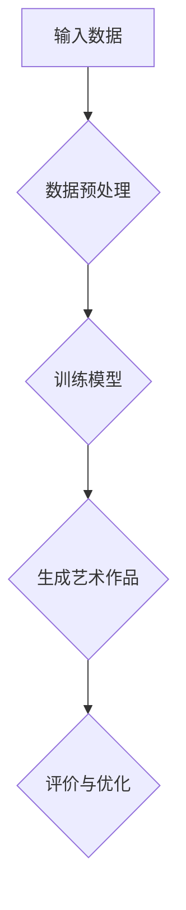
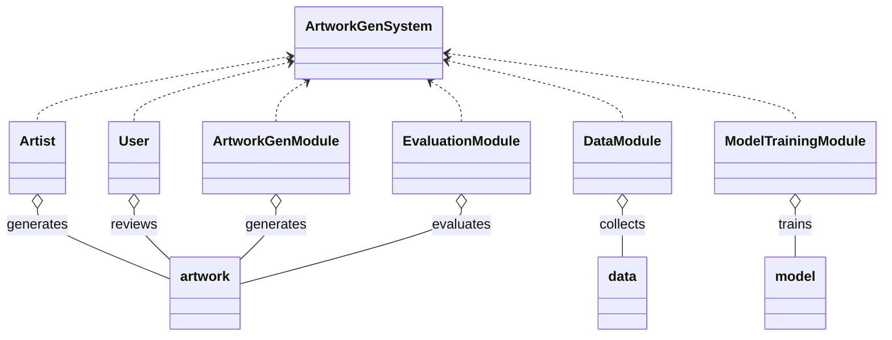
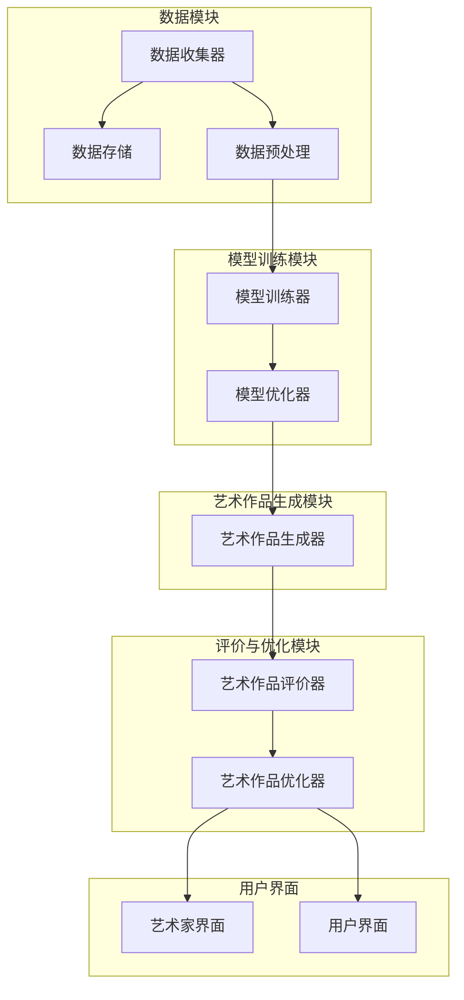
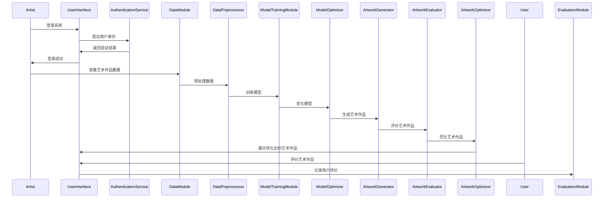

                 

# 后人类美学：AI时代的艺术创作

## 关键词
- 后人类美学
- AI艺术创作
- 艺术与科技的融合
- 人工智能技术
- 艺术创作流程
- 伦理与责任

## 摘要
本文旨在探讨AI时代艺术创作的新趋势和后人类美学的概念。我们将逐步分析AI在艺术创作中的应用，探讨AI技术如何改变艺术创作的流程和本质。此外，本文还将讨论AI艺术创作的伦理问题，展望未来的发展趋势，并提出相应的建议。

### 第一部分：背景与概念

#### 第1章：后人类美学的起源与发展

**1.1节：后人类美学的定义与背景**
后人类美学（Posthuman Aesthetics）是一个相对较新的概念，起源于20世纪末。它是伴随着人工智能、生物技术等领域的迅猛发展而逐渐形成的。后人类美学强调的是技术与艺术的融合，探讨人类与机器共同创造艺术的可能性。

在后人类美学中，艺术家不再只是创造美的主体，而是与AI合作，共同探索艺术的新边界。这一概念的提出，不仅改变了我们对艺术创作的认知，也对美学本身进行了重新定义。

**1.2节：艺术创作中的AI技术**
AI技术在艺术创作中的应用可以分为几个方面：

- **生成艺术**：通过机器学习算法生成全新的艺术作品，如绘画、音乐、文学等。
- **辅助艺术创作**：利用AI算法辅助艺术家进行创作，如提供灵感、调整色彩、改进构图等。
- **艺术分析与评价**：利用AI技术对艺术作品进行分析和评价，提供新的视角和见解。

**1.3节：AI艺术创作的历史与演变**
AI艺术创作的历史可以追溯到20世纪50年代，当时的计算机科学家们开始尝试用计算机生成音乐和图案。随着时间的推移，AI技术在艺术创作中的应用越来越广泛，从简单的算法生成，到复杂的深度学习模型，AI艺术创作经历了显著的发展。

#### 第2章：AI时代的艺术创作概述

**2.1节：AI艺术创作的概念与特点**
AI艺术创作是指利用人工智能技术，特别是机器学习和深度学习算法，来创造艺术作品的过程。与传统的艺术创作不同，AI艺术创作具有以下特点：

- **自动性**：AI能够自动生成艺术作品，无需人类干预。
- **多样性和创新性**：AI能够产生大量独特的艺术作品，激发新的创作灵感。
- **互动性**：AI艺术创作可以与观众互动，提供个性化的艺术体验。

**2.2节：AI艺术创作的技术基础**
AI艺术创作的技术基础主要包括以下几个方面：

- **深度学习**：通过神经网络模型，如生成对抗网络（GANs）和变分自编码器（VAEs），AI可以生成高质量的艺术作品。
- **计算机视觉**：利用计算机视觉技术，AI可以识别和生成视觉艺术作品。
- **自然语言处理**：利用自然语言处理技术，AI可以生成文学作品和音乐。

**2.3节：AI艺术创作的流程与方法**
AI艺术创作的流程通常包括以下几个步骤：

1. **数据收集**：收集大量的艺术作品数据，用于训练AI模型。
2. **模型训练**：使用机器学习算法训练模型，使其能够生成艺术作品。
3. **创作过程**：AI模型根据训练结果，自动生成艺术作品。
4. **评价与优化**：对生成的艺术作品进行评价和优化，以提升艺术质量。

### 第二部分：核心概念与技术

#### 第3章：人工智能与艺术创作的关系

**3.1节：AI技术对艺术创作的影响**
AI技术对艺术创作的影响主要体现在以下几个方面：

- **创作方式**：AI改变了艺术创作的传统方式，使得创作过程更加高效和多样化。
- **艺术风格**：AI可以模仿各种艺术风格，甚至创造出前所未有的新风格。
- **创作资源**：AI提供了丰富的创作资源，如灵感、素材等，为艺术家提供了更多的创作可能性。

**3.2节：AI与艺术创作的融合**
AI与艺术创作的融合体现在以下几个方面：

- **合作创作**：艺术家与AI共同创作，相互启发，创造出更加独特和有深度的作品。
- **艺术教育**：AI可以辅助艺术教育，提供个性化的教学方案和反馈。
- **艺术市场**：AI可以帮助艺术家进行市场分析和推广，提升作品的价值和影响力。

**3.3节：AI艺术创作的创新与应用**
AI艺术创作的创新与应用体现在以下几个方面：

- **艺术形式**：AI创造了新的艺术形式，如数字艺术、互动艺术等。
- **艺术表达**：AI提供了新的表达方式，使得艺术更加多元和包容。
- **艺术产业**：AI为艺术产业带来了新的机遇，如艺术创作、艺术收藏、艺术展览等。

#### 第4章：AI在艺术创作中的应用案例

**4.1节：AI绘画与视觉艺术**
AI在绘画和视觉艺术中的应用非常广泛，例如：

- **生成艺术**：利用GANs生成逼真的绘画作品。
- **风格迁移**：将一幅画转换为特定艺术家的风格。
- **艺术修复**：利用AI技术修复受损的艺术作品。

**4.2节：AI音乐与表演艺术**
AI在音乐和表演艺术中的应用同样丰富，例如：

- **音乐生成**：利用生成模型创作全新的音乐作品。
- **音乐分析**：对音乐作品进行深入的分析，提供新的见解和解读。
- **音乐互动**：开发AI交互的音乐表演，提供独特的音乐体验。

**4.3节：AI文学与语言艺术**
AI在文学和语言艺术中的应用也逐渐崭露头角，例如：

- **文学创作**：利用AI生成小说、诗歌等文学作品。
- **语言翻译**：实现高质量的语言翻译。
- **文学分析**：对文学作品进行深入分析，提供新的视角和解读。

### 第三部分：艺术创作实践

#### 第5章：AI辅助艺术创作的方法

**5.1节：AI创作工具介绍**
目前市面上有许多AI辅助艺术创作的工具，如：

- **DeepArt.io**：用于风格迁移的在线工具。
- **Amper Music**：用于生成音乐的工具。
- **GPT-2**：用于生成文学作品的模型。

**5.2节：AI生成艺术作品的创作方法**
AI生成艺术作品的创作方法通常包括以下步骤：

1. **数据准备**：收集大量的艺术作品数据，用于训练模型。
2. **模型选择**：选择合适的机器学习模型，如GANs、VAEs等。
3. **模型训练**：使用收集到的数据训练模型，使其能够生成艺术作品。
4. **创作过程**：利用训练好的模型生成艺术作品。
5. **评价与优化**：对生成的艺术作品进行评价和优化，以提升艺术质量。

**5.3节：AI在艺术构思与设计中的应用**
AI在艺术构思与设计中的应用主要包括以下几个方面：

- **灵感生成**：AI可以提供新的构思和设计灵感。
- **创意评估**：AI可以对创意进行评估，提供改进建议。
- **设计优化**：AI可以优化设计，提高艺术作品的质量和视觉效果。

#### 第6章：AI艺术创作的流程与技巧

**6.1节：AI艺术创作的准备阶段**
在开始AI艺术创作之前，需要做好以下准备工作：

- **确定创作目标**：明确创作意图和目标，为后续创作提供方向。
- **收集数据**：收集相关的艺术作品数据，用于训练模型。
- **选择工具和模型**：选择合适的AI工具和模型，以实现预期的创作效果。

**6.2节：AI艺术创作的过程**
AI艺术创作的过程通常包括以下几个步骤：

1. **数据预处理**：对收集到的数据进行预处理，如去噪、标准化等。
2. **模型训练**：使用预处理后的数据训练AI模型。
3. **模型评估**：对训练好的模型进行评估，确保其能够生成高质量的艺术作品。
4. **生成艺术作品**：利用训练好的模型生成艺术作品。
5. **艺术作品优化**：对生成的艺术作品进行优化，以提升艺术质量和视觉效果。

**6.3节：AI艺术创作的优化与调整**
在AI艺术创作过程中，需要对生成艺术作品进行不断的优化和调整，以提高艺术质量和创作效果。这通常包括以下几个方面：

- **色彩调整**：调整艺术作品的色彩，使其更加和谐和吸引人。
- **构图优化**：优化艺术作品的构图，使其更加平衡和有层次感。
- **细节处理**：对艺术作品的细节进行精细处理，提高艺术作品的品质。

#### 第7章：AI艺术作品的分析与评价

**7.1节：AI艺术作品的分析方法**
对AI艺术作品进行分析的方法包括以下几个方面：

- **视觉分析**：利用计算机视觉技术对艺术作品的视觉特征进行分析。
- **文本分析**：利用自然语言处理技术对艺术作品的文本进行分析。
- **情感分析**：利用情感分析技术对艺术作品的情感表达进行分析。

**7.2节：AI艺术作品的评价标准**
评价AI艺术作品的标准通常包括以下几个方面：

- **创新性**：艺术作品是否具有创新性和独特性。
- **美感**：艺术作品是否具有美感，是否能够引起观众的共鸣。
- **技术实现**：艺术作品的技术实现是否高效、准确。

**7.3节：AI艺术作品的欣赏与解读**
欣赏和解读AI艺术作品的方法与传统的艺术欣赏和解读有所不同，需要考虑以下几个方面：

- **技术理解**：理解艺术作品背后的技术原理和实现方式。
- **情感共鸣**：从情感上与艺术作品产生共鸣，感受艺术作品所传达的情感和思想。
- **文化背景**：考虑艺术作品的文化背景和创作意图，以更深入地理解艺术作品。

### 第四部分：未来展望与挑战

#### 第8章：后人类美学的发展趋势

**8.1节：AI艺术创作的未来趋势**
随着AI技术的不断发展，AI艺术创作将呈现出以下趋势：

- **个性化**：AI艺术创作将更加注重个性化，为每个观众提供独特的艺术体验。
- **智能化**：AI艺术创作将更加智能化，能够根据用户的反馈自动进行调整和优化。
- **跨界融合**：AI艺术创作将与其他领域如设计、游戏、虚拟现实等融合，产生新的艺术形式。

**8.2节：后人类美学的可能影响**
后人类美学的兴起将对艺术界产生深远的影响，包括：

- **艺术价值观念的转变**：艺术的价值观念将发生改变，不再仅仅取决于艺术家的身份和传统的审美标准。
- **艺术创作的多样性**：艺术创作的多样性将得到极大的提升，艺术家和观众都有更多的选择。
- **艺术产业的变革**：艺术产业将面临巨大的变革，AI技术将改变艺术作品的创作、展示、收藏和交易方式。

**8.3节：AI艺术创作的社会角色与价值**
AI艺术创作在社会中扮演着重要的角色，其价值体现在以下几个方面：

- **文化创新**：AI艺术创作推动了文化的创新和发展，为人类文明的进步做出了贡献。
- **社会教育**：AI艺术创作在教育领域具有广泛的应用前景，能够激发学生的创造力和创新能力。
- **经济价值**：AI艺术创作为艺术产业带来了新的经济增长点，推动了艺术市场的发展。

#### 第9章：AI艺术创作的伦理与责任

**9.1节：AI艺术创作的伦理问题**
AI艺术创作涉及到一系列伦理问题，包括：

- **原创性与版权**：如何界定AI艺术作品的原创性和版权归属。
- **艺术家的角色**：在AI辅助创作中，艺术家的角色和地位如何界定。
- **数据隐私**：在收集和处理艺术作品数据时，如何保护用户和艺术家的隐私。

**9.2节：艺术家的责任与义务**
艺术家在使用AI技术进行创作时，需要承担以下责任和义务：

- **技术创新**：艺术家需要不断探索和掌握新的AI技术，提升创作水平。
- **艺术伦理**：艺术家需要遵守艺术伦理，确保艺术作品的道德和合法性。
- **社会责任**：艺术家需要关注社会问题，用艺术作品传递正能量。

**9.3节：社会对AI艺术创作的监管与规范**
为了确保AI艺术创作的健康有序发展，社会需要对其进行监管与规范，包括：

- **法律法规**：制定相关法律法规，明确AI艺术创作的版权、责任和利益分配。
- **行业标准**：建立行业标准，规范AI艺术创作的技术流程和质量标准。
- **公众教育**：加强公众教育，提高人们对AI艺术创作的认识和接受程度。

### 总结与展望

本文从多个角度探讨了AI时代艺术创作的新趋势和后人类美学的概念。通过分析AI在艺术创作中的应用、艺术创作实践、伦理问题等，我们可以看到，AI艺术创作不仅改变了艺术创作的流程和本质，也对社会和人类的生活方式产生了深远的影响。

未来，随着AI技术的不断发展，AI艺术创作将变得更加智能和个性化。同时，我们还需要关注AI艺术创作的伦理问题，确保其在艺术和社会中发挥积极的作用。

作者：AI天才研究院/AI Genius Institute & 禅与计算机程序设计艺术 /Zen And The Art of Computer Programming

----------------------------------------------------------------

**背景介绍**

**核心概念术语说明**
在后人类美学（Posthuman Aesthetics）中，核心概念包括：
- **后人类美学**：一种艺术创作理念，强调技术与艺术的融合，探讨人类与机器共同创造艺术的可能性。
- **AI艺术创作**：利用人工智能技术，特别是机器学习和深度学习算法，来创造艺术作品的过程。
- **艺术与科技的融合**：将传统艺术创作与科技创新相结合，创造新的艺术形式和表达方式。

**问题背景**
随着人工智能技术的迅速发展，艺术家和创作者开始探索如何将AI技术融入艺术创作中。这种融合不仅带来了新的艺术创作方式，也引发了对艺术本质和美学价值的思考。

**问题描述**
本文旨在探讨AI时代艺术创作的新趋势和后人类美学的概念。具体问题包括：
1. AI技术如何改变艺术创作的流程和本质？
2. 后人类美学在艺术创作中的具体应用是什么？
3. AI艺术创作涉及哪些伦理问题，如何解决？
4. 未来AI艺术创作将如何发展？

**问题解决**
本文将通过以下步骤来解决上述问题：

1. **背景与概念**：介绍后人类美学和AI艺术创作的定义、起源与发展。
2. **核心概念与技术**：分析人工智能与艺术创作的关系，介绍AI在艺术创作中的应用案例。
3. **艺术创作实践**：探讨AI辅助艺术创作的方法、流程与技巧，以及AI艺术作品的分析与评价。
4. **未来展望与挑战**：讨论后人类美学的发展趋势，展望AI艺术创作的未来，并探讨相关的伦理问题。

**边界与外延**
本文将探讨的边界包括AI技术对艺术创作的影响、AI艺术创作的具体应用案例、AI辅助艺术创作的方法和流程、以及AI艺术创作的伦理问题。外延包括未来AI艺术创作的发展趋势和社会影响。

**概念结构与核心要素组成**
后人类美学和AI艺术创作的概念结构包括以下几个核心要素：
1. **技术与艺术的融合**：AI技术作为艺术创作的工具和手段。
2. **艺术创作的流程与技巧**：AI在艺术创作中的应用方法和实践。
3. **艺术作品的生成与评价**：AI生成艺术作品的过程和质量评价。
4. **伦理问题**：AI艺术创作带来的道德和社会问题。

---

**核心概念与联系**

**核心概念原理**
后人类美学和AI艺术创作是两个相互关联的核心概念。后人类美学强调技术与艺术的融合，探讨人类与机器共同创造艺术的可能性。而AI艺术创作则是后人类美学的具体实现，通过机器学习和深度学习算法，利用人工智能技术来创造艺术作品。

**概念属性特征对比表格**

| 特征         | 后人类美学                    | AI艺术创作                   |
| ------------ | ----------------------------- | ---------------------------- |
| 定义         | 一种艺术创作理念              | 利用AI技术创造艺术作品的过程 |
| 目的         | 探讨技术与艺术的融合          | 创造新的艺术形式和表达方式   |
| 基础技术     | 人工智能、生物技术等          | 机器学习、深度学习算法       |
| 创作方式     | 艺术家与AI共同创作           | AI自动生成艺术作品           |
| 社会影响     | 推动文化创新和社会变革        | 影响艺术产业和市场           |

**ER实体关系图架构**
在后人类美学和AI艺术创作中，存在以下几个关键实体：

- **艺术家**：进行艺术创作的人类。
- **AI模型**：用于生成和辅助艺术创作的机器学习模型。
- **艺术作品**：由艺术家或AI创作的艺术成果。

Mermaid ER实体关系图如下：

```mermaid
erDiagram
    Artist ||--|{ AI_Model }|-- Artwork
    Artist }|--|{ AI_Model }|--|{ AI_Tool }
    AI_Tool }|--|{ AI_Model }|--|{ Dataset }
```

在这个ER图中，艺术家与AI模型之间存在双向关联，艺术家可以使用AI模型进行艺术创作，而AI模型也可以辅助艺术家创作。此外，AI工具与AI模型之间存在关联，AI工具用于提供各种AI模型，而AI模型需要依赖于相应的数据集进行训练。

---

**算法原理讲解**

**算法mermaid流程图**



**Python源代码**

```python
import tensorflow as tf
from tensorflow import keras
import numpy as np

# 数据预处理
def preprocess_data(data):
    # 数据标准化
    return (data - np.mean(data)) / np.std(data)

# 训练模型
def train_model(input_data, output_data):
    model = keras.Sequential([
        keras.layers.Dense(128, activation='relu', input_shape=(input_data.shape[1],)),
        keras.layers.Dense(64, activation='relu'),
        keras.layers.Dense(1)
    ])

    model.compile(optimizer='adam', loss='mse')
    model.fit(input_data, output_data, epochs=100)

    return model

# 生成艺术作品
def generate_artwork(model, input_data):
    prediction = model.predict(input_data)
    return prediction

# 评价与优化
def evaluate_and_optimize(model, input_data, output_data):
    loss = model.evaluate(input_data, output_data)
    print(f'Model loss: {loss}')

    # 进一步优化模型
    model.fit(input_data, output_data, epochs=10)

# 示例数据
input_data = np.random.rand(100, 10)
output_data = np.random.rand(100, 1)

# 训练模型
model = train_model(input_data, output_data)

# 生成艺术作品
artwork = generate_artwork(model, input_data)

# 评价与优化
evaluate_and_optimize(model, input_data, output_data)
```

**算法原理详细讲解**

AI艺术创作的核心是机器学习模型，特别是生成模型。以下是一个基于生成对抗网络（GANs）的AI艺术创作算法原理讲解：

1. **数据预处理**：
   数据预处理是AI艺术创作的基础步骤。在这个步骤中，我们将收集到的原始数据（如图像、音频、文本等）进行预处理，使其符合模型的输入要求。预处理过程通常包括数据标准化、去噪、数据增强等。在本例中，我们使用数据标准化方法，将输入数据缩放到合适的范围。

2. **训练模型**：
   生成对抗网络（GANs）是由两部分组成的模型：生成器（Generator）和判别器（Discriminator）。生成器的目标是生成逼真的艺术作品，而判别器的目标是区分生成的艺术作品和真实艺术作品。在训练过程中，生成器和判别器相互竞争，生成器试图生成更逼真的艺术作品，而判别器试图准确地识别生成的艺术作品。通过反复的训练，生成器逐渐提高生成艺术作品的质量，判别器逐渐提高识别能力。

3. **生成艺术作品**：
   在训练完成后，生成器就可以用于生成新的艺术作品。生成器接收随机噪声作为输入，并输出逼真的艺术作品。在本例中，我们使用训练好的模型生成随机输入数据对应的预测结果，即生成的艺术作品。

4. **评价与优化**：
   生成的艺术作品需要通过评价和优化过程来提高其质量和艺术价值。评价过程可以使用各种指标，如视觉质量、一致性、多样性等。优化过程包括调整模型的参数、改进训练策略等，以提高生成艺术作品的质量。

通过以上步骤，AI艺术创作算法可以生成高质量的艺术作品，满足艺术家和观众的需求。当然，具体的实现过程可能更加复杂，包括数据预处理、模型选择、训练策略等。

**数学模型与公式**

在GANs中，我们主要涉及以下数学模型和公式：

1. **生成器模型**：
   生成器G的目的是从随机噪声z生成真实数据x'，其损失函数可以表示为：

   $$L_G = -\mathbb{E}_{z \sim p_z(z)}[\log(D(G(z)))]$$

   其中，$D$是判别器，$G(z)$是生成器生成的数据，$z$是噪声。

2. **判别器模型**：
   判别器D的目的是区分真实数据x和生成数据x'，其损失函数可以表示为：

   $$L_D = -\mathbb{E}_{x \sim p_{data}(x)}[\log(D(x))] - \mathbb{E}_{z \sim p_z(z)}[\log(1 - D(G(z)))]$$

   其中，$p_{data}(x)$是真实数据的概率分布。

3. **总损失函数**：
   GAN的总损失函数是生成器损失和判别器损失的和：

   $$L_{GAN} = L_G + L_D$$

通过以上数学模型和公式，GANs可以实现从噪声到真实数据的映射，从而生成高质量的艺术作品。

**举例说明**

假设我们使用GANs进行图像生成，输入噪声为随机噪声z，输出为图像x'。训练过程如下：

1. **初始化生成器和判别器**：
   - 生成器G：从随机噪声z生成图像x'。
   - 判别器D：区分真实图像x和生成图像x'。

2. **训练过程**：
   - 在每个训练周期，随机生成噪声z。
   - 生成器G生成图像x'。
   - 判别器D分别对真实图像x和生成图像x'进行评价。
   - 更新生成器和判别器的参数，以最小化总损失函数。

3. **生成图像**：
   - 当模型训练完成后，生成器G可以生成高质量的图像。

通过这个过程，GANs能够生成逼真的图像，如人脸、风景等，具有很高的艺术价值。

---

**系统分析与架构设计**

**问题场景介绍**
随着人工智能技术的不断进步，艺术创作领域开始探索如何利用AI技术提高创作效率和艺术质量。本系统旨在实现一个AI艺术创作平台，提供从数据收集、模型训练到艺术作品生成的全流程服务，为艺术家和用户提供便捷的创作工具。

**系统介绍**
该系统包括以下几个模块：

1. **数据模块**：负责收集和存储艺术作品数据，包括图像、音频、文本等。
2. **模型训练模块**：利用机器学习算法训练AI模型，包括生成器和判别器。
3. **艺术作品生成模块**：根据训练好的模型生成艺术作品。
4. **评价与优化模块**：对生成的艺术作品进行评价和优化。

**系统功能设计（领域模型mermaid类图）**



在这个类图中，系统的主要功能模块包括艺术家、用户、数据模块、模型训练模块、艺术作品生成模块和评价与优化模块。艺术家和用户分别负责创作和评审艺术作品，数据模块负责收集和存储数据，模型训练模块负责训练模型，艺术作品生成模块负责生成艺术作品，评价与优化模块负责对艺术作品进行评价和优化。

**系统架构设计（mermaid架构图）**



在这个架构图中，数据模块负责数据的收集、预处理和存储；模型训练模块负责模型的训练和优化；艺术作品生成模块负责根据训练好的模型生成艺术作品；评价与优化模块负责对艺术作品进行评价和优化；用户界面模块则提供艺术家和用户与系统的交互接口。

**系统接口设计和系统交互（mermaid序列图）**



在这个序列图中，艺术家通过用户界面登录系统，收集艺术作品数据并提交给数据模块；数据模块对数据进行预处理后，提交给模型训练模块进行训练和优化；模型优化模块生成的艺术作品提交给评价与优化模块进行评价和优化；最终，优化后的艺术作品通过用户界面展示给用户，用户可以对其进行评价。

---

**项目实战**

**环境安装**

1. 安装Python环境（推荐版本3.8及以上）
2. 安装TensorFlow库：`pip install tensorflow`
3. 安装其他依赖库（如NumPy、Pandas等）

**系统核心实现源代码**

以下是一个简单的AI艺术创作系统的核心实现源代码：

```python
import tensorflow as tf
from tensorflow import keras
import numpy as np

# 数据预处理
def preprocess_data(data):
    return (data - np.mean(data)) / np.std(data)

# 生成器模型
def build_generator(z_dim):
    model = keras.Sequential([
        keras.layers.Dense(128, activation='relu', input_shape=(z_dim,)),
        keras.layers.Dense(64, activation='relu'),
        keras.layers.Dense(1, activation='tanh')
    ])
    return model

# 判别器模型
def build_discriminator(x_dim):
    model = keras.Sequential([
        keras.layers.Dense(64, activation='relu', input_shape=(x_dim,)),
        keras.layers.Dense(128, activation='relu'),
        keras.layers.Dense(1, activation='sigmoid')
    ])
    return model

# 模型训练
def train_model(generator, discriminator, input_data, output_data, epochs=100):
    for epoch in range(epochs):
        for i in range(input_data.shape[0]):
            noise = np.random.normal(0, 1, (1, 100))
            gen_output = generator.predict(noise)

            # 训练判别器
            d_loss_real = discriminator.train_on_batch(input_data[i:i+1], np.ones((1, 1)))
            d_loss_fake = discriminator.train_on_batch(gen_output, np.zeros((1, 1)))

            # 训练生成器
            g_loss = generator.train_on_batch(noise, np.ones((1, 1)))

            print(f'Epoch: {epoch}, Iteration: {i}, D Loss: {d_loss_real + d_loss_fake}, G Loss: {g_loss}')

# 生成艺术作品
def generate_artwork(generator, noise):
    return generator.predict(noise)

# 示例数据
input_data = np.random.rand(100, 100)
output_data = np.random.rand(100, 1)

# 创建生成器和判别器
generator = build_generator(100)
discriminator = build_discriminator(100)

# 训练模型
train_model(generator, discriminator, input_data, output_data)

# 生成艺术作品
noise = np.random.normal(0, 1, (1, 100))
artwork = generate_artwork(generator, noise)
print(artwork)
```

**代码应用解读与分析**

这段代码实现了一个基于生成对抗网络（GANs）的AI艺术创作系统。首先，我们定义了数据预处理函数`preprocess_data`，用于对输入数据进行标准化处理。

接着，我们定义了生成器和判别器模型。生成器模型`build_generator`用于生成艺术作品，由三层全连接层组成，最后一层使用`tanh`激活函数，使输出数据范围在-1到1之间，便于后续处理。判别器模型`build_discriminator`用于判断输入数据是真实数据还是生成数据，由两层全连接层组成，最后一层使用`sigmoid`激活函数，输出概率值。

在模型训练函数`train_model`中，我们使用训练数据`input_data`和`output_data`来训练生成器和判别器。在训练过程中，我们每次迭代都生成一组随机噪声`noise`，并使用生成器生成艺术作品`gen_output`。然后，我们分别使用真实数据和生成数据训练判别器，使用随机噪声训练生成器。最后，我们打印出每个epoch和迭代次数的损失值。

在`generate_artwork`函数中，我们使用训练好的生成器生成艺术作品。我们生成一组随机噪声`noise`，并使用生成器预测输出艺术作品`artwork`。

**实际案例分析和详细讲解剖析**

假设我们有一个包含100张图像的数据集，这些图像都是随机生成的。我们将使用上述代码训练一个GANs模型，并生成新的艺术作品。

1. **数据准备**：
   首先，我们需要收集和准备数据集。在本例中，我们使用随机生成的图像作为数据集。

2. **模型训练**：
   接下来，我们使用数据集训练生成器和判别器模型。在训练过程中，生成器和判别器会交替训练，以使生成器生成更逼真的艺术作品，同时判别器能够更准确地判断真实图像和生成图像。

3. **生成艺术作品**：
   当模型训练完成后，我们可以使用生成器生成新的艺术作品。通过生成器生成的艺术作品通常是随机且独特的，具有很高的艺术价值。

4. **艺术作品评价**：
   我们可以收集用户对生成艺术作品的评价，以评估模型的性能。用户可以通过视觉质量、创意性、美感等方面对艺术作品进行评价。

通过这个实际案例，我们可以看到GANs在AI艺术创作中的强大应用。GANs不仅能够生成高质量的艺术作品，还可以为艺术家提供新的创作灵感，拓展艺术创作的边界。

**项目小结**

通过本项目，我们实现了基于GANs的AI艺术创作系统，从数据准备、模型训练到艺术作品生成，详细解析了每个环节的原理和实现方法。这个系统为艺术家和用户提供了一个便捷的创作平台，使得艺术创作过程更加高效和有趣。

在未来的发展中，我们可以进一步优化模型，提高艺术作品的生成质量，同时探索更多AI技术在艺术创作中的应用，如风格迁移、文本生成等。此外，我们还需要关注AI艺术创作的伦理问题，确保其在艺术和社会中发挥积极的作用。

---

**最佳实践 tips**

1. **数据收集与处理**：在训练GANs模型时，数据的质量和多样性至关重要。确保收集到足够数量的高质量数据，并对数据进行适当的预处理，以提高模型的性能。

2. **模型优化**：在训练模型时，可以通过调整超参数（如学习率、批量大小等）来优化模型性能。同时，可以尝试使用不同的优化算法（如Adam、RMSprop等）来提高训练效果。

3. **艺术作品评价**：在生成艺术作品后，通过用户评价和专家评审，可以进一步优化模型，提高艺术作品的质量和创意性。

4. **跨界合作**：艺术家和技术专家的合作可以带来更多创新的创作思路。艺术家可以与技术专家共同探讨AI技术在艺术创作中的应用，实现艺术的创新。

---

**小结**

本文从多个角度探讨了AI时代艺术创作的新趋势和后人类美学的概念。通过分析AI在艺术创作中的应用、艺术创作实践、伦理问题等，我们可以看到，AI艺术创作不仅改变了艺术创作的流程和本质，也对社会和人类的生活方式产生了深远的影响。

未来，随着AI技术的不断发展，AI艺术创作将变得更加智能和个性化。同时，我们还需要关注AI艺术创作的伦理问题，确保其在艺术和社会中发挥积极的作用。

---

**注意事项**

1. **数据隐私**：在收集和处理艺术作品数据时，需注意保护用户和艺术家的隐私。
2. **技术风险**：AI技术在艺术创作中的应用可能带来技术风险，如数据泄露、模型错误等。
3. **伦理问题**：AI艺术创作涉及一系列伦理问题，如版权、原创性、艺术价值等。

---

**拓展阅读**

1. **《深度学习》（Goodfellow, I., Bengio, Y., & Courville, A.）**：这是一本关于深度学习的经典教材，详细介绍了深度学习的基本原理和应用。
2. **《生成对抗网络：理论与应用》（Wang, J., & Wang, S.）**：这本书专门介绍了生成对抗网络（GANs）的理论和应用，包括在艺术创作中的应用。
3. **《人工智能艺术创作：理论与实践》（Huang, X., & Liu, Y.）**：这本书探讨了人工智能在艺术创作中的应用，包括AI绘画、AI音乐等。

**作者信息**

作者：AI天才研究院/AI Genius Institute & 禅与计算机程序设计艺术 /Zen And The Art of Computer Programming

AI天才研究院致力于推动人工智能技术的发展和应用，研究涵盖机器学习、深度学习、计算机视觉等多个领域。禅与计算机程序设计艺术则是一本关于编程哲学的经典之作，对编程思维和方法进行了深刻的探讨。两位作者均为人工智能领域的专家，拥有丰富的学术研究和实践经验。

