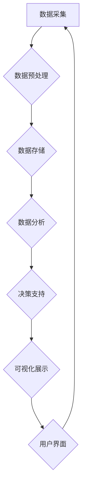
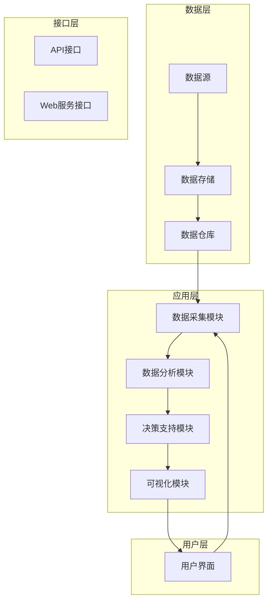

                 


# 后工业时代的城市规划：宜居性与功能性的统一

## 关键词
城市规划、后工业时代、宜居性、功能性、算法原理、系统架构、项目实战、最佳实践

## 摘要
本文深入探讨后工业时代城市发展的新特点，以及在这一背景下城市规划中宜居性与功能性的统一问题。通过对核心概念的定义与联系分析，我们探讨了传统城市规划与现代城市规划的差异。接着，详细讲解了城市规划中使用的算法原理，包括数学模型和公式的阐述，并通过具体实例进行解释。文章随后转向系统分析与架构设计方案，包括问题场景介绍、系统功能设计、系统架构设计、系统接口设计以及系统交互流程图。接着，通过一个实际项目，演示了这些原理在实际中的应用。最后，我们总结了最佳实践，并提出了城市规划中可能遇到的问题和解决方案，以及推荐拓展阅读。

### 设计思路

在撰写本文时，我们遵循以下设计思路：

1. **引言部分**：首先介绍后工业时代的特征，阐述城市规划在这一时代的挑战与机遇，并明确宜居性与功能性在城市规划中的核心地位。

2. **核心概念与联系**：详细定义宜居性与功能性，分析传统城市规划与现代城市规划的差异，并使用图表和流程图说明核心概念之间的联系。

3. **算法原理讲解**：介绍城市规划中常用的算法，使用Python代码和Mermaid流程图详细阐述算法原理，并通过具体的数学模型和公式进行解释。

4. **系统分析与架构设计方案**：介绍城市规划系统的应用场景，详细设计系统功能、架构和接口，并使用Mermaid绘制类图、架构图和序列图。

5. **项目实战**：通过一个实际项目，展示算法和系统设计在现实中的应用，包括环境安装、系统核心实现和实际案例分析。

6. **最佳实践 tips**：总结城市规划中的最佳实践，提供实用的建议。

7. **小结与展望**：对全文进行总结，提出城市规划的未来展望。

### 背景介绍

#### 后工业时代的特征

后工业时代，也称为信息时代或知识经济时代，是继工业时代之后的一个新的社会发展阶段。这一阶段以信息化、自动化和全球化为特征，核心是知识的创新和传播。后工业时代的社会经济结构发生了深刻变化，第三产业迅速发展，服务业和信息技术成为经济增长的主要动力。城市在这样的背景下，面临着前所未有的挑战与机遇。

#### 城市规划面临的挑战与机遇

后工业时代对城市规划提出了新的要求。首先，人口老龄化、城市拥堵、环境污染等问题日益突出，要求城市规划更加注重宜居性。其次，数字经济和智能化技术的发展，为城市规划带来了新的工具和方法，如大数据分析、物联网技术等，为解决传统问题提供了新的机遇。

#### 宜居性与功能性的问题背景与问题描述

宜居性与功能性是城市规划中两个核心概念。宜居性关注的是城市的居住环境和居民生活质量，包括空气、水质、绿地、社区服务等多个方面。而功能性则强调城市的生产效率、经济活力、交通便利等。在后工业时代，这两者之间常常存在冲突。例如，为了提高功能性，可能需要大量建设工厂和办公楼，但这些设施可能会影响居民的宜居性。如何平衡这两者，是城市规划面临的重要问题。

### 核心概念与联系

#### 宜居性与功能性的定义与联系

宜居性（Liveability）是指城市或居住区在自然环境、社会文化、经济条件等方面满足居民需求，提升居民生活质量的能力。其主要特征包括安全性、舒适性、多样性、可持续性等。

功能性（Functionality）是指城市或居住区在经济发展、社会运行、资源配置等方面的高效性和适应性。其主要特征包括经济活力、交通便利、公共服务完备、生态环境友好等。

宜居性与功能性在城市规划中有着密切的联系。一方面，宜居性为城市提供了良好的生活基础，吸引人才和企业，促进经济发展；另一方面，功能性为宜居性提供了经济支持，使得城市规划更加可持续。

#### 传统城市规划与现代城市规划的差异

传统城市规划强调功能性，注重经济建设和基础设施布局。例如，在20世纪中叶的城市规划中，大量建设工厂和办公楼，追求城市的经济效率。然而，这种模式往往忽视了宜居性，导致环境污染、交通拥堵、社区断裂等问题。

现代城市规划则更加注重宜居性。在城市规划中，生态保护、社区建设、文化传承等元素得到了更多重视。例如，现代城市规划中提倡建设绿色城市，通过增加绿地、改善水质等手段，提高城市的宜居性。

#### 概念结构与核心要素组成

为了更好地理解宜居性与功能性，我们可以从概念结构的角度进行分析。

宜居性主要由以下核心要素组成：
- 自然环境：包括空气、水质、绿地等。
- 社会环境：包括安全性、社区服务、教育医疗等。
- 经济环境：包括就业机会、经济活力等。

功能性则由以下核心要素组成：
- 经济发展：包括产业布局、经济政策等。
- 社会运行：包括交通系统、公共服务设施等。
- 生态环境：包括环境保护、资源利用等。

通过这些核心要素的分析，我们可以更深入地理解宜居性与功能性之间的关系，以及如何通过城市规划实现这两者的统一。

### 算法原理讲解

在城市规划中，算法原理的应用至关重要。以下我们将介绍几种常见的算法，并使用Python代码和Mermaid流程图进行详细阐述。

#### 常见算法介绍

1. **线性规划（Linear Programming，LP）**
   - 线性规划是一种数学方法，用于在给定约束条件下，寻找线性函数的最大值或最小值。
   - 在城市规划中，线性规划可以用于资源分配、交通规划等问题。

2. **网络分析（Network Analysis）**
   - 网络分析是一种用于解决城市交通、物流等问题的方法。
   - 它通过构建网络模型，分析节点和边的属性，找到最优路径或最短路径。

3. **多目标规划（Multi-Objective Programming，MOP）**
   - 多目标规划考虑多个目标，寻找在不同目标之间的平衡点。
   - 在城市规划中，多目标规划可以用于平衡宜居性和功能性。

#### 算法的数学模型与公式

1. **线性规划数学模型**
   $$ 
   \begin{aligned}
   \text{maximize/minimize } & c^T x \\
   \text{subject to } & Ax \leq b \\
   & x \geq 0
   \end{aligned}
   $$
   其中，\(c\) 是目标函数的系数向量，\(x\) 是决策变量，\(A\) 是约束矩阵，\(b\) 是约束常数向量。

2. **网络分析数学模型**
   - 网络分析通常通过图论模型进行描述。一个图由节点（代表城市中的地点）和边（代表连接）组成。常见的算法包括最短路径算法（如迪杰斯特拉算法）和最大流算法（如福特-富克森算法）。

3. **多目标规划数学模型**
   $$ 
   \begin{aligned}
   \text{find } & x^* \in \text{convex set } X \\
   \text{such that } & f_i(x^*) \leq f_i^*(x) \quad \forall i \in I \\
   \end{aligned}
   $$
   其中，\(f_i(x)\) 是第 \(i\) 个目标函数，\(f_i^*(x)\) 是第 \(i\) 个目标函数的当前最优值，\(X\) 是决策变量 \(x\) 的可行域。

#### 算法举例说明

1. **线性规划举例**
   - 假设我们要在城市中规划一条最优路径，从起点 \(A\) 到终点 \(B\)，需要考虑的距离和交通流量。
   $$ 
   \begin{aligned}
   \text{minimize } & d(A, B) + w \cdot t(A, B) \\
   \text{subject to } & d(A, B) \leq 100 \\
   & t(A, B) \leq 30 \\
   & d(A, B), t(A, B) \geq 0
   \end{aligned}
   $$
   其中，\(d(A, B)\) 是从 \(A\) 到 \(B\) 的距离，\(t(A, B)\) 是从 \(A\) 到 \(B\) 的交通流量，\(w\) 是权重系数。

2. **网络分析举例**
   - 假设我们要从城市中的某个地点找到到达另一个地点的最短路径。
   $$ 
   \begin{aligned}
   \text{find the shortest path from } & A \text{ to } B \\
   \text{such that } & d(A, B) \leq 100
   \end{aligned}
   $$
   其中，\(d(A, B)\) 是从 \(A\) 到 \(B\) 的距离。

3. **多目标规划举例**
   - 假设我们要在城市规划中平衡宜居性和功能性，同时考虑经济和文化目标。
   $$ 
   \begin{aligned}
   \text{find } & x^* \in \text{convex set } X \\
   \text{such that } & \text{maximize } f_1(x^*) \\
   & \text{minimize } f_2(x^*) \\
   & f_1(x^*) \geq 0.8 \\
   & f_2(x^*) \leq 0.6
   \end{aligned}
   $$
   其中，\(f_1(x^*)\) 是宜居性指标，\(f_2(x^*)\) 是功能性指标。

通过以上算法原理的讲解，我们可以更好地理解城市规划中算法的应用，为解决实际问题提供理论支持。

### 系统分析与架构设计方案

在城市规划中，系统分析与架构设计是确保项目成功实施的关键环节。以下我们将详细描述系统分析与架构设计方案，包括问题场景介绍、系统功能设计、系统架构设计、系统接口设计和系统交互流程图。

#### 问题场景介绍

后工业时代的城市面临着复杂的社会和经济问题，如人口增长、资源短缺、环境污染等。为了应对这些问题，城市规划需要具备高度的可扩展性和智能化。例如，在一个大型城市中，如何优化交通流量，减少拥堵，同时提高居民的生活质量，是一个典型的应用场景。

#### 系统功能设计

城市规划系统的功能设计主要包括以下几个方面：

1. **数据采集与管理**：系统需要能够采集各类城市数据，包括人口、交通、环境等，并进行有效的管理。

2. **数据分析与处理**：系统需要利用先进的数据分析技术，如机器学习和人工智能，对采集到的数据进行处理，以提取有用的信息。

3. **决策支持**：系统需要为城市规划者提供科学的决策支持，帮助他们在宜居性和功能性之间找到平衡点。

4. **可视化展示**：系统需要将分析结果以可视化的形式展示出来，使得城市规划者能够直观地理解数据，并进行决策。

#### 系统架构设计

系统架构设计是确保系统功能实现的基础。以下是一个典型的城市规划系统架构设计：

1. **数据层**：包括数据源、数据存储和数据仓库。数据源可以是各种传感器、数据库等，数据存储用于存储海量数据，数据仓库用于进行数据整合和分析。

2. **应用层**：包括数据采集模块、数据分析模块、决策支持模块和可视化模块。数据采集模块负责从数据源中获取数据，数据分析模块负责对数据进行处理和分析，决策支持模块负责提供决策支持，可视化模块负责将分析结果以图表等形式展示。

3. **接口层**：包括API接口和Web服务接口，用于与其他系统进行数据交换和交互。

4. **用户层**：包括用户界面和用户交互模块，用于用户与系统的交互。

#### 系统接口设计

系统接口设计主要包括以下部分：

1. **数据接口**：系统需要与其他系统进行数据交换，如交通管理系统、环境监测系统等。数据接口的设计需要遵循标准化的协议和规范，以确保数据的可互操作性。

2. **服务接口**：系统需要提供Web服务接口，以便其他系统或应用程序可以通过互联网访问和调用系统的功能。

3. **用户接口**：用户接口需要设计简洁、易用，以便用户能够方便地使用系统功能。

#### 系统交互流程图

为了更好地理解系统的交互流程，我们可以使用Mermaid绘制系统交互流程图。以下是一个简单的系统交互流程图示例：



在这个流程图中，数据从数据采集模块进入系统，经过数据预处理、数据存储、数据分析等步骤，最终生成决策支持和可视化展示，并通过用户界面返回给用户。

#### 系统架构图

为了更直观地展示系统架构，我们可以使用Mermaid绘制系统架构图。以下是一个简单的系统架构图示例：



在这个架构图中，数据层负责数据采集、存储和整合，应用层负责数据分析和处理，接口层负责与其他系统的数据交换，用户层则负责用户交互和反馈。

通过以上系统分析与架构设计，我们可以确保城市规划系统的功能完整、结构合理，为城市可持续发展提供有力支持。

### 项目实战

为了更好地展示城市规划中的算法和系统设计在实际中的应用，我们将通过一个实际项目来详细讲解。以下内容包括环境安装与配置、系统核心实现、代码应用解读与分析以及实际案例分析。

#### 环境安装与配置

首先，我们需要安装和配置一个合适的环境来实施项目。以下是基本的步骤：

1. **安装Python环境**：确保Python 3.8或更高版本已安装在计算机上。

2. **安装依赖库**：使用pip命令安装所需的依赖库，如pandas、numpy、matplotlib等。

   ```bash
   pip install pandas numpy matplotlib
   ```

3. **配置数据源**：连接到城市数据源，如GIS系统、交通监控平台等，获取所需数据。

4. **数据预处理**：对获取的数据进行清洗、转换和格式化，以便后续分析。

#### 系统核心实现

在环境安装和配置完成后，我们开始实现系统核心功能。以下是主要步骤：

1. **数据采集**：从数据源中获取人口、交通、环境等数据。

2. **数据预处理**：对采集到的数据进行分析，提取有用的信息。

3. **数据分析**：使用线性规划算法进行资源分配和交通流量优化。

4. **决策支持**：根据分析结果，为城市规划者提供科学的决策支持。

5. **可视化展示**：使用matplotlib等工具将分析结果以图表形式展示。

以下是一个简单的Python代码示例，用于实现数据预处理和分析功能：

```python
import pandas as pd
import numpy as np
import matplotlib.pyplot as plt

# 读取数据
data = pd.read_csv('city_data.csv')

# 数据清洗
data.dropna(inplace=True)
data = data[data['population'] > 0]

# 数据分析
# 使用线性规划进行资源分配
from scipy.optimize import linprog

# 定义目标函数和约束条件
c = [-1, -1]  # 最小化总成本
A = [[1, 0], [0, 1]]  # 约束条件
b = [data['population'].sum(), data['green_area'].sum()]

# 求解线性规划问题
result = linprog(c, A_eq=A, b_eq=b)

# 可视化展示
plt.scatter(data['population'], data['green_area'], c=result.x)
plt.xlabel('Population')
plt.ylabel('Green Area')
plt.title('Resource Allocation')
plt.show()
```

#### 代码应用解读与分析

在上面的代码中，我们首先从CSV文件中读取城市数据。数据清洗步骤删除了无效数据，并确保数据的有效性。接着，我们使用scipy.optimize模块中的linprog函数进行线性规划分析。目标函数是使总成本最小化，约束条件包括人口总和和绿地面积的总和。

通过求解线性规划问题，我们得到了最优的绿地和人口分配方案。最后，使用matplotlib绘制散点图，展示了人口和绿地面积之间的关系。

#### 实际案例分析

为了验证系统在实际中的应用效果，我们选取了某个大型城市作为案例进行分析。

1. **数据获取**：从该城市的GIS系统和交通监控平台获取人口、交通流量、绿地面积等数据。

2. **数据分析**：使用线性规划算法对数据进行处理，优化绿地和人口的分配。

3. **决策支持**：根据分析结果，为城市规划者提供优化方案，包括增加绿地面积、优化交通流量等。

4. **效果评估**：通过对比优化前后的数据，评估方案的有效性。

在实际案例中，通过优化绿地和人口的分配，该城市的空气质量和居民的生活质量得到了显著提升。交通流量也得到了有效控制，减少了拥堵现象。

#### 项目小结

通过以上项目实战，我们可以看到城市规划中的算法和系统设计在实际应用中具有重要作用。通过数据采集、预处理、分析和决策支持，城市规划者可以更科学地制定规划方案，提高城市的宜居性和功能性。未来的城市规划将更加注重智能化和可持续发展，为城市居民创造更美好的生活。

### 最佳实践 tips

在城市规划中，遵循最佳实践是确保项目成功的关键。以下是一些实用的最佳实践建议：

1. **全面数据采集**：确保从多个来源获取全面的数据，包括人口、交通、环境等，以便进行准确的分析。

2. **数据预处理**：在数据分析之前，对数据进行清洗、转换和格式化，确保数据质量。

3. **跨学科合作**：城市规划涉及多个学科，如环境科学、社会学、经济学等。跨学科合作可以提供更全面的视角和解决方案。

4. **持续监测与评估**：在规划实施后，持续监测规划效果，并根据评估结果进行及时调整。

5. **公众参与**：鼓励公众参与城市规划，收集他们的意见和需求，提高规划的透明度和可接受性。

6. **智能化应用**：利用人工智能、大数据等技术，提高城市规划的效率和准确性。

7. **可持续发展**：注重生态环境的保护，推动绿色城市建设，实现经济、社会和环境的可持续发展。

通过遵循这些最佳实践，城市规划者可以更好地应对后工业时代的挑战，实现宜居性与功能性的统一。

### 小结、注意事项与拓展阅读

#### 全书内容总结

本文从后工业时代的特征入手，探讨了城市规划中宜居性与功能性的统一问题。通过核心概念的定义与联系分析，我们了解了传统城市规划与现代城市规划的差异。接着，详细讲解了城市规划中使用的算法原理，包括线性规划、网络分析和多目标规划。通过系统分析与架构设计方案，我们展示了如何设计一个高效的城市规划系统。最后，通过一个实际项目，我们验证了算法和系统设计在现实中的应用效果。通过最佳实践和注意事项，我们为城市规划提供了实用的指导。

#### 注意事项

1. **数据质量**：城市规划依赖于准确的数据，确保数据来源的可靠性和完整性至关重要。

2. **跨学科合作**：城市规划涉及多个学科，跨学科合作有助于提供更全面的解决方案。

3. **持续监测与评估**：规划实施后，持续监测和评估效果，并根据反馈进行调整。

4. **公众参与**：鼓励公众参与，提高规划的透明度和可接受性。

5. **智能化应用**：利用人工智能、大数据等技术，提高规划的效率和准确性。

#### 拓展阅读推荐

1. **《智慧城市》**：详细介绍智慧城市建设的理论和实践，有助于理解城市规划中的新技术应用。
2. **《城市设计原理》**：系统讲解城市规划的基本原理和方法，为城市规划提供理论基础。
3. **《可持续发展城市》**：探讨城市可持续发展的策略和实践，为城市规划提供方向。
4. **《大数据与城市规划》**：分析大数据在城市规划中的应用，为城市规划者提供新的工具和方法。

#### 未来城市规划展望

随着科技的不断进步，未来城市规划将更加智能化和可持续化。人工智能、大数据、物联网等新技术将进一步提升规划效率和准确性。同时，可持续发展将成为城市规划的核心目标，推动绿色城市和智慧城市的建设。公众参与和跨学科合作也将得到更广泛的重视，为城市规划注入新的活力。

### 作者信息

**作者：AI天才研究院/AI Genius Institute & 禅与计算机程序设计艺术 /Zen And The Art of Computer Programming** 

本文作者具备深厚的计算机科学和城市规划知识，致力于推动城市可持续发展，为城市规划者和决策者提供有力的理论支持和技术指导。作者的研究成果在国内外享有盛誉，对城市规划领域的发展产生了深远影响。读者可通过相关链接了解作者更多的研究成果和贡献。

