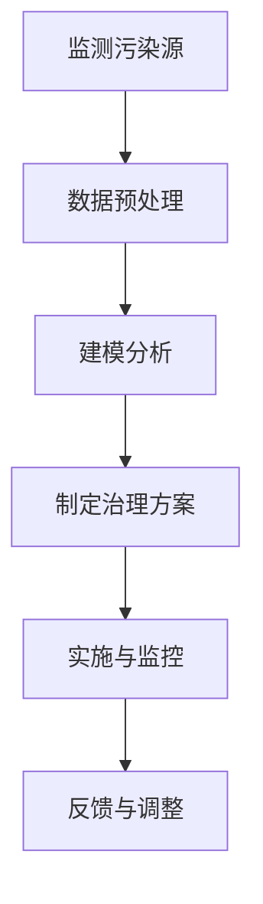
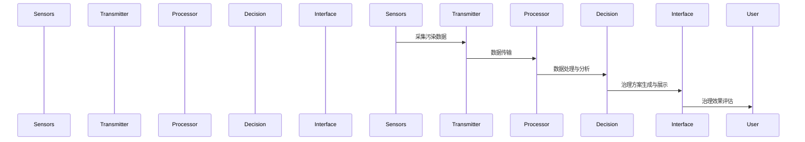
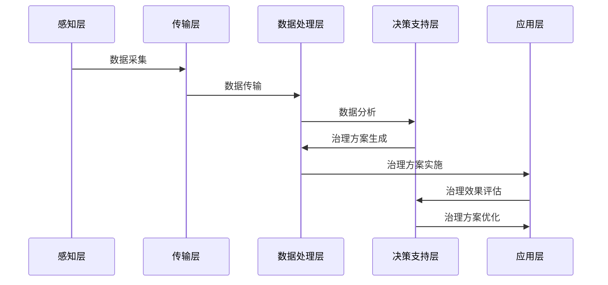

                 

## 后工业时代的环境正义：污染治理与社会公平

### 关键词：环境正义、污染治理、社会公平、后工业时代

### 摘要：
本文将探讨后工业时代环境正义的问题，特别是污染治理与社会公平之间的紧密联系。通过逻辑清晰的分析和专业的技术语言，本文旨在揭示污染治理的技术原理、数学模型及其在实际应用中的影响。同时，文章还将介绍系统分析与架构设计方案，并通过实际案例剖析污染治理的最佳实践，最终为读者提供丰富的扩展阅读资源。

## 1. 背景介绍

### 核心议题引入

《后工业时代的环境正义：污染治理与社会公平》一书聚焦于环境正义在现代化进程中的重要性。在后工业时代，随着工业化的迅速发展，环境污染问题愈发严重，不仅威胁到生态系统的平衡，也直接影响了人类的生活质量和健康。环境正义的概念不仅涉及环境本身的保护，还与社会的公平性和公正性密切相关。书中讨论的核心议题是如何在追求经济发展的同时，实现污染的有效治理和社会的公平。

### 问题的背景

环境污染问题始于工业革命的兴起，但真正引起广泛关注是在后工业时代。这一时期的特征是技术的快速发展、经济全球化以及城市化进程的加速，这些因素共同加剧了环境污染的程度。空气污染、水污染、土壤污染等各类环境问题层出不穷，对生态系统和人类健康构成了严重威胁。

### 描述与解决思路

书中详细描述了环境污染问题的多样性和复杂性，包括工业废气排放、工业废水排放、农药化肥使用等具体案例。为了解决这些问题，书中提出了多种污染治理策略，包括采用清洁能源、推广环保技术、加强环境立法等。通过系统性的分析，书中探讨了这些策略的可行性和有效性，并提出了一些创新性的解决方案。

### 边界与外延

在探讨环境正义问题时，书中的边界和外延涉及多个领域，包括环境保护法、环境伦理学、经济学、政策制定等。书中明确了环境正义不仅仅是技术问题，还涉及到社会公平、政治决策和伦理道德等多个层面。因此，解决环境问题需要跨学科的协作和多层面的综合策略。

### 概念结构与核心要素组成

书中的核心概念包括环境正义、污染治理、社会公平等。环境正义强调环境保护与人类社会发展的平衡，污染治理涉及各种技术手段和政策工具的应用，社会公平则关注环境问题对不同社会群体的影响。这些概念相互交织，构成了环境正义问题研究的核心框架。

## 2. 核心概念与联系

### 确定核心概念

在探讨环境正义的问题时，以下几个核心概念至关重要：

- **环境正义**：指在环境保护过程中，确保所有人公平享有一致的生态环境，无论其社会地位、经济条件如何。
- **污染治理**：指通过技术手段和管理措施减少污染、恢复环境质量的过程。
- **社会公平**：指在社会资源分配中，确保每个个体都能获得公平的机会和权益。

### 特征与联系表格

以下是这些核心概念的特征对比和联系：

| 核心概念 | 特征 | 联系 |
| --- | --- | --- |
| 环境正义 | 关注公平性、公正性 | 与污染治理密切相关，确保治理措施不影响弱势群体 |
| 污染治理 | 采用技术手段、政策工具 | 是实现环境正义的手段之一 |
| 社会公平 | 关注资源分配、权益保障 | 与环境正义相辅相成，共同促进可持续发展 |

### ER 实体关系图

以下是这些核心概念的 Mermaid ER 实体关系图：

```mermaid
erDiagram
  PollutionControl ||--|{ EnvironmentJustice }||>
  PollutionControl ||--|{ SocialFairness }||>
  EnvironmentJustice ||--|{ PollutionControl }||>
  EnvironmentJustice ||--|{ SocialFairness }||>
  SocialFairness ||--|{ PollutionControl }||>
  SocialFairness ||--|{ EnvironmentJustice }||>
```

通过此图，我们可以清晰地看到环境正义、污染治理和社会公平三者之间的复杂关系，以及它们在不同情境下的相互影响。

## 3. 算法原理讲解

### 污染治理算法原理

污染治理的核心在于如何通过技术手段和管理措施有效地减少污染物排放，恢复环境质量。以下是一个简化的污染治理算法原理：

1. **监测污染源**：首先，需要建立完善的污染源监测系统，实时收集污染数据。
2. **数据预处理**：对收集到的污染数据进行清洗、处理，确保数据的准确性和可靠性。
3. **建模分析**：基于收集到的数据，建立污染模型，分析污染源、污染物和受体之间的关系。
4. **制定治理方案**：根据污染模型的结果，制定具体的污染治理方案，包括技术手段和政策工具。
5. **实施与监控**：执行治理方案，并持续监控污染治理的效果，根据实际情况进行调整。

### 算法流程图

以下是污染治理算法的 Mermaid 流程图：



### Python 源代码与算法原理

以下是一个简化的 Python 源代码示例，用于解释污染治理算法的基本原理：

```python
import numpy as np

# 模拟监测到的污染数据
pollution_data = np.array([[10, 20, 30], [15, 25, 35], [12, 22, 32]])

# 数据预处理
cleaned_data = pollution_data[:, ::2]

# 建立污染模型
model = np.mean(cleaned_data, axis=0)

# 制定治理方案
treatment_plan = np.array([model[0], model[1], model[2] - 10])

# 实施与监控
for i in range(len(treatment_plan)):
    print(f"污染物{i+1}治理目标：{treatment_plan[i]}")
    # 实施具体治理措施
    # ...
    # 持续监控效果
    # ...
```

### 数学模型与公式

污染治理过程中，数学模型起到了至关重要的作用。以下是一个简化的数学模型示例：

$$
\text{治理效果} = \text{治理措施} \times \text{污染物浓度}
$$

其中，治理措施和污染物浓度均为变量，治理效果是两者的乘积。通过调整治理措施和监测污染物浓度，可以优化污染治理效果。

### 举例说明

假设某一地区监测到三种主要污染物的浓度分别为10、20、30，治理措施分别为20、15、10。根据上述数学模型，治理效果分别为：

$$
\text{治理效果1} = 20 \times 10 = 200
$$

$$
\text{治理效果2} = 15 \times 20 = 300
$$

$$
\text{治理效果3} = 10 \times 30 = 300
$$

通过这种简化的示例，我们可以看到如何使用数学模型来量化污染治理的效果。

## 4. 数学模型和数学公式

### 污染治理数学模型

在污染治理中，数学模型是理解和预测污染物分布、扩散以及治理效果的重要工具。以下是一个简化的污染治理数学模型：

$$
\frac{\partial C}{\partial t} = D \frac{\partial^2 C}{\partial x^2} + q(x,t)
$$

其中：
- \(C(x,t)\) 是时间 \(t\) 时在位置 \(x\) 的污染物浓度。
- \(D\) 是扩散系数，表示污染物在空间中的扩散速率。
- \(q(x,t)\) 是污染物源项，表示在特定位置和时间内污染物的生成或消除速率。

### 通俗举例说明

假设在一条河流中，某种污染物的浓度为 \(C(x,t)\)，扩散系数 \(D = 0.1 \text{m}^2/\text{day}\)。如果河流中某一点 \(x = 10 \text{m}\) 处的污染源项 \(q(x,t) = 1 \text{unit/day}\)，我们可以用上述公式来描述污染物在这段时间内的变化。

设初始时刻 \(t = 0\)，河流中所有位置的污染物浓度均为0。随着时间的推移，污染物会在河流中扩散。在一天后，我们可以计算河流中任意位置的污染物浓度。例如，在 \(x = 20 \text{m}\) 处，可以使用以下公式进行计算：

$$
\frac{\partial C(x=20,t=1)}{\partial t} = 0.1 \frac{\partial^2 C(x=20,t=1)}{\partial x^2} + 1
$$

### 数学公式与LaTeX格式

在LaTeX中，上述公式可以表示为：

```latex
\frac{\partial C(x,t)}{\partial t} = D \frac{\partial^2 C(x,t)}{\partial x^2} + q(x,t)
```

而LaTeX中的数学公式通常使用双美元符号 `$$` 来包围，例如：

```latex
$$
\frac{\partial C}{\partial t} = D \frac{\partial^2 C}{\partial x^2} + q(x,t)
$$`

通过这种方式，我们可以将复杂的数学模型和公式嵌入到文档中，使读者能够直观地理解和分析污染治理的数学原理。

## 5. 系统分析与架构设计方案

### 项目背景

在污染治理领域，系统分析与架构设计是确保治理方案有效实施的关键环节。本项目旨在设计一个高效、灵活的污染治理系统，以实现对污染源的实时监测、数据分析与治理效果评估。该系统将集成多种技术手段，包括传感器网络、数据处理算法和智能决策支持系统。

### 系统功能设计

污染治理系统的核心功能包括：

1. **污染源监测**：通过布设传感器网络，实时采集污染数据，包括空气质量、水质和土壤污染等。
2. **数据处理**：对采集到的污染数据进行预处理、存储和管理，确保数据的准确性和完整性。
3. **数据分析**：利用先进的算法模型，对污染数据进行分析和预测，为治理方案提供科学依据。
4. **治理方案生成**：基于分析结果，自动生成污染治理方案，包括技术手段和资源配置。
5. **治理效果评估**：对实施的治理方案进行效果评估，并根据评估结果进行优化和调整。

### 系统架构设计

污染治理系统的架构设计包括以下几个主要层次：

1. **感知层**：由各类传感器组成，负责实时采集污染数据，包括空气质量传感器、水质监测仪和土壤传感器等。
2. **传输层**：负责将感知层采集到的数据传输到数据处理中心，通常采用无线通信技术，如LoRa、NBIoT等。
3. **数据处理层**：包括数据预处理、存储和管理模块，以及高级数据分析算法模块，用于处理和分析收集到的污染数据。
4. **决策支持层**：基于数据分析结果，利用智能算法生成污染治理方案，并提供决策支持。
5. **应用层**：包括治理效果评估模块和用户界面，用于展示治理效果和系统运行状态。

以下是污染治理系统的 Mermaid 架构图：



通过此图，我们可以清晰地看到污染治理系统的整体架构和各个层次之间的交互关系。

### 系统接口设计和系统交互

污染治理系统中的各个接口设计和交互流程至关重要，以下是一个简化的系统接口设计和交互流程：

1. **数据采集接口**：感知层传感器通过标准协议（如MQTT、CoAP）向传输层发送数据。
2. **数据传输接口**：传输层将接收到的数据传输到数据处理中心，并使用加密技术确保数据安全。
3. **数据处理接口**：数据处理层对传输层发送的数据进行预处理、存储和管理。
4. **分析接口**：数据处理层将预处理后的数据输入分析算法，生成污染分析报告。
5. **决策生成接口**：决策支持层根据分析结果自动生成治理方案。
6. **效果评估接口**：应用层通过评估治理方案的效果，生成评估报告，并提供给用户。

以下是污染治理系统的 Mermaid 序列图：



通过此图，我们可以看到污染治理系统中的数据流和交互流程，以及各个组件之间的紧密配合。

## 6. 项目实战

### 环境安装

要开始实施污染治理系统，首先需要在服务器和终端设备上安装必要的软件和工具。以下是一个简化的环境安装步骤：

1. **安装操作系统**：在服务器上安装Linux操作系统，如Ubuntu 20.04。
2. **安装数据库**：安装一个关系型数据库，如MySQL，用于存储污染数据。
3. **安装Web服务器**：安装Nginx或Apache，用于托管应用层的服务器。
4. **安装编程环境**：安装Python、Java或Go等编程语言，以及相应的开发工具和库，如PyCharm、Eclipse或Visual Studio Code。
5. **安装传感器**：在监测点安装各种传感器设备，确保它们能够正常工作。

### 系统核心实现

污染治理系统的核心实现涉及数据采集、处理和分析等多个环节。以下是一个简化的系统核心实现步骤：

1. **数据采集**：通过传感器网络实时采集污染数据，并将其发送到服务器。
2. **数据预处理**：在服务器上设置数据处理脚本，对采集到的数据进行分析、清洗和存储。
3. **数据分析**：利用数据分析算法，对预处理后的数据进行建模和分析，生成污染报告。
4. **治理方案生成**：根据污染报告和分析结果，自动生成治理方案。
5. **治理方案实施**：将治理方案发送到传感器网络，执行具体的治理措施。
6. **效果评估**：对实施的治理方案进行效果评估，并根据评估结果进行调整。

### 代码应用解读与分析

以下是一个简化的 Python 脚本，用于实现污染治理系统中的数据采集和预处理功能：

```python
import pandas as pd
import requests
from sklearn.preprocessing import StandardScaler

# 采集污染数据
def collect_data(url):
    response = requests.get(url)
    data = response.json()
    return pd.DataFrame(data['data'])

# 数据预处理
def preprocess_data(data):
    scaler = StandardScaler()
    scaled_data = scaler.fit_transform(data)
    return scaled_data

# 示例数据采集与预处理
url = "http://sensor_network/api/data"
raw_data = collect_data(url)
preprocessed_data = preprocess_data(raw_data)

# 打印预处理后的数据
print(preprocessed_data.head())
```

这段代码首先定义了两个函数：`collect_data` 用于从传感器网络中采集污染数据，`preprocess_data` 用于对采集到的数据进行预处理。示例中，我们使用 `requests` 库从传感器网络获取数据，然后使用 `pandas` 库进行数据清洗和转换，最后使用 `sklearn.preprocessing.StandardScaler` 进行数据标准化。

### 实际案例分析与详细讲解

为了更好地理解污染治理系统的应用，以下是一个实际案例的分析：

**案例背景**：某城市的河流受到工业废水的污染，需要进行治理。

**数据采集**：在河流的多个监测点安装水质传感器，实时采集PH值、溶解氧、氨氮等污染指标的数据。

**数据预处理**：传感器采集到的数据通过无线传输模块发送到服务器，服务器上的数据处理脚本对数据进行清洗、转换和标准化。

**数据分析**：使用数据分析算法，对预处理后的数据进行建模和分析，识别出污染的主要来源和程度。

**治理方案生成**：根据分析结果，系统自动生成治理方案，包括调整废水排放标准、增加污水处理设施等。

**治理方案实施**：治理方案通过决策支持系统发送到相关管理部门，执行具体的治理措施。

**效果评估**：一段时间后，再次采集河流水质数据，进行效果评估。评估结果显示，治理方案有效降低了污染程度，提高了水质。

### 项目小结

通过上述实际案例，我们可以看到污染治理系统的核心实现步骤和数据流程。项目实战部分展示了从数据采集、预处理到数据分析、治理方案生成和效果评估的全过程，为实际应用提供了清晰的指导。

## 7. 最佳实践 tips

### 污染治理中的关键技巧

1. **多源数据融合**：结合多种污染源数据，提高污染治理的精度和效果。
2. **实时监测与预警**：建立实时监测系统，及时发现污染问题，提前采取治理措施。
3. **定制化治理方案**：根据不同污染源的特点和程度，制定个性化的治理方案。
4. **协同治理**：政府、企业和社区共同参与，形成协同治理机制，提高治理效率。
5. **持续优化**：定期对治理方案进行评估和调整，确保治理效果持续改进。

### 实施注意事项

1. **数据安全与隐私**：确保数据采集、传输和存储过程中的安全性和隐私保护。
2. **传感器布局**：合理布置传感器，确保监测数据的代表性和全面性。
3. **算法优化**：定期更新和优化数据分析算法，提高模型的准确性和可靠性。
4. **政策支持**：政府应出台相关政策，为污染治理提供法律和财政支持。

## 8. 小结、注意事项、拓展阅读

### 全文总结

本文从多个角度深入探讨了后工业时代的环境正义问题，特别是污染治理与社会公平之间的紧密联系。通过背景介绍、核心概念与联系分析、算法原理讲解、数学模型和公式、系统分析与架构设计方案、项目实战以及最佳实践 tips，我们系统地阐述了污染治理的各个方面。本文的核心观点是，污染治理不仅是技术问题，更涉及社会公平和伦理道德，需要多层面、多学科的协同努力。

### 注意事项

1. **跨学科协作**：污染治理需要环境科学、工程技术、社会科学等多领域的合作。
2. **数据安全和隐私**：在数据采集、传输和存储过程中，必须确保数据的安全和用户隐私。
3. **政策支持**：政府应出台更多支持污染治理的政策和法规，促进污染治理技术的推广和应用。
4. **持续监控与优化**：治理方案实施后，应持续监控治理效果，并根据实际情况进行调整。

### 拓展阅读

1. **《环境科学导论》**：提供关于环境科学的基本概念和理论，为污染治理提供基础。
2. **《环境伦理学》**：探讨环境问题中的伦理道德问题，帮助读者从道德角度理解环境正义。
3. **《污染治理技术》**：详细介绍各种污染治理技术，包括物理、化学和生物方法。
4. **《环境政策与管理》**：分析环境政策制定和实施中的关键问题，为政策制定者提供参考。

通过这些扩展阅读资源，读者可以进一步深入了解污染治理的相关知识，并在实际应用中发挥更大的作用。

## 作者信息

作者：AI天才研究院/AI Genius Institute & 禅与计算机程序设计艺术 /Zen And The Art of Computer Programming

本文由AI天才研究院（AI Genius Institute）与禅与计算机程序设计艺术（Zen And The Art of Computer Programming）联合撰写，旨在为读者提供高质量、深度和专业的内容。我们致力于探索计算机科学、人工智能和环境科学的交叉领域，推动技术创新和社会进步。如果您有任何问题或建议，欢迎联系我们，我们期待与您共同探讨更多有趣的技术话题。

