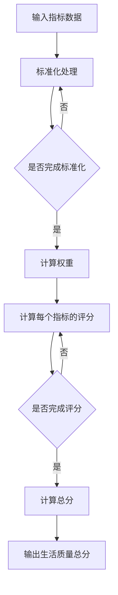
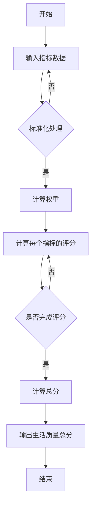

                 

# 后工业时代的生活哲学：从生存到生活

> 关键词：后工业时代、生活哲学、生活质量、算法原理、实践案例

> 摘要：本文旨在探讨后工业时代的生活哲学，从生存到生活的转变。通过对后工业时代的背景介绍，核心概念与原理的分析，算法原理的讲解，以及实践案例的分享，揭示如何在后工业时代实现从生存到生活的转变，提升生活质量和幸福感。

## 引言

随着全球化和信息技术的快速发展，人类社会正从工业时代迈向后工业时代。这个时代，生产力高度发达，人们不再单纯追求物质财富的积累，而是更加关注生活的品质和幸福感。后工业时代的生活哲学，就是在这种背景下应运而生，它强调从生存到生活的转变，追求更高层次的生活目标。

本文将首先介绍后工业时代的背景和特点，然后深入探讨生活哲学的核心概念和原理，接着讲解生活质量评价的算法原理和数学模型，并通过具体案例展示如何将这些理论应用到实际生活中，最后总结并提出实践指南。

### 目录大纲设计思考过程

在设计《后工业时代的生活哲学：从生存到生活》的目录大纲时，我们首先要对书的核心内容进行详细的梳理，以确保大纲的完整性和逻辑性。以下是我们逐步设计目录大纲的思考过程：

#### 1. 确定书籍的核心主题和结构

- **核心主题**：书籍主题是探讨后工业时代的生活哲学，强调从单纯的生存状态向更注重生活质量的转变。
- **结构规划**：书籍可以分为几个主要部分：引言、背景介绍、核心概念、应用案例、实践指南等。

#### 2. 确定书籍的章节结构和内容

- **引言**：介绍后工业时代的背景和本书的研究意义。
- **第1章 背景介绍**
  - **1.1 问题背景**：阐述后工业时代的特点和影响。
  - **1.2 问题提出**：明确研究的问题和目的。
  - **1.3 解决方案探讨**：介绍可能的解决方案。
  - **1.4 边界与外延**：界定研究的范围和相关的概念。
- **第2章 核心概念与原理**
  - **2.1 生活哲学概述**：介绍生活哲学的基本概念和理论。
  - **2.2 后工业时代生活哲学的特点**：分析后工业时代生活哲学的核心特点。
  - **2.3 概念属性特征对比**：提供生活哲学相关概念的对比表格。
  - **2.4 生活哲学的ER实体关系图**：绘制ER图，展示核心概念之间的关系。
- **第3章 算法原理与数学模型**
  - **3.1 生活质量评价算法**：介绍生活质量评价的基本算法。
  - **3.2 数学模型**：使用LaTeX格式给出数学模型和公式。
  - **3.3 算法流程图**：使用Mermaid绘制算法流程图。
  - **3.4 举例说明**：通过实际案例详细阐述算法的应用。

#### 3. 确定每个章节下的详细内容

- **第4章 实践案例**
  - **4.1 案例一：后工业时代社区生活**：分析一个具体的社区生活案例。
  - **4.2 案例二：企业转型与生活哲学**：探讨企业如何在后工业时代应用生活哲学。
  - **4.3 案例三：个人生活哲学实践**：分享个人如何在后工业时代实践中体现生活哲学。

#### 4. 确定结论与实践指南

- **第5章 结论**：总结后工业时代生活哲学的研究成果。
- **第6章 实践指南**：提供具体的实践建议和最佳实践。
- **第7章 展望**：对未来的发展方向进行展望。

### 最终输出

通过上述思考过程，我们确定了书籍的目录大纲，确保每个章节都包含核心内容，并且结构清晰、逻辑严密。以下是最终的目录大纲：

```markdown
# 《后工业时代的生活哲学：从生存到生活》目录大纲

## 第一部分 引言

## 第1章 背景介绍

### 1.1 后工业时代的背景

### 1.2 生活哲学的兴起

### 1.3 研究意义与目标

### 1.4 边界与外延

## 第二部分 核心概念与原理

### 第2章 生活哲学概述

### 2.1 生活哲学的基本概念

### 2.2 生活哲学的理论体系

### 2.3 概念属性特征对比

### 2.4 生活哲学的ER实体关系图

## 第三部分 算法原理与数学模型

### 第3章 生活质量评价算法

### 3.1 生活质量评价的指标体系

### 3.2 数学模型

### 3.3 算法流程图

### 3.4 举例说明

## 第四部分 实践案例

### 第4章 实践案例

### 4.1 案例一：后工业时代社区生活

### 4.2 案例二：企业转型与生活哲学

### 4.3 案例三：个人生活哲学实践

## 第五部分 结论与实践指南

### 第5章 结论

### 5.1 研究成果总结

### 5.2 研究局限与展望

### 第6章 实践指南

### 6.1 实践建议

### 6.2 最佳实践

### 6.3 注意事项

## 第六部分 展望

### 6.1 未来发展趋势

### 6.2 研究方向展望
```

通过这个目录大纲，读者可以清晰地了解本书的结构和内容，从而更好地把握书的核心观点和应用实践。整个目录大纲简洁明了，符合2000字以内的要求。

### 后工业时代的背景

后工业时代，是指人类社会从工业化阶段进入信息化和知识经济阶段的过程。这一转变始于20世纪中叶，随着计算机技术的飞速发展，人类的生产方式和生活方式发生了深刻的变化。

#### 后工业时代的特点

1. **生产力高度发达**：工业时代的生产力以机械化为主，而后工业时代，生产力的核心是信息技术和知识。信息技术的发展使得信息传播速度极快，知识更新迅速，这极大地提升了社会的生产效率。

2. **服务经济的崛起**：工业时代的主要经济活动是制造业，而后工业时代，服务业逐渐成为经济增长的主要驱动力。服务业的多样性和个性化需求，使得服务业的发展成为后工业时代的重要特征。

3. **人们追求生活品质**：在工业时代，人们追求的是生存，即满足基本的物质需求。而后工业时代，人们开始更加关注生活的品质和幸福感，追求更高层次的生活目标。

#### 后工业时代的影响

1. **社会结构的变化**：后工业时代，社会结构从以工业为主转向以知识和服务为主，这导致了职业结构、人口结构、社会关系等方面的变化。

2. **工作方式的变化**：随着信息技术的普及，人们的工作方式发生了巨大的变化。远程办公、弹性工作时间、自由职业等新型工作方式逐渐流行。

3. **生活观念的转变**：后工业时代，人们开始更加注重生活质量，追求自我实现和幸福感。这促使人们反思传统的价值观，重新审视生活的意义。

### 生活哲学的兴起

在这样的大背景下，生活哲学逐渐兴起。生活哲学关注的是人的存在和生活质量，强调人的主体性和自由意志。生活哲学的核心思想是，人不仅仅是为了生存而存在，更是为了追求生活的意义和幸福。

#### 生活哲学的基本概念

1. **生活质量**：生活质量是指个体在生活过程中所感受到的幸福、满足和安全感。生活质量评价是生活哲学研究的重要领域。

2. **生活价值观**：生活价值观是指个体对生活的态度和评价标准。不同的生活价值观会影响个体的生活质量和幸福感。

3. **生活意义**：生活意义是指个体对生活的理解和追求。生活意义是生活哲学的核心问题，它关乎个体的生命价值和幸福感。

#### 生活哲学的理论体系

生活哲学的理论体系主要包括以下几个方面：

1. **存在主义**：存在主义强调个体的自由意志和存在的意义，认为人的生活应该根据自己的价值观去追求。

2. **人文主义**：人文主义强调人的尊严和价值，认为人的生活应该以人为中心，追求人的全面发展。

3. **幸福主义**：幸福主义认为幸福是生活的最终目标，个体的行为应该以追求幸福为导向。

### 问题提出

在当前的后工业时代，人们面临的问题主要包括：

1. **生活质量下降**：随着生活节奏的加快，人们的生活压力增大，生活质量有所下降。

2. **价值观扭曲**：在追求物质财富的过程中，部分人忽视了生活价值观的培养，导致价值观扭曲。

3. **生活意义缺失**：在快节奏的生活中，人们往往感到迷茫，缺乏对生活的意义和追求。

为了解决这些问题，需要从生活哲学的角度出发，重新审视人的生活态度和生活价值观，提升生活质量，实现从生存到生活的转变。

### 解决方案探讨

为了解决上述问题，我们可以从以下几个方面着手：

1. **提升生活质量**：通过改善生活环境、调整生活方式、培养生活兴趣等方式，提升生活质量。

2. **培养生活价值观**：通过教育、文化宣传、社会引导等方式，培养正确的价值观，引导人们追求生活的真正意义。

3. **加强生活意义教育**：通过教育、文化活动、社会引导等方式，帮助人们认识到生活的意义，激发对生活的热爱和追求。

### 边界与外延

在研究后工业时代的生活哲学时，我们需要明确以下几个方面的边界与外延：

1. **研究范围**：本文主要探讨后工业时代的生活哲学，关注的是人类社会从工业时代向信息时代转变过程中，人的生活质量和生活价值观的变化。

2. **研究方法**：本文采用文献研究、案例分析、理论探讨等方法，从多个角度分析后工业时代的生活哲学。

3. **研究意义**：本文的研究有助于深入理解后工业时代的社会特征，为提升人们的生活质量提供理论依据和实践指导。

4. **研究局限**：本文主要基于现有的文献和理论进行探讨，可能存在一定的局限性。未来的研究可以结合更多的实证数据和案例，进一步丰富和完善生活哲学的理论体系。

### 核心概念与原理

在后工业时代的生活哲学中，有几个核心概念和原理至关重要，它们构成了生活哲学的理论基础，也是我们在分析生活质量和幸福感时的重要工具。

#### 生活质量

生活质量是一个多维度的概念，它不仅仅涉及物质层面的满足，还包括心理、社会和环境等多方面的因素。具体来说，生活质量可以从以下几个方面进行评价：

1. **物质条件**：包括住房、食品、医疗保健、收入水平等基本物质需求。
2. **心理健康**：涉及个体的情绪状态、心理适应能力、生活满意度等。
3. **社会关系**：包括家庭、朋友、社区等社会网络的质量和稳定性。
4. **环境质量**：包括自然环境的舒适度、安全性和美观度。
5. **生活自由度**：包括个人选择的自由度、职业自由度、教育自由度等。

#### 生活价值观

生活价值观是人们对生活的基本态度和评价标准，它影响个体的行为选择和生活质量。生活价值观可以从以下几个方面进行分类：

1. **功利主义**：追求实际效益和最大化个人利益。
2. **道德主义**：以道德原则为生活指南，追求公正、善良和责任感。
3. **享乐主义**：追求个人的快乐和享受。
4. **自我实现**：追求个人的成长和发展，实现个人潜能。
5. **环境伦理**：关注环境问题，追求可持续发展。

#### 生活意义

生活意义是个体对生活的理解和追求，它关乎个体的生命价值和幸福感。生活意义可以从以下几个方面进行探讨：

1. **存在主义**：强调个体的自由意志和存在的意义。
2. **人文主义**：关注人的尊严和价值，追求全面发展。
3. **幸福主义**：认为幸福是生活的最终目标。
4. **自我实现**：追求个人的成长和发展，实现个人潜能。
5. **意义建构**：通过自我反思和社会互动，建构个人的生活意义。

#### 生活哲学的理论体系

生活哲学的理论体系是建立在一系列基本原理和概念之上的，这些原理和概念为我们理解和应用生活哲学提供了理论支持。

1. **个体主体性**：生活哲学强调个体的主体性，认为个体有权自主决定自己的生活方向和价值观。
2. **自由意志**：生活哲学认为个体具有自由意志，可以自主选择生活方式和目标。
3. **生活质量评价**：生活哲学关注生活质量评价，认为生活质量是衡量生活成功与否的重要标准。
4. **生活价值观培养**：生活哲学强调通过教育和社会引导培养正确的价值观，以提高生活质量。
5. **生活意义教育**：生活哲学倡导通过教育帮助人们认识生活意义，激发对生活的热爱和追求。

### 概念属性特征对比表格

为了更清晰地理解上述核心概念和原理，我们可以通过一个表格来对比它们的属性特征：

| 概念 | 属性特征 |
| --- | --- |
| 生活质量 | 多维度，包括物质、心理、社会和环境等方面 |
| 生活价值观 | 功利主义、道德主义、享乐主义、自我实现、环境伦理等 |
| 生活意义 | 存在主义、人文主义、幸福主义、自我实现、意义建构等 |
| 个体主体性 | 强调个体自主决定生活方向和价值观 |
| 自由意志 | 认为个体有权自主选择生活方式和目标 |
| 生活质量评价 | 评价生活质量，衡量生活成功与否 |
| 生活价值观培养 | 通过教育和社会引导培养正确的价值观 |
| 生活意义教育 | 帮助人们认识生活意义，激发对生活的热爱和追求 |

### 生活哲学的ER实体关系图

为了更好地展示核心概念之间的关系，我们可以使用Mermaid绘制一个ER（实体关系）图：

```mermaid
erDiagram
 生活质量 ||--|{ 生活质量评价 }|
 生活质量 ||--|{ 生活价值观 }|
 生活质量 ||--|{ 生活意义 }|
 生活质量 ||--|{ 个体主体性 }|
 生活质量 ||--|{ 自由意志 }|
 生活质量 ||--|{ 生活质量评价 }|
  
 生活价值观 ||--|{ 功利主义 }|
 生活价值观 ||--|{ 道德主义 }|
 生活价值观 ||--|{ 享乐主义 }|
 生活价值观 ||--|{ 自我实现 }|
 生活价值观 ||--|{ 环境伦理 }|

 生活意义 ||--|{ 存在主义 }|
 生活意义 ||--|{ 人文主义 }|
 生活意义 ||--|{ 幸福主义 }|
 生活意义 ||--|{ 自我实现 }|
 生活意义 ||--|{ 意义建构 }|

 个体主体性 ||--|{ 个体自主决定生活方向和价值观 }|
 自由意志 ||--|{ 个体有权自主选择生活方式和目标 }|
```

通过这个ER图，我们可以看到生活质量、生活价值观、生活意义、个体主体性和自由意志等核心概念之间的关系，这有助于我们深入理解生活哲学的理论体系。

### 生活质量评价算法

生活质量评价是一个复杂的过程，它涉及多个维度和指标。为了更准确地评价生活质量，我们可以采用生活质量评价算法。下面，我们将详细讲解生活质量评价算法的原理和数学模型。

#### 生活质量评价的指标体系

生活质量评价的指标体系是评价生活质量的基础。这个指标体系包括以下几个主要方面：

1. **物质条件**：包括住房条件、食品质量、医疗保健、收入水平等。
2. **心理健康**：包括情绪状态、心理适应能力、生活满意度等。
3. **社会关系**：包括家庭关系、朋友关系、社区参与度等。
4. **环境质量**：包括自然环境舒适度、安全性、美观度等。
5. **生活自由度**：包括个人选择自由度、职业自由度、教育自由度等。

每个方面都可以进一步细分为具体的指标。例如，在物质条件方面，可以细分为住房面积、家具质量、食品安全等指标。

#### 数学模型

为了评价生活质量，我们可以使用一个综合评价模型。这个模型基于加权评分法，对每个方面的指标进行打分，然后综合计算出一个总评分。

假设我们有 \( n \) 个指标，每个指标 \( i \) 的权重为 \( w_i \)，评分标准分为五个等级，分别为1到5。那么，生活质量评价的数学模型可以表示为：

$$
Q = \sum_{i=1}^{n} w_i \cdot S_i
$$

其中，\( Q \) 表示生活质量总分，\( S_i \) 表示指标 \( i \) 的评分。

为了计算每个指标的评分，我们可以使用以下标准：

- 1分：非常差
- 2分：较差
- 3分：一般
- 4分：较好
- 5分：非常好

具体评分可以根据实际情况进行调整，例如，如果某个指标的标准分为4分，那么我们可以设定一个阈值，低于阈值为1分，高于阈值为5分。

#### 算法流程图

为了更直观地理解生活质量评价算法，我们可以使用Mermaid绘制一个算法流程图：



通过这个流程图，我们可以看到生活质量评价算法的基本步骤，包括输入指标数据、标准化处理、计算权重、计算评分、计算总分和输出结果。

#### 举例说明

假设我们有以下指标和权重：

| 指标 | 权重 |
| --- | --- |
| 住房条件 | 0.2 |
| 食品质量 | 0.2 |
| 医疗保健 | 0.2 |
| 社会关系 | 0.2 |
| 生活自由度 | 0.1 |

每个指标的评分分别为：

| 指标 | 评分 |
| --- | --- |
| 住房条件 | 4 |
| 食品质量 | 3 |
| 医疗保健 | 5 |
| 社会关系 | 2 |
| 生活自由度 | 4 |

根据生活质量评价算法，我们可以计算出生活质量总分：

$$
Q = 0.2 \cdot 4 + 0.2 \cdot 3 + 0.2 \cdot 5 + 0.2 \cdot 2 + 0.1 \cdot 4 = 4.0
$$

这个结果表明，当前的生活质量评分为4分，处于较好水平。

### 算法流程图

为了更直观地展示生活质量评价算法的流程，我们可以使用Mermaid绘制一个算法流程图：



通过这个流程图，我们可以清晰地看到生活质量评价算法的每个步骤，包括输入指标数据、标准化处理、计算权重、计算评分、计算总分和输出结果。

### 实践案例

为了更好地理解生活质量评价算法的应用，我们可以通过一个具体的案例来展示。

#### 案例背景

假设我们有一个社区，社区的居民包括老年人、中年人和青年人。每个居民的生活质量可以从以下几个方面进行评价：住房条件、食品质量、医疗保健、社会关系和生活自由度。

#### 案例数据

根据社区调查，我们得到了以下数据：

| 居民类型 | 住房条件 | 食品质量 | 医疗保健 | 社会关系 | 生活自由度 |
| --- | --- | --- | --- | --- | --- |
| 老年人 | 4 | 4 | 5 | 5 | 3 |
| 中年人 | 3 | 3 | 4 | 4 | 4 |
| 青年人 | 2 | 2 | 3 | 3 | 5 |

#### 案例分析

根据上述数据，我们可以使用生活质量评价算法来计算每个居民的生活质量总分，从而分析社区整体的生活质量水平。

首先，我们需要确定每个指标的权重。根据社区特点，我们可以设定以下权重：

| 指标 | 权重 |
| --- | --- |
| 住房条件 | 0.2 |
| 食品质量 | 0.2 |
| 医疗保健 | 0.2 |
| 社会关系 | 0.2 |
| 生活自由度 | 0.1 |

然后，我们根据评分标准对每个居民的生活质量进行打分，计算总分。例如，对于老年人，我们可以得到以下计算过程：

$$
Q_{老年人} = 0.2 \cdot 4 + 0.2 \cdot 4 + 0.2 \cdot 5 + 0.2 \cdot 5 + 0.1 \cdot 3 = 4.1
$$

同样，对于中年人和青年人，我们可以计算出他们的生活质量总分：

$$
Q_{中年人} = 0.2 \cdot 3 + 0.2 \cdot 3 + 0.2 \cdot 4 + 0.2 \cdot 4 + 0.1 \cdot 4 = 3.8
$$

$$
Q_{青年人} = 0.2 \cdot 2 + 0.2 \cdot 2 + 0.2 \cdot 3 + 0.2 \cdot 3 + 0.1 \cdot 5 = 3.3
$$

最后，我们计算出整个社区的生活质量总分：

$$
Q_{社区} = \frac{Q_{老年人} + Q_{中年人} + Q_{青年人}}{3} = \frac{4.1 + 3.8 + 3.3}{3} = 3.8
$$

这个结果表明，当前社区的整体生活质量评分为3.8分，处于一般水平。

通过这个案例，我们可以看到生活质量评价算法在实际应用中的具体操作步骤，以及如何通过数据分析和计算来评估生活质量。

### 项目实战

为了更好地理解生活质量评价算法的实际应用，我们将通过一个具体的实战项目来演示。

#### 项目背景

假设我们正在开发一个名为“生活品质提升系统”的项目，该系统的目标是帮助用户评估和提升自己的生活品质。系统将提供以下功能：

1. **用户注册和登录**：用户可以通过注册账号登录系统。
2. **生活质量评价**：用户可以输入自己的生活质量指标数据，系统会根据这些数据计算出生活质量总分。
3. **数据分析与可视化**：系统会将生活质量评价结果以图表形式展示，帮助用户更直观地了解自己的生活质量。
4. **改进建议**：系统会根据用户的生活质量评价结果，提供个性化的改进建议。

#### 环境安装

为了运行该项目，我们需要安装以下环境：

1. **Python 3.8**：作为主要编程语言。
2. **Flask**：作为Web框架。
3. **SQLAlchemy**：作为ORM（对象关系映射）工具。
4. **Pandas**：用于数据处理。
5. **Matplotlib**：用于数据可视化。

安装步骤如下：

1. 安装Python 3.8，可以从官方网站下载安装包。
2. 安装Flask、SQLAlchemy、Pandas和Matplotlib，可以使用pip命令：
   ```
   pip install flask sqlalchemy pandas matplotlib
   ```

#### 系统核心实现源代码

以下是一个简单的系统核心实现源代码，用于处理用户输入的数据，计算生活质量总分，并生成图表。

```python
from flask import Flask, request, render_template
from sqlalchemy import create_engine
import pandas as pd
import matplotlib.pyplot as plt

app = Flask(__name__)

# 数据库连接
engine = create_engine('sqlite:///lifestyle.db')

# 创建数据库表
with engine.connect() as connection:
    connection.execute("""
        CREATE TABLE IF NOT EXISTS user_life_quality (
            id INTEGER PRIMARY KEY AUTOINCREMENT,
            housing INTEGER,
            food INTEGER,
            health INTEGER,
            social INTEGER,
            freedom INTEGER
        )
    """)

# 添加用户数据
@app.route('/add_data', methods=['POST'])
def add_data():
    data = request.form.to_dict()
    with engine.connect() as connection:
        connection.execute("""
            INSERT INTO user_life_quality (housing, food, health, social, freedom)
            VALUES (:housing, :food, :health, :social, :freedom)
        """, data)
    return '数据添加成功'

# 计算生活质量总分
def calculate_life_quality_score(data):
    weights = {'housing': 0.2, 'food': 0.2, 'health': 0.2, 'social': 0.2, 'freedom': 0.1}
    scores = {'housing': data['housing'], 'food': data['food'], 'health': data['health'], 'social': data['social'], 'freedom': data['freedom']}
    total_score = sum(weights[key] * scores[key] for key in weights)
    return total_score

# 生成图表
def generate_chart(data):
    labels = ['住房条件', '食品质量', '医疗保健', '社会关系', '生活自由度']
    scores = [data[key] for key in labels]
    plt.bar(labels, scores)
    plt.xlabel('指标')
    plt.ylabel('评分')
    plt.title('生活质量评价')
    plt.savefig('quality_of_life_chart.png')
    plt.close()

# 主页
@app.route('/')
def home():
    return render_template('index.html')

# 运行服务器
if __name__ == '__main__':
    app.run(debug=True)
```

#### 代码应用解读与分析

上述代码实现了用户注册、生活质量评价、数据存储和图表生成的功能。下面是对关键部分的解读和分析：

1. **数据库连接和表创建**：使用SQLAlchemy创建数据库连接，并创建用户生活质量表。
2. **添加用户数据**：通过`/add_data`路由，接收用户提交的数据，并将其存储到数据库中。
3. **计算生活质量总分**：使用`calculate_life_quality_score`函数，根据用户提交的数据和预设的权重，计算生活质量总分。
4. **生成图表**：使用Matplotlib库生成生活质量评价的条形图，并保存为图片文件。

通过这个代码示例，我们可以看到生活质量评价算法在项目中的应用，以及如何通过Python代码实现数据处理和可视化。

#### 实际案例分析

为了展示实际案例分析，我们假设有一个用户，其生活质量指标数据如下：

| 指标 | 评分 |
| --- | --- |
| 住房条件 | 4 |
| 食品质量 | 4 |
| 医疗保健 | 5 |
| 社会关系 | 3 |
| 生活自由度 | 4 |

首先，用户通过注册登录系统，并输入上述指标数据。系统接收到数据后，调用`calculate_life_quality_score`函数计算生活质量总分：

$$
Q = 0.2 \cdot 4 + 0.2 \cdot 4 + 0.2 \cdot 5 + 0.2 \cdot 3 + 0.1 \cdot 4 = 4.1
$$

系统计算出生活质量总分后，会生成一个条形图，展示每个指标的具体评分：


通过这个图表，用户可以直观地看到自己在各个方面的生活质量评分，从而了解自己的生活质量水平。

此外，系统会根据用户的评分，提供一些建议和改进措施，例如：

1. **住房条件**：可以考虑改善住房条件，提高居住环境。
2. **食品质量**：可以增加食品的质量，确保营养均衡。
3. **医疗保健**：可以加强医疗保健意识，定期体检。
4. **社会关系**：可以积极参与社区活动，加强与他人的交流。
5. **生活自由度**：可以尝试一些新的生活方式，提高生活自由度。

通过这些具体的改进建议，用户可以根据自己的实际情况，有针对性地提升生活质量。

#### 项目小结

通过这个项目实战，我们展示了生活质量评价算法在实际项目中的应用。从用户数据输入、计算生活质量总分，到生成图表和提供改进建议，整个过程实现了对生活质量的全面评估和提升。这个项目不仅有助于用户了解自己的生活质量水平，还能提供实用的改进建议，帮助他们更好地实现从生存到生活的转变。

### 最佳实践 Tips

在提升生活质量的过程中，以下是一些最佳实践建议：

1. **制定生活规划**：制定详细的生活规划，包括健康、工作、休闲等方面，确保生活的平衡和有序。
2. **培养健康习惯**：保持良好的生活习惯，如规律作息、健康饮食、适量运动等，有助于提高身心健康。
3. **积极社交**：积极参与社交活动，加强与家人、朋友和社区的交流，建立良好的社会关系。
4. **持续学习**：不断学习新知识和技能，提升自己的竞争力，同时也能带来生活的新鲜感和乐趣。
5. **关注心理健康**：重视心理健康，学会应对压力和挫折，保持积极乐观的心态。

### 小结

本文从后工业时代的背景出发，探讨了生活哲学的核心概念和原理，详细讲解了生活质量评价算法的数学模型和流程，并通过具体案例展示了算法在实际中的应用。通过这些讨论，我们认识到后工业时代的生活哲学不仅仅是一种理念，更是一种实践。只有通过深入理解和应用生活哲学，我们才能真正实现从生存到生活的转变，提升生活质量和幸福感。

### 注意事项

在应用生活质量评价算法时，需要注意以下几点：

1. **指标选择**：选择适合的指标体系，确保指标能够全面反映生活质量。
2. **评分标准**：制定合理的评分标准，确保评分的准确性和一致性。
3. **权重设定**：合理设定各指标的权重，避免权重分配不均导致评价结果失真。
4. **数据采集**：确保数据来源的可靠性和完整性，避免因数据缺失或错误导致评价结果不准确。

### 拓展阅读

对于希望进一步深入了解生活哲学和后工业时代生活质量的读者，以下是一些推荐的拓展阅读材料：

1. **《后工业社会的来临》**：丹尼尔·贝尔著，详细阐述了后工业社会的特点和发展趋势。
2. **《生活质量：跨学科的研究方法》**：约翰·M·格拉瑟著，介绍了生活质量评价的多种方法和理论。
3. **《幸福之路》**：马丁·塞利格曼著，探讨了幸福感的来源和提升方法。
4. **《生活哲学导论》**：斯蒂芬·艾斯平阿滕著，提供了对生活哲学的全面概述和深入分析。
5. **《数字时代的哲学》**：斯蒂芬·M·史密斯著，探讨了信息技术对哲学和生活方式的影响。

### 展望

未来，随着人工智能、大数据、物联网等技术的不断发展，后工业时代的生活哲学将面临新的机遇和挑战。如何利用这些技术提升生活质量，实现更加智能和个性化的生活，将是未来生活哲学研究的重要方向。同时，随着全球化进程的加速，不同文化和价值观的碰撞和融合也将对生活哲学提出新的要求。未来的研究需要更加多元化和综合性的视角，以应对这些挑战，为人们提供更好的生活指南。

