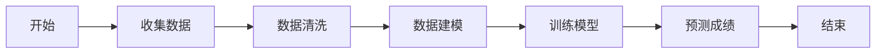
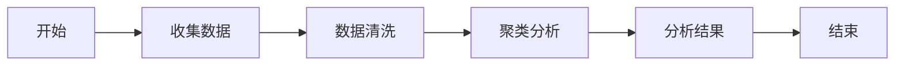
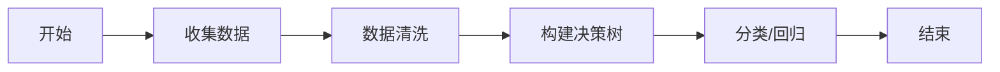

                 

### 后工业时代的职业教育：终身学习与技能提升

#### 关键词
- 后工业时代
- 终身学习
- 技能提升
- 职业教育
- 技术发展

#### 摘要
本文将探讨后工业时代职业教育的变革，分析终身学习与技能提升在技术发展中的重要作用。我们将逐步深入，从背景介绍、核心概念、算法原理、系统设计与项目实战等方面，阐述这一时代下职业教育的趋势与挑战，并提出最佳实践与未来展望。

---

# 引言

在当今飞速发展的信息技术时代，后工业时代的到来无疑给职业教育带来了前所未有的挑战和机遇。传统的职业教育模式已无法满足现代职场对于技能多样性和持续更新的要求。随着人工智能、大数据、云计算等前沿技术的广泛应用，职场对技能的需求正在快速变化，终身学习和技能提升成为了职业发展不可或缺的一部分。

本文旨在探讨后工业时代职业教育的特点，分析终身学习与技能提升的关系，并从多个角度深入探讨这一领域的理论和实践。通过逐步分析，我们将了解如何在这个快速变化的时代中，实现个人的职业成长和组织的人才培养。

---

## 背景介绍

### 后工业时代背景

后工业时代，是一个以信息和知识为核心的经济社会阶段。在这个时代，工业生产逐渐被自动化和智能化技术所取代，服务业和知识产业成为经济增长的主要动力。技术进步和全球化的加速，使得知识和技能的更新换代速度越来越快，传统职业教育模式面临着巨大的挑战。

### 职业教育发展历程

职业教育的起源可以追溯到工业革命时期，主要目的是培养具备特定技能的劳动者，以满足工业生产的需要。随着时代的变迁，职业教育逐渐从技能培训发展为综合能力培养，注重理论与实践的结合，以及职业素养的提升。

### 后工业时代职业教育的特点

后工业时代的职业教育呈现出以下几个显著特点：

1. **终身学习**：随着知识更新的速度加快，终身学习成为职业教育的重要组成部分。教育不再局限于特定的年龄和阶段，而是贯穿人的一生。
2. **技能多样性**：职业教育的目标不再仅仅局限于单一技能的培养，而是强调多技能、跨领域的综合素质。
3. **个性化教育**：信息技术的发展使得个性化教育成为可能，职业教育更加注重根据个体的兴趣、能力和需求进行定制化培养。
4. **技术融合**：职业教育内容与技术深度融合，强调实践操作能力和创新能力的培养。

### 终身学习与技能提升的关系

终身学习与技能提升密不可分。终身学习是技能提升的基础，而技能提升则是终身学习的目标。在一个快速变化的时代，只有不断学习和更新技能，才能保持竞争力，实现职业发展的持续增长。

---

## 核心概念与联系

### 终身学习理论

终身学习是指个人在一生中不断学习、更新知识和技能的过程。其核心概念包括：

1. **学习的持续性**：学习不仅仅局限于学校教育，而是贯穿于个人职业生涯的各个阶段。
2. **学习的灵活性**：学习的方式和内容应具有灵活性，以适应个人和职业需求的变化。
3. **学习的主动性**：个体应主动寻找学习机会，积极应对职业发展的挑战。

终身学习与传统教育存在显著区别：

1. **教育主体**：传统教育主要依赖于学校和教育机构，而终身学习强调个体的自我教育和自主学习。
2. **教育内容**：传统教育内容相对固定，而终身学习内容更加多样化和动态化。
3. **教育方式**：传统教育以课堂教学为主，而终身学习则更加注重在线教育和自我学习。

终身学习对职业教育的启示：

1. **培养终身学习能力**：职业教育应注重培养个体的自主学习能力和持续学习习惯。
2. **设计灵活多样的学习路径**：根据不同个体的需求和兴趣，提供多样化的学习路径和资源。
3. **促进跨领域知识的融合**：通过跨学科的课程设计和项目实践，提升个体的综合素质和创新能力。

### 技能提升策略

技能提升是职业教育的重要目标，其核心策略包括：

1. **持续学习与培训**：定期参与专业培训和学习课程，以更新知识和技能。
2. **实践操作**：通过实际操作和项目实践，提高技能的应用能力。
3. **交流与合作**：通过交流合作，学习他人的经验和技巧，拓展技能的广度和深度。
4. **技术创新**：关注技术发展动态，掌握最新的技术工具和方法，提升创新能力。

### 综合案例分析

以下是一个综合案例分析，展示了终身学习与技能提升在职业教育中的实际应用：

1. **案例分析背景**：某企业针对内部员工开展了一项“终身学习与技能提升计划”，旨在提高员工的综合素质和业务能力。
2. **具体措施**：企业提供了在线学习平台、专业培训课程、实践项目、技术交流研讨会等资源，鼓励员工自主学习和技能提升。
3. **成果评估**：通过定期的技能评估和项目考核，企业发现员工的业务能力和综合素质得到了显著提升，工作效率和创新能力也有了明显提高。

通过这一案例，我们可以看到，终身学习和技能提升不仅有助于个人职业发展，也能为企业带来实际效益。

---

## 算法原理与数学模型

### 数据分析与技能提升

数据分析在职业教育中的应用日益广泛，其核心在于通过数据挖掘和统计分析，发现个体的学习需求和技能短板，进而提供个性化的培训方案。以下将详细讲解数据分析的基本概念、应用场景以及相关算法原理。

### 数据分析基础

数据分析的基础包括数据收集、数据清洗、数据存储、数据分析和数据可视化。以下是一个简化的数据分析流程：

1. **数据收集**：通过在线学习平台、问卷调查、测试数据等方式收集学习者的数据。
2. **数据清洗**：对收集的数据进行去重、纠错、填充等处理，确保数据的准确性和完整性。
3. **数据存储**：将清洗后的数据存储在数据库或数据仓库中，以便后续分析和查询。
4. **数据分析**：运用统计学、机器学习等方法对数据进行处理和分析，提取有用的信息和知识。
5. **数据可视化**：通过图表、报表等形式将分析结果展示出来，便于理解和决策。

### 数据分析在职业教育中的应用

1. **学习需求分析**：通过对学习者的学习行为、成绩、反馈等数据进行统计分析，识别学习者的兴趣点和需求，为个性化培训提供依据。
2. **技能短板分析**：分析学习者在某些技能领域的薄弱环节，提供有针对性的培训和指导。
3. **效果评估**：通过对培训前后学习者的数据对比，评估培训效果，不断优化培训方案。

### 数据分析算法原理讲解

为了更好地理解数据分析在职业教育中的应用，以下将介绍几种常用的数据分析算法及其原理。

1. **回归分析**：回归分析是一种常用的统计方法，用于预测和解释变量之间的关系。例如，可以使用线性回归模型预测学习者的成绩。



2. **聚类分析**：聚类分析是一种无监督学习方法，用于将数据分为不同的组别，便于分析和理解。例如，可以将学习者按照兴趣点或学习习惯进行分组。



3. **决策树**：决策树是一种常用的分类和回归模型，通过一系列的决策规则，将数据划分为不同的类别或数值。例如，可以使用决策树模型为学习者推荐合适的培训课程。



### 数学模型与公式

在数据分析中，数学模型和公式是不可或缺的工具。以下是一些常用的数学模型和公式：

1. **线性回归模型**：

   $$ y = ax + b $$

   其中，$y$ 表示成绩，$x$ 表示学习时长，$a$ 和 $b$ 是模型参数。

2. **聚类算法中的距离公式**：

   $$ D(x_i, x_j) = \sqrt{\sum_{k=1}^{n} (x_{ik} - x_{jk})^2} $$

   其中，$x_i$ 和 $x_j$ 表示两个数据点，$n$ 表示特征维度。

3. **决策树中的条件概率公式**：

   $$ P(A|B) = \frac{P(A \cap B)}{P(B)} $$

   其中，$A$ 和 $B$ 是两个事件。

通过这些数学模型和公式，我们可以更准确地分析和预测学习者的学习表现和技能水平，为职业教育提供科学依据。

### 数据分析举例说明

假设我们有一个学习者的数据集，包含以下特征：

- 学习时长（小时）
- 平时成绩（百分制）
- 课程参与度（分）
- 同侪评价（分）

我们可以使用线性回归模型来预测该学习者的考试成绩。以下是具体的步骤：

1. **数据收集与清洗**：收集学习者的相关数据，并进行清洗处理，确保数据的准确性和完整性。
2. **数据建模**：选择线性回归模型，设置模型参数，并进行模型训练。
3. **预测与评估**：使用训练好的模型预测学习者的考试成绩，并对预测结果进行评估。

通过以上步骤，我们可以得到学习者的考试成绩预测值，并根据预测结果提供个性化的培训建议。

---

## 系统分析与架构设计方案

### 职业教育系统概述

职业教育系统是一个集学习管理、技能评估、数据分析等功能于一体的综合性平台。本系统旨在为学习者提供个性化的学习路径和培训方案，帮助学习者提升职业技能。

### 系统功能设计

1. **学习管理**：包括课程管理、学习进度跟踪、成绩记录等功能。
2. **技能评估**：通过在线测试、项目考核等方式，评估学习者的技能水平。
3. **数据分析**：对学习者的学习行为、成绩、反馈等数据进行统计分析，为个性化培训提供依据。
4. **用户管理**：包括用户注册、登录、权限管理等功能。

### 系统架构设计

职业教育系统的架构设计采用微服务架构，以提高系统的可扩展性和稳定性。以下是系统架构的简要描述：

1. **数据层**：包括关系数据库和非关系数据库，用于存储各种类型的数据。
2. **应用层**：包括学习管理、技能评估、数据分析等微服务，通过API进行交互。
3. **表示层**：包括前端网页、移动应用等，用于展示数据和提供服务。

### 系统接口设计和系统交互

系统接口设计和系统交互是职业教育系统的重要组成部分。以下是系统接口设计和系统交互的简要描述：

1. **接口设计**：系统提供RESTful API，用于与前端应用、移动应用等进行数据交互。
2. **系统交互**：系统通过消息队列实现异步处理，提高系统的响应速度和稳定性。

### 职业教育系统的实现

1. **环境安装**：在服务器上安装操作系统、数据库、中间件等。
2. **系统核心实现**：根据系统架构设计，开发各个微服务的实现，并进行集成测试。
3. **系统部署**：将系统部署到生产环境，并进行上线测试。

通过以上步骤，我们可以构建一个功能强大、稳定的职业教育系统，为学习者提供优质的学习体验和培训服务。

---

## 项目实战

### 职业技能提升项目案例

#### 项目介绍

本次项目旨在通过构建一个职业教育系统，帮助学习者提升职业技能。项目涵盖学习管理、技能评估、数据分析等功能，为学习者提供个性化的学习路径和培训方案。

#### 系统核心实现源代码

以下是项目核心功能的实现代码，包括学习管理、技能评估和数据分析等模块。

**学习管理模块**

```python
class Course:
    def __init__(self, name, duration, teacher):
        self.name = name
        self.duration = duration
        self.teacher = teacher

    def enroll(self, student):
        student.courses.append(self)

    def check_progress(self, student):
        completed_courses = [course for course in student.courses if course.duration <= student.learning_time]
        return len(completed_courses) / len(student.courses)

class Student:
    def __init__(self, name):
        self.name = name
        self.courses = []
        self.learning_time = 0

    def learn(self, course):
        self.learning_time += course.duration
        self.enroll(course)

    def check_progress(self):
        return self.check_progress(self)

# 测试代码
student = Student("Alice")
course1 = Course("Python基础", 20, "张三")
course2 = Course("数据分析", 30, "李四")

student.learn(course1)
student.learn(course2)

print(student.check_progress())
```

**技能评估模块**

```python
class SkillTest:
    def __init__(self, name, questions):
        self.name = name
        self.questions = questions

    def evaluate(self, student):
        score = 0
        for question in self.questions:
            if student.answer(question):
                score += 1
        return score / len(self.questions)

def question1():
    return True

def question2():
    return False

test = SkillTest("Python编程测试", [question1, question2])
score = test.evaluate(student)
print(score)
```

**数据分析模块**

```python
import pandas as pd

def analyze_courses(courses):
    df = pd.DataFrame(courses)
    df['progress'] = df.apply(lambda row: row.course.duration <= row.student.learning_time, axis=1)
    return df

courses_data = [
    {'course': course1, 'student': student, 'learning_time': student.learning_time},
    {'course': course2, 'student': student, 'learning_time': student.learning_time}
]

df = analyze_courses(courses_data)
print(df)
```

#### 项目解读与分析

通过以上代码，我们实现了学习管理、技能评估和数据分析等核心功能。以下是对项目的解读和分析：

1. **学习管理**：学生可以注册课程，学习课程内容，并查看学习进度。
2. **技能评估**：通过在线测试，评估学生的技能水平，并给出评分。
3. **数据分析**：分析学生的学习行为和成绩，为个性化培训提供依据。

#### 案例分析

以下是一个具体的案例分析：

1. **学生 Alice** 注册了两门课程：“Python基础”和“数据分析”。
2. **学习过程**：Alice 完成了两门课程的学习，累计学习时间为50小时。
3. **技能评估**：通过Python编程测试，Alice 得到了80%的分数，表明其技能水平较高。
4. **数据分析**：分析发现，Alice 在课程学习中的进度较快，具备较强的自学能力。

通过以上分析，我们可以为 Alice 提供个性化的培训建议，如推荐更高级的Python课程，以提高其编程技能。

#### 项目小结

本项目通过构建职业教育系统，实现了学习管理、技能评估和数据分析等功能。通过实际案例的分析，我们验证了系统在实际应用中的有效性和实用性。未来，我们可以进一步优化系统功能，提供更优质的学习体验和服务。

---

## 最佳实践与小结

### 终身学习与技能提升的最佳实践

1. **制定个性化学习计划**：根据个人兴趣和职业发展需求，制定明确的学习目标和计划。
2. **多渠道学习**：结合线上课程、书籍、研讨会等多种学习方式，确保知识的全面性和深度。
3. **定期技能评估**：通过定期的技能评估，了解自身技能水平，及时调整学习方向。
4. **实践与理论结合**：在理论学习的同时，积极参与实践项目，提升实际操作能力。
5. **持续关注技术动态**：关注行业技术发展，及时掌握新技术和新工具。

### 注意事项与风险防范

1. **避免盲目跟风**：在技能提升过程中，要避免盲目跟风，选择适合自己的学习内容和方向。
2. **平衡工作与学习**：合理规划时间，确保学习与工作、生活的平衡，避免过度劳累。
3. **数据安全与隐私保护**：在使用在线学习平台和数据分析工具时，要注意数据安全和隐私保护，防止信息泄露。
4. **应对学习挫折**：在学习过程中遇到困难和挫折时，要保持积极心态，寻求帮助，克服困难。

### 拓展阅读

1. **《终身学习：从职业发展的角度》**：本书详细阐述了终身学习的重要性，以及如何将其应用于职业发展。
2. **《技能提升策略与实践》**：本书提供了多种技能提升策略和实践案例，帮助读者实现职业能力的提升。
3. **《大数据与职业教育》**：本书探讨了大数据在职业教育中的应用，以及如何通过数据分析优化学习效果。

---

## 结语

后工业时代的到来，为职业教育带来了前所未有的变革和挑战。终身学习与技能提升成为了职业发展的核心要素，不仅有助于个人职业成长，也对企业发展具有重要意义。通过本文的探讨，我们希望读者能够认识到终身学习和技能提升的重要性，并积极践行最佳实践，不断提升自身竞争力。未来，让我们共同迎接职业教育的美好前景。 

---

### 作者信息

**作者：** AI天才研究院/AI Genius Institute & 禅与计算机程序设计艺术 /Zen And The Art of Computer Programming

**联系方式：** [联系邮箱](mailto:ai_genius_institute@example.com) & [个人网站](https://www.ai_genius_institute.com)

