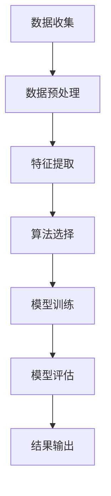

                 

### 文章标题

# 后工作时代：重新定义生产与价值

### 关键词

- 后工作时代
- 生产与价值
- 数字化转型
- 技术进步
- 生产力与生产关系
- 创新与效率

### 摘要

本文探讨了后工作时代的概念，分析了这一时代对生产与价值的重新定义。文章首先介绍了后工作时代的背景和核心概念，随后深入分析了生产力与生产关系的演变，以及价值创造与分配的原理。通过对比分析，揭示了这些核心概念之间的联系。此外，文章还通过实际案例和算法原理讲解，阐述了如何在后工作时代实现生产与价值的最大化。最终，文章总结提出了最佳实践，为企业和个人在新时代背景下的创新与发展提供了指导。

## 第一部分：背景介绍与核心概念

### 第1章：问题背景与核心概念

#### 1.1 问题背景

后工作时代，是指人类社会进入信息化、智能化阶段后，传统工作模式受到冲击和挑战，生产与价值创造方式发生深刻变革的时代。这一时代的到来，标志着生产力与生产关系的重大转变，同时也意味着经济、社会和文化领域的深刻变革。

- **经济与社会的变化**：随着全球化的推进，各国经济相互依赖加深，市场竞争加剧，企业需要不断进行技术创新和管理创新，以提升竞争力。
- **技术进步的影响**：互联网、人工智能、大数据等技术的快速发展，改变了信息传播方式、生产方式，同时也对劳动力市场、职业形态等产生了深远影响。

#### 1.2 核心概念

- **生产力与生产关系**：生产力是指人类用于生产物质财富的能力，包括劳动力、资本、技术、管理等要素。生产关系是指在生产过程中形成的人与人之间的经济关系，包括所有权、分配方式、劳动关系等。

- **价值的创造与分配**：价值创造是指企业在生产过程中创造使用价值和经济价值的过程。价值分配是指企业通过生产活动所创造的财富在不同利益主体之间的分配过程。

#### 1.3 边界与外延

- **后工作时代的范围**：后工作时代涵盖了从工业化到信息化，再到智能化的发展过程。在这一过程中，生产力的提升和生产关系的变革，使得社会生产方式和价值观念发生了重大变化。

- **生产与价值的多维度分析**：从经济学视角看，生产与价值分析主要关注资源配置、生产效率等方面；从社会学视角看，生产与价值分析则更关注社会结构、劳动关系、社会公正等方面。

#### 1.4 概念结构与核心要素组成

- **核心要素组成**：在后工作时代，核心要素主要包括技术创新、人力资源管理、商业模式的创新等。技术创新是提升生产力的关键，人力资源管理是保证生产效率的基础，商业模式的创新则是实现价值创造和分配的重要途径。

- **概念结构**：后工作时代的概念结构可以看作是生产力与生产关系的有机结合，其中生产力是基础，生产关系是保障。价值创造与分配则是这一概念结构的最终目标。

## 第二部分：核心概念与联系

### 第2章：核心概念原理

#### 2.1 生产力与生产关系的原理

- **生产力原理**：生产力的发展受到多种因素的影响，包括劳动力素质、资本积累、技术进步、资源配置等。技术进步是提升生产力的重要途径，通过引入新技术、新工艺、新设备，可以提高生产效率，降低生产成本。

- **生产关系原理**：生产关系是指在生产过程中形成的人与人之间的经济关系，包括所有权、分配方式、劳动关系等。不同的生产关系对生产力的发展有着重要影响。例如，在私有制经济中，生产资料归个人所有，劳动者受雇于企业，生产关系较为灵活；而在公有制经济中，生产资料归全体人民所有，劳动者参与生产决策，生产关系较为稳定。

#### 2.2 价值创造与分配的原理

- **价值创造原理**：价值创造是企业在生产过程中将生产要素转化为物质财富的过程。在这个过程中，劳动价值论和资本价值论是两种主要的观点。劳动价值论认为价值来源于劳动，资本价值论则认为价值来源于资本投入。

- **价值分配原理**：价值分配是指企业通过生产活动所创造的财富在不同利益主体之间的分配过程。按劳分配是指根据劳动者所提供的劳动量进行分配，按生产要素分配是指根据各生产要素的贡献进行分配。

#### 2.3 概念属性特征对比表格

| 概念       | 特征1             | 特征2             | 特征3             |
|------------|------------------|------------------|------------------|
| 生产力     | 提升生产效率     | 技术进步驱动     | 劳动力、资本、技术 |
| 生产关系   | 人与人之间的经济关系 | 所有权、分配、劳动关系 | 稳定、灵活       |
| 价值创造   | 生产要素转化     | 劳动价值、资本价值 | 物质财富、经济财富 |
| 价值分配   | 利益分配         | 按劳、按生产要素 | 公平、效率       |

#### 2.4 ER实体关系图架构

```mermaid
erDiagram
  Productivity ||--|{ ProductionRelation }|
  ValueCreation ||--|{ ValueDistribution }|
  Productivity ||--|{ Technology }|
  ProductionRelation ||--|{ Labor }|
  ProductionRelation ||--|{ Capital }|
  ValueCreation ||--|{ MaterialWealth }|
  ValueCreation ||--|{ EconomicWealth }|
```

## 第三部分：算法原理与数学模型

### 第3章：算法原理讲解

#### 3.1 算法介绍

- **算法概述**：算法是解决特定问题的一系列步骤或规则。在后工作时代，算法在生产力与价值创造中发挥着重要作用，如优化生产流程、提高资源利用效率、实现精准营销等。

- **主要算法**：后工作时代常用的算法包括人工智能算法（如机器学习、深度学习）、数据分析算法（如聚类、分类、回归等）。这些算法能够从海量数据中提取有价值的信息，为决策提供支持。

#### 3.2 算法流程图



#### 3.3 算法原理与数学模型

- **算法原理**：算法的基本原理是通过输入数据，按照一定的规则进行计算，最终输出结果。在后工作时代，算法的原理主要体现在以下几个方面：

  - **数据驱动**：算法通过分析海量数据，提取出有用的信息，为决策提供支持。
  
  - **模型优化**：算法通过不断调整模型参数，使模型在特定任务上达到最优性能。
  
  - **自适应学习**：算法能够根据新的数据和环境变化，不断调整和优化自身。

- **数学模型**：算法的数学模型是算法的核心部分，用于描述算法的计算过程。以下是一个简单的线性回归模型的数学模型：

  - **目标函数**：$$\min \sum_{i=1}^{n}(y_i - \hat{y}_i)^2$$

  - **模型参数**：$$\hat{y}_i = \beta_0 + \beta_1 x_i$$

  - **参数优化**：使用梯度下降算法来优化模型参数，以达到最小化目标函数的目的。

#### 3.4 举例说明

- **实例分析**：假设我们要预测一家电商平台的日销售额。首先，我们收集了过去一年的日销售额数据，然后使用线性回归模型进行预测。通过不断调整模型参数，最终得到一个较为准确的预测模型。

  - **数据收集**：收集了过去一年的日销售额数据，包括日期和销售额。
  
  - **数据预处理**：对数据进行清洗和归一化处理，以便后续分析。
  
  - **特征提取**：提取出日期特征，如星期几、季节等，作为模型的输入特征。
  
  - **算法选择**：选择线性回归算法进行模型训练。
  
  - **模型训练**：使用梯度下降算法优化模型参数，直到目标函数达到最小值。
  
  - **模型评估**：使用交叉验证等方法评估模型性能，确保预测准确性。
  
  - **结果输出**：输出日销售额预测结果，为企业决策提供支持。

## 第四部分：系统分析与架构设计

### 第4章：系统分析与设计

#### 5.1 问题场景介绍

- **场景描述**：假设我们要开发一个在线购物平台，用户可以在平台上浏览商品、下单购买、支付、评价等。为了提高系统的性能和可靠性，我们需要对系统进行详细的分析与设计。

- **目标系统的功能需求**：系统需要实现以下功能：
  - 用户注册与登录
  - 商品浏览与搜索
  - 购物车管理
  - 下单与支付
  - 订单管理
  - 用户评价

#### 5.2 项目介绍

- **项目背景**：随着互联网的普及，在线购物已经成为人们日常生活的一部分。为了满足用户的需求，我们需要开发一个功能强大、性能稳定、易于扩展的在线购物平台。

- **项目目标**：项目的目标是开发一个具有以下特点的在线购物平台：
  - 易用性：界面友好，操作简单
  - 性能：系统响应速度快，并发处理能力强
  - 可扩展性：能够支持大量用户同时访问
  - 安全性：保护用户隐私和数据安全

#### 5.3 系统功能设计

- **领域模型**：

  ```mermaid
  classDiagram
      User <<class>> "用户"
      Product <<class>> "商品"
      ShoppingCart <<class>> "购物车"
      Order <<class>> "订单"
      Review <<class>> "评价"
      
      User o--|{注册}|> ShoppingCart
      User o--|{登录}|> ShoppingCart
      ShoppingCart o--|{添加商品}|> Product
      ShoppingCart o--|{删除商品}|> Product
      ShoppingCart o--|{提交订单}|> Order
      Order o--|{支付}|> Payment
      Order o--|{评价}|> Review
  ```

#### 5.4 系统架构设计

- **系统架构图**：

  ```mermaid
  sequenceDiagram
      User ->> System: 登录
      System ->> DB: 查询用户信息
      DB ->> System: 返回用户信息
      System ->> User: 登录成功
      User ->> System: 添加商品
      System ->> DB: 插入商品信息
      DB ->> System: 插入成功
      System ->> User: 商品添加成功
      User ->> System: 提交订单
      System ->> DB: 插入订单信息
      DB ->> System: 插入成功
      System ->> User: 订单提交成功
      User ->> System: 支付
      System ->> Payment: 发起支付请求
      Payment ->> System: 支付结果
      System ->> User: 支付成功
      User ->> System: 评价
      System ->> DB: 插入评价信息
      DB ->> System: 插入成功
      System ->> User: 评价成功
  ```

#### 5.5 系统接口设计

- **接口定义**：

  ```python
  class UserInterface:
      def login(self, username, password):
          # 登录逻辑
          
      def register(self, username, password):
          # 注册逻辑
          
      def add_product_to_cart(self, user_id, product_id):
          # 添加商品到购物车逻辑
          
      def remove_product_from_cart(self, user_id, product_id):
          # 删除商品逻辑
          
      def submit_order(self, user_id, order_details):
          # 提交订单逻辑
          
      def pay_order(self, user_id, order_id):
          # 支付订单逻辑
          
      def submit_review(self, user_id, order_id, review):
          # 提交评价逻辑
  ```

#### 5.6 系统交互

- **系统交互图**：

  ```mermaid
  sequenceDiagram
      User ->> UserInterface: 登录
      UserInterface ->> Database: 查询用户信息
      Database ->> UserInterface: 返回用户信息
      UserInterface ->> User: 登录成功
      User ->> UserInterface: 添加商品
      UserInterface ->> Database: 插入商品信息
      Database ->> UserInterface: 插入成功
      UserInterface ->> User: 商品添加成功
      User ->> UserInterface: 提交订单
      UserInterface ->> Database: 插入订单信息
      Database ->> UserInterface: 插入成功
      UserInterface ->> User: 订单提交成功
      User ->> UserInterface: 支付
      UserInterface ->> PaymentSystem: 发起支付请求
      PaymentSystem ->> UserInterface: 支付结果
      UserInterface ->> User: 支付成功
      User ->> UserInterface: 评价
      UserInterface ->> Database: 插入评价信息
      Database ->> UserInterface: 插入成功
      UserInterface ->> User: 评价成功
  ```

## 第五部分：项目实战

### 第6章：项目实战

#### 6.1 环境安装

- **软件与硬件环境**：
  - 服务器：配置要求较高的服务器，如Intel Xeon处理器、32GB内存等。
  - 客户端：普通PC即可。
  - 开发环境：Python 3.8及以上版本，Django 3.2框架。

- **系统安装步骤**：
  1. 配置服务器环境，安装Python和Django框架。
  2. 克隆项目代码到本地，安装项目依赖。
  3. 配置数据库，如MySQL或PostgreSQL。
  4. 运行项目，测试功能。

#### 6.2 系统核心实现

- **源代码**：

  ```python
  # models.py
  from django.db import models

  class User(models.Model):
      username = models.CharField(max_length=100)
      password = models.CharField(max_length=100)
      # 其他字段

  class Product(models.Model):
      name = models.CharField(max_length=100)
      price = models.FloatField()
      # 其他字段

  class ShoppingCart(models.Model):
      user = models.ForeignKey(User, on_delete=models.CASCADE)
      product = models.ForeignKey(Product, on_delete=models.CASCADE)
      # 其他字段

  class Order(models.Model):
      user = models.ForeignKey(User, on_delete=models.CASCADE)
      order_date = models.DateTimeField()
      total_price = models.FloatField()
      # 其他字段

  class Review(models.Model):
      user = models.ForeignKey(User, on_delete=models.CASCADE)
      order = models.ForeignKey(Order, on_delete=models.CASCADE)
      content = models.TextField()
      # 其他字段
  ```

#### 6.3 代码应用解读与分析

- **代码解读**：

  - `models.py`文件定义了系统的核心实体，包括用户、商品、购物车、订单和评价。每个实体都对应了一个数据库表，通过Django ORM进行数据操作。

  - `User`类表示用户实体，包含用户名和密码等字段。

  - `Product`类表示商品实体，包含商品名称和价格等字段。

  - `ShoppingCart`类表示购物车实体，关联用户和商品，表示用户添加到购物车的商品。

  - `Order`类表示订单实体，关联用户，包含订单日期和总价等信息。

  - `Review`类表示评价实体，关联用户和订单，包含评价内容和评分等信息。

- **案例分析**：

  假设一个用户购买了某商品，我们需要实现将商品添加到购物车、生成订单和提交评价的功能。

  1. 用户登录后，可以浏览商品，将商品添加到购物车。

     ```python
     # Add product to shopping cart
     cart_item = ShoppingCart.objects.create(
         user=request.user,
         product=product
     )
     return redirect('cart')
     ```

  2. 用户提交订单，生成订单并计算总价。

     ```python
     # Create order and calculate total price
     total_price = sum(cart_item.product.price for cart_item in cart_items)
     order = Order.objects.create(
         user=request.user,
         total_price=total_price
     )
     for cart_item in cart_items:
         cart_item.delete()
     return redirect('order_detail', order_id=order.id)
     ```

  3. 用户提交评价。

     ```python
     # Submit review
     review = Review.objects.create(
         user=request.user,
         order=order,
         content=review_content
     )
     return redirect('order_detail', order_id=order.id)
     ```

### 第7章：最佳实践与总结

#### 7.1 最佳实践

- **环境配置**：确保服务器和客户端的环境配置一致，避免因环境差异导致的问题。
- **代码规范**：遵循Django框架的代码规范，确保代码的可读性和可维护性。
- **数据安全**：对用户数据和订单数据进行加密存储，确保数据安全。
- **性能优化**：对数据库查询进行优化，减少数据库访问次数，提高系统性能。

#### 7.2 小结

本文介绍了后工作时代重新定义生产与价值的背景和核心概念，分析了生产力与生产关系的原理，以及价值创造与分配的原理。通过算法原理讲解和系统架构设计，阐述了如何在后工作时代实现生产与价值的最大化。项目实战部分提供了具体的实现方法和案例分析。

#### 7.3 注意事项

- 在实际应用中，需要根据具体业务需求对系统进行定制化开发和优化。
- 关注技术发展和行业动态，及时更新和迭代系统功能。

#### 7.4 拓展阅读

- 《人工智能：一种现代的方法》
- 《深度学习》
- 《大数据时代：思维变革与商业价值》
- 《商业本质：从零开始构建商业模型》
- 《软件架构设计：设计模式与架构风格》

---

**作者：AI天才研究院/AI Genius Institute & 禅与计算机程序设计艺术 /Zen And The Art of Computer Programming**

