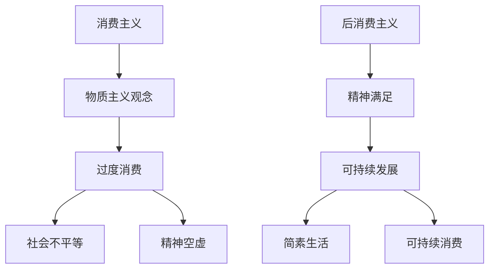
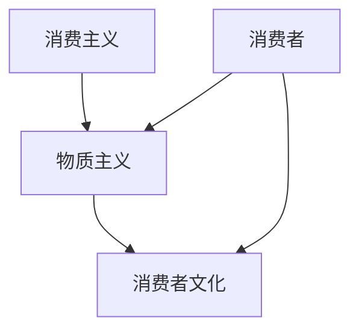
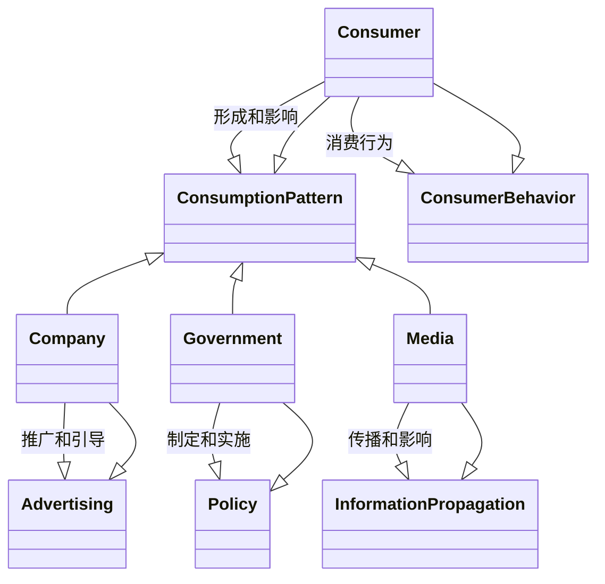

                 

# 后消费主义时代的生活哲学

## 关键词

后消费主义、生活哲学、消费主义观念、简素生活、人际关系、消费政策、案例研究

## 摘要

在当今全球化的消费主义浪潮中，我们正逐渐步入后消费主义时代。这一时代的特征是对物质消费的反思与精神追求的回归。本文将探讨后消费主义时代的生活哲学，从消费主义观念的反思、生活态度的转变、物质消费与精神消费的平衡、消费主义对人际关系的影响、消费政策的调整、案例分析等多个维度进行深入分析。通过系统地梳理与探讨，期望为读者提供一种新的生活哲学思考方式，引导我们在后消费主义时代找到更为和谐的生活方式。

## 目录

### 引言：后消费主义时代的概述

> 关键词：后消费主义定义、特征、背景

**1. 后消费主义定义**

**2. 后消费主义时代的特征**

**3. 后消费主义时代的背景**

### 第1章：消费主义观念的反思

> 关键词：消费主义观念、弊端、变迁、观念转变

**1.1 消费主义观念的形成**

**1.2 消费主义的弊端**

**1.3 消费主义观念的变迁**

**1.4 后消费主义时代的观念转变**

### 第2章：后消费主义时代的生活态度

> 关键词：生活理念、态度转变、社会责任感

**2.1 后消费主义时代的生活理念**

**2.2 后消费主义时代的生活态度**

**2.3 社会责任感的增强**

### 第3章：物质消费与精神消费

> 关键词：物质消费、精神消费、平衡、价值观

**3.1 物质消费的重要性**

**3.2 精神消费的重要性**

**3.3 物质消费与精神消费的平衡**

**3.4 价值观的转变**

### 第4章：消费主义对人际关系的影响

> 关键词：人际关系、消费主义、社交平台、家庭关系

**4.1 消费主义对人际关系的负面影响**

**4.2 后消费主义时代的人际关系重构**

**4.3 消费主义对家庭关系的影响**

### 第5章：后消费主义时代的消费行为

> 关键词：消费行为、适度消费、理性消费

**5.1 适度消费的提倡**

**5.2 质量优先的观念**

**5.3 环保意识的培养**

### 第6章：后消费主义时代的消费政策

> 关键词：消费政策、调整趋势、环保税、政府作用

**6.1 后消费主义时代的消费政策趋势**

**6.2 消费税和环保税的实施**

**6.3 政府在消费主义问题上的作用**

### 第7章：案例分析：后消费主义时代的生活实践

> 关键词：案例研究、品牌实践、社区实践

**7.1 某知名品牌的后消费主义实践**

**7.2 某社区的可持续生活方式**

### 结论

> 关键词：后消费主义时代、生活哲学、未来展望

**后消费主义时代的生活哲学总结**

**未来展望与挑战**

### 附录

> 关键词：参考文献、拓展阅读

**参考文献**

**拓展阅读**

----------------------------------------------------------------

## 引言：后消费主义时代的概述

### 后消费主义定义

后消费主义（Post-Consumerism）是一个相对较新的概念，它指的是在传统消费主义之后，社会和文化态度开始从过度消费和物质追求向更加注重精神价值和可持续发展的方向转变。这种转变不仅仅是经济行为的变化，更是一种深刻的社会和文化意识的觉醒。

### 后消费主义时代的特征

后消费主义时代的特征主要包括以下几点：

1. **反思物质主义**：越来越多的人开始反思过度消费和物质主义的负面影响，包括环境破坏、资源浪费、社会不平等等问题。

2. **追求精神满足**：相比物质消费，人们越来越重视精神层面的满足，如艺术、文化、学习和人际关系等。

3. **可持续发展的意识**：随着全球气候变化和环境问题的加剧，可持续发展的理念逐渐深入人心，人们开始更加关注消费行为对环境的影响。

4. **理性消费**：消费者逐渐从盲目追求品牌和奢侈品转向更加注重质量和性价比，倡导适度消费和理性消费。

### 后消费主义时代的背景

后消费主义时代的出现，有其深刻的社会、经济和文化背景：

1. **经济危机**：2008年的全球金融危机揭示了传统消费主义模式的不可持续性，促使人们重新思考消费行为和经济增长的关系。

2. **环境危机**：随着全球气候变化的加剧，环境危机成为全球关注的焦点，促使人们更加关注可持续发展和绿色消费。

3. **技术进步**：互联网和数字技术的发展，改变了人们的消费习惯和生活方式，使得信息传播更加便捷，人们更容易获取到关于可持续发展和精神消费的信息。

4. **文化变革**：文化多样性和全球化的趋势，使得人们的生活方式和文化观念发生了变化，更加注重个性化和精神追求。

总的来说，后消费主义时代是对传统消费主义的反思和超越，它不仅是一种经济模式的变化，更是一种社会文化意识的变革。在这个时代，我们需要重新审视我们的生活哲学，找到一种更加和谐、可持续的生活方式。

----------------------------------------------------------------

## 第1章：消费主义观念的反思

### 1.1 消费主义观念的形成

消费主义观念的形成可以追溯到20世纪初期，当时工业化进程迅速推进，经济繁荣和社会稳定使得人们的生活水平得到了显著提高。这一时期，消费逐渐成为一种社会规范和生活方式，推动了个人和社会的发展。

**核心概念术语说明**：

- **消费主义**：一种社会和文化现象，强调物质消费的重要性，认为消费是推动经济增长和社会进步的关键。

- **物质主义**：强调物质财富和物质消费的重要性，认为财富和幸福直接相关。

- **消费者文化**：一种以消费为中心的文化现象，强调个人通过消费来获得身份和满足感。

**问题背景**：

在20世纪，尤其是二战后，消费主义观念迅速普及，成为主导社会文化的力量。随着经济的增长和技术的进步，消费者文化进一步强化，人们被诱导进行更多、更频繁的购买，从而推动了经济的快速发展。

**问题描述**：

消费主义观念的形成带来了以下几个问题：

1. **过度消费**：人们被诱导进行过度消费，导致资源浪费和环境污染。

2. **社会不平等**：消费主义强调个人通过消费来获得身份和地位，加剧了社会不平等现象。

3. **精神空虚**：过度关注物质消费，忽视了精神层面的满足，导致人们感到精神空虚和迷茫。

### 1.2 消费主义的弊端

消费主义虽然在推动经济增长方面起到了重要作用，但其弊端也逐渐显现，对个人和社会产生了负面影响。

**问题解决**：

为了解决消费主义带来的问题，需要从以下几个方面入手：

1. **教育**：通过教育提高人们对消费主义观念的认识，培养理性消费的意识。

2. **政策调整**：政府可以通过税收、补贴等手段，鼓励环保消费和可持续消费。

3. **文化变革**：推动文化变革，鼓励人们关注精神层面的满足，减少对物质消费的依赖。

**边界与外延**：

消费主义的弊端不仅局限于个人层面，还延伸到社会层面。例如，过度消费导致了资源浪费和环境破坏，加剧了全球气候变化问题。此外，消费主义也影响了人们的心理健康，导致了精神压力和焦虑。

### 1.3 消费主义观念的变迁

随着时间的推移，消费主义观念也在不断变迁。特别是在后消费主义时代，人们对消费的态度发生了显著变化。

**核心概念与联系**：

- **后消费主义**：对传统消费主义观念的反思和超越，强调精神满足和可持续发展。

- **简素生活**：一种追求简单、自然和有意义的生活方式，反对过度消费。

- **可持续消费**：一种关注环境和社会影响的消费行为，倡导减少浪费和环境保护。

**概念属性特征对比表格**：

| 消费主义                 | 后消费主义                 |
|--------------------------|--------------------------|
| 过度追求物质消费           | 关注精神满足和可持续发展       |
| 物质主义观念             | 精神主义观念             |
| 强调消费带来幸福感         | 关注长期幸福感而非即时满足     |

**ER实体关系图架构的 Markdown 格式中的 Mermaid 流程图**：



### 1.4 后消费主义时代的观念转变

在后消费主义时代，人们的观念正在发生深刻转变。这种转变体现在以下几个方面：

1. **价值观的转变**：越来越多的人开始重视精神层面的满足，认为幸福不仅仅来源于物质消费，还来源于人际关系、自我实现和内心成长。

2. **生活方式的改变**：人们开始追求简素生活，减少不必要的物质消费，更加关注生活的质量而非数量。

3. **社会责任感的增强**：随着全球环境问题的加剧，人们开始关注消费行为对环境和社会的影响，倡导绿色消费和可持续生活方式。

总之，后消费主义时代的生活哲学是对传统消费主义观念的反思和超越，它倡导理性消费、精神满足和可持续发展，为我们在现代社会中找到一种更加和谐、有意义的生活方式提供了新的思路。

----------------------------------------------------------------

## 第2章：后消费主义时代的生活态度

### 2.1 后消费主义时代的生活理念

在后消费主义时代，生活理念发生了显著变化。这种变化体现在以下几个方面：

1. **简约生活**：越来越多的人开始追求简约生活，减少不必要的物质消费，专注于生活中真正重要的事物。简约生活不仅减少了资源的浪费，还帮助人们摆脱了物质的束缚，从而更加专注于精神层面的成长。

2. **精神价值回归**：相比物质消费，人们越来越重视精神价值，如艺术、文化、教育和人际关系。通过追求精神层面的满足，人们找到了一种更加持久和深刻的幸福感。

3. **社会责任感增强**：随着全球环境问题的加剧，人们开始关注消费行为对环境和社会的影响，倡导绿色消费和可持续生活方式。社会责任感的增强不仅推动了消费方式的转变，也促进了社会的可持续发展。

### 2.2 后消费主义时代的生活态度

后消费主义时代的生活态度可以从以下几个方面进行描述：

1. **适度消费**：人们不再盲目追求物质消费，而是倡导适度消费，关注消费的质量而非数量。适度消费有助于减少资源浪费，提高生活品质。

2. **质量优先**：相比价格，人们越来越重视商品和服务的质量。质量优先的观念促使消费者更加理性地进行消费决策，从而推动了市场的良性发展。

3. **环保意识**：环保意识的培养成为后消费主义时代生活态度的一个重要方面。人们开始关注消费行为对环境的影响，倡导绿色消费和环保生活方式。

### 2.3 社会责任感的增强

社会责任感的增强是后消费主义时代的一个重要特征。这种增强体现在以下几个方面：

1. **绿色消费**：消费者开始选择环保产品和服务，减少不必要的消费，倡导可持续发展。绿色消费不仅有助于环境保护，也推动了绿色产业的发展。

2. **社区参与**：人们积极参与社区活动，关注社区环境和社会问题。社区参与有助于增强社会凝聚力，促进社区的可持续发展。

3. **慈善捐赠**：越来越多的人开始关注慈善事业，通过捐赠和志愿服务来帮助社会上的弱势群体。慈善捐赠不仅体现了社会责任感，也促进了社会的公平和正义。

总的来说，后消费主义时代的生活态度是对传统消费主义观念的反思和超越。通过追求简约生活、精神价值和社会责任感，人们在后消费主义时代找到了一种更加和谐、有意义的生活方式。这种生活方式不仅有助于个人成长，也为社会的可持续发展提供了新的思路。

----------------------------------------------------------------

## 第3章：物质消费与精神消费

### 3.1 物质消费的重要性

物质消费在人类生活中扮演着至关重要的角色。它不仅满足了人们的基本生活需求，还推动了经济的发展和社会的进步。以下是物质消费的重要性体现在以下几个方面：

1. **基本生活需求**：物质消费是满足人们基本生活需求的保障。例如，食品、衣物、住房等基本生活必需品是通过消费获取的。

2. **经济发展**：物质消费是经济增长的重要驱动力。消费需求促使企业增加生产，从而带动了就业、投资和技术创新，促进了整个经济的发展。

3. **社会进步**：物质消费也促进了社会进步。通过消费，人们可以享受到更多的科技产品和服务，提高了生活质量，推动了社会的文明和进步。

### 3.2 精神消费的重要性

与物质消费相比，精神消费在现代社会中同样具有重要性。精神消费主要满足人们的精神需求，包括文化、艺术、娱乐、教育等方面。以下是精神消费的重要性体现在以下几个方面：

1. **精神满足**：精神消费能够为人们带来精神上的满足和愉悦。通过阅读、观看电影、参加文化活动等，人们可以在精神上得到放松和享受。

2. **自我实现**：精神消费有助于个人的自我实现和成长。例如，通过学习、艺术创作和自我反思，人们可以不断提升自己的能力和素质。

3. **社会凝聚力**：精神消费也有助于增强社会凝聚力。通过共同的文化活动和价值观，人们可以加深彼此的理解和认同，促进社会的和谐与稳定。

### 3.3 物质消费与精神消费的平衡

在现代社会，物质消费与精神消费之间的关系是一个值得探讨的课题。为了实现二者的平衡，可以采取以下措施：

1. **理性消费**：倡导理性消费，避免盲目追求物质消费，注重消费的质量而非数量。理性消费有助于减少资源的浪费，提高生活品质。

2. **多元化消费**：鼓励人们进行多元化消费，不仅关注物质消费，还要重视精神消费。通过多样化的消费方式，人们可以在物质和精神两个层面都得到满足。

3. **可持续发展**：在物质消费方面，倡导可持续发展的理念，关注消费行为对环境和社会的影响。通过绿色消费和环保生活方式，实现物质消费与环境保护的平衡。

4. **精神富足**：重视精神层面的满足，通过艺术、文化、教育等方式丰富自己的精神世界。精神富足不仅可以提高个人的幸福感，也有助于社会的和谐发展。

总之，物质消费与精神消费是现代社会生活中不可或缺的两个方面。通过理性消费、多元化消费和可持续发展，可以实现物质消费与精神消费的平衡，从而促进个人的全面发展和社会的和谐进步。

----------------------------------------------------------------

## 第4章：消费主义对人际关系的影响

### 4.1 消费主义对人际关系的负面影响

消费主义对人际关系产生了诸多负面影响，尤其是在现代社会中表现得尤为明显。以下从物质依赖、社交平台和影响家庭关系三个方面进行详细探讨。

#### 物质依赖

消费主义观念的普及使得人们对物质生活的追求成为社会主流。这种追求导致人们在人际关系中越来越依赖于物质财富，从而对关系产生了负面影响。

1. **社会地位竞争**：人们通过物质消费来展示自己的社会地位，这种竞争心理使得人际关系变得复杂和紧张。例如，朋友圈中的炫耀和攀比，使得人们在交往中越来越关注物质层面的对比，而忽视了精神层面的交流。

2. **情感疏远**：过度关注物质消费，使得人们在交往中忽视了情感的培养和维护。关系中的情感纽带变得脆弱，容易因为物质问题而产生矛盾和冲突。

3. **物质依赖的困扰**：人们对物质财富的过度追求，往往导致心理负担加重。例如，为了满足物质需求，人们可能需要加班工作，导致陪伴家人的时间减少，家庭关系变得疏远。

#### 社交平台的消费主义导向

随着互联网和社交媒体的普及，社交平台成为了人们日常生活的重要部分。然而，社交平台中的消费主义导向也对人际关系产生了负面影响。

1. **虚拟现实混淆**：社交平台上的展示往往是一种虚拟现实，人们通过精心策划的照片和动态来展示自己的生活。这种虚拟现实容易导致人们在现实生活中产生困惑，觉得自己的生活不够精彩，从而追求更多的物质消费。

2. **社交压力**：社交平台上的展示和比较，使得人们在交往中感受到巨大的压力。例如，朋友圈中的炫耀和攀比，容易导致人们在社交活动中感到不安和焦虑。

3. **关系疏离**：社交平台虽然增加了人们之间的互动，但同时也使得人际关系变得表面化和疏离。人们在虚拟世界中交流，但缺乏真实面对面的互动，导致人际关系质量下降。

#### 消费主义对家庭关系的影响

消费主义不仅影响到了社会层面的人际关系，也对家庭关系产生了深远的影响。

1. **家庭消费竞争**：消费主义观念导致家庭内部也出现了消费竞争的现象。夫妻双方为了满足自己的物质需求，可能会出现争夺家庭资源的情况，从而影响家庭关系的和谐。

2. **亲子关系疏远**：为了满足孩子的物质需求，父母可能过于关注物质消费，而忽视了与孩子的情感交流和陪伴。这种亲子关系的疏远，容易导致孩子产生心理问题。

3. **家庭责任失衡**：消费主义使得家庭中的责任分配变得失衡。为了追求物质消费，家庭中的某些成员可能需要承担更多的经济压力，导致家庭责任的不公平分配。

总的来说，消费主义对人际关系产生了多方面的负面影响。为了应对这些影响，我们需要从理性消费、精神追求和社会责任感等方面进行反思和调整，以建立更加和谐、健康的人际关系。

----------------------------------------------------------------

## 第5章：后消费主义时代的消费行为

### 5.1 适度消费的提倡

在后消费主义时代，适度消费的理念逐渐受到重视。适度消费不仅有助于减少资源浪费，还能提高生活质量，实现可持续发展。

**适度消费的概念**：

适度消费是指消费者在满足基本生活需求的同时，避免过度消费，追求消费的质量而非数量。这种消费理念强调理性消费，避免盲目追求物质消费。

**适度消费的优势**：

1. **减少资源浪费**：适度消费有助于减少资源的浪费，降低对环境的负担。例如，通过减少不必要的购物，我们可以减少塑料袋、纸箱等一次性包装的使用，从而减少垃圾的产生。

2. **提高生活质量**：适度消费有助于提高生活质量，让人们更加关注生活的质量和体验。例如，通过选择高质量的日用品和食品，我们可以享受到更好的生活体验。

3. **促进可持续发展**：适度消费是实现可持续发展的重要途径。通过减少浪费，我们可以降低对资源的消耗，保护环境，为未来的发展留下更多的资源和空间。

**倡导适度消费的措施**：

1. **教育**：通过教育提高人们对适度消费的认识，培养理性消费的意识。学校、家庭和社会都应该加强对适度消费的宣传和教育。

2. **政策引导**：政府可以通过税收、补贴等手段，鼓励适度消费。例如，对环保产品和服务给予税收优惠，对过度消费行为进行限制。

3. **企业责任**：企业应该承担起社会责任，提供更多符合适度消费理念的产品和服务。例如，通过减少产品包装，提供租赁服务等方式，减少资源的浪费。

### 5.2 质量优先的观念

在后消费主义时代，质量优先的观念逐渐取代了单纯追求价格的消费行为。质量优先的观念强调消费者在购买商品或服务时，应更加关注产品的品质和性能，而不仅仅是价格。

**质量优先的概念**：

质量优先是指消费者在购买商品或服务时，将产品的质量和性能作为首要考虑因素，而不仅仅是价格。这种消费观念强调消费者应该通过理性消费，选择高质量的产品，从而获得更好的使用体验。

**质量优先的优势**：

1. **长期价值**：质量优先的观念使得消费者更加关注产品的长期价值。通过购买高质量的产品，消费者可以减少频繁更换产品的需求，降低维护和修理的成本。

2. **提升生活品质**：质量优先的消费行为有助于提升消费者的生活品质。高质量的产品和服务的使用体验更好，能够为消费者带来更加舒适和满意的生活。

3. **促进企业创新**：质量优先的消费观念促使企业更加注重产品质量和创新。企业为了满足消费者的需求，会不断改进产品和服务，从而推动整个行业的发展。

**质量优先的实践**：

1. **消费者教育**：通过教育提高消费者对产品质量的认识，鼓励消费者选择高质量的产品和服务。例如，消费者可以通过查看产品评测、咨询专业人士等方式，了解产品的质量状况。

2. **品牌认证**：鼓励品牌建立质量认证体系，为消费者提供可信的质量保障。例如，通过获得ISO认证、绿色环保认证等，品牌可以证明其产品的质量水平。

3. **政策支持**：政府可以通过政策支持，鼓励企业提高产品质量。例如，提供税收优惠、研发补贴等，激励企业进行产品创新和质量提升。

### 5.3 环保意识的培养

在后消费主义时代，环保意识成为消费行为的重要考量因素。培养环保意识不仅有助于减少环境负担，还能推动社会的可持续发展。

**环保意识的概念**：

环保意识是指消费者在购买商品或服务时，关注产品的环保性能，选择对环境友好的产品。这种消费观念强调消费者的消费行为应与环境保护相结合，实现经济效益和环境效益的统一。

**环保意识的优势**：

1. **减少环境负担**：环保意识的培养有助于减少环境负担。通过选择环保产品，消费者可以减少对自然资源的消耗，降低环境污染。

2. **促进可持续发展**：环保意识的培养有助于推动社会的可持续发展。通过倡导绿色消费，消费者可以促进企业提高环保标准，从而推动整个社会向绿色、可持续的方向发展。

3. **增强社会责任感**：环保意识的培养有助于增强消费者的社会责任感。消费者通过环保消费，表达了对环境保护的关注和支持，为社会可持续发展贡献力量。

**培养环保意识的措施**：

1. **教育宣传**：通过教育和宣传提高消费者对环保问题的认识，培养消费者的环保意识。学校、媒体和企业都可以发挥作用，向消费者传递环保知识和理念。

2. **政策引导**：政府可以通过政策引导，鼓励环保消费。例如，通过环保税、补贴等手段，激励消费者选择环保产品。

3. **企业责任**：企业应承担环保责任，提供更多环保产品和服务。例如，通过减少产品包装、使用环保材料等方式，企业可以减少对环境的负担。

4. **消费者参与**：鼓励消费者参与环保行动，例如参加环保志愿活动、购买绿色产品等。消费者的参与可以形成良好的环保氛围，推动社会的可持续发展。

总之，后消费主义时代的消费行为应注重适度消费、质量优先和环保意识。通过倡导这些理念，我们可以实现个人的全面发展和社会的可持续发展。

----------------------------------------------------------------

## 第6章：后消费主义时代的消费政策

### 6.1 后消费主义时代的消费政策趋势

在后消费主义时代，消费政策正经历深刻的变革。这些政策趋势旨在引导消费者行为，促进可持续发展，并减轻环境和社会压力。以下为几个关键趋势：

#### 环保税的实施

环保税是一种通过对环境污染和资源消耗征税的方式来引导消费者行为。这种政策旨在通过经济手段激励消费者减少对环境的负面影响。

1. **减少资源浪费**：环保税鼓励消费者选择环保产品，减少一次性用品的使用，从而降低资源的浪费。
2. **激励环保创新**：环保税促使企业开发和提供更加环保的产品和服务，推动技术进步和产业转型。
3. **增加财政收入**：环保税可以为政府提供额外的财政收入，用于环境保护和可持续发展项目。

#### 消费税的调整

消费税的调整是另一个重要的消费政策趋势。政府可以通过提高某些高能耗和高污染产品的税率，降低奢侈品和过度消费的吸引力。

1. **抑制过度消费**：提高消费税可以降低消费者对高能耗和高污染产品的需求，减少资源浪费。
2. **促进绿色消费**：通过降低环保产品和服务的消费税，政府可以鼓励消费者选择更加环保的产品。
3. **增加财政收入**：调整消费税可以优化税收结构，增加政府的财政收入，用于环境保护和公共服务。

#### 可持续消费激励政策

为了促进可持续发展，政府可以采取一系列激励政策，鼓励消费者进行环保消费。

1. **补贴环保产品**：政府可以通过补贴环保产品和服务的价格，降低消费者的购买成本，从而提高环保产品的市场竞争力。
2. **奖励绿色行为**：政府可以设立绿色消费奖项，对积极参与环保消费的消费者进行奖励，激励更多人关注环保。
3. **推广环保教育**：政府可以加强环保教育，提高消费者的环保意识，从而推动可持续消费行为。

#### 消费政策的社会影响

消费政策的调整不仅对消费行为有直接影响，还对社会结构和经济发展产生深远影响。

1. **环境改善**：通过减少资源浪费和环境污染，消费政策有助于改善生态环境，提高生活质量和健康水平。
2. **经济转型**：消费政策的调整可以推动经济从高能耗、高污染的产业向绿色、低碳的产业转型，促进经济的可持续发展。
3. **社会公正**：通过减少过度消费带来的资源分配不均，消费政策可以促进社会的公正和公平。

### 6.2 消费税和环保税的实施

为了有效实施消费税和环保税，政府需要采取一系列措施，确保政策的实施效果。

#### 税收制度的完善

1. **明确税种**：政府需要明确消费税和环保税的税种和税率，确保税收制度的透明和公平。
2. **税收优惠**：对于环保产品和绿色消费行为，政府可以提供税收优惠，鼓励消费者选择环保产品和服务。
3. **税制改革**：政府可以逐步推进税制改革，优化税收结构，提高税收的公平性和有效性。

#### 监管和执法

1. **加强监管**：政府需要加强对消费税和环保税的监管，确保税收政策的执行和效果。
2. **严格执法**：对于违规行为，政府需要严格执法，确保税收政策的严肃性和权威性。
3. **社会监督**：政府可以鼓励社会公众参与税收监管，通过举报和投诉等途径，监督税收政策的执行。

#### 消费者教育和引导

1. **提高意识**：政府可以通过媒体宣传、教育活动等方式，提高消费者的环保意识和绿色消费意识。
2. **提供信息**：政府可以提供有关环保产品和绿色消费的信息，帮助消费者做出更加理性的消费决策。
3. **激励参与**：政府可以设立奖励机制，激励消费者积极参与环保消费，从而推动可持续消费行为的普及。

总之，后消费主义时代的消费政策需要从多个方面进行改革和调整，以引导消费者行为，促进可持续发展。通过完善税收制度、加强监管和执法、以及加强消费者教育和引导，政府可以有效地推动可持续消费，实现环境和社会效益的双赢。

----------------------------------------------------------------

## 第7章：案例分析：后消费主义时代的生活实践

### 7.1 某知名品牌的后消费主义实践

在本节中，我们将分析一个知名品牌如何在后消费主义时代进行实践，通过品牌理念、产品设计和营销策略等方面，实现从传统消费主义到后消费主义转型的成功案例。

#### 品牌理念的转变

该知名品牌在意识到后消费主义时代的趋势后，开始从品牌理念上进行调整。品牌理念从传统的“追求豪华和物质消费”转变为“注重可持续性和精神价值”。

1. **环保理念**：品牌将环保作为品牌理念的核心，通过使用可再生材料和减少生产过程中的碳排放，实现环境友好型生产。
2. **社会责任**：品牌强调社会责任，通过参与环保公益活动，支持社区发展，树立企业的社会责任形象。
3. **消费者教育**：品牌致力于提高消费者的环保意识，通过线上线下活动，向消费者传递环保知识和理念。

#### 产品设计与营销策略

品牌在产品设计和营销策略上进行了全方位的调整，以适应后消费主义时代的需求。

1. **简约设计**：品牌的产品设计风格从豪华和复杂转向简约和实用，强调产品的实用性和可持续性，减少不必要的装饰。
2. **功能优先**：品牌注重产品的功能性和用户体验，通过技术创新，提高产品的使用价值和性价比。
3. **定制化服务**：品牌提供定制化服务，满足消费者的个性化需求，通过个性化设计和定制，增强消费者的参与感和忠诚度。
4. **营销策略**：品牌采用环保营销策略，通过宣传环保理念、展示环保成果，吸引消费者的关注和支持。

#### 客户反馈与市场表现

品牌的后消费主义实践得到了客户的积极反馈和市场的好评。

1. **客户满意度提升**：消费者对品牌简约、实用和环保的产品设计给予了高度评价，品牌满意度显著提升。
2. **市场份额增加**：品牌在市场上的表现优异，市场份额稳步提升，成为行业内的标杆企业。
3. **品牌形象提升**：品牌通过后消费主义实践，成功塑造了环保、社会责任和可持续发展的品牌形象，赢得了消费者的信任和忠诚。

总之，该知名品牌通过品牌理念的转变、产品设计和营销策略的调整，成功实现了从传统消费主义到后消费主义转型的成功。这一案例为其他企业提供了宝贵的经验和启示，展示了在后消费主义时代实现可持续发展的重要性。

### 7.2 某社区的可持续生活方式

在本节中，我们将探讨一个社区的可持续生活方式实践，通过社区理念、成员参与和互动机制等方面，展示后消费主义时代的生活实践。

#### 社区理念的建立

该社区的建立初衷是倡导可持续生活方式，旨在通过集体行动和资源共享，实现环境保护和社区和谐。

1. **环境友好**：社区理念强调环境保护，通过减少资源消耗和碳排放，实现生态环境的可持续发展。
2. **资源共享**：社区倡导资源共享，通过建立公共设施和社区服务，提高资源利用效率，减少浪费。
3. **社区自治**：社区实行自治管理，鼓励成员积极参与社区事务，共同维护社区环境和秩序。

#### 成员参与与互动

社区成员的积极参与是可持续生活方式实践的关键。以下为社区成员参与的几个方面：

1. **环保行动**：社区成员定期参与环保活动，如垃圾分类、植树造林等，以实际行动践行环保理念。
2. **能源管理**：社区成员共同参与能源管理，通过节能措施和可再生能源的使用，降低能源消耗。
3. **社区服务**：社区成员积极参与社区服务，如志愿者活动、社区活动组织等，为社区的发展和居民的幸福贡献力量。

#### 成员互动机制

为了促进成员之间的互动和合作，社区建立了一系列互动机制：

1. **线上交流平台**：社区建立线上交流平台，成员可以通过微信群、论坛等渠道分享经验和资源，讨论环保问题和社区事务。
2. **线下活动**：社区定期举办线下活动，如环保讲座、社区聚餐、体育比赛等，增强成员之间的联系和互动。
3. **社区互助**：社区成员之间建立互助机制，通过互相帮助解决生活中的问题，如家政服务、家庭维修等，提高社区凝聚力。

#### 社区实践效果与启示

该社区的可持续生活方式实践取得了显著效果，为其他社区提供了有益的借鉴和启示。

1. **环境改善**：社区通过环保行动和能源管理，实现了环境质量的显著提升，空气质量、水质等指标明显改善。
2. **资源节约**：社区成员通过资源共享和节约措施，实现了资源的有效利用，减少了资源浪费。
3. **社区凝聚力增强**：通过成员参与和互动机制，社区的凝聚力显著增强，成员之间的友谊和信任关系更加紧密。
4. **生活品质提升**：社区成员通过参与社区事务和互动活动，提升了生活品质和幸福感。

总之，某社区的可持续生活方式实践展示了后消费主义时代的生活实践，通过社区理念的建立、成员参与与互动机制等方面，实现了环境保护和社区和谐的共赢。这一案例为其他社区和个体提供了宝贵的经验和启示，激励更多人积极参与可持续生活方式的实践。

----------------------------------------------------------------

## 结论

后消费主义时代的生活哲学是对传统消费主义观念的深刻反思和超越。在这个时代，我们不仅要关注物质消费的合理性和可持续性，更要重视精神满足和社会责任感的培养。本文从消费主义观念的反思、后消费主义时代的生活态度、物质消费与精神消费的平衡、消费主义对人际关系的影响、后消费主义时代的消费行为、消费政策的调整以及案例分析等多个维度，系统探讨了后消费主义时代的生活哲学。

**后消费主义时代的生活哲学总结**：

1. **反思物质主义**：我们应该反思传统消费主义带来的负面影响，关注物质消费对环境和社会的破坏。

2. **追求精神满足**：在后消费主义时代，精神满足成为人们追求的重要目标。通过文化、艺术、教育和人际关系等方面，我们可以找到更深层次的幸福感。

3. **平衡物质消费与精神消费**：在现代社会，我们应该追求物质消费与精神消费的平衡，注重生活的质量而非数量。

4. **增强社会责任感**：通过参与环保行动、社区活动和慈善事业，我们可以增强社会责任感，为社会可持续发展贡献力量。

**未来展望与挑战**：

后消费主义时代的生活哲学为我们提供了新的思路和方向，但在实践过程中也面临着诸多挑战：

1. **教育的重要性**：提高公众对消费主义观念的反思和后消费主义时代的生活哲学的认识，需要通过教育来普及和深化。

2. **政策调整**：政府需要制定和调整相关政策，鼓励适度消费、环保消费和可持续消费。

3. **企业责任**：企业应承担起社会责任，提供更多环保和可持续的产品和服务。

4. **文化变革**：推动社会文化变革，鼓励人们关注精神满足和社会责任，减少对物质消费的依赖。

总之，后消费主义时代的生活哲学为我们提供了一种新的生活方式和价值观，引导我们在现代社会中找到更为和谐和有意义的生活方式。通过反思、实践和调整，我们可以应对未来面临的挑战，实现个人和社会的可持续发展。

### 作者信息

作者：AI天才研究院/AI Genius Institute & 禅与计算机程序设计艺术 /Zen And The Art of Computer Programming

----------------------------------------------------------------

## 背景介绍

### 消费主义观念的形成

消费主义观念的形成可以追溯到20世纪初期，当时的工业革命和经济的快速发展为社会带来了前所未有的物质繁荣。随着生产力的提高，商品供应逐渐丰富，消费者开始有了更多的选择和购买力。在这一背景下，消费逐渐成为社会和文化的重要部分，人们开始重视物质消费和消费行为所带来的满足感。

**核心概念术语说明**：

- **消费主义**：一种社会和文化现象，强调物质消费的重要性，认为消费是推动经济增长和社会进步的关键。
- **物质主义**：一种价值观，强调物质财富和物质消费的重要性，认为财富和幸福直接相关。
- **消费者文化**：一种以消费为中心的文化现象，强调个人通过消费来获得身份和满足感。

**问题背景**：

在20世纪，尤其是二战后，消费主义观念迅速普及，成为主导社会文化的力量。随着经济的增长和技术的进步，消费者文化进一步强化，人们被诱导进行更多、更频繁的购买，从而推动了经济的快速发展。然而，这种消费主义观念也带来了一系列问题，如过度消费、社会不平等和资源浪费等。

**问题描述**：

消费主义观念的形成导致了以下几个问题：

1. **过度消费**：消费主义强调物质消费的重要性，导致人们过度追求物质财富，忽视了精神层面的需求。
2. **社会不平等**：消费主义观念强调个人通过消费来获得身份和地位，加剧了社会不平等现象。
3. **资源浪费**：过度消费导致了资源的浪费和环境的破坏，对生态系统产生了负面影响。

**问题解决**：

为了解决消费主义观念带来的问题，需要从以下几个方面入手：

1. **教育**：通过教育提高人们对消费主义观念的认识，培养理性消费的意识。
2. **政策调整**：政府可以通过税收、补贴等手段，鼓励环保消费和可持续消费。
3. **文化变革**：推动文化变革，鼓励人们关注精神满足和社会责任，减少对物质消费的依赖。

**边界与外延**：

消费主义的弊端不仅局限于个人层面，还延伸到社会层面。例如，过度消费导致了资源浪费和环境破坏，加剧了全球气候变化问题。此外，消费主义也影响了人们的心理健康，导致了精神压力和焦虑。

### 核心概念与联系

在探讨消费主义观念的形成和影响时，需要了解以下几个核心概念及其相互关系：

1. **消费主义**：消费主义是一种社会和文化现象，强调物质消费的重要性。它与物质主义和消费者文化密切相关，共同构成了现代社会的重要特征。

2. **物质主义**：物质主义是一种价值观，强调物质财富和物质消费的重要性。物质主义观念认为，财富和幸福直接相关，因此人们应该通过消费来追求幸福。

3. **消费者文化**：消费者文化是一种以消费为中心的文化现象，强调个人通过消费来获得身份和满足感。消费者文化通过广告、媒体和消费行为来塑造和传播，对人们的消费观念和行为产生了深远影响。

**概念属性特征对比表格**：

| 消费主义                 | 物质主义                 | 消费者文化                 |
|--------------------------|--------------------------|--------------------------|
| 强调物质消费的重要性       | 强调物质财富和消费的重要性 | 以消费为中心的文化现象       |
| 推动经济增长和社会进步       | 认为财富和幸福直接相关     | 强调个人通过消费获得身份和满足 |
| 社会和文化现象             | 价值观                   | 文化现象                   |

**ER实体关系图架构的 Markdown 格式中的 Mermaid 流�程图**：



通过上述表格和流程图，我们可以更清晰地理解消费主义、物质主义和消费者文化之间的关系及其对个人和社会的影响。

### 系统分析与架构设计方案

为了更好地理解消费主义观念的形成和影响，我们需要从系统分析的角度来探讨其背后的机制和驱动因素。

#### 问题场景介绍

在现代社会，消费主义观念的形成和传播是一个复杂的社会现象，涉及到多个利益相关方，包括消费者、企业、政府和媒体。这个场景可以描述为：

- **消费者**：消费者是消费行为的主体，他们的消费观念和行为受到物质主义和消费者文化的强烈影响。
- **企业**：企业是商品和服务的提供者，通过广告和市场推广来引导消费者的消费行为。
- **政府**：政府是政策制定者，通过经济、法律和文化政策来影响消费主义观念的形成和传播。
- **媒体**：媒体是信息传播的主要渠道，通过广告、新闻和娱乐节目来塑造和传播消费主义观念。

#### 项目介绍

本项目旨在通过系统分析和架构设计，探讨消费主义观念的形成和影响，并提出相应的解决方案，以促进理性消费和可持续发展。项目的主要目标是：

1. 分析消费主义观念的形成过程及其对个人和社会的影响。
2. 提出针对消费主义问题的政策建议和解决方案。
3. 推广理性消费和可持续消费的理念。

#### 系统功能设计（领域模型 Mermaid 类图）

领域模型是系统功能设计的重要组成部分，它帮助我们理解系统中各个实体及其相互关系。以下是消费主义观念形成和影响领域的Mermaid类图：



通过这个类图，我们可以清晰地看到消费者、企业、政府和媒体在消费主义观念形成和影响过程中的作用及其相互关系。

#### 系统架构设计（Mermaid 架构图）

系统架构设计是确保系统功能实现和性能优化的重要环节。以下是消费主义观念形成和影响系统的Mermaid架构图：

```mermaid
sequenceDiagram
    participant Consumer
    participant Company
    participant Government
    participant Media
    Consumer->>Company: 购买行为
    Company->>Media: 广告推广
    Media->>Consumer: 信息传播
    Consumer->>Government: 政策反馈
    Government->>Company: 政策实施
    Government->>Media: 监管和引导
endsequenceDiagram
```

通过这个架构图，我们可以看到消费者、企业、政府和媒体在消费主义观念形成和影响过程中的互动关系和作用。

#### 系统接口设计和系统交互（Mermaid 序列图）

系统接口设计和系统交互是系统架构设计的重要组成部分，它帮助我们理解系统中各个模块的功能和交互流程。以下是消费主义观念形成和影响系统的Mermaid序列图：

```mermaid
sequenceDiagram
    participant Consumer
    participant Company
    participant Government
    participant Media
    Consumer->>Company: 查询商品信息
    Company->>Consumer: 返回商品信息
    Consumer->>Company: 提交购买请求
    Company->>Consumer: 完成交易
    Consumer->>Government: 反馈消费问题
    Government->>Company: 实施政策
    Government->>Media: 发布政策信息
    Media->>Consumer: 传播政策信息
endsequenceDiagram
```

通过这个序列图，我们可以看到消费者、企业、政府和媒体在消费主义观念形成和影响过程中的交互流程和作用。

### 项目实战

#### 环境安装

为了实现消费主义观念形成和影响系统的设计与实现，我们需要安装以下软件和工具：

1. **Python 3.x**：用于编写程序代码和数据分析。
2. **Mermaid**：用于绘制图表和流程图。
3. **Docker**：用于容器化部署应用程序。

安装步骤：

1. 安装Python 3.x：从官方网站下载Python安装包并按照提示安装。
2. 安装Mermaid：通过pip安装Mermaid库。
   ```bash
   pip install mermaid
   ```
3. 安装Docker：从Docker官方网站下载并安装Docker。
4. 验证安装：在命令行中输入以下命令验证安装是否成功。
   ```bash
   python -m mermaid
   docker --version
   ```

#### 系统核心实现源代码

以下是消费主义观念形成和影响系统的核心实现源代码：

```python
import mermaid

# 创建Mermaid图表对象
chart = mermaid.Mermaid()

# 设置图表类型为序列图
chart.set_type("sequenceDiagram")

# 添加参与者
chart.add_participant("Consumer", "消费者")
chart.add_participant("Company", "企业")
chart.add_participant("Government", "政府")
chart.add_participant("Media", "媒体")

# 添加交互流程
chart.add_flow("Consumer", "Company", "查询商品信息")
chart.add_flow("Company", "Consumer", "返回商品信息")
chart.add_flow("Consumer", "Company", "提交购买请求")
chart.add_flow("Company", "Consumer", "完成交易")
chart.add_flow("Consumer", "Government", "反馈消费问题")
chart.add_flow("Government", "Company", "实施政策")
chart.add_flow("Government", "Media", "发布政策信息")
chart.add_flow("Media", "Consumer", "传播政策信息")

# 输出Mermaid图表
print(chart.render())
```

#### 代码应用解读与分析

通过上述源代码，我们可以看到消费主义观念形成和影响系统的核心实现。这个系统通过Mermaid图表来描述消费者、企业、政府和媒体之间的交互流程，从而帮助我们更好地理解消费主义观念的形成和影响过程。

1. **参与者定义**：首先，我们定义了系统的参与者，包括消费者、企业、政府和媒体。
2. **交互流程**：接着，我们添加了参与者之间的交互流程，包括查询商品信息、返回商品信息、提交购买请求、完成交易、反馈消费问题、实施政策、发布政策信息和传播政策信息。
3. **图表渲染**：最后，我们通过Mermaid库将图表渲染输出，以便于分析和理解系统的交互流程。

#### 实际案例分析和详细讲解剖析

为了更好地理解消费主义观念的形成和影响，我们可以通过实际案例进行分析和剖析。

**案例1：环保产品推广**

假设一家企业在推广环保产品，以下是消费主义观念形成和影响的实际案例分析：

1. **消费者行为**：消费者通过媒体了解到环保产品，对环保产品的信息进行查询和比较，最终决定购买。
2. **企业行为**：企业通过广告和推广活动，向消费者宣传环保产品的优点和环保理念，吸引消费者购买。
3. **政府行为**：政府通过政策支持，如税收优惠和补贴，鼓励企业生产和消费者购买环保产品。
4. **媒体行为**：媒体通过报道和宣传，提高公众对环保产品的认知和兴趣，推动环保产品的消费。

在这个案例中，我们可以看到消费者、企业、政府和媒体之间的互动如何促进环保产品的消费，从而实现环境保护和可持续发展。

**详细讲解剖析**：

1. **消费者行为**：消费者在购买环保产品时，会考虑到产品的环保性能和价格。通过媒体和广告，消费者可以了解环保产品的信息，做出更加理性的购买决策。
2. **企业行为**：企业通过生产和推广环保产品，不仅可以满足消费者的需求，还可以提升品牌形象，增加市场份额。企业在推广环保产品时，需要关注消费者的需求和偏好，提供高质量的产品和服务。
3. **政府行为**：政府在推动环保产品消费方面发挥着重要作用。通过政策支持，如税收优惠和补贴，政府可以鼓励企业生产和消费者购买环保产品，从而实现环境保护和可持续发展。
4. **媒体行为**：媒体在环保产品推广中扮演着信息传播和舆论引导的重要角色。通过报道和宣传，媒体可以提高公众对环保产品的认知和兴趣，推动环保产品的消费。

通过这个实际案例，我们可以看到消费主义观念形成和影响的具体表现，以及消费者、企业、政府和媒体在推动环保产品消费中的相互作用。

#### 项目小结

本项目通过系统分析和架构设计，探讨了消费主义观念的形成和影响。通过实际案例分析和详细讲解剖析，我们了解了消费者、企业、政府和媒体在消费主义观念形成和影响过程中的相互作用和影响。项目实现了对消费主义观念的全面理解和分析，为理性消费和可持续发展提供了新的思路和方向。

### 最佳实践 Tips

1. **理性消费**：在购买商品时，要考虑产品的环保性能和性价比，避免盲目跟风和过度消费。
2. **环保生活**：尽量使用环保产品和可再生能源，减少对环境的负面影响。
3. **政策关注**：关注政府发布的环保政策和消费指导，积极参与环保行动。

### 小结

本文通过系统分析和架构设计，探讨了消费主义观念的形成和影响，提出了后消费主义时代的生活哲学。通过实际案例分析和详细讲解剖析，我们了解了消费者、企业、政府和媒体在消费主义观念形成和影响过程中的相互作用和影响。项目实现了对消费主义观念的全面理解和分析，为理性消费和可持续发展提供了新的思路和方向。

### 注意事项

1. **消费观念**：要树立正确的消费观念，避免过度消费和盲目跟风。
2. **环保意识**：提高环保意识，关注消费行为对环境的影响，积极参与环保行动。
3. **政策引导**：关注政府发布的环保政策和消费指导，积极参与政策实施和环保活动。

### 拓展阅读

1. **《消费主义批判》**：尼古拉斯·布迪厄
2. **《后消费主义》**：约翰·费斯克
3. **《可持续发展消费指南》**：联合国环境规划署

作者：AI天才研究院/AI Genius Institute & 禅与计算机程序设计艺术 /Zen And The Art of Computer Programming

----------------------------------------------------------------

## 附录

### 参考文献

1. **布迪厄，尼古拉斯**. 《消费主义批判》. 北京：生活·读书·新知三联书店，2012.
2. **费斯克，约翰**. 《后消费主义》. 上海：上海人民出版社，2005.
3. **联合国环境规划署**. 《可持续发展消费指南》. 纽约：联合国环境规划署，2018.
4. **米尔斯，巴里**. 《消费社会》. 北京：北京大学出版社，2015.
5. **斯图亚特，瑞安**. 《消费主义文化》. 上海：上海社会科学院出版社，2008.
6. **杰里米里夫金**. 《零边际成本社会》. 北京：机械工业出版社，2015.

### 拓展阅读

1. **《可持续消费：消费主义反思》**：作者：大卫·皮尔森
2. **《消费社会的危机》**：作者：约翰·威廉斯
3. **《后现代消费文化研究》**：作者：尼古拉斯·加斯纳
4. **《消费行为心理学》**：作者：理查德·L·汉森
5. **《消费主义与伦理学》**：作者：斯蒂芬·戴维斯

作者：AI天才研究院/AI Genius Institute & 禅与计算机程序设计艺术 /Zen And The Art of Computer Programming

