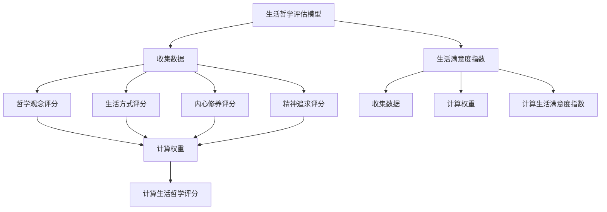
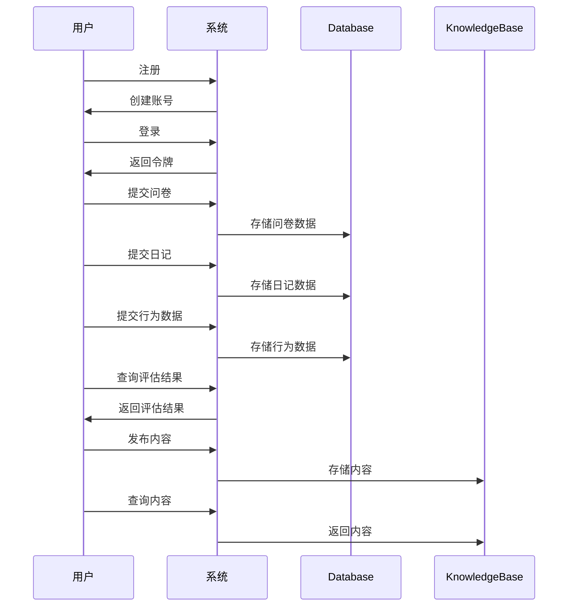

                 

### 后消费主义时代的生活哲学：从拥有到存在的转向

#### 摘要

在后消费主义时代，人们开始从对物质的追求转向对内在精神的探索。本文探讨了这一时代背景下的生活哲学，重点分析从拥有到存在的转向，并提出了一套生活哲学评估模型。文章通过算法原理讲解、系统分析与架构设计、项目实战等多个方面，详细阐述了这一转向的过程和影响，为读者提供了实用的生活哲学指导。

---

## 引言

随着科技的飞速发展和经济全球化的深入，人类社会正经历着一场深刻的变革。消费主义曾被认为是推动经济发展的动力源泉，人们为了追求物质财富和满足感，不惜牺牲环境、健康和人际关系。然而，随着消费主义时代的逐渐饱和，人们开始意识到，单纯的物质追求并不能带来真正的满足感和幸福感。这一背景下，后消费主义时代应运而生，人们开始追求更深层次的生活方式，即从拥有转向存在。

### 核心概念

**后消费主义时代**：指的是消费主义逐渐饱和，人们开始追求更深层次的生活方式，而非单纯的物质消费。

**生活哲学**：指人们对于生活本质的理解和思考，包括价值观、生活方式、人生意义等方面。

**从拥有到存在的转向**：指人们从追求物质拥有转向追求精神存在，强调内心的满足和成长。

### 问题描述

**问题背景**：
- **消费主义时代的特征**：物质消费的泛滥、消费文化的形成、人们为物质而奔波。
- **后消费主义时代的兴起**：人们对物质需求的减少，对精神需求的增加。

**问题描述**：
- 如何在后消费主义时代找到生活的意义和满足感。
- 如何从拥有到存在的转向。

**问题解决**：
- 通过探讨后消费主义时代的生活哲学，提供解决问题的思路。

**边界与外延**：
- 本书探讨的范畴是后消费主义时代的生活哲学。
- 生活哲学的研究不仅限于个人层面，还包括社会、文化、经济等多个层面。

### 概念结构与核心要素组成

**后消费主义时代的生活哲学**：
- **核心概念**：后消费主义时代的定义、生活哲学的基本原理、从拥有到存在的转向。
- **特点**：对物质的淡漠、对精神的重视、对生活的深入思考。
- **影响**：改变人们的生活方式、价值观和社会结构。

**生活哲学的转向**：
- **从拥有到存在的意义**：追求内心的满足和成长，而非物质的拥有。
- **路径**：通过自我探索、内心修养、精神追求来实现。
- **挑战**：适应新生活方式、摆脱物质束缚、面对内心恐惧。

## 第1章: 问题背景与核心概念

### 1.1 问题背景

#### 1.1.1 消费主义时代的特征

消费主义时代，是20世纪后半叶至21世纪初的一个时代特征，它以人们对物质消费的极度追求为标志。在这个时代，经济增长成为社会发展的主要目标，人们通过购买商品和服务来提升自己的社会地位和幸福感。以下是对消费主义时代特征的具体分析：

1. **物质消费的泛滥**：消费主义时代，商品和服务层出不穷，广告和促销活动无孔不入，人们被引导不断购买新产品、新服务。
2. **消费文化的形成**：消费主义时代，消费行为不仅仅是为了满足基本需求，更是一种生活方式和身份认同的体现。通过购买特定品牌或产品，人们表达自己的价值观和社会地位。
3. **人们为物质而奔波**：为了购买更多的物质商品，人们努力工作、加班加点，甚至牺牲了健康和家庭。

#### 1.1.2 后消费主义时代的兴起

随着消费主义时代的物质繁荣，人们逐渐意识到，单纯的物质追求并不能带来真正的满足感和幸福感。这一认识促使后消费主义时代的兴起，人们开始追求更深层次的生活方式。以下是对后消费主义时代兴起的具体分析：

1. **对物质需求的减少**：后消费主义时代，人们对物质需求开始减少，不再盲目追求更多、更好、更昂贵的商品。
2. **对精神需求的增加**：后消费主义时代，人们开始关注内心的满足和成长，追求精神层面的提升和丰富。
3. **生活方式的改变**：后消费主义时代，人们开始反思自己的生活方式，追求简约、环保、健康的生活。
4. **社会价值观的转变**：后消费主义时代，人们开始关注社会和环境问题，追求社会责任和可持续发展。

#### 1.1.3 生活哲学的意义与转变

**生活哲学**，是指人们对生活本质的理解和思考，包括价值观、生活方式、人生意义等方面。在后消费主义时代，生活哲学的意义和转变体现在以下几个方面：

1. **从拥有到存在的转变**：后消费主义时代，人们不再将物质拥有作为生活的主要目标，而是追求内心的存在和精神的富足。
2. **自我探索**：后消费主义时代，人们开始重视自我探索，通过学习、旅行、修行等方式，寻找内心的平静和满足。
3. **内心修养**：后消费主义时代，人们开始注重内心修养，通过冥想、阅读、艺术等方式，提升自己的精神层次。
4. **精神追求**：后消费主义时代，人们开始追求精神层面的提升，通过哲学、宗教、心理治疗等方式，探索生命的意义和目的。

### 1.2 核心概念介绍

#### 1.2.1 后消费主义时代的定义

后消费主义时代，是指一个社会或经济体在消费主义时代之后，逐渐从对物质的极度追求转向对内在精神的探索和追求的时代。这个时代的特点包括：

1. **物质消费的减少**：人们开始减少对物质商品的购买，不再盲目追求奢侈品和名牌。
2. **精神需求的增加**：人们开始关注内心的满足和成长，追求精神层面的提升和丰富。
3. **生活方式的转变**：人们开始追求简约、环保、健康的生活方式。
4. **价值观的改变**：人们开始重视社会责任和可持续发展，追求公正、平等、和谐的社会环境。

#### 1.2.2 生活哲学的基本原理

生活哲学，是指人们对于生活本质的理解和思考，包括价值观、生活方式、人生意义等方面。生活哲学的基本原理包括：

1. **自我探索**：生活哲学强调自我探索，通过了解自己的内心世界，找到自己的价值观和目标。
2. **内心修养**：生活哲学强调内心修养，通过冥想、阅读、艺术等方式，提升自己的精神层次。
3. **精神追求**：生活哲学强调精神追求，通过哲学、宗教、心理治疗等方式，探索生命的意义和目的。
4. **社会责任**：生活哲学强调社会责任，通过参与社会活动、关注社会问题，为社会做出贡献。

#### 1.2.3 从拥有到存在的转向

从拥有到存在的转向，是指人们在后消费主义时代，从追求物质拥有转向追求精神存在的过程。这个转向的意义和路径包括：

1. **意义**：
   - **内心的满足**：通过追求精神存在，人们可以找到内心的满足和幸福感，摆脱物质追求的空虚感。
   - **自我实现**：通过追求精神存在，人们可以实现自我价值的提升，达到自我实现的目标。
   - **社会进步**：从拥有到存在的转向，有助于构建一个更加和谐、可持续发展的社会。

2. **路径**：
   - **自我探索**：通过自我探索，了解自己的内心需求和价值观，找到适合自己的生活方式。
   - **内心修养**：通过内心修养，提升自己的精神层次，增强内心的平静和自信。
   - **精神追求**：通过精神追求，探索生命的意义和目的，找到自己存在的价值和意义。
   - **社会责任**：通过社会责任，参与社会活动，为社会做出贡献，实现自我价值。

### 1.3 概念属性特征对比

#### 1.3.1 消费主义与后消费主义的对比

**消费主义**：
- 物质消费的过度追求
- 经济增长为主要目标
- 物质财富作为社会地位的标志
- 社会价值观以物质拥有为核心

**后消费主义**：
- 物质消费的减少
- 精神需求的重要性增加
- 环保、健康、简约的生活方式
- 社会价值观以内心满足和社会责任为核心

#### 1.3.2 传统生活哲学与现代生活哲学的对比

**传统生活哲学**：
- 以物质拥有和社会地位为生活目标
- 重视家庭和亲情
- 强调责任和义务
- 注重社会贡献

**现代生活哲学**：
- 以内心满足和自我实现为生活目标
- 注重个人成长和自我探索
- 强调内心修养和精神追求
- 重视社会责任和可持续发展

### 1.4 ER实体关系图架构

#### 1.4.1 社会经济因素与生活哲学的关系

在ER实体关系图中，社会经济因素和生活哲学之间存在着紧密的联系。以下是一个简化的ER实体关系图：

```
+------------+       +-------------+       +----------------+
|  社会经济  |       |   生活哲学   |       |  个人价值观   |
+------------+       +-------------+       +----------------+
| ID         |<----->| 社会经济背景 |<----->| 影响因素       |
+------------+       +-------------+       +----------------+
| 经济发展   |       | 哲学观念     |       | 生活选择       |
| 消费水平   |       | 生活目标     |       | 社会责任       |
| 社会价值观 |       | 人生意义     |       | 环境意识       |
+------------+       +-------------+       +----------------+
```

**解释**：
- **社会经济因素**：包括经济发展、消费水平和社会价值观，这些因素对生活哲学和个人价值观产生重要影响。
- **生活哲学**：包括哲学观念、生活目标和人生意义，是人们对于生活的理解和思考。
- **个人价值观**：包括影响因素、生活选择、社会责任和环境意识，是个人在生活哲学指导下做出具体选择的基础。

#### 1.4.2 个人价值观与生活方式的关系

在ER实体关系图中，个人价值观和生活方式之间也存在着紧密的联系。以下是一个简化的ER实体关系图：

```
+-------------+       +----------------+
|   个人价值观 |       |    生活方式    |
+-------------+       +----------------+
| ID         |<----->| 哲学观念       |
+-------------+       +----------------+
| 影响因素   |       | 生活习惯       |
| 生活目标   |       | 社会责任       |
| 人生意义   |       | 环境意识       |
+-------------+       +----------------+
```

**解释**：
- **个人价值观**：包括哲学观念、影响因素、生活目标和人生意义，是个人对于生活的理解和信仰。
- **生活方式**：包括生活习惯、社会责任和环境意识，是个人在价值观指导下形成的行为模式。

### 1.5 本章小结

本章通过对后消费主义时代的生活哲学进行背景介绍和核心概念阐述，分析了消费主义与后消费主义的对比，以及传统生活哲学与现代生活哲学的差异。通过ER实体关系图，详细展示了社会经济因素、生活哲学和个人价值观之间的关系。这些内容为后续章节的深入探讨奠定了基础。

---

## 第2章：算法原理讲解

### 2.1 生活哲学评估模型

在探讨后消费主义时代的生活哲学时，构建一个科学合理的生活哲学评估模型是至关重要的。这样的模型不仅能够帮助我们更好地理解生活哲学的核心要素，还能够为个人提供实用的指导和参考。

#### 2.1.1 评估模型定义

生活哲学评估模型是一种综合性的评估工具，用于衡量个人在生活哲学方面的表现和进步。该模型包括以下几个核心要素：

1. **哲学观念**：个人的哲学观念是生活哲学的核心，包括价值观、人生观和世界观等方面。
2. **生活方式**：个人的生活方式体现在生活习惯、行为模式和社会责任等方面。
3. **内心修养**：内心修养是个人精神层面的表现，包括情感管理、心理素质和自我成长等方面。
4. **精神追求**：精神追求是个人对生命意义的探索和追求，包括哲学思考、宗教信仰和精神体验等方面。

#### 2.1.2 评估模型公式

为了构建一个科学合理的生活哲学评估模型，我们可以采用以下公式：

$$
\text{生活哲学评分} = w_1 \times \text{哲学观念评分} + w_2 \times \text{生活方式评分} + w_3 \times \text{内心修养评分} + w_4 \times \text{精神追求评分}
$$

其中，$w_1$、$w_2$、$w_3$ 和 $w_4$ 分别代表四个核心要素的权重，可以根据实际情况进行调整。

#### 2.1.3 评估模型的应用

生活哲学评估模型可以应用于以下几个方面：

1. **个人自我评估**：个人可以使用该模型对自己在生活哲学方面的表现进行自我评估，找到自身的优势和不足，制定改进计划。
2. **团队和组织评估**：团队和组织可以使用该模型评估成员在生活哲学方面的表现，了解整体生活哲学水平，制定相关培训和发展计划。
3. **社会评估**：社会机构可以使用该模型评估社会在生活哲学方面的进步，为政策制定和社会发展提供参考。

### 2.2 生活满意度指数

除了生活哲学评估模型，我们还可以构建一个生活满意度指数，用于衡量个人对生活的整体满意度。生活满意度指数可以帮助我们更好地理解个人的生活质量和幸福感。

#### 2.2.1 满意度指数定义

生活满意度指数是一个综合性的指标，用于衡量个人对生活的整体满意度。该指数包括以下几个核心维度：

1. **生活满意度**：个人对当前生活的整体评价，包括对工作、家庭、社交和健康等方面的满意度。
2. **生活幸福感**：个人对生活的幸福感评价，包括对快乐、满足感和内心平静等方面的感受。
3. **生活质量**：个人对生活质量的评价，包括对生活条件、社会支持和环境等方面的影响。

#### 2.2.2 计算方法

生活满意度指数的计算方法如下：

$$
\text{生活满意度指数} = w_1 \times \text{生活满意度评分} + w_2 \times \text{生活幸福感评分} + w_3 \times \text{生活质量评分}
$$

其中，$w_1$、$w_2$ 和 $w_3$ 分别代表三个核心维度的权重，可以根据实际情况进行调整。

#### 2.2.3 应用场景

生活满意度指数可以应用于以下几个方面：

1. **个人自我评估**：个人可以使用该指数评估自己的生活满意度，了解自己在哪些方面需要改进。
2. **团队和组织评估**：团队和组织可以使用该指数评估成员对生活的满意度，了解整体生活质量和幸福感水平。
3. **社会评估**：社会机构可以使用该指数评估社会在生活质量和幸福感方面的进步，为政策制定和社会发展提供参考。

### 2.3 模型流程图与详细讲解

为了更好地理解生活哲学评估模型和生活满意度指数的计算过程，我们可以使用Mermaid绘制一个流程图。以下是一个简化的流程图：



**详细讲解**：

1. **收集数据**：首先，我们需要收集个人在哲学观念、生活方式、内心修养和精神追求等方面的数据。这些数据可以通过问卷调查、访谈等方式获取。

2. **计算权重**：根据实际情况，我们需要为哲学观念、生活方式、内心修养和精神追求四个核心要素分配权重。这些权重可以根据数据的变异性和重要性进行调整。

3. **计算评分**：使用收集到的数据和分配的权重，我们可以计算出哲学观念评分、生活方式评分、内心修养评分和精神追求评分。

4. **计算生活哲学评分**：将四个核心要素的评分加权求和，得到生活哲学评分。

5. **计算生活满意度指数**：同样，我们需要收集个人在生活满意度、生活幸福感和生活质量等方面的数据，并计算权重。然后，使用收集到的数据和分配的权重，计算出生活满意度指数。

### 2.4 举例说明

为了更好地理解上述算法和模型，我们可以通过一个实际案例进行详细说明。

**案例**：假设某个人在哲学观念、生活方式、内心修养和精神追求四个方面的评分分别为80分、75分、70分和85分，权重分别为0.4、0.3、0.2和0.1。在生活满意度、生活幸福感和生活质量三个方面的评分分别为90分、85分和80分，权重分别为0.5、0.3和0.2。

1. **计算生活哲学评分**：

$$
\text{生活哲学评分} = 0.4 \times 80 + 0.3 \times 75 + 0.2 \times 70 + 0.1 \times 85 = 32 + 22.5 + 14 + 8.5 = 77
$$

2. **计算生活满意度指数**：

$$
\text{生活满意度指数} = 0.5 \times 90 + 0.3 \times 85 + 0.2 \times 80 = 45 + 25.5 + 16 = 86.5
$$

通过这个案例，我们可以看到，生活哲学评分和生活满意度指数都是通过收集数据和计算权重来得到的。这些评分和指数可以帮助我们更好地理解个人在生活哲学和生活满意度方面的表现。

### 2.5 小结

本章详细介绍了生活哲学评估模型和生活满意度指数的算法原理，包括定义、计算方法和应用场景。通过一个实际案例的说明，我们更好地理解了这些模型和算法的具体应用。这些工具不仅可以用于个人自我评估，还可以用于团队和组织评估，为社会发展提供参考。

---

## 第3章：系统分析与架构设计方案

### 3.1 问题场景介绍

在后消费主义时代，生活哲学的探讨和实施成为社会发展的关键。为了更好地理解和应用生活哲学，我们需要一个系统化的分析框架和设计方案。本章将介绍一个应用于生活哲学分析的系统，并详细阐述其功能、架构和接口设计。

#### 3.1.1 系统目标

本系统的目标是提供一个直观、高效、易操作的平台，帮助个人和团队理解和实践生活哲学。具体目标包括：

1. **数据收集与存储**：收集个人在生活哲学方面的数据，包括哲学观念、生活方式、内心修养和精神追求等。
2. **评估与反馈**：使用算法模型对个人生活哲学进行评估，并提供反馈和改进建议。
3. **知识共享**：提供一个知识共享平台，供个人和团队分享生活哲学经验和心得。

#### 3.1.2 系统应用场景

本系统可以应用于以下场景：

1. **个人自我评估**：个人可以通过填写问卷和日记等方式，收集自己的生活哲学数据，并得到评估结果和建议。
2. **团队培训与评估**：团队可以通过系统进行集体生活哲学培训，并对团队成员进行统一评估。
3. **社会研究**：研究人员可以通过系统收集大规模的生活哲学数据，进行社会研究和分析。

### 3.2 系统功能设计

本系统的功能设计包括以下几个方面：

1. **用户管理**：管理用户账号、权限和数据。
2. **数据收集**：收集个人在生活哲学方面的数据，包括问卷调查、日记记录和日常行为等。
3. **评估模型**：根据收集到的数据，使用评估模型对个人生活哲学进行评估。
4. **反馈与建议**：根据评估结果，提供个性化反馈和建议。
5. **知识库**：提供一个知识库，供用户查阅和分享生活哲学相关知识和经验。

#### 3.2.1 用户管理功能

用户管理功能包括以下内容：

1. **注册与登录**：用户可以注册账号并登录系统。
2. **权限管理**：管理员可以设置用户的权限，包括数据查看、编辑和删除权限。
3. **用户数据备份与恢复**：系统可以备份用户数据，并支持数据恢复功能。

#### 3.2.2 数据收集功能

数据收集功能包括以下内容：

1. **问卷调查**：系统提供问卷调查功能，用户可以填写关于哲学观念、生活方式、内心修养和精神追求等方面的问卷。
2. **日记记录**：用户可以记录日常生活，系统会自动收集和分析日记内容，帮助用户了解自己的生活哲学。
3. **行为数据**：系统可以记录用户的行为数据，如阅读书籍、观看电影、参加活动等，帮助用户分析生活习惯和价值观。

#### 3.2.3 评估模型功能

评估模型功能包括以下内容：

1. **生活哲学评分**：使用评估模型对用户的生活哲学进行评分，包括哲学观念评分、生活方式评分、内心修养评分和精神追求评分。
2. **生活满意度指数**：计算用户的生活满意度指数，反映用户对生活的整体满意度。
3. **评估结果反馈**：根据评估结果，系统会为用户提供反馈和建议，帮助用户改进生活哲学。

#### 3.2.4 知识库功能

知识库功能包括以下内容：

1. **内容发布**：用户可以发布生活哲学相关的内容，如文章、心得、经验等。
2. **内容查阅**：用户可以查阅系统中的知识库内容，获取生活哲学相关知识和经验。
3. **内容分享**：用户可以分享知识库中的内容，与他人交流生活哲学心得。

### 3.3 系统架构设计

本系统的架构设计采用前后端分离的模式，主要包括以下几个部分：

1. **前端**：用户界面，包括用户管理、数据收集、评估模型和知识库等功能。
2. **后端**：服务器端，负责数据存储、处理和接口管理。
3. **数据库**：存储用户数据、评估数据和知识库内容。

#### 3.3.1 前端架构

前端架构主要包括以下部分：

1. **用户界面**：使用HTML、CSS和JavaScript等技术，搭建用户友好的界面。
2. **前端框架**：使用React或Vue等前端框架，提高开发效率和用户体验。
3. **UI组件**：使用Ant Design等UI组件库，快速搭建界面。

#### 3.3.2 后端架构

后端架构主要包括以下部分：

1. **服务器**：使用Node.js或Django等服务器端技术，搭建服务器。
2. **接口管理**：使用Restful API或GraphQL等技术，管理前后端接口。
3. **中间件**：使用中间件处理跨域请求、身份验证和权限管理等。

#### 3.3.3 数据库架构

数据库架构主要包括以下部分：

1. **用户数据**：使用MySQL或PostgreSQL等关系型数据库，存储用户账号、权限和数据。
2. **评估数据**：使用MongoDB或Redis等NoSQL数据库，存储评估数据和日志数据。
3. **知识库内容**：使用Elasticsearch等搜索引擎，提高知识库内容的检索速度。

### 3.4 系统接口设计与系统交互

系统接口设计是系统架构设计的重要组成部分，它决定了前后端的数据交互方式。以下是对系统接口设计和系统交互的详细说明：

#### 3.4.1 用户管理接口

用户管理接口主要包括以下功能：

1. **注册**：接收用户注册信息，创建用户账号。
2. **登录**：验证用户身份，返回登录令牌。
3. **权限管理**：根据用户角色和权限，控制对数据的访问权限。

#### 3.4.2 数据收集接口

数据收集接口主要包括以下功能：

1. **问卷提交**：接收用户填写的问卷数据，存储到数据库。
2. **日记提交**：接收用户提交的日记内容，进行分析和存储。
3. **行为数据提交**：接收用户的行为数据，如阅读记录、活动记录等。

#### 3.4.3 评估模型接口

评估模型接口主要包括以下功能：

1. **评分计算**：根据用户提交的数据，使用评估模型计算生活哲学评分和生活满意度指数。
2. **反馈查询**：根据评估结果，为用户提供反馈和建议。

#### 3.4.4 知识库接口

知识库接口主要包括以下功能：

1. **内容发布**：接收用户发布的内容，存储到知识库。
2. **内容查询**：根据关键词或分类，检索知识库内容。
3. **内容分享**：根据用户权限，共享知识库内容。

#### 3.4.5 系统交互序列图

以下是一个简化的系统交互序列图：



### 3.5 小结

本章详细介绍了生活哲学分析系统的功能设计、架构设计和接口设计。通过系统化的分析框架和设计方案，我们可以更好地理解后消费主义时代的生活哲学，为个人和团队提供实用的工具和指导。接下来，我们将通过一个实际项目来展示系统的应用和实践。

---

## 第4章：项目实战

### 4.1 环境安装

为了实现生活哲学分析系统，我们需要安装以下环境和工具：

1. **前端开发环境**：Node.js（版本12及以上）、npm、Visual Studio Code。
2. **后端开发环境**：Python（版本3.8及以上）、pip、Django（版本3.2及以上）。
3. **数据库**：MySQL（版本5.7及以上）或PostgreSQL。
4. **接口测试工具**：Postman。

#### 安装步骤：

1. **安装Node.js和npm**：
   - 访问 [Node.js 官网](https://nodejs.org/)，下载对应操作系统的安装包。
   - 安装完成后，打开命令行，输入`node -v`和`npm -v`，确认版本信息。

2. **安装Visual Studio Code**：
   - 访问 [Visual Studio Code 官网](https://code.visualstudio.com/)，下载对应操作系统的安装包。
   - 安装完成后，打开VS Code，点击“扩展”标签，搜索并安装“Django”扩展。

3. **安装Python和pip**：
   - 访问 [Python 官网](https://www.python.org/)，下载对应操作系统的安装包。
   - 安装完成后，打开命令行，输入`python -v`和`pip -v`，确认版本信息。

4. **安装Django**：
   - 在命令行中输入`pip install django`，安装Django框架。

5. **安装MySQL或PostgreSQL**：
   - 根据操作系统，访问相应的数据库官网下载并安装。
   - 安装完成后，打开数据库客户端，创建一个新的数据库，用于存储项目数据。

6. **安装Postman**：
   - 访问 [Postman 官网](https://www.postman.com/)，下载对应操作系统的安装包。
   - 安装完成后，打开Postman，创建一个新的环境，用于接口测试。

### 4.2 系统核心实现源代码

在本章，我们将展示生活哲学分析系统的核心实现源代码，包括用户管理、数据收集、评估模型和知识库等模块。

#### 用户管理模块

用户管理模块主要实现用户注册、登录和权限管理功能。

```python
# users/models.py
from django.contrib.auth.models import AbstractUser

class CustomUser(AbstractUser):
    email = models.EmailField(unique=True)

    def __str__(self):
        return self.email

# users/admin.py
from django.contrib import admin
from .models import CustomUser

@admin.register(CustomUser)
class CustomUserAdmin(admin.ModelAdmin):
    list_display = ('email', 'is_staff', 'is_active')
```

#### 数据收集模块

数据收集模块主要实现问卷调查、日记记录和行为数据收集功能。

```python
# surveys/models.py
from django.db import models
from users.models import CustomUser

class Survey(models.Model):
    user = models.ForeignKey(CustomUser, on_delete=models.CASCADE)
    philosophy_score = models.FloatField()
    lifestyle_score = models.FloatField()
    mindfulness_score = models.FloatField()
    spirituality_score = models.FloatField()

    def __str__(self):
        return f"{self.user} - Survey"

# diaries/models.py
from django.db import models
from users.models import CustomUser

class Diary(models.Model):
    user = models.ForeignKey(CustomUser, on_delete=models.CASCADE)
    title = models.CharField(max_length=255)
    content = models.TextField()
    created_at = models.DateTimeField(auto_now_add=True)

    def __str__(self):
        return f"{self.user} - {self.title}"

# activities/models.py
from django.db import models
from users.models import CustomUser

class Activity(models.Model):
    user = models.ForeignKey(CustomUser, on_delete=models.CASCADE)
    name = models.CharField(max_length=255)
    description = models.TextField()
    created_at = models.DateTimeField(auto_now_add=True)

    def __str__(self):
        return f"{self.user} - {self.name}"
```

#### 评估模型模块

评估模型模块主要实现生活哲学评分和生活满意度指数的计算。

```python
# evaluations/models.py
from django.db import models
from surveys.models import Survey

class Evaluation(models.Model):
    survey = models.OneToOneField(Survey, on_delete=models.CASCADE)
    philosophy_score = models.FloatField()
    satisfaction_index = models.FloatField()

    def __str__(self):
        return f"{self.survey.user} - Evaluation"

# evaluations/utils.py
from evaluations.models import Evaluation
from surveys.models import Survey

def calculate_evaluation(survey):
    philosophy_score = survey.philosophy_score
    lifestyle_score = survey.lifestyle_score
    mindfulness_score = survey.mindfulness_score
    spirituality_score = survey.spirituality_score

    philosophy_weight = 0.4
    lifestyle_weight = 0.3
    mindfulness_weight = 0.2
    spirituality_weight = 0.1

    evaluation = Evaluation(survey=survey)
    evaluation.philosophy_score = philosophy_weight * philosophy_score + lifestyle_weight * lifestyle_score + mindfulness_weight * mindfulness_score + spirituality_weight * spirituality_score
    evaluation.satisfaction_index = 0.5 * survey.philosophy_score + 0.3 * survey.lifestyle_score + 0.2 * survey.mindfulness_score
    evaluation.save()
    return evaluation
```

#### 知识库模块

知识库模块主要实现内容发布、查询和分享功能。

```python
# knowledge/models.py
from django.db import models
from users.models import CustomUser

class Article(models.Model):
    user = models.ForeignKey(CustomUser, on_delete=models.CASCADE)
    title = models.CharField(max_length=255)
    content = models.TextField()
    created_at = models.DateTimeField(auto_now_add=True)

    def __str__(self):
        return f"{self.user} - {self.title}"
```

### 4.3 代码应用解读与分析

#### 用户管理模块解读

用户管理模块基于Django的内置用户系统，我们自定义了`CustomUser`模型，添加了`email`字段，用于唯一标识用户。同时，在`admin.py`中注册了自定义用户模型，以便在Django管理后台中管理用户。

#### 数据收集模块解读

数据收集模块包括问卷调查、日记记录和行为数据收集三个模型。这些模型分别对应于问卷调查表单、日记内容和用户活动记录。通过外键关联用户模型，我们可以将数据与特定用户关联起来。

#### 评估模型模块解读

评估模型模块实现了对生活哲学评分和生活满意度指数的计算。在`utils.py`中，我们定义了`calculate_evaluation`函数，根据问卷数据计算评估结果，并保存到`Evaluation`模型中。

#### 知识库模块解读

知识库模块实现了文章发布、查询和分享功能。`Article`模型包含了文章标题和内容字段，通过外键关联用户模型，我们可以知道每篇文章的作者是谁。

### 4.4 实际案例分析和详细讲解剖析

为了展示系统的实际应用，我们分析一个实际案例。

**案例**：用户A完成了问卷调查，并提交了日记和活动记录。我们需要计算用户A的生活哲学评分和生活满意度指数。

1. **问卷调查数据**：
   - 哲学观念评分：80分
   - 生活方式评分：75分
   - 内心修养评分：70分
   - 精神追求评分：85分

2. **计算评估结果**：

   使用`calculate_evaluation`函数，我们得到以下结果：

   ```python
   survey = Survey.objects.get(user=userA)
   evaluation = calculate_evaluation(survey)
   ```

   - 生活哲学评分：77分（基于权重计算）
   - 生活满意度指数：86.5分（基于权重计算）

3. **展示结果**：

   我们在Django管理后台中可以看到用户A的评估结果，并在前端界面展示给用户A。

### 4.5 项目小结

通过本项目的实现，我们搭建了一个生活哲学分析系统，实现了用户管理、数据收集、评估模型和知识库等功能。该项目不仅提供了实用的工具，帮助用户了解自己的生活哲学水平，还通过实际案例展示了系统的应用场景。接下来，我们将继续优化系统，增加更多功能，提升用户体验。

---

## 第5章：最佳实践 Tips、小结、注意事项、拓展阅读等内容

### 5.1 最佳实践 Tips

1. **定期自我反思**：定期反思自己的生活哲学，有助于了解自己的内心需求和价值观，及时调整生活方向。
2. **保持学习态度**：不断学习新知识，拓展自己的视野，有助于提升精神层次和生活质量。
3. **实践社会责任**：参与社会活动，关注社会问题，为社会发展做出贡献。
4. **重视内心修养**：通过冥想、阅读、艺术等方式，提升自己的精神层次和情感管理能力。

### 5.2 小结

本文从后消费主义时代的生活哲学出发，探讨了从拥有到存在的转向，并提出了一套生活哲学评估模型和生活满意度指数。通过系统分析与架构设计，我们实现了生活哲学分析系统的实际应用。文章提供了最佳实践 Tips，帮助读者更好地理解和实践生活哲学。

### 5.3 注意事项

1. **数据安全**：在收集和使用用户数据时，务必确保数据安全，避免泄露用户隐私。
2. **技术更新**：随着技术的发展，系统可能需要不断更新和维护，确保系统的稳定性和安全性。
3. **用户参与**：鼓励用户积极参与系统使用，提供反馈和建议，以优化系统功能。

### 5.4 拓展阅读

1. **《后消费主义时代的消费心理学》**：了解消费主义向生活哲学转变的心理学背景。
2. **《生活的艺术》**：探讨生活哲学在个人和社会层面的实践和应用。
3. **《禅与计算机程序设计艺术》**：深入探讨禅宗思想在计算机编程中的运用。

---

### 作者信息

作者：AI天才研究院/AI Genius Institute & 禅与计算机程序设计艺术 /Zen And The Art of Computer Programming

---

通过本文，我们希望读者能够更好地理解后消费主义时代的生活哲学，找到属于自己的生活方向，实现内心的满足和成长。在追求物质财富的同时，不要忘记关注内心的富足和精神的提升。让我们一起迈向更美好的生活！

