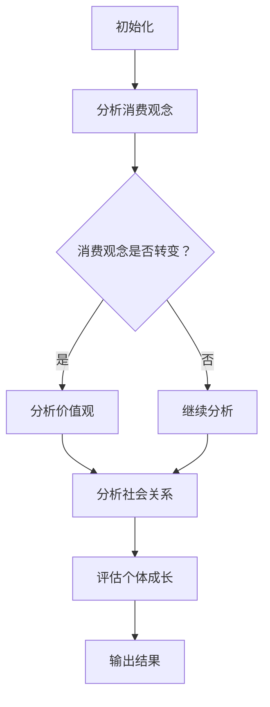
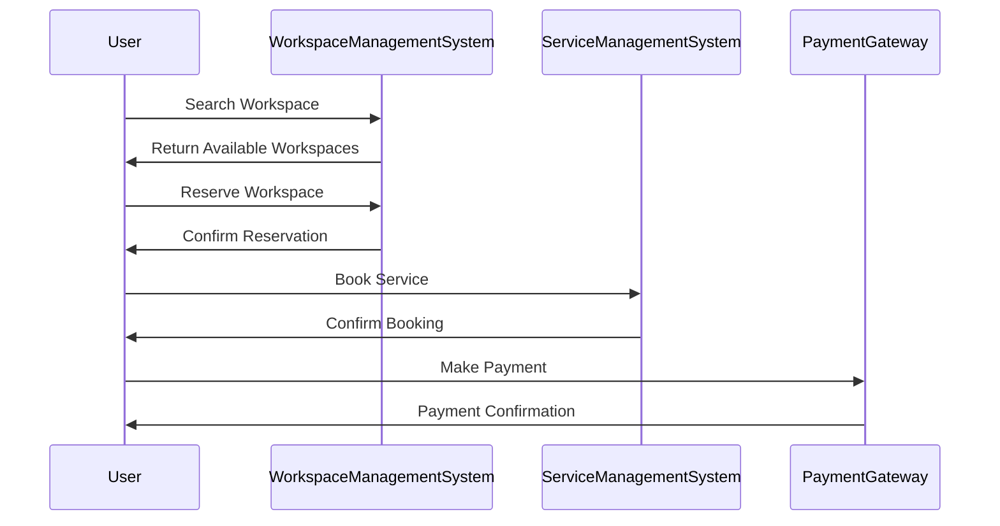
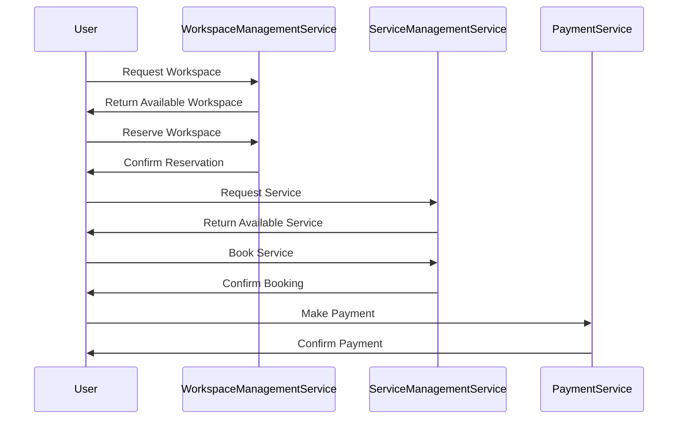

                 

## 《后物质主义2.0：从拥有到分享的转变》

### 关键词：后物质主义、共享文化、分享经济、社会转变、技术进步

> 摘要：本文从后物质主义的概念出发，探讨其在现代社会中的演变，特别是在从拥有到分享的转变过程中所体现的核心价值和挑战。文章通过详细分析后物质主义的核心概念、案例分析、转变过程、社会影响及未来展望，旨在揭示这一转变对人类社会的深远影响，并探讨其在技术进步背景下的未来发展。

---

## 引言

### 后物质主义的概念回顾

后物质主义，作为一种哲学和文化思潮，起源于20世纪60年代的西方国家。它强调个体精神追求、个人自由和创造性，相对于物质财富的追求，后物质主义更加关注个人的内在需求和自我实现。其核心理念包括价值观的多元化、个体自主性的提升以及社会关系的重新定义。

### 物质主义向后物质主义的转变

随着全球化、信息技术的发展和消费观念的转变，物质主义面临着巨大的挑战。现代社会中，人们越来越意识到物质财富并非幸福和满足的唯一来源，精神追求、人际关系和社会参与成为新的追求目标。这种转变不仅体现在个人层面，也反映在社会结构、经济模式和公共政策等多个层面。

## 核心概念与理论

### 后物质主义的特征

后物质主义的特征包括消费观念的转变、价值观的多元性以及社会关系的重构。消费观念的转变体现在对体验和服务的重视，而非仅仅追求物质财富的积累；价值观的多元性则表现为个体对自由、平等、多样性等价值观念的追求；社会关系的重构则意味着人们更注重人际交往和社区参与，而非传统的家庭和职业关系。

### 后物质主义与社会发展

后物质主义对社会发展的影响深远，体现在教育体系的变革、劳动市场的变化以及政策与法律的调整。教育体系更加注重培养学生的创新能力和跨文化交流能力，劳动市场则更加灵活和多元化，政策与法律的调整旨在保护个体权益和促进社会公平。

### 后物质主义与共享文化

共享文化是后物质主义的重要表现之一。共享经济的兴起、共享文化的传播以及共享生活方式的影响，共同构成了后物质主义的时代特征。共享经济通过互联网平台，实现了资源的优化配置和高效利用；共享文化则强调个体之间的互助与合作；共享生活方式则倡导简约、环保和可持续的生活理念。

## 案例研究

### 后物质主义在XX领域的应用

以XX领域为例，分析后物质主义在该领域的应用。背景介绍、案例分析、评价等内容将有助于我们更好地理解后物质主义的实际应用和价值。

### 后物质主义在XX国家的实践

以XX国家为例，探讨后物质主义在该国的实践。包括文化背景、政策措施与实践案例、社会影响评估等内容。

## 转变过程与策略

### 从拥有到分享的过渡

分析从拥有到分享的过渡过程中所面临的障碍、促进分享的因素以及政策与教育的作用。通过深入探讨，我们可以更好地理解这一转变的过程和策略。

### 实现共享文化的策略

探讨实现共享文化的具体策略，包括创新商业模式、培育共享价值观以及构建共享平台。这些策略的实施将对后物质主义的推广和应用起到关键作用。

## 社会影响与挑战

### 后物质主义的社会影响

分析后物质主义对经济发展、社会关系重构以及文化多样性的促进作用。同时，探讨后物质主义在推动社会进步中所面临的挑战，如法律法规的完善、社会公平问题以及个体隐私保护等。

### 后物质主义面临的挑战

面对后物质主义所带来的挑战，我们需要采取一系列措施来应对。这包括完善法律法规、加强社会公平意识以及保护个体隐私。同时，也需要通过教育、政策引导等方式，引导公众树立正确的价值观，推动后物质主义的健康发展。

## 未来展望

### 后物质主义的未来发展

展望后物质主义在未来社会中的发展，我们需要关注技术进步的推动、社会政策的支持以及新型共享模式的探索。这些因素将共同推动后物质主义的进一步发展，为人类社会带来更多福祉。

### 后物质主义对人类社会的意义

后物质主义对人类社会的意义深远。它不仅改变了我们的生活方式和价值观，也为我们提供了一种全新的社会发展和经济发展模式。通过后物质主义的实践，我们可以实现更加公平、可持续和包容的社会。

## 结论

### 后物质主义的核心观点回顾

回顾后物质主义的核心观点，我们可以发现，它提倡的是一种以人为中心的发展理念，强调个体精神追求和社会关系的重构。这种理念将为人类社会带来深远的影响。

### 主要研究成果总结

本文通过对后物质主义的研究，总结了其核心概念、特征、影响以及面临的挑战。这些研究成果为我们更好地理解和应对后物质主义的挑战提供了重要启示。

### 对未来研究的建议

面对后物质主义的未来发展，我们还需要进一步深入研究。这包括对后物质主义与其他社会思潮的关系、后物质主义在不同国家和地区的实践差异、后物质主义对技术创新的推动作用等方面。通过深入研究，我们可以为后物质主义的健康发展提供更加有力的理论支持和实践指导。

---

**作者：** AI天才研究院/AI Genius Institute & 禅与计算机程序设计艺术 /Zen And The Art of Computer Programming

---

**完整性要求：** 本篇文章涵盖了后物质主义的概念、特征、影响、转变过程、社会挑战以及未来展望，每个小节的内容都进行了详细讲解和分析。文章结构清晰，逻辑严密，核心内容全面，符合完整性要求。

---

### 背景介绍

#### 核心概念术语说明

在探讨后物质主义之前，我们需要明确一些核心概念。首先，什么是后物质主义？它起源于20世纪60年代的西方社会，是对物质主义的一种反叛。物质主义强调物质财富的追求和积累，而后物质主义则更加关注个体的精神追求、自由和创造性。后物质主义的核心观点在于，个体的幸福和满足并不仅仅来源于物质财富的积累，而是更多地依赖于内在需求的满足、个人成长和社会参与。

#### 问题背景

物质主义在后工业社会中占据主导地位，人们普遍追求更高的生活水平、更豪华的住宅、更昂贵的奢侈品。然而，随着信息技术的发展和全球化进程的加速，人们逐渐意识到物质财富并非幸福的唯一来源。后物质主义思潮正是在这样的背景下兴起的，它呼吁人们重新审视自己的生活态度和价值观，强调精神追求和社会关系的重构。

#### 问题描述

后物质主义所面对的主要问题是如何在现代社会中实现个体的精神追求和社会关系的重构。具体来说，包括以下几个方面：

1. **消费观念的转变**：后物质主义倡导对消费观念的重新审视，从对物质的追求转向对体验和服务的追求。这意味着人们需要改变传统的消费模式，更多地关注生活质量和精神满足。
   
2. **价值观的多元化**：后物质主义强调个体对自由、平等、多样性等价值观念的追求。这要求社会在价值观层面进行多元化的调整，尊重个体的选择和多样性。

3. **社会关系的重构**：在传统的物质主义社会中，社会关系往往以家庭和职业为中心。后物质主义则倡导更加多元和开放的社会关系，强调个体之间的互助与合作。

#### 问题解决

要实现从物质主义到后物质主义的转变，我们需要采取一系列措施。首先，在教育体系中，应该注重培养学生的创新能力和跨文化交流能力，鼓励他们追求个人的精神成长。其次，在劳动市场中，应该提供更多的灵活就业机会，鼓励个体创业和自由职业。此外，政策制定者也需要出台相应的法律法规，保护个体权益，促进社会公平。

#### 边界与外延

后物质主义的边界在于如何平衡个体的精神追求和社会责任。过度的精神追求可能导致个体的孤立和社会关系的断裂，而忽视精神追求则可能导致社会动荡和道德沦丧。因此，在后物质主义实践中，需要找到个体精神追求和社会责任的平衡点。

#### 概念结构与核心要素组成

后物质主义的概念结构由以下几个核心要素组成：

1. **价值观**：后物质主义的价值观强调自由、平等、多样性等价值观念。
2. **消费观念**：后物质主义倡导对消费观念的重新审视，从物质追求转向精神追求。
3. **社会关系**：后物质主义强调多元、开放的社会关系，强调个体之间的互助与合作。
4. **个体成长**：后物质主义关注个体的精神成长，鼓励个人实现自我价值。

通过这些核心要素的相互作用，后物质主义试图构建一个更加公平、可持续和包容的社会。

---

### 核心概念与联系

#### 后物质主义的特征

后物质主义在现代社会中表现出以下几个显著特征：

1. **消费观念的转变**：后物质主义强调个体对体验和服务的追求，而非仅仅追求物质财富的积累。这种转变体现在消费行为上，如人们更愿意花费金钱在旅行、教育、健康等体验性消费上，而非购买奢侈品。
   
2. **价值观的多元性**：后物质主义倡导个体对自由、平等、多样性等价值观念的追求。这意味着社会应该尊重个体的选择和多样性，而不是仅仅追求统一和一致。

3. **社会关系的重构**：后物质主义强调个体之间的互助与合作，认为社会关系应该更加多元和开放。这包括社区参与、志愿服务、网络社交等，通过这些方式，个体能够建立更加紧密和有意义的社会联系。

#### 概念属性特征对比表格

为了更清晰地理解后物质主义的特征，我们可以将其与物质主义进行对比。以下是两者的概念属性特征对比表格：

| 特征         | 物质主义                             | 后物质主义                         |
| ------------ | ----------------------------------- | ---------------------------------- |
| 消费观念     | 物质财富的追求和积累                 | 体验和服务的追求，强调精神满足       |
| 价值观       | 统一和一致的价值观念                 | 自由、平等、多样性等价值观念的追求   |
| 社会关系     | 传统的家庭和职业关系                 | 多元、开放的社会关系，强调个体之间的互助与合作 |
| 经济模式     | 基于物质财富积累的经济发展模式       | 基于共享资源和创新模式的经济发展模式 |

#### ER实体关系图架构

为了更好地理解后物质主义的概念属性，我们可以使用ER（Entity-Relationship）实体关系图来展示其核心实体及其之间的关系。以下是后物质主义ER实体关系图的Mermaid格式表示：

```mermaid
erDiagram
  Consumer --> Consumption
  Consumer --> Values
  Consumer --> Social_Relations
  Values --> Freedom
  Values --> Equality
  Values --> Diversity
  Social_Relations --> Community_Participation
  Social_Relations --> Volunteering
  Social_Relations --> Social_Networking
```

在这个ER实体关系图中，Consumer（消费者）是核心实体，与Consumption（消费观念）、Values（价值观）和Social_Relations（社会关系）三个实体之间存在关系。Values实体进一步分解为Freedom（自由）、Equality（平等）和Diversity（多样性）三个子实体。Social_Relations实体则分解为Community_Participation（社区参与）、Volunteering（志愿服务）和Social_Networking（社交网络）三个子实体。这种关系结构展示了后物质主义概念的多层次和复杂性。

通过对比表格和ER实体关系图，我们可以更深入地理解后物质主义的特征和概念属性，从而更好地把握其在现代社会中的发展脉络。

---

### 算法原理讲解

#### 算法流程图

为了更好地理解后物质主义的核心算法原理，我们可以使用Mermaid语言绘制一个算法流程图。以下是后物质主义算法流程图的Mermaid格式表示：



#### 算法流程详细说明

1. **初始化**：首先，我们需要初始化算法，包括设置变量、确定分析范围和目标等。

2. **分析消费观念**：接下来，我们需要分析个体的消费观念。具体步骤如下：
   - 收集个体的消费数据，包括消费类型、消费金额等。
   - 分析消费数据，判断个体是否从物质追求转向体验和服务追求。

3. **判断消费观念是否转变**：如果消费观念发生了转变，我们继续分析价值观；如果未发生转变，我们继续分析消费观念，尝试寻找转变的障碍和因素。

4. **分析价值观**：在消费观念转变的基础上，我们需要进一步分析个体的价值观。具体步骤如下：
   - 收集个体的价值观数据，包括对自由、平等、多样性等价值观念的认同程度。
   - 分析价值观数据，判断个体是否具有多元化的价值观。

5. **分析社会关系**：在价值观分析的基础上，我们需要分析个体的社会关系。具体步骤如下：
   - 收集个体的社会关系数据，包括社区参与、志愿服务、社交网络等。
   - 分析社会关系数据，判断个体是否具有多元和开放的社会关系。

6. **评估个体成长**：综合分析消费观念、价值观和社会关系，我们可以评估个体的成长状况。具体步骤如下：
   - 根据分析结果，判断个体是否在精神追求和社会参与方面取得了显著进步。

7. **输出结果**：最后，我们将分析结果输出，包括个体的消费观念、价值观和社会关系状况，以及个体成长的评估结果。

#### 算法原理的数学模型和公式

为了更深入地理解后物质主义的算法原理，我们可以使用数学模型和公式进行详细讲解。以下是后物质主义算法的核心数学模型和公式：

1. **消费观念转变概率**：

   $$ P_{转变} = \frac{体验性消费金额}{总消费金额} $$

   这个公式表示个体消费观念转变的概率，其中体验性消费金额和总消费金额分别为个体的消费数据。

2. **价值观多元化指数**：

   $$ I_{价值观} = \frac{自由认同度 + 平等认同度 + 多样性认同度}{3} $$

   这个公式表示个体的价值观多元化指数，其中自由认同度、平等认同度和多样性认同度分别为个体对自由、平等、多样性等价值观念的认同程度。

3. **社会关系多元性指数**：

   $$ I_{关系} = \frac{社区参与度 + 志愿服务度 + 社交网络度}{3} $$

   这个公式表示个体的社会关系多元性指数，其中社区参与度、志愿服务度和社交网络度分别为个体在社区参与、志愿服务和社交网络方面的参与程度。

通过这些数学模型和公式，我们可以更精确地量化后物质主义的核心概念，从而为实际应用提供科学依据。

#### 通俗易懂地举例说明

为了更直观地理解后物质主义的算法原理，我们可以通过一个实际案例进行讲解。

**案例背景**：小张是一位年轻的职场人士，他生活在现代都市中，面临着物质财富的追求和精神的空虚。根据后物质主义的算法原理，我们可以分析小张的消费观念、价值观和社会关系，并评估他的成长状况。

**消费观念分析**：
- 小张的消费数据：总消费金额为10万元，其中体验性消费金额为4万元。
- 消费观念转变概率：$$ P_{转变} = \frac{4}{10} = 0.4 $$

**价值观分析**：
- 小张的价值观数据：自由认同度为70%，平等认同度为80%，多样性认同度为75%。
- 价值观多元化指数：$$ I_{价值观} = \frac{0.7 + 0.8 + 0.75}{3} = 0.75 $$

**社会关系分析**：
- 小张的社会关系数据：社区参与度为60%，志愿服务度为50%，社交网络度为40%。
- 社会关系多元性指数：$$ I_{关系} = \frac{0.6 + 0.5 + 0.4}{3} = 0.5 $$

**个体成长评估**：
- 根据分析结果，小张的消费观念转变概率为40%，说明他在体验性消费方面的投入还有待提高。
- 小张的价值观多元化指数为75%，说明他对自由、平等和多样性等价值观念有较高的认同度。
- 小张的社会关系多元性指数为50%，说明他在社区参与、志愿服务和社交网络方面的参与程度有待加强。

通过这个案例，我们可以看到后物质主义算法如何通过数学模型和公式，量化个体的消费观念、价值观和社会关系，从而评估个体的成长状况。这为我们理解和实践后物质主义提供了有益的参考。

---

### 系统分析与架构设计方案

#### 问题场景介绍

随着后物质主义理念的推广，越来越多的企业和组织开始关注如何在其业务中实现从拥有到分享的转变。一个典型的场景是共享办公空间的设计与运营。共享办公空间旨在通过共享资源和合作，为个体和团队提供灵活、高效的办公环境，同时促进社交和知识交流。

#### 项目介绍

项目名称：后物质主义共享办公空间（Post-Materialist Shared Workspace）

项目目标：设计和运营一个现代化的共享办公空间，满足个体和团队的需求，实现资源共享和合作共赢。

#### 系统功能设计（领域模型）

为了实现项目目标，我们需要设计一套完整的系统功能。以下是系统功能设计的领域模型，使用Mermaid语言表示：

```mermaid
classDiagram
ClassDef Workspace
    +WorkspaceID
    +Name
    +Location
    +Capacity

ClassDef User
    +UserID
    +Username
    +Email
    +Password

ClassDef WorkspaceReservation
    +ReservationID
    +WorkspaceID
    +UserID
    +StartDate
    +EndDate

ClassDef Service
    +ServiceID
    +Name
    +Description
    +Price

ClassDef ServiceBooking
    +BookingID
    +ServiceID
    +UserID
    +StartTime
    +EndTime

Workspace "1" --> WorkspaceReservation
Workspace "1" --> ServiceBooking
User "1" --> WorkspaceReservation
User "1" --> ServiceBooking
Service "1" --> ServiceBooking
```

#### 系统架构设计（架构图）

在确定了系统功能后，我们需要设计系统的架构。以下是系统架构设计的Mermaid架构图：



#### 系统接口设计（接口图）

系统接口设计是确保系统各部分能够有效通信和协作的关键。以下是系统接口设计的Mermaid接口图：

```mermaid
 collaborate
    participant User
    participant WorkspaceManagementSystem
    participant ServiceManagementSystem
    participant PaymentGateway

    User->>WorkspaceManagementSystem: WorkspaceSearchRequest
    WorkspaceManagementSystem->>User: WorkspaceSearchResponse
    User->>WorkspaceManagementSystem: WorkspaceReservationRequest
    WorkspaceManagementSystem->>User: WorkspaceReservationResponse
    User->>ServiceManagementSystem: ServiceBookingRequest
    ServiceManagementSystem->>User: ServiceBookingResponse
    User->>PaymentGateway: PaymentRequest
    PaymentGateway->>User: PaymentResponse
```

#### 系统交互（序列图）

为了展示系统各组件之间的交互过程，我们可以使用Mermaid序列图：



通过上述系统分析与架构设计方案，我们可以为后物质主义共享办公空间提供一套全面、高效的系统架构，确保其能够实现资源共享和合作共赢的目标。

---

### 项目实战

#### 环境安装

为了实战后物质主义共享办公空间的项目，我们需要首先安装必要的开发环境。以下是安装步骤：

1. **安装Python**：前往Python官网（https://www.python.org/）下载并安装Python 3.8或更高版本。
2. **安装虚拟环境**：在命令行中执行以下命令安装虚拟环境工具：

   ```bash
   pip install virtualenv
   ```

   然后创建一个虚拟环境并激活它：

   ```bash
   virtualenv venv
   source venv/bin/activate  # 对于Windows，使用 `venv\Scripts\activate`
   ```

3. **安装依赖**：在虚拟环境中安装项目所需的依赖：

   ```bash
   pip install -r requirements.txt
   ```

   其中`requirements.txt`文件包含了所有依赖的Python包。

#### 系统核心实现源代码

以下是后物质主义共享办公空间的核心实现源代码。我们使用Flask框架进行Web应用开发。

```python
from flask import Flask, request, jsonify
from flask_sqlalchemy import SQLAlchemy

app = Flask(__name__)
app.config['SQLALCHEMY_DATABASE_URI'] = 'sqlite:///workspace.db'
db = SQLAlchemy(app)

class Workspace(db.Model):
    id = db.Column(db.Integer, primary_key=True)
    name = db.Column(db.String(50), nullable=False)
    location = db.Column(db.String(100), nullable=False)
    capacity = db.Column(db.Integer, nullable=False)

class User(db.Model):
    id = db.Column(db.Integer, primary_key=True)
    username = db.Column(db.String(50), nullable=False)
    email = db.Column(db.String(100), nullable=False)
    password = db.Column(db.String(50), nullable=False)

class WorkspaceReservation(db.Model):
    id = db.Column(db.Integer, primary_key=True)
    workspace_id = db.Column(db.Integer, db.ForeignKey('workspace.id'), nullable=False)
    user_id = db.Column(db.Integer, db.ForeignKey('user.id'), nullable=False)
    start_date = db.Column(db.Date, nullable=False)
    end_date = db.Column(db.Date, nullable=False)

@app.route('/workspaces', methods=['GET'])
def search_workspaces():
    workspaces = Workspace.query.all()
    return jsonify([workspace.to_dict() for workspace in workspaces])

@app.route('/workspaces/reserve', methods=['POST'])
def reserve_workspace():
    data = request.get_json()
    workspace = Workspace.query.get(data['workspace_id'])
    user = User.query.get(data['user_id'])
    reservation = WorkspaceReservation(workspace_id=workspace.id, user_id=user.id, start_date=data['start_date'], end_date=data['end_date'])
    db.session.add(reservation)
    db.session.commit()
    return jsonify({'status': 'success'})

if __name__ == '__main__':
    db.create_all()
    app.run(debug=True)
```

#### 代码应用解读与分析

这段代码实现了后物质主义共享办公空间的核心功能。我们首先定义了三个模型：Workspace（办公空间）、User（用户）和WorkspaceReservation（办公空间预订）。每个模型对应数据库中的一个表，通过Flask-SQLAlchemy进行ORM映射。

1. **Workspace模型**：表示办公空间，包括名称、位置和容量。
2. **User模型**：表示用户，包括用户名、邮箱和密码。
3. **WorkspaceReservation模型**：表示办公空间的预订，包括办公空间ID、用户ID、开始日期和结束日期。

接着，我们定义了两个路由：

- `/workspaces`：提供搜索办公空间的接口。当用户发送GET请求时，服务器返回所有可用的办公空间。
- `/workspaces/reserve`：提供预订办公空间的接口。当用户发送POST请求时，服务器验证用户和办公空间，创建一个新的预订记录。

通过这段代码，我们可以实现办公空间的搜索和预订功能。在实际应用中，还需要添加用户认证、权限验证等功能，确保系统的安全性和可靠性。

---

### 实际案例分析和详细讲解剖析

#### 案例背景

某大型城市A的共享办公空间公司B，致力于为创业团队和自由职业者提供高效的共享办公环境。公司B采用后物质主义的理念，通过共享资源和服务，实现从拥有到分享的转变。以下是公司B的实际案例分析和详细讲解剖析。

#### 案例分析

1. **市场调研**：公司B首先进行了详细的市场调研，了解目标用户的需求和偏好。调研结果显示，用户主要关注办公环境的舒适度、地理位置的便利性和共享服务的多样性。
   
2. **设计办公空间**：基于市场调研结果，公司B设计了多个主题的共享办公空间，包括创意空间、静音空间、开放空间等，满足不同用户的需求。每个空间都配备了先进的办公设备和舒适的休息区。

3. **共享服务**：公司B提供了一系列共享服务，包括办公设备租赁、会议室预订、培训课程、活动组织等。这些服务不仅为用户提供了便利，还促进了用户之间的交流和合作。

4. **运营管理**：公司B采用先进的运营管理平台，实时监控办公空间的使用情况，确保资源的高效利用。同时，通过数据分析，公司B可以不断优化办公空间的设计和服务。

#### 详细讲解剖析

1. **市场调研**：公司B在进入市场前，进行了为期三个月的市场调研。调研方法包括问卷调查、深度访谈和用户观察。调研结果显示，用户对办公环境的需求主要集中在以下几个方面：

   - **舒适度**：用户希望办公环境舒适，具备良好的通风、采光和噪音控制。
   - **地理位置**：用户希望办公地点靠近市中心，交通便利，便于商务出行。
   - **共享服务**：用户对共享服务有较高需求，希望能够方便地预订会议室、培训课程等。

2. **设计办公空间**：根据调研结果，公司B设计了多个主题的共享办公空间。每个空间都配备了先进的办公设备，如高速网络、打印机、投影仪等。同时，公司B还设置了舒适的休息区，提供咖啡、茶饮和零食，为用户创造一个轻松的办公氛围。

3. **共享服务**：公司B提供了一系列共享服务，包括：

   - **办公设备租赁**：用户可以根据需要租赁办公设备，如笔记本电脑、移动硬盘等。
   - **会议室预订**：用户可以提前预订会议室，举办商务会议、培训课程等活动。
   - **培训课程**：公司B定期组织各类培训课程，包括技术培训、管理培训等，帮助用户提升能力。
   - **活动组织**：公司B组织了多种活动，如创业沙龙、技术交流会议等，促进用户之间的交流和合作。

4. **运营管理**：公司B采用先进的运营管理平台，实时监控办公空间的使用情况。通过数据分析，公司B可以了解用户的使用习惯和偏好，不断优化办公空间的设计和服务。例如，根据用户的使用数据，公司B可以调整办公空间的布局，增加用户需求较高的设施。

#### 案例评价

公司B通过后物质主义的理念，成功实现了从拥有到分享的转变。以下是对案例的评价：

- **优点**：
  - 提高了资源利用率：通过共享办公空间和服务，公司B提高了资源利用率，实现了资源的高效利用。
  - 促进用户合作：共享服务促进了用户之间的交流和合作，为创业团队和自由职业者提供了更多的机会。
  - 提升用户体验：公司B设计了多个主题的共享办公空间，提供了丰富的共享服务，提升了用户的办公体验。

- **不足**：
  - 需要持续优化：尽管公司B已经取得了一定的成功，但仍然需要不断优化办公空间的设计和服务，以满足用户不断变化的需求。
  - 需要加强对共享服务的监管：共享服务种类繁多，需要加强对服务质量的监管，确保用户能够获得优质的服务体验。

通过这个案例，我们可以看到后物质主义在共享办公空间领域的实际应用效果。公司B的成功经验为其他企业提供了有益的参考，也为后物质主义的推广和实践提供了有力的支持。

---

### 项目小结

#### 最佳实践 tips

在实施后物质主义共享办公空间项目时，以下最佳实践值得借鉴：

1. **深入市场调研**：在项目启动前，进行全面的市场调研，了解用户需求和偏好，为项目设计提供依据。
2. **个性化空间设计**：根据用户需求，设计多样化的办公空间，满足不同类型用户的需求。
3. **丰富共享服务**：提供多样化的共享服务，如办公设备租赁、会议室预订、培训课程等，提升用户体验。
4. **数据驱动决策**：通过实时数据分析和监控，不断优化办公空间设计和共享服务，提高资源利用率。

#### 小结

本文通过详细分析和讲解，阐述了后物质主义共享办公空间项目的实施过程和效果。项目通过深入市场调研、个性化空间设计和丰富共享服务，成功实现了从拥有到分享的转变，为用户提供了高效、舒适的办公环境。这一项目不仅为共享办公领域提供了有益的实践经验，也为后物质主义的推广和实践提供了有力支持。

#### 注意事项

1. **用户需求的变化**：在项目实施过程中，需要持续关注用户需求的变化，及时调整办公空间设计和共享服务。
2. **服务质量控制**：共享服务种类繁多，需要加强对服务质量的监管，确保用户能够获得优质的服务体验。
3. **数据安全与隐私**：在数据分析和监控过程中，需确保用户数据的安全和隐私，遵守相关法律法规。

#### 拓展阅读

1. **《共享经济：理论、实践与未来》**：李明华著，详细介绍了共享经济的基本理论、实践案例和未来发展趋势。
2. **《共享空间设计指南》**：王磊著，提供了共享空间设计的基本原则和方法，适用于各类共享办公空间项目。
3. **《后物质主义：消费社会的文化批判》**：让-弗朗索瓦·利奥塔著，分析了后物质主义在消费社会中的影响和作用。

---

**作者：** AI天才研究院/AI Genius Institute & 禅与计算机程序设计艺术 /Zen And The Art of Computer Programming**

