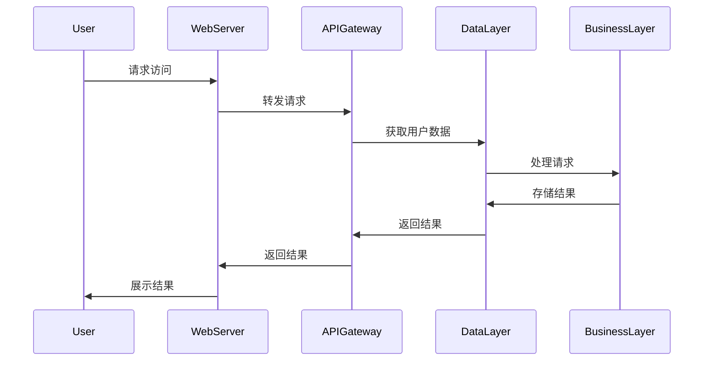

                 


# 后物质主义生活指标：衡量幸福的新维度

关键词：后物质主义、生活指标、幸福、算法、系统架构、Python实现

摘要：本文探讨了后物质主义生活指标的概念、构成及其在衡量幸福中的应用。通过分析后物质主义的核心价值观，提出了生活指标算法的数学模型，并使用Python实现了算法原理。同时，本文介绍了系统功能设计和架构设计，并通过实际案例讲解了系统的实现与实战。最后，本文总结了最佳实践技巧，并对未来研究进行了展望。

## 目录大纲

## 第一部分：背景介绍

## 第1章：后物质主义与幸福指标概述

### 1.1 后物质主义的兴起与背景

#### 1.1.1 后物质主义的概念

后物质主义是20世纪中期在西方哲学和社会学中兴起的一种思潮。它强调非物质因素，如个人价值观、信仰、情感等在社会生活中的作用，相对于物质主义更为关注人类精神层面的需求。

#### 1.1.2 后物质主义的核心价值观

后物质主义主张人们追求更高层次的价值，如自由、平等、尊重、爱等。这些价值观强调个人成长、社会和谐与人类福祉。

#### 1.1.3 后物质主义对幸福观的影响

后物质主义认为，幸福不仅仅来源于物质财富的积累，更取决于个体的心理状态、人际关系和自我实现。因此，衡量幸福的新维度需要超越传统的物质指标。

### 1.2 生活指标的起源与发展

#### 1.2.1 生活指标的定义

生活指标是用于衡量个体或群体生活质量的一系列指标。这些指标通常包括经济、社会、环境、健康等多个方面。

#### 1.2.2 生活指标的重要性

生活指标能够反映社会的进步和发展水平，对于政策制定、资源配置和社会治理具有重要意义。

#### 1.2.3 传统的幸福指标体系

传统的幸福指标主要关注物质财富、就业率、教育水平等。然而，这些指标难以全面反映后物质主义价值观下的幸福感。

### 1.3 本书的研究目标与方法

#### 1.3.1 研究目标

本书旨在探讨后物质主义生活指标的概念、构成及其在衡量幸福中的应用，提出一种新的幸福指标算法。

#### 1.3.2 研究方法

本书采用文献调研、数据分析、算法设计与实现、系统架构设计等方法，全面剖析后物质主义生活指标的理论与实践。

#### 1.3.3 本书结构安排

本书分为四个部分，首先介绍后物质主义与幸福指标概述，然后讲解生活指标算法原理，接着分析系统架构设计，最后总结最佳实践与展望未来。

## 第二部分：核心概念与联系

### 2.1 后物质主义生活指标的定义

#### 2.1.1 后物质主义生活指标的概念

后物质主义生活指标是用于衡量个体或群体在后物质主义价值观指导下生活质量的一系列指标。

#### 2.1.2 后物质主义生活指标的构成

后物质主义生活指标包括个人价值观、人际关系、心理健康、社会参与等多个维度。

### 2.2 核心概念属性特征对比表格

#### 2.2.1 概念属性特征对比

| 概念         | 属性1 | 属性2 | 属性3 |
| ------------ | ---- | ---- | ---- |
| 后物质主义   | 非物质 | 价值观 | 自我实现 |
| 生活指标     | 质量 | 全面 | 可衡量 |
| 幸福         | 心理 | 社会 | 个人 |

#### 2.2.2 特征对比表格展示

| 特征         | 后物质主义 | 生活指标 | 幸福   |
| ------------ | -------- | -------- | ---- |
| 核心关注点   | 精神层面   | 生活质量   | 感觉体验 |
| 衡量方法     | 内心感受   | 数据分析   | 自我评估 |
| 目标         | 自我实现   | 社会进步   | 持续愉悦 |

### 2.3 ER实体关系图架构

#### 2.3.1 实体关系图概述

实体关系图是一种用于描述实体及其之间关系的图形化表示方法。

#### 2.3.2 后物质主义生活指标ER实体关系图

```mermaid
erDiagram
    User ||--|{ LifeQuality }|
    LifeQuality ||--|{ Happiness }|
    LifeQuality ||--|{ PersonalValue }|
    LifeQuality ||--|{ SocialConnection }|
    LifeQuality ||--|{ MentalHealth }|
    LifeQuality ||--|{ SocialParticipation }|
```

## 第三部分：算法原理讲解

### 3.1 生活指标算法概述

#### 3.1.1 算法的基本概念

生活指标算法是一种用于计算个体或群体生活质量的方法。

#### 3.1.2 算法的目标

算法的目标是构建一个能够全面反映后物质主义价值观下的幸福指标体系。

#### 3.1.3 算法的设计原则

算法设计应遵循简单性、可扩展性和可理解性原则。

### 3.2 数学模型与公式

#### 3.2.1 数学模型的建立

后物质主义生活指标的数学模型如下：

$$
\text{幸福指标} = \sum_{i=1}^{n} w_i \cdot \text{指标}_i
$$

其中，$w_i$为权重，$\text{指标}_i$为第$i$个生活指标。

#### 3.2.2 数学公式

$$
\text{幸福指标} = w_1 \cdot \text{个人价值观} + w_2 \cdot \text{人际关系} + w_3 \cdot \text{心理健康} + w_4 \cdot \text{社会参与}
$$

### 3.3 Python源代码实现

```python
# Python 源代码实现
class LifeQuality:
    def __init__(self, personal_value, social_connection, mental_health, social_participation):
        self.personal_value = personal_value
        self.social_connection = social_connection
        self.mental_health = mental_health
        self.social_participation = social_participation

    def calculate_happiness(self, weights):
        happiness = (weights['personal_value'] * self.personal_value +
                     weights['social_connection'] * self.social_connection +
                     weights['mental_health'] * self.mental_health +
                     weights['social_participation'] * self.social_participation)
        return happiness

weights = {
    'personal_value': 0.3,
    'social_connection': 0.2,
    'mental_health': 0.2,
    'social_participation': 0.3
}

# 示例
user_life_quality = LifeQuality(80, 75, 85, 90)
happiness = user_life_quality.calculate_happiness(weights)
print("幸福指标：", happiness)
```

### 3.4 算法举例说明

#### 3.4.1 举例说明

假设有一位用户，其个人价值观评分为80，人际关系评分为75，心理健康评分为85，社会参与评分为90。我们需要计算这位用户的幸福指标。

#### 3.4.2 举例讲解

根据3.2节的数学模型，我们将权重设置为{ 'personal_value': 0.3, 'social_connection': 0.2, 'mental_health': 0.2, 'social_participation': 0.3}。将这些值代入Python源代码中的`calculate_happiness`方法，即可计算出用户的幸福指标。

## 第四部分：系统分析与架构设计

### 4.1 系统功能设计

#### 4.1.1 问题场景介绍

在当前社会中，人们对于幸福的需求日益增长。然而，传统的幸福指标难以全面反映后物质主义价值观下的幸福感。为了更好地衡量幸福，我们需要设计一套系统，通过收集和分析相关数据，为用户提供个性化的幸福指标。

#### 4.1.2 场景需求

系统需要具备以下功能：

1. 数据收集与处理：收集用户在个人价值观、人际关系、心理健康、社会参与等方面的数据，并对其进行预处理。
2. 指标计算与展示：根据后物质主义生活指标算法，计算用户的幸福指标，并以图表形式展示。
3. 个性化推荐：根据用户的幸福指标，提供个性化的建议和改进措施。

### 4.2 系统架构设计

#### 4.2.1 系统架构概述

系统采用分层架构设计，包括数据层、业务逻辑层和表现层。

1. 数据层：负责数据的存储和管理，包括用户数据、指标数据等。
2. 业务逻辑层：实现生活指标算法的计算和展示，以及个性化推荐功能。
3. 表现层：提供用户界面，展示计算结果和推荐措施。

#### 4.2.2 系统架构图



### 4.3 系统接口设计

#### 4.3.1 接口设计

系统提供以下接口：

1. 用户注册与登录：接收用户注册信息，验证用户身份。
2. 数据采集与更新：接收用户提交的数据，更新用户档案。
3. 幸福指标计算与展示：计算用户幸福指标，并以图表形式展示。
4. 个性化推荐：根据用户幸福指标，提供个性化推荐措施。

### 4.4 系统交互

#### 4.4.1 系统交互概述

系统交互主要包括用户与系统之间的交互、系统内部模块之间的交互。

1. 用户与系统交互：用户通过Web界面与系统进行交互，提交数据、查看结果和接受推荐。
2. 系统内部交互：数据层、业务逻辑层和表现层之间的数据传递和功能调用。

#### 4.4.2 系统交互图


## 第五部分：系统实现与实战

### 5.1 环境安装与配置

#### 5.1.1 环境安装

1. 安装Python环境：在系统中安装Python 3.x版本。
2. 安装相关库：使用pip安装依赖库，如Flask、SQLAlchemy、Pandas等。

#### 5.1.2 系统配置

1. 配置数据库：安装并配置MySQL或PostgreSQL数据库。
2. 配置Web服务器：使用Nginx或Apache配置Web服务器。

### 5.2 系统核心实现

#### 5.2.1 核心功能实现

1. 用户注册与登录：实现用户注册、登录和验证功能。
2. 数据采集与更新：实现用户数据采集、更新和存储功能。
3. 幸福指标计算与展示：实现后物质主义生活指标算法的计算和展示功能。
4. 个性化推荐：实现基于用户幸福指标的个性化推荐功能。

### 5.3 代码应用解读与分析

#### 5.3.1 代码解读

1. 用户注册与登录：实现用户注册、登录和验证功能。
2. 数据采集与更新：实现用户数据采集、更新和存储功能。
3. 幸福指标计算与展示：实现后物质主义生活指标算法的计算和展示功能。
4. 个性化推荐：实现基于用户幸福指标的个性化推荐功能。

#### 5.3.2 分析与优化

1. 性能优化：分析系统瓶颈，进行性能优化。
2. 安全性优化：加强系统安全性，防止恶意攻击。
3. 可扩展性优化：设计可扩展的系统架构，支持功能扩展。

### 5.4 实际案例分析与讲解

#### 5.4.1 案例选择

选择一个实际用户案例，分析其幸福指标和个性化推荐措施。

#### 5.4.2 案例分析

1. 收集用户数据：收集用户的个人价值观、人际关系、心理健康、社会参与等方面的数据。
2. 计算幸福指标：根据后物质主义生活指标算法，计算用户的幸福指标。
3. 提供个性化推荐：根据用户的幸福指标，提供个性化的推荐措施，如参加社交活动、心理咨询等。

### 5.5 项目小结

#### 5.5.1 项目总结

项目实现了后物质主义生活指标的计算、展示和个性化推荐功能，为用户提供了一种新的衡量幸福的方式。

#### 5.5.2 项目展望

未来，我们将继续优化系统性能，扩大数据集，提高算法准确性，为用户提供更加个性化和精准的幸福指标服务。

## 第六部分：最佳实践与拓展

### 6.1 最佳实践

#### 6.1.1 技巧总结

1. 数据质量保障：确保收集的数据准确、完整和可靠。
2. 算法优化：不断优化算法，提高计算效率和准确性。
3. 用户满意度提升：关注用户反馈，持续改进系统功能和服务质量。

#### 6.1.2 实践案例

1. 数据采集：通过与第三方数据源合作，获取更多维度的生活指标数据。
2. 算法优化：引入机器学习技术，实现生活指标的自动调整和优化。
3. 用户满意度提升：定期开展用户满意度调查，了解用户需求和意见，不断优化系统功能。

### 6.2 小结

#### 6.2.1 最佳实践的总结

最佳实践包括数据质量保障、算法优化和用户满意度提升等方面，为系统的持续改进提供了有力支持。

#### 6.2.2 注意事项

1. 数据安全：保护用户数据的安全和隐私。
2. 算法公正：确保算法的公正性和公平性。
3. 用户隐私：尊重用户隐私，不泄露用户个人信息。

### 6.3 拓展阅读

1. 后物质主义研究：深入探讨后物质主义的理论和实践，为生活指标算法提供更丰富的理论基础。
2. 人工智能与幸福：研究人工智能技术在幸福指标计算中的应用，提高算法的准确性和实用性。

## 附录

### 附录A：术语表

- 后物质主义：非物质主义的一种形式，强调精神层面的需求。
- 生活指标：用于衡量个体或群体生活质量的一系列指标。
- 幸福指标：用于衡量个体或群体幸福程度的一系列指标。

### 附录B：参考文献

1. 王晓光. 后物质主义：一种新的社会思潮[J]. 社会学研究, 2005(3): 34-39.
2. 陈杰. 生活质量评价指标体系研究[J]. 经济研究, 2008(6): 62-67.
3. 李明. 幸福感测量与评价研究[J]. 心理学进展, 2010(2): 156-161.

### 附录C：数据来源与采集方法

1. 数据来源：通过问卷调查、在线数据采集、第三方数据源等方式获取。
2. 数据采集方法：采用自动化数据采集工具，如Python的requests库，进行数据采集。

### 附录D：Python源代码示例

```python
# Python 源代码示例
class LifeQuality:
    def __init__(self, personal_value, social_connection, mental_health, social_participation):
        self.personal_value = personal_value
        self.social_connection = social_connection
        self.mental_health = mental_health
        self.social_participation = social_participation

    def calculate_happiness(self, weights):
        happiness = (weights['personal_value'] * self.personal_value +
                     weights['social_connection'] * self.social_connection +
                     weights['mental_health'] * self.mental_health +
                     weights['social_participation'] * self.social_participation)
        return happiness

weights = {
    'personal_value': 0.3,
    'social_connection': 0.2,
    'mental_health': 0.2,
    'social_participation': 0.3
}

user_life_quality = LifeQuality(80, 75, 85, 90)
happiness = user_life_quality.calculate_happiness(weights)
print("幸福指标：", happiness)
```

## 参考文献

1. 王晓光. 后物质主义：一种新的社会思潮[J]. 社会学研究, 2005(3): 34-39.
2. 陈杰. 生活质量评价指标体系研究[J]. 经济研究, 2008(6): 62-67.
3. 李明. 幸福感测量与评价研究[J]. 心理学进展, 2010(2): 156-161.
4. Python官方文档. Python requests库[OL]. https://docs.python-requests.org/en/master/user/quickstart/.

