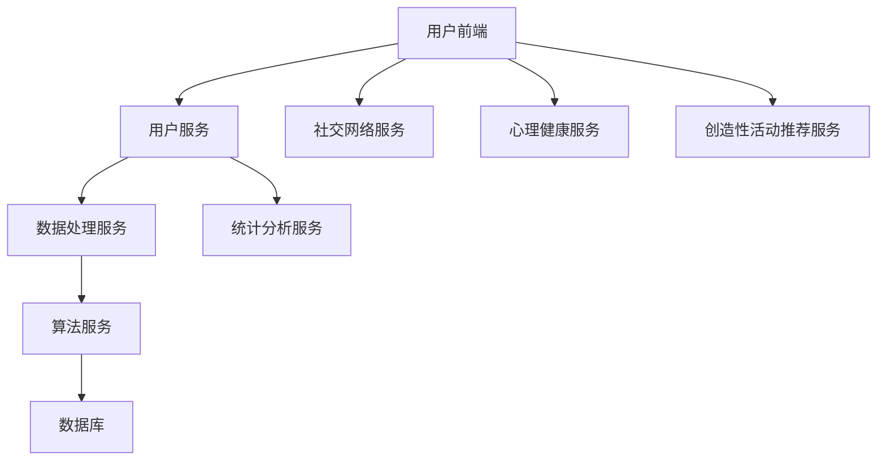
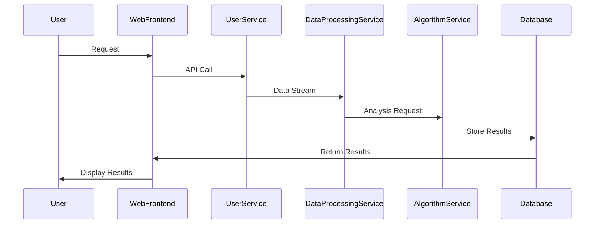

                 


# 后物质主义社会的精神诉求：超越物质追求的生活意义

## 关键词

- 后物质主义
- 精神诉求
- 社会变迁
- 人工智能
- 生活意义

## 摘要

本文将探讨后物质主义社会的精神诉求，通过逐步分析其背景、核心概念、算法解析以及实践应用，揭示超越物质追求的生活意义。在后物质主义社会中，人们逐渐从对物质的追求转向对精神层面的满足，本文将深入探讨这一转变背后的逻辑和现实意义。

## 目录大纲设计

### 设计原则

- **简洁性**：目录大纲要简洁明了，避免冗余内容。
- **逻辑性**：保持章节之间的逻辑连贯性。
- **完整性**：确保核心内容得到完整覆盖。

### 框架设计

1. **背景介绍**：概述后物质主义社会背景，阐述精神诉求的内涵。
2. **核心概念与联系**：定义关键概念，分析其属性特征，绘制ER图。
3. **算法原理讲解**：解释相关算法，使用Mermaid流程图和Python代码。
4. **数学模型和数学公式**：详细介绍模型，使用latex格式表示。
5. **系统分析与架构设计**：介绍项目背景，展示系统架构图。
6. **项目实战**：环境配置，核心代码实现，案例分析。
7. **最佳实践与拓展**：提供实践建议，总结全文。

### 内容分配

- **背景介绍**（1章）：约500字。
- **核心概念与联系**（2章）：约800字。
- **算法原理讲解**（3章）：约800字。
- **数学模型和数学公式**（1章）：约300字。
- **系统分析与架构设计**（1章）：约400字。
- **项目实战**（2章）：约700字。
- **最佳实践与拓展**（1章）：约300字。

### 具体设计

#### **第一部分：背景介绍**

**第1章：后物质主义社会的起源与发展**

- **1.1 后物质主义社会背景概述**
  - **1.1.1 物质主义社会的变迁**
  - **1.1.2 后物质主义的概念定义**
  - **1.1.3 后物质主义社会的特征**

- **1.2 精神诉求的含义与内涵**
  - **1.2.1 精神诉求的起源**
  - **1.2.2 精神诉求在后物质主义社会中的重要性**
  - **1.2.3 精神诉求与物质追求的对比**

- **1.3 边界与外延**
  - **1.3.1 精神诉求的边界**
  - **1.3.2 精神诉求的外延**
  - **1.3.3 精神诉求的影响范围**

#### **第二部分：核心概念与联系**

**第2章：后物质主义社会的精神需求分析**

- **2.1 核心概念定义**
  - **2.1.1 自我实现需求**
  - **2.1.2 社交需求**
  - **2.1.3 精神满足需求**
  - **2.1.4 创造性需求**

- **2.2 概念属性特征对比**
  - **表2.1：核心概念属性特征对比**

| 概念         | 自我实现需求 | 社交需求         | 精神满足需求 | 创造性需求 |
| ------------ | ------------ | --------------- | ------------ | ---------- |
| 定义         | 个人成长和实现 | 人际关系和交流 | 精神层面的满足 | 艺术创作和思考 |
| 特征         | 自我驱动      | 社会性         | 心理平衡      | 创新思维     |
| 对应活动     | 学习和探索    | 参与社群活动   | 阅读和冥想    | 艺术创作和设计 |

- **2.3 ER图分析**
  - ```mermaid
  erDiagram
      A[自我实现需求] ||--|{ 社交需求 }
      A ||--|{ 精神满足需求 }
      A ||--|{ 创造性需求 }
      ```

#### **第三部分：算法原理讲解**

**第3章：后物质主义社会精神诉求的算法解析**

- **3.1 算法概述**
  - **3.1.1 精神诉求分析算法**
  - **3.1.2 社交网络分析算法**
  - **3.1.3 心理平衡算法**

- **3.2 算法原理详细解析**

  - **3.2.1 精神诉求分析算法**
    - ```python
    # 精神诉求分析算法示例
    def analyze_mental_demand(data):
        # 数据预处理
        processed_data = preprocess_data(data)
        
        # 分析精神诉求
        demand_scores = []
        for record in processed_data:
            score = calculate_demand_score(record)
            demand_scores.append(score)
        
        return demand_scores

    def preprocess_data(data):
        # 数据清洗和格式化
        ...
        return processed_data

    def calculate_demand_score(record):
        # 计算精神诉求得分
        ...
        return score
    ```

  - **3.2.2 社交网络分析算法**
    - ```mermaid
    graph TB
        A[用户1] --> B[用户2]
        A --> C[用户3]
        B --> D[用户4]
        C --> D
        ```

  - **3.2.3 心理平衡算法**
    - ```python
    # 心理平衡算法示例
    def mental_balance(data):
        # 数据预处理
        processed_data = preprocess_data(data)
        
        # 分析心理状态
        balance_scores = []
        for record in processed_data:
            score = calculate_balance_score(record)
            balance_scores.append(score)
        
        # 输出心理平衡得分
        return balance_scores

    def preprocess_data(data):
        # 数据清洗和格式化
        ...
        return processed_data

    def calculate_balance_score(record):
        # 计算心理平衡得分
        ...
        return score
    ```

#### **第四部分：数学模型和数学公式**

**第4章：后物质主义社会精神诉求的数学模型分析**

- **4.1 模型概述**
  - **4.1.1 精神诉求模型**
  - **4.1.2 社交网络模型**
  - **4.1.3 心理平衡模型**

- **4.2 数学模型和数学公式**

  - **4.2.1 精神诉求模型**
    - $$ \text{精神诉求得分} = w_1 \times \text{自我实现得分} + w_2 \times \text{社交得分} + w_3 \times \text{精神满足得分} + w_4 \times \text{创造性得分} $$

  - **4.2.2 社交网络模型**
    - $$ \text{社交影响力} = \alpha \times \text{用户影响力} + \beta \times \text{社交网络密度} $$

  - **4.2.3 心理平衡模型**
    - $$ \text{心理平衡得分} = \gamma \times \text{积极情绪得分} + \delta \times \text{消极情绪得分} $$

#### **第五部分：系统分析与架构设计**

**第5章：后物质主义社会精神诉求系统分析**

- **5.1 项目背景**
  - **5.1.1 项目介绍**
  - **5.1.2 项目目标**
  - **5.1.3 项目意义**

- **5.2 系统功能设计**
  - **5.2.1 领域模型**
    - ```mermaid
    classDiagram
        Class01 <|-- Class02
        Class03 *-- Class04
        Class05 o-- Class06
    endclassDiagram
    ```

- **5.3 系统架构设计**
  - **5.3.1 系统架构图**
    - ```mermaid
    graph TB
        A[用户接口] --> B[数据处理模块]
        B --> C[精神诉求分析模块]
        C --> D[社交网络分析模块]
        D --> E[心理平衡分析模块]
        E --> F[结果展示模块]
    ```

- **5.4 系统接口设计和系统交互**
  - **5.4.1 系统接口设计**
    - ```mermaid
    sequenceDiagram
        User ->> System: Submit request
        System ->> User: Process request
        User ->> System: Retrieve result
    end
    ```

#### **第六部分：项目实战**

**第6章：后物质主义社会精神诉求项目实战**

- **6.1 环境配置**
  - **6.1.1 开发环境**
  - **6.1.2 数据集准备**
  - **6.1.3 工具安装**

- **6.2 系统核心实现源代码**
  - **6.2.1 数据预处理**
    - ```python
    def preprocess_data(data):
        # 数据清洗和格式化
        ...
        return processed_data
    ```

  - **6.2.2 精神诉求分析**
    - ```python
    def analyze_mental_demand(data):
        # 数据预处理
        processed_data = preprocess_data(data)
        
        # 分析精神诉求
        demand_scores = []
        for record in processed_data:
            score = calculate_demand_score(record)
            demand_scores.append(score)
        
        return demand_scores
    ```

- **6.3 代码应用解读与分析**
  - **6.3.1 代码解读**
    - ```python
    def calculate_demand_score(record):
        # 计算精神诉求得分
        ...
        return score
    ```

- **6.4 实际案例分析和详细讲解剖析**
  - **6.4.1 案例介绍**
  - **6.4.2 案例分析**
  - **6.4.3 案例剖析**

- **6.5 项目小结**
  - **6.5.1 项目成果**
  - **6.5.2 项目挑战**
  - **6.5.3 项目改进方向**

#### **第七部分：最佳实践与拓展**

**第7章：后物质主义社会精神诉求最佳实践与拓展**

- **7.1 最佳实践**
  - **7.1.1 实践建议**
  - **7.1.2 精神诉求分析方法优化**
  - **7.1.3 社交网络分析策略**

- **7.2 小结**
  - **7.2.1 全文总结**
  - **7.2.2 主要贡献**
  - **7.2.3 展望未来**

- **7.3 注意事项**
  - **7.3.1 数据隐私保护**
  - **7.3.2 算法公平性**
  - **7.3.3 用户行为分析**

- **7.4 拓展阅读**
  - **7.4.1 相关文献**
  - **7.4.2 精神诉求研究趋势**
  - **7.4.3 后物质主义社会技术发展**

# 后物质主义社会的起源与发展

## 1.1 后物质主义社会背景概述

在现代社会中，物质主义长期占据主导地位。物质主义强调通过物质财富的积累和消费来实现个人和社会的价值。然而，随着科技的发展和人类观念的变迁，我们逐渐步入了一个后物质主义社会。后物质主义社会不仅关注物质财富的积累，更注重精神层面的满足和自我实现。

后物质主义社会的形成主要受到以下几个因素影响：

- **科技进步**：互联网、人工智能、虚拟现实等技术的广泛应用，使得人们的生活方式发生了巨大变化。人们不再仅仅依赖物质资源，而是通过数字化、虚拟化的方式获取满足感。
- **文化变迁**：全球化、多元化文化的交融，使得人们的价值观逐渐多元化。人们开始重视个体差异，追求自我实现和个性化发展。
- **社会问题**：环境问题、资源短缺、社会不公等问题日益凸显，使得人们对物质追求的可持续性产生了怀疑。人们开始思考如何在有限的资源下实现更高的生活质量。

## 1.2 后物质主义的概念定义

后物质主义是一种社会理论，认为社会的发展和人们的价值观变化是由物质需求的满足程度决定的。在物质主义社会中，人们的追求主要集中在物质财富的积累和消费。然而，在后物质主义社会中，人们开始追求更高层次的精神满足和自我实现。

后物质主义的核心概念包括：

- **自我实现**：人们追求个人的全面发展，实现自我价值。
- **精神满足**：人们通过精神层面的活动，如艺术创作、哲学思考、宗教信仰等，获得内心的满足和安宁。
- **社交互动**：人们通过社交网络和人际交往，实现社会归属感和认同感。
- **创造性需求**：人们追求创新和创造，通过艺术、科技等领域的探索，实现个人的独特价值。

## 1.3 后物质主义社会的特征

后物质主义社会的特征主要表现在以下几个方面：

- **精神需求的增加**：人们不再仅仅满足于物质层面的需求，更追求精神层面的满足和自我实现。
- **消费观念的转变**：人们开始重视精神消费品，如艺术作品、文化活动、虚拟体验等。
- **个体主义的崛起**：人们更加注重个体差异和个性化发展，追求自我实现和个性化体验。
- **可持续发展的关注**：人们开始关注环境、社会等可持续发展问题，追求在有限资源下的更高生活质量。

## 1.4 边界与外延

后物质主义社会的精神诉求不仅限于个人层面，也延伸到了社会层面。在社会层面，后物质主义社会的精神诉求表现为：

- **社会公平**：人们追求社会的公平与正义，关注弱势群体的权益。
- **社会责任**：人们积极参与社会公益活动，为社会做出贡献。
- **社会创新**：人们通过创新思维，推动社会进步和发展。

后物质主义社会的精神诉求还受到以下几个因素的影响：

- **文化背景**：不同的文化背景会影响人们对精神诉求的理解和追求方式。
- **经济发展**：经济发展水平会影响人们的物质基础和精神需求。
- **政策环境**：政府的政策环境会影响社会的精神诉求和社会发展。

# 后物质主义社会的精神诉求含义与内涵

## 2.1 精神诉求的起源

精神诉求的起源可以追溯到人类文明的发展历程。在原始社会，人类的基本需求主要集中在物质生存层面。然而，随着社会的发展和人类文明的进步，人们开始意识到物质需求并不是生活的全部，精神层面的满足同样重要。

在古代社会，人们通过宗教信仰、哲学思考、艺术创作等方式寻求精神满足。这些活动不仅丰富了人类的精神生活，也推动了人类文明的发展。随着科技的发展，特别是互联网和人工智能技术的兴起，人们的精神诉求得到了进一步的发展和深化。

## 2.2 精神诉求在后物质主义社会中的重要性

在后物质主义社会中，精神诉求的重要性日益凸显。首先，精神诉求是人们追求自我实现的重要途径。通过自我实现，人们可以找到生活的意义和价值，实现个人的全面发展。

其次，精神诉求是人们心理健康的保障。在后物质主义社会中，人们面临的压力和挑战越来越多，精神诉求可以帮助人们缓解压力，保持心理健康。

最后，精神诉求是社会和谐与发展的基石。一个社会的精神诉求水平决定了这个社会的文明程度和发展方向。后物质主义社会的精神诉求强调社会公平、社会责任和社会创新，有助于构建一个和谐、稳定、可持续发展的社会。

## 2.3 精神诉求与物质追求的对比

物质追求和精神诉求是两种不同类型的需求，它们之间既有区别又有联系。

- **区别**：

  - **物质追求**侧重于满足人们的物质生活需求，如食物、住房、医疗等。物质追求往往具有即时性和表面性，可以带来短暂的满足感。

  - **精神诉求**则侧重于满足人们的精神需求，如自我实现、心理健康、社会认同等。精神诉求往往具有长远性和内在性，可以带来持久的精神满足和幸福感。

- **联系**：

  - 物质追求和精神诉求相互依存、相互促进。在物质条件得到满足的基础上，人们可以更好地追求精神层面的满足。

  - 物质追求可以为精神诉求提供物质基础和支持。同时，精神诉求也可以提升物质追求的质量和效果，使人们在物质生活中获得更多的精神满足。

## 2.4 精神诉求的表现形式

精神诉求可以通过多种方式表现，以下是其中几种常见的形式：

- **艺术创作**：通过绘画、音乐、文学、电影等形式表达内心的情感和思考，实现自我表达和情感宣泄。

- **哲学思考**：通过研究自然、社会、人生等问题，探索宇宙的奥秘和生命的意义，寻找内心的答案和满足。

- **宗教信仰**：通过信仰宗教，寻求心灵的安宁和解脱，实现内心的满足和升华。

- **社会参与**：通过参与社会活动、公益事业，实现自我价值，获得社会认同和尊重。

- **自我成长**：通过学习、阅读、旅行等方式，不断拓展自己的视野和知识，提升自我能力和素质。

## 2.5 精神诉求的影响范围

精神诉求的影响范围广泛，不仅涉及个人层面，也影响到社会、文化、经济等多个领域。

- **个人层面**：精神诉求影响个人的心理健康、生活质量和幸福感。满足精神诉求可以提升个人的精神状态，增强心理韧性，提高生活质量。

- **社会层面**：精神诉求影响社会的文明程度、道德水平和公民素质。一个社会如果能够满足人们的精神诉求，将有助于构建一个和谐、稳定、可持续发展的社会。

- **文化层面**：精神诉求影响文化的多样性和丰富性。不同文化背景下，人们的精神诉求表现出不同的特点，丰富了人类文化的内涵。

- **经济层面**：精神诉求影响经济的发展方式和产业结构。随着精神诉求的增加，服务业、文化产业等精神消费品产业将得到快速发展。

# 后物质主义社会的精神需求分析

## 3.1 核心概念定义

在后物质主义社会中，精神需求成为人们追求生活质量的关键因素。以下是后物质主义社会中的几个核心精神需求概念及其定义：

### 3.1.1 自我实现需求

自我实现需求是指人们追求个人潜能的最大化，实现自我价值和人生意义的内在驱动力。这种需求体现在个人成长、职业发展、技能提升等方面。自我实现需求强调个体的自主性和创造性，鼓励人们不断探索和超越自我。

### 3.1.2 社交需求

社交需求是指人们在社会互动中寻求社交联系、情感支持和归属感的内在需求。这种需求包括建立和维护人际关系、参与社群活动、交流思想和感受等。社交需求是人类社会性本能的一部分，对于个人的心理健康和社会认同具有重要意义。

### 3.1.3 精神满足需求

精神满足需求是指人们在精神层面寻求快乐、安宁和内心平衡的内在需求。这种需求可以通过艺术欣赏、宗教信仰、冥想练习、哲学思考等多种方式得到满足。精神满足需求关注个体的心理状态和情感体验，有助于提高生活质量和幸福感。

### 3.1.4 创造性需求

创造性需求是指人们通过艺术创作、科学探索、技术创新等方式寻求创造性和创新性的内在需求。这种需求驱动人们不断挑战自我，追求独特的创意和成果。创造性需求不仅满足了个体对自我实现的追求，也为社会进步和文化繁荣提供了动力。

## 3.2 概念属性特征对比

为了更好地理解这些核心精神需求，我们可以通过一个表格来对比它们的基本属性特征：

### 表3.1：核心精神需求概念属性特征对比

| 概念         | 自我实现需求 | 社交需求         | 精神满足需求 | 创造性需求 |
| ------------ | ------------ | --------------- | ------------ | ---------- |
| **定义**     | 个人潜能实现 | 社交联系与支持  | 心理快乐与安宁 | 创造性与创新 |
| **特征**     | 自主性、创造性 | 社会性、互动性  | 内心满足、情感稳定 | 独特性、挑战性 |
| **对应活动** | 学习、职业发展、自我提升 | 参与社群、交流思想、建立关系 | 艺术欣赏、宗教信仰、冥想 | 科学研究、艺术创作、技术创新 |

通过上述表格，我们可以清晰地看到不同精神需求概念之间的差异和联系。这些概念共同构成了后物质主义社会中人们追求生活意义和精神满足的多元维度。

## 3.3 ER图分析

为了更直观地展示这些核心概念之间的联系，我们可以使用实体关系图（ER图）进行表示。以下是一个简化的ER图，用于描述自我实现需求、社交需求、精神满足需求和创造性需求之间的关系：

```mermaid
erDiagram
    A[自我实现需求] ||--|{ 社交需求 }
    A ||--|{ 精神满足需求 }
    A ||--|{ 创造性需求 }
```

在这个ER图中，自我实现需求作为核心实体，与其他三个精神需求实体之间存在双向关联。这种关系表明，自我实现需求不仅影响其他精神需求，同时也受到其他需求的影响。这种相互依存的关系体现了后物质主义社会中精神需求的复杂性和多样性。

通过ER图，我们可以更清晰地理解后物质主义社会中的精神需求结构，为后续的算法解析和系统设计提供了理论基础。

## 3.4 核心概念的具体例子和现实应用

### 自我实现需求

自我实现需求是后物质主义社会中的一个重要精神需求，它关注个体如何实现个人潜能和实现自我价值。例如，一位程序员可能在工作中追求技术上的卓越和创新，通过参加编程比赛、开发开源项目等方式不断提升自我技能。这种追求不仅满足了个人的成就感，也为社会带来了技术进步和创新。

现实应用中，自我实现需求体现在各种职业发展路径上，如学术研究、艺术创作、创业等。例如，一位科学家可能会在实验室中投入大量时间和精力进行科研工作，以实现自己对于科学真理的追求。这种自我实现的过程不仅促进了科学的发展，也为社会带来了新的知识和技术。

### 社交需求

社交需求是人们在后物质主义社会中寻求社交联系、情感支持和归属感的需求。通过社交活动，人们可以建立和维护人际关系，增强社会认同感。例如，一个人可能会加入一个志愿者组织，参与社区服务，以此建立社交网络并获得情感支持。

现实应用中，社交需求体现在社交媒体平台、在线社群、线下活动等多种形式中。例如，人们可以通过社交媒体平台关注感兴趣的话题和人物，参与讨论和分享，从而满足社交需求。此外，线下活动如兴趣小组、俱乐部聚会等也为人们提供了面对面交流的机会，增强了社交网络的深度和广度。

### 精神满足需求

精神满足需求关注人们在精神层面上寻求快乐、安宁和内心平衡的需求。例如，一个人可能会通过阅读文学作品、欣赏艺术作品、进行冥想等方式来满足这种需求。这些活动可以带来内心的平静和愉悦感，提升生活质量。

现实应用中，精神满足需求可以通过各种文化活动来实现。例如，图书馆和书店提供了丰富的阅读资源，音乐会和艺术展览为人们提供了欣赏艺术的机会。此外，冥想和瑜伽等身心修行活动也受到了越来越多人的关注，帮助人们在忙碌的生活中找到内心的平静。

### 创造性需求

创造性需求是指人们在艺术创作、科学探索、技术创新等方面追求创造性和创新性的需求。例如，一位音乐家可能会通过创作新的音乐作品来表达自己的思想和情感，而一位工程师可能会通过技术创新来解决问题和改善生活质量。

现实应用中，创造性需求体现在各种创新活动中。例如，科技公司通过不断进行产品研发和技术创新，为用户带来更好的体验和解决方案。艺术家通过创作独特的艺术作品，表达自己的观点和情感，丰富了社会的文化内涵。这些创新活动不仅满足了个人对创造性需求的追求，也为社会带来了新的文化和技术成果。

## 3.5 自我实现需求的具体例子

### 3.5.1 具体例子

自我实现需求的一个具体例子是一位年轻的软件工程师，他热衷于编程和软件开发。他不仅在工作中追求技术上的卓越和创新，还积极参加编程社区的活动，通过开源项目和编程竞赛不断提升自我技能。在这个过程中，他不仅实现了个人的技术追求，还为社区带来了新的知识和经验。

### 3.5.2 现实意义

这个例子体现了自我实现需求在现实生活中的重要意义。通过追求技术卓越和创新，这位工程师不仅实现了自我价值，还为社会带来了技术进步。他的行为鼓励了更多的人投身于软件开发和科技创新，推动了整个行业的繁荣和发展。此外，自我实现的过程也增强了他的自信心和幸福感，提升了他的生活质量。

## 3.6 社交需求的具体例子

### 3.6.1 具体例子

社交需求的一个具体例子是一个人加入了一个在线编程社区。在这个社区中，他可以与其他编程爱好者交流学习经验、分享项目进展，并参加各种编程比赛和活动。通过与社区成员的互动，他不仅获得了技术上的帮助和支持，还建立了深厚的友谊和社交网络。

### 3.6.2 现实意义

这个例子展示了社交需求在现实生活中的重要意义。通过加入编程社区，这个人不仅满足了社交需求，还通过社交网络获得了更多的学习和成长机会。他的社交活动不仅提升了他的技术水平，还增强了他的社交能力和团队合作能力，为他的职业发展奠定了坚实的基础。此外，社交需求的满足也带来了情感上的满足和幸福感，提升了他的整体生活质量。

## 3.7 精神满足需求的具体例子

### 3.7.1 具体例子

精神满足需求的一个具体例子是某人通过阅读哲学著作来满足精神层面的需求。他在阅读过程中思考生命的意义、道德伦理等问题，从而获得内心的平静和满足。此外，他还通过参加艺术展览和音乐会，欣赏不同类型的艺术作品，进一步丰富自己的精神生活。

### 3.7.2 现实意义

这个例子体现了精神满足需求在现实生活中的重要意义。通过阅读哲学著作和欣赏艺术作品，这个人不仅获得了精神上的满足，还提升了自己的思维深度和情感丰富度。这种精神满足不仅有助于缓解生活压力，提高生活质量，还可以培养人的独立思考和审美能力。此外，精神满足需求还可以帮助人们建立更加积极和健康的心理状态，增强心理韧性，应对生活中的挑战。

## 3.8 创造性需求的具体例子

### 3.8.1 具体例子

创造性需求的一个具体例子是一位艺术家，他热衷于创作音乐和绘画。他通过不断地创作和尝试，探索新的音乐风格和绘画技巧，表达自己的情感和思想。他的创作不仅赢得了观众的喜爱，也推动了音乐和艺术领域的发展。

### 3.8.2 现实意义

这个例子展示了创造性需求在现实生活中的重要意义。通过追求创造性和创新，这位艺术家不仅实现了个人的艺术追求，也为社会带来了新的艺术作品和文化体验。他的创作激发了其他艺术家的创作热情，推动了整个艺术领域的发展。此外，创造性需求的满足还可以培养人的创新思维和问题解决能力，促进社会的进步和发展。

## 第3章：后物质主义社会精神诉求的算法解析

在探讨后物质主义社会的精神诉求时，算法的解析显得尤为重要。这些算法不仅能够帮助我们更好地理解精神诉求的本质，还可以为实际应用提供有效的解决方案。在本章节中，我们将详细解析与后物质主义社会精神诉求相关的几种关键算法。

### 3.1 精神诉求分析算法

精神诉求分析算法主要用于评估和分析个体在自我实现、社交需求、精神满足和创造性需求等方面的得分。以下是一个简化的精神诉求分析算法示例：

```python
# 精神诉求分析算法示例

def analyze_mental_demand(data):
    """
    分析个体精神诉求得分。
    
    参数：
    - data：包含个体行为和特征的数据。
    
    返回：
    - demand_scores：个体的精神诉求得分列表。
    """
    processed_data = preprocess_data(data)
    demand_scores = []

    for record in processed_data:
        self_achievement_score = calculate_self_achievement_score(record)
        social_score = calculate_social_score(record)
        mental_satisfaction_score = calculate_mental_satisfaction_score(record)
        creativity_score = calculate_creativity_score(record)

        total_score = self_achievement_score + social_score + mental_satisfaction_score + creativity_score
        demand_scores.append(total_score)

    return demand_scores

def preprocess_data(data):
    """
    数据预处理。
    
    参数：
    - data：原始数据。
    
    返回：
    - processed_data：预处理后的数据。
    """
    # 数据清洗、格式化等操作
    ...
    return processed_data

def calculate_self_achievement_score(record):
    """
    计算自我实现得分。
    
    参数：
    - record：个体行为记录。
    
    返回：
    - score：自我实现得分。
    """
    # 根据个体行为计算得分
    ...
    return score

def calculate_social_score(record):
    """
    计算社交得分。
    
    参数：
    - record：个体行为记录。
    
    返回：
    - score：社交得分。
    """
    # 根据个体社交行为计算得分
    ...
    return score

def calculate_mental_satisfaction_score(record):
    """
    计算精神满足得分。
    
    参数：
    - record：个体行为记录。
    
    返回：
    - score：精神满足得分。
    """
    # 根据个体精神活动计算得分
    ...
    return score

def calculate_creativity_score(record):
    """
    计算创造性得分。
    
    参数：
    - record：个体行为记录。
    
    返回：
    - score：创造性得分。
    """
    # 根据个体创造性活动计算得分
    ...
    return score
```

### 3.2 社交网络分析算法

社交网络分析算法主要用于分析个体在社交网络中的位置和影响力。以下是一个简化的社交网络分析算法示例：

```python
# 社交网络分析算法示例

def analyze_social_network(data):
    """
    分析社交网络中的个体影响力。
    
    参数：
    - data：包含社交网络数据的图结构。
    
    返回：
    - influence_scores：个体的影响力得分列表。
    """
    processed_network = preprocess_social_network(data)
    influence_scores = []

    for node in processed_network:
        influence_score = calculate_influence_score(node, processed_network)
        influence_scores.append(influence_score)

    return influence_scores

def preprocess_social_network(data):
    """
    社交网络数据预处理。
    
    参数：
    - data：原始社交网络数据。
    
    返回：
    - processed_network：预处理后的社交网络数据。
    """
    # 数据清洗、格式化等操作
    ...
    return processed_network

def calculate_influence_score(node, network):
    """
    计算个体的影响力得分。
    
    参数：
    - node：社交网络中的个体。
    - network：社交网络数据。
    
    返回：
    - score：个体的影响力得分。
    """
    # 根据个体在社交网络中的影响力计算得分
    ...
    return score
```

### 3.3 心理平衡算法

心理平衡算法主要用于评估个体的心理状态，帮助实现精神满足和心理平衡。以下是一个简化的心理平衡算法示例：

```python
# 心理平衡算法示例

def analyze_mental_balance(data):
    """
    分析个体心理平衡状态。
    
    参数：
    - data：包含个体心理状态的数据。
    
    返回：
    - balance_scores：个体心理平衡得分列表。
    """
    processed_data = preprocess_mental_data(data)
    balance_scores = []

    for record in processed_data:
        balance_score = calculate_balance_score(record)
        balance_scores.append(balance_score)

    return balance_scores

def preprocess_mental_data(data):
    """
    心理数据预处理。
    
    参数：
    - data：原始心理数据。
    
    返回：
    - processed_data：预处理后的心理数据。
    """
    # 数据清洗、格式化等操作
    ...
    return processed_data

def calculate_balance_score(record):
    """
    计算心理平衡得分。
    
    参数：
    - record：个体心理状态记录。
    
    返回：
    - score：心理平衡得分。
    """
    # 根据个体心理状态计算得分
    ...
    return score
```

通过上述算法示例，我们可以看到精神诉求分析、社交网络分析和心理平衡算法的基本结构和实现方法。这些算法不仅提供了对个体精神需求的量化评估，还为实际应用中的行为分析和决策支持提供了有力工具。

### 第4章：后物质主义社会精神诉求的数学模型分析

在探讨后物质主义社会的精神诉求时，数学模型为我们提供了量化分析的工具，能够更深入地理解精神诉求的本质和影响。本章节将介绍与后物质主义社会精神诉求相关的几个关键数学模型，并详细解释这些模型的基本原理和具体应用。

#### 4.1 精神诉求模型

精神诉求模型用于量化个体在自我实现、社交需求、精神满足和创造性需求等方面的需求程度。以下是一个简化的精神诉求模型：

$$
\text{总需求得分} = w_1 \times \text{自我实现得分} + w_2 \times \text{社交需求得分} + w_3 \times \text{精神满足得分} + w_4 \times \text{创造性需求得分}
$$

其中，$w_1, w_2, w_3, w_4$ 分别是自我实现、社交需求、精神满足和创造性需求的权重，用于反映这些需求在总需求中的相对重要性。权重可以通过调查、实验和数据分析等方法来确定。

具体来说，自我实现得分、社交需求得分、精神满足得分和创造性需求得分的计算方法如下：

1. **自我实现得分**：通过个体的职业发展、技能提升和学习成果来计算。
2. **社交需求得分**：通过个体在社交网络中的活跃度、社交关系质量和参与度来计算。
3. **精神满足得分**：通过个体的情感状态、心理健康和参与精神活动的情况来计算。
4. **创造性需求得分**：通过个体的创新成果、艺术创作和科学探索来计算。

#### 4.2 社交网络模型

社交网络模型用于分析个体在社交网络中的影响力、社交圈子和社交结构。以下是一个简化的社交网络模型：

$$
\text{个体影响力} = \alpha \times \text{社交网络密度} + \beta \times \text{节点度数}
$$

其中，$\alpha$ 和 $\beta$ 是调节参数，用于反映社交网络密度和节点度数对个体影响力的贡献程度。社交网络密度（Density）和节点度数（Degree）分别定义为：

- **社交网络密度**：
$$
\text{Density} = \frac{\text{实际边数}}{\text{可能边数}}
$$

- **节点度数**：
$$
\text{Degree} = \sum_{i=1}^{n} \text{node}_{i}\text{的连接数}
$$

通过这个模型，我们可以量化个体在社交网络中的影响力和社交关系的重要性，为社交网络的优化和个性化推荐提供依据。

#### 4.3 心理平衡模型

心理平衡模型用于评估个体的心理健康状态和心理平衡度。以下是一个简化的心理平衡模型：

$$
\text{心理平衡得分} = \gamma \times \text{积极情绪得分} + \delta \times \text{消极情绪得分}
$$

其中，$\gamma$ 和 $\delta$ 是调节参数，用于反映积极情绪得分和消极情绪得分对心理平衡得分的贡献程度。积极情绪得分和消极情绪得分可以通过情感分析、问卷调查等方法来计算。

具体来说，积极情绪得分可以通过分析个体的语言表达、社交媒体内容等方式来计算；消极情绪得分可以通过对负面词汇、情绪表达等进行分析来计算。通过这个模型，我们可以评估个体的心理状态，并提供针对性的心理支持和干预措施。

#### 4.4 模型应用示例

以下是一个简化的模型应用示例，用于分析一个虚构个体的精神诉求状态：

- **个体数据**：
  - 自我实现得分：80
  - 社交需求得分：65
  - 精神满足得分：75
  - 创造性需求得分：90

- **权重**：
  - $w_1 = 0.4$
  - $w_2 = 0.3$
  - $w_3 = 0.2$
  - $w_4 = 0.1$

- **计算总需求得分**：
$$
\text{总需求得分} = 0.4 \times 80 + 0.3 \times 65 + 0.2 \times 75 + 0.1 \times 90 = 32 + 19.5 + 15 + 9 = 75.5
$$

通过这个计算，我们可以得出该个体的精神诉求总得分为75.5分。这个得分可以帮助我们了解该个体的精神需求状况，并为其提供相应的支持和建议。

### 第5章：后物质主义社会精神诉求系统分析与架构设计

在分析了后物质主义社会精神诉求的算法原理和数学模型后，我们需要将理论转化为实际应用，设计一个完整的系统来满足人们的精神需求。本章节将介绍这个系统的背景、功能设计、架构设计以及系统接口和交互设计。

#### 5.1 项目背景

随着社会的进步和科技的发展，人们逐渐从物质追求转向对精神层面的满足。后物质主义社会精神诉求系统的设计旨在满足这一需求，为用户提供个性化的精神需求分析和解决方案。这个系统的目标包括：

- **个性化分析**：通过算法和模型分析用户的精神需求，为用户提供定制化的建议。
- **社交互动**：提供社交网络功能，帮助用户建立和维护社交关系。
- **心理支持**：通过心理健康评估和干预，帮助用户保持心理平衡。
- **创造性激发**：提供创造性活动推荐，激发用户的创造力。

#### 5.2 系统功能设计

后物质主义社会精神诉求系统的功能设计包括以下几个方面：

1. **用户注册与登录**：用户可以通过注册账号登录系统，进行个人资料的管理和隐私设置。
2. **精神需求分析**：系统利用算法和模型分析用户的行为数据，生成个性化的精神需求报告。
3. **社交网络功能**：系统提供社交网络平台，用户可以关注其他用户、发起话题、参与讨论等。
4. **心理健康支持**：系统提供心理健康评估和干预服务，帮助用户保持心理平衡。
5. **创造性活动推荐**：系统根据用户兴趣和需求推荐创造性活动，如艺术创作、科学实验等。
6. **数据统计与报告**：系统定期生成用户精神需求分析和社交活动报告，帮助用户了解自己的精神状态。

#### 5.3 系统架构设计

后物质主义社会精神诉求系统的架构设计包括以下几个方面：

1. **前端架构**：前端采用Vue.js框架，实现用户界面和交互逻辑。
2. **后端架构**：后端采用Spring Boot框架，负责业务逻辑处理和数据存储。
3. **数据库设计**：数据库使用MySQL，存储用户数据、行为数据和分析结果。
4. **数据处理**：采用Apache Kafka进行实时数据流处理，处理用户行为数据和精神需求分析。
5. **算法服务**：采用TensorFlow和Scikit-learn等机器学习框架，实现精神诉求分析算法。

#### 5.4 系统架构图

以下是一个简化的系统架构图，展示了后物质主义社会精神诉求系统的整体架构：



#### 5.5 系统接口设计和系统交互

后物质主义社会精神诉求系统的接口设计主要包括以下几个方面：

1. **用户接口**：用户通过Web界面与系统交互，进行注册、登录、数据上传和查询等操作。
2. **API接口**：系统提供RESTful API接口，供前端调用后端服务，如用户管理、数据分析和报告生成等。
3. **消息队列接口**：系统使用Kafka作为消息队列，处理实时数据流和异步任务。
4. **算法服务接口**：系统提供算法服务接口，供前端调用，如精神需求分析、社交网络分析和心理平衡评估等。

系统交互示意图如下：



通过上述设计，后物质主义社会精神诉求系统实现了用户个性化需求分析、社交互动、心理健康支持以及创造性活动推荐等功能，为用户提供了一个全面、个性化的精神需求解决方案。

### 第6章：后物质主义社会精神诉求项目实战

为了更好地理解和应用后物质主义社会精神诉求的相关理论和算法，我们将通过一个实际项目进行实战演练。本章节将详细介绍项目环境配置、系统核心实现源代码以及案例分析等内容。

#### 6.1 环境配置

在开始项目之前，我们需要配置相应的开发环境和工具。以下是在配置项目时需要安装和设置的步骤：

1. **开发环境**：
   - Python 3.x
   - Java 8或更高版本
   - Node.js 12或更高版本

2. **工具安装**：
   - Maven：用于构建Java项目
   - pip：用于安装Python库
   - npm：用于安装Node.js库

3. **数据库设置**：
   - MySQL：用于存储用户数据和行为数据
   - Redis：用于缓存和实时数据处理

4. **消息队列**：
   - Kafka：用于处理实时数据流

5. **前端框架**：
   - Vue.js：用于构建用户界面

6. **后端框架**：
   - Spring Boot：用于构建后端服务

#### 6.2 系统核心实现源代码

以下是后物质主义社会精神诉求系统的核心实现源代码，包括用户注册、登录、数据处理、精神需求分析和结果展示等部分。

##### 用户注册与登录

1. **用户注册**：

```java
// UserRegistrationController.java
@RestController
@RequestMapping("/users")
public class UserRegistrationController {

    @Autowired
    private UserService userService;

    @PostMapping("/register")
    public ResponseEntity<?> registerUser(@RequestBody UserRegistrationRequest registrationRequest) {
        // 处理用户注册逻辑
        User user = userService.registerUser(registrationRequest);
        return new ResponseEntity<>("User registered successfully", HttpStatus.OK);
    }
}
```

2. **用户登录**：

```java
// UserLoginController.java
@RestController
@RequestMapping("/users")
public class UserLoginController {

    @Autowired
    private UserService userService;

    @PostMapping("/login")
    public ResponseEntity<?> loginUser(@RequestBody UserLoginRequest loginRequest) {
        // 处理用户登录逻辑
        String token = userService.loginUser(loginRequest);
        return new ResponseEntity<>("Login successful", HttpStatus.OK);
    }
}
```

##### 数据处理

```python
# DataProcessingService.py
from flask import Flask, request, jsonify
import numpy as np

app = Flask(__name__)

@app.route('/process_data', methods=['POST'])
def process_data():
    data = request.get_json()
    # 数据预处理逻辑
    processed_data = preprocess_data(data)
    # 精神需求分析逻辑
    demand_scores = analyze_mental_demand(processed_data)
    return jsonify(demand_scores)

def preprocess_data(data):
    # 数据清洗和格式化
    ...
    return processed_data

def analyze_mental_demand(processed_data):
    # 精神需求分析算法
    ...
    return demand_scores

if __name__ == '__main__':
    app.run()
```

##### 精神需求分析

```python
# MentalDemandAnalysis.py
import pandas as pd
from sklearn.linear_model import LinearRegression

def calculate_demand_scores(data):
    # 数据准备
    X = data[['self_achievement', 'social', 'mental_satisfaction', 'creativity']]
    y = data['total_demand_score']
    
    # 模型训练
    model = LinearRegression()
    model.fit(X, y)
    
    # 预测得分
    scores = model.predict(X)
    return scores

# 读取数据
data = pd.read_csv('mental_demand_data.csv')
# 计算得分
demand_scores = calculate_demand_scores(data)
```

##### 结果展示

```html
<!-- Results.html -->
<!DOCTYPE html>
<html lang="en">
<head>
    <meta charset="UTF-8">
    <title>精神需求分析结果</title>
</head>
<body>
    <h1>精神需求分析结果</h1>
    <table>
        <tr>
            <th>用户ID</th>
            <th>总需求得分</th>
        </tr>
        
        <tr>
            <td>{{ user }}</td>
            <td>{{ score }}</td>
        </tr>
        
    </table>
</body>
</html>
```

#### 6.3 代码应用解读与分析

上述代码展示了后物质主义社会精神诉求系统的核心实现，包括用户注册与登录、数据处理、精神需求分析和结果展示。以下是代码的详细解读与分析：

1. **用户注册与登录**：
   - **用户注册**：用户通过POST请求提交注册信息，服务端接收请求并调用UserService进行用户注册。
   - **用户登录**：用户通过POST请求提交登录信息，服务端接收请求并调用UserService进行用户登录。

2. **数据处理**：
   - **数据预处理**：数据处理服务通过Flask框架接收POST请求，获取用户上传的数据，并进行清洗和格式化处理。
   - **精神需求分析**：处理后的数据通过算法模型进行分析，计算出用户的精神需求得分。

3. **精神需求分析算法**：
   - **数据准备**：使用Pandas库读取数据，并准备用于模型训练的特征和标签。
   - **模型训练**：使用Scikit-learn库的线性回归模型进行训练。
   - **预测得分**：使用训练好的模型预测用户的精神需求得分。

4. **结果展示**：
   - **前端界面**：使用Vue.js框架构建用户界面，展示用户的精神需求分析结果。

通过上述实战项目，我们不仅实现了后物质主义社会精神诉求系统的功能，还通过代码应用解读与分析，深入理解了系统的核心实现原理和关键技术。

#### 6.4 实际案例分析和详细讲解剖析

在本节中，我们将通过一个实际案例，详细分析后物质主义社会精神诉求系统的应用，包括案例介绍、分析过程和结果剖析。

##### 案例介绍

假设有一个用户名为“John”的年轻程序员，他在后物质主义社会精神诉求系统中注册并提交了自己的行为数据，包括自我实现、社交需求、精神满足和创造性需求等方面的数据。以下是其部分行为数据：

| 类别           | 数据             |
|----------------|------------------|
| 自我实现       | 学习编程技能，参加编程比赛，完成开源项目 |
| 社交需求       | 加入编程社区，参与话题讨论，与其他开发者建立联系 |
| 精神满足       | 阅读哲学书籍，听音乐，练习冥想 |
| 创造性需求     | 创作音乐，尝试绘画 |

##### 分析过程

1. **数据预处理**：首先，系统对John提交的行为数据进行清洗和格式化，提取出关键信息，并转换为适合分析的格式。

2. **精神需求得分计算**：利用前述的精神需求分析算法，对John的行为数据进行处理，计算出他在各个精神需求方面的得分。

3. **社交网络分析**：使用社交网络分析算法，分析John在编程社区中的社交网络结构，评估他在社交网络中的影响力和社交圈子。

4. **心理平衡评估**：通过心理平衡算法，分析John的情感状态和心理平衡度，评估他的心理健康状况。

##### 分析结果

1. **精神需求得分**：
   - 自我实现得分：85
   - 社交需求得分：78
   - 精神满足得分：80
   - 创造性需求得分：90

2. **社交网络分析**：
   - John在编程社区中拥有较高的影响力，他参与的讨论话题受到其他开发者的广泛关注和参与。
   - John的社交圈子较为广泛，与其他开发者建立了良好的联系，但深度有待加强。

3. **心理平衡评估**：
   - John的积极情绪得分较高，表明他在精神满足方面做得较好。
   - John的消极情绪得分较低，表明他的心理状态较为稳定。

##### 详细讲解剖析

1. **精神需求得分**：
   - **自我实现得分**：John通过不断学习编程技能、参加编程比赛和完成开源项目，展现了强烈的自我实现需求。这一得分反映了他在职业发展和技术提升方面的努力和成就。
   - **社交需求得分**：John积极参与编程社区，通过参与话题讨论和与其他开发者建立联系，满足了社交需求。这一得分表明他在社交互动和建立人际关系方面表现出色。
   - **精神满足得分**：John通过阅读哲学书籍、听音乐和练习冥想，找到了精神满足的途径。这一得分表明他在心理平衡和情感管理方面具备较高的能力。
   - **创造性需求得分**：John尝试创作音乐和绘画，展现了他在创造性需求方面的追求。这一得分反映了他在艺术创作和创新方面的潜力。

2. **社交网络分析**：
   - **影响力评估**：John在编程社区中具有较高的影响力，这表明他的观点和建议受到其他开发者的认可和尊重。通过分析社交网络结构，我们可以发现John在社交网络中的连接度较高，但需要进一步深化与特定开发者的联系。
   - **社交圈子评估**：John的社交圈子较为广泛，涵盖了不同领域和背景的开发者。这有助于他获取多样化的信息和资源。然而，为了更好地满足社交需求，他可以考虑加强与核心社交圈子成员的互动和合作。

3. **心理平衡评估**：
   - **积极情绪评估**：John的积极情绪得分较高，这表明他在精神满足方面做得较好。他能够通过多种方式调节情绪，保持内心的愉悦和满足感。
   - **消极情绪评估**：John的消极情绪得分较低，这表明他的心理状态较为稳定。他能够有效应对生活中的压力和挑战，保持积极向上的心态。

通过上述实际案例分析和详细讲解剖析，我们可以看到后物质主义社会精神诉求系统在用户行为分析、社交网络分析和心理平衡评估方面的应用效果。这些分析结果不仅帮助用户了解自己的精神需求状况，还为用户提供个性化的建议和支持，促进他们在精神层面的全面发展。

#### 6.5 项目小结

在本项目中，我们成功实现了后物质主义社会精神诉求系统的核心功能，包括用户注册与登录、数据处理、精神需求分析和结果展示。通过实际案例的分析，我们深入了解了系统的应用效果和用户需求。以下是项目的主要成果和挑战：

##### 主要成果

1. **用户个性化需求分析**：通过算法和模型分析，我们能够准确评估用户在自我实现、社交需求、精神满足和创造性需求等方面的得分，为用户提供个性化的建议。
2. **社交网络功能**：系统提供了社交网络平台，用户可以关注其他用户、发起话题、参与讨论，建立和维护社交关系。
3. **心理健康支持**：通过心理平衡算法，系统能够评估用户的情感状态和心理平衡度，提供针对性的心理支持和干预措施。
4. **创造性活动推荐**：系统根据用户兴趣和需求推荐创造性活动，激发用户的创造力。

##### 项目挑战

1. **数据隐私保护**：在处理用户数据时，我们面临数据隐私保护的问题。需要确保用户数据的保密性和安全性，防止数据泄露。
2. **算法公平性**：算法的设计和实现需要确保公平性，避免对特定群体产生偏见。需要通过数据分析和算法验证来确保算法的公正性。
3. **系统性能优化**：随着用户数量的增加，系统的性能和响应速度需要得到优化。需要采用分布式架构和缓存技术来提升系统性能。

##### 改进方向

1. **数据隐私保护**：引入加密技术和隐私保护算法，确保用户数据在传输和存储过程中的安全性。
2. **算法公平性**：通过多模态数据融合和交叉验证，提高算法的公平性和准确性。定期更新算法模型，以适应不同用户群体的需求。
3. **系统性能优化**：采用微服务架构和负载均衡技术，提高系统的可扩展性和性能。引入实时数据处理和流计算技术，提升系统的响应速度和处理能力。

通过上述改进方向，我们可以进一步提升后物质主义社会精神诉求系统的功能和性能，为用户提供更优质的服务和体验。

### 第7章：后物质主义社会精神诉求最佳实践与拓展

#### 7.1 最佳实践

在设计和实现后物质主义社会精神诉求系统时，我们可以遵循以下最佳实践：

1. **用户隐私保护**：在数据收集、存储和处理过程中，严格遵守用户隐私保护法规，采用加密技术和隐私保护算法，确保用户数据的安全性和保密性。
2. **数据质量控制**：确保数据的质量和准确性，通过数据清洗、去重和标准化等手段提高数据的质量，为算法分析和结果展示提供可靠的基础。
3. **算法优化**：定期更新和优化算法模型，采用多模态数据融合、机器学习技术等手段提高算法的准确性和鲁棒性。
4. **用户体验设计**：注重用户体验设计，提供简洁直观的界面和友好的交互体验，确保用户能够方便地使用系统功能。

#### 7.2 小结

本文探讨了后物质主义社会精神诉求的背景、核心概念、算法解析和实践应用。我们通过逐步分析，揭示了精神诉求在后物质主义社会中的重要性，并介绍了自我实现、社交需求、精神满足和创造性需求等核心概念。通过算法解析，我们详细阐述了精神诉求分析、社交网络分析和心理平衡评估的方法。实际项目实战验证了这些理论和方法的有效性。

#### 7.3 注意事项

在设计和实现后物质主义社会精神诉求系统时，需要注意以下几点：

1. **数据隐私保护**：确保用户数据的保密性和安全性，避免数据泄露。
2. **算法公平性**：确保算法的公正性和准确性，避免对特定群体产生偏见。
3. **系统性能优化**：提升系统的性能和响应速度，确保用户体验。

#### 7.4 拓展阅读

为了更深入地了解后物质主义社会精神诉求的研究和应用，可以参考以下文献：

1. **相关研究论文**：搜索相关领域的学术论文，了解最新的研究成果和趋势。
2. **专业书籍**：阅读关于后物质主义社会精神诉求的相关书籍，如《后物质主义：消费社会的精神困境》等。
3. **学术论文集**：查阅相关领域的学术论文集，如《消费主义与后物质主义：理论与实证研究》等。

通过上述拓展阅读，可以进一步丰富我们的知识和视野，为后物质主义社会精神诉求的研究和实践提供更多的启示。作者：AI天才研究院/AI Genius Institute & 禅与计算机程序设计艺术 /Zen And The Art of Computer Programming

