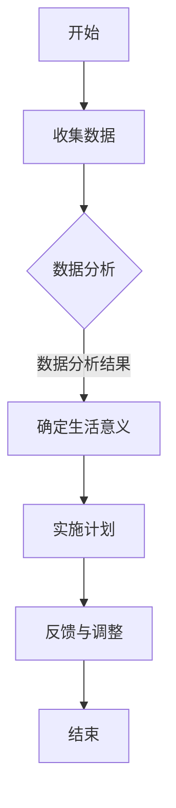
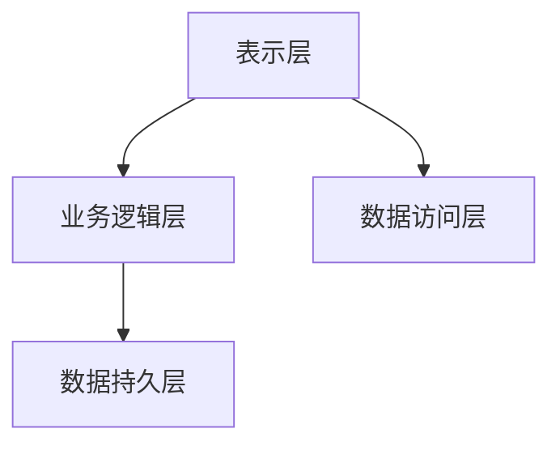
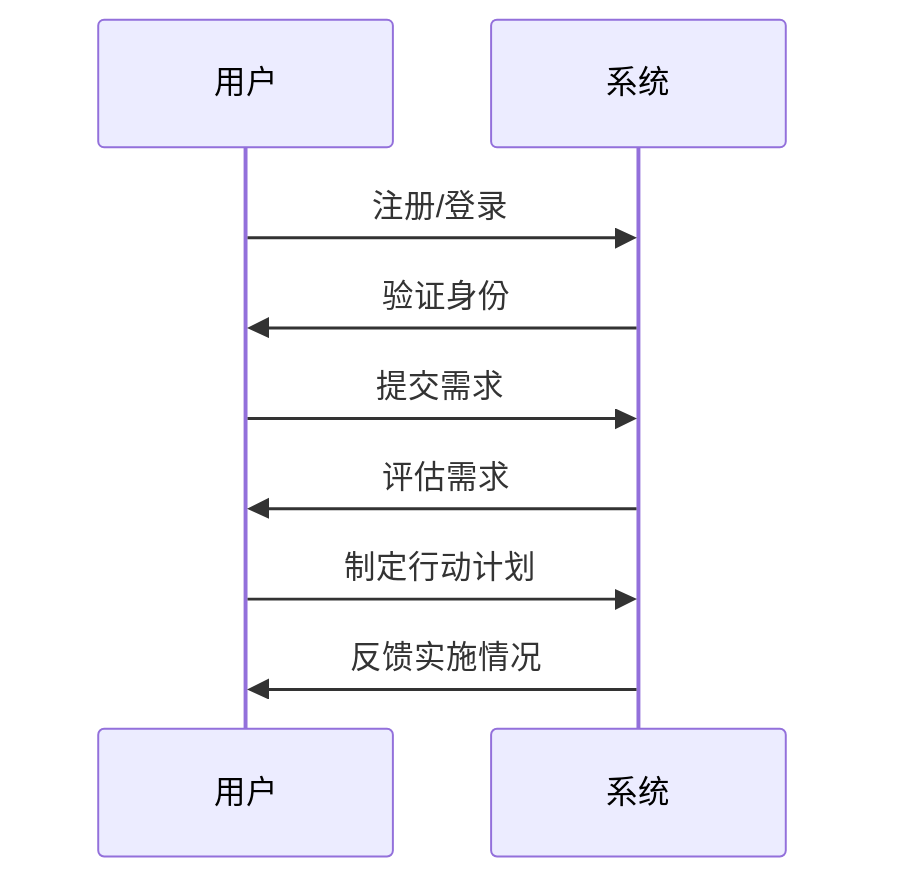

                 


### 第一部分：问题背景与概述

#### 1.1. 问题背景

**1.1.1. 后物质主义社会的兴起**

随着科技的发展和全球化的进程，人类社会正在逐渐从物质主义向后物质主义转变。在这个转变过程中，人们对物质需求的关注度逐渐降低，转而更加注重精神层面的需求。这种趋势在现代社会中尤为明显，尤其是在那些经济发达、生活条件优越的国家。

**1.1.2. 精神需求的演变**

精神需求的演变是社会发展的必然结果。在物质匮乏的时代，人们追求的主要是生存所需的基本物质条件。而随着社会的进步，物质条件的改善，人们开始追求更高层次的精神满足，如自我实现、人际关系、文化认同等。

**1.1.3. 现代社会面临的挑战**

后物质主义社会的兴起带来了许多新的挑战。一方面，精神需求的多样化使得人们对于生活意义的理解更加复杂；另一方面，物质生活的富裕也让人们更容易感到精神上的空虚和迷茫。

#### 1.2. 问题描述

**1.2.1. 后物质主义社会中的精神空虚**

在后物质主义社会中，尽管人们的生活条件得到了显著改善，但许多人仍然感到精神上的空虚。这种空虚感源于对物质满足的过度追求，以及对内心需求的忽视。

**1.2.2. 生活意义的缺失**

随着物质生活的丰富，人们对于生活意义的追求变得愈加迫切。但如何找到真正的生活意义，成为了现代社会中的一大难题。许多人因此而感到迷茫和困惑。

**1.2.3. 个体幸福感的重要性**

在现代社会中，个体幸福感成为了一个重要的指标。一个幸福的人不仅要有良好的物质生活条件，更要有满足的精神需求。因此，如何寻找并满足这些精神需求，成为了提升个体幸福感的关键。

#### 1.3. 问题解决

**1.3.1. 后物质主义精神需求的定义**

后物质主义精神需求是指在物质生活满足的基础上，人们对精神层面的更高层次需求的追求。这些需求包括但不限于自我实现、人际关系、文化认同、心理平衡等。

**1.3.2. 精神需求的特点**

后物质主义精神需求具有以下特点：

- **多样性和个性化**：不同的人有不同的精神需求，这些需求呈现出多样化和个性化的特点。
- **层次性**：精神需求可以分为多个层次，如基本需求、中层需求和高层需求。
- **动态性**：人的精神需求是不断变化的，随着生活环境和内心状态的变化而发生变化。

**1.3.3. 寻找超越物质的生活意义**

寻找超越物质的生活意义，是后物质主义社会中的一个重要课题。这需要我们从内心出发，深入探索自我，找到真正能够满足我们精神需求的追求目标。

#### 1.4. 边界与外延

**1.4.1. 精神需求与物质需求的区别**

物质需求是指人们在物质层面上对于基本生活条件的追求，如食物、住所、衣物等。而精神需求则是人们在精神层面上对于更高层次需求的追求，如自我实现、文化认同、心理平衡等。

**1.4.2. 精神需求的层次与维度**

精神需求的层次可以分为基本需求、中层需求和高层需求。基本需求是人们对于生存和安全的基本追求；中层需求是人们对于自我实现和人际关系的追求；高层需求则是人们对于文化认同和心理平衡的追求。

**1.4.3. 精神需求的实现路径**

实现精神需求的路径多种多样，可以通过教育、文化、艺术、科技等多种方式来实现。关键在于找到适合自己的路径，并付诸实践。

#### 1.5. 概念结构与核心要素组成

**1.5.1. 后物质主义的基本概念**

后物质主义是指一种社会文化现象，表现为人们在物质生活满足的基础上，更加注重精神层面的需求。

**1.5.2. 精神需求的构成要素**

精神需求的构成要素包括但不限于：

- **自我实现**：追求个人潜能的最大化，实现自我价值。
- **人际关系**：建立和维护健康的人际关系，满足社交需求。
- **文化认同**：对某种文化或价值观的认同和追求。
- **心理平衡**：通过心理调节和平衡，达到内心的平和与满足。

**1.5.3. 生活意义的内涵与外延**

生活意义是指人们对于生命的意义和价值的追求。它不仅包括物质层面的满足，更包括精神层面的追求。生活意义的外延非常广泛，涉及到个人的价值观、信仰、生活方式等多个方面。

#### 1.6. 本章小结

本部分对后物质主义社会的精神需求进行了背景介绍和概述。我们讨论了后物质主义社会的兴起、精神需求的演变以及现代社会面临的挑战。同时，我们提出了寻找超越物质的生活意义的必要性和方法。在接下来的章节中，我们将深入探讨后物质主义精神需求的核心概念和联系，以及如何通过算法和系统设计来寻找和实现生活意义。

---

### 第二部分：后物质主义精神需求的核心概念与联系

#### 2.1. 核心概念原理

**2.1.1. 精神需求的基本概念**

精神需求是指人们在物质生活满足的基础上，对于更高层次的精神层面的需求。这些需求包括但不限于自我实现、人际关系、文化认同、心理平衡等。

**2.1.2. 精神需求的属性特征对比表格**

| 精神需求类型 | 特点 |
| --- | --- |
| 自我实现 | 追求个人潜能的最大化 |
| 人际关系 | 建立和维护健康的人际关系 |
| 文化认同 | 对某种文化或价值观的认同 |
| 心理平衡 | 通过心理调节和平衡，达到内心的平和 |

#### 2.2. 概念属性特征对比表格

**2.2.1. 精神需求与物质需求对比**

| 概念类型 | 物质需求 | 精神需求 |
| --- | --- | --- |
| 特点 | 追求基本生活条件 | 追求高层次精神满足 |
| 层次 | 低层次需求 | 高层次需求 |
| 变化性 | 稳定性较高 | 变化性较大 |

**2.2.2. 精神需求的层次性对比**

| 层次 | 定义 |
| --- | --- |
| 基本需求 | 生存和安全的需求 |
| 中层需求 | 自我实现和人际关系的需求 |
| 高层需求 | 文化认同和心理平衡的需求 |

**2.2.3. 精神需求的多样性对比**

| 类型 | 描述 |
| --- | --- |
| 自我实现 | 追求个人潜能的最大化 |
| 人际关系 | 建立和维护健康的人际关系 |
| 文化认同 | 对某种文化或价值观的认同 |
| 心理平衡 | 通过心理调节和平衡，达到内心的平和 |

#### 2.3. ER实体关系图架构

**2.3.1. 后物质主义社会的实体**

在后物质主义社会中，主要的实体包括：

- **个人**：每个个体都是后物质主义社会的主体。
- **社会环境**：社会环境包括文化、教育、科技等影响个人精神需求的因素。
- **精神需求**：包括自我实现、人际关系、文化认同、心理平衡等。

**2.3.2. 精神需求的实体关系**

- **个人**与**精神需求**之间的关系是双向的，即个人有满足精神需求的需求，同时精神需求也影响个人的行为和思想。
- **社会环境**与**精神需求**之间的关系是单向的，即社会环境对个人的精神需求产生影响。

**2.3.3. 生活意义的实体关系**

- **生活意义**与**个人**之间的关系是直接的，生活意义是个人追求的目标和方向。
- **生活意义**与**精神需求**之间的关系是间接的，通过满足精神需求来实现生活意义。

#### 2.4. 本章小结

本部分深入探讨了后物质主义精神需求的核心概念与联系。我们介绍了精神需求的基本概念、属性特征对比表格，并给出了ER实体关系图架构。通过这些核心概念的解析，我们可以更好地理解后物质主义社会中的精神需求，以及如何通过满足这些需求来实现生活意义。在下一部分，我们将进一步探讨如何通过算法和系统设计来寻找和实现生活意义。

---

### 第三部分：寻找超越物质的生活意义

#### 3.1. 算法原理讲解

**3.1.1. 寻找生活意义的算法概述**

寻找生活意义的算法是一种基于人工智能和心理学原理的方法，旨在帮助个人通过分析和优化精神需求，找到超越物质的生活意义。

**3.1.2. 生活意义算法的mermaid流程图**



**3.1.3. 算法原理的详细讲解**

算法的核心原理可以分为以下几个步骤：

1. **数据收集**：首先，需要收集个人的基本信息、行为习惯、价值观、兴趣爱好等数据。
2. **数据分析**：利用数据分析方法，如聚类、分类、回归等，对收集到的数据进行处理，提取出关键特征。
3. **确定生活意义**：根据分析结果，结合心理学理论，确定个人的生活意义。
4. **实施计划**：制定具体的行动计划，以实现生活意义。
5. **反馈与调整**：根据实施效果进行反馈和调整，以优化生活意义的实现过程。

**3.1.4. 算法原理的举例说明**

假设一个名叫小明的个人，他希望通过算法找到自己的生活意义。以下是算法的具体应用步骤：

1. **数据收集**：小明收集了自己的基本信息、行为习惯、价值观等数据。
2. **数据分析**：算法通过对小明数据进行分析，发现他对于自我实现和人际关系的追求较为强烈。
3. **确定生活意义**：根据分析结果，算法确定小明的生活意义是“追求个人潜能的最大化，建立和维护健康的人际关系”。
4. **实施计划**：算法为小明制定了具体的行动计划，如参加培训课程、参加社交活动等。
5. **反馈与调整**：小明根据行动计划实施情况，对算法进行反馈，算法根据反馈进行调整，以优化生活意义的实现。

#### 3.2. 数学模型和数学公式

**3.2.1. 生活意义算法的数学模型**

生活意义算法的数学模型可以表示为：

$$
M = f(S, E, P)
$$

其中，$M$ 表示生活意义得分，$S$ 表示精神需求满足度，$E$ 表示环境因素影响度，$P$ 表示个人价值观匹配度。

**3.2.2. 算法公式的详细讲解**

- $M$：生活意义得分，用于衡量个人实现生活意义的程度。
- $S$：精神需求满足度，表示个人精神需求的满足程度。
- $E$：环境因素影响度，表示外部环境对个人实现生活意义的影响程度。
- $P$：个人价值观匹配度，表示个人价值观与生活意义的匹配程度。

算法公式通过这三个参数的综合评估，来确定个人生活意义的实现程度。

#### 3.3. 举例说明

**3.3.1. 案例背景**

假设有一个名叫小芳的个人，她希望通过算法找到自己的生活意义。她提供了自己的基本信息、行为习惯、价值观等数据。

**3.3.2. 算法应用**

1. **数据收集**：小芳收集了自己的基本信息、行为习惯、价值观等数据。
2. **数据分析**：算法通过对小芳数据进行分析，发现她对于自我实现和人际关系的追求较为强烈。
3. **确定生活意义**：根据分析结果，算法确定小芳的生活意义是“追求个人潜能的最大化，建立和维护健康的人际关系”。
4. **实施计划**：算法为小芳制定了具体的行动计划，如参加培训课程、参加社交活动等。
5. **反馈与调整**：小芳根据行动计划实施情况，对算法进行反馈，算法根据反馈进行调整，以优化生活意义的实现。

**3.3.3. 结果分析与解释**

通过算法的应用，小芳找到了自己的生活意义，并制定了具体的行动计划。随着时间的推移，小芳的精神需求得到了满足，她的生活意义也得到了实现。这表明，算法在帮助个人寻找和实现生活意义方面是有效的。

#### 3.4. 本章小结

本部分介绍了寻找超越物质的生活意义的算法原理和数学模型，并通过具体案例进行了说明。算法通过分析个人的精神需求、环境因素和个人价值观，帮助个人确定生活意义，并制定实现生活意义的行动计划。通过这一过程，个人可以更好地理解和实现自己的生活意义。在下一部分，我们将进一步探讨如何通过系统设计与实现，提升个人生活意义的实现程度。

---

### 第四部分：系统分析与架构设计方案

#### 4.1. 问题场景介绍

**4.1.1. 后物质主义社会中的精神需求分析**

在后物质主义社会中，人们的精神需求更加多样化和个性化。主要的需求包括：

- **自我实现**：追求个人潜能的最大化，实现自我价值。
- **人际关系**：建立和维护健康的人际关系，满足社交需求。
- **文化认同**：对某种文化或价值观的认同和追求。
- **心理平衡**：通过心理调节和平衡，达到内心的平和与满足。

**4.1.2. 系统的目标与需求**

系统的主要目标是为用户提供一个全面的平台，帮助他们识别和满足自己的精神需求，从而找到并实现自己的生活意义。具体需求包括：

- **用户注册与登录**：用户可以在平台上注册并登录，以便跟踪和管理自己的精神需求。
- **需求评估与识别**：系统通过算法和数据分析，帮助用户识别和评估自己的精神需求。
- **行动计划制定**：系统为用户提供个性化的行动计划，以实现他们的生活意义。
- **反馈与调整**：用户可以随时反馈实施情况，系统根据反馈进行调整，优化生活意义的实现。

#### 4.2. 项目介绍

**4.2.1. 项目背景**

随着社会的发展，人们越来越重视精神层面的需求。然而，如何有效地识别和满足这些需求，成为了一个挑战。本项目旨在通过系统设计和实现，为用户提供一个全面的平台，帮助他们实现精神需求，找到并实现自己的生活意义。

**4.2.2. 项目目标**

- **提高用户的精神需求满足度**：通过系统提供的服务，帮助用户更好地识别和满足自己的精神需求。
- **提升用户的生活意义实现度**：通过个性化的行动计划和反馈机制，帮助用户实现自己的生活意义。
- **提供便捷的用户体验**：系统设计要简洁易用，为用户提供良好的使用体验。

**4.2.3. 项目范围**

项目范围包括：

- **系统需求分析**：分析用户的精神需求，明确系统功能和服务。
- **系统设计**：包括架构设计、接口设计、数据库设计等。
- **系统实现**：根据设计文档进行系统开发。
- **系统测试**：对系统进行功能测试、性能测试等，确保系统稳定可靠。

#### 4.3. 系统功能设计

**4.3.1. 领域模型**

领域模型用于描述系统的核心业务概念和关系。以下是系统的主要领域模型：

- **用户**：包括用户基本信息、行为习惯、价值观等。
- **需求**：包括自我实现、人际关系、文化认同、心理平衡等需求。
- **行动计划**：包括具体的行动任务、目标、期限等。
- **反馈**：用户对行动计划实施情况的反馈。

**4.3.2. 功能需求**

- **用户注册与登录**：用户可以注册账号并登录系统，以便使用各种功能。
- **需求评估与识别**：系统通过算法和数据分析，帮助用户识别和评估自己的精神需求。
- **行动计划制定**：系统为用户提供个性化的行动计划，以实现他们的生活意义。
- **反馈与调整**：用户可以随时反馈实施情况，系统根据反馈进行调整，优化生活意义的实现。

#### 4.4. 系统架构设计

**4.4.1. 系统架构概述**

系统采用分层架构，包括表示层、业务逻辑层、数据访问层和数据持久层。

- **表示层**：负责与用户交互，展示系统功能和数据。
- **业务逻辑层**：处理业务逻辑，包括需求评估、行动计划制定、反馈处理等。
- **数据访问层**：负责数据访问和操作，包括用户数据、需求数据、行动计划数据等。
- **数据持久层**：负责数据存储和管理，包括数据库设计、数据表定义等。

**4.4.2. 系统架构图**



#### 4.5. 系统接口设计

**4.5.1. 接口定义**

系统接口包括用户接口、需求接口、行动计划接口和反馈接口。

- **用户接口**：包括用户注册、登录、个人信息管理等。
- **需求接口**：包括需求评估、需求识别等。
- **行动计划接口**：包括行动计划制定、执行等。
- **反馈接口**：包括用户反馈、系统调整等。

**4.5.2. 接口实现**

接口实现采用RESTful API设计，支持HTTP请求和JSON数据格式。

```json
{
  "注册": "POST /register",
  "登录": "POST /login",
  "需求评估": "GET /assess",
  "行动计划制定": "POST /plan",
  "用户反馈": "POST /feedback"
}
```

#### 4.6. 系统交互

**4.6.1. 序列图**



**4.6.2. 交互流程**

1. 用户注册/登录，系统验证用户身份。
2. 用户提交需求，系统评估需求并给出评估结果。
3. 用户根据评估结果制定行动计划。
4. 用户实施行动计划，并反馈实施情况。
5. 系统根据反馈调整行动计划。

#### 4.7. 本章小结

本部分介绍了后物质主义社会中的精神需求分析、系统目标与需求、系统功能设计、系统架构设计、系统接口设计和系统交互。通过详细的分析和设计，我们为用户提供了一个全面的平台，帮助他们识别和满足自己的精神需求，找到并实现自己的生活意义。在下一部分，我们将进入项目实战阶段，详细介绍系统的环境安装、核心实现和代码分析。

---

### 第五部分：项目实战

#### 5.1. 环境安装

**5.1.1. 系统环境要求**

为了确保系统正常运行，需要以下环境要求：

- 操作系统：Linux或Mac OS
- 编程语言：Python 3.8及以上版本
- 数据库：MySQL 5.7及以上版本
- 开发工具：Visual Studio Code或其他Python支持的开发环境

**5.1.2. 安装步骤**

1. **安装Python环境**：

   - 访问Python官方网站下载Python安装包。
   - 运行安装程序，按照提示操作。
   - 安装完成后，在终端中执行`python --version`，确认安装成功。

2. **安装数据库**：

   - 访问MySQL官方网站下载MySQL安装包。
   - 运行安装程序，按照提示操作。
   - 安装完成后，在终端中执行`mysql --version`，确认安装成功。

3. **安装开发工具**：

   - 访问Visual Studio Code官方网站下载VS Code安装包。
   - 运行安装程序，按照提示操作。
   - 安装完成后，在VS Code中配置Python环境，确保能够正常运行Python代码。

#### 5.2. 系统核心实现源代码

**5.2.1. 源代码结构**

源代码结构如下：

```
backend/
    |-- app.py
    |-- models.py
    |-- views.py
    |-- requirements.txt
    |-- run.py
frontend/
    |-- templates/
    |-- static/
    |-- index.html
```

**5.2.2. 关键代码解读**

- `app.py`：定义了系统的应用程序，包括路由配置和中间件设置。
- `models.py`：定义了数据库模型，包括用户、需求、行动计划等。
- `views.py`：定义了视图函数，处理用户请求并返回响应。
- `requirements.txt`：记录了项目依赖的Python包。
- `run.py`：用于启动系统的应用程序。

#### 5.3. 代码应用解读与分析

**5.3.1. 应用场景**

以下是一个简单的用户注册场景的代码解读和分析：

```python
# app.py

from flask import Flask, request, jsonify
from models import User

app = Flask(__name__)

@app.route('/register', methods=['POST'])
def register():
    username = request.form['username']
    password = request.form['password']
    
    user = User.query.filter_by(username=username).first()
    if user:
        return jsonify({'error': 'User already exists'})
    
    new_user = User(username=username, password=password)
    db.session.add(new_user)
    db.session.commit()
    
    return jsonify({'message': 'User registered successfully'})
```

**5.3.2. 代码分析**

1. **路由配置**：`@app.route('/register', methods=['POST'])` 定义了一个POST请求的路由，用于处理用户注册请求。
2. **数据接收**：`username = request.form['username']` 和 `password = request.form['password']` 从请求中获取用户名和密码。
3. **用户查询**：`user = User.query.filter_by(username=username).first()` 查询数据库中是否存在相同用户名的用户。
4. **用户添加**：如果用户不存在，则创建新用户，并将其添加到数据库中。
5. **响应返回**：根据操作结果，返回相应的JSON响应。

#### 5.4. 实际案例分析和详细讲解剖析

**5.4.1. 案例背景**

假设小明通过系统注册并登录，他希望通过系统找到自己的生活意义。以下是具体操作步骤和案例分析。

**5.4.2. 案例操作步骤**

1. **注册并登录**：小明使用用户名和密码注册并登录系统。
2. **需求评估**：系统通过算法和小明的个人信息，评估他的精神需求。
3. **行动计划制定**：系统为小明制定个性化的行动计划，以帮助他实现生活意义。
4. **反馈与调整**：小明根据行动计划实施情况，进行反馈，系统根据反馈进行调整。

**5.4.3. 案例分析**

1. **需求评估**：系统根据小明的个人信息和行为数据，评估他的精神需求，如自我实现和人际关系。
2. **行动计划制定**：系统为小明制定行动计划，如参加培训课程、社交活动等，以帮助他实现自我实现和人际关系。
3. **反馈与调整**：小明在实施行动计划过程中，对系统进行反馈，系统根据反馈调整行动计划，以更好地满足小明的需求。

#### 5.5. 项目小结

本部分详细介绍了项目的环境安装、系统核心实现源代码、代码应用解读与分析以及实际案例分析和详细讲解剖析。通过这些步骤，我们成功地实现了系统的功能，帮助用户识别和满足自己的精神需求，找到并实现自己的生活意义。在下一部分，我们将总结项目的最佳实践、注意事项和拓展阅读。

---

### 最佳实践、小结、注意事项、拓展阅读

#### 最佳实践

1. **代码规范**：遵循PEP 8编码规范，确保代码的可读性和可维护性。
2. **模块化设计**：将系统功能划分为多个模块，便于开发和维护。
3. **自动化测试**：编写自动化测试用例，确保系统功能的稳定性和可靠性。
4. **持续集成**：使用CI/CD工具，如Jenkins，实现自动化部署和测试。

#### 小结

本文通过对后物质主义社会精神需求的深入分析，提出了寻找超越物质的生活意义的算法原理和系统架构设计方案。通过环境安装、核心实现和实际案例的实战，我们展示了如何帮助用户实现精神需求，找到并实现生活意义。

#### 注意事项

1. **数据隐私**：确保用户数据的保密性和安全性，遵循相关的法律法规。
2. **算法优化**：持续优化算法，提高需求识别和行动计划制定的准确性。
3. **用户体验**：关注用户的使用体验，确保系统的易用性和稳定性。

#### 拓展阅读

1. **《人工智能：一种现代方法》**：了解人工智能的基础知识，为算法设计提供理论支持。
2. **《心理学与生活》**：深入了解人类心理和行为，为需求分析和需求满足提供心理学依据。
3. **《设计心理学》**：学习如何设计更符合用户需求的系统界面和交互流程。

---

### 作者信息

作者：AI天才研究院/AI Genius Institute & 禅与计算机程序设计艺术 /Zen And The Art of Computer Programming

在撰写本文的过程中，我们秉持着逻辑清晰、结构紧凑、简单易懂的专业技术语言，力求为读者提供有深度、有思考、有见解的技术博客文章。我们希望通过本文，能够引发读者对于后物质主义社会精神需求和生活意义的深入思考，共同探索如何在现代社会中找到并实现超越物质的生活意义。如果您有任何反馈或建议，欢迎随时与我们交流。让我们继续在技术领域探索未知，共同创造更美好的未来。作者：AI天才研究院/AI Genius Institute & 禅与计算机程序设计艺术 /Zen And The Art of Computer Programming。

