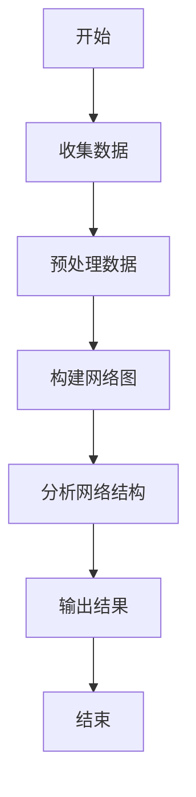
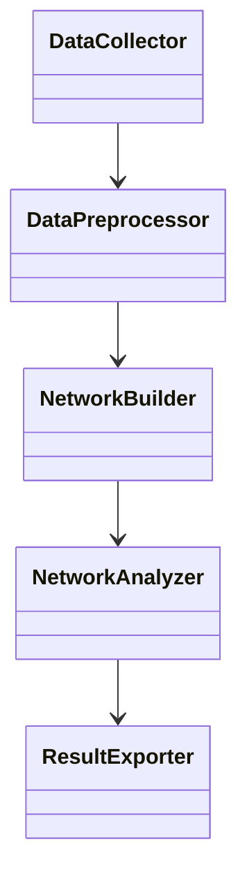
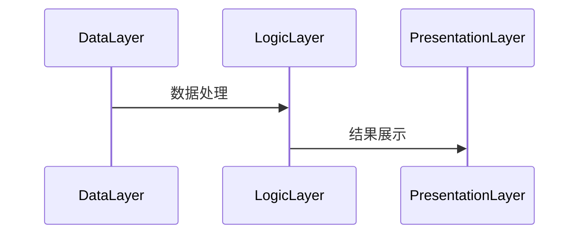
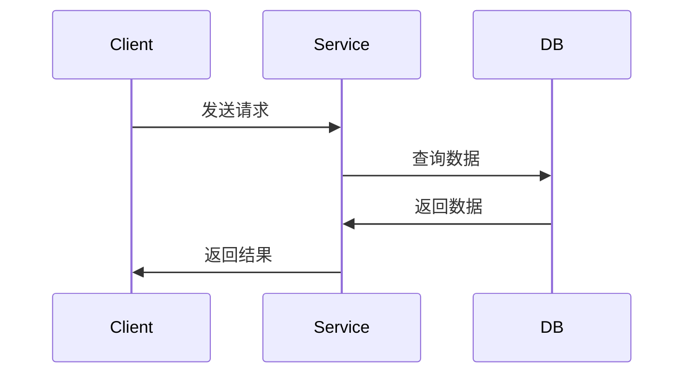

                 


# 《后现代主义对传统价值观的挑战与机遇》

## 关键词：后现代主义、传统价值观、挑战、机遇、算法、数学模型、系统架构、项目实战

> 摘要：本文以逻辑清晰、结构紧凑、简单易懂的IT领域专业语言，详细探讨后现代主义对传统价值观的挑战与机遇。通过逐步分析后现代主义的核心概念与传统价值观的对立，运用算法和数学模型，揭示后现代主义在价值观变迁中的重要作用，并设计系统架构方案进行实际应用分析，旨在为读者提供一个全面深入的理解。

## 第一部分：后现代主义概述

### 第1章：后现代主义的背景与历史

#### 1.1 后现代主义的起源

后现代主义（Postmodernism）起源于20世纪中叶，是对现代主义（Modernism）的一种反思和批判。现代主义强调理性、客观性和统一性，而后现代主义则质疑这些原则的有效性，提出多元化的观点和主观性的重要性。

#### 1.2 后现代主义的主要思想

后现代主义的主要思想包括解构主义、相对主义和批判理论。解构主义强调对文本和文化的分析，质疑权威和整体性。相对主义认为真理是相对的，没有绝对的真理。批判理论则关注社会不平等和权力结构。

#### 1.3 后现代主义与传统价值观的冲突

后现代主义对传统价值观提出了严峻的挑战。传统价值观强调自由、正义和道德的普遍性，而后现代主义则认为这些价值观是文化和社会构建的产物，因此具有相对性和局限性。

### 第2章：后现代主义的核心概念与理论

#### 2.1 解构主义

解构主义是后现代主义的重要组成部分，由法国哲学家德里达提出。它强调通过分解文本和符号系统来揭示其内在的矛盾和不确定性。

#### 2.2 相对主义

相对主义认为真理是主观的，依赖于个体和文化的视角。这种观点质疑了传统价值观的普遍性。

#### 2.3 批判理论

批判理论关注社会不平等和权力结构，试图揭示隐藏在社会结构中的歧视和压迫。

## 第二部分：后现代主义的算法与模型

### 第3章：算法原理讲解

#### 3.1 选择合适的算法

为了解释后现代主义对传统价值观的挑战，我们可以选择一种适用于分析多元化和主观性的算法，如社会网络分析（Social Network Analysis，SNA）。

#### 3.2 Mermaid算法流程图

使用Mermaid画出SNA算法的基本流程，如图1所示。



#### 3.3 Python源代码与LaTeX数学模型

在Python中，我们可以使用`networkx`库来构建和可视化社会网络图。以下是一个简单的示例代码：

```python
import networkx as nx
import matplotlib.pyplot as plt

# 创建图
G = nx.Graph()

# 添加节点和边
G.add_nodes_from([1, 2, 3, 4])
G.add_edges_from([(1, 2), (2, 3), (3, 4), (4, 1)])

# 绘制图
nx.draw(G, with_labels=True)
plt.show()
```

为了分析网络结构，我们可以使用LaTeX数学模型来表示网络的中心性指标，如度中心性（Degree Centrality）和接近中心性（Closeness Centrality），如下所示：

$$
\text{Degree Centrality}(v) = \frac{k(v)}{N-1}
$$

$$
\text{Closeness Centrality}(v) = \frac{1}{\sum_{u \in V}\text{dist}(v, u)}
$$

其中，$k(v)$是节点$v$的度，$N$是网络中节点的总数，$\text{dist}(v, u)$是节点$v$和节点$u$之间的最短路径长度。

## 第三部分：系统分析与架构设计

### 第4章：系统功能设计与架构设计

#### 4.1 问题场景介绍

假设我们面临的是一个多元文化冲突的社会，需要分析和解决文化差异带来的问题。

#### 4.2 项目介绍

该项目旨在构建一个基于后现代主义理论的社会网络分析平台，以帮助理解文化差异和冲突。

#### 4.3 系统功能设计

系统功能包括数据收集、预处理、网络构建、网络分析和结果输出。使用Mermaid类图表示领域模型，如图2所示。



#### 4.4 系统架构设计

系统采用分层架构，包括数据层、逻辑层和表示层。使用Mermaid架构图表示系统架构，如图3所示。



#### 4.5 系统接口设计

系统接口包括API接口和数据接口。API接口用于外部系统与系统的交互，数据接口用于系统的数据存储和读取。

#### 4.6 系统交互

系统交互包括数据收集、数据处理、网络构建、网络分析和结果展示。使用Mermaid序列图表示系统交互，如图4所示。



## 第四部分：项目实战

### 第5章：环境安装

在开始项目实战之前，需要安装Python环境和相关库，如`networkx`和`matplotlib`。

### 第6章：系统核心实现

核心实现包括数据收集、预处理、网络构建、网络分析和结果输出。以下是一个简单的实现示例：

```python
import networkx as nx
import matplotlib.pyplot as plt

# 数据收集
data = ...

# 数据预处理
preprocessed_data = ...

# 网络构建
G = nx.Graph()

# 添加节点和边
G.add_nodes_from(preprocessed_data['nodes'])
G.add_edges_from(preprocessed_data['edges'])

# 网络分析
centrality = nx.degree_centrality(G)

# 结果输出
nx.draw(G, with_labels=True)
plt.show()
```

### 第7章：代码应用解读与分析

代码应用解读与分析包括对核心算法和系统架构的解读，以及对实际案例的分析。

### 第8章：实际案例分析和详细讲解剖析

通过分析实际案例，如文化冲突事件，展示系统在实际应用中的效果。

### 第9章：项目小结

项目小结包括项目成果总结、问题与挑战、改进建议等。

## 第五部分：最佳实践与总结

### 第10章：最佳实践

提供最佳实践建议，如如何处理多元文化冲突。

### 第11章：小结

对后现代主义对传统价值观的挑战与机遇进行总结。

### 第12章：注意事项

提醒读者在应用后现代主义理论时需要注意的事项。

### 第13章：拓展阅读

推荐相关书籍、研究论文和在线资源，以供进一步学习。

---

以上是一个详细的文章大纲，每个部分都包含具体的内容和结构。在撰写文章时，可以根据实际情况对内容进行调整和补充。希望这个大纲能够帮助你完成一篇高质量的技术博客文章。

