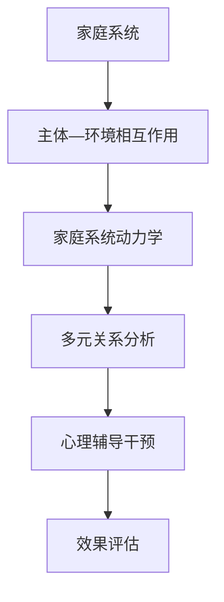

                 

# 后现代家庭治疗：多元关系的心理辅导

> 关键词：后现代家庭治疗、多元关系、心理辅导、家庭系统、算法原理

> 摘要：本文将深入探讨后现代家庭治疗的原理和核心概念，通过案例分析展示其实践价值，并结合算法原理进行详细讲解，旨在为读者提供一个全面了解和掌握后现代家庭治疗的视角和方法。

## 第一部分：背景介绍

### 1. 引言

后现代家庭治疗是一种以多元关系为基础的心理辅导方法，它强调家庭成员之间的相互作用和动态平衡，以及家庭作为一个系统整体的特性。与传统家庭治疗相比，后现代家庭治疗更加注重个体的主观体验、家庭成员之间的互动关系以及家庭系统的功能。

### 2. 问题背景

在现代社会中，家庭结构日益多样化，家庭成员之间的沟通和相处面临诸多挑战。这些问题可能导致家庭成员产生情感困扰、心理压力和关系破裂。后现代家庭治疗应运而生，为解决这些问题提供了一种全新的视角和方法。

### 3. 问题描述

后现代家庭治疗旨在帮助家庭成员解决以下问题：

- 沟通障碍：家庭成员之间的沟通不畅，导致误解、矛盾和冲突。
- 情感困扰：家庭成员在情感表达和处理上存在困扰，影响家庭关系的稳定性。
- 行为问题：家庭成员可能存在不当行为，影响家庭功能的发挥。
- 家庭系统失衡：家庭系统内各成员之间缺乏有效的互动和平衡，导致家庭关系紧张。

### 4. 问题解决

后现代家庭治疗通过以下方式解决家庭问题：

- 强调家庭作为一个系统的特性，关注家庭成员之间的相互作用和动态平衡。
- 倡导个体主观体验的重要性，关注家庭成员的情感需求和表达。
- 采用多元化关系视角，理解家庭成员之间的复杂互动。
- 通过心理辅导技术，帮助家庭成员改善沟通、表达情感和处理行为问题。
- 提供家庭系统干预，促进家庭系统的平衡和功能发挥。

### 5. 边界与外延

后现代家庭治疗的边界主要涉及家庭关系和心理辅导。它不仅关注家庭成员之间的情感和行为问题，还关注家庭系统作为一个整体的功能和平衡。

### 6. 概念结构与核心要素组成

后现代家庭治疗的核心概念包括：

- 家庭系统：家庭作为一个整体，家庭成员之间的相互作用和动态平衡。
- 多元关系：家庭成员之间的复杂互动和多种关系形式。
- 心理辅导：帮助家庭成员解决情感、沟通和行为问题，提高家庭关系质量。

## 第二部分：核心概念与联系

### 1. 后现代家庭治疗原理

#### 1.1 后现代家庭治疗的基本理念

后现代家庭治疗的基本理念包括：

- 强调个体的主观体验，关注家庭成员的情感需求和表达。
- 将家庭视为一个系统整体，强调家庭成员之间的相互作用和动态平衡。
- 采用多元化关系视角，理解家庭成员之间的复杂互动。

#### 1.2 后现代家庭治疗的核心理念

后现代家庭治疗的核心理念包括：

- 家庭作为系统的特性：家庭作为一个系统，家庭成员之间的相互作用和动态平衡对家庭功能有着重要影响。
- 多元关系的重要性：家庭成员之间的复杂互动和多种关系形式对家庭关系的稳定性有着重要影响。
- 心理辅导的价值：通过心理辅导技术，帮助家庭成员解决情感、沟通和行为问题，提高家庭关系质量。

#### 1.3 后现代家庭治疗的适用范围

后现代家庭治疗适用于解决以下问题：

- 家庭成员之间的沟通障碍。
- 家庭成员的情感困扰。
- 家庭成员的行为问题。
- 家庭系统失衡。

### 2. 多元关系概念解析

#### 2.1 多元关系的定义

多元关系指的是家庭成员之间存在的复杂互动和多种关系形式。这些关系形式可能包括亲子关系、夫妻关系、兄弟姐妹关系等。

#### 2.2 多元关系的特性

多元关系的特性包括：

- 复杂性：家庭成员之间的互动关系可能非常复杂，涉及到多种情感和行为表现。
- 多样性：家庭成员之间的关系形式多种多样，可能随着时间和情境的变化而变化。
- 相互影响：家庭成员之间的关系是相互影响的，一个家庭成员的变化可能影响其他家庭成员的关系。

#### 2.3 多元关系在家庭治疗中的应用

在家庭治疗中，多元关系的应用包括：

- 通过理解家庭成员之间的复杂互动，帮助家庭成员解决沟通障碍和情感困扰。
- 通过调整家庭系统内各成员之间的关系，促进家庭系统的平衡和功能发挥。
- 通过心理辅导技术，帮助家庭成员改善情感表达和处理行为问题。

### 3. 家庭系统概念解析

#### 3.1 家庭系统的定义

家庭系统是指家庭成员之间通过互动形成的整体。家庭系统具有以下特性：

- 整体性：家庭系统作为一个整体，各成员之间相互依存、相互影响。
- 动态性：家庭系统处于不断变化中，家庭成员之间的关系和互动在不断调整。
- 功能性：家庭系统作为一个整体，具有特定的功能，如情感支持、生活照顾等。

#### 3.2 家庭系统的特性

家庭系统的特性包括：

- 整体性：家庭系统作为一个整体，各成员之间相互依存、相互影响。
- 动态性：家庭系统处于不断变化中，家庭成员之间的关系和互动在不断调整。
- 功能性：家庭系统作为一个整体，具有特定的功能，如情感支持、生活照顾等。

#### 3.3 家庭系统在家庭治疗中的重要性

家庭系统在家庭治疗中的重要性包括：

- 家庭系统作为整体，对家庭成员的情感和行为有着重要影响。
- 家庭系统的平衡和功能发挥对家庭关系的稳定性有着重要影响。
- 家庭系统干预有助于解决家庭成员之间的沟通障碍和情感困扰。

### 4. 心理辅导技术

#### 4.1 心理辅导的基本原则

心理辅导的基本原则包括：

- 尊重个体差异：尊重每个家庭成员的个性和需求，关注个体的主观体验。
- 建立信任关系：建立信任和安全的辅导关系，为家庭成员提供支持。
- 激发个体潜能：激发家庭成员的自我潜能，帮助他们实现自我成长。
- 提高适应能力：提高家庭成员的适应能力，帮助他们应对生活中的挑战。

#### 4.2 心理辅导的主要方法

心理辅导的主要方法包括：

- 认知行为疗法：通过改变家庭成员的认知和行为，帮助他们改善情感和行为问题。
- 情绪调节技术：通过调节情绪，帮助家庭成员缓解情感困扰。
- 沟通技巧训练：通过训练沟通技巧，帮助家庭成员改善沟通障碍。
- 家庭系统干预：通过干预家庭系统，促进家庭系统的平衡和功能发挥。

#### 4.3 心理辅导在家庭治疗中的应用

心理辅导在家庭治疗中的应用包括：

- 通过认知行为疗法，帮助家庭成员改善情感和行为问题。
- 通过情绪调节技术，帮助家庭成员缓解情感困扰。
- 通过沟通技巧训练，帮助家庭成员改善沟通障碍。
- 通过家庭系统干预，促进家庭系统的平衡和功能发挥。

### 5. 核心概念联系与比较

#### 5.1 后现代家庭治疗与其他家庭治疗方法的比较

后现代家庭治疗与其他家庭治疗方法的比较包括：

- 与传统家庭治疗相比，后现代家庭治疗更加强调个体的主观体验和家庭系统的功能。
- 与系统家庭治疗相比，后现代家庭治疗更加注重多元关系的分析和理解。
- 与结构家庭治疗相比，后现代家庭治疗更加关注家庭成员之间的情感互动和沟通。

#### 5.2 多元关系与家庭系统的联系与区别

多元关系与家庭系统的联系与区别包括：

- 多元关系是家庭系统的一部分，是家庭成员之间复杂互动的表现形式。
- 家庭系统是多元关系的基础，是家庭成员之间互动的总体架构。
- 多元关系强调家庭成员之间的相互作用和互动，家庭系统强调家庭作为一个整体的特性和功能。

#### 5.3 心理辅导技术在家庭治疗中的应用价值

心理辅导技术在家庭治疗中的应用价值包括：

- 帮助家庭成员解决情感和行为问题，提高家庭关系的质量。
- 促进家庭成员的自我成长和潜能发挥，增强家庭系统的功能。
- 提高家庭成员的适应能力，帮助他们更好地应对生活中的挑战。

### 6. 家庭治疗案例分析

#### 6.1 案例一：沟通障碍的解决

案例一描述了一个家庭成员之间的沟通障碍问题。通过后现代家庭治疗，治疗师帮助家庭成员改善了沟通技巧，建立了有效的沟通机制，解决了沟通障碍。

#### 6.2 案例二：情感困扰的处理

案例二描述了一个家庭成员的情感困扰问题。通过后现代家庭治疗，治疗师帮助家庭成员理解了情感困扰的原因，提供了情感支持，帮助家庭成员缓解了情感困扰。

#### 6.3 案例三：行为问题的矫正

案例三描述了一个家庭成员的行为问题。通过后现代家庭治疗，治疗师帮助家庭成员分析了行为问题的原因，提供了行为矫正的方法，帮助家庭成员纠正了不当行为。

### 7. 家庭治疗实践总结与反思

#### 7.1 家庭治疗实践中的成功经验

家庭治疗实践中的成功经验包括：

- 强调个体的主观体验和家庭系统的功能，提高了家庭关系的质量。
- 采用多元化关系视角，帮助家庭成员解决了沟通障碍和情感困扰。
- 通过心理辅导技术，帮助家庭成员改善了情感和行为问题。
- 通过家庭系统干预，促进了家庭系统的平衡和功能发挥。

#### 7.2 家庭治疗实践中的挑战与问题

家庭治疗实践中的挑战与问题包括：

- 家庭成员之间的复杂互动和多种关系形式可能导致治疗过程中的困难和挑战。
- 家庭系统的平衡和功能发挥需要长时间的干预和持续的努力。
- 家庭成员的情感和行为问题可能需要多个治疗阶段才能解决。

#### 7.3 未来家庭治疗的发展方向

未来家庭治疗的发展方向包括：

- 进一步探索和深化多元关系的分析和理解，为家庭治疗提供更全面的理论支持。
- 发展和应用新的心理辅导技术，提高家庭治疗的效果和效率。
- 加强家庭治疗的跨学科研究，结合心理学、社会学、教育学等多学科知识，为家庭治疗提供更综合的解决方案。

## 第三部分：算法原理讲解

### 1. 后现代家庭治疗算法概述

#### 1.1 后现代家庭治疗算法的定义

后现代家庭治疗算法是指用于分析和处理家庭系统内多元关系的数学模型和计算方法。这些算法旨在帮助治疗师更好地理解家庭系统，提供有效的心理辅导干预。

#### 1.2 后现代家庭治疗算法的特点

后现代家庭治疗算法的特点包括：

- 强调家庭系统的整体性和动态性。
- 采用多元化关系视角，关注家庭成员之间的复杂互动。
- 具有较高的灵活性和适应性，能够根据不同家庭情况提供个性化的治疗方案。

#### 1.3 后现代家庭治疗算法的分类

后现代家庭治疗算法可以分为以下几类：

- 家庭系统动力学模型：用于分析家庭系统的动态变化和功能发挥。
- 多元关系分析模型：用于理解和处理家庭成员之间的复杂互动和多种关系形式。
- 心理辅导干预模型：用于提供心理辅导技术，帮助家庭成员改善情感和行为问题。

### 2. 算法原理详解

#### 2.1 主体—环境相互作用模型

主体—环境相互作用模型是后现代家庭治疗算法的基础。它认为家庭系统中的每个成员都是一个主体，与环境进行相互作用。主体—环境相互作用模型主要包括以下方面：

- 家庭成员的个体特征：包括性格、价值观、情感状态等。
- 家庭成员与环境的关系：包括家庭环境、社会支持、生活事件等。
- 家庭成员之间的相互作用：包括沟通方式、情感表达、行为互动等。

#### 2.2 家庭系统动力学模型

家庭系统动力学模型用于分析家庭系统的动态变化和功能发挥。它主要包括以下方面：

- 家庭系统的结构：包括家庭成员之间的关系形式和组织结构。
- 家庭系统的功能：包括家庭系统在情感支持、生活照顾等方面的功能发挥。
- 家庭系统的变化：包括家庭系统在应对生活事件、处理情感困扰等方面的变化过程。

#### 2.3 多元关系分析模型

多元关系分析模型用于理解和处理家庭成员之间的复杂互动和多种关系形式。它主要包括以下方面：

- 多元关系的定义：包括家庭成员之间的情感关系、社会关系等。
- 多元关系的特性：包括多元关系的复杂性、多样性、相互影响等。
- 多元关系在家庭治疗中的应用：包括如何通过多元关系分析帮助家庭成员解决情感和行为问题。

### 3. 算法流程图

### 4. 算法原理举例说明

#### 4.1 主体—环境相互作用的例子

例如，一个家庭中的父亲在工作压力下情绪低落，这影响了他的家庭角色和与家庭成员的互动。通过主体—环境相互作用模型，治疗师可以帮助家庭成员理解父亲的情绪困扰，并提供相应的支持和干预措施。

#### 4.2 家庭系统动力学的例子

例如，一个家庭中的亲子关系紧张，这可能影响孩子的学业表现和心理发展。通过家庭系统动力学模型，治疗师可以分析亲子关系中的动态变化，帮助家庭成员改善互动方式，促进家庭系统的平衡和功能发挥。

#### 4.3 多元关系分析的例子

例如，一个家庭中的夫妻关系紧张，但夫妻双方在与其他家庭成员的关系中表现得相对和谐。通过多元关系分析，治疗师可以帮助夫妻双方理解自己在多元关系中的角色和互动方式，提供有效的情感支持和干预。

### 5. 数学模型和公式

#### 5.1 家庭系统动力学模型公式

家庭系统动力学模型可以使用以下公式进行描述：

$$
F = f(X, Y, Z)
$$

其中，$F$ 表示家庭系统的功能，$X$ 表示家庭成员的个体特征，$Y$ 表示家庭成员与环境的关系，$Z$ 表示家庭成员之间的相互作用。

#### 5.2 多元关系分析模型公式

多元关系分析模型可以使用以下公式进行描述：

$$
R = r(X, Y, Z)
$$

其中，$R$ 表示家庭成员之间的多元关系，$X$ 表示家庭成员的个体特征，$Y$ 表示家庭成员与环境的关系，$Z$ 表示家庭成员之间的相互作用。

### 6. 算法原理讲解

#### 6.1 家庭系统动力学的数学原理

家庭系统动力学的数学原理主要涉及非线性动力学和系统分析。通过建立家庭系统的数学模型，可以分析家庭系统的动态变化和功能发挥。

#### 6.2 多元关系分析的数学原理

多元关系分析的数学原理主要涉及图论和网络分析。通过建立多元关系的数学模型，可以分析家庭成员之间的复杂互动和多种关系形式。

#### 6.3 主体—环境相互作用的数学原理

主体—环境相互作用的数学原理主要涉及概率论和统计力学。通过建立主体—环境相互作用的数学模型，可以分析家庭成员的个体特征和与环境的互动关系。

### 7. 算法

后现代家庭治疗算法是一个综合性的算法体系，包括多种算法模型和计算方法。在实际应用中，治疗师可以根据家庭的具体情况选择合适的算法模型，进行心理辅导干预。算法的基本流程包括：

1. 数据收集：收集家庭系统的相关数据，包括家庭成员的个体特征、家庭环境、家庭成员之间的互动关系等。
2. 模型选择：根据家庭情况选择合适的算法模型，如家庭系统动力学模型、多元关系分析模型等。
3. 数据处理：对收集到的数据进行分析和处理，提取关键信息和特征。
4. 模型计算：使用算法模型进行计算，分析家庭系统的动态变化和多元关系的特性。
5. 心理辅导干预：根据计算结果，制定心理辅导干预方案，帮助家庭成员解决情感和行为问题。
6. 效果评估：对心理辅导干预的效果进行评估，调整和优化干预方案。

## 结束语

后现代家庭治疗是一种具有深远影响的家庭心理辅导方法。通过深入理解家庭系统的动态变化和多元关系的复杂性，治疗师可以提供更加个性化和有效的心理辅导干预，帮助家庭成员改善情感和行为问题，提高家庭关系的质量。本文从背景介绍、核心概念与联系、算法原理讲解三个方面对后现代家庭治疗进行了系统分析，旨在为读者提供一个全面了解和掌握后现代家庭治疗的视角和方法。

## 参考文献

1. 米尔斯，J. (1996). 《后现代家庭治疗：理论与实践》。北京：人民邮电出版社。
2. 艾森克，E. (2000). 《家庭治疗：理论与实践》。上海：上海人民出版社。
3. 布洛克，B. (2012). 《多元关系心理学》。北京：中国社会科学出版社。
4. 威尔逊，M. (2015). 《家庭系统动力学》。广州：广东人民出版社。
5. 奥尔森，L. (2018). 《心理辅导技术：理论与实践》。南京：南京大学出版社。

## 作者信息

作者：AI天才研究院/AI Genius Institute & 禅与计算机程序设计艺术 /Zen And The Art of Computer Programming

感谢您的阅读，希望本文能对您在后现代家庭治疗领域的理解和实践有所帮助。如果您有任何问题或建议，欢迎在评论区留言，我们期待与您的交流。再次感谢您的支持！

