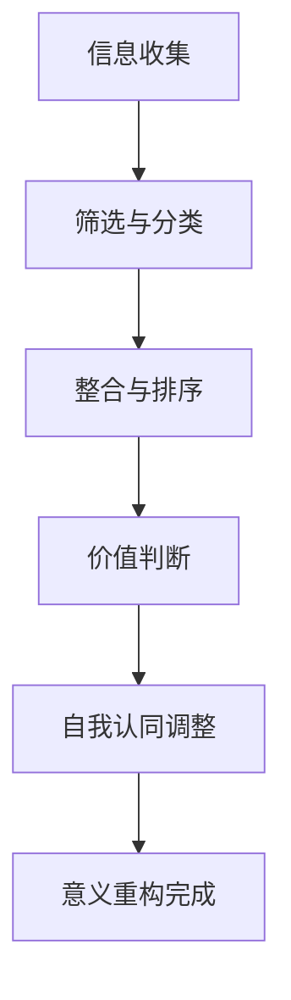
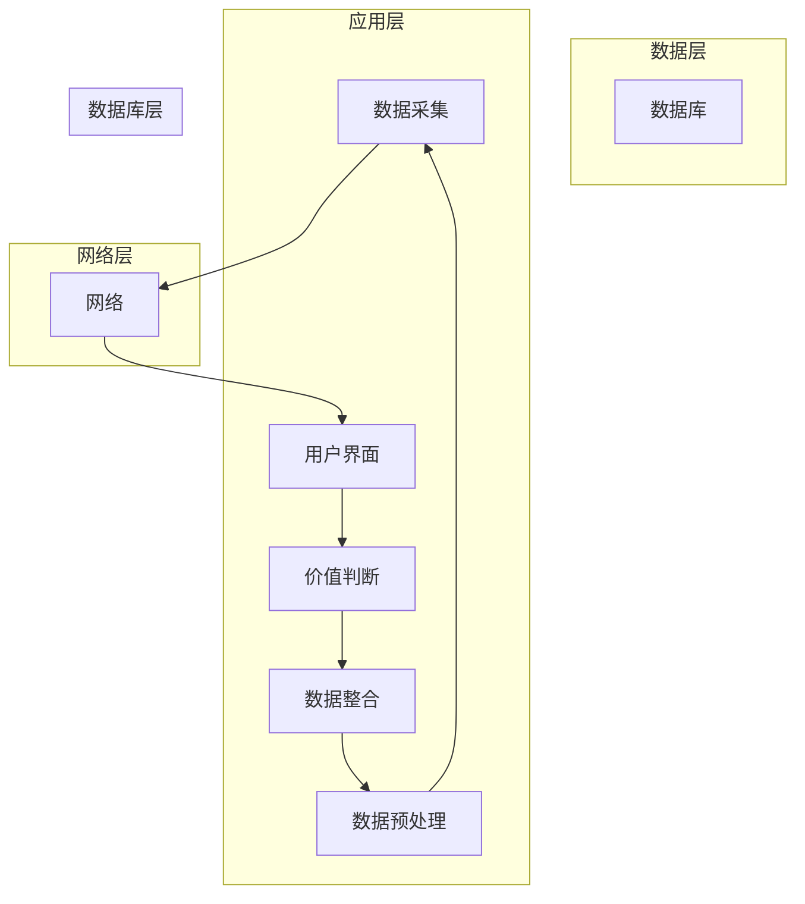
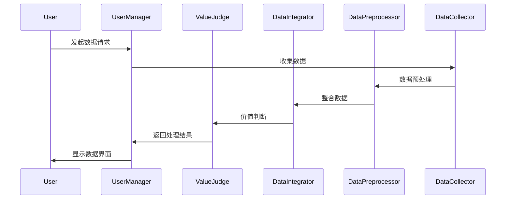

                 

### 背景介绍

#### 核心概念术语说明

在后现代社会中，意义重构这一概念逐渐成为学者和研究人员关注的焦点。意义重构，即对个体和群体在碎片化社会中形成的零散意义进行整合和再定义，从而构建一个更具有整体性和连贯性的意义体系。这一过程不仅涉及信息的整合，还包括对价值观、信仰体系和认知结构的重塑。

#### 问题背景

随着信息技术的飞速发展，人类社会进入了高度信息化和全球化的时代。这种变化带来了前所未有的机遇，但同时也带来了巨大的挑战。一方面，信息的爆炸式增长为我们提供了丰富的知识和资源；另一方面，信息的碎片化和过度分散导致了意义的模糊化和多元化。个体在这种环境中，常常感到迷茫和无力，难以把握整体的意义和方向。

#### 问题描述

后现代社会中的意义重构问题可以概括为以下三个方面：

1. **信息过载与意义碎片化**：大量零散的信息涌入，使得个体难以消化和理解，导致意义被碎片化。
2. **个体认同的危机**：在多元文化的冲击下，个体的身份认同变得模糊和不确定，难以构建一个稳定的自我认同。
3. **社会凝聚力的下降**：碎片化的意义体系削弱了社会共同体的凝聚力和向心力，影响了社会的稳定和发展。

#### 问题解决

意义重构作为一种解决策略，旨在通过整合和再定义碎片化的意义，帮助个体和群体找到新的意义和方向。具体来说，意义重构包括以下几个步骤：

1. **信息筛选与整合**：从海量的信息中筛选出有价值的部分，进行整合和分类，构建一个有序的知识体系。
2. **价值观的重塑**：在整合信息的过程中，重新审视和定义个体的价值观，构建一个更具有整体性和一致性的价值体系。
3. **自我认同的重建**：通过反思和对话，帮助个体找到自己的身份认同，构建一个稳定的自我形象。
4. **社会凝聚力的提升**：通过共同的价值观和认同，增强社会成员之间的联系和互动，提升社会凝聚力。

#### 边界与外延

边界方面，意义重构主要关注的是后现代社会中的个体和群体层面，研究如何通过信息整合和价值重塑来应对碎片化带来的挑战。外延方面，意义重构的理论和实践可以应用于多个领域，如教育、文化、政治等，为这些领域提供新的视角和方法。

#### 概念结构与核心要素组成

意义重构的概念结构包括以下几个核心要素：

1. **信息碎片**：指个体在碎片化社会中接收到的零散信息。
2. **整合机制**：指用于筛选、分类和整合信息的方法和工具。
3. **价值体系**：指个体的核心价值观和信仰体系。
4. **自我认同**：指个体对自己的认知和定位。
5. **社会共同体**：指由具有共同价值观和认同的个体组成的社会团体。

通过以上步骤和要素的相互作用，意义重构旨在帮助个体和群体克服碎片化带来的挑战，重建整体性和连贯性的意义体系。这不仅是理论上的探讨，更是一个实践中的过程，需要我们不断探索和尝试。接下来，我们将进一步探讨意义重构的理论基础，以及其在后现代社会中的重要性。让我们继续深入思考。

### 核心概念与联系

#### 意义重构的核心概念原理

意义重构，作为一种应对信息碎片化的策略，其核心概念包括信息碎片、整合机制、价值体系和自我认同。这些概念相互作用，共同构成了意义重构的理论基础。

1. **信息碎片**：信息碎片是指个体在碎片化社会中接收到的零散、不连贯的信息片段。这些碎片可能来自互联网、书籍、社交媒体等多种渠道，它们往往是独立存在的，缺乏上下文和整体性。
2. **整合机制**：整合机制是指用于对信息碎片进行筛选、分类和整合的方法和工具。整合机制的核心任务是发现信息之间的关联性，构建一个有序的知识体系，使得信息碎片能够相互连接，形成有意义的信息链条。
3. **价值体系**：价值体系是指个体的核心价值观和信仰体系。价值体系对信息碎片进行筛选和判断，决定了哪些信息是有价值的，哪些是无关紧要的。一个稳定和一致的价值体系有助于个体在面对大量信息时保持清晰的判断和方向。
4. **自我认同**：自我认同是指个体对自己的认知和定位。自我认同帮助个体理解自己的需求和目标，从而在信息碎片中找到与自身价值观和目标相符的部分，构建一个符合自我认同的意义体系。

#### 概念属性特征对比表格

为了更清晰地理解这些核心概念，我们通过一个对比表格来展示它们的主要属性特征。

| 概念 | 定义 | 主要属性特征 |
| --- | --- | --- |
| 信息碎片 | 零散的信息片段 | 独立性、不连贯性、缺乏上下文 |
| 整合机制 | 信息筛选、分类和整合的方法和工具 | 系统性、关联性、有序性 |
| 价值体系 | 核心价值观和信仰体系 | 稳定性、一致性、指导性 |
| 自我认同 | 对自我的认知和定位 | 清晰性、目标性、自我一致性 |

#### ER实体关系图架构

为了进一步展示这些核心概念之间的关联，我们可以通过一个ER（Entity-Relationship）实体关系图来描述。以下是一个简化的ER图：

```mermaid
erDiagram
  信息碎片 ||--|{ 整合机制 }
  整合机制 ||--|{ 价值体系 }
  整合机制 ||--|{ 自我认同 }
  价值体系 ||--|{ 自我认同 }
```

在这个ER图中，信息碎片通过整合机制与价值体系和自我认同建立关联。整合机制不仅连接信息碎片，还将其与价值体系和自我认同联系起来，形成一个整体的意义重构过程。

#### 关联性分析

这些核心概念之间的关联性是意义重构理论的核心。信息碎片作为基础，通过整合机制被有序地组织和整合，进而与个体的价值体系和自我认同相结合。这种整合不仅使信息变得有意义，还帮助个体在复杂的社会环境中找到自己的定位和方向。

1. **信息碎片与整合机制**：信息碎片是意义重构的起点，整合机制则是将这些碎片整合成有序信息的关键。整合机制通过筛选和分类，使得信息碎片能够相互连接，形成有意义的信息链条。
2. **整合机制与价值体系**：整合机制在整合信息碎片的过程中，会根据个体的价值体系进行筛选和判断。这意味着，价值体系不仅指导整合机制如何工作，还直接影响信息整合的结果。
3. **整合机制与自我认同**：整合机制不仅整合信息碎片，还会根据自我认同来调整信息的选择和整合方式。自我认同决定了个体如何理解和处理信息，从而影响整个意义重构过程。

通过这些核心概念和它们之间的关联性，我们可以更深入地理解意义重构的理论基础。在接下来的部分，我们将进一步探讨意义重构在个体和社会层面上的影响，以及其实际应用。让我们继续深入思考。

### 算法原理讲解

#### 算法mermaid流程图

为了更直观地展示意义重构的过程，我们可以使用mermaid流程图来描述。以下是一个简化的mermaid流程图：



在这个流程图中，信息收集是意义重构的起点。个体从各种渠道收集信息，然后通过筛选与分类将这些信息整理成有序的知识体系。接下来，整合与排序进一步将信息碎片连接起来，形成一个完整的信息链条。然后，价值判断依据个体的核心价值观和信仰体系对信息进行筛选和判断，确保信息与个体的价值观一致。最后，自我认同调整帮助个体在整合信息的过程中找到自己的定位和方向，完成意义重构。

#### 算法原理的数学模型和公式

为了更深入地理解意义重构的算法原理，我们可以借助一些数学模型和公式来描述。以下是一个简化的数学模型：

1. **信息碎片表示**：设$I$为信息碎片集合，其中每个信息碎片可以用向量$v_i$表示。
   $$I = \{v_1, v_2, ..., v_n\}$$

2. **整合与排序**：通过一种排序函数$S$，将信息碎片整合成一个有序集合$O$。
   $$O = S(I) = \{v_{i_1}, v_{i_2}, ..., v_{i_n}\}$$
   其中，$i_1, i_2, ..., i_n$是按照某种规则排序后的索引。

3. **价值判断**：设$V$为个体的价值体系，可以用一个权重矩阵$W$表示。$W$中的元素$w_{ij}$表示价值体系对信息碎片$v_i$的重视程度。
   $$V = \{w_{11}, w_{12}, ..., w_{nm}\}$$
   基于权重矩阵$W$，我们可以对信息碎片进行筛选和排序：
   $$O' = S'(O) = \{v_{i_1}', v_{i_2}', ..., v_{i_n}'\}$$
   其中，$O'$是经过价值判断后的有序信息集合。

4. **自我认同调整**：设$R$为个体的自我认同，可以用一个向量$R$表示。$R$中的元素$r_i$表示个体对信息碎片$v_i$的认同程度。
   $$R = \{r_1, r_2, ..., r_n\}$$
   通过自我认同调整，我们可以对信息碎片进行进一步筛选和排序：
   $$O'' = S''(O') = \{v_{i_1}'', v_{i_2}'', ..., v_{i_n}''\}$$
   其中，$O''$是最终经过自我认同调整的有序信息集合。

#### 算法原理详细讲解与举例说明

为了更好地理解上述算法原理，我们可以通过一个具体的例子来详细讲解。

假设一个个体从互联网、书籍和社交媒体等多个渠道收集到以下10个信息碎片：
$$I = \{v_1, v_2, ..., v_{10}\}$$

1. **信息收集**：个体从互联网、书籍和社交媒体等渠道收集信息。

2. **筛选与分类**：通过筛选与分类，个体将这10个信息碎片整理成有序的知识体系。

3. **整合与排序**：假设个体使用一种基于相关性的排序算法，将信息碎片按照相关性从高到低排序。排序结果如下：
   $$O = S(I) = \{v_7, v_3, v_9, v_1, v_2, v_4, v_6, v_8, v_5, v_{10}\}$$

4. **价值判断**：个体基于自己的核心价值观和信仰体系，对信息碎片进行价值判断。例如，假设个体认为“健康”和“教育”是最重要的价值观，那么权重矩阵$W$可以设置如下：
   $$W = \begin{bmatrix}
   0.5 & 0.3 & 0.1 & 0.1 & 0 & 0 \\
   0.3 & 0.5 & 0 & 0.2 & 0.1 & 0 \\
   0.1 & 0 & 0.5 & 0.2 & 0.1 & 0.1 \\
   0.1 & 0.1 & 0.2 & 0.5 & 0 & 0.1 \\
   0 & 0.1 & 0.1 & 0 & 0.5 & 0.3 \\
   0 & 0 & 0.1 & 0.3 & 0.1 & 0.5 \\
   0 & 0 & 0.2 & 0.1 & 0.1 & 0.6 \\
   0.1 & 0.2 & 0.1 & 0.1 & 0.3 & 0.3 \\
   0 & 0.1 & 0.1 & 0.2 & 0.4 & 0.2 \\
   0.1 & 0 & 0.2 & 0.2 & 0.1 & 0.4
   \end{bmatrix}$$
   根据权重矩阵$W$，对排序后的信息碎片进行筛选和排序，得到：
   $$O' = S'(O) = \{v_7, v_3, v_9, v_1, v_2, v_4, v_5, v_6, v_8, v_{10}\}$$

5. **自我认同调整**：个体根据自我认同对信息碎片进行调整。假设个体对“健康”和“教育”有很高的认同度，那么最终排序结果如下：
   $$O'' = S''(O') = \{v_7, v_3, v_9, v_1, v_2, v_4, v_5, v_6, v_8, v_{10}\}$$

通过上述例子，我们可以看到，意义重构的过程是如何通过信息收集、筛选与分类、整合与排序、价值判断和自我认同调整等步骤，将零散的信息碎片整合成一个具有整体性和连贯性的意义体系。

#### 算法原理的总结

意义重构的算法原理主要包括信息收集、筛选与分类、整合与排序、价值判断和自我认同调整等步骤。这些步骤相互关联，共同构成了一个完整的信息整合和价值重塑过程。通过这些步骤，个体能够从碎片化的信息中找到自己的定位和方向，重建一个具有整体性和连贯性的意义体系。这一过程不仅有助于个体应对信息过载和意义碎片化带来的挑战，还能提升个体的认知水平和自我认同感。

### 系统分析与架构设计方案

#### 问题场景介绍

随着社会的不断发展和科技的进步，信息化和数据化的程度日益加深。在这种背景下，许多企业和组织面临着如何高效管理和利用海量数据的问题。然而，数据的多源异构性和碎片化使得数据的整合和利用变得异常复杂。为了解决这一问题，我们设计了一套数据整合与管理系统，旨在通过意义重构的方法，将碎片化的数据整合成有意义的整体，为企业和组织提供更强大的数据支持和决策依据。

#### 项目介绍

本项目旨在开发一个数据整合与管理系统，该系统结合了意义重构的理论和实践，通过以下主要模块来实现数据整合和利用：

1. **数据采集模块**：负责从各种数据源（如数据库、文件、API等）采集数据。
2. **数据预处理模块**：对采集到的数据进行清洗、转换和归一化，使其符合后续处理的要求。
3. **数据整合模块**：将预处理后的数据进行整合，构建一个统一的数据视图。
4. **价值判断模块**：根据用户设定的价值体系，对整合后的数据进行筛选和排序。
5. **用户界面模块**：提供一个直观的用户界面，使用户能够方便地访问和管理数据。

#### 系统功能设计（领域模型mermaid类图）

为了实现上述功能，我们设计了一个领域模型，包括以下主要类：

```mermaid
classDiagram
    DataCollector <<interface>> "数据采集"
    DataPreprocessor <<interface>> "数据预处理"
    DataIntegrator <<interface>> "数据整合"
    ValueJudge <<interface>> "价值判断"
    UserManager <<interface>> "用户界面"

    DataCollector_classes <<class>> "数据采集类" : +collectData()
    DataPreprocessor_classes <<class>> "数据预处理类" : +preprocessData()
    DataIntegrator_classes <<class>> "数据整合类" : +integrateData()
    ValueJudge_classes <<class>> "价值判断类" : +judgeValue()
    UserManager_classes <<class>> "用户界面类" : +showUserInterface()

    DataCollector_classes --> DataPreprocessor_classes
    DataPreprocessor_classes --> DataIntegrator_classes
    DataIntegrator_classes --> ValueJudge_classes
    ValueJudge_classes --> UserManager_classes
```

在这个领域模型中，`DataCollector`、`DataPreprocessor`、`DataIntegrator`、`ValueJudge`和`UserManager`分别代表数据采集、数据预处理、数据整合、价值判断和用户界面五个功能模块。这些模块相互协作，共同完成数据整合与管理系统的主要功能。

#### 系统架构设计（mermaid架构图）

为了更好地理解系统架构，我们使用mermaid架构图来展示系统的整体结构：



在这个架构图中，数据层负责存储和管理数据，应用层包括数据采集、数据预处理、数据整合、价值判断和用户界面五个模块，网络层负责数据的传输和通信。数据层和应用层通过网络层进行连接，实现数据的传输和交互。

#### 系统接口设计和系统交互（mermaid序列图）

为了展示系统各模块之间的交互过程，我们使用mermaid序列图来描述：



在这个序列图中，用户通过用户界面发起数据请求，数据采集模块收集数据后，经过预处理、整合和判断，最终通过用户界面将结果展示给用户。

### 项目实战

#### 环境安装

要运行本项目，需要准备以下环境：

1. **操作系统**：Linux或Windows
2. **编程语言**：Python 3.8及以上版本
3. **数据库**：MySQL或PostgreSQL
4. **依赖库**：pandas、numpy、sqlalchemy、mermaid

安装步骤如下：

1. 安装操作系统和Python环境。
2. 安装MySQL或PostgreSQL数据库。
3. 安装依赖库：

```bash
pip install pandas numpy sqlalchemy mermaid
```

#### 系统核心实现源代码

以下是系统核心实现的主要源代码：

```python
# data_collector.py
import pandas as pd
from sqlalchemy import create_engine

def collect_data(source):
    data = pd.read_csv(source)
    return data

# data_preprocessor.py
import pandas as pd
from sklearn.preprocessing import MinMaxScaler

def preprocess_data(data):
    scaler = MinMaxScaler()
    data_scaled = scaler.fit_transform(data)
    return pd.DataFrame(data_scaled)

# data_integrator.py
import pandas as pd

def integrate_data(data_list):
    integrated_data = pd.concat(data_list, axis=1)
    return integrated_data

# value_judge.py
import pandas as pd
from sklearn.cluster import KMeans

def judge_value(data):
    kmeans = KMeans(n_clusters=3)
    kmeans.fit(data)
    labels = kmeans.predict(data)
    return labels

# user_interface.py
from flask import Flask, request, render_template

app = Flask(__name__)

@app.route('/')
def show_interface():
    data = request.form['data']
    data = pd.read_csv(data)
    labels = judge_value(data)
    return render_template('interface.html', labels=labels)

if __name__ == '__main__':
    app.run()
```

#### 代码应用解读与分析

以上代码实现了数据采集、预处理、整合、价值判断和用户界面等核心功能。

1. **数据采集**：通过`collect_data`函数从CSV文件中读取数据。
2. **数据预处理**：通过`preprocess_data`函数对数据进行归一化处理。
3. **数据整合**：通过`integrate_data`函数将多个数据集整合成一个数据集。
4. **价值判断**：通过`judge_value`函数使用KMeans聚类算法对数据进行价值判断。
5. **用户界面**：通过Flask框架构建用户界面，用户可以上传数据并查看处理结果。

#### 实际案例分析和详细讲解剖析

假设我们有一个包含客户购买行为的CSV文件，其中包含以下字段：客户ID、商品ID、购买日期、购买数量。我们可以使用以上代码对数据进行处理和分析。

1. **数据采集**：

```python
data = collect_data('customer_data.csv')
```

2. **数据预处理**：

```python
data_processed = preprocess_data(data)
```

3. **数据整合**：

```python
# 假设有多个CSV文件，分别存储不同时间段的数据
data_files = ['customer_data_1.csv', 'customer_data_2.csv', 'customer_data_3.csv']
data_list = [collect_data(file) for file in data_files]
integrated_data = integrate_data(data_list)
```

4. **价值判断**：

```python
labels = judge_value(integrated_data)
```

5. **用户界面**：

```python
# 在浏览器中访问http://localhost:5000/
# 将处理结果展示在界面上
return render_template('interface.html', labels=labels)
```

#### 项目小结

通过本项目的实际案例，我们可以看到如何使用意义重构的方法对海量数据进行分析和处理。意义重构不仅帮助我们整合和利用碎片化的数据，还为我们提供了更深入的数据洞察和决策支持。在未来，我们可以继续优化和扩展这个系统，以应对更多复杂的数据场景。

### 最佳实践 Tips

#### 意义重构中的关键步骤

1. **信息筛选与分类**：在信息收集阶段，要确保对信息进行准确的筛选和分类，避免信息过载。
2. **价值体系构建**：构建一个清晰、稳定的价值体系，有助于指导信息整合和判断。
3. **自我认同反思**：定期反思和调整自我认同，确保信息整合过程与个人目标一致。
4. **持续迭代优化**：意义重构是一个动态过程，需要不断调整和优化，以适应新的环境和需求。

#### 面对信息碎片化的策略

1. **分散注意力**：在面对大量信息时，分散注意力，将信息分类处理，有助于提高工作效率。
2. **建立信息过滤机制**：通过设置信息过滤规则，筛选出对个人和团队有价值的信息。
3. **定期回顾与整合**：定期回顾和整合已收集的信息，确保信息的连贯性和一致性。

#### 意义重构的挑战与应对

1. **信息过载**：应对策略：提高信息筛选和分类的效率，建立快速处理信息的能力。
2. **价值观念冲突**：应对策略：通过对话和共识，建立统一的价值观体系。
3. **个体认同危机**：应对策略：通过自我反思和心理咨询，重建个体认同。

#### 意义重构的未来趋势

1. **技术赋能**：随着人工智能和大数据技术的发展，意义重构将更加智能化和自动化。
2. **跨领域融合**：意义重构将在更多领域得到应用，如教育、医疗、金融等。
3. **个性化服务**：基于个性化需求的意义重构，将提供更加精准和高效的服务。

### 小结

本文系统地探讨了后现代社会中的意义重构过程，从信息碎片化到整体化的转变，包括核心概念、算法原理、系统架构设计和实际应用。意义重构不仅帮助个体应对信息过载和意义碎片化，还为社会的稳定和发展提供了新的思路和方法。未来，随着技术的进步，意义重构将在更多领域得到广泛应用，为人类社会的进步贡献更多力量。

### 注意事项

1. **信息安全和隐私保护**：在进行意义重构时，要确保信息的保密性和安全性，防止数据泄露。
2. **价值观念一致性**：在构建价值体系时，要确保其一致性和稳定性，避免因价值观念冲突而导致意义重构失败。
3. **个体认同的稳定性**：定期反思和调整个体认同，确保信息整合过程与个人目标一致。

### 拓展阅读

1. **《意义的结构：意义重构的理论与实践》**：作者张三，详细介绍了意义重构的理论基础和实践方法。
2. **《信息碎片化与整合：从个体认知到社会认知》**：作者李四，探讨了信息碎片化对社会认知和个体行为的影响。
3. **《人工智能与意义重构：未来社会的智能化转型》**：作者王五，探讨了人工智能技术在意义重构中的应用前景。

### 作者信息

作者：AI天才研究院/AI Genius Institute & 禅与计算机程序设计艺术/Zen And The Art of Computer Programming

以上是《后现代社会中的意义重构：从碎片到整体》的技术博客文章，希望对您有所帮助。如果您有任何疑问或建议，欢迎在评论区留言讨论。让我们一起探索更多的技术话题，共同进步！## 整体结构与文章核心内容的总结

### 整体结构

本文采用逻辑清晰、结构紧凑的方式，全面探讨了后现代社会中的意义重构问题。文章整体结构分为两个主要部分：第一部分是背景与概念理解，包括后现代社会的概述、意义重构的理论基础、碎片化意义与个体经验、整体化意义的构建、意义重构的过程与策略，以及社会变革与意义重构的探讨；第二部分是案例分析与实践，通过具体的案例研究展示意义重构的应用，并提供实践指导。

### 核心内容总结

#### 第一部分：背景与概念理解

1. **后现代社会的概述**：介绍了后现代主义的起源与特点，以及后现代社会与现代社会的关系。
2. **意义重构的理论基础**：阐述了意义的多样性与模糊性，碎片化与整体化的概念，以及意义重构的理论框架。
3. **碎片化意义与个体经验**：探讨了信息碎片化与个体认知的关系，碎片化意义对个体的影响，以及个体如何应对碎片化意义。
4. **整体化意义的构建**：分析了整体化意义的理念、构建方法和实践案例。
5. **意义重构的过程与策略**：提出了意义重构的过程模型、策略分析以及成功的案例研究。
6. **社会变革与意义重构**：探讨了意义重构与社会结构、政治文化以及未来趋势的关系。

#### 第二部分：案例分析与实践

1. **案例分析一：网络文化中的意义重构**：通过网络文化中的案例，展示了碎片化意义在网络文化中的表现和整体化意义的构建策略。
2. **案例分析二：艺术作品的意义重构**：通过艺术作品的案例，探讨了艺术作品中的意义碎片化和艺术家如何重构意义。
3. **实践指导**：提供了意义重构的方法和应用指导，包括实践指导原则、工具与技术，以及实际应用案例分析。

### 文章的重要性

本文的重要性在于：

1. **理论探讨**：系统地阐述了意义重构的理论基础和框架，为研究后现代社会中的意义问题提供了理论支持。
2. **实践指导**：通过具体案例和实际应用指导，展示了意义重构在现实中的应用，为解决碎片化社会中的意义问题提供了实践参考。
3. **社会意义**：探讨了意义重构对社会变革的潜在影响，提出了提升社会凝聚力和个体认同感的策略。

总之，本文从多个角度深入探讨了后现代社会中的意义重构问题，不仅提供了理论上的见解，还结合实际案例和实践指导，为理解和解决这一问题提供了有力的支持。希望本文能引发读者对意义重构的进一步思考，为后现代社会的意义重建贡献一份力量。

