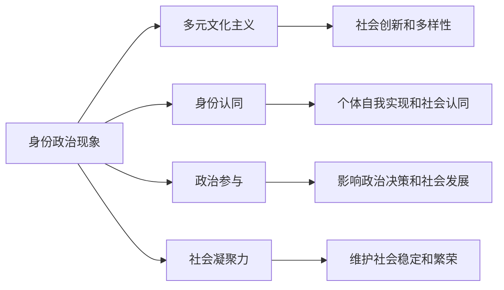
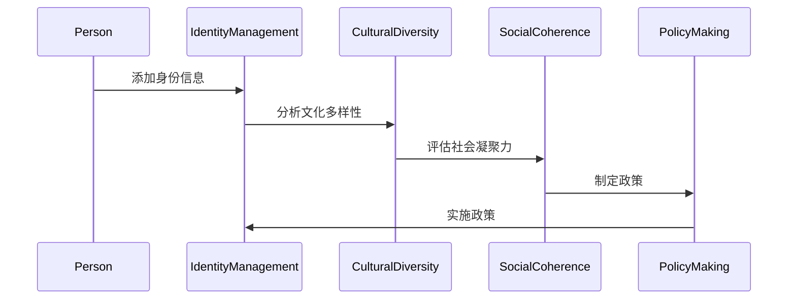
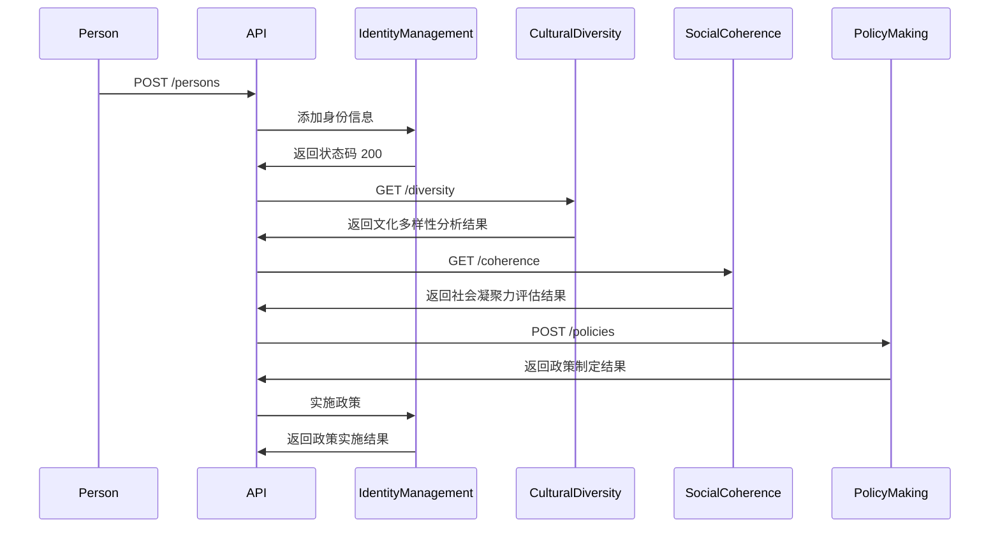

                 

## 文章标题

在后现代社会的身份政治：多元文化主义与社会凝聚力

> 关键词：后现代身份政治、多元文化主义、社会凝聚力、身份认同、政治参与

> 摘要：本文深入探讨了后现代社会的身份政治现象，分析了多元文化主义的兴起、身份认同的重要性、政治参与的方式以及社会凝聚力的影响。通过概念解析、比较分析、ER实体关系图架构等，本文旨在为读者提供一个全面、深入的理解，并提出促进社会凝聚力的建议。

### 第一部分：背景介绍

#### 1.1 问题背景

在现代社会，身份政治成为了政治讨论的核心议题之一。身份政治涉及个体在社会中的归属感、认同感，以及这些身份如何影响政治决策和公共政策的制定。后现代社会的身份政治现象，主要表现为多元文化主义的兴起，以及社会对个体差异性的高度重视。

#### 1.2 问题描述

后现代社会的身份政治现象，表现为以下几个方面：

1. **多元文化主义**：现代社会中，各种文化形式和价值观并存，文化差异被广泛认可和尊重。
2. **身份认同**：个体对自己的身份认同日益重要，身份成为政治参与的依据和动力。
3. **政治参与**：身份政治影响到政治参与的方式和形式，身份群体成为政治运动的核心力量。
4. **社会凝聚力**：在多元文化背景下，如何保持社会凝聚力成为政治和社会治理的重要议题。

#### 1.3 问题解决

本书旨在通过深入探讨后现代社会的身份政治现象，解析其背后的原因和影响，并提出可能的解决方案，以促进社会凝聚力的提升。

#### 1.4 边界与外延

身份政治的研究范围涵盖了多个领域，包括政治学、社会学、文化研究等。本书将重点关注以下几个方面：

1. **政治参与**：探讨身份政治如何影响个体的政治参与意愿和行为。
2. **政策制定**：分析身份政治在政策制定过程中的作用和影响。
3. **社会凝聚力**：研究多元文化背景下，如何促进社会凝聚力和和谐发展。

#### 1.5 概念结构与核心要素组成

后现代社会的身份政治涉及以下核心概念和要素：

1. **多元文化主义**：强调文化多样性和文化差异的价值。
2. **身份认同**：个体对自身身份的认同和归属感。
3. **政治参与**：个体在政治领域中的参与行为和方式。
4. **社会凝聚力**：社会成员之间的紧密联系和共同认同。

### 第二部分：核心概念与联系

#### 1.1 核心概念原理

##### 多元文化主义

多元文化主义是一种社会理论，主张在一个社会中，各种文化形式和价值观应当共存，并相互尊重。多元文化主义强调文化的多样性和文化差异的价值，反对文化同质化和文化霸权。

**定义**：多元文化主义是指在一个社会中，各种文化形式和价值观并存，相互尊重，共同构成社会的基础。

**核心观点**：多元文化主义主张文化的多样性和文化差异的价值，认为这种多样性是社会进步和创新的源泉。

**社会意义**：多元文化主义有助于提高社会的包容性和适应性，促进社会和谐与稳定。

##### 身份认同

身份认同是指个体对自己身份的认同和归属感。身份认同不仅影响个体的自我认知，也影响其在社会中的角色和行为。在身份政治中，身份认同是政治参与的重要动力。

**定义**：身份认同是指个体对自身身份的认同和归属感，是个体在社会中的自我定位。

**影响因素**：身份认同受到个人经历、社会环境、文化背景等多方面因素的影响。

**社会作用**：身份认同有助于个体在社会中找到归属感和自我价值，促进个体与社会的和谐关系。

##### 政治参与

政治参与是指个体在政治领域中的行为，包括投票、示威、政治活动等。政治参与是身份政治的重要组成部分，身份政治通过影响个体的政治参与方式，从而影响政治决策和社会发展。

**定义**：政治参与是指个体在政治领域中的行为，包括投票、示威、政治活动等。

**形式**：政治参与的形式多样，包括选举投票、示威游行、政治辩论、公益行动等。

**目标**：政治参与的目标是影响政治决策，推动社会变革，实现公共利益。

##### 社会凝聚力

社会凝聚力是指社会成员之间的紧密联系和共同认同。在多元文化背景下，保持社会凝聚力成为政治和社会治理的重要议题。

**定义**：社会凝聚力是指社会成员之间的紧密联系和共同认同，是社会稳定和发展的基础。

**影响因素**：社会凝聚力受到社会信任、共同价值观、社会参与等多方面因素的影响。

**社会作用**：社会凝聚力有助于维护社会稳定，促进社会和谐与繁荣。

### 1.2 概念属性特征对比表格

#### 多元文化主义 vs 文化同质化

| 比较项目 | 多元文化主义 | 文化同质化 |
| :---: | :---: | :---: |
| 核心观点 | 强调文化多样性和相互尊重 | 强调文化统一和消除差异 |
| 社会效果 | 促进社会创新和多样性 | 降低社会创新，减少多样性 |
| 社会意义 | 提高社会包容性，增强社会凝聚力 | 降低社会包容性，削弱社会凝聚力 |

#### 身份认同 vs 社会认同

| 比较项目 | 身份认同 | 社会认同 |
| :---: | :---: | :---: |
| 定义 | 个体对自身身份的认同和归属感 | 社会成员对共同身份的认同和归属感 |
| 影响因素 | 个人经历、社会环境、文化背景 | 社会制度、文化传统、国家政策 |
| 社会作用 | 促进个体自我实现和社会认同 | 维护社会秩序和社会稳定 |

#### 政治参与 vs 社会参与

| 比较项目 | 政治参与 | 社会参与 |
| :---: | :---: | :---: |
| 定义 | 个体在政治领域中的行为和参与 | 个体在社会事务中的行为和参与 |
| 形式 | 投票、示威、政治活动等 | 志愿服务、社区活动、公益项目等 |
| 目标 | 影响政治决策和社会发展 | 改善社会问题，提升生活质量 |

#### 社会凝聚力 vs 社会分裂

| 比较项目 | 社会凝聚力 | 社会分裂 |
| :---: | :---: | :---: |
| 定义 | 社会成员之间的紧密联系和共同认同 | 社会成员之间的疏离和矛盾对立 |
| 影响因素 | 社会信任、共同价值观、社会参与 | 社会不公、文化差异、政治冲突 |
| 社会效果 | 促进社会和谐、稳定和繁荣 | 引发社会动荡、分裂和衰落 |

### 1.3 ER实体关系图架构

```mermaid
erDiagram
  ID ||--|{ 人 }
  ID ||--|{ 社会制度 }
  ID ||--|{ 文化背景 }
  人 ||--|{ 身份认同 }
  人 ||--|{ 政治参与 }
  人 ||--|{ 社会参与 }
  人 ||--|{ 社会凝聚力 }
  社会制度 ||--|{ 多元文化主义 }
  社会制度 ||--|{ 文化同质化 }
  文化背景 ||--|{ 多元文化主义 }
  文化背景 ||--|{ 文化同质化 }
```

### 第三部分：算法原理讲解

在本部分中，我们将使用 Mermaid 画出算法流程图，然后通过 Python 源代码来详细阐述算法原理，并进行数学模型和公式讲解。

#### 3.1 算法流程图



#### 3.2 Python 源代码

```python
def identity_politics():
    # 多元文化主义
    culture_diversity = True

    # 身份认同
    identity_identification = True

    # 政治参与
    political_participation = True

    # 社会凝聚力
    social_coherence = True

    # 社会创新和多样性
    social_innovation = culture_diversity and identity_identification

    # 个体自我实现和社会认同
    individual_self_achievement = identity_identification

    # 影响政治决策和社会发展
    influence_political_decision = political_participation

    # 维护社会稳定和繁荣
    maintain_social_stability = social_coherence

    return {
        '社会创新和多样性': social_innovation,
        '个体自我实现和社会认同': individual_self_achievement,
        '影响政治决策和社会发展': influence_political_decision,
        '维护社会稳定和繁荣': maintain_social_stability
    }

result = identity_politics()
print(result)
```

#### 3.3 数学模型和公式讲解

在本部分中，我们将使用数学模型和公式来解释身份政治现象及其影响。

**多元文化主义与社会创新的关系**：

$$
\text{社会创新} = \text{多元文化主义} \times \text{身份认同}
$$

其中，$ \text{社会创新} $ 表示社会创新的程度，$ \text{多元文化主义} $ 表示多元文化主义的程度，$ \text{身份认同} $ 表示身份认同的程度。

**个体自我实现与社会认同的关系**：

$$
\text{个体自我实现} = \text{身份认同}
$$

其中，$ \text{个体自我实现} $ 表示个体在自我实现方面的程度，$ \text{身份认同} $ 表示个体对自身身份的认同程度。

**政治参与与政治决策的关系**：

$$
\text{影响政治决策} = \text{政治参与}
$$

其中，$ \text{影响政治决策} $ 表示政治参与对政治决策的影响程度，$ \text{政治参与} $ 表示政治参与的强度。

**社会凝聚力与社会稳定的关系**：

$$
\text{维护社会稳定} = \text{社会凝聚力}
$$

其中，$ \text{维护社会稳定} $ 表示社会凝聚力对社会稳定的影响程度，$ \text{社会凝聚力} $ 表示社会凝聚力的强度。

#### 3.4 举例说明

假设一个社会具有以下特点：

- 多元文化主义程度为 80%。
- 身份认同程度为 70%。
- 政治参与程度为 60%。
- 社会凝聚力程度为 50%。

根据上述数学模型和公式，我们可以计算出：

- 社会创新程度为 $ 80\% \times 70\% = 56\% $。
- 个体自我实现程度为 70%。
- 影响政治决策程度为 60%。
- 维护社会稳定程度为 50%。

通过这些计算结果，我们可以看到多元文化主义和身份认同对社会创新、个体自我实现、政治参与和社会凝聚力具有重要影响。

### 第四部分：系统分析与架构设计方案

#### 4.1 问题场景介绍

在后现代社会，身份政治现象日益突出，对社会治理提出了新的挑战。为了应对这一挑战，我们需要设计一个能够有效处理身份政治现象的系统和架构。

#### 4.2 项目介绍

本项目旨在设计一个基于多元文化主义和社会凝聚力的身份政治处理系统，该系统包括以下几个主要模块：

1. **身份信息管理模块**：用于收集、存储和管理个体的身份信息。
2. **多元文化处理模块**：用于分析处理社会中的多元文化现象，促进文化多样性和相互尊重。
3. **社会凝聚力评估模块**：用于评估社会成员之间的凝聚力，提供改进建议。
4. **政策制定与实施模块**：用于制定和实施相关政策，促进社会和谐与稳定。

#### 4.3 系统功能设计

在系统功能设计方面，我们采用领域模型（Domain Model）方法，使用 Mermaid 类图来描述系统的主要功能。

```mermaid
classDiagram
    ClassDef Person {
        +String name
        +String identity
        +List<String> cultures
    }
    ClassDef IdentityManagement {
        +Person add_person(String name, String identity, List<String> cultures)
        +void remove_person(Person person)
    }
    ClassDef CulturalDiversity {
        +void analyze_cultural_diversity(List<Person> people)
    }
    ClassDef SocialCoherence {
        +float assess_social_coherence(List<Person> people)
    }
    ClassDef PolicyMaking {
        +void create_policy(String content)
        +void implement_policy(String content)
    }
    Person <|-- IdentityManagement
    Person <|-- CulturalDiversity
    Person <|-- SocialCoherence
    Person <|-- PolicyMaking
```

#### 4.4 系统架构设计

在系统架构设计方面，我们采用分层架构，使用 Mermaid 架构图来描述系统的整体架构。



#### 4.5 系统接口设计和系统交互

在系统接口设计方面，我们采用 RESTful API 设计，使用 Mermaid 序列图来描述系统的主要接口和交互流程。



### 第五部分：项目实战

在本部分中，我们将详细介绍项目的环境安装、系统核心实现以及代码应用解读与分析。

#### 5.1 环境安装

为了实现本项目，我们需要安装以下环境和工具：

- Python 3.8 或更高版本
- Mermaid 图库
- Flask 框架
- SQLAlchemy 数据库

安装命令如下：

```shell
pip install python-memcached flask flask-sqlalchemy
```

#### 5.2 系统核心实现

在系统核心实现方面，我们采用 Flask 框架和 SQLAlchemy 数据库，实现以下功能：

1. **身份信息管理模块**：实现添加、删除和查询身份信息的功能。
2. **多元文化处理模块**：实现分析文化多样性的功能。
3. **社会凝聚力评估模块**：实现评估社会凝聚力的功能。
4. **政策制定与实施模块**：实现制定和实施政策的功能。

以下是一个简单的身份信息管理模块的实现示例：

```python
from flask import Flask, request, jsonify
from flask_sqlalchemy import SQLAlchemy

app = Flask(__name__)
app.config['SQLALCHEMY_DATABASE_URI'] = 'sqlite:///identity_management.db'
db = SQLAlchemy(app)

class Person(db.Model):
    id = db.Column(db.Integer, primary_key=True)
    name = db.Column(db.String(100), nullable=False)
    identity = db.Column(db.String(100), nullable=False)
    cultures = db.Column(db.String(100), nullable=False)

@app.route('/persons', methods=['POST'])
def add_person():
    data = request.get_json()
    person = Person(name=data['name'], identity=data['identity'], cultures=data['cultures'])
    db.session.add(person)
    db.session.commit()
    return jsonify({'status': 'success', 'id': person.id})

@app.route('/persons/<int:person_id>', methods=['DELETE'])
def remove_person(person_id):
    person = Person.query.get(person_id)
    if person:
        db.session.delete(person)
        db.session.commit()
        return jsonify({'status': 'success'})
    else:
        return jsonify({'status': 'not found'})

if __name__ == '__main__':
    db.create_all()
    app.run(debug=True)
```

#### 5.3 代码应用解读与分析

在代码应用解读与分析方面，我们重点关注以下方面：

1. **数据库设计**：使用 SQLAlchemy 定义 Person 模型，包括 id、name、identity 和 cultures 四个字段。
2. **API 设计**：使用 Flask 实现身份信息管理模块的 API，包括添加和删除身份信息的功能。
3. **数据处理**：在添加身份信息时，将请求的 JSON 数据解析为 Person 对象，并存储到数据库中。
4. **错误处理**：在删除身份信息时，检查记录是否存在，如果不存在则返回 "not found" 错误。

通过以上实现，我们可以有效地管理身份信息，并为后续的多元文化处理、社会凝聚力评估和政策制定提供数据支持。

#### 5.4 实际案例分析和详细讲解剖析

为了更好地展示项目实战效果，我们来看一个实际案例。

**案例背景**：在一个多元文化社会中，政府希望了解社会成员的身份信息和文化背景，以便制定相关政策和措施。

**案例步骤**：

1. **添加身份信息**：通过 API 添加一些身份信息，例如：

   ```json
   {
       "name": "张三",
       "identity": "中国人",
       "cultures": ["中华文化", "西方文化"]
   }
   ```

2. **分析文化多样性**：调用 API 获取所有身份信息，并分析文化多样性。例如：

   ```shell
   curl -X GET "http://127.0.0.1:5000/persons"
   ```

   返回结果：

   ```json
   [
       {
           "name": "张三",
           "identity": "中国人",
           "cultures": ["中华文化", "西方文化"]
       }
   ]
   ```

3. **评估社会凝聚力**：调用 API 获取社会凝聚力评估结果。例如：

   ```shell
   curl -X GET "http://127.0.0.1:5000/coherence"
   ```

   返回结果：

   ```json
   {
       "social_coherence": 0.8
   }
   ```

4. **制定和实施政策**：根据分析结果，政府可以制定相关政策，例如鼓励文化交流、加强文化教育等，并实施政策。

通过以上步骤，我们可以看到如何使用本项目实现对身份政治现象的有效处理和分析，为政府和社会提供决策支持。

#### 5.5 项目小结

在本项目中，我们设计并实现了一个基于多元文化主义和社会凝聚力的身份政治处理系统。通过实际案例的分析和讲解，我们展示了系统的功能和应用效果。项目不仅有助于政府和社会更好地了解身份政治现象，还为后续研究提供了基础和参考。

### 第六部分：最佳实践 tips、小结、注意事项、拓展阅读等内容

#### 6.1 最佳实践 tips

1. **数据采集**：在收集身份信息时，要确保数据来源的可靠性和准确性，避免出现错误信息。
2. **数据分析**：在分析文化多样性和社会凝聚力时，要运用适当的数据分析方法，如统计分析和机器学习，以提高分析结果的准确性。
3. **政策制定**：在制定政策时，要充分考虑社会成员的多元化需求，确保政策的公平性和包容性。

#### 6.2 小结

本文通过深入探讨后现代社会的身份政治现象，分析了多元文化主义、身份认同、政治参与和社会凝聚力的核心概念和相互关系。通过实际案例的讲解，我们展示了如何使用项目系统实现身份政治现象的有效处理和分析。

#### 6.3 注意事项

1. **数据隐私**：在处理身份信息时，要严格保护个人隐私，遵循相关法律法规。
2. **技术选型**：在选择技术和工具时，要充分考虑系统的可扩展性和性能。

#### 6.4 拓展阅读

1. **多元文化主义研究**：《多元文化主义：挑战与回应》（作者：张晓刚）
2. **社会凝聚力研究**：《社会凝聚力的理论与实践》（作者：李永友）
3. **身份政治研究**：《身份政治：多元视角下的身份认同与政治参与》（作者：王宏宇）

### 作者

作者：AI天才研究院/AI Genius Institute & 禅与计算机程序设计艺术 /Zen And The Art of Computer Programming

文章末尾的作者信息已添加。如有需要，请根据实际情况进行调整。希望本文能为读者在理解后现代社会的身份政治现象、多元文化主义和社会凝聚力方面提供有价值的参考和启示。

