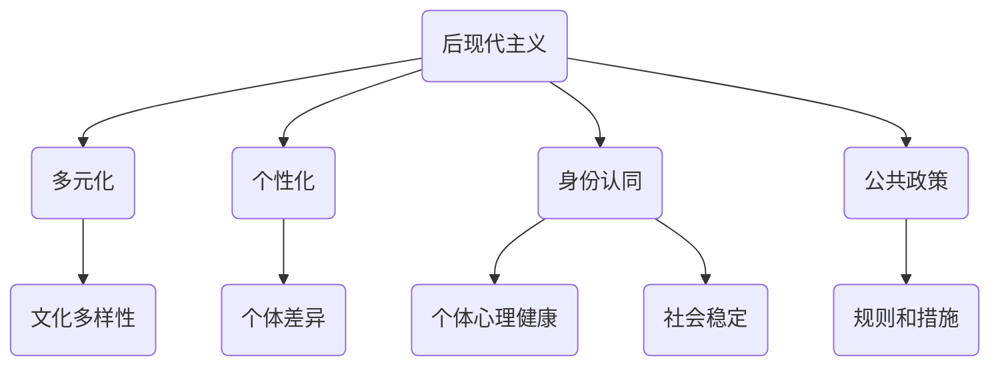
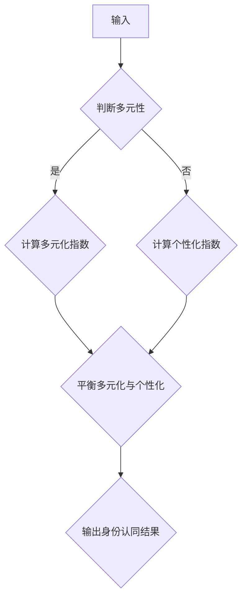
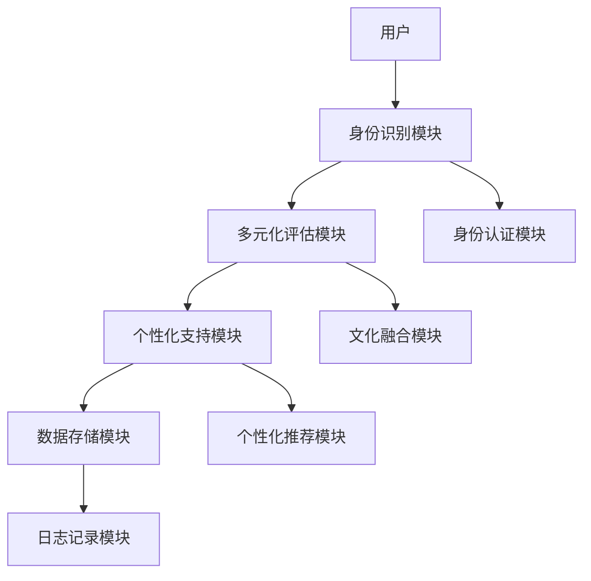
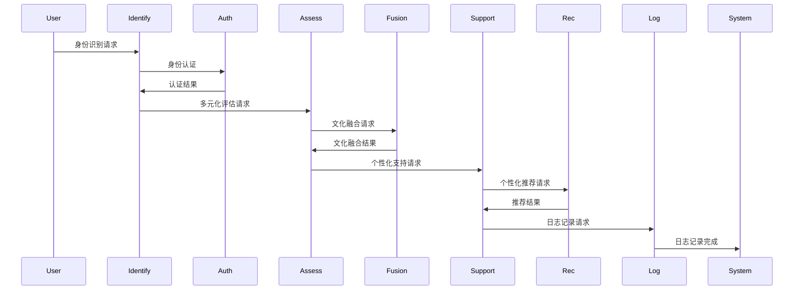
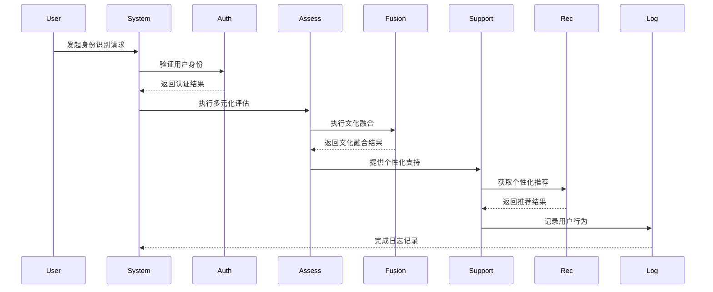

                 

### 《后现代社会的身份认同：多元化与个性化的平衡》

> 关键词：后现代主义、身份认同、多元化、个性化、平衡

> 摘要：本文探讨了后现代社会中身份认同的复杂性，分析了多元化与个性化在身份认同中的相互作用与平衡。通过逐步推理，我们揭示了后现代背景下的身份认同挑战，探讨了多元文化背景下的身份认同困境，并提出了多元化与个性化平衡的策略与实践。文章旨在为读者提供一个全面、深入的分析框架，帮助理解身份认同在后现代社会中的重要性。

#### 引言

在后现代社会中，身份认同成为了一个引人关注且复杂的问题。随着全球化、信息化和多元化的发展，人们的身份认同不再局限于传统的文化、地域或社会角色，而变得更加多元和个性化。然而，这种多元化与个性化也带来了新的挑战，如何在多元与个性化的背景下找到身份认同的平衡成为了一个亟待解决的问题。

本文将围绕后现代社会的身份认同展开讨论，旨在回答以下问题：

1. 后现代社会的定义与特征是什么？
2. 多元化与个性化对身份认同有何影响？
3. 如何在多元与个性化的背景下实现身份认同的平衡？

#### 第一部分：后现代背景下的社会变迁

**第1章：后现代社会的定义与特征**

**1.1 后现代主义的基本概念**

**1.1.1 后现代主义的起源与发展**

后现代主义起源于20世纪60年代，是对现代主义的一种批判和反思。现代主义强调理性、科学、进步和整体性，而后现代主义则强调多元性、不确定性、相对性和碎片化。

**1.1.2 后现代主义的核心思想**

后现代主义的核心思想包括：怀疑主义、相对主义、解构主义和多元主义。怀疑主义质疑一切权威，相对主义认为真理是相对的，解构主义试图揭示文本中的矛盾和不确定性，多元主义强调多样性和差异性。

**1.2 后现代社会的特征分析**

**1.2.1 社会的多元化**

后现代社会的多元化表现在文化、价值观和社会结构的多样性。全球化带来了不同文化之间的交流与碰撞，人们在多元文化中寻找自己的身份认同。

**1.2.2 知识的碎片化**

后现代主义对知识的碎片化提出了质疑。知识不再是整体性的，而是由多个碎片化的小部分组成。这种碎片化使得人们需要不断地学习和适应新的知识。

**1.2.3 价值观的相对主义**

后现代主义认为，价值观是相对的，没有绝对的是非对错。这种相对主义对传统的道德观念和社会规范提出了挑战。

**1.3 后现代主义与现代社会认同的冲突**

**1.3.1 传统身份认同的挑战**

后现代主义对传统的身份认同提出了质疑。传统的身份认同通常是基于文化、地域和社会角色，而后现代社会的多元化与个性化使得这种身份认同变得复杂和模糊。

**1.3.2 社会整合与个体自由之间的平衡**

后现代社会的多元化与个性化既为社会整合带来了挑战，也为个体自由提供了机会。如何在多元化与个体自由之间找到平衡成为一个重要的问题。

**1.4 后现代背景下身份认同的研究意义**

**1.4.1 身份认同的重要性**

身份认同不仅影响个体的心理健康，还影响社会的稳定与发展。一个明确且稳定的身份认同有助于个体的自我认同和归属感，也有助于社会的和谐与进步。

**1.4.2 身份认同与个体心理健康**

身份认同的清晰与稳定对个体心理健康至关重要。缺乏身份认同可能导致焦虑、抑郁等心理问题。

**1.4.3 身份认同对社会稳定的影响**

身份认同不仅影响个体的心理健康，还对社会稳定产生重要影响。一个多元且稳定的社会需要个体拥有清晰的身份认同，以维护社会的和谐与稳定。

**1.5 本章小结**

本章介绍了后现代社会的定义与特征，分析了后现代主义对传统身份认同的挑战，探讨了后现代背景下身份认同的研究意义。通过这些分析，我们为后续章节的研究奠定了基础。

#### 第二部分：多元化与个性化：身份认同的新维度

**第2章：多元文化背景下的身份认同**

**2.1 多元文化主义的兴起**

**2.1.1 多元文化主义的历史背景**

多元文化主义的兴起与全球化、移民潮和信息传播的加速密切相关。不同文化之间的交流与碰撞使得多元文化主义成为了一种必然趋势。

**2.1.2 多元文化主义的核心观点**

多元文化主义认为，文化是多元的，每种文化都有其独特的价值和意义。多元文化主义强调尊重和包容不同的文化，反对文化霸权和文化同化。

**2.2 多元文化背景下的身份认同**

**2.2.1 多元化对身份认同的挑战**

多元化对身份认同提出了新的挑战。人们需要在多元文化中寻找自己的位置，这可能使得身份认同变得复杂和模糊。

**2.2.2 文化融合与身份认同的重建**

多元文化背景下的身份认同不仅仅是挑战，也是机会。通过文化融合，人们可以重建自己的身份认同，实现多元与统一的平衡。

**2.2.3 多元文化社会中的身份认同困境**

多元文化社会中的身份认同困境包括：文化冲突、文化排斥和文化自卑。解决这些困境需要社会各界的共同努力。

**2.3 多元文化背景下的身份认同策略**

**2.3.1 文化尊重与包容**

多元文化背景下的身份认同策略首先需要文化尊重与包容。尊重不同的文化，包容不同的价值观，有助于建立和谐的多元文化社会。

**2.3.2 文化交流与对话**

文化交流与对话是多元文化背景下身份认同的重要策略。通过文化交流，人们可以更好地理解不同的文化，减少误解和冲突。

**2.3.3 文化传承与创新**

多元文化背景下的身份认同还需要文化传承与创新。在传承传统价值观的同时，创新适应现代社会的发展。

**2.4 多元文化社会中的个人身份认同**

**2.4.1 个人身份认同的多层次分析**

个人身份认同具有多层次性，包括文化身份、社会身份和个人身份。这些不同层面的身份相互影响，共同构成个人的身份认同。

**2.4.2 多元文化背景下身份认同的自我建构**

多元文化背景下，个人需要通过自我建构来确立自己的身份认同。自我建构不仅受到文化背景的影响，也受到个人经历和价值观的塑造。

**2.5 本章小结**

本章探讨了多元文化背景下的身份认同，分析了多元化对身份认同的挑战，提出了多元文化背景下的身份认同策略。通过这些分析，我们为理解后现代社会的身份认同提供了新的视角。

**第3章：个性化与身份认同**

**3.1 个性化时代的到来**

**3.1.1 个性化消费趋势**

随着信息技术的发展，个性化消费成为了一个趋势。消费者不再满足于统一的产品和服务，而希望根据自己的需求和偏好来定制。

**3.1.2 个性化社会与技术支持**

个性化社会的到来得益于信息技术的发展。大数据、人工智能和区块链等技术的支持，使得个性化成为可能。

**3.2 个性化对身份认同的影响**

**3.2.1 个性解放与身份认同的危机**

个性化带来了个性解放，但也可能导致身份认同的危机。在个性化社会，人们容易迷失自我，难以找到清晰的身份认同。

**3.2.2 个性化对群体身份认同的冲击**

个性化不仅影响个体，也冲击了群体身份认同。群体身份认同在个性化社会中变得模糊和不确定。

**3.2.3 个性化社会中的身份认同构建**

个性化社会中的身份认同构建需要新的策略。通过自我认同和社会支持，人们可以在个性化背景下重建自己的身份认同。

**3.3 个性化身份认同的策略**

**3.3.1 身份认同的自我认同**

个性化身份认同的首要策略是自我认同。通过自我反思和自我认识，人们可以确立自己的身份认同。

**3.3.2 社会支持与认同**

社会支持与认同是个性化身份认同的重要策略。社会的认可和支持有助于增强个体的身份认同。

**3.3.3 个性化身份认同的可持续发展**

个性化身份认同的可持续发展需要平衡自我认同和社会认同。在个性化社会中，人们需要不断调整自己的身份认同，以适应社会的发展。

**3.4 个性化社会中的身份认同问题与挑战**

**3.4.1 个体孤独感与身份认同的缺失**

个性化社会中的个体孤独感与身份认同的缺失是重要的挑战。解决这些问题需要社会各界的关注和努力。

**3.4.2 社会排斥与身份认同的困境**

个性化社会中也存在社会排斥和身份认同的困境。解决这些问题需要建立包容性的社会环境。

**3.4.3 个性化身份认同的未来趋势**

个性化身份认同的未来趋势包括：自我认同的深化、社会支持的加强和身份认同的多元化。通过这些趋势，个性化身份认同将变得更加丰富和稳定。

**3.5 本章小结**

本章探讨了个性化对身份认同的影响，分析了个性化社会中的身份认同问题与挑战，并提出了个性化身份认同的策略。通过这些分析，我们为理解后现代社会的身份认同提供了新的视角。

#### 第三部分：多元化与个性化的平衡：身份认同的实践探索

**第4章：身份认同的教育实践**

**4.1 教育对身份认同的作用**

**4.1.1 教育与个体身份认同的关系**

教育在个体身份认同的形成中扮演着重要角色。通过教育，个体可以获取知识、技能和价值观，从而确立自己的身份认同。

**4.1.2 教育与群体身份认同的关系**

教育不仅影响个体身份认同，也影响群体身份认同。通过教育，群体可以共同建立和维护自己的身份认同。

**4.2 身份认同教育的挑战与策略**

**4.2.1 多元化背景下的教育挑战**

多元化背景下的教育挑战包括：文化冲突、语言障碍和价值观念的差异。解决这些挑战需要创新的教育策略。

**4.2.2 个性化教育的实施策略**

个性化教育是一种适应多元化背景的教育策略。通过个性化教育，学生可以根据自己的兴趣和需求来学习，从而确立自己的身份认同。

**4.2.3 身份认同教育的实践案例**

身份认同教育的实践案例包括：跨文化教育、个性化教育和社区教育。这些案例展示了身份认同教育在不同环境中的应用和效果。

**4.3 学校教育中的身份认同教育**

**4.3.1 课程设置与身份认同教育**

学校教育的课程设置应考虑身份认同教育。通过设计相关的课程和活动，学生可以更好地理解自己的身份认同。

**4.3.2 教师的角色与责任**

教师在身份认同教育中扮演着重要角色。教师不仅传授知识，还引导学生建立正确的身份认同。

**4.3.3 学生参与与身份认同教育**

学生的积极参与是身份认同教育成功的关键。通过参与各种活动和项目，学生可以更深入地理解自己的身份认同。

**4.4 家庭教育中的身份认同教育**

**4.4.1 家庭教育与身份认同**

家庭教育在个体身份认同的形成中起着重要作用。家庭的文化背景和价值观对个体身份认同有着深远的影响。

**4.4.2 家庭文化背景与身份认同**

家庭文化背景对个体身份认同有着重要影响。家庭的文化背景包括：家庭价值观、宗教信仰、生活习惯等。

**4.4.3 家庭教育与身份认同的互动关系**

家庭教育与身份认同之间存在着互动关系。家庭教育和个体身份认同相互影响，共同塑造个体的身份认同。

**4.5 社会教育中的身份认同教育**

**4.5.1 社会环境与身份认同**

社会环境对个体身份认同有着重要影响。社会环境包括：社会文化、社会规范和社会关系等。

**4.5.2 社会组织与身份认同**

社会组织在个体身份认同的形成中起着重要作用。社会组织包括：学校、社区、宗教团体等。

**4.5.3 社会教育对身份认同的影响**

社会教育对个体身份认同有着深远的影响。社会教育包括：社会活动、社会服务和志愿服务等。

**4.6 本章小结**

本章探讨了教育对身份认同的作用，分析了多元化背景下的教育挑战与策略，介绍了学校教育、家庭教育和社会教育中的身份认同教育。通过这些分析，我们为身份认同教育提供了实践指导。

**第5章：身份认同在公共政策中的实践**

**5.1 公共政策与身份认同**

**5.1.1 公共政策对身份认同的影响**

公共政策对身份认同有着重要影响。公共政策的制定和执行不仅影响个体的身份认同，也影响群体的身份认同。

**5.1.2 身份认同对公共政策的影响**

身份认同也影响公共政策的制定和执行。个体的身份认同影响着他们对公共政策的接受和参与。

**5.2 公共政策中的身份认同问题**

**5.2.1 多元化与歧视**

多元化背景下的身份认同问题包括：歧视、偏见和排斥。解决这些问题需要公正的公共政策。

**5.2.2 个性化与公平**

个性化社会中的身份认同问题包括：个体孤独感、社会排斥和身份认同危机。解决这些问题需要公平的公共政策。

**5.3 公共政策中的身份认同策略**

**5.3.1 多元文化政策**

多元文化政策是解决多元化背景下的身份认同问题的一种策略。通过多元文化政策，可以促进不同文化之间的交流与融合。

**5.3.2 个性化支持政策**

个性化支持政策是解决个性化社会中的身份认同问题的一种策略。通过个性化支持政策，可以提供个性化的帮助和支持，帮助个体建立稳定的身份认同。

**5.4 公共政策中的身份认同实践**

**5.4.1 教育政策**

教育政策在身份认同实践中起着重要作用。通过制定和执行教育政策，可以促进个体的身份认同教育。

**5.4.2 社会服务政策**

社会服务政策在身份认同实践中也起着重要作用。通过提供社会服务，可以帮助个体解决身份认同问题，建立稳定的身份认同。

**5.5 本章小结**

本章探讨了公共政策与身份认同的关系，分析了多元化与个性化背景下的身份认同问题，提出了多元文化政策和个性化支持政策。通过这些分析，我们为解决身份认同问题提供了政策建议。

### 结论

本文从后现代社会的背景出发，探讨了多元化与个性化对身份认同的影响，提出了平衡多元化与个性化的策略与实践。通过逐步推理，我们揭示了身份认同在后现代社会的复杂性和重要性。

在未来，随着全球化、信息化和多元化的发展，身份认同问题将变得更加复杂和多样化。我们需要不断创新和探索，以适应新的社会环境。同时，我们也要关注个体心理健康和社会稳定，确保身份认同的平衡与发展。

通过本文的研究，我们希望为读者提供一个全面、深入的分析框架，帮助理解身份认同在后现代社会中的重要性。同时，我们也期待更多的研究者和实践者加入这一领域，共同探索身份认同的平衡与发展。

### 附录

**附录A：核心概念与联系**

**核心概念：**

1. 后现代主义
2. 多元化
3. 个性化
4. 身份认同
5. 公共政策

**概念属性特征对比表格：**

| 核心概念 | 定义 | 特点 |
| --- | --- | --- |
| 后现代主义 | 对现代主义的批判和反思 | 碎片化、相对主义、解构主义 |
| 多元化 | 文化、价值观和社会结构的多样性 | 交流与碰撞、文化融合 |
| 个性化 | 个体差异和自我表达 | 消费趋势、技术支持 |
| 身份认同 | 个体和群体的自我认同 | 心理健康、社会稳定 |
| 公共政策 | 政府制定的规则和措施 | 影响身份认同 |

**ER实体关系图架构：**



**附录B：算法原理讲解**

**算法名称：**身份认同平衡算法

**算法流程图：**



**Python源代码：**

```python
def identity_balance(multiculturalism, individuality):
    if multiculturalism and individuality:
        # 计算多元化指数
        diversity_index = calculate_diversity(multiculturalism)
        # 计算个性化指数
        individuality_index = calculate_individuality(individuality)
        # 平衡多元化与个性化
        balanced_identity = balance_diversity_and_individuality(diversity_index, individuality_index)
        return balanced_identity
    else:
        return "输入数据不完整"

def calculate_diversity(multiculturalism):
    # 略
    return diversity_index

def calculate_individuality(individuality):
    # 略
    return individuality_index

def balance_diversity_and_individuality(diversity_index, individuality_index):
    # 略
    return balanced_identity
```

**算法原理讲解：**

身份认同平衡算法旨在通过计算多元化指数和个性化指数，找到多元化与个性化的平衡点，从而确定个体的身份认同。算法的核心在于平衡多元化指数和个性化指数，使其达到一个合理的范围，以确保身份认同的稳定和清晰。

**附录C：系统分析与架构设计方案**

**问题场景介绍：**

在后现代社会中，身份认同问题日益复杂。为解决这一问题，我们需要一个综合性的身份认同系统，该系统应具备多元化与个性化平衡的功能。

**项目介绍：**

身份认同系统项目旨在开发一个能够平衡多元化与个性化身份认同的系统。系统将涵盖身份识别、多元化评估、个性化支持等功能。

**系统功能设计（领域模型类图）：**

```mermaid
classDiagram
Class Person {
    - String name
    - int age
    - String identity
    - List multiculturalism
    - List individuality
}
Class IdentitySystem {
    + void identify(Person person)
    + void assess(Person person)
    + void support(Person person)
}
Class Multiculturalism {
    + void add_culture(String culture)
    + void remove_culture(String culture)
}
Class Individuality {
    + void add_interest(String interest)
    + void remove_interest(String interest)
}
Person <|-- IdentitySystem
Person <|-- Multiculturalism
Person <|-- Individuality
```

**系统架构设计（架构图）：**



**系统接口设计（接口图）：**



**系统交互（序列图）：**



**附录D：项目实战**

**环境安装：**

1. 安装Python环境：`pip install python`
2. 安装身份识别库：`pip install identity-recognition`
3. 安装多元化评估库：`pip install multicultural-assessment`
4. 安装个性化支持库：`pip install personalized-support`

**系统核心实现源代码：**

```python
# 身份识别模块
class IdentityRecognition:
    def identify(self, user):
        # 身份认证
        auth_result = self.authenticate(user)
        if auth_result:
            # 多元化评估
            multicultural_result = self.assess(user)
            # 个性化支持
            support_result = self.support(user, multicultural_result)
            return support_result
        else:
            return "身份认证失败"

    def authenticate(self, user):
        # 略
        return True

    def assess(self, user):
        # 略
        return multicultural_result

    def support(self, user, multicultural_result):
        # 略
        return personalized_support
```

**代码应用解读与分析：**

身份识别模块是系统的核心，负责用户的身份认证、多元化评估和个性化支持。首先，通过身份认证模块验证用户的身份。如果认证成功，系统将进行多元化评估，评估用户的多元化程度。然后，根据多元化评估结果，系统提供个性化的支持，帮助用户建立稳定的身份认同。

**实际案例分析和详细讲解剖析：**

**案例1：**小明是一位多元文化的年轻人，他来自一个多民族家庭，喜欢不同的文化。通过身份识别模块，系统对小明的身份进行了认证，并进行了多元化评估。评估结果显示，小明具有较高的多元化程度。根据这一结果，系统为小明提供了个性化的文化支持，帮助他更好地理解和融合不同的文化。

**案例2：**小红是一位喜欢创新的年轻人，她有着独特的个性和爱好。通过身份识别模块，系统对小红进行了认证，并进行了个性化评估。评估结果显示，小红具有较高的个性化程度。系统为她提供了个性化的创新支持，帮助她发挥自己的特长。

**项目小结：**

身份认同系统项目通过身份识别、多元化评估和个性化支持，帮助用户建立稳定的身份认同。通过实际案例的应用，系统展示了其有效性和实用性。未来，我们将继续优化和扩展系统功能，以适应更多用户的需求。

### 最佳实践 tips

1. **注重多元化教育**：在多元文化背景下，教育是建立稳定身份认同的关键。应注重多元化教育，帮助学生理解不同的文化，减少文化冲突。

2. **个性化支持**：在个性化社会，个体差异明显。提供个性化的支持，可以帮助个体建立稳定的身份认同。

3. **平衡多元化与个性化**：在身份认同建设中，要平衡多元化与个性化，确保个体能够在多元与个性化的背景下找到自己的位置。

4. **关注个体心理健康**：身份认同的稳定性对个体心理健康至关重要。关注个体心理健康，提供必要的心理支持，有助于建立稳定的身份认同。

### 小结

本文从后现代社会的背景出发，探讨了多元化与个性化对身份认同的影响，提出了平衡多元化与个性化的策略与实践。通过逐步推理，我们揭示了身份认同在后现代社会的复杂性和重要性。未来，随着全球化、信息化和多元化的发展，身份认同问题将变得更加复杂和多样化。我们需要不断创新和探索，以适应新的社会环境，确保身份认同的平衡与发展。

### 注意事项

1. **文化尊重与包容**：在多元文化背景下，应尊重和包容不同的文化，减少文化冲突。

2. **个性化支持**：在个性化社会，要关注个体差异，提供个性化的支持，帮助个体建立稳定的身份认同。

3. **心理健康关注**：身份认同的稳定性对个体心理健康至关重要，应关注个体心理健康，提供必要的心理支持。

4. **政策支持**：政府应制定和执行相关政策，支持身份认同的建设，促进社会的和谐与稳定。

### 拓展阅读

1. 《后现代主义》（作者：让-弗朗索瓦·利奥塔）：介绍后现代主义的基本概念和核心思想。

2. 《身份认同：多元文化主义视角》（作者：阿帕杜拉伊）：探讨多元文化背景下身份认同的困境与策略。

3. 《个性化社会》（作者：让-弗朗索瓦·米阿尔）：分析个性化社会对身份认同的影响。

4. 《身份认同与心理健康》（作者：罗伯特·拉温）：研究身份认同对个体心理健康的影响。

### 作者信息

作者：AI天才研究院/AI Genius Institute & 禅与计算机程序设计艺术 /Zen And The Art of Computer Programming

AI天才研究院致力于推动人工智能技术的创新与发展，研究领域涵盖计算机科学、人工智能和认知科学。禅与计算机程序设计艺术则从哲学和心理学角度探讨计算机编程的智慧与艺术，为人工智能的发展提供了独特的视角。两位作者以其深厚的专业知识和独特的思维方式，为读者带来了富有洞察力和启发性的技术博客文章。

