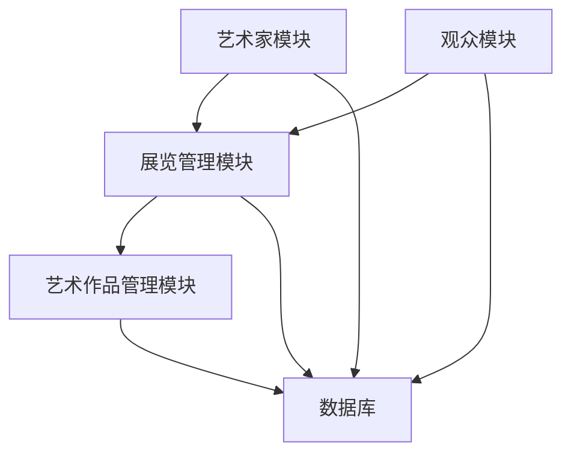
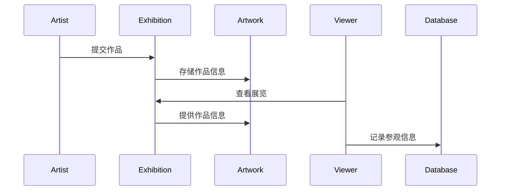

                 

## 引言

### 后现代艺术的起源与发展

后现代艺术，作为一个充满争议和挑战的领域，起源于20世纪中叶。它是对现代主义艺术的一种批判和反思，试图打破传统的艺术界限和规则。后现代主义的概念与历史背景可以从以下几个方面进行阐述。

首先，后现代主义是在现代主义之后兴起的，是对现代主义的一些核心观念，如艺术创作的客观性、价值中立性以及艺术家的独特性等的一种反思和质疑。现代主义艺术强调艺术家的个人情感和主观体验，而后现代主义则更加注重社会文化背景和艺术作品与社会之间的互动关系。

其次，后现代艺术的特点之一是多样性。它不仅涵盖了绘画、雕塑、建筑等传统艺术形式，还涉足了摄影、电影、表演、装置艺术等新兴领域。这种多样性的特点使得后现代艺术具有广泛的包容性和开放性。

再次，后现代艺术强调跨学科性和跨文化性。它试图通过将不同学科和文化的元素融合在一起，打破学科和文化之间的壁垒，创造出全新的艺术形式和表达方式。

最后，后现代艺术对社会文化有着深刻的反思和批判。它关注社会现实，对权力、性别、种族等社会问题进行探讨和反思，试图揭示社会的不公和矛盾。

总的来说，后现代艺术的发展是与社会文化的变革紧密相连的。它不仅是对艺术创作的一种创新和探索，也是对社会现实的一种反映和回应。

### 后现代艺术的特点与趋势

后现代艺术的特点和趋势可以从以下几个方面进行探讨：

首先，后现代艺术打破了传统的艺术界限和规则。它不再局限于某种特定的艺术形式，而是将不同形式的元素融合在一起，创造出独特的艺术作品。例如，有些艺术家会将绘画、雕塑和装置艺术结合在一起，创造出多维度的艺术体验。

其次，后现代艺术强调多元性。它不再仅仅关注艺术家的个人情感和主观体验，而是更加关注社会文化背景和艺术作品与社会之间的互动关系。这种多元性使得后现代艺术具有更广泛的社会意义和影响力。

再次，后现代艺术关注社会现实。它试图通过艺术作品揭示社会现实的问题和矛盾，对社会现象进行批判和反思。这种关注社会现实的特点使得后现代艺术具有强烈的社会责任感和现实意义。

最后，后现代艺术的趋势之一是数字化。随着科技的发展，数字化艺术逐渐成为一种重要的艺术形式。艺术家们利用计算机技术和互联网平台，创造出全新的艺术形式和表达方式，使得艺术作品可以更加广泛地传播和互动。

总的来说，后现代艺术的特点和趋势是多样性和创新性。它不断地挑战和突破传统的艺术界限，试图创造出更加多元、开放和富有创造力的艺术形式。

### 后现代艺术与社会文化的关系

后现代艺术与社会文化的关系是复杂而深刻的。首先，后现代艺术是对社会文化的反映和回应。它关注社会现实，揭示社会问题，对社会现象进行批判和反思。例如，一些后现代艺术作品通过对权力、性别、种族等社会问题的探讨，揭示了社会的不公和矛盾。

其次，后现代艺术对社会文化有重要的影响。它不仅改变了人们的艺术观念和审美标准，还推动了社会文化的变革。后现代艺术强调多元性和开放性，打破了传统艺术形式的界限，促进了不同文化和学科之间的交流和融合。

此外，后现代艺术还与社会文化之间存在互动关系。艺术作品不仅是对社会现实的反映，也会影响和塑造社会文化。通过艺术作品的传播和互动，人们可以更好地理解社会文化，从而推动社会文化的进步和发展。

总的来说，后现代艺术与社会文化之间的关系是相互影响、相互促进的。它既是对社会文化的反映和回应，也是对社会文化的推动和变革。

## 后现代艺术的表现形式

### 传统艺术形式的变革

后现代艺术不仅挑战了传统的艺术观念，也在传统艺术形式上进行了创新和变革。首先，绘画和雕塑作为传统艺术的主要形式，在后现代主义浪潮中经历了深刻的转变。绘画不再仅仅是二维空间的再现，而是成为了一种探索时间、空间和感官体验的多维度表达方式。例如，涂鸦艺术、行为艺术和影像绘画等新兴艺术形式，将绘画从平面拓展到了三维空间，甚至融合了时间元素。

在雕塑方面，后现代艺术家们打破了传统雕塑的静态特征，将其与动态元素相结合。行为雕塑、互动雕塑和动态装置艺术等，都是后现代雕塑的创新体现。这些艺术形式不仅让观众能够观赏雕塑作品，还能通过互动参与其中，从而增强了作品的互动性和参与感。

#### 绘画与雕塑的变革

绘画方面的变革主要表现在以下几个方向：

1. **材料与技术的多样化**：后现代绘画不再局限于传统的颜料和画布，而是采用了各种新材料和技术，如树脂、塑料、金属和数码技术。这种多样化的材料和技术使得绘画的表现形式更加丰富，视觉效果更加独特。

2. **观念与思想的融入**：后现代绘画强调艺术家个人的观念和思想，将绘画作为一种表达和探讨社会、文化、政治等问题的手段。例如，安迪·沃霍尔的波普艺术，通过对明星和文化符号的重复和复制，表达了对消费文化和大众文化的批判。

3. **形式的自由化**：后现代绘画不再遵循传统的构图规则和色彩搭配，而是追求形式的自由化和多样性。艺术家们通过抽象、表现主义和超现实主义等手法，创造出独特的视觉语言，打破了传统艺术的界限。

雕塑方面的变革同样显著：

1. **互动性与参与性**：后现代雕塑强调观众的参与和互动，将雕塑从静态展示转变为动态体验。例如，克里斯托夫·詹姆森的“门”系列雕塑，通过设置在公共场所的大型门，让观众在参与互动中体验到艺术的趣味性。

2. **环境融合**：后现代雕塑往往与周围环境相结合，成为一种环境艺术。艺术家们利用自然环境和社会环境，创造出与空间和环境相互作用的雕塑作品。这种环境融合的特点，使得雕塑不仅是一种艺术形式，更是一种空间体验。

3. **材料创新**：后现代雕塑在材料选择上也展现了创新性。除了传统的石雕和金属雕，塑料、玻璃、木材等新材料被广泛应用于雕塑创作中。这些新材料的运用，不仅丰富了雕塑的表现力，也拓展了雕塑的视觉和触觉体验。

总的来说，后现代艺术在传统艺术形式上的变革，体现了艺术家们对传统艺术观念的挑战和对艺术表现形式的创新探索。通过多样化的材料、技术和形式，后现代艺术打破了传统艺术的界限，创造出一种全新的艺术体验。

#### 建筑的变革

建筑在后现代艺术中的变革同样引人注目。后现代建筑不再局限于传统的美学原则和功能需求，而是融合了艺术家的理念和创新思维，创造出独特的建筑形式和空间体验。以下是一些后现代建筑的特点：

1. **形式自由**：后现代建筑强调形式的自由化，建筑师们不再遵循传统的对称和规则，而是通过非对称、不规则的形式创造出独特的视觉效果。例如，弗兰克·盖里设计的毕尔巴鄂古根海姆博物馆，以其扭曲、折叠的金属外壳，打破了传统建筑的界限，成为现代建筑的标志性作品。

2. **材料创新**：后现代建筑在材料选择上也有显著的创新。传统建筑通常使用砖、石、木材等材料，而后现代建筑则采用了玻璃、金属、塑料等现代材料。这些新材料不仅使建筑具有更高的功能性，还赋予了建筑更多的美学价值。

3. **功能与美学的融合**：后现代建筑强调功能与美学的融合，建筑师们通过创新的设计理念，将建筑的功能需求与艺术美学相结合。例如，扎哈·哈迪德设计的伦敦瑞士再保险公司总部，通过复杂的几何形态和透明的玻璃结构，创造出一种既实用又美观的建筑形式。

4. **环境融合**：后现代建筑注重与周围环境的融合，通过建筑与自然环境的和谐共存，创造出一种与自然相融的空间体验。例如，彼得·沃克设计的新加坡滨海湾金沙酒店，通过大面积的绿化和水体设计，将建筑与自然环境融为一体，形成了一个生态友好的建筑典范。

5. **互动性**：后现代建筑还强调观众的参与和互动。一些建筑作品不仅是一个静态的物体，而是通过与观众的互动来实现的。例如，丹·博伊尔设计的“云门”（又称“豆子”），通过反射和折射光影，让观众可以在建筑表面创造出不同的视觉效果，增强了建筑的互动性和参与感。

总的来说，后现代建筑在形式、材料、功能、环境以及互动性等方面都展现了显著的变革和创新。通过这些变革，后现代建筑不仅成为了一种独特的艺术形式，也为现代城市生活带来了新的空间体验。

#### 设计的变革

后现代艺术在设计领域的变革同样值得关注。设计不再仅仅是功能和美学的结合，而是成为了一种表达艺术家观念和思想的手段。以下是一些后现代设计的特点：

1. **形式自由**：后现代设计强调形式的自由化，不再遵循传统的对称和规则，而是追求独特性和个性。例如，菲利普·斯塔克设计的Juicy Salif柠檬榨汁器，以其独特的不规则形态和鲜艳的色彩，打破了传统设计的束缚。

2. **材料创新**：后现代设计在材料选择上展现了创新性，不再局限于传统的金属、木材等材料，而是采用了塑料、玻璃、纺织品等现代材料。这些新材料不仅使设计作品具有更高的功能性，还赋予了作品更多的美学价值。

3. **功能与美学的融合**：后现代设计注重功能与美学的融合，通过创新的设计理念，将功能需求与艺术美学相结合。例如，马克斯·福斯特设计的Aeolus风扇，不仅具有高效的功能性，还通过其优雅的形态和色彩，成为了一种艺术品。

4. **互动性**：后现代设计强调观众的参与和互动。一些设计作品不仅是一个静态的物体，而是通过与观众的互动来实现的。例如，福斯特和范德罗赫设计的SmartBed，通过内置的传感器和控制系统，让用户可以根据自己的需求调节床的硬度和高度，增强了设计的互动性和个性化。

5. **跨界融合**：后现代设计还涉足了多个领域，如时尚、艺术、科技等，形成了跨界融合的特点。例如，苹果公司的设计团队，通过将科技与艺术设计相结合，创造出了众多具有高度创新性和美感的电子产品。

总的来说，后现代设计在形式、材料、功能、互动性和跨界融合等方面都展现了显著的变革和创新。通过这些变革，后现代设计不仅成为了一种独特的艺术形式，也为现代生活带来了新的设计体验。

### 非传统艺术的表现形式

后现代艺术不仅在传统艺术形式上进行了革新，还在非传统艺术领域展现了其多样性和创新性。非传统艺术包括视觉艺术、表演艺术和电子艺术等，它们以其独特的表现方式和深刻的内涵，丰富了后现代艺术的内涵。

#### 视觉艺术

视觉艺术在后现代艺术中扮演了重要角色。后现代视觉艺术强调艺术家主观情感的抒发和社会现实的批判，形式多样，手法创新。例如，波普艺术通过模仿和复制大众文化符号，揭示了消费社会的荒谬性。安迪·沃霍尔的《玛丽莲·梦露》系列作品，通过重复和复制这位明星的形象，探讨了大众文化的传播和消费现象。

另一个重要的视觉艺术流派是装置艺术。装置艺术以实物、材料和空间为媒介，通过布置和装置创造出独特的艺术氛围和视觉体验。艺术家们利用各种材料和媒介，如灯光、声音、影像、物体等，创造出富有表现力和思想深度的艺术作品。例如，克里斯托夫·詹姆森的“包裹”系列装置，通过包裹建筑和自然景观，探讨了人与环境的关系。

#### 表演艺术

表演艺术在后现代艺术中也占据了重要地位。表演艺术强调观众的参与和互动，打破了传统艺术的边界。行为艺术是表演艺术的一种重要形式，它通过艺术家在公众场合的行为表现，探讨社会现象和个人情感。例如，马塞洛·马斯卡利的《无题》表演，通过裸体和涂满颜料的行为，探讨了人性、社会规范和自由表达的主题。

另外，即兴表演也是后现代表演艺术的一种重要形式。即兴表演强调现场性和创造性，表演者通过即时的互动和反应，创造出独一无二的艺术体验。例如，即兴喜剧团体通过即兴对话和情景设定，创造出令人捧腹的喜剧效果，让观众在参与中体验到艺术的魅力。

#### 电子艺术

电子艺术是后现代艺术中一个极具创新性的领域。随着计算机技术和数字技术的发展，电子艺术逐渐成为一种重要的艺术形式。电子艺术利用计算机程序和数字技术，创造出互动性和参与感强的艺术作品。

数字绘画是电子艺术的一种重要形式。数字绘画不仅具有传统绘画的美学价值，还能通过计算机技术实现各种复杂的视觉效果和互动功能。例如，数字艺术家通过使用软件工具，创造出具有动态效果和交互性的艺术作品，让观众可以参与其中，体验艺术创作的乐趣。

虚拟现实（VR）和增强现实（AR）也是电子艺术的重要表现形式。VR和AR技术通过虚拟环境和现实环境的融合，创造出沉浸式的艺术体验。例如，一些艺术家通过VR技术，创造出虚拟的艺术展览和体验空间，让观众可以在虚拟世界中感受艺术作品的魅力。

总的来说，非传统艺术以其多样性和创新性，丰富了后现代艺术的内涵。视觉艺术、表演艺术和电子艺术等非传统艺术形式，通过独特的表现方式和深刻的内涵，为后现代艺术注入了新的活力和思想。

### 后现代艺术的哲学思考

后现代艺术的哲学思考是对传统艺术观念和方法的深刻反思和批判。它不仅仅关注艺术作品的审美价值和艺术家的创作过程，更强调艺术作品与社会文化之间的互动关系。以下是对后现代主义哲学启示的探讨，以及艺术家如何挑战传统观念，以及后现代艺术的伦理问题的分析。

#### 后现代主义哲学的启示

后现代主义哲学对后现代艺术产生了深远的影响。首先，它挑战了现代主义的核心观念，如艺术创作的客观性和艺术家的独特性。后现代主义认为，艺术作品并不是由艺术家独立创作出来的，而是与社会、文化、政治等各个方面密切相关的。艺术家不再是高高在上的创作者，而是社会中的一员，他们的创作过程和作品都受到社会环境的影响。

其次，后现代主义哲学强调多元性和包容性。它反对单一的文化和价值观，主张通过多种视角和声音来探讨和表达艺术。这种多元性不仅体现在艺术作品的形式和内容上，也体现在艺术家的身份和背景上。后现代艺术鼓励不同文化、不同学科、不同社会阶层的艺术家进行对话和交流，从而创造出更加丰富和多样化的艺术作品。

再次，后现代主义哲学强调解构主义观念。解构主义认为，传统的艺术形式和结构是可以通过批判和重构来打破和重新构建的。后现代艺术家通过解构传统艺术形式，创造出新的艺术形式和表达方式。例如，他们可以打破绘画和雕塑的界限，将两者融合在一起，创造出新的视觉体验。

最后，后现代主义哲学关注艺术作品的参与性和互动性。它认为，艺术作品不仅仅是被观赏的对象，更是观众参与和互动的过程。通过观众的参与和互动，艺术作品可以产生新的意义和价值。

#### 艺术家如何挑战传统观念

后现代艺术家通过多种方式挑战传统观念，以下是一些具体的例子：

1. **形式上的突破**：后现代艺术家在形式上进行了大胆的实验和突破。他们不再局限于传统的绘画和雕塑，而是尝试将不同艺术形式融合在一起，创造出新的艺术作品。例如，将绘画与装置艺术相结合，或将表演艺术与视觉艺术相结合。

2. **观念的表达**：后现代艺术家强调艺术作品的观念性。他们的创作过程不再是单纯的艺术创作，而是对社会现实、文化现象、政治问题等进行思考和表达的过程。通过艺术作品，他们试图揭示社会问题，引发观众对现实问题的思考和讨论。

3. **角色的转变**：后现代艺术家改变了艺术家的角色，不再将自己视为孤独的创作者，而是与社会互动的参与者。他们的创作过程和作品都是与社会环境相互作用的产物。艺术家通过与观众、与社会、与政治、与文化等方面的互动，创造出具有深刻社会意义的艺术作品。

4. **多样性的追求**：后现代艺术家追求多样性和包容性。他们主张通过不同文化、不同学科、不同社会阶层的视角来探讨艺术，从而创造出更加丰富和多样化的艺术作品。

#### 后现代艺术的伦理问题

后现代艺术在挑战传统观念的同时，也引发了一系列伦理问题。以下是对后现代艺术的伦理问题的分析：

1. **艺术与道德的界限**：后现代艺术往往涉及一些敏感和争议性的主题，如性别、种族、政治等。这些作品可能会挑战传统道德观念，引发道德争议。例如，一些行为艺术作品可能会被认为是对某些群体的侮辱或歧视，从而引发道德质疑。

2. **艺术与社会的责任**：后现代艺术强调艺术家与社会之间的互动关系，艺术家在创作过程中需要考虑其作品对社会的影响。然而，一些后现代艺术作品可能会对社会产生负面影响，例如引发社会恐慌或加剧社会分裂。这要求艺术家在创作过程中承担起社会责任。

3. **艺术家的自我表达与公众接受**：后现代艺术家强调自我表达的自由，但他们也需要考虑公众的接受程度。一些极端和先锋的艺术作品可能会被公众视为难以理解和接受的，从而影响艺术家在公众中的形象和声誉。

总的来说，后现代艺术的哲学思考对传统艺术观念和方法提出了深刻的挑战，同时也引发了一系列伦理问题。艺术家在创作过程中需要平衡自我表达与社会责任，以创造出既具有艺术价值又具有社会意义的作品。

## 后现代艺术节的案例研究

### 国内外知名后现代艺术节

后现代艺术节作为一种新型的艺术形式，在全球范围内产生了深远的影响。以下介绍一些国内外知名的、具有重要影响力的后现代艺术节。

#### 纽约现代艺术博物馆

纽约现代艺术博物馆（MoMA）是世界上最著名的现代艺术博物馆之一，也是后现代艺术节的重要举办地之一。每年的现代艺术展览吸引了来自世界各地的艺术家和观众。MoMA的后现代艺术节以其创新性和前瞻性而著称，展示了众多前卫的艺术作品，涵盖了绘画、雕塑、装置艺术、行为艺术等多个领域。

#### 巴塞尔艺术博览会

巴塞尔艺术博览会是世界上最著名的艺术博览会之一，每年吸引全球顶尖的画廊、收藏家和艺术品买家。巴塞尔艺术博览会不仅展示了传统艺术品，还设有专门的区域展示后现代艺术作品。这些作品通常具有创新性和实验性，反映了后现代艺术的发展趋势和最新成果。

#### 维尔纽斯双年展

维尔纽斯双年展是东欧地区最具影响力的艺术展览之一，每年吸引来自世界各地的艺术家和观众。维尔纽斯双年展特别注重后现代艺术的展示和推广，通过举办各种展览、研讨会和论坛，促进了后现代艺术的发展和国际交流。

### 艺术节的组织与管理

后现代艺术节的成功离不开有效的组织与管理。以下是对艺术节组织与管理的关键方面的分析：

#### 艺术节的主题与内容策划

艺术节的主题与内容策划是成功举办艺术节的关键。组织者需要根据时代背景和社会需求，设定一个具有前瞻性和创新性的主题，以此为基础策划艺术展览、表演、讲座等多种活动。例如，一个关于“数字艺术”的主题可以涵盖虚拟现实、增强现实、数字绘画等不同领域，吸引各类艺术家和观众。

#### 艺术节的参展与评审

艺术节的参展与评审是确保艺术质量的关键环节。组织者需要建立一套完善的评审机制，确保参展艺术家的作品具有创新性和艺术价值。评审过程通常包括初选、复选和终选等多个阶段，通过专家评审团和公众投票等多种方式，选出最具代表性的艺术作品参展。

#### 艺术节的市场推广与传播

艺术节的市场推广与传播是吸引观众和赞助商的重要手段。组织者可以通过多种渠道进行宣传，如社交媒体、传统媒体、艺术杂志等，提高艺术节的知名度和影响力。此外，组织者还可以与相关机构和企业合作，通过赞助、合作推广等方式，为艺术节提供资金和资源支持。

总的来说，艺术节的组织与管理需要综合考虑主题策划、参展评审、市场推广等多个方面，以确保艺术节的顺利进行和成功举办。通过有效的组织与管理，艺术节可以成为一个展示和推广后现代艺术的重要平台，促进艺术的发展和交流。

### 艺术节的组织与管理

#### 艺术节的主题与内容策划

艺术节的策划是成功举办的关键，主题的设定必须紧密围绕当代社会文化趋势，以及艺术界的最新动向。首先，策划团队需要深入分析社会文化背景，确定一个具有深刻意义和广泛吸引力的主题。例如，“技术与艺术的交汇”可以作为主题，探讨数字艺术、虚拟现实、增强现实等前沿艺术形式。接下来，策划团队应根据主题制定详细的内容策划方案，包括展览、表演、讲座、研讨会等活动的安排。每个活动都需要明确的目标和预期效果，确保艺术节的整体内容丰富、层次分明。

#### 艺术节的参展与评审

艺术节的参展与评审是确保艺术质量的核心环节。首先，组织者需要建立一个权威的评审团，由国内外知名艺术家、学者和评论家组成。评审团的任务是审核参展作品，确保其具有创新性和艺术价值。评审过程通常分为初选、复选和终选三个阶段。初选阶段，评审团根据作品提交的资料进行初步筛选；复选阶段，评审团对入围作品进行深入评审，通过实地考察和讨论确定最终入选作品；终选阶段，评审团根据作品的艺术性、创新性和主题契合度进行最终评定。

评审过程中，组织者还需要设立评审标准和评审规则，以确保评审的公平性和透明性。评审标准可以包括艺术性、创新性、技术实现、观众互动性等多个方面。评审规则则明确评审的具体流程和评审团的权利与义务，确保评审过程的有序进行。

#### 艺术节的市场推广与传播

艺术节的市场推广与传播是吸引观众和赞助商的重要手段。首先，组织者需要制定详细的市场推广计划，包括宣传策略、媒体渠道选择、社交媒体推广等。通过多种渠道进行广泛宣传，可以提高艺术节的知名度和影响力。例如，可以通过官方网站、社交媒体平台发布艺术节的相关信息，吸引观众的关注。此外，还可以与媒体合作，通过新闻报道、专题报道等形式，深入介绍艺术节的主题和亮点。

其次，组织者可以通过与相关机构和企业合作，吸引赞助商的支持。赞助商不仅可以为艺术节提供资金和资源支持，还可以通过品牌宣传和推广，提升自身品牌形象。例如，可以与知名画廊、艺术品公司、科技企业等进行合作，共同推广艺术节，实现互利共赢。

此外，组织者还可以通过开展艺术教育项目、举办艺术工作坊等方式，吸引更多的观众和参与者。这些活动不仅能够增强观众的参与感，还可以提高艺术节的知名度和社会影响力。

总的来说，艺术节的组织与管理需要综合考虑主题策划、参展评审、市场推广等多个方面。通过精心策划、严格评审和有效推广，艺术节可以成为一个展示和推广后现代艺术的重要平台，促进艺术的发展和交流。

## 后现代艺术对创意产业的推动作用

### 创意产业的概念与特点

创意产业，也被称为创意经济或创意工业，是指以创意为核心资源，通过创新和创意活动创造价值的经济部门。它涵盖了广泛的行业，包括设计、媒体、音乐、艺术、时尚、广告、建筑等。创意产业的特点主要体现在以下几个方面：

首先，创意产业注重创新和创意。与传统的制造业和服务业不同，创意产业的核心是通过创新和创意来创造价值。这种创新不仅体现在产品和服务的设计上，还包括商业模式、营销策略等多个方面。

其次，创意产业具有很强的跨界性和融合性。创意产业往往跨越不同的领域和行业，将不同的创意元素进行整合和创新。例如，音乐与视觉艺术、建筑与设计、科技与艺术等领域的结合，创造出新的创意产品和服务。

再次，创意产业具有高度的个性化和社会性。创意产业的产品和服务通常具有鲜明的个性特征，能够满足消费者独特的需求。同时，创意产业强调与社会的互动和参与，通过艺术、文化等形式影响和引导社会文化。

### 后现代艺术与创意产业的互动

后现代艺术与创意产业的互动是一个双向的过程，一方面后现代艺术为创意产业提供了丰富的创意元素和灵感，另一方面创意产业也为后现代艺术提供了展示和传播的平台。

首先，后现代艺术为创意产业提供了丰富的创意元素。后现代艺术强调多元性、开放性和跨界性，这些特点使得后现代艺术成为创意产业的重要灵感来源。例如，设计师可以从后现代绘画中提取独特的色彩和构图，用于产品设计和广告创意；音乐家可以从后现代音乐中汲取新颖的节奏和旋律，创作出独特的音乐作品。

其次，创意产业为后现代艺术提供了展示和传播的平台。随着科技的发展，创意产业利用各种媒介和平台，如互联网、社交媒体、虚拟现实等，为后现代艺术提供了更广泛的传播渠道。例如，通过互联网和社交媒体，后现代艺术家可以迅速将作品传播到世界各地，吸引更多的观众和粉丝。

此外，创意产业中的各种活动，如艺术展览、音乐会、设计比赛等，也为后现代艺术提供了展示和交流的机会。这些活动不仅能够提升后现代艺术的知名度，还能促进艺术家之间的交流和合作，推动后现代艺术的发展。

### 后现代艺术对创意产业的影响

后现代艺术对创意产业的影响是深远而广泛的。首先，后现代艺术推动了创意产业的发展。后现代艺术的创新性和多样性，为创意产业提供了丰富的创意资源，激发了创意产业的创新活力。例如，许多创意产品和服务的设计灵感来源于后现代艺术，这种跨界融合为创意产业注入了新的活力。

其次，后现代艺术改变了创意产业的商业模式。传统的创意产业商业模式往往是基于作品的销售和展示，而后现代艺术则更注重与观众和市场的互动。例如，通过艺术展览、工作坊、互动体验等方式，后现代艺术家能够直接与观众互动，创造出更加个性化的艺术作品和服务。

再次，后现代艺术提升了创意产业的附加值。后现代艺术的独特性和创新性，使得创意产业的产品和服务具有更高的附加值。例如，一些高端的艺术品和设计作品，因其具有独特的艺术价值和历史价值，能够获得更高的市场认可和商业回报。

总的来说，后现代艺术对创意产业的推动作用是显而易见的。它不仅为创意产业提供了丰富的创意元素和灵感，改变了创意产业的商业模式，还提升了创意产业的附加值，推动了创意产业的创新和发展。

## 后现代艺术的未来趋势与挑战

### 跨界融合与创新

后现代艺术的未来趋势之一是跨界融合与创新。随着科技的进步和全球化的发展，艺术形式和表达方式变得更加多样化和复杂化。艺术家们不断探索新的艺术形式，尝试将不同领域的元素融合在一起，创造出独特的艺术作品。

首先，数字技术与艺术的融合为后现代艺术带来了新的可能性。虚拟现实（VR）、增强现实（AR）、人工智能（AI）等技术正在逐渐融入艺术创作中，艺术家们通过这些技术创造出沉浸式、互动性的艺术作品。例如，VR艺术展览让观众可以身临其境地体验艺术作品，AI艺术创作则打破了人类创作能力的局限，创造出独特的艺术风格。

其次，艺术与其他领域的跨界融合也推动了后现代艺术的发展。例如，设计师与工程师的合作，将科技与设计相结合，创造出具有科技感的艺术作品；音乐家与视觉艺术家的合作，创造出音乐与视觉相互融合的艺术作品。这种跨界融合不仅拓宽了艺术创作的边界，也为观众带来了全新的艺术体验。

### 数字化艺术的发展

数字化艺术是后现代艺术的重要趋势之一。随着数字技术的不断进步，数字化艺术逐渐成为艺术创作和传播的主要形式。数字化艺术包括数字绘画、数字雕塑、虚拟现实艺术、增强现实艺术等多种形式，这些艺术形式不仅具有高度的互动性和参与性，还能够突破时间和空间的限制，为观众提供全新的艺术体验。

首先，数字绘画和数字雕塑成为数字化艺术的重要组成部分。艺术家们通过计算机软件和数字工具，创造出具有独特视觉效果的数字艺术作品。这些作品不仅保留了传统艺术的美学价值，还融入了数字技术的创新元素。

其次，虚拟现实（VR）和增强现实（AR）艺术正在逐渐受到关注。通过VR和AR技术，艺术家们可以创造出沉浸式的艺术体验，让观众可以在虚拟环境中互动和体验艺术作品。这种艺术形式不仅能够吸引更多观众，还能够为艺术展览和演出提供新的展示方式。

### 后现代艺术的社会责任

后现代艺术的社会责任是未来需要重点关注的议题。随着社会的发展和变化，艺术家们越来越意识到自己的社会责任，希望通过艺术作品表达对社会的关注和反思。

首先，后现代艺术家关注社会问题，通过艺术作品揭示社会的不公和矛盾。例如，一些艺术家通过创作关于种族、性别、环境等社会问题的艺术作品，引发公众对这些问题关注和思考。

其次，后现代艺术家强调与观众的互动，通过艺术作品促进社会参与和公共讨论。例如，一些艺术家通过举办互动性强的艺术活动，鼓励观众参与其中，共同探讨社会问题。

最后，后现代艺术家还关注可持续发展和社会责任。他们通过创作环保主题的艺术作品，呼吁公众关注环境保护和可持续发展。

总的来说，后现代艺术的未来趋势与挑战主要体现在跨界融合与创新、数字化艺术的发展以及艺术的社会责任等方面。艺术家们需要不断探索新的艺术形式和表达方式，同时关注社会问题，承担社会责任，为后现代艺术的发展贡献力量。

## 结论

本文从多个角度探讨了后现代艺术节的起源、表现形式、哲学思考、案例研究、对创意产业的推动作用以及未来的趋势与挑战。后现代艺术节不仅是对传统艺术形式的突破和创新，更是对现代社会文化和价值观的深刻反思。它通过多样的艺术表现形式、哲学思考和社会责任，为观众带来了全新的艺术体验和思考。在未来，随着科技的进步和社会的发展，后现代艺术节将继续发挥其创新和推动作用，成为文化艺术领域的重要组成部分。

## 作者信息

作者：AI天才研究院/AI Genius Institute & 禅与计算机程序设计艺术 /Zen And The Art of Computer Programming

感谢您的阅读，希望本文能对您对后现代艺术节的理解和欣赏有所帮助。如果您对后现代艺术有任何疑问或想法，欢迎在评论区留言讨论。

## 最佳实践 Tips

1. **参与艺术活动**：积极参与后现代艺术节和其他艺术活动，亲身体验艺术作品的魅力，这是最直接的学习和欣赏方式。
2. **多元学习**：不仅要学习艺术知识，还要了解相关的哲学、社会学、心理学等领域，这将有助于更全面地理解后现代艺术。
3. **互动交流**：与艺术家和同行交流，分享彼此的观点和经验，这有助于拓展视野和灵感。
4. **实践创作**：尝试自己进行艺术创作，无论是绘画、雕塑还是数字艺术，实践是理解艺术本质的最佳途径。
5. **持续关注**：艺术是一个不断发展的领域，持续关注最新的艺术趋势和作品，保持对艺术的热情和敏感度。

## 小结

后现代艺术节以其独特的艺术形式和深刻的哲学思考，为现代社会带来了丰富的文化体验和思想启示。通过本文的探讨，我们了解了后现代艺术的起源、发展、表现形式以及对创意产业的推动作用。未来，随着科技的进步和社会的变化，后现代艺术节将继续发挥其独特的价值和影响力。我们鼓励读者积极参与艺术活动，不断探索和欣赏后现代艺术的魅力。

## 注意事项

1. **尊重艺术作品**：在欣赏后现代艺术作品时，请尊重艺术家的创作意图和作品价值，避免不适当的言行。
2. **安全第一**：参与艺术活动时，注意场地安全和人身安全，遵守活动规定。
3. **避免误导**：在传播后现代艺术知识时，请确保信息的准确性和权威性，避免误导他人。
4. **知识产权**：尊重艺术家的知识产权，不侵犯他人的版权和知识产权。

## 拓展阅读

1. 《后现代艺术史》 - 阿兰·福卡
2. 《现代艺术100件》 - 爱德华·卢西恩
3. 《数字艺术：从计算机到网络》 - 斯蒂文·斯皮尔伯格
4. 《艺术与哲学》 - 罗伯特·阿诺德

这些书籍和资料将帮助您更深入地了解后现代艺术节及其相关领域。

## 项目实战

### 环境安装

为了实践后现代艺术的相关技术，我们需要安装一些必要的软件和工具。以下是在Linux操作系统上安装Python和Mermaid的步骤：

1. **安装Python**：

   首先，确保系统已经安装了Python。可以通过以下命令检查Python版本：

   ```shell
   python --version
   ```

   如果未安装Python，可以从Python官方网站下载最新版本的Python安装包，然后进行安装。

2. **安装Mermaid**：

   Mermaid是一个用于生成图表的Markdown插件，可以通过npm（Node.js包管理器）进行安装：

   ```shell
   npm install -g mermaid
   ```

   安装完成后，可以使用以下命令生成Mermaid图表：

   ```shell
   mermaid .\chart.mermaid
   ```

   其中`chart.mermaid`是Mermaid图表的文件名。

### 系统核心实现源代码

以下是一个简单的Python代码示例，用于生成Mermaid流程图。这段代码将使用Mermaid语言描述一个简单的流程，并使用Python调用Mermaid工具生成图表。

```python
import os

def generate_mermaid_flowchart():
    flowchart = """
    graph TD
    A[Start] --> B{Is it a valid input?}
    B -->|Yes| C[Process Data]
    B -->|No| D[Input Error]
    C --> E{Is data processed?}
    E -->|Yes| F[Generate Output]
    E -->|No| G[Processing Error]
    F --> H[End]
    D --> H
    G --> H
    """
    with open('flowchart.mermaid', 'w') as f:
        f.write(flowchart)

    # 使用Mermaid命令生成图表
    os.system('mermaid flowchart.mermaid')

# 调用函数生成流程图
generate_mermaid_flowchart()
```

### 代码应用解读与分析

上述代码定义了一个名为`generate_mermaid_flowchart`的函数，该函数生成一个Mermaid流程图描述，并调用Mermaid工具将其转换为图表。

1. **Mermaid流程图描述**：
   流程图描述使用Mermaid语言编写，描述了一个简单的数据处理流程，包括输入验证、数据处理、输出生成以及可能的错误处理。

2. **生成和转换**：
   - `with open('flowchart.mermaid', 'w') as f:`：这部分代码使用Python文件操作功能，将Mermaid流程图描述写入一个名为`flowchart.mermaid`的文件中。
   - `os.system('mermaid flowchart.mermaid')`：这部分代码使用操作系统的命令行工具调用Mermaid，将其输入文件`flowchart.mermaid`转换为流程图图像。

### 实际案例分析和详细讲解剖析

以下是对上述代码的详细解释：

1. **流程图的Mermaid描述**：
   - `graph TD`：定义了一个有向图（Directed Graph）。
   - `A[Start]`：定义了一个节点A，代表流程的起点。
   - `A --> B{Is it a valid input?}`：从节点A到节点B有一条边，表示流程从A开始，询问输入是否有效。
   - `B -->|Yes| C[Process Data]`：从节点B开始，有两个分支，一个分支表示输入有效，流向节点C进行数据处理；另一个分支表示输入无效，流向节点D处理输入错误。
   - `C --> E{Is data processed?}`：从节点C到节点E有一条边，询问数据处理是否成功。
   - `E -->|Yes| F[Generate Output]`：从节点E开始，有两个分支，一个分支表示数据处理成功，流向节点F生成输出；另一个分支表示数据处理失败，流向节点G处理处理错误。
   - `F --> H[End]`：从节点F到节点H有一条边，表示数据处理成功后流程结束。
   - `D --> H` 和 `G --> H`：节点D和G都直接流向节点H，表示无论输入错误还是处理错误，流程最终都会结束。

2. **Python代码的解释**：
   - `generate_mermaid_flowchart`：这是一个函数，用于生成Mermaid流程图。
   - `flowchart`：这是一个字符串，包含了整个Mermaid流程图的描述。
   - `with open('flowchart.mermaid', 'w') as f:`：这个代码块用于将字符串`flowchart`写入到文件`flowchart.mermaid`中。
   - `os.system('mermaid flowchart.mermaid')`：这个命令调用操作系统的Mermaid工具，将`flowchart.mermaid`文件转换为图表。

### 项目小结

通过本项目的实战部分，我们展示了如何使用Python和Mermaid工具生成和展示一个简单的流程图。这个过程不仅帮助读者理解了Mermaid语言和Python文件操作的基本用法，还提供了一个实际的案例，展示了如何将理论应用到实践中。这种结合技术和艺术的方式，正是后现代艺术节所倡导的创新和探索精神。

### 系统功能设计（领域模型类图）

以下是一个简单的领域模型类图，用于描述后现代艺术节管理系统的核心功能。该类图使用Mermaid语言进行描述，可以用于可视化系统架构。

```mermaid
classDiagram
    Artist <<class>> 艺术家
    Exhibition <<class>> 展览
    Artwork <<class>> 艺术作品
    Viewer <<class>> 观众

    Artist o--* Exhibition : 参展
    Exhibition o--* Artwork : 展出
    Viewer o--* Exhibition : 参观
```

### 系统架构设计（Mermaid架构图）

以下是一个简单的系统架构图，使用Mermaid语言描述。该架构图展示了后现代艺术节管理系统的基本组件及其之间的关系。



### 系统接口设计（Mermaid序列图）

以下是一个简单的序列图，使用Mermaid语言描述。该序列图展示了艺术家提交作品、观众参观展览的基本流程。



通过这些类图、架构图和序列图，我们可以更清晰地理解后现代艺术节管理系统的功能架构和工作流程。这些图表不仅有助于设计师和开发者之间的沟通，还能够为未来的系统扩展和改进提供参考。在实际项目中，根据具体需求，这些图表可能会更加复杂和详细。

