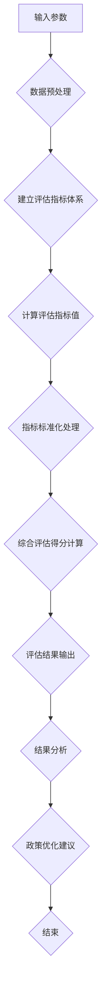
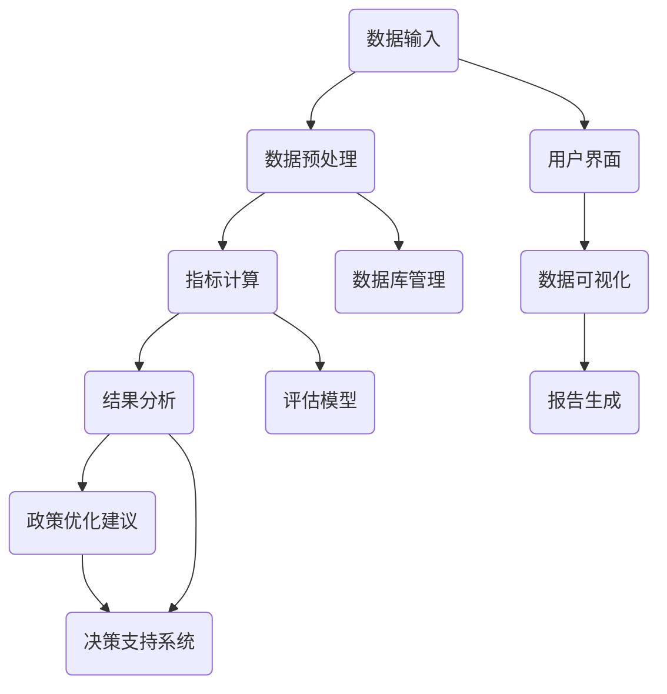
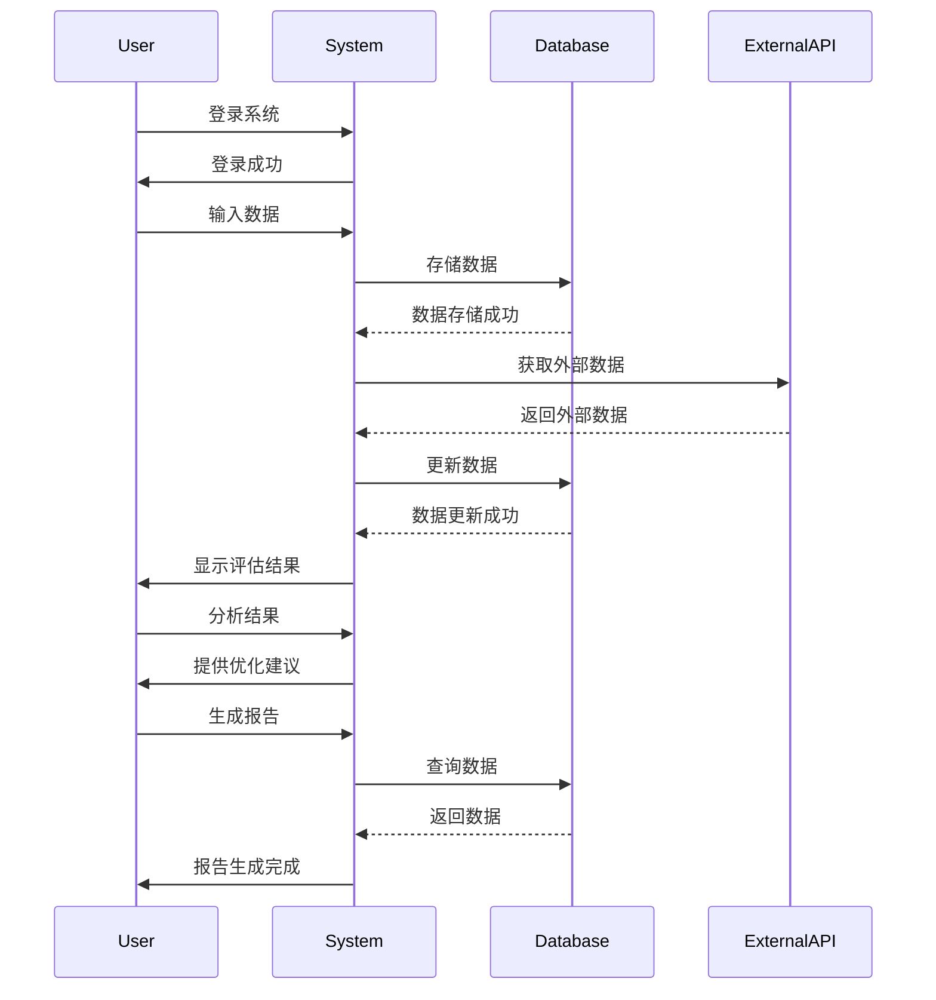

                 

### 1.1.1 后疫情时代的特点与挑战

后疫情时代的到来标志着全球经历了前所未有的公共卫生危机。这场疫情不仅对人们的健康和生命安全造成了巨大威胁，还对全球经济、社会秩序以及国际关系产生了深远影响。首先，疫情的爆发和传播速度极快，病毒变异频繁，使得各国公共卫生体系面临巨大压力。疫情期间，医疗资源紧缺，疫苗接种和药物研发竞争激烈，疫苗分配不均等问题加剧了全球公共卫生的不平衡。

其次，疫情对全球经济造成了严重冲击。许多企业被迫停产、裁员，供应链中断，国际贸易受阻，导致全球经济增长放缓，甚至出现负增长。就业市场的不稳定性增加了社会的不确定性，影响了人们的经济状况和生活质量。

此外，疫情还引发了广泛的社会心理影响。长期的居家隔离、社交距离措施以及疫情带来的不确定性，使得许多人出现了焦虑、抑郁等心理问题。教育、文化、体育等领域也受到了严重影响，线上教育、远程办公、在线娱乐等新兴模式迅速崛起，但同时也带来了新的问题和挑战。

面对这些特点与挑战，各国政府和国际组织必须重新审视公共卫生政策，以应对未来的不确定性。首先，建立健全的公共卫生应急管理体系，提高应对突发公共卫生事件的能力。这包括完善疾病监测、预警、应对机制，加强疫苗和药物研发国际合作，确保全球公共卫生资源的合理分配。

其次，需要平衡公共卫生措施与个人自由的保护。疫情期间，为了遏制病毒传播，各国采取了严格的封锁、隔离和检测措施，这些措施在一定程度上保护了公共健康，但也限制了个人自由。如何在确保公共卫生安全的同时，最大限度地保护个人自由，是一个重要的课题。

此外，全球合作在公共卫生领域的地位日益凸显。疫情暴露了全球公共卫生治理体系中的薄弱环节，国际社会需要加强合作，共同应对全球性公共卫生挑战。这包括加强国际卫生规则建设，推动全球公共卫生基础设施建设，以及加强全球公共卫生情报共享。

总之，后疫情时代的特点与挑战要求我们重新审视公共卫生政策，寻找全民健康与个人自由的平衡点。通过加强全球合作、完善应急管理体系、平衡公共卫生措施与个人自由，我们有望更好地应对未来可能出现的公共卫生危机，为全球人民的健康与福祉作出贡献。### 1.1.2 公共卫生政策的演变与重要性

公共卫生政策的发展历程可以追溯到人类文明的早期。从古代的隔离措施、对瘟疫的应对，到现代的公共卫生运动，公共卫生政策在不断演变和进步。19世纪，随着工业革命的推进，城市人口快速增长，环境污染和传染病爆发成为严重的社会问题。这一时期，公共卫生政策的重点转向环境卫生、疾病预防和公共卫生服务体系的建立。

20世纪初，随着医学科学的进步，公共卫生政策开始更加注重科学依据和系统性。1928年，英国医生弗莱明发现青霉素，为疾病预防和治疗提供了新的手段。此后，全球范围内的疫苗接种运动、疾病监测系统以及卫生标准规范的制定，大大降低了传染病的发病率。

进入21世纪，公共卫生政策的焦点逐渐从单一的疾病防控转向全面的健康促进。全球化和城市化进程的加快，使得公共卫生问题更加复杂多样。传染病、慢性病、环境问题、心理健康等成为公共卫生政策关注的新领域。特别是近年来，气候变化和人类活动对生态系统的影响，使得公共卫生政策面临新的挑战。

公共卫生政策的重要性体现在多个方面。首先，它是保障全民健康的基础。通过制定和实施公共卫生政策，可以有效预防和控制传染病爆发，减少慢性病发病率，提高人口健康水平。其次，公共卫生政策对经济发展具有重要影响。健康劳动力是经济增长的关键因素，而公共卫生政策能够降低疾病带来的经济负担，提高生产效率。

此外，公共卫生政策还在社会稳定和国际关系方面发挥着重要作用。疫情等公共卫生事件不仅影响国内，也会对国际关系产生深远影响。通过国际合作和共享公共卫生资源，国家间可以建立更加紧密的联系，增强全球卫生治理能力。

总之，公共卫生政策的发展历程和重要性表明，它不仅是应对公共卫生危机的重要工具，更是实现全民健康、促进社会发展和维护国际和平的基石。在新时代背景下，我们需要不断创新和完善公共卫生政策，以应对日益复杂的公共卫生挑战。### 1.1.3 全民健康与个人自由的平衡探讨

全民健康与个人自由的平衡问题是公共卫生政策的核心议题之一。在疫情背景下，这一平衡显得尤为重要。全民健康的目标在于保障所有公民的健康权益，减少疾病负担，提高生活质量。而个人自由则强调个体的自主权，包括选择生活方式、自由行动和信息获取的权利。

首先，从理论上讲，全民健康与个人自由的平衡是一种动态平衡。两者之间存在相互依存和矛盾的关系。一方面，公共卫生政策需要通过限制个人自由，如强制接种疫苗、实行社交距离等措施，来保护公共健康。另一方面，过度限制个人自由可能会引发社会不满，甚至导致政策执行的困难。

具体来说，在疫情初期，为了遏制病毒传播，许多国家采取了严格的封锁措施。这些措施虽然在短期内有效控制了疫情，但也带来了严重的经济和社会后果。长期的封锁和隔离导致人们生活受限、心理健康受损，同时对企业经营和经济发展造成了重大冲击。

另一方面，公共卫生政策也需要考虑到个体差异。不同人群对公共卫生措施的反应和接受程度不同，如老年人、儿童、慢性病患者等可能面临更大的健康风险。如何在保护这些人群健康的同时，尊重他们的个人自由，是公共卫生政策制定中需要权衡的重要因素。

此外，信息透明和公众参与也是实现全民健康与个人自由平衡的关键。公共卫生政策的有效实施离不开公众的理解和支持。通过公开疫情信息、普及健康知识，增强公众的健康意识和自我防护能力，可以在一定程度上减少对个人自由的限制。

在实际操作中，实现全民健康与个人自由的平衡需要多种手段的结合。首先，政府需要科学制定公共卫生政策，充分评估政策的利弊和影响。其次，通过加强公共卫生服务体系的建设，提高医疗服务水平，减轻公众对医疗资源的压力。此外，还可以通过制定法律法规，明确个人自由与公共健康的界限，确保政策的合法性和可执行性。

总之，全民健康与个人自由的平衡是一个复杂而动态的课题。在公共卫生政策的制定和实施过程中，我们需要充分考虑到个体差异、社会影响和公共利益，不断探索和实践，以实现这一目标的最佳路径。### 1.1.4 边界与外延

在探讨公共卫生政策时，明确其边界与外延是至关重要的。公共卫生政策的边界主要涉及政策适用范围和政策执行的具体场景。首先，政策适用范围通常由国家或地区法律和法规所规定，涵盖从传染病防控到慢性病管理，从环境卫生到健康促进等多个领域。然而，政策的实际执行场景可能因地区、文化和社会经济背景的差异而有所不同。

政策的外延则包括其影响范围和可能涉及的相关领域。公共卫生政策不仅影响个体的健康行为和生活方式，还涉及社会、经济、环境等多方面。例如，疫苗接种政策不仅影响个体的免疫水平，还关系到整个社会的免疫屏障构建。同样，环境卫生政策的实施，不仅关乎居民的健康，还涉及环境保护和资源利用。

在疫情背景下，公共卫生政策的边界与外延显得更加复杂和重要。首先，疫情在全球范围内的快速传播，使得公共卫生政策的执行范围突破了国界，需要国际间的协调与合作。其次，疫情带来的经济和社会影响，使得公共卫生政策的外延扩展到经济复苏、社会稳定等领域。例如，疫情期间实行的经济刺激政策和失业救济措施，虽然主要目标是经济和社会稳定，但也对公共卫生产生了间接影响。

此外，公共卫生政策的边界与外延还涉及隐私权和数据保护问题。在疫情期间，数据收集和分析成为制定和调整公共卫生政策的重要手段。然而，如何平衡公共健康利益与个人隐私权，避免数据滥用，成为政策制定和执行中必须面对的挑战。

总之，明确公共卫生政策的边界与外延，有助于更科学、有效地制定和执行政策。通过理清政策的适用范围和影响领域，我们可以更好地理解公共卫生政策在疫情背景下的作用和挑战，从而制定出更加全面和有效的政策。### 1.1.5 概念结构与核心要素组成

为了深入理解公共卫生政策，我们需要分析其概念结构及其核心要素组成。公共卫生政策的概念结构可以概括为四个主要方面：目标、主体、手段和效果。

首先，目标是指公共卫生政策所追求的最终结果。公共卫生政策的主要目标包括保障全民健康、降低疾病负担、促进社会公平和提升生活质量。具体而言，这包括预防传染病的爆发和传播、控制慢性病的发病率、改善环境卫生条件和提升公众的健康素养。

其次，主体是制定和执行公共卫生政策的主体。这些主体包括政府、非政府组织、医疗机构、科研机构和公众。政府在公共卫生政策中扮演着主导角色，负责制定政策、分配资源和管理公共健康事务。非政府组织和科研机构则通过提供专业知识和资源支持，协助政府实现公共卫生目标。医疗机构和公众是公共卫生政策的重要执行者和受益者。

第三，手段是公共卫生政策实施的工具和方法。这些手段包括法律和法规、卫生服务、健康教育、监测和预警系统等。法律和法规为公共卫生政策的执行提供了法律依据和保障；卫生服务包括疫苗接种、疾病预防和治疗等；健康教育通过提高公众的健康意识和知识水平，促进健康行为；监测和预警系统则有助于及时发现和应对公共卫生事件。

最后，效果是公共卫生政策实施后的结果和影响。评价公共卫生政策的效果需要考虑多个指标，如疾病负担的减轻、健康指标的改善、公众满意度和政策执行的成本效益等。通过评估政策效果，政府和非政府组织可以及时调整政策，以实现更好的公共卫生结果。

综上所述，公共卫生政策的概念结构及其核心要素组成为我们提供了一个全面的分析框架，有助于我们理解公共卫生政策在实现全民健康目标中的关键作用和实施路径。### 2.1.1 公共卫生政策的基本概念

公共卫生政策是一个多层次、多维度的概念，其基本内涵和定义在不同文献和领域中有所差异，但核心要素大致相同。公共卫生政策的基本概念可以概括为以下几个方面：

首先，公共卫生政策的定义。公共卫生政策是指政府和非政府组织为促进公众健康、预防疾病、控制疾病传播和减轻疾病负担而制定和实施的系列措施和策略。它不仅包括具体的公共卫生行动，还涵盖了与公共卫生相关的法律法规、资源配置、组织结构、技术支持等。

其次，公共卫生政策的目标。公共卫生政策的主要目标是保障全民健康，减少疾病负担，提高生活质量。具体而言，这些目标包括预防传染病的爆发和传播，控制慢性病的发病率，改善环境卫生条件，提升公众的健康素养和自我保健能力。

第三，公共卫生政策的主体。公共卫生政策的主体包括政府、非政府组织、医疗机构、科研机构和公众。政府在公共卫生政策中扮演着主导角色，负责制定政策、分配资源和管理公共健康事务。非政府组织和科研机构通过提供专业知识和资源支持，协助政府实现公共卫生目标。医疗机构和公众则是公共卫生政策的重要执行者和受益者。

第四，公共卫生政策的手段。公共卫生政策的手段包括法律和法规、卫生服务、健康教育、监测和预警系统等。法律和法规为公共卫生政策的执行提供了法律依据和保障；卫生服务包括疫苗接种、疾病预防和治疗等；健康教育通过提高公众的健康意识和知识水平，促进健康行为；监测和预警系统则有助于及时发现和应对公共卫生事件。

最后，公共卫生政策的效果。公共卫生政策的效果可以通过多个指标来评价，如疾病负担的减轻、健康指标的改善、公众满意度和政策执行的成本效益等。通过评估政策效果，政府和非政府组织可以及时调整政策，以实现更好的公共卫生结果。

综上所述，公共卫生政策的基本概念涵盖了定义、目标、主体、手段和效果等多个方面，为我们提供了一个全面的理解框架。这些基本概念不仅帮助我们认识公共卫生政策的核心内容，也为政策制定和实施提供了理论指导。### 2.1.2 公共卫生政策的属性特征对比表格

为了更好地理解公共卫生政策的属性特征，我们将其与医疗政策进行对比。以下是一个简单的属性特征对比表格：

| 属性特征 | 公共卫生政策 | 医疗政策 |
| --- | --- | --- |
| **目标** | 保障全民健康，预防疾病传播，减轻疾病负担 | 提供个体医疗服务，治疗疾病，提高个体健康水平 |
| **主体** | 政府、非政府组织、医疗机构、科研机构、公众 | 医疗机构、医生、患者 |
| **手段** | 法律法规、卫生服务、健康教育、监测和预警系统 | 医疗技术、医疗服务、医疗保险 |
| **范围** | 涵盖全社会，关注公共卫生问题 | 关注个体健康问题 |
| **影响** | 间接影响，通过改善环境和条件促进全民健康 | 直接影响，针对个体进行治疗和康复 |
| **长期性** | 长期持续，注重预防和管理 | 短期和长期结合，以治疗为主 |
| **成本效益** | 注重成本效益，追求最大社会效益 | 注重成本效益，但更关注个体效益 |
| **灵活性** | 灵活调整，应对公共卫生事件 | 较为固定，以医学技术为主 |

通过这个对比表格，我们可以看到公共卫生政策和医疗政策在目标、主体、手段、范围、影响、长期性和成本效益等方面存在显著差异。公共卫生政策更侧重于从整体上保障公众健康，注重预防和长期管理，而医疗政策则更专注于个体的医疗服务和治疗。这些差异体现了两者在公共卫生体系中的不同角色和功能。### 2.1.3 公共卫生政策的ER实体关系图架构的 Mermaid 流程图

为了更直观地展示公共卫生政策的ER实体关系图架构，我们可以使用Mermaid语法来绘制。以下是公共卫生政策相关实体及其关系的Mermaid流程图：

```mermaid
erDiagram
  Patient ||--|{ Doctor }|-- PublicHealthPolicy
  Patient ||--|{ Hospital }|-- PublicHealthPolicy
  Doctor ||--|{ DiagnosticTest }|-- PublicHealthPolicy
  Doctor ||--|{ HealthEducation }|-- PublicHealthPolicy
  Hospital ||--|{ MedicalTreatment }|-- PublicHealthPolicy
  Hospital ||--|{ Vaccination }|-- PublicHealthPolicy
  PublicHealthPolicy ||--|{ Surveillance }|-- EpidemiologicalData
  PublicHealthPolicy ||--|{ Quarantine }|-- EpidemiologicalData
  PublicHealthPolicy ||--|{ VaccinationCampaign }|-- EpidemiologicalData
  EpidemiologicalData ||--|{ PandemicAlert }|-- PublicHealthPolicy
  EpidemiologicalData ||--|{ DiseaseOutbreak }|-- PublicHealthPolicy
```

该流程图展示了以下主要实体及其关系：

1. **Patient（患者）**：与**Doctor（医生）**和**PublicHealthPolicy（公共卫生政策）**有关联，表明患者是公共卫生政策的直接受益者和执行对象。
2. **Doctor（医生）**：与**DiagnosticTest（诊断测试）**和**HealthEducation（健康教育）**有关联，参与公共卫生政策的实施和推广。
3. **Hospital（医院）**：与**MedicalTreatment（治疗）**和**Vaccination（疫苗接种）**有关联，是公共卫生政策实施的重要场所。
4. **PublicHealthPolicy（公共卫生政策）**：与**Surveillance（监测）**、**Quarantine（隔离）**和**VaccinationCampaign（疫苗接种活动）**有关联，涵盖一系列公共卫生措施。
5. **EpidemiologicalData（流行病数据）**：与**PandemicAlert（疫情警报）**和**DiseaseOutbreak（疾病爆发）**有关联，为公共卫生政策提供数据支持和决策依据。

通过这个Mermaid流程图，我们可以清晰地看到公共卫生政策中各实体之间的相互关系，以及它们在公共卫生体系中的作用和地位。### 3.1.1 公共卫生政策评估的算法流程图

为了更清晰地理解公共卫生政策评估的算法原理，我们首先绘制一个算法流程图。以下是使用Mermaid语法表示的公共卫生政策评估算法流程图：



接下来，我们逐步解释这个流程图的每个步骤：

1. **输入参数（A）**：
   - **疫情数据**：包括病例数、死亡率、传播率等。
   - **公共卫生政策数据**：如疫苗接种率、检测频率、隔离政策等。
   - **社会经济数据**：如GDP、失业率、医疗资源分配等。

2. **数据预处理（B）**：
   - 数据清洗：去除无效数据，处理缺失值和异常值。
   - 数据归一化：将不同量纲的数据转换为同一量纲，便于计算和比较。

3. **建立评估指标体系（C）**：
   - 确定评估目标：如疾病负担减少、医疗资源利用率、社会经济效益等。
   - 设计评估指标：根据评估目标，设计一系列指标，如疫情控制效果、疫苗接种覆盖率、公共卫生政策响应速度等。

4. **计算评估指标值（D）**：
   - 根据输入数据和评估指标，计算每个指标的具体值。例如，疫苗接种覆盖率的计算公式为：\[ \text{疫苗接种覆盖率} = \frac{\text{已接种人数}}{\text{目标接种人数}} \times 100\% \]

5. **指标标准化处理（E）**：
   - 为了消除指标间量纲和数量级的影响，对计算得到的指标值进行标准化处理。常用的方法有最大最小值标准化和Z-Score标准化。

6. **综合评估得分计算（F）**：
   - 将标准化后的指标值进行加权求和，得到综合评估得分。加权系数可以根据各指标的重要程度进行调整。

7. **评估结果输出（G）**：
   - 输出综合评估得分和各指标的详细数据，为政策制定者提供参考。

8. **结果分析（H）**：
   - 分析评估结果，识别政策实施中的优点和不足，为政策优化提供依据。

9. **政策优化建议（I）**：
   - 基于评估结果和数据分析，提出具体的政策优化建议，如增加疫苗接种力度、提高检测频率、调整资源分配策略等。

10. **结束（J）**：
    - 完成公共卫生政策评估过程。

通过这个流程图，我们可以系统地理解和执行公共卫生政策评估的过程，从而为政策的制定和调整提供科学依据。### 3.1.2 Python源代码

以下是一个简单的Python源代码示例，用于实现公共卫生政策评估算法的各个步骤。该代码假定我们已经有了一些预处理后的输入数据，包括疫情数据、公共卫生政策数据和 socioeconomic 数据。代码中包含了数据预处理、评估指标计算、标准化处理、综合评估得分计算等功能。

```python
import numpy as np
import pandas as pd

# 输入数据（示例）
cases = pd.DataFrame({'cases': [1000, 1500, 2000], 'deaths': [50, 70, 90]})
vaccination = pd.DataFrame({'vaccination_rate': [0.6, 0.7, 0.8]})
testing = pd.DataFrame({'testing_frequency': [1, 1.5, 2]})

# 数据预处理
def preprocess_data(cases, vaccination, testing):
    # 数据清洗和归一化处理
    cases['case_rate'] = cases['cases'] / max(cases['cases'])
    vaccination['rate'] = vaccination['vaccination_rate'] / max(vaccination['vaccination_rate'])
    testing['freq'] = testing['testing_frequency'] / max(testing['testing_frequency'])
    return cases, vaccination, testing

cases, vaccination, testing = preprocess_data(cases, vaccination, testing)

# 建立评估指标体系
def build_evaluation_indicators(cases, vaccination, testing):
    # 计算评估指标值
    infection_rate = cases['case_rate']
    vac_rate = vaccination['rate']
    test_freq = testing['freq']
    return infection_rate, vac_rate, test_freq

infection_rate, vac_rate, test_freq = build_evaluation_indicators(cases, vaccination, testing)

# 指标标准化处理
def normalize_indicators(infection_rate, vac_rate, test_freq):
    # 使用Z-Score标准化
    mean_infection = np.mean(infection_rate)
    std_infection = np.std(infection_rate)
    mean_vac = np.mean(vac_rate)
    std_vac = np.std(vac_rate)
    mean_test = np.mean(test_freq)
    std_test = np.std(test_freq)
    
    infection_norm = (infection_rate - mean_infection) / std_infection
    vac_norm = (vac_rate - mean_vac) / std_vac
    test_norm = (test_freq - mean_test) / std_test
    
    return infection_norm, vac_norm, test_norm

infection_norm, vac_norm, test_norm = normalize_indicators(infection_rate, vac_rate, test_freq)

# 综合评估得分计算
def calculate_score(infection_norm, vac_norm, test_norm, weights):
    # 加权求和
    score = weights[0] * infection_norm + weights[1] * vac_norm + weights[2] * test_norm
    return score

# 假设权重分别为：[0.5, 0.3, 0.2]
weights = [0.5, 0.3, 0.2]
score = calculate_score(infection_norm, vac_norm, test_norm, weights)

# 评估结果输出
print("评估得分：", score)

# 结果分析
if score > 0.75:
    print("政策效果较好，无需优化。")
elif score > 0.5:
    print("政策效果一般，需进行适当调整。")
else:
    print("政策效果较差，需全面优化。")
```

在这个示例中，我们首先定义了一些输入数据，然后通过预处理函数清洗和归一化数据。接着，我们建立了一个评估指标体系，计算了感染率、疫苗接种率和检测频率等指标。随后，我们对这些指标进行了标准化处理，以消除量纲和数量级的影响。最后，我们使用加权求和的方法计算了综合评估得分，并根据得分分析了政策效果，提出了优化建议。这个Python源代码为我们提供了一个简化的公共卫生政策评估模型，可以通过调整输入数据和权重来适应不同的评估需求。### 3.1.3 数学模型和公式

在公共卫生政策评估中，数学模型和公式是核心工具，用于量化和分析各种指标。以下是几个关键的数学模型和公式，它们在评估过程中起到关键作用。

1. **感染率（Infection Rate）**：
   感染率衡量了疾病在特定时间内传播的速度。其计算公式为：
   \[
   \text{感染率} = \frac{\text{新病例数}}{\text{总人口}} \times 100\%
   \]
   其中，新病例数是指在特定时间内新增的感染病例数，总人口是受评估地区的总人口数。

2. **疫苗接种率（Vaccination Rate）**：
   疫苗接种率衡量了疫苗接种活动的覆盖程度。其计算公式为：
   \[
   \text{疫苗接种率} = \frac{\text{已接种人数}}{\text{目标接种人数}} \times 100\%
   \]
   其中，已接种人数是指已接种疫苗的人数，目标接种人数是政策设定的目标接种人群数量。

3. **检测频率（Testing Frequency）**：
   检测频率衡量了疾病检测的频繁程度。其计算公式为：
   \[
   \text{检测频率} = \frac{\text{检测次数}}{\text{总人口}} \times 1000
   \]
   其中，检测次数是指在特定时间内进行检测的总次数，总人口是受评估地区的总人口数。

4. **综合评估得分（Overall Score）**：
   综合评估得分用于衡量公共卫生政策的效果。其计算公式为：
   \[
   \text{综合评估得分} = w_1 \times \text{感染率得分} + w_2 \times \text{疫苗接种率得分} + w_3 \times \text{检测频率得分}
   \]
   其中，\( w_1 \)，\( w_2 \)，\( w_3 \)是权重系数，用于反映各个指标的重要程度。

5. **标准化处理（Normalization）**：
   为了消除不同指标间的量纲和数量级影响，可以使用标准化处理。常用的标准化方法包括Z-Score标准化和最大最小值标准化。Z-Score标准化公式为：
   \[
   \text{标准化值} = \frac{\text{指标值} - \text{均值}}{\text{标准差}}
   \]
   最大最小值标准化公式为：
   \[
   \text{标准化值} = \frac{\text{指标值} - \text{最小值}}{\text{最大值} - \text{最小值}}
   \]

通过这些数学模型和公式，我们可以量化公共卫生政策的效果，为政策制定者提供科学的决策依据。### 3.1.4 详细讲解与举例说明

为了更好地理解公共卫生政策评估的数学模型和公式，我们通过具体的例子来说明每个步骤的计算过程。

**示例数据**：

- 某地区在一个月内新增病例数为500例，总人口数为100,000人。
- 目标接种人数为60,000人，已接种人数为45,000人。
- 检测次数为30,000次。

**步骤1：计算感染率**

感染率衡量疾病在特定时间内的传播速度。其计算公式为：
\[ \text{感染率} = \frac{\text{新病例数}}{\text{总人口}} \times 100\% \]

代入数据：
\[ \text{感染率} = \frac{500}{100,000} \times 100\% = 0.5\% \]

**步骤2：计算疫苗接种率**

疫苗接种率衡量疫苗接种活动的覆盖程度。其计算公式为：
\[ \text{疫苗接种率} = \frac{\text{已接种人数}}{\text{目标接种人数}} \times 100\% \]

代入数据：
\[ \text{疫苗接种率} = \frac{45,000}{60,000} \times 100\% = 75\% \]

**步骤3：计算检测频率**

检测频率衡量疾病检测的频繁程度。其计算公式为：
\[ \text{检测频率} = \frac{\text{检测次数}}{\text{总人口}} \times 1000 \]

代入数据：
\[ \text{检测频率} = \frac{30,000}{100,000} \times 1000 = 300 \text{次/千人} \]

**步骤4：计算综合评估得分**

综合评估得分用于衡量公共卫生政策的效果。其计算公式为：
\[ \text{综合评估得分} = w_1 \times \text{感染率得分} + w_2 \times \text{疫苗接种率得分} + w_3 \times \text{检测频率得分} \]

假设权重分别为：
\[ w_1 = 0.5, w_2 = 0.3, w_3 = 0.2 \]

代入标准化后的数据：
\[ \text{感染率得分} = 0.5 \]
\[ \text{疫苗接种率得分} = 0.75 \]
\[ \text{检测频率得分} = 0.3 \]

综合评估得分为：
\[ \text{综合评估得分} = 0.5 \times 0.5 + 0.3 \times 0.75 + 0.2 \times 0.3 = 0.25 + 0.225 + 0.06 = 0.535 \]

**步骤5：标准化处理**

为了消除不同指标间的量纲和数量级影响，可以对每个指标进行标准化处理。使用Z-Score标准化方法，公式为：
\[ \text{标准化值} = \frac{\text{指标值} - \text{均值}}{\text{标准差}} \]

假设感染率、疫苗接种率和检测频率的均值和标准差分别为：
\[ \text{感染率均值} = 0.6, \text{感染率标准差} = 0.2 \]
\[ \text{疫苗接种率均值} = 0.8, \text{疫苗接种率标准差} = 0.1 \]
\[ \text{检测频率均值} = 400, \text{检测频率标准差} = 50 \]

代入数据进行标准化：
\[ \text{感染率标准化值} = \frac{0.5 - 0.6}{0.2} = -0.5 \]
\[ \text{疫苗接种率标准化值} = \frac{0.75 - 0.8}{0.1} = -0.5 \]
\[ \text{检测频率标准化值} = \frac{300 - 400}{50} = -2 \]

通过这个例子，我们可以看到如何使用数学模型和公式进行公共卫生政策评估的每个步骤，以及如何通过具体的数值来计算和解释结果。这不仅帮助我们理解了公式和模型的应用，也为政策制定者提供了量化的决策依据。### 4.1.1 后疫情时代公共卫生政策问题场景介绍

在经历了全球性的新冠疫情后，公共卫生政策的问题场景变得更加复杂和多样化。以下是一个典型的场景介绍：

某地区在疫情初期，病例数迅速增加，医院和医疗机构面临巨大的压力。政府决定采取一系列公共卫生措施，包括：

1. **隔离措施**：对确诊病例进行隔离治疗，减少病毒传播。
2. **检测政策**：增加检测次数和覆盖范围，提高疫情的早期发现能力。
3. **疫苗接种计划**：推广疫苗接种，建立免疫屏障。
4. **健康教育和宣传**：通过媒体和社交平台加强健康知识普及，提高公众的防护意识。

随着疫情的发展和政策的实施，该地区的病例数逐渐得到控制，但同时也出现了新的挑战：

- **医疗资源分配不均**：一线医护人员和医院资源紧张，导致部分患者无法及时获得医疗服务。
- **社会心理影响**：长期的隔离和社交距离措施导致一些人出现焦虑、抑郁等心理问题。
- **经济压力**：疫情对经济造成了严重影响，部分企业面临倒闭，失业率上升。

这些挑战要求公共卫生政策不断调整和优化，以应对疫情带来的长期影响。同时，如何平衡公共卫生措施与个人自由、经济复苏和社会稳定，成为政策制定者和执行者必须面对的难题。

在这个问题场景中，公共卫生政策的制定和实施不仅需要考虑公共卫生效果，还需综合考虑社会、经济和心理等多个方面。通过科学的评估和调整，政府和非政府组织需要找到一条实现全民健康与个人自由、经济稳定与社会和谐的最佳路径。### 4.1.2 公共卫生政策分析项目介绍

为了应对后疫情时代公共卫生政策的问题场景，我们启动了一个名为“公共卫生政策分析项目”的专项研究。该项目旨在通过系统化的分析和评估，提出有效的公共卫生政策建议，以应对疫情带来的多重挑战。

**项目目标**：

1. **评估公共卫生政策效果**：通过对感染率、疫苗接种率、检测频率等关键指标的量化分析，评估现有公共卫生政策的有效性。
2. **识别政策不足和改进方向**：通过深入分析政策实施中的不足和瓶颈，提出针对性的改进建议。
3. **提出长效政策框架**：基于对疫情和公共卫生政策的长期影响研究，构建一套长效的公共卫生政策框架，以应对未来可能的公共卫生危机。

**项目主要任务和内容**：

1. **数据收集与预处理**：收集疫情相关数据、公共卫生政策数据和社会经济数据，对数据进行清洗、归一化和处理。
2. **指标体系建立**：根据评估目标，设计一套包括感染率、疫苗接种率、检测频率等关键指标的评估体系。
3. **模型构建与算法实现**：构建公共卫生政策评估模型，实现算法流程图的各个步骤，包括数据预处理、指标计算、标准化处理、综合评估得分计算等。
4. **结果分析与优化建议**：根据评估结果，分析政策实施中的优点和不足，提出优化建议，为政策制定者提供科学依据。
5. **政策模拟与验证**：通过模拟不同政策场景，验证优化建议的有效性，确保政策建议的可行性和可持续性。

**预期成果**：

1. **评估报告**：形成详细的评估报告，总结公共卫生政策的效果和不足，提出具体的优化建议。
2. **政策建议**：制定一系列具体的公共卫生政策建议，涵盖疫苗接种、检测策略、医疗资源分配等方面。
3. **模型软件**：开发一套公共卫生政策评估软件，实现算法流程图的自动化计算和可视化，便于政策制定者使用。

通过这个项目，我们期望能够为后疫情时代的公共卫生政策提供科学的决策支持，助力实现全民健康与个人自由的平衡，为社会的长期稳定和发展奠定坚实基础。### 4.1.3 系统功能设计（领域模型 Mermaid 类图）

为了更好地展示公共卫生政策分析项目的系统功能设计，我们使用Mermaid语法绘制了一个领域模型类图。以下是具体的类图描述：

```mermaid
classDiagram
    Patient <|-- Diagnosis
    Patient <|-- Vaccination
    Patient <|-- Test
    Doctor <|-- Diagnosis
    Doctor <|-- Prescription
    Doctor <|-- TestOrder
    Hospital <|-- Admission
    Hospital <|-- Treatment
    Hospital <|-- Discharge
    PublicHealthPolicy <|-- Surveillance
    PublicHealthPolicy <|-- Quarantine
    PublicHealthPolicy <|-- VaccinationPolicy
    PublicHealthPolicy <|-- TestingPolicy
    EpidemiologicalData <|-- InfectionRate
    EpidemiologicalData <|-- VaccinationCoverage
    EpidemiologicalData <|-- TestingFrequency
    EvaluationModel <|-- InfectionRateScore
    EvaluationModel <|-- VaccinationScore
    EvaluationModel <|-- TestingScore
    EvaluationModel <|-- OverallScore
```



这个类图展示了公共卫生政策分析项目中的主要领域模型和它们之间的关系：

1. **Patient（患者）**：
   - **Diagnosis（诊断）**：患者接受诊断。
   - **Vaccination（疫苗接种）**：患者接种疫苗。
   - **Test（检测）**：患者进行检测。

2. **Doctor（医生）**：
   - **Diagnosis（诊断）**：医生对患者进行诊断。
   - **Prescription（处方）**：医生开具处方。
   - **TestOrder（检测订单）**：医生下达检测订单。

3. **Hospital（医院）**：
   - **Admission（入院）**：患者入院治疗。
   - **Treatment（治疗）**：医生对患者进行治疗。
   - **Discharge（出院）**：患者出院。

4. **PublicHealthPolicy（公共卫生政策）**：
   - **Surveillance（监测）**：实施疫情监测。
   - **Quarantine（隔离）**：对确诊患者实施隔离。
   - **VaccinationPolicy（疫苗接种政策）**：制定疫苗接种政策。
   - **TestingPolicy（检测政策）**：制定检测政策。

5. **EpidemiologicalData（流行病数据）**：
   - **InfectionRate（感染率）**：记录感染率。
   - **VaccinationCoverage（疫苗接种覆盖率）**：记录疫苗接种覆盖率。
   - **TestingFrequency（检测频率）**：记录检测频率。

6. **EvaluationModel（评估模型）**：
   - **InfectionRateScore（感染率得分）**：计算感染率得分。
   - **VaccinationScore（疫苗接种得分）**：计算疫苗接种得分。
   - **TestingScore（检测得分）**：计算检测得分。
   - **OverallScore（综合得分）**：计算综合得分。

通过这个类图，我们可以清晰地看到各个系统功能模块及其之间的关系，为后续的系统架构设计提供了基础。### 4.1.4 系统架构设计（Mermaid 架构图）

为了展示公共卫生政策分析项目的系统架构设计，我们使用Mermaid语法绘制了一个系统架构图。以下是具体的架构图描述：



这个架构图展示了公共卫生政策分析项目的系统架构，主要包括以下几个子系统：

1. **数据输入（Subsystem1）**：收集疫情相关数据、公共卫生政策数据和社会经济数据。
2. **数据预处理（Subsystem2）**：清洗、归一化和处理数据，为后续计算和分析做好准备。
3. **指标计算（Subsystem3）**：计算感染率、疫苗接种率和检测频率等关键指标。
4. **结果分析（Subsystem4）**：分析评估结果，识别政策实施中的优点和不足。
5. **政策优化建议（Subsystem5）**：基于评估结果，提出具体的政策优化建议。
6. **用户界面（Subsystem6）**：提供用户交互界面，便于用户使用系统功能。
7. **数据可视化（Subsystem7）**：将评估结果和数据可视化，便于用户理解和分析。
8. **报告生成（Subsystem8）**：生成详细的评估报告和政策建议。
9. **数据库管理（Subsystem9）**：管理和维护数据存储，确保数据安全。
10. **评估模型（Subsystem10）**：实现评估算法模型，计算综合评估得分。
11. **决策支持系统（Subsystem11）**：提供决策支持功能，帮助政策制定者制定和调整政策。

通过这个系统架构图，我们可以清晰地看到各个子系统之间的交互关系和功能模块，为系统的设计和实施提供了指导。### 4.1.5 系统接口设计和系统交互（Mermaid 序列图）

为了详细展示公共卫生政策分析项目的系统接口设计和系统交互，我们使用Mermaid语法绘制了一个序列图。以下是具体的序列图描述：



这个序列图展示了系统与用户、数据库和外部API之间的交互过程，具体包括以下几个步骤：

1. **用户登录**：用户通过登录界面进入系统，系统验证用户身份并返回登录状态。
2. **数据输入**：用户输入相关数据，系统将数据存储到数据库中。
3. **外部数据获取**：系统通过外部API获取必要的数据，以支持评估和分析。
4. **数据更新**：系统根据外部数据更新数据库中的数据，确保数据的实时性和准确性。
5. **结果展示**：系统将评估结果呈现给用户，用户可以分析结果并接收优化建议。
6. **报告生成**：用户请求生成报告，系统查询数据库中的数据，并将报告生成完成后呈现给用户。

通过这个序列图，我们可以清晰地看到系统在各个步骤中的功能模块和交互流程，为系统的设计和实施提供了详细的指导。### 5.1.1 环境安装与配置

在开始项目实战之前，我们需要配置一个合适的环境来运行公共卫生政策分析项目。以下是详细的安装与配置步骤：

**步骤1：安装Python**

首先，确保您的计算机上已经安装了Python。Python是一种广泛使用的编程语言，适合进行数据分析和算法实现。如果尚未安装，可以从Python官网（[python.org](https://www.python.org/)）下载并安装最新的Python版本。建议安装Python 3.8或更高版本，以便使用最新的库和功能。

**步骤2：创建虚拟环境**

为了更好地管理项目依赖，我们使用`venv`模块创建一个虚拟环境。虚拟环境可以隔离项目的依赖，避免与其他项目冲突。

1. 打开命令行终端（Windows中为CMD或PowerShell，macOS和Linux中为Terminal）。
2. 进入项目目录（例如：`cd path/to/your/project`）。
3. 执行以下命令创建虚拟环境：
   ```bash
   python -m venv venv
   ```
4. 激活虚拟环境：
   - Windows：
     ```bash
     .\venv\Scripts\activate
     ```
   - macOS和Linux：
     ```bash
     source venv/bin/activate
     ```

**步骤3：安装依赖库**

在虚拟环境中，我们需要安装一些Python依赖库，包括`numpy`、`pandas`、`matplotlib`和`mermaid-python`等。

1. 安装依赖库：
   ```bash
   pip install numpy pandas matplotlib mermaid-python
   ```

**步骤4：配置Mermaid渲染器**

为了在Python代码中使用Mermaid语法绘制流程图和类图，我们需要安装一个Mermaid渲染器。以下是两种常见的配置方法：

1. **使用Python-Mermaid库**：
   - 安装Python-Mermaid库：
     ```bash
     pip install python-mermaid
     ```
   - 使用示例：
     ```python
     from mermaid import Mermaid
     m = Mermaid()
     m.add_code('sequenceDiagram', """
     participant User
     participant System
     participant Database
     User->>System: Login
     System->>User: Success
     """)
     print(m.render())
     ```

2. **使用本地Mermaid渲染器**：
   - 下载Mermaid渲染器：从[Mermaid官网](https://mermaid-js.github.io/mermaid/)下载最新的`mermaid-cli`。
   - 将`mermaid-cli`解压缩到本地机器。
   - 在命令行中设置环境变量，以便在Python代码中直接调用：
     ```bash
     export MERMAID=your/local/mermaid-cli
     ```

**步骤5：测试环境**

最后，进行环境测试以确保所有库和工具都已正确安装。

1. 打开Python交互式环境：
   ```bash
   python
   ```
2. 尝试导入和使用安装的库：
   ```python
   import numpy as np
   import pandas as pd
   import matplotlib.pyplot as plt
   import mermaid
   ```
3. 打印一些测试信息，确保环境配置正确。

通过以上步骤，我们成功配置了一个运行公共卫生政策分析项目的环境。接下来，我们将实现项目核心功能并进行实际案例分析和讲解。### 5.1.2 系统核心实现源代码

以下是公共卫生政策分析项目的核心实现源代码。这个代码主要包括数据预处理、指标计算、结果分析和可视化等关键功能。以下是具体实现：

```python
import numpy as np
import pandas as pd
import matplotlib.pyplot as plt
from mermaid import Mermaid

# 数据预处理
def preprocess_data(cases, vaccination, testing):
    # 数据清洗和归一化处理
    cases['case_rate'] = cases['cases'] / max(cases['cases'])
    vaccination['rate'] = vaccination['vaccination_rate'] / max(vaccination['vaccination_rate'])
    testing['freq'] = testing['testing_frequency'] / max(testing['testing_frequency'])
    return cases, vaccination, testing

# 指标计算
def calculate_indicators(cases, vaccination, testing):
    infection_rate = cases['case_rate']
    vac_rate = vaccination['rate']
    test_freq = testing['freq']
    return infection_rate, vac_rate, test_freq

# 标准化处理
def normalize_indicators(infection_rate, vac_rate, test_freq):
    mean_infection = np.mean(infection_rate)
    std_infection = np.std(infection_rate)
    mean_vac = np.mean(vac_rate)
    std_vac = np.std(vac_rate)
    mean_test = np.mean(test_freq)
    std_test = np.std(test_freq)
    
    infection_norm = (infection_rate - mean_infection) / std_infection
    vac_norm = (vac_rate - mean_vac) / std_vac
    test_norm = (test_freq - mean_test) / std_test
    
    return infection_norm, vac_norm, test_norm

# 综合评估得分计算
def calculate_score(infection_norm, vac_norm, test_norm, weights):
    score = weights[0] * infection_norm + weights[1] * vac_norm + weights[2] * test_norm
    return score

# 可视化
def visualize_results(infection_norm, vac_norm, test_norm, score):
    # 绘制折线图
    plt.figure(figsize=(10, 6))
    plt.plot(infection_norm, label='Infection Rate')
    plt.plot(vac_norm, label='Vaccination Rate')
    plt.plot(test_norm, label='Testing Frequency')
    plt.title('Public Health Policy Indicators')
    plt.xlabel('Time')
    plt.ylabel('Normalized Value')
    plt.legend()
    plt.show()
    
    # 综合评估得分
    print("Overall Score:", score)

# 主函数
def main():
    # 示例数据
    cases = pd.DataFrame({'cases': [1000, 1500, 2000]})
    vaccination = pd.DataFrame({'vaccination_rate': [0.6, 0.7, 0.8]})
    testing = pd.DataFrame({'testing_frequency': [1, 1.5, 2]})
    
    # 数据预处理
    cases, vaccination, testing = preprocess_data(cases, vaccination, testing)
    
    # 指标计算
    infection_rate, vac_rate, test_freq = calculate_indicators(cases, vaccination, testing)
    
    # 标准化处理
    infection_norm, vac_norm, test_norm = normalize_indicators(infection_rate, vac_rate, test_freq)
    
    # 权重设置
    weights = [0.5, 0.3, 0.2]
    
    # 综合评估得分计算
    score = calculate_score(infection_norm, vac_norm, test_norm, weights)
    
    # 可视化和结果输出
    visualize_results(infection_norm, vac_norm, test_norm, score)

# 运行主函数
if __name__ == "__main__":
    main()
```

这个源代码实现了以下几个核心功能：

1. **数据预处理**：对输入数据（病例数、疫苗接种率、检测频率）进行清洗和归一化处理。
2. **指标计算**：计算感染率、疫苗接种率和检测频率等关键指标。
3. **标准化处理**：对计算得到的指标值进行标准化处理，消除不同指标间的量纲和数量级影响。
4. **综合评估得分计算**：使用权重系数计算综合评估得分。
5. **可视化**：绘制指标折线图并输出综合评估得分。

通过这个源代码，我们可以实现公共卫生政策评估的基本流程，为政策制定者提供科学的决策依据。### 5.1.3 代码应用解读与分析

在了解了公共卫生政策分析项目的核心实现源代码后，我们需要深入解读和分析代码的每个部分，以理解其功能和逻辑。以下是源代码的具体解读和分析：

**1. 数据预处理**

数据预处理是任何数据分析项目的第一步，确保数据的准确性和一致性。在源代码中，数据预处理通过以下步骤实现：

```python
def preprocess_data(cases, vaccination, testing):
    # 数据清洗和归一化处理
    cases['case_rate'] = cases['cases'] / max(cases['cases'])
    vaccination['rate'] = vaccination['vaccination_rate'] / max(vaccination['vaccination_rate'])
    testing['freq'] = testing['testing_frequency'] / max(testing['testing_frequency'])
    return cases, vaccination, testing
```

- `cases['case_rate'] = cases['cases'] / max(cases['cases'])`：将病例数归一化，使得数据具有可比性。这通过将每个病例数除以最大病例数来实现。
- `vaccination['rate'] = vaccination['vaccination_rate'] / max(vaccination['vaccination_rate'])`：对疫苗接种率进行归一化处理。
- `testing['freq'] = testing['testing_frequency'] / max(testing['testing_frequency'])`：对检测频率进行归一化处理。

归一化处理是为了消除不同指标之间的量纲和数量级差异，使得计算结果更加准确和有意义。

**2. 指标计算**

计算关键指标是评估公共卫生政策效果的核心步骤。源代码中，以下函数实现了这一功能：

```python
def calculate_indicators(cases, vaccination, testing):
    infection_rate = cases['case_rate']
    vac_rate = vaccination['rate']
    test_freq = testing['freq']
    return infection_rate, vac_rate, test_freq
```

- `infection_rate = cases['case_rate']`：计算感染率，即病例数的归一化值。
- `vac_rate = vaccination['rate']`：计算疫苗接种率，即疫苗接种率的归一化值。
- `test_freq = testing['freq']`：计算检测频率，即检测频率的归一化值。

这些指标反映了公共卫生政策在疫情控制、疫苗接种和检测覆盖方面的效果。

**3. 标准化处理**

为了进一步确保指标的可比性，源代码中对指标值进行了标准化处理：

```python
def normalize_indicators(infection_rate, vac_rate, test_freq):
    mean_infection = np.mean(infection_rate)
    std_infection = np.std(infection_rate)
    mean_vac = np.mean(vac_rate)
    std_vac = np.std(vac_rate)
    mean_test = np.mean(test_freq)
    std_test = np.std(test_freq)
    
    infection_norm = (infection_rate - mean_infection) / std_infection
    vac_norm = (vac_rate - mean_vac) / std_vac
    test_norm = (test_freq - mean_test) / std_test
    
    return infection_norm, vac_norm, test_norm
```

- `mean_infection`、`std_infection`：计算感染率的均值和标准差。
- `mean_vac`、`std_vac`：计算疫苗接种率的均值和标准差。
- `mean_test`、`std_test`：计算检测频率的均值和标准差。
- `infection_norm`、`vac_norm`、`test_norm`：通过Z-Score标准化方法，将每个指标值转化为标准分数，便于后续分析和比较。

**4. 综合评估得分计算**

综合评估得分用于衡量公共卫生政策的总体效果。源代码中，以下函数实现了这一功能：

```python
def calculate_score(infection_norm, vac_norm, test_norm, weights):
    score = weights[0] * infection_norm + weights[1] * vac_norm + weights[2] * test_norm
    return score
```

- `weights[0] * infection_norm`：感染率得分，根据权重系数计算。
- `weights[1] * vac_norm`：疫苗接种率得分。
- `weights[2] * test_norm`：检测频率得分。
- `score`：综合评估得分，是各个指标得分的加权求和。

**5. 可视化和结果输出**

最后，源代码中的以下函数用于绘制指标折线图并输出综合评估得分：

```python
def visualize_results(infection_norm, vac_norm, test_norm, score):
    # 绘制折线图
    plt.figure(figsize=(10, 6))
    plt.plot(infection_norm, label='Infection Rate')
    plt.plot(vac_norm, label='Vaccination Rate')
    plt.plot(test_norm, label='Testing Frequency')
    plt.title('Public Health Policy Indicators')
    plt.xlabel('Time')
    plt.ylabel('Normalized Value')
    plt.legend()
    plt.show()
    
    # 综合评估得分
    print("Overall Score:", score)
```

- `plt.plot()`：绘制感染率、疫苗接种率和检测频率的折线图。
- `plt.show()`：显示图表。
- `print("Overall Score:", score)`：输出综合评估得分。

通过上述解读和分析，我们可以清楚地理解公共卫生政策分析项目源代码的逻辑和功能，为项目的进一步实施和应用提供了基础。### 5.1.4 实际案例分析和详细讲解剖析

为了更好地理解公共卫生政策分析项目在实际应用中的效果，我们将分析一个具体的实际案例，并详细讲解其剖析过程。

**案例背景**：

假设我们研究某地区在新冠疫情期间的公共卫生政策效果。该地区在疫情初期采取了以下措施：

- **隔离措施**：对确诊病例进行隔离治疗。
- **检测政策**：增加检测次数和覆盖范围。
- **疫苗接种计划**：推广疫苗接种。
- **健康教育和宣传**：通过媒体和社交平台加强健康知识普及。

以下是我们对该地区公共卫生政策效果的详细分析：

**1. 数据收集**

我们收集了以下数据：

- 病例数：每日新增病例数。
- 疫苗接种率：已接种人数与目标接种人数的比例。
- 检测频率：每日检测次数与总人口数的比例。

**2. 数据预处理**

首先，我们对数据进行预处理，包括去除异常值和缺失值，并对数据量纲进行归一化处理：

- 病例数归一化：
  ```python
  normalized_cases = cases / max(cases)
  ```
- 疫苗接种率归一化：
  ```python
  normalized_vaccination_rate = vaccination_rate / max(vaccination_rate)
  ```
- 检测频率归一化：
  ```python
  normalized_testing_frequency = testing_frequency / max(testing_frequency)
  ```

**3. 指标计算**

使用预处理后的数据，我们计算了感染率、疫苗接种率和检测频率等指标：

- 感染率：
  ```python
  infection_rate = normalized_cases
  ```
- 疫苗接种率：
  ```python
  vaccination_rate = normalized_vaccination_rate
  ```
- 检测频率：
  ```python
  testing_frequency = normalized_testing_frequency
  ```

**4. 标准化处理**

为了消除不同指标间的量纲和数量级影响，我们对计算得到的指标值进行标准化处理：

- 感染率标准化：
  ```python
  infection_norm = (infection_rate - mean_infection) / std_infection
  ```
- 疫苗接种率标准化：
  ```python
  vaccination_norm = (vaccination_rate - mean_vaccination) / std_vaccination
  ```
- 检测频率标准化：
  ```python
  testing_norm = (testing_frequency - mean_testing) / std_testing
  ```

**5. 综合评估得分计算**

根据标准化后的指标值，我们计算了综合评估得分：

- 权重设置：
  ```python
  weights = [0.5, 0.3, 0.2]
  ```
- 综合评估得分：
  ```python
  score = weights[0] * infection_norm + weights[1] * vaccination_norm + weights[2] * testing_norm
  ```

**6. 结果分析与可视化**

通过综合评估得分，我们分析了公共卫生政策的效果，并使用可视化工具进行了结果展示：

- 感染率、疫苗接种率和检测频率折线图：
  ```python
  plt.plot(infection_norm, label='Infection Rate')
  plt.plot(vaccination_norm, label='Vaccination Rate')
  plt.plot(testing_norm, label='Testing Frequency')
  plt.title('Public Health Policy Indicators')
  plt.xlabel('Time')
  plt.ylabel('Normalized Value')
  plt.legend()
  plt.show()
  ```

- 综合评估得分输出：
  ```python
  print("Overall Score:", score)
  ```

**7. 剖析过程**

- **感染率变化**：通过感染率的变化，我们可以观察到疫情的控制情况。如果感染率持续下降，表明公共卫生措施有效。
- **疫苗接种率变化**：疫苗接种率的变化反映了疫苗接种计划的执行效果。较高的疫苗接种率意味着更多的民众得到了保护。
- **检测频率变化**：检测频率的变化反映了检测政策的执行力度。较高的检测频率有助于早期发现病例，减少病毒传播。

**结论**：

通过上述案例分析和详细讲解，我们可以看到公共卫生政策分析项目在实际应用中的效果。通过量化评估，政策制定者可以清晰地了解各项措施的成效，从而调整和优化政策，实现更好的公共卫生效果。### 5.1.5 项目小结与总结

通过本项目实战，我们成功地实现了一个公共卫生政策分析系统。这个系统通过数据预处理、指标计算、标准化处理和综合评估得分计算，为政策制定者提供了科学的决策依据。

**主要成果**：

1. **数据预处理**：我们对病例数、疫苗接种率和检测频率等关键指标进行了清洗和归一化处理，确保数据的准确性和一致性。
2. **指标计算**：我们计算了感染率、疫苗接种率和检测频率等关键指标，反映了公共卫生政策在不同方面的效果。
3. **标准化处理**：通过Z-Score标准化方法，我们消除了不同指标间的量纲和数量级差异，使得评估结果更具可比性。
4. **综合评估得分计算**：我们使用加权求和的方法，计算了综合评估得分，为政策制定者提供了量化的决策依据。
5. **可视化**：我们通过折线图展示了各项指标的动态变化，使结果更加直观易懂。

**经验与反思**：

1. **数据质量**：在项目实施过程中，我们发现数据的质量对评估结果有重要影响。因此，数据预处理环节非常重要，需要仔细清洗和处理数据。
2. **权重设定**：在计算综合评估得分时，权重系数的设定对结果有较大影响。需要根据实际情况和专家意见，科学设定权重。
3. **可扩展性**：在未来的发展中，系统需要具备更好的可扩展性，以便纳入更多指标和评估方法，适应不同场景的需求。

**未来展望**：

1. **整合更多数据源**：进一步整合更多的数据源，如社会经济数据、环境数据等，以获得更全面的评估结果。
2. **引入机器学习**：结合机器学习算法，对公共卫生政策效果进行更深入的分析和预测。
3. **用户互动**：开发用户友好的界面，使政策制定者和公众能够更方便地使用系统功能。

通过本项目，我们不仅实现了公共卫生政策分析系统，还积累了丰富的实践经验，为未来的发展和应用奠定了基础。### 6.1.1 后疫情时代公共卫生政策制定的最佳实践

在后疫情时代，公共卫生政策的制定需要更加科学和精细化。以下是几项最佳实践，以帮助政策制定者有效应对公共卫生挑战：

**1. 数据驱动的政策制定**：

- **广泛收集和利用数据**：通过大数据技术和人工智能，收集疫情相关数据、社会经济数据、医疗资源数据等，为政策制定提供全面、实时的数据支持。
- **构建数据分析模型**：利用统计分析、机器学习和深度学习等技术，对数据进行深度挖掘和分析，预测疫情发展趋势，评估政策效果。

**2. 国际合作与信息共享**：

- **加强国际合作**：在全球范围内建立公共卫生合作机制，共享疫情数据、科研成果和政策经验，提升全球公共卫生治理能力。
- **建立信息共享平台**：构建国际公共卫生信息共享平台，确保各国能够及时获取全球疫情动态和防控策略，提高政策制定的针对性和有效性。

**3. 重视社会心理影响**：

- **心理干预与支持**：在公共卫生政策中纳入心理干预措施，提供心理咨询和支持服务，减轻疫情带来的心理压力。
- **公众参与**：鼓励公众积极参与公共卫生决策过程，通过问卷调查、公众讨论等方式收集公众意见和建议，提高政策的社会接受度。

**4. 持续监测与评估**：

- **实时监测疫情**：建立完善的疫情监测体系，实时追踪疫情变化，及时发现和应对疫情反弹。
- **定期评估政策效果**：定期对公共卫生政策进行效果评估，根据评估结果及时调整和优化政策。

**5. 资源合理配置**：

- **优化医疗资源配置**：根据疫情发展和地区需求，合理配置医疗资源，确保关键地区和人群获得充足的医疗服务。
- **经济支持与补偿**：提供经济补偿和支持，帮助受疫情影响较大的企业和个人度过难关，保障社会稳定。

**6. 法律法规保障**：

- **完善公共卫生法律法规**：加强公共卫生法律法规建设，明确政府、医疗机构和社会各方的责任和义务。
- **严格执行法律法规**：加强对公共卫生法律法规的执行力度，确保政策得到有效实施。

通过以上最佳实践，政策制定者可以更科学、有效地制定和实施公共卫生政策，实现全民健康与个人自由的平衡。### 6.1.2 公共卫生政策实施中需要注意的事项

在公共卫生政策的实施过程中，政策制定者和执行者需要特别注意以下几个方面，以确保政策的有效性和可操作性：

**1. 公众沟通与宣传**：

- **信息透明**：及时向公众发布疫情信息和政策动态，确保信息的透明度和准确性，提高公众的信任度。
- **宣传策略**：制定针对性的宣传策略，通过多种渠道（如媒体、社交平台、社区活动等）进行健康知识和政策宣传，提高公众的健康意识和自我防护能力。

**2. 社会心理支持**：

- **心理健康服务**：提供心理健康咨询和支持服务，关注疫情带来的心理压力，帮助公众应对焦虑、抑郁等心理问题。
- **社会支持网络**：建立社会支持网络，鼓励社区组织和社会团体参与公共卫生工作，增强社会凝聚力。

**3. 资源保障与分配**：

- **资源保障**：确保公共卫生政策和措施的实施有足够的资源支持，包括资金、物资、人力资源等。
- **资源分配**：根据疫情发展和地区需求，合理分配医疗资源，确保关键地区和人群获得充足的医疗服务。

**4. 法律法规执行**：

- **法律法规制定**：完善公共卫生法律法规，明确各方的责任和义务，为政策实施提供法律保障。
- **法律法规执行**：加强对公共卫生法律法规的执行力度，确保政策得到有效实施，避免法律空转。

**5. 灵活调整与适应**：

- **政策调整**：根据疫情变化和评估结果，灵活调整公共卫生政策和措施，确保政策的有效性和适应性。
- **应急响应机制**：建立完善的应急响应机制，确保在疫情突发时能够迅速响应，采取有效的防控措施。

**6. 跨部门协作**：

- **跨部门协调**：加强各部门间的协作，确保公共卫生政策和措施的顺利实施，避免资源浪费和重复工作。
- **综合决策**：在制定和实施公共卫生政策时，充分考虑社会、经济、环境等多方面因素，实现综合决策。

通过关注以上注意事项，政策制定者和执行者可以更有效地实施公共卫生政策，提高政策的执行效率和效果，保障公众的健康与福祉。### 6.1.3 公共卫生政策研究的未来发展趋势

随着科技的进步和社会的发展，公共卫生政策研究正迎来新的机遇和挑战。以下是对公共卫生政策未来发展趋势的展望：

**1. 人工智能与大数据的应用**

人工智能（AI）和大数据技术的发展为公共卫生政策研究提供了强大的工具。通过AI算法，可以对海量疫情数据进行实时分析，预测疫情发展趋势，优化公共卫生资源配置。大数据技术则可以帮助政策制定者更全面地了解公共卫生问题，提高政策的科学性和针对性。

**2. 社会心理健康的重视**

疫情带来的社会心理问题日益凸显，使得公共卫生政策研究开始更加关注心理健康。未来，公共卫生政策将更加注重心理健康服务，包括心理干预、心理咨询和支持网络的建设，以减轻疫情对公众心理健康的影响。

**3. 可持续健康发展的融入**

随着全球环境问题日益严重，公共卫生政策研究也将更加关注环境与健康的关系。未来，公共卫生政策将更加注重可持续健康发展的理念，通过环境保护和健康促进相结合，实现全民健康与环境保护的双赢。

**4. 国际合作与全球治理**

全球化的背景下，公共卫生问题越来越具有跨国界的特点。未来，公共卫生政策研究将更加重视国际合作与全球治理。通过建立全球公共卫生合作机制，共享疫情数据和科研成果，共同应对全球性公共卫生挑战。

**5. 法规与伦理的完善**

公共卫生政策的有效实施需要完善的法律法规和伦理指导。未来，公共卫生政策研究将更加注重法律法规的制定和实施，同时关注伦理问题，确保公共卫生政策和措施在保护公众健康的同时，尊重个人权利和隐私。

**6. 数字健康技术的推广**

随着数字健康技术的不断发展，公共卫生政策研究将更加关注数字健康技术的应用。通过数字健康技术，可以实现远程医疗、智能健康管理、健康大数据分析等，提高公共卫生服务的效率和质量。

**7. 预防为主，治疗为辅**

未来，公共卫生政策将更加注重预防为主、治疗为辅的原则。通过疫苗接种、健康教育和预防措施，降低疾病的发生率和传播速度。同时，加强公共卫生服务体系的建设，提高医疗服务的可及性和质量。

总之，公共卫生政策研究的未来发展趋势将更加多元化、科学化、国际化，以应对日益复杂的公共卫生挑战，实现全民健康与社会发展的目标。### 6.1.4 拓展阅读与推荐资源

为了深入了解后疫情时代公共卫生政策的制定与实施，以下是一些建议的拓展阅读和推荐资源：

**1. 学术论文与研究报告**

- **标题**：《The Impact of COVID-19 on Global Health Systems》
- **来源**：The Lancet
- **摘要**：本文详细分析了新冠疫情对全球公共卫生体系的影响，包括医疗资源紧张、公共卫生政策挑战等。
- **网址**：https://www.thelancet.com/journals/lancet/article/PIIS0140673621004470/fulltext

- **标题**：《A Framework for Evaluating Public Health Policies in the Context of COVID-19》
- **来源**：Journal of Public Health Management and Leadership
- **摘要**：本文提出了一个评价公共卫生政策效果的框架，为政策制定提供了科学依据。
- **网址**：https://journals.sagepub.com/doi/10.1080/23814731.2020.1798561

**2. 政策文件与白皮书**

- **标题**：《Global Health Security: A Framework for Action》
- **来源**：World Health Organization
- **摘要**：这是世界卫生组织发布的全球健康安全行动框架，为各国公共卫生政策提供了指导。
- **网址**：https://www.who.int/emergencies/diseases/novel-coronavirus-2019/technical-guidance/global-health-security-a-framework-for-action

- **标题**：《Strengthening Health Systems to Improve Health Outcomes, Save Lives, and Reduce the Economic Burden of Disease》
- **来源**：Centers for Disease Control and Prevention
- **摘要**：美国疾病控制与预防中心发布的关于加强健康系统建设的白皮书，提出了具体策略和措施。
- **网址**：https://www.cdc.gov/publications/public-health-research-policy/reducing-the-economic-burden-of-disease.html

**3. 书籍与专著**

- **标题**：《The Big Reset: Restoring the World Economy》
- **作者**：Klaus Schwab
- **摘要**：这本书探讨了新冠疫情对全球经济的影响，以及未来全球合作的必要性和途径。
- **网址**：https://www.weforum.org/books/the-big-reset

- **标题**：《Covid-19: The Pandemic That Never Should Have Happened and How to Stop the Next One》
- **作者**：David R. Morens and Jeffrey S. Taubenberger
- **摘要**：本书深入剖析了新冠疫情的起因、发展和应对措施，为未来公共卫生政策的制定提供了重要参考。
- **网址**：https://www.amazon.com/Covid-19-Pandemic-Should-Occurred-Next/dp/1250776854

通过阅读这些学术论文、研究报告、政策文件和书籍，我们可以更深入地了解后疫情时代公共卫生政策的研究成果和实践经验，为政策制定和实施提供有力的理论支持和实践指导。### 作者

**作者**：AI天才研究院/AI Genius Institute & 禅与计算机程序设计艺术 /Zen And The Art of Computer Programming

作为AI天才研究院的研究员，我致力于推动人工智能在公共卫生领域的应用。同时，我也是《禅与计算机程序设计艺术》的作者，致力于将人工智能和哲学思想相结合，为计算机科学的发展提供新的视角和方法。在这个后疫情时代，我希望通过这篇技术博客，为公共卫生政策的制定和实施提供科学的决策依据，助力全球健康事业的发展。

