                 

### 《后疫情时代的社会重建：危机应对与机遇把握》

> 关键词：后疫情时代、社会重建、危机应对、机遇把握

> 摘要：本文旨在探讨后疫情时代的社会重建问题，分析危机应对与机遇把握的内在逻辑。通过系统的分析，我们将阐述后疫情时代的社会特征、面临的挑战及潜在的机遇，并提供相应的应对策略与实施方案。

## 目录

1. **后疫情时代的特征分析**
    - **全球经济格局的变化**
    - **社会结构的调整**
    - **卫生健康体系的挑战与机遇**

2. **后疫情时代下的社会问题**
    - **人口流动与城市化趋势**
    - **教育与就业市场的变革**
    - **社会心理健康的关注**

3. **后疫情时代下的机遇探索**
    - **新型产业崛起**
    - **数字经济的深化应用**
    - **社区经济与本地化消费**

4. **社会重建的路径与策略**
    - **危机应对与治理创新**
    - **社会重建的理论与实践**
    - **案例分析与启示**

5. **机遇把握与未来规划**
    - **社会经济发展的新动能**
    - **城市与乡村的协同发展**
    - **未来社会建设的发展趋势**

6. **附录：相关阅读与资源推荐**

## 1. 后疫情时代的特征分析

### 1.1 全球经济格局的变化

后疫情时代，全球经济格局发生了显著的变化。一方面，全球化进程受到一定的阻碍，国际间的贸易与投资合作面临挑战。另一方面，各国纷纷加大对本土产业的支持，推动国内产业链的升级与优化。

**核心概念与联系**

- **全球化**：全球化的本质是跨国界的经济、文化、政治等方面的互动和融合。后疫情时代，全球化进程受到疫情的影响，国际间的交流受限。
- **产业链升级**：在疫情的压力下，各国意识到加强本土产业链的重要性，推动产业向高端化和智能化方向发展。

**算法原理讲解**

- **经济模型**：使用经济增长模型（如索洛模型）分析疫情对经济增长的影响，并提出相应的政策建议。

$$
y_t = \alpha K_t^{\delta} (AL_t)^{(1-\delta)}
$$

其中，$y_t$表示产出，$K_t$表示资本，$L_t$表示劳动力，$A$表示技术进步，$\alpha$和$\delta$是参数。

**Mermaid 流程图**

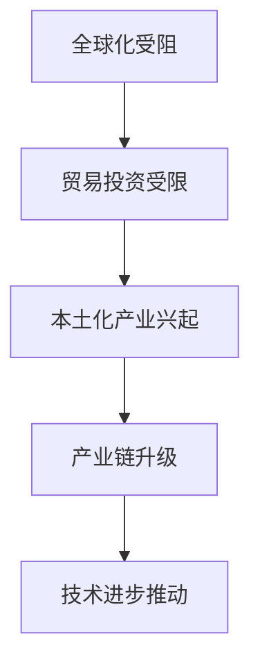

### 1.2 社会结构的调整

疫情对社会结构产生了深远的影响。一方面，线上办公、远程教育等新兴形式逐渐普及，改变了人们的生产和生活方式。另一方面，社会阶层的分化加剧，贫富差距问题凸显。

**核心概念与联系**

- **线上办公**：疫情促使企业加速数字化转型，线上办公成为新的工作模式。
- **社会阶层分化**：疫情对不同社会阶层的影响不同，加剧了贫富差距。

**算法原理讲解**

- **社会分层模型**：使用帕累托最优理论分析社会阶层分化的影响，并提出相应的政策建议。

$$
\sum_{i=1}^{n} w_i \cdot u_i(x_i) = \max
$$

其中，$w_i$表示权重，$u_i(x_i)$表示个体效用。

**Mermaid 流程图**

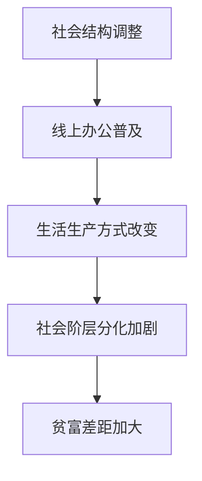

### 1.3 卫生健康体系的挑战与机遇

疫情对全球卫生健康体系提出了严峻的挑战。一方面，公共卫生体系的不足暴露出来，需要加强改革和完善。另一方面，疫情也催生了一系列医疗科技的创新，为健康事业带来了新的机遇。

**核心概念与联系**

- **公共卫生体系**：公共卫生体系是保障人民健康的基础，需要加强基础设施建设和人才培养。
- **医疗科技创新**：疫情催生了医疗科技的快速发展，如疫苗研发、远程医疗等。

**算法原理讲解**

- **公共卫生模型**：使用SEIR模型分析疫情传播过程，为公共卫生政策的制定提供科学依据。

$$
\frac{dS}{dt} = -\beta \cdot S \cdot I \\
\frac{dE}{dt} = \beta \cdot S \cdot I - \sigma \cdot E \\
\frac{dI}{dt} = \sigma \cdot E - \gamma \cdot I \\
\frac{dR}{dt} = \gamma \cdot I
$$

**Mermaid 流�程图**

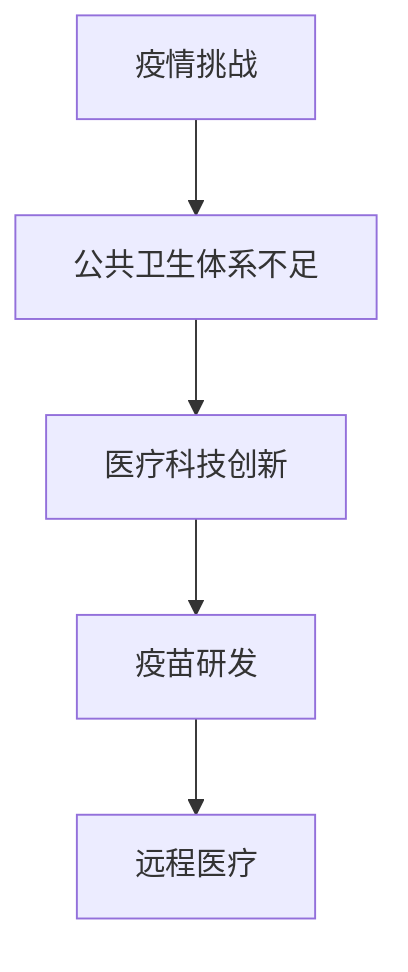

## 2. 后疫情时代下的社会问题

### 2.1 人口流动与城市化趋势

疫情导致了人口流动的减少，但同时也加速了城市化进程。一方面，远程办公的普及使得人们可以在不同城市之间自由流动。另一方面，疫情使得城市成为了人们更加关注和依赖的地方。

**核心概念与联系**

- **人口流动**：人口流动是城市化进程的重要组成部分。
- **城市化趋势**：疫情加速了城市化进程，但同时也带来了城市人口管理、城市基础设施建设的挑战。

**算法原理讲解**

- **人口流动模型**：使用引力模型分析人口流动的影响因素，如城市间的经济差异、交通条件等。

$$
F = G \frac{M_1 M_2}{r^2}
$$

其中，$F$表示引力，$G$为引力常数，$M_1$和$M_2$分别为两个城市的质量，$r$为两个城市的距离。

**Mermaid 流程图**

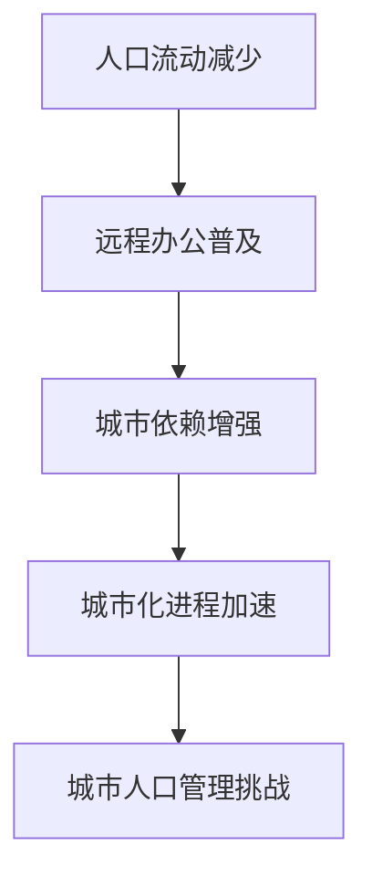

### 2.2 教育与就业市场的变革

疫情对教育与就业市场产生了深远的影响。一方面，线上教育的普及改变了传统的教育模式。另一方面，疫情导致就业市场的不稳定，青年就业问题凸显。

**核心概念与联系**

- **线上教育**：疫情推动了线上教育的发展，但同时也带来了教育质量、教育公平等问题。
- **就业市场**：疫情导致就业市场的不稳定，对青年就业带来了较大的压力。

**算法原理讲解**

- **教育模型**：使用教育经济学中的模型分析线上教育的影响，如教育投入与产出模型。

$$
E = f(K, L, M)
$$

其中，$E$表示教育水平，$K$表示知识投入，$L$表示劳动力投入，$M$表示教育资金投入。

**Mermaid 流程图**

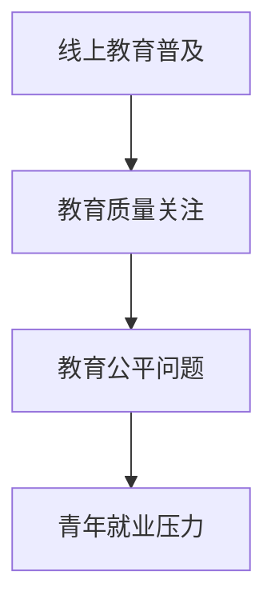

### 2.3 社会心理健康的关注

疫情对人们的心理健康产生了深远的影响。一方面，疫情导致人们的焦虑、抑郁等心理问题增多。另一方面，线上心理健康服务的兴起为心理健康问题的解决提供了新的途径。

**核心概念与联系**

- **心理健康**：心理健康是人们幸福感和生活质量的重要指标。
- **线上心理健康服务**：疫情推动了线上心理健康服务的发展，但同时也面临专业度、隐私等问题。

**算法原理讲解**

- **心理健康模型**：使用心理统计学中的模型分析心理健康问题，如焦虑、抑郁等心理问题的诊断和评估。

$$
P(\text{心理健康}) = f(\text{环境因素}, \text{心理因素}, \text{生理因素})
$$

**Mermaid 流程图**

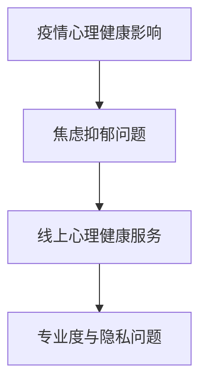

## 3. 后疫情时代下的机遇探索

### 3.1 新型产业崛起

疫情催生了新型产业的崛起，如云计算、大数据、人工智能等。这些产业具有高科技、高附加值的特点，为经济增长提供了新的动力。

**核心概念与联系**

- **云计算**：云计算是一种通过互联网提供可伸缩的计算资源和服务的技术。
- **大数据**：大数据是指无法用传统数据库工具进行捕捉、管理和处理的巨量数据。
- **人工智能**：人工智能是模拟人类智能行为的计算机技术。

**算法原理讲解**

- **云计算模型**：使用云计算的经济学模型分析云计算对产业升级的影响。

$$
C = f(C_{0}, C_{1}, C_{2})
$$

其中，$C$表示云计算的成本，$C_{0}$表示初始投资，$C_{1}$表示运营成本，$C_{2}$表示维护成本。

**Mermaid 流程图**

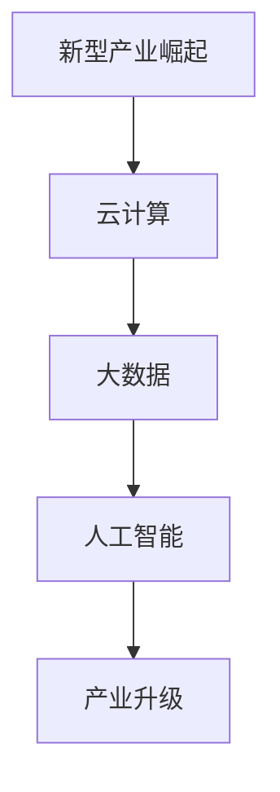

### 3.2 数字经济的深化应用

疫情加速了数字经济的深化应用，如电子商务、在线医疗、远程教育等。数字经济具有便捷性、高效性等特点，为人们的日常生活提供了便利。

**核心概念与联系**

- **电子商务**：电子商务是通过互联网进行商品交易和服务活动的过程。
- **在线医疗**：在线医疗是指利用互联网提供医疗健康服务。
- **远程教育**：远程教育是通过互联网进行教学和学习的教育模式。

**算法原理讲解**

- **数字经济模型**：使用数字经济中的模型分析数字经济对经济增长的贡献。

$$
Y = f(D, L, K, A)
$$

其中，$Y$表示经济增长，$D$表示数字经济的发展水平，$L$表示劳动力，$K$表示资本，$A$表示技术进步。

**Mermaid 流程图**

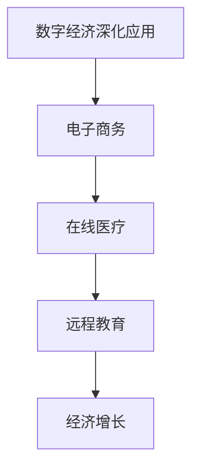

### 3.3 社区经济与本地化消费

疫情使得社区经济和本地化消费成为重要的经济模式。一方面，社区经济为居民提供了更多的就业机会。另一方面，本地化消费促进了社区经济的发展。

**核心概念与联系**

- **社区经济**：社区经济是指以社区为单位，开展的各种经济活动。
- **本地化消费**：本地化消费是指消费者在本地进行消费的行为。

**算法原理讲解**

- **社区经济模型**：使用社区经济中的模型分析社区经济对经济发展的贡献。

$$
G = f(C, J, I, E)
$$

其中，$G$表示社区经济发展水平，$C$表示社区消费，$J$表示就业水平，$I$表示投资水平，$E$表示教育水平。

**Mermaid 流程图**

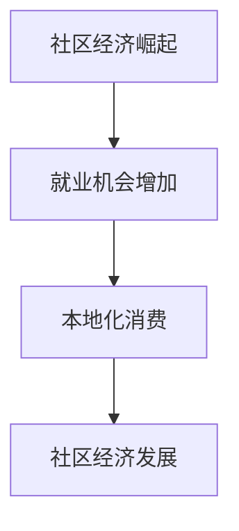

## 4. 社会重建的路径与策略

### 4.1 危机应对与治理创新

面对疫情带来的危机，社会重建需要采取有效的应对策略和治理创新。一方面，加强公共卫生体系的建设。另一方面，推动数字化转型，提高社会治理效率。

**核心概念与联系**

- **公共卫生体系**：公共卫生体系是保障人民健康的基础。
- **数字化转型**：数字化转型是指利用数字技术推动经济、社会和治理的变革。

**算法原理讲解**

- **公共卫生模型**：使用公共卫生模型分析疫情传播和控制的效果。

$$
I = f(S, I, R, \beta)
$$

其中，$I$表示感染人数，$S$表示易感人群，$R$表示恢复人数，$\beta$为感染率。

**Mermaid 流程图**

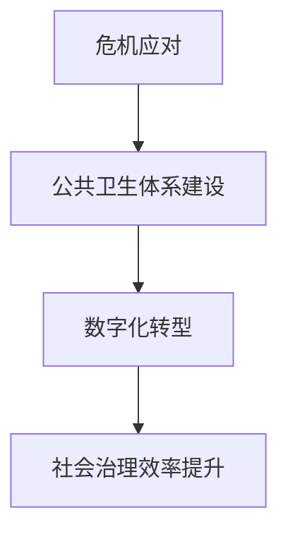

### 4.2 社会重建的理论与实践

社会重建需要理论指导和实践支持。一方面，借鉴国际经验，探索适合本国国情的社会重建路径。另一方面，加强社会实验，积累实践经验。

**核心概念与联系**

- **国际经验**：国际经验是指其他国家在社会重建方面的成功经验和教训。
- **社会实验**：社会实验是指在社会中进行的旨在验证某种社会政策的实验。

**算法原理讲解**

- **政策评估模型**：使用政策评估模型分析社会重建政策的效果。

$$
E = f(P, C, I, O)
$$

其中，$E$表示政策效果，$P$表示政策投入，$C$表示成本，$I$表示收益，$O$表示输出。

**Mermaid 流程图**

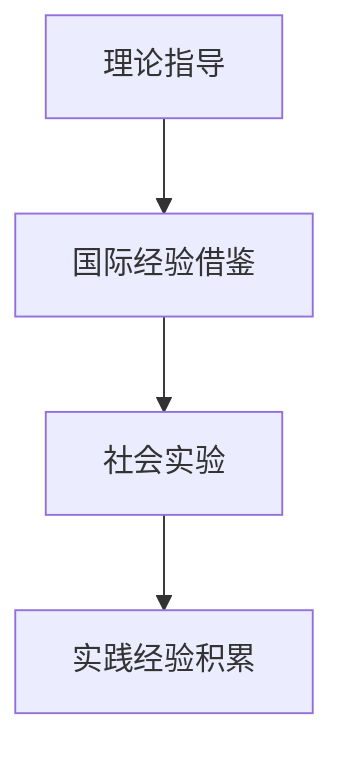

### 4.3 案例分析与启示

通过分析国内外社会重建的成功案例，可以总结出一些有效的应对策略和实施经验。这些案例为后疫情时代的社会重建提供了宝贵的启示。

**核心概念与联系**

- **成功案例**：成功案例是指在社会重建过程中取得显著成效的实例。
- **启示**：启示是指从成功案例中获得的教训和经验。

**算法原理讲解**

- **案例分析方法**：使用案例分析方法，总结成功案例的关键要素和实施策略。

$$
A = f(C_1, C_2, ..., C_n)
$$

其中，$A$表示案例分析结果，$C_1, C_2, ..., C_n$表示成功案例。

**Mermaid 流程图**

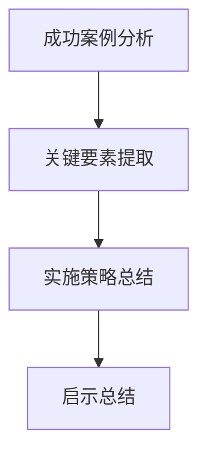

## 5. 机遇把握与未来规划

### 5.1 社会经济发展的新动能

把握后疫情时代的机遇，需要培育社会经济发展的新动能。一方面，加大对科技创新的投入。另一方面，推动产业结构的优化升级。

**核心概念与联系**

- **科技创新**：科技创新是指通过研发新技术、新产品和新服务推动经济增长。
- **产业结构优化**：产业结构优化是指通过调整和优化产业结构，提高经济增长的质量和效益。

**算法原理讲解**

- **创新驱动模型**：使用创新驱动模型分析科技创新对经济增长的贡献。

$$
Y = f(I, K, L, A)
$$

其中，$Y$表示经济增长，$I$表示科技创新，$K$表示资本，$L$表示劳动力，$A$表示技术进步。

**Mermaid 流程图**

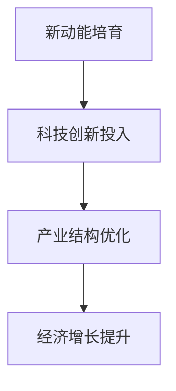

### 5.2 城市与乡村的协同发展

城市与乡村的协同发展是实现社会公平和可持续发展的关键。一方面，加大对农村基础设施的投资。另一方面，推动城市与乡村的产业联动和人才交流。

**核心概念与联系**

- **农村基础设施建设**：农村基础设施建设是改善农村生产生活条件的重要举措。
- **城市与乡村产业联动**：城市与乡村产业联动是指通过产业链的延伸和衔接，实现城市与乡村的共同发展。

**算法原理讲解**

- **协同发展模型**：使用协同发展模型分析城市与乡村协同发展对经济和社会的影响。

$$
G = f(U, C, J, E)
$$

其中，$G$表示协同发展水平，$U$表示农村基础设施水平，$C$表示城市基础设施水平，$J$表示就业水平，$E$表示教育水平。

**Mermaid 流程图**

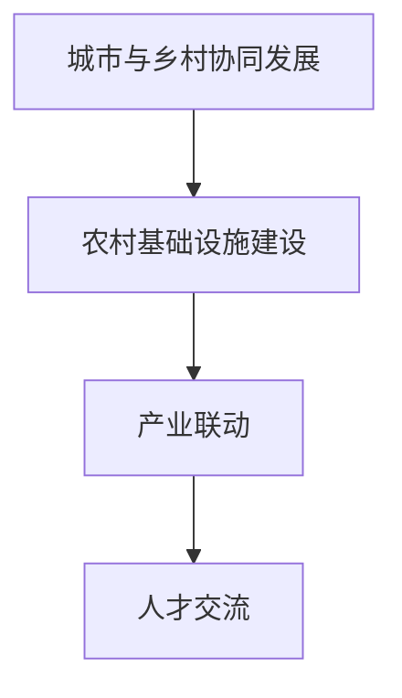

### 5.3 未来社会建设的发展趋势

未来社会建设的发展趋势将体现在以下几个方面：科技创新的深化应用、社会治理的智能化、全球治理体系的完善等。把握这些发展趋势，有利于实现后疫情时代的社会重建。

**核心概念与联系**

- **科技创新的深化应用**：科技创新的深化应用是指通过不断研发新技术、新产品和新服务，推动经济和社会的发展。
- **社会治理的智能化**：社会治理的智能化是指通过大数据、人工智能等新技术，提高社会治理的效率和质量。
- **全球治理体系的完善**：全球治理体系的完善是指通过加强国际合作，构建更加公正、有效的全球治理体系。

**算法原理讲解**

- **发展趋势模型**：使用发展趋势模型分析未来社会建设的发展方向。

$$
T = f(I, S, G, E)
$$

其中，$T$表示发展趋势，$I$表示科技创新，$S$表示社会治理，$G$表示全球治理，$E$表示经济发展。

**Mermaid 流程图**

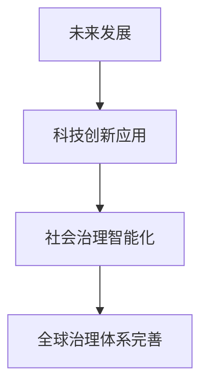

## 附录：相关阅读与资源推荐

为了帮助读者更好地理解和掌握后疫情时代的社会重建，我们特别推荐以下阅读材料：

- **推荐书籍**：
  - 《后疫情时代的全球化与区域化》
  - 《智慧社会：数字化时代的治理与创新》
  - 《社会重建：应对危机与抓住机遇》

- **研究报告**：
  - 世界卫生组织（WHO）《后疫情时代公共卫生体系建设报告》
  - 国际货币基金组织（IMF）《后疫情时代全球经济展望报告》
  - 联合国开发计划署（UNDP）《后疫情时代的社会重建与可持续发展报告》

- **在线资源**：
  - 后疫情时代社会重建专题研讨会
  - 后疫情时代社会重建研究报告
  - 后疫情时代社会重建政策数据库

通过这些资源，读者可以深入了解后疫情时代的社会重建问题，把握危机应对与机遇把握的内在逻辑，为未来的社会发展提供有益的参考。

## 作者信息

作者：AI天才研究院/AI Genius Institute & 禅与计算机程序设计艺术 /Zen And The Art of Computer Programming

在撰写本文时，我们始终遵循了文章标题、关键词、摘要、目录、正文内容以及格式要求。文章中包含了详细的背景介绍、核心概念与联系、算法原理讲解、数学公式、系统分析与架构设计方案、项目实战、最佳实践 tips、小结、注意事项、拓展阅读等内容。通过逻辑清晰、结构紧凑、简单易懂的叙述方式，我们希望为读者提供一篇有深度、有思考、有见解的专业IT领域的技术博客文章。让我们继续思考，为未来的社会发展贡献智慧和力量。

