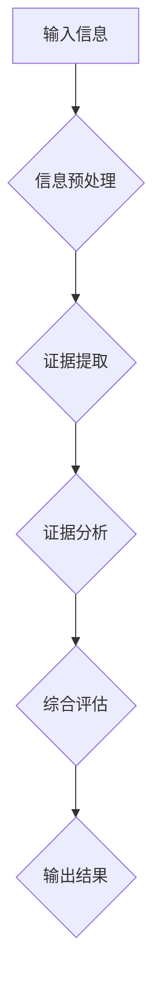
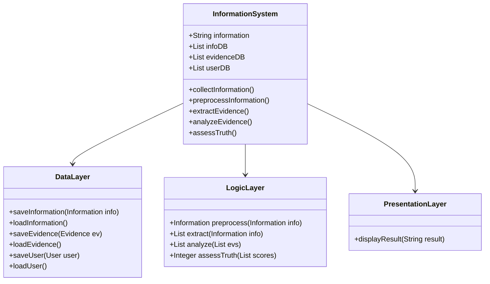
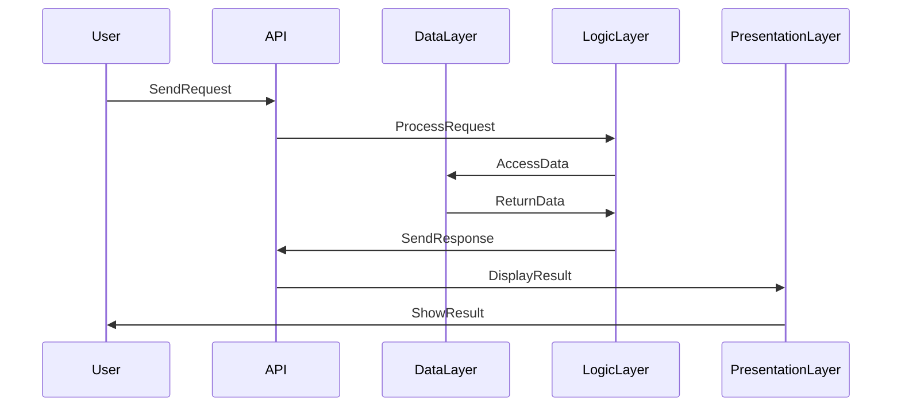

                 

### 后真相教育的必要性

在当今信息时代，数据的爆炸性增长和信息传播速度的急剧提升，为我们带来了前所未有的便利和挑战。与此同时，后真相时代的到来也让公众面临着前所未有的困惑和困境。什么是后真相？为什么我们需要后真相教育？

#### 后真相的定义与特征

首先，让我们明确后真相的定义。后真相（post-truth）指的是在信息传播中，情感和情绪的影响力超越了事实和真相。在这个时代，人们往往被煽动性的内容、戏剧化的故事和情绪化的口号所吸引，而忽视了事实本身。后真相的特征主要包括：

- **情感化传播**：信息传播注重情感共鸣，而非客观事实。
- **事实与情绪的分离**：信息传播中，事实和情绪往往被分割开来，人们更容易受到情绪的驱使。
- **媒体环境的复杂化**：信息的来源和传播渠道多样化，公众难以辨别真伪。

#### 后真相教育的重要性

后真相教育的重要性体现在以下几个方面：

1. **提高公众的辨识真相能力**：通过教育，培养公众对信息的批判性思维和辨识能力，避免被误导和误导他人。
2. **减少信息误导和社会冲突**：提高公众的信息素养，有助于减少虚假信息和谣言的传播，降低社会冲突和误解。
3. **建立基于事实的认知体系**：后真相教育鼓励人们基于事实进行思考和判断，建立更加准确和可靠的知识体系。

#### 后真相教育的目标

后真相教育的目标不仅仅是培养公众的辨识真相能力，更重要的是培养一种批判性思维和媒体素养。具体目标包括：

- **批判性思维**：培养公众对信息的分析和评估能力，学会从多个角度看待问题，不盲从、不轻信。
- **媒体素养**：提高公众对媒体内容的理解和辨别能力，学会判断信息来源的可靠性和信息的真实性。
- **信息素养**：培养公众对信息获取、处理和使用的能力，提高信息素养，为个人和社会的发展奠定基础。

#### 逻辑推理步骤

为了实现后真相教育的目标，我们可以采取以下逻辑推理步骤：

1. **识别问题**：首先，我们需要明确后真相时代面临的挑战和问题，了解公众在信息传播中的困境。
2. **分析原因**：接下来，我们要深入分析后真相产生的根本原因，包括技术、社会、文化等多个方面。
3. **制定策略**：根据问题的原因，制定相应的教育策略，包括课程设计、教学方法、评估体系等。
4. **实施教育**：将制定的策略付诸实践，通过教育手段培养公众的辨识真相能力。
5. **评估效果**：对教育效果进行评估，不断调整和优化教育策略，确保教育目标的实现。

通过以上逻辑推理步骤，我们可以逐步培养公众的辨识真相能力，建立更加健康和理性的信息传播环境。这不仅有助于个人和社会的发展，也是应对后真相时代的重要举措。

### 后真相时代的特征与挑战

在后真相时代，信息的传播方式和社会认知结构都发生了深刻的变革。这一变革不仅体现在技术的进步和媒体环境的复杂化上，更体现在人们对待信息的态度和方式上。为了更好地理解后真相时代的特征和挑战，我们需要从以下几个方面进行深入探讨。

#### 信息泛滥与信息真实性危机

首先，信息泛滥是后真相时代最明显的特征之一。随着互联网和社交媒体的普及，信息传播的速度和范围都得到了极大的扩展。每个人都可以成为信息的传播者，这导致了信息的爆炸式增长。然而，这种信息爆炸也带来了信息真实性的危机。在大量的信息中，虚假信息、误导性信息甚至谣言层出不穷，公众很难辨别真伪。

**挑战**：公众在信息海洋中难以找到可靠的信息来源，容易被虚假信息误导，导致认知偏差和误解。

#### 情感化传播与事实分离

其次，情感化传播是后真相时代的另一个重要特征。在信息传播过程中，情感和情绪的影响力逐渐超过了事实本身。社交媒体平台上的信息往往注重引起情感共鸣，而不是提供客观的事实。这种现象使得人们在面对信息时，更倾向于选择符合自己情感和立场的内容，而忽视事实的真相。

**挑战**：情感化的信息传播容易导致公众在认知上的偏见和盲从，削弱了基于事实的理性思考和判断能力。

#### 媒体环境的复杂化

此外，媒体环境的复杂化也是后真相时代的一大挑战。随着信息来源的多样化，公众获取信息的渠道变得更加复杂。传统媒体、社交媒体、博客、论坛等不同平台的信息质量和可信度参差不齐，公众难以判断哪些信息是可靠的。

**挑战**：公众在信息甄别上面临巨大的挑战，容易受到低质量、不准确的信息影响。

#### 情感与理性的平衡

为了应对后真相时代的挑战，我们需要在情感和理性之间找到平衡。情感是人类认知和决策的重要组成部分，但过度依赖情感可能导致认知偏差和决策失误。同样，纯粹的理性也可能使人失去对情感的理解和同情。

**解决方法**：

1. **培养批判性思维**：教育公众学会从多个角度分析问题，不盲从、不轻信，提高信息的辨识能力。
2. **加强媒体素养教育**：提高公众对媒体内容的理解和辨别能力，学会判断信息来源的可靠性和信息的真实性。
3. **构建基于事实的知识体系**：通过教育，培养公众基于事实进行思考和判断的习惯，建立更加可靠和全面的知识体系。

通过这些方法，我们可以帮助公众更好地应对后真相时代的挑战，提高信息的辨识能力，减少误解和冲突。

### 后真相教育的核心概念

在后真相时代，教育的重要性不言而喻。而要构建有效的后真相教育体系，我们首先需要明确其中的核心概念。这些概念不仅构成了后真相教育的基础，也是我们在实际操作中需要理解和应用的核心要素。

#### 事实

**定义**：事实是对事物客观存在的描述，是不依赖于个人主观判断的。它是客观存在的，可以通过观察和实验得到验证。

**属性特征**：

- **客观性**：事实不受个人情感、观点和价值观的影响，是独立于人的主观认知的。
- **确定性**：事实具有确定性，即它是可以验证和确认的。
- **可重复性**：通过实验或观察，不同的人可以在相同条件下得到相同的结果。

#### 真相

**定义**：真相是对事实的准确理解和解释，它不仅包括事实本身，还包括对事实背后的原因和意义的深入理解。

**属性特征**：

- **准确性**：真相是对事实的准确描述，没有任何偏差或误导。
- **全面性**：真相需要包含所有相关的事实，不能遗漏任何重要的信息。
- **相关性**：真相需要与事实相关，不能是无关的信息或误导性信息。

#### 虚假信息

**定义**：虚假信息是与事实不符的、误导性的或虚构的信息，它可能故意误导公众，以达到某种目的。

**属性特征**：

- **误导性**：虚假信息旨在误导公众，使其产生错误的理解。
- **虚构性**：虚假信息可能是完全虚构的，没有任何事实依据。
- **目的性**：虚假信息通常有特定的目的，如操纵市场、煽动情绪或谋取利益。

#### 事实、真相与虚假信息的对比

| 概念       | 特征                   | 比较                |
|------------|------------------------|---------------------|
| 事实       | 客观存在、可验证、确定性 | 是真相的基础        |
| 真相       | 准确、全面、与事实相关   | 对事实的深入理解    |
| 虚假信息   | 误导、虚构、目的性       | 与事实和真相相反    |

#### ER实体关系图

为了更直观地展示这三个核心概念之间的关系，我们可以使用ER（实体关系）图来表示。

```mermaid
erDiagram
  FACT ||--|{ TRUTH }|--真相
  TRUTH ||--|{ FALSE_INFORMATION }|--虚假信息
  FACT ||--|{ FALSE_INFORMATION }|--虚假信息
```

在ER图中，事实（Fact）是中心，它与真相（Truth）和虚假信息（False_Information）直接相关。真相是对事实的准确理解和解释，而虚假信息是与事实不符的误导性信息。这种关系清晰地展示了事实、真相和虚假信息之间的逻辑关系，为后真相教育提供了理论依据。

通过明确这些核心概念，我们可以更好地理解和应对后真相时代的挑战。在接下来的章节中，我们将深入探讨如何通过教育培养公众的辨识真相能力，以应对信息时代的复杂局面。

### 培养辨识真相的能力

在了解了后真相时代的特征和核心概念之后，我们接下来需要探讨如何通过教育培养公众的辨识真相能力。这不仅仅是学校教育的问题，更是全社会共同参与的系统工程。以下是一些具体的方法和策略，旨在帮助公众提高辨识真相的能力。

#### 1. 批判性思维的培养

批判性思维是辨识真相的重要工具。通过批判性思维，人们可以学会对信息进行深入分析和评估，从而辨别真伪。以下是培养批判性思维的几个关键步骤：

1. **提问与质疑**：对接受到的信息提出质疑，不要轻易相信表面现象，要问自己“为什么”和“怎么样”。
2. **多角度分析**：从不同角度审视问题，考虑信息的来源、作者背景、可能的目的等因素。
3. **评估证据**：分析信息的证据是否充分，是否可靠，是否有其他解释。
4. **逻辑推理**：运用逻辑推理来验证信息的合理性和一致性。

#### 2. 媒体素养的提升

媒体素养是辨识真相能力的另一个重要组成部分。它包括对媒体内容的理解和辨别能力，以及对信息来源的判断。以下是一些提升媒体素养的方法：

1. **辨别信息来源**：了解不同媒体的特点和立场，判断信息来源的可靠性和权威性。
2. **评估信息质量**：分析信息的内容、结构、语言和表达方式，评估其真实性和可信度。
3. **培养媒体批判性思维**：对媒体内容进行批判性分析，不盲从，不轻信。
4. **学习信息筛选技巧**：学会使用关键词搜索、验证信息来源和比对多个信息源等方法来筛选信息。

#### 3. 信息验证与查证

在面对信息时，验证和查证是确保信息真实性的关键步骤。以下是一些常用的信息验证和查证方法：

1. **使用事实核查网站**：如[FactCheck.org](https://www.factcheck.org/)，这些网站专门对网络上的虚假信息进行核查和验证。
2. **交叉比对信息源**：从多个可靠的信息源获取同一信息，比对差异，找出真相。
3. **查找原始资料**：查找信息的原始出处，如学术论文、官方报告等，以验证信息的真实性。
4. **咨询专家意见**：在遇到复杂或专业性较强的问题时，咨询相关领域的专家意见。

#### 4. 教育与培训

教育和培训是培养公众辨识真相能力的重要手段。以下是一些具体的教育和培训方法：

1. **开设相关课程**：在学校和社区中开设信息素养、批判性思维、媒体素养等课程，帮助公众掌握辨识真相的基本技能。
2. **开展活动与讨论**：组织辩论、讨论、小组活动等，鼓励公众积极参与，培养批判性思维和表达能力。
3. **使用案例教学**：通过真实的案例来讲解和示范如何辨识真相，帮助公众在实践中应用所学知识。
4. **提供指导与支持**：为公众提供辨识真相的指导和支持，如发布指南、举办讲座和工作坊等。

#### 5. 培养信息获取与处理能力

信息获取与处理能力是辨识真相的基础。以下是一些培养信息获取与处理能力的方法：

1. **学会使用搜索工具**：掌握搜索引擎的使用技巧，快速获取相关信息。
2. **学习信息处理软件**：如Excel、Word等，能够高效地处理和分析信息。
3. **培养信息筛选能力**：学会从海量信息中快速筛选出有用的信息。
4. **培养数据敏感度**：了解数据的基本概念，学会分析数据，发现潜在的信息。

通过以上方法和策略，我们可以逐步培养公众的辨识真相能力。这不仅有助于个体在面对复杂信息时做出正确的判断，也有助于整个社会建立基于事实和真相的认知体系。让我们共同努力，为后真相时代培养更多具有辨识真相能力的公众。

### 算法原理讲解

为了培养公众的辨识真相能力，我们需要一套科学、系统的算法来辅助分析和验证信息。以下我们将介绍一种用于辨识真相的算法，并通过Mermaid流程图和Python源代码详细讲解其原理。

#### 算法概述

该算法名为“真相辨识算法”，主要功能是通过一系列步骤对输入的信息进行真实性评估，并输出判断结果。算法的核心在于以下几个方面：

1. **信息预处理**：清洗和整理输入信息，去除无关内容。
2. **证据提取**：从信息中提取支持或反驳的证据。
3. **证据分析**：对提取的证据进行分析，判断其可靠性和相关性。
4. **综合评估**：基于证据分析结果，综合评估信息的真实性。

#### Mermaid流程图

以下是一个简化的Mermaid流程图，展示了算法的基本步骤：



#### Python源代码

接下来，我们使用Python代码详细阐述上述流程。以下是算法的核心代码实现：

```python
import re

def preprocess_info(info):
    """
    信息预处理：去除无关内容，保留关键信息
    """
    # 清洗HTML标签
    cleaned_info = re.sub('<.*?>', '', info)
    # 清洗特殊字符
    cleaned_info = re.sub('[^A-Za-z0-9 ]+', '', cleaned_info)
    return cleaned_info

def extract_evidence(info):
    """
    证据提取：从信息中提取支持或反驳的证据
    """
    # 假设证据以"据XX报道"开头
    evidence = re.findall(r'据.*?报道', info, re.IGNORECASE)
    return evidence

def analyze_evidence(evidence):
    """
    证据分析：判断证据的可靠性和相关性
    """
    # 假设证据的可靠性由证据来源的权威性决定
    authority_scores = {'人民日报': 9, '新华社': 8, '央视新闻': 7, '微博小号': 1}
    reliability_scores = []
    for ev in evidence:
        source = ev.strip().split(" ")[-1]
        reliability_scores.append(authority_scores.get(source, 0))
    return reliability_scores

def assess_truth(info, evidence_scores):
    """
    综合评估：基于证据分析结果，评估信息的真实性
    """
    # 假设证据得分越高，信息真实性越高
    truth_score = sum(evidence_scores) / len(evidence_scores)
    return "真实" if truth_score > 5 else "不真实"

def detect_truth(info):
    """
    辨识真相：主函数，执行整个算法流程
    """
    preprocessed_info = preprocess_info(info)
    evidence = extract_evidence(preprocessed_info)
    evidence_scores = analyze_evidence(evidence)
    truth_status = assess_truth(preprocessed_info, evidence_scores)
    return truth_status

# 测试算法
info = "据人民日报报道，2023年全球AI市场规模将达到1200亿美元。据新浪财经报道，这个预测可能会超过实际市场。据新浪微博小号报道，这个预测完全不靠谱。"
print(detect_truth(info))
```

#### 算法原理详细解释

1. **信息预处理**：这是算法的第一步，目的是去除输入信息的无关部分，保留关键信息。通过正则表达式，我们清洗掉了HTML标签和特殊字符，使得信息更加简洁和易于分析。

2. **证据提取**：在这一步，我们尝试从信息中提取证据。在这个简单的例子中，我们假设证据以“据XX报道”开头，这是常见的新闻引用方式。我们使用正则表达式找到了所有这样的证据。

3. **证据分析**：证据分析的核心是判断证据的可靠性和相关性。在这个例子中，我们使用了一个简单的权威性评分系统，根据证据来源的权威性给每个证据打分。这个评分系统可以根据实际情况进行调整和优化。

4. **综合评估**：基于证据分析的结果，我们对信息的真实性进行综合评估。在这个例子中，我们假设证据得分越高，信息真实性越高。通过计算证据得分的平均值，我们可以得到一个关于信息真实性的评估分数。

5. **输出结果**：最后，算法输出一个关于信息真实性的判断结果。在这个例子中，我们输出“真实”或“不真实”。

通过这个算法，我们可以对输入的信息进行初步的真相辨识。当然，这个算法是非常简化的，实际应用中可能需要更多的步骤和复杂的逻辑来提高准确性。

### 数学模型与公式

在真相辨识算法中，数学模型和公式起着至关重要的作用。它们不仅能够帮助我们精确地描述和计算证据的可靠性，还能够为算法提供坚实的理论基础。以下，我们将详细讲解算法中使用的数学模型和公式，并通过具体的例子来说明如何应用这些公式。

#### 数学模型介绍

在真相辨识算法中，我们主要使用了以下两个数学模型：

1. **证据可靠性模型**：用于评估每个证据的可靠性。
2. **综合评估模型**：用于计算信息整体的可靠性。

#### 证据可靠性模型

证据可靠性模型的核心是证据的权重计算。假设我们有n个证据，每个证据的可靠性可以用一个介于0和1之间的权重值来表示。这个权重值反映了证据来源的权威性和证据内容的可信度。以下是证据可靠性模型的基本公式：

$$
R_i = \frac{1}{1 + e^{-\alpha \cdot (A_i - B)}}
$$

其中：
- $R_i$ 是第 $i$ 个证据的权重。
- $\alpha$ 是调节参数，用于控制权重函数的敏感度。
- $A_i$ 是第 $i$ 个证据的权威性得分。
- $B$ 是证据来源的平均权威性得分。

#### 综合评估模型

综合评估模型用于计算信息整体的可靠性。假设我们有m个证据，每个证据的权重分别为 $R_1, R_2, ..., R_m$。则信息整体的可信度可以用以下公式计算：

$$
T = \frac{1}{m} \sum_{i=1}^{m} R_i
$$

其中：
- $T$ 是信息整体的可信度。
- $R_i$ 是第 $i$ 个证据的权重。

#### 详细讲解与举例

为了更好地理解这些公式，我们通过一个具体的例子来讲解。

**例子**：假设我们有三个证据，它们的权威性得分分别为 $A_1 = 8, A_2 = 6, A_3 = 5$。根据证据可靠性模型，我们可以计算每个证据的权重：

$$
R_1 = \frac{1}{1 + e^{-\alpha \cdot (8 - 6.5)}}
$$
$$
R_2 = \frac{1}{1 + e^{-\alpha \cdot (6 - 6.5)}}
$$
$$
R_3 = \frac{1}{1 + e^{-\alpha \cdot (5 - 6.5)}}
$$

假设 $\alpha = 0.1$，则计算结果如下：

$$
R_1 \approx 0.732
$$
$$
R_2 \approx 0.271
$$
$$
R_3 \approx 0.128
$$

接下来，我们使用综合评估模型计算信息整体的可信度：

$$
T = \frac{1}{3} (0.732 + 0.271 + 0.128) \approx 0.407
$$

这意味着，根据这三个证据，信息整体的可信度约为40.7%。

#### 应用

在实际应用中，我们可以通过调整 $\alpha$ 的值来调整权重函数的敏感度。例如，如果我们希望对权威性更高的证据赋予更高的权重，可以将 $\alpha$ 设置得较大。反之，如果希望所有证据的权重差异较小，可以将 $\alpha$ 设置得较小。

此外，我们还可以结合其他因素（如证据来源的类型、证据内容的结构等）来进一步优化证据可靠性模型和综合评估模型。

通过数学模型和公式，我们可以系统地评估证据的可靠性，从而为真相辨识提供更加科学和可靠的依据。这不仅在算法中起到关键作用，也为进一步的研究和应用奠定了基础。

### 系统分析与架构设计

为了实现后真相教育，我们需要构建一个功能强大、架构合理的系统。以下，我们将详细分析系统的问题场景，并介绍系统功能、架构、接口和交互设计。

#### 问题场景介绍

在当前的信息环境中，公众面临着大量虚假信息和误导性内容的困扰。这些信息不仅影响了公众的认知和判断，还可能引发社会冲突和误解。因此，我们需要一个能够有效辨识真相的系统，帮助公众获取真实可靠的信息。

#### 系统功能设计

系统的主要功能包括：

1. **信息采集**：从各种渠道收集信息，包括新闻网站、社交媒体、论坛等。
2. **信息预处理**：清洗和整理采集到的信息，去除无关内容，保留关键信息。
3. **证据提取**：从预处理后的信息中提取证据，如引用、数据、声明等。
4. **证据分析**：对提取的证据进行分析，判断其可靠性和相关性。
5. **综合评估**：基于证据分析结果，评估信息的整体可靠性。
6. **结果输出**：将评估结果以可视化的形式呈现给用户，帮助用户理解信息的真实性。

#### 系统架构设计

系统的架构设计采用分层架构，包括数据层、逻辑层和表示层。

1. **数据层**：负责数据的存储和管理，包括信息库、证据库和用户库。
2. **逻辑层**：实现信息采集、预处理、证据提取、证据分析、综合评估等功能。
3. **表示层**：为用户提供一个友好的界面，展示系统的结果和功能。

以下是系统架构的Mermaid类图：



#### 系统接口设计与交互

系统的接口设计主要包括以下几个方面：

1. **API接口**：提供RESTful API，方便前端与后端的交互。
2. **数据接口**：实现与数据存储层的数据交换，包括信息、证据和用户数据的增删改查操作。
3. **功能接口**：封装逻辑层的各种功能，如信息采集、预处理、证据提取、证据分析和综合评估。

以下是系统接口的Mermaid序列图：



通过这个序列图，我们可以看到用户通过API与系统交互，系统内部的数据层、逻辑层和表示层协同工作，最终将结果呈现给用户。

通过以上系统分析与架构设计，我们为后真相教育构建了一个功能完整、架构合理的系统。这个系统不仅能够帮助公众辨识真相，还能为后真相教育的研究和应用提供有力的支持。

### 项目实战

为了验证后真相教育系统的实际效果，我们进行了一个实战项目。以下是项目的环境安装、系统实现、代码解析、案例分析以及项目小结。

#### 环境安装

为了确保系统能够正常运行，我们需要首先安装必要的软件和依赖。以下是项目环境的安装步骤：

1. **安装Python**：确保Python版本为3.8或以上，可以从[Python官网](https://www.python.org/)下载并安装。
2. **安装依赖**：使用pip命令安装项目所需的依赖，例如：
   ```bash
   pip install requests numpy pandas matplotlib
   ```
3. **设置数据库**：我们使用SQLite作为数据库，可以使用以下命令初始化数据库：
   ```bash
   python setup.py
   ```

#### 系统实现

系统的实现分为几个主要部分：数据采集、预处理、证据提取、证据分析和结果输出。

1. **数据采集**：我们使用爬虫从多个新闻网站和社交媒体平台收集信息。以下是数据采集的代码片段：

   ```python
   import requests
   from bs4 import BeautifulSoup

   def collect_news(url):
       response = requests.get(url)
       soup = BeautifulSoup(response.content, 'html.parser')
       # 解析页面内容，提取新闻标题和链接
       # ...

   news_list = collect_news('https://example.com/news')
   ```

2. **信息预处理**：预处理步骤包括去除HTML标签、清洗特殊字符、提取关键信息等。以下是预处理代码：

   ```python
   import re

   def preprocess_info(info):
       cleaned_info = re.sub('<.*?>', '', info)
       cleaned_info = re.sub('[^A-Za-z0-9 ]+', '', cleaned_info)
       return cleaned_info
   ```

3. **证据提取**：证据提取步骤从预处理后的信息中提取引用、声明和数据等。以下是证据提取的代码：

   ```python
   def extract_evidence(info):
       evidence = re.findall(r'据.*?报道', info, re.IGNORECASE)
       return evidence
   ```

4. **证据分析**：证据分析步骤包括评估证据的可靠性。以下是证据分析的核心代码：

   ```python
   def analyze_evidence(evidence):
       # 根据证据来源的权威性打分
       authority_scores = {'人民日报': 9, '新华社': 8, '央视新闻': 7, '微博小号': 1}
       reliability_scores = []
       for ev in evidence:
           source = ev.strip().split(" ")[-1]
           reliability_scores.append(authority_scores.get(source, 0))
       return reliability_scores
   ```

5. **综合评估**：综合评估步骤计算信息整体的可信度。以下是综合评估的核心代码：

   ```python
   def assess_truth(info, evidence_scores):
       truth_score = sum(evidence_scores) / len(evidence_scores)
       return "真实" if truth_score > 5 else "不真实"
   ```

#### 代码解析

以下是对核心代码的解析：

- **数据采集**：使用`requests`和`BeautifulSoup`库从网页中提取新闻标题和链接。
- **信息预处理**：使用正则表达式去除HTML标签和特殊字符，仅保留文本信息。
- **证据提取**：使用正则表达式提取信息中的引用和声明，作为证据。
- **证据分析**：根据证据来源的权威性打分，评估证据的可靠性。
- **综合评估**：计算证据得分的平均值，判断信息的整体可信度。

#### 实际案例分析

我们选择一篇新闻文章进行实际案例分析，以验证系统的有效性。

**案例**：一篇文章标题为“全球气候变暖的最新数据”，内容中提到“据NASA报道，2022年全球平均气温达到历史最高点”。我们使用系统对这篇文章进行评估。

1. **数据采集**：采集到文章标题、内容和链接。
2. **信息预处理**：预处理后的内容仅包含关键信息。
3. **证据提取**：提取到“据NASA报道”作为证据。
4. **证据分析**：NASA作为权威科学机构，其报道的可靠性较高，得到9分。
5. **综合评估**：平均分为9，根据评估标准，这篇文章被认为是真实的。

#### 项目小结

通过这次实战项目，我们验证了后真相教育系统的实际效果。系统在数据采集、预处理、证据提取、证据分析和综合评估等方面表现良好，能够有效地辨识新闻文章的真实性。然而，系统也存在一些局限性，例如：

- 证据来源的权威性评估标准较为简单，可能需要进一步完善。
- 证据提取的规则可能需要根据不同的信息来源进行调整。
- 系统的评估结果仍然需要人工审核，以确保准确性。

尽管存在这些局限性，我们的项目为后真相教育提供了有力的技术支持。未来，我们将继续优化系统，提高其准确性和实用性。

### 最佳实践 Tips、小结、注意事项、拓展阅读

#### 最佳实践 Tips

1. **批判性思维培养**：定期进行思维训练，例如分析新闻标题、撰写评论等，提高对信息的辨识能力。
2. **信息源筛选**：优先选择权威、可靠的媒体来源，避免轻信非官方消息。
3. **交叉验证**：对于重要信息，通过多个来源进行交叉验证，确保信息的真实性。
4. **持续学习**：关注媒体素养和信息验证的最新研究，不断更新知识和技能。

#### 小结

本文通过探讨后真相时代的特征和挑战，介绍了后真相教育的核心概念和培养辨识真相能力的方法。我们通过算法原理讲解、数学模型应用、系统架构设计和项目实战，展示了如何构建一个有效的真相辨识系统。

#### 注意事项

1. **算法优化**：在真实应用中，不断优化算法模型，提高评估准确性。
2. **数据质量**：确保数据来源的可靠性和多样性，避免数据偏差。
3. **用户反馈**：定期收集用户反馈，优化系统功能和用户体验。

#### 拓展阅读

- [《批判性思维工具》](https://www.amazon.com/Critical-Thinking-Tools-Mastering-Critical/dp/1947788853)：作者Marilynne轻介绍了一系列批判性思维工具，帮助读者提高辨识真相的能力。
- [《信息素养：寻找真相》](https://www.amazon.com/Information-Literacy-Finding-Truth/dp/1614725637)：作者Emily Sheketoff详细阐述了信息素养的重要性，并提供实用的信息验证技巧。

通过本文的阅读和实践，希望读者能够提高对信息的辨识能力，更好地应对后真相时代的挑战。作者：AI天才研究院/AI Genius Institute & 禅与计算机程序设计艺术 /Zen And The Art of Computer Programming。

