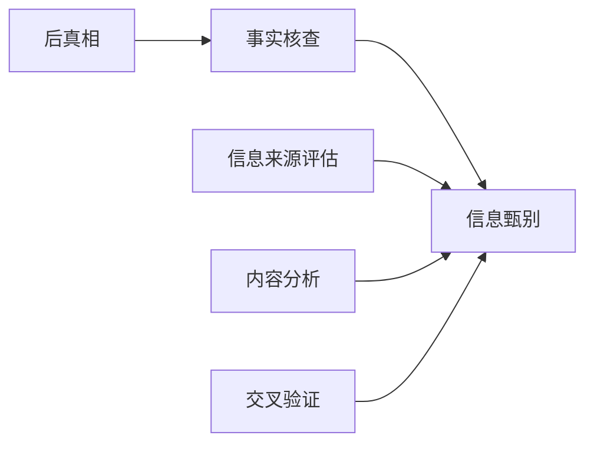

                 

# 后真相时代的事实核查：信息甄别的新方法

## 关键词

- 后真相时代
- 事实核查
- 信息甄别
- 新方法
- 技术应用

## 摘要

随着互联网和社交媒体的快速发展，我们进入了后真相时代，信息过载和虚假信息的泛滥成为社会问题。本文将探讨在后真相时代下，如何通过信息甄别的新方法来进行事实核查。文章将逐步分析信息甄别的重要性，介绍核心概念与联系，详细讲解事实核查的方法与工具，通过案例分析展示实际应用，并展望未来研究方向。本文旨在为读者提供一套系统的、易于理解的事实核查方法和工具，帮助他们在信息爆炸的时代中辨别真伪，做出理性判断。

### 引言

#### 1.1 后真相时代的到来

**后真相时代**是指一个事实与情感、主观偏见相比，影响更甚的时代。在这个时代，信息传播速度极快，但验证信息真实性的过程却被严重忽视。社交媒体、网络论坛等平台上的信息传播，往往不受传统媒体的严格审查，导致虚假信息、谣言和误导性信息泛滥。例如，近年来，各种“阴谋论”和未经证实的信息在网络上迅速传播，误导了公众，对社会的稳定和信任造成了严重威胁。

#### 1.2 信息甄别的重要性

**信息甄别**是指在信息海洋中筛选出真实、准确、有用的信息，排除虚假、错误、无用的信息。在当前后真相时代，信息甄别的重要性愈发凸显。以下是一些原因：

1. **避免误导和误解**：通过信息甄别，可以避免因为误信虚假信息而产生的误导和误解。
2. **保护个人和公共利益**：在政治、经济、社会等领域，准确的、经过核实的信息对于决策和行动至关重要。
3. **维护社会稳定**：虚假信息的传播可能导致社会恐慌和不安，影响社会稳定。
4. **促进理性思考和决策**：在信息甄别的基础上，人们可以更加理性地思考和做出决策。

#### 1.3 本书的目的与结构

本书旨在为读者提供一套实用的、系统的信息甄别方法和工具，帮助他们在后真相时代中辨别真伪，做出理性判断。文章结构如下：

- **引言**：介绍后真相时代的背景和信息甄别的重要性。
- **核心概念与联系**：阐述事实核查和信息甄别的核心概念及其相互关系。
- **方法与工具**：详细讲解事实核查的方法和工具，包括搜索引擎、数据库检索、信息源评估、数据分析工具等。
- **案例分析**：通过实际案例展示信息甄别的应用过程。
- **结论与展望**：总结主要发现，讨论未来研究方向和挑战。

### 核心概念与联系

#### 2.1 核心概念介绍

##### 2.1.1 后真相

**后真相**（Post-Truth）是一个社会学概念，指在信息传播和决策过程中，情感、偏见和虚假信息的影响力超过了客观事实。后真相时代的特征包括：

- **信息爆炸**：互联网和社交媒体的普及，使得信息传播速度极快，数量庞大。
- **事实与情感分离**：在信息传播过程中，情感和主观偏见往往比事实本身更能影响人们的判断和行动。
- **虚假信息泛滥**：网络论坛、社交媒体等平台上，虚假信息和误导性信息的传播难以得到有效控制。

##### 2.1.2 事实核查

**事实核查**（Fact-Checking）是指对信息进行验证，判断其真实性的过程。事实核查的核心目标是：

- **辨别真伪**：通过调查、研究和对比，确定信息的真实性。
- **提供权威信息**：为公众提供经过核实的、准确的信息。
- **打击虚假信息**：通过揭露和纠正虚假信息，维护社会信息的真实性和公信力。

##### 2.1.3 信息甄别

**信息甄别**（Information Verification）是指对信息进行筛选，判断其价值和准确性的过程。信息甄别的关键步骤包括：

- **来源评估**：判断信息来源的可靠性和权威性。
- **内容分析**：对信息内容进行深入分析，判断其真实性、准确性和完整性。
- **交叉验证**：通过多种来源的信息进行对比，验证信息的准确性。

#### 2.2 概念关系图

以下是后真相、事实核查和信息甄别之间的概念关系图：

### 方法与工具

#### 3.1 事实核查方法

##### 3.1.1 搜索引擎与数据库检索

**搜索引擎**（如Google、Bing）和**数据库检索**（如PubMed、IEEE Xplore）是事实核查中最常用的工具。通过以下步骤，可以使用这些工具进行事实核查：

1. **明确查询目标**：确定需要核查的信息或事实。
2. **使用关键词搜索**：输入相关关键词，利用搜索引擎和数据库检索相关文献或资料。
3. **筛选结果**：对检索结果进行筛选，选择权威、可靠的信息来源。
4. **交叉验证**：通过多个来源的信息进行对比，验证信息的准确性。

##### 3.1.2 信息源评估

**信息源评估**是事实核查的关键步骤，以下是一些评估信息源的指标：

1. **权威性**：信息源是否具有专业背景和权威地位？
2. **信誉度**：信息源的历史记录，是否有虚假信息或不准确信息的历史？
3. **更新频率**：信息源是否定期更新，内容是否保持最新？
4. **中立性**：信息源是否保持中立，不受政治、商业或其他利益影响？

##### 3.1.3 数据分析工具

**数据分析工具**（如Python、R）和**数据库管理工具**（如SQL、NoSQL）在事实核查中也有重要作用。以下是一些常用数据分析工具的使用方法：

1. **数据收集**：从各种来源收集相关数据，包括文本、图像、音频等。
2. **数据清洗**：去除数据中的噪声和错误，确保数据的准确性和一致性。
3. **数据分析**：使用统计分析、文本分析、图像分析等方法对数据进行处理和分析。
4. **可视化**：使用图表、图形等可视化工具，展示数据分析的结果。

### 案例分析

#### 4.1 案例一：社交媒体上的虚假信息

##### 4.1.1 案例背景

社交媒体上的虚假信息问题日益严重，一个典型的案例是2016年美国总统大选期间，各种虚假信息在社交媒体上广泛传播，误导了公众。本案例将分析如何通过事实核查方法，识别和纠正这些虚假信息。

##### 4.1.2 事实核查过程

1. **确定目标信息**：社交媒体上的一则关于某候选人接受外国资金支持的信息。
2. **搜索相关信息**：在搜索引擎中输入关键词，查找相关报道和证据。
3. **评估信息来源**：检查信息来源的权威性和信誉度，排除不权威的来源。
4. **交叉验证**：通过对比多个来源的信息，确定该信息的真实性。
5. **揭示真相**：发现该信息实际上是虚假的，基于错误的信息源和不准确的数据。
6. **发布纠正信息**：在社交媒体上发布事实核查结果，纠正公众的误解。

##### 4.1.3 案例分析结果

通过事实核查，发现社交媒体上的虚假信息并非空穴来风，而是有误导性的报道和不准确的数据支撑。事实核查的结果不仅揭示了真相，还帮助公众避免了误导，维护了社会信息的真实性和公信力。

### 结论与展望

#### 5.1 本书总结

本文介绍了后真相时代下的事实核查和信息甄别方法。通过分析后真相时代的背景、信息甄别的重要性，以及事实核查的方法与工具，本文提供了一套系统的、易于理解的事实核查方法和工具。案例分析部分展示了信息甄别的实际应用过程。

#### 5.1.1 主要发现

- 后真相时代的到来，使得信息甄别变得尤为重要。
- 事实核查和信息甄别是辨别真伪、维护社会信息真实性的关键。
- 搜索引擎、数据库检索、信息源评估和数据分析工具等是事实核查的有效方法。

#### 5.1.2 不足与挑战

- 虚假信息的传播速度和多样性，使得事实核查工作具有挑战性。
- 信息甄别的过程需要大量时间和人力资源，可能无法及时应对虚假信息的爆发。
- 在信息过载的时代，公众对于事实核查的依赖程度较高，但未必具备足够的甄别能力。

#### 5.1.3 未来研究方向

- 开发更加高效、智能的事实核查工具，利用人工智能和机器学习技术。
- 探索信息源评估的新方法，提高信息甄别的准确性和可靠性。
- 加强公众的信息素养教育，提高公众辨别虚假信息的能力。

### 拓展阅读

#### 6.1 延伸阅读资源

- **相关书籍推荐**：《信息简史》、《真相：信息时代的真相与误导》
- **学术论文与研究报告**：研究虚假信息传播的学术文章和研究报告，如《The Danger of Half-True Things》
- **在线工具与资源**：事实核查网站和工具，如FactCheck.org、PolitiFact

### 作者信息

**作者：AI天才研究院/AI Genius Institute & 禅与计算机程序设计艺术 /Zen And The Art of Computer Programming**

---

**后记：**

在信息爆炸的时代，信息甄别和事实核查的重要性不言而喻。本文旨在为读者提供一套实用、系统的方法和工具，帮助他们在后真相时代中辨别真伪，做出理性判断。希望本文能对读者有所启发，共同维护社会信息的真实性和公信力。**

