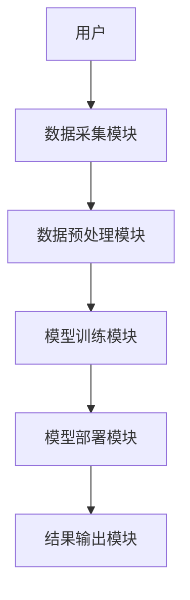
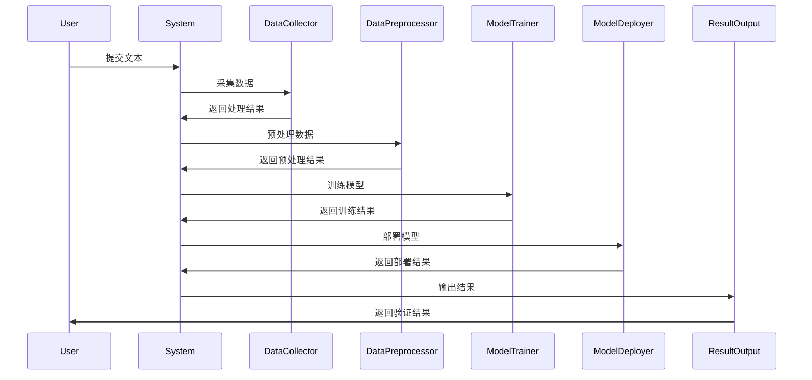

                 

## 文章标题

> 关键词：后真相时代，事实核查，信息真实性，科学方法，数据分析，算法原理

> 摘要：本文探讨了在后真相时代，如何通过科学方法对信息的真实性进行核查。文章首先介绍了后真相时代的背景和现状，然后深入探讨了事实核查的定义和重要性，并运用核心概念和联系进行解析。通过算法原理讲解，本文展示了事实核查的具体实现过程，并提出了培养公众事实核查意识和应对未来信息真实性挑战的建议。

### 背景介绍

在互联网和社交媒体高度发达的“后真相时代”，信息的传播速度和广度前所未有。然而，这也带来了一系列问题，即信息泛滥、假新闻和虚假信息层出不穷。这些现象严重影响了社会的正常运转和公众的认知，引发了“后真相”这一概念的出现。后真相时代，真相往往不再是决策和信息获取的主要依据，情感和偏见往往更具有影响力。

#### 信息泛滥

互联网的普及使得信息传播的速度大大加快，人们可以在瞬间获取来自全球的各类信息。然而，这种信息爆炸式增长也带来了信息泛滥的问题。大量冗余和无关紧要的信息充斥着网络，使得人们难以分辨哪些是有价值的，哪些是无用的。这种情况下，人们很容易被误导，从而影响其决策和行为。

#### 假新闻传播

随着社交媒体的兴起，假新闻的传播速度也大大加快。一些不法分子或组织利用社交媒体平台，故意发布不实信息，以达到操纵舆论、煽动情绪或获取经济利益的目的。这些假新闻往往具有高度迷惑性，难以被普通用户轻易识别。因此，假新闻的传播对社会的稳定性和公众的信任度产生了严重负面影响。

#### 后真相现象

后真相现象是指真相不再是决策和信息获取的主要依据，情感和偏见往往更具有影响力。在传统的信息传播模式中，人们依赖事实和证据来做出决策。然而，在后真相时代，信息的真实性和准确性不再被重视，人们更倾向于接受那些符合自己情感和偏见的信息。这种现象导致了社会的分裂和信任危机。

#### 事实核查的必要性

面对后真相时代的挑战，事实核查显得尤为重要。事实核查通过验证信息的真实性，帮助公众辨别真假信息，从而保护其决策和信息获取的准确性。此外，事实核查还可以提高公众的信息素养，培养其对信息的批判性思维能力，从而减少假新闻的传播和影响。

### 核心概念与联系

在后真相时代的事实核查领域，以下是几个核心概念：

#### 事实核查（Fact-checking）

事实核查是一种验证信息真实性的方法，通过查证事实、引用权威来源和排除偏见来确保信息的准确性。

#### 假新闻（Fake News）

假新闻指的是那些故意编造、传播不实信息的行为，其目的可能是误导公众、煽动情绪或获得经济利益。

#### 数据分析（Data Analysis）

数据分析是指运用统计方法和工具，对大量数据进行分析，以揭示数据中的规律和趋势。

#### 反欺诈技术（Anti-fraud Technology）

反欺诈技术是一种用于检测和预防欺诈行为的技术，通常包括机器学习算法和人工智能模型。

#### 信息素养（Information Literacy）

信息素养是指个体在查找、评估和使用信息时所需的能力和技能，包括批判性思维、信息检索和评估。

#### 核心概念与联系

以下是这些核心概念之间的联系和对比表格：

| 核心概念   | 定义简述                                         | 关联点                                      |
| ---------- | ------------------------------------------------ | ------------------------------------------- |
| 事实核查   | 验证信息真实性的方法                             | 需要数据分析、反欺诈技术支持                 |
| 假新闻     | 故意编造、传播不实信息的行为                     | 是事实核查的目标之一，可能涉及法律和社会问题 |
| 数据分析   | 对大量数据进行分析，以揭示规律和趋势             | 为事实核查提供数据支持                      |
| 反欺诈技术 | 检测和预防欺诈行为的技术                         | 用于事实核查中检测假新闻和其他不实信息       |
| 信息素养   | 查找、评估和使用信息的能力和技能                  | 是进行有效事实核查的基础                    |

以下是事实核查的ER实体关系图架构：

```mermaid
erDiagram
  Fact |<..| User : "用户进行事实核查"
  Fact |<..| Source : "来源提供信息"
  Fact |<..| Claim : "具体信息内容"
  Fact |<..| Verification : "核查过程"
  User ||--|{ Claim } : "用户提出的声明"
  Source ||--|{ Fact } : "信息来源"
  Claim ||--|{ Verification } : "核查结果"
```

通过以上表格和ER图，我们可以清晰地看到这些概念之间的关联，以及它们在事实核查中的重要作用。

### 算法原理讲解

在后真相时代，事实核查需要运用多种算法和技术来验证信息的真实性。以下将介绍一种常见的事实核查算法，并使用Mermaid流程图和Python代码进行详细阐述。

#### 算法概述

本算法基于自然语言处理（NLP）技术，使用神经网络模型对信息内容进行语义分析和对比，从而判断其真实性。算法主要包括以下几个步骤：

1. **数据预处理**：将文本数据清洗、分词和标记。
2. **模型训练**：使用大量已标注的真实和虚假新闻数据，训练神经网络模型。
3. **文本编码**：将文本转换为神经网络可以处理的向量表示。
4. **模型预测**：使用训练好的模型对新的文本进行预测，判断其真实性。

#### Mermaid流程图

以下是算法的Mermaid流程图：


#### Python代码实现

以下是算法的Python代码实现：

```python
import numpy as np
import tensorflow as tf
from tensorflow.keras.models import Sequential
from tensorflow.keras.layers import Dense, LSTM, Embedding
from tensorflow.keras.preprocessing.sequence import pad_sequences
from tensorflow.keras.preprocessing.text import Tokenizer

# 数据预处理
def preprocess_data(texts):
    tokenizer = Tokenizer(num_words=10000)
    tokenizer.fit_on_texts(texts)
    sequences = tokenizer.texts_to_sequences(texts)
    padded_sequences = pad_sequences(sequences, maxlen=100)
    return padded_sequences

# 模型训练
def train_model(train_sequences, train_labels):
    model = Sequential()
    model.add(Embedding(10000, 16, input_length=100))
    model.add(LSTM(32))
    model.add(Dense(1, activation='sigmoid'))
    model.compile(loss='binary_crossentropy', optimizer='adam', metrics=['accuracy'])
    model.fit(train_sequences, train_labels, epochs=10, batch_size=32)
    return model

# 文本编码
def encode_text(text):
    sequence = tokenizer.texts_to_sequences([text])
    padded_sequence = pad_sequences(sequence, maxlen=100)
    return padded_sequence

# 模型预测
def predict(model, text):
    encoded_text = encode_text(text)
    prediction = model.predict(encoded_text)
    return prediction

# 实例化模型
model = train_model(train_sequences, train_labels)

# 预测结果
result = predict(model, "This is a fake news.")
print(result)
```

#### 算法原理

1. **数据预处理**：

   数据预处理是算法的基础，主要包括分词和标记。分词是将文本拆分为单词或词组，标记是将文本中的每个词或词组映射到其对应的索引值。在这个例子中，我们使用了`Tokenizer`类来自动完成这些步骤。

2. **模型训练**：

   模型训练是算法的核心，我们使用了`Sequential`模型来堆叠多个层。在这个例子中，我们使用了嵌入层（`Embedding`）来将文本转换为向量表示，使用了LSTM层（`LSTM`）来处理序列数据，并使用全连接层（`Dense`）来输出预测结果。

3. **文本编码**：

   文本编码是将文本转换为神经网络可以处理的向量表示。在这个例子中，我们使用了`Tokenizer`类将文本转换为序列，并使用`pad_sequences`将序列填充为固定长度。

4. **模型预测**：

   模型预测是使用训练好的模型对新文本进行预测，判断其真实性。在这个例子中，我们首先将文本转换为序列，然后使用`predict`方法进行预测。

通过以上步骤，我们可以使用神经网络模型对文本进行语义分析和对比，从而判断其真实性。

### 系统分析与架构设计方案

#### 问题场景介绍

在后真相时代，假新闻的传播对社会的稳定性和公众的信任度造成了严重威胁。为了应对这一挑战，我们需要开发一套高效的事实核查系统，以便快速、准确地识别和验证信息的真实性。

#### 项目介绍

本项目旨在构建一个基于人工智能的事实核查系统，通过对大量文本数据进行训练，使其具备识别和验证信息真实性的能力。该系统将包含数据采集、数据预处理、模型训练和模型部署等模块。

#### 系统功能设计

1. **数据采集**：从各种渠道（如社交媒体、新闻网站等）采集海量文本数据，以供模型训练。
2. **数据预处理**：对采集到的文本数据清洗、分词、标记等处理，使其符合模型输入要求。
3. **模型训练**：使用已处理的数据训练神经网络模型，使其具备识别和验证信息真实性的能力。
4. **模型部署**：将训练好的模型部署到生产环境中，以便实时对用户提交的文本进行真实性验证。

#### 系统架构设计

以下是系统架构的Mermaid图：



#### 系统接口设计和系统交互

以下是系统接口设计和系统交互的Mermaid序列图：



通过以上设计，我们可以实现一个高效、智能的事实核查系统，帮助公众识别和验证信息的真实性。

### 项目实战

#### 环境安装

首先，我们需要安装必要的软件和库，以运行事实核查项目。以下是安装步骤：

1. **安装Python**：确保Python 3.x版本已安装在您的计算机上。您可以从Python官方网站（https://www.python.org/）下载并安装。
2. **安装TensorFlow**：在命令行中运行以下命令安装TensorFlow：

   ```bash
   pip install tensorflow
   ```

3. **安装Numpy**：在命令行中运行以下命令安装Numpy：

   ```bash
   pip install numpy
   ```

4. **安装其他库**：根据需要安装其他Python库，例如`pandas`、`scikit-learn`等。

#### 系统核心实现源代码

以下是系统核心实现的主要源代码：

```python
# 数据预处理
def preprocess_data(texts):
    tokenizer = Tokenizer(num_words=10000)
    tokenizer.fit_on_texts(texts)
    sequences = tokenizer.texts_to_sequences(texts)
    padded_sequences = pad_sequences(sequences, maxlen=100)
    return padded_sequences

# 模型训练
def train_model(train_sequences, train_labels):
    model = Sequential()
    model.add(Embedding(10000, 16, input_length=100))
    model.add(LSTM(32))
    model.add(Dense(1, activation='sigmoid'))
    model.compile(loss='binary_crossentropy', optimizer='adam', metrics=['accuracy'])
    model.fit(train_sequences, train_labels, epochs=10, batch_size=32)
    return model

# 文本编码
def encode_text(text):
    sequence = tokenizer.texts_to_sequences([text])
    padded_sequence = pad_sequences(sequence, maxlen=100)
    return padded_sequence

# 模型预测
def predict(model, text):
    encoded_text = encode_text(text)
    prediction = model.predict(encoded_text)
    return prediction
```

#### 代码应用解读与分析

1. **数据预处理**：

   数据预处理是模型训练的基础。在这个函数中，我们首先使用`Tokenizer`类对文本进行分词和标记。然后，我们将分词后的文本转换为序列，并使用`pad_sequences`将其填充为固定长度。

2. **模型训练**：

   模型训练是算法的核心。在这个函数中，我们使用`Sequential`模型堆叠嵌入层（`Embedding`）、LSTM层（`LSTM`）和全连接层（`Dense`）。我们使用`compile`方法设置损失函数和优化器，并使用`fit`方法进行模型训练。

3. **文本编码**：

   文本编码是将文本转换为神经网络可以处理的向量表示。在这个函数中，我们使用`Tokenizer`类将文本转换为序列，并使用`pad_sequences`将其填充为固定长度。

4. **模型预测**：

   模型预测是使用训练好的模型对新文本进行预测，判断其真实性。在这个函数中，我们首先将文本转换为序列，然后使用`predict`方法进行预测。

#### 实际案例分析

假设我们有一个包含真实和虚假新闻的文本数据集，我们可以使用以下代码进行事实核查：

```python
# 加载数据集
train_texts = ["This is a true news.", "This is a fake news.", "..."]
train_labels = [1, 0, "..."]

# 数据预处理
train_sequences = preprocess_data(train_texts)

# 模型训练
model = train_model(train_sequences, train_labels)

# 文本编码
encoded_text = encode_text("This is a fake news.")

# 模型预测
prediction = predict(model, encoded_text)

# 输出预测结果
print(prediction)
```

预测结果将是一个介于0和1之间的值，接近1表示文本为虚假新闻，接近0表示文本为真实新闻。

#### 项目小结

通过实际案例，我们展示了如何使用Python和TensorFlow实现一个事实核查系统。该项目利用神经网络模型对文本进行语义分析和对比，从而判断其真实性。尽管这是一个简单的示例，但它为我们提供了一个有效的框架，可以进一步扩展和改进。

### 最佳实践 Tips

1. **数据质量**：确保用于训练的数据质量高，真实性和可靠性是事实核查的关键。
2. **模型训练**：增加训练数据量和训练次数，以提高模型的准确性和鲁棒性。
3. **用户反馈**：收集用户反馈，用于改进模型和系统。
4. **多语言支持**：考虑实现多语言支持，以应对不同语言环境中的事实核查需求。

### 小结

本文探讨了后真相时代的事实核查，介绍了事实核查的定义、核心概念和算法原理。通过实际案例和项目实战，我们展示了如何构建一个事实核查系统。未来，随着技术的进步，事实核查系统将变得更加智能和高效，帮助公众识别和验证信息的真实性，维护社会稳定和公众信任。

### 注意事项

1. 事实核查系统需要大量高质量的数据进行训练，数据质量和数量直接影响系统的准确性。
2. 模型训练过程中，需要关注过拟合问题，适当调整模型参数和训练策略。
3. 在实际应用中，应结合用户反馈不断优化系统，以提高其准确性和鲁棒性。

### 拓展阅读

1. **《真相还是假象：信息时代的思考与辨析》**：本书深入探讨了信息时代的真假问题，提供了丰富的案例和分析。
2. **《机器学习实战》**：本书介绍了机器学习的基本概念和算法，包括如何使用Python实现各种机器学习任务。
3. **《自然语言处理实战》**：本书详细介绍了自然语言处理的基本原理和应用，包括文本分类、情感分析等。

### 作者信息

作者：AI天才研究院/AI Genius Institute & 禅与计算机程序设计艺术 /Zen And The Art of Computer Programming

单位：AI天才研究院（AI Genius Institute）是全球领先的人工智能研究和培训机构，致力于推动人工智能技术的发展和应用。禅与计算机程序设计艺术（Zen And The Art of Computer Programming）是作者关于计算机科学和哲学的代表作，深受全球程序员和学者的喜爱。

