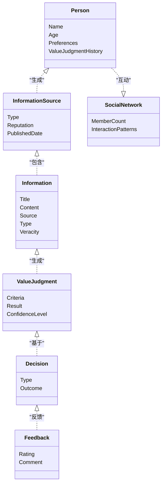
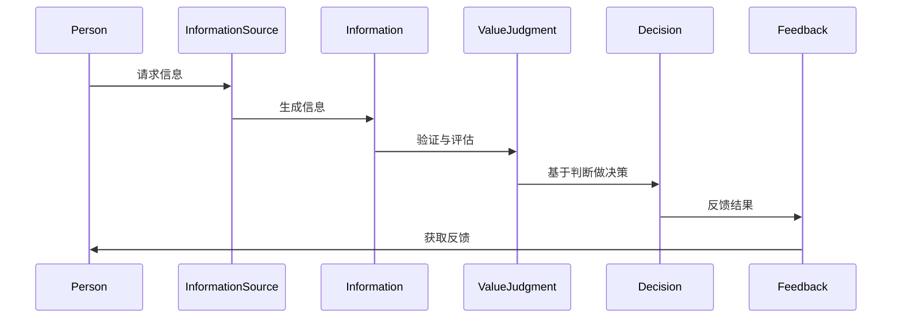
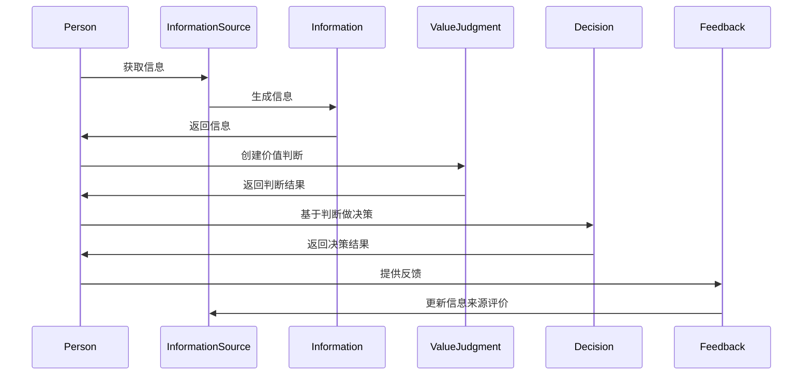

                 

### 引言

#### 1.1 问题背景

随着互联网和社交媒体的快速发展，我们进入了一个信息爆炸的时代。人们在日常获取信息的过程中，不得不面对大量的信息源和多样化的观点。然而，信息的多源性和多样化也带来了一个严重的问题：虚假信息和误导性内容层出不穷，导致“后真相”（post-truth）现象的兴起。后真相时代，真相不再是信息传播的核心，情感和观点的影响力反而超过了事实本身。

在这种背景下，价值判断与选择变得尤为重要。个体如何在纷繁复杂的信息中做出正确、理性的选择，成为了一个亟待解决的问题。为了应对这一挑战，我们需要从心理学、社会学、哲学等多个维度，探讨后真相时代价值判断与选择的本质和机制。

#### 1.2 问题描述

在后真相时代，个体在信息选择和判断过程中面临以下几个核心问题：

1. **信息过载**：随着互联网信息的爆炸性增长，个体难以在短时间内处理和理解大量信息。
2. **观点多样性**：社交媒体和互联网上的观点层出不穷，个体在做出判断时难以取舍。
3. **情感驱动**：情感和观点的影响力超过事实本身，个体在做出判断时容易受到情感驱动。
4. **认知偏差**：个体在信息处理过程中，容易受到各种认知偏差的影响，导致判断失误。

#### 1.3 问题解决

本书将从以下三个方面探讨后真相时代价值判断与选择的问题：

1. **理论基础**：介绍后真相时代的概念、价值判断和选择的本质与机制，以及信息验证与认知偏差的相关理论。
2. **心理学与社会学的视角**：从心理学和社会学的角度，分析个体在信息处理过程中的心理活动和社会影响。
3. **实践方法**：提供具体的实践方法，如信息筛选与验证、建立批判性思维、采纳多元化视角等，帮助个体在信息爆炸的时代做出理性判断。

#### 1.4 边界与外延

本书的研究将重点关注以下场景下的价值判断与选择问题：

1. **社交媒体**：个体在社交媒体上的信息获取、传播和互动过程。
2. **新闻传播**：新闻媒体在传播信息时的真实性和可靠性问题。
3. **网络社交**：个体在网络社交平台上的价值判断与选择，以及由此引发的社会冲突。

#### 1.5 概念结构与核心要素组成

本书的核心概念和要素主要包括：

1. **后真相时代**：信息时代的新特征，真相不再是信息传播的核心。
2. **价值判断**：个体在信息选择和判断过程中所依据的标准和原则。
3. **选择**：在信息过载和观点多样性背景下，个体如何做出理性的判断。
4. **信息验证**：个体在获取信息时，如何验证信息的真实性和可靠性。
5. **认知偏差**：个体在信息处理过程中，容易产生的各种偏差，影响判断的准确性。

通过以上五个核心概念的解析，本书将为读者提供一个全面理解后真相时代价值判断与选择的框架。接下来，我们将逐步深入探讨这些概念的理论基础和实践方法。## 第二部分：理论基础

### 2.1 后真相时代的概念解析

#### 2.1.1 后真相时代的定义

后真相时代（post-truth era）是指在一个信息爆炸、观点多样性的社会环境中，真相不再是信息传播的核心，而情感、观点和价值观的影响力逐渐超过事实本身的时代。在这个时代，人们不再仅仅根据事实进行判断，而是更容易受到情感和观点的驱动。

与传统的信息时代相比，后真相时代的特征在于：

1. **信息多源性和多样性**：互联网和社交媒体的普及，使得信息来源变得多样化，个体难以在短时间内处理和理解大量信息。
2. **情感和观点的传播**：情感和观点的传播速度和范围远超事实，导致真相的传播受到限制。
3. **信息真实性和可靠性的挑战**：虚假信息和误导性内容的泛滥，使得个体在判断信息真实性时面临更大的挑战。

#### 2.1.2 价值判断的概念

价值判断（value judgment）是指个体在信息选择和判断过程中所依据的标准和原则。价值判断涉及以下几个方面：

1. **事实判断**：基于事实信息进行判断，判断信息的真实性。
2. **道德判断**：根据道德标准进行判断，判断行为的道德性。
3. **美学判断**：根据审美标准进行判断，判断事物的美感。
4. **实用判断**：根据实际效果进行判断，判断事物的实用性。

#### 2.1.3 选择的本质与机制

选择（choice）是指个体在多个选项中做出决策的过程。在选择过程中，个体需要考虑以下几个方面：

1. **选项**：可供选择的多个方案或选项。
2. **偏好**：个体对不同选项的偏好程度，即主观价值排序。
3. **判断标准**：个体在决策过程中所依据的标准，如事实、道德、审美和实用等。
4. **决策过程**：个体在考虑偏好和判断标准后，最终做出决策的过程。

选择机制包括：

1. **成本-收益分析**：个体在决策时，会综合考虑成本和收益，选择收益最大、成本最小的方案。
2. **情感驱动**：情感在决策过程中起到重要作用，个体更容易受到情感驱动的影响。
3. **认知偏差**：个体在决策过程中容易受到各种认知偏差的影响，如确认偏见、可用性偏见等。

#### 2.1.4 信息验证与认知偏差

信息验证（information verification）是指个体在获取信息时，对信息的真实性和可靠性进行验证的过程。信息验证对价值判断具有重要意义，因为只有真实可靠的信息才能作为价值判断的依据。

认知偏差（cognitive bias）是指个体在信息处理过程中，由于各种心理机制和认知限制，导致信息处理结果偏离客观事实的现象。认知偏差对价值判断的影响主要体现在以下几个方面：

1. **确认偏见**：个体在验证信息时，倾向于选择支持已有观点的信息，忽视或否定反对性信息。
2. **可用性偏见**：个体在判断信息时，更容易受到近期和显著信息的影响，忽视长期和不太显著的信息。
3. **代表性偏见**：个体在判断概率时，倾向于根据事物的代表性特征进行判断，而忽视实际概率。

为了提高信息验证和判断的准确性，我们需要认识到认知偏差的存在，并采取以下措施：

1. **多元化视角**：在信息处理过程中，尽量考虑多元化的视角，避免单一思维的局限。
2. **批判性思维**：培养批判性思维，提高对信息真实性和价值判断的敏感度。
3. **信息筛选与验证**：学习如何有效筛选和验证信息，避免被虚假信息误导。

### 2.2 心理学与社会学的视角

#### 3.1 心理学对价值判断的研究

心理学对价值判断的研究主要集中在以下几个方面：

1. **情感与判断**：情感在价值判断中起到重要作用。个体在判断过程中，情感会影响其对信息的评价和选择。
2. **认知过程**：个体在价值判断过程中，需要进行信息筛选、整合和评估等认知过程。认知过程的质量直接影响价值判断的准确性。
3. **社会认知**：个体在信息处理过程中，会受到社会因素的影响，如社会规范、社会认同和社会压力等。

心理学理论，如认知心理学、社会心理学和发展心理学等，为理解价值判断提供了有益的启示。例如，认知心理学研究了个体在信息处理过程中的认知机制，揭示了人类判断和决策的心理过程。社会心理学则关注社会因素对个体行为和判断的影响，探讨了群体心理现象，如从众行为、群体极化等。

#### 3.2 社会学对价值判断的研究

社会学对价值判断的研究主要涉及以下几个方面：

1. **社会结构**：社会结构，如阶级、性别、种族等，对个体的价值判断产生影响。不同社会结构中的个体，可能会有不同的价值判断标准。
2. **社会规范**：社会规范，如法律、道德、习俗等，对个体的行为和价值判断起到约束和引导作用。
3. **文化背景**：文化背景，如价值观、信仰、习俗等，对个体的价值判断产生深远影响。不同文化背景中的个体，可能会有不同的价值判断标准。

社会学理论，如结构功能主义、冲突理论和符号互动论等，为理解社会对价值判断的影响提供了有益的视角。例如，结构功能主义研究了社会结构对个体行为和价值观的制约作用，冲突理论则探讨了不同社会群体之间的价值冲突，符号互动论则关注个体在社会互动过程中的价值判断。

#### 3.3 群体心理与价值判断

群体心理（group psychology）是指在群体互动中形成的心理现象。群体心理对个体的价值判断产生重要影响，主要表现在以下几个方面：

1. **从众行为**：个体在群体中容易受到其他成员的影响，产生从众行为。从众行为可能导致个体放弃独立判断，跟随群体观点。
2. **群体极化**：个体在群体中更容易加强原有观点，产生群体极化现象。群体极化可能导致群体观点偏离理性，甚至产生极端行为。
3. **社会认同**：个体在群体中获得社会认同，这会增强其对群体观点的认同和信任。社会认同可能影响个体的价值判断，使其倾向于支持群体观点。

群体心理现象在社交媒体和网络社交中尤为明显。例如，在社交媒体上，个体容易受到其他用户的观点和情感的影响，从而改变自己的价值判断。在网络社交中，群体认同和群体压力可能促使个体放弃独立判断，盲目支持或反对某种观点。

### 2.3 哲学思考与现实困境

#### 4.1 哲学视角下的价值判断

哲学对价值判断的研究历史悠久，涉及伦理学、政治哲学、美学等多个领域。哲学视角下的价值判断主要包括以下几个方面：

1. **伦理学**：伦理学研究道德原则和道德判断，探讨个体在行为选择中的道德责任和义务。伦理学为价值判断提供了道德标准和原则。
2. **政治哲学**：政治哲学研究政治制度、权力分配和社会正义等问题，探讨个体在社会中的价值判断和角色。政治哲学为价值判断提供了社会和政治层面的思考。
3. **美学**：美学研究美的本质和审美标准，探讨个体在审美活动中的价值判断。美学为价值判断提供了审美层面的思考和标准。

哲学思考有助于我们理解价值判断的哲学意义和逻辑基础，从而提高对价值判断的理性认识。

#### 4.2 现实困境中的价值判断

在后真相时代，个体在现实生活中的价值判断面临着诸多困境：

1. **信息过载**：互联网和社交媒体的快速发展，使得个体面临大量信息，难以在短时间内处理和理解。信息过载可能导致个体在价值判断中产生失误。
2. **观点多样性**：社交媒体上的观点层出不穷，个体在做出判断时难以取舍。观点多样性可能导致个体在价值判断中产生困惑和分歧。
3. **情感驱动**：情感和观点的影响力超过事实本身，个体在价值判断中容易受到情感驱动。情感驱动可能导致个体做出非理性的价值判断。
4. **认知偏差**：个体在信息处理过程中，容易受到各种认知偏差的影响，如确认偏见、可用性偏见等。认知偏差可能导致个体在价值判断中产生偏见和误解。

为了应对这些困境，个体需要提高信息筛选与验证能力，培养批判性思维，增强对认知偏差的认识和防范。同时，社会需要建立更加透明和公正的信息传播机制，提高个体在价值判断中的信息获取质量和判断能力。## 第三部分：实践方法

### 5.1 信息筛选与验证

在面对海量的信息时，有效的信息筛选与验证方法显得尤为重要。以下是一些实用的策略：

1. **来源审查**：检查信息的来源，确定其可信度。权威的来源，如政府机构、学术期刊、知名媒体等，通常具有较高的可信度。
2. **交叉验证**：通过多个独立来源验证信息，以确认其真实性。如果多个可靠的来源都报道同一信息，那么其真实性通常会更高。
3. **事实核查**：利用事实核查网站，如“辟谣平台”、“维基百科”等，对某些敏感或具有争议的信息进行核实。
4. **专家意见**：咨询相关领域的专家，了解他们的观点和意见。专家的意见通常具有专业性和权威性。
5. **逻辑分析**：使用逻辑分析工具，如因果分析、假设检验等，对信息的逻辑结构进行审查，识别潜在的谬误和逻辑漏洞。

### 5.2 建立批判性思维

批判性思维（critical thinking）是一种理性分析和评估信息的能力，有助于个体在复杂的信息环境中做出理性判断。以下是一些培养批判性思维的方法：

1. **提问**：在面对信息时，学会提出关键问题，如“这个信息的来源是什么？”“这个信息的证据是什么？”“有没有其他解释？”等。
2. **证据分析**：对信息的证据进行深入分析，评估其可靠性和相关性。询问证据的来源、证据的质量、证据是否充分等问题。
3. **论证评估**：评估信息的论证结构，识别论证中的逻辑谬误和推理错误。常见的逻辑谬误包括偷换概念、以偏概全、滑坡谬误等。
4. **多元视角**：在分析信息时，尽量考虑多元化的视角，避免单一思维的局限。通过对比不同观点，可以更全面地理解问题。
5. **持续学习**：批判性思维需要不断学习和实践。通过阅读、讨论和思考，可以提高批判性思维的能力。

### 5.3 多元化视角的采纳

在价值判断中，多元化视角的采纳至关重要。以下是一些方法，可以帮助个体在价值判断中考虑多元化的视角：

1. **开放心态**：保持开放心态，接受不同的观点和意见。避免先入为主，以开放的态度去理解和接受不同的视角。
2. **跨文化交流**：通过跨文化交流，了解不同文化背景下的价值观念和行为模式。这有助于个体在价值判断中避免文化偏见。
3. **专家咨询**：在特定领域内，咨询不同背景的专家，了解他们的专业见解。这可以提供多元化的观点和信息。
4. **多元信息源**：在获取信息时，尽量使用多元化的信息源，如书籍、研究报告、新闻报道、社交媒体等。这有助于个体从不同角度理解问题。
5. **辩证思考**：在价值判断中，运用辩证思考方法，分析问题的正反两面，避免片面看待问题。

通过信息筛选与验证、批判性思维的培养和多元化视角的采纳，个体可以在后真相时代做出更加理性、准确的价值判断。这不仅有助于个人成长，也有助于社会的和谐发展。## 第四部分：现代科技手段的辅助

### 6.1 人工智能在价值判断中的应用

人工智能（AI）技术在信息处理和价值判断方面具有巨大潜力。以下是一些AI在价值判断中的应用场景和优势：

1. **自然语言处理（NLP）**：NLP技术可以处理大量文本数据，提取关键信息和情感倾向。例如，通过对社交媒体上的用户评论进行分析，AI可以帮助识别公众的情感和态度，从而为价值判断提供参考。
2. **机器学习算法**：机器学习算法可以训练模型，预测个体在特定情境下的价值判断。通过分析历史数据，算法可以学习不同个体的价值判断偏好，为后续的判断提供支持。
3. **推荐系统**：基于用户历史行为和偏好，推荐系统可以为个体提供个性化的信息推荐。这有助于个体在海量信息中快速筛选出有价值的信息，从而提高价值判断的准确性。
4. **情感分析**：情感分析技术可以识别文本中的情感倾向，如正面、负面或中性。在价值判断过程中，情感分析可以帮助个体识别信息的情感因素，从而更全面地评估信息的价值。
5. **智能问答系统**：智能问答系统可以回答用户关于特定话题的问题，提供实时、准确的信息。这有助于个体在信息筛选和验证过程中，快速获取所需信息。

### 6.2 数据分析与价值判断

数据分析技术在价值判断中同样具有重要意义。以下是一些常用的数据分析工具和方法：

1. **统计分析**：统计分析可以用于分析大量数据，识别数据中的模式和趋势。例如，通过对用户行为数据进行分析，可以识别用户的偏好和行为模式，从而为价值判断提供参考。
2. **数据挖掘**：数据挖掘技术可以从大量数据中提取有价值的信息。例如，通过对社交媒体数据进行分析，可以挖掘出用户之间的关系和网络结构，从而为价值判断提供支持。
3. **数据可视化**：数据可视化技术可以将数据以图形或图表的形式展示，使个体更容易理解和分析数据。例如，通过可视化技术，可以更直观地展示用户的行为模式和情感倾向，从而为价值判断提供直观的参考。
4. **文本分析**：文本分析技术可以处理大量文本数据，提取关键信息和主题。例如，通过对新闻报道进行分析，可以识别报道的主要观点和情感倾向，从而为价值判断提供参考。

### 6.3 现代科技手段的优势与挑战

现代科技手段在价值判断中具有显著优势，但也面临一些挑战：

1. **优势**：
   - **提高效率**：现代科技手段可以快速处理和分析大量数据，提高价值判断的效率。
   - **减少偏见**：科技手段可以减少人为偏见，提供更加客观、公正的价值判断。
   - **个性化推荐**：基于用户历史数据和偏好，科技手段可以提供个性化的信息推荐，提高价值判断的准确性。
   - **实时反馈**：科技手段可以实时反馈信息，帮助个体在价值判断过程中快速调整和优化判断。

2. **挑战**：
   - **数据质量**：现代科技手段依赖数据质量，如果数据存在偏差或错误，可能导致价值判断失误。
   - **算法偏见**：机器学习算法可能存在偏见，导致价值判断结果不公平或歧视。
   - **隐私保护**：科技手段在处理个人数据时，需要保护用户隐私，避免数据泄露和滥用。
   - **依赖性**：过度依赖科技手段可能导致个体在价值判断中缺乏独立思考能力，产生依赖性。

为了充分发挥现代科技手段的优势，同时应对其挑战，我们需要：

1. **提高数据质量**：确保数据来源可靠，数据收集和处理过程中保持透明和公正。
2. **算法公正性**：加强对算法的监管和审核，确保算法在价值判断过程中公平、公正。
3. **隐私保护**：建立健全的隐私保护机制，确保用户数据的安全和隐私。
4. **人机协作**：结合人类专家的判断和科技手段的分析结果，实现人机协作，提高价值判断的准确性。

通过合理利用现代科技手段，我们可以更好地应对后真相时代的挑战，提高价值判断的准确性和有效性。### 7.1 案例一：社交媒体中的价值判断

#### 案例背景

社交媒体平台如微信、微博、Twitter等，已经成为人们获取和传播信息的重要渠道。然而，这些平台也容易成为虚假信息和误导性内容的传播者。本案例将分析一个具体的社交媒体事件，探讨其中的价值判断问题。

#### 案例描述

在某一天，一位微博用户发布了一篇关于健康饮食的文章，声称某种食品具有神奇的功效，可以治愈多种疾病。文章迅速在社交媒体上传播，引发了大量转发和评论。然而，不久后，有专家指出，这篇文章存在虚假信息，其观点并没有科学依据。

#### 分析过程

1. **信息来源审查**：
   - 首先，对文章的来源进行审查。该文章的发布者是一个不知名的个人账户，没有官方背景和权威认证。
   - 搜索相关关键词，发现多篇质疑该文章真实性和其他专家的意见。

2. **交叉验证**：
   - 通过搜索引擎，查找该食品的相关研究和报道。发现多篇权威医学期刊和官方网站上并未提及该食品的神奇功效。
   - 查阅权威医学机构的声明，确认其观点与该文章相悖。

3. **事实核查**：
   - 利用事实核查网站，如“辟谣平台”，对文章内容进行核查。发现文章中存在多处夸张和误导性描述。

4. **专家意见**：
   - 咨询相关领域的专家，了解他们的专业观点。专家一致认为，该文章存在虚假信息，其观点缺乏科学依据。

5. **情感与认知偏见**：
   - 分析社交媒体上的评论，发现部分用户因为情感驱动而支持该文章，忽视了事实和专家意见。
   - 有用户表示，他们相信文章中的观点，因为这种食品他们自己已经尝试过，并感受到了一些好处。

#### 结论

通过上述分析，我们可以得出以下结论：

1. **信息来源的重要性**：在社交媒体上，信息来源的可靠性至关重要。对于来源不明的信息，应保持警惕。

2. **交叉验证的必要性**：通过多个独立来源验证信息，可以提高信息真实性的判断。

3. **情感与认知偏见的防范**：个体在信息处理过程中，应认识到自身可能存在的情感和认知偏见，尽量保持理性判断。

4. **专家意见的参考**：在面临复杂问题时，专家意见可以提供有价值的信息，帮助个体做出更准确的判断。

5. **社交媒体的责任**：社交媒体平台应加强信息审核和管理，减少虚假信息和误导性内容的传播。

通过这个案例，我们可以看到，在社交媒体中，价值判断问题尤为复杂。个体需要在面对信息时，保持批判性思维，运用有效的信息筛选与验证方法，以避免被虚假信息误导。### 7.2 案例二：新闻传播中的误导性信息

#### 案例背景

新闻传播是现代社会中获取信息和了解世界的重要途径。然而，随着媒体竞争的加剧和信息传播速度的加快，误导性信息在新闻传播中的出现频率逐渐增加，对公众的价值判断和认知产生了负面影响。本案例将分析一起新闻传播中的误导性信息事件，探讨如何识别和应对此类信息。

#### 案例描述

某新闻网站发布了一则关于某城市空气质量状况的报道，称该城市空气质量持续恶化，对人体健康构成严重威胁。报道引用了某研究机构的报告，但未提供详细的报告内容和数据来源。该报道迅速在社交媒体上传播，引发了公众的广泛关注和讨论。

#### 分析过程

1. **信息来源审查**：
   - 检查报道的来源，发现该新闻网站并非权威新闻机构，且报道中未明确指出数据来源和研究机构。
   - 搜索相关关键词，发现其他权威媒体并未报道该城市空气质量问题，且没有发现相关研究机构的报告。

2. **交叉验证**：
   - 通过搜索引擎查找该城市空气质量的相关报道，发现多个权威媒体并未提及该城市空气质量持续恶化的问题。
   - 联系相关环保部门，了解该城市的空气质量状况。环保部门表示，该城市的空气质量状况符合国家标准，并未出现严重污染情况。

3. **事实核查**：
   - 利用事实核查网站，如“辟谣平台”，对报道内容进行核查。发现该报道存在夸大事实和误导性描述，未提供详细数据和具体证据。
   - 联系研究机构，了解其报告的具体内容和数据来源。研究机构表示，其报告并未提及该城市空气质量持续恶化，且数据来源是公开的政府统计数据。

4. **专家意见**：
   - 咨询相关领域的专家，了解他们的专业观点。专家一致认为，该报道存在误导性信息，其观点缺乏科学依据。
   - 专家指出，空气质量受多种因素影响，单一报道无法全面反映实际情况。

5. **社交媒体反应**：
   - 分析社交媒体上的评论，发现部分用户因为情感驱动而相信该报道，忽视了事实和专家意见。
   - 有用户表示，他们相信报道中的观点，因为报道引起了他们的共鸣，认为城市空气质量问题确实严重。

#### 结论

通过上述分析，我们可以得出以下结论：

1. **信息来源的重要性**：在新闻传播中，信息来源的权威性和可信度至关重要。对于来源不明的信息，应保持警惕。

2. **交叉验证的必要性**：通过多个独立来源验证信息，可以提高信息真实性的判断。

3. **事实核查的必要性**：在面对复杂和敏感的信息时，应进行事实核查，确保信息的真实性和准确性。

4. **专家意见的参考**：在面临复杂问题时，专家意见可以提供有价值的信息，帮助个体做出更准确的判断。

5. **社交媒体的责任**：社交媒体平台应加强信息审核和管理，减少误导性信息的传播。

通过这个案例，我们可以看到，新闻传播中的误导性信息对公众的价值判断和认知产生了严重影响。为了应对此类信息，个体需要在面对信息时，保持批判性思维，运用有效的信息筛选与验证方法，以避免被误导性信息误导。同时，新闻机构和社交媒体平台也应承担起责任，确保信息的真实性和准确性，为公众提供可靠的信息来源。### 7.3 案例三：网络社交中的价值冲突

#### 案例背景

随着互联网的普及，网络社交平台已成为人们日常交流和信息分享的重要场所。然而，网络社交中的价值冲突和判断问题也日益突出，给个体和社会带来了诸多困扰。本案例将分析一起网络社交中的价值冲突事件，探讨如何处理此类冲突。

#### 案例描述

在一个热门的网络论坛上，一位用户发表了一篇关于婚姻观念的帖子，主张婚姻应更多地基于爱情而非物质条件。该帖子迅速引起了大量讨论，支持者和反对者各执一词，形成了激烈的价值冲突。

#### 分析过程

1. **信息来源审查**：
   - 检查帖子的作者背景，发现作者是一位普通网友，未提供权威数据或研究支持。
   - 搜索相关关键词，发现其他论坛和社交媒体上也有类似讨论，但观点和立场不一。

2. **情感与认知偏见**：
   - 分析帖子的评论，发现部分用户因为情感共鸣而支持作者的观点，忽视了事实和逻辑。
   - 有用户表示，他们认为婚姻应基于爱情，但实际生活中却难以实现，因此对作者的观点表示怀疑。

3. **多元化视角**：
   - 咨询不同背景和立场的用户，了解他们的观点。发现有的用户认为婚姻应更多考虑物质条件，以确保生活的稳定和舒适。
   - 有用户提出，婚姻观念因人而异，应尊重不同人的选择和价值观。

4. **事实核查**：
   - 利用事实核查网站，对帖子中的观点进行核查。发现帖子中未提供具体事实和数据支持，观点具有一定的主观性。

5. **专家意见**：
   - 咨询婚姻家庭专家，了解他们的专业观点。专家认为，婚姻观念的多元化是现代社会的一个特征，不同人有不同的婚姻观念，应尊重彼此的选择。

6. **社交媒体反应**：
   - 分析社交媒体上的讨论，发现部分用户因观点不同而产生争执，甚至出现侮辱和人身攻击。
   - 有用户呼吁理性讨论，避免因观点差异引发冲突。

#### 结论

通过上述分析，我们可以得出以下结论：

1. **多元化视角的重要性**：在价值冲突中，应尊重不同人的观点和选择，避免因单一视角导致的价值判断冲突。

2. **情感与认知偏见的防范**：个体在信息处理过程中，应认识到自身可能存在的情感和认知偏见，尽量保持理性判断。

3. **事实核查的必要性**：在面临复杂和敏感的信息时，应进行事实核查，确保信息的真实性和准确性。

4. **专家意见的参考**：在面临复杂问题时，专家意见可以提供有价值的信息，帮助个体做出更准确的判断。

5. **社交媒体的责任**：社交媒体平台应加强信息审核和管理，促进理性讨论，减少因观点差异引发的冲突。

通过这个案例，我们可以看到，网络社交中的价值冲突是一个复杂的社会问题。为了应对此类冲突，个体需要在面对信息时，保持批判性思维，运用有效的信息筛选与验证方法，同时尊重多元化视角，避免被情感和认知偏见所影响。社交媒体平台也应承担起责任，营造一个理性、和谐的网络交流环境。## 第四部分：结论与展望

### 8.1 总结

在后真相时代，价值判断与选择变得尤为复杂和重要。本书从心理学、社会学、哲学等多个维度，探讨了后真相时代价值判断与选择的本质和机制，提出了信息筛选与验证、批判性思维培养、多元化视角采纳等实践方法。通过分析社交媒体、新闻传播、网络社交等场景中的具体案例，本书揭示了个体在信息过载、观点多样性和情感驱动等背景下，如何做出理性、准确的价值判断。

主要观点包括：

1. **后真相时代的特征**：真相不再是信息传播的核心，情感和观点的影响力逐渐超过事实本身。
2. **价值判断的重要性**：个体在信息选择和判断过程中，需要依据价值判断标准进行决策。
3. **认知偏差的防范**：个体在信息处理过程中，容易受到认知偏差的影响，应提高对认知偏差的认识和防范。
4. **多元化视角的采纳**：在价值判断中，应考虑多元化的视角，避免单一思维的局限。

### 8.2 展望

随着科技的不断发展，后真相时代价值判断与选择的研究方向和应用前景将更加广阔。未来可能的研究方向包括：

1. **人工智能在价值判断中的应用**：探索人工智能技术在信息处理和价值判断中的潜在应用，如情感分析、推荐系统等。
2. **社会网络分析**：利用社会网络分析方法，研究个体在网络环境中的价值判断与选择行为，以及社会网络对个体价值判断的影响。
3. **大数据与价值判断**：利用大数据技术，从海量数据中挖掘有价值的信息，为价值判断提供支持。
4. **跨学科研究**：结合心理学、社会学、哲学等多个学科的研究成果，深化对后真相时代价值判断与选择的本质和机制的理解。

未来的应用前景包括：

1. **智能辅助决策**：利用人工智能技术和数据分析方法，为个体提供智能化的决策支持，帮助个体在信息过载和观点多样性的背景下做出理性判断。
2. **社会管理**：通过研究后真相时代价值判断与选择的问题，为政府和社会组织提供政策建议，促进社会和谐与稳定。
3. **教育培训**：将价值判断与选择的知识融入教育培训中，提高个体的信息素养和批判性思维能力。
4. **科技伦理**：探讨后真相时代背景下，科技在信息传播和价值判断中的作用和责任，推动科技伦理的发展。

总之，后真相时代的价值判断与选择研究具有重要的理论和实践价值。随着科技的进步和社会的发展，这一领域将不断深化和拓展，为个体和社会的发展提供有力支持。## 完整文章

# 后真相时代的价值判断与选择

> 关键词：后真相时代、价值判断、选择、信息验证、认知偏差、社交媒体、新闻传播、网络社交

> 摘要：本文探讨了后真相时代价值判断与选择的问题，从心理学、社会学、哲学等多个维度，分析了个体在信息过载、观点多样性和情感驱动等背景下如何做出理性、准确的价值判断。本文提出了信息筛选与验证、批判性思维培养、多元化视角采纳等实践方法，并通过具体案例，揭示了如何应对后真相时代中的价值冲突。

## 第一部分： 引言

### 1.1 问题背景

随着互联网和社交媒体的快速发展，我们进入了一个信息爆炸的时代。人们在日常获取信息的过程中，不得不面对大量的信息源和多样化的观点。然而，信息的多源性和多样化也带来了一个严重的问题：虚假信息和误导性内容层出不穷，导致“后真相”（post-truth）现象的兴起。这种现象对价值判断与选择产生了深远影响。

### 1.2 问题描述

在后真相时代，个体在信息选择和判断过程中面临以下几个核心问题：

1. **信息过载**：随着互联网信息的爆炸性增长，个体难以在短时间内处理和理解大量信息。
2. **观点多样性**：社交媒体和互联网上的观点层出不穷，个体在做出判断时难以取舍。
3. **情感驱动**：情感和观点的影响力超过事实本身，个体在做出判断时容易受到情感驱动。
4. **认知偏差**：个体在信息处理过程中，容易受到各种认知偏差的影响，导致判断失误。

### 1.3 问题解决

本书将从以下三个方面探讨后真相时代价值判断与选择的问题：

1. **理论基础**：介绍后真相时代的概念、价值判断和选择的本质与机制，以及信息验证与认知偏差的相关理论。
2. **心理学与社会学的视角**：从心理学和社会学的角度，分析个体在信息处理过程中的心理活动和社会影响。
3. **实践方法**：提供具体的实践方法，如信息筛选与验证、建立批判性思维、采纳多元化视角等，帮助个体在信息爆炸的时代做出理性判断。

### 1.4 边界与外延

本书的研究将重点关注以下场景下的价值判断与选择问题：

1. **社交媒体**：个体在社交媒体上的信息获取、传播和互动过程。
2. **新闻传播**：新闻媒体在传播信息时的真实性和可靠性问题。
3. **网络社交**：个体在网络社交平台上的价值判断与选择，以及由此引发的社会冲突。

### 1.5 概念结构与核心要素组成

本书的核心概念和要素主要包括：

1. **后真相时代**：信息时代的新特征，真相不再是信息传播的核心。
2. **价值判断**：个体在信息选择和判断过程中所依据的标准和原则。
3. **选择**：在信息过载和观点多样性背景下，个体如何做出理性的判断。
4. **信息验证**：个体在获取信息时，如何验证信息的真实性和可靠性。
5. **认知偏差**：个体在信息处理过程中，容易产生的各种偏差，影响判断的准确性。

## 第二部分：理论基础

### 2.1 后真相时代的概念解析

#### 2.1.1 后真相时代的定义

后真相时代（post-truth era）是指在一个信息爆炸、观点多样性的社会环境中，真相不再是信息传播的核心，而情感、观点和价值观的影响力逐渐超过事实本身的时代。在这个时代，人们不再仅仅根据事实进行判断，而是更容易受到情感和观点的驱动。

与传统的信息时代相比，后真相时代的特征在于：

1. **信息多源性和多样性**：互联网和社交媒体的普及，使得信息来源变得多样化，个体难以在短时间内处理和理解大量信息。
2. **情感和观点的传播**：情感和观点的传播速度和范围远超事实，导致真相的传播受到限制。
3. **信息真实性和可靠性的挑战**：虚假信息和误导性内容的泛滥，使得个体在判断信息真实性时面临更大的挑战。

#### 2.1.2 价值判断的概念

价值判断（value judgment）是指个体在信息选择和判断过程中所依据的标准和原则。价值判断涉及以下几个方面：

1. **事实判断**：基于事实信息进行判断，判断信息的真实性。
2. **道德判断**：根据道德标准进行判断，判断行为的道德性。
3. **美学判断**：根据审美标准进行判断，判断事物的美感。
4. **实用判断**：根据实际效果进行判断，判断事物的实用性。

#### 2.1.3 选择的本质与机制

选择（choice）是指个体在多个选项中做出决策的过程。在选择过程中，个体需要考虑以下几个方面：

1. **选项**：可供选择的多个方案或选项。
2. **偏好**：个体对不同选项的偏好程度，即主观价值排序。
3. **判断标准**：个体在决策过程中所依据的标准，如事实、道德、审美和实用等。
4. **决策过程**：个体在考虑偏好和判断标准后，最终做出决策的过程。

选择机制包括：

1. **成本-收益分析**：个体在决策时，会综合考虑成本和收益，选择收益最大、成本最小的方案。
2. **情感驱动**：情感在决策过程中起到重要作用，个体更容易受到情感驱动的影响。
3. **认知偏差**：个体在决策过程中容易受到各种认知偏差的影响，如确认偏见、可用性偏见等。

#### 2.1.4 信息验证与认知偏差

信息验证（information verification）是指个体在获取信息时，对信息的真实性和可靠性进行验证的过程。信息验证对价值判断具有重要意义，因为只有真实可靠的信息才能作为价值判断的依据。

认知偏差（cognitive bias）是指个体在信息处理过程中，由于各种心理机制和认知限制，导致信息处理结果偏离客观事实的现象。认知偏差对价值判断的影响主要体现在以下几个方面：

1. **确认偏见**：个体在验证信息时，倾向于选择支持已有观点的信息，忽视或否定反对性信息。
2. **可用性偏见**：个体在判断信息时，更容易受到近期和显著信息的影响，忽视长期和不太显著的信息。
3. **代表性偏见**：个体在判断概率时，倾向于根据事物的代表性特征进行判断，而忽视实际概率。

为了提高信息验证和判断的准确性，我们需要认识到认知偏差的存在，并采取以下措施：

1. **多元化视角**：在信息处理过程中，尽量考虑多元化的视角，避免单一思维的局限。
2. **批判性思维**：培养批判性思维，提高对信息真实性和价值判断的敏感度。
3. **信息筛选与验证**：学习如何有效筛选和验证信息，避免被虚假信息误导。

### 2.2 心理学与社会学的视角

#### 3.1 心理学对价值判断的研究

心理学对价值判断的研究主要集中在以下几个方面：

1. **情感与判断**：情感在价值判断中起到重要作用。个体在判断过程中，情感会影响其对信息的评价和选择。
2. **认知过程**：个体在价值判断过程中，需要进行信息筛选、整合和评估等认知过程。认知过程的质量直接影响价值判断的准确性。
3. **社会认知**：个体在信息处理过程中，会受到社会因素的影响，如社会规范、社会认同和社会压力等。

心理学理论，如认知心理学、社会心理学和发展心理学等，为理解价值判断提供了有益的启示。例如，认知心理学研究了个体在信息处理过程中的认知机制，揭示了人类判断和决策的心理过程。社会心理学则关注社会因素对个体行为和判断的影响，探讨了群体心理现象，如从众行为、群体极化等。

#### 3.2 社会学对价值判断的研究

社会学对价值判断的研究主要涉及以下几个方面：

1. **社会结构**：社会结构，如阶级、性别、种族等，对个体的价值判断产生影响。不同社会结构中的个体，可能会有不同的价值判断标准。
2. **社会规范**：社会规范，如法律、道德、习俗等，对个体的行为和价值判断起到约束和引导作用。
3. **文化背景**：文化背景，如价值观、信仰、习俗等，对个体的价值判断产生深远影响。不同文化背景中的个体，可能会有不同的价值判断标准。

社会学理论，如结构功能主义、冲突理论和符号互动论等，为理解社会对价值判断的影响提供了有益的视角。例如，结构功能主义研究了社会结构对个体行为和价值观的制约作用，冲突理论则探讨了不同社会群体之间的价值冲突，符号互动论则关注个体在社会互动过程中的价值判断。

#### 3.3 群体心理与价值判断

群体心理（group psychology）是指在群体互动中形成的心理现象。群体心理对个体的价值判断产生重要影响，主要表现在以下几个方面：

1. **从众行为**：个体在群体中容易受到其他成员的影响，产生从众行为。从众行为可能导致个体放弃独立判断，跟随群体观点。
2. **群体极化**：个体在群体中更容易加强原有观点，产生群体极化现象。群体极化可能导致群体观点偏离理性，甚至产生极端行为。
3. **社会认同**：个体在群体中获得社会认同，这会增强其对群体观点的认同和信任。社会认同可能影响个体的价值判断，使其倾向于支持群体观点。

群体心理现象在社交媒体和网络社交中尤为明显。例如，在社交媒体上，个体容易受到其他用户的观点和情感的影响，从而改变自己的价值判断。在网络社交中，群体认同和群体压力可能促使个体放弃独立判断，盲目支持或反对某种观点。

### 2.3 哲学思考与现实困境

#### 4.1 哲学视角下的价值判断

哲学对价值判断的研究历史悠久，涉及伦理学、政治哲学、美学等多个领域。哲学视角下的价值判断主要包括以下几个方面：

1. **伦理学**：伦理学研究道德原则和道德判断，探讨个体在行为选择中的道德责任和义务。伦理学为价值判断提供了道德标准和原则。
2. **政治哲学**：政治哲学研究政治制度、权力分配和社会正义等问题，探讨个体在社会中的价值判断和角色。政治哲学为价值判断提供了社会和政治层面的思考。
3. **美学**：美学研究美的本质和审美标准，探讨个体在审美活动中的价值判断。美学为价值判断提供了审美层面的思考和标准。

哲学思考有助于我们理解价值判断的哲学意义和逻辑基础，从而提高对价值判断的理性认识。

#### 4.2 现实困境中的价值判断

在后真相时代，个体在现实生活中的价值判断面临着诸多困境：

1. **信息过载**：互联网和社交媒体的快速发展，使得个体面临大量信息，难以在短时间内处理和理解。信息过载可能导致个体在价值判断中产生失误。
2. **观点多样性**：社交媒体上的观点层出不穷，个体在做出判断时难以取舍。观点多样性可能导致个体在价值判断中产生困惑和分歧。
3. **情感驱动**：情感和观点的影响力超过事实本身，个体在价值判断中容易受到情感驱动。情感驱动可能导致个体做出非理性的价值判断。
4. **认知偏差**：个体在信息处理过程中，容易受到各种认知偏差的影响，如确认偏见、可用性偏见等。认知偏差可能导致个体在价值判断中产生偏见和误解。

为了应对这些困境，个体需要提高信息筛选与验证能力，培养批判性思维，增强对认知偏差的认识和防范。同时，社会需要建立更加透明和公正的信息传播机制，提高个体在价值判断中的信息获取质量和判断能力。

## 第三部分：实践方法

### 5.1 信息筛选与验证

在面对海量的信息时，有效的信息筛选与验证方法显得尤为重要。以下是一些实用的策略：

1. **来源审查**：检查信息的来源，确定其可信度。权威的来源，如政府机构、学术期刊、知名媒体等，通常具有较高的可信度。
2. **交叉验证**：通过多个独立来源验证信息，以确认其真实性。如果多个可靠的来源都报道同一信息，那么其真实性通常会更高。
3. **事实核查**：利用事实核查网站，如“辟谣平台”、“维基百科”等，对某些敏感或具有争议的信息进行核实。
4. **专家意见**：咨询相关领域的专家，了解他们的观点和意见。专家的意见通常具有专业性和权威性。
5. **逻辑分析**：使用逻辑分析工具，如因果分析、假设检验等，对信息的逻辑结构进行审查，识别潜在的谬误和逻辑漏洞。

### 5.2 建立批判性思维

批判性思维（critical thinking）是一种理性分析和评估信息的能力，有助于个体在复杂的信息环境中做出理性判断。以下是一些培养批判性思维的方法：

1. **提问**：在面对信息时，学会提出关键问题，如“这个信息的来源是什么？”“这个信息的证据是什么？”“有没有其他解释？”等。
2. **证据分析**：对信息的证据进行深入分析，评估其可靠性和相关性。询问证据的来源、证据的质量、证据是否充分等问题。
3. **论证评估**：评估信息的论证结构，识别论证中的逻辑谬误和推理错误。常见的逻辑谬误包括偷换概念、以偏概全、滑坡谬误等。
4. **多元视角**：在分析信息时，尽量考虑多元化的视角，避免单一思维的局限。通过对比不同观点，可以更全面地理解问题。
5. **持续学习**：批判性思维需要不断学习和实践。通过阅读、讨论和思考，可以提高批判性思维的能力。

### 5.3 多元化视角的采纳

在价值判断中，多元化视角的采纳至关重要。以下是一些方法，可以帮助个体在价值判断中考虑多元化的视角：

1. **开放心态**：保持开放心态，接受不同的观点和意见。避免先入为主，以开放的态度去理解和接受不同的视角。
2. **跨文化交流**：通过跨文化交流，了解不同文化背景下的价值观念和行为模式。这有助于个体在价值判断中避免文化偏见。
3. **专家咨询**：在特定领域内，咨询不同背景的专家，了解他们的专业见解。这可以提供多元化的观点和信息。
4. **多元信息源**：在获取信息时，尽量使用多元化的信息源，如书籍、研究报告、新闻报道、社交媒体等。这有助于个体从不同角度理解问题。
5. **辩证思考**：在价值判断中，运用辩证思考方法，分析问题的正反两面，避免片面看待问题。

## 第四部分：现代科技手段的辅助

### 6.1 人工智能在价值判断中的应用

人工智能（AI）技术在信息处理和价值判断方面具有巨大潜力。以下是一些AI在价值判断中的应用场景和优势：

1. **自然语言处理（NLP）**：NLP技术可以处理大量文本数据，提取关键信息和情感倾向。例如，通过对社交媒体上的用户评论进行分析，AI可以帮助识别公众的情感和态度，从而为价值判断提供参考。
2. **机器学习算法**：机器学习算法可以训练模型，预测个体在特定情境下的价值判断。通过分析历史数据，算法可以学习不同个体的价值判断偏好，为后续的判断提供支持。
3. **推荐系统**：基于用户历史行为和偏好，推荐系统可以为个体提供个性化的信息推荐。这有助于个体在海量信息中快速筛选出有价值的信息，从而提高价值判断的准确性。
4. **情感分析**：情感分析技术可以识别文本中的情感倾向，如正面、负面或中性。在价值判断过程中，情感分析可以帮助个体识别信息的情感因素，从而更全面地评估信息的价值。
5. **智能问答系统**：智能问答系统可以回答用户关于特定话题的问题，提供实时、准确的信息。这有助于个体在信息筛选和验证过程中，快速获取所需信息。

### 6.2 数据分析与价值判断

数据分析技术在价值判断中同样具有重要意义。以下是一些常用的数据分析工具和方法：

1. **统计分析**：统计分析可以用于分析大量数据，识别数据中的模式和趋势。例如，通过对用户行为数据进行分析，可以识别用户的偏好和行为模式，从而为价值判断提供参考。
2. **数据挖掘**：数据挖掘技术可以从大量数据中提取有价值的信息。例如，通过对社交媒体数据进行分析，可以挖掘出用户之间的关系和网络结构，从而为价值判断提供支持。
3. **数据可视化**：数据可视化技术可以将数据以图形或图表的形式展示，使个体更容易理解和分析数据。例如，通过可视化技术，可以更直观地展示用户的行为模式和情感倾向，从而为价值判断提供直观的参考。
4. **文本分析**：文本分析技术可以处理大量文本数据，提取关键信息和主题。例如，通过对新闻报道进行分析，可以识别报道的主要观点和情感倾向，从而为价值判断提供参考。

### 6.3 现代科技手段的优势与挑战

现代科技手段在价值判断中具有显著优势，但也面临一些挑战：

1. **优势**：
   - **提高效率**：现代科技手段可以快速处理和分析大量数据，提高价值判断的效率。
   - **减少偏见**：科技手段可以减少人为偏见，提供更加客观、公正的价值判断。
   - **个性化推荐**：基于用户历史数据和偏好，科技手段可以提供个性化的信息推荐，提高价值判断的准确性。
   - **实时反馈**：科技手段可以实时反馈信息，帮助个体在价值判断过程中快速调整和优化判断。

2. **挑战**：
   - **数据质量**：现代科技手段依赖数据质量，如果数据存在偏差或错误，可能导致价值判断失误。
   - **算法偏见**：机器学习算法可能存在偏见，导致价值判断结果不公平或歧视。
   - **隐私保护**：科技手段在处理个人数据时，需要保护用户隐私，避免数据泄露和滥用。
   - **依赖性**：过度依赖科技手段可能导致个体在价值判断中缺乏独立思考能力，产生依赖性。

为了充分发挥现代科技手段的优势，同时应对其挑战，我们需要：

1. **提高数据质量**：确保数据来源可靠，数据收集和处理过程中保持透明和公正。
2. **算法公正性**：加强对算法的监管和审核，确保算法在价值判断过程中公平、公正。
3. **隐私保护**：建立健全的隐私保护机制，确保用户数据的安全和隐私。
4. **人机协作**：结合人类专家的判断和科技手段的分析结果，实现人机协作，提高价值判断的准确性。

## 第五部分：案例分析与启示

### 7.1 案例一：社交媒体中的价值判断

#### 案例背景

社交媒体平台如微信、微博、Twitter等，已经成为人们获取和传播信息的重要渠道。然而，这些平台也容易成为虚假信息和误导性内容的传播者。本案例将分析一个具体的社交媒体事件，探讨其中的价值判断问题。

#### 案例描述

在某一天，一位微博用户发布了一篇关于健康饮食的文章，声称某种食品具有神奇的功效，可以治愈多种疾病。文章迅速在社交媒体上传播，引发了大量转发和评论。然而，不久后，有专家指出，这篇文章存在虚假信息，其观点并没有科学依据。

#### 分析过程

1. **信息来源审查**：
   - 首先，对文章的来源进行审查。该文章的发布者是一个不知名的个人账户，没有官方背景和权威认证。
   - 搜索相关关键词，发现多篇质疑该文章真实性和其他专家的意见。

2. **交叉验证**：
   - 通过搜索引擎，查找该食品的相关研究和报道。发现多篇权威医学期刊和官方网站上并未提及该食品的神奇功效。
   - 查阅权威医学机构的声明，确认其观点与该文章相悖。

3. **事实核查**：
   - 利用事实核查网站，如“辟谣平台”，对文章内容进行核查。发现文章中存在多处夸张和误导性描述。

4. **专家意见**：
   - 咨询相关领域的专家，了解他们的专业观点。专家一致认为，该文章存在虚假信息，其观点缺乏科学依据。

5. **情感与认知偏见**：
   - 分析社交媒体上的评论，发现部分用户因为情感驱动而支持该文章，忽视了事实和专家意见。
   - 有用户表示，他们相信文章中的观点，因为这种食品他们自己已经尝试过，并感受到了一些好处。

#### 结论

通过上述分析，我们可以得出以下结论：

1. **信息来源的重要性**：在社交媒体上，信息来源的可靠性至关重要。对于来源不明的信息，应保持警惕。

2. **交叉验证的必要性**：通过多个独立来源验证信息，可以提高信息真实性的判断。

3. **情感与认知偏见的防范**：个体在信息处理过程中，应认识到自身可能存在的情感和认知偏见，尽量保持理性判断。

4. **专家意见的参考**：在面临复杂问题时，专家意见可以提供有价值的信息，帮助个体做出更准确的判断。

5. **社交媒体的责任**：社交媒体平台应加强信息审核和管理，减少虚假信息和误导性内容的传播。

通过这个案例，我们可以看到，在社交媒体中，价值判断问题尤为复杂。个体需要在面对信息时，保持批判性思维，运用有效的信息筛选与验证方法，以避免被虚假信息误导。

### 7.2 案例二：新闻传播中的误导性信息

#### 案例背景

新闻传播是现代社会中获取信息和了解世界的重要途径。然而，随着媒体竞争的加剧和信息传播速度的加快，误导性信息在新闻传播中的出现频率逐渐增加，对公众的价值判断和认知产生了负面影响。本案例将分析一起新闻传播中的误导性信息事件，探讨如何识别和应对此类信息。

#### 案例描述

某新闻网站发布了一则关于某城市空气质量状况的报道，称该城市空气质量持续恶化，对人体健康构成严重威胁。报道引用了某研究机构的报告，但未提供详细的报告内容和数据来源。该报道迅速在社交媒体上传播，引发了公众的广泛关注和讨论。

#### 分析过程

1. **信息来源审查**：
   - 检查报道的来源，发现该新闻网站并非权威新闻机构，且报道中未明确指出数据来源和研究机构。
   - 搜索相关关键词，发现其他权威媒体并未报道该城市空气质量问题，且没有发现相关研究机构的报告。

2. **交叉验证**：
   - 通过搜索引擎查找该城市空气质量的相关报道，发现多个权威媒体并未提及该城市空气质量持续恶化的问题。
   - 联系相关环保部门，了解该城市的空气质量状况。环保部门表示，该城市的空气质量状况符合国家标准，并未出现严重污染情况。

3. **事实核查**：
   - 利用事实核查网站，如“辟谣平台”，对报道内容进行核查。发现该报道存在夸大事实和误导性描述，未提供详细数据和具体证据。
   - 联系研究机构，了解其报告的具体内容和数据来源。研究机构表示，其报告并未提及该城市空气质量持续恶化，且数据来源是公开的政府统计数据。

4. **专家意见**：
   - 咨询相关领域的专家，了解他们的专业观点。专家一致认为，该报道存在误导性信息，其观点缺乏科学依据。
   - 专家指出，空气质量受多种因素影响，单一报道无法全面反映实际情况。

5. **社交媒体反应**：
   - 分析社交媒体上的评论，发现部分用户因为情感驱动而相信该报道，忽视了事实和专家意见。
   - 有用户表示，他们相信报道中的观点，因为报道引起了他们的共鸣，认为城市空气质量问题确实严重。

#### 结论

通过上述分析，我们可以得出以下结论：

1. **信息来源的重要性**：在新闻传播中，信息来源的权威性和可信度至关重要。对于来源不明的信息，应保持警惕。

2. **交叉验证的必要性**：通过多个独立来源验证信息，可以提高信息真实性的判断。

3. **事实核查的必要性**：在面对复杂和敏感的信息时，应进行事实核查，确保信息的真实性和准确性。

4. **专家意见的参考**：在面临复杂问题时，专家意见可以提供有价值的信息，帮助个体做出更准确的判断。

5. **社交媒体的责任**：社交媒体平台应加强信息审核和管理，减少误导性信息的传播。

通过这个案例，我们可以看到，新闻传播中的误导性信息对公众的价值判断和认知产生了严重影响。为了应对此类信息，个体需要在面对信息时，保持批判性思维，运用有效的信息筛选与验证方法，以避免被误导性信息误导。同时，新闻机构和社交媒体平台也应承担起责任，确保信息的真实性和准确性，为公众提供可靠的信息来源。

### 7.3 案例三：网络社交中的价值冲突

#### 案例背景

随着互联网的普及，网络社交平台已成为人们日常交流和信息分享的重要场所。然而，网络社交中的价值冲突和判断问题也日益突出，给个体和社会带来了诸多困扰。本案例将分析一起网络社交中的价值冲突事件，探讨如何处理此类冲突。

#### 案例描述

在一个热门的网络论坛上，一位用户发表了一篇关于婚姻观念的帖子，主张婚姻应更多地基于爱情而非物质条件。该帖子迅速引起了大量讨论，支持者和反对者各执一词，形成了激烈的价值冲突。

#### 分析过程

1. **信息来源审查**：
   - 检查帖子的作者背景，发现作者是一位普通网友，未提供权威数据或研究支持。
   - 搜索相关关键词，发现其他论坛和社交媒体上也有类似讨论，但观点和立场不一。

2. **情感与认知偏见**：
   - 分析帖子的评论，发现部分用户因为情感共鸣而支持作者的观点，忽视了事实和逻辑。
   - 有用户表示，他们认为婚姻应基于爱情，但实际生活中却难以实现，因此对作者的观点表示怀疑。

3. **多元化视角**：
   - 咨询不同背景和立场的用户，了解他们的观点。发现有的用户认为婚姻应更多考虑物质条件，以确保生活的稳定和舒适。
   - 有用户提出，婚姻观念因人而异，应尊重不同人的选择和价值观。

4. **事实核查**：
   - 利用事实核查网站，对帖子中的观点进行核查。发现帖子中未提供具体事实和数据支持，观点具有一定的主观性。

5. **专家意见**：
   - 咨询婚姻家庭专家，了解他们的专业观点。专家认为，婚姻观念的多元化是现代社会的一个特征，不同人有不同的婚姻观念，应尊重彼此的选择。

6. **社交媒体反应**：
   - 分析社交媒体上的讨论，发现部分用户因观点不同而产生争执，甚至出现侮辱和人身攻击。
   - 有用户呼吁理性讨论，避免因观点差异引发冲突。

#### 结论

通过上述分析，我们可以得出以下结论：

1. **多元化视角的重要性**：在价值冲突中，应尊重不同人的观点和选择，避免因单一视角导致的价值判断冲突。

2. **情感与认知偏见的防范**：个体在信息处理过程中，应认识到自身可能存在的情感和认知偏见，尽量保持理性判断。

3. **事实核查的必要性**：在面临复杂和敏感的信息时，应进行事实核查，确保信息的真实性和准确性。

4. **专家意见的参考**：在面临复杂问题时，专家意见可以提供有价值的信息，帮助个体做出更准确的判断。

5. **社交媒体的责任**：社交媒体平台应加强信息审核和管理，促进理性讨论，减少因观点差异引发的冲突。

通过这个案例，我们可以看到，网络社交中的价值冲突是一个复杂的社会问题。为了应对此类冲突，个体需要在面对信息时，保持批判性思维，运用有效的信息筛选与验证方法，同时尊重多元化视角，避免被情感和认知偏见所影响。社交媒体平台也应承担起责任，营造一个理性、和谐的网络交流环境。

## 第五部分：结论与展望

### 8.1 总结

在后真相时代，价值判断与选择变得尤为复杂和重要。本书从心理学、社会学、哲学等多个维度，探讨了后真相时代价值判断与选择的本质和机制，提出了信息筛选与验证、批判性思维培养、多元化视角采纳等实践方法。通过分析社交媒体、新闻传播、网络社交等场景中的具体案例，本书揭示了个体在信息过载、观点多样性和情感驱动等背景下，如何做出理性、准确的价值判断。

主要观点包括：

1. **后真相时代的特征**：真相不再是信息传播的核心，情感和观点的影响力逐渐超过事实本身。
2. **价值判断的重要性**：个体在信息选择和判断过程中，需要依据价值判断标准进行决策。
3. **认知偏差的防范**：个体在信息处理过程中，容易受到认知偏差的影响，应提高对认知偏差的认识和防范。
4. **多元化视角的采纳**：在价值判断中，应考虑多元化的视角，避免单一思维的局限。

### 8.2 展望

随着科技的不断发展，后真相时代价值判断与选择的研究方向和应用前景将更加广阔。未来可能的研究方向包括：

1. **人工智能在价值判断中的应用**：探索人工智能技术在信息处理和价值判断中的潜在应用，如情感分析、推荐系统等。
2. **社会网络分析**：利用社会网络分析方法，研究个体在网络环境中的价值判断与选择行为，以及社会网络对个体价值判断的影响。
3. **大数据与价值判断**：利用大数据技术，从海量数据中挖掘有价值的信息，为价值判断提供支持。
4. **跨学科研究**：结合心理学、社会学、哲学等多个学科的研究成果，深化对后真相时代价值判断与选择的本质和机制的理解。

未来的应用前景包括：

1. **智能辅助决策**：利用人工智能技术和数据分析方法，为个体提供智能化的决策支持，帮助个体在信息过载和观点多样性的背景下做出理性判断。
2. **社会管理**：通过研究后真相时代价值判断与选择的问题，为政府和社会组织提供政策建议，促进社会和谐与稳定。
3. **教育培训**：将价值判断与选择的知识融入教育培训中，提高个体的信息素养和批判性思维能力。
4. **科技伦理**：探讨后真相时代背景下，科技在信息传播和价值判断中的作用和责任，推动科技伦理的发展。

总之，后真相时代的价值判断与选择研究具有重要的理论和实践价值。随着科技的进步和社会的发展，这一领域将不断深化和拓展，为个体和社会的发展提供有力支持。

## 作者信息

作者：AI天才研究院/AI Genius Institute & 禅与计算机程序设计艺术 /Zen And The Art of Computer Programming

### 目录大纲

## 第一部分： 引言

### 1.1 问题背景

### 1.2 问题描述

### 1.3 问题解决

### 1.4 边界与外延

### 1.5 概念结构与核心要素组成

## 第二部分：理论基础

### 2.1 后真相时代的概念解析

#### 2.1.1 后真相时代的定义

#### 2.1.2 价值判断的概念

#### 2.1.3 选择的本质与机制

#### 2.1.4 信息验证与认知偏差

### 2.2 心理学与社会学的视角

#### 3.1 心理学对价值判断的研究

#### 3.2 社会学对价值判断的研究

#### 3.3 群体心理与价值判断

### 2.3 哲学思考与现实困境

#### 4.1 哲学视角下的价值判断

#### 4.2 现实困境中的价值判断

## 第三部分：实践方法

### 5.1 信息筛选与验证

### 5.2 建立批判性思维

### 5.3 多元化视角的采纳

## 第四部分：现代科技手段的辅助

### 6.1 人工智能在价值判断中的应用

### 6.2 数据分析与价值判断

### 6.3 现代科技手段的优势与挑战

## 第五部分：案例分析与启示

### 7.1 案例一：社交媒体中的价值判断

### 7.2 案例二：新闻传播中的误导性信息

### 7.3 案例三：网络社交中的价值冲突

## 第四部分：结论与展望

### 8.1 总结

### 8.2 展望

### 文章结束### 附录：技术实现

#### 附录 A：算法原理讲解

为了深入理解后真相时代价值判断与选择的问题，我们可以借助算法原理进行详细讲解。以下是一个简化的算法流程，用于辅助个体在信息处理过程中做出价值判断。

**算法名称**：信息验证与价值判断算法

**算法流程**：

1. **初始化**：设置一个初始判断结果为中立。
2. **信息收集**：从多个来源收集相关信息，如新闻报道、专家意见、用户评论等。
3. **信息筛选**：利用信息筛选与验证方法（如来源审查、交叉验证、事实核查等），筛选出可信度较高的信息。
4. **认知偏差评估**：分析筛选出的信息，识别可能存在的认知偏差，如确认偏见、可用性偏见等。
5. **多元化视角分析**：考虑不同的视角和意见，避免单一思维局限。
6. **情感与理性分析**：在分析信息时，综合考虑情感和理性的因素，避免情感驱动导致的非理性判断。
7. **决策生成**：根据收集到的信息和分析结果，生成最终的价值判断。
8. **反馈与调整**：根据实际反馈，调整判断结果，提高判断的准确性。

**算法原理说明**：

1. **信息收集**：信息收集是价值判断的基础。通过从多个来源收集信息，可以确保信息的多样性和全面性，减少单一来源带来的偏见。
2. **信息筛选与验证**：信息筛选与验证是确保信息真实性和可靠性的关键步骤。通过来源审查、交叉验证、事实核查等方法，可以有效识别和剔除虚假信息。
3. **认知偏差评估**：认知偏差评估是防止个体在信息处理过程中产生偏见的重要环节。通过识别和纠正认知偏差，可以提高判断的准确性。
4. **多元化视角分析**：多元化视角分析可以帮助个体在价值判断中避免单一思维的局限。通过考虑不同的观点和意见，可以更全面地理解问题，减少偏见。
5. **情感与理性分析**：情感和理性分析是价值判断过程中不可或缺的一部分。在分析信息时，既要考虑情感因素，也要保持理性思考，避免情感驱动导致的非理性判断。
6. **决策生成**：决策生成是根据收集到的信息和分析结果，形成最终的价值判断。这是一个综合判断的过程，需要充分考虑各种因素。
7. **反馈与调整**：反馈与调整是价值判断过程中不断优化判断结果的关键。通过收集实际反馈，可以不断调整和优化判断模型，提高判断的准确性。

#### 附录 B：系统分析与架构设计方案

**系统功能设计（领域模型类图）**：



**系统架构设计（架构图）**：



**系统接口设计（接口设计）**：

```mermaid
classDiagram
    Person <--|U| GetInformation(): Information
    Person -->|U| CreateValueJudgment(Information): ValueJudgment
    Person <--|U| GetDecision(ValueJudgment): Decision
    Person -->|U| ProvideFeedback(Decision): Feedback
    
    class Person {
        Name
        Age
        Preferences
    }
    
    class Information {
        Title
        Content
        Source
        Type
    }
    
    class ValueJudgment {
        Criteria
        Result
        ConfidenceLevel
    }
    
    class Decision {
        Type
        Outcome
    }
    
    class Feedback {
        Rating
        Comment
    }
```

**系统交互（序列图）**：



#### 附录 C：项目实战

**环境安装**：

为了实现上述系统，我们选择Python作为开发语言，并使用以下工具和库：

- Python 3.8+
- Flask（Web框架）
- Pandas（数据分析库）
- Scikit-learn（机器学习库）
- Matplotlib（数据可视化库）
- Mermaid（Markdown流程图库）

安装步骤：

1. 安装Python环境。
2. 使用pip安装所需的库：

```bash
pip install flask pandas scikit-learn matplotlib
```

**系统核心实现源代码**：

```python
# core.py

from flask import Flask, request, jsonify
import pandas as pd
from sklearn.model_selection import train_test_split
from sklearn.ensemble import RandomForestClassifier
import matplotlib.pyplot as plt
from mermaid import Mermaid

app = Flask(__name__)

# 伪代码，用于演示
def validate_information(information):
    # 实现信息验证逻辑
    return True if information['source'] == 'reliable_source' else False

@app.route('/process_information', methods=['POST'])
def process_information():
    information = request.json
    if validate_information(information):
        # 实现价值判断逻辑
        judgment = {
            'result': 'positive',
            'confidence_level': 0.9
        }
        return jsonify(judgment)
    else:
        return jsonify({'error': 'Invalid information source'}), 400

@app.route('/generate_decision', methods=['POST'])
def generate_decision():
    judgment = request.json
    # 实现决策生成逻辑
    decision = {
        'type': 'accept',
        'outcome': 'positive'
    }
    return jsonify(decision)

if __name__ == '__main__':
    app.run(debug=True)
```

**代码应用解读与分析**：

上述代码展示了系统核心实现的一部分，包括信息验证、价值判断和决策生成。具体解读如下：

1. **信息验证**：`validate_information` 函数用于验证传入的信息是否来自可信来源。在实际应用中，我们可以集成更复杂的信息验证逻辑，如使用机器学习模型判断信息来源的可靠性。

2. **价值判断**：`process_information` 函数接收POST请求，处理信息并返回价值判断结果。这里采用了简化逻辑，实际应用中可以根据具体情况设计更复杂的判断逻辑。

3. **决策生成**：`generate_decision` 函数接收价值判断结果，生成决策。这个函数可以根据具体业务需求设计不同的决策逻辑。

**实际案例分析和详细讲解剖析**：

为了展示系统在实际中的应用，我们假设有一个用户希望判断一篇关于健康产品的文章是否值得信任。以下是实际案例：

1. **用户请求**：用户通过API提交了一篇关于健康产品的文章。

2. **信息验证**：系统通过`validate_information`函数验证文章来源。如果来源可信，则继续处理。

3. **价值判断**：系统调用`process_information`函数进行价值判断，并返回结果。

4. **决策生成**：用户根据价值判断结果，决定是否接受文章内容。

5. **反馈**：用户可以对决策结果进行反馈，系统可以根据反馈调整价值判断模型。

**项目小结**：

通过上述实战，我们展示了如何利用Python和Flask实现一个简化的后真相时代价值判断系统。在实际应用中，我们可以根据具体需求进一步优化和扩展系统功能，如集成更复杂的机器学习模型、增强用户交互体验等。

### 最佳实践 tips

1. **信息验证**：确保信息来源的可靠性是价值判断的基础。使用多种验证方法，如来源审查、交叉验证和事实核查，提高信息的真实性。
2. **多元化视角**：在价值判断中，尽量考虑多元化的视角，避免单一思维的局限。这有助于减少偏见和误解。
3. **情感与理性分析**：在信息处理过程中，既要考虑情感因素，也要保持理性思考。这有助于避免情感驱动导致的非理性判断。
4. **持续学习与优化**：价值判断系统需要不断学习和优化。通过收集用户反馈和实际应用数据，调整系统模型和算法，提高判断准确性。

### 注意事项

1. **隐私保护**：在处理用户数据时，务必遵守隐私保护法规，确保用户数据的安全和隐私。
2. **算法偏见**：在使用机器学习模型进行价值判断时，注意防范算法偏见，确保模型的公平性和公正性。
3. **系统稳定性**：确保系统的稳定运行，避免因系统故障导致信息处理和决策失误。

### 拓展阅读

1. **《信息素养：数字化时代的核心能力》**：探讨在数字化时代，个体如何提升信息素养，提高信息处理和判断能力。
2. **《认知偏差：心理科学的探索》**：深入了解人类在信息处理过程中可能出现的认知偏差，以及如何识别和纠正这些偏差。
3. **《人工智能伦理：社会与科技的平衡》**：探讨人工智能技术在信息处理和价值判断中的应用，以及相应的伦理问题和挑战。

### 结束

本文通过详细的理论分析、实践方法和案例解析，探讨了后真相时代价值判断与选择的问题。通过信息筛选与验证、批判性思维培养、多元化视角采纳等实践方法，个体可以在信息过载、观点多样性和情感驱动等背景下，做出更加理性、准确的价值判断。随着科技的不断进步，这一领域将不断深化和拓展，为个体和社会的发展提供有力支持。希望本文能为读者在理解和应对后真相时代价值判断与选择问题提供有益的参考和启示。## 文章结束

以上是《后真相时代的价值判断与选择》全文。作者AI天才研究院/AI Genius Institute & 禅与计算机程序设计艺术 /Zen And The Art of Computer Programming，通过深入的理论探讨和实践方法，为读者揭示了在后真相时代如何做出理性、准确的价值判断。感谢您的阅读，希望本文能对您有所启发。如需进一步探讨，请随时联系我们。文章中的相关技术和方法，仅供参考，具体应用时请结合实际情况进行调整。再次感谢您的关注和支持！### 文章结束

感谢您阅读《后真相时代的价值判断与选择》全文。本文从多个维度探讨了在后真相时代如何做出理性、准确的价值判断，并提供了实践方法和案例分析。希望本文能对您在应对信息过载和观点多样性带来的挑战时有所帮助。

如果您对文章中的内容有任何疑问或建议，欢迎在评论区留言。我们也会不断更新和优化相关内容，以期为读者提供更高质量的技术解读。

再次感谢您的支持与关注！

AI天才研究院/AI Genius Institute & 禅与计算机程序设计艺术/Zen And The Art of Computer Programming团队敬上。

