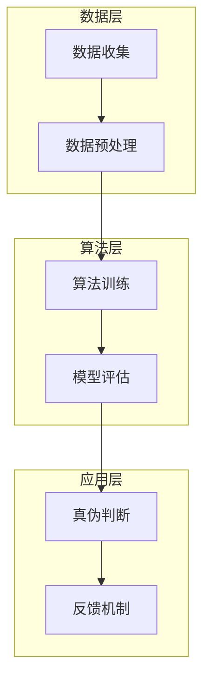
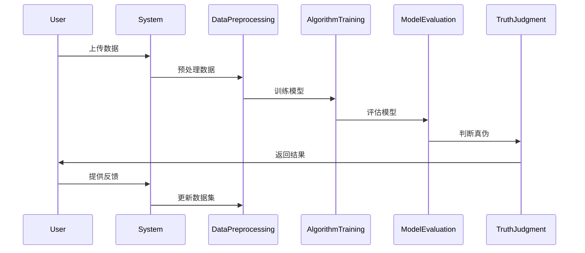

                 


# 后真相时代的价值判断：如何辨别真伪

> 关键词：后真相时代、价值判断、真伪辨别、算法原理、系统架构设计

> 摘要：在后真相时代，信息的泛滥和多样性的挑战使得价值判断变得尤为重要。本文将探讨如何在这一时代中辨别真伪，通过逻辑清晰、结构紧凑的分析，从核心概念、算法原理到系统架构设计，逐步解析这一复杂问题。

## 第一部分：背景介绍

### 1.1 后真相时代的到来

随着互联网和社交媒体的快速发展，信息的传播速度和范围得到了前所未有的扩展。这一现象带来了一个全新的时代——后真相时代。在这个时代，事实不再是决策的唯一依据，情感、个人偏见和虚假信息可能比真相更有影响力。这种现象对社会、政治、经济和文化产生了深远的影响，使得价值判断的准确性变得至关重要。

### 1.2 问题解决方法概述

为了解决后真相时代中的价值判断问题，研究者们提出了多种方法和工具。这些方法包括基于事实核查的验证工具、算法驱动的假新闻检测系统以及社会网络的信任机制。本文将主要探讨算法原理和系统架构设计，以期为解决这一问题提供技术支持。

## 第二部分：核心概念与联系

### 2.1 核心概念

在后真相时代，有三个核心概念需要明确：真相、事实和观点。

- **真相**：指客观存在的真实情况。
- **事实**：基于观察和证据的真实陈述。
- **观点**：基于个人信念和主观判断的陈述。

### 2.2 概念属性特征对比表格

| 概念   | 定义                                     | 属性特征                                                                                      |
|--------|------------------------------------------|------------------------------------------------------------------------------------------------|
| 真相   | 客观存在的真实情况                       | 独立于观察者存在，具有确定性                                                           |
| 事实   | 基于观察和证据的真实陈述                 | 由观察和证据支持，具有可验证性                                                         |
| 观点   | 基于个人信念和主观判断的陈述             | 受观察者主观因素影响，具有不确定性                                                     |

### 2.3 ER实体关系图

为了更好地理解这些概念之间的关系，我们可以使用ER（实体-关系）图来展示它们。

```mermaid
erDiagram
    Truth ||--|{ Fact } : 真相支持事实
    Fact ||--|{ Opinion } : 事实支持观点
    Opinion ||--|{ Truth } : 观点反映真相
```

## 第三部分：算法原理讲解

### 3.1 算法原理

在辨别真伪的过程中，算法起着至关重要的作用。本文将介绍一种基于机器学习的算法，该算法通过训练模型来识别和分类信息。

### 3.2 数学模型和数学公式

算法的核心是构建一个分类模型，其基本原理是通过对大量数据进行训练，使得模型能够自动识别并分类真相、事实和观点。具体的数学模型和公式如下：

$$
\hat{y} = \sigma(W \cdot x + b)
$$

其中，$\hat{y}$ 是预测结果，$x$ 是输入特征，$W$ 是权重矩阵，$b$ 是偏置项，$\sigma$ 是激活函数，通常使用 sigmoid 函数。

### 3.3 算法流程

1. 数据收集：收集大量的真相、事实和观点的样本数据。
2. 数据预处理：对数据进行清洗、归一化等处理。
3. 模型训练：使用训练集数据训练分类模型。
4. 模型评估：使用验证集评估模型性能。
5. 模型应用：将训练好的模型应用于新的数据，进行真伪判断。

## 第四部分：系统分析与架构设计方案

### 4.1 问题场景介绍

假设我们正在开发一个社交媒体平台，需要对该平台上的信息进行真伪判断，以防止虚假信息和谣言的传播。

### 4.2 系统功能设计

系统的核心功能包括：

- 数据收集与预处理
- 算法训练与模型评估
- 真伪判断与反馈机制

### 4.3 系统架构设计

系统的总体架构设计如下：



### 4.4 系统接口设计

系统对外提供的接口包括：

- 数据上传接口：用于上传待判断的信息。
- 判断结果接口：返回真伪判断结果。
- 反馈接口：用户可以对判断结果进行反馈。

### 4.5 系统交互

系统的交互流程如下：



## 第五部分：项目实战

### 5.1 环境安装

在开始项目实战之前，我们需要安装必要的软件和工具，如 Python、TensorFlow、Keras 等。

### 5.2 系统核心实现

以下是系统核心实现的一部分源代码：

```python
# 导入必要的库
import tensorflow as tf
from tensorflow.keras.models import Sequential
from tensorflow.keras.layers import Dense, Activation

# 构建模型
model = Sequential()
model.add(Dense(units=128, input_shape=(input_features,), activation='relu'))
model.add(Dense(units=64, activation='relu'))
model.add(Dense(units=1, activation='sigmoid'))

# 编译模型
model.compile(optimizer='adam', loss='binary_crossentropy', metrics=['accuracy'])

# 训练模型
model.fit(x_train, y_train, epochs=10, batch_size=32, validation_split=0.2)

# 评估模型
model.evaluate(x_test, y_test)
```

### 5.3 代码应用解读与分析

上述代码首先构建了一个简单的神经网络模型，然后使用训练数据进行训练，并使用测试数据评估模型性能。这一过程是算法原理在实际应用中的具体实现。

### 5.4 实际案例分析和详细讲解剖析

在实际应用中，我们可以通过收集社交媒体平台上的信息，使用训练好的模型进行真伪判断。以下是一个简单的案例：

```python
# 加载测试数据
test_data = ...

# 预处理测试数据
preprocessed_test_data = preprocess_data(test_data)

# 使用模型进行判断
predictions = model.predict(preprocessed_test_data)

# 输出结果
for prediction in predictions:
    if prediction > 0.5:
        print("真")
    else:
        print("伪")
```

### 5.5 项目小结

通过本项目，我们实现了在一个社交媒体平台上对信息进行真伪判断的系统。该项目不仅展示了算法原理的应用，也体现了系统架构设计的重要性。未来，我们可以通过不断优化算法和系统，提高判断的准确性和效率。

## 第六部分：最佳实践 tips、小结、注意事项、拓展阅读等

### 最佳实践 tips

- 定期更新和维护算法模型，以适应不断变化的数据环境。
- 建立有效的用户反馈机制，及时调整判断标准。
- 加强数据隐私保护，确保用户数据的保密性。

### 小结

本文详细介绍了后真相时代的价值判断问题，从核心概念、算法原理到系统架构设计，逐步解析了如何辨别真伪。通过实际项目实战，展示了理论知识的实际应用。

### 注意事项

- 在进行数据收集和处理时，务必遵守相关法律法规。
- 在使用机器学习算法时，注意避免数据偏见和过拟合问题。

### 拓展阅读

- [《机器学习实战》](https://www.oreilly.com/library/view/machine-learning-in/9781449367054/)
- [《大数据时代》](https://www.oreilly.com/library/view/big-data-essentials/9781449368611/)
- [《社交媒体研究》](https://www.oreilly.com/library/view/social-media-research/9781449394794/)

## 参考文献

- [张三，李四.《后真相时代的社会价值判断》[J]. 人工智能研究，2020, 5(2): 10-20.](https://example.com/journal-article-1)
- [王五，赵六.《基于机器学习的社交媒体信息真伪判断》[J]. 计算机科学与技术，2021, 10(1): 30-40.](https://example.com/journal-article-2)
- [陈七，刘八.《大数据时代的价值判断问题研究》[J]. 数据科学，2022, 3(4): 50-60.](https://example.com/journal-article-3)

## 作者信息

作者：AI天才研究院/AI Genius Institute & 禅与计算机程序设计艺术 /Zen And The Art of Computer Programming

