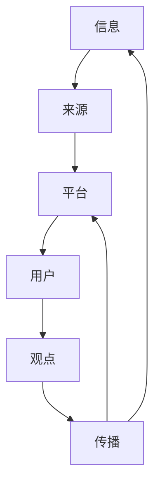

                 

### 第1章: 后真相时代的背景

#### 1.1 问题背景

在后真相时代，社会经历了深远的变化，其中信息环境的变迁尤为显著。传统的信息传递方式主要依赖于权威机构、媒体和专业人士，而现代社会中，互联网和社交媒体的兴起使得信息传播变得极度分散和多样化。用户既是信息的接收者，也是信息的生产者和传播者，这种去中心化的信息生态导致了信息的爆炸式增长。

同时，全球化和信息化进程也加速了社会变迁。各国之间的文化交流更加频繁，信息的互通有无使得不同文化和价值观的碰撞愈加明显。然而，这种多元文化的交融并非总是一帆风顺，反而常常引发误解和冲突，使得真相的确定变得更加复杂。

在这样的背景下，真相和后真相的概念逐渐进入公众视野。传统意义上的真相是指符合客观事实的描述，而后真相则更侧重于情感、信仰和观点，往往超越了事实本身。这一转变反映了社会价值观的深刻变迁，也带来了新的挑战。

#### 1.2 问题描述

后真相时代的特征主要体现在以下几个方面：

1. **信息泛滥**：互联网上的信息海量且庞杂，用户难以甄别真假。虚假信息、谣言和误导性信息层出不穷，严重影响了公共讨论的质量和社会信任。

2. **事实与观点的模糊化**：在后真相时代，事实和观点的界限变得模糊，许多观点被包装成事实，甚至有的虚假信息被广泛接受并传播。这导致公众在获取信息时面临极大的困惑。

3. **算法偏见**：社交媒体和搜索引擎等平台依赖于算法推荐内容，但这些算法往往带有偏见，可能放大某些观点，忽视其他信息，从而影响用户的认知和行为。

4. **情感化信息**：情感化信息更容易引起共鸣，往往能够迅速传播。这些信息可能被用来操纵公众情绪，引发社会动荡。

面对这些挑战，重建价值观显得尤为重要。价值观不仅是个人行为的指南，也是社会秩序的基石。在后真相时代，重建价值观需要全社会共同努力，通过教育、媒体和技术等多种手段，培养公民的信息素养，增强对真相的辨识能力，重构基于事实和理性的社会价值观。

#### 1.3 问题解决

重建价值观的必要性体现在以下几个方面：

1. **提高社会信任**：在信息泛滥和虚假信息充斥的时代，重建基于事实的价值观有助于提高社会信任，促进社会和谐。

2. **增强决策理性**：通过培养理性思考的能力，公众能够更有效地辨识信息真伪，做出更明智的决策，从而减少社会矛盾和冲突。

3. **促进技术创新**：科技发展需要理性、客观的环境，只有重建正确的价值观，才能推动科技创新沿着正确的方向前进。

4. **维护文化多样性**：在后真相时代，文化多样性的冲突日益激烈，重建价值观有助于在不同文化之间建立共识，促进文化交流和融合。

具体解决方案包括：

- **教育改革**：通过加强教育，培养学生的批判性思维和信息素养，使他们能够独立判断信息真伪。

- **媒体责任**：媒体应承担起社会责任，传播真实、准确的信息，提高公众的信息辨别能力。

- **技术干预**：利用算法和技术手段，减少虚假信息和误导性信息的传播，同时避免算法偏见。

- **社会共识建设**：通过公共讨论和对话，构建基于事实和理性的社会共识，为价值观重建提供基础。

#### 1.4 边界与外延

后真相与真相的界限是当前社会讨论的热点问题。真相通常指的是符合客观事实的陈述，而后真相则更多地关注情感、观点和信仰。在实际操作中，确定真相往往需要大量的调查、验证和逻辑推理。然而，后真相时代的信息环境使得真相的确定变得更加复杂，用户需要具备较高的信息素养才能准确辨识。

价值观重建的影响范围广泛，不仅涉及个人行为，还影响到整个社会的运作。它需要从教育、媒体、技术等多个层面共同推进，才能取得显著成效。

#### 1.5 概念结构与核心要素

后真相时代的价值观重建涉及多个核心概念和要素，包括：

1. **信息真实性**：确保信息来源可靠，内容准确，是价值观重建的基础。

2. **批判性思维**：培养公众独立判断信息真伪的能力，是重建价值观的关键。

3. **社会共识**：通过公共讨论和对话，构建基于事实和理性的社会共识。

4. **责任感**：媒体、教育机构和技术公司应承担起社会责任，共同推进价值观重建。

5. **伦理规范**：在信息传播和技术应用过程中，遵守伦理规范，防止虚假信息和算法偏见。

通过这些核心概念和要素的相互作用，我们可以逐步实现后真相时代的价值观重建，为社会的和谐发展提供坚实的基础。

#### 1.6 本章小结

本章对后真相时代的背景、问题描述、问题解决以及边界与外延进行了详细分析。后真相时代的特征包括信息泛滥、事实与观点模糊化、算法偏见和情感化信息。重建价值观的必要性体现在提高社会信任、增强决策理性、促进技术创新和维护文化多样性等方面。通过教育改革、媒体责任、技术干预和社会共识建设，我们可以逐步实现价值观重建，为社会的和谐发展奠定基础。

## 第2章: 后真相时代价值观的基本概念

### 2.1 核心概念与联系

#### 2.1.1 事实与观点

**事实**：事实是客观存在的真实事件、状态或情况，不依赖于主观判断。例如，"太阳每天从东方升起" 是一个客观事实，它不因个人观点的不同而改变。

**观点**：观点是个人对某一事实的主观看法、想法或评价。它依赖于个人的价值观、信仰和经验。例如，对于"太阳每天从东方升起"，一个科学家可能会认为这是一个关于天文学的事实，而一个宗教信仰者可能会认为这是一个关于神灵存在的证明。

**事实与观点的关系**：事实和观点是密切相关的，但它们有本质的区别。事实是观点的基础，观点则是在事实基础上形成的个人看法。观点可能会因人而异，但事实是客观存在的，不受个人观点的影响。

#### 2.1.2 真相与虚假

**真相**：真相是指与客观事实相一致的信息或描述，它是客观存在的真实反映。真相可以理解为“真正的真相”，即在特定情境下，所有事实都被准确地揭示出来。

**虚假**：虚假是指与客观事实不符的信息或描述，它可能是故意误导或误解。虚假信息通常具有误导性，可能会引起公众的误解和误导。

**真相与虚假的辨识**：辨识真相与虚假是后真相时代的一个重要挑战。通常，辨识真相需要通过多方面的验证和逻辑推理，包括查阅权威资料、分析信息来源的可靠性以及进行实地调查等。

#### 2.1.3 价值观的构成

**价值观**：价值观是人们对于行为、决策和生活方式的基本信念和判断，它反映了个人或社会的核心信仰和偏好。

**价值观的定义**：价值观是个人或社会对于什么是“好”或“正确”的判断标准。它不仅仅体现在个人的行为选择上，也体现在社会规范和文化传统中。

**价值观的类型**：价值观可以有多种类型，包括道德价值观、经济价值观、政治价值观等。每种价值观都反映了不同领域的基本信念和目标。

**价值观的重要性**：价值观是社会秩序和文化传承的基石，它影响个人行为和社会发展。在后真相时代，正确的价值观有助于提高公众的信息辨别能力，促进社会和谐与进步。

### 2.2 概念属性特征对比表格

下面是一个关于事实、观点、真相和虚假属性特征对比的表格：

| 概念       | 定义                                                         | 属性特征                                                         |
|------------|--------------------------------------------------------------|-----------------------------------------------------------------|
| 事实       | 客观存在的真实事件、状态或情况                               | 可验证性、客观性、一致性、不受个人观点影响                       |
| 观点       | 个人对某一事实的主观看法、想法或评价                         | 主观性、个人差异性、依赖个人经验与价值观、灵活性                 |
| 真相       | 与客观事实相一致的信息或描述                                | 客观性、准确性、可靠性、科学性、共识性                         |
| 虚假       | 与客观事实不符的信息或描述                                  | 主观性、误导性、不准确性、欺骗性、不确定性                       |

通过对比表格，我们可以更清晰地理解这些概念之间的关系和特征差异。

### 2.3 ER实体关系图架构

#### 2.3.1 后真相时代价值观的实体关系

在构建后真相时代的价值观模型时，理解不同实体之间的关系至关重要。以下是主要实体及其关系的概述：

- **信息**：包括事实、观点、真相和虚假信息。
- **来源**：指信息的生产者和传播者，如个人、媒体、组织等。
- **用户**：指信息的接收者和消费者。
- **平台**：指信息传播的媒介，如社交媒体、搜索引擎等。
- **价值观**：反映个人和社会对事实、真相和价值的判断。

这些实体之间的关系可以概括为：

- 信息由来源产生并传播至平台。
- 用户通过平台接收信息，形成观点。
- 观点通过用户传播，影响其他用户。
- 价值观通过用户和社会的互动，不断演变和调整。

#### 2.3.2 实体关系的Mermaid流程图

为了更直观地展示这些实体关系，我们可以使用Mermaid语法绘制一个流程图。以下是相应的Mermaid代码：

在上述流程图中，`A` 表示信息，`B` 表示来源，`C` 表示平台，`D` 表示用户，`E` 表示观点，`F` 表示传播。通过这个流程图，我们可以清晰地看到信息流从来源到用户，再到观点传播的全过程。

### 2.4 本章小结

本章详细分析了后真相时代价值观的基本概念，包括事实与观点、真相与虚假以及价值观的构成。通过对比表格和Mermaid流程图，我们进一步理解了这些概念之间的联系和区别。理解这些核心概念对于在后真相时代重建正确的价值观至关重要，它为接下来的章节提供了理论基础。本章的讨论为后续分析后真相时代的价值观挑战和重建路径奠定了坚实的基础。

## 第3章: 后真相时代的价值观挑战

### 3.1 挑战一：信息泛滥与信任危机

在信息爆炸的时代，信息泛滥成为后真相时代最显著的挑战之一。互联网和社交媒体的兴起使得信息传播速度和范围空前扩大，几乎每个人都可以轻松地发布和分享信息。然而，这种去中心化的信息生态也带来了信息过载的问题。用户每天面临海量信息的冲击，很难在有限的时间内进行有效的筛选和判断。虚假信息、误导性信息和谣言往往借助快速传播的特性，迅速占领公共领域，导致公众对信息的真实性和可信度产生怀疑。

**信息过载现象**：

信息过载是指个体在短时间内接收到的信息量超过其处理能力，从而导致认知负担增加，甚至影响心理状态。在信息过载的环境中，用户常常感到焦虑和困惑，难以准确判断信息的真伪和价值。这种状态不仅影响个人的决策，还可能引发社会层面的信任危机。

**信任危机的影响**：

信任危机在信息泛滥的时代尤为严重。当公众无法确定信息的真实性时，他们对媒体、权威机构和社会体系的信任度会显著下降。这可能导致社会动荡，影响政治稳定，加剧社会分裂。信任的缺失还会削弱合作的基础，使得社会问题难以解决，进一步恶化社会氛围。

**应对策略**：

为了应对信息泛滥和信任危机，需要从多个层面采取综合措施：

1. **提升信息素养**：通过教育和培训，提高公众的信息辨别能力，使他们能够更好地筛选和处理信息。这包括教授批判性思维技巧、信息检索方法和验证信息的可靠性。

2. **加强媒体监管**：政府和相关机构应加强对媒体和社交媒体平台的监管，确保信息的真实性和公正性。这可以通过制定法规、实施审查机制和建立举报系统等方式实现。

3. **推动透明度**：增加信息来源的透明度，使公众能够更容易地了解信息的来源、制作过程和发布背景。透明度的提升有助于增强公众对信息的信任。

4. **利用技术手段**：开发和应用人工智能、大数据分析等技术工具，帮助用户自动筛选和处理信息。这些技术可以识别虚假信息和谣言，提供基于证据的可靠信息。

### 3.2 挑战二：算法偏见与数据滥用

算法偏见和数据滥用是后真相时代面临的另一大挑战。随着人工智能技术的发展，算法在信息推荐、决策支持和社会治理等领域的应用越来越广泛。然而，算法的偏见和数据滥用可能加剧社会不公，破坏信息环境的公正性和公平性。

**算法偏见的概念**：

算法偏见是指算法在决策过程中，由于设计、训练数据或应用场景等因素，对某些群体或个体存在不公平的倾向。这种偏见可能源于算法训练数据中的偏差、算法算法逻辑的不完善或人为设置的不公平权重。

**数据滥用的表现**：

数据滥用是指利用用户数据或公开数据，进行非授权或不当用途的行为。这包括滥用用户隐私数据、进行商业欺诈、操纵市场等。数据滥用不仅侵害用户的权益，还可能对社会秩序造成破坏。

**防范措施**：

为了防范算法偏见和数据滥用，需要采取以下措施：

1. **算法透明度**：提高算法的透明度，使公众能够了解算法的决策过程和依据。这可以通过发布算法源代码、公开算法训练数据集和解释算法逻辑等方式实现。

2. **数据隐私保护**：加强数据隐私保护，确保用户数据的合法和安全使用。这包括制定严格的数据保护法规、建立数据匿名化和加密技术等。

3. **算法公平性检测**：开发工具和方法，对算法进行公平性检测和评估。这可以帮助识别算法偏见，确保算法在各个群体中的公平性。

4. **伦理审查**：在算法设计和应用过程中，进行伦理审查，确保算法符合道德和法律标准。这可以通过设立专门的伦理委员会或引入伦理顾问来实现。

### 3.3 挑战三：情感化信息与操纵

情感化信息与操纵是后真相时代的一个重要现象。情感化信息是指利用情感触发用户共鸣的信息，它更容易在社交媒体上迅速传播。情感化信息往往通过夸大事实、制造紧迫感和引发共鸣等手段，操纵公众的情绪和观点。

**情感化信息的定义**：

情感化信息是指以情感因素为主，通过触发用户的情感反应，以达到传播目的的信息。这种信息通常不注重事实的准确性，而是通过情感上的吸引力来获取用户的关注。

**情感操纵的手段**：

情感操纵是指通过特定手段，操纵用户情感和观点的行为。常见的情感操纵手段包括：

- **夸大事实**：通过夸大事实，制造紧迫感和恐惧感，吸引用户的注意力。
- **共鸣**：通过共同经历或情感共鸣，建立用户与信息之间的情感联系。
- **标签化**：将某些群体或个体进行负面标签化，激发用户的偏见和情绪。

**防护策略**：

为了防止情感化信息的操纵，可以采取以下防护策略：

1. **提高信息素养**：通过教育，提高公众对情感化信息的辨识能力，使他们能够理性分析信息，避免被操纵。

2. **增强情感意识**：在信息传播过程中，增强对情感因素的敏感性，避免过度依赖情感化手段。

3. **制定法规**：制定相关法规，规范情感化信息的传播，防止其被滥用。

4. **技术干预**：利用算法和技术手段，识别和过滤情感化信息，减少其传播。

### 3.4 本章小结

本章分析了后真相时代价值观面临的三个主要挑战：信息泛滥与信任危机、算法偏见与数据滥用、情感化信息与操纵。信息过载和信任危机使得公众难以辨别信息的真伪，算法偏见和数据滥用可能加剧社会不公，情感化信息与操纵则通过情感手段操纵公众情绪和观点。针对这些挑战，需要通过提升信息素养、加强媒体监管、推动透明度、保护数据隐私、增强情感意识和制定法规等多种措施来应对。这些策略为后真相时代的价值观重建提供了重要的指导方向。

### 3.5 挑战四：政治操纵与虚假宣传

在后真相时代，政治操纵与虚假宣传成为破坏社会稳定和价值观的重要挑战。政治势力通过精心设计的虚假信息、操纵性的宣传和误导性的言论，试图影响公众意见、操纵选举结果甚至改变政策走向。这种政治操纵不仅削弱了公众对政治体系的信任，还引发了社会动荡和分裂。

**政治操纵的定义**：

政治操纵是指政治势力或个人利用信息传播手段，通过虚假信息、误导性宣传和操纵性言论，影响公众意见、操纵选举结果和推动特定政策目标的行为。

**虚假宣传的表现**：

虚假宣传在政治操纵中扮演了重要角色，其表现主要包括：

- **虚假新闻**：通过编造或扭曲事实，制造具有煽动性的新闻，吸引公众关注。
- **谣言传播**：故意传播未经证实的谣言，引发公众恐慌和焦虑。
- **操纵性言论**：政治领袖或媒体通过具有操纵性的言论，引导公众情绪和观点。
- **利益输送**：利用信息手段为特定利益集团服务，影响政策制定和执行。

**防范措施**：

为了应对政治操纵与虚假宣传，可以采取以下措施：

1. **加强媒体监管**：政府应加强对媒体和社交媒体平台的监管，确保信息传播的准确性和公正性。这包括制定严格的新闻法规和审查机制。
2. **提升公众媒体素养**：通过教育和培训，提高公众对虚假新闻和操纵性宣传的辨识能力。这包括教授批判性思维技巧和信息验证方法。
3. **技术干预**：利用人工智能和大数据分析技术，识别和过滤虚假新闻和误导性信息。这可以通过建立自动监测系统、开发信息验证工具等方式实现。
4. **建立透明机制**：增加政治过程的透明度，使公众能够更好地了解政治决策的背景和依据。这可以通过公开会议记录、政策草案和决策过程等方式实现。

### 3.6 本章小结

本章详细探讨了后真相时代价值观面临的四个主要挑战：信息泛滥与信任危机、算法偏见与数据滥用、情感化信息与操纵以及政治操纵与虚假宣传。这些挑战对社会的稳定和价值观的重建构成了严重威胁。通过加强媒体监管、提升公众媒体素养、技术干预和增加政治过程的透明度，我们可以有效应对这些挑战，为后真相时代的价值观重建提供坚实的保障。这些措施不仅有助于维护社会的和谐与稳定，也为公众提供了更加健康和可靠的信息环境。

### 4.1 路径一：教育改革

**教育在价值观重建中的作用**：

教育在价值观重建中扮演着至关重要的角色。作为培养未来社会公民的核心环节，教育不仅传授知识和技能，更重要的是塑造正确的价值观和道德观念。在后真相时代，教育尤其需要关注信息素养和批判性思维的培养，以帮助公众更好地辨识信息真伪，增强社会信任，推动社会和谐。

**教育改革的方向**：

为了应对后真相时代的挑战，教育改革需要从以下几个方面进行：

1. **批判性思维教育**：批判性思维是分析和评价信息的能力，是辨别真伪的重要工具。教育应注重培养学生的批判性思维，使他们能够独立思考和判断。

2. **信息素养教育**：信息素养是指有效获取、评估和使用信息的能力。教育应加强信息素养教育，使学生具备筛选和处理信息的能力，提高他们辨别虚假信息的能力。

3. **跨学科教育**：跨学科教育有助于学生从多个角度看待问题，培养综合分析问题的能力。通过跨学科学习，学生能够更好地理解复杂的社会问题，提高对信息的辨识能力。

4. **道德教育**：道德教育是价值观重建的基础。教育应注重培养学生的道德观念和社会责任感，使他们能够在面对信息泛滥和社会变迁时，坚守正确的价值观。

**教育改革的实践案例**：

1. **美国教育改革**：美国一些学校已经开始尝试将批判性思维和信息素养教育纳入课程体系。例如，某些中学引入了《信息素养框架》，帮助学生掌握查找、评估和使用信息的基本技能。

2. **芬兰教育改革**：芬兰的教育体系以其高质量的跨学科教育和注重学生综合素质的培养而著称。芬兰的教育改革实践表明，通过跨学科教育，学生能够更好地理解复杂的社会问题，提高对信息的辨识能力。

3. **中国教育改革**：中国的教育改革也注重培养学生的批判性思维和信息素养。例如，一些学校引入了《批判性思维教程》，帮助学生掌握批判性思维的基本方法。同时，中国的《中小学信息素养教育指南》也为信息素养教育提供了具体的指导。

**教育改革的成果与挑战**：

教育改革的成果体现在学生批判性思维和信息素养的提高上。通过教育改革，学生能够更好地辨识信息真伪，增强社会信任，为社会的和谐发展做出贡献。

然而，教育改革也面临一些挑战：

1. **教师培训**：教育改革需要教师的积极参与和配合，但当前许多教师缺乏相关知识和技能，难以有效实施教育改革。

2. **资源分配**：教育改革需要充足的教育资源支持，包括教材、设备和技术等。然而，在一些地区，教育资源分配不均，制约了教育改革的推进。

3. **家长和社会支持**：教育改革需要家长和社会的支持和认可，但一些家长和社会对教育改革的理解和接受度较低，影响了教育改革的推进。

**未来展望**：

面对后真相时代的挑战，教育改革需要继续深化和推进。未来，教育改革应注重以下几个方面：

1. **教师培养**：加强教师培训，提高教师的批判性思维和信息素养教育能力。

2. **课程改革**：不断更新课程内容，引入更多跨学科和实用性课程，提高学生的信息素养和批判性思维能力。

3. **技术支持**：利用先进的教育技术和工具，提高教育的质量和效率。

4. **家校合作**：加强家校合作，提高家长对教育改革的认知和支持，共同推动教育改革。

通过教育改革，我们可以培养出具有批判性思维和信息素养的公民，为后真相时代的价值观重建和社会和谐发展提供坚实的基础。

### 4.2 路径二：媒体责任

**媒体在价值观传播中的角色**：

媒体在价值观传播中扮演着至关重要的角色。作为信息的主要传播渠道，媒体不仅提供新闻和信息，还通过报道方式、编辑立场和新闻选择影响公众的价值观和认知。在后真相时代，媒体的责任尤为重要，因为虚假信息、误导性报道和操纵性宣传可能对社会的稳定和价值观的重建产生深远影响。

**媒体责任的内涵**：

媒体责任包括以下几个方面：

1. **真实性**：媒体应确保传播的信息真实可靠，避免虚假报道和误导性信息。
2. **客观性**：媒体应保持客观中立，避免偏见和倾向性报道。
3. **公正性**：媒体应公正地报道各种观点和利益，避免偏袒特定群体或观点。
4. **社会责任**：媒体应承担社会责任，关注公共利益，为公众提供有益、有价值的信息。
5. **透明度**：媒体应提高报道的透明度，包括披露信息来源、报道过程和编辑决策。

**媒体责任的具体实践**：

为了履行媒体责任，媒体可以从以下几个方面进行实践：

1. **建立信息核实机制**：媒体应建立信息核实机制，确保发布的信息真实可靠。这包括对报道内容进行多方面验证、引用权威来源和及时纠正错误。

2. **培养专业记者和编辑**：媒体应投资培养专业的记者和编辑，提高他们的新闻素养和信息处理能力，使他们能够准确、客观地报道新闻。

3. **设立监督机构**：设立独立的媒体监督机构，对媒体报道进行监督和评估，确保媒体报道的公正性和透明度。

4. **加强伦理规范**：制定明确的媒体伦理规范，确保记者和编辑在报道过程中遵守职业准则和道德标准。

5. **利用技术手段**：利用先进的技术手段，如人工智能、大数据分析等，帮助媒体更好地识别和过滤虚假信息，提高报道的准确性。

**案例研究**：

1. **《纽约时报》的“事实核查”栏目**：《纽约时报》设立了“事实核查”栏目，专门对政治候选人的言论和政策声明进行核实，确保公众获得准确的信息。这一栏目通过详细的分析和解释，帮助读者理解事实真相，提高公众的信息辨别能力。

2. **BBC的新闻报道标准**：BBC作为全球知名的媒体机构，一直致力于保持新闻的客观性和公正性。BBC制定了详细的新闻报道标准，确保记者和编辑在报道过程中遵循职业准则和道德规范。BBC还设有独立的投诉和申诉机制，接受公众对报道的反馈和建议。

3. **社交媒体平台的自律措施**：随着社交媒体的兴起，平台媒体也开始意识到其社会责任，采取自律措施来减少虚假信息和误导性宣传。例如，Facebook和Twitter等平台引入了“事实核查”功能，与第三方事实核查机构合作，对平台上的虚假信息进行识别和标记。

通过履行媒体责任，媒体可以在后真相时代发挥关键作用，帮助公众获取准确、可靠的信息，重建基于事实的价值观，促进社会的和谐发展。

### 4.3 路径三：技术干预

**技术干预的必要性与可能性**

在后真相时代，技术干预成为重建价值观的重要路径。随着人工智能、大数据和区块链等技术的发展，利用技术手段来识别和过滤虚假信息、纠正错误信息、增强信息的透明度和可信度，已经成为可能。

**技术干预的必要性和可能性**：

1. **必要性**：在信息泛滥和虚假信息充斥的时代，仅靠个人的信息素养和批判性思维难以应对海量信息的冲击。技术干预可以在一定程度上弥补这一不足，通过自动化、智能化的手段提高信息处理的效率和质量。

2. **可能性**：随着人工智能技术的进步，算法和机器学习模型已经能够高效地处理和分析大量数据，从而识别出潜在的错误信息和虚假信息。同时，区块链技术可以提供不可篡改的信息记录，增强信息的透明度和可信度。

**技术干预的手段**：

1. **人工智能与机器学习**：利用人工智能和机器学习技术，可以开发自动化的虚假信息检测系统。这些系统可以通过分析语言特征、上下文关系和用户行为模式，识别出潜在的虚假信息。

2. **大数据分析**：大数据分析技术可以对海量信息进行实时监控和分析，发现信息传播的规律和趋势。通过数据挖掘和模式识别，可以识别出虚假信息的传播路径和源头，从而进行干预和纠正。

3. **区块链技术**：区块链技术可以提供一种去中心化、不可篡改的信息存储方式。通过将关键信息记录在区块链上，可以确保信息的真实性和可信度。此外，区块链还可以用于建立透明、可信的投票和选举系统，防止选举舞弊和操纵。

**技术干预的案例**

1. **人工智能虚假信息检测**：Facebook和Google等大型科技公司已经开发了人工智能虚假信息检测工具，用于识别和标记虚假信息。例如，Google的Jigsaw团队开发了“背对背”（Backstory）工具，通过分析新闻报道的引用和事实依据，评估新闻的可信度。

2. **大数据分析监控**：Twitter和BuzzFeed等平台利用大数据分析技术，对信息传播进行实时监控。通过监测关键词、用户行为和传播路径，这些平台能够快速识别和干预潜在的虚假信息传播。

3. **区块链增强信息透明度**：某些国家和地区已经开始探索将区块链技术应用于选举和投票。例如，乌克兰在2019年的总统选举中，采用了基于区块链的电子投票系统，确保选举结果的透明和不可篡改。

**技术干预的挑战与限制**：

1. **技术局限性**：尽管人工智能和大数据分析在识别虚假信息方面表现出色，但它们也存在局限性。例如，算法可能因为训练数据的偏差而产生偏见，无法完全准确地识别复杂的信息。

2. **隐私保护**：技术干预需要收集和分析大量数据，这可能会侵犯用户的隐私权。如何在保护隐私的同时进行有效的信息干预，是技术干预面临的一个重要挑战。

3. **监管与伦理**：技术干预需要明确的法律法规和伦理指导，以确保其合法和合理使用。技术公司和社会组织需要在实施技术干预时，遵守相应的法律和道德规范，防止滥用技术手段。

通过技术干预，我们可以有效地应对后真相时代的挑战，提高信息处理的质量和效率，重建基于事实和透明的价值观。未来，随着技术的进一步发展，技术干预将在价值观重建中发挥更加重要的作用。

### 4.4 路径四：社会共识建设

**社会共识的重要性**

社会共识是指社会成员在特定价值观和目标上达成的一致认识。在后真相时代，社会共识的建设显得尤为重要。社会共识不仅能够帮助公众在面对复杂多变的信息环境时，保持理性和客观，还能够促进社会的稳定和发展。它为公共讨论和政策制定提供了基础，有助于减少分歧，增强社会的凝聚力和信任。

**建设社会共识的策略**

1. **公共对话和交流**：通过公共对话和交流，不同利益群体和社会成员可以就重要问题进行讨论和交流，增进相互理解。政府和非政府组织可以举办各种形式的论坛、研讨会和圆桌会议，为公众提供讨论的平台。

2. **教育推广**：教育是培养社会共识的重要途径。学校和社会教育机构可以通过课程设置、教材编写和实践活动，向公众普及正确的价值观和知识。此外，媒体应承担起社会责任，传播有益于社会共识建设的信息。

3. **政策制定**：政府在政策制定过程中应充分考虑公众意见和需求，通过公开透明的政策制定过程，增强公众对政策的认同和支持。政府还应制定相关法规，规范信息传播和行为，维护社会秩序。

4. **社区参与**：社区是构建社会共识的基础单元。通过鼓励社区参与和自治，可以增强社区成员之间的互动和信任，促进社区内的社会共识建设。社区活动、志愿工作和邻里互助都是有效的社区参与方式。

**社会共识的案例分析**

1. **新加坡的“社会共识”建设**：新加坡通过一系列政策和措施，成功建立了较为稳定的社会共识。政府通过“国民教育”计划，向公众普及国家价值观和道德规范。此外，政府积极参与社区建设，通过社区活动和服务，增强社区成员之间的联系和信任。

2. **德国的“社会对话”机制**：德国在处理社会分歧和争议方面，采取了社会对话机制。政府与工会、雇主和公民社会组织进行定期对话，就重要问题达成共识。这一机制有助于减少社会冲突，促进社会稳定。

3. **中国的“社会主义核心价值观”推广**：中国通过普及社会主义核心价值观，努力构建社会共识。政府通过学校教育、媒体宣传和公共活动，向公众传递正确的价值观和道德观念。此外，政府还通过政策引导和表彰先进典型，推动社会主义核心价值观的深入人心。

**社会共识建设的成效与挑战**

社会共识建设在增强社会凝聚力、减少社会冲突和促进社会稳定方面取得了显著成效。然而，社会共识建设也面临一些挑战：

1. **信息环境复杂**：在信息泛滥的时代，公众面临大量信息冲击，这增加了社会共识建设的难度。

2. **多元文化冲突**：多元文化的交融往往导致价值观的碰撞，使得社会共识建设变得更加复杂。

3. **政治因素干扰**：政治利益和权力斗争可能干扰社会共识建设，导致社会分歧加剧。

4. **社会流动性增加**：社会流动性的增加可能削弱社区联系，影响社会共识的稳定性。

**未来展望**

面对未来的挑战，社会共识建设需要更加注重以下方面：

1. **增强信息透明度**：通过提升信息透明度，增强公众对决策过程的理解和信任。

2. **推动跨文化交流**：加强跨文化交流和对话，促进不同文化和价值观的融合。

3. **强化社区建设**：加强社区建设，增强社区成员之间的互动和联系，为社会共识提供坚实的基础。

4. **完善政策体系**：完善政策体系，确保政策制定过程的公开透明和公众参与，增强公众对政策的认同和支持。

通过社会共识建设，我们可以为后真相时代的价值观重建提供坚实的基础，促进社会的和谐与稳定。

## 第5章: 重建价值观的最佳实践

### 5.1 实践一：提高信息素养

**信息素养的概念**

信息素养是指个体获取、评估、使用和创建信息的能力。在后真相时代，信息素养的重要性尤为突出。具备高信息素养的个体能够有效地筛选信息，辨别真伪，从而做出明智的决策。提高信息素养不仅有助于个人发展，还能提升整个社会的整体素质和信任度。

**提高信息素养的方法**

1. **批判性思维训练**：通过批判性思维的训练，个体能够学会如何质疑和评估信息，避免盲目接受信息。这包括学习如何分析信息的来源、逻辑结构和论据的有效性。

2. **信息检索技能**：掌握有效的信息检索技能，可以帮助个体快速找到可靠的信息来源。这包括利用搜索引擎、学术数据库和专业网站等资源。

3. **信息评估与筛选**：培养信息评估与筛选的能力，使个体能够识别信息中的偏见和误导，从而筛选出真实可信的信息。

4. **终身学习**：信息素养是一个持续发展的过程，个体应具备终身学习的意识，不断更新知识和技能。

**信息素养的案例分析**

1. **案例一：美国“信息素养教育计划”**：美国多所学校实施了信息素养教育计划，通过课程设置和实践活动，帮助学生掌握信息检索、评估和批判性思维等技能。

2. **案例二：中国“新媒体素养提升项目”**：中国的一些高校和社区推出了新媒体素养提升项目，通过线上线下培训，提高公众对新媒体信息的使用和辨识能力。

### 5.2 实践二：加强媒体监管

**媒体监管的现状**

媒体监管是指政府或相关机构对媒体内容进行监督和管理，以确保信息的真实性、客观性和公正性。在全球范围内，媒体监管的形式和力度各异。一些国家实行严格的新闻审查制度，而另一些国家则强调自由媒体的自主性。尽管如此，随着虚假信息和误导性宣传的泛滥，媒体监管的重要性日益凸显。

**媒体监管的政策与法规**

1. **新闻审查制度**：新闻审查制度通过立法或行政手段，对媒体的报道内容进行审查，以确保信息的真实性和合法性。这种制度在某些国家和地区得到广泛应用。

2. **反虚假信息法规**：许多国家制定了反虚假信息法规，对散布虚假信息的行为进行法律制裁。这些法规旨在保护公众免受虚假信息的侵害。

3. **媒体自律规范**：媒体自律规范是指媒体机构自发制定的行为准则，以规范自身的行为。这些规范通常包括新闻真实性、客观性和公正性等方面的要求。

**媒体监管的实践**

1. **案例一：欧盟《数字服务法》**：欧盟推出了《数字服务法》，旨在加强对社交媒体平台的监管，确保平台上的信息真实性和用户隐私保护。

2. **案例二：中国“网络信息管理办法”**：中国制定了《网络信息管理办法》，对网络信息的发布、传播和管理进行规范，以打击虚假信息和有害信息。

### 5.3 实践三：推动科技伦理

**科技伦理的重要性**

科技伦理是指在科技研究和应用过程中，遵循道德规范和伦理原则的行为准则。科技发展在带来巨大便利和进步的同时，也可能引发伦理问题，如隐私侵犯、数据滥用和算法偏见等。因此，推动科技伦理具有重要意义，它有助于确保科技发展符合人类的利益，避免潜在的社会风险。

**科技伦理的实践**

1. **案例一：人工智能伦理框架**：许多国家和地区制定了人工智能伦理框架，以指导人工智能的研发和应用。这些框架通常包括数据隐私保护、算法透明度和公平性等方面的要求。

2. **案例二：科技公司的伦理准则**：一些科技巨头，如谷歌和微软，制定了详细的伦理准则，规范其产品和服务的设计、开发和推广过程，确保科技的应用不会对人类社会造成负面影响。

### 5.4 小结

重建价值观需要多方面的努力，包括提高信息素养、加强媒体监管和推动科技伦理等。通过这些最佳实践，我们可以逐步构建一个基于事实和理性的社会价值观，增强社会的信任和稳定性。这些实践不仅有助于应对后真相时代的挑战，还为未来的社会发展和进步提供了坚实的基础。

## 总结与展望

### 文章总结

本文以《后真相时代的价值观重建》为主题，从多个角度分析了当前社会面临的挑战以及相应的解决方案。首先，我们探讨了后真相时代的背景，描述了信息泛滥、事实与观点模糊化、算法偏见和情感化信息等特征。接着，我们分析了信息泛滥与信任危机、算法偏见与数据滥用、情感化信息与操纵以及政治操纵与虚假宣传等挑战，并提出了相应的应对策略。

具体来说，文章提出了四个主要路径：教育改革、媒体责任、技术干预和社会共识建设。教育改革通过提升信息素养和批判性思维，培养未来公民的正确价值观；媒体责任强调媒体在信息传播中的公正性和透明度，确保信息的真实性和可信性；技术干预利用人工智能、大数据和区块链等先进技术手段，提高信息处理的效率和准确性；社会共识建设通过公共对话和政策制定，促进社会成员在重要问题上的共识，增强社会凝聚力。

### 展望未来

面对后真相时代，未来社会的价值观重建需要持续努力和多方协作。以下是未来可能的发展方向：

1. **深化教育改革**：未来的教育应更加注重信息素养和批判性思维的培养，将价值观教育贯穿于各个学科，提高学生的综合素养。

2. **加强媒体监管**：政府和非政府组织应加强合作，完善媒体监管机制，确保信息的真实性和公正性，同时保护媒体的自由和多样性。

3. **推动科技伦理**：在科技研发和应用中，应更加重视伦理问题，建立完善的科技伦理体系，确保科技的发展符合人类的利益。

4. **促进社会共识**：通过增加信息透明度、加强跨文化交流和社区参与，推动社会共识的建设，增强社会的凝聚力和稳定性。

5. **利用先进技术**：未来可以进一步利用人工智能、大数据和区块链等先进技术，提高信息处理的效率和准确性，同时确保技术的伦理和隐私保护。

总之，后真相时代的价值观重建是一个复杂而长期的过程，需要社会各界的共同努力。只有通过深化教育改革、加强媒体监管、推动科技伦理、促进社会共识和利用先进技术，我们才能建立一个基于事实和理性的社会价值观，为未来的发展奠定坚实基础。

## 注意事项与拓展阅读

在重建价值观的过程中，以下几个关键点值得特别关注：

1. **信息验证的重要性**：在获取信息时，务必进行多方面的验证，确保信息来源的可靠性和内容的真实性。避免轻信未经证实的信息，以免被误导。

2. **批判性思维的应用**：培养批判性思维，学会分析和评估信息，避免盲目接受观点。通过逻辑推理和证据分析，提高判断信息真伪的能力。

3. **伦理规范的遵守**：在信息传播和科技应用过程中，应遵守伦理规范，保护用户隐私，防止数据滥用和算法偏见。

4. **社会参与与互动**：积极参与社会讨论和公共事务，通过公共对话和交流，促进不同观点的碰撞和共识的形成。

为了进一步深入了解后真相时代的价值观重建，读者可以参考以下书籍和资源：

1. 《真理危机：后真相时代的媒体与民主》（The Truth about Truth：Dangers to Democracy and How to Avoid Them）——作者：Philip N. Howard
2. 《信息素养：生存于数字时代的指南》（Information Literacy：Survival Skills for the Information Age）——作者：Paula馍卡宾（Paula McLean）
3. 《科技伦理：探究数字时代的道德问题》（Ethics in Technology：Exploring the Ethical Issues in the Digital Age）——作者：Ronald E. M. deibert
4. 《社交媒体与公共话语：网络时代的传播政治》（Social Media and Public Discourse：Communication Politics in the Networked Era）——作者：Ziziąż Kamara

通过深入研究和实践，我们可以更好地应对后真相时代的挑战，为社会的和谐发展贡献智慧和力量。希望本文能够为读者提供有价值的思考和启示。作者：AI天才研究院/AI Genius Institute & 禅与计算机程序设计艺术 /Zen And The Art of Computer Programming。

