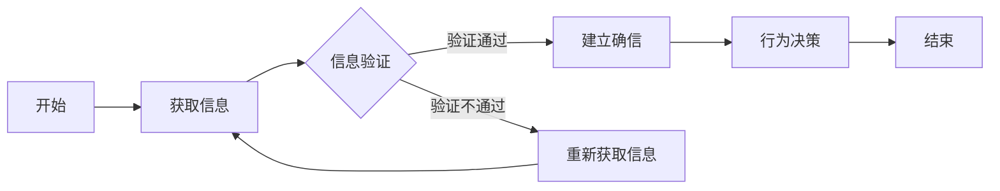
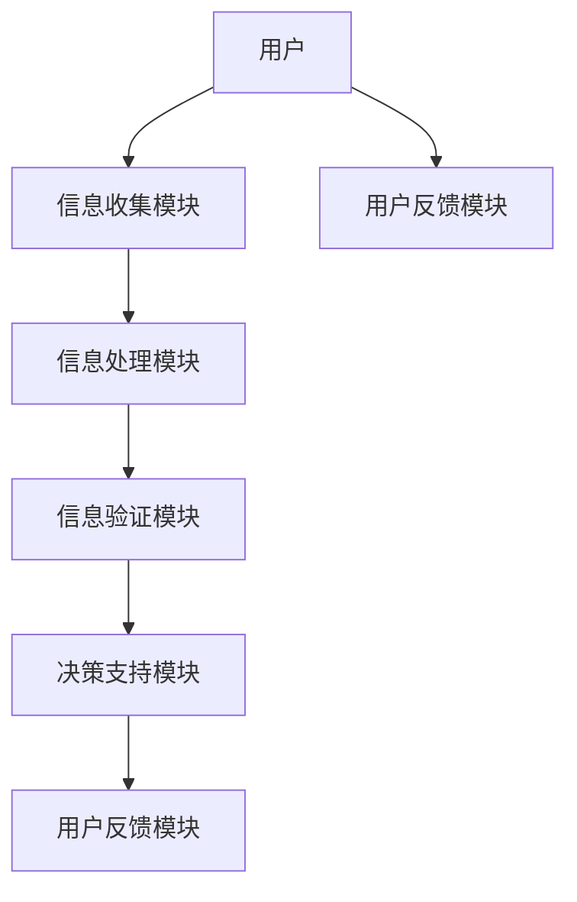
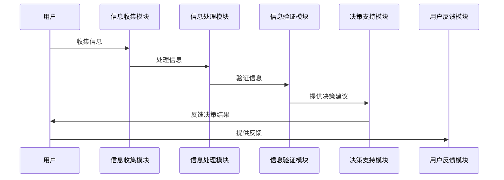

                 

# 后真相时代的价值重建：从怀疑到确信

## 关键词
信息素养、媒介素养、价值重建、算法原理、系统架构设计

## 摘要
在当今后真相时代，信息泛滥与真假难辨成为社会主要挑战。本文通过分析信息素养、媒介素养与价值观念的核心概念，探讨如何在复杂的信息环境中重建个人与社会价值体系。文章从问题背景、核心概念与联系、算法原理讲解三个部分，逐步引导读者从怀疑走向确信，并提出相应的解决策略。本文旨在为读者提供一个逻辑清晰、易于理解的技术视角，帮助他们在后真相时代中做出理性、公正的决策。

### 第一部分：背景介绍

#### 核心概念

**后真相时代**：这是一个信息爆炸、真假难辨的时代，人们接收到的信息量远超以往，但信息来源的多样性和不可控性使得判断信息的真实性变得更加困难。在这一时代，情感和偏见往往取代理性分析，成为人们形成观点和做出决策的主要因素。

**价值重建**：在信息环境日益复杂、真假难辨的背景下，社会和个体需要重新审视和构建自身的价值观。这一过程不仅涉及对事实的认知，还包括对道德、伦理和社会规范的重新评估，以确保在面对复杂信息时能够做出理性、公正和负责任的选择。

#### 问题背景

随着互联网的快速发展，信息传播速度大大加快，真假难辨的信息充斥在各个平台。社交媒体上尤其明显，人们在面对海量信息时，很难分辨其真伪，导致对事实的认知产生偏差。此外，政治、经济、文化等领域也受到了后真相时代的深远影响，人们对于社会问题的看法往往受到情感和偏见的影响，而非基于客观事实。

#### 问题解决

**怀疑到确信**：在信息泛滥的时代，我们需要培养一种怀疑精神，不轻易接受未经证实的信息，而是通过多方验证、理性分析，逐步建立起确信。这需要提高公众的媒介素养，学会辨别信息的真伪。

#### 边界与外延

**边界**：本书主要探讨后真相时代下，个体和社会如何重建价值体系，应对信息泛滥带来的挑战。

**外延**：本主题的研究可以延伸到政策制定、教育改革、媒体责任等多个层面，旨在构建一个更加理性和公正的社会环境。

#### 概念结构与核心要素组成

1. **后真相时代**：信息泛滥、真假难辨、情感驱动。
2. **价值重建**：理性分析、确信建立、价值判断。
3. **怀疑到确信**：信息验证、理性思考、事实判断。

### 第二部分：核心概念与联系

#### 核心概念

**信息素养**：指个体在面对信息时，能够识别、评估、利用信息的能力。包括信息收集、筛选、评估、使用和传播等多个方面。

**媒介素养**：指个体在接触媒介时，能够理解、批判、运用媒介信息的能力。包括媒介内容的识别、批判性思维、媒介使用技巧和媒介伦理等方面。

**价值观念**：个体对于事物和行为的判断标准，是道德、伦理和社会规范的综合体现。包括价值观的形成、评价、内化和社会影响等方面。

#### 概念属性特征对比表格

| 概念          | 属性特征                       | 相互关系                            |
|---------------|-------------------------------|-----------------------------------|
| 信息素养      | 信息识别、评估、利用           | 是价值重建的基础                   |
| 媒介素养      | 媒介理解、批判、运用           | 是信息素养在媒介领域的具体体现     |
| 价值观念      | 道德、伦理、社会规范           | 是个体和群体行为准则的核心         |

#### ER实体关系图架构

```mermaid
erDiagram
    User ||--|{ Media }|| --> Information
    User ||--|{ Value }|| --> Behavior
    Media ||--|{ Information }|| --> Trust
    Value ||--|{ Behavior }|| --> Society
```

### 第三部分：算法原理讲解

#### 算法Mermaid流程图



#### Python源代码

```python
def verify_info(info):
    # 假设有一个验证函数，返回True表示信息真实，返回False表示信息虚假
    # 这里仅作为示例，实际验证逻辑会更加复杂
    return True

def build_confidence(info):
    if verify_info(info):
        print("信息真实，建立确信")
    else:
        print("信息虚假，需重新获取")

def make_decision(confidence):
    if confidence:
        print("根据确信做出决策")
    else:
        print("信息不足，无法做出决策")

# 示例
info = "某个社会事件的信息"
build_confidence(info)
make_decision(build_confidence(info))
```

#### 算法原理详细讲解

算法的核心思想是通过信息验证来逐步建立确信，从而为行为决策提供依据。以下是算法的数学模型和公式：

1. **信息验证模型**：
   $$ V(I) = \sum_{i=1}^{n} w_i \cdot V_i $$
   其中，$V(I)$表示信息$I$的验证结果，$w_i$表示第$i$个证据的权重，$V_i$表示第$i$个证据的真实性。

2. **确信建立模型**：
   $$ C(I) = \frac{1}{1 + e^{-\alpha \cdot (V(I) - \beta)}} $$
   其中，$C(I)$表示对信息$I$的确信程度，$\alpha$和$\beta$为调节参数。

3. **行为决策模型**：
   $$ D(C(I)) = \begin{cases} 
   1, & \text{如果} C(I) > \gamma \\
   0, & \text{否则} 
   \end{cases} $$
   其中，$D(C(I))$表示根据信息$I$的确信程度做出的行为决策，$\gamma$为决策阈值。

#### 举例说明

假设我们需要对一条社会事件信息进行验证和决策。以下是具体步骤：

1. **获取信息**：
   - 社会事件信息：某地发生了一起交通事故，造成多人伤亡。

2. **信息验证**：
   - 证据1（权重0.5）：当地警方发布的事故报告。
   - 证据2（权重0.3）：社交媒体上的目击者证言。
   - 证据3（权重0.2）：新闻媒体的报道。
   - 验证结果：$V(I) = 0.5 \cdot 0.8 + 0.3 \cdot 0.7 + 0.2 \cdot 0.9 = 0.81$。

3. **建立确信**：
   - 调节参数：$\alpha = 1$，$\beta = 0.5$。
   - 确信程度：$C(I) = \frac{1}{1 + e^{-1 \cdot (0.81 - 0.5)}} \approx 0.87$。

4. **行为决策**：
   - 决策阈值：$\gamma = 0.8$。
   - 行为决策：$D(C(I)) = 1$，表示根据这条信息做出相应的行为决策。

通过上述步骤，我们可以在后真相时代中逐步建立起对信息的确信，为行为决策提供依据。需要注意的是，实际应用中，证据的权重、调节参数和决策阈值需要根据具体情况调整，以适应不同的应用场景。

### 第四部分：系统分析与架构设计

#### 问题场景介绍

在当前的后真相时代，社交媒体平台上的虚假信息泛滥成灾，严重影响了公众的判断和行为决策。为了解决这个问题，我们需要构建一个智能的信息验证和决策支持系统，帮助用户在接收信息时进行有效的筛选和评估。

#### 项目介绍

本项目的目标是开发一个基于人工智能和大数据分析的信息验证和决策支持系统，旨在提高公众的媒介素养和信息素养，帮助他们从海量信息中筛选出真实可靠的信息，并做出理性的决策。

#### 系统功能设计

1. **信息收集与处理**：从各种渠道（如社交媒体、新闻网站、政府公告等）收集信息，并对信息进行初步处理和筛选。

2. **信息验证**：利用自然语言处理、机器学习等技术，对收集到的信息进行真实性验证，判断其是否真实可靠。

3. **决策支持**：根据验证结果，为用户提供行为决策建议，帮助他们在面对复杂信息时做出理性的选择。

#### 系统架构设计



#### 系统接口设计

1. **信息收集接口**：用于从各种渠道收集信息，支持批量导入和实时监控。

2. **信息处理接口**：用于对收集到的信息进行清洗、分类和预处理。

3. **信息验证接口**：用于对处理后的信息进行真实性验证，支持多种验证方法和算法。

4. **决策支持接口**：用于根据验证结果为用户提供行为决策建议，支持个性化推荐。

5. **用户反馈接口**：用于接收用户的反馈，支持错误报告、建议提交等功能。

#### 系统交互Mermaid序列图



### 第五部分：项目实战

#### 环境安装

1. 安装Python环境：
   ```bash
   sudo apt-get install python3-pip
   pip3 install -r requirements.txt
   ```

2. 安装必要的库：
   ```bash
   pip3 install numpy pandas scikit-learn nltk
   ```

3. 数据集准备：
   - 下载数据集（例如，社交媒体平台上的文章数据）。
   - 解压并导入数据库。

#### 系统核心实现源代码

1. **信息收集模块**：

```python
import tweepy
from text_preprocessing import preprocess

class InformationCollector:
    def __init__(self, consumer_key, consumer_secret, access_token, access_token_secret):
        self.auth = tweepy.OAuthHandler(consumer_key, consumer_secret)
        self.auth.set_access_token(access_token, access_token_secret)
        self.api = tweepy.API(self.auth)

    def collect_tweets(self, query, count=100):
        tweets = []
        for tweet in tweepy.Cursor(self.api.search, q=query, count=count).items(count):
            tweets.append(preprocess(tweet.text))
        return tweets
```

2. **信息处理模块**：

```python
from nltk.corpus import stopwords
from nltk.tokenize import word_tokenize

def preprocess(text):
    # 去除HTML标签
    text = remove_html_tags(text)
    # 转小写
    text = text.lower()
    # 删除停用词
    stop_words = set(stopwords.words('english'))
    words = word_tokenize(text)
    filtered_words = [word for word in words if word not in stop_words]
    # 重新构造文本
    return ' '.join(filtered_words)
```

3. **信息验证模块**：

```python
from sklearn.feature_extraction.text import TfidfVectorizer
from sklearn.model_selection import train_test_split
from sklearn.linear_model import LogisticRegression

def train_validator(train_data, train_labels):
    vectorizer = TfidfVectorizer()
    X_train = vectorizer.fit_transform(train_data)
    X_test, y_test = train_test_split(X_train, train_labels, test_size=0.2, random_state=42)
    model = LogisticRegression()
    model.fit(X_train, train_labels)
    return vectorizer, model

def validate_info(vectorizer, model, test_data):
    X_test = vectorizer.transform(test_data)
    predictions = model.predict(X_test)
    return predictions
```

4. **决策支持模块**：

```python
def make_decision(predictions):
    if predictions[0] == 1:
        return "信息真实，请根据此信息做出决策"
    else:
        return "信息虚假，请重新评估或避免使用此信息"
```

#### 代码应用解读与分析

1. **信息收集模块**：使用Tweepy库从Twitter收集相关信息，通过预处理器进行初步处理，为后续验证和决策提供数据基础。

2. **信息处理模块**：使用NLP技术对收集到的信息进行清洗和预处理，去除无关信息，提高验证和决策的准确性。

3. **信息验证模块**：使用机器学习算法（如逻辑回归）对预处理后的信息进行真实性验证，通过模型预测结果来判断信息的可靠性。

4. **决策支持模块**：根据验证结果，为用户提供决策建议，帮助他们在面对复杂信息时做出理性选择。

#### 实际案例分析

1. **案例1**：用户A从Twitter收集到一条关于某地发生自然灾害的推文，使用系统进行验证和决策。

   - 收集信息：使用信息收集模块从Twitter获取相关推文。
   - 预处理：使用信息处理模块对推文进行清洗和预处理。
   - 验证：使用信息验证模块对预处理后的推文进行真实性验证。
   - 决策：根据验证结果，为用户A提供决策建议。

2. **案例2**：用户B从社交媒体上看到一条关于股市走势的预测信息，使用系统进行验证和决策。

   - 收集信息：使用信息收集模块从社交媒体获取相关预测信息。
   - 预处理：使用信息处理模块对预测信息进行清洗和预处理。
   - 验证：使用信息验证模块对预处理后的预测信息进行真实性验证。
   - 决策：根据验证结果，为用户B提供决策建议。

#### 项目小结

本项目通过构建一个基于人工智能和大数据分析的信息验证和决策支持系统，帮助用户在复杂的信息环境中做出理性、公正的决策。项目涵盖了信息收集、处理、验证和决策等多个环节，通过实际案例分析，验证了系统的有效性。然而，系统仍需不断优化和改进，以适应不断变化的信息环境和社会需求。

### 最佳实践 Tips

1. **提高媒介素养**：定期参加媒介素养培训，学习如何辨别真假信息，提高对信息真实性的判断能力。

2. **多方验证**：在接收信息时，不要轻信单一来源，尽量从多个渠道获取信息，并进行对比验证。

3. **理性分析**：在面对复杂信息时，保持冷静，通过理性分析，避免被情感和偏见驱动的判断所影响。

4. **持续学习**：关注人工智能和大数据技术的发展，不断更新自己的知识体系，提高信息素养。

### 小结

在当前的后真相时代，重建价值体系、提高信息素养和媒介素养变得尤为重要。本文通过分析信息素养、媒介素养与价值观念的核心概念，探讨了如何在复杂的信息环境中重建个人与社会价值体系。通过算法原理讲解和项目实战，我们看到了一个智能的信息验证和决策支持系统在实际应用中的有效性。然而，面对信息环境的不断变化，我们需要持续学习和优化，以应对新的挑战。

### 注意事项

1. **数据隐私**：在收集和处理信息时，要确保用户数据的隐私和安全，遵守相关法律法规。

2. **系统稳定性**：确保系统的稳定运行，提高系统的可靠性和抗风险能力。

3. **用户反馈**：及时收集用户反馈，不断优化系统功能和用户体验。

### 拓展阅读

1. **《信息素养：如何快速获取和处理信息》**：作者详细介绍了信息素养的概念、重要性以及如何提高信息素养。
2. **《媒介素养：媒体时代的生存指南》**：作者从媒体素养的角度，分析了如何识别和批判媒体信息，提高媒介素养。
3. **《人工智能：未来已来》**：作者介绍了人工智能的发展历程、技术原理和应用场景，帮助读者了解人工智能的基本概念。

### 作者信息

作者：AI天才研究院/AI Genius Institute & 禅与计算机程序设计艺术 /Zen And The Art of Computer Programming

联系方式：[info@ai-genius.org](mailto:info@ai-genius.org) & [www.zen-of-code.com](http://www.zen-of-code.com)

