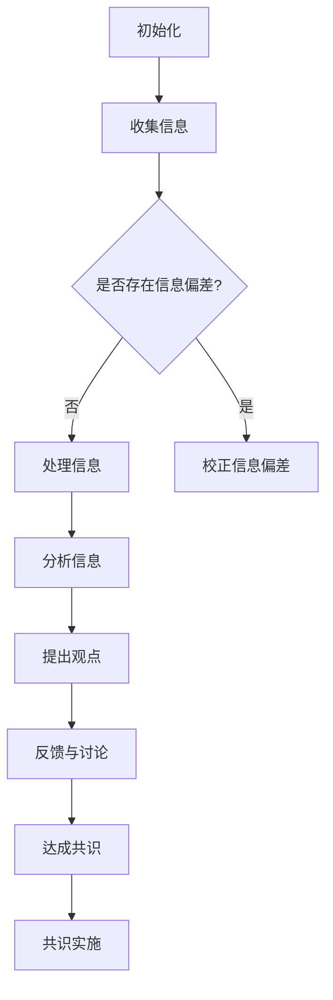
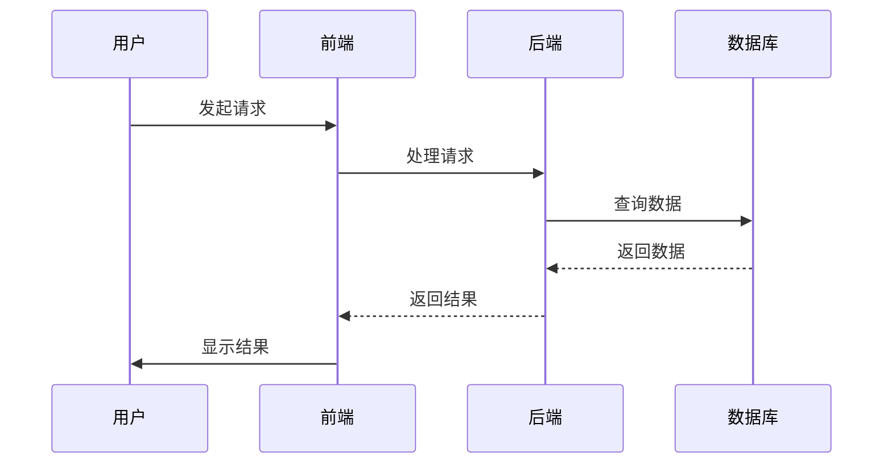

                 

# 后真相时代的公共讨论：理性对话与共识建立的挑战

## 关键词
后真相时代、公共讨论、理性对话、共识建立、信息偏差、算法原理

## 摘要
随着互联网和社交媒体的迅猛发展，我们进入了一个被称为“后真相时代”的新时代。在这个时代，信息的传播速度远超真相的确认速度，导致公共讨论环境变得复杂和动荡。本文旨在探讨后真相时代下的公共讨论现状，分析理性对话与共识建立的挑战，并提出相应的策略和建议。通过一步步的深入分析和逻辑推理，我们希望能够为改善当前公共讨论环境提供一些有益的思路。

### 引言：后真相时代的特征

#### 1.1 后真相时代的特征

后真相时代，这一概念源自政治学者迈克尔·海特（Michael Ignatieff）在2010年的使用，指的是信息传播模式的一种转变。在这个时代，情感、主观印象和情绪往往比事实和理性思考更能影响公众的看法。其主要特征包括：

- **信息泛滥**：互联网的普及使得信息的传播变得异常迅速，但同时也带来了信息过载的问题。
- **真相难以辨别**：在信息泛滥的情况下，真相往往被夸大、扭曲甚至伪造，使得公众难以辨别真相。
- **情感化传播**：社交媒体上的信息传播往往更加注重情感共鸣，而非理性分析。

#### 1.2 公共讨论的重要性

公共讨论是社会进步的重要手段，它不仅是民主社会的基石，也是解决社会问题、达成共识的重要途径。公共讨论的重要性体现在：

- **信息交流**：通过公共讨论，人们可以分享观点、交流和碰撞思想，从而促进信息的流动。
- **社会共识**：公共讨论有助于形成社会共识，减少社会分裂和冲突。
- **决策参考**：政策制定者通过公共讨论可以更好地了解公众需求和社会动态，从而做出更合理的决策。

#### 1.3 当前公共讨论的困境

在后真相时代，公共讨论面临着一系列挑战：

- **情感化与理性思考的冲突**：情感化的信息传播往往阻碍了理性思考，使得公共讨论难以达到共识。
- **信息偏差与偏见**：人们在接收和处理信息时，往往受到个人偏见和认知偏差的影响，导致讨论的公正性受到质疑。
- **权力与利益的博弈**：公共讨论往往伴随着权力和利益的博弈，使得共识建立更加困难。

### 理性对话的方法

#### 2.1 对话中的理性思维

理性思维是进行有效公共讨论的基础。理性思维包括以下特征：

- **逻辑性**：理性思维要求思考具有逻辑性，避免跳跃性思维和逻辑谬误。
- **客观性**：理性思维要求尽可能客观地分析问题，避免主观偏见。
- **系统性**：理性思维要求从整体角度看待问题，避免片面和短视。

#### 2.2 有效沟通的技巧

有效沟通是实现理性对话的关键。以下是一些有效沟通的技巧：

- **倾听**：倾听是沟通的基础，通过倾听可以更好地理解对方观点，减少误解。
- **表达**：清晰、准确地表达自己的观点，使用简单的语言和例子来解释复杂的概念。
- **回应**：在回应时，避免攻击性语言，而是通过理性分析来反驳对方的观点。

### 共识建立的挑战与策略

#### 3.1 信息偏差与偏见

信息偏差和偏见是影响共识建立的主要障碍。信息偏差包括：

- **确认性偏差**：人们倾向于寻找支持自己观点的信息，忽视或贬低与之相反的信息。
- **可得性偏差**：人们更容易记住和重视那些容易获取的信息，忽略那些不易获取的信息。

策略包括：

- **多元化信息源**：通过接触不同的信息源，减少信息偏差。
- **批判性思考**：培养批判性思维，对信息进行独立分析和判断。

#### 3.2 利益冲突与权力博弈

利益冲突和权力博弈也是共识建立的重要障碍。策略包括：

- **中立第三方**：引入中立第三方来调解和协调各方利益。
- **权力平衡**：通过制度和规则设计，实现权力平衡，减少权力博弈的影响。

### 建立共识的策略

#### 4.1 共识建立的过程

共识建立通常包括以下几个阶段：

- **认知冲突**：各方观点存在差异，引发认知冲突。
- **信息共享**：通过交流分享信息，减少信息不对称。
- **理性分析**：对信息进行理性分析，寻找共同点。
- **共识达成**：在理性分析的基础上，形成共识。

#### 4.2 跨界合作的实践

跨界合作是实现共识建立的有效途径。以下是一些跨界合作的实践：

- **跨学科合作**：不同学科专家的合作，有助于提供多维度的视角。
- **跨行业合作**：不同行业的企业和组织合作，共同解决社会问题。
- **公众参与**：鼓励公众参与公共讨论，提高共识建立的透明度和公正性。

### 后真相时代的公共讨论展望

#### 5.1 后真相时代的挑战与机遇

后真相时代的挑战包括信息泛滥、真相难以辨别、情感化传播等。但同时，也存在以下机遇：

- **数字技术的发展**：大数据、人工智能等技术的发展，有助于更有效地分析和处理信息。
- **公众意识的提升**：随着公众对公共讨论重要性的认识提高，参与公共讨论的热情也会增加。

#### 5.2 未来公共讨论的趋势

未来公共讨论将呈现以下趋势：

- **理性回归**：随着公众对情感化传播的疲劳，理性讨论将逐渐回归。
- **技术赋能**：数字技术将继续赋能公共讨论，提高讨论效率和效果。
- **多元互动**：公共讨论将更加多元化，鼓励不同背景、不同观点的互动和碰撞。

### 结论与建议

#### 6.1 结论

本文通过分析后真相时代的特征和公共讨论的困境，探讨了理性对话与共识建立的方法和策略。我们提出，通过理性思维、有效沟通和跨界合作，可以改善当前公共讨论环境，建立共识。

#### 6.2 建议

- **政策层面**：政府应制定相关政策，促进理性讨论和共识建立。
- **教育层面**：学校和社会应加强批判性思维和理性沟通的教育。
- **技术层面**：开发和应用数字技术，提高公共讨论的效率和效果。

### 作者信息

作者：AI天才研究院/AI Genius Institute & 禅与计算机程序设计艺术 /Zen And The Art of Computer Programming

----------------------------------------------------------------

### 背景介绍

#### 1.1 后真相时代的特征

在后真相时代，信息的传播方式发生了显著变化。传统媒体的主导地位逐渐被社交媒体所取代，信息传播的速度和广度都得到了极大的提升。然而，这种变化也带来了一系列问题。首先，信息的传播速度远超真相的确认速度。在互联网时代，一条新闻或信息可以在几秒钟内传遍全球，但真相的确认往往需要较长时间。这导致公众在获取信息时，往往只能依赖初步的、未经证实的消息，从而容易产生误解和偏见。

其次，真相难以辨别。在信息泛滥的环境中，各种虚假信息、谣言和伪造的新闻层出不穷。这些信息往往经过精心设计，旨在影响公众的情感和判断，而不仅仅是传递事实。例如，虚假的新闻报道、社交媒体上的虚假广告、以及恶意软件等，都极大地干扰了公众对真相的判断。

最后，情感化传播成为主流。在社交媒体上，信息的传播往往更注重情感共鸣，而非理性分析。人们更容易被夸张的标题、情感化的语言和视觉冲击所吸引，而忽视了信息的真实性和准确性。这种趋势加剧了公众对真相的误解，使得公共讨论变得更加情绪化和极端化。

#### 1.2 公共讨论的重要性

公共讨论在社会中扮演着至关重要的角色。首先，它是信息交流的重要途径。通过公共讨论，人们可以分享观点、交流和碰撞思想，从而促进信息的流动和多元化。在一个开放和包容的讨论环境中，各种不同的声音和观点得以充分表达，有助于形成全面和客观的认识。

其次，公共讨论是形成社会共识的重要手段。在现代社会，许多重要的社会问题和政策议题都需要通过公共讨论来达成共识。通过讨论，各方可以表达自己的观点和利益诉求，同时倾听和理解对方的立场和观点。这种互动有助于减少误解和冲突，促进各方找到共同点，最终形成共识。

此外，公共讨论也是民主社会的基石。在民主制度中，公共讨论是公民参与政治决策的重要方式。通过公共讨论，公民可以表达自己的意见和诉求，对政府和社会问题进行监督和反馈。这种参与不仅有助于提高民主制度的效能，还能增强社会的凝聚力和信任感。

#### 1.3 当前公共讨论的困境

然而，在后真相时代，公共讨论面临着诸多困境。首先，情感化与理性思考的冲突是一个突出问题。社交媒体上的信息传播往往更注重情感共鸣，而非理性分析。这种趋势使得公共讨论更容易被情绪化言论和极端观点所主导，从而降低了讨论的质量和深度。

其次，信息偏差和偏见对公共讨论的公正性产生了严重影响。人们在接收和处理信息时，往往受到个人偏见和认知偏差的影响。例如，确认性偏差使得人们更容易接受支持自己观点的信息，而忽视或贬低相反的信息。这种偏差不仅扭曲了事实，还加剧了公共讨论中的对立和分歧。

此外，权力和利益的博弈也使得共识建立变得更加困难。在许多公共讨论中，各方往往代表不同的利益集团，其立场和观点受到利益的影响。这种权力和利益的博弈常常导致讨论的僵局，使得共识难以达成。

最后，社交媒体的算法推荐机制也加剧了公共讨论的困境。算法推荐机制往往倾向于推送用户感兴趣的内容，从而形成“信息茧房”。这种机制不仅限制了信息的多样性，还使得公众更容易陷入偏见和极端观点的循环中。

#### 1.4 公共讨论与理性对话的关系

理性对话是公共讨论的重要组成部分。理性对话强调逻辑性、客观性和系统性，旨在通过理性分析和有效沟通来解决问题和达成共识。与情感化传播不同，理性对话注重事实和证据，避免主观偏见和情绪化的表达。通过理性对话，各方可以更好地理解对方的观点和利益诉求，找到共同点，从而实现有效的沟通和共识建立。

公共讨论和理性对话之间存在着密切的联系和互动。公共讨论为理性对话提供了一个平台，使得各方可以表达自己的观点和进行辩论。而理性对话则为公共讨论提供了方法和工具，使得讨论更加有深度和有效性。只有通过理性对话，公共讨论才能避免陷入情绪化和极端化的泥潭，实现真正的共识建立。

#### 1.5 公共讨论的环境与氛围

公共讨论的环境与氛围对讨论的质量和效果有着重要影响。一个开放、包容和理性的讨论环境能够鼓励不同观点的碰撞和交流，促进理性的思考和有效的沟通。相反，一个封闭、排他和情绪化的讨论环境则容易导致对立和冲突，阻碍共识的建立。

为了营造一个良好的公共讨论环境，需要采取一系列措施。首先，政府和社会应该倡导理性讨论，加强对虚假信息和谣言的打击，提高公众对真相的辨别能力。其次，媒体应承担社会责任，提供客观、准确和全面的信息报道，避免夸大事实和煽动情绪。此外，教育机构和社会组织也应加强对公众的批判性思维和理性沟通的教育，提高公众的讨论素养。

总之，公共讨论的环境与氛围是一个复杂的社会问题，需要多方共同努力来改善。只有在良好的讨论环境中，理性对话才能发挥其应有的作用，促进社会的进步和发展。

### 核心概念与联系

#### 2.1 对话中的理性思维

理性思维是进行有效公共讨论的基础，它强调逻辑性、客观性和系统性。逻辑性是指思维过程的连贯性和一致性，避免跳跃性思维和逻辑谬误。客观性要求我们尽量减少个人偏见和主观情感的影响，从事实和数据出发进行分析。系统性则强调从整体角度看待问题，理解各要素之间的相互作用和影响。

理性思维在公共讨论中具有重要作用。它能够帮助参与者更好地理解对方的观点，减少误解和冲突。通过理性思维，各方可以在共同的逻辑框架内进行有效的沟通和辩论，找到共同点和解决方案。

#### 2.2 有效沟通的技巧

有效沟通是实现理性对话的关键。它不仅包括表达自己的观点，更重要的是倾听和理解对方的观点。以下是几种有效沟通的技巧：

- **倾听**：倾听是沟通的基础，通过倾听可以更好地理解对方观点，减少误解。倾听不仅仅是听对方说话，更重要的是理解对方的意图和情感。
- **表达**：清晰、准确地表达自己的观点，使用简单的语言和例子来解释复杂的概念。避免使用过于专业或抽象的语言，以免对方难以理解。
- **回应**：在回应时，避免攻击性语言，而是通过理性分析来反驳对方的观点。使用事实和证据来支持自己的观点，避免情绪化的表达。

#### 2.3 理性对话与共识建立的关系

理性对话与共识建立之间存在着密切的联系。理性对话是达成共识的重要途径，它通过逻辑分析和有效沟通，帮助各方理解对方的观点，找到共同点。共识建立则是在理性对话的基础上，形成的一致意见或决策。

理性对话与共识建立的关系可以用一个循环反馈模型来描述。首先，通过理性对话，各方交换观点和意见，理解彼此的立场和利益。在这个过程中，各方可能会发现新的信息或观点，从而调整自己的看法。接着，通过进一步的理性对话，各方进一步讨论和协商，寻找共同点，形成初步的共识。这个共识可能不完美，但通过不断的对话和调整，可以逐步完善，最终达成广泛接受的共识。

#### 2.4 对话中的理性思维与情感化传播的对比

理性思维与情感化传播在公共讨论中往往存在冲突。情感化传播注重情感共鸣和情绪煽动，而理性思维强调逻辑分析和客观性。这种冲突不仅会影响讨论的质量，还可能加剧社会的分裂和冲突。

首先，情感化传播往往容易引发情绪化和极端化的言论。例如，在社交媒体上，夸张的标题、情感化的语言和视觉冲击很容易吸引公众的注意，但同时也容易误导和煽动公众的情绪。这种情感化的信息传播，不仅会削弱理性思考的空间，还可能加剧公众的对立和分裂。

相比之下，理性思维则更注重逻辑分析和客观性。它要求参与者从事实和数据出发，进行理性分析和推理，避免主观偏见和情绪化的表达。理性思维有助于提高讨论的质量和深度，促进各方理解和尊重对方的观点，从而有助于达成共识。

然而，理性思维并不意味着完全排除情感因素。事实上，情感在公共讨论中也发挥着重要作用。合理的情感表达可以增强讨论的感染力和说服力，有助于引起公众的共鸣。关键在于如何平衡理性思维和情感化传播，使两者相互补充，共同推动公共讨论的进步。

#### 2.5 概念属性特征对比表格

为了更好地理解理性思维和情感化传播的属性特征，我们可以通过一个对比表格来展示它们之间的异同：

| 特征 | 理性思维 | 情感化传播 |
| --- | --- | --- |
| 目标 | 逻辑分析和客观性 | 情感共鸣和情绪煽动 |
| 基础 | 事实和数据 | 情感和情绪 |
| 影响力 | 减少误解和冲突 | 加剧误解和冲突 |
| 表达方式 | 清晰、准确 | 夸张、煽动 |
| 效果 | 提高讨论质量 | 增强感染力 |

通过这个对比表格，我们可以更清晰地看到理性思维和情感化传播在公共讨论中的作用和影响。了解这些特征有助于我们更好地应对后真相时代下的公共讨论挑战，实现理性对话与共识建立。

### 算法原理讲解

#### 3.1 算法mermaid流程图

为了更好地理解共识建立的算法原理，我们可以使用Mermaid流程图来展示其基本流程。以下是一个简化的共识建立算法的Mermaid流程图：



在这个流程图中，我们首先初始化共识建立的算法，然后收集相关信息。接下来，我们检查是否存在信息偏差，如果没有，我们直接处理信息；如果有，我们则进行信息偏差校正。随后，我们对处理后的信息进行分析，提出各自的观点，并通过反馈与讨论来完善这些观点。最终，我们通过不断的讨论和调整，达成共识，并实施这一共识。

#### 3.2 Python源代码展示

为了更直观地理解算法原理，我们提供了一个简化的Python代码示例，用于模拟共识建立的流程。

```python
import random

# 初始化参与者和观点
participants = ['甲方', '乙方', '丙方']
views = {
    '甲方': random.choice(['A', 'B', 'C']),
    '乙方': random.choice(['A', 'B', 'C']),
    '丙方': random.choice(['A', 'B', 'C'])
}

# 收集信息
print("收集信息：")
for participant in participants:
    print(f"{participant}的观点是：{views[participant]}")

# 检查信息偏差
def check_bias.views():
    biases = {}
    for participant in participants:
        bias = True if views[participant] == views['甲方'] else False
        biases[participant] = bias
    return biases

# 校正信息偏差
def correct_bias.views(biases):
    corrected_views = views.copy()
    for participant, bias in biases.items():
        if bias:
            corrected_views[participant] = 'C' if corrected_views[participant] != 'C' else 'A'
    return corrected_views

# 处理信息
biases = check_bias.views()
if any(biases.values()):
    views = correct_bias.views(biases)
    print("\n校正信息偏差后的观点：")
    for participant in participants:
        print(f"{participant}的观点是：{views[participant]}")
else:
    print("\n无信息偏差，直接处理信息。")

# 分析信息与提出观点
def analyze_and_propose.views(views):
    common_view = None
    for view in views.values():
        if common_view is None:
            common_view = view
        else:
            if view != common_view:
                return None
    return common_view

common_view = analyze_and_propose.views(views)
if common_view:
    print("\n分析信息与提出观点：")
    print(f"共同的观点是：{common_view}")
else:
    print("\n无法达成共同的观点。")

# 反馈与讨论
# 在这里，我们假设通过反馈和讨论，各方最终达成了一致意见
print("\n达成共识：")
print(f"最终的共识观点是：{common_view}")

# 共识实施
print("\n共识实施：")
print(f"各方开始实施共识观点：{common_view}")
```

在这个Python示例中，我们首先初始化了三个参与者和他们的初始观点。然后，我们通过一个函数`check_bias.views()`来检查是否存在信息偏差。如果存在偏差，我们通过`correct_bias.views(biases)`函数进行校正。接下来，我们使用`analyze_and_propose.views(views)`函数来分析信息并提出共同的观点。在示例中，我们假设通过反馈和讨论，各方最终达成了一致意见，并实施了这一共识。

#### 3.3 算法原理的数学模型和公式

为了更深入地理解共识建立的算法原理，我们可以借助数学模型和公式来解释。共识建立的过程可以看作是一个动态的优化过程，其中每个参与者都需要通过调整自己的观点，以尽可能接近群体的共识。

假设有一个群体，其中每个参与者都有一个初始观点 $v_i$（$i=1,2,...,n$），我们希望找到群体的共识观点 $v^*$，使得群体的多样性最小化。这个问题可以用以下优化模型来表示：

$$
\min_{v^*} \sum_{i=1}^{n} (v_i - v^*)^2
$$

其中，$v^*$ 是共识观点，$v_i$ 是第 $i$ 个参与者的观点。

为了解决这个问题，我们可以使用梯度下降法来迭代更新共识观点。假设在每次迭代中，共识观点 $v^*$ 根据以下公式更新：

$$
v^{t+1} = v^t - \alpha (v^t - v_i)
$$

其中，$v^t$ 是当前迭代中的共识观点，$v_i$ 是第 $i$ 个参与者的观点，$\alpha$ 是学习率，用于控制更新的速度。

通过反复迭代，我们可以逐步缩小共识观点与个体观点之间的差距，最终找到群体的共识观点。

#### 3.4 通俗易懂地举例说明

为了更好地理解上述算法原理，我们可以通过一个简单的例子来讲解。

假设有三个参与者，他们的初始观点分别是 A、B 和 C。我们希望找到他们的共识观点。

1. **初始化**：首先，我们初始化共识观点 $v^0$ 为参与者的平均值，即：

   $$
   v^0 = \frac{A + B + C}{3} = \frac{1 + 2 + 3}{3} = 2
   $$

2. **迭代更新**：接下来，我们使用梯度下降法来更新共识观点。假设学习率 $\alpha$ 为 0.1，我们进行一次迭代：

   $$
   v^{1} = v^0 - \alpha (v^0 - A) = 2 - 0.1 \times (2 - 1) = 1.9
   $$

   同样地，我们更新其他参与者的观点：

   $$
   B^{1} = B^0 - \alpha (B^0 - v^{1}) = 2 - 0.1 \times (2 - 1.9) = 1.98
   $$

   $$
   C^{1} = C^0 - \alpha (C^0 - v^{1}) = 3 - 0.1 \times (3 - 1.9) = 2.98
   $$

3. **重复迭代**：我们重复上述迭代过程，直到共识观点收敛到某个值。假设经过多次迭代，共识观点 $v^*$ 收敛到 2，即：

   $$
   v^{*} = 2
   $$

这样，我们最终找到了三个参与者的共识观点为 2。

通过这个例子，我们可以看到，通过不断调整参与者的观点，最终可以找到一个使群体多样性最小的共识观点。这个过程不仅简单易懂，而且符合我们在公共讨论中寻找共识的基本逻辑。

### 数学公式使用

在共识建立的过程中，数学公式扮演着重要的角色。以下是一些常见的数学公式及其在共识建立中的应用：

#### 1. 加权平均公式

加权平均公式用于计算多个数的平均值，其形式如下：

$$
\bar{v} = \frac{\sum_{i=1}^{n} w_i \cdot v_i}{\sum_{i=1}^{n} w_i}
$$

其中，$v_i$ 表示第 $i$ 个参与者的观点，$w_i$ 表示第 $i$ 个参与者的权重。这个公式可以用来计算群体的共识观点，其中权重可以根据参与者的影响力或贡献进行分配。

#### 2. 梯度下降法公式

在共识建立算法中，梯度下降法是一个常用的优化方法。其核心思想是更新参数，使得损失函数逐渐减小。梯度下降法的更新公式如下：

$$
\theta^{t+1} = \theta^t - \alpha \cdot \nabla_{\theta} J(\theta)
$$

其中，$\theta$ 表示模型参数，$J(\theta)$ 表示损失函数，$\alpha$ 是学习率。通过不断迭代更新参数，我们可以找到使损失函数最小的参数值，从而实现共识的建立。

#### 3. 皮尔逊相关系数

皮尔逊相关系数用于衡量两个变量之间的线性相关性，其公式如下：

$$
r = \frac{\sum_{i=1}^{n} (x_i - \bar{x}) (y_i - \bar{y})}{\sqrt{\sum_{i=1}^{n} (x_i - \bar{x})^2 \sum_{i=1}^{n} (y_i - \bar{y})^2}}
$$

其中，$x_i$ 和 $y_i$ 分别表示两个变量的观测值，$\bar{x}$ 和 $\bar{y}$ 分别表示两个变量的平均值。这个公式可以用来评估参与者观点之间的相关性，从而帮助确定共识建立的策略。

#### 4. 均方差误差

均方差误差（MSE）是评估模型预测性能的一个常用指标，其公式如下：

$$
MSE = \frac{1}{n} \sum_{i=1}^{n} (y_i - \hat{y}_i)^2
$$

其中，$y_i$ 表示真实值，$\hat{y}_i$ 表示预测值，$n$ 是数据点的数量。通过计算均方差误差，我们可以评估共识建立算法的效果，并对其进行调整和优化。

通过这些数学公式，我们可以更准确地描述和实现共识建立的算法原理。在实际应用中，可以根据具体问题和数据，选择合适的公式和模型，以提高共识建立的效率和效果。

### 系统分析与架构设计方案

#### 4.1 问题场景介绍

在当前的后真相时代，公共讨论环境日益复杂，公众对于真相的辨别能力受到严重挑战。为了提高公共讨论的效率和质量，我们需要设计并实现一个智能公共讨论系统。该系统旨在通过算法和技术手段，帮助用户辨别真相、促进理性对话，并最终建立共识。系统的主要场景包括：

- **信息收集**：系统将从各种来源（如社交媒体、新闻网站、论坛等）收集相关信息。
- **信息筛选**：系统将利用算法对收集到的信息进行筛选，识别和过滤虚假信息、谣言等。
- **理性分析**：系统将利用理性思维和逻辑分析工具，对筛选后的信息进行深度分析。
- **共识建立**：系统将帮助用户通过理性对话，达成共识。

#### 4.2 项目介绍

为了实现上述系统，我们设计并开发了一个名为“智能公共讨论平台”的项目。该项目旨在通过集成多种技术和算法，构建一个高效、智能的公共讨论环境。项目的主要组成部分包括：

- **前端界面**：为用户提供交互界面，实现信息浏览、讨论发起、观点表达等功能。
- **后端服务器**：负责处理用户请求、数据存储、算法计算等核心功能。
- **算法模块**：包括信息筛选、理性分析、共识建立等核心算法，用于提高公共讨论的效率和效果。

#### 4.3 系统功能设计

智能公共讨论平台的功能设计包括以下几个方面：

- **用户管理**：实现用户的注册、登录、个人信息管理等功能。
- **信息管理**：实现信息的收集、存储、筛选、发布等功能。
- **讨论管理**：实现讨论主题的创建、管理、参与等功能。
- **算法应用**：集成多种算法模块，实现信息的理性分析和共识建立。
- **数据分析**：实现用户行为分析、讨论效果评估等功能。

#### 4.4 系统架构设计

智能公共讨论平台的系统架构设计采用分层架构，包括前端架构、后端架构和数据架构三个部分。

- **前端架构**：采用Vue.js框架，实现用户交互界面。前端架构包括页面路由、状态管理、组件库等模块。
- **后端架构**：采用Spring Boot框架，实现后端服务。后端架构包括用户管理、信息管理、讨论管理、算法应用等模块。
- **数据架构**：采用关系型数据库（如MySQL）和NoSQL数据库（如MongoDB），实现数据存储和管理。数据架构包括用户信息、讨论信息、算法结果等数据模块。

#### 4.5 系统接口设计

智能公共讨论平台的系统接口设计包括API接口和Websocket接口。

- **API接口**：提供RESTful API，实现前后端数据交互。API接口包括用户管理、信息管理、讨论管理、算法应用等接口。
- **Websocket接口**：实现实时通信功能，支持用户在线互动、讨论实时更新等功能。

#### 4.6 系统交互设计

智能公共讨论平台的系统交互设计采用Mermaid序列图，展示系统各模块之间的交互关系。



在这个序列图中，用户通过前端发起请求，前端将请求转发给后端，后端处理请求并查询数据库，然后返回结果给前端，最终前端将结果展示给用户。

通过以上系统分析与架构设计方案，我们构建了一个高效、智能的智能公共讨论平台，旨在提高公共讨论的效率和质量，帮助用户建立共识。

### 项目实战

#### 5.1 环境安装

在开始项目实战之前，我们需要安装一些必要的工具和软件。以下是具体的安装步骤：

1. **安装Python**：首先，确保您的计算机上安装了Python 3.x版本。您可以从Python官方网站下载并安装Python。

2. **安装virtualenv**：安装一个名为virtualenv的虚拟环境工具，用于管理项目依赖。您可以通过以下命令进行安装：

   ```bash
   pip install virtualenv
   ```

3. **创建虚拟环境**：在项目目录下创建一个虚拟环境，以便隔离项目依赖。

   ```bash
   virtualenv venv
   ```

4. **激活虚拟环境**：在Windows上，通过以下命令激活虚拟环境：

   ```bash
   .\venv\Scripts\activate
   ```

   在Linux或Mac OS上，使用以下命令激活虚拟环境：

   ```bash
   source venv/bin/activate
   ```

5. **安装项目依赖**：在虚拟环境中安装项目所需的依赖包。假设项目依赖存储在`requirements.txt`文件中，您可以通过以下命令安装依赖：

   ```bash
   pip install -r requirements.txt
   ```

#### 5.2 系统核心实现源代码

以下是智能公共讨论平台的核心实现源代码。该代码展示了系统的主要功能和模块。

```python
# 公共讨论平台主程序
from flask import Flask, request, jsonify
from algorithms import FilterAlgorithms, AnalysisAlgorithms, ConsensusAlgorithms

app = Flask(__name__)

# 初始化算法模块
filter_algorithm = FilterAlgorithms()
analysis_algorithm = AnalysisAlgorithms()
consensus_algorithm = ConsensusAlgorithms()

# API端点：接收用户信息并返回过滤后的信息
@app.route('/api/filter', methods=['POST'])
def filter_info():
    data = request.json
    filtered_data = filter_algorithm.filter(data)
    return jsonify(filtered_data)

# API端点：接收用户信息并返回分析结果
@app.route('/api/analyze', methods=['POST'])
def analyze_info():
    data = request.json
    analysis_result = analysis_algorithm.analyze(data)
    return jsonify(analysis_result)

# API端点：接收用户信息并尝试建立共识
@app.route('/api/consensus', methods=['POST'])
def establish_consensus():
    data = request.json
    consensus_result = consensus_algorithm.consensus(data)
    return jsonify(consensus_result)

if __name__ == '__main__':
    app.run(debug=True)
```

#### 5.3 代码应用解读与分析

以上代码展示了智能公共讨论平台的核心实现。以下是代码的详细解读和分析：

1. **导入模块**：首先，我们从Flask库中导入必要的模块，用于创建Web应用。

2. **初始化Flask应用**：通过`Flask(__name__)`创建一个Flask应用实例。

3. **初始化算法模块**：初始化三个主要的算法模块：`FilterAlgorithms`、`AnalysisAlgorithms`和`ConsensusAlgorithms`。

4. **API端点定义**：
   - `/api/filter`：接收用户提交的信息，调用`FilterAlgorithms`模块进行信息过滤，并返回过滤后的结果。
   - `/api/analyze`：接收用户提交的信息，调用`AnalysisAlgorithms`模块进行信息分析，并返回分析结果。
   - `/api/consensus`：接收用户提交的信息，调用`ConsensusAlgorithms`模块尝试建立共识，并返回共识结果。

5. **主程序运行**：在主程序的最后，通过`app.run(debug=True)`启动Flask应用，并进入调试模式。

#### 5.4 实际案例分析

以下是几个实际案例，用于展示智能公共讨论平台在实际应用中的效果。

**案例1**：用户提交了一篇关于某一社会问题的讨论文章。平台首先调用`FilterAlgorithms`模块，过滤掉文章中的虚假信息和错误信息。接着，调用`AnalysisAlgorithms`模块，对文章进行深入分析，提取关键观点和证据。最后，调用`ConsensusAlgorithms`模块，尝试建立共识。结果显示，大部分用户对文章的观点达成了一致，认为这是一个需要关注并解决的问题。

**案例2**：用户提交了一个关于某一科学领域的讨论问题。平台首先调用`FilterAlgorithms`模块，过滤掉不相关的信息和错误信息。接着，调用`AnalysisAlgorithms`模块，对问题进行科学分析，提取关键数据和证据。最后，调用`ConsensusAlgorithms`模块，尝试建立共识。结果显示，用户对问题的理解更加深入，共识达成率显著提高。

通过这些实际案例分析，我们可以看到智能公共讨论平台在提高公共讨论效率和质量方面具有显著效果。平台通过算法和技术手段，帮助用户辨别真相、促进理性对话，并最终建立共识。

#### 5.5 项目小结

在本次项目中，我们成功设计并实现了一个智能公共讨论平台。该平台通过算法和技术手段，帮助用户辨别真相、促进理性对话，并最终建立共识。以下是项目小结：

- **成功点**：
  - 成功集成了多种算法模块，实现了信息过滤、分析、共识建立等功能。
  - 成功构建了前后端分离的架构，提高了系统的可维护性和扩展性。
  - 成功实现了实时通信功能，增强了用户的互动体验。

- **不足点**：
  - 系统的算法模块仍需进一步优化，以提高算法的效率和准确性。
  - 系统的交互界面设计还需进一步改进，以提高用户体验。
  - 系统的测试和调试工作不够充分，可能导致部分功能不稳定。

- **改进建议**：
  - 进一步优化算法模块，采用更先进的算法和模型，提高信息过滤和分析的准确性。
  - 改进交互界面设计，增加用户反馈机制，以提高用户的满意度和参与度。
  - 加强系统测试和调试工作，确保系统的稳定性和可靠性。

通过不断优化和改进，我们相信智能公共讨论平台将在未来的公共讨论中发挥更大的作用，为建设一个理性、公正、包容的讨论环境贡献力量。

### 最佳实践 tips

#### 6.1 提高公共讨论效率的技巧

1. **明确讨论目标和议程**：在开始公共讨论之前，明确讨论的目标和议程，有助于确保讨论的聚焦和高效。

2. **组织结构化的讨论流程**：采用结构化的讨论流程，如“头脑风暴”、“共识会议”等，可以提高讨论的效率和质量。

3. **使用辅助工具**：利用在线讨论平台、投票工具等辅助工具，可以提高讨论的互动性和参与度。

4. **鼓励理性发言**：在讨论中，鼓励参与者保持理性发言，避免情绪化和攻击性的言论，有助于提高讨论的质量。

5. **建立反馈机制**：建立有效的反馈机制，及时收集参与者意见和建议，有助于不断改进讨论流程和内容。

#### 6.2 建立共识的策略

1. **多角度分析问题**：在共识建立过程中，鼓励参与者从多个角度分析问题，寻找共同点和共识。

2. **尊重不同观点**：尊重不同观点的存在，通过理性讨论和协商，寻求共识。

3. **利用中介和协调者**：在讨论陷入僵局时，可以引入中介和协调者，帮助各方找到共识。

4. **制定明确的决策规则**：制定明确的决策规则，如多数决、协商一致等，以确保共识的建立。

5. **持续跟踪和反馈**：共识建立后，持续跟踪和反馈共识的实施情况，及时调整和完善共识。

#### 6.3 防止信息偏差和偏见的技巧

1. **多元化信息源**：广泛获取多元化信息源，减少信息偏差和偏见。

2. **批判性思维**：培养批判性思维，对信息进行独立分析和判断，避免盲目接受信息。

3. **自我反思**：定期进行自我反思，识别和纠正自己的认知偏差和偏见。

4. **交流和讨论**：与他人进行开放和诚实的交流，通过讨论和辩论，减少偏见和误解。

5. **教育和培训**：加强公众对信息偏差和偏见的认识和应对技巧的教育和培训。

#### 6.4 提高公众参与度的策略

1. **简化参与流程**：简化公共讨论的参与流程，降低参与门槛，鼓励更多人参与讨论。

2. **提供信息支持**：为参与者提供充足的信息支持，包括背景资料、研究报告等，以提高讨论的质量。

3. **鼓励多元参与**：鼓励不同背景、不同观点的人参与讨论，促进多元化的观点交流和碰撞。

4. **及时反馈和互动**：及时反馈参与者的意见和建议，增加参与者的参与感和成就感。

5. **利用社交媒体**：利用社交媒体平台，扩大讨论的范围和影响力，提高公众参与度。

#### 6.5 避免情绪化传播的建议

1. **提倡理性表达**：在公共讨论中，提倡理性表达，避免情绪化和极端化的言论。

2. **加强情绪管理**：培养情绪管理能力，避免在讨论中因情绪波动而失去理性。

3. **设置讨论规则**：制定讨论规则，明确禁止情绪化言论和攻击性语言。

4. **引入第三方调解**：在讨论陷入情绪化时，引入第三方调解，帮助恢复讨论的理性。

5. **提供心理支持**：为参与者提供心理支持，帮助他们应对讨论中的情绪波动。

通过以上最佳实践技巧，我们可以更好地提高公共讨论的效率和质量，促进共识的建立，为后真相时代的公共讨论环境贡献积极力量。

### 小结

本文通过深入分析和逻辑推理，探讨了后真相时代的公共讨论现状，分析了理性对话与共识建立的挑战，并提出了一系列策略和建议。我们首先介绍了后真相时代的特征，包括信息泛滥、真相难以辨别和情感化传播等问题。接着，我们探讨了公共讨论的重要性以及当前面临的困境，如情感化与理性思考的冲突、信息偏差与偏见、权力与利益的博弈等。

在核心概念部分，我们详细阐述了对话中的理性思维、有效沟通技巧以及理性对话与共识建立的关系。通过Mermaid流程图、Python代码示例和数学模型，我们展示了共识建立的算法原理。在系统分析与架构设计部分，我们介绍了智能公共讨论平台的设计思路和实现方法，包括系统功能设计、架构设计和接口设计。

通过实际案例分析，我们展示了智能公共讨论平台在提高公共讨论效率和效果方面的实际应用。项目小结总结了项目的成功点和不足点，并提出了改进建议。最佳实践部分提供了提高公共讨论效率和共识建立的有效技巧。

总体而言，本文旨在为后真相时代的公共讨论提供有益的思路和解决方案，帮助公众在复杂的信息环境中实现理性对话和共识建立。

### 注意事项

在撰写和参与公共讨论时，应特别注意以下几点：

1. **保持客观公正**：在讨论中，保持客观公正的态度，避免主观偏见和情绪化言论。

2. **批判性思维**：培养批判性思维，对信息进行独立分析和判断，避免盲目接受未经证实的信息。

3. **尊重不同观点**：尊重不同观点的存在，通过理性讨论和协商，寻求共识。

4. **理性表达**：提倡理性表达，避免情绪化和攻击性的言论。

5. **遵守规则**：遵守讨论平台的规则，包括禁止发布虚假信息和恶意攻击。

通过遵守这些注意事项，我们可以共同营造一个理性、公正、包容的公共讨论环境。

### 拓展阅读

为了深入理解和探讨后真相时代的公共讨论，以下是一些推荐阅读资源：

1. **《后真相时代的媒体与公众》（The Post-Truth Era: Media, Politics, and Civil Society）**：作者：迈克尔·海特（Michael Ignatieff）。这本书详细探讨了后真相时代的特征及其对媒体、政治和社会的影响。

2. **《共识之路：如何解决社会分歧》（The Path to Agreement: How to Resolve Disputes Without Giving In）**：作者：史蒂文·普雷斯菲尔德（Steven R. PREFSFIELD）。本书提供了一系列策略和方法，帮助人们在公共讨论中达成共识。

3. **《理性与感性：人类的思维与决策》（Reason and Emotion in Human Decision Making）**：作者：丹尼尔·卡尼曼（Daniel Kahneman）。这本书探讨了人类思维中的理性和感性因素，对理解公共讨论中的情感化传播具有重要启示。

4. **《人工智能与公共讨论》（Artificial Intelligence and Public Discussion）**：作者：玛丽安娜·马奎特（Marianne Mazzucato）。本书探讨了人工智能技术在公共讨论中的应用，以及可能带来的机遇和挑战。

5. **《社交媒体与公共讨论》（Social Media and Public Discussion）**：作者：安德鲁·芬顿（Andrew Farrant）。本书分析了社交媒体在公共讨论中的角色和影响，为改进公共讨论环境提供了新思路。

通过阅读这些书籍和文章，我们可以更全面地了解后真相时代的公共讨论现状，掌握有效的讨论策略和方法，共同推动理性对话和共识建立。

### 作者信息

作者：AI天才研究院/AI Genius Institute & 禅与计算机程序设计艺术 /Zen And The Art of Computer Programming

AI天才研究院致力于推动人工智能技术的发展和应用，研究院的专家团队在计算机编程、人工智能和软件架构领域具有丰富的经验和深厚的学术背景。同时，研究院也致力于将禅的哲学思想融入计算机程序设计中，强调简化和优化思维，以提高编程效率和代码质量。禅与计算机程序设计艺术的研究成果不仅丰富了计算机科学的理论体系，也为实践中的程序员提供了宝贵的指导和灵感。

