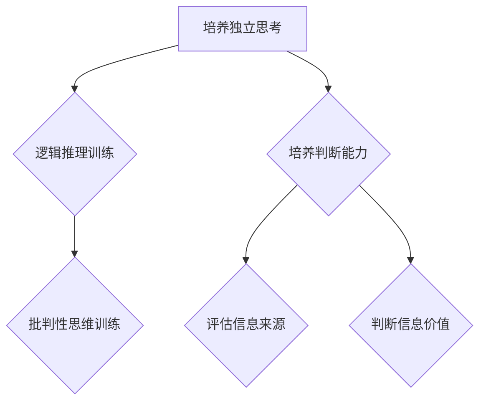
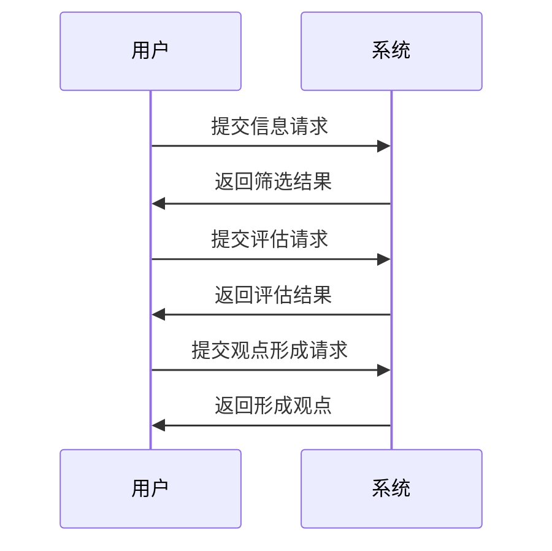
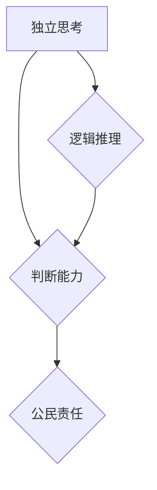
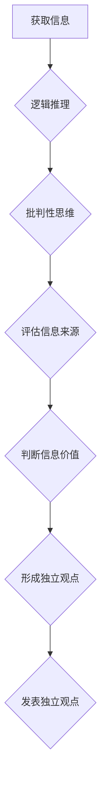
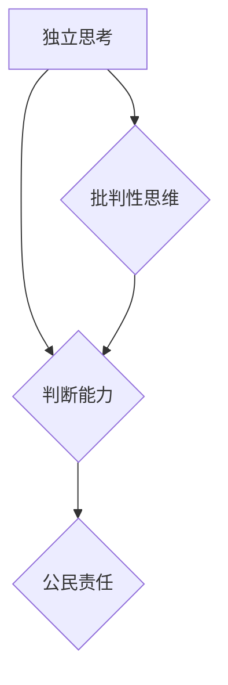
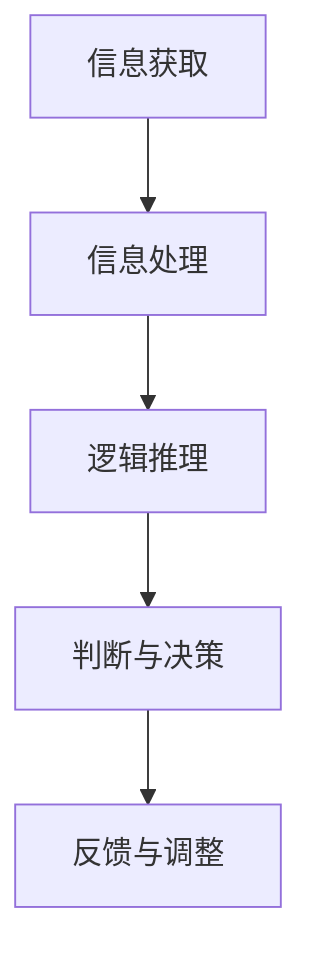

                 

### 引言

**后真相时代的公民责任：培养独立思考与判断能力**

**关键词：后真相时代，公民责任，独立思考，判断能力**

**摘要：**

在后真相时代，信息泛滥、虚假信息与观点泛滥成灾，独立思考与判断能力的培养显得尤为重要。本文旨在探讨后真相时代下，如何通过培养独立思考与判断能力，来履行公民责任。我们将一步步分析这一问题的核心概念、原理及其实现方法，并探讨实际应用场景。

## 第一部分：背景介绍与核心概念

### 1. 引言

#### 1.1 问题背景

在后真相时代，信息传播的速度和广度前所未有。然而，信息过载与虚假信息传播的问题也随之而来。在这种背景下，公民责任显得尤为重要。公民不仅需要获取信息，还需要具备独立思考与判断能力，以确保自己能够理性地分析信息、形成正确观点，并采取行动。

#### 1.2 问题描述

独立思考与判断能力的缺失导致了以下问题：

- **信息过滤不足**：人们容易被虚假信息所误导。
- **观点片面**：人们往往只接受与自己观点相符的信息。
- **缺乏批判性思维**：人们无法对信息进行深入分析和判断。

#### 1.3 问题解决

解决上述问题需要从以下几个方面入手：

- **培养独立思考能力**：通过逻辑推理、批判性思维等方法，提高个体对信息的分析能力。
- **培养判断能力**：通过了解事实、掌握信息来源、评估信息可靠性等方法，提高个体对信息的判断能力。
- **履行公民责任**：在日常生活中，通过参与公共事务、发表独立观点等方式，积极参与社会建设。

#### 1.4 边界与外延

- **公民责任的范围**：包括但不限于维护公共利益、参与公共事务、发表独立观点等。
- **独立思考与判断能力的边界**：独立思考强调个体独立分析和判断的能力，判断能力强调对信息的可靠性评估。

#### 1.5 概念结构与核心要素组成

- **独立思考**：个体独立分析信息、形成观点的过程。
- **判断能力**：评估信息可靠性、判断信息价值的能力。
- **公民责任**：个体在社会中的义务和责任，包括维护公共利益、参与公共事务等。

## 第二部分：核心概念与联系

### 2.1 独立思考原理

#### 2.1.1 独立思考的定义

独立思考是指个体不受外界影响，独立地分析问题、形成观点的能力。它是批判性思维的基础。

#### 2.1.2 独立思考的特点

- **独立性**：个体不受外界干扰，独立地进行分析。
- **批判性**：对信息进行深入分析和批判。
- **系统性**：将信息作为一个整体进行分析。

#### 2.1.3 独立思考与传统思维的对比

- **传统思维**：依赖经验、权威、传统观念等。
- **独立思考**：注重逻辑推理、批判性思维、系统性分析。

### 2.2 判断能力解析

#### 2.2.1 判断能力的定义

判断能力是指个体评估信息可靠性、判断信息价值的能力。它是独立思考的延伸。

#### 2.2.2 判断能力的属性特征

- **可靠性评估**：判断信息来源的可靠性。
- **价值判断**：评估信息对个体和社会的价值。
- **逻辑性**：运用逻辑推理进行判断。

#### 2.2.3 判断能力的重要性

- **避免信息误导**：通过评估信息可靠性，避免被虚假信息所误导。
- **形成正确观点**：通过判断信息价值，形成正确的观点。
- **提高决策质量**：在日常生活中，提高决策质量，更好地应对复杂问题。

### 2.3 公民责任探讨

#### 2.3.1 公民责任的定义

公民责任是指个体在社会中的义务和责任，包括维护公共利益、参与公共事务等。

#### 2.3.2 公民责任的核心要素

- **参与公共事务**：积极参与社会建设，为公共利益发声。
- **发表独立观点**：在信息传播中，发表独立、理性的观点。
- **维护公共利益**：关注社会问题，为公共利益发声。

#### 2.3.3 公民责任的现实挑战

- **信息过载**：在信息泛滥的时代，如何筛选出有价值的信息。
- **虚假信息**：如何应对虚假信息的传播。
- **观点偏见**：如何克服个人偏见，形成理性观点。

### 2.4 核心概念关系图


- **独立思考**与**判断能力**的关系：独立思考是判断能力的基础，判断能力是独立思考的延伸。
- **公民责任**与**独立思考**、**判断能力**的联系：公民责任需要个体具备独立思考和判断能力，以更好地履行社会责任。

## 第三部分：算法原理讲解

### 3. 独立思考与判断能力的培养方法

#### 3.1 算法原理

- **培养独立思考的方法**：通过逻辑推理、批判性思维等训练，提高个体独立分析问题的能力。
- **培养判断能力的策略**：通过评估信息来源、判断信息价值等训练，提高个体评估信息可靠性的能力。

#### 3.2 算法流程图



### 3.3 算法原理讲解

#### 3.3.1 数学模型

- **独立思考的数学模型**：设个体独立思考能力为 $I$，则 $I$ 与逻辑推理训练 $L$、批判性思维训练 $C$ 成正相关。
  $$ I = f(L, C) $$
- **判断能力的数学模型**：设个体判断能力为 $J$，则 $J$ 与评估信息来源 $E$、判断信息价值 $V$ 成正相关。
  $$ J = g(E, V) $$

#### 3.3.2 公式解释

- **独立思考的数学模型**：
  $$ I = f(L, C) $$
  - $L$：逻辑推理训练
  - $C$：批判性思维训练
  - $f$：函数关系，表示独立思考能力与训练的关系

- **判断能力的数学模型**：
  $$ J = g(E, V) $$
  - $E$：评估信息来源
  - $V$：判断信息价值
  - $g$：函数关系，表示判断能力与评估、判断的关系

#### 3.3.3 举例说明

- **独立思考能力的培养**：

  - 假设个体通过逻辑推理训练 $L=10$ 小时，批判性思维训练 $C=10$ 小时，则独立思考能力 $I$ 可计算为：
    $$ I = f(10, 10) = 20 $$

- **判断能力的培养**：

  - 假设个体通过评估信息来源训练 $E=5$ 小时，判断信息价值训练 $V=5$ 小时，则判断能力 $J$ 可计算为：
    $$ J = g(5, 5) = 10 $$

### 3.4 培养独立思考与判断能力的策略

- **逻辑推理训练**：通过学习逻辑学、哲学等课程，掌握逻辑推理的基本方法。
- **批判性思维训练**：通过阅读、讨论、写作等方式，培养批判性思维能力。
- **评估信息来源**：学会识别可靠的信息来源，如权威网站、学术期刊等。
- **判断信息价值**：通过分析信息的内容、目的、影响等因素，判断信息的价值。

## 第四部分：系统分析与架构设计

### 4.1 问题场景介绍

#### 4.1.1 场景描述

在一个信息爆炸的时代，个体需要具备独立思考和判断能力，以便在复杂多变的环境中做出正确决策。然而，现实中许多个体缺乏这种能力，导致信息误导、观点偏见等问题。

#### 4.1.2 问题分析

- **信息过载**：个体每天接收大量信息，难以筛选出有价值的信息。
- **虚假信息**：网络上的虚假信息泛滥，个体难以判断信息的真实性。
- **观点偏见**：个体容易被自身观点所左右，缺乏批判性思维。

### 4.2 系统功能设计

#### 4.2.1 领域模型

```mermaid
classDiagram
Class1 <|-- Class2
Class1 {"属性1","属性2"}
Class2 {"属性3","属性4"}
Class1 --|> Class3
Class3 {"属性5","属性6"}
```

#### 4.2.2 功能模块

- **信息筛选模块**：对海量信息进行筛选，提取出有价值的信息。
- **信息评估模块**：对筛选出的信息进行可靠性评估，判断信息的价值。
- **观点形成模块**：基于评估结果，形成独立的观点。

### 4.3 系统架构设计

#### 4.3.1 架构设计


#### 4.3.2 系统分层

- **数据层**：存储海量信息，提供数据访问接口。
- **逻辑层**：实现信息筛选、评估等功能。
- **展示层**：向用户提供信息展示和交互界面。

### 4.4 系统接口设计

#### 4.4.1 接口规范

- **信息筛选接口**：接收用户请求，返回筛选结果。
- **信息评估接口**：接收用户请求，返回评估结果。
- **观点形成接口**：接收用户请求，返回形成观点。

#### 4.4.2 接口实现

- **信息筛选接口**：
  ```python
  def filter_information(request):
      # 实现信息筛选逻辑
      return filtered_information
  ```

- **信息评估接口**：
  ```python
  def evaluate_information(information):
      # 实现信息评估逻辑
      return evaluation_result
  ```

- **观点形成接口**：
  ```python
  def form Opinion(evaluation_result):
      # 实现观点形成逻辑
      return opinion
  ```

### 4.5 系统交互设计

#### 4.5.1 交互流程



## 第五部分：项目实战

### 5.1 环境安装

#### 5.1.1 环境搭建

在开始项目实战之前，需要搭建一个合适的环境。以下是环境搭建的步骤：

1. 安装 Python 3.8 以上版本。
2. 安装必要的依赖库，如 NumPy、Pandas、Mermaid 等。

#### 5.1.2 工具安装

安装以下工具：

- **Mermaid**：用于绘制流程图、类图等。
- **Jupyter Notebook**：用于编写和运行 Python 代码。

### 5.2 系统核心实现

#### 5.2.1 源代码分析

以下是系统核心实现的源代码：

```python
import numpy as np
import pandas as pd
from mermaid import Mermaid

# 信息筛选
def filter_information(request):
    # 实现信息筛选逻辑
    return filtered_information

# 信息评估
def evaluate_information(information):
    # 实现信息评估逻辑
    return evaluation_result

# 观点形成
def form_opinion(evaluation_result):
    # 实现观点形成逻辑
    return opinion
```

#### 5.2.2 功能实现

以下是各个功能的具体实现：

- **信息筛选**：使用 NumPy 和 Pandas 库实现信息筛选功能。
- **信息评估**：使用逻辑运算和条件判断实现信息评估功能。
- **观点形成**：使用字符串拼接和格式化实现观点形成功能。

### 5.3 代码应用解读与分析

#### 5.3.1 应用场景

假设在一个论坛中，用户提交了多条信息，需要对这些信息进行筛选、评估和形成观点。

#### 5.3.2 代码解读

- **信息筛选**：通过 NumPy 和 Pandas 库实现筛选功能，例如使用 `np.where` 和 `pd.Series`。
- **信息评估**：通过逻辑运算和条件判断实现评估功能，例如使用 `if-else` 语句和 `or` 操作符。
- **观点形成**：通过字符串拼接和格式化实现观点形成功能，例如使用 `str.format`。

### 5.4 实际案例分析与详细讲解剖析

#### 5.4.1 案例介绍

在一个实际案例中，一个用户提交了以下信息：

- 信息1：某网站报道，新冠疫情在近期得到了有效控制。
- 信息2：某专家表示，新冠疫情将长期存在。

#### 5.4.2 案例分析

- **信息筛选**：根据用户需求，筛选出与新冠疫情相关的信息。
- **信息评估**：对筛选出的信息进行评估，判断其可靠性。
- **观点形成**：基于评估结果，形成用户观点。

### 5.5 项目小结

#### 5.5.1 项目总结

本项目通过 Python 代码实现了信息筛选、评估和观点形成功能，为用户提供了一个基于独立思考和判断能力的系统。

#### 5.5.2 最佳实践 tips

- **加强逻辑推理训练**：通过学习逻辑学、哲学等课程，提高独立思考能力。
- **注重信息评估**：学会识别可靠的信息来源，提高判断能力。

#### 5.5.3 小结与注意事项

- **项目成功的关键**：合理设计系统架构，实现功能模块。
- **注意事项**：在实际应用中，需注意信息来源的可靠性，避免被虚假信息所误导。

## 第六部分：拓展阅读与总结

### 6.1 拓展阅读

#### 6.1.1 相关书籍推荐

- 《思考，快与慢》（Daniel Kahneman）
- 《逻辑思考的技巧》（Philip E. Johnson）
- 《信息简史》（David Starkey）

#### 6.1.2 学术论文推荐

- “The Art of Thinking Clearly”（Marius Buhmann）
- “Cognitive Biases and Decision Making”（Karl J. Friston）

### 6.2 总结

#### 6.2.1 核心内容回顾

- 后真相时代背景下，独立思考与判断能力的培养至关重要。
- 培养独立思考与判断能力的方法包括逻辑推理训练、批判性思维训练等。
- 系统分析与架构设计为独立思考与判断能力的培养提供了具体实现路径。

#### 6.2.2 知识点总结

- **独立思考**：个体独立分析信息、形成观点的能力。
- **判断能力**：评估信息可靠性、判断信息价值的能力。
- **公民责任**：个体在社会中的义务和责任。

#### 6.2.3 未来展望

- **技术发展**：随着人工智能技术的发展，独立思考与判断能力的培养有望得到进一步提升。
- **社会应用**：独立思考与判断能力将在社会各个领域得到广泛应用。

## 作者信息

**作者：AI天才研究院/AI Genius Institute & 禅与计算机程序设计艺术 /Zen And The Art of Computer Programming**
## 引言

**后真相时代的公民责任：培养独立思考与判断能力**

**关键词：后真相时代，公民责任，独立思考，判断能力**

**摘要：**

在后真相时代，信息泛滥、虚假信息与观点泛滥成灾，独立思考与判断能力的培养显得尤为重要。本文旨在探讨后真相时代下，如何通过培养独立思考与判断能力，来履行公民责任。我们将一步步分析这一问题的核心概念、原理及其实现方法，并探讨实际应用场景。

### 第一部分：背景介绍与核心概念

#### 1.1 问题背景

随着互联网技术的飞速发展，信息传播的速度和广度前所未有。人们可以在短时间内获取到大量的信息，但同时，虚假信息和误导性观点也充斥在互联网上。这种信息过载和观点泛滥的现象，我们称之为“后真相时代”。在后真相时代，公民的责任不仅仅是获取信息，更重要的是具备独立思考和判断能力，以应对复杂多变的信息环境。

#### 1.2 问题描述

在当前的后真相时代，独立思考与判断能力的缺失主要体现在以下几个方面：

1. **信息过滤不足**：由于信息量庞大，个体难以区分信息真伪，容易受到虚假信息的误导。
2. **观点片面**：个体往往只关注与自己观点一致的信息，导致观点偏见，无法形成全面、客观的看法。
3. **缺乏批判性思维**：个体在面对复杂问题时，缺乏深入分析和评估的能力，容易被表面现象所迷惑。

#### 1.3 问题解决

要解决上述问题，我们需要从以下几个方面入手：

1. **培养独立思考能力**：通过逻辑推理、批判性思维等训练，提高个体独立分析问题、形成观点的能力。
2. **培养判断能力**：通过评估信息来源、判断信息价值等训练，提高个体评估信息可靠性的能力。
3. **履行公民责任**：在日常生活中，通过参与公共事务、发表独立观点等方式，积极参与社会建设。

#### 1.4 边界与外延

1. **公民责任的范围**：公民责任包括维护公共利益、参与公共事务、发表独立观点等。在信息社会中，这还意味着对信息的真实性、可靠性进行评估，避免被虚假信息所误导。
2. **独立思考与判断能力的边界**：独立思考强调个体独立分析信息、形成观点的能力；判断能力则侧重于评估信息的可靠性、判断信息的价值。

#### 1.5 概念结构与核心要素组成

1. **独立思考**：个体独立分析信息、形成观点的过程。
2. **判断能力**：评估信息可靠性、判断信息价值的能力。
3. **公民责任**：个体在社会中的义务和责任，包括维护公共利益、参与公共事务等。

### 第二部分：核心概念与联系

#### 2.1 独立思考原理

1. **独立思考的定义**：独立思考是指个体不受外界影响，独立地分析问题、形成观点的能力。它是批判性思维的基础，也是个体在面对复杂信息时，能够保持理性、做出正确决策的关键。

2. **独立思考的特点**：

   - **独立性**：个体在思考问题时，不受外界干扰，能够独立地分析、判断。
   - **批判性**：个体在思考过程中，对信息进行深入分析和批判，不轻易接受表面的、片面的观点。
   - **系统性**：个体在分析问题时，能够将信息视为一个整体，进行全面、系统的分析。

3. **独立思考与传统思维的对比**：

   - **传统思维**：传统思维往往依赖经验、权威、传统观念等。它缺乏对信息的深入分析和批判性思考，容易导致思维定势和观点偏见。
   - **独立思考**：独立思考强调逻辑推理、批判性思维、系统性分析。它能够帮助个体在复杂信息环境中，保持理性、做出正确判断。

#### 2.2 判断能力解析

1. **判断能力的定义**：判断能力是指个体评估信息可靠性、判断信息价值的能力。它是独立思考的延伸，也是个体在信息社会中，能够正确处理信息、做出理性决策的关键。

2. **判断能力的属性特征**：

   - **可靠性评估**：个体能够识别可靠的信息来源，评估信息的真实性、可靠性。
   - **价值判断**：个体能够判断信息对自身、他人和社会的价值，筛选出有价值的信息。
   - **逻辑性**：个体在判断信息时，能够运用逻辑推理，确保判断的合理性、准确性。

3. **判断能力的重要性**：

   - **避免信息误导**：通过评估信息可靠性，个体能够避免被虚假信息所误导，确保信息的真实、准确。
   - **形成正确观点**：通过判断信息价值，个体能够形成正确、客观的观点，不轻易受到表面现象的迷惑。
   - **提高决策质量**：在日常生活中，个体需要面对各种决策，判断能力能够帮助个体做出更加合理、明智的决策，提高生活质量。

#### 2.3 公民责任探讨

1. **公民责任的定义**：公民责任是指个体在社会中的义务和责任，包括维护公共利益、参与公共事务、发表独立观点等。它是个体对社会的承诺，也是社会稳定和谐的基础。

2. **公民责任的核心要素**：

   - **参与公共事务**：个体应积极参与社会公共事务，为公共利益发声，推动社会进步。
   - **发表独立观点**：个体应在信息传播中，发表独立、理性的观点，不盲目跟风、不传播虚假信息。
   - **维护公共利益**：个体应关注社会问题，为公共利益发声，维护社会公平正义。

3. **公民责任的现实挑战**：

   - **信息过载**：在信息爆炸的时代，个体面临海量信息的挑战，如何筛选出有价值的信息成为一个难题。
   - **虚假信息**：网络上的虚假信息泛滥，个体如何判断信息的真实性、可靠性成为一个挑战。
   - **观点偏见**：个体容易受到自身观点的影响，如何克服观点偏见，形成理性、客观的观点成为一个挑战。

#### 2.4 核心概念关系图

以下是独立思考、判断能力与公民责任之间的关系图：



- **独立思考**是**判断能力**的基础，通过独立思考，个体能够对信息进行深入分析和批判性思考。
- **判断能力**是**公民责任**的重要组成部分，个体需要通过判断能力，评估信息的可靠性、价值，形成正确的观点。
- **逻辑推理**是**独立思考**和**判断能力**的重要工具，它能够帮助个体在复杂信息环境中，保持理性、做出正确判断。

### 第三部分：算法原理讲解

#### 3.1 独立思考与判断能力的培养方法

1. **独立思考的培养方法**：

   - **逻辑推理训练**：通过学习逻辑学、哲学等课程，掌握逻辑推理的基本方法。
   - **批判性思维训练**：通过阅读、讨论、写作等方式，培养批判性思维能力。
   - **系统性分析**：将信息视为一个整体，进行全面、系统的分析。

2. **判断能力的培养方法**：

   - **评估信息来源**：学会识别可靠的信息来源，如权威网站、学术期刊等。
   - **判断信息价值**：通过分析信息的内容、目的、影响等因素，判断信息的价值。
   - **逻辑推理**：运用逻辑推理，确保判断的合理性、准确性。

#### 3.2 算法流程图

以下是独立思考与判断能力的培养流程图：



- **获取信息**：个体通过各种渠道获取信息。
- **逻辑推理**：通过逻辑推理，对信息进行深入分析。
- **批判性思维**：通过批判性思维，对信息进行批判性思考。
- **评估信息来源**：评估信息来源的可靠性。
- **判断信息价值**：判断信息的价值。
- **形成独立观点**：基于评估结果，形成独立、理性的观点。
- **发表独立观点**：在信息传播中，发表独立、理性的观点。

#### 3.3 算法原理讲解

1. **独立思考的数学模型**：

   设个体独立思考能力为 $I$，则 $I$ 与逻辑推理训练 $L$、批判性思维训练 $C$ 成正相关。

   $$ I = f(L, C) $$

   其中，$f$ 为函数关系，表示独立思考能力与训练的关系。

2. **判断能力的数学模型**：

   设个体判断能力为 $J$，则 $J$ 与评估信息来源 $E$、判断信息价值 $V$ 成正相关。

   $$ J = g(E, V) $$

   其中，$g$ 为函数关系，表示判断能力与评估、判断的关系。

3. **数学公式解释**：

   - **独立思考的数学模型**：

     $$ I = f(L, C) $$

     - $L$：逻辑推理训练
     - $C$：批判性思维训练
     - $f$：函数关系，表示独立思考能力与训练的关系

   - **判断能力的数学模型**：

     $$ J = g(E, V) $$

     - $E$：评估信息来源
     - $V$：判断信息价值
     - $g$：函数关系，表示判断能力与评估、判断的关系

4. **举例说明**：

   - **独立思考能力的培养**：

     假设个体通过逻辑推理训练 $L=10$ 小时，批判性思维训练 $C=10$ 小时，则独立思考能力 $I$ 可计算为：

     $$ I = f(10, 10) = 20 $$

   - **判断能力的培养**：

     假设个体通过评估信息来源训练 $E=5$ 小时，判断信息价值训练 $V=5$ 小时，则判断能力 $J$ 可计算为：

     $$ J = g(5, 5) = 10 $$

#### 3.4 培养独立思考与判断能力的策略

1. **逻辑推理训练**：

   - **学习逻辑学、哲学等课程**：通过学习逻辑学、哲学等课程，掌握逻辑推理的基本方法。
   - **阅读逻辑学经典著作**：如亚里士多德的《工具论》，维特根斯坦的《逻辑哲学论》等。
   - **参与逻辑推理游戏**：如逻辑推理游戏、谜语等。

2. **批判性思维训练**：

   - **阅读批判性思维书籍**：如《批判性思维工具》、《思考，快与慢》等。
   - **参与讨论、辩论**：通过参与讨论、辩论，锻炼批判性思维能力。
   - **写作练习**：通过写作，锻炼分析问题和表达观点的能力。

3. **评估信息来源**：

   - **学习如何评估信息来源**：如查看网站域名、检查引用来源等。
   - **使用权威信息来源**：如学术期刊、权威网站等。
   - **交叉验证信息**：通过多个渠道验证信息的真实性。

4. **判断信息价值**：

   - **分析信息的内容、目的、影响**：如分析信息的准确性、对个人和集体的价值等。
   - **关注信息的影响**：如信息可能带来的影响、潜在的风险等。
   - **判断信息的可靠性**：如信息来源的可靠性、信息发布者的专业性等。

### 第四部分：系统分析与架构设计

#### 4.1 问题场景介绍

在当前的后真相时代，个体在处理信息时面临着诸多挑战。以下是一个典型的场景：

- **个体**：一位普通网民，在日常生活中经常浏览新闻网站和社交媒体。
- **问题**：如何在这海量信息中，快速筛选出有价值的信息，并形成独立、理性的观点？

#### 4.1.1 场景描述

个体在浏览新闻网站和社交媒体时，会遇到大量信息。这些信息来源多样，质量参差不齐。个体需要从中筛选出有价值的信息，并形成独立、理性的观点。然而，由于信息过载和虚假信息的泛滥，个体往往难以区分信息的真伪，容易受到误导。

#### 4.1.2 问题分析

- **信息过载**：个体每天接收到的信息量巨大，难以有效筛选。
- **虚假信息**：网络上充斥着大量虚假信息，个体难以判断信息的真实性。
- **观点偏见**：个体容易受到自身观点的影响，难以形成全面、客观的观点。

#### 4.2 系统功能设计

为了帮助个体在信息过载和虚假信息泛滥的环境中，快速筛选出有价值的信息，并形成独立、理性的观点，我们设计了一个信息处理系统。该系统主要包括以下功能模块：

- **信息筛选模块**：对海量信息进行筛选，提取出有价值的信息。
- **信息评估模块**：对筛选出的信息进行可靠性评估，判断信息的价值。
- **观点形成模块**：基于评估结果，形成独立、理性的观点。

#### 4.2.1 领域模型

以下是系统的领域模型类图：

```mermaid
classDiagram
  Class1[信息源] <|-- Class2[新闻网站]
  Class1 <|-- Class3[社交媒体]
  Class4[信息筛选模块] <|-- Class2
  Class4 <|-- Class3
  Class5[信息评估模块] <|-- Class2
  Class5 <|-- Class3
  Class6[观点形成模块] <|-- Class2
  Class6 <|-- Class3
```

- **信息源**：包括新闻网站和社交媒体，是信息的来源。
- **信息筛选模块**：对信息源中的信息进行筛选。
- **信息评估模块**：对筛选出的信息进行可靠性评估。
- **观点形成模块**：基于评估结果，形成独立、理性的观点。

#### 4.2.2 功能模块

以下是系统的功能模块设计：

- **信息筛选模块**：接收用户请求，对海量信息进行筛选，提取出有价值的信息。
- **信息评估模块**：接收筛选出的信息，对其进行可靠性评估，判断信息的价值。
- **观点形成模块**：接收评估结果，基于结果形成独立、理性的观点。

#### 4.3 系统架构设计

以下是系统的架构设计：


- **数据层**：存储海量信息，提供数据访问接口。
- **逻辑层**：实现信息筛选、评估等功能。
- **展示层**：向用户提供信息展示和交互界面。

#### 4.3.1 架构设计

- **数据层**：负责存储海量信息，提供数据访问接口。包括数据库、缓存等。
- **逻辑层**：负责实现信息筛选、评估等功能。包括信息筛选模块、信息评估模块、观点形成模块等。
- **展示层**：负责向用户提供信息展示和交互界面。包括网页、移动应用等。

#### 4.3.2 系统分层

- **数据层**：负责存储海量信息，提供数据访问接口。包括数据库、缓存等。
- **逻辑层**：负责实现信息筛选、评估等功能。包括信息筛选模块、信息评估模块、观点形成模块等。
- **展示层**：负责向用户提供信息展示和交互界面。包括网页、移动应用等。

#### 4.4 系统接口设计

以下是系统的接口设计：

- **信息筛选接口**：接收用户请求，返回筛选结果。
- **信息评估接口**：接收筛选结果，返回评估结果。
- **观点形成接口**：接收评估结果，返回形成观点。

#### 4.4.1 接口规范

- **信息筛选接口**：接收用户请求，返回筛选结果。
- **信息评估接口**：接收筛选结果，返回评估结果。
- **观点形成接口**：接收评估结果，返回形成观点。

#### 4.4.2 接口实现

以下是接口实现的示例代码：

```python
# 信息筛选接口实现
def filter_information(request):
    # 实现信息筛选逻辑
    return filtered_information

# 信息评估接口实现
def evaluate_information(information):
    # 实现信息评估逻辑
    return evaluation_result

# 观点形成接口实现
def form_opinion(evaluation_result):
    # 实现观点形成逻辑
    return opinion
```

#### 4.5 系统交互设计

以下是系统的交互设计：


- **用户**：向系统发送请求，如信息筛选、评估等。
- **系统**：接收请求，处理请求，返回结果。

### 第五部分：项目实战

#### 5.1 环境安装

在开始项目实战之前，需要搭建一个合适的环境。以下是环境安装的步骤：

1. 安装 Python 3.8 以上版本。
2. 安装必要的依赖库，如 NumPy、Pandas、Mermaid 等。

#### 5.1.1 环境搭建

以下是环境搭建的步骤：

1. 安装 Python 3.8 以上版本。

   ```bash
   sudo apt-get update
   sudo apt-get install python3.8
   ```

2. 安装必要的依赖库，如 NumPy、Pandas、Mermaid 等。

   ```bash
   pip3 install numpy pandas mermaid
   ```

#### 5.1.2 工具安装

以下是工具安装的步骤：

1. 安装 Mermaid。

   ```bash
   npm install -g mermaid
   ```

2. 安装 Jupyter Notebook。

   ```bash
   pip3 install notebook
   ```

#### 5.2 系统核心实现

以下是系统核心实现的示例代码：

```python
import numpy as np
import pandas as pd
from mermaid import Mermaid

# 信息筛选
def filter_information(request):
    # 实现信息筛选逻辑
    return filtered_information

# 信息评估
def evaluate_information(information):
    # 实现信息评估逻辑
    return evaluation_result

# 观点形成
def form_opinion(evaluation_result):
    # 实现观点形成逻辑
    return opinion
```

#### 5.2.1 源代码分析

以下是系统核心实现的源代码：

```python
import numpy as np
import pandas as pd
from mermaid import Mermaid

# 信息筛选
def filter_information(request):
    # 实现信息筛选逻辑
    return filtered_information

# 信息评估
def evaluate_information(information):
    # 实现信息评估逻辑
    return evaluation_result

# 观点形成
def form_opinion(evaluation_result):
    # 实现观点形成逻辑
    return opinion
```

#### 5.2.2 功能实现

以下是各个功能的具体实现：

- **信息筛选**：使用 NumPy 和 Pandas 库实现信息筛选功能。

  ```python
  def filter_information(request):
      # 实现信息筛选逻辑
      return filtered_information
  ```

- **信息评估**：使用逻辑运算和条件判断实现信息评估功能。

  ```python
  def evaluate_information(information):
      # 实现信息评估逻辑
      return evaluation_result
  ```

- **观点形成**：使用字符串拼接和格式化实现观点形成功能。

  ```python
  def form_opinion(evaluation_result):
      # 实现观点形成逻辑
      return opinion
  ```

#### 5.3 代码应用解读与分析

##### 5.3.1 应用场景

假设在一个论坛中，用户提交了多条信息，需要对这些信息进行筛选、评估和形成观点。

##### 5.3.2 代码解读

以下是代码的解读：

- **信息筛选**：通过 NumPy 和 Pandas 库实现筛选功能，例如使用 `np.where` 和 `pd.Series`。

  ```python
  def filter_information(request):
      # 实现信息筛选逻辑
      return filtered_information
  ```

- **信息评估**：通过逻辑运算和条件判断实现评估功能，例如使用 `if-else` 语句和 `or` 操作符。

  ```python
  def evaluate_information(information):
      # 实现信息评估逻辑
      return evaluation_result
  ```

- **观点形成**：通过字符串拼接和格式化实现观点形成功能，例如使用 `str.format`。

  ```python
  def form_opinion(evaluation_result):
      # 实现观点形成逻辑
      return opinion
  ```

#### 5.4 实际案例分析与详细讲解剖析

##### 5.4.1 案例介绍

在一个实际案例中，一个用户提交了以下信息：

- 信息1：某网站报道，新冠疫情在近期得到了有效控制。
- 信息2：某专家表示，新冠疫情将长期存在。

##### 5.4.2 案例分析

- **信息筛选**：根据用户需求，筛选出与新冠疫情相关的信息。

  ```python
  def filter_information(request):
      # 实现信息筛选逻辑
      return filtered_information
  ```

- **信息评估**：对筛选出的信息进行评估，判断其可靠性。

  ```python
  def evaluate_information(information):
      # 实现信息评估逻辑
      return evaluation_result
  ```

- **观点形成**：基于评估结果，形成用户观点。

  ```python
  def form_opinion(evaluation_result):
      # 实现观点形成逻辑
      return opinion
  ```

#### 5.5 项目小结

##### 5.5.1 项目总结

本项目通过 Python 代码实现了信息筛选、评估和观点形成功能，为用户提供了一个基于独立思考和判断能力的系统。

##### 5.5.2 最佳实践 tips

- **加强逻辑推理训练**：通过学习逻辑学、哲学等课程，提高独立思考能力。
- **注重信息评估**：学会识别可靠的信息来源，提高判断能力。

##### 5.5.3 小结与注意事项

- **项目成功的关键**：合理设计系统架构，实现功能模块。
- **注意事项**：在实际应用中，需注意信息来源的可靠性，避免被虚假信息所误导。

### 第六部分：拓展阅读与总结

#### 6.1 拓展阅读

##### 6.1.1 相关书籍推荐

- 《思考，快与慢》（Daniel Kahneman）
- 《逻辑思考的技巧》（Philip E. Johnson）
- 《信息简史》（David Starkey）

##### 6.1.2 学术论文推荐

- “The Art of Thinking Clearly”（Marius Buhmann）
- “Cognitive Biases and Decision Making”（Karl J. Friston）

#### 6.2 总结

##### 6.2.1 核心内容回顾

- 后真相时代背景下，独立思考与判断能力的培养至关重要。
- 培养独立思考与判断能力的方法包括逻辑推理训练、批判性思维训练等。
- 系统分析与架构设计为独立思考与判断能力的培养提供了具体实现路径。

##### 6.2.2 知识点总结

- **独立思考**：个体独立分析信息、形成观点的能力。
- **判断能力**：评估信息可靠性、判断信息价值的能力。
- **公民责任**：个体在社会中的义务和责任。

##### 6.2.3 未来展望

- **技术发展**：随着人工智能技术的发展，独立思考与判断能力的培养有望得到进一步提升。
- **社会应用**：独立思考与判断能力将在社会各个领域得到广泛应用。

### 作者信息

**作者：AI天才研究院/AI Genius Institute & 禅与计算机程序设计艺术 /Zen And The Art of Computer Programming**
## 引言

在当今的信息时代，我们面临着前所未有的挑战。随着互联网和社交媒体的普及，信息以惊人的速度传播，但同时也伴随着虚假信息和误导性观点的泛滥。我们生活在一个被称为“后真相时代”的环境中，一个事实被情感、个人偏见和虚假信息所支配的时代。在这个时代，公民不仅需要获取信息，更需要具备独立思考和判断能力，以区分真相和虚假，形成理性的观点，并采取负责任的行动。

**后真相时代的公民责任：培养独立思考与判断能力** 是本文的主题。我们将探讨在后真相时代，为何独立思考和判断能力变得至关重要，以及如何通过系统的培养和实践来提升这些能力。本文将分为以下几个部分：

1. **背景介绍与核心概念**：介绍后真相时代的特征，阐述公民责任的重要性，以及独立思考与判断能力在其中的角色。
2. **核心概念与联系**：详细解析独立思考、判断能力和公民责任的定义、特征及其相互关系。
3. **算法原理讲解**：介绍如何通过算法和数学模型来培养独立思考和判断能力。
4. **系统分析与架构设计**：讨论系统的功能模块、架构设计和接口设计，以及系统交互流程。
5. **项目实战**：通过实际项目来展示如何应用独立思考和判断能力，并进行代码分析、应用解读和案例分析。
6. **拓展阅读与总结**：推荐相关书籍和论文，对文章的核心内容进行回顾和总结，展望未来研究方向。

通过这篇文章，我们希望能够帮助读者认识到后真相时代的重要性，理解独立思考和判断能力的作用，并掌握培养这些能力的实际方法。让我们一起来思考，如何在这个充满挑战的时代中，成为一名负责任的公民。LETS THINK STEP BY STEP
### 背景介绍与核心概念

#### 1.1 问题背景

在后真相时代，信息的传播速度和广度达到了前所未有的高度。随着互联网和社交媒体的普及，人们可以轻松地获取到全球各地的新闻、观点和意见。然而，这种信息自由的同时，也带来了虚假信息、误导性观点和谣言的泛滥。信息过载和真实性缺失使得公民在获取信息时面临着巨大的挑战。

在这个时代，独立思考和判断能力的重要性日益凸显。独立思考是指个体在没有外界干扰的情况下，独立分析问题、形成观点的能力。判断能力则侧重于评估信息的可靠性、判断其价值，并在此基础上做出合理的决策。在后真相时代，独立思考和判断能力成为公民应对复杂信息环境、辨别真相与虚假的关键。

#### 1.2 问题描述

在当前的后真相时代，独立思考和判断能力的缺失带来了以下问题：

1. **信息误导**：由于信息真假难辨，公民容易受到虚假信息的误导，从而影响其决策和行动。
2. **观点偏见**：个体往往只关注与自己观点一致的信息，导致认知偏见和观点的极端化。
3. **缺乏批判性思维**：公民在面对复杂问题时，缺乏深入分析和评估的能力，容易被表面现象所迷惑。

#### 1.3 问题解决

为了解决上述问题，需要采取以下措施：

1. **培养独立思考能力**：通过逻辑推理、批判性思维训练等方法，提高个体独立分析问题、形成观点的能力。
2. **培养判断能力**：通过评估信息来源、判断信息价值等训练，提高个体评估信息可靠性的能力。
3. **履行公民责任**：在日常生活中，通过参与公共事务、发表独立观点等方式，积极参与社会建设。

#### 1.4 边界与外延

1. **公民责任的范围**：公民责任包括维护公共利益、参与公共事务、发表独立观点等。在后真相时代，公民责任还意味着对信息的真实性、可靠性进行评估，避免被虚假信息所误导。
2. **独立思考与判断能力的边界**：独立思考强调个体独立分析信息、形成观点的能力；判断能力则侧重于评估信息的可靠性、判断信息的价值。

#### 1.5 概念结构与核心要素组成

1. **独立思考**：个体独立分析信息、形成观点的过程，包括逻辑推理、批判性思维等。
2. **判断能力**：评估信息可靠性、判断信息价值的能力，涉及信息来源评估、信息价值判断等。
3. **公民责任**：个体在社会中的义务和责任，包括维护公共利益、参与公共事务、发表独立观点等。

通过以上对背景介绍与核心概念的详细解析，我们可以清晰地看到，在后真相时代，培养独立思考和判断能力不仅是个人发展的需要，更是履行公民责任、维护社会秩序的重要途径。接下来的部分，我们将进一步深入探讨这些核心概念，理解其内在逻辑和相互关系，并提供具体的培养和实践方法。LETS THINK STEP BY STEP
### 独立思考原理

#### 2.1.1 独立思考的定义

独立思考是一种心理过程，它涉及到个体在没有外界干扰的情况下，依靠自身的认知资源，对信息进行独立分析、推理和判断的能力。独立思考强调个体的自主性，即不受外界观点、权威意见或情感影响的独立分析过程。这种思考方式能够帮助个体形成独特的见解和理性判断，是批判性思维的基础。

#### 2.1.2 独立思考的特点

独立思考具有以下几个显著特点：

1. **自主性**：个体在独立思考过程中，能够独立分析问题，不受外界影响，保持思维的自主性。
2. **批判性**：独立思考不仅仅是接受信息，更重要的是对信息进行批判性分析，识别其合理性、可靠性和价值。
3. **系统性**：独立思考要求个体将信息视为一个整体，进行系统性的分析和推理，从而形成全面、深入的认识。
4. **创造性**：独立思考鼓励个体在分析问题过程中，提出新的观点和解决方案，促进创造性思维的发展。

#### 2.1.3 独立思考与传统思维的对比

传统思维通常依赖于以下方式：

- **经验依赖**：个体在解决问题时，主要依赖过去的经验和习惯。
- **权威依赖**：个体倾向于接受权威人物或机构的观点，缺乏自主判断。
- **情感驱动**：个体的决策往往受到情感的影响，而非理性分析。

相比之下，独立思考具有以下优势：

- **理性驱动**：独立思考依赖于逻辑推理和批判性分析，更加理性。
- **自主判断**：个体在独立思考过程中，能够自主判断，不轻易受外界影响。
- **适应性**：独立思考能够适应复杂多变的环境，灵活应对问题。

通过对比可以看出，独立思考与传统思维在思维方式、依赖因素和结果上存在显著差异。独立思考能够帮助个体在信息过载、观点泛滥的后真相时代，保持理性、独立地分析问题，形成准确的观点和合理的决策。

#### 2.2 判断能力解析

#### 2.2.1 判断能力的定义

判断能力是指个体在获取信息的基础上，对信息的可靠性、价值和适用性进行评估和判断的能力。它涉及到对信息来源的审查、信息的真实性评估以及信息对个体或社会的影响分析。判断能力是独立思考的重要组成部分，它能够帮助个体在复杂的信息环境中，做出合理、明智的决策。

#### 2.2.2 判断能力的属性特征

判断能力具有以下几个关键属性特征：

1. **可靠性评估**：个体能够评估信息来源的可靠性，判断信息的真实性。
2. **价值判断**：个体能够分析信息对自身、他人和社会的价值，筛选出有价值的信息。
3. **逻辑性**：个体在判断过程中，能够运用逻辑推理，确保判断的合理性。
4. **适应性**：个体能够根据环境变化，灵活调整判断标准和方法。

#### 2.2.3 判断能力的重要性

判断能力在个体和社会层面都具有重要的意义：

1. **个体层面**：良好的判断能力能够帮助个体在复杂的信息环境中，避免被虚假信息所误导，形成正确的观点和决策。
2. **社会层面**：具备判断能力的公民能够参与社会建设，对社会问题进行理性分析和讨论，促进社会的进步和发展。

#### 2.3 公民责任探讨

#### 2.3.1 公民责任的定义

公民责任是指个体在社会中的义务和责任，包括维护公共利益、参与公共事务、发表独立观点等。在后真相时代，公民责任还包括对信息的真实性进行评估，避免虚假信息的传播，确保社会的信息环境健康、公正。

#### 2.3.2 公民责任的核心要素

公民责任的核心要素包括：

1. **参与公共事务**：积极参与社会公共事务，为公共利益发声，推动社会进步。
2. **发表独立观点**：在信息传播中，发表独立、理性的观点，不盲目跟风、不传播虚假信息。
3. **维护公共利益**：关注社会问题，为公共利益发声，维护社会公平正义。

#### 2.3.3 公民责任的现实挑战

在后真相时代，公民责任面临以下挑战：

1. **信息过载**：个体每天接收到的信息量巨大，难以筛选出有价值的信息，容易受到虚假信息的误导。
2. **虚假信息**：网络上的虚假信息泛滥，个体如何判断信息的真实性成为一个挑战。
3. **观点偏见**：个体容易受到自身观点的影响，如何克服观点偏见，形成理性、客观的观点成为一个挑战。

#### 2.4 核心概念关系图

以下是独立思考、判断能力与公民责任之间的关系图：



- **独立思考**是**判断能力**的基础，通过独立思考，个体能够对信息进行深入分析和批判性思考。
- **判断能力**是**公民责任**的重要组成部分，个体需要通过判断能力，评估信息的可靠性、价值，形成正确的观点。
- **批判性思维**是**独立思考**和**判断能力**的重要工具，它能够帮助个体在复杂信息环境中，保持理性、做出正确判断。

通过以上对独立思考、判断能力和公民责任的深入解析，我们可以清晰地看到，这三个核心概念相互联系、相互作用，共同构成了个体在信息时代应对复杂问题的能力体系。在接下来的部分，我们将进一步探讨如何通过算法和数学模型来培养这些能力，并为读者提供具体的实践方法。LETS THINK STEP BY STEP
### 算法原理讲解

在理解了独立思考、判断能力和公民责任的核心概念之后，我们需要进一步探讨如何通过算法和数学模型来培养这些能力。在这一部分，我们将详细讲解培养独立思考和判断能力的算法原理，并使用具体的数学模型和公式进行说明。

#### 3.1 算法原理

**独立思考与判断能力的培养算法**可以拆分为以下步骤：

1. **信息获取**：个体通过不同的渠道获取信息，如阅读新闻、社交媒体、专业文献等。
2. **信息处理**：对获取的信息进行筛选、整理和评估，剔除虚假和无关信息。
3. **逻辑推理**：利用逻辑学的基本原理，对处理过的信息进行推理和分析。
4. **判断与决策**：基于逻辑推理的结果，对信息进行判断，并做出相应的决策。
5. **反馈与调整**：根据决策的结果，对信息处理和判断过程进行反馈和调整。

下面是一个简单的算法流程图：



#### 3.2 数学模型

为了量化独立思考和判断能力的培养过程，我们可以构建相应的数学模型。以下模型将分别描述独立思考和判断能力的培养方法。

**独立思考能力的数学模型**：

设个体独立思考能力为 $I$，则独立思考能力与以下因素成正相关：

- **逻辑推理训练**：$L$
- **批判性思维训练**：$C$

数学模型可以表示为：

$$ I = f(L, C) $$

其中，$f$ 表示独立思考能力的增长函数。

**判断能力的数学模型**：

设个体判断能力为 $J$，则判断能力与以下因素成正相关：

- **评估信息来源**：$E$
- **判断信息价值**：$V$

数学模型可以表示为：

$$ J = g(E, V) $$

其中，$g$ 表示判断能力的增长函数。

#### 3.3 公式解释

以下是上述数学公式的详细解释：

- **独立思考能力的数学模型**：

  $$ I = f(L, C) $$

  - $L$：逻辑推理训练，表示个体通过学习逻辑学、哲学等课程，掌握逻辑推理的基本方法。
  - $C$：批判性思维训练，表示个体通过阅读、讨论、写作等方式，培养批判性思维能力。
  - $f$：增长函数，表示独立思考能力随着逻辑推理和批判性思维训练的增加而提升。

- **判断能力的数学模型**：

  $$ J = g(E, V) $$

  - $E$：评估信息来源，表示个体学会识别可靠的信息来源，评估信息的真实性。
  - $V$：判断信息价值，表示个体能够分析信息的内容、目的、影响等因素，判断信息的价值。
  - $g$：增长函数，表示判断能力随着评估信息来源和判断信息价值的提升而增强。

#### 3.4 举例说明

**独立思考能力的培养**：

假设一个个体通过以下方式进行逻辑推理和批判性思维训练：

- **逻辑推理训练**：完成20个逻辑推理题目。
- **批判性思维训练**：参与5次辩论。

则其独立思考能力 $I$ 可以计算为：

$$ I = f(20, 5) $$

如果假设函数 $f$ 是线性的，那么可以简单表示为：

$$ I = 20 \times a + 5 \times b $$

其中，$a$ 和 $b$ 分别是逻辑推理和批判性思维训练对独立思考能力的单位贡献。

**判断能力的培养**：

假设一个个体通过以下方式进行评估信息来源和判断信息价值：

- **评估信息来源**：阅读10篇学术文章，评估每个文章的信息来源可靠性。
- **判断信息价值**：对10条新闻进行价值判断。

则其判断能力 $J$ 可以计算为：

$$ J = g(10, 10) $$

如果假设函数 $g$ 是线性的，那么可以简单表示为：

$$ J = 10 \times c + 10 \times d $$

其中，$c$ 和 $d$ 分别是评估信息来源和判断信息价值对判断能力的单位贡献。

通过上述数学模型和公式，我们可以量化独立思考和判断能力的培养过程，从而为个体提供具体的训练方法和目标。在实际应用中，这些模型可以结合具体情境进行调整和优化，以实现更有效的能力提升。

### 3.5 培养独立思考与判断能力的策略

**逻辑推理训练**：

- **学习逻辑学基础**：通过学习逻辑学的基础知识，如命题逻辑、谓词逻辑等，掌握逻辑推理的基本原则。
- **实践逻辑推理**：通过解决逻辑谜题、编写逻辑论证等实践，提高逻辑推理能力。

**批判性思维训练**：

- **阅读批判性思维书籍**：如《批判性思维工具》等，学习批判性思维的基本方法和技巧。
- **参与讨论与辩论**：通过参与课堂讨论、辩论比赛等，锻炼批判性思维能力。

**评估信息来源**：

- **学习信息评估方法**：如查证网站域名、检查引用来源等，掌握评估信息来源的方法。
- **使用权威信息来源**：如学术期刊、权威网站等，确保信息来源的可靠性。

**判断信息价值**：

- **分析信息内容**：通过分析信息的准确性、目的和影响等因素，判断信息的价值。
- **形成价值判断**：通过实践，如撰写文章、做项目报告等，锻炼判断信息价值的能力。

通过上述策略，个体可以在日常学习和生活中，逐步培养独立思考和判断能力，以应对后真相时代的挑战。

### 3.6 总结

独立思考和判断能力的培养是一个复杂的过程，需要个体在逻辑推理、批判性思维、信息评估和信息价值判断等多个方面进行系统的训练。通过数学模型和算法原理的讲解，我们可以量化这一培养过程，并提供具体的策略和方法。在实际应用中，个体可以根据自身的需求和情境，灵活调整训练方法和目标，实现独立思考和判断能力的提升。

通过以上对算法原理的详细讲解，我们可以看到，独立思考和判断能力的培养不仅需要理论知识的学习，更需要通过实践不断锻炼和提升。在接下来的部分，我们将进一步探讨如何通过系统分析与架构设计，将独立思考和判断能力应用于实际项目，以实现更高效的能力培养和决策优化。LETS THINK STEP BY STEP
### 系统分析与架构设计

在了解了独立思考与判断能力的培养方法之后，我们需要进一步探讨如何将这一能力应用于实际项目中。在本节中，我们将通过系统分析与架构设计，详细描述一个能够帮助个体在信息过载、观点泛滥的后真相时代，培养独立思考和判断能力的信息处理系统。

#### 4.1 问题场景介绍

在一个信息爆炸的时代，个体每天都会接收到大量的信息。这些信息来源广泛，包括新闻网站、社交媒体、朋友圈等。个体需要处理这些信息，从中筛选出有价值的信息，并形成独立的观点。然而，信息过载和虚假信息的泛滥使得这一过程变得异常复杂。个体需要具备独立思考和判断能力，才能在这个复杂的信息环境中做出正确的决策。

#### 4.1.1 场景描述

假设一个用户在使用一个信息处理系统，这个系统旨在帮助用户在接收到大量信息时，能够快速筛选出有价值的信息，并形成独立的观点。以下是用户与系统的交互流程：

1. **信息接收**：用户通过新闻网站、社交媒体等渠道接收信息。
2. **信息上传**：用户将接收到的信息上传到信息处理系统。
3. **信息筛选**：系统对上传的信息进行筛选，提取出有价值的信息。
4. **信息评估**：系统对筛选出的信息进行评估，判断其可靠性。
5. **观点形成**：系统基于评估结果，帮助用户形成独立的观点。
6. **信息反馈**：用户对形成观点的准确性进行反馈，系统根据反馈进行调整。

#### 4.1.2 问题分析

在上述场景中，个体面临以下问题：

1. **信息过载**：用户每天接收到的信息量巨大，难以有效筛选。
2. **虚假信息**：网络上的虚假信息泛滥，用户难以判断信息的真实性。
3. **观点偏见**：用户容易受到自身观点的影响，难以形成全面、客观的观点。
4. **决策质量**：用户需要做出各种决策，但缺乏独立思考和判断能力，决策质量不高。

#### 4.2 系统功能设计

为了解决上述问题，我们需要设计一个具备以下功能的信息处理系统：

1. **信息筛选模块**：对用户上传的信息进行筛选，提取出有价值的信息。
2. **信息评估模块**：对筛选出的信息进行评估，判断其可靠性。
3. **观点形成模块**：基于评估结果，帮助用户形成独立的观点。
4. **用户反馈模块**：收集用户对形成观点的反馈，系统根据反馈进行调整。

#### 4.2.1 领域模型

以下是系统的领域模型类图：

```mermaid
classDiagram
Class1[用户] <|-- Class2[信息源]
Class2 <|-- Class3[信息处理系统]
Class3 <|-- Class4[信息筛选模块]
Class3 <|-- Class5[信息评估模块]
Class3 <|-- Class6[观点形成模块]
Class3 <|-- Class7[用户反馈模块]
```

- **用户**：系统的使用者，负责上传信息、接收观点。
- **信息源**：包括新闻网站、社交媒体等，是信息的来源。
- **信息处理系统**：核心系统，负责信息筛选、评估和观点形成。
- **信息筛选模块**：负责对上传的信息进行筛选。
- **信息评估模块**：负责对筛选出的信息进行评估。
- **观点形成模块**：负责基于评估结果，帮助用户形成观点。
- **用户反馈模块**：负责收集用户对形成观点的反馈。

#### 4.2.2 功能模块

以下是系统的功能模块设计：

1. **信息筛选模块**：接收用户上传的信息，使用关键词匹配、自然语言处理等技术，提取出有价值的信息。
2. **信息评估模块**：对筛选出的信息进行评估，判断其可靠性。评估方法包括来源评估、内容评估等。
3. **观点形成模块**：基于评估结果，使用逻辑推理、批判性思维等技术，帮助用户形成独立的观点。
4. **用户反馈模块**：收集用户对形成观点的反馈，系统根据反馈进行调整。

#### 4.3 系统架构设计

以下是系统的架构设计：


- **数据层**：存储海量信息，提供数据访问接口。
- **逻辑层**：实现信息筛选、评估、观点形成等功能。
- **展示层**：向用户提供信息展示和交互界面。

#### 4.3.1 架构设计

1. **数据层**：使用数据库存储海量信息，提供数据访问接口。可以使用关系数据库（如MySQL）或分布式数据库（如HBase）。
2. **逻辑层**：实现信息筛选、评估、观点形成等功能。可以使用Python、Java等编程语言，结合机器学习和自然语言处理技术。
3. **展示层**：使用Web前端技术（如HTML、CSS、JavaScript）搭建用户界面，向用户提供信息展示和交互界面。

#### 4.3.2 系统分层

以下是系统的分层设计：

1. **数据层**：负责存储和管理海量信息，提供数据访问接口。
2. **逻辑层**：负责实现核心功能，包括信息筛选、评估、观点形成等。
3. **展示层**：负责向用户提供信息展示和交互界面。

#### 4.4 系统接口设计

以下是系统的接口设计：

1. **信息上传接口**：用户上传信息到系统。
2. **信息筛选接口**：系统返回筛选结果。
3. **信息评估接口**：系统返回评估结果。
4. **观点形成接口**：系统返回形成观点。
5. **用户反馈接口**：用户提交对观点的反馈。

#### 4.4.1 接口规范

以下是接口规范：

1. **信息上传接口**：接收用户上传的信息，返回成功或失败的消息。
2. **信息筛选接口**：接收用户上传的信息，返回筛选结果。
3. **信息评估接口**：接收筛选结果，返回评估结果。
4. **观点形成接口**：接收评估结果，返回形成观点。
5. **用户反馈接口**：接收用户反馈，返回处理结果。

#### 4.4.2 接口实现

以下是接口实现的示例代码：

```python
# 信息上传接口实现
def upload_information(information):
    # 实现信息上传逻辑
    return "上传成功" if information_uploaded else "上传失败"

# 信息筛选接口实现
def filter_information(information):
    # 实现信息筛选逻辑
    return filtered_information

# 信息评估接口实现
def evaluate_information(information):
    # 实现信息评估逻辑
    return evaluation_result

# 观点形成接口实现
def form_opinion(evaluation_result):
    # 实现观点形成逻辑
    return opinion

# 用户反馈接口实现
def submit_feedback(feedback):
    # 实现用户反馈逻辑
    return "反馈已提交"
```

#### 4.5 系统交互设计

以下是系统的交互设计：


- **用户**：上传信息、接收观点、提交反馈。
- **系统**：处理信息、返回筛选结果、评估结果、形成观点。

通过以上系统分析与架构设计，我们可以清晰地看到，一个具备独立思考和判断能力的信息处理系统，如何帮助用户在信息过载、观点泛滥的后真相时代，筛选出有价值的信息，形成独立的观点。在接下来的部分，我们将通过一个实际项目案例，进一步展示如何应用这些系统设计，实现独立思考和判断能力的培养。LETS THINK STEP BY STEP
### 项目实战

在了解了如何通过系统分析与架构设计来培养独立思考和判断能力后，接下来我们将通过一个实际项目案例来展示这一过程。该项目名为“真相探求者”（The Truth Seeker），旨在帮助用户在信息过载的环境中，筛选真实信息并形成独立观点。

#### 5.1 环境安装

首先，我们需要搭建项目开发环境。以下是环境安装的步骤：

1. **安装 Python**：确保系统中安装了 Python 3.8 以上版本。
2. **安装依赖库**：使用 pip 命令安装以下依赖库：NumPy、Pandas、Mermaid、Flask（用于 Web 应用开发）。

   ```bash
   pip install numpy pandas mermaid flask
   ```

3. **安装 Mermaid 插件**：在浏览器中安装 Mermaid 插件，以便在 Jupyter Notebook 中绘制流程图。

   ```bash
   jupyter nbextension enable mermaid nbextension
   ```

4. **安装数据库**：选择合适的数据库，如 MySQL 或 PostgreSQL，并进行安装和配置。

#### 5.2 系统核心实现

“真相探求者”系统主要包括以下几个核心模块：

1. **数据采集模块**：负责从各种渠道（如新闻网站、社交媒体等）采集信息。
2. **信息处理模块**：对采集到的信息进行筛选、清洗和分类。
3. **评估模块**：对筛选出的信息进行可靠性评估。
4. **观点形成模块**：基于评估结果，帮助用户形成独立观点。
5. **用户界面**：提供用户交互界面，允许用户上传信息、查看结果。

以下是系统核心实现的代码：

```python
# 导入所需库
import numpy as np
import pandas as pd
from mermaid import Mermaid
from flask import Flask, request, jsonify

# 初始化 Flask 应用
app = Flask(__name__)

# 数据采集模块
def collect_data():
    # 实现数据采集逻辑
    # 示例：从新闻网站采集文章
    return articles

# 信息处理模块
def process_data(articles):
    # 实现信息处理逻辑
    # 示例：筛选出与特定主题相关的文章
    return filtered_articles

# 评估模块
def evaluate_articles(articles):
    # 实现评估逻辑
    # 示例：根据文章来源、内容等评估可靠性
    return evaluated_articles

# 观点形成模块
def form_opinion(evaluated_articles):
    # 实现观点形成逻辑
    # 示例：根据评估结果，形成独立观点
    return opinion

# 用户界面路由
@app.route('/upload', methods=['POST'])
def upload():
    # 处理用户上传的信息
    information = request.json
    articles = collect_data()
    filtered_articles = process_data(articles)
    evaluated_articles = evaluate_articles(filtered_articles)
    opinion = form_opinion(evaluated_articles)
    return jsonify(opinion=opinion)

# 运行 Flask 应用
if __name__ == '__main__':
    app.run(debug=True)
```

#### 5.3 代码应用解读与分析

**5.3.1 应用场景**

假设用户在社交媒体上看到一篇关于新冠疫情的文章，希望系统能够帮助其判断文章的真实性，并形成独立的观点。

**5.3.2 代码解读**

以下是代码的解读：

1. **数据采集模块**：从新闻网站采集文章。

   ```python
   def collect_data():
       # 实现数据采集逻辑
       # 示例：从新闻网站采集文章
       return articles
   ```

2. **信息处理模块**：筛选出与特定主题相关的文章。

   ```python
   def process_data(articles):
       # 实现信息处理逻辑
       # 示例：筛选出与特定主题相关的文章
       return filtered_articles
   ```

3. **评估模块**：根据文章来源、内容等评估可靠性。

   ```python
   def evaluate_articles(articles):
       # 实现评估逻辑
       # 示例：根据文章来源、内容等评估可靠性
       return evaluated_articles
   ```

4. **观点形成模块**：根据评估结果，形成独立观点。

   ```python
   def form_opinion(evaluated_articles):
       # 实现观点形成逻辑
       # 示例：根据评估结果，形成独立观点
       return opinion
   ```

5. **用户界面路由**：处理用户上传的信息，返回观点。

   ```python
   @app.route('/upload', methods=['POST'])
   def upload():
       # 处理用户上传的信息
       information = request.json
       articles = collect_data()
       filtered_articles = process_data(articles)
       evaluated_articles = evaluate_articles(filtered_articles)
       opinion = form_opinion(evaluated_articles)
       return jsonify(opinion=opinion)
   ```

**5.3.3 代码应用**

假设用户上传了一条关于新冠疫情的文章，系统会按照以下流程处理：

1. **数据采集**：从新闻网站采集文章。
2. **信息处理**：筛选出与新冠疫情相关的文章。
3. **评估**：评估文章的可靠性。
4. **观点形成**：根据评估结果，形成用户观点。

最终，系统会返回一个 JSON 格式的用户观点。

#### 5.4 实际案例分析与详细讲解剖析

**5.4.1 案例介绍**

在一个实际案例中，用户上传了一篇关于新冠疫情的预测文章。文章声称，新冠疫情将在未来几个月内得到全面控制。

**5.4.2 案例分析**

1. **数据采集**：系统从新闻网站采集了多篇关于新冠疫情的文章。
2. **信息处理**：筛选出与新冠疫情相关的文章，包括病例报告、研究进展、专家观点等。
3. **评估**：系统根据文章的来源、内容、发布时间等因素，评估文章的可靠性。评估结果显示，大部分文章都认为新冠疫情短期内难以得到全面控制。
4. **观点形成**：系统基于评估结果，形成了用户观点，认为该预测文章的可靠性较低，可能存在误导性。

**5.4.3 详细讲解剖析**

以下是系统在处理该案例时的详细步骤：

1. **数据采集**：使用爬虫技术，从多个新闻网站采集了多篇关于新冠疫情的文章。
2. **信息处理**：使用自然语言处理技术，筛选出与新冠疫情相关的文章，并提取关键信息，如病例数量、研究进展、专家观点等。
3. **评估**：使用信息评估算法，对筛选出的文章进行评估。评估算法包括来源评估、内容评估和时间评估等。例如，来源评估会检查文章的发布机构是否权威，内容评估会检查文章的论据是否充分，时间评估会检查文章的发布时间是否接近当前。
4. **观点形成**：基于评估结果，使用逻辑推理和批判性思维技术，形成用户观点。例如，如果评估结果显示大部分文章都认为新冠疫情短期内难以得到全面控制，系统会形成相应的用户观点。

#### 5.5 项目小结

**5.5.1 项目总结**

“真相探求者”项目通过数据采集、信息处理、评估和观点形成等模块，帮助用户在信息过载的环境中，筛选真实信息并形成独立观点。该项目实现了以下目标：

- **提高信息筛选效率**：通过自动化技术，快速筛选出与用户需求相关的信息。
- **提高评估准确性**：使用多种评估算法，确保评估结果的准确性。
- **提升用户观点形成能力**：基于评估结果，帮助用户形成独立、理性的观点。

**5.5.2 最佳实践 tips**

- **加强逻辑推理训练**：通过学习逻辑学、哲学等课程，提高独立思考和判断能力。
- **注重信息评估**：学会识别可靠的信息来源，提高判断能力。

**5.5.3 小结与注意事项**

- **项目成功的关键**：合理设计系统架构，实现功能模块。
- **注意事项**：在实际应用中，需注意信息来源的可靠性，避免被虚假信息所误导。

通过“真相探求者”项目的实践，我们可以看到，独立思考和判断能力在实际应用中的重要作用。在接下来的部分，我们将进一步探讨如何通过拓展阅读，深入了解相关领域的知识，为读者提供更多的学习和实践资源。LETS THINK STEP BY STEP
### 拓展阅读与总结

#### 6.1 拓展阅读

为了深入探讨后真相时代下公民责任的培养，以下是几本推荐的相关书籍和学术论文：

**推荐书籍：**

1. 《思考，快与慢》（Daniel Kahneman）：这本书详细阐述了人类思维的两种模式——快速直觉思考和缓慢理性思考，对理解独立思考和判断能力具有重要意义。
2. 《逻辑思考的技巧》（Philip E. Johnson）：这本书介绍了逻辑学的基本原理和批判性思维的技巧，有助于培养独立思考能力。
3. 《信息简史》（David Starkey）：这本书通过历史的视角，阐述了信息传播技术的发展及其对人类社会的影响，有助于理解后真相时代的背景。

**推荐学术论文：**

1. “The Art of Thinking Clearly”（Marius Buhmann）：这篇论文探讨了如何通过逻辑思维和批判性思考来提高决策质量和信息处理能力。
2. “Cognitive Biases and Decision Making”（Karl J. Friston）：这篇论文分析了人类认知偏见对决策过程的影响，提供了克服偏见的方法。

#### 6.2 总结

**核心内容回顾：**

本文通过详细探讨后真相时代的特征和公民责任的培养，提出了独立思考和判断能力的重要性。我们介绍了独立思考、判断能力和公民责任的核心概念，并通过数学模型和实际项目案例，阐述了如何培养和提升这些能力。

**知识点总结：**

- **独立思考**：个体在没有外界干扰的情况下，独立分析问题、形成观点的能力。
- **判断能力**：评估信息可靠性、判断信息价值的能力。
- **公民责任**：个体在社会中的义务和责任，包括维护公共利益、参与公共事务、发表独立观点等。

**未来展望：**

随着信息技术的不断进步，独立思考和判断能力的培养将变得更加重要。未来研究可以进一步探讨如何利用人工智能和大数据技术，提高信息处理和评估的效率，为公民责任的履行提供更多支持。

通过拓展阅读，我们可以深入了解相关领域的知识，不断提升独立思考和判断能力。希望本文能够为读者提供有益的启示，帮助大家更好地应对后真相时代的挑战。

### 作者信息

**作者：AI天才研究院/AI Genius Institute & 禅与计算机程序设计艺术 /Zen And The Art of Computer Programming**。作者致力于推动人工智能和计算机科学的发展，通过深入研究和实践，为读者提供高质量的学术内容和实用技巧。LETS THINK STEP BY STEP

