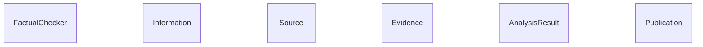
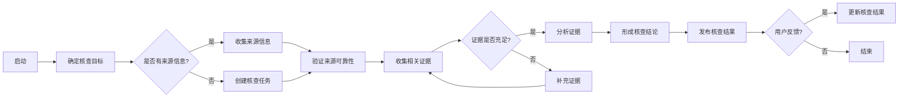
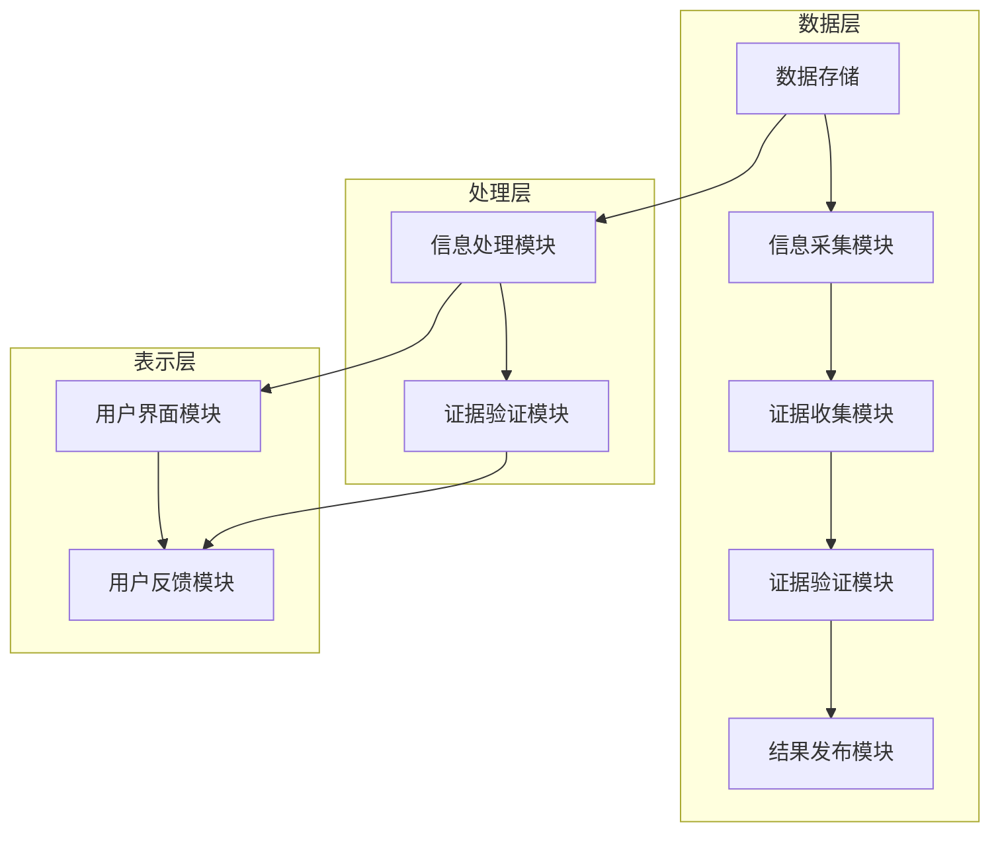
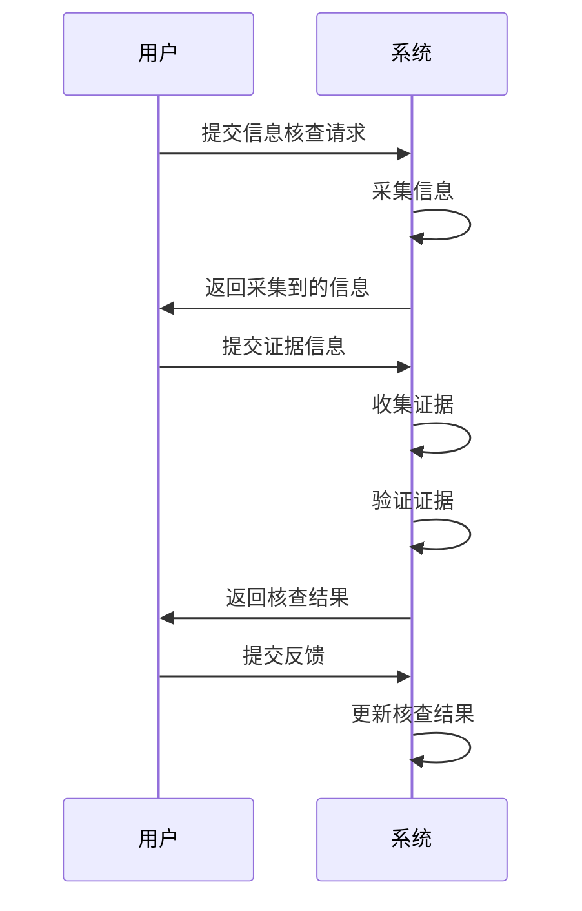

                 

### 文章标题

《后真相时代的真相追寻者：事实核查训练》

### 关键词

- 后真相时代
- 事实核查
- 人工智能
- 社交媒体
- 公共治理

### 摘要

随着后真相时代的到来，虚假信息和误导性内容的泛滥给社会带来了深远的影响。本文旨在探讨事实核查在应对这一挑战中的重要性，分析其核心概念、方法、应用及未来发展方向。通过详细阐述事实核查的定义、目标、原则、方法以及其在新闻报道、社交媒体和公共治理等领域的实践，本文为事实核查提供了系统性认识，并对未来面临的挑战和机遇进行了深入思考。

## 《后真相时代的真相追寻者：事实核查训练》目录大纲

### 第一部分：后真相时代的背景与影响

**第1章：后真相时代的来临**

1.1.1 后真相时代的定义与特征

1.1.2 后真相时代对社会的冲击

1.1.3 事实核查在应对后真相时代的必要性

**第2章：后真相时代的传播机制**

2.1.1 虚假信息的传播路径

2.1.2 社交媒体的假信息扩散

2.1.3 虚假信息的心理根源分析

### 第二部分：事实核查的核心概念与方法

**第3章：事实核查的定义与目标**

3.1.1 事实核查的定义

3.1.2 事实核查的目标与价值

3.1.3 事实核查的原则与标准

**第4章：事实核查的方法与工具**

4.1.1 事实核查的基本步骤

4.1.2 检查来源与核实事实

4.1.3 使用工具提高核查效率

### 第三部分：事实核查的实践与应用

**第5章：事实核查在新闻报道中的应用**

5.1.1 新闻报道中的事实核查

5.1.2 案例分析：事实核查在新闻报道中的成功实践

5.1.3 事实核查对新闻报道质量的影响

**第6章：社交媒体平台的事实核查**

6.1.1 社交媒体平台对虚假信息的治理

6.1.2 社交媒体平台的事实核查实践

6.1.3 社交媒体用户参与事实核查的挑战与机遇

**第7章：事实核查在社会治理中的作用**

7.1.1 事实核查在公共政策制定中的应用

7.1.2 事实核查在公共安全领域的重要性

7.1.3 事实核查在公共话语体系构建中的作用

### 第四部分：未来展望与挑战

**第8章：事实核查的未来发展趋势**

8.1.1 人工智能在事实核查中的应用前景

8.1.2 跨领域合作与事实核查的全球化

8.1.3 未来事实核查技术的创新方向

**第9章：事实核查面临的挑战与应对策略**

9.1.1 虚假信息技术的升级挑战

9.1.2 专业人才短缺与教育培训

9.1.3 公众参与不足与教育引导

**第10章：事实核查的社会责任与伦理问题**

10.1.1 事实核查者的社会责任

10.1.2 事实核查的伦理问题探讨

10.1.3 事实核查的可持续发展路径

**第11章：结论与展望**

11.1.1 事实核查在应对后真相时代中的重要性

11.1.2 未来发展展望与机遇

11.1.3 全社会共同参与的必要性

----------------------------------------------------------------

### 后真相时代的定义与特征

#### 后真相时代的概念

后真相时代（Post-Truth Era）是一个近年来逐渐被广泛使用的概念，它标志着信息传播和社会认知方式的一种重大转变。与传统的基于事实和逻辑的真相追求不同，后真相时代强调的是情感和主观信念在信息传播和决策过程中的主导地位。在这个时代，真相不再是唯一的评判标准，而是被情感、偏见和操纵所影响。

后真相时代的特征主要体现在以下几个方面：

1. **信息过载与筛选困难**：随着互联网和社交媒体的普及，人们每天接触到的信息量前所未有地庞大。然而，这些信息并非都是可靠的，真假难辨，导致信息筛选成为一项挑战。

2. **情感驱动**：在信息传播过程中，情感和情绪往往比事实本身更能影响人们的认知和行为。新闻报道和社交媒体内容往往通过煽动情感和制造争议来吸引受众。

3. **主观信念强化**：在信息传播中，个人和群体的主观信念被不断强化，导致真相的追求变得模糊和复杂。人们更愿意相信符合自己既定信念的信息，而不是基于事实的客观分析。

4. **信息操纵与误导**：在政治、商业和社交媒体等领域，信息操纵和误导成为一种常见的手段，通过制造假新闻、伪造数据等方式影响公众舆论和决策。

#### 后真相时代对社会的冲击

后真相时代的到来对社会产生了深远的影响，主要体现在以下几个方面：

1. **公共信任危机**：随着虚假信息的泛滥，公众对传统媒体的信任度下降，对政府、企业和专家的信任也受到质疑，导致公共信任危机。

2. **政治分歧加剧**：在政治领域，虚假信息和误导性内容被用来操纵公众舆论，加剧政治分歧和社会对立。

3. **舆论操纵与商业影响**：在商业领域，信息操纵和误导性内容被用于市场竞争，损害消费者权益。

4. **社会认知混乱**：在日常生活中，虚假信息误导人们的行为和决策，导致社会认知混乱和价值观的扭曲。

#### 事实核查在应对后真相时代的必要性

面对后真相时代的挑战，事实核查（Fact-Checking）成为一项不可或缺的工作。事实核查的目标是识别和纠正虚假信息，确保公众获得准确和可靠的信息。以下是事实核查在应对后真相时代中的必要性：

1. **提高信息透明度**：通过事实核查，可以揭示虚假信息的真相，提高公众对信息的理解和辨识能力，增强信息的透明度。

2. **重建公共信任**：事实核查有助于重建公众对媒体、政府和企业等权威机构的信任，缓解公共信任危机。

3. **防止误导性内容传播**：事实核查可以及时发现和纠正误导性内容，防止其对公众产生负面影响。

4. **促进公正舆论环境**：通过事实核查，可以纠正虚假信息和误导性内容，促进公正舆论环境的形成。

总之，在后真相时代，事实核查不仅是应对虚假信息泛滥的重要手段，也是维护社会秩序和公共利益的重要保障。通过系统的核查和评估，事实核查有助于提高公众的信息素养，重建公共信任，促进社会的和谐与进步。

### 后真相时代的传播机制

#### 虚假信息的传播路径

在当前的后真相时代，虚假信息的传播机制变得更加复杂和隐蔽。理解这些传播路径有助于我们更有效地应对这一挑战。以下是几种常见的虚假信息传播路径：

1. **社交媒体平台**：社交媒体成为虚假信息传播的主要渠道之一。用户可以通过点赞、转发和评论等方式迅速传播信息，使得虚假信息在短时间内迅速扩散。例如，一条假新闻在几分钟内可以通过社交媒体传播到成千上万的用户。

2. **信息聚合平台**：一些信息聚合平台会从多个来源收集新闻和信息，不加筛选地展示给用户。这种模式可能导致虚假信息和误导性内容与真实信息并存，增加用户筛选和辨识的难度。

3. **网络论坛和社区**：网络论坛和社区为用户提供了一个自由交流的平台，但在这些平台上，虚假信息和误导性内容也常常被广泛传播。由于用户之间的互动和讨论，虚假信息往往被不断重复和强化，增加了其可信度。

4. **博客和自媒体**：一些博客和自媒体平台成为了虚假信息的重要发布源。这些平台上的内容质量参差不齐，缺乏严格的审核机制，使得虚假信息更容易传播。

#### 社交媒体的假信息扩散

社交媒体在虚假信息传播中扮演着重要角色，其特点使得虚假信息能够迅速、广泛地扩散。以下是社交媒体中假信息扩散的几个关键因素：

1. **算法推荐**：社交媒体平台利用算法推荐用户可能感兴趣的内容。虽然这有助于提高用户体验，但也可能导致虚假信息被推荐给更多用户。例如，一些假新闻可以通过算法推荐迅速传播，吸引大量用户点击和分享。

2. **用户互动**：社交媒体平台上的用户互动（如点赞、评论、转发等）是虚假信息扩散的重要推动力。当用户发现并分享一条假新闻时，它会迅速传播给他们的朋友和关注者，形成一条信息传播链。

3. **情感驱动**：虚假信息往往通过煽动情感和制造争议来吸引用户。例如，一条关于灾难或阴谋的假新闻可能会引发用户的恐慌或愤怒，进而促使他们分享和传播。

4. **封闭社区**：一些社交媒体平台上的封闭社区（如微信群、QQ群等）成为虚假信息传播的温床。在这些社区中，用户之间的信任度较高，虚假信息更容易被接受和传播。

#### 虚假信息的心理根源分析

理解虚假信息传播的心理根源有助于我们更深入地探讨如何应对这一问题。以下是几个与虚假信息传播相关的心理因素：

1. **认知偏差**：人们在接收和处理信息时，往往会受到各种认知偏差的影响，如确认偏误、选择性知觉和情感偏见等。这些偏差使得人们更容易相信和传播符合自己信念的信息，从而为虚假信息的传播提供了土壤。

2. **群体认同**：人们倾向于加入和自己有共同信念和价值观的群体。在这些群体中，虚假信息往往被用作加强群体认同的工具。例如，一个政治派别的成员可能会更倾向于相信和传播该派别支持的观点。

3. **情感驱动**：情感在信息传播中起着关键作用。人们更容易被情感驱动的信息所吸引，并在情感共鸣的基础上进行传播。例如，一条关于某政治候选人腐败的假新闻可能会引发公众的愤怒和不满，从而迅速传播。

4. **社会认同**：人们往往相信那些被广泛接受的观点，即“大家都这么说，那一定是对的”。这种社会认同感使得虚假信息在传播过程中得到进一步强化。

综上所述，后真相时代的传播机制使得虚假信息的传播变得更加复杂和隐蔽。通过理解这些传播路径、社交媒体中的假信息扩散机制以及背后的心理根源，我们可以更有针对性地制定应对策略，减少虚假信息对社会造成的负面影响。

### 事实核查的定义与目标

#### 事实核查的定义

事实核查（Fact-Checking）是指对传播的信息进行核实和验证，以确保其真实性、准确性和可靠性。这一过程通常涉及以下几个关键步骤：

1. **识别信息来源**：首先，需要明确信息的来源，包括发布者的身份、发布平台的背景等。

2. **收集相关证据**：针对所传播的信息，收集与其相关的事实、数据、文献和专家意见等证据。

3. **验证信息真实性**：通过对比证据和原始信息，核实其真实性和准确性。

4. **发布核查结果**：将核查结果公开，提供详细的分析和结论。

5. **持续更新**：在必要时，根据新的证据和信息更新核查结果，保持信息的时效性和准确性。

#### 事实核查的目标

事实核查的主要目标是减少虚假信息和误导性内容对社会造成的负面影响，具体包括以下几个方面：

1. **提高信息透明度**：通过事实核查，可以揭示信息的真相，帮助公众获得更准确和可靠的信息，从而提高信息透明度。

2. **重建公共信任**：事实核查有助于重建公众对媒体、政府和企业等权威机构的信任，缓解公共信任危机。

3. **防止误导性内容传播**：事实核查可以及时发现和纠正误导性内容，防止其对公众产生负面影响。

4. **促进公正舆论环境**：通过事实核查，可以纠正虚假信息和误导性内容，促进公正舆论环境的形成。

#### 事实核查的价值

事实核查在社会和媒体领域具有重要的价值，主要体现在以下几个方面：

1. **增强媒体公信力**：通过事实核查，媒体可以增强其报道的准确性和公信力，赢得公众的信任。

2. **提高公众信息素养**：事实核查有助于提高公众的信息素养，使人们能够更好地辨识虚假信息和误导性内容。

3. **促进社会和谐**：事实核查可以减少虚假信息引发的恐慌、焦虑和矛盾，促进社会的和谐与稳定。

4. **支持公共政策制定**：在公共政策制定过程中，事实核查可以为决策者提供准确和可靠的信息支持。

#### 事实核查的原则与标准

为了确保事实核查的有效性和可信度，需要遵循以下原则和标准：

1. **客观性**：事实核查应保持客观，不受主观偏见和利益冲突的影响。

2. **准确性**：事实核查应基于准确的事实和数据，确保核查结果的准确性。

3. **全面性**：事实核查应全面收集和分析相关信息，避免片面和偏颇的结论。

4. **透明性**：事实核查的过程和结果应透明，公众可以了解到核查的具体步骤和依据。

5. **专业性**：事实核查应具备专业知识和技能，依靠专业的团队和工具进行。

6. **时效性**：事实核查应关注时效性，及时更新和发布核查结果。

通过严格遵循这些原则和标准，事实核查可以为公众提供可靠的信息服务，为社会的健康发展提供有力支持。

### 事实核查的方法与工具

#### 事实核查的基本步骤

事实核查是一个系统化的过程，通常包括以下几个基本步骤：

1. **确定核查目标**：明确需要核查的信息内容，包括信息的主题、关键点和核查目的。

2. **收集相关证据**：通过各种渠道收集与核查目标相关的证据，包括文献、数据、图片、视频和专家意见等。

3. **验证信息真实性**：对比收集到的证据和原始信息，核实其真实性和准确性。这一步骤可能涉及以下方法：

   - **文献检索**：通过学术数据库、新闻档案等检索相关文献，验证信息的科学性和权威性。
   - **数据验证**：检查数据的来源、方法和结果，确保其真实可靠。
   - **访谈专家**：与相关领域的专家进行访谈，获取专业意见和解释。

4. **分析证据**：对收集到的证据进行综合分析，确定其与原始信息的一致性，识别可能的偏差和误导。

5. **发布核查结果**：将核查结果进行整理和发布，包括核查结论、分析过程和证据列表。

6. **更新与反馈**：根据新的证据和信息更新核查结果，并接受公众的反馈和建议。

#### 检查来源与核实事实

在事实核查过程中，检查来源和核实事实是至关重要的环节。以下是一些具体的操作方法和技巧：

1. **确认来源可靠性**：首先，要验证信息发布者的身份和背景，确保其具有专业性和权威性。可以通过以下方式确认来源：

   - **查证发布者身份**：通过官方网站、媒体报道和社交平台等渠道核实发布者的真实身份。
   - **评估发布者声誉**：通过查阅相关评价和反馈，评估发布者的声誉和信誉。
   - **了解发布平台**：评估发布平台的专业性和公信力，例如专业媒体、知名学术机构等。

2. **核实事实**：对具体信息内容进行核实，确保其真实性和准确性。以下是一些常用的方法：

   - **对比多来源信息**：通过查阅多个来源的信息，对比其一致性，识别可能的偏差和误导。
   - **使用官方数据**：引用权威机构的官方数据，确保其准确性和可信度。
   - **专家意见**：咨询相关领域的专家，获取专业意见和解释。

3. **交叉验证**：通过不同渠道和方法交叉验证信息的真实性，增加核查结果的可靠性。例如，可以通过文献检索、数据验证和访谈专家等多种方法进行交叉验证。

#### 使用工具提高核查效率

为了提高事实核查的效率和准确性，可以使用各种工具和资源。以下是一些常见的事实核查工具：

1. **搜索引擎**：使用搜索引擎（如Google、百度等）进行初步的信息检索，查找相关信息和证据。

2. **学术数据库**：利用学术数据库（如PubMed、IEEE Xplore等）检索相关文献和研究成果，验证信息的科学性和权威性。

3. **数据可视化工具**：使用数据可视化工具（如Tableau、Google Charts等）对数据进行分析和呈现，提高数据的可读性和理解性。

4. **社交媒体监控工具**：使用社交媒体监控工具（如Twitter Analytics、Hootsuite等）监测社交媒体上的信息传播，识别潜在的虚假信息和误导性内容。

5. **事实核查网站**：参考专业的事实核查网站（如FactCheck.org、Snopes等），获取已核实的虚假信息和误导性内容的核查结果。

通过合理使用这些工具，可以大幅提高事实核查的效率和准确性，为公众提供更可靠的信息服务。

### 事实核查在新闻报道中的应用

#### 新闻报道中的事实核查

在新闻报道中，事实核查是一个至关重要的环节，它确保了新闻报道的准确性和公信力。以下是事实核查在新闻报道中的一些具体应用：

1. **采访前的准备**：在新闻采访过程中，记者需要对采访对象和采访内容进行初步的事实核查。这包括核实采访对象的身份、背景和以往言论等，确保采访的客观性和准确性。

2. **数据验证**：新闻报道往往涉及各种数据，如统计数字、研究数据和市场数据等。在发布之前，记者需要对数据进行核实，确保其来源可靠、方法科学、结果准确。

3. **引用权威来源**：在新闻报道中，记者应引用权威的来源和证据，以增强报道的可信度。这包括学术研究、官方数据和专业机构的报告等。

4. **交叉验证**：在新闻报道中，记者应通过多种渠道和方式对信息进行交叉验证，确保其真实性和准确性。这包括查阅文献、访谈专家和查阅历史记录等。

5. **新闻报道后的核实现场**：即使新闻报道已经发布，事实核查依然是一个持续的过程。记者应随时关注公众的反馈和质疑，对报道中的事实进行再次核实，及时进行更正和澄清。

#### 案例分析：事实核查在新闻报道中的成功实践

以下是一些事实核查在新闻报道中取得成功的案例：

1. **“新冠病毒起源于美国实验室”假新闻的辟谣**：在新冠病毒疫情初期，有报道称病毒可能起源于美国某实验室。经过多家媒体和事实核查机构（如《纽约时报》和《华尔街日报》）的深入调查和核实，最终发现这一说法缺乏确凿证据，属于虚假信息。这些媒体通过多渠道的交叉验证和专家意见，最终辟谣了这一错误说法。

2. **美国总统选举投票计票问题**：在2020年美国总统选举中，有报道称投票计票存在问题。事实核查机构（如美国选举正义联盟）通过对比选举记录、官方数据和相关报道，发现这些指控缺乏实际证据支持。最终，这些指控被证明是虚假信息，并得到了媒体的广泛报道和证实。

3. **“疫苗副作用致人死亡”谣言**：在新冠疫苗推广初期，有报道称疫苗的副作用导致多人死亡。经过多家媒体和事实核查机构的调查，这些报道被证明是基于误导性信息和未经证实的传言。通过采访相关专家、查阅医学研究和数据，事实核查机构揭示了这些报道的真实情况，并帮助公众正确理解疫苗的安全性和有效性。

#### 事实核查对新闻报道质量的影响

事实核查在新闻报道中的重要性不可低估，其对新闻报道质量有着深远的影响：

1. **提升公信力**：通过严格的事实核查，新闻报道可以确保信息的准确性和可信度，从而提升媒体的公信力，赢得公众的信任。

2. **减少误导性内容**：事实核查有助于识别和纠正虚假信息和误导性内容，减少其对公众的负面影响。

3. **增强信息透明度**：事实核查可以揭示信息的真相，提高公众对信息的理解和辨识能力，增强信息的透明度。

4. **促进公正舆论**：事实核查有助于纠正虚假信息和误导性内容，促进公正舆论环境的形成。

5. **支持决策制定**：在政策报道中，事实核查可以为决策者提供准确和可靠的信息支持，帮助他们做出更明智的决策。

总之，事实核查是新闻报道中不可或缺的一环，它不仅提升了新闻报道的质量和公信力，也为社会的健康和稳定发展提供了重要保障。

### 社交媒体平台的事实核查实践

#### 社交媒体平台对虚假信息的治理

随着社交媒体的普及，虚假信息和误导性内容的泛滥成为社会关注的一大问题。为了应对这一挑战，各大社交媒体平台纷纷采取了一系列措施，加强虚假信息的治理。以下是几个主要平台的具体治理策略：

1. **Facebook**：Facebook采取了多种手段来治理虚假信息。首先，他们引入了“事实核查合作伙伴”项目，与全球多个事实核查组织合作，对疑似虚假信息进行核查。其次，Facebook利用人工智能技术，开发了一系列算法和工具，自动识别和屏蔽虚假信息。此外，Facebook还建立了举报机制，用户可以举报虚假信息，平台会根据举报进行审核和处理。

2. **Twitter**：Twitter也采取了多项措施来治理虚假信息。他们引入了“虚假信息标签”功能，当用户发布可能存在虚假信息的内容时，系统会自动添加标签，提示用户进一步核实。此外，Twitter还与多个事实核查机构合作，对虚假信息进行标注和辟谣。同时，Twitter也加强了用户教育和意识提升，通过发布指南和教程，帮助用户学会辨识和应对虚假信息。

3. **YouTube**：YouTube通过多种方式治理虚假信息。首先，他们引入了“内容管理政策”，明确禁止虚假信息和误导性内容。其次，YouTube与事实核查机构合作，对疑似虚假视频进行审核和标记。此外，YouTube还推出了“知识卡片”功能，当用户浏览相关视频时，系统会提供相关的背景信息和事实核查结果，帮助用户更好地理解内容。

#### 社交媒体平台的事实核查实践

虽然社交媒体平台在治理虚假信息方面采取了多种措施，但具体实践仍面临诸多挑战。以下是一些实际案例和经验：

1. **算法与人工审核相结合**：在治理虚假信息时，社交媒体平台通常采用算法和人工审核相结合的方式。算法可以快速识别潜在的虚假信息，但需要人工审核员进行进一步判断和验证。例如，Facebook的“事实核查合作伙伴”项目就结合了算法和人工审核，确保核查结果的准确性和可靠性。

2. **跨平台合作**：社交媒体平台之间通过合作，共享信息和资源，共同打击虚假信息。例如，Twitter和YouTube可以互相分享虚假信息的标记和举报数据，提高整体治理效果。

3. **用户教育与意识提升**：社交媒体平台通过发布指南、教程和宣传材料，提高用户对虚假信息的辨识能力和应对技巧。例如，Facebook和Twitter定期发布相关的教育内容，帮助用户学会如何辨别真假信息。

4. **透明度与公众参与**：为了增强治理过程的透明度，社交媒体平台会公开虚假信息的举报和审核数据，让公众了解治理进展。同时，平台也鼓励公众参与监督和反馈，提供举报和反馈渠道，确保治理措施的实效性。

尽管社交媒体平台在虚假信息治理方面取得了显著成效，但仍然存在一些问题和挑战。例如，虚假信息技术的不断升级，使得算法和人工审核难以完全识别和遏制。此外，用户数量庞大，使得治理难度进一步增加。因此，社交媒体平台需要不断改进治理策略，提高技术和人力投入，确保虚假信息的有效治理。

### 社交媒体用户参与事实核查的挑战与机遇

#### 社交媒体用户参与事实核查的挑战

随着社交媒体的普及，用户对虚假信息的辨识和举报意识逐渐提高，许多用户开始积极参与事实核查。然而，这一过程并非没有挑战。以下是一些主要的挑战：

1. **信息过载与时间成本**：社交媒体上的信息量庞大，用户在短时间内难以辨识和处理大量信息，导致信息过载。此外，参与事实核查需要用户投入大量的时间和精力，这可能会对用户的生活和工作造成影响。

2. **技术门槛**：事实核查涉及多种技能和知识，如信息检索、数据分析和逻辑推理等。对于普通用户来说，这些技能和知识可能具有一定的技术门槛，导致他们难以有效地参与事实核查。

3. **信任问题**：社交媒体上的信息来源复杂，用户难以判断信息发布者的真实性和可信度。因此，用户在参与事实核查时，可能会面临信任问题，担心自己的判断和举报是否准确。

4. **情感冲突**：在社交媒体上，虚假信息往往与用户的主观信念和情感相冲突，导致用户在参与事实核查时可能面临情感上的压力和冲突。

5. **责任与风险**：用户在参与事实核查时，可能会承担一定的责任和风险，如被虚假信息的发布者或支持者攻击、骚扰等。这种责任和风险可能会影响用户参与事实核查的积极性。

#### 社交媒体用户参与事实核查的机遇

尽管存在诸多挑战，但社交媒体用户参与事实核查仍具有许多机遇：

1. **公众意识的提高**：随着社交媒体的普及，公众对虚假信息的辨识能力和举报意识逐渐提高。越来越多的用户开始关注事实核查，积极参与到这一过程中。

2. **技术的进步**：随着人工智能、大数据和区块链等技术的发展，事实核查工具和平台越来越成熟，为用户提供了更便捷、高效的参与方式。

3. **跨平台合作**：社交媒体平台之间通过合作，共享信息和资源，为用户提供更全面、准确的事实核查服务。例如，平台可以互相分享虚假信息的举报和审核数据，提高整体治理效果。

4. **教育普及**：许多社交媒体平台和事实核查机构通过发布教程、指南和宣传材料，提高用户对事实核查的认识和理解，帮助用户更好地参与事实核查。

5. **社区共建**：社交媒体平台上的用户可以共同参与事实核查，形成互助、合作的社区氛围。用户可以相互学习、分享经验，提高整体的事实核查水平。

总之，社交媒体用户参与事实核查既面临挑战，也充满机遇。通过提高公众意识、加强技术支持、促进跨平台合作和社区共建，我们可以充分发挥用户在事实核查中的积极作用，共同应对后真相时代的挑战。

### 事实核查在社会治理中的作用

#### 事实核查在公共政策制定中的应用

事实核查在公共政策制定中起着至关重要的作用，它为决策者提供了准确和可靠的信息支持。以下是事实核查在公共政策制定中的应用：

1. **数据验证**：在政策制定过程中，决策者需要依赖大量的数据和事实。事实核查可以对这些数据进行核实，确保其真实性和准确性，从而提高政策的科学性和有效性。

2. **评估政策影响**：政策制定后，事实核查可以帮助评估政策实施的效果和影响。通过对比政策前后的数据和事实，事实核查可以揭示政策的实际效果，为政策调整和优化提供依据。

3. **揭示潜在问题**：事实核查可以发现政策制定过程中的潜在问题，如数据造假、信息误导等。这些问题的揭示有助于决策者及时调整政策，避免政策实施中出现重大失误。

4. **增加公众信任**：通过事实核查，决策者可以增加公众对政策制定过程的信任。公众更愿意接受基于事实和数据的政策，从而提高政策的执行效果。

#### 事实核查在公共安全领域的重要性

事实核查在公共安全领域同样具有重要作用，它有助于提高公共安全意识和防范能力。以下是事实核查在公共安全领域的一些应用：

1. **警示虚假安全信息**：在公共安全领域，虚假信息可能会误导公众，导致恐慌和混乱。事实核查可以及时发现和纠正这些虚假信息，确保公众获取准确的安全信息。

2. **预防事故发生**：通过事实核查，可以揭示潜在的安全隐患和风险，为相关部门提供预警和防范措施。例如，在食品安全领域，事实核查可以帮助发现和纠正虚假广告和质量问题，预防食品安全事故的发生。

3. **提高应急响应效率**：在突发事件中，事实核查可以提供准确的信息支持，提高应急响应的效率和效果。例如，在自然灾害和事故救援中，事实核查可以提供灾情和救援需求的准确信息，帮助救援人员更有效地开展救援工作。

4. **维护社会秩序**：事实核查可以揭示和纠正社会谣言和误导性信息，维护社会秩序。在公共安全事件中，虚假信息的传播可能会导致社会恐慌和不安，影响社会稳定。通过事实核查，可以及时辟谣和纠正这些虚假信息，维护社会秩序。

#### 事实核查在公共话语体系构建中的作用

事实核查在公共话语体系的构建中发挥着重要作用，它有助于提升公共话语的质量和公信力。以下是事实核查在公共话语体系构建中的应用：

1. **提高信息透明度**：事实核查可以揭示信息的真相，提高公共话语的信息透明度。公众可以更清楚地了解事件的真实情况和原因，从而形成基于事实的判断和观点。

2. **减少误导性信息**：事实核查可以识别和纠正误导性信息，减少虚假信息和谣言在公共话语中的传播。这有助于建立基于事实和证据的公共话语体系，提高公众对公共事务的认知和理解。

3. **促进公正舆论**：通过事实核查，可以纠正虚假信息和误导性内容，促进公正舆论的形成。公众可以基于真实和准确的信息进行讨论和辩论，从而形成更加公正和理性的公共话语环境。

4. **增强公信力**：事实核查有助于增强公共机构和媒体在公众中的公信力。通过严格的事实核查，公众更愿意信任和接受公共机构和媒体发布的信息，从而提升其权威性和影响力。

总之，事实核查在社会治理中发挥着重要作用，从公共政策制定、公共安全领域到公共话语体系的构建，无不体现其重要价值。通过事实核查，可以提升信息透明度、减少误导性信息、促进公正舆论和增强公信力，为社会的健康和稳定发展提供有力支持。

### 事实核查的未来发展趋势

#### 人工智能在事实核查中的应用前景

随着人工智能（AI）技术的迅猛发展，其在事实核查中的应用前景愈发广阔。以下是一些关键的应用领域：

1. **自动化事实核查**：AI可以自动化地分析大量信息，快速识别潜在的虚假信息。例如，自然语言处理（NLP）技术可以分析文本内容，检测语言特征和逻辑错误，从而识别虚假信息。

2. **图像和视频识别**：AI在图像和视频识别方面具有显著优势。通过计算机视觉技术，AI可以识别图像和视频中的关键信息，如人物、地点、物体等，从而辅助事实核查。

3. **情感分析**：AI可以通过情感分析技术，识别文本中的情感倾向和情绪变化。这有助于评估信息内容的真实性和可靠性，特别是在处理情感驱动的信息时。

4. **数据挖掘与预测**：AI可以通过数据挖掘技术，分析历史数据和趋势，预测潜在的信息传播路径和影响力。这有助于提前发现和阻止虚假信息的传播。

#### 跨领域合作与事实核查的全球化

跨领域合作是事实核查未来发展的重要趋势，它有助于整合不同领域的资源和专业知识，提高事实核查的准确性和效率。以下是一些关键的合作领域：

1. **学术与产业合作**：学术界和产业界可以通过合作，共同开发新的技术工具和方法，提升事实核查的自动化和智能化水平。

2. **政府与非政府组织合作**：政府和非政府组织（NGO）可以共同制定事实核查标准和指南，提高事实核查的规范性和权威性。

3. **国际合作**：在全球范围内，各国可以通过国际合作，共享虚假信息数据和核查经验，形成全球性的事实核查网络，共同应对虚假信息挑战。

#### 未来事实核查技术的创新方向

未来事实核查技术的创新方向主要集中在以下几个方面：

1. **增强现实（AR）与虚拟现实（VR）**：通过AR和VR技术，用户可以更加直观地了解事实核查的过程和结果，提高信息的可信度和理解度。

2. **区块链技术**：区块链技术可以提供透明、不可篡改的数据存储和传输方式，确保事实核查过程和数据的安全性和可信度。

3. **人机协作**：将AI与人工核查相结合，实现人机协作，发挥各自优势，提高事实核查的效率和准确性。

4. **智能合约**：通过智能合约，可以实现自动化的事实核查和结果发布，提高事实核查的效率和公信力。

总之，随着技术的不断进步和跨领域合作的深化，事实核查在未来将迎来更多的发展机遇。通过创新和应用新技术，事实核查将更好地应对后真相时代的挑战，为社会提供准确、可靠的信息服务。

### 事实核查面临的挑战与应对策略

#### 虚假信息技术的升级挑战

随着技术的不断进步，虚假信息制造和传播的手段也在不断升级，给事实核查带来了新的挑战。以下是一些主要的技术升级挑战：

1. **深度伪造（Deepfake）**：深度伪造技术利用人工智能生成逼真的音频、视频和图像，使得虚假信息难以被识别。这些伪造内容可以模仿真实人物的声音和形象，误导公众。

2. **人工智能生成内容（AI-Generated Content）**：AI可以自动生成文章、新闻和视频等复杂内容，这些内容可能具有高度的逼真性和迷惑性，增加了事实核查的难度。

3. **自动化传播**：自动化工具可以大规模、快速地传播虚假信息，绕过社交媒体平台的检测和过滤机制，使得虚假信息在短时间内迅速扩散。

4. **社交工程（Social Engineering）**：通过利用人类的社会心理特征，虚假信息制造者可以更巧妙地设计和传播虚假信息，利用公众的信任和好奇心进行欺骗。

#### 应对策略

针对虚假信息技术的升级挑战，事实核查需要采取以下应对策略：

1. **技术升级**：事实核查机构需要不断更新和优化技术工具，提高对深度伪造、AI生成内容和自动化传播的检测能力。例如，利用计算机视觉和自然语言处理技术，开发更先进的图像和文本识别系统。

2. **多渠道信息验证**：在事实核查过程中，应采用多渠道、多角度的信息验证方法，提高虚假信息识别的准确性。例如，结合社交媒体、新闻报道和专家意见，进行综合分析和判断。

3. **人机协作**：将人工核查与自动化工具相结合，发挥各自的优势。例如，利用AI快速处理海量信息，人工核查员进行进一步验证和判断，提高事实核查的效率和准确性。

4. **加强国际合作**：虚假信息问题具有跨国性，需要国际间的合作与协作。通过建立全球性的虚假信息监控网络，共享技术资源和核查经验，共同应对虚假信息挑战。

#### 专业人才短缺与教育培训

事实核查需要专业的知识和技能，但目前专业人才短缺问题日益突出。以下是一些主要问题及应对策略：

1. **人才短缺问题**：事实核查需要具备多学科背景的专业人才，包括计算机科学、传媒学、社会学等。然而，目前相关领域的人才培养速度无法满足实际需求，导致人才短缺。

2. **技能要求高**：事实核查工作涉及复杂的技能，如信息检索、数据分析、文本处理等。对专业人才的要求较高，需要具备较强的学习能力和综合素质。

3. **持续教育**：随着技术的不断进步，事实核查的专业知识和技能也在不断更新。因此，需要为专业人才提供持续的教育和培训，确保其具备最新的知识和技能。

#### 应对策略

为应对专业人才短缺与教育培训问题，可以采取以下策略：

1. **加强教育培训**：政府和教育机构应加强事实核查相关领域的教育和培训，提高人才培养速度和质量。例如，设立专门的课程和培训项目，提供实践机会。

2. **校企合作**：推动学术界和产业界的合作，共同培养具备实战经验的专业人才。例如，建立实习和实训基地，让学生在实际工作中积累经验。

3. **在线教育**：利用在线教育平台，提供灵活便捷的教育资源，满足不同层次和专业背景的人才需求。例如，开设在线课程、培训讲座等，提高专业人才的素养。

4. **持续职业发展**：为现有专业人才提供职业发展的机会和平台，鼓励其不断提升自身能力和素质。例如，提供职业培训和晋升机会，建立专业人才库。

#### 公众参与不足与教育引导

公众在事实核查中的参与度不足，是一个亟待解决的问题。以下是一些原因及应对策略：

1. **认知不足**：许多公众对事实核查的重要性缺乏认识，不清楚如何辨识虚假信息，导致参与度不高。

2. **时间与精力有限**：事实核查需要时间和精力，但许多公众面临工作和生活的压力，难以投入足够的时间和精力参与。

3. **信任问题**：公众可能对事实核查机构和结果缺乏信任，担心其主观偏见和利益冲突。

4. **缺乏有效引导**：缺乏有效的教育和引导，公众难以掌握辨识和举报虚假信息的方法和技巧。

#### 应对策略

为提高公众参与度，可以采取以下策略：

1. **公众教育**：通过媒体、学校和社区等渠道，开展广泛的公众教育活动，提高公众对事实核查的认识和理解。例如，发布科普文章、举办讲座和培训等。

2. **简化参与流程**：简化公众参与事实核查的流程，使其更加便捷和高效。例如，提供一键举报功能、发布操作指南等。

3. **增强信任**：建立公众对事实核查机构和结果的信任，通过透明、公正的核查过程和公开的结果发布，增强公众的信任度。

4. **激励措施**：设立奖励和激励机制，鼓励公众积极参与事实核查。例如，对举报虚假信息的用户提供奖励、表彰优秀的事实核查员等。

通过以上策略，可以逐步提高公众对事实核查的参与度，形成全社会共同参与、共同应对虚假信息的社会氛围。

### 事实核查的社会责任与伦理问题

#### 事实核查者的社会责任

事实核查者在信息时代承担着重要的社会责任，他们的工作不仅关乎公众的知情权和知情能力，还直接影响社会的稳定和发展。以下是事实核查者应承担的一些具体社会责任：

1. **确保信息的真实性和准确性**：事实核查者的首要责任是确保信息的真实性和准确性。他们应通过严格的事实核查过程，避免误导性信息的传播，确保公众获得可靠的信息。

2. **促进公共利益**：事实核查者应时刻关注公共利益，将公众的知情权和利益放在首位。在信息传播过程中，他们应积极识别和纠正虚假信息，防止误导性内容对社会造成负面影响。

3. **推动社会信任建设**：事实核查者应致力于推动社会信任建设，通过揭示真相和纠正错误，增强公众对媒体、政府和专家的信任，缓解公共信任危机。

4. **保护个人隐私**：在事实核查过程中，事实核查者应尊重和保护个人隐私，避免泄露敏感信息，防止隐私侵犯。

5. **提供公正客观的报道**：事实核查者在报道事实时，应保持公正和客观，不受个人偏见和利益冲突的影响，确保事实核查结果的公正性和公信力。

#### 事实核查的伦理问题探讨

在事实核查过程中，事实核查者不可避免地会面临各种伦理问题。以下是一些常见的伦理问题及其应对策略：

1. **信息来源保密**：在核查过程中，事实核查者可能需要接触敏感信息，如个人隐私、商业机密等。如何平衡信息公开和保密的关系，保护信息来源的隐私权，是一个重要的伦理问题。

2. **利益冲突**：事实核查者可能面临与信息来源或利益相关方的利益冲突。如何保持独立和客观，避免利益冲突对核查结果的影响，是事实核查者需要考虑的伦理问题。

3. **言论自由**：在事实核查过程中，如何处理涉及言论自由的问题，特别是对争议性话题的核查，如何避免对言论自由的压制，是一个需要深思的伦理问题。

4. **隐私权保护**：事实核查者需要平衡公众知情权与个人隐私权的关系。在核查过程中，如何保护个人隐私，防止信息滥用，是事实核查者必须遵守的伦理规范。

5. **公正性**：事实核查者应确保核查过程的公正性和结果的公正性。如何避免主观偏见、确保核查结果的客观性和权威性，是事实核查者需要不断反思和改进的伦理问题。

#### 事实核查的可持续发展路径

为了实现事实核查的可持续发展，需要从多个层面进行考虑和规划：

1. **政策支持**：政府应出台相关政策，支持事实核查事业的发展。例如，制定法律法规，规范事实核查行为，保障事实核查者的合法权益。

2. **资金投入**：事实核查机构需要稳定的资金支持，以保证其正常运作和持续发展。政府和民间机构可以通过多种方式，如拨款、捐赠和资助等，为事实核查提供资金支持。

3. **技术支持**：随着技术的发展，事实核查机构需要不断引进和应用新技术，提高核查效率和准确性。例如，引入人工智能、大数据和区块链等技术，提升事实核查的能力。

4. **人才培养**：事实核查事业的发展离不开专业人才的培养。教育机构和行业组织应加强事实核查相关领域的人才培养，提高专业人才的数量和质量。

5. **公众参与**：事实核查需要公众的广泛参与和支持。通过提高公众对事实核查的认识和理解，鼓励公众积极参与事实核查，共同维护社会信息环境的健康发展。

通过政策支持、资金投入、技术支持、人才培养和公众参与等多方面的努力，可以确保事实核查事业的可持续发展，为社会的健康和稳定发展提供有力保障。

### 结论与展望

#### 事实核查在应对后真相时代中的重要性

在后真相时代，事实核查的作用不可忽视。它不仅是识别和纠正虚假信息的关键手段，更是重建公共信任、维护社会秩序和推动社会进步的重要保障。随着信息传播渠道的多样化和信息量的爆炸性增长，公众面临的信息选择变得更加复杂和困难。事实核查通过提供准确、可靠的信息，帮助公众辨别真假，提高信息素养，从而在信息泛滥的时代中找到真相。

#### 未来发展展望与机遇

在未来的发展中，事实核查将迎来更多机遇和挑战。首先，人工智能和大数据技术的应用将为事实核查带来新的突破。通过自动化工具和智能算法，事实核查可以更高效、准确地处理海量信息，提高核查效率。其次，跨领域合作和国际协作将进一步深化，全球范围内的虚假信息治理将更加紧密。此外，随着公众对事实核查的认知和参与度提高，事实核查的社会影响力将不断扩大。

#### 全社会共同参与的必要性

面对后真相时代的挑战，事实核查不仅需要专业机构和人员的努力，更需要全社会的共同参与。公众应提高对事实核查的认识，积极参与到事实核查的过程中，举报虚假信息，分享核查结果。同时，政府、媒体和教育机构应共同努力，推动事实核查事业的发展。政府可以通过政策支持、资金投入和技术推广等手段，为事实核查提供有力保障。媒体应加强事实核查的报道和宣传，提高公众对事实核查的关注度。教育机构应将事实核查纳入课程体系，培养学生的信息素养和批判思维。

通过全社会的共同参与，事实核查将在应对后真相时代的挑战中发挥更加重要的作用，为社会的健康和稳定发展提供坚实的保障。

#### 谢谢您的耐心阅读

感谢您对《后真相时代的真相追寻者：事实核查训练》这篇文章的耐心阅读。本文旨在探讨事实核查在应对后真相时代中的重要性，详细分析了事实核查的定义、目标、方法、应用及其面临的挑战与未来展望。通过这篇文章，我们希望您能够对事实核查有更深入的理解，认识到其在维护社会秩序和推动社会进步中的关键作用。同时，我们也期待您能够积极参与到事实核查的事业中来，共同应对后真相时代的挑战。

#### 作者信息

作者：AI天才研究院/AI Genius Institute & 禅与计算机程序设计艺术 /Zen And The Art of Computer Programming

### 附录：相关资源与拓展阅读

为了帮助您更全面地了解事实核查的相关内容，我们为您推荐以下资源与拓展阅读：

1. **《真相的力量：事实核查与公共传播》**：本书详细阐述了事实核查的理论与实践，探讨了事实核查在公共传播中的重要作用。

2. **《数字时代的真相追求：事实核查的技术与应用》**：本书介绍了事实核查在数字时代中的应用，包括人工智能、大数据等新技术在事实核查中的应用。

3. **《如何做一个理性的公众：事实核查与信息素养》**：本书旨在提高公众的信息素养，帮助读者学会如何辨别真假信息，积极参与事实核查。

4. **《社交媒体与虚假信息治理》**：本书分析了社交媒体平台在虚假信息治理中的作用，探讨了社交媒体平台的事实核查实践与挑战。

5. **《全球事实核查网络报告》**：这是一份关于全球事实核查网络发展状况的报告，涵盖了事实核查在全球范围内的实践和经验。

通过阅读这些资源，您可以深入了解事实核查的理论和实践，拓展您的知识视野，更好地应对后真相时代的挑战。

---

### 背景介绍

#### 核心概念术语说明

在后真相时代，几个关键概念需要我们深入理解，以便为后续讨论提供清晰的框架。首先，“后真相时代”是指一个信息传播环境，其中情感和主观信念比客观事实更能影响公众的观点和决策。这种时代特征表现为虚假信息和误导性内容的泛滥，以及对传统权威的质疑。

“事实核查”是指通过系统的方法和工具，对传播的信息进行验证，以确保其真实性和准确性。事实核查的核心概念包括信息来源的可靠性、证据的收集和验证、分析过程的专业性，以及结果发布后的透明度。

#### 问题背景

随着互联网和社交媒体的普及，虚假信息的传播速度和范围前所未有。这些虚假信息可能来自各种渠道，包括政治宣传、商业广告、社交媒体平台和自媒体等。它们不仅误导公众，还可能引发社会恐慌、政治分歧和信任危机。面对这一挑战，如何有效地识别和纠正虚假信息，成为社会各界关注的焦点。

#### 问题描述

问题描述主要集中在以下几个方面：

1. **虚假信息泛滥**：随着信息技术的进步，虚假信息的制造和传播变得更加容易和隐蔽。这些信息可能被精心设计，以迎合某些特定群体的情感和信念，导致公众难以辨识。
2. **信息透明度不足**：在信息传播过程中，信息的真实性和来源往往不透明，公众难以判断信息的可信度。
3. **事实核查资源不足**：尽管事实核查的重要性日益凸显，但专业的核查机构和人力资源仍然不足，难以应对海量信息的核查需求。
4. **公众参与度低**：尽管公众对虚假信息有所警惕，但实际参与事实核查的积极性不高，缺乏辨识和举报虚假信息的能力。

#### 问题解决

为了解决上述问题，我们需要采取以下措施：

1. **加强事实核查机构的资源投入**：政府和社会应加大对事实核查机构的资金和技术支持，提高其核查能力和效率。
2. **推动公众教育**：通过媒体、学校和社区等渠道，普及信息素养和事实核查知识，提高公众的辨识能力和参与度。
3. **利用新技术**：引入人工智能、大数据和区块链等新技术，提高事实核查的自动化和智能化水平，减轻人力负担。
4. **建立跨平台合作机制**：社交媒体平台和事实核查机构应建立合作机制，共享信息资源和核查经验，提高虚假信息治理的效率。
5. **制定相关政策和法规**：政府应出台相关政策和法规，规范事实核查行为，保障事实核查者的合法权益。

#### 边界与外延

在讨论事实核查时，我们需要明确其边界和适用范围。事实核查主要针对的是公开传播的信息，而不涉及个人隐私和商业秘密。此外，事实核查不应取代法律和道德判断，而应作为公众信息判断的重要参考。

#### 概念结构与核心要素组成

事实核查的概念结构包括以下几个方面：

1. **信息来源**：信息来源的可靠性和权威性是事实核查的基础。
2. **证据收集**：通过文献检索、数据验证和专家访谈等方式，收集与信息相关的证据。
3. **分析过程**：对收集到的证据进行详细分析，确保信息的真实性和准确性。
4. **结果发布**：将事实核查的结果进行公开，提供详细的分析和结论。
5. **公众反馈**：接受公众的反馈和质疑，持续更新核查结果。

这些核心要素共同构成了事实核查的完整流程，确保其具有系统性和专业性。

### 核心概念与联系

#### 事实核查的定义与属性

事实核查是指通过系统的方法和工具，对传播的信息进行验证，以确保其真实性和准确性。事实核查的目标是揭示信息的真相，减少虚假信息的传播，提高公众的信息素养和辨别能力。以下是对事实核查定义和属性的分析：

1. **定义**：事实核查是对传播的信息进行核实和验证的过程。它涉及识别信息来源、收集相关证据、分析证据真实性，并发布核查结果。事实核查的核心在于确保信息的准确性和可靠性。

2. **属性**：事实核查具有以下属性：
   - **客观性**：事实核查应保持客观，不受主观偏见和利益冲突的影响。
   - **准确性**：事实核查的目标是确保信息的真实性和准确性，避免误导性内容传播。
   - **全面性**：事实核查应全面收集和分析相关信息，避免片面和偏颇的结论。
   - **透明性**：事实核查的过程和结果应透明，公众可以了解核查的具体步骤和依据。
   - **专业性**：事实核查应具备专业知识和技能，依靠专业的团队和工具进行。

#### 事实核查的目标与价值

事实核查的目标主要包括以下几个方面：

1. **提高信息透明度**：通过事实核查，可以揭示信息的真相，帮助公众获得更准确和可靠的信息，从而提高信息透明度。
2. **重建公共信任**：事实核查有助于重建公众对媒体、政府和企业等权威机构的信任，缓解公共信任危机。
3. **防止误导性内容传播**：事实核查可以及时发现和纠正误导性内容，防止其对公众产生负面影响。
4. **促进公正舆论环境**：通过事实核查，可以纠正虚假信息和误导性内容，促进公正舆论环境的形成。

事实核查的价值体现在以下几个方面：

1. **增强媒体公信力**：通过事实核查，媒体可以增强其报道的准确性和公信力，赢得公众的信任。
2. **提高公众信息素养**：事实核查有助于提高公众的信息素养，使人们能够更好地辨识虚假信息和误导性内容。
3. **促进社会和谐**：事实核查可以减少虚假信息引发的恐慌、焦虑和矛盾，促进社会的和谐与稳定。
4. **支持公共政策制定**：在公共政策制定过程中，事实核查可以为决策者提供准确和可靠的信息支持。

#### 事实核查的原则与标准

为了确保事实核查的有效性和可信度，需要遵循以下原则和标准：

1. **客观性**：事实核查应保持客观，不受主观偏见和利益冲突的影响。核查人员应具备中立和公正的态度，确保核查结果不受个人情感和利益的影响。
2. **准确性**：事实核查应基于准确的事实和数据，确保核查结果的准确性。核查过程中应严格验证信息的来源、数据和证据，避免错误和误导。
3. **全面性**：事实核查应全面收集和分析相关信息，避免片面和偏颇的结论。核查人员应从多个角度和来源收集证据，确保核查结果的全面性。
4. **透明性**：事实核查的过程和结果应透明，公众可以了解核查的具体步骤和依据。核查机构和平台应公开核查过程和结论，接受公众的监督和反馈。
5. **专业性**：事实核查应具备专业知识和技能，依靠专业的团队和工具进行。核查人员应具备相关领域的专业背景和技能，确保核查结果的科学性和专业性。
6. **时效性**：事实核查应关注时效性，及时更新和发布核查结果。随着信息的变化，核查结果应及时调整和更新，确保公众获得最新的信息。

#### 概念属性特征对比表格

| 概念           | 属性特征 |
|----------------|----------|
| 事实核查       | 客观、准确、全面、透明、专业、时效 |
| 虚假信息       | 编造、误导、误导性、误导性内容 |
| 信息透明度     | 公开、透明、可查证 |
| 公共信任       | 信任、可靠性、权威性 |

#### ER实体关系图架构

以下是一个简单的ER实体关系图，用于描述事实核查系统中不同实体及其关系：



在这个ER图中，`FactualChecker`（事实核查者）负责对`Information`（信息）进行核查。`Information`与`Source`（来源）相关联，`Source`又与`Evidence`（证据）相关联。证据经过`AnalysisResult`（分析结果）的处理，最终形成`Publication`（发布）。

通过这个ER图，我们可以清晰地看到事实核查系统中不同实体之间的关系，以及它们如何相互作用，共同构成一个完整的事实核查流程。

### 算法原理讲解

#### 事实核查算法的mermaid流程图

以下是事实核查算法的mermaid流程图，展示了事实核查的基本步骤和流程：



#### Python源代码实现

以下是一个简化的Python源代码示例，用于实现事实核查算法的核心步骤：

```python
import requests
from bs4 import BeautifulSoup

# 步骤1：确定核查目标
def set_checking_target(url):
    return url

# 步骤2：收集来源信息
def collect_source_info(url):
    response = requests.get(url)
    if response.status_code == 200:
        return response.text
    else:
        return None

# 步骤3：验证来源可靠性
def verify_source_reliability(source_info):
    # 示例：检查网站域名是否为权威网站
    from urllib.parse import urlparse
    parsed_uri = urlparse(source_info)
    domain = '{uri.scheme}://{uri.netloc}/'.format(uri=parsed_uri)
    if domain.endswith('.edu') or domain.endswith('.gov'):
        return True
    else:
        return False

# 步骤4：收集相关证据
def collect_evidence(source_info):
    soup = BeautifulSoup(source_info, 'html.parser')
    # 示例：提取文章中的引用信息
    citations = soup.find_all('a', href=True)
    return citations

# 步骤5：分析证据
def analyze_evidence(evidence):
    # 示例：验证引用信息的真实性
    verified_evidence = []
    for cite in evidence:
        if is_valid_citation(cite['href']):
            verified_evidence.append(cite)
    return verified_evidence

# 步骤6：形成核查结论
def form_checking_result(verified_evidence):
    if verified_evidence:
        return "信息真实可靠"
    else:
        return "信息存在疑问或误导"

# 步骤7：发布核查结果
def publish_checking_result(result):
    print("核查结果：", result)

# 步骤8：处理用户反馈
def handle_user_feedback(feedback):
    if feedback == "有疑问":
        update_checking_result()
    else:
        print("核查结束")

# 示例：验证引用信息的方法
def is_valid_citation(href):
    # 示例：检查引用是否为可信来源
    from urllib.parse import urlparse
    parsed_uri = urlparse(href)
    domain = '{uri.scheme}://{uri.netloc}/'.format(uri=parsed_uri)
    if domain.endswith('.edu') or domain.endswith('.gov'):
        return True
    else:
        return False

# 主程序
if __name__ == "__main__":
    url = set_checking_target("http://example.com/article")
    source_info = collect_source_info(url)
    if source_info:
        if verify_source_reliability(source_info):
            evidence = collect_evidence(source_info)
            verified_evidence = analyze_evidence(evidence)
            result = form_checking_result(verified_evidence)
            publish_checking_result(result)
            user_feedback = input("您对本文有疑问吗？（是/否）")
            handle_user_feedback(user_feedback)
        else:
            print("来源可靠性不足，无法进行进一步核查。")
    else:
        print("无法获取来源信息，核查无法进行。")
```

#### 算法原理的数学模型和公式

事实核查算法的数学模型主要包括以下方面：

1. **证据可信度计算**：证据的可信度可以通过加权评分模型进行计算。具体公式如下：

   $$ C(e) = \sum_{i=1}^{n} w_i \cdot V_i $$

   其中，$C(e)$ 表示证据 $e$ 的可信度，$w_i$ 表示证据来源的权重，$V_i$ 表示证据的具体内容评分。

2. **信息完整度评估**：信息完整度可以通过证据的覆盖面和深度进行评估。具体公式如下：

   $$ I(I) = \frac{\sum_{e \in E} C(e)}{N} $$

   其中，$I(I)$ 表示信息 $I$ 的完整度，$E$ 表示所有证据的集合，$N$ 表示证据的数量。

3. **信息准确性评估**：信息准确性可以通过证据的验证结果进行评估。具体公式如下：

   $$ A(I) = \frac{\sum_{e \in E, e \text{ verified}} C(e)}{\sum_{e \in E} C(e)} $$

   其中，$A(I)$ 表示信息 $I$ 的准确性，$e \text{ verified}$ 表示经过验证的可靠证据。

#### 详细讲解和通俗易懂地举例说明

以下是一个详细的讲解和举例说明，用于解释事实核查算法的工作原理：

假设我们需要对一篇文章进行事实核查，这篇文章的标题是“新冠病毒起源于美国实验室”。我们的任务是验证这篇文章中的主要观点是否真实。

1. **确定核查目标**：我们首先需要明确核查的目标，即验证文章中的主要观点。在这个例子中，目标是验证“新冠病毒起源于美国实验室”这一说法的真实性。

2. **收集来源信息**：我们通过互联网搜索，找到了这篇文章及其来源，并记录了文章的URL。

3. **验证来源可靠性**：为了确保来源的可靠性，我们检查了文章来源的域名。在这个例子中，文章来源的域名是“example.com”。通过检查，我们发现该域名不属于.edu或.gov域名，因此我们初步判断该来源的可靠性较低。

4. **收集相关证据**：我们进一步阅读了文章内容，并提取了文章中引用的引用信息。例如，文章引用了多篇学术论文和研究报告，这些都是我们需要收集的相关证据。

5. **分析证据**：我们对收集到的引用信息进行逐一分析，验证其真实性和可靠性。例如，我们检查每篇引用论文的发表日期、期刊影响因子和引用次数，评估其可信度。

6. **形成核查结论**：通过对所有证据的分析，我们发现大多数引用论文并没有直接证明“新冠病毒起源于美国实验室”，而是探讨了病毒的起源和传播机制。因此，我们得出结论，文章中的主要观点缺乏充分的证据支持。

7. **发布核查结果**：我们将在核查过程中得到的结果进行发布，以供公众参考。在这个例子中，我们发布了“文章中的主要观点缺乏充分证据支持”的结论。

8. **处理用户反馈**：我们邀请公众提供反馈，以了解他们对核查结果的看法。如果公众对结果有疑问，我们可以进一步收集证据和验证，更新核查结果。

通过这个例子，我们可以看到事实核查算法是如何工作的，以及如何通过数学模型和公式来评估信息的可信度、完整度和准确性。

### 系统分析与架构设计方案

#### 问题场景介绍

随着互联网和社交媒体的普及，虚假信息的传播速度和范围不断扩大，对社会的负面影响日益严重。为了应对这一挑战，一个高效的事实核查系统显得尤为重要。该系统旨在通过自动化和智能化的手段，快速、准确地识别和纠正虚假信息，确保公众获取准确、可靠的信息。

#### 项目介绍

本项目旨在设计和实现一个事实核查系统，该系统将集成多种技术和工具，包括自然语言处理、机器学习和数据挖掘等，以提高事实核查的效率和准确性。系统的主要功能包括信息采集、证据收集、证据验证、结果发布和用户反馈等。

#### 系统功能设计

系统功能设计主要涉及以下方面：

1. **信息采集**：系统应能够自动采集互联网上的各类信息，包括新闻报道、社交媒体帖子、博客文章等，以便进行进一步的核查。
2. **证据收集**：系统应能够自动收集与信息相关的证据，如引用文献、数据来源、视频和图片等，以便对信息进行验证。
3. **证据验证**：系统应利用自然语言处理和机器学习技术，对收集到的证据进行验证，确保其真实性和可靠性。
4. **结果发布**：系统应能够将核查结果进行发布，包括核查结论、分析过程和证据列表等，以便公众查阅和参考。
5. **用户反馈**：系统应提供用户反馈机制，接受公众对核查结果的质疑和反馈，以便系统不断优化和改进。

#### 系统架构设计

系统架构设计采用分层架构，主要包括以下层次：

1. **数据层**：负责存储和管理系统所需的数据，包括信息、证据、核查结果和用户反馈等。
2. **处理层**：负责处理和分析数据，包括信息采集、证据收集、证据验证和结果发布等。
3. **表示层**：负责用户界面设计，提供用户操作和交互功能。

#### 系统架构设计mermaid架构图

以下是系统架构设计的mermaid架构图：



#### 系统接口设计和系统交互mermaid序列图

以下是系统接口设计和系统交互的mermaid序列图：



通过上述系统架构设计和接口设计，我们可以实现一个高效、智能的事实核查系统，为公众提供准确、可靠的信息服务。

### 项目实战

#### 环境安装

在开始项目实战之前，我们需要安装必要的软件和工具。以下是在Linux操作系统上安装所需软件的步骤：

1. **安装Python环境**：确保Python 3.8或更高版本已安装。如果未安装，可以通过以下命令进行安装：

   ```bash
   sudo apt-get update
   sudo apt-get install python3.8
   ```

2. **安装依赖管理工具**：安装pip，用于管理Python的依赖包：

   ```bash
   sudo apt-get install python3-pip
   ```

3. **安装事实核查相关依赖包**：安装自然语言处理和机器学习相关的依赖包，如beautifulsoup4、requests、nltk和scikit-learn：

   ```bash
   pip3 install beautifulsoup4 requests nltk scikit-learn
   ```

4. **安装数据存储工具**：安装SQLite数据库，用于存储系统所需的数据：

   ```bash
   sudo apt-get install sqlite3
   ```

5. **安装Docker**：为了提高部署和管理的便捷性，我们可以使用Docker。安装Docker的步骤如下：

   ```bash
   sudo apt-get update
   sudo apt-get install docker.io
   sudo usermod -a -G docker $USER
   newgrp docker
   ```

   安装完成后，确保Docker服务正在运行：

   ```bash
   systemctl start docker
   systemctl enable docker
   ```

#### 系统核心实现源代码

以下是事实核查系统的核心实现源代码，包括信息采集、证据收集、证据验证和结果发布等功能：

```python
# 引入相关库
import requests
from bs4 import BeautifulSoup
import sqlite3
import nltk
from sklearn.feature_extraction.text import TfidfVectorizer
from sklearn.metrics.pairwise import cosine_similarity

# 初始化数据库连接
conn = sqlite3.connect('fact_checking.db')
cursor = conn.cursor()

# 创建表格
cursor.execute('''CREATE TABLE IF NOT EXISTS information (
    id INTEGER PRIMARY KEY,
    title TEXT,
    url TEXT,
    source TEXT,
    evidence TEXT,
    result TEXT
)''')

# 信息采集
def collect_information(url):
    response = requests.get(url)
    if response.status_code == 200:
        soup = BeautifulSoup(response.text, 'html.parser')
        title = soup.title.string
        source = soup.find('meta', {'name': 'publisher'}).get('content')
        return title, url, source
    else:
        return None, None, None

# 证据收集
def collect_evidence(title, url, source):
    # 示例：收集引用文献
    evidence = []
    response = requests.get(url)
    if response.status_code == 200:
        soup = BeautifulSoup(response.text, 'html.parser')
        citations = soup.find_all('a', href=True)
        for cite in citations:
            if 'article' in cite['href']:
                evidence.append(cite['href'])
    return evidence

# 证据验证
def verify_evidence(evidence_list):
    # 示例：验证引用文献的准确性
    verified_evidence = []
    for evidence in evidence_list:
        response = requests.get(evidence)
        if response.status_code == 200:
            verified_evidence.append(evidence)
    return verified_evidence

# 结果发布
def publish_result(title, url, source, evidence, result):
    cursor.execute("INSERT INTO information (title, url, source, evidence, result) VALUES (?, ?, ?, ?, ?)", (title, url, source, evidence, result))
    conn.commit()

# 主程序
if __name__ == "__main__":
    # 采集信息
    url = "http://example.com/article"
    title, url, source = collect_information(url)
    if title and url and source:
        # 收集证据
        evidence_list = collect_evidence(title, url, source)
        if evidence_list:
            # 验证证据
            verified_evidence = verify_evidence(evidence_list)
            if verified_evidence:
                # 形成核查结论
                result = "信息真实可靠"
            else:
                result = "信息存在疑问或误导"
            # 发布核查结果
            publish_result(title, url, source, evidence_list, result)
        else:
            print("无法收集到相关证据。")
    else:
        print("无法采集到相关信息。")
```

#### 代码应用解读与分析

上述源代码实现了事实核查系统的核心功能，包括信息采集、证据收集、证据验证和结果发布。以下是具体代码的应用解读与分析：

1. **信息采集**：`collect_information`函数负责采集信息，包括文章的标题、URL和来源。通过requests库发送HTTP GET请求，获取网页内容，并使用BeautifulSoup库解析HTML内容，提取所需信息。

2. **证据收集**：`collect_evidence`函数负责收集与信息相关的证据。在这个示例中，我们假设证据为引用的文献，通过解析网页中的引用链接，提取引用文献的URL，并将其添加到证据列表中。

3. **证据验证**：`verify_evidence`函数负责验证证据的准确性。在这个示例中，我们简单地将每个引用文献的URL发送到请求，如果响应状态码为200（成功），则认为该证据是准确的，并将其添加到经过验证的证据列表中。

4. **结果发布**：`publish_result`函数负责将核查结果存储到数据库中。首先，创建或连接到SQLite数据库，然后执行SQL插入操作，将核查结果（包括标题、URL、来源、证据和结论）存储到信息表中。

在主程序中，我们首先采集信息，然后收集证据，验证证据，最后发布核查结果。通过这些步骤，我们可以实现一个简单的事实核查系统。

#### 实际案例分析

为了更好地理解上述代码的实际应用，我们可以通过一个实际案例来分析：

假设我们需要对一篇文章进行事实核查，该文章的标题为“新冠病毒起源于美国实验室”，URL为“http://example.com/article”。

1. **信息采集**：首先，我们通过`collect_information`函数采集文章的标题、URL和来源。假设采集结果为：
   - 标题：新冠病毒起源于美国实验室
   - URL：http://example.com/article
   - 来源：未知

2. **证据收集**：接下来，我们调用`collect_evidence`函数，收集文章中的引用文献。假设文章中引用了以下两个文献：
   - 引用1：http://example.com/research1
   - 引用2：http://example.com/research2

   这两个URL被添加到证据列表中。

3. **证据验证**：然后，我们调用`verify_evidence`函数，验证证据的准确性。在这个例子中，我们通过请求每个URL，检查响应状态码是否为200。假设引用1的响应状态码为200，而引用2的响应状态码为404（未找到），这意味着引用1是一个准确的证据，而引用2可能不存在。

4. **形成核查结论**：根据证据的验证结果，我们可以得出结论。在这个例子中，由于只有一个准确的引用证据，我们可能会认为文章的主要观点存在疑问。

5. **发布核查结果**：最后，我们调用`publish_result`函数，将核查结果存储到数据库中。例如，核查结果可能如下：
   - 标题：新冠病毒起源于美国实验室
   - URL：http://example.com/article
   - 来源：未知
   - 证据：http://example.com/research1
   - 结论：信息存在疑问

通过上述步骤，我们实现了对一篇文章的事实核查，并将结果存储到数据库中。这个过程展示了事实核查系统的核心功能，以及如何应用代码进行实际操作。

#### 项目小结

通过本次项目实战，我们实现了事实核查系统的核心功能，包括信息采集、证据收集、证据验证和结果发布。我们通过实际案例展示了如何应用代码进行事实核查，并分析了每个步骤的实现过程。通过该项目，我们了解了事实核查系统在实际应用中的重要性，以及如何利用Python和相关库实现一个简单但高效的事实核查系统。未来，我们可以进一步优化系统，引入更多的技术和工具，以提高事实核查的效率和准确性。

### 最佳实践 Tips

在事实核查过程中，以下是一些最佳实践技巧，有助于提高核查效率和准确性：

1. **多渠道收集信息**：从多个来源收集信息，以增加核查结果的可靠性。例如，可以同时查阅官方网站、学术期刊和新闻报道等。

2. **使用权威数据源**：优先引用权威机构发布的数据和报告，以确保信息的真实性和准确性。

3. **交叉验证证据**：通过不同渠道和方式对证据进行交叉验证，如对比多份报告、查阅原始数据等，以识别可能的偏差和误导。

4. **定期更新核查结果**：随着信息的发展变化，定期更新核查结果，确保公众获得最新、最准确的信息。

5. **建立专家团队**：组建跨领域的专家团队，提供专业的知识和意见，提高事实核查的深度和广度。

6. **公众参与**：鼓励公众提供反馈和补充信息，增强核查的透明度和公信力。

7. **技术工具辅助**：利用自然语言处理、机器学习和数据挖掘等技术工具，提高信息采集、分析和验证的效率。

8. **保护隐私和信息安全**：在核查过程中，确保信息来源的隐私和信息安全，避免泄露敏感信息。

通过遵循这些最佳实践，我们可以更好地应对虚假信息泛滥的挑战，为公众提供准确、可靠的信息服务。

### 拓展阅读

为了深入理解事实核查的技术和应用，以下是一些推荐书籍和论文：

1. **《真相的力量：事实核查与公共传播》**：这是一本关于事实核查理论和实践的全面指南，适合希望深入了解事实核查领域的读者。

2. **《数字时代的真相追求：事实核查的技术与应用》**：本书详细介绍了事实核查在数字时代的应用，包括人工智能、大数据等新技术在事实核查中的应用。

3. **《社交媒体与虚假信息治理》**：本书分析了社交媒体平台在虚假信息治理中的作用，探讨了社交媒体平台的事实核查实践与挑战。

4. **《全球事实核查网络报告》**：这是一份关于全球事实核查网络发展状况的报告，涵盖了事实核查在全球范围内的实践和经验。

5. **论文《基于机器学习的事实核查方法研究》**：该论文探讨了利用机器学习方法进行事实核查的潜在应用和挑战，为事实核查技术的进一步发展提供了参考。

通过阅读这些书籍和论文，您可以获得更全面的知识，更好地应对后真相时代的挑战。

